# 第 3 章　Agent 负载刻画（突发、稀疏、有状态、低扇出、可中断）

## 本章导读

一个沙箱系统长成什么样，首先取决于它要承载的负载长什么样。Web 服务的负载是大量短请求，serverless 的负载是大量短命、无状态、镜像高度复用的函数调用；Agent 沙箱的负载两者都不像。它成批到来，一来就是几千上万个；每个沙箱的大部分时间在等模型生成下一个动作，CPU 几乎闲着，内存和文件系统状态却一直占着；几乎每个沙箱的镜像组合都不一样；它还会因为 GPU 训练作业被抢占而被打断，或者自己出故障。第三部分各章的每一项机制（见第 9–17 章），都能追溯到这几条特征中的某一条。

本章是全书负载论证的总账。第 24 章已经把 DSec 的负载数据讲到了逐图逐表的程度（见 24.2 节），本章不重复那些细节，而是横向汇总到 2026 年 9 月为止所有公开过 Agent 沙箱负载数据的来源，按同一套维度对齐，并给出一份可以复用的刻画模板（附录 D 以本章表 3-6 为底稿）。读完本章，读者应能：

- 说清 Agent 沙箱负载的五个核心特征（突发、稀疏、有状态、低扇出、可中断），以及 DSec 原文另列的"异构"与"执行不可信"两项；
- 知道每个特征目前有哪些公开的量化证据，这些证据各自的统计单位和口径是什么，哪些可以互相比较、哪些不能；
- 理解"空闲"有几种互不等价的度量，为什么 98%、90% 与 55%–60%（另一版本为 56%–74%）这几个数字并不矛盾；
- 把每个特征对应到第三部分的具体机制和章节；
- 用表 3-6 的维度表刻画自己集群的负载，并清楚哪些维度目前在全行业都是空白，尤其是产品侧与 GUI 负载。

## 3.1　为什么从负载出发

### 3.1.1　七特征：DSec 的标准表述

到目前为止，对 Agent 训练沙箱负载最完整的一手刻画来自 DeepSeek 的 DSec 论文。论文 §1 用七个特征描述这类负载，§4 用 2026 年初一个生产周的数据量化了其中五项（突发、稀疏、有状态长寿命、镜像多样、低扇出），异构、执行不可信、可中断三项只有定性描述；§4 开头写明，测量只覆盖容器与 microVM 两档（"We report measurements only for containers and microVMs"）（DSec §1、§4；论文自述；DSec 为 arXiv 预印本）。七个特征是：突发（bursty）、CPU 稀疏、有状态且长寿命、异构、镜像多样且复用有限、执行不可信、可中断。论文据此得出它的定位：支撑这类负载需要"一个弹性执行平台，而非单一的沙箱运行时"（见 24.1.2 节）。

本书取其中五项作为全书的负载框架，也就是本章标题里的"突发、稀疏、有状态、低扇出、可中断"。其中"低扇出"是"镜像多样且复用有限"的简称。另外两项不是不重要，而是另有归宿："异构"的答案是多档隔离后端，由第 5–8 章分别讨论；"执行不可信"是对手模型问题，由第 2 章定义、第 19 章展开。本章在 3.7 节把七项放回同一张表里。

为什么用 DSec 的表述作为标准，而不是自己另起一套？原因有二。第一，它是唯一一份对其中多数特征给出生产量化数据的来源，其他来源都只覆盖其中一两项；即便如此，中断频率、后端比例等仍未披露（见 3.8.1 节）。第二，按本书的划分，它的特征恰好对应系统设计的不同层：突发对应控制面，稀疏对应密度，有状态对应状态管理，低扇出对应镜像与存储，可中断对应 RL 集成。用它做骨架，其他来源的数据可以逐项挂上去。

### 3.1.2　刻画的单位：作业、沙箱、rollout 与轮次

在汇总数据之前，必须先说清楚各家数字是按什么单位统计的。本章遇到的大部分"不可比"，根源都在这里。

- **作业**（job）：一次 RL 训练或评测任务。DSec 的"单个作业最多请求 32K 个沙箱"是按作业统计的突发量。
- **沙箱实例**：一个隔离的执行实例。DSec 的寿命分布、CPU 利用率、K3 报告的 5,122 万个沙箱都按实例统计。
- **rollout 或轨迹**（trajectory）：一次策略与环境交互直至结束的完整采样过程。快手 KAT-Coder 的 16% 错误率按轨迹统计。一个 rollout 通常对应一个沙箱，但 fork、重试和冗余 rollout 会打破这种对应（见第 11 章、第 17 章）。
- **迭代**（iteration）：RL 训练的一个生成与更新周期。RollArt 的"环境超时约每十次迭代一次"按迭代统计。
- **轮次**（turn）：Agent 的一次"模型输出 → 工具执行 → 观察"循环。Crab 的"超过 75% 的轮次不产生需恢复的状态"按轮次统计。
- **任务**（task）：在 Kimi K2.5 的报告里，"任务"指 Rollout Manager 编排的 agent 协程，不等于沙箱（见附录 B 冲突项 C-09）。

同一个"并发 10 万"，按任务统计和按沙箱统计可以相差很远；同一个"16%"，按轨迹统计和按沙箱统计意味着不同的故障密度。本章引用每个数字时都写明单位，表 3-6 的模板也要求刻画者先声明单位。

### 3.1.3　已公开的负载数据从哪里来

表 3-1 列出本章使用的全部负载数据来源。它本身就是一个发现：截至 2026 年 9 月，按"生产负载刻画"标准公开数据的只有 DeepSeek 一家；其余来源要么是学术测量（规模小、条件受控），要么是技术报告里一两句运维数字。

**表 3-1　已公开负载数据来源一览（截至 2026-09-30）**

| 来源 | 主体与类型 | 发表状态 | 场景 | 覆盖的特征 | 数据窗口与规模 | 主要局限 |
|---|---|---|---|---|---|---|
| DSec [1] | DeepSeek；生产系统论文 | arXiv 预印本（2026-09-19） | 训练与评测 | 七项全部 | 2026 年初一个生产周；单个规模单元 | 只有一家；部分分布仅以图给出；中断频率、后端比例未披露 |
| Kimi K3 技术报告 [2] | 月之暗面；模型技术报告 §5.3.2 | arXiv 技术报告（2026-07） | 训练与评测 | 稀疏、突发、低扇出、不可信 | K3 全部训练与评测累计 | 只有几个点值，无分布；"最多 98%"为上界 |
| AgentCgroup [3] | UCSC、弗吉尼亚理工等；学术测量 | AgenticOS'26 研讨会论文；arXiv 预印本 v3（2026-07-22） | 单任务编码 Agent | 稀疏、内存动态 | 144 个 SWE-rebench 任务，2 个模型 | 规模小；不加资源限制；两个版本数字不同（C-21） |
| Crab [4] | 港科大；学术系统论文 | arXiv 预印本（2026-04-30） | 编码 Agent | 有状态（状态变化稀疏） | 每个基准抽样 100 个任务，3 种 Agent-LLM 组合 | 目的是论证检查点设计，非全面刻画 |
| RollArt [5] | 阿里巴巴、港科大；RL 系统论文 | OSDI'26 已发表（2026-07） | 训练 | 可中断与故障、时间分解 | 阿里生产集群（3,000 张以上 GPU） | 按迭代统计；沙箱级数据少 |
| KAT-Coder-V2.5 [6] | 快手；模型技术报告 §4.2.2 | arXiv 技术报告（2026-07） | 训练 | 故障、磁盘压力 | KwaiEnv 训练期 | 只给优化前后的点值 |
| LongCat-Flash-Thinking-2601 [7] | 美团；模型技术报告 §3.1–3.2 | arXiv 技术报告（2026-01） | 训练 | 突发与并发 | RL 框架容量 | 容量上限，不是实测分布 |
| 产品侧零星披露（表 3-5） | Manus、Cursor、GitHub、OpenAI 等 | 博客、产品文档、客户案例 | 产品推理 | 寿命上限、规模 | 不一 | 均为策略上限或总量，无分布（见 3.8.2 节） |

注："发表状态"按体例要求写明；KAT-Coder、LongCat 与 K3 为企业技术报告，不经同行评审。各来源完整条目见章末参考文献。

## 3.2　突发：沙箱是成批到来的

### 3.2.1　证据

**DSec。** "单个作业可能请求多达 32K 个沙箱实例"；"一个典型的容器任务就会创建数千个沙箱，尾部达到数万个"（DSec §1、§4.1，图 2；论文自述）。"32K"为原文写法，未说明是 32,000 还是 32,768（见 24.2.1 节）。同一规模单元每天约 300 万个沙箱，折合平均每秒约 35 个，而平台的创建能力超过每秒 5,000 个，两者相差两个数量级以上（DSec §2.4；论文自述。平均速率为笔者推算，3,000,000 ÷ 86,400 ≈ 34.7，见 24.1.3 节）。创建能力按峰值而不是按均值设计，这本身就是突发负载最直接的证据。

**Kimi K3。** 技术报告写道："在我们的负载中，数万个沙箱可能需要在数秒内创建，而且每个沙箱都有一组独特的镜像"（In our workloads, tens of thousands of sandboxes, each with a unique set of images, may need to be created within seconds）（Kimi K3 技术报告 §5.3.2；论文自述）。这一句同时说了两件事：突发，以及低扇出（见 3.5 节）。

**美团 LongCat。** 其 RL 框架支持"最多 32,000 个环境同时运行，分布在约 400 台物理机上"；代码沙箱能"并行运行数千个沙箱"，由一个高并发沙箱调度器异步供给和回收实例，以消除环境启动与阻塞的开销（LongCat-Flash-Thinking-2601 §3.1.1、§3.2；论文自述）。

**其他并发数字。** Kimi K2 报告称其 Kubernetes 沙箱基础设施支持"超过 10,000 个并发沙箱实例"；Kimi K2.5 的 Rollout Manager"最多编排 100,000 个并发 agent 任务"，这是任务数而不是沙箱数（K2 §3.2.1、K2.5 技术报告附录；论文自述；附录 B 的 B26-01 与 C-09）。阿里 Qwen3-Coder 博客称其 RL 使用 20,000 个独立环境并行（Qwen3-Coder 博客，2025-07-22；一手文档；附录 B 的 B18-04）。

### 3.2.2　怎样读这些数字

这几组数字统计的东西并不相同。DSec 的 32K 是单个作业的请求上限；LongCat 的 32,000 和 K2 的 10,000 以上是框架或集群的并发容量；K2.5 的 10 万是 agent 协程数；DSec 的每秒 5,000 个以上是创建速率。它们只能说明一个共同的量级判断：**一线实验室的 Agent RL 作业，单次需要的沙箱数在万级，并且要求在秒到分钟级内就位**。至于同一时刻有多少沙箱在创建、到达过程服从什么分布，除 DSec 图 2 外没有任何公开数据。

突发从何而来？K3 报告给出了一个机制层面的线索：每次迭代对 N 个提示各采样 K 条轨迹，维持 N × K 条轨迹的活跃负载；生成阶段在一定比例的轨迹完成后暂停，被暂停的 rollout 排队，在下一次迭代开始时优先恢复（Kimi K3 技术报告 §4.1.2；论文自述）。笔者据此推断，突发与 RL 的迭代节拍有关：每次迭代开始时成批创建或恢复沙箱，再加上 GRPO 一类算法按组采样，一个提示就对应 K 个同构沙箱同时启动（推断）。这也解释了为什么"创建速率"和"恢复速率"都是一线指标，而且必须在同一个控制面里一起考虑（见第 9 章、第 11 章）。

**设计后果。** 控制面必须按突发峰值设计：放置决策不能经过单点串行瓶颈，镜像加载不能在创建路径上做整体预拉取，节点侧要有预热池或模板（见第 9 章、第 10 章）。DSec 的无状态控制面加 power-of-k-choices 放置、以及本地利用率超过阈值时的云突发，都是对这一点的回应（见 24.3.2 节）。

## 3.3　稀疏：沙箱大部分时间在等

### 3.3.1　"空闲"的几种口径

"Agent 沙箱大部分时间是空闲的"是行业共识，但支持它的数字有几种互不等价的口径：配额口径、时间口径和单任务时延口径，另有迭代级分解可作对照。表 3-2 把它们放在一起。

**表 3-2　"空闲"相关的几种口径**

| 口径 | 数字 | 来源与条件 | 分母 |
|---|---|---|---|
| CPU 利用率相对请求量 | 约 90% 的容器与 microVM 沙箱，平均 CPU 用量不超过请求量的 5% | DSec §4.3，图 5；生产一周 | 沙箱请求的 CPU 配额 |
| CPU 平均利用率 | Claude Haiku 4.5 为 13.2%，GLM-4.7-Flash 为 7.6% | AgentCgroup arXiv v3 §3.3；144 个任务，不设资源限制 | 单个 CPU 核（"normalized to one core, i.e., 100% = one fully utilized core"） |
| 等待模型推理占沙箱寿命 | 最多可达 98% | Kimi K3 技术报告 §5.3.2 | 沙箱寿命 |
| OS 层执行占端到端时延 | 55%–60%（arXiv v3 摘要）；56%–74%（AgenticOS'26 论文 PDF） | AgentCgroup；"OS 层执行"指工具调用与容器、Agent 初始化 | 单任务端到端时延 |
| 迭代时间分解（正常迭代） | LLM 生成 54%，训练 23%，环境初始化 15%，其余为其他开销；平均迭代 366 秒 | RollArt §3.1，图 3 | 一次 RL 迭代 |

注：表中所有数字均为论文自述。前两行分别为配额口径与绝对利用率，第三、四行为时间与时延口径，最后一行是流水线级的对照。AgentCgroup 两个版本的 OS 执行占比不同，本书并列，不二选一（附录 B 冲突项 C-21）；arXiv 版本 v1 提交于 2026-02-10，v3 于 2026-07-22，研讨会 PDF 的成稿时间早于 v3（推断，依研讨会日期 2026-03-23）。

逐条看：

**DSec 的 90%** 回答的是"沙箱申请的 CPU 用掉了多少"。论文的说法是，沙箱在等待 LLM 生成下一个动作时几乎不用 CPU，因此这种负载"天然适合超售"（DSec §4.3；论文自述）。这是一个关于资源**配额**的结论，直接支持 CPU 超售。

**K3 的 98%** 回答的是"沙箱寿命里有多长时间在等模型"。原文是："暂停的沙箱不消耗内存或 CPU 资源；因此可以在 Agent 等待模型推理结果时暂停沙箱，这段时间最多可占沙箱寿命的 98%"（a sandbox can therefore be paused while the agent is waiting for the model's inference result, which can account for as much as 98% of the sandbox lifetime）（Kimi K3 技术报告 §5.3.2；论文自述）。注意"as much as"：这是上界，不是中位数或均值。报告没有给出分布。这是一个关于**时间**的结论，直接支持暂停（见第 11 章）。

**AgentCgroup 的 55%–60%（arXiv v3）或 56%–74%（研讨会 PDF）** 看起来与 98% 方向相反：它说 OS 层执行占了端到端时延的一半以上，那么非 OS 执行的时间（主要是等模型）按 v3 只占约 40%–45%，按研讨会 PDF 只占约 26%–44%（100% − 60% = 40%，100% − 55% = 45%；100% − 74% = 26%，100% − 56% = 44%；笔者推算）。下文把两版本合并写作 26%–45%。

**RollArt 的 54%** 是迭代级的分解：在正常迭代里，LLM 生成只占平均迭代时间的 54%，训练占 23%，环境初始化占 15%（RollArt §3.1，图 3；论文自述）。它描述的是整个流水线，不是单个沙箱。

### 3.3.2　为什么这些数字并不矛盾

98% 和 26%–45%（两版本合并区间）相差悬殊，但二者的测量条件几乎没有交集（以下分析为推断）。

第一，**推理侧的排队**。K3 的数字来自大规模 RL 训练：数万条轨迹共享一个推理集群，每条轨迹等的不只是自己的解码时间，还有推理侧的排队与批处理；长上下文的 Agent 轨迹（K3 支持百万 token 上下文）每轮解码时间也更长。AgentCgroup 的实验中，每个任务在一个独立的 Podman 容器中执行，不施加资源限制，Claude Haiku 4.5 走云端 API，GLM-4.7-Flash 走本地 GPU（AgentCgroup arXiv v3；论文自述）；原文没有描述数万条轨迹争用同一推理集群的情形，推理侧很可能没有大规模并发带来的排队（推断）。

第二，**分母不同**。AgentCgroup 把容器与 Agent 初始化计入"OS 层执行"，一个短任务的初始化可能占去相当比例；K3 的分母是沙箱寿命，长寿命沙箱的初始化占比自然被摊薄。

第三，**上界与区间不同**。K3 给出的是最多可达的值；AgentCgroup 给出的是 144 个任务上的区间。

由此得到一条刻画方法上的规则：**"等待占比"不是负载自身的属性，而是负载与推理系统共同决定的属性**。同一个 Agent 任务，在推理集群空闲时和满载时，沙箱的等待占比可以差很多。刻画沙箱负载时必须同时报告推理侧的条件（并发轨迹数、推理集群负载或至少每轮平均生成时延），否则数字无法迁移（本书建议，见表 3-6）。

### 3.3.3　稀疏的经济含义

稀疏是超售和暂停的共同依据，但两者能收回的资源不同。

如果一个沙箱寿命的 98% 在等待，而且等待期间可以完全释放内存和 CPU，那么在理想情况下，同一份物理资源可以在时间上被约 50 个沙箱轮流使用（1 ÷ (1 − 98%) = 50；笔者推算，忽略暂停与恢复的开销，并假定各沙箱的活跃时段互不重叠）。实际报告的数字远低于此：K3 报告称借助写时复制内存与页缓存优化，真实负载下内存超售比最高 6.5 倍；AgentENV 项目 README（2026-08-10）称借助内存气球，生产中达 9.6 倍（Kimi K3 技术报告 §5.3.2；论文自述。AgentENV README；一手文档，项目自报。两数口径未说明，归因机制也不同，见附录 B 冲突项 C-01）。理论上界与实际值之间的差距，可能来自以下几方面：98% 只是上界；暂停与恢复本身有时延和 I/O 成本；活跃时段并非均匀错开，突发会让许多沙箱同时醒来；内存超售还受限于工具调用引起的内存尖峰（推断）。最后一点正是 3.4 节 AgentCgroup 数据要说明的问题。

**设计后果。** CPU 稀疏支持 CPU 超售，但要配合优先级分级，防止后台负载拖慢交互负载（DSec 的 LS/BE 分级与 SCHED_IDLE、core scheduling，见 24.3.6 节、第 13 章）；时间上的稀疏支持暂停，但暂停的价值取决于暂停与恢复的时延能否远小于等待时长（见第 11 章）。产品侧"只按活跃 CPU 计费"的定价模式，是同一事实在商业上的另一面（见第 22 章）。

## 3.4　有状态、长寿命：CPU 走了，状态还在

### 3.4.1　生命周期

DSec 从用户视角描述了创建、准备、执行、终止四步（DSec §2.3），并在负载刻画中把每个沙箱的生命周期分为三段：搭建（setup）阶段准备任务依赖；工具调用阶段，模型在生成输出与操作沙箱之间交替；测试阶段验证结果。论文强调，搭建之后 CPU 需求是间歇的，而内存占用与累积的状态一直存在；文件修改、已安装的依赖和已启动的服务在多次调用之间保留（DSec §4.1，图 3；§2.3；论文自述）。寿命分布是：容器中位寿命 17.4 分钟，microVM 15.5 分钟，两者的 p99 都超过 3 小时（DSec §4.3，图 7；论文自述）。

图 3-1 把一个沙箱的生命周期画成时序，并标出可中断时的暂停段。

```mermaid
%%{init: {"gantt": {"useWidth": 960, "barHeight": 26, "barGap": 6}}}%%
gantt
    title 单个沙箱的生命周期（示意，时间轴不按比例）
    dateFormat X
    axisFormat %M分%S秒
    section 控制面
    创建与加载镜像（env.reset）        :c1, 0, 5s
    section 搭建
    安装依赖、准备 workspace（CPU 高）  :crit, s1, after c1, 15s
    section 工具调用
    等待 LLM 生成（第 1 轮）            :w1, after s1, 30s
    工具执行（CPU 突发）                :crit, t1, after w1, 3s
    等待 LLM 生成（第 2 轮）            :w2, after t1, 40s
    工具执行（CPU 突发）                :crit, t2, after w2, 2s
    GPU 作业被抢占，沙箱暂停            :done, p1, after t2, 60s
    等待 LLM 生成（第 n 轮）            :w3, after p1, 30s
    工具执行（CPU 突发）                :crit, t3, after w3, 4s
    section 测试
    运行测试与判分                      :crit, e1, after t3, 10s
    section 常驻状态
    内存与文件系统状态持续占用          :active, m1, after c1, 194s
```

**图 3-1　单个沙箱的生命周期：CPU 突发与等待段**（示意图，依据 DSec §4.1 与图 3、§2.3，Kimi K3 技术报告 §5.3.2 绘制。红色为 CPU 繁忙段，灰色为暂停段，最下一行为常驻状态。各段长度只表示相对关系；按 K3 报告，等待段最多可占寿命的 98%）

这张图有三个要点。第一，CPU 繁忙集中在搭建、零星的工具执行和测试三处，中间大段是等待。第二，常驻状态一行从搭建开始一直延续到结束，不随 CPU 的起落而消长；超售 CPU 容易，超售这一行难。第三，暂停段（可中断）在状态上与等待段没有区别，区别只在于持续多久和由谁触发：等待由 Agent 循环自己决定，暂停由训练框架或调度器决定（见 3.6 节）。

### 3.4.2　内存：基线低，尖峰高，而且不可预测

AgentCgroup 是目前唯一系统测量过 Agent 沙箱内存动态的研究。它在 144 个 SWE-rebench 任务上运行编码 Agent，使用 Claude Haiku 4.5 与 GLM-4.7-Flash 两个模型，不施加资源限制（AgentCgroup arXiv v3；论文自述）。主要发现如下。

- **两层结构。** 内存呈"约 185 MB 的稳定框架基线，加上由工具调用驱动的突发"（AgenticOS'26 论文 PDF；论文自述）。arXiv v3 给出的早期执行均值是约 185 MB（Haiku 183 MB，GLM 188 MB）；测试执行、安装依赖等工具调用派生的子进程把内存推到 500 MB–2 GB，峰值集中在执行的后半段，最高可达 2–4 GB（AgentCgroup arXiv v3；论文自述）。
- **峰均比。** 内存峰均比最高 15.4 倍。arXiv v3 正文把这个数字对应到一个具体任务（pydicom/pydicom#2022），摘要写作"最高 15.4 倍"（up to 15.4x）（AgentCgroup arXiv v3；论文自述）。引用时应写"最高 15.4 倍"，不宜写成 Agent 负载的典型值。
- **与云负载对照。** 两个版本的对照一致："Azure Functions 的内存几乎是平的，Azure VM 在 2–3 倍以内，Google Autopilot 的推荐值在实际峰值的 2 倍以内"（Azure Functions exhibit near-flat memory, Azure VMs stay within 2–3×, and Google Autopilot recommends within 2× of actual peaks）（AgentCgroup arXiv v3 §4.1、AgenticOS'26 论文 PDF；论文自述）。早期材料所写的"云负载 1.5–3 倍"在两个版本中都没有对应原文，本书与附录 B 一样采用原文的表述（附录 B 的 B03-12）。
- **不可预测。** 资源需求"在任务之间相差 20 倍，同一任务的多次运行之间相差 1.8 倍"（AgenticOS'26 论文 PDF；论文自述）。arXiv v3 给出了具体数据：各任务的峰值内存从 197 MB 到 4 GB 不等；1.8 倍在 v3 的实测（§3.4）中指同一任务三次运行的执行时间之差（"1.8× execution time variance across runs of the same task"，实例为 iterative/dvc#777 的 402、222、259 秒），摘要与 §4.3 把它概括为资源需求差异，研讨会 PDF 只有后一种概括（AgentCgroup arXiv v3 §3.4、§4.3；论文自述）。
- **瓶颈。** 论文的结论是："内存而非 CPU 是并发瓶颈"（AgentCgroup arXiv v3 摘要；论文自述）。

DSec 的生产数据从另一个角度得出了相近的结论：CPU 稀疏、可以大幅超售，但内存与状态持续占用，于是瓶颈从 CPU 转到了内存（见 24.2.1 节的分析；这一归纳为第 24 章的推断）。两个来源一个是生产集群，一个是 144 个任务的受控测量，方向一致，这让"内存是 Agent 沙箱密度的第一约束"成为本书较有把握的判断。

### 3.4.3　状态：持续存在，但很少变化

"有状态"还有另一面。Crab 测量了 Agent 每一轮对 OS 可见状态的影响，结论是："超过 75% 的 Agent 轮次不产生与恢复相关的状态，因此大多数检查点是不必要的"（Crab 摘要；论文自述；arXiv 预印本）。按基准细分（Crab 评测部分；论文自述）：

- Terminal-Bench 上，Claude Code 只有 5% 的轮次需要文件系统检查点、8% 需要完整检查点；iFlow CLI 分别为 25% 和 5%；
- SWE-bench 上，约 25% 的轮次需要文件系统检查点，几乎没有轮次需要完整检查点。

Crab 对"状态变化"的定义值得模板采纳：持久性效果包括文件系统修改（创建、删除、重命名、写入）、进程的创建与退出，以及长寿命进程对内存的修改；临时文件和短命子进程这类瞬时效果，按"净变化"语义排除（Crab；论文自述）。评测在每个基准上抽样 100 个任务，覆盖三种 Agent-LLM 组合，另有 2,063 个人工标注的轮次用于检验分类准确率（Crab 表 3、表 4；论文自述）。

把 3.4.1 与 3.4.3 合起来看，Agent 沙箱的状态是"**常驻但少变**"的：常驻，所以不能像 serverless 那样用完即焚；少变，所以增量检查点、按轮次边界跳过检查点、只在有净变化时才保存，都有很大的收益空间（见第 11 章）。

**设计后果。** 内存尖峰由工具调用驱动，因此资源控制应当对齐工具调用边界（AgentCgroup 正是按工具调用边界组织 cgroup 层级，用渐进的限流与冻结代替 OOM kill，见第 13 章）；状态常驻，因此抢占与回收时要暂停而不是销毁（见第 11 章、第 17 章）；状态少变，因此检查点可以稀疏化（见第 11 章）。

## 3.5　低扇出：每个沙箱都不太一样

### 3.5.1　DSec 的制品数据

DSec 表 2、表 3 是目前唯一一份按生产周统计的 Agent 环境制品数据。表 3-3 只做复刻和读法上的注释，完整讨论见 24.2.1 节。

**表 3-3　DSec 表 2、表 3 复刻与注释**

| 项目 | 数值（DSec 原文） | 读法与注意事项 |
|---|---|---|
| 统计窗口 | 2026 年初的一个生产周（§4） | 是周活跃量，不是平台管理的总量；后者为"PB 量级的层与镜像"（§2.4），二者不可混用（附录 B 的 B24-13） |
| 容器基础镜像 / workspace / 合计 | 11,266 个 / 102,171 个 / 82.8 TB（表 2） | 镜像"多样"的直接证据：一周内一万多个不同的基础镜像 |
| microVM 基础镜像 / workspace / 快照 / 合计 | 2 个 / 53,590 个 / 4,889 个 / 50.9 TB（表 2） | microVM 侧共享极少数基础镜像，差异集中在任务专属 workspace |
| 活跃 toolkit | 103 个（§4.2） | toolkit 为可复用的工具层 |
| 需要附加层的沙箱比例 | 67.8% 的沙箱除基础镜像外至少还需要一个 workspace 或 toolkit（§4.2） | 支持"按需组合层"而不是"每任务一个完整镜像" |
| 一周活跃制品总量 | 超过 130 TB（§4.4） | 论文称"远超单个工作节点的存储能力" |
| 镜像扇出 | 容器中位数 3、p90 为 28；microVM 中位数 1、p90 为 3（§4.4，图 8） | 扇出低，缓存与 P2P 分发的收益天然有限 |
| 运行时实际访问比例 | 4.2%–13.3%，按语言为 C++ 8.7%、Go 13.3%、Java 9.2%、JavaScript 4.2%、Python 6.0%（表 3） | 整体预拉取会把大部分 I/O 花在不会被读的数据上；"不到 10%"是错误简化（附录 B 的 X-06） |

注：表中数值均为论文自述（DSec §4.2、§4.4，表 2、表 3）。统计窗口、表 2 各项、103 个 toolkit、67.8%、130 TB、扇出与 4.2%–13.3% 的范围已于本次回原文核对；逐语言访问比例与镜像大小（4.1–12.1 GB）经独立核对回原文确认（附录 B 的 B03-09）。

### 3.5.2　第二个数据点：K3 的累计数

K3 报告给出了另一组规模数字："在 Kimi K3 的训练与评测中，共在 1,505,678 个镜像上创建了 51,219,741 个沙箱"（Kimi K3 技术报告 §5.3.2；论文自述）。平均下来每个镜像约 34 个沙箱（51,219,741 ÷ 1,505,678 ≈ 34.0；笔者推算）。

这个"34"不能与 DSec 的"中位数 3"直接比较（附录 B 的 B25-06 已注明）。原因有三：其一，K3 是整个训练与评测周期的累计，DSec 是一个生产周的切片，统计窗口越长，同一镜像被反复使用的次数越多；其二，34 是均值，DSec 给的是中位数和 p90，扇出分布高度右偏时（DSec 容器 p90 为 28，是中位数的 9 倍多），少数高复用镜像会把均值拉得远高于中位数；其三，两家对"镜像"的定义未必相同，K3 报告同一节说"每个沙箱都有一组独特的镜像"，暗示一个沙箱可能由多个镜像组合而成（推断）。可以确定的只是量级：K3 的镜像数达到百万级，与 DSec 一周一万多个基础镜像加十万级 workspace 的多样性处于同一个故事里。

### 3.5.3　低扇出的运维代价

低扇出不只是缓存命中率低的问题，在规模上它直接变成磁盘与可靠性问题。

快手 KAT-Coder-V2.5 报告：大规模并发拉取镜像曾把磁盘峰值占用推到约 95%，垃圾回收几乎持续运行；重新设计镜像管理模块并采用提前释放策略后，稳态磁盘占用降到约 60%（KAT-Coder-V2.5 §4.2.2；论文自述）。阿里 RollArt 把 env.reset 定义为"拉镜像加启动容器"，其失败率与长尾见 3.6.2 节（RollArt §3.1；论文自述）。两家公司从不同方向撞上了同一堵墙：每个任务都要一个不太一样的镜像，镜像总量又远超本地磁盘，"先拉到本地再启动"在规模上既慢又不稳。

**设计后果。** 对低扇出的标准回应是"按需加载 + 可组合只读层"：只在运行时读取真正用到的块，把基础镜像、workspace、toolkit 分开版本化、按需叠加（见第 10 章）。在块设备格式上，两家是相同的：DSec 的 microVM 磁盘镜像使用 OverlayBD 格式（DSec §3.3；论文自述），DSec 的 microVM 存储路径使用了 AgentENV 仓库中开源的 Rust OverlayBD/ublk 组件（论文称"我们参与贡献"）（DSec §7；论文自述）；K3 报告也写明 AgentENV 采用 OverlayBD 镜像格式与自研 ublk 驱动（Kimi K3 技术报告 §5.3.2；论文自述）。真正的差别在分发层：DSec 明确"从 3FS 供给容器与 microVM 镜像，而不另设一层镜像分发"（serving container and microVM images from 3FS rather than introducing a separate image-distribution layer）（DSec §9；论文自述，见 24.3.4 节）；K3 报告则写明 AgentENV 配合存储层共享与 P2P 传输，实现大规模下的亚秒级启动（Kimi K3 技术报告 §5.3.2；论文自述）。两种做法都在回应同一个负载特征，只是一个把共享放在远端存储，一个放在节点之间（推断）。哪一种更合适，取决于镜像库规模、扇出分布和集群网络，目前没有公开的同条件对比（见第 10 章、第 28 章）。

## 3.6　可中断与不可靠：环境会被打断，也会自己坏

### 3.6.1　可中断

DSec 把"可中断"列为七个特征之一：GPU 训练作业会在 rollout 进行到一半时被抢占（DSec §1；论文自述）。在 DeepSeek-V4.1 之前，rollout 执行与 GPU 作业绑在一起，作业被抢占时 Agent 循环随之丢失；自 V4.1 起，rollout 执行移到 DSec 的 agent sandbox 与 worker container 中（DSec §6.2；论文自述；附录 B 的 B17-01，见 24.3.8 节）。

K3 报告从算法侧给出了另一种"中断"：在部分 rollout（partial rollout）方案下，生成阶段在一定比例 λ 的轨迹完成后就暂停，未完成的 rollout 排队，"在下一次迭代开始时优先恢复，由我们的沙箱基础设施支撑"；因此"一条长程轨迹自然会跨越多次迭代"（Kimi K3 技术报告 §4.1.2；论文自述）。这里的中断不是故障，而是算法为了消除长尾、主动安排的。它对沙箱的要求与抢占相同：沙箱状态要能在暂停后完整保留，并在另一个时间点恢复，而且很可能比一次迭代活得更久（推断）。

两种来源合起来，"可中断"有两个触发者：调度器（抢占 GPU 作业）和算法（部分 rollout）。前者不可预期，后者可预期。**可中断的频率、每次中断的时长、中断时在途沙箱的数量，目前没有任何一家公开过。** 这是负载刻画中最关键的空白之一，因为它直接决定暂停与恢复路径要承受多大的压力（见第 17 章、第 28 章）。

### 3.6.2　不可靠：环境故障是常态

**RollArt。** 阿里的生产数据表明，环境超时"不是罕见的边角情形，大约每十次迭代就发生一次"（RollArt §3.1）；env.reset 的长尾延迟在生产中"可达数百秒"（RollArt §3.1）；在发生环境超时的迭代中，平均迭代时间从正常的 366 秒升到 513 秒，"仅 env.reset 一项就消耗了 rollout 时间的 78%，瓶颈完全从 GPU 计算转到了环境开销"（RollArt §3.1，图 3；论文自述；OSDI'26）。78% 是发生超时时的情形，原文不带"最多"。引入多级缓存（内部镜像仓库镜像加分布式缓存）之后，env.reset 成功率超过 99.99%，超过 99.99% 的初始化在一分钟内完成，"在数十万次 reset 中，长尾初始化事件不超过十次"（RollArt §8；论文自述）。

RollArt 还指出，环境交互是 CPU 密集的过程，其时延因宿主争用、交互轮数差异大和环境故障而呈重尾分布；不同环境的交互轮数差别很大，SWE-bench 为 30–50 轮，GEM-math 不到 5 轮（RollArt §3.1；表 1（§2.1）；论文自述）。

**KAT-Coder-V2.5。** 快手报告：约 16% 的轨迹至少包含一次可归因于沙箱本身的故障；超时导致的无效 rollout 约占全部 rollout 的 6%–7%；环境变量损坏影响约 6%–7% 的样本。优化后，沙箱反馈错误率从约 16% 降到 2% 以下，超时与环境变量损坏各自降到 1% 以下（KAT-Coder-V2.5 §4.2.2；论文自述）。这一节的标题是"沙箱优化：提高奖励信号的可靠性"。

**K3。** K3 报告提到，在早期使用传统容器沙箱的实验中，"观察到数次由 Agent 的非预期操作引起的内核崩溃和死锁"（Kimi K3 技术报告 §5.3.2；论文自述）。这是"执行不可信"直接转化为"不可靠"的例子：故障的来源不是基础设施本身，而是租户（被训练的模型）的行为（见第 2 章、第 19 章）。

这三组数据揭示了一个容易被忽视的事实：**在 RL 训练中，沙箱故障会变成奖励噪声**。一个因超时或环境变量损坏而失败的 rollout，如果没有被识别出来，就会以错误的奖励进入训练。快手把这一节命名为"奖励信号的可靠性"，正说明了这一点。因此沙箱的可靠性不只是运维指标，也是训练质量指标（见第 17 章、第 18 章）。

**设计后果。** 可中断要求 rollout 状态存放在可抢占的 GPU 池之外，抢占时暂停而不是销毁沙箱（见第 11 章、第 17 章）；故障常态化要求 env.reset 路径有多级缓存与冗余 rollout，要求区分"环境故障"与"模型失败"并据此处理奖励（见第 10 章、第 17 章、第 18 章）；执行不可信要求即使在训练集群内部也采用足够强的隔离档位（见第 5–8 章、第 14 章、第 15 章）。E2B 协议没有抢占语义（见第 16 章），是接口层面对"可中断"的缺位。

## 3.7　从刻画到设计

表 3-4 把七个特征、跨来源的证据和设计后果放在一起，作为第三、第四部分的索引。它与第 24 章表 24-2 的区别是：表 24-2 只看 DSec 一家的证据与对策，本表汇总所有公开来源，并列出不同系统对同一特征的不同回应。

**表 3-4　七特征 × 证据 × 设计后果 × 章节**

| 特征 | 主要证据（来源） | 直接导致的设计 | 各家的不同回应 | 层 | 本书详述 |
|---|---|---|---|---|---|
| 突发 | 单作业最多 32K 个沙箱（DSec）；数万个沙箱数秒内创建（K3）；32,000 个环境并发（LongCat） | 按峰值设计的控制面；预热池与模板；创建路径上不做整体预拉取 | DSec：无状态控制面、power-of-k-choices、云突发；LongCat：异步供给与回收 | ② | 第 9 章 |
| 稀疏 | 约 90% 沙箱平均 CPU ≤ 请求量 5%（DSec）；等待最多占寿命 98%（K3）；OS 执行占时延 55%–60%（arXiv v3）/ 56%–74%（研讨会 PDF）（AgentCgroup） | CPU 超售与优先级分级；等待期暂停 | DSec：LS/BE、SCHED_IDLE、core scheduling；AgentENV：等待期暂停，内存超售 6.5 倍（K3）/ 9.6 倍（README） | ⑥⑤ | 第 11、13 章 |
| 有状态、长寿命 | 中位寿命 15.5–17.4 分钟，p99 > 3 小时（DSec）；内存峰均比最高 15.4 倍，内存是并发瓶颈（AgentCgroup）；超过 75% 的轮次无需恢复的状态（Crab） | 内存成为密度的第一约束；暂停而非销毁；增量与稀疏检查点 | DSec：页缓存共享与冷页回收；AgentCgroup：按工具调用边界的 cgroup；Crab：轮次对齐的语义检查点 | ⑤⑥ | 第 11、13 章 |
| 异构 | OJ、SWE、安全、computer use、Android、图形（DSec） | 多档隔离后端 + 统一 SDK | DSec 四档；K3 的容器、GPU 沙箱与 microVM 三类运行时 | ①③ | 第 5–8 章 |
| 镜像多样、低扇出 | 一周 11,266 个基础镜像、超过 130 TB，扇出中位数 3/1，访问 4.2%–13.3%（DSec）；150 万个镜像（K3）；磁盘峰值约 95%（快手） | 按需加载；可组合只读层 | DSec：3FS 集中供给，不另设分发层（容器用 EROFS 层；microVM 用 OverlayBD + ublk，组件开源于 AgentENV 仓库）；AgentENV：OverlayBD + ublk + P2P；快手：重写镜像模块与提前释放 | ④ | 第 10 章 |
| 执行不可信 | DSec §6.4 行为记录；早期容器实验中的内核崩溃与死锁（K3） | 足够强的隔离档位；出站控制；构建与运行分离 | DSec：AppArmor + 每沙箱 eBPF；AgentENV：统一 microVM | ③⑦⑧ | 第 14、15、19 章 |
| 可中断与不可靠 | GPU 作业中途被抢占（DSec）；部分 rollout 跨迭代恢复（K3）；环境超时约每十次迭代一次（RollArt）；约 16% 轨迹含沙箱故障（快手） | rollout 状态移出 GPU 作业；env.reset 多级缓存；冗余 rollout；故障与奖励解耦 | DSec：agent sandbox + worker container；RollArt：多级缓存与冗余 rollout；快手：Gateway 与沙箱优化 | ⑤⑧ | 第 11、17、18 章 |

注："层"采用全书八层编号：① 接入与 API，② 控制面，③ 节点运行时，④ 镜像与存储，⑤ 状态管理，⑥ 密度与资源，⑦ 网络与出站，⑧ RL 集成与完整性（见第 9 章）。本表把"可中断"与运维故障合为一行，因为两者对设计的要求高度重合。

表中有两个特征组合值得单独记住。一是**"低扇出 + 超大镜像库 + 低访问比例"**，它否定了"先拉取、再缓存、再分发"的传统镜像路径，决定了第④层；二是**"CPU 稀疏 + 内存常驻且尖峰化"**，它让 CPU 超售变得容易、内存超售变得困难，决定了第⑥层（本书归纳，见 24.2.1 节）。第三部分各章会反复回到这两个组合。

> **边栏：方法——在自己的集群上采集这些量**
>
> 以下是本书建议的最小采集方案，供读者对照表 3-6 刻画自己的负载（本书建议，非任何来源的做法）。
>
> - **生命周期事件**：控制面为每个沙箱记录创建请求、就位、首次 exec、暂停、恢复、销毁的时间戳，并带上作业、rollout、迭代的标识。突发、寿命、中断频率都从这张事件表算出。
> - **cgroup 统计**：周期性读取每个沙箱 cgroup 的 CPU 用量与内存用量（含峰值），与请求的配额对比，得到 DSec 口径的 CPU 稀疏度和 AgentCgroup 口径的峰均比。
> - **工具调用边界**：在 Agent 框架或沙箱 exec 接口处打点，区分"等待模型"与"执行工具"两类时间段，并同时记录推理侧的排队时延，避免 3.3.2 节所说的口径混淆。
> - **文件系统净变化**：每轮结束时对可写层做差分，按 Crab 的"净变化"语义统计有状态变化的轮次比例。
> - **镜像访问**：在块设备或文件系统层记录运行时实际读取的数据量，除以镜像大小，得到 DSec 表 3 口径的访问比例。
> - **故障归因**：为每个失败的 rollout 打上"环境故障 / 模型失败 / 超时 / 未知"标签，按轨迹与按沙箱分别统计。

## 3.8　空白：哪些负载还没有人刻画过

本书的体例要求把"未披露"作为结论写出。在负载刻画上，空白比数据多。

### 3.8.1　训练侧

- **没有第二家同口径的刻画。** DSec 之外，没有任何实验室按"生产周 × 沙箱实例"的口径公开过 CPU 稀疏度、寿命分布、扇出分布或访问比例。K3、LongCat、快手、RollArt 给出的都是点值或容量上限；Qwen3-Coder-Next 报告（arXiv 2603.00729）只给出约 80 万个可验证任务实例与编排系统的定性描述，没有并发、故障或利用率数字（据独立核对）。
- **中断频率未披露。** 抢占的频率、中断时在途沙箱数、暂停时长的分布，没有任何来源给出（见 3.6.1 节）。
- **后端比例未披露。** DSec 只说生产中"容器和 microVM 在实例数和资源消耗上都占主导"，没有给出各档比例（见 24.2.2 节）；K3 列出三类运行时，同样没有比例。
- **GPU 沙箱负载未刻画。** DSec 的 GPU FnCall 与 K3 的 GPU 沙箱运行时都只有机制描述，没有负载数据（见第 8 章）。
- **推理侧条件未报告。** 所有"等待占比"类数字都没有同时报告推理侧的并发与排队条件（见 3.3.2 节）。

### 3.8.2　产品侧

产品侧并非没有数字，但已披露的几乎全是策略上限和总量，而不是分布。表 3-5 列出本书收集到的全部产品侧负载相关数字。

**表 3-5　产品侧已披露的负载相关数字（多为上限与总量，不是分布）**

| 产品 | 数字 | 性质 | 来源与类型 |
|---|---|---|---|
| Manus | 闲置超过 7 天（Free）或 21 天（Pro）后回收；不活跃时自动休眠 | 回收策略 | Manus 官方博客，2026-01-14；一手文档 |
| Manus | 付费用户沙箱数据最多保留 14 天；会话可运行数小时并保留状态 | 保留策略与定性描述 | E2B 客户案例，2025-05-06；厂商自报。与上一行冲突，见附录 B 的 C-04 |
| GitHub Copilot 云 agent | 单次会话硬上限 59 分钟 | 时长上限 | GitHub 文档；一手文档 |
| OpenAI Codex cloud | 容器缓存最长 12 小时 | 缓存上限 | Codex cloud 环境文档；一手文档 |
| OpenAI Codex | "三天"：讲者用 goal mode 运行任务的个人最长记录（不是产品参数） | 个例时长 | OpenAI 工程师演讲，AI Engineer 官方转录；一手（主办方转录），原视频未看；ZenML 误作 gold mode |
| Cursor 云 agent | 其 Temporal 每天处理 5,000 万次以上动作，涉及 700 万个以上不同 workflow | 总量（工作流引擎计数，非沙箱数） | Cursor 博客，2026-06-02；一手文档 |
| Lovable | 48 小时促销周末期间峰值约 2 万个并发沙箱 | 峰值并发（特定活动） | Modal 资源页对客户的描述，2026-07；二手报道（竞品转述） |
| Genspark | "30 步的 Agent 运行不能从 60 秒冷启动开始"；数千并发 | 定性要求与并发量级 | E2B 客户案例，2026-05-07；厂商自报 |

注：各行数字对应附录 B 的 B01-01、B01-03、B21-01、B21-02、B21-09 至 B21-11、B21-13。均已回原文核对确认；Codex"三天"于 2026-10-06 用演讲官方转录核对。

从这张表能读出的只有一个定性结论：产品侧的寿命跨度极大，从 Copilot 的一小时以内，到 Manus 以周为单位的保留期，与训练侧中位十几分钟的寿命完全不是一个量级（推断，基于上限而非分布）。至于以下各项，**没有任何一家产品公开过**：

- 会话时长的分布（中位数、p99），以及其中活跃与空闲的比例；
- 休眠与唤醒的频率，以及唤醒时延对用户体验的影响；
- 每个会话的 CPU、内存用量与请求量之比；
- 镜像或模板的复用情况（产品侧多用少数几个通用模板，扇出很可能远高于训练侧，但这只是推断）；
- 同一用户的并发会话数与突发模式。

这与全书的披露矩阵结论一致：中国厂商公开训练侧、不公开产品侧，美国实验室大体相反（见第 26、27 章）；而在负载刻画这个具体问题上，**两侧的产品负载都是空白**。第 21 章讨论的三种产品范式（一次性短命容器、任务级临时 VM 或容器、有状态长期 VM），目前只能按架构区分，无法按负载区分。

### 3.8.3　GUI 负载与评测负载

**GUI 负载没有任何刻画。** DSec 的完整 VM 档面向商用现成 OS 与图形负载（见 24.2.2 节），但论文没有给出这一档的任何负载数据。学术界有一些资源足迹数据，例如 MobileGym 报告单个浏览器托管的 Android 模拟实例约 400 MB，实测 256 个并行实例时 CPU 低于 10%、内存约 100 GB（MobileGym；论文自述；附录 B 的 B07-07）；智谱 ComputerRL 称运行"数千个并行虚拟桌面环境"（ComputerRL 摘要；论文自述）。这些是"一个实例占多少资源"或"能跑多少个"，不是"负载长什么样"：GUI Agent 每一步的截图、渲染与等待模型的时间结构，至今没有人测过（见第 7 章）。

**评测负载几乎没有数据。** 唯一可引用的是 OpenSandbox 社区用例中"一批几百个 trial"的描述，没有吞吐或时延数字（厂商自报；依附录 B 的 B01-02，**未核实**）。评测负载在突发性上可能接近训练、在状态上可能接近一次性容器（推断），但没有数据可以确认（见第 20 章）。

## 3.9　负载刻画模板（附录 D 底稿）

表 3-6 把本章用到的全部维度整理成一张可复用的刻画表。每一行给出指标定义、建议的测量方法和已公开的数值。读者刻画自己的负载时，建议至少填写前三列，并在报告中声明统计单位（见 3.1.2 节）与推理侧条件（见 3.3.2 节）。"已公开数值"一列为空的行，就是 3.8 节所说的空白。

**表 3-6　Agent 沙箱负载刻画维度表**

| 维度 | 指标定义 | 测量方法（本书建议） | 已公开数值（来源；类型） |
|---|---|---|---|
| 统计单位与窗口 | 本次刻画按作业、沙箱、rollout、迭代还是轮次统计；数据窗口 | 在报告开头声明 | DSec：沙箱实例，2026 年初一个生产周；K3：累计；Crab：轮次 |
| 单作业突发量 | 单个作业请求的沙箱数（最大值与分布） | 控制面按作业汇总创建请求 | 最多 32K 个；典型容器任务数千、尾部数万（DSec §1、§4.1；论文自述） |
| 并发与创建速率 | 峰值并发沙箱数；每秒创建数（峰值与均值） | 生命周期事件表按时间窗聚合 | 峰值约 38 万并发、超过 5,000 个/秒，日均约 34.7 个/秒（DSec §2.4；论文自述；均值为笔者推算）；最多 32,000 个环境并发（LongCat §3.2；论文自述）；10,000 个以上并发沙箱（K2；论文自述） |
| CPU 稀疏度 | 平均 CPU 用量 ÷ 请求量的分布 | cgroup CPU 统计对比配额 | 约 90% 的沙箱 ≤ 5%（DSec §4.3；论文自述）；平均利用率 13.2% / 7.6%，以单核为 100%（AgentCgroup v3 §3.3；论文自述） |
| 等待占比 | 等待模型推理的时间 ÷ 沙箱寿命 | 工具调用边界打点；同时报告推理侧排队时延 | 最多可达 98%（K3 §5.3.2；论文自述） |
| OS 执行占比 | 工具执行与初始化时间 ÷ 端到端时延 | 同上 | 55%–60%（AgentCgroup arXiv v3）/ 56%–74%（AgenticOS'26 PDF）（论文自述；冲突 C-21） |
| 迭代时间分解 | 生成、训练、环境初始化等各占一次迭代的比例 | RL 框架计时 | 生成 54%、训练 23%、环境初始化 15%；正常迭代 366 秒（RollArt §3.1；论文自述） |
| 寿命 | 沙箱从就位到销毁的时长（中位数、p99） | 生命周期事件表 | 中位 17.4 分钟（容器）、15.5 分钟（microVM），p99 > 3 小时（DSec §4.3；论文自述） |
| 内存基线与峰值 | 稳态基线；峰值；峰均比；任务间与重跑间差异 | cgroup 内存统计（含峰值） | 基线约 185 MB，峰值 2–4 GB，峰均比最高 15.4 倍，任务间 20 倍、重跑间 1.8 倍（AgentCgroup；论文自述） |
| 状态变化率 | 产生持久净变化的轮次比例（文件系统 / 进程 / 内存） | 每轮可写层差分，按净变化语义统计 | 超过 75% 的轮次无需恢复的状态；SWE-bench 约 25% 轮次需文件系统检查点（Crab；论文自述） |
| 镜像多样性 | 窗口内活跃的基础镜像、workspace、toolkit、快照数及总大小 | 镜像仓库与层存储的访问日志 | 11,266 / 102,171 / 103 / 4,889 个，超过 130 TB（DSec 表 2；论文自述）；累计 1,505,678 个镜像（K3；论文自述） |
| 附加层需求 | 需要基础镜像以外附加层的沙箱比例 | 创建请求中的层组合 | 67.8%（DSec §4.2；论文自述） |
| 镜像扇出 | 同一镜像被多少个沙箱使用（中位数、p90） | 按镜像聚合沙箱数 | 容器 3 / 28，microVM 1 / 3（DSec 图 8；论文自述）；K3 平均约 34（笔者推算，不可与中位数比较） |
| 访问比例 | 运行时实际读取的数据 ÷ 镜像大小 | 块设备或文件系统读取追踪 | 4.2%–13.3%（DSec 表 3；论文自述） |
| 后端构成 | 各隔离档位的实例数与资源占比 | 控制面按后端汇总 | 未披露（DSec 仅称容器与 microVM 占主导） |
| 中断 | 抢占或主动暂停的频率、时长、在途沙箱数 | 生命周期事件表中的暂停与恢复记录 | 未披露 |
| 环境初始化可靠性 | env.reset 失败率；长尾时延 | 控制面记录每次 reset 的结果与时延 | 环境超时约每十次迭代一次（§3.1），长尾数百秒（§3.1）；缓存后成功率超过 99.99%，超过 99.99% 在一分钟内完成（§8）（RollArt；论文自述） |
| 沙箱故障率 | 含沙箱故障的轨迹比例，按故障类型细分 | 失败 rollout 的归因标签 | 约 16%（超时 6%–7%，环境变量损坏 6%–7%）→ 2% 以下（KAT-Coder-V2.5 §4.2.2；论文自述） |
| 存储压力 | 节点磁盘占用峰值与稳态值 | 节点监控 | 优化前峰值约 95%；优化后稳态约 60%，二者统计量不同（KAT-Coder-V2.5 §4.2.2；论文自述） |
| 交互轮数 | 每个 rollout 的轮数分布 | Agent 框架计数 | SWE-bench 30–50 轮，GEM-math 不到 5 轮（RollArt 表 1；论文自述） |
| 推理侧条件 | 并发轨迹数；每轮平均生成时延；推理排队时延 | 推理服务监控 | 未披露（所有来源） |
| 产品侧会话 | 会话时长分布、活跃比例、休眠与唤醒频率 | 产品控制面事件 | 未披露（只有上限，见表 3-5） |
| GUI 负载 | 每步截图、渲染、等待的时间结构；单实例资源足迹 | 同上，另加图形栈计时 | 仅有资源足迹（MobileGym 约 400 MB / 实例；论文自述） |

注："测量方法"一列为本书建议，不是各来源的实际做法（各来源未详细说明测量方法者居多）。附录 D 以本表为底稿，给出 48 个字段的填写模板（表 D-1）、三份示例（表 D-2）与产品侧、GUI 的建议字段（表 D-3）。

## 本章小结

- **七特征是骨架**：DSec 用突发、CPU 稀疏、有状态长寿命、异构、镜像多样且复用有限、执行不可信、可中断七项刻画 Agent 训练沙箱负载（"CPU 稀疏""镜像多样且复用有限"分别为 DSec §1 原文 high density、environment diversity 的意译；其余五项原文为 bursty、stateful and long-lived、heterogeneous、untrustworthy、interruptible）。
- **五特征是主线**：本书取突发、稀疏、有状态、低扇出、可中断五项作为全书负载框架，异构与不可信分别交给隔离原语和对手两条线。
- **先问单位，再比数字**：作业、沙箱、rollout、迭代、轮次、任务，各家统计单位不同，K2.5 的 10 万是任务，K3 的平均 34 不能和 DSec 的中位数 3 比。
- **"空闲"有几种口径**：DSec 的约 90% 沙箱 CPU ≤ 请求量 5% 是配额口径，K3 的最多 98% 是时间口径，AgentCgroup 的 55%–60%（arXiv v3；研讨会 PDF 为 56%–74%）是单任务时延口径。
- 三种口径并不矛盾，差异主要来自推理侧排队和分母；等待占比是负载与推理系统共同决定的属性。
- **状态常驻但少变，内存是第一约束**：DSec 的寿命 p99 超过 3 小时、AgentCgroup 的最高 15.4 倍峰均比与"内存而非 CPU 是瓶颈"、Crab 的超过 75% 轮次无需恢复的状态，共同指向"暂停而非销毁、按工具调用边界控内存、稀疏增量检查点"。
- **低扇出在规模上变成磁盘与可靠性问题**：DSec 一周超过 130 TB 的活跃制品、扇出中位数 3/1、访问 4.2%–13.3%，快手的磁盘峰值约 95%，RollArt 的环境超时约每十次迭代一次、超时时 env.reset 占 rollout 时间的 78%。
- 对策是按需加载与可组合层；DSec 与 AgentENV 的 microVM 块设备格式相同（OverlayBD + ublk），差别在分发层：DSec 由 3FS 集中供给，AgentENV 用 P2P。
- **沙箱故障就是奖励噪声**：快手约 16% 的轨迹含沙箱故障，被当作"奖励信号可靠性"问题处理，可见可靠性是训练质量指标。
- **空白比数据多**：没有第二家同口径刻画；中断频率、后端比例、GPU 沙箱、推理侧条件均未披露；产品侧只有上限与总量，GUI 与评测负载几乎没有数据。
- 表 3-6 给出填补这些空白的模板。

## 本章数字溯源

本表登记本章使用的全部数字。"类型"一列取值见凡例第四节；"备注"中的编号对应附录 B。标"复核"者为本书 2026-10-02 回原文核对过的数字（K3 为 PDF 全文逐字核对，其余为网页摘录）。

**表 3-7　本章数字溯源**

| 数字 | 含义 | 原文位置 / 来源 | 类型 | 备注 |
|---|---|---|---|---|
| 32K；数千；数万 | 单作业最多请求的沙箱数；典型容器任务创建数及尾部 | DSec §1、§4.1，图 2（复核） | 论文自述 | B03-01、B03-02 |
| 约 300 万个/天；峰值约 38 万；超过 5,000 个/秒 | 单规模单元日沙箱数、并发、创建速率 | DSec §2.4（第 24 章复核） | 论文自述 | B24-03、B24-04、B24-06 |
| 约 34.7 个/秒 | 日均创建速率 | 3,000,000 ÷ 86,400 | 笔者推算 | B24-14 |
| 数万个沙箱数秒内创建 | K3 负载的突发 | K3 §5.3.2（复核） | 论文自述 | B03-15 |
| 32,000 个环境；约 400 台物理机；数千个沙箱并行 | LongCat RL 框架并发与硬件 | LongCat §3.1.1、§3.2（复核） | 论文自述 | B26-02 |
| 超过 10,000 个 | K2 并发沙箱实例 | K2 技术报告 | 论文自述 | B26-01；K2 §3.2.1，经独立核对确认 |
| 100,000 个 | K2.5 并发 agent 任务（非沙箱） | K2.5 技术报告 | 论文自述 | C-09；经独立核对确认（K2.5 附录） |
| 20,000 个 | Qwen3-Coder 并行独立环境 | Qwen3-Coder 博客 | 一手文档 | B18-04；经独立核对确认 |
| N × K | K3 每次迭代的活跃轨迹数（符号） | K3 §4.1.2（复核） | 论文自述 | 非数值，仅作机制说明 |
| 约 90%；5% | 平均 CPU 不超过请求量 5% 的沙箱比例 | DSec §4.3，图 5（复核） | 论文自述 | B03-03 |
| 13.2%；7.6% | Haiku、GLM 下 Agent 平均 CPU 利用率 | AgentCgroup arXiv v3（复核） | 论文自述 | B03-16；分母为单个 CPU 核（v3 §3.3） |
| 最多 98% | 等待模型推理占沙箱寿命 | K3 §5.3.2（复核） | 论文自述 | B03-10；上界 |
| 55%–60% | OS 层执行占端到端时延 | AgentCgroup arXiv v3 摘要（复核） | 论文自述 | B03-11、C-21 |
| 56%–74% | 同上 | AgenticOS'26 论文 10 PDF（复核） | 论文自述 | B03-11、C-21 |
| 40%–45%；26%–44%；26%–45% | 非 OS 执行时间占比（v3；研讨会 PDF；两版本合并区间） | 100% − 60%、100% − 55%；100% − 74%、100% − 56% | 笔者推算 | B03-23 |
| 54%；23%；15%；366 秒 | 正常迭代中生成、训练、环境初始化占比；平均迭代时间 | RollArt §3.1，图 3（复核） | 论文自述 | B03-18 |
| 约 50 倍 | 98% 等待时的理想时间复用上界 | 1 ÷ (1 − 98%) | 笔者推算 | B03-24；忽略暂停开销与活跃时段重叠 |
| 最高 6.5 倍；9.6 倍 | 内存超售比（K3 报告；AgentENV README） | K3 §5.3.2（复核）；README（独立核对见于 2026-10-01 仓库；更新日期依附录 B，未核实） | 论文自述；一手文档（项目自报） | B13-08、B13-09、C-01 |
| 17.4 分钟；15.5 分钟；> 3 小时 | 容器、microVM 中位寿命；p99 | DSec §4.3，图 7（复核） | 论文自述 | B03-04 |
| 144 个任务；2 个模型 | AgentCgroup 实验规模 | AgentCgroup 摘要（复核） | 论文自述 | B03-17 |
| 约 185 MB（183 / 188 MB）；500 MB–2 GB；2–4 GB | 内存基线；工具调用子进程内存；峰值 | AgentCgroup PDF 与 arXiv v3（复核） | 论文自述 | B03-13 |
| 最高 15.4 倍 | 内存峰均比（v3 对应单个任务 pydicom#2022） | AgentCgroup 摘要与 v3 正文（复核） | 论文自述 | B03-12 |
| 2–3 倍；2 倍以内 | 云负载对照（Azure VM；Google Autopilot 推荐值；Azure Functions 近乎平坦），两版本一致 | AgentCgroup arXiv v3 §4.1 与 PDF（复核） | 论文自述 | B03-12 |
| 20 倍；1.8 倍；197 MB–4 GB | 任务间、重跑间差异；各任务峰值内存范围 | AgentCgroup PDF 与 arXiv v3（复核） | 论文自述 | B03-13；1.8 倍在 v3 §3.4 实测中指执行时间，摘要与 §4.3 概括为资源需求 |
| 超过 75% | 不产生需恢复状态的轮次比例 | Crab 摘要（复核） | 论文自述 | B03-14、B11-23 |
| 5% / 8%；25% / 5%；约 25% | Terminal-Bench（Claude Code、iFlow CLI）文件系统 / 完整检查点轮次比例；SWE-bench 文件系统检查点比例 | Crab 评测部分（复核） | 论文自述 | B03-21 |
| 100 个任务；3 种组合；2,063 个轮次 | Crab 评测规模与人工标注数 | Crab 表 3、表 4（复核） | 论文自述 | B03-26 |
| 2026 年初一个生产周 | DSec 统计窗口 | DSec §4（复核） | 论文自述 | B03-05 |
| 11,266；102,171；82.8 TB | 容器基础镜像、workspace、总大小 | DSec 表 2（复核） | 论文自述 | B03-05 |
| 2；53,590；4,889；50.9 TB | microVM 基础镜像、workspace、快照、总大小 | DSec 表 2（复核） | 论文自述 | B03-05 |
| 103；67.8% | 活跃 toolkit；需附加层的沙箱比例 | DSec §4.2（复核） | 论文自述 | B03-06 |
| 超过 130 TB；PB 量级 | 一周活跃制品；平台管理总量 | DSec §4.4（复核）；§2.4 | 论文自述 | B03-07、B24-13 |
| 3 / 28；1 / 3 | 容器、microVM 扇出中位数 / p90 | DSec §4.4，图 8（复核） | 论文自述 | B03-08 |
| 4.2%–13.3%；逐语言值；4.1–12.1 GB | 运行时访问比例与镜像大小 | DSec 表 3（复核） | 论文自述 | B03-09 |
| 约 9 倍 | 容器扇出 p90 与中位数之比 | 28 ÷ 3 ≈ 9.3 | 笔者推算 | B03-25 |
| 51,219,741；1,505,678 | K3 累计沙箱数与镜像数 | K3 §5.3.2（复核） | 论文自述 | B25-05 |
| 约 34 | 平均每镜像沙箱数 | 51,219,741 ÷ 1,505,678 ≈ 34.0 | 笔者推算 | B25-06 |
| 约 95%；约 60% | 优化前节点磁盘峰值占用；优化后稳态占用 | KAT-Coder-V2.5 §4.2.2（复核） | 论文自述 | B10-15 |
| 约每十次迭代一次；数百秒 | 环境超时频率（按迭代）；长尾时延 | RollArt §3.1（复核） | 论文自述 | B10-14 |
| 513 秒；78% | 超时迭代的平均时间；env.reset 占 rollout 时间 | RollArt §3.1，图 3（复核） | 论文自述 | B10-14；超时情形下的值，不带"最多" |
| 超过 99.99%；超过 99.99%；一分钟；不超过十次 | 缓存后 env.reset 成功率；一分钟内完成初始化的比例；数十万次 reset 中的长尾事件数 | RollArt v2 §8（复核） | 论文自述 | B10-14 |
| 30–50 轮；不到 5 轮 | SWE-bench、GEM-math 交互轮数 | RollArt 表 1（§2.1）（复核） | 论文自述 | B03-20、B17-04 |
| 3,000 张以上 GPU | RollArt 生产集群规模 | RollArt（经独立核对确认） | 论文自述 | B17-03 |
| 约 16%；6%–7%；6%–7%；2% 以下；1% 以下 | 含沙箱故障的轨迹比例；超时无效 rollout；环境变量损坏样本；优化后总体与分项 | KAT-Coder-V2.5 §4.2.2（复核） | 论文自述 | B18-02；注意三项分母分别为轨迹、rollout、样本 |
| V4.1 | DSec 接管 rollout 执行的起始版本 | DSec §6.2（复核） | 论文自述 | B17-01 |
| 7 天 / 21 天；14 天；数小时 | Manus 回收与保留策略；会话时长 | Manus 博客；E2B 案例 | 一手文档；厂商自报 | B21-01、B21-02、C-04 |
| 59 分钟 | Copilot 云 agent 单会话上限 | GitHub 文档 | 一手文档 | B21-10 |
| 12 小时 | Codex cloud 容器缓存上限 | Codex 文档 | 一手文档 | B21-09 |
| 三天 | 讲者用 Codex goal mode 运行任务的个人最长记录 | AI Engineer 官方转录 | 一手（主办方转录） | B01-03 |
| 5,000 万次以上；700 万个以上 | Cursor 的 Temporal 每日处理动作数；涉及的不同 workflow 总数（非每日、非沙箱数） | Cursor 博客（经独立核对确认） | 一手文档 | B21-11 |
| 约 2 万 | Lovable 峰值并发沙箱（48 小时促销周末期间） | Modal 资源页（经独立核对确认） | 二手报道 | B01-01 |
| 30 步；60 秒；数千 | Genspark 引语与并发量级 | E2B 客户案例 | 厂商自报 | B21-13 |
| 约 400 MB；256 个；< 10%；约 100 GB | MobileGym 单实例内存；并行实例数、CPU、内存 | MobileGym（经独立核对确认） | 论文自述 | B07-07 |
| 数千个 | ComputerRL 并行虚拟桌面环境 | ComputerRL 摘要（经独立核对确认） | 论文自述 | B07-02 |
| 几百个 trial | OpenSandbox 评测批量 | 阿里云开发者社区（依附录 B，本章未核实） | 厂商自报 | B01-02；未核实 |

## 参考文献

[1] DeepSeek-AI. *DeepSeek Elastic Compute (DSec): A Sandbox Infrastructure for Effective Agentic Training at Scale*. arXiv:2609.22978v1, 2026-09-19. https://arxiv.org/html/2609.22978v1

[2] Kimi Team. *Kimi K3: Open Frontier Intelligence*（技术报告）. arXiv:2607.24653, 2026-07-27（修订 2026-08-07）. https://arxiv.org/pdf/2607.24653

[3] Yusheng Zheng, Jiakun Fan, Quanzhi Fu, Yiwei Yang, Wei Zhang, Andi Quinn. *AgentCgroup: Understanding and Controlling OS Resources of AI Agents*. AgenticOS'26 研讨会论文 10（2026-03-23）, https://os-for-agent.github.io/papers/AgenticOS_2026_paper_10.pdf ；arXiv:2602.09345（v1 2026-02-10，v3 2026-07-22）, https://arxiv.org/abs/2602.09345

[4] Tianyuan Wu, Chaokun Chang, Lunxi Cao, Wei Gao, Wei Wang. *Crab: A Semantics-Aware Checkpoint/Restore Runtime for Agent Sandboxes*. arXiv:2604.28138v1, 2026-04-30. https://arxiv.org/html/2604.28138v1

[5] Wei Gao, Yuheng Zhao, Tianyuan Wu, …, Wei Wang. *RollArt: Disaggregated Multi-Task Agentic RL Training at Scale*. OSDI'26；arXiv:2512.22560（v1 2025-12-27，v2 2026-06-15）. https://arxiv.org/abs/2512.22560 ；https://www.usenix.org/conference/osdi26/presentation/gao

[6] 快手 KAT 团队. *KAT-Coder-V2.5*（技术报告）. arXiv:2607.05471v1, 2026-07. https://arxiv.org/html/2607.05471v1

[7] 美团 LongCat 团队. *LongCat-Flash-Thinking-2601*（技术报告）. arXiv:2601.16725v1, 2026-01. https://arxiv.org/html/2601.16725v1

[8] Kimi Team. *Kimi K2*（技术报告）. arXiv:2507.20534. https://arxiv.org/html/2507.20534v1

[9] Kimi Team. *Kimi K2.5*（技术报告）. arXiv:2602.02276. https://arxiv.org/pdf/2602.02276

[10] Qwen Team. *Qwen3-Coder*（博客）. 2025-07-22. https://qwenlm.github.io/blog/qwen3-coder/

[11] kvcache-ai. AgentENV README. GitHub. https://github.com/kvcache-ai/AgentENV

[12] Manus. *Understanding Manus sandbox*（官方博客）. 2026-01-14. https://manus.im/blog/manus-sandbox

[13] E2B. *How Manus uses E2B to provide agents with virtual computers*（客户案例）. 2025-05-06. https://e2b.dev/blog/how-manus-uses-e2b-to-provide-agents-with-virtual-computers

[14] GitHub. *About Copilot coding agent*（产品文档）. https://docs.github.com/copilot/concepts/agents/coding-agent/about-coding-agent

[15] OpenAI. *Codex cloud environment*（产品文档）. https://learn.chatgpt.com/docs/environments/cloud-environment

[16] ZenML. *Designing agent sandbox infrastructure at scale*（OpenAI 工程师演讲摘要，二手）. https://www.zenml.io/llmops-database/designing-agent-sandbox-infrastructure-at-scale-from-runtime-to-orchestration

[17] Cursor. *Lessons from building cloud agents*（博客）. 2026-06-02. https://cursor.com/blog/cloud-agent-lessons

[18] Modal. *Best sandboxes for RL environments*（资源页，竞品转述）. 2026-07. https://modal.com/resources/best-sandboxes-rl-environments

[19] E2B. *Genspark*（客户案例）. 2026-05-07. https://e2b.dev/customers/genspark

[20] MobileGym. arXiv:2605.26114（预印本；会议录用情况未核实）. https://arxiv.org/html/2605.26114

[21] ComputerRL. arXiv:2508.14040（ICLR 2026）. https://arxiv.org/abs/2508.14040

[22] AI Engineer. *From fork() to Fleet: Designing an Agent Sandbox Cloud*（Abhishek Bhardwaj，AI Engineer World's Fair 2026，转录）. https://ai.engineer/talks/OqM67QG_Ikk-from-fork-fleet-designing-agent-sandbox-cloud
