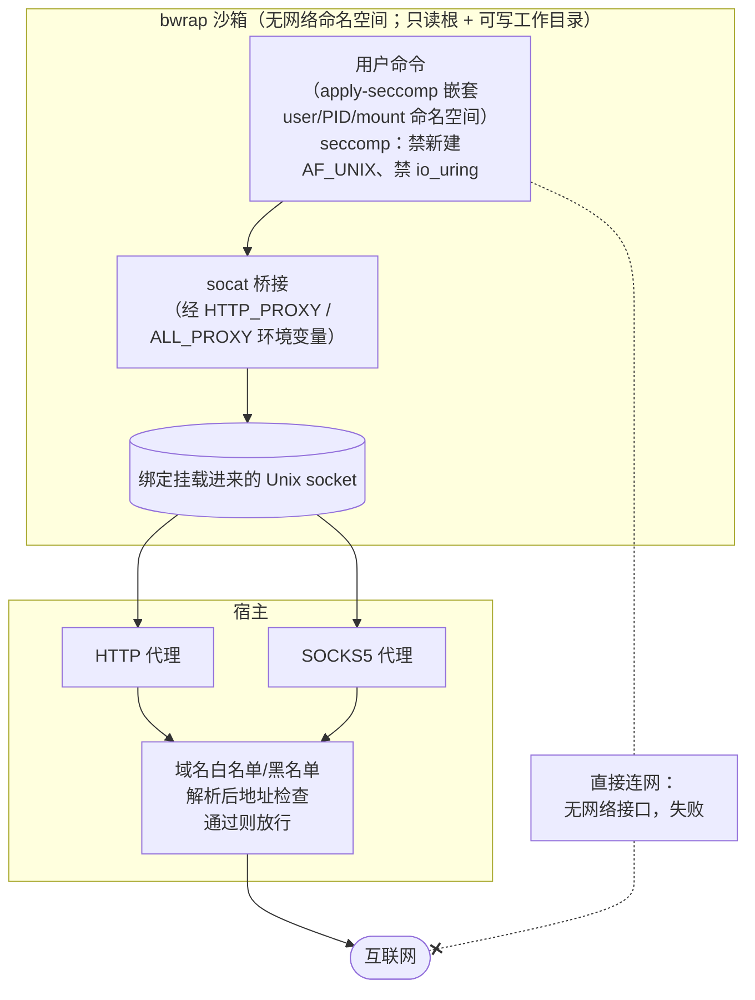
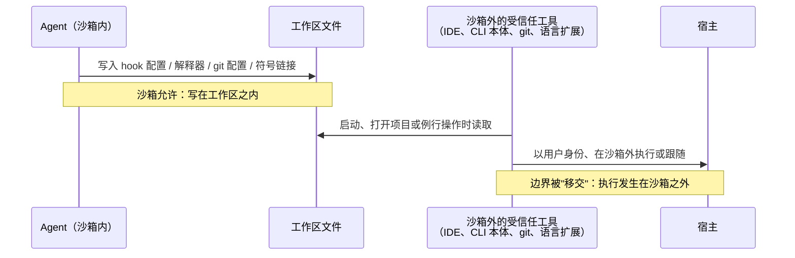

# 第 4 章　OS 原生原语（Seatbelt、bubblewrap、Landlock、seccomp）

## 本章导读

到 2026 年，几乎所有在开发者笔记本上运行的编码 Agent 都把命令放进了某种沙箱：Claude Code、Codex CLI、Cursor、Copilot CLI、Gemini CLI，以及 NVIDIA OpenShell 这类第三方包装器。它们没有选择虚拟机，而是选择了操作系统自带的进程级原语：macOS 上的 Seatbelt，Linux 上的命名空间、bubblewrap、seccomp 与 Landlock，Windows 上的受限令牌与专用账户。这些原语共享宿主内核，隔离强度弱于第 5、6 章的 gVisor 与 microVM（微虚拟机），但启动几乎零开销，又能直接使用开发者本机的工具链。

本章要回答的问题是：共享内核的进程级原语到底能扛住什么？为什么本地 Agent 都选了它们？为什么 2026 年公开的绕过几乎都不是原语被攻破，而是出在原语周围的"策略管道"（policy plumbing）上，也就是代理的字符串解析、被列为"安全"的白名单命令、沙箱内可写而在沙箱外被执行的配置文件。读完本章，读者应能：

- 说清 Seatbelt、命名空间与 bubblewrap、seccomp-BPF、Landlock、Windows 受限令牌各自拦截什么、漏掉什么（表 4-1）；
- 复述 sandbox-runtime（下称 srt）与 Codex CLI 两套开源实现的结构，并理解 Codex Linux 后端的来源冲突如何由仓库文档解决；
- 理解 Landlock 从 ABI 1 到 ABI 11 的演进为什么让"不依赖命名空间的非特权自沙箱"变得可行，以及它在 macOS 上找不到对应物的处境；
- 按"代理解析 / 安全命令 / 信任移交 / 能力型 socket"四类，归纳 2026 年的策略管道失效案例；
- 判断这类原语在产品、评测、训练三种场景下各自适用到哪一步，并使用 4.8 节的本书建议清单。

出站代理的域名匹配、DNS、凭据注入属于第⑦层，第 14 章已经展开，本章只在需要时交叉引用，不再重复。

## 4.1　共享内核的进程级原语能扛住什么

### 4.1.1　四类原语

本章讨论的原语有一个共同点：它们都由宿主内核执行，被沙箱的进程与宿主上其他进程共用同一个内核。按机制可分四类。

**强制访问控制配置。** macOS 的 Seatbelt 是内核里的 TrustedBSD MAC 框架加一种策略语言（SBPL），用户态通过 `sandbox-exec` 把一份 profile 施加到任意进程上（apple/containerization #737；一手文档）。Linux 的 Landlock 是一个安全模块（LSM），允许非特权进程给自己加一组"只能访问这些路径、这些端口"的规则，此后由内核强制执行（Landlock 内核文档；一手文档）。二者都按"对象"（路径、端口、socket）表达策略。

**命名空间。** Linux 的用户、挂载、PID、网络等命名空间让进程看到一个裁剪过的世界。bubblewrap（bwrap）是一个非特权的命名空间封装工具：用绑定挂载拼出文件系统视图，可以移除网络命名空间，可以新建 PID 命名空间并重新挂载 `/proc`。它改变的是"进程能看到什么"，而不是"能做什么"。

**系统调用过滤。** seccomp-BPF 用一段 BPF 程序检查每个系统调用的编号与寄存器参数，决定放行、拒绝或交给用户态处理。它看得到"调用了 `socket(AF_UNIX, …)`"，看不到路径字符串指向哪里（指针参数无法被 BPF 解引用），所以只适合"整类禁用"。

**身份与令牌。** Windows 没有与上述对应的轻量原语。srt 与 Codex 在 Windows 上都采用"换一个身份运行"：以专用本地账户或受限令牌启动子进程，用 NTFS ACL 划定文件边界，用 Windows 防火墙或 Windows Filtering Platform（WFP）按账户 SID 阻断出站（srt README；Codex Windows sandbox 文档；一手文档；见 4.5 节）。

### 4.1.2　共享内核的边界在哪里

这四类原语的共同上限是内核本身。只要沙箱内的进程还能发出内核要处理的系统调用，一个可利用的内核漏洞就能让所有规则同时失效；第 5 章列出的 runc 与内核类逃逸 CVE 正是这一类（见第 5 章）。seccomp 能缩小可达的系统调用面，但本地 Agent 要运行编译器、包管理器、测试框架，过滤器不可能收得很窄。因此本章讨论的原语，防的是"进程按正常语义去读写不该碰的文件、连不该连的地址"，不防"进程利用内核漏洞改写内核状态"。

这个上限决定了它们的适用对象。在本地编码场景里，第 2 章的两类对手中占主导的是"被利用的代理人"：Agent 读到一段带提示注入的网页或 issue，被诱导去读 `~/.ssh`、往外发数据、改 shell 启动文件。这类行为走的是正常语义，原语恰好能拦。至于"作为对手的模型"，也就是主动寻找内核漏洞、长时间试探边界的租户，进程级原语并不是为它设计的（见 4.7 节）。

**表 4-1　进程级原语：拦截什么，漏掉什么**

| 原语 | 主要拦截 | 典型使用者 | 已知盲区与代价 | 依据 |
|---|---|---|---|---|
| Seatbelt（`sandbox-exec`） | 按路径、glob 的文件读写；网络只放行指定 localhost 端口；Apple Events、Mach 服务查找 | srt、Codex、Cursor、Gemini CLI（macOS） | `sandbox-exec` 已弃用且无 CLI 替代；放开 `trustd` 或 Apple Events 会打开外传或代码执行通道；黑名单写法可被绕过（Antigravity） | srt README；#737；BleepingComputer |
| 命名空间 + bubblewrap | 文件系统视图（只读根、可写目录绑定）；移除网络命名空间；PID 隔离、私有 `/proc` | srt、Codex（Linux/WSL2） | 依赖可用的非特权用户命名空间（Ubuntu 24.04+ 默认限制）；在 Docker 内需弱化模式；glob 在包装时展开，之后出现的文件不受覆盖 | srt README；Codex linux-sandbox README |
| seccomp-BPF | 整类禁用系统调用：新建 `AF_UNIX` socket、`io_uring`、`ptrace` 等 | srt、Codex、OpenShell、Sandlock | 看不到路径参数；继承或经 `SCM_RIGHTS` 传入的 socket 描述符不受限；不同架构需不同过滤器 | srt README |
| Landlock（ABI 1–11） | 非特权自限制：文件访问、TCP/UDP 端口、抽象与路径名 UNIX socket、跨域信号 | OpenShell、Sandlock、Codex（旧选项）、Cursor（据第三方） | `chdir`、`stat`、`chmod`、`chown`、`setxattr` 等仍不可限；能力取决于宿主内核的 ABI 版本，须"尽力而为"降级 | Landlock 内核文档；Codex README |
| Windows 受限令牌 / 专用账户 + ACL + 防火墙/WFP | 工作目录外写入；按账户 SID 阻断出站 | srt（alpha）、Codex、Gemini CLI | 系统解析器的 DNS 不受围栏；按用户安装的工具不可达；非提升模式弱于提升模式；Everyone 可写的目录无法保护 | srt README；Codex Windows 文档 |

注：所有原语都共享宿主内核，内核漏洞不在本表的拦截范围内。"典型使用者"中 Cursor、OpenShell 的机制据第三方汇总（digitalapplied、Vaughan；二手报道）。

## 4.2　本地 Agent 的统一做法：原语加宿主侧出站代理

### 4.2.1　为什么本地 Agent 选了原语

本地编码 Agent 的约束与云端沙箱不同。它要在开发者自己的仓库、自己的工具链、自己的依赖缓存上工作；每次工具调用都可能执行一条 shell 命令，一个会话里有成百上千次；而它运行的笔记本往往是 macOS，在那里起一台 VM 意味着额外的镜像、内存，以及一个看不到本机工具链的环境（推断）。在这些约束下，进程级原语有三点好处：包装一条命令的开销接近零；被包装的命令仍然看到本机的真实文件系统（只是部分只读或不可见）；不需要镜像、不需要守护进程。

另一个动机来自可用性。Anthropic 的工程博文报告，Claude Code 引入本地沙箱后权限提示减少了 84%，而在此之前用户批准了约 93% 的权限提示（Anthropic《How we contain Claude across products》，2026-05-25，2026-06-06 修订；一手文档）。93% 的批准率说明逐条确认已经流于形式，即审批疲劳（approval fatigue）。沙箱把"每次问一次"换成"划一道边界、边界内不问"。Codex 文档把两者的分工写成一句话："沙箱定义技术边界，审批策略决定 Agent 何时必须停下来询问，才能越过这些边界"（The sandbox defines technical boundaries. The approval policy decides when the agent must stop and ask before crossing them）（Codex sandboxing 文档；一手文档）。所以，本地沙箱首先是一件可用性工具，其次才是安全工具；它让"默认不问"变得可以接受。

### 4.2.2　srt：一套代码，三种原语

Anthropic 开源的 sandbox-runtime（npm 包 `@anthropic-ai/sandbox-runtime`）是 Claude Code 本地沙箱的实现，README 称其"使用操作系统原生的沙箱原语（macOS 上的 `sandbox-exec`、Linux 上的 bubblewrap）和基于代理的网络过滤"，可用于包装 Agent、本地 MCP 服务器、bash 命令或任意进程；状态为"Beta Research Preview"（srt README，main 分支 HEAD e025055，2026-10-04 读取；一手文档）。npm 上的最新版为 0.0.78，发布于 2026-09-30（npm registry；一手文档）。网络部分的细节见 14.3.1 节，这里只看它如何用原语组织文件系统与进程边界。

**文件系统：读默认放行，写默认拒绝。** 读取采用"先拒后许"：默认处处可读，可以拒绝一大片（如 `/Users`）再重新放行其中的子路径（如当前目录）；写入采用"只许"：默认处处不可写，必须显式列出可写路径，空列表即无写权限。两者的优先级恰好相反：读时 `allowRead` 优先于 `denyRead`（但比所在 `allowRead` 区域更具体的 `denyRead`，如 `**/.env`，仍然生效），写时 `denyWrite` 优先于 `allowWrite`（同上）。这个不对称是有意的：读放得宽是为了让工具链能工作，写收得紧是为了防止 Agent 留下会被别人执行的东西。

**强制拒写路径。** 即使当前目录整体可写，srt 也总是拒绝写入一组路径：shell 配置（`.bashrc`、`.zshrc`、`.profile` 等）、git 配置（`.gitconfig`、`.gitmodules`、`.git/config`、`.git/hooks/`）、IDE 目录（`.vscode/`、`.idea/`）、Claude 配置目录（`.claude/commands/`、`.claude/agents/`）以及 `.mcp.json`、`.ripgreprc`（同上）。这份清单本身就是对 4.6 节"信任移交"的回应：列出的都是沙箱外的受信任程序会自动读取并执行的文件。Linux 上 README 还写明两点加固：尚不存在的强制拒写路径同样被拦住（以只读的 `/dev/null` 或空只读目录占位）；受保护路径的各级祖先目录被做成挂载点，从沙箱内 `mv` 或 `rmdir` 会得到 `EBUSY`，防止"改名父目录再重建"这类绕法（同上）。在子目录里搜索危险文件默认只搜 3 层（`mandatoryDenySearchDepth` 可调）（同上）。

**进程：嵌套命名空间里施加 seccomp。** Linux 上，srt 随包附带为 x64 与 arm64 预编译的静态 `apply-seccomp` 程序。它先建立一层嵌套的用户、PID、挂载命名空间并重新挂载 `/proc`，在其中以 PID 1 身份 fork，用 `prctl()` 施加 seccomp 过滤器，再 exec 用户命令。这样用户命令看不到、也无法 ptrace 任何没有挂上过滤器的辅助进程（bwrap 的 init、shell 包装、socat）；嵌套命名空间建不起来时它选择中止，而不是降级（同上）。过滤器阻断 `socket(AF_UNIX, …)` 与 `io_uring_setup`、`io_uring_enter`、`io_uring_register` 三个系统调用，后者是因为 Linux 5.19 起 `IORING_OP_SOCKET` 可以绕开 `socket()` 规则（同上）。

图 4-1 把 Linux 上的数据通路画在一起。

**图 4-1　srt 在 Linux 上的数据通路：bwrap → Unix socket → socat → 宿主代理**（示意图，依据 srt README 绘制；代理与地址检查细节见 14.3.1、14.1.2 节）

这张图要读出两点。第一，网络边界由"没有网络命名空间"保证，代理只负责语义判断；不遵守代理环境变量的程序会连不上网，而不是绕过去（同上；见 14.3.1 节）。第二，seccomp 禁止新建 `AF_UNIX` socket，是为了不让用户命令另开一条本地 IPC 通道去找宿主上的其他服务；但通往代理的那条 socket 是预先建立、绑定挂载进来的，属于"继承来的描述符"，这正是过滤器管不到的一类（同上）。

**macOS 与 Windows。** macOS 上 srt 用运行时生成的 Seatbelt profile，路径支持类似 `.gitignore` 的 glob；网络只放行代理监听的那个 localhost 端口（同上）。两个开关值得注意：`enableWeakerNetworkIsolation` 为了让 Go 程序校验证书而放开 `com.apple.trustd.agent`，README 警告这会打开经 trustd 服务外传数据的通道；`allowAppleEvents` 放开 Apple Events 与 Launch Services，README 的措辞是"这一选项移除的是代码执行隔离，而不只是削弱它"，因为被拉起的应用完全运行在沙箱之外（同上）。Windows 支持为 alpha，见 4.5 节。

### 4.2.3　Codex CLI：模式、审批与 Linux 后端的来源冲突

Codex CLI 的沙箱分三种模式：`read-only`（可以检查文件，但未经批准不能编辑文件或运行命令）、`workspace-write`（可以读文件、在工作区内编辑、在边界内运行常规命令，文档称其为"本地工作的默认低摩擦模式"）和 `danger-full-access`（不受沙箱限制，移除文件系统与网络边界）；审批策略有 `on-request`（默认在沙箱内工作，需要越界时询问）与 `never`（不停下来询问）两种（Codex sandboxing 文档；一手文档）。平台机制方面，文档写明 macOS 用"内置的 Seatbelt 框架"，Linux 与 WSL2 用 bubblewrap（依赖非特权用户命名空间），Windows 的 PowerShell 环境用"原生 Windows 沙箱"，WSL2 用 Linux 实现（同上）。

研究阶段登记过一个**冲突**：官方文档只提 bubblewrap，第三方对比文则称 Codex 的 Linux 后端是"Bubblewrap + Landlock + Seccomp"（Vaughan，2026-04-24，2026-10-03 更新；二手报道）。本次读取 openai/codex 仓库中 `codex-rs/linux-sandbox/README.md`（main 分支，2026-10-04；一手文档），可以把这个冲突说清楚：

- "Bubblewrap 是默认的文件系统沙箱"；优先使用 `PATH` 上（且不在当前工作目录内）的 `bwrap`，找不到时回退到随 Codex 分发的 bwrap；WSL1 因无法创建所需的用户命名空间而不受支持。
- "受文件系统限制的执行需要 bubblewrap。旧的 Landlock 选项对这些策略会被拒绝，因为它无法隔离 app-server 的 Unix socket。升级时请关闭 `features.use_legacy_landlock`。"
- bubblewrap 生效时，辅助程序在进程内施加 `PR_SET_NO_NEW_PRIVS` 与一个 seccomp 网络过滤器；根目录以 `--ro-bind / /` 只读挂载，可写根目录再以 `--bind` 叠加；可写根之下的受保护子路径（如 `.git`、解析出的 `gitdir:`、`.codex`）重新以只读绑定；路径中的符号链接与尚不存在的受保护路径用 `/dev/null` 占位封住。
- 网络受限而不经代理时，用 `--unshare-net` 隔离网络命名空间；在托管代理模式下，用 `--unshare-net` 加一个内部"TCP→UDS→TCP"的路由桥，桥建好后由 seccomp 禁止用户命令新建 `AF_UNIX` 与 `socketpair`。

- 默认用 `--unshare-pid` 新建 PID 命名空间并挂载新的 `/proc`；受信任的部署方可以在启动时用 `--linux-sandbox-pid-namespace=inherit` 让沙箱沿用调用方的 PID 命名空间，此时"被沙箱的命令可以向同一 UID 的其他进程发信号，包括执行器本身"。README 特别写明这是"仅限启动时"的设置，"仓库配置与命令环境变量都不能开启它"。

最后一条说明 Codex 的设计者清楚地区分了两类配置来源：部署方在启动时给出的参数是可信的，仓库里的配置文件与命令环境变量则可能是 Agent 自己写下的，因此不能用来放宽沙箱。这正是 4.6.3 节"信任移交"问题的反面：凡是能放宽边界的开关，都不应从沙箱可写的位置读取（推断）。

由此可以判断：Landlock 曾是 Codex Linux 后端的组成部分，现已降为需显式开启的旧选项；当前默认实现是 bubblewrap 加 seccomp（推断，依据仓库 README；第三方说法可能反映较早的设计）。两点值得注意。其一，Codex 放弃 Landlock 的理由是"无法隔离 Unix socket"，而 Landlock 恰在 ABI 6（Linux 6.12）与 ABI 9（Linux 7.1）才分别加入抽象与路径名 UNIX socket 的限制（见 4.3.3 节），这说明一个原语能不能用，取决于用户的内核停在哪个 ABI（推断）。其二，Codex 在托管代理模式下的结构（移除网络命名空间、经 Unix socket 桥接到代理、桥建好后禁止新建 `AF_UNIX`）与图 4-1 的 srt 几乎同构，两家独立实现收敛到了同一个设计（推断）。

### 4.2.4　其他本地 Agent 与包装器

表 4-2 汇总主要本地 Agent CLI 与包装器的沙箱形态。凭据可读性与默认开关等细项，多数来自第三方汇总，应按日期理解。

**表 4-2　本地 Agent CLI 沙箱对照（截至 2026-10-04）**

| 产品 | macOS | Linux | Windows | 默认是否开启 | 网络默认 | 文件系统默认与受保护路径 | 来源与类型 |
|---|---|---|---|---|---|---|---|
| Claude Code（srt） | Seatbelt | bubblewrap + seccomp | srt 为 alpha（专用账户 + WFP）；第三方称 Claude Code 在 Windows 上不支持沙箱 | 沙箱模式开启时生效 | 拒绝，无预置放行域名 | 写：工作目录等；读：除拒绝目录外全机可读；强制拒写见 4.2.2 节 | srt README（一手）；digitalapplied（二手）称默认仍可读 `~/.aws/credentials`、`~/.ssh/` |
| Codex CLI | Seatbelt（动态生成 SBPL） | bubblewrap + seccomp（Landlock 为旧选项） | 提升模式：专用低权限沙箱用户 + 防火墙；非提升模式：受限令牌 + ACL | `workspace-write` 为默认低摩擦模式 | 关闭（文档：上网或越出工作区前询问）；`network_access` 为开/关，另有托管代理模式（`features.network_proxy`，据第三方） | `.git`、`.codex` 等只读重绑定；第三方称 `.agents` 亦递归只读 | Codex 文档与仓库（一手）；Vaughan、digitalapplied（二手） |
| Cursor | Seatbelt | Landlock 或 bubblewrap | 未核实 | 开启（据第三方） | `networkPolicy.default = "deny"`；RFC 1918、127.x、169.254.169.254 默认阻断 | 始终保护 `.cursor/*.json`、`.git/hooks/**`、`.vscode/**`、`.claude/*.json`；`~/.ssh` 始终可读 | digitalapplied（二手） |
| GitHub Copilot CLI | OS 强制（机制未写明） | OS 强制（机制未写明） | 原生 Windows 沙箱（据第三方） | 未核实（第三方汇总未写明默认开关） | 默认开启 | 默认拒绝，自动授予 cwd、工具链与只读包缓存；默认在输出中脱敏 `GITHUB_TOKEN` 等 | digitalapplied（二手） |
| Gemini CLI | Seatbelt（6 个 profile，默认 `permissive-open`） | Docker/Podman、gVisor（runsc）、LXC（实验） | 原生沙箱（用 `icacls` 设置完整性级别） | **默认关闭**，需 `-s`、`GEMINI_SANDBOX` 或 settings 开启 | 默认 profile 允许网络 | 默认 profile 限制写、读宽 | Gemini CLI 文档（一手） |
| NVIDIA OpenShell | 不支持 | Landlock + seccomp；声明式 YAML 策略 | 不支持 | 包装器，包裹未修改的 Claude Code、Codex、OpenCode | 按二进制、目标、方法、路径的出站规则，可热加载 | 文件与进程策略在创建时锁定 | Vaughan（二手），2026-04 时仅 Linux |
| Docker Sandboxes（`sbx`） | microVM（独立内核） | microVM | — | 包装器 | Open / Balanced / Locked Down 三档 | 凭据经代理注入，VM 内不可见；内存默认为宿主 50% | Vaughan（二手）；Docker 博客 2026-09-24 |

注：Copilot CLI、Cursor 的条目全部来自 digitalapplied 2026-08-30 的汇总，本书未读到两家的一手文档；Copilot CLI 网络"默认开启"一项以该汇总为准并标二手。Docker sbx 是本表中唯一不用进程级原语的方案，列入是为了对照（见 4.4 节）。

从表中可以读出三点。第一，Seatbelt 在 macOS 上是唯一的共同选择，没有一家找到替代（见 4.4 节）。第二，Linux 上的组合出现了分化：srt 与 Codex 以 bubblewrap 为主，OpenShell 与（据第三方的）Cursor 用到 Landlock，Gemini CLI 则直接用容器或 gVisor；后者已经越出本章"进程级原语"的范围。第三，"默认开不开"与"默认能不能读凭据"比"用什么原语"差异更大：Gemini CLI 默认不开沙箱，Claude Code 与 Cursor 据第三方默认仍可读 `~/.ssh`，Copilot CLI 默认放行网络但脱敏令牌。对第 2 章的"被利用的代理人"而言，这些默认值才是实际的防线位置（推断）。

## 4.3　Linux 原语细读

### 4.3.1　命名空间与 bubblewrap：可用性是第一个问题

bubblewrap 不需要 root，但需要内核允许非特权进程创建带能力的用户命名空间。srt 的 README 专门提醒：Ubuntu 24.04 及以后版本默认开启 `kernel.apparmor_restrict_unprivileged_userns`，允许 `unshare(CLONE_NEWUSER)`，但会剥夺新命名空间中的能力，而 bubblewrap 与 seccomp 隔离层都需要带能力的用户命名空间（srt README；一手文档）。Codex 的仓库文档同样写明，bubblewrap 无法创建用户命名空间时会在启动时给出警告（Codex linux-sandbox README；一手文档）。这意味着同一个 Agent 在不同发行版、不同加固配置下，沙箱可能根本没有生效；"沙箱是否真的在工作"必须在启动时检查并告知用户。

第二个可用性问题是嵌套。在 Docker 容器里，通常没有创建特权命名空间的条件，srt 为此提供了 `enableWeakerNestedSandbox`，README 的评价是这一选项"显著削弱安全性，只应在已有其他隔离的情况下使用"（srt README；一手文档）。云端开发环境与 CI 大多运行在容器里，恰好是最需要这个开关的地方。

第三是 glob 的时间语义。bubblewrap 绑定的是具体路径，srt 在 Linux 上把读拒绝的 glob 在包装命令的那一刻展开，"之后才出现的文件不受覆盖"；写入列表根本不接受模式（srt README；一手文档）。macOS 的 Seatbelt profile 直接写 glob，没有这个问题。同一份配置在两个平台上的保护范围并不相同。

### 4.3.2　seccomp-BPF：只能"整类禁用"

seccomp 在本地 Agent 沙箱里的角色很窄：禁止新建 Unix socket，禁止 `io_uring`，有时禁止 `ptrace`。原因在于 BPF 过滤器看不到指针参数指向的内容，因而无法按路径放行某一个 socket。srt 的配置表把这一点写得很直白：`allowUnixSockets` 白名单在 Linux 上"被忽略（seccomp 不能按路径过滤）"，若要放行只能用 `allowAllUnixSockets` 整体关闭拦截；若平台不支持 seccomp（x64、arm64 之外），socket 不受限并给出警告（srt README；一手文档）。

`io_uring` 一例说明了 seccomp 的另一个弱点：它按系统调用编号工作，而内核不断增加"用另一个入口做同一件事"的路径。Linux 5.19 起 `IORING_OP_SOCKET` 能在 `io_uring` 的提交队列里创建 socket，如果只过滤 `socket()`，这条路就是绕过（同上）。维护一份 seccomp 过滤器，需要持续跟踪内核新增的间接入口（推断）。

### 4.3.3　Landlock：ABI 1 到 ABI 11

Landlock 让非特权进程给自己加规则，不需要命名空间，也不需要 root。它首次出现在 Linux 5.13，且须在编译时开启 `CONFIG_SECURITY_LANDLOCK=y`（Landlock 内核文档；一手文档）。此后能力按 ABI 版本递增，应用通过 `landlock_create_ruleset()` 的 `LANDLOCK_CREATE_RULESET_VERSION` 标志读出内核支持的最高 ABI。文档建议"尽力而为"：因为不知道程序会跑在哪个内核上，应按可用 ABI 尽量多地施加限制（同上）。

**表 4-3　Landlock ABI 能力演进**

| ABI | 新增能力（文档原意） | 对 Agent 沙箱的意义 | 对应内核版本 |
|---|---|---|---|
| 1 | 文件系统访问控制（读、写、执行、建删等） | 不靠挂载命名空间也能把写限制在工作区 | Linux 5.13（一手文档） |
| 2 | `LANDLOCK_ACCESS_FS_REFER`：跨目录链接或改名 | 堵住"把文件挪出受限目录" | 5.19 |
| 3 | `LANDLOCK_ACCESS_FS_TRUNCATE` | 截断也算写 | 6.2 |
| 4 | `LANDLOCK_ACCESS_NET_BIND_TCP`、`…_CONNECT_TCP` | 首次能按 TCP 端口限制绑定与连接 | 6.7 |
| 5 | `LANDLOCK_ACCESS_FS_IOCTL_DEV`：设备 ioctl | 限制对设备文件的 ioctl | 6.10 |
| 6 | 作用域：`LANDLOCK_SCOPE_ABSTRACT_UNIX_SOCKET`、`LANDLOCK_SCOPE_SIGNAL` | 禁止连接域外进程创建的抽象 UNIX socket、禁止向域外进程发信号 | 6.12 |
| 7 | 审计日志控制 | 可观测性 | 6.15 |
| 8 | 规则集作用于进程的全部线程 | 多线程程序的自限制不再有遗漏线程 | 7.0 |
| 9 | `LANDLOCK_ACCESS_FS_RESOLVE_UNIX`：路径名 UNIX socket 的 `connect` 与 `sendmsg` | 首次能按路径限制连到 `docker.sock` 一类的 socket | 7.1 |
| 10 | UDP 本地端口与远端端口的限制；"quiet"规则 | 补上 UDP（含自发的 DNS 查询） | 7.2 |
| 11 | `LANDLOCK_RESTRICT_SELF_NO_NEW_PRIVS`：仅在施加成功时设置 no_new_privs | 减少"规则没加上却以为加上了"的窗口 | 7.3（开发中） |

注：ABI 内容据 docs.kernel.org Landlock 页面（2026-10-04 读取；页面日期 2026 年 8 月）。文档只写明 Linux 5.13 一个版本号；其余各行的内核版本据独立核对逐个 tag 读取 torvalds/linux `security/landlock/syscalls.c` 中的 ABI 版本常量（v6.16–v6.19 仍为 ABI 7；ABI 11 见于主线 master，2026-10-04 为 7.3-rc6；一手文档，内核源码）。

这张表说明了两件事。第一，Landlock 从 5.13 到 7.3 的十余个内核版本里，从"只管文件"扩展到 TCP、UDP、抽象与路径名 UNIX socket、信号，覆盖了本地 Agent 沙箱需要的大部分维度。过去需要"挂载命名空间 + 网络命名空间 + seccomp"三件套才能表达的策略，在新内核上可以用一个不需要命名空间的自限制规则集表达（推断）。这在容器里尤其重要：容器里往往建不起嵌套的用户命名空间，bubblewrap 只能退到弱化模式，而 Landlock 不受这个限制（推断，依据 4.3.1 节）。第二，能力取决于宿主内核。ABI 9（Linux 7.1）之前，Landlock 无法按路径限制到 `docker.sock` 这类路径名 UNIX socket 的连接，Codex 拒绝旧 Landlock 选项的理由（"无法隔离 Unix socket"）正落在这个缺口上（推断）。

Landlock 的盲区同样写在文档里："目前无法限制通过以下系统调用族进行的某些文件相关操作：`chdir`、`stat`、`flock`、`chmod`、`chown`、`setxattr`、`utime`、`fcntl`、`access`"（Landlock 内核文档；一手文档）。换句话说，它能拦住"写这个文件"，拦不住"探测这个文件是否存在、属于谁"；网络规则也只覆盖 TCP 与 UDP 端口（同上）。

### 4.3.4　进程级 CoW fork：Sandlock

Landlock 加 seccomp 不创建命名空间，也不破坏页表共享，这就让"进程级写时复制（CoW）fork"成为可能。Multikernel 的 Sandlock 用 Landlock 做文件与网络控制、seccomp-bpf 做系统调用过滤、seccomp 用户通知做资源限制；模板进程初始化一次后进入等待循环，调用 `sb.fork(N)` 时用原始 `fork(2)` 连续 fork N 次，每个克隆继承模板的 Landlock 规则集与 seccomp 过滤器（"子进程无法移除"）以及堆、栈、文件描述符的 CoW 共享（Sandlock 博文，2026-03-19；厂商自报）。博文给出的数字是 1,000 个克隆耗时 718 ms、每个克隆约 4 KB 内存；要求 Linux 5.13+，"无需 root、cgroup、容器运行时或 CRIU"；主打场景是 RL 训练中对大量候选程序的评估（同上）。

两点需要注意。其一，博文同时给出容器"约 200 s、2 GB/克隆"与 microVM"约 150 s、2 GB/克隆"的对比，测试条件未说明，量级与第 6 章的一手规格相差悬殊，疑似稻草人对比，本书不引用。其二，每克隆约 4 KB 只是 fork 当下新增的页表与内核结构，克隆开始写内存后 CoW 会复制页面，实际占用取决于负载（推断）。进程级 fork 与第 11 章的 VM 快照 fork 解决的是同一个问题（初始化一次、复制多次），隔离强度却差了一档（见第 11 章）。

### 4.3.5　训练侧的同类做法：SWE-MiniSandbox

把命名空间用于 RL 训练的代表是 SWE-MiniSandbox（arXiv 2602.11210；ICML 2026 已录用）。它用"每实例的挂载命名空间与基于 chroot 的文件系统隔离"代替每任务一个容器（SWE-MiniSandbox；论文自述）；在 SWE-smith 上存储约为容器流水线的 5%（13.5 GB 对 295 GB），环境准备时间约为 25%（23.62 s 对 88.86 s），RL 训练效果与容器方案相当（同上）。5% 只对 SWE-smith 成立，机制、各数据集口径与规模限制见 8.4.1 节。

作者对边界的表述很克制："隔离边界比完整容器或 VM 更轻，因此不太适合运行不可信或可能恶意的代码"；网络隔离"可用，但不如 Docker 的网络栈灵活"；跨平台支持有限（同上）。这句话正好可以作为 4.7 节的引子：同一组原语，在本地产品里防的是被诱导的 Agent，在训练集群里面对的却是第 2 章所说的"作为对手的模型"。SWE-MiniSandbox 的完整讨论见第 8 章。

## 4.4　macOS 的困境：弃用而无替代

macOS 上所有本地 Agent 都依赖 `sandbox-exec`，而这个命令已经被 Apple 标为弃用。apple/containerization 仓库的 issue #737 题为"澄清 `sandbox-exec` 的弃用时间表，并为非 App Store 进程沙箱提供替代"，状态为开放。它的论点是：`sandbox-exec` 是"在 macOS 上不注册 App Store、不使用 Xcode entitlement 而把 Seatbelt（TrustedBSD MAC）策略施加到任意用户态进程上的唯一有文档的机制"，却被标为弃用且没有面向无界面场景的替代（apple/containerization #737；一手文档）。提问者列出三种可接受的结果：一个接受 Seatbelt profile、不需要 App Sandbox entitlement 的受支持 C API；Apple Containerization 提供不经 Linux VM 的原生进程沙箱模式；或者公布弃用时间表（同上）。截至 2026-10-04 读取时，讨论中只有一位社区成员提到已提交反馈报告 FB24765111，没有 Apple 维护者的回应（同上）。Codex 仓库也有 issue 指出 `sandbox-exec` 早已弃用（openai/codex #215；一手文档）。

App Sandbox 并不适合作为替代：它要求代码签名与 entitlement，面向的是打包分发的应用，而不是开发者在终端里随手调用的任意命令（apple/containerization #737；本书归纳）。于是 macOS 上出现了一个尴尬的局面：一类日益重要的软件，其安全边界建立在一个官方不再推荐、却也没有移除时间表的接口上。

这种不确定性可能是一部分厂商转向虚拟机的原因之一（推断；所引来源均未说明其 VM 选择与 `sandbox-exec` 弃用有关）。Docker Sandboxes 在本地也用 microVM，"Agent 运行在一台有自己内核和 Docker 守护进程的 microVM 里"（Docker 博客，2026-09-24；一手文档）；Anthropic 的 Cowork 运行在完整 VM 里，只挂载用户选定的工作区与 `.claude` 目录，"宿主上的其他东西都不可见"，凭据留在宿主 keychain（《How we contain Claude》；一手文档；凭据位置见第 21 章）。这些方案用 Apple Virtualization framework 拿到了比 Seatbelt 更清楚的边界，代价是启动时间、内存与"Agent 看不到本机工具链"（推断）。对必须使用本机环境的编码 Agent，Seatbelt 仍是唯一选择。

Seatbelt 的另一个问题是 profile 的写法。Pillar Security 报告的 Google Antigravity 案例之一是"macOS Seatbelt denylist 绕过"（BleepingComputer，2026-07-20；二手报道；细节未披露）。以黑名单组织 profile，意味着凡是没想到的路径都默认放行；srt 对写入采用"只许"模式，正是为了避免这一点（推断）。Gemini CLI 的默认 profile 名为 `permissive-open`，即"限制写入、允许网络"，另有 `restrictive-*`、`strict-*` 与 `*-proxied` 共六种（Gemini CLI 文档；一手文档）；文档建议"使用能完成工作的最严格 profile"，但默认值是最宽的那一档（同上）。

## 4.5　Windows：换一个身份运行

Windows 上没有 Seatbelt 或 Landlock 这样的自限制原语，现有实现都把被沙箱的命令放到另一个安全主体下运行。

srt 的 Windows 支持为 alpha。它以专用本地账户 `srt-sandbox` 运行被沙箱的命令：随包附带的 `srt-win.exe` 先以 `CreateProcessWithLogonW` 启动一个以该账户运行的 runner，再由 runner 在一个作业对象（job object）里以受限令牌启动目标进程（srt README；一手文档）。网络边界是一组 WFP 过滤器：放行到代理端口范围（默认 60080–60089）的回环连接，阻断令牌带 `srt-sandbox` SID 的其余连接；文件边界是 NTFS ACL，`initialize()` 时只为该 SID 追加可继承的显式 ACE，不改写原有安全描述符（同上）。README 认为，换成独立 SID 在结构上关闭了"借代理进程派生"一类逃逸（任务计划程序、BITS、以交互用户身份运行的进程外 COM 等），因为带外派生的进程仍然带着 `srt-sandbox` SID（同上）。已知局限包括：系统解析器的 DNS 不受围栏（与 macOS 一致）；装在用户目录下的工具（nvm 管理的 Node、`pip install --user` 等）对沙箱账户不可达；`proxyAuthToken` 出现在 runner 的命令行参数里（同上；网络相关部分见 14.1.5、14.4 节）。

Codex 的原生 Windows 沙箱分两种模式（Codex Windows sandbox 文档；一手文档）：

- **提升模式（elevated）**："使用专用的低权限沙箱用户、文件系统权限边界、防火墙规则，以及沙箱内命令所需的本地策略修改"；网络靠"专用离线用户的防火墙规则"。第三方称两个账户名为 `CodexSandboxOffline` 与 `CodexSandboxOnline`（Vaughan；二手报道）。
- **非提升模式（unelevated）**："以从当前用户派生的受限 Windows 令牌运行命令，施加基于 ACL 的文件系统边界，并用环境层面的离线控制代替专用离线用户的防火墙规则"；文档明确说它"弱于提升模式"。

文档还警告，如果某些文件夹对 Everyone 可写，"这些文件夹上的 Windows 权限过宽，沙箱无法完全保护它们"（同上）。Gemini CLI 的 Windows 原生沙箱则用 `icacls` 设置完整性级别（Gemini CLI 文档；一手文档）。

研究阶段的缺口是"Codex 在 Windows 上到底用 Windows Sandbox 虚拟机、AppContainer 还是受限令牌"。本次核对的结论是：Codex 官方文档描述的是专用沙箱用户与受限令牌两种做法，两份一手文档（Codex、srt）都**没有提到 AppContainer**；文档中的"原生 Windows 沙箱"不是 Microsoft 的 Windows Sandbox 虚拟机功能（推断，依据文档对机制的描述）。三家的共同点是以身份为边界：文件靠 ACL，网络靠按 SID 的防火墙或 WFP。

## 4.6　失效在策略管道

笔者归纳，2026 年公开的本地 Agent 沙箱问题几乎没有一例是 Seatbelt、bubblewrap、seccomp 或 Landlock 本身被攻破，出问题的都是原语周围的配套逻辑（推断）。本书把这层配套逻辑称为策略管道：把用户意图翻译成原语规则、在沙箱边界上做语义判断、在沙箱之外消费沙箱产物的那些代码与约定。下面按四类归纳：代理解析、安全命令、信任移交、能力型 socket。这是本书的分类，不是 Pillar Security 的分类。Pillar 报告的 7 项发现分属 4 种失效模式：跟不上操作系统的黑名单（denylist）沙箱、实为可执行代码的工作区配置、按名字信任的"安全"命令白名单、沙箱外的特权本地守护进程（Pillar Security，2026-07-20；据核对转录）。其中第一种落在原语配置层（见 4.4 节 Antigravity 一例），这是"原语本身没有被攻破"这一判断的边界。

### 4.6.1　代理解析：名字与字符串

第一类发生在出站代理的字符串处理上，第 14 章已经详述，这里只列要点。

- **SOCKS5 空字节。** 研究者 Aonan Guan 发现，策略只允许 `*.google.com` 时，主机名 `attacker-host.com\x00.google.com` 能让过滤器看到结尾的 `.google.com` 而放行，操作系统却在空字节处截断、拨向 `attacker-host.com`（SecurityWeek，2026-05-20；The Register，2026-05-20；二手报道）。时间线两说并列：研究者称自 2025-10-20 沙箱上线起存在、直到 4 月发布的 2.1.90；Anthropic 称在收到 2026-04-03 的 HackerOne 报告前已自行修复，修复见于 2026-03-27 对 srt 的公开提交，随 2026-03-31 的 Claude Code 2.1.88 发布；没有分配 CVE（同上；详见 14.1.2 节）。
- **空白名单等于不设防。** 同篇报道提到另一位研究者的绕过已获得 CVE-2025-66479（同上）。CVE 记录写道："由于沙箱逻辑中的缺陷，当沙箱策略没有配置任何允许的域名时，sandbox-runtime 没有正确执行网络沙箱"；影响 0.0.16 之前的版本，CVSS 1.8，2025-12-04 发布（CVE-2025-66479 记录；一手文档）。"一个都不允许"被实现成了"不限制"，是策略翻译层最朴素的错误。

### 4.6.2　"安全"的白名单命令

第二类发生在审批层。为了减少提示，Agent 会把一批只读命令列为"安全"，免于确认或允许在沙箱外执行。Pillar Security 发现，Codex 的"安全"命令白名单按名字信任 `git show`，但 `git show` 接受的参数可以让它做非只读的事；该问题在 Codex v0.95.0 修复，并获得高危级别的漏洞赏金（BleepingComputer，2026-07-20；二手报道）。一条命令是否只读，取决于它的全部参数、配置文件与环境变量，而不是它的名字；按名字放行等于把一个图灵完备的接口当成了只读接口（推断）。

### 4.6.3　信任移交：沙箱内写，沙箱外执行

第三类是本章的重点。这类问题常被称为信任移交（trust handoff），这个名字出自 CSA 研究笔记的标题"AI Coding Agent Sandbox Escapes: The Trust Handoff Flaw"（CSA，2026-07-22；二手报道），BleepingComputer 与 Pillar 原文都没有使用这个词。BleepingComputer 的概括是："Agent 待在沙箱里、遵守每一条规则。它只是写下一个文件，由沙箱外受信任的工具在之后运行、加载或扫描，逃逸就自行发生了"（The agent stays inside the box and follows every rule. It just writes a file that a trusted tool outside the box later runs, loads, or scans）；IDE 与 CLI Agent 不断在沙箱外运行自己的工具，例如解析解释器的 Python 扩展、扫描仓库的 Git 集成、运行任务文件的 VS Code、触发命令的 hook 引擎（BleepingComputer，2026-07-20；二手报道）。Pillar 自己把这一类归为"实际上是可执行代码的工作区配置"（workspace config that is really executable code）。更早的命名来自 Cymulate：BleepingComputer 提到它在 2026 年 4 月已把 Claude Code、Gemini CLI 与 Codex CLI 中的同类问题称为"基于配置的沙箱逃逸"（Configuration-Based Sandbox Escape）（同上）。沙箱允许 Agent 写工作区，这本来就是它的工作；问题在于工作区里有些文件不是数据，而是会被别的程序执行的配置。

**图 4-2　信任移交的一般形态**（示意图，依据 BleepingComputer 对 Pillar Security 报告的转述与 4.6.3 节所列 CVE 记录绘制；"信任移交"一名取自 CSA 研究笔记标题）

2025–2026 年的公开案例可以按"被移交的是什么"分组：

- **hook 与项目配置。** CVE-2026-48124：3.0.0 之前的 Cursor Desktop"可能在没有专门用户批准的情况下，执行工作区在 `.claude/settings.local.json` 中定义的 Claude hook 命令"，CVSS 8.5，2026-06-15 发布（CVE-2026-48124 记录；一手文档）。早一年的 CVE-2025-59536 属于同一类：1.0.111 之前的 Claude Code"可能被诱使在用户接受启动时的信任对话框之前，执行项目中包含的代码"，CVSS 8.7，2025-10-03 发布（CVE-2025-59536 记录；一手文档）。Check Point 的文章同时披露了 CVE-2025-59536（远程代码执行）与 CVE-2026-21852（API 凭据外传，CVSS 5.3），并称所述漏洞均在公开前修复（据 TechRadar 2026-02-26 转述；Check Point 原文未能抓取，二手报道）。API token 外传应归于 CVE-2026-21852，而不是 CVE-2025-59536。
- **解释器与语言扩展。** Cursor 中 Agent 可以改写编辑器 Python 扩展在发现解释器时会执行的 virtualenv 文件（BleepingComputer；二手报道）。
- **版本控制元数据。** 放在 `.git` 目录之外的恶意 git 配置可以触发 fsmonitor 执行，绕过按路径的保护规则（同上）。这说明"保护 `.git/hooks`"不足以保护 git：git 会从多个位置读取配置，其中一些配置项本身就是命令（推断）。
- **编辑器任务。** Google Antigravity 的 `.vscode` 任务配置可以绕过其 Secure Mode；Google 认为该问题与前述 Seatbelt 黑名单绕过都"难以利用"，因为需要社会工程（同上）。
- **符号链接。** CVE-2026-39861："Claude Code 的沙箱没有阻止被沙箱的进程创建指向工作区外的符号链接；当 Claude Code 随后写入这样一个符号链接内的路径时，其**未被沙箱的**进程跟随链接，在未经用户确认的情况下写到了工作区外的目标"；影响 2.1.64 之前的版本，CVSS 7.7，2026-04-21 发布（CVE-2026-39861 记录；一手文档）。这里被移交的不是可执行配置，而是"路径解析"本身：沙箱内造链接，沙箱外的 Agent 本体去写。

把这几例放在一起看，失效点都不在原语：Seatbelt 或 bubblewrap 都如实执行了"工作区可写"这条规则。失效在于规则的语义与真实的信任关系不一致。工作区不是一块同质的"数据区"，其中混着会被沙箱外程序执行的配置、会被沙箱外程序跟随的链接。srt 的强制拒写清单与 Codex 的只读重绑定，都是在用"枚举危险文件"的办法修补这种不一致；Pillar 给出的思路则不同：它的修复"不是又一份禁用文件名清单"，而是"在受信任的本地工具运行 Agent 写下的东西的那一刻加以监视"（Pillar's fix is not another list of banned filenames. It watches the moment a trusted local tool runs something the agent wrote）（BleepingComputer；二手报道）。CSA 研究笔记同时指出，没有任何厂商公告或 Pillar 文章描述过沙箱外组件消费 Agent 写下的文件时会触发告警（CSA；二手报道，未能回原文核对）。两种思路各有局限：枚举永远追不上新出现的配置入口（git 的 fsmonitor 就不在多数清单里），而"在执行时刻监视"要求覆盖每个下游工具的执行点（推断）。

### 4.6.4　能力型 Unix socket：Docker socket

第四类是把一个"能力"放进沙箱。Pillar 报告 Codex、Cursor 与 Gemini CLI 都存在 Docker socket 暴露的问题：沙箱内进程能访问特权的本地守护进程，从而在沙箱外执行代码；在 macOS 上，需在网络开启时经 Docker 守护进程用 VirtioFS 挂载越界（Pillar Security，2026-07-20；据独立核对转录）。三家的处置不同：只有 Cursor 修复并评为高危（GHSA-v4xv-rqh3-w9mc）；OpenAI 支付了赏金，但定为 informational、不发 CVE；Google 认为 Gemini CLI 的这一风险已有文档说明，不视为漏洞（同上）。BleepingComputer 写"该问题现已修复"，概括过宽，与 Pillar 原文不符；CSA 也称 OpenAI 与 Google 没有修复各自的暴露面（CSA；二手报道）。srt 的 README 早已把这条写进安全局限：`allowUnixSockets` 若放行 `/var/run/docker.sock`，"实际上就等于通过利用 Docker socket 授予了对宿主系统的访问"（srt README；一手文档）。Docker socket 不是一条通信通道，而是一份 root 等价的授权；在 Linux 上它又恰好是 seccomp 无法按路径区分、Landlock 要到 ABI 9 才能按路径限制的那类对象（见 4.3.2、4.3.3 节）。

### 4.6.5　srt 自列的局限与 2026 年案例表

srt 的 README 自己列出了一组局限，可以视为策略管道风险的官方清单：代理只按域名限制，"不检查经过代理的流量内容"，宽泛的域名（如 `github.com`）可能被用来外传，某些情况下可通过域前置绕过；放行 Unix socket 可能导致提权；对 `$PATH` 中的目录、系统配置目录或 shell 配置文件授予过宽的写权限，可能导致在其他安全上下文中执行代码；`enableWeakerNestedSandbox` 显著削弱安全性；seccomp 管不住继承或经 `SCM_RIGHTS` 传入的 socket 描述符（srt README；一手文档）。

**表 4-4　2025–2026 年本地 Agent 沙箱的策略管道失效案例**

| 案例 | 产品 | 类别 | 机制 | 处置 | 来源与类型 |
|---|---|---|---|---|---|
| SOCKS5 空字节 | Claude Code / srt | 代理解析 | `attacker-host.com\x00.google.com` 通过 `*.google.com` 匹配 | 2026-03-27 提交，2.1.88（Anthropic 说法）；研究者称至 2.1.90；无 CVE | SecurityWeek（二手） |
| CVE-2025-66479 | srt < 0.0.16 | 代理解析 / 策略翻译 | 未配置任何允许域名时网络沙箱未生效 | 0.0.16；CVSS 1.8 | CVE 记录（一手） |
| `git show` 白名单 | Codex | 安全命令 | 按名字信任，参数可做非只读操作 | v0.95.0 | BleepingComputer（二手） |
| CVE-2026-48124 | Cursor < 3.0.0 | 信任移交（hook） | 执行工作区 `.claude/settings.local.json` 中的 hook | 3.0.0；CVSS 8.5 | CVE 记录（一手） |
| virtualenv 改写 | Cursor | 信任移交（解释器） | 改写语言扩展会执行的解释器文件 | BleepingComputer 未写明；CSA 称 Cursor 3.1.2 修复 | BleepingComputer、CSA（二手） |
| git fsmonitor | Cursor | 信任移交（git 元数据） | `.git` 外的 git 配置经 fsmonitor 触发执行，绕过路径规则 | Cursor 3.0.0 修复；CVE 待分配 | BleepingComputer（二手） |
| `.vscode` 任务 / Seatbelt 黑名单 | Google Antigravity | 信任移交 / 原语配置 | 任务配置绕过 Secure Mode；黑名单式 profile 被绕过 | Google 评为"难以利用" | BleepingComputer（二手） |
| Docker socket | Codex、Cursor、Gemini CLI | 能力型 socket | 访问特权守护进程即可在沙箱外执行 | 仅 Cursor 修复（GHSA-v4xv-rqh3-w9mc）；OpenAI 定为 informational（付赏金）；Google 视为已记载风险、不修 | Pillar Security 原文（研究方披露，据核对转录）；srt README（一手）；BleepingComputer 称"已修复"，与原文不符 |
| CVE-2025-59536 | Claude Code < 1.0.111 | 信任移交（项目文件） | 在信任对话框被接受前执行项目中的代码 | 1.0.111；CVSS 8.7 | CVE 记录（一手）；Check Point 另披露 CVE-2026-21852（API 凭据外传，CVSS 5.3；2026-01-21 公布，CVE 记录，一手；Check Point 原文 2026-02-25） |
| CVE-2026-39861 | Claude Code < 2.1.64 | 信任移交（符号链接） | 沙箱内造链接，未沙箱的进程跟随写出工作区 | 2.1.64；CVSS 7.7 | CVE 记录（一手） |

注：Pillar Security 的总报告本书只读到 BleepingComputer 的转述（2026-07-20）；Docker socket 一行的处置据独立核对对 Pillar 原文的转录；CSA 研究笔记只读到摘要，未能回原文核对。本表的"类别"是本书的四分类，不是 Pillar 的分类。Gemini CLI 另有一个 CVSS 10.0 的漏洞（The Hacker News，2026-04-30；二手报道）：在 headless/CI 模式下，配置文件在显式信任工作区之前就被读取执行（修复版本：Gemini CLI 0.39.1、run-gemini-cli 0.1.22），与 CVE-2025-59536 同属"项目配置先于信任执行"一类；因涉及 CI 而非本地沙箱，未列入本表。

> **边栏：方法——给策略管道写回归测试**
>
> 表 4-4 中的大多数问题，都可以写成一条"在沙箱内执行、断言失败"的回归用例，而不需要等研究者报告。以下是笔者据本章案例整理的用例类别（推断，非任何厂商公开的测试集）：
>
> - **名字规范化**：向代理发送含空字节、尾随点、大小写混合、百分号编码、IP 字面量的主机名，断言均被拒绝；白名单为空时断言全部被拒绝。
> - **安全命令参数**：对每条免确认命令枚举其可写或可执行的参数（如 git 的 `--output`、`-c`、外部 diff 与 textconv 配置），断言在沙箱外不执行。
> - **信任移交**：在沙箱内写入每一种已知的"会被执行的配置"（hook、IDE 任务、解释器、git 配置、MCP 配置），再触发宿主侧工具的例行操作，断言没有沙箱外执行发生。
> - **路径跟随**：在沙箱内创建指向工作区外的符号链接与硬链接，再由 Agent 本体执行写操作，断言写入被拒绝或落在工作区内。
> - **能力型对象**：在沙箱内枚举可连接的 Unix socket、可打开的设备文件与继承的文件描述符，断言清单为空或仅含代理 socket。
>
> 这类测试的价值在于覆盖"规则与语义不一致"的位置；原语本身的正确性由内核与上游项目负责，不必重复测试。

这张表与第 14 章表 14-3 的结论一致（见 14.5 节）：失效发生在字符串解析、白名单选择、执行点覆盖范围与"谁会执行这个文件"的判断上。对系统设计者而言，这意味着把力气花在更强的原语上收益有限，花在策略管道的设计、测试与默认值上收益更大（推断）。第 28 章把信任移交列为一个开放研究方向（见第 28 章）。

## 4.7　产品与训练：同一组原语，不同的对手

进程级原语在三种场景中的位置并不相同。表 4-5 先给出判断，再逐项说明。

**表 4-5　进程级原语在三种场景中的适用性**

| 场景 | 主要对手 | 原语的角色 | 不足之处 | 相关章节 |
|---|---|---|---|---|
| 本地产品（开发者机器） | 被利用的代理人 | 主边界：限制写、隔离网络、减少审批 | 共享内核；凭据常在可读范围；策略管道失效 | 本章；第 14、21 章 |
| 云端产品（多租户） | 外部攻击者 + 租户间 | 只作纵深防御的内层 | 多租户需要 gVisor 或 microVM 级边界 | 第 5、6、21 章 |
| 评测 | 取回答案的模型 | 可用于限制 `.git` 历史、上游网络等"答案通道" | 对主动探测内核的模型不构成边界 | 第 19、20 章 |
| RL 训练 | 作为对手的模型 | 轻量工作区（SWE-MiniSandbox）或容器/VM 内的内层规则 | 不适合不可信代码（作者自述）；模型有动机、有时间试探 | 第 8、17、19 章 |

**本地产品。** 这是进程级原语的主场。对手主要是被提示注入诱导的 Agent，它会按正常语义去读写与连网，原语恰好能拦；用户在场，越界时可以询问。这里的薄弱环节是默认值（是否默认开启、凭据是否可读）与策略管道，而不是原语强度（见 4.2.4、4.6 节）。Anthropic 的博文给出的原则是：凭据只要从不进入沙箱，就无法被外传（credentials never enter the sandbox, they can't be exfiltrated），不论外传的起因来自用户、模型还是攻击者（《How we contain Claude》；一手文档；前半句为逐字片段，后半句为转述）。按第三方汇总，Claude Code 与 Cursor 的默认本地沙箱仍可读 `~/.ssh`（digitalapplied；二手报道），说明这条原则在本地产品上还没有完全落实；凭据位置的系统讨论见第 21 章，出站与凭据注入见第 14 章。

**云端产品。** 多租户场景里，一个租户利用内核漏洞就会影响其他租户，共享内核的原语不足以作为主边界。Anthropic 在 claude.ai 上用 gVisor 容器、在 Cowork 上用完整 VM（《How we contain Claude》；一手文档），Docker 连本地版也选了 microVM（见 4.4 节）。进程级原语在这里退居内层，用来在 VM 里再限制 Agent 进程对 harness（外壳/评测框架，负责驱动 Agent 循环、工具与打分）文件的访问（推断）。

**训练。** RL 训练对吞吐的压力把隔离往轻处推。SWE-MiniSandbox 用挂载命名空间与 chroot 把存储降到约 5%、准备时间降到约 25%，Sandlock 把 1,000 个克隆压到 718 ms（厂商自报），都说明进程级原语在成本上极有吸引力（见 4.3.4、4.3.5 节）。可是训练集群里的租户正是被训练的模型，第 19 章记录的 reward hacking（奖励投机）与环境篡改说明它会主动试探边界（见第 19 章）。SWE-MiniSandbox 的作者自己承认其边界"不太适合运行不可信或可能恶意的代码"（见 4.3.5 节）。DSec 的选择是：SWE 与工具调用用容器，再以 AppArmor 与每沙箱 eBPF 补足（见第 5、19 章）。本书的判断是：在训练中，进程级原语适合两种用途。一是当任务本身可信度较高、且评分不依赖沙箱完整性时，作为低成本的工作区隔离；二是在容器或 VM 之内，用 Landlock 一类自限制规则把 Agent 进程与评分脚本、测试文件、harness socket 隔开，防的是"改测试""伪造 RPC"这类不需要内核漏洞的篡改（推断；见第 19 章）。它不应作为训练沙箱唯一的边界。

**两个场景都要面对的"信任移交"。** 训练与评测中同样存在"沙箱内写、沙箱外读"的结构：Agent 写下的补丁、测试结果、日志会被沙箱外的评分器读取和执行。第 19 章记录的篡改评分文件、第 20 章讨论的评测环境泄漏，在结构上与 4.6.3 节的 hook 配置是同一类问题（推断；见第 19、20 章）。

## 4.8　本书建议：本地 Agent 沙箱清单

以下清单是**本书建议**，综合 srt 与 Codex 的实现、表 4-4 的案例与第 14 章的出站框架，面向构建或部署本地 Agent 沙箱的工程团队。出站部分只列与原语相关的条目，完整框架见 14.7 节。

**表 4-6　本书建议：本地 Agent 沙箱清单**

| 编号 | 建议 | 理由与依据 |
|---|---|---|
| 1 | **默认开启，并在启动时自检。** 检查用户命名空间是否可用、seccomp 是否适用于当前架构、Landlock ABI 版本；沙箱未生效时明确告知，不得静默降级 | Ubuntu 24.04+ 默认限制非特权用户命名空间；srt、Codex 均在启动时报警（4.3.1 节）；Gemini CLI 默认不开（表 4-2） |
| 2 | **写入用"只许"，读取至少拒绝凭据目录。** 默认拒绝读 `~/.ssh`、`~/.aws`、浏览器配置、keychain 导出等；能把凭据移出沙箱的就移出 | srt 读写优先级设计（4.2.2 节）；凭据原则（4.7 节）；第 21 章 |
| 3 | **把"会被沙箱外执行的文件"当作宿主配置。** 至少覆盖 shell 启动文件、git 配置与 hooks（含 `.git` 外的 git 配置与 `gitdir:` 指向）、IDE 目录与任务、Agent 自身配置与 hook、MCP 配置、virtualenv 解释器；对尚不存在的路径同样封住 | srt 强制拒写与 Codex 只读重绑定（4.2.2、4.2.3 节）；Cursor 案例（4.6.3 节） |
| 4 | **沙箱外的 Agent 本体不得跟随沙箱内创建的符号链接。** 沙箱外写入时用 `O_NOFOLLOW` 或先解析再校验落点 | CVE-2026-39861（4.6.3 节） |
| 5 | **项目文件在用户确认信任之前一律不执行。** hook、MCP 服务器、项目级设置的加载都排在信任对话框之后 | CVE-2025-59536、CVE-2026-48124（4.6.3 节） |
| 6 | **"安全命令"按完整参数与配置判断，宁缺毋滥。** 白名单命令也在沙箱内执行；不要按命令名放行到沙箱外 | Codex `git show`（4.6.2 节） |
| 7 | **默认不放行任何 Unix socket；Docker socket 视同 root。** 需要容器能力时改用 rootless 方案或独立 VM | srt 局限、Pillar Docker socket 案例（4.6.4 节） |
| 8 | **网络边界由"没有网络"保证，代理只做语义判断。** 移除网络命名空间或按 SID 阻断，代理侧对主机名做规范化，空白名单即全拒 | 图 4-1；空字节与 CVE-2025-66479（4.6.1 节）；14.7 节 |
| 9 | **封住间接入口。** seccomp 同时禁止 `io_uring`；有 Landlock ABI 6/9/10 时加上 UNIX socket 作用域与 UDP 规则 | 4.3.2、4.3.3 节 |
| 10 | **不要使用黑名单式 profile，也不要默认打开"弱化"开关。** `enableWeakerNestedSandbox`、`trustd`、Apple Events 一类选项只在已有外层隔离时使用，并在界面上标红 | Antigravity 案例（4.4 节）；srt README（4.2.2 节） |
| 11 | **在 macOS 上为 Seatbelt 弃用做预案。** 保持一条可切换到 VM 后端的路径（Apple Virtualization、Docker sbx 一类） | #737（4.4 节） |
| 12 | **把沙箱拒绝记录下来并归因到命令。** 违规日志既用于调试，也用于发现模型在试探边界 | srt 的违规归因接口（README）；第 19 章 |

注：第 12 条中"违规归因"指 srt README 记录的 `commandId` / `commandText` 机制，即把 Seatbelt 日志、seccomp 事件、代理拒绝按命令归档（srt README；一手文档）。

这份清单里只有第 1、9 两条直接关于原语本身，其余十条都关于策略管道。这个比例本身就是本章的结论。

## 本章小结

- 本地编码 Agent 在 macOS 上统一使用 Seatbelt，在 Linux 上以命名空间加 bubblewrap 为主、seccomp 补足，Windows 上以专用账户或受限令牌加 ACL 与防火墙/WFP 为主；出站统一经宿主侧代理。
- 选择它们的理由是零启动开销、可直接使用本机工具链，以及把"逐条确认"换成"划定边界"：沙箱使 Claude Code 的权限提示减少 84%，此前用户批准了约 93% 的提示。
- 共享内核决定了这些原语的上限：它们防的是按正常语义越界的进程，不防利用内核漏洞的对手。
- seccomp 只能整类禁用；bubblewrap 依赖可用的非特权用户命名空间，在 Docker 内需弱化。
- Landlock 从 ABI 1 演进到 ABI 11，补上了 TCP、UDP、UNIX socket 与信号，使不依赖命名空间的自沙箱可行，但能力取决于宿主内核：ABI 1 到 ABI 11 对应 Linux 5.13 到 7.3（ABI 11 在 7.3 开发周期中），路径名 UNIX socket 的限制要到 7.1 才有。
- Codex Linux 后端的来源冲突可以由仓库文档解决：当前默认为 bubblewrap 加 seccomp，Landlock 已降为旧选项，理由是它无法隔离 Unix socket。
- Codex Windows 沙箱分提升模式（专用沙箱用户 + 防火墙）与非提升模式（受限令牌 + ACL），一手文档未提 AppContainer。
- macOS 的 `sandbox-exec` 已弃用而无 CLI 替代（apple/containerization #737 未获 Apple 回应），这可能是 Docker Sandboxes、Cowork 等转向 VM 的原因之一（推断）。
- 2025–2026 年的失效几乎都在策略管道：代理的字符串解析（空字节、空白名单）、按名字放行的"安全"命令（`git show`）、信任移交（hook、解释器、git 配置、项目文件、符号链接）与能力型 socket（Docker socket）。
- 原语如实执行了规则，出问题的是规则的语义与真实信任关系不一致。
- 在训练与评测中，进程级原语适合作为低成本工作区或容器/VM 内的内层规则，不宜作为面对"作为对手的模型"的唯一边界。

## 本章数字溯源

本表登记本章使用的数字。"备注"中的 B 编号对应附录 B；标"复核"者为本书 2026-10-04 回一手原文核对过的数字。

**表 4-7　本章数字溯源**

| 数字 | 含义 | 原文位置 / 来源 | 类型 | 备注 |
|---|---|---|---|---|
| 84%；约 93% | 沙箱使权限提示减少的比例；此前用户批准权限提示的比例 | How we contain Claude（复核） | 一手文档 | B04-01 |
| 0.0.78（2026-09-30）；HEAD e025055 | srt npm 最新版；README 读取时的提交 | npm registry；git ls-remote（复核） | 一手文档 | B04-03 |
| Linux 5.19 | `IORING_OP_SOCKET` 可绕开 `socket()` 规则的起始版本 | srt README（复核） | 一手文档 | B14-11 |
| 3 层 | srt 在 Linux 上搜索危险文件的默认深度 | srt README（复核） | 一手文档 | B04-14 |
| 60080–60089 | srt Windows 代理端口范围默认值 | srt README（复核） | 一手文档 | B14-10 |
| 3 种模式；2 种审批策略 | Codex CLI 沙箱模式与审批策略 | Codex sandboxing 文档（复核） | 一手文档 | B04-09 |
| 2 种模式（提升 / 非提升） | Codex Windows 沙箱 | Codex Windows sandbox 文档（复核） | 一手文档 | B04-13 |
| Linux 5.13 | Landlock 首次引入的内核版本（ABI 1） | Landlock 内核文档（复核） | 一手文档 | B04-07 |
| ABI 1–11 | Landlock ABI 列表 | Landlock 内核文档（复核；页面日期 2026 年 8 月） | 一手文档 | B04-07 |
| ABI 2=5.19、3=6.2、4=6.7、5=6.10、6=6.12、7=6.15、8=7.0、9=7.1、10=7.2、11=7.3（开发中） | Landlock ABI 与内核版本映射 | torvalds/linux `security/landlock/syscalls.c` 各 tag（独立核对） | 一手文档（内核源码） | B04-07 |
| 6 个；`permissive-open` | Gemini CLI Seatbelt profile 数与默认 profile | Gemini CLI 文档（复核） | 一手文档 | B04-15 |
| 50% | Docker sbx 默认内存占宿主比例 | Vaughan | 二手报道 | B04-16 |
| FB24765111 | #737 中社区成员提交的 Apple 反馈编号 | apple/containerization #737（复核） | 一手文档（GitHub issue） | 不入附录 B |
| 718 ms；约 4 KB；Linux 5.13+ | Sandlock 1,000 个克隆耗时；每克隆内存；内核要求 | Sandlock 博文（复核） | 厂商自报 | B04-08；对比数字不引用（X-21） |
| 约 5%（13.5 GB 对 295 GB，SWE-smith）；约 25%（23.62 s 对 88.86 s） | SWE-MiniSandbox 存储与准备时间相对容器 | SWE-MiniSandbox HTML（复核） | 论文自述 | B08-01、B08-09 |
| 2025-10-20；2026-03-27；2.1.88（2026-03-31）；2.1.90；2026-04-03 | SOCKS5 空字节时间线 | SecurityWeek 2026-05-20 | 二手报道 | B04-04；与第 14 章一致 |
| CVSS 1.8；< 0.0.16；2025-12-04 | CVE-2025-66479 | CVE 记录（复核） | 一手文档 | B04-12 |
| v0.95.0 | Codex `git show` 白名单问题修复版本 | BleepingComputer（复核） | 二手报道 | B04-05 |
| CVSS 8.5；< 3.0.0；2026-06-15 | CVE-2026-48124（Cursor） | CVE 记录（复核） | 一手文档 | B04-05 |
| CVSS 8.7；< 1.0.111；2025-10-03 | CVE-2025-59536（Claude Code） | CVE 记录（复核） | 一手文档 | B04-10 |
| CVSS 7.7；< 2.1.64；2026-04-21 | CVE-2026-39861（Claude Code） | CVE 记录（复核） | 一手文档 | B04-11 |
| 2026-07-20；2026-07-22 | Pillar Security 报告与 BleepingComputer 报道日期；CSA 研究笔记（"Trust Handoff"一名出处）日期 | BleepingComputer（复核）；CSA（摘要） | 二手报道 | B04-05 |
| 7 项发现；4 种失效模式 | Pillar Security 报告的原始分类 | Pillar Security（据独立核对转录） | 一手文档（研究方披露） | B04-18 |
| 3.0.0；CVE 待分配 | Cursor git fsmonitor 问题修复版本 | BleepingComputer | 二手报道 | B04-05 |
| 3.1.2 | Cursor virtualenv 问题修复版本 | CSA（摘要） | 二手报道 | B04-05 |
| CVSS 5.3；2026-01-21 | CVE-2026-21852（Claude Code API 凭据外传，影响 2.0.65 之前） | CVE 记录；Check Point 2026-02-25（TechRadar 2026-02-26 转述） | 一手文档 | B04-17（2026-10-05 依第 21 章核对改为一手） |
| CVSS 10.0；0.39.1；0.1.22 | Gemini CLI headless/CI 配置先于信任执行 | The Hacker News 2026-04-30 | 二手报道 | B04-06 |

## 参考文献

[1] Anthropic. sandbox-runtime（README，main 分支 HEAD e025055（经 git ls-remote），2026-10-04 读取；npm 最新版 0.0.78，2026-09-30）. GitHub. https://github.com/anthropic-experimental/sandbox-runtime

[2] Anthropic. *How we contain Claude across products*. Anthropic Engineering, 2026-05-25（修订 2026-06-06）. https://www.anthropic.com/engineering/how-we-contain-claude

[3] Anthropic. *Beyond permission prompts: making Claude Code more secure and autonomous*. Anthropic Engineering, 2025-10-20. https://www.anthropic.com/engineering/claude-code-sandboxing

[4] OpenAI. *Sandboxing*（Codex 文档）. 2026-10-04 读取. https://learn.chatgpt.com/codex/sandboxing

[5] OpenAI. *Windows sandbox*（Codex 文档）. 2026-10-04 读取. https://learn.chatgpt.com/docs/windows/windows-sandbox

[6] OpenAI. codex-rs/linux-sandbox/README.md（openai/codex，main 分支）. 2026-10-04 读取. https://github.com/openai/codex/blob/main/codex-rs/linux-sandbox/README.md

[7] openai/codex issue #215（sandbox-exec deprecated）. GitHub. https://github.com/openai/codex/issues/215

[8] The Linux kernel documentation. *Landlock: unprivileged access control*（页面日期 2026 年 8 月）. 2026-10-04 读取. https://docs.kernel.org/userspace-api/landlock.html ；ABI 版本常量见 torvalds/linux `security/landlock/syscalls.c`（各发布 tag 与 master）. https://github.com/torvalds/linux/blob/master/security/landlock/syscalls.c

[9] apple/containerization issue #737. *Clarify sandbox-exec deprecation timeline and provide a replacement for non-App-Store process sandboxing*. GitHub. 2026-10-04 读取. https://github.com/apple/containerization/issues/737

[10] Multikernel. *Sandlock: copy-on-write forking for AI sandboxes*. 2026-03-19. https://multikernel.io/2026/03/19/sandlock-cow-fork/

[11] Danlong Yuan, Wei Wu, Enhan Zhao, Zhengren Wang, Xueliang Zhao, Huishuai Zhang, Dongyan Zhao. *SWE-MiniSandbox: Container-Free Reinforcement Learning for Building Software Engineering Agents*. ICML 2026（已录用）；arXiv:2602.11210. https://arxiv.org/html/2602.11210

[12] Google. Gemini CLI *Sandboxing*（docs/cli/sandbox.md）. 2026-10-04 读取. https://github.com/google-gemini/gemini-cli/blob/main/docs/cli/sandbox.md

[13] Daniel Vaughan. *Agent sandbox comparison: Codex Seatbelt, OpenShell, Docker sbx*. 2026-04-24（2026-10-03 更新）. https://codex.danielvaughan.com/2026/04/24/agent-sandbox-comparison-codex-seatbelt-openshell-docker-sbx/

[14] digitalapplied. *Agent runtime sandbox matrix*. 2026-08-30. https://www.digitalapplied.com/blog/agent-runtime-sandbox-matrix

[15] SecurityWeek. *Anthropic silently patches Claude Code sandbox bypass*. 2026-05-20. https://www.securityweek.com/anthropic-silently-patches-claude-code-sandbox-bypass/

[16] The Register. *Even Claude agrees hole in its sandbox was real and dangerous*. 2026-05-20（同一事件的补充报道）. https://www.theregister.com/security/2026/05/20/even-claude-agrees-hole-in-its-sandbox-was-real-and-dangerous/5243662

[17] Ax Sharma. *Cursor, Codex, Gemini CLI, Antigravity hit by sandbox escapes*. BleepingComputer, 2026-07-20. https://www.bleepingcomputer.com/news/security/cursor-codex-gemini-cli-antigravity-hit-by-sandbox-escapes/

[18] Cloud Security Alliance. *AI Coding Agent Sandbox Escapes: The Trust Handoff Flaw*（CSA research note）. 2026-07-22（仅读到摘要，未能回原文核对）. https://labs.cloudsecurityalliance.org/research/csa-research-note-ai-coding-agent-sandbox-escapes-20260722-c/

[19] CVE-2025-59536 记录（Claude Code；GHSA-4fgq-fpq9-mr3g）. 2025-10-03. https://cveawg.mitre.org/api/cve/CVE-2025-59536

[20] Check Point Research. *RCE and API token exfiltration through Claude Code project files*. 2026-02（原文抓取失败；经 TechRadar 2026-02-26 转述）. https://research.checkpoint.com/2026/rce-and-api-token-exfiltration-through-claude-code-project-files/

[21] CVE-2026-39861 记录（Claude Code；GHSA-vp62-r36r-9xqp）. 2026-04-21. https://cveawg.mitre.org/api/cve/CVE-2026-39861 ；另见 SentinelOne 漏洞库 https://www.sentinelone.com/vulnerability-database/cve-2026-39861/

[22] CVE-2026-48124 记录（Cursor；GHSA-pc9j-3qc2-95wv）. 2026-06-15. https://cveawg.mitre.org/api/cve/CVE-2026-48124

[23] CVE-2025-66479 记录（sandbox-runtime；GHSA-9gqj-5w7c-vx47）. 2025-12-04. https://cveawg.mitre.org/api/cve/CVE-2025-66479

[24] The Hacker News. *Google fixes CVSS 10 Gemini CLI CI RCE*. 2026-04-30. https://thehackernews.com/2026/04/google-fixes-cvss-10-gemini-cli-ci-rce.html

[25] Docker. *Introducing cloud sandboxes: start on your laptop, finish in the cloud*. 2026-09-24. https://www.docker.com/blog/introducing-cloud-sandboxes-start-on-your-laptop-finish-in-the-cloud/

[26] Pillar Security. *One Docker socket to rule them all: escaping Codex, Cursor and Gemini CLIs' sandboxes*. 2026-07-20（本书据独立核对的转录引用）. https://www.pillar.security/blog/one-docker-socket-to-rule-them-all-escaping-codex-cursor-and-gemini-clis-sandboxes

[27] TechRadar. 对 Check Point 披露的 Claude Code 漏洞（CVE-2025-59536、CVE-2026-21852）的报道. 2026-02-26（本书未直接抓取，据独立核对转述）.

---
