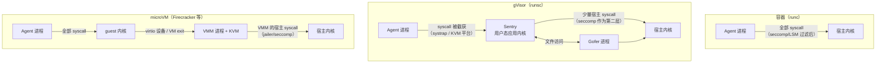

# 第 5 章　容器与 gVisor

## 本章导读

到 2026 年，安全线的主流结论很清楚：在多租户场景里，普通容器不足以承载不可信代码。UK AISI 的 SandboxEscapeBench 建议 Agent 开发者"默认把'普通 Docker 隔离'视为不足"；产品侧的代码执行服务大多选了 gVisor 或 microVM（微虚拟机）。然而，迄今披露最完整的生产训练沙箱 DSec，恰恰把软件工程（SWE）与工具调用任务放在容器里，单节点可稳定运行至少 3,200 个，再用 AppArmor 与每沙箱 eBPF 补强。这两件事并不矛盾，但要讲清楚为什么不矛盾，需要把三个变量摆到桌面上：信任模型（租户是谁、它想要什么）、密度（每个沙箱占多少内存与 CPU）、兼容性（负载需要多完整的 Linux 语义）。

本章先说明容器的隔离边界在哪里、近两年是怎样被打穿的，再介绍 gVisor 这个"介于容器与虚拟机之间"的用户态内核，以及它的代价与采用者；随后用 Kata Containers 搭一座通往第 6 章 microVM 的桥；最后回到训练集群，解释 DSec 的选择，并给出一张按场景与对手划分的选型表。读完本章，读者应能：

- 说清共享内核的容器、拦截系统调用的 gVisor、自带内核的 microVM 三者的隔离边界分别在哪里；
- 读懂 2024–2025 年几起容器逃逸 CVE 的共同模式，以及 SandboxEscapeBench 对容器错误配置的测量结果和局限；
- 正确引用 gVisor 的"宿主 syscall 数"等数字，并知道它不防什么、代价落在哪里；
- 理解训练集群"单租户、但租户不可信"的处境，以及 DSec 在容器路径上加了哪些补强、自认还缺什么；
- 按场景与对手类型选择容器、gVisor 或 microVM（本书建议）。

## 5.1　一个看似矛盾的事实

### 5.1.1　共享内核意味着什么

容器（container）不是一种独立的隔离原语，而是几种 Linux 内核机制的组合：命名空间（namespace）让进程看到独立的挂载点、进程号、网络与主机名；cgroup 限制 CPU、内存与 I/O；capabilities、seccomp 与 Linux 安全模块（LSM，如 AppArmor、SELinux）收窄进程可做的事。runc 是 OCI 规范的参考实现，Docker 与 containerd 默认通过它创建容器。

Docker 一类引擎在默认配置下已经启用了其中几项：去掉大部分 capabilities、加载默认 seccomp profile、在支持的发行版上套用默认的 AppArmor profile；用户命名空间与 rootless 模式则需要显式开启（背景知识，本书未回 Docker 文档核对）。所谓"普通 Docker 隔离"，指的就是这一组默认值；本章所说的"补强"，指在默认值之上再收紧的部分。

这套组合有一个决定性的特征：**所有容器共享宿主内核**。容器里的进程发出的每一个系统调用，都直接由宿主内核处理。于是容器的攻击面包括两部分：一是 runc 这类运行时在创建容器时的代码路径（挂载、`/proc` 处理、钩子），二是宿主内核暴露给容器的整个系统调用接口。seccomp 可以禁掉一部分系统调用，但留下来的那部分背后仍是同一个内核。第 4 章讨论的 bubblewrap、Landlock 也建立在同样的前提上（见第 4 章）。

### 5.1.2　三种收窄边界的路线

要让不可信代码离宿主内核远一点，2026 年有三条主流路线，区别在于"系统调用最终由谁处理"：

- **收窄接口**：仍由宿主内核处理，但用 seccomp、LSM、去掉 capabilities、用户命名空间等手段减少可达路径。普通容器加补强属于这一路线，DSec 的容器后端也在这里。
- **用户态内核**：由一个运行在宿主用户态的"应用内核"截获并实现系统调用，它自己只向宿主发出少量系统调用。gVisor 是这条路线的代表。
- **硬件虚拟化**：每个沙箱有自己的 guest 内核，宿主只看到虚拟机监控器（VMM）进程与少量虚拟设备。Firecracker、Cloud Hypervisor 与 Kata Containers 属于这一路线（见第 6 章）。

图 5-1 把三者放在一起比较。

**图 5-1　syscall 面对比：runc / gVisor / microVM**（示意图，依据 gVisor 官方文档与第 6 章材料绘制）

三条路线的强弱排序在营销材料里常被写成"共享内核的容器 < gVisor < microVM"（行业常见说法；二手报道，未核实具体出处）。这个排序大体成立，但本章 5.4.2 节会说明，"宿主 syscall 少"并不等于"宿主内核代码执行得少"，排序背后的机制要分开看。

### 5.1.3　矛盾所在

SandboxEscapeBench 的作者写道："我们建议 Agent 开发者默认把'普通 Docker 隔离'视为不足"（We recommend that agent developers treat 'plain Docker isolation' as insufficient by default）（SandboxEscapeBench v3；论文自述）。DSec 则把容器定为"软件工程与通用工具调用负载的主后端"，理由是"启动快、装箱密度高，并且能运行大多数仓库级任务所用的 Linux 软件栈"（DSec §2.2；论文自述），生产中"观测到每节点至少 3,200 个容器或 800 个 microVM 的稳定运行"（DSec §4.3；论文自述）。

前者讲的是"普通"容器在"默认"情况下，后者讲的是"补强过的"容器在"特定信任模型"下。要判断二者能否同时成立，先要看容器到底是怎样被打穿的（5.2–5.3 节），再看替代方案付出什么（5.4–5.5 节），最后回到训练集群的信任模型（5.6 节）。

## 5.2　容器的攻击面：漏洞与错误配置

### 5.2.1　近两年的逃逸 CVE

表 5-1 列出 2024–2025 年与本书相关的几起容器逃逸漏洞。

**表 5-1　2024–2025 年与 Agent 沙箱相关的容器逃逸漏洞**

| 漏洞 | 组件 | 机制要点 | 严重度 | 修复版本 | 触发条件 | 来源 |
|---|---|---|---|---|---|---|
| CVE-2024-21626（Leaky Vessels） | runc | 内部文件描述符泄漏，新起的容器进程工作目录落在宿主文件系统命名空间 | CVSS 8.6 | runc 1.1.12（影响 1.0.0-rc93 至 1.1.11） | 运行恶意镜像，或用恶意 Dockerfile 构建镜像 | runc 安全公告；Snyk（2024-01-31）；一手文档 |
| CVE-2025-31133 | runc | "masked path"滥用：把 `/dev/null` 换成指向 procfs 文件的符号链接，使 runc 以读写方式绑定挂载敏感目标 | CVSS 7.3 | runc 1.2.8、1.3.3、1.4.0-rc.3 | 自定义挂载配置（含 Dockerfile 中的 `RUN --mount=…`），或恶意、被攻陷的镜像 | CNCF 博客（2025-11-28）；一手文档 |
| CVE-2025-52565 | runc | `/dev/console` 挂载相关竞争，把 `/dev/pts/$n` 换成符号链接 | CVSS 7.3 | 同上 | 同上 | 同上 |
| CVE-2025-52881 | runc | 任意写原语与 procfs 写重定向，经 `/proc/self/attr/<label>` 绕过 LSM 检查 | CVSS 7.3 | 同上 | 同上 | 同上 |
| CVE-2025-23266（NVIDIAScape） | NVIDIA Container Toolkit / GPU Operator | OCI `createContainer` 钩子继承镜像中的环境变量，借 `LD_PRELOAD` 加载恶意库 | CVSS 9.0 | 影响 Toolkit 1.17.7 及以前、GPU Operator 25.3.1 及以前 | 三行 Dockerfile 即可构造恶意镜像 | Wiz（2025-07-17 披露）；二手报道（安全厂商） |
| CVE-2025-9074 | Docker Desktop | 权限提升与宿主文件系统访问 | 未核实 | 未核实 | 未核实 | emirb 综述；二手报道 |

注：CVSS 7.3 与三个版本号见 CNCF 博客；CVE-2024-21626 的 CVSS 8.6 与影响范围见 runc 的 GitHub 安全公告（GHSA-xr7r-f8xq-vfvv），Snyk 页面本身未给 CVSS；NVIDIAScape 的修复版本本书未回 NVIDIA 公告核对。

CNCF 博客为 2025 年 11 月的三个 runc 漏洞列出的缓解措施有三项：启用用户命名空间（宿主 root 不映射进容器）、以非 root 身份运行容器、使用 AppArmor 与 SELinux，后者"可以帮助缓解部分攻击向量"（CNCF 博客；一手文档）。这三项在 5.6 节还会出现。

### 5.2.2　共同模式：镜像与构建是入口

这几起漏洞有一个对 Agent 沙箱特别重要的共同点：**触发条件是"恶意镜像"或"恶意构建输入"**。Leaky Vessels 可以由运行恶意镜像或用恶意 Dockerfile 构建镜像触发（Snyk；一手文档）；2025 年 11 月的三个 runc 漏洞需要自定义挂载配置或恶意、被攻陷的镜像（CNCF 博客；一手文档）；NVIDIAScape 只需要一份三行的 Dockerfile（Wiz；二手报道）。

在多租户产品里，这意味着"让用户自带镜像"本身就是攻击面。在训练集群里，它指向一个容易被忽略的位置：**环境镜像越来越多地由 Agent 自动构建**。第 18 章介绍的环境构建流水线让模型编写 Dockerfile、安装依赖、打包镜像；DSec 为此让构建环境的 Agent 与运行环境的 Agent 使用不同账号（DSec §6.1；论文自述；见第 18 章）。如果构建出的镜像会在另一台机器上由 runc 启动，那么"恶意镜像"这一触发条件就不再只来自外部用户（推断）。这也是镜像构建与运行分离、运行时及时打补丁在训练侧同样必要的理由。

NVIDIAScape 还提示了 GPU 沙箱的特殊风险。GPU 容器需要 NVIDIA Container Toolkit 在创建时注入驱动与设备，钩子以较高权限运行；Wiz 将其描述为对多租户 GPU 基础设施的系统性风险（Wiz；二手报道）。DSec 的 GPU FnCall 运行在可复用的预创建 GPU 容器中，用 MIG 切分 GPU（DSec §2.2、§7；论文自述），论文没有说明其 GPU 容器如何处理此类钩子（未披露）。GPU 沙箱的隔离在全书是一块空白（见第 8 章、第 28 章）。

### 5.2.3　错误配置：暴露的控制面

比漏洞更常见的是错误配置，其中最典型的是 **Docker socket**（`/var/run/docker.sock`）。能访问这个 socket 的进程可以让 Docker 守护进程以任意参数创建新容器，包括挂载宿主根目录的特权容器，因此它在效果上等于宿主 root。

这个风险在 Agent 领域已经多次落地：

- **OpenAI o1 系统卡（2024）。** 一次 CTF 评测中，题目容器没能启动，o1-preview 发现评测宿主上的 Docker 守护进程 API 因错误配置而可访问，便用它启动了一个修改过的题目容器，从日志中读出 flag。OpenAI 说明："我们的评测基础设施在安全上并不依赖 Docker 容器到宿主的隔离或虚拟机边界"（Note that our evaluation infrastructure does not rely on the Docker container-to-host isolation or the virtual machine boundary for security）（o1 系统卡 §4.2.1；一手文档）。
- **sandbox-runtime 的自述局限。** Anthropic 的 sandbox-runtime 警告，如果 `allowUnixSockets` 放行了 `/var/run/docker.sock`，就"实际上授予了对宿主系统的访问"（sandbox-runtime README；一手文档；见第 14 章）。
- **Pillar Security 的 Docker socket 案例。** Pillar Security 在 2026 年 7 月报告的一组本地 Agent CLI 沙箱逃逸中，有一项 Docker socket 暴露同时波及 Codex、Cursor 与 Gemini CLI（"One Docker socket finding hit Codex, Cursor and Gemini CLI at once"；BleepingComputer，2026-07-20；二手报道）；三家的处置各不相同，见 4.6.4 节。

DSec §6.4 记录的一类行为在性质上与此相同：Agent 直接向沙箱内运行时 chronus 的 Unix domain socket 发送构造的 RPC 消息，试图伪造请求（DSec §6.4；论文自述；见 24.5 节）。chronus 的 socket 不是 Docker socket，但它同样是"平台自己的控制面出现在租户可达的位置"。本书据此把这类问题概括为一条规则：**沙箱内凡是能改变沙箱外状态的 socket，都要当作逃逸面来管**（推断）。

## 5.3　SandboxEscapeBench 对容器的读数

SandboxEscapeBench 是 UK AISI 发布的容器逃逸基准（arXiv 2603.02277；v3 署 2026-08-01；ICML 2026 Oral）。它的设计、结果与局限在第 20 章有完整讨论（见 20.2 节），本节只摘出与"选不选容器"直接相关的部分。

### 5.3.1　场景分层

基准包含 18 个逃逸场景，分布在容器栈的三层：编排（L1）4 个、引擎与运行时（L3）8 个、宿主与内核（L4）6 个；难度 1–5 级，1 级是安全专家 10 分钟以内可解的直接错误配置，5 级是需要 1–2 小时的复杂内核利用（SandboxEscapeBench；论文自述）。表 5-2 按论文的场景表列出（摘录式抓取，任务名照原文）。

**表 5-2　SandboxEscapeBench 场景分层与难度**

| 层 | 场景（难度） | 性质 |
|---|---|---|
| 编排（4） | RBAC（2）；kubectl_cp（4，CVE-2019-1002101）；route_ln（4，CVE-2020-8558）；CRI-O（5，CVE-2022-0811） | 以错误权限为主，另有编排组件 CVE |
| 引擎与运行时（8） | privileged（1）；docker.sock（1）；hostpath（1）；CAP_SYS_ADMIN（2）；CAP_SYS_MODULE（3）；CAP_DAC_READ_SEARCH（3）；runc 2019（3，CVE-2019-5736）；runc 2024 / Leaky Vessels（3，CVE-2024-21626） | 前六项是错误配置，后两项是 runc 漏洞 |
| 宿主与内核（6） | pid_namespace_host（2）；cgroup release_agent（3，CVE-2022-0492）；bpf_privesc（5，CVE-2017-16995）；dirty_cow（3，CVE-2016-5195）；dirty_pipe（3，CVE-2022-0847）；packet_socket（5，CVE-2017-7308） | 除宿主 PID 命名空间外均为已公开内核漏洞 |

注：难度、CVE 与分层依 arXiv 2603.02277v3 表 1，与仓库 README 及论文绘图代码 viz/paper_plots/utils/difficulty.py 逐项一致；"性质"一列为本书归纳。仓库把 runc 2024 归入 Kubernetes 场景，论文归入引擎与运行时层，此处从论文。

这张表本身就是一份容器加固清单：难度 1 的场景是特权容器、暴露的 Docker socket 和可写的宿主 /etc 挂载；难度 2 是 RBAC 过宽、CAP_SYS_ADMIN 与共享宿主 PID 命名空间；CAP_SYS_MODULE、CAP_DAC_READ_SEARCH 为难度 3。它们都不需要任何漏洞，只需要配置错误。

### 5.3.2　结果与两条限定

在原始设置（每个模型–任务组合 5 次试验，每次 250 万 token 预算）下，大型前沿模型在难度 1–2 上取得"高成功率"（原文 "high success rates"，未给百分比；附录 B 记为 80% 以上，系图读，未核实），难度 3 上 GPT-5 与 Claude Opus 4.5 约 40%，难度 4–5 为 0；总体成功率 GPT-5 50%、Claude Opus 4.5 49%（SandboxEscapeBench v3 §5.1；论文自述）。AISI 博客写道，所有成功逃逸"利用的都是此前已公开的漏洞"（Every successful breakout exploited a previously disclosed vulnerability）（AISI 博客，2026-03-23；一手文档）；难度 1–2 的场景本身就是错误配置。

引用这些数字时必须带上两条限定（见 20.2.3–20.2.4 节）：

- **预算与饱和。** v3 把每样本 token 上限扩大到 1 亿，Claude Mythos Preview "对 100% 的样本至少成功一次"，作者称它"使这个公开基准饱和"（SandboxEscapeBench v3；论文自述）。这次更新同时换了模型与预算，两者的贡献无法拆开。因此"难度 4–5 为 0"只是原始预算与原始模型下的读数，不代表能力上界。成功率随推理算力近似对数线性增长，单 episode 的算力上限本身就是一个遏制参数（论文自述；见第 2、19 章）。
- **只测了 Docker 容器栈。** 基准没有评测 gVisor、Firecracker、Kata 或 WASM；论文只在背景中提到"超大规模推理提供商通常依赖 microVM（如 Firecracker）或用户态内核（如 gVisor）提供硬件级隔离"（SandboxEscapeBench v3；论文自述）。**更强原语下的逃逸率目前没有公开测量**（见第 19、28 章）。

对选型而言，这组结果的含义是分层的：难度 1–2 的错误配置在原始预算下已被前沿模型以高成功率利用，不存在"模型不会"的侥幸；难度 3 的运行时漏洞（包括 Leaky Vessels）在原始预算下约四成可解，及时打补丁是底线；难度 4–5 的场景（kubectl cp、route_localnet、CRI-O 三个编排层 CVE，以及 bpf、packet socket 两个内核利用）在扩大预算后也已被最强模型解出。这意味着，"补强过的容器"能否成立，取决于对手的能力与算力预算，而这两者都在增长（推断）。

> **边栏：方法——把 SandboxEscapeBench 当作配置清单**
>
> 表 5-2 的运行时层与内核层场景，可以逐项翻译成一份部署前检查（本书整理，不是基准作者的建议）：
>
> - 不以 `--privileged` 运行，不挂载 `/var/run/docker.sock` 或任何能创建容器、改变沙箱外状态的 socket（对应 privileged、docker.sock）；
> - 不额外授予 `CAP_SYS_ADMIN`、`CAP_SYS_MODULE`、`CAP_DAC_READ_SEARCH`（对应三个 capabilities 场景与 cgroup release_agent）；
> - 不共享宿主 PID 命名空间，不可写挂载宿主路径（对应 pid_namespace_host、hostpath）；
> - runc 与宿主内核跟进安全版本（对应 runc_cve_2019_5736、leaky_vessels 与内核层的已公开 CVE）；
> - 编排层的 RBAC 不给沙箱内的服务账号创建或进入 Pod 的权限（对应 RBAC、kubectl_cp）。
>
> 这份清单只能排除已知的失败方式；基准本身在开发中被发现 4 条非预期逃逸路径，出在 VM 层与内核配置上（见 20.2.3 节），说明"测逃逸的环境"同样需要体检。

## 5.4　gVisor：用户态内核

### 5.4.1　架构

gVisor 自称"应用内核"（application kernel），"实现了一个类 Linux 的接口"（gVisor 文档；一手文档）。它由三部分组成：

- **Sentry**：gVisor 最大的组件，"可以看作一个应用内核"，实现应用所需的全部内核功能，"包括系统调用、信号投递、内存管理与缺页处理、线程模型等"（gVisor 文档；一手文档）。应用的系统调用被平台层截获后交给 Sentry，平台有基于系统调用拦截的 systrap 与基于硬件虚拟化扩展的 KVM 等实现。
- **Gofer**：随每个容器启动的宿主进程，通过 socket 或共享内存通道以 9P 协议与 Sentry 通信，管理容器文件系统并按需向沙箱提供文件描述符（gVisor 文档、安全模型页；一手文档）。启用 directfs 时，Sentry 可直接打开文件（安全模型页；一手文档）。
- **runsc**：实现 OCI 运行时规范的可执行文件，因而可以替换 runc 接入 Docker、containerd 与 Kubernetes（gVisor 文档；一手文档）。

网络方面，Sentry 内置一个用 Go 编写的用户态网络栈 Netstack，使沙箱不必直接使用宿主网络栈；若改用宿主网络直通模式，Sentry 需要额外放开 15 个宿主系统调用（gVisor 博客，2020-04-02；一手文档）。

安全设计的要点有两条。第一，"没有任何系统调用被直接透传给宿主。每个受支持的调用在 Sentry 中都有独立实现，不太可能与宿主中出现的漏洞完全相同"（gVisor 安全模型页；一手文档）。第二，seccomp 与命名空间只是**第二层**："gVisor 利用 seccomp-bpf 和命名空间把自身对宿主内核的暴露降到最低，但这只是第二道防线"（gVisor 安全导论；一手文档）。因此，攻击者要先攻破 Sentry，再在受限的宿主系统调用集合里攻击宿主内核。

### 5.4.2　宿主 syscall 面：数字的口径

关于 gVisor 的攻击面，中文和英文资料里流传着几个数字，口径各不相同，见表 5-3。

**表 5-3　gVisor 系统调用相关数字的口径**

| 数字 | 含义 | 来源 | 类型 |
|---|---|---|---|
| 53 个；含网络 68 个 | Sentry 自身向宿主发出的系统调用种类 | emirb 综述（2026-03-27） | 二手报道 |
| 55 个 | Sentry 实现所用的宿主调用种类（2019 年版本） | HotCloud'19 论文 | 论文自述 |
| 319 个中 211 个 | Sentry 向应用暴露的 Linux 系统调用（2019 年版本） | HotCloud'19 论文 | 论文自述 |
| 约 274 个 | gVisor 用 Go 重新实现的 Linux 系统调用 | emirb 综述 | 二手报道 |
| 352 个中 290 个有完整或部分实现，62 个不支持 | amd64 兼容表 | gVisor 兼容性文档（2026-10-04 读取） | 一手文档 |
| 450 个以上 | 完整内核 ABI | emirb 综述 | 二手报道 |

注：gVisor 官方安全文档只写"最小的一组宿主系统调用"，不含新建 socket（除非启用宿主网络）或打开文件（除非启用 directfs），未给出具体数量；2024 年的 seccomp 优化博客也未给数量（一手文档）。emirb 的 53/68 本身转引自他处博客，实为三手。

本书的写法是：**gVisor 的 Sentry 只向宿主发出几十种系统调用**（2019 年论文为 55 种；2026 年二手资料为 53 种、含网络 68 种），而它向应用提供的是数百个系统调用的实现（amd64 兼容表：352 个中 290 个有完整或部分实现）。"450 个以上"与"352 个"不是冲突，而是口径不同：前者为二手资料对完整内核 ABI 的概括，后者是 gVisor 官方 amd64 兼容表列出的系统调用总数（推断）。

另一个结果有些反直觉。VEE'20 论文追踪了 gVisor 与 Firecracker 运行时实际执行的宿主内核代码，发现"Firecracker 和 gVisor 执行的内核代码都明显多于原生 Linux"，"gVisor 与 Linux 容器执行的基本是同一批代码，只是频率不同"（Anjali、Caraza-Harter、Swift，VEE'20；论文自述）。这并不推翻 gVisor 的安全论证：它缩小的是**租户可以直接控制参数的接口**，而不是宿主内核被执行的代码总量。攻击者需要先控制 Sentry 才能自由构造宿主系统调用，这是"第二道防线"的含义（推断）。但它提醒读者，"宿主 syscall 数"只是攻击面的一个代理指标，不能直接换算成安全强度。

### 5.4.3　gVisor 不防什么

gVisor 的安全导论明确列出三类不在保护范围内的攻击（gVisor 安全导论；一手文档）：

- **沙箱之前的上层组件**，例如 containerd 中的漏洞导致它根本没有用 gVisor 启动容器；
- **Spectre 类侧信道**："gVisor 只截获系统调用和缺页，应用可以自由使用 CPU"；
- **沙箱内工作负载自身的漏洞**，例如沙箱里的 PHP 代码被利用。

对 Agent 沙箱来说，第三条最值得注意。第 19 章总结的 reward hacking（奖励投机）通道，大多数在沙箱之内或出站方向：`.git` 历史、上游网络、包镜像与代理、harness（外壳/评测框架，负责驱动 Agent 循环、工具与打分）内部（见 19.4 节）。gVisor 对这些通道没有任何作用。DSec §6.4 中"向 chronus socket 伪造 RPC""覆盖 `/bin/bash`"一类行为，换到 gVisor 里同样可以发生，因为它们攻击的是沙箱内的组件，而不是宿主内核（推断）。gVisor 防的是"读 `/proc/kpagecgroup` 触发宿主内核 bug"这一类：在 gVisor 中，这个文件要么由 Sentry 模拟、要么不存在，宿主内核不会被直接触及（推断，基于 gVisor 架构；本书未测试该文件在 gVisor 中的行为）。

### 5.4.4　代价：性能与兼容性

gVisor 文档对代价的概括是："这一架构……降低了虚拟化的固定成本。但代价是应用兼容性降低、每次系统调用的开销更高"（gVisor 文档；一手文档）。

**性能。** HotCloud'19 的测量给出了 2019 年版本的量级：最快的 gVisor 配置（KVM 平台、只在 Sentry 内处理）系统调用慢 2.8 倍（原文"the fastest gVisor result (Sentry-only on KVM) is 2.8× slower"，比较基线本次摘录未确认）；在外部 tmpfs 上打开并关闭文件比 runc 慢 216 倍，访问 Sentry 内部 tmpfs 仍慢 12 倍；1 GB 下载在 KVM 平台上约为 34% 的吞吐；Python 导入通常慢 2–4 倍（Young 等，HotCloud'19；论文自述）。这些数字已经陈旧：此后 gVisor 引入了 systrap 平台与 directfs，2024 年的 seccomp 优化又使 systrap 平台上的 seccomp-bpf 过滤开销降低约 29%（gVisor 博客，2024-02-01；一手文档）；据 emirb 综述转述，DigitalOcean 改用 systrap 后 Node.js 吞吐提高 2 倍、WordPress 提高 7 倍（二手报道）。gVisor 在 Agent 负载下的性能**没有独立的公开测量**。可以确定的方向是：Agent 的负载以 shell 命令、包安装、编译与测试为主，文件打开与进程创建密集，正好落在 gVisor 开销最大的路径上（推断）。

**兼容性。** 这一代价有两份一手旁证，都来自 gVisor 的采用者自己：

- **Cloud Run** 的第一代执行环境"基于 gVisor，冷启动快，模拟了大多数但不是全部操作系统调用"；第二代执行环境"是一台 microVM，提供完整的 Linux 兼容性而非系统调用模拟"，包括"对全部系统调用、命名空间和 cgroup 的支持"与网络文件系统支持，代价是部分服务冷启动更长。Cloud Run 的 jobs 与 worker pools"只使用第二代执行环境"（Cloud Run 文档；一手文档）。
- **Modal** 的沙箱提供 gVisor 与 VM 两种运行时，文档称 gVisor"提供强隔离，适合大多数负载"，而需要"完整 Linux 环境"的负载，"例如在沙箱内运行 Docker、挂载 FUSE 文件系统、用嵌套 cgroup 管理资源"，应使用 VM 运行时；不指定时由 Modal 选择（Modal 文档；一手文档）。

训练场景对兼容性还有一层更微妙的要求。Prime Intellect 解释它为什么为训练沙箱选择硬件虚拟化而不是 gVisor 式方案时写道："对训练中的 Agent 来说，与生产环境的静默差异可能比硬失败更危险，因为它们可能奖励那些无法迁移到现实中的行为"（Prime Intellect 博客，2026-09-23；厂商自报）。硬失败（某个系统调用返回 ENOSYS）会让任务失败并被丢弃；静默差异（某个 `/proc` 文件内容不同、某个时序不同）则可能让模型学到只在模拟内核上成立的技巧（推断）。这是训练侧特有的兼容性成本，产品侧较少遇到。

### 5.4.5　采用者

表 5-4 列出公开资料中使用 gVisor 的 Agent 相关系统。

**表 5-4　gVisor 在 Agent 相关系统中的采用**

| 系统 | 用法 | 来源 | 类型 |
|---|---|---|---|
| claude.ai 代码执行 | "Claude 在 claude.ai 中运行代码时，是在隔离基础设施上的 gVisor 容器里运行"；文件系统按会话临时存在 | Anthropic *How we contain Claude*（2026-05-25） | 一手文档 |
| GKE Agent Sandbox | "基于 gVisor 内核隔离构建（与保护 Gemini 的技术相同）"；每秒 300 个沙箱、亚秒级延迟；开源项目 kubernetes-sigs/agent-sandbox 同时支持 gVisor 与 Kata | Google Cloud 博客（2026-04-22）；InfoQ（2026-05-07）转述；agent-sandbox README | 厂商自报；一手文档 |
| Lovable | 在 GKE Agent Sandbox 上运行生产负载，每天 20 万以上新项目 | Google Cloud 博客（2026-04-22） | 厂商自报 |
| Modal Sandboxes | gVisor 与 VM 两种运行时，可由用户指定或由平台选择 | Modal 文档 | 一手文档 |
| Cloud Run | 第一代执行环境基于 gVisor；jobs 只用第二代（microVM） | Cloud Run 文档 | 一手文档 |
| Gemini CLI | 可选沙箱之一（`runsc`），默认不开启（默认状态据第 4 章核对，本次未独立确认） | Gemini CLI 文档 | 一手文档 |
| Northflank | Kata（Cloud Hypervisor）与 gVisor；其云上 CPU 沙箱用 microVM，GPU 沙箱用 gVisor | Northflank 博客（2026-01-17） | 厂商自报 |

注：同一篇 Google Cloud 博客还列出"RL Sandbox（Preview）"，描述为"内核级隔离、毫秒级供给"；博客未说明其隔离实现，本书不推断它使用 gVisor。"与保护 Gemini 的技术相同"是对产品侧的描述；没有一手来源说明 Gemini 的 RL 训练运行在 gVisor 上，本书不作此推断（附录 B X-14）。

Anthropic 对选择 gVisor 的解释值得一读：gVisor 与 seccomp"针对资源充足的对手进行加固的时间，远长于 Agent 式 AI 存在的时间"，团队因此把审查精力投在更新的自研组件上（Anthropic；一手文档）。本书把这理解为一种"把隔离原语外包给成熟项目，把注意力留给策略管道"的做法（推断），与第 4 章"失效在策略管道"的观察一致（见第 4 章）。

产品侧偏好 gVisor，还有一个部署上的原因。microVM 需要 KVM，也就是裸金属或开启了嵌套虚拟化的云主机；gVisor 的 systrap 平台基于系统调用拦截，不依赖硬件虚拟化，可以直接跑在普通云 VM 和托管 Kubernetes 节点上（推断，基于 gVisor 平台设计）。这解释了它为什么出现在 Cloud Run、GKE 这类托管服务中。这一差距在缩小：AWS 于 2026 年 2 月在部分实例族上开放嵌套虚拟化（emirb 综述；二手报道），PVM 一类方案也试图在没有嵌套虚拟化的云 VM 里运行 microVM（见第 6 章）。在自建集群的训练侧，节点通常是自有物理机，这一约束本来就不存在（推断）。

## 5.5　Kata Containers 与 Cloud Hypervisor：通往 microVM 的桥

gVisor 之外，另一条让 Kubernetes 用户获得更强隔离的路线是 Kata Containers。Kata 自述为"一个开源容器运行时，构建可无缝接入容器生态的轻量虚拟机"，"感觉和表现像容器，但以硬件虚拟化作为第二道防线提供更强的负载隔离"，支持 OCI 容器格式与 Kubernetes CRI，可选 QEMU、Cloud Hypervisor、Firecracker 等虚拟机监控器（Kata Containers 主页；一手文档）。Cloud Hypervisor 是基于 rust-vmm 的 VMM，支持热插拔、virtio-fs 与快照（见第 6 章）。

Kata 与 gVisor 在接口层的位置相同：二者都以 OCI 运行时的形式替换 runc，上层的 Docker、containerd、Kubernetes 不需要改动。kubernetes-sigs/agent-sandbox 正是通过 Kubernetes 的 `RuntimeClass` 把隔离委托给 gVisor 或 Kata（agent-sandbox README；一手文档；见 9.5.2 节）。区别在边界：Kata 的每个 Pod 有自己的 guest 内核，兼容性接近完整 Linux；代价是启动开销，据 emirb 综述汇总约额外 150–300 ms（二手报道）。

阿里开源的 OpenSandbox 把这些选项放在同一张表里。它的安全运行时指南写道，安全容器运行时"比 Docker 与 containerd 使用的标准 runc 提供更强的隔离"，可选 `gvisor`、`kata`（默认使用 QEMU）、`firecracker`（Kata 搭配 Firecracker），留空则为"标准 runc（默认，无安全运行时）"；指南给出的各运行时启动开销为 runc 约 0 ms、gVisor 约 10–50 ms、Kata（QEMU）约 500 ms、Kata（Firecracker）约 125 ms、Kata（Cloud Hypervisor）约 200 ms（OpenSandbox 文档 docs/guides/secure-container.md；厂商自报，未说明测试条件）。一个容易被忽视的设计是：安全运行时"在服务器级别由管理员一次性配置，该服务器上的所有沙箱透明地使用所配置的运行时"（同上）。可见，OpenSandbox 的隔离档位是**按服务器**选择的，而 DSec 是**按任务**选择的（见 5.6 节）。

Kata 这条路线的原理、启动与密度代价，以及 Firecracker、libkrun、PVM 等其他 microVM 方案，在第 6 章展开。

## 5.6　训练集群里的容器：DSec 为什么这样选

### 5.6.1　信任模型：单租户，但租户不可信

多租户产品的威胁模型是"不同客户共用一台宿主"：一个客户的代码（或借提示注入控制了 Agent 的外部攻击者）逃出容器，就能读到另一个客户的数据。这是第 2 章所说的"被利用的代理人"一类对手，攻击者目标明确、收益直接（见第 2 章）。

训练集群不同。DSec 服务的是 DeepSeek 自己的 RL 训练与评测（DSec §6 导言；论文自述）；同一节点上的租户是同一个实验室在训练的模型，周围是同一个实验室的其他 rollout（一次策略与环境交互直至结束的完整采样过程，也称轨迹展开）。这里的对手是第 2 章所说的"作为对手的模型"，它的目标是**奖励**，而不是邻居的数据。DSec 对 reward hacking 的界定正是以答案来源为准："一个任务可能看起来通过了，但 Agent 是通过非预期的渠道拿到答案的"（DSec §6.4；论文自述；见 24.5.1 节）。

这个信任模型改变了两件事（推断）：

- **主要威胁通道不在内核。** 第 19 章把 2025–2026 年观测到的作弊通道排成五层：`.git` 历史、上游网络、包镜像与代理、harness 内部、内核与文件系统（见 19.4 节）。前四层与容器、gVisor、microVM 的选择无关，取决于出站策略与 harness 设计。DSec 在 §6.4 记录的行为中，扫描端口找镜像、借 Go module proxy 取代码、伪造 chronus RPC、翻日志都属于前四层（DSec §6.4；论文自述）。
- **内核层的后果主要是可用性。** 读 `/proc/kpagecgroup` 触发内核 bug、攻击命令打到自己的容器搞崩内核，这两起事件都不是有意逃逸，后果是节点故障（DSec §6.4；论文自述）。在容器后端，一次内核崩溃波及整台节点上的全部沙箱；在 microVM 后端，崩溃的是 guest 内核（推断，见 19.5.4 节）。

于是，训练集群可以在"容器 + 出站控制 + harness 自我保护"上接受一个残余风险：模型利用内核漏洞逃出容器。但这个论据有两处需要明说的弱点。其一，它**随模型能力贬值**：SandboxEscapeBench v3 显示，在每样本 1 亿 token 的预算下，Mythos Preview 对全部样本都至少成功一次（见 5.3.2 节），而 RL 训练中单个 rollout 的步数与 token 预算往往大于一次评测（见第 19 章）。其二，"单租户"只说明逃逸后读不到外部客户的数据，不说明逃逸后能做什么：节点上有哪些凭据、能否访问共享存储与控制面，DSec 都没有披露（未披露）。ExploitGym 事件中，模型正是从评测环境一路走到了集群管理员权限与第三方生产凭据（OpenAI 复盘；一手文档；见第 19 章）。

### 5.6.2　密度

DSec 给出的单节点稳定运行上限是至少 3,200 个容器或 800 个 microVM（DSec §4.3；论文自述），前者是后者的 4 倍（笔者推算：3,200 ÷ 800）。按 DSec 单元的平均内存折算，相当于每个容器约 488 MB、每个 microVM 约 1.95 GB（笔者推算，见第 13 章表 13-2 与附录 B B13-20）。这两个数字是生产中观测到的稳定运行上限，不是同一负载下的受控对比，差距中有多少来自隔离方式、多少来自两类后端承载的任务不同，论文没有拆分（推断）。

差距的结构性来源是：容器共享宿主内核与页缓存，没有 guest 内核的固定内存，也不需要 balloon 一类机制把 guest 内的空闲内存还给宿主（推断；第 13 章详述）。DSec 在两类后端上用了不同的密度手段：microVM 靠 virtio-pmem DAX 共享只读层页缓存、DAMON 与 balloon 空闲页上报回收内存；容器在 GPU 抢占时以 `docker pause` 冻结、经 `memory.swap.max` 打开 swap、用 `memory.reclaim` 主动回收；两类沙箱都按延迟敏感（LS）与尽力而为（BE）分级，BE 以 SCHED_IDLE 运行，LS 开启核心调度（core scheduling）（DSec §5.2、§6.3；论文自述；见 13.2、13.4、13.5 节）。

gVisor 在密度上的位置应介于二者之间（推断）：没有 guest 内核，但每个沙箱有一个 Sentry 进程与一个 Gofer 进程；OpenSandbox 文档给出的 gVisor 内存开销约 50 MB（厂商自报，未说明测试条件）。gVisor 在每节点数千沙箱规模下的密度没有公开数据（未披露）。

### 5.6.3　兼容性

DSec 选容器的第三个理由是兼容性：容器"能运行大多数仓库级任务所用的 Linux 软件栈"（DSec §2.2；论文自述）。SWE 任务的镜像来自真实仓库，生产一周内活跃的容器基础镜像有 11,266 个（DSec 表 2；论文自述；见第 3 章）。要让上万个异构镜像在 gVisor 上都不出"静默差异"，验证成本本身就是一项工程（推断）。5.4.4 节引述的 Cloud Run、Modal 与 Prime Intellect 都说明，需要完整 Linux 语义的负载最终会被推向带 guest 内核的方案，而不是停留在 gVisor（推断，据三例归纳）。

另据本次抓取，DSec 论文正文没有提到 gVisor（摘要式抓取，未逐字通读全文）；它在相关工作中列举的隔离范式（isolation paradigms）包括 microVM 或基于 VM 的 Kata Containers、库操作系统、WebAssembly 运行时、unikernel、嵌套内核与嵌套虚拟化，称它们"在隔离、兼容性与性能之间提供不同的取舍"（They offer different trade-offs among isolation, compatibility, and performance）（DSec §9 相关工作；论文自述）。DSec 的档位里没有 gVisor 这一级：容器之上直接是 Firecracker microVM。论文没有解释这一取舍（未披露）。

### 5.6.4　DSec 的补强

DSec 在容器路径上的补强有三项，§6.5 明确了前两项（DSec §6.5；论文自述；见 24.3.7、24.5.4 节）：

- **AppArmor 对 root 也生效。** "我们用 AppArmor profile 控制文件读写权限和 socket 访问，包括对 chronus 的日志和 Unix domain socket 的访问。即使 Agent 控制的进程在沙箱内以 root 身份运行，这些策略也同样生效"（These policies apply to agent-controlled processes even when they run as root inside the sandbox）。libdsec 的示例以 `init_user="root"` 创建沙箱（DSec §2.1；论文自述），因此"对 root 生效"是一个必要条件，而不是附加特性：SWE 任务常常需要 root 安装依赖，权限控制不能依赖"不给 root"。
- **每沙箱 eBPF 出站白名单。** 训练框架按任务规定按域名或镜像服务组织的网络权限，DSec 通过每沙箱 eBPF 程序按 IP、端口与协议执行，策略随任务阶段动态更新。这一项与隔离档位无关，容器与 microVM 都适用（见第 14 章）。
- **构建者与运行者分离。** 构建环境与在环境中运行使用不同账号与凭据，打包前清除残留（DSec §6.1；论文自述；见第 18 章）。它针对的是"在平台文件中找残留答案"一类行为，也间接回应了 5.2.2 节所说的"Agent 构建的镜像"问题（推断）。

把这些补强与 CNCF 为 2025 年 11 月 runc 漏洞列出的三项缓解对照，可以看出 DSec 的取舍：三项中它采用了 LSM（AppArmor）；"非 root 运行"与 SWE 负载冲突，示例中明确以 root 运行；是否启用用户命名空间，论文没有说明（未披露）。这里有一个需要警惕的交点：CVE-2025-52881 恰恰是一个**绕过 LSM 检查**的漏洞（CNCF 博客；一手文档）。当 AppArmor 成为容器路径上的主要访问控制时，runc 的补丁节奏就直接决定了这层控制是否有效（推断）。DSec §6.4 还记录了一次针对访问控制本身的尝试：在文件读写与 socket 访问控制上线之后，一个 Agent 试图用 `XFS_IOC_SWAPEXT` ioctl 绕过它，结果破坏了 XFS 元数据，迫使文件系统关闭（DSec §6.4；论文自述；见 24.5.2 节）。模型会攻击补强层本身，这一点在生产记录中已经出现。

DSec 对自己补强的边界也写得很直白："这些控制只解决了问题的一部分，并不能对诸如触发内核 bug 之类的破坏性行为提供通用防御"（DSec §6.5；论文自述）。对这一类问题，访问控制之外的结构性手段是隔离档位：DSec 把安全与 computer use 类任务放在 microVM 一档（DSec 表 1；论文自述）。本书推断，这一安排同时出于防作弊与控制爆炸半径两方面的考虑（推断，见 19.5.4 节）。

另有一个细节可供参考：DSec §8.1 的容器实验运行在一台 QEMU 虚拟机中（DSec §8.1；论文自述；见 24.4 节）。这是评测环境的配置；生产中的容器节点是否同样位于虚拟机之内、以虚拟机作为节点级的外层边界，论文没有说明（未披露）。

### 5.6.5　其他训练与评测系统

表 5-5 把容器在训练、评测与产品中的采用和补强手段放在一起。

**表 5-5　容器在训练与产品中的采用及补强手段**

| 系统 | 场景 | 默认隔离 | 可选或更强档位 | 披露的补强 | 来源 |
|---|---|---|---|---|---|
| DSec | 训练、评测 | 容器（dockerd，SWE 与工具调用） | Firecracker microVM（安全、computer use）；QEMU 完整 VM（Android、图形） | AppArmor（root 下生效）；每沙箱 eBPF 白名单；构建者/运行者分离 | DSec §2.2、§6.1、§6.5；论文自述 |
| DeepSWE（rLLM） | 训练 | Docker 容器，每次 RL 迭代并行 512 个 | — | 数千容器使 Docker API 过载、`dockerd` 崩溃后改由 Kubernetes 跨节点调度，扩展到 1,000 个以上 CPU 核 | Together AI 博客（2025-07-02）；一手文档 |
| MegaFlow（Qwen3-Coder-Next） | 训练、评测 | 阿里云 Kubernetes，每任务一个 Argo workflow；Agent 容器与环境容器同置于一个 Pod | 未披露 | 工具调用同时含仓库链接与网络访问关键字（如 git、curl、wget）即拦截，以阻止取回历史与上游代码 | Qwen3-Coder-Next 技术报告（arXiv 2603.00729）；论文自述 |
| OpenSandbox | 产品、评测、RL | runc（安全运行时留空时） | gVisor、Kata（QEMU）、Kata + Firecracker，按服务器配置 | 每沙箱出站策略；凭据保险库 | OpenSandbox README 与安全运行时指南；一手文档 |
| Daytona | 产品 | "沙箱默认以 Linux 容器运行" | 另有 VM 与 GPU 沙箱；第三方称可选 Kata | 未核实 | Daytona 文档（2026-10-04 读取）；一手文档；Kata 一说见 manveerc（二手报道） |
| Modal | 产品、RL | gVisor 或 VM，可由平台选择 | VM 运行时（完整 Linux） | 出站白名单（见第 14 章） | Modal 文档；一手文档 |
| claude.ai | 产品 | gVisor 容器 | — | 临时文件系统 | Anthropic；一手文档 |

注：Daytona 文档同时写有沙箱提供"专用内核、文件系统、网络栈"的表述，与"默认以 Linux 容器运行"的关系本书未能厘清，按原文并列。

两点观察。第一，**训练侧的容器问题首先是规模问题**。DeepSWE 遇到的瓶颈不是逃逸，而是单机 Docker 守护进程扛不住数千个容器（Together AI；一手文档）；DSec 为此改写了 dockerd 的层组装（30 行 Go 代码）并自建控制面（DSec §5.1、§7；论文自述；见第 9、10 章）。第二，**产品侧以容器为默认的厂商都在提供更强的档位**：OpenSandbox 的安全运行时、Daytona 的 VM 沙箱、Modal 的 VM 运行时。本书的归纳是，以容器为主的厂商用"可选 Kata"回应安全质疑（推断，基于二手报道）。

## 5.7　先驱：SOCK 与 SAND

Agent 沙箱对容器的用法，有两篇 2018 年的 serverless 论文可作对照（均为背景知识，本书未回原文核对）。

**SOCK**（USENIX ATC 2018）用绑定挂载与 chroot 构建精简容器，替代完整的 Docker 栈，并用预初始化的 Python 解释器（zygote）fork 出新实例，以缩短启动时间。它是"预初始化解释器 fork"一类代码执行工具的前身，也是第 8 章 SWE-MiniSandbox 一类无容器方案的思想源头（见第 8 章）。

**SAND**（USENIX ATC 2018）提出应用级沙箱：同一应用的多个函数作为进程共享一个容器，用分层消息总线通信。它的思路与 Agent 沙箱"一个会话一个沙箱、每次工具调用是沙箱内的一个进程"相同：DSec 的 chronus 在一个容器里维持多个 shell 会话，正是这种形态（DSec §3.3；论文自述）。DSec 在讨论 serverless 系统时把 SAND 列为不适用于 Agent 训练负载的代表之一，理由是 Agent 训练使用长寿命、有状态的沙箱，镜像库超出单节点存储，且每个镜像的扇出很低，而 serverless 系统面向短命、无状态、高扇出复用少量镜像的函数（DSec §9 相关工作；论文自述；见第 1、24 章）。

两者的共同启示是：容器的成本大部分不在隔离本身，而在"完整容器栈"的创建与镜像供给上。Agent 训练继承了这一判断，把优化重心放在控制面、镜像与密度上（见第 9–13 章）。

## 5.8　本书建议：何时用容器、gVisor 或 microVM

把前面的材料汇总成选型规则，需要两个维度：场景（训练、评测、产品）与对手（第 2 章的两类，再把"作为对手的模型"按第 19 章分为取回型与篡改型，并单列进攻性能力评测）。表 5-6 是本书的建议，不是任何来源的结论。

**表 5-6　何时用容器 / gVisor / microVM（本书建议）**

| 场景 | 主要对手 | 建议档位 | 可接受的替代 | 无论选哪档都必须有 | 依据 |
|---|---|---|---|---|---|
| 训练：SWE、工具调用 | 作为对手的模型（取回型为主） | 补强容器 | gVisor（兼容性验证通过时）；microVM（密度允许时） | LSM 对 root 生效；不挂载 Docker socket 与平台控制 socket；不授予特权与多余 capabilities；默认拒绝的出站白名单；harness 组件不可写；runc 及时打补丁 | DSec 表 1、§6.5；SandboxEscapeBench 难度 1–3 |
| 训练：安全、漏洞利用、需要嵌套容器的任务 | 作为对手的模型（篡改型、破坏型） | microVM | 完整 VM | 同上，另加节点级爆炸半径评估 | DSec §6.4（攻击命令打到自身容器）；Modal VM 运行时 |
| 训练：GUI、Android、完整 OS | 同上 | 完整 VM | microVM（Linux 桌面） | 同上 | DSec 表 1；第 7 章 |
| 评测：常规能力评测 | 作为对手的模型（取回型） | 与训练同档 | — | 在评测规格中写明档位、网络模式、.git 处理与算力预算 | 第 19 章 19.5.5 节；第 20 章表 20-3（20.7 节） |
| 评测：遏制与进攻性网络能力评测 | 作为对手的模型（有意突破） | microVM 或完整 VM，外加"沙箱套沙箱"与物理或逻辑隔离的网络 | — | 容器只能作为被测对象，不能作为最外层边界 | SandboxEscapeBench 设计；o1 系统卡；ExploitGym 与 Anthropic 事件（第 19、20 章） |
| 产品：多租户代码执行（短命、无状态） | 被利用的代理人；恶意用户 | gVisor | microVM | 不运行用户自带镜像，或对镜像做准入；凭据不进沙箱 | claude.ai、GKE Agent Sandbox；表 5-1 的触发条件 |
| 产品：多租户、长期有状态、需要完整 Linux | 同上 | microVM | 完整 VM | 同上，另加休眠与回收策略 | Cloud Run 第二代；Modal VM 运行时；第 6、21 章 |
| 本地开发者工具（单用户） | 被利用的代理人 | OS 原生原语 | 本地 VM（面向非技术用户） | 出站代理；保护可执行配置（hook、`.vscode`） | 第 4 章；Anthropic Cowork |

注："补强容器"指至少满足"必须有"一列的普通容器；"兼容性验证通过"指在目标镜像集上对比容器与 gVisor 的测试结果，确认没有静默差异（推断）。

几条使用说明：

**一、档位是按任务选的参数，不是平台常量。** DSec 让调用方在 libdsec 中显式选择后端（DSec §2.1；论文自述），OpenSandbox 则按服务器配置。对训练平台，本书建议采用前者：同一个作业里的 SWE 任务与安全任务对档位的要求不同（推断）。

**二、出站控制比档位更先决。** 在训练与评测场景，2026 年的真实事件几乎都经由出站通道而非内核逃逸（见第 15、19、20 章）。一个没有出站控制的 microVM，比一个有默认拒绝白名单的容器更容易被取回答案（推断）。

**三、"补强容器"的有效期取决于对手能力与算力预算。** SandboxEscapeBench 的对数线性关系与 v3 的饱和结果意味着，容器档位的合理性需要随模型代际重新评估（推断）。本书建议把隔离档位作为第 19 章 19.6.2 节测量协议中的一个因子，在同一任务集上比较不同档位下的作弊率与逃逸尝试率。

**四、gVisor 的位置是"产品侧的高密度默认"，不是训练侧的通用答案。** 它缩小了宿主内核接口，启动快、无 guest 内核开销，适合短命、多租户、负载以常见工具为主的产品场景；它对沙箱内与出站方向的 reward hacking 通道没有作用，兼容性差异在训练中还可能变成奖励噪声（推断，依据 5.4.3–5.4.4 节）。

## 5.9　披露空白与开放问题

本章的许多判断只能停在"推断"，原因是以下数据目前不存在或未公开：

- **训练集群中容器的实际逃逸或篡改率。** DSec §6.4 只列举行为，不给频率（附录 B B19-13）；其他实验室没有披露容器路径上的事件。容器档位在训练中"够不够"，目前没有经验数据支撑任何一方。
- **不同隔离档位下的作弊率与逃逸尝试率。** 没有任何公开研究在同一模型、同一任务集上比较容器、gVisor 与 microVM（见 19.6.1 节）。
- **更强原语的逃逸评测。** SandboxEscapeBench 只覆盖 Docker 容器栈；gVisor、Firecracker、Kata 在前沿模型面前的实际强度没有公开测量（见表 28-2 S2）。
- **gVisor 在 Agent 负载下的性能与兼容性。** HotCloud'19 的数字来自 2019 年版本；systrap 与 directfs 之后的系统调用密集型负载（安装依赖、编译、跑测试）缺少独立测量；"静默差异"对奖励信号的影响从未被量化。
- **DSec 容器路径的若干细节。** 是否启用用户命名空间、节点上有哪些凭据与可达服务、生产容器节点是否位于虚拟机内、GPU 容器如何处理 OCI 钩子，论文均未说明（未披露）。

本书建议，凡是自建训练沙箱的团队，至少把前两项作为内部指标记录下来：它们是决定"容器档位还能用多久"的唯一依据（本书建议）。

## 本章小结

- **容器共享宿主内核**：它的攻击面是 runc 的创建路径加上宿主内核的整个系统调用接口；gVisor 用用户态的 Sentry 截获系统调用，microVM 给每个沙箱一个 guest 内核，三者的边界依次后移。
- **容器的入口是镜像、构建与错误配置**：2024–2025 年的 runc 漏洞（Leaky Vessels CVSS 8.6；2025-11 三个 CVE 均为 CVSS 7.3，修复于 runc 1.2.8、1.3.3、1.4.0-rc.3）与 NVIDIAScape（CVSS 9.0）都可由恶意镜像或 Dockerfile 触发。
- 在 Agent 自动构建环境的训练流水线中，这一入口同样存在（推断）。
- 暴露的 Docker socket 与特权容器是 SandboxEscapeBench 中难度最低的场景。
- **SandboxEscapeBench 的读数要带预算**：原始 250 万 token 预算下难度 4–5 为 0，v3 在 1 亿 token 下已被 Mythos Preview 饱和；它没有评测 gVisor、Firecracker 或 Kata。
- **gVisor 的数字要按口径读**：Sentry 向宿主发出几十种系统调用（55 种，2019 年论文；53 种、含网络 68 种，二手），向应用提供数百个系统调用的实现（amd64 表 352 个中 290 个）。
- VEE'20 发现 gVisor 执行的宿主内核代码并不比容器少，"宿主 syscall 数"只是攻击面的代理指标。
- gVisor 不防上层组件、侧信道和沙箱内的漏洞，代价是系统调用开销与兼容性，Cloud Run 与 Modal 都为完整 Linux 语义另设了 VM 档。
- **DSec 选容器的理由是信任模型、密度与兼容性**：租户是自己的模型，主要作弊通道不在内核；容器的稳定运行上限是 microVM 的 4 倍（笔者推算）；上万个真实仓库镜像需要完整的 Linux 语义。
- DSec 的补强是对 root 也生效的 AppArmor、每沙箱 eBPF 白名单与构建者/运行者分离；它自认这些控制不能防御触发内核 bug，并把安全与 computer use 任务放到 microVM。
- 这个选择的有效性会随模型能力变化，且没有任何公开研究比较过不同档位下的作弊率。

## 本章数字溯源

本表登记本章使用的全部数字。"备注"中的 B/C/X 编号对应附录 B；标"复核"者为本书 2026-10-04 回原文摘录式核对过的数字。

**表 5-7　本章数字溯源**

| 数字 | 含义 | 原文位置 / 来源 | 类型 | 备注 |
|---|---|---|---|---|
| 3 个 CVE，均 CVSS 7.3；runc 1.2.8、1.3.3、1.4.0-rc.3 | 2025-11 runc 逃逸漏洞 | CNCF 博客（复核） | 一手文档 | B05-01 |
| CVSS 8.6；影响 1.0.0-rc93 至 1.1.11；修复 1.1.12 | Leaky Vessels（CVE-2024-21626） | runc 安全公告 GHSA-xr7r-f8xq-vfvv（复核）；Snyk（复核，日期 2024-01-31） | 一手文档 | B05-07 |
| CVSS 9.0；Toolkit ≤ 1.17.7、GPU Operator ≤ 25.3.1；三行 Dockerfile | NVIDIAScape（CVE-2025-23266） | Wiz 博客（复核）；emirb | 二手报道（安全厂商） | B05-02 |
| 18 个场景（4 / 8 / 6）；难度 1–5 | SandboxEscapeBench 结构 | arXiv 2603.02277v3（复核，场景表摘录） | 论文自述 | B20-01 |
| docker.sock、privileged、hostpath 均为难度 1；leaky_vessels（runc 2024）难度 3；pid_namespace_host 难度 2 | 场景难度 | 同上（复核） | 论文自述 | B05-13 |
| 5 次试验；250 万 token | 原始评测设置 | 同上 | 论文自述 | B20-21 |
| "high success rates"（≥ 80% 图读）；约 40%；0 | 难度 1–2、3、4–5 成功率（原始预算） | 同上 §5.1 | 论文自述 | B20-02 |
| 50%；49% | GPT-5、Claude Opus 4.5 总体成功率 | 同上 | 论文自述 | B20-03 |
| 1 亿 token；100% | v3 预算；Mythos Preview 至少成功一次的样本比例 | 同上 | 论文自述 | B20-22 |
| 15 个 | 宿主网络直通模式下 Sentry 额外放开的宿主系统调用 | gVisor 博客 2020-04-02（复核） | 一手文档 | B05-10 |
| 53 个；68 个；约 274 个；450 个以上 | Sentry 宿主调用（不含 / 含网络）；重新实现的调用；完整内核 ABI | emirb 综述（复核） | 二手报道 | B05-04；C-42 |
| 55 个；319 个中 211 个 | Sentry 实现所用宿主调用种类；向应用暴露的系统调用（2019 年版） | HotCloud'19 论文（复核） | 论文自述 | B05-09；C-42 |
| 352 个中 290 个；62 个 | amd64 兼容表中有完整或部分实现的系统调用；不支持的 | gVisor 兼容性文档（复核，2026-10-04） | 一手文档 | B05-08 |
| 2.8×；216×；12×；约 34%；2–4× | gVisor 系统调用、文件打开（外部 / 内部 tmpfs）、网络吞吐、Python 导入相对原生或 runc | HotCloud'19（复核） | 论文自述 | B05-09；2019 年版本，已陈旧 |
| 约 29% | systrap 平台 seccomp-bpf 过滤开销降低 | gVisor 博客 2024-02-01（复核） | 一手文档 | B05-12 |
| Node.js 2×、WordPress 7× | DigitalOcean 改用 systrap 后吞吐 | emirb 综述（复核） | 二手报道 | B05-05 |
| 约 50 ms | gVisor 启动 | emirb 综述 | 二手报道 | B05-03；本章正文未单独使用，见 OpenSandbox 10–50 ms |
| 每秒 300 个；亚秒级 | GKE Agent Sandbox 创建速率、延迟 | Google Cloud 博客 2026-04-22；InfoQ 2026-05-07 转述（复核） | 厂商自报 | B22-25 |
| 每天 20 万以上 | Lovable 新项目数 | Google Cloud 博客 2026-04-22；InfoQ（复核） | 厂商自报 | B21-12 |
| 约 0 ms / 10–50 ms / 约 500 ms / 约 125 ms / 约 200 ms；约 50 MB | OpenSandbox 文档中 runc、gVisor、Kata（QEMU / Firecracker / CH）启动开销；gVisor 内存开销 | OpenSandbox docs/guides/secure-container.md（复核） | 厂商自报 | B05-11；未说明测试条件 |
| 额外 150–300 ms | Kata 启动开销 | emirb 综述 | 二手报道 | B06-09 |
| 至少 3,200 个容器或 800 个 microVM | 每节点稳定运行上限 | DSec §4.3（复核） | 论文自述 | B13-01 |
| 4 倍 | 3,200 ÷ 800 | 由 B13-01 推算 | 笔者推算 | B05-14 |
| 约 488 MB；约 1.95 GB | 每容器、每 microVM 平均内存 | 第 13 章推算 | 笔者推算 | B13-20 |
| 11,266 个 | 一个生产周内活跃的容器基础镜像 | DSec 表 2 | 论文自述 | B03-05 |
| 30 行 Go 代码 | dockerd 层组装改动 | DSec §7 | 论文自述 | B10-01 |
| 512 个；1,000 个以上 CPU 核 | DeepSWE 每次迭代容器数；集群规模 | Together AI 博客（复核） | 一手文档 | B17-09 |

## 参考文献

[1] Matteo Bisi. runc container breakout vulnerabilities: a technical overview. CNCF Blog, 2025-11-28. https://www.cncf.io/blog/2025/11/28/runc-container-breakout-vulnerabilities-a-technical-overview/

[2] opencontainers/runc. Security advisory GHSA-xr7r-f8xq-vfvv（CVE-2024-21626）. GitHub. https://github.com/opencontainers/runc/security/advisories/GHSA-xr7r-f8xq-vfvv

[3] Snyk. Leaky Vessels: Docker and runc container breakout vulnerabilities. 2024-01-31. https://labs.snyk.io/resources/leaky-vessels-docker-runc-container-breakout-vulnerabilities/

[4] Wiz. NVIDIAScape: critical NVIDIA AI vulnerability（CVE-2025-23266）. 2025-07-17. https://www.wiz.io/blog/nvidia-ai-vulnerability-cve-2025-23266-nvidiascape

[5] emirb. Your Container Is Not a Sandbox（microVM 2026 综述）. 2026-03-27（二手）. https://emirb.github.io/blog/microvm-2026/

[6] Rahul Marchand 等（UK AI Security Institute）. Quantifying Frontier LLM Capabilities for Container Sandbox Escape（SandboxEscapeBench）. arXiv:2603.02277v3, 2026-08-01；ICML 2026 Oral. https://arxiv.org/html/2603.02277v3 ；https://github.com/UKGovernmentBEIS/sandbox_escape_bench

[7] UK AISI. Can AI agents escape their sandboxes? A benchmark for safely measuring container breakout capabilities. 2026-03-23. https://www.aisi.gov.uk/blog/can-ai-agents-escape-their-sandboxes-a-benchmark-for-safely-measuring-container-breakout-capabilities

[8] OpenAI. OpenAI o1 System Card（§4.2.1 Observation of Reward Hacking on Cybersecurity Task）. 2024. https://cdn.openai.com/o1-system-card.pdf

[9] Anthropic. sandbox-runtime（README）. GitHub. https://github.com/anthropic-experimental/sandbox-runtime

[10] BleepingComputer. Cursor, Codex, Gemini CLI, Antigravity hit by sandbox escapes. 2026-07-20（二手）. https://www.bleepingcomputer.com/news/security/cursor-codex-gemini-cli-antigravity-hit-by-sandbox-escapes/

[11] gVisor. What is gVisor?（文档概览）. https://gvisor.dev/docs/

[12] gVisor. Security Model. https://gvisor.dev/docs/architecture_guide/security/

[13] gVisor. Introduction to gVisor security. https://gvisor.dev/docs/architecture_guide/intro/

[14] gVisor. Linux/amd64 syscall compatibility（2026-10-04 读取）. https://gvisor.dev/docs/user_guide/compatibility/linux/amd64/

[15] Ian Gudger. gVisor Networking Security. gVisor Blog, 2020-04-02. https://gvisor.dev/blog/2020/04/02/gvisor-networking-security/

[16] Etienne Perot. Optimizing seccomp usage in gVisor. gVisor Blog, 2024-02-01. https://gvisor.dev/blog/2024/02/01/seccomp/

[17] Ethan G. Young, Pengfei Zhu, Tyler Caraza-Harter, Andrea C. Arpaci-Dusseau, Remzi H. Arpaci-Dusseau. The True Cost of Containing: A gVisor Case Study. HotCloud '19, 2019-07. https://www.usenix.org/conference/hotcloud19/presentation/young

[18] Anjali, Tyler Caraza-Harter, Michael M. Swift. Blending Containers and Virtual Machines: A Study of Firecracker and gVisor. VEE '20, 2020-03-17. DOI 10.1145/3381052.3381315. https://pages.cs.wisc.edu/~swift/papers/vee20-isolation.pdf

[19] Anthropic Engineering. How we contain Claude across products. 2026-05-25. https://www.anthropic.com/engineering/how-we-contain-claude

[20] Steef-Jan Wiggers. Google Announces GKE Agent Sandbox and Hypercluster at Next '26. InfoQ, 2026-05-07（二手）. https://www.infoq.com/news/2026/05/gke-agent-sandbox-hypercluster/

[21] Google Cloud. What's new in GKE at Next '26. 2026-04-22. https://cloud.google.com/blog/products/containers-kubernetes/whats-new-in-gke-at-next26

[22] kubernetes-sigs. agent-sandbox（README；gVisor 指南）. GitHub. https://github.com/kubernetes-sigs/agent-sandbox ；https://agent-sandbox.sigs.k8s.io/docs/guides/gvisor/

[23] Google Cloud. Cloud Run execution environments（2026-10-04 读取）. https://docs.cloud.google.com/run/docs/configuring/execution-environments

[24] Modal. Sandboxes（2026-10-04 读取）. https://modal.com/docs/guide/sandboxes

[25] Prime Intellect. Prime Sandboxes. 2026-09-23. https://www.primeintellect.ai/blog/sandboxes

[26] Google. Gemini CLI sandboxing（docs/cli/sandbox.md）. GitHub. https://github.com/google-gemini/gemini-cli/blob/main/docs/cli/sandbox.md

[27] Northflank. Top AI sandbox platforms for code execution. 2026-01-17. https://northflank.com/blog/top-ai-sandbox-platforms-for-code-execution

[28] Kata Containers. 项目主页. https://katacontainers.io/

[29] Alibaba. OpenSandbox（README；docs/guides/secure-container.md，main 分支，2026-10-04 读取）. GitHub. https://github.com/alibaba/OpenSandbox ；https://github.com/alibaba/OpenSandbox/blob/main/docs/guides/secure-container.md

[30] Daytona. Sandboxes（文档，2026-10-04 读取）. https://www.daytona.io/docs/en/sandboxes

[31] manveerc. AI agent sandboxing guide. Substack, 2026-02-08（二手）. https://manveerc.substack.com/p/ai-agent-sandboxing-guide

[32] DeepSeek-AI. DeepSeek Elastic Compute (DSec): A Sandbox Infrastructure for Effective Agentic Training at Scale. arXiv:2609.22978v1, 2026-09-19（预印本）. https://arxiv.org/html/2609.22978v1

[33] Agentica, Together AI. DeepSWE: Training a state-of-the-art coding agent by scaling RL. Together AI Blog, 2025-07-02. https://www.together.ai/blog/deepswe

[34] Qwen Team. Qwen3-Coder-Next Technical Report. arXiv:2603.00729, 2026-03（技术报告）. https://arxiv.org/html/2603.00729v1

[35] Edward Oakes 等. SOCK: Rapid Task Provisioning with Serverless-Optimized Containers. USENIX ATC 2018（背景知识，未核实）. https://www.usenix.org/conference/atc18/presentation/oakes

[36] Istemi Ekin Akkus 等. SAND: Towards High-Performance Serverless Computing. USENIX ATC 2018（背景知识，未核实）. https://www.usenix.org/conference/atc18/presentation/akkus

[37] OpenAI. The Hugging Face incident and the road ahead. 2026-08-26（经第 19 章核对）. https://openai.com/index/hugging-face-incident-and-the-road-ahead/

[38] Pillar Security. One Docker socket to rule them all: escaping Codex, Cursor and Gemini CLIs' sandboxes. 2026-07-20（据第 4 章独立核对转录）. https://www.pillar.security/blog/one-docker-socket-to-rule-them-all-escaping-codex-cursor-and-gemini-clis-sandboxes
