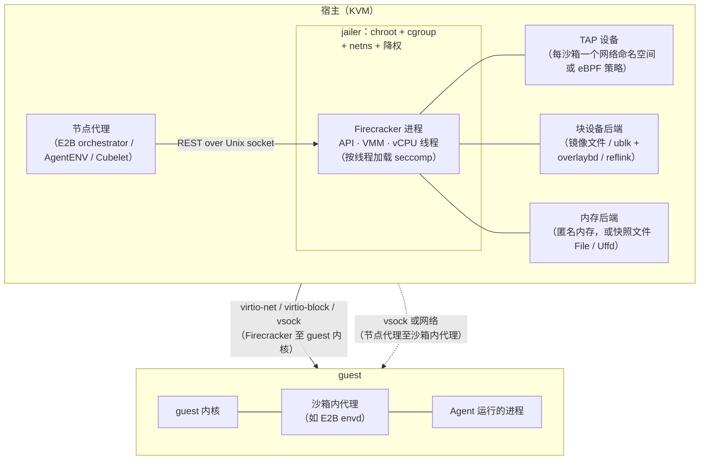

# 第 6 章　microVM（Firecracker、Cloud Hypervisor、libkrun、PVM、CubeSandbox）

## 本章导读

第 5 章讨论了共享内核的隔离：容器的攻击面，以及 gVisor 怎样用用户态内核把宿主 syscall 收窄。本章往下走一层，讨论给每个沙箱一个独立内核的方案，也就是 microVM（微虚拟机）。到 2026 年，多租户 Agent 沙箱几乎都把 microVM 当作默认选项：E2B、Vercel、AWS AgentCore、Docker Sandboxes 的产品沙箱用它，Kimi K3 的 AgentENV 和 DeepSeek DSec 的强隔离档在训练里也用它。

本章不重复第 11 章对快照与 fork 的详细讨论，也不重复第 13 章对 balloon、virtio-pmem 等密度技术的拆解，重点放在 VMM 本身和它带来的真实代价上。读完本章，读者应能：

- 说清 microVM 成为默认选项的原因，以及它与容器、gVisor、Kata 在边界上的区别；
- 逐条读懂 Firecracker 官方规格里的数字，知道每个数字的测量条件和不包含的部分；
- 区分 Cloud Hypervisor、Kata、libkrun、Hyper-V 系（Azure 动态会话、Hyperlight）和 CubeSandbox 各自的定位；
- 理解 microVM 在云上的可用性问题（嵌套虚拟化与 PVM），以及启动、密度、网络三项真实代价；
- 读懂厂商"冷启动"数字的口径，知道为什么至今没有独立的横向基准；
- 按训练与产品两种场景选择 VMM（本书建议）。

## 6.1　为什么是 microVM

### 6.1.1　边界画在哪里

容器与宿主共享一个内核，gVisor 在两者之间插入一个用户态内核，microVM 则让每个沙箱运行自己的 guest 内核，宿主只通过 KVM 与一个精简的 VMM（虚拟机监控器，Virtual Machine Monitor）面对它。三者的差别不在"能不能运行任意代码"，而在**沙箱里的代码触达宿主内核的路径有多宽**（见第 5 章图 5-1）。

Firecracker 的 NSDI'20 论文把这个取舍讲得很直白："传统观点认为，要么选择安全性强但开销高的虚拟化，要么选择安全性弱但开销小的容器技术。这种取舍对公有云基础设施提供商来说是不可接受的，他们两者都需要"（Firecracker NSDI'20 摘要；论文自述）。microVM 的思路是把虚拟机的边界保留下来，把虚拟机的开销砍掉：去掉传统 VMM 中为兼容性而存在的大量设备与代码。论文用 QEMU 作对照："QEMU 是一个庞大的项目（截至 QEMU 4.2 超过 140 万行代码）"（> 1.4 million LOC）（Firecracker NSDI'20；论文自述）。

### 6.1.2　训练与产品为什么都选它

Agent 沙箱比 serverless 函数更需要强边界，原因有两条。第一，沙箱里的代码是模型生成的，在训练中模型本身就是有动机的对手（见第 2 章、第 19 章）；第二，Agent 需要接近真机的能力，要装包、起服务、跑 Docker，有时还要再起虚拟机，这类负载在共享内核下很难同时满足能力与安全。Kimi K3 技术报告记录了一个直接的教训："在早期使用传统容器沙箱运行时的实验中，我们观察到若干由 Agent 的非预期操作引起的内核崩溃（kernel panic）和死锁"（K3 技术报告 §5.3.2；论文自述；见 25.1.3 节）。共享内核意味着一个沙箱的事故会波及整台节点。报告解释 AgentENV 的选择时写道，Firecracker microVM 提供了"基于容器的运行时无法企及的隔离与保真度"（K3 技术报告 §5.3.2；论文自述）。Prime Intellect 在 2026-09-23 推出 Prime Sandboxes 时，特意强调它用的是带 guest 内核的硬件虚拟化 microVM，明确不是 gVisor 式方案（Prime Sandboxes 博客；厂商自报）。DSec 则把 microVM 作为四档隔离中的第三档，用于安全要求高和 computer use 类任务，生产中以容器和 microVM 为主（DSec 表 1；论文自述；见 24.2 节）。

一位 OpenAI 工程师在 2026 年的演讲中把沙箱运行时的演进概括为 fork-exec → Linux 容器 → gVisor → 硬件虚拟化，并以 2023 年后兴起的 Rust VMM（crosvm、Firecracker、Cloud Hypervisor）为例讲解 microVM：参考设计由 harness"fork 一个 cloud-hypervisor 进程"，宿主与 guest 之间经 vsock 通信（AI Engineer 官方转录 25:40、27:01）；演讲没有说 OpenAI 生产中用哪一种 VMM。演讲把两种场景的优先级概括为研究（训练）重吞吐、产品重延迟，并建议"从一开始就用 microVM"（官方转录 29:38）。

独立内核还带来一个容易被忽视的好处：**保真度**。在 microVM 里，Agent 可以是 root，可以加载内核模块、挂载文件系统、运行自己的 Docker 守护进程，而这些操作的后果止于 guest 内核。Docker Sandboxes 的描述正是"带自己内核与 Docker 守护进程的 microVM"（Docker 博客，2026-09-24；一手文档）。在容器里做同样的事，要么给容器特权，要么借助 Sysbox 一类的额外运行时，两者都会削弱隔离（推断）。K3 报告对 AgentENV 的期望更进一步，希望 Agent"能够随意挂载磁盘、运行容器，甚至启动虚拟机"（K3 技术报告 §5.3.2；论文自述；见 25.4 节）。保真度越高，guest 内能做的事越多，边界承担的压力也越集中在 VMM 与 KVM 上（推断）。

表 6-1 把四类隔离技术放在一起比较。

**表 6-1　隔离技术栈对照**

| 技术 | 边界 | 典型启动 | 代表采用者 | 主要弱点 | 详见 |
|---|---|---|---|---|---|
| 容器（runc） | 共享宿主内核；命名空间 + cgroup + seccomp/LSM | 亚秒级（厂商口径不一） | DSec 容器档、Daytona 默认 | 内核与运行时漏洞直接可达宿主（2025-11 的三个 runc CVE） | 第 5 章 |
| gVisor | 用户态内核 Sentry；只向宿主发出几十种 syscall（HotCloud'19 为 55 种，论文自述；emirb 为 53 种、含网络 68 种，二手报道）；向应用提供的实现为 amd64 表 352 个中 290 个（gVisor 兼容性文档；一手文档） | 约 50 ms（二手） | Modal、GKE Agent Sandbox、claude.ai | syscall 兼容性与 I/O 开销 | 第 5 章 |
| microVM | 独立 guest 内核；KVM + 精简 VMM | 到 guest init ≤ 125 ms（Firecracker 规格） | E2B、Vercel、AgentCore、AgentENV、DSec microVM 档 | 需要 KVM；双重页缓存；网络与存储路径更长 | 本章 |
| Kata 等"安全容器" | 同 microVM，外包 OCI/CRI 接口 | 比 runc 多 150–300 ms（二手） | Northflank、agent-sandbox 的 kata runtimeClass | 启动开销；多一层 agent | 6.3.2 节 |

注：启动数字来源与口径见表 6-5；gVisor 数字见附录 B 第 5 章条目。

## 6.2　Firecracker：规格、设计与快照

### 6.2.1　NSDI'20 的设计

Firecracker 由 AWS 开发，论文发表于 NSDI 2020，作者为 Alexandru Agache、Marc Brooker、Andreea Florescu、Alexandra Iordache、Anthony Liguori、Rolf Neugebauer、Phil Piwonka、Diana-Maria Popa（NSDI'20 论文页；一手文档）。摘要称它已部署在 AWS Lambda 与 Fargate 两个公开服务中，"支撑数百万个生产负载，每月数万亿次请求"（同上；论文自述）。

它的设计要点可以归纳为四条（Firecracker NSDI'20 与仓库文档；一手文档）：

- **极简设备模型。**论文写道，Firecracker"只提供有限的模拟设备：网络与块设备、串口"等；没有 PCI 直通、USB、显卡这一类为兼容通用 OS 而存在的设备。
- **一进程一 VM。**每台 microVM 对应宿主上一个 Firecracker 进程，内含 API 线程、VMM 线程和 vCPU 线程，通过 Unix 套接字上的 REST API 配置。
- **jailer（隔离启动器）再加一层。**论文称 jailer"在 VMM 行为异常时提供额外一层保护"；仓库文档说明它用 chroot、cgroup、网络命名空间与降权 uid/gid 启动 Firecracker。seccomp 过滤器默认开启，按线程加载，"只允许 Firecracker 运行所需的最少系统调用与参数"（Firecracker `docs/seccomp.md`；一手文档）。
- **Rust 实现。**论文称 Firecracker"约 5 万行 Rust 代码（比 QEMU 少 96%）"（approximately 50k lines of Rust code）（NSDI'20；论文自述）。

极简的另一面是功能取舍。Firecracker 不面向图形与通用设备，GPU 负载在 Agent 平台上通常放在别处：DSec 的 GPU FnCall 用 NVIDIA MIG 切分、在预创建的容器中运行，图形与 Android 负载放在 QEMU 完整 VM 档（DSec §2.2、§7；论文自述；见 24.2.2 节）。Prime Sandboxes 把 GPU 沙箱列在路线图上（Prime 博客；厂商自报）。microVM 中的 GPU 沙箱仍是开放问题（见第 28 章）。

论文还给出了创建速率："每台宿主每秒最多可创建 150 台 microVM"（up to 150 MicroVMs per second per host）（NSDI'20；论文自述）。这一数字曾登记在附录 B 的"不应引用"清单（X-26），已回原文核实并移出（附录 B B06-07）。

**代码规模的三个数字。**emirb 的 2026 年综述写"Firecracker 约 83K 行 Rust，Cloud Hypervisor 约 106K 行"（emirb，2026-03-27；二手报道）。笔者对主分支（提交 f23a213，2026-10-01）`src/` 下全部 `.rs` 文件计数，得到 124,033 行，去掉空行后 109,931 行，均含注释与单元测试（笔者推算）。emirb 用 cloc 计数，只计代码行，不含空行与注释；按同一口径粗算，该提交约 9.1 万行代码（含测试；笔者推算）。三个数字分别是 2020 年的论文、一篇二手综述和 2026 年 10 月的计数，统计口径不同，不能互相印证；按 cloc 口径与论文的约 5 万行相比，代码量在六年中增长了接近一倍（推断）。"小"是相对 QEMU 而言的。

图 6-1 是一个 Firecracker microVM 在 Agent 沙箱中的典型组件布局。

**图 6-1　Firecracker microVM 内外组件**（示意图，依据 Firecracker NSDI'20、仓库 `docs/jailer.md`、`docs/seccomp.md`、`docs/snapshotting/` 与 E2B infra、AgentENV 文档绘制）

### 6.2.2　逐条读 SPECIFICATION

Firecracker 仓库的 SPECIFICATION.md 是本章最重要的一手数字来源。文件开头说明，这些规格"由集成测试强制执行（对每个 PR 和主分支合并运行）"，测量机器为关闭超线程的 M5D.metal 实例和 M6G.metal 实例，前提是"宿主资源充足"（Firecracker SPECIFICATION；一手文档）。逐条看：

- **VMM 启动：8 CPU ms。**原文是 Firecracker VMM"在 8 CPU ms 内启动（直到 API 套接字可用）"。脚注说明 CPU ms 是"用户态线程实际在 CPU 上运行的毫秒数"；墙钟时间"标准差很大，从 6 ms 到 60 ms，典型值约 12 ms"。这个数字只覆盖 VMM 进程自身就绪，不含 guest 启动。
- **启动到 guest init：≤ 125 ms。**从收到 InstanceStart API 调用到 guest 用户态 `/sbin/init` 开始执行，用时不超过 125 ms；测量时"关闭串口控制台，使用最小内核与最小根文件系统"。这是 1 vCPU、128 MiB guest 的条件。它不包含 guest 内的服务启动，也不包含网络与存储的准备。
- **内存开销：≤ 5 MiB。**同样在 1 vCPU、128 MiB、使用 Firecracker 调优的 guest 内核的条件下，"Firecracker VMM 线程的内存开销 ≤ 5 MiB"。规格特别注明，开销取决于负载（多个 vsock 连接可能超过 5 MiB）和配置，且"不包括 MMDS 数据存储所用的内存"。所以，**这 5 MiB 只是 VMM 自身，guest 内存不在其中**。
- **CPU 性能：> 95% 裸金属。**原文为"纯计算的 guest CPU 性能 > 95% 等效裸金属性能"，后面标注"集成测试待补"（integration test pending）。
- **I/O。**在一个宿主核专供设备模拟线程时，guest 网络吞吐最高 14.5 Gbps（模拟占用 ≤ 80% 宿主核）或 25 Gbps（100%），虚拟化层平均增加 0.06 ms 延迟；存储吞吐最高 1 GiB/s（≤ 70% 宿主核）。这四项也都标注"集成测试待补"。

NSDI'20 论文的说法是"在 125 ms 内启动到应用代码"、"每个容器的内存开销小于 5 MB"（NSDI'20；论文自述）。两处措辞略有差异（"应用代码"与 `/sbin/init`，"5 MB"与"5 MiB"），本书引用以 SPECIFICATION 为准。

规格里的数字是 Firecracker 能做到的下界，不等于 Agent 沙箱的创建延迟。一个可用的沙箱还要准备 TAP 设备与网络策略、挂上根文件系统、启动沙箱内代理并通过健康检查。6.6 节会看到，各家实际宣称的"冷启动"几乎都绕开了这条启动路径。

### 6.2.3　快照：microVM 的第二条启动路径

Firecracker 支持把运行中的 microVM 保存为快照：一个较小的状态文件（vCPU 与设备状态）加一个与 guest 内存等大的内存文件。恢复时内存文件可以按两种后端加载：`File` 由内核按缺页加载，`Uffd` 交给一个用户态进程处理缺页（Firecracker `docs/snapshotting/snapshot-support.md`；一手文档）。只记录脏页的增量快照（diff snapshot）至今仍是"开发者预览"，文档的解释是团队正在研究它与 guest_memfd 的结合（同上）。文档列出的限制之一是，在使用 cgroups v1 的宿主上"快照恢复延迟很高"，强烈建议部署在启用 cgroups v2 的宿主上（同上）。

全量快照的内存文件与 guest 内存一样大。一台 2 GiB 的 microVM，每做一次全量快照就要写出 2 GiB，再从存储读回；当快照要跨节点传输、要为成千上万个沙箱保存时，这个体积就成了存储与网络的问题（推断）。这正是各家在 Firecracker 之上自建增量机制的原因：E2B 在暂停时"把内存与磁盘相对模板做差分，并把差分送往对象存储"（E2B infra README；一手文档）；AgentENV 读取脏页写成新的 overlaybd 内存层；CubeSandbox 的 CubeCoW 只持久化自上次快照以来变化的匿名页，未变的页通过 reflink 共享（CubeSandbox overview.md；一手文档）。

E2B 走 `Uffd` 一端，其 README 写明内存页"在缺页时经 `userfaultfd` 懒加载"（E2B infra README；一手文档）。AgentENV 用的仍是 `File` 后端，但内存文件不是普通文件，而是由分层内存快照组成的只读 ublk 块设备，让同一镜像的沙箱共享宿主页缓存；DSec 在 GPU 作业被抢占时对 microVM 做快照，然后终止 Firecracker 进程。这些实现以及 REAP、FaaSnap 等懒恢复研究，见第 11 章（11.2、11.3 节）。

## 6.3　同族与近亲

### 6.3.1　Cloud Hypervisor

Cloud Hypervisor 是"运行在 KVM 与 Microsoft Hypervisor（MSHV）之上的开源 VMM"，基于 rust-vmm crate 实现，目标是"现代云负载"：64 位 CPU、以 virtio 为主的半虚拟化 I/O、不要求传统设备（Cloud Hypervisor README；一手文档）。README 自述"相当一部分代码基于 Firecracker 或 crosvm 的实现"，与二者的区别在于它"旨在成为面向云负载的通用 VMM，而不局限于容器/serverless 或客户端负载"（同上）。因此它多了 CPU、内存与 PCI 热插拔、跨机迁移、Windows guest 等 Firecracker 刻意不做的功能。

在 Agent 场景中，Cloud Hypervisor 主要作为下层出现：Kata Containers 可以用它做 hypervisor，Northflank 的 Kata 方案、KubeVirt v1.8 新增的后端（emirb；二手报道）、以及 6.4 节的 CubeSandbox 都与它有关。emirb 综述称它用最小化的 Linux 6.18 内核可在 200 ms 内启动，并引用 Oracle OCI 的数据称"即使在嵌套虚拟化下也只有约 3% 的 CPU 开销"（emirb，2026-03-27；二手报道）。这两个数字本书未找到一手来源。

### 6.3.2　Kata Containers

Kata 不是一个新的 VMM，而是一层包装：它把虚拟机（QEMU、Cloud Hypervisor、Firecracker 或 Dragonball）藏在 OCI/CRI 接口后面，让 Kubernetes 像调度普通 Pod 一样调度 microVM（Kata 项目文档；一手文档）。代价是启动时间，emirb 给出的额外开销是 150–300 ms（二手报道）。在 Agent 产品中，它多半是"容器优先"厂商应对安全质疑的可选项：Daytona 文档称沙箱"默认以 Linux 容器运行"、另有 VM 与 GPU 沙箱（Daytona 文档，2026-10-04 读取；一手文档），可选 Kata 一说只见第三方（manveerc；二手报道），Northflank 提供 Kata 或 gVisor，kubernetes-sigs/agent-sandbox 支持 gVisor 与 Kata（见第 9 章、第 22 章）。

Kata 的价值在于把 microVM 接进现有的 Kubernetes 生态：调度、配额、网络策略、镜像拉取都沿用 CRI 那一套，团队不必另写一个节点代理。它的另一个方向是机密计算：TDX、SEV-SNP 这类机密虚拟机天然以 VM 为单位，与 Kata 式的 microVM 沙箱组合最顺（推断，见第 8 章）。代价是多一层 guest 内代理（kata-agent）和 shim，启动路径更长；对每秒要创建数千个沙箱的训练集群，这一层开销与 Kubernetes 控制面本身的吞吐一起，往往成为选择自建节点代理的理由（见第 9 章）。

### 6.3.3　libkrun 与 microsandbox

libkrun 是"一个动态库，让程序能方便地获得在部分隔离的环境中运行进程的能力"，在 Linux 上用 KVM，在 macOS/ARM64 上用 Apple 的 HVF（libkrun README；一手文档）。它不打算成为通用 VMM，目标是"在各方面都有最小的足迹（内存、CPU 与启动时间）"（同上）。主分支已是不兼容 1.x 的 libkrun 2.0，API 仍在开发中（同上）。README 列出的用例包括：crun 用它给容器加上虚拟化隔离，krunkit 在 macOS 上运行带 GPU 加速（经 venus）的 microVM，muvm 用它运行需要 4K 页的游戏（同上）。可以看出它的重心在"给单个进程或容器套一层 VM"，而不是管理成千上万台沙箱。

microsandbox 是建立在 libkrun 之上的嵌入式 microVM 沙箱，用 SDK 在应用进程里直接拉起 VM，"无需服务器、无需常驻守护进程"，支持 Linux（需要 KVM）、Apple Silicon 上的 macOS 和 Windows（microsandbox README；一手文档）。README 仍标注为"beta 软件"，2026-10 可见的最新标签为 v0.7.6（同上）。它的启动数字有两个版本：README 称"平均启动时间低于 100 毫秒"，脚注说明这是"在 M1 机器上的 guest 启动"（同上；厂商自报）；第三方研究页引用其裸机基准，称约 320 ms，对照组 Docker 463 ms、Firecracker 808 ms（rywalker，2026-03 发布、2026-06-11 更新；厂商自报，原文称"per official benchmarks"）。后一组数字里 Firecracker 的 808 ms 与官方规格 ≤ 125 ms 测的不是同一件事（附录 B C-32），不宜用来比较 VMM 本身。

libkrun 这条线的意义在于**本地**：macOS 的 Seatbelt 已被弃用且没有继任者（见第 4 章），在开发者笔记本上给 Agent 一台真正的 VM，正在成为一种替代。Docker Sandboxes 走的也是这条路，见 6.7 节。

### 6.3.4　Hyper-V 系：Azure 动态会话与 Hyperlight

微软的两种方案都建立在 Hyper-V 上，但方向相反。

**Azure Container Apps 动态会话（dynamic sessions）**面向产品：文档称会话由"Hyper-V 隔离"保护，会话池里有一组"预热好、随时可用的会话"，因此"新会话在毫秒级完成分配"（Azure Container Apps 文档；一手文档）。会话类型分为平台内置的代码解释器会话池和自带容器的自定义会话池（同上）。文档没有给出具体毫秒数，也没有说明会话底层的 VM 形态。

**Hyperlight** 面向函数级执行。微软 2024-11-07 的发布博客写道，Hyperlight"只创建一段线性内存并分配一个虚拟 CPU"，"没有虚拟设备映射，没有内核启动，也没有传统意义上的进程启动"（Hyperlight 博客；一手文档）。因此它能"在一到两毫秒内创建新 VM"，而"一台优化过的传统 VM 需要超过 120 毫秒"（同上；厂商自报）。它支持 Hyper-V 与 KVM，博客宣布将提交 CNCF 沙箱项目（同上；此后进入 CNCF 沙箱，见第 8 章）。代价是 guest 里没有操作系统，只能运行专门编译的函数或 WebAssembly（Hyperlight Wasm），不适合需要 shell、包管理器和多进程的 Agent 沙箱（见第 8 章）。

### 6.3.5　unikernel（简述）

Unikraft（EuroSys'21）把应用与所需的库 OS 组件编译成一个专用镜像，启动只需毫秒级（书目已核实，启动数字未回原文）。emirb 转述 Unikraft Cloud 的宣称：冷启动低于 10 ms，单台服务器超过 100,000 个实例；另有 Colin Percival 让 FreeBSD 在 Firecracker 上 20 ms 内启动（emirb；二手报道）。这些数字说明 VM 启动的下界远低于 125 ms，但 Agent 通常需要完整的 Linux 用户态，unikernel 的直接适用面有限（推断；见第 8 章）。

## 6.4　CubeSandbox：一个国内的一体化实现

### 6.4.1　架构

腾讯云的 CubeSandbox 是本章唯一一个从 API 网关到 VMM、网络、存储都开源的国内实现（Apache-2.0）。README 的一句话定位是："基于 RustVMM 与 KVM 的高性能、开箱即用的安全沙箱服务……兼容 E2B SDK，可在 60 ms 内创建一个硬件隔离、完全可用的沙箱，内存开销低于 5 MB"（CubeSandbox README；一手文档）。

架构文档给出的组件链路是：E2B 兼容的 REST 网关 CubeAPI（Rust/Axum）→ 集群调度器 CubeMaster（Go）→ 节点代理 Cubelet（Go）→ 实现 containerd Shim v2 接口的 CubeShim（Rust）→ CubeHypervisor（"基于 RustVMM + KVM"）（CubeSandbox `docs/architecture/overview.md`；一手文档）。控制面无状态，元数据集中在 Redis。存储引擎 CubeCoW 用 XFS 的 `FICLONE`（reflink）做 O(1) 快照与克隆；网络数据面 CubeVS 是三个 eBPF 程序，出站由 L7 代理 CubeEgress 做域名过滤与凭据注入（同上；出站部分见第 14 章）。

"RustVMM"具体是哪个 VMM，README 没有直说。仓库给出了两条线索：一是 `hypervisor/` 目录本身就是一棵 Cloud Hypervisor 代码树，其 README 与 CREDITS 均为 Cloud Hypervisor 原文；二是 README 的致谢写明"特别感谢 Cloud Hypervisor、Kata Containers、virtiofsd、containerd-shim-rs、ttrpc-rust 等……部分组件为适配 Cube Sandbox 运行模型进行了定制修改"，CubeShim 的 README 也列出了取自 Kata 的 agent、oci 等 protobuf 定义（CubeSandbox 仓库；一手文档）。据此，CubeHypervisor 是 Cloud Hypervisor 的定制分支，CubeShim 复用了 Kata 的协议层（推断，依据仓库目录与致谢）。

"E2B 兼容"在 Cube 这里是字面意义的：性能报告直接用 E2B 官方的 `e2b-code-interpreter` SDK 驱动测试，只需把 `E2B_API_URL` 指向 Cube 的网关，并用 `CUBE_TEMPLATE_ID` 指定模板（裸金属性能报告；一手文档）。这与 AgentENV"改 `E2B_API_URL` 即可使用标准 SDK"的做法相同（见第 16、25 章）。对选型者而言，这意味着 VMM 与节点运行时可以在不改 Agent 代码的前提下替换，接口层的锁定程度很低（推断）。

### 6.4.2　"60 ms 冷启动"量的是什么

CubeSandbox 的模板文档解释了它的启动路径：模板"不仅包含由 OCI 镜像得到的根文件系统，还包含沙箱配置和一个预热好的 microVM 快照"；构建模板时 Cube 在临时 microVM 中启动镜像，"等配置的 HTTP 探针返回 2xx"后冻结文件系统与内存状态，生成模板快照（CubeSandbox `docs/guide/templates.md`；一手文档）。架构文档的设计原则表也写明："预先快照的模板加上 RustVMM 的恢复路径，带来 100 ms 以内的冷启动"（overview.md；一手文档）。可见，**Cube 的"冷启动"是从模板快照恢复，不是从内核启动**。这不是 Cube 独有的做法，6.6.1 节会看到 E2B 与 AgentENV 也是如此。

### 6.4.3　厂商自己的两组数字

Cube 的 README 与仓库内的两份性能报告给出了口径不同的数字（表 6-2）。

**表 6-2　CubeSandbox 自报的启动与内存数字**

| 场景 | 启动（创建到 running） | 每沙箱内存开销 | 来源 | 类型 |
|---|---|---|---|---|
| README 宣称 | 单并发 60 ms；50 并发平均 67 ms、P95 90 ms、P99 137 ms | < 5 MB（规格 ≤ 32 GB 时测得） | README（2026-09-30 读取） | 厂商自报 |
| 裸金属报告（腾讯云 BMI5，96 逻辑核、375 GiB；2 vCPU / 2 GiB 沙箱） | 串行平均 47.8 ms（P95 57.4 ms）；20 并发平均 98.1 ms、吞吐 180.9 个/秒；50 并发平均 276.1 ms、P95 508.4 ms | 按 `free` 差值摊算：100 个时约 21.5 MB，1,000 个时约 25.7 MB | 性能报告 2026-06-01 | 厂商自报 |
| PVM 云主机报告（SA9.4XLARGE32，16 核、32 GiB） | 串行平均 66.7 ms；10 并发平均 170.9 ms；20 并发平均 364.6 ms、P99 673.8 ms | 约 27–34 MB | 性能报告 2026-06-03 | 厂商自报 |

注：报告说明每档测试前有 3 轮预热，各档之间清空沙箱、让资源池恢复；裸金属报告的 50 并发数字与 README 的 50 并发数字差异较大，两者的测试日期、机器与版本是否一致，仓库未说明。

两组数字并不矛盾，它们量的是不同的东西（推断）。README 的"< 5 MB"与 Firecracker 规格的"≤ 5 MiB"口径相近，指 VMM 与 shim 自身的开销；报告里的 21.5–25.7 MB 是"系统可用内存的减少量 ÷ 沙箱数"，包含了空闲 guest 实际触及的页面。报告自己的解释是：2 GiB 的沙箱空闲时"不会预先分配完整的 2 GiB"，内存按写入需求分配（裸金属报告；厂商自报）。报告也给出了另一端：如果每个沙箱都写满 2 GiB，375 GiB 的机器只能放约 185 个（同上）。PVM 云主机报告的估算更直观：32 GiB 的机器扣除系统占用与 10% 余量后，空闲时约可放 743 个，满载时约 10 个（PVM 性能报告；厂商自报）。**"每台机器数千个"成立的前提是沙箱空闲**，这正是第 3 章所说的 CPU 稀疏、内存难收（见第 13 章）。

### 6.4.4　版本与开源日期

附录 B 曾登记一个冲突（C-11）：一份报告称 2026-07 发布的是 v0.6.0，另一份称 v0.5.0。回仓库核对 tag 后，两者都存在：v0.5.0 的提交日期为 2026-07-03，v0.6.0 为 2026-07-24；此后还有 v0.7.0（2026-08-28）、v0.7.1（2026-09-11），截至本章写作时最新的正式版本是 v0.7.2（2026-09-24）（CubeSandbox 仓库 tag；一手文档）。主要功能节点为：v0.3.0 引入 CubeCoW 快照、克隆与回滚；v0.4.0 加入凭据保险库；v0.5.0 加入 AutoPause/AutoResume 与 ARM64；v0.6.0 支持 Kubernetes 部署与 Volume 框架；v0.7.0 支持基于 S3 后端的跨节点暂停/恢复（预览）（README 新闻栏；一手文档）。

开源日期有三种说法：README 新闻栏与 v0.1.0 tag 为 2026-04-20，腾讯云开发者社区文章为 2026-04-21，PR Newswire 英文新闻稿为 2026-04-23（一手文档；厂商自报）。差异应是仓库发布、中文首发与英文通稿的先后（推断）。

内部与外部用户的数字均来自腾讯：元宝 AI 编程场景迁上 Cube 后资源核时下降 95.8%，MiniMax 在 Agentic RL 训练中用它"实现分钟级调度数十万沙箱实例"（腾讯云开发者社区，2026-04-21；厂商自报）。这两个数字的讨论见第 13 章与第 26 章。

## 6.5　真实代价之一：云上没有 KVM

microVM 需要 `/dev/kvm`。在自有物理机或裸金属实例上这不是问题，但大多数团队租用的是云上的虚拟机，它们本身就跑在云厂商的 hypervisor 里。要在里面再起 microVM，只有三条路：租裸金属、依赖云厂商开放嵌套虚拟化、或者换一种不需要硬件虚拟化扩展的虚拟化方式。

### 6.5.1　嵌套虚拟化

AWS 在 2026-02-16 宣布，在 C8i、M8i、R8i 三个虚拟实例族上支持嵌套虚拟化，客户可以"在虚拟 EC2 实例上运行 KVM 或 Hyper-V"，"在所有商业区域可用"（AWS 新闻稿，2026-02-16；一手文档）。2026-06-18 的新闻稿把支持扩展到 C7i、M7i、R7i、C8id、M8id、R8id、I7i、X8i 及多个 flex 机型，并开放到 AWS GovCloud（美国）区域（AWS 新闻稿，2026-06-18；一手文档）。两份新闻稿列举的用途是移动应用模拟器、车载硬件仿真和 WSL，没有提到 Agent 沙箱，也没有给出性能数字。

嵌套虚拟化的性能代价因负载而异。前面引用的 Cloud Hypervisor 约 3% CPU 开销是二手数字；PVM 论文的测量显示，硬件辅助的嵌套虚拟化（EPT-on-EPT）在内存密集、高并发负载下可能出现性能崩塌（见 6.5.2 节）。两者并不矛盾：纯计算负载的开销小，频繁触发 VM 退出与缺页的负载开销大（推断）。

训练集群对这个问题的回答是什么，公开材料很少。DSec 的云突发只覆盖容器：当本地利用率超过 80% 时，放置引擎把一部分创建请求卸载到云上 VM，云上 VM 复用同一套容器运行时与 EROFS 路径，30 TB 的去重镜像集覆盖了 70% 的容器任务（DSec §3.4；论文自述；见 24.3.2 节）。microVM 档是否也能云突发，论文没有说明，列为未披露。

### 6.5.2　PVM：不靠硬件扩展的嵌套

PVM 的论文题为 *PVM: Efficient Shadow Paging for Deploying Secure Containers in Cloud-native Environment*，发表于 SOSP 2023（第 515–530 页），作者依次为 Hang Huang、Jiangshan Lai、Jia Rao、Hui Lu、Wenlong Hou、Hang Su、Quan Xu、Jiang Zhong、Jiahao Zeng、Xu Wang、Zhengyu He、Weidong Han、Jiang Liu、Tao Ma、Song Wu（Crossref 元数据；一手文档），单位包括阿里巴巴、蚂蚁集团、德州大学阿灵顿分校和华中科技大学（论文 PDF；论文自述）。

它的思路是：不要求宿主 hypervisor 向 guest 暴露 VT-x/AMD-V，而是在 KVM 之上增加一个新的"厂商"实现，guest 内核运行在较低特权级，通过一小块共享内存与影子页表完成特权切换与内存虚拟化。LKML 上的 RFC 补丁（2024-02-26，Lai Jiangshan 提交）把它描述为"一个构建在 KVM 之上、不需要硬件辅助虚拟化技术的新虚拟化框架"，并说它"与 KVM 虚拟化软件栈（如 Kata Containers）兼容"（LKML RFC；一手文档）。

为什么要绕开硬件嵌套？在硬件辅助的嵌套虚拟化里，内层 guest 的许多特权操作和页表更新都要先陷入最外层（云厂商）的 hypervisor，再转交给中间层的 KVM 处理，一次操作往返两层；页表也要做两级翻译（EPT-on-EPT）。PVM 把内层 guest 内核放在低特权级运行，由中间层自己维护影子页表、处理特权切换，大部分事件不再惊动最外层（据 PVM 论文与 RFC 的描述整理）。代价是影子页表本身的维护开销，以及 guest 内核需要专门的 PVM 支持（`CONFIG_PVM_GUEST`，见下文 AgentENV 部分）。

论文报告，相对硬件辅助嵌套虚拟化，PVM 的一次世界切换为 0.179 µs，后者为 1.3 µs；VM 退出/进入延迟平均降低 75% 以上；在内存密集的并发负载中"最高有一个数量级的性能提升"（PVM SOSP'23；论文自述）。论文的云上采用一节称"PVM 目前每天运行超过 10 万个安全容器、超过 40 万个 vCPU"（同上；论文自述）。2024 年 RFC 的说法是阿里云与蚂蚁集团"每天用它承载数万个安全容器"（LKML RFC；一手文档）。

PVM 至今没有合入主线内核。两个 Agent 沙箱项目都把它作为"云主机上没有 `/dev/kvm`"时的方案，但定位不同：

- **AgentENV** 把它标为实验性。部署文档警告："PVM 特性尚未合入主线 Linux 内核，分叉的内核可能得不到与主线相同程度的测试与安全更新"；安装 PVM 宿主内核后，AgentENV"仍然通过 `/dev/kvm` 创建 Firecracker microVM"（AgentENV `docs/src/deployment/pvm.md`；一手文档）。AgentENV 其余部分仍要求宿主 Linux 6.8 及以上（AgentENV README、`pvm.md`；一手文档）。它随附的 PVM guest 内核基于 `virt-pvm/linux` 的 `pvm-612` 分支，版本 6.12.33；一个节点只能运行在一种模式下，快照与暂停状态都记录模式，节点拒绝恢复另一种模式下创建的状态（同上）。
- **CubeSandbox** 把它作为正式部署路径。文档称"腾讯云已在生产环境大规模部署 PVM 实例，可靠性经过生产验证"，改进已开源到 OpenCloudOS 内核；部署只需安装 PVM 宿主内核并在安装时设置 `CUBE_PVM_ENABLE=1`（CubeSandbox `docs/guide/pvm-deploy.md`；厂商自报）。表 6-2 的 PVM 云主机数字就是在这条路径上测得的：串行创建 66.7 ms，比裸金属的 47.8 ms 慢约 40%（笔者推算，66.7 ÷ 47.8 ≈ 1.40；两台机器的 CPU 与规格不同，只能作量级参考）。

Cube 文档把 PVM 展开为"Pagetable-based Virtual Machine"（基于页表的虚拟机），并称它是"构建在 KVM 之上、基于页表的嵌套虚拟化框架"（pvm-deploy.md；一手文档）。本书沿用"PVM"不译。

### 6.5.3　另一个方向的嵌套：guest 里还要虚拟化

前两节讨论的是"宿主在云 VM 里，如何再起 microVM"。Agent 负载还带来另一个方向的需求：沙箱里的 Agent 自己要起虚拟机。Android 模拟器依赖 KVM 加速，computer-use 环境常常是"VM 里再套 VM"（见第 7 章）；K3 报告也希望 Agent 能"启动虚拟机"（见 6.1.2 节）。AWS 的嵌套虚拟化新闻稿把"运行移动应用模拟器"列为首个用途，说明这类需求在云上普遍存在（AWS 新闻稿，2026-02-16；一手文档）。

如果宿主本身已经在云 VM 里，guest 内再要 KVM 就是三层虚拟化。AgentENV 的 PVM 文档讨论的是宿主侧缺少嵌套虚拟化时如何运行 microVM，没有说明在沙箱内运行容器或虚拟机的方式（AgentENV `pvm.md`；一手文档；见 25.4 节）；DSec 则把 Android 等负载放到 QEMU 完整 VM 档，而不是 microVM 档（DSec 表 1；论文自述；见第 7 章）。公开材料中没有哪家 Agent 沙箱披露了在 microVM 里运行 KVM 的做法与性能，列为未披露。

**表 6-3　云上运行 microVM 的三条路**

| 路径 | 前提 | 代价 | Agent 沙箱中的例子 |
|---|---|---|---|
| 裸金属 | 能买到裸金属实例或自有机房 | 粒度粗、价格高、弹性差 | DSec 自有集群；Cube 裸金属报告（BMI5） |
| 硬件嵌套虚拟化 | 云厂商在该机型开放（AWS 2026-02 起 C8i/M8i/R8i，2026-06 扩展） | 内存密集、高并发负载下 VM 退出开销大（PVM 论文测量） | 公开材料中未见 Agent 沙箱厂商披露 |
| PVM | 换宿主内核（未入主线）；guest 内核需匹配 | 维护分叉内核；与标准 KVM 节点的快照不互通 | AgentENV（实验性）；CubeSandbox（腾讯称已生产验证） |

## 6.6　真实代价之二：启动、密度与网络

### 6.6.1　"冷启动"多半是快照恢复

把各家文档放在一起读，会发现生产系统几乎都不从内核启动沙箱：

- E2B 的开源运行时 README 写道，它是"从快照恢复、运行不可信 Agent 代码、在 Agent 停止时暂停的 Firecracker microVM"，每个 Agent 会话的机器"从快照启动"；模板构建的最后一步会"记录一次启动实际触及了哪些页"（E2B infra README；一手文档）。
- AgentENV README 写道："以快照为后端的环境在 50 ms 以内启动或恢复，在 100 ms 以内暂停"（AgentENV README；一手文档。README 自报上界；K3 报告的最低值见表 6-5）。
- CubeSandbox 的"冷启动"从模板快照恢复（6.4.2 节）。

serverless 也走过同一条路。emirb 转述 AWS Lambda SnapStart 的快照恢复约 28 ms（emirb；二手报道，非 Agent 负载）。所以表 6-5 中 50–150 ms 量级的"冷启动"，与 Firecracker 规格中的 ≤ 125 ms 不是同一条路径：前者通常是"快照恢复 + 网络与存储就绪 + 代理健康检查"，后者是"VMM 收到启动指令到 guest init"。快照恢复把内核启动和服务初始化挪到了模板构建时。模板因此成了一种需要维护的制品：guest 内核、VMM 或沙箱内代理升级后，旧模板可能需要重建。CubeSandbox 在 v0.4.0 的控制台中专门加入"版本矩阵与模板健康检查"，让运维人员"一眼看出升级后哪些模板需要重建"（CubeSandbox README 新闻栏；一手文档）。其余代价是恢复后的缺页、模板的存储与分发，以及 6.6.4 节的唯一性问题（见第 10、11 章）。

### 6.6.2　密度：5 MiB 之外的部分

Firecracker 的 ≤ 5 MiB 和 Cube 的 < 5 MB 都只是 VMM 侧的开销。一个 microVM 节点真正的内存账单还包括 guest 内核、guest 页缓存（与宿主页缓存重复一份）、guest 内的匿名内存，以及 guest 释放后不会自动还给宿主的空闲页（DSec §4.3；论文自述；见 13.1 节）。

DSec 的生产数字给出了一个直接对比：单节点稳定运行至少 3,200 个容器或 800 个 microVM（DSec §4.3；论文自述），能力比为 4 倍（笔者推算，3,200 ÷ 800；见第 13 章表 13-2）。按第 13 章的推算，每个 microVM 平均约占 1.95 GB 节点内存（笔者推算，B13-20）。Cube 报告中空闲沙箱约 25 MB 的摊销开销，与 DSec 每个 microVM 约 1.95 GB 的平均占用相差近两个数量级，原因是前者测的是刚创建的空闲沙箱，后者是生产中正在执行任务的沙箱（推断）。降低这部分开销靠的是 virtio-pmem/DAX 共享页缓存、free page reporting、DAMON 回收和快照共享内存镜像，详见第 13 章。其中前两项现已进入 Firecracker 上游：仓库文档说明 virtio-pmem 设备"由宿主侧的内存映射文件支持"，guest 可以"直接访问宿主内存页"，并可用作根文件系统；balloon 设备支持 free page reporting 与 free page hinting（Firecracker `docs/pmem.md`、`docs/ballooning.md`；一手文档）。DSec 的评测显示，用 virtio-pmem + DAX 共享只读层后宿主峰值内存下降 40.2%，代价是瞬时峰值 CPU 从 26.5% 升到 41.4%（DSec §8.4，图 12；论文自述；见 13.2 节）。

### 6.6.3　网络：大并发创建时的隐性瓶颈

一个常被转述的数字是 263%。它的原始出处是 IMC'24 论文 *Understanding Network Startup for Secure Containers in Multi-Tenant Clouds: Performance, Bottleneck and Optimization*（Yunzhuo Liu、Junchen Guo、Bo Jiang 等，上海交通大学与阿里云）。原文写道："由于 RunD 针对无网络场景的启动时间比 Firecracker 与 Kata Containers 优化得更好，启用网络后它的相对时间增幅更明显，在 400 并发时达到约 263%"（IMC'24 论文；论文自述）。所以，测量对象是 RunD 安全容器（microVM 类），基线是同一运行时不带网络的启动，并发为 400。论文认为各类 CNI 的共同瓶颈是全局锁，"具体是 RTNL 锁与自旋锁"（同上）。manveerc 转述这一结果时加了一句"把 125 ms 的 VM 启动变成数秒的延迟"（manveerc，2026-02-08；二手报道），这是转述者自己的说法，不在论文中。

网络准备在 microVM 创建路径上的分量，也可以从三家实现的设计里看出来：

- **快照克隆的网络问题。**Firecracker 文档说明，从同一快照恢复出的多个克隆，会以相同的 TAP 名称和相同的 guest IP 恢复网络；它给出的示例做法是每个克隆放进独立的网络命名空间，再用 iptables NAT 区分，并提醒这"只是入门示例，不保证性能或安全"（Firecracker `docs/snapshotting/network-for-clones.md`；一手文档）。E2B 的做法与此一致：每个沙箱有自己的 cgroup 与网络命名空间，外加每沙箱的 nftables 出站防火墙（E2B infra README；一手文档）。
- **把网络准备移出关键路径。**AgentENV 的节点上有网络槽位、块设备和预先拉起的 Firecracker 进程三类预热池（AgentENV `configuration/reference.md`；一手文档；见第 25 章）。CubeSandbox 预先创建 TAP 设备池，`tap_init_num` 默认 500，性能报告提醒，要测 1,000 个沙箱的密度，必须先把它调到 1,000 以上（裸金属性能报告；一手文档）。
- **用 eBPF 取代网桥与 iptables。**CubeVS 的设计文档写道，传统容器网络栈（Linux 网桥、OVS、基于 iptables 的 NAT）"的逐包开销随宿主上租户数量增长"；CubeVS 不用共享网桥，每个沙箱通过自己的 TAP 设备直接接入内核数据通路，三个 eBPF 程序完成策略、SNAT 与会话跟踪，"避免大规模部署中 iptables 规则爆炸"（CubeSandbox `docs/architecture/network.md`；一手文档）。每个沙箱内部使用同一个固定地址 169.254.68.6，由 eBPF 做 SNAT 映射（同上）。这种设计让同一模板快照恢复出的沙箱不必改 guest 内的 IP，正好绕开了上一条的克隆问题（推断）。v0.7.0 的变更日志又写到，去掉了多余的 netlink dump 操作，使"空闲 TAP 设备耗尽时，在高并发下创建新 TAP 设备仍保持稳定"（CubeSandbox v0.7.0 变更日志；一手文档）。netlink 操作需要持有 RTNL 锁，这一改动与 IMC'24 论文指出的瓶颈方向一致（推断）。

三家都在做同一件事：把网络资源的创建从"创建沙箱时"挪到"沙箱之前"，并减少对宿主全局规则表的依赖（推断）。DSec 在控制面一侧的做法（BGP ECMP 入口、每沙箱 eBPF 出站策略）见第 14 章与第 24 章。

### 6.6.4　快照的唯一性：一个正确性问题

快照恢复带来启动速度，也带来一个正确性问题。AWS 的 Marc Brooker、Adrian Costin Catangiu、Mike Danilov、Alexander Graf、Colm MacCárthaigh、Andrei Sandu 在 2021-02-04 提交的 *Restoring Uniqueness in MicroVM Snapshots*（arXiv 2102.12892）中指出两个挑战：保存内存"带来如何管理高价值内存内容（如密码学密钥）的问题"，克隆"带来如何恢复 VM 唯一性的问题"，使克隆后的 VM 能够"生成 UUID、密钥与随机数（nonce）这类唯一的东西"；论文提出了 `MADV_WIPEONSUSPEND` 与 SysGenId 两个新接口（arXiv 摘要页；论文自述）。

Firecracker 文档对此的立场很明确：在同一个 guest 状态被恢复不止一次的用法下，"本应唯一的 guest 信息实际上可能并不唯一，包括标识符、随机数与随机数种子、guest OS 熵池以及密码学令牌"；在没有强机制保证唯一性之前，"我们认为从同一状态多次恢复执行是不安全的"（Firecracker `snapshot-support.md`；一手文档）。现在的缓解是 VMGenID 设备：Firecracker 总会启用它，恢复时更新 16 字节的代际 ID 并通知 guest，Linux 5.18 及以上的 guest 会据此重新播种内核随机数生成器；但文档同时说明，内核熵池以外的状态，如应用缓存的随机数、唯一标识符、密码学令牌，"仍然会在从同一快照恢复的多个 microVM 之间复制"，需要用户自行去重（同上）。

对 Agent 训练来说，这意味着从同一模板或同一 fork 点派生的一组 rollout（一次策略与环境交互直至结束的完整采样过程，也称轨迹展开），在环境侧未必独立。第 11 章（11.6.1 节）讨论了这一点对 GRPO 分组采样和沙箱内密钥的影响。

## 6.7　谁在用什么

**表 6-4　microVM 的采用版图**

| 系统 | 场景 | VMM | 依据 | 类型 |
|---|---|---|---|---|
| E2B | 产品（沙箱即服务），可自托管 | Firecracker | E2B infra README（"每个沙箱一台 Firecracker microVM"） | 一手文档 |
| Vercel Sandbox | 产品 | Firecracker（内部平台 Hive） | Vercel GA 博客 2026-01-30（"代号 Hive，由 Firecracker 驱动"） | 一手文档 |
| Fly.io Sprites | 产品（持久 VM） | Firecracker | Techzine 2026-01-13；官方 Sprites 页面未写 VMM | 二手报道 |
| AWS Bedrock AgentCore Runtime | 产品 | 文档写"专属 microVM"，未点名 VMM；Code Interpreter 用 Firecracker 见于二手材料 | AgentCore 会话文档；BeyondTrust | 一手文档；二手报道 |
| Docker Sandboxes / Cloud Sandboxes | 本地与云端 Agent 沙箱 | "带自己内核与 Docker 守护进程的 microVM"，未点名 VMM | Docker 博客 2026-09-24 | 一手文档 |
| Azure Container Apps 动态会话 | 产品 | Hyper-V 隔离 | Azure 文档 | 一手文档 |
| Prime Sandboxes | 训练与评测（RL） | 带 guest 内核的硬件虚拟化 microVM，未点名 VMM | Prime 博客 2026-09-23 | 厂商自报 |
| AgentENV（Kimi K3） | 训练 | Firecracker（自维护补丁版 kvcache-ai/firecracker `1.15.1-patch-v1`）；实验性 PVM（firecracker-next `v1.17.0-next.1`） | AgentENV `config/deps_manifest.toml`；K3 报告 §5.3.2 | 一手文档；论文自述 |
| DSec microVM 档 | 训练 | Firecracker（版本与是否修改未披露）；每节点 800 个 | DSec §4.3、表 1 | 论文自述 |
| CubeSandbox | 产品与训练（元宝、MiniMax） | CubeHypervisor（Cloud Hypervisor 定制分支，推断）；可选 PVM | CubeSandbox 仓库 | 一手文档 |
| 阿里云 ACS Agent Sandbox | 产品与训练 | MicroVM，未披露 VMM | 阿里云文档与营销文 | 厂商自报 |
| 阿里 OpenSandbox | 开源平台 | 可选 gVisor、Kata 或 Firecracker | OpenSandbox README 与 docs（Secure Container Runtimes） | 一手文档 |
| OpenAI（Codex 等） | 产品与训练 | 未披露（演讲以 Cloud Hypervisor 为参考设计，并建议用 microVM） | 工程师演讲官方转录 | 一手（主办方转录） |
| Manus | 产品 | E2B 的 Firecracker（2025 年；2026 年后未确认） | E2B 客户案例；附录 B C-05 | 厂商自报 |

注：AgentCore 文档另写明，会话结束后"整个 microVM 被终止，内存被清理"，microVM 上的会话每个生命周期默认最长 8 小时（Instances 上可达 14 天），默认空闲 15 分钟即停止（AgentCore 会话文档；一手文档）。Blaxel、Runloop、Freestyle、CodeSandbox 等厂商也宣称使用 microVM，VMM 多未核实，见第 22 章。

从这张表可以读出两点。第一，Firecracker 在开源与独立厂商中占主导，Cloud Hypervisor 更多出现在 Kubernetes 路径与云厂商自研栈里；大型云厂商的托管产品（AgentCore、ACS、Azure）普遍只说"microVM"或"Hyper-V 隔离"，不披露具体 VMM。第二，训练侧的两个一手披露都选了 Firecracker。AgentENV 使用自维护的补丁版：KVM 模式下载 kvcache-ai/firecracker 的 `1.15.1-patch-v1`，PVM 模式另用 firecracker-next 的 `v1.17.0-next.1`（AgentENV `config/deps_manifest.toml`；一手文档）。`v1.15.1-patch` 分支相对上游 v1.15.1 有 9 个提交，提交标题包括"暴露脏内存范围""新增返回 guest 内存区域的 RPC 接口""virtio-blk 以 O_DIRECT 打开后端文件""创建快照时内存文件路径可选""KVM 预缺页内存 API"（kvcache-ai/firecracker 仓库；一手文档），都集中在快照与存储接口上。DSec 用的是哪个版本、是否修改，论文未披露。两家的投入都集中在存储与快照（见第 10、11、25 章）。

DSec 对 Firecracker 的用法可以从论文中拼出来：只读的基础镜像与 toolkit 层用 EROFS，经 virtio-pmem + DAX 在 microVM 之间共享页缓存；可写的 ext4 磁盘由 OverlayBD 经 ublk 暴露给 microVM；GPU 作业被抢占时，DSec"把它的内存和执行状态保存为快照，然后终止正在运行的 Firecracker 进程"（DSec §5.2、§5.3、§6.3；论文自述；见 24.3 节）。DSec 的 microVM 存储路径使用了 AgentENV 仓库中开源的 Rust OverlayBD/ublk 组件（论文称"我们参与贡献"）。两家训练系统在 VMM 之下共用存储代码，这在第 25 章有专门讨论。

> **边栏：谱系——Firecracker 从 Lambda 走到 Agent**
>
> Firecracker 是为 Lambda 与 Fargate 写的（NSDI'20）。此后五年，serverless 研究几乎都以它为基线：REAP、FaaSnap 研究快照恢复后的缺页，Catalyzer 研究从模板 fork，Sabre 研究快照压缩（见第 11 章）。阿里的 RunD（ATC'22）沿 Kata 一线，重新设计安全容器的根文件系统、精简 guest 内核与内存模板，追求单节点高密度，是 DSec 每节点 800 个 microVM 这一类工作的前身（机制见 RunD 论文，数字未回原文核对，本章不引）。Agent 沙箱把这些机制重新组合，真正新的变量是状态的大小和寿命：serverless 优化短小、无状态、镜像高度复用的函数，Agent 沙箱要反复暂停、恢复、fork 一个运行了十几分钟的现场（见第 3、11 章）。TrEnv（SOSP'24）到 AgentENV 再到 DSec 的源流，见第 25 章（推断，基于作者重合）。

## 6.8　厂商数字与独立基准的缺席

表 6-5 汇总本章出现的启动数字。它不是排行榜：各行的测量起点、终点、机器、并发与沙箱规格都不同。

**表 6-5　microVM 及近亲方案的启动数字溯源**

| 系统 | 数字 | 口径 | 来源 | 类型 |
|---|---|---|---|---|
| Firecracker | VMM ≤ 8 CPU ms（墙钟 6–60 ms，典型约 12 ms） | VMM 进程到 API 套接字可用 | SPECIFICATION | 一手文档 |
| Firecracker | ≤ 125 ms | InstanceStart 到 guest `/sbin/init`；最小内核与根文件系统 | SPECIFICATION | 一手文档 |
| Firecracker | 每宿主每秒最多 150 台 | 创建速率 | NSDI'20 | 论文自述 |
| Hyperlight | 1–2 ms（对比传统 VM > 120 ms） | 无 guest OS 的 VM 创建 | Hyperlight 博客 | 厂商自报 |
| CubeSandbox | < 60 ms；50 并发平均 67 ms、P99 137 ms | 模板快照恢复到可用 | README | 厂商自报 |
| CubeSandbox | 串行平均 47.8 ms；50 并发平均 276.1 ms | 同上，裸金属报告 | 性能报告 2026-06-01 | 厂商自报 |
| AgentENV | < 50 ms 启动或恢复；< 100 ms 暂停 | 以快照为后端 | README | 一手文档（厂商自报） |
| AgentENV | 检查点与恢复"最低可达"133 ms / 49 ms | 增量检查点 | K3 报告 §5.3.2 | 论文自述 |
| 阿里 OpenSandbox | P50 97 ms（串行）；P99 308 ms（10 并发） | 预热 Firecracker 后端创建 | OpenSandbox README | 一手文档 |
| 阿里云 ACS | 冷启动 P99 < 180 ms；热启动 P99 < 20 ms | 预置模板；营销口径 | 阿里云文章 2026-09-28 | 厂商自报（营销） |
| E2B | 约 150 ms | 常见口径 | E2B 的 Manus 案例；第三方对比 | 厂商自报；二手报道 |
| microsandbox | < 100 ms；约 320 ms | M1 上 guest 启动；裸机基准 | README；rywalker | 厂商自报 |
| Cloud Hypervisor | < 200 ms | 最小 Linux 6.18 内核 | emirb | 二手报道 |
| libkrun | < 200 ms | 未说明 | emirb | 二手报道 |
| Kata | 额外 150–300 ms | 相对 runc | emirb | 二手报道 |
| Unikraft Cloud | < 10 ms | 冷启动 | emirb | 二手报道 |
| Lambda SnapStart | 约 28 ms | 快照恢复，非 Agent 负载 | emirb | 二手报道 |
| Fly.io Sprites | 启动 1–12 s；创建 1–2 s | 持久 VM，两个二手来源口径不一 | Techzine；Better Stack | 二手报道 |
| Azure 动态会话 | "毫秒级"分配 | 预热会话池 | Azure 文档 | 一手文档（无具体数字） |

注：E2B、Modal、Daytona 等的其他冷启动口径与冲突见附录 B C-16、C-18 与第 22 章。

> **边栏：方法——读一个"冷启动"数字时要问的五个问题**
>
> 1. **起点和终点是什么？** 是 VMM 进程启动、API 调用，还是 SDK 发起请求；终点是 guest init、沙箱状态变为 running，还是沙箱内代理的健康检查通过。Firecracker 规格与 Cube 报告的终点就不同。
> 2. **走的是哪条路径？** 内核启动、模板快照恢复，还是从预热池领用一个已经在运行的实例。三者可以相差一个数量级以上。
> 3. **并发是多少？** Cube 的串行 47.8 ms 到 50 并发变成 276.1 ms；只报单并发数字等于只报最好情况。
> 4. **报的是哪个统计量？** 平均、P50、P95 还是 P99；"平均低于 60 ms"与"P99 低于 180 ms"不能比较。
> 5. **沙箱多大、跑什么？** 规格（vCPU、内存）、镜像大小、是否下发网络策略、模板里预热了哪些服务。

表中有三类数字：一手规格（Firecracker）、厂商自测（Cube、AgentENV、OpenSandbox、microsandbox、Hyperlight）、二手转述（emirb 汇总的大部分）。**没有一行来自独立的第三方在同一硬件、同一负载下的横向测试。**AI Weekly 对 AgentENV 的评论说得很直接：性能指标"来自项目文档，而非独立测试"（AI Weekly；二手报道）。学术界最接近横向比较的是 *The Rollout Infrastructure Tax*（arXiv 2607.01415，SoCC'26 投稿预印本），它比较了四种执行底座，报告冷启动差距最高 110 倍，但作者来自沙箱厂商 Daytona（论文自述；见第 17 章），也不能算独立。

缺少独立基准有现实原因：每家的"冷启动"边界不同（是否含网络、是否含代理健康检查、模板是否预热），沙箱规格不同，并发模型不同，厂商也没有动力在对手的最优配置上测。Cube 的两份报告至少公开了机器、规格与复现命令，这是目前可复现性最好的自报数据。对训练与产品，缺这类基准的后果也不同。产品关心单个用户感知到的尾延迟，厂商宣传的单并发数字最容易误导；训练关心的是在数万并发、频繁暂停恢复下的吞吐与每沙箱成本，而这恰恰是所有公开数字都没有覆盖的区间（推断）。DSec 给出了生产中的创建速率与密度，却没有给出各后端的冷、热启动毫秒数（见 24.3 节）；AgentENV 给出了延迟上界与 K3 报告中的下界，却没有给出并发阶梯。本书计划给出一套统一口径的测量方案（起止点、并发阶梯、空闲与满载两种内存口径、网络策略开关），作为开放问题"独立基准"的一部分，见 28.6.2 节。

## 6.9　本书建议：训练与产品如何选 VMM

> **本书建议**（笔者观点，依据本章与第 3、11、13、25 章的材料推断）

**先问是否真的需要 microVM。**如果任务只是执行一段生成的代码、不需要完整 OS，函数级方案（DSec 的 FnCall、Hyperlight、gVisor）在启动与密度上都更划算（见第 5、8 章）。DSec 的理由是"没有哪一种沙箱抽象适合所有 Agent 任务"（DSec §2.2；论文自述）。需要 shell、包管理器、Docker、长寿命状态，且对手是被训练的模型时，microVM 是默认答案。

**训练场景：**

1. **VMM 选 Firecracker，把投入放在存储与快照上。**两份训练侧一手披露都用 Firecracker，主要差异在块设备、内存快照与页缓存共享；AgentENV 为此在 Firecracker 上打了一组快照与存储接口补丁（DSec 是否修改未披露）。训练负载追求吞吐与密度，不需要热插拔、迁移等通用功能。若像 AgentENV 那样维护补丁版，同样要跟踪上游安全修复（推断）。
2. **按负载分档，而不是全部上 microVM。**DSec 每节点容器与 microVM 的能力比为 4 倍；如果 SWE 类任务可以用容器加 AppArmor 与 eBPF 补强（见第 5、19 章），只把安全要求高、需要内核能力或 computer use 的任务放进 microVM，节点数可以明显减少。AgentENV 的统一 microVM 路线换来的是边界一致和运维简单，代价是密度（见 25.7 节）。
3. **先确认 KVM 从哪里来。**自有机房或裸金属最省心；用公有云时，先查目标机型是否开放嵌套虚拟化，再评估 PVM。PVM 要维护分叉内核，且与标准 KVM 节点的快照不互通（AgentENV 文档）；要么整池使用，要么不用。
4. **把唯一性当作环境正确性的一部分。**从模板或 fork 点派生的 rollout，在沙箱启动后重新生成随机种子、临时凭据与端口；guest 内核不低于 5.18（ARM64/DeviceTree 需 6.10）以获得 VMGenID 重播种；不要把密钥烤进模板快照。

**产品场景：**

1. **托管优先。**除非有合规或成本上的硬约束，直接用 E2B、Vercel、AgentCore、ACS、腾讯云 Agent Runtime 这一类托管产品；它们的 API 正在向 E2B 协议收敛（见第 16 章），迁移成本低。
2. **自建时，Kubernetes 栈选 Kata + Cloud Hypervisor，独立栈选 Firecracker 或 Cube。**前者复用现有编排与 CRI，代价是额外的启动开销；后者需要自建节点代理、网络与存储，但延迟路径更短。Cube 提供了从网关到 VMM 的完整开源实现和 E2B 兼容 API，适合需要私有化部署的团队，代价是 VMM 是一个定制分支，需要跟踪上游安全修复（推断）。
3. **本地开发场景考虑 libkrun 系。**microsandbox、Docker Sandboxes 一类方案可以在笔记本上给 Agent 一台真正的 VM，替代已被弃用的 Seatbelt（见第 4 章）。
4. **自己测，按自己的口径测。**表 6-5 里的数字只能用来判断量级。上线前至少在目标机型上测三件事：从 API 调用到沙箱内代理可用的端到端延迟（含网络策略下发）、目标并发下的 P99、空闲与满载两种状态下的每沙箱内存。

**评测场景**介于两者之间，额外要求可复现：固定 VMM 版本、guest 内核与模板快照，并把它们写进评测环境规格（见第 20 章）。快照与虚拟化模式绑定，AgentENV 的节点会拒绝恢复另一种模式（KVM 或 PVM）下创建的状态（AgentENV `pvm.md`；一手文档）；换 VMM 或 guest 内核版本后旧快照能否恢复，各家文档少有说明。为稳妥起见，应把模板快照与 VMM、内核版本一起钉住（推断）。

## 本章小结

- microVM 成为多租户 Agent 沙箱的默认选项，是因为它在独立内核的边界与可接受的开销之间找到了平衡。
- 训练侧（AgentENV、DSec）与产品侧（E2B、Vercel、AgentCore）用的是同一类底座。
- Firecracker 规格中的数字都有明确条件：≤ 125 ms 是 VMM 到 guest init，≤ 5 MiB 不含 guest 内存，> 95% 与 I/O 数字标注"集成测试待补"。
- 论文中的约 5 万行与每宿主每秒 150 台是 2020 年的数字。
- Cloud Hypervisor 是通用 VMM，Kata 是 OCI/CRI 包装，libkrun 面向嵌入与本地，Hyperlight 放弃 guest OS 换取 1–2 ms 创建。
- CubeSandbox 的 VMM 是 Cloud Hypervisor 的定制分支（推断），并复用了 Kata 的协议层。
- 真实代价有三项：云上缺 KVM（嵌套虚拟化或 PVM，后者未入主线）、内存（VMM 之外的 guest 部分才是大头）、网络准备（各家都用预热池与 eBPF 把它移出关键路径）。
- 生产系统的"冷启动"多是模板快照恢复，这带来启动速度，也带来唯一性问题：VMGenID 只解决内核熵池，应用层状态仍会被复制。
- 所有启动与密度数字都是厂商自报或二手转述，没有独立的横向基准。
- Cube 自己的两组数字（< 5 MB 与约 25 MB；50 并发 67 ms 与 276 ms）说明口径比数值更重要。

## 本章数字溯源

本表登记本章使用的全部数字。"备注"中的 B/C/X 编号对应附录 B；标"复核"者为本书 2026-10-04 回原文逐字或近逐字核对过的数字。

**表 6-6　本章数字溯源**

| 数字 | 含义 | 原文位置 / 来源 | 类型 | 备注 |
|---|---|---|---|---|
| ≤ 8 CPU ms；墙钟 6–60 ms、典型约 12 ms | Firecracker VMM 启动到 API 套接字可用 | SPECIFICATION（复核） | 一手文档 | B06-01 |
| ≤ 125 ms | InstanceStart 到 guest `/sbin/init`（1 vCPU / 128 MiB，最小内核与根文件系统，关闭串口） | SPECIFICATION（复核） | 一手文档 | B06-02 |
| ≤ 5 MiB | VMM 线程内存开销，不含 guest 内存与 MMDS | SPECIFICATION（复核） | 一手文档 | B06-03 |
| > 95% | 纯计算 guest CPU 性能（"集成测试待补"） | SPECIFICATION（复核） | 一手文档 | B06-04 |
| 14.5 / 25 Gbps；0.06 ms；1 GiB/s | 网络、延迟、存储（均"集成测试待补"） | SPECIFICATION（复核） | 一手文档 | B06-05 |
| < 125 ms；< 5 MB | 启动到应用代码；每容器内存开销 | NSDI'20（复核） | 论文自述 | B06-28 |
| 约 5 万行 Rust（比 QEMU 少 96%）；QEMU > 140 万行 | 2020 年代码规模 | NSDI'20（复核） | 论文自述 | B06-28；与 B06-06 并列 |
| 每宿主每秒最多 150 台 | microVM 创建速率 | NSDI'20（复核） | 论文自述 | B06-07（原 X-26，已核实移出） |
| 约 83K 行；约 106K 行 | Firecracker、Cloud Hypervisor 代码规模（cloc，只计代码行） | emirb 2026-03-27（复核） | 二手报道 | B06-06 |
| 124,033 行；109,931 行（去空行）；约 9.1 万行（cloc 口径，粗算） | Firecracker `src/` 下 361 个 `.rs` 文件行数，含注释与测试（提交 f23a213，2026-10-01） | 仓库克隆计数 | 笔者推算 | B06-29；emirb 83K 为 cloc 口径（2026-03） |
| < 200 ms；约 3% | Cloud Hypervisor 启动；嵌套虚拟化下 CPU 开销 | emirb（复核） | 二手报道 | B06-08 |
| 额外 150–300 ms | Kata 启动开销 | emirb（复核） | 二手报道 | B06-09 |
| < 200 ms | libkrun 启动 | emirb（复核） | 二手报道 | B06-10 |
| < 100 ms（M1 上 guest 启动）；约 320 ms（Docker 463、Firecracker 808 ms） | microsandbox 启动 | README（复核）；rywalker | 厂商自报 | B06-11；README 数字与 320 ms 并列 |
| v0.7.6 | microsandbox 最新标签（2026-10-04 读取） | 仓库 tag | 一手文档 | B06-34 |
| 1–2 ms；> 120 ms | Hyperlight VM 创建；优化后传统 VM | Hyperlight 博客（复核） | 厂商自报 | B06-17 |
| < 10 ms；> 100,000 个；< 20 ms | Unikraft Cloud 冷启动与单机实例；FreeBSD on Firecracker | emirb（复核） | 二手报道 | B06-12 |
| 约 28 ms | Lambda SnapStart 快照恢复 | emirb（复核） | 二手报道 | B06-13 |
| < 60 ms；50 并发平均 67 ms、P95 90 ms、P99 137 ms | CubeSandbox 冷启动（README） | README（复核） | 厂商自报 | B06-15；P95/P99 亦见于 README |
| < 5 MB（规格 ≤ 32 GB） | CubeSandbox 每沙箱开销（README） | README（复核） | 厂商自报 | B06-16、B13-19 |
| 47.8 ms（P95 57.4）；98.1 ms、180.9 个/秒（20 并发）；276.1 ms、P95 508.4 ms（50 并发） | Cube 裸金属创建延迟（BMI5，2 vCPU / 2 GiB） | 性能报告 2026-06-01（复核） | 厂商自报 | B06-20 |
| 21.5–25.7 MB；约 185 个 | Cube 空闲沙箱摊销开销（100–1,000 个）；满载时 375 GiB 可容纳数 | 性能报告 2026-06-01（复核） | 厂商自报 | B06-21；与 < 5 MB 口径不同 |
| 66.7 ms；170.9 ms；364.6 ms（P99 673.8）；27–34 MB | Cube PVM 云主机串行、10、20 并发创建；摊销开销 | 性能报告 2026-06-03（复核） | 厂商自报 | B06-22 |
| 约 1.40 倍 | PVM 云主机与裸金属串行创建之比（66.7 ÷ 47.8） | 由上两行推算 | 笔者推算 | B06-36；机器不同，仅量级 |
| 约 743 个；约 10 个 | Cube PVM 云主机（32 GiB）空闲与满载时的估算容量 | 性能报告 2026-06-03（复核） | 厂商自报 | B06-22 |
| 8 小时；15 分钟；14 天 | AgentCore microVM 会话默认最长计算寿命；默认空闲停止时间；Instances 上的会话上限 | AgentCore 会话文档（复核） | 一手文档 | B06-31 |
| −40.2%；26.5% → 41.4% | DSec virtio-pmem + DAX 宿主峰值内存；瞬时峰值 CPU | DSec §8.4，图 12（经第 13 章） | 论文自述 | B13-04 |
| 500 | Cube `tap_init_num` 默认 TAP 预建数 | 性能报告 2026-06-01（复核） | 一手文档 | B06-23 |
| 169.254.68.6 | Cube 每个沙箱的固定内部地址 | network.md（复核） | 一手文档 | B06-37 |
| v0.5.0 07-03；v0.6.0 07-24；v0.7.0 08-28；v0.7.1 09-11；v0.7.2 09-24 | CubeSandbox 版本（tag 提交日期） | 仓库 tag（复核） | 一手文档 | B26-08、C-11 |
| 2026-04-20 / 04-21 / 04-23 | Cube 开源日期（README 与 tag / 开发者社区 / PR Newswire） | 仓库；开发者社区；PR Newswire | 一手文档；厂商自报 | B26-09 |
| −95.8%；数十万个 | 元宝资源核时；MiniMax 分钟级调度 RL 沙箱实例 | 腾讯云开发者社区 2026-04-21（复核） | 厂商自报 | B21-08；B26-10 |
| 2026-02-16；C8i/M8i/R8i | AWS 嵌套虚拟化发布 | AWS 新闻稿（复核） | 一手文档 | B06-24 |
| 2026-06-18；C7i、M7i、R7i 等 | AWS 嵌套虚拟化扩展机型与 GovCloud | AWS 新闻稿（复核） | 一手文档 | B06-25 |
| 80%；30 TB；70% | DSec 云突发阈值；镜像集；覆盖的容器任务比例 | DSec §3.4（经第 24 章） | 论文自述 | B09-01、B09-02 |
| 第 515–530 页；15 位作者 | PVM 论文页码与作者 | Crossref（复核） | 一手文档 | B06-35 |
| 0.179 µs vs 1.3 µs；> 75%；最高一个数量级 | PVM 世界切换；VM 退出/进入延迟降低；内存密集并发负载提升 | PVM 论文 PDF（复核，经摘要式抓取） | 论文自述 | B06-26 |
| > 10 万个安全容器、> 40 万 vCPU（每天） | PVM 在阿里云的运行规模 | PVM 论文 PDF（复核） | 论文自述 | B06-27 |
| 数万个（每天） | 阿里云与蚂蚁集团用 PVM 承载的安全容器 | LKML RFC 2024-02-26（复核） | 一手文档 | B06-27；与论文口径不同 |
| 6.12.33 | AgentENV PVM guest 内核版本 | AgentENV pvm.md（复核） | 一手文档 | B25-16 |
| 3,200；800；4 倍；约 1.95 GB | DSec 每节点容器、microVM；能力比；每 microVM 平均内存 | DSec §4.3；第 13 章推算 | 论文自述；笔者推算 | B13-01、B13-22、B13-20 |
| 400 并发；约 263% | RunD 启用网络相对无网络启动的时间增幅 | IMC'24 论文（复核） | 论文自述 | B06-14；"数秒延迟"为 manveerc 转述者自述 |
| 5.18；6.10 | Linux 支持 VMGenID 的最低版本（ACPI；DeviceTree） | Firecracker snapshot-support.md（复核） | 一手文档 | B06-30 |
| 16 字节 | VMGenID 代际 ID 长度 | 同上（复核） | 一手文档 | B06-30 |
| < 50 ms；< 100 ms | AgentENV 快照后端启动/恢复；暂停 | AgentENV README（复核） | 一手文档 | C-31 |
| 133 ms / 49 ms | K3 增量检查点与恢复"最低可达" | K3 报告 §5.3.2（经第 25 章） | 论文自述 | C-03 |
| P50 97 ms；P99 308 ms | OpenSandbox Firecracker 后端创建 | OpenSandbox README（经附录 B） | 一手文档 | B26-04 |
| P99 < 180 ms；P99 < 20 ms | ACS 冷、热启动 | 阿里云文章 2026-09-28 | 厂商自报（营销） | B26-12 |
| 约 150 ms | E2B 冷启动常见口径 | 附录 B C-18 | 厂商自报；二手报道 | B22-02 |
| 1–12 s；1–2 s | Fly Sprites 启动与创建 | Techzine；Better Stack | 二手报道 | B11-11 |
| 最高 110 倍 | 四种执行底座冷启动差距 | arXiv 2607.01415 | 论文自述 | B17-13；作者来自 Daytona |
| 2026-01-30 | Vercel Sandbox GA | Vercel 博客（复核） | 一手文档 | B22-17 |
| 2026-09-24 | Docker Cloud Sandboxes 发布 | Docker 博客（复核） | 一手文档 | B21-18 |
| 2026-09-23 | Prime Sandboxes GA | Prime 博客 | 厂商自报 | B22-27 |

## 参考文献

[1] Alexandru Agache, Marc Brooker, Andreea Florescu, Alexandra Iordache, Anthony Liguori, Rolf Neugebauer, Phil Piwonka, Diana-Maria Popa. *Firecracker: Lightweight Virtualization for Serverless Applications*. NSDI 2020. https://www.usenix.org/conference/nsdi20/presentation/agache ；PDF：https://www.usenix.org/system/files/nsdi20-paper-agache.pdf

[2] Firecracker. SPECIFICATION.md（main 分支，2026-10-04 读取）. https://github.com/firecracker-microvm/firecracker/blob/main/SPECIFICATION.md

[3] Firecracker. 仓库文档：docs/jailer.md、docs/seccomp.md、docs/snapshotting/snapshot-support.md、docs/snapshotting/network-for-clones.md、docs/snapshotting/random-for-clones.md（提交 f23a213，2026-10-01）. https://github.com/firecracker-microvm/firecracker/tree/main/docs

[4] Cloud Hypervisor. README（2026-10-04 读取）. https://github.com/cloud-hypervisor/cloud-hypervisor

[5] Kata Containers. 文档. https://katacontainers.io/docs/

[6] libkrun. README（2026-10-04 读取）. https://github.com/containers/libkrun

[7] microsandbox. README（2026-10-04 读取）. https://github.com/superradcompany/microsandbox ；rywalker. microsandbox research. 2026-06-11. https://rywalker.com/research/microsandbox

[8] Microsoft. Azure Container Apps dynamic sessions. https://learn.microsoft.com/en-us/azure/container-apps/sessions

[9] Yosh Wuyts, Ralph Squillace. Introducing Hyperlight: Virtual machine-based security for functions at scale. Microsoft Open Source Blog, 2024-11-07. https://opensource.microsoft.com/blog/2024/11/07/introducing-hyperlight-virtual-machine-based-security-for-functions-at-scale/

[10] Simon Kuenzer, et al. *Unikraft: Fast, Specialized Unikernels the Easy Way*. EuroSys 2021, DOI 10.1145/3447786.3456248（书目已核实，启动数字未回原文）. https://doi.org/10.1145/3447786.3456248

[11] TencentCloud. CubeSandbox 仓库：README、README_zh、docs/architecture/overview.md、docs/architecture/network.md、docs/guide/templates.md、docs/guide/pvm-deploy.md、docs/changelog/v0.7.0.md、CubeShim/README.md、hypervisor/（提交 e02976a，2026-09-30）. https://github.com/TencentCloud/CubeSandbox

[12] CubeSandbox. Core Operations Performance Benchmark Report. 2026-06-01. https://github.com/TencentCloud/CubeSandbox/blob/master/docs/blog/posts/2026-06-01-cubesandbox-perf-benchmark.md ；PVM Cloud Server 版. 2026-06-03. https://github.com/TencentCloud/CubeSandbox/blob/master/docs/blog/posts/2026-06-03-cubesandbox-perf-benchmark-pvm.md

[13] 腾讯云开发者社区. 腾讯云开源 OpenAI、Manus 同款 Agent 底座 Cube Sandbox. 2026-04-21. https://cloud.tencent.com/developer/article/2657863 ；PR Newswire. Tencent Cloud Cube Sandbox goes fully open source. 2026-04-23. https://www.prnewswire.co.uk/news-releases/tencent-cloud-cube-sandbox-goes-fully-open-source-with-five-major-breakthroughs-enabling-large-scale-agent-deployment-302751546.html

[14] Hang Huang, Jiangshan Lai, Jia Rao, Hui Lu, Wenlong Hou, Hang Su, Quan Xu, Jiang Zhong, Jiahao Zeng, Xu Wang, Zhengyu He, Weidong Han, Jiang Liu, Tao Ma, Song Wu. *PVM: Efficient Shadow Paging for Deploying Secure Containers in Cloud-native Environment*. SOSP 2023, pp. 515–530. DOI 10.1145/3600006.3613158. https://dl.acm.org/doi/10.1145/3600006.3613158 ；作者主页 PDF：https://ranger.uta.edu/~jrao/papers/sosp23.pdf

[15] Lai Jiangshan. [RFC PATCH 00/73] KVM: x86/PVM: Introduce a new hypervisor. LKML, 2024-02-26. https://lkml.iu.edu/hypermail/linux/kernel/2402.3/02173.html

[16] kvcache-ai. AgentENV：README、docs/src/deployment/pvm.md、docs/src/configuration/reference.md（提交 7e56ce8，2026-09-30）. https://github.com/kvcache-ai/AgentENV

[17] Moonshot AI. Kimi K3 Technical Report, §5.3.2. arXiv:2607.24653. https://arxiv.org/pdf/2607.24653

[18] DeepSeek-AI. *DeepSeek Elastic Compute (DSec): A Sandbox Infrastructure for Effective Agentic Training at Scale*. arXiv:2609.22978v1（预印本）. https://arxiv.org/html/2609.22978v1

[19] AWS. Amazon EC2 supports nested virtualization on virtual Amazon EC2 instances. 2026-02-16. https://aws.amazon.com/about-aws/whats-new/2026/02/amazon-ec2-nested-virtualization-on-virtual ；Nested virtualization is now available on additional Intel platforms and AWS GovCloud (US) regions. 2026-06-18. https://aws.amazon.com/about-aws/whats-new/2026/06/nested-virtualization-intel-us-gov-cloud/

[20] AWS. Use isolated sessions for agents（AgentCore Runtime）. https://docs.aws.amazon.com/bedrock-agentcore/latest/devguide/runtime-sessions.html ；BeyondTrust. Pwning AWS AgentCore Code Interpreter. 2026-03-16. https://www.beyondtrust.com/blog/entry/pwning-aws-agentcore-code-interpreter

[21] E2B. infra 仓库 README（提交 9219790，2026-10-03）. https://github.com/e2b-dev/infra

[22] Vercel. Vercel Sandbox is now generally available. 2026-01-30. https://vercel.com/blog/vercel-sandbox-is-now-generally-available

[23] Techzine. Fly.io puts AI agents in VMs, not containers. 2026-01-13. https://www.techzine.eu/news/devops/137884/fly-io-puts-ai-agents-in-vms-not-containers/

[24] Docker. Introducing Cloud Sandboxes: start on your laptop, finish in the cloud. 2026-09-24. https://www.docker.com/blog/introducing-cloud-sandboxes-start-on-your-laptop-finish-in-the-cloud/

[25] Prime Intellect. Prime Sandboxes. 2026-09-23. https://www.primeintellect.ai/blog/sandboxes

[26] Marc Brooker, Adrian Costin Catangiu, Mike Danilov, Alexander Graf, Colm MacCárthaigh, Andrei Sandu. *Restoring Uniqueness in MicroVM Snapshots*. arXiv:2102.12892, 2021-02-04. https://arxiv.org/abs/2102.12892

[27] emirb. Your Container Is Not a Sandbox（microVM 综述）. 2026-03-27（二手）. https://emirb.github.io/blog/microvm-2026/

[28] manveerc. AI Agent Sandboxing Guide. 2026-02-08（二手）. https://manveerc.substack.com/p/ai-agent-sandboxing-guide

[29] Yunzhuo Liu, Junchen Guo, Bo Jiang, et al. *Understanding Network Startup for Secure Containers in Multi-Tenant Clouds: Performance, Bottleneck and Optimization*. IMC 2024（马德里，2024-11-04 至 06）. https://jhc.sjtu.edu.cn/~bjiang/papers/Liu_IMC2024_CNI.pdf

[30] kvcache-ai. firecracker（`v1.15.1-patch` 分支）与 firecracker-next. https://github.com/kvcache-ai/firecracker ；https://github.com/kvcache-ai/firecracker-next

[31] ZenML LLMOps Database. Designing agent sandbox infrastructure at scale: from runtime to orchestration（OpenAI 工程师演讲整理，二手）. https://www.zenml.io/llmops-database/designing-agent-sandbox-infrastructure-at-scale-from-runtime-to-orchestration

[32] Alibaba. OpenSandbox README. https://github.com/alibaba/OpenSandbox ；阿里云 Agent Sandbox 文章（网易转载，2026-09-28），见附录 B [acs-163]

[33] *The Rollout Infrastructure Tax*. arXiv:2607.01415（SoCC'26 投稿预印本）. https://arxiv.org/abs/2607.01415

[34] AI Weekly. Moonshot open-sources AgentENV, the RL sandbox for Kimi K3. 2026-07-28. https://aiweekly.co/alerts/moonshot-open-sources-agentenv-the-rl-sandbox-for-kimi-k3

[35] AI Engineer. *From fork() to Fleet: Designing an Agent Sandbox Cloud*（Abhishek Bhardwaj，AI Engineer World's Fair 2026，转录）. https://ai.engineer/talks/OqM67QG_Ikk-from-fork-fleet-designing-agent-sandbox-cloud

---
