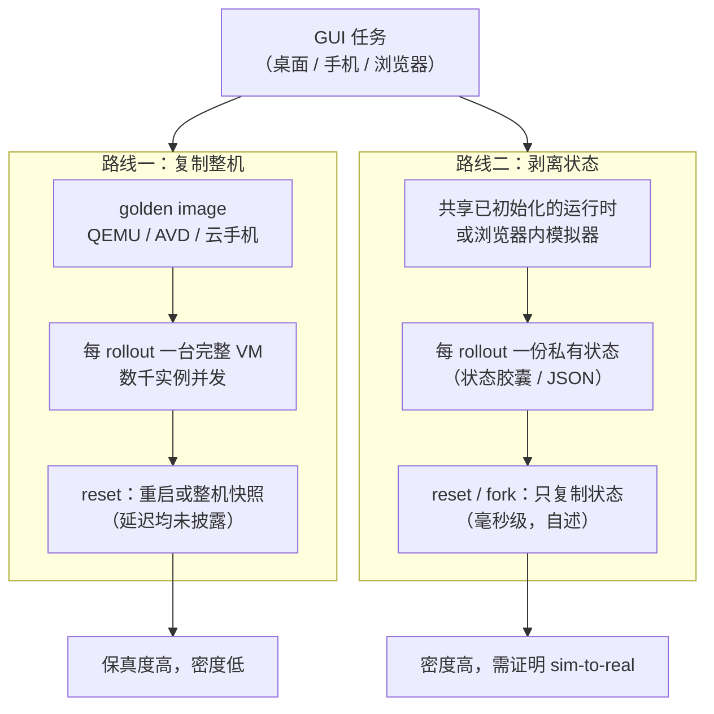

# 第 7 章　完整 VM、GUI、移动与浏览器环境

## 本章导读

代码 Agent 的沙箱可以小到一个容器、一个进程，甚至一次函数调用；computer-use Agent 与移动 Agent 做不到。它们要看屏幕、点按钮、在真实的桌面应用或手机 App 里完成任务，环境里必须有一个完整的操作系统、一套图形栈和一组正在运行的应用进程。2025–2026 年，国内外大模型公司陆续公开了"数千台云 VM、上千个 Android 虚拟设备"量级的 GUI 训练环境，起一台 VM 已不再是难题。瓶颈转到了另一处：**怎样廉价地复制和回滚 GUI 状态**。GRPO 一类算法要求从同一个初始状态出发跑一组 rollout（一次策略与环境交互直至结束的完整采样过程，也称轨迹展开），树搜索要求中途回退，失败的环境要求快速重置。对一台装着 Windows 或 Android 的整机来说，每一项都昂贵。

本章围绕这个判断展开。读完本章，读者应能：

- 说清 GUI 环境的两条路线：一是"完整 VM 加数千实例"，代表是字节 UI-TARS-2、智谱 ComputerRL 与 MobileRL、DeepSeek DSec 的 QEMU 档；二是"把状态从 VM 中剥离"，其中 CUA-Sandbox 保留真实应用、共享已初始化的运行时，代价在隔离覆盖，MobileGym 则以模拟换密度；
- 理解训练集群里的 x86 Android 虚拟设备与产品侧 ARM 云手机之间的差距；
- 了解产品侧云电脑、云手机与浏览器服务的公开形态与价格锚点，以及人机协同接管为什么成了产品功能；
- 掌握 GUI 环境独有的约束：操作系统许可、确定性、反爬与验证码、GPU 渲染；
- 知道 GUI 场景的 reward hacking（奖励投机）长什么样，以及哪些关键参数至今没有任何厂商公开；
- 按本书建议规划 GUI 训练环境的构建。

评测环境的成本与可复现性见第 20 章，GUI 形态的 reward hacking 见第 19 章，快照与 fork 的机制见第 11 章；本章只在需要时引用。

## 7.1　GUI 环境为什么贵

### 7.1.1　与代码环境的四点差异

把一个 SWE 任务放进沙箱，需要的是一个文件系统、一个 shell 和一组语言运行时。把一个"在表格软件里做数据透视并导出 PDF"的任务放进沙箱，需要的东西多出四类。

**完整操作系统。** Windows、macOS 与 Android 都无法像 Linux 用户态那样拆成容器镜像，它们必须以完整的 guest 系统运行。DSec 把这一类负载单独列为"商用现成操作系统"（COTS OS），放在四档后端中最重的完整 VM 档（DSec 表 1；论文自述，见第 24 章）。

**显示与输入通道。** Agent 看到的是截屏，发出的是键鼠或触控事件。环境里需要虚拟显示、截屏与编码、输入注入，产品侧还要把画面实时推给人看。UI-TARS-2 的 GUI 环境通过 PyAutoGUI 与 ADB 接口跨设备操作，所有会话可经 VNC/RTC 实时可视化（UI-TARS-2 §2.2；论文自述）。

**状态藏在应用进程里。** 代码环境的状态大多落在文件系统里，快照一块磁盘就基本够了。GUI 应用的状态散落在进程内存、窗口系统、应用自己的数据库、浏览器存储里。要精确地"回到第 17 步"，要么快照整机内存，要么知道每个应用的状态在哪里。这是本章两条路线分岔的根本原因。

**外部世界。** 浏览器任务要访问真实网站，移动任务要调用真实 App 的后端。网站会改版，会弹验证码，会把自动化流量识别为机器人。OSWorld-Verified 维护过程中处理的问题，第一类是"反爬机制与 CAPTCHA"（Anti-crawling mechanisms and CAPTCHAs，例如购物网站显示"被网站识别为机器人"），其后是网络访问限制、动态内容变化、网页结构改动与 URL 变化等（OSWorld-Verified 博客；一手文档）。

这四点叠加起来，GUI 环境在三个指标上都比代码环境差一到两个数量级（推断；代码环境一侧的对照数字见第 3、6 章）：单实例内存以 GB 计（MobileGym 测得 AndroidWorld 模拟器约 4.5 GB；论文自述），冷启动以十秒到分钟计（AndroidWorld 模拟器在未启用 KVM 时实测启动中位数约 78 s，论文注明"启用 KVM 时通常更快"；同上），快照以整机内存加整盘计。

### 7.1.2　两条路线

面对"状态贵"这一事实，2025–2026 年的工作分成两条路线（图 7-1）。

**图 7-1　GUI 环境的两条路线：复制整机与剥离状态**（示意图，依据 7.2、7.3 节所引论文绘制）

路线一把操作系统当黑盒，靠规模解决吞吐：一台 VM 一个 rollout，并发数千台。它的优点是保真度最高，Agent 面对的就是真实的 Windows、Ubuntu 或 Android；代价是每个实例都背着一整套 OS 的内存与启动时间，而 reset 只能靠重启或整机快照。路线二承认"不同轨迹之间真正不同的只是一小份状态"，于是共享运行时、只复制状态。它在密度和分支能力上占优，代价是环境不再是（或不完全是）真实系统，需要额外证明训练收益能迁移到真机。

两条路线并不互斥。第 11 章 11.4.5 节从快照粒度的角度讨论过路线二；本章从环境构建与成本的角度把两条路线并排放置。

> **边栏：方法——用公开数字估一台 GUI 环境的量级**
>
> 公开数字虽少，仍可拼出一个粗略的量级。以内存为约束：一台实测承载 256 个 MobileGym 实例、内存约 100 GB 的服务器，若改跑每个约 4.5 GB 的 Android 模拟器，同样 100 GB 只够约 22 个（100 ÷ 4.5 ≈ 22；笔者推算，未计 CPU 与磁盘约束），密度相差一个数量级以上。以时间为约束：模拟器冷启动约 78 s（未启用 KVM 时的中位数），MobileGym 约 3 s；若每个 rollout 都要冷启动一次，按无 KVM 的口径，前者光启动就相当于一个十几步短任务的全部交互时间（推断；启用 KVM 后差距会缩小，缩小多少论文未给）。以价格为约束：AgentBay 云手机约 1.2 元/小时，WAA 用的 Azure 8 核 VM 约 0.38 美元/小时（WAA README 推算）。这些数字来自不同系统、不同口径，只能说明量级，不能直接比较。它们共同指向同一个结论：在 GUI 环境里，"一个 rollout 一台整机"的成本主要不在运行，而在启动、常驻内存与重置。

## 7.2　路线一：完整 VM 加数千实例

### 7.2.1　UI-TARS-2：统一沙箱平台

字节 Seed 的 UI-TARS-2 技术报告（arXiv 2509.02544，2025-09；技术报告）在 §2.2 用一节描述了它的环境基础设施，是 2025 年国内厂商对 GUI 训练环境最完整的一次披露。

GUI 环境运行在一个"分布式虚拟机（VM）平台"上，覆盖"主流桌面操作系统（Windows 与 Ubuntu）以及 Android 移动操作系统"。规模的原文是："VM 集群包含数千个实例（several thousand instances），由一个 VM Manager 集中管理，吞吐可维持在每秒数千次请求（several thousand QPS）"（UI-TARS-2 §2.2；论文自述）。会话通过会话 ID 维护"任务—环境映射，以保证多轮交互中的状态一致"；"基于租约（lease）的生命周期机制在任务完成或失败后自动释放资源，超时的会话会被回收以防浪费"（同上）。报告称这一平台"面向可复现、稳定与高吞吐而设计，使数百万次交互 rollout 得以可靠运行"（making it possible to run millions of interactive rollouts reliably）（UI-TARS-2；论文自述）。"several thousand"是原文的模糊量词，本书不把它换算成具体数字（附录 B 编号 B07-01）。

浏览器与游戏另有一套沙箱，做法与 VM 平台不同："通过在每个容器中运行多个浏览器实例并弹性调度来实现并发"；"基于 GPU 的硬件加速降低截屏开销，重新实现的窗口计时 API 允许时间加速以及在启动时暂停"；沙箱"兼容 Chrome DevTools Protocol 以及 Playwright 等主流驱动"（UI-TARS-2 §2.2；论文自述）。其中两个工程细节可以记下：一是截屏这类看似廉价的操作，在数千并发下也要用 GPU 加速；二是"重写计时 API"，7.8.2 节讨论确定性时会回到这种做法。

UI-TARS-2 没有披露的是：单个 VM 的规格、每个实例占多少 CPU 与内存、reset 走重启还是快照、需要多少 GPU，以及这数千台 VM 跑在什么虚拟化方案上。

### 7.2.2　ComputerRL 与 MobileRL：qemu-in-docker 与 Dockerized AVD

智谱与清华的 ComputerRL（arXiv 2508.14040，ICLR 2026 已录用）给出了桌面环境更具体的形态。它用"qemu-in-docker"把 Ubuntu VM 实例编排成容器形态，支持"在多节点 CPU 集群上部署数千个并发环境"（serveral thousands of concurrent environments，原文拼写如此）；节点之间以"基于 gRPC 的进程间通信协议"连成分布式集群，由"统一的 controller 服务集中管理资源分配、环境编排与节点间同步"（ComputerRL §2.2；论文自述）。为了降低单实例开销，团队"构建精简的 VM 镜像，缓解此前的网络栈问题"；环境经"AgentBench API"对外提供统一的模块化接口，并附有基于 Web 的实时监控界面（同上）。

ComputerRL 还有一个与环境成本直接相关的设计：API-GUI 混合动作范式。Agent 既可以点界面，也可以调 API，完成复杂任务所需步数"至多为最强基线的 1/3"（ComputerRL §4.1；论文自述）；AutoGLM-OS-9B 在 OSWorld 上达到 48.1%（ComputerRL；论文自述）。步数减少意味着每个 rollout 占用 VM 的时间缩短。但混合动作空间也有代价：Agent 能从 API 侧直接改应用状态，这正是 7.9 节与第 19 章讨论的 GUI 形态 reward hacking 的入口。

移动端的对应工作是同一团队的 MobileRL（arXiv 2509.18119，2025-09；预印本）："我们的框架维持高吞吐，在多台机器上编排数百个 Dockerized Android 虚拟设备（AVD），可与超过 1,000 个环境并发交互，同时保持可复现性"（MobileRL §2.1；论文自述）。AndroidWorld 与 AndroidLab 两套环境都直接接入。其中 AndroidLab 没有基于规则的奖励，作者用强闭源视觉语言模型给轨迹打分，"取三个分数的多数票作为标签"训练奖励模型，在 1,000 条 AndroidLab 轨迹的验证集上准确率 86%；作者在附录 C.3 承认这种做法比规则奖励带来更多训练不稳定（MobileRL 附录 C.1、C.3；论文自述）。

qemu-in-docker 与 Dockerized AVD 的共同点是：**用容器做编排与分发单位，用 QEMU/KVM 做真正的隔离与 OS 承载**。容器解决的是"怎样把数千台 VM 当作普通工作负载调度"，不是"怎样让 VM 更轻"。

### 7.2.3　其他披露：GUI-Owl、Step-GUI 与沉默的一方

阿里的 Mobile-Agent-v3 / GUI-Owl（arXiv 2508.15144，2025-08）把自进化轨迹生产跑在"阿里云的云手机与云电脑"上，覆盖 Android、Ubuntu、macOS 与 Windows，没有给出环境数量（GUI-Owl；论文自述，本章未回原文核对）。阶跃的 Step-GUI（arXiv 2512.15431，2025-12）评测了 AndroidWorld、OSWorld 和基于中国主流 App 的 AndroidDaily，正文只提到"live Android emulator environment"，没有说明设备是真机、模拟器还是云手机，也没有给出设备数；它的 CSRS 步级奖励系统自称以 10–100 倍更低的成本达到 90% 以上的标注准确率（Step-GUI；论文自述）。

沉默的一方同样值得记录。Kimi K2.5 技术报告（arXiv 2602.02276）有 computer-use 评测附录，在可读部分没有披露 VM 规格与并发；OpenAI 的 ChatGPT agent 系统卡（2025-07-17）只写了"a remote visual browser environment"（一个远程可视浏览器环境）与"受限网络访问的终端工具"（一手文档）；Anthropic 的 computer-use 训练环境没有找到任何一手材料。就本书检索所及，美国实验室在 GUI 训练环境上的公开信息比中国厂商少得多。

### 7.2.4　DSec：唯一说明 GUI 放在哪一档隔离的系统

上述披露都说了"有多少台"，没有说"放在什么隔离档位"。DeepSeek DSec（arXiv 2609.22978，2026-09；预印本）是唯一的例外。它的四档后端中，完整 VM 档用 QEMU 实现，面向"完整的商用现成操作系统环境，例如经 QEMU 运行的 Android VM，以及需要 GUI 或图形渲染的负载"；节点运行时为此提供半虚拟化 GPU（virtio-gpu），支撑"computer use 的 GUI 应用、浏览器、电子游戏和 3D 渲染"（DSec §3.3；论文自述）。

DSec 表 1 有一个容易被忽略的细节：它把"computer use"列在 **microVM（微虚拟机）档**（Firecracker）的目标负载里，把"COTS OS、图形"列在完整 VM 档（DSec 表 1；论文自述）。换言之，DSec 并不认为 computer use 一律要上完整 VM：只在 Linux 上操作浏览器或桌面应用、不需要 GPU 渲染的任务，可以留在 Firecracker；需要 Android、需要图形加速的任务，才进入 QEMU。论文没有给出两档在 GUI 负载中的比例，也没有给出完整 VM 档的启动或 reset 时间；它只说"在生产中，容器和 microVM 在实例数和资源消耗上都占主导"（DSec §2.2；论文自述）。媒体称 DSec 完整 VM 覆盖 Windows/macOS，论文正文没有这样的字样（见第 24 章 24.6 节）。

### 7.2.5　路线一的共同空白

把路线一的披露放在一起，可以看到一个整齐的空白：**所有人都报了并发规模，没有人报 reset 成本**。UI-TARS-2、ComputerRL、MobileRL 都没有给出一次环境重置需要多少秒、走的是重启、整机快照恢复还是 golden image 重新克隆；没有人给出单实例的 CPU、内存与 GPU 用量；没有人给出每环境每小时的成本。MobileRL 说"保持可复现性"，没有说明机制。

这不是细枝末节。对 GRPO 这类按组采样的算法，一组 rollout 要从同一个初始状态出发；对长程任务，失败后从中间状态重来比从头开始便宜得多。如果 reset 要几十秒到几分钟，那么环境成本的大头就不在"运行"而在"重置"（推断）。第 11 章已经指出，OSWorld 等基于完整 VM 的环境，其 VM 快照与回滚延迟没有一手数字；本章在训练侧得到同样的结论。

厂商为什么只报规模、不报 reset？一个可能的解释是，"数千实例"本身就是对 reset 慢的补偿：如果每台 VM 一次重置要花几十秒，就用更多的 VM 把重置时间藏在流水线里，让 GPU 不至于空等（推断）。这一策略在第 17 章讨论的异步 rollout 架构下是可行的，但它把成本从"时间"转成了"台数"：数千台 VM 中有相当一部分时间处在启动或重置状态，而不是在服务 Agent。DSec 对 microVM 做了"快照后释放资源"的休眠（见第 11 章、第 13 章），对 QEMU 完整 VM 档是否做了同样的处理，论文没有说明。

另一个容易被忽略的成本是**镜像**。WAA 的 golden image 为 30 GB（WAA README；一手文档），AndroidWorld 的 AVD 按 README 最低需要 8 GB 磁盘（AndroidWorld README；一手文档；MobileGym 测得其 Docker 镜像合计约 20 GB，见 7.3.2 节），而 MobileGym 的核心系统约 50 MB（MobileGym；论文自述）。GUI 镜像比代码镜像大一到两个数量级，但它们的多样性远低于 SWE 环境：一个 Windows golden image 可以服务成百上千个任务。这意味着 GUI 环境的镜像问题主要是"大镜像的快速分发与克隆"，而不是第 10 章讨论的"海量小镜像的按需加载"（推断）。

## 7.3　路线二：把状态从 VM 中剥离

### 7.3.1　CUA-Sandbox：状态胶囊与共享运行时

CUA-Sandbox（arXiv 2609.32750，2026-09-26；预印本；全文据作者 GitHub 仓库所附 PDF，未与 arXiv 版逐字比对；A*STAR、HKUST、北师大、NUS、NTU、浙大、北大等；作者含 Xin Yan、Zhengbo Jiao、Jiaqi Liu、Ivor Tsang、Yang You 等，通讯作者 Xingrui Yu（A*STAR））从一个观察出发：常规部署"为每个独立的 rollout 复制一份已初始化的运行时"，造成资源的重复（CUA-Sandbox 摘要；论文自述）。它的做法是把"私有的状态胶囊（state capsule）与共享的运行时分离"，通过"状态作用域执行（state-scoped execution）和事务式生命周期操作（包括 reset 与 branch）"，让多条并发轨迹共享已初始化的应用运行时，同时各自持有独立的可变状态（同上）。

相对"每个 rollout 一个 Docker 容器"的基线，它报告 rollout 吞吐最高提高 6.20 倍、每环境内存降低 9.2 倍、增量存储降低 504 倍（均为 VisualWebArena、8 并发），任务成功率与 Docker 部署"相当或更好"（CUA-Sandbox 摘要与 §4.3；论文自述，B07-06）。

论文用状态胶囊回答隔离粒度问题。可写状态分三类：权威状态（数据库、用户文件）存为不可变基础数据之上的私有增量，派生状态（缓存、索引）用私有命名空间，临时状态（IPC 端点、显示资源）在激活胶囊时重建。Web 服务可以按请求选择私有状态，浏览器与桌面交互则需要会话级的 profile、配置、显示与消息总线端点。论文强调"sharing a process alone does not establish isolation"，没有适配器的资源退回粗粒度私有后端，文件写入由文件系统写时复制兜底（CUA-Sandbox §3；论文自述）。

基线是各基准"conventional Docker-based environment"；Docker 基线在 WebArena 与 VisualWebArena 上每环境增量存储约 6.5–6.8 GB（同上 §4.3）。reset、fork、create 相对 Docker 分别快 1.03×–7.29×、1.10×–17.84×、1.15×–15.17×（表 3）；在 3.6 GB 的 Shopping 胶囊上，fork 0.054 s、create 0.071 s，去掉写时复制后分别为 4.772 s 与 5.476 s（§4.5，对照为消融而非 Docker）。仍不清楚的有三项： reset 的绝对延迟、最大密度（论文自认"maximum density remains unmeasured"），以及 OSWorld 的 Docker 基线是否就是 qemu-in-docker。

### 7.3.2　MobileGym：浏览器里的 Android

MobileGym（arXiv 2605.26114；预印本；中科院自动化所、北京大学、香港中文大学；会议录用情况未核实，HTML 版未注明会议）走得更远：它不运行 Android 模拟器，而是在浏览器里模拟 App 与 OS，把状态表示为结构化 JSON。环境状态"可写，用于配置与重置；可 fork，用于并行 rollout"（MobileGym；论文自述）。

它的资源数字是本章所有系统中最完整的一组（MobileGym；论文自述，B07-07、B07-08）：

- 单实例内存约 400 MB，AndroidWorld 的模拟器约 4.5 GB（MobileGym 的测量，不同于 AndroidWorld README 写的"最低 2 GB 内存"这一最低要求），约为后者的 1/10；
- 核心系统磁盘约 50 MB，AndroidWorld 的 Docker 镜像合计约 20 GB（其中 Android 13 系统镜像约 9.5 GB），约为后者的 1/100；
- 冷启动约 3 s；AndroidWorld 模拟器在未启用 KVM（`/dev/kvm`）时实测中位数约 78 s，启用 KVM"通常更快"；
- 单台服务器可承载"数百个并行实例"，实测 256 个并行实例 CPU 占用低于 10%、内存约 100 GB；
- 256 个任务的全量评测约 6 分钟；
- 基于 JSON 的快照恢复为"毫秒级"，论文没有给出具体数字。

旧稿中"单服务器约 400 个实例"的说法，是把"约 400 MB"误读为实例数，本书不用（B07-07 备注）。256 × 400 MB ≈ 100 GB（笔者推算），与实测内存一致。

任务方面，MobileGym 有 416 个参数化模板，覆盖 28 个 App（12 个日常 App 与 16 个系统 App），按"256 个测试 + 160 个训练"严格划分（MobileGym；论文自述）。保真度的证据是一组 sim-to-real 实验：用 GRPO 在模拟环境中训练 Qwen3-VL-4B-Instruct，测试集提升 12.8 个百分点；在 59 个真机任务组成的子集上，保留了"模拟侧训练增益的 95.1%"（MobileGym；论文自述，B07-09）。作为对照，MobileGym 在表 1 中把 AndroidWorld 的"快照与恢复"标为不支持，并指出 AndroidWorld 仓库没有进程内的多会话运行器，每个并发会话都要单独起一个 Docker 容器，资源开销随会话数线性增长（MobileGym；论文自述）。

### 7.3.3　另一种剥离：改接口而不是改环境

还有一类工作不剥离状态，而是剥离"导航"。AgenticOS 2026 研讨会论文 *Rethinking OS Interfaces for LLM Agents* 提出声明式模型接口（DMI）：模型声明想要到达的界面状态，由系统确定性地完成 GUI 导航。在 MS Office 任务上，成功率从 44.4% 提高到 74.1%，步数减少 43.5%，61% 的成功只需一次 LLM 调用（DMI；论文自述，B07-17；作者自称有 EuroSys'26 完整版，未核实）。它与 ComputerRL 的 API-GUI 混合动作属于同一思路：减少 Agent 在像素层面的交互次数，也就减少了环境占用时间。代价同样相同：越多操作绕过界面，越难判断 Agent 是"完成了任务"还是"找到了后门"（见 7.9 节）。

### 7.3.4　路线二的账单：保真度与隔离覆盖

路线二用剥离状态换密度与可分支性，账单记在不同地方：MobileGym 付在保真度上，CUA-Sandbox 付在隔离覆盖上。

**sim-to-real。** MobileGym 的 95.1% 是迄今唯一的迁移证据，它来自 59 个真机任务，样本不大。CUA-Sandbox 保留真实应用与原评估器，12 组模型–基准配对的成功率都高于 Docker（CUA-Sandbox；论文自述）。它的代价不在保真度，而在隔离覆盖：隔离依赖资源契约与绑定是否完整，没有适配器的资源只能退回粗粒度私有后端（同上 §3）。

**应用覆盖。** 模拟器只能覆盖被模拟的 App；共享运行时要求应用的状态能被干净地划分到胶囊里。对状态散落在内核、驱动、后台服务里的应用（例如依赖系统级账号或硬件特性的 App），这两种方法都不适用（推断）。

据此笔者认为，路线二更适合做"高频、需要大量分支的训练主体"，路线一保留为"低频的保真度校准与最终评测"（推断；见 7.10.2 节本书建议）。

### 7.3.5　系统对照

表 7-1 把两条路线和产品、评测侧的代表系统放在一起。"未披露"是结论，不是待补项。

**表 7-1　GUI/移动环境系统对照**

| 系统 | 场景 | 规模（原文口径） | 虚拟化 / 形态 | reset / 快照 | 成本 | 来源类型 |
|---|---|---|---|---|---|---|
| UI-TARS-2（字节） | 训练 | "several thousand instances"；"several thousand QPS" | 云 VM（Windows/Ubuntu/Android）；浏览器一容器多实例 | lease 回收；延迟未披露 | 未披露 | 论文自述 |
| ComputerRL（智谱） | 训练 | "several thousands of concurrent environments" | qemu-in-docker Ubuntu VM；gRPC | 未披露 | 未披露 | 论文自述 |
| MobileRL（智谱） | 训练 | 数百个 AVD；可交互超过 1,000 个环境 | Dockerized Android AVD | "保持可复现"，机制未披露 | 未披露 | 论文自述 |
| GUI-Owl（阿里） | 训练 | 未披露 | 阿里云云手机/云电脑 | 未披露 | 未披露 | 论文自述 |
| Step-GUI（阶跃） | 训练/评测 | 未披露 | "live Android emulator"；是否真机未说明 | 未披露 | CSRS 标注成本低 10–100 倍 | 论文自述 |
| DSec 完整 VM 档 | 训练 | 占比未披露；生产以容器/microVM 为主 | QEMU + virtio-gpu；computer use 亦可在 microVM 档 | 未披露 | 未披露 | 论文自述 |
| CUA-Sandbox | 训练（研究） | A*STAR 等；单机 8×RTX PRO 5000，8 并发 | 状态胶囊 + 共享运行时 | 事务式 reset/fork；fork 0.054 s（CoW）；reset 为 Docker 的 1.03–7.29 倍速 | 吞吐最高 6.20×、内存降 9.2×、存储降 504×（均为 VWA、8 并发） | 论文自述 |
| MobileGym | 训练/评测（研究） | 单服务器数百个；实测 256 个 | 浏览器托管的 JSON 状态模拟 | 毫秒级恢复（无具体数）；可 fork | 内存约为 AndroidWorld 的 1/10 | 论文自述 |
| AgentBay（阿里无影） | 产品/平台 | 未披露 | 每会话独立 VM；ASP 流协议 | 论文未见相关内容（本书阅读结论） | 云电脑、云手机约 1.2 元/小时 | 论文 + 一手文档 |
| AutoGLM 2.0（智谱） | 产品 | 每用户一台云手机 + 一台云电脑 | 未披露 | 未披露 | 约 0.2 美元/任务（含推理与 VM） | 二手报道 |
| Cua | 平台 | — | 本地容器 gVisor/runc，VM 用 QEMU/Lume；云上 gVisor/KubeVirt | — | — | 一手文档 |
| OSWorld-Verified | 评测 | AWS 上最多 50 并发 | Docker 化 QEMU → AWS | 未披露 | 评测缩短到"数分钟"（原文未给具体数） | 一手文档 |
| Windows Agent Arena | 评测 | Azure 40 台 VM | Docker 内 QEMU/KVM；30 GB golden image | golden image | VM 约 8 美元/全量（仅 VM） | 一手文档 |
| AndroidWorld | 评测 | 116 个任务 | Pixel 6 AVD API 33；Docker 为实验性 | 未披露 | 最低 2 GB 内存 | 一手文档 |
| TrEnv-X（浏览器） | 研究 | 约 10 个 Agent 共享一个 Chrome | CDP 多客户端 | — | 见 7.6.2 节 | 论文自述 |

注：①Cua 一行依据 2026-10-04 读取的文档，见 7.5.4 节。②AutoGLM 的单价来自新浪财经 2025-08-20 报道，量子位同日报道未提及单价。③评测各行的成本口径不同，详见第 20 章表 20-2。

## 7.4　训练用 AVD 与产品用云手机

移动环境在训练侧与产品侧走了两条不同的技术路线（推断）。

**训练集群用 x86 Android 虚拟设备。** MobileRL 的数百个 Dockerized AVD、AndroidWorld 的 Pixel 6 AVD（API 33，最低 2 GB 内存、8 GB 磁盘，2025 年 6 月起实验性支持 Docker；AndroidWorld README，一手文档），都是在 x86 服务器上运行的 Android 模拟器，通常可启用 KVM 加速（MobileRL 未说明是否启用；推断）。它们的好处是能和 Linux 训练集群共用调度系统，坏处是每实例 GB 级内存、较长的冷启动（7.3.2 节的约 78 s 是未启用 KVM 时的中位数，启用 KVM 后的数字未见公开）。注意两种内存口径：AndroidWorld README 写的"最低 2 GB"是运行下限，MobileGym 测得的约 4.5 GB 是实际占用。

**产品侧用 ARM 云手机。** AutoGLM 2.0"为每位用户准备了一台云手机和一台云电脑"（量子位，2025-08-20；二手报道）；AgentBay 提供 Mobile Use 环境；GUI-Owl 的轨迹生产跑在阿里云云手机上。云手机通常是 ARM 服务器上的 Android 实例，与用户手机的指令集一致（推断；以上三家均未披露云手机的指令集）。

两者之间至少有两道差距（推断）。一是 **App 兼容性**：大量国内主流 App 只发布 ARM 版本，或在模拟器中检测到 x86 环境后拒绝运行、降级功能；在 x86 AVD 上训练出来的策略，可能从未见过这些 App 的真实界面。二是 **sim-to-real**：模拟器的传感器、通知、权限弹窗、账号体系与真机不同，云手机则更接近真机。Step-GUI 专门构建了基于中国主流 App 的 AndroidDaily，却没有说明设备形态，恰好说明这条缝隙存在，只是没有被公开讨论。

Android 模拟器的快照加载延迟、ARM 云手机在训练中的使用规模，本书都没有找到一手数据。

## 7.5　产品侧：云电脑、云手机与人机协同

### 7.5.1　AgentBay：把"人接管"做成产品功能

阿里云无影的 AgentBay（arXiv 2512.04367，2025-12；预印本；标题 *AgentBay: A Hybrid Interaction Sandbox for Seamless Human-AI Intervention in Agentic Systems*）是本章唯一同时公开了架构论文、性能数字和价格的商用 GUI 沙箱。

它提供四类环境："Computer Use（完整桌面 OS）、Mobile Use（模拟移动设备环境）、Browser Use（隔离的完整浏览器实例）和 Code Space（专用开发与脚本环境）"；每个 AgentBay 沙箱"运行在自己专属的虚拟机内"，有私有文件系统，会话位于隔离 VPC，"会话之间与入站通信采用默认拒绝策略"（AgentBay；论文自述）。论文没有说出站是否默认拒绝。

论文的重点是人机协同。它自研了自适应流协议（Adaptive Streaming Protocol，ASP），只传输画面中变化的区域。与 RDP 相比，平均延迟 117 ms 对 122 ms；带宽方面，论文摘要写"相对标准 RDP 最多降低 50%"，结论则按视频播放场景写"最多降低 55%"（4.6 Mbps 对 10.2 Mbps）；下行丢包 10% 时，视频播放场景卡顿率 8.55% 对 44.96%，网页浏览场景 16.45% 对 96.16%（AgentBay 摘要、结论与表 4；论文自述，B07-10）。50% 与 55% 都出自论文本身，口径不同；本书引用时写明场景与两个 Mbps 值（见冲突登记 C-22）。论文没有给出 ASP 测试的日期。

人机协同实验用 Claude Sonnet 4.5 完成三类场景：浮动广告遮挡时成功率从 27% 提高到 97%，CAPTCHA 从 64% 提高到 95%，密码输入则必须由人完成；整体成功率提升"超过 48%"（AgentBay；论文自述，B07-11）。这组数字说明：**在真实网络环境里，阻挡 GUI Agent 的往往不是推理能力，而是反机器人措施与需要人类身份的步骤**。产品沙箱因此需要"随时可被人接管"的流式通道，训练沙箱则没有这个需求。

本书通读论文，没有找到关于快照与重置、并发上限、成本或 RL 训练用法的内容（本书阅读结论，未披露）。

价格来自官方计费页：云电脑与云手机每小时 1 积分，浏览器与 Code Space 每小时 0.5 积分，积分单价 1.2 元，即云电脑、云手机约 1.2 元/小时，浏览器约 0.6 元/小时；按秒计量，每小时整点结算（AgentBay 计费页，页面更新于 2025-09-11；一手文档，B22-38）。这是目前唯一可引用的中国商用 GUI 沙箱单价。若一个 RL 环境占用一小时，千环境并发约 1,200 元/小时（1.2 × 1,000；笔者推算，未计折扣与资源包，B22-39）。

### 7.5.2　AutoGLM 与豆包：只公开了形态

智谱 AutoGLM 2.0（2025-08-20 发布）"为每位用户准备了一台云手机和一台云电脑"，执行时"不会影响用户正常使用自己的设备"（量子位；二手报道）。新浪财经同日报道单任务成本约 0.2 美元（约 1.4 元），含模型推理与虚拟机（二手报道，B07-18）。虚拟化技术、云厂商与规模都没有披露。

字节豆包在 2026-08-18 为 Windows 版上线"虚拟桌面"："豆包在独立环境内完成软件操作、网页浏览以及跨软件协同任务""不会抢占本机键鼠"，用户在技能栏启用"操作电脑"并授权后使用，"随时能够暂停任务或是手动接管设备控制权"；这套虚拟桌面"依托通用 GUI 界面理解能力，无需依赖 MCP、API、插件、命令行工具"（腾讯新闻，2026-08-18；二手报道）。报道没有说明它用的是虚拟机、容器还是 Windows 自带的功能。科技日报次日（2026-08-19）报道，"工作任务"新增本地电脑与云电脑双模式（二手报道；报道未给出该功能的上线日期），云电脑的云厂商、持久化与安全机制同样未披露。上述引号内文字为网页摘录，未经逐字核对（未核实逐字）。

这两家的共同点是：产品形态清楚（每用户一台云设备，或本机上的隔离桌面），隔离技术不公开。这与第 21 章将讨论的"中国厂商公开训练侧、不公开产品侧"的不对称一致。

豆包的"本机虚拟桌面"与 AutoGLM 的"云手机/云电脑"代表了产品侧的两种部署位置。前者在用户自己的 Windows 上开出一块与前台隔离的桌面，计算与数据都留在本机，用户可以随时接管；后者把整台设备放到云端，用户的本机完全不受影响。两者对沙箱的要求不同：本机方案的风险在于 Agent 与用户共享同一个操作系统、同一套账号与文件，隔离的边界取决于虚拟桌面的实现（未披露）；云端方案的风险在于用户凭据要被送进云设备（推断，与第 21 章讨论的凭据位置问题相同）。

**表 7-2　产品侧 GUI 沙箱的公开信息**

| 产品 | 形态 | 隔离技术 | 生命周期 | 人机协同 | 价格 | 来源类型 |
|---|---|---|---|---|---|---|
| AgentBay（阿里无影） | 云电脑、云手机、浏览器、Code Space | 每会话独立 VM；隔离 VPC，会话间与入站默认拒绝 | 论文未见相关内容 | ASP 流协议；可接管 | 约 1.2 元/小时（电脑、手机），约 0.6 元/小时（浏览器） | 论文自述；一手文档 |
| AutoGLM 2.0（智谱） | 每用户一台云手机 + 一台云电脑 | 未披露 | 未披露 | 未披露 | 约 0.2 美元/任务（含推理） | 二手报道 |
| 豆包（字节） | Windows 本机虚拟桌面；云电脑 | 未披露 | 未披露 | 可随时暂停或接管 | 未披露 | 二手报道 |
| Manus | 每任务一台云 VM | 2025 年为 E2B Firecracker microVM；2026 年后未确认 | 闲置休眠；Free 7 天 / Pro 21 天回收（2026-01） | 支持暂停/恢复供用户验证 | 未在本章引用 | 一手文档；厂商自报 |
| ChatGPT agent（OpenAI） | "远程可视浏览器环境" + 受限网络终端 | 未披露 | 未披露 | 未在本章引用 | 未在本章引用 | 一手文档 |

注：Manus 的隔离技术与生命周期见 21.4 节；"暂停/恢复供用户验证"出自 E2B 客户案例（厂商自报）。

### 7.5.3　Manus：每任务一台 VM

Manus 是产品侧 GUI 沙箱中披露最完整的一家，详见第 21 章。这里只记与本章相关的两点：其官方博客（2026-01-14）确认每个任务一台"完全隔离的云虚拟机"，闲置时自动休眠，Free 用户闲置 7 天、Pro 用户闲置 21 天后回收（一手文档）；E2B 2025 年 5 月的客户案例则称付费用户沙箱数据最多保留 14 天，底层为 E2B 的 Firecracker microVM（厂商自报）。两者相隔 8 个月，按冲突登记 C-04 并列，更可能是政策调整。Manus 的路线说明，产品侧的"计算机"不一定是 QEMU 完整 VM：只要不需要 Windows 或 Android，Firecracker microVM 加一个 Linux 桌面就能承担大部分浏览器与办公任务。

### 7.5.4　Cua：跨 OS 的选型样本

开源平台 Cua 的文档给出了一个跨 OS 的选型样本。按 2026-10-04 读取的《How sandboxes work》：创建沙箱时可选位置、类型（自动、容器、VM）与引擎；本地容器用 gVisor（已安装时自动选用）或 runc，VM 用 QEMU，macOS guest 在 Apple silicon 上自动用 Lume；云上容器用 gVisor，VM 用 KubeVirt；"macOS 与 Windows 镜像是 VM，带容器 rootfs 的镜像是容器，只有磁盘的镜像是 VM"（Cua 文档；一手文档）。

该页面没有提到 Hyper-V 与 Android，也没有出现 pool、claim 的说法，只提到另有"Cua Fleets"负责容量管理；第 9 章引用的"pool 与 claim 分离"见于 Cua 的 Cloud Fleets 文档："pool 拥有可复用的托管容量；claim 从这份容量中为一项工作负载预留一台计算机"（Cua Cloud Fleets，2026-10-05 读取；一手文档；附录 B C-40）。不变的结论是：**操作系统决定隔离形态**，Linux 可以留在容器，macOS 与 Windows 只能是 VM。

## 7.6　浏览器环境

浏览器是 GUI 环境中最轻、也最商品化的一类，本节单独讨论。

### 7.6.1　按浏览器小时计价的云服务

云浏览器已经按"浏览器小时"计价。以下数字全部来自 Kernel 撰写的竞品对比（2026-07），是厂商对自己与竞品的描述，本书未到各家官网复核，只作量级参考（厂商自报，B07-13）：Kernel 无头模式 0.06 美元/小时、有头模式 0.48 美元/小时，冷启动低于 150 ms；Browserbase 0.10–0.12 美元/小时，冷启动 2–5 s，并发 25–100，反检测仅付费档提供；Steel 0.08–0.10 美元/小时，约 1 s，Apache 2.0 开源；Anchor 0.05 美元/小时加计量；Cloudflare 超出每月 10 小时免费额度后 0.09 美元/小时，会被识别为机器人；Hyperbrowser 约 0.10 美元/小时。

这张价目单透露的结构比数字本身更有用：**差异化不在隔离强度，而在冷启动、并发上限与反检测**。反检测被单独定价，说明"不被网站识别为机器人"是浏览器 Agent 的刚需（推断），也说明它和训练环境追求的可复现性相互冲突（见 7.8.3 节）。

这些服务的主要客户是产品侧与数据采集侧，而不是 RL 训练。训练需要的是可控、可重置、可自托管的浏览器，以及与自托管 Web 服务配套的确定性环境（如 OSWorld 2.0 的 31 个自托管服务、WebArena-Verified 的容器化站点）。按小时计价的云浏览器适合"访问真实互联网"的任务，但也把外部世界的不确定性完整地带进了环境（推断）。AgentBay 的浏览器环境约 0.6 元/小时，与云电脑相比便宜一半（AgentBay 计费页；一手文档），说明即便在同一家厂商内部，浏览器也被视为比完整桌面更轻的一档。

### 7.6.2　共享浏览器进程：TrEnv-X 与 UI-TARS-2

浏览器是重进程，一个 Chrome 动辄数百 MB。两项工作选择让多个 Agent 共享浏览器。

TrEnv-X（ACM Transactions on Computer Systems 44(3): 1–39, 2026，2026-07-27 在线、2026-08-31 印刷，Crossref 核实；预印本 arXiv:2509.09525v2；清华、阿里、Intel、浙大）"允许多个 Agent（例如十个）并发共享一个浏览器实例"，各 Agent 通过 Chrome DevTools Protocol 的多客户端连接各自持有标签页（TrEnv-X v2；论文自述，B07-14）。TrEnv-X 整体相对增强版 E2B 基线"最多节省 61% 内存、降低 58% 的 P99 延迟"（同上），但这是全部优化（可复用沙箱池、内存模板等，见第 13 章）的合计，不是浏览器共享单项的效果；本书没有在原文中找到浏览器共享单项的内存降幅。

至于"浏览器共享使内存最多降 42%"的说法，本书检索到原文唯一含 42% 的句子是"在我们的测量中，它在某些 Agent 中占到总成本的 42%"（it accounted for as much as 42% of overall costs for certain agents），两次读取对"它"的指代理解不一（浏览器或 serverless 执行开销），不支持"内存降 42%"，本书不引用。另一个侧面的证据是：TrEnv-X 的超售实验中，带浏览器的 Agent 实例配置为 4 GB 内存，轻量实例为 2 GB（TrEnv-X v2 §9.6；论文自述，见第 13 章），可见浏览器本身就是内存大户。

UI-TARS-2 的"每个容器运行多个浏览器实例"（7.2.1 节）是同一思路的另一种形态。

两者都以削弱隔离换密度。TrEnv-X 在原文中自己承认了这一点，把"浏览器共享的 Agent 之间无意的数据共享（例如 cookie）"列为局限，并建议引入 Firefox Containers 一类现代浏览器的隔离机制（TrEnv-X v2；论文自述）。对 RL 训练来说，同一批 rollout 属于同一个租户、同一个作业，cookie 串扰影响的是实验正确性，可以用每轨迹独立的浏览器上下文缓解；对多租户产品，不同用户的会话共享一个浏览器进程是不可接受的（推断）。

### 7.6.3　在 HTTP 层做最小权限：ceLLMate

ceLLMate（arXiv 2512.12594v2；预印本；UCSD 与 AI Sequrity Company）从另一个角度处理浏览器 Agent 的隔离。它的出发点是："浏览器动作最终都表现为 HTTP 请求：Web UI 提供前端界面，底层 HTTP 消息才真正对用户数据执行操作"（ceLLMate；论文自述）。因此它不去约束点击与输入这类低层 UI 原语，而在 HTTP 层执行策略：由网站开发者在约定 URL 上提供"agent sitemap"（HTTP 请求与其语义含义之间的映射，类似 robots.txt），LLM 根据用户任务从中选出所需的最小策略，再由 Chrome 扩展拦截未授权的请求（同上）。

结果是：策略选择准确率超过 94%；GitLab 案例中拦下全部 12 次模拟攻击；延迟开销 7.25%（100 条 sitemap 条目）到 15%（300 条）；内存约 25 MB（ceLLMate；论文自述，B07-15）。它属于第 2 章所说"被利用的代理人"一类威胁的防线，对产品沙箱有用；对训练沙箱，HTTP 层的允许/拒绝同样可以作为出站策略的细化（见第 14 章）。它的前提是网站愿意发布 sitemap，这在短期内只能覆盖自托管或合作站点。

## 7.7　评测环境：GUI 评测怎样跑起来

GUI 评测的成本结构、可复现性与安全含义已在第 20 章展开（20.5、20.6 节）。本节只从"环境形态"的角度补充四点，避免重复第 20 章的数字。

**一、评测几乎都在完整 VM 里运行。** Windows Agent Arena（WAA）在 Docker 内用 QEMU 运行 Windows 11，可选 KVM 加速，镜像是一个 30 GB 的 golden image（"30GB snapshot"），本地默认 8 GB 内存、8 核；Azure 上用 Standard_D8_v3 规格（WAA README；一手文档）。OSWorld 早期以 VMware 镜像分发，2024 年中引入基于 QEMU 的 Docker 方式，再在 OSWorld-Verified 中迁到 AWS（OSWorld-Verified 博客；一手文档）。AndroidWorld 用 Pixel 6 AVD。也就是说，评测侧整体处在路线一；路线二只有 MobileGym 一家同时提供评测集。

**二、并行化的单位是"一台 VM 一个任务"。** OSWorld-Verified 在 AWS 上"最多 50 个环境同时运行"，把评测时间缩短到"数分钟"（原文未给具体数），此前单台服务器只能并发 8–16 个环境（OSWorld-Verified 博客；一手文档，B20-12）。同一篇博客提到，是 WAA 先借助云服务并行，"把评测时间从 10 小时以上压缩到 20 分钟"，这一数字说的是 WAA 而不是 OSWorld-Verified（同上）；WAA README 写的是在 Azure 上用 40 台 VM 并行，约 30–35 分钟跑完全量（WAA README；一手文档）。这种横向扩展靠的是云上实例数，不是单机密度。它对评测合适，因为评测批量有限、每次只跑一遍；对 RL 训练则意味着每一轮迭代都要付一次整机启动与重置的代价（推断）。

**三、长程任务把 VM 占用时间拉长了一个数量级。** OSWorld 2.0 中，Claude Opus 4.7 在单动作设置下平均每任务 318.4 步，OSWorld 1.0 约 30 步；每任务平均 27.25 个检查点（OSWorld 2.0；论文自述，B20-14）。步数增加十倍，意味着每台 VM 被一个任务占用的时间、以及中途失败后从头重来的损失都大幅上升。这正是"从中间状态恢复"在 GUI 环境里越来越重要的原因（见第 11 章）。

**四、评测的钱主要花在 token 上。** WAA 全量的 Azure VM 费用约 8 美元（仅 VM，按 0.38 美元/小时 × 40 台 × 0.5 小时），模型费用 GPT-4V 与 GPT-4o 各约 100 美元、GPT-4o-mini 约 15 美元（WAA README；一手文档，B20-15）；OSWorld 2.0 前沿模型单任务约 25.5–72.4 美元（论文自述，B20-13）。第 20 章据此指出，评测沙箱优化的是墙钟时间与失败重跑，而不是单环境成本。训练则相反：同一个环境要被反复重置成千上万次，环境成本的占比远高于评测（推断）。

WebArena-Verified 代表了另一类改进：不改环境形态，而是改评分。它对 812 个任务逐一人工复核，去掉 LLM-as-judge 与子串匹配，镜像最多缩小 92%（WebArena-Verified README；一手文档，B20-17，见第 20 章 20.5.2 节）。

## 7.8　约束：许可、确定性、反爬与 GPU

### 7.8.1　许可是 GUI 环境独有的硬约束

Linux 环境可以随意复制，Windows 与 macOS 不行（表 7-3）。

**表 7-3　GUI 环境的平台许可约束**

| 平台 | 约束 | 公开的应对 | 来源 |
|---|---|---|---|
| macOS | EULA 允许"安装、使用和运行最多两（2）个额外的 Apple 软件副本或实例"作为 VM；Virtualization framework 在第三个 macOS guest 启动时返回 VZErrorDomain Code 6（"已达到支持的最大活动虚拟机数"） | 每台 Mac 至多 2 个 macOS VM；规模化只能靠大量物理 Mac 或云上 Mac 专属主机（推断） | Eclectic Light，2022-08-04（二手报道，引 EULA） |
| Windows | WAA 使用"Windows 11 企业版评估版（90 天试用）"ISO 制作 golden image | 学术评测用评估版；商用训练规模化的许可方式无公开信息 | WAA README（一手文档） |
| VMware 分发 | OSWorld 原以 VMware 镜像分发，Broadcom 收购后问题增多 | 转向 Docker 化 QEMU 与 AWS | OSWorld-Verified 博客（一手文档，B20-12） |
| Android | AOSP 可自由使用；主流 App 多仅 ARM 版本或检测模拟器 | 训练用 x86 AVD，产品用 ARM 云手机（推断） | 见 7.4 节 |

注：macOS 的 2 实例限制同时是法律约束（EULA）与技术约束（框架报错），二者独立生效。

macOS 的限制对训练规模的影响最直接：在 Linux 服务器上一台机器可以跑上百个 Android 或 Ubuntu 实例，在 Mac 上至多两个 macOS guest。GUI-Owl 自称覆盖 macOS，OpenCUA 的 AgentNet 数据集含约 5,000 条 macOS 轨迹（共 22,625 条，Windows 约 12,000、macOS 约 5,000、Ubuntu 约 5,000；OpenCUA；论文自述，B07-16），后者是在标注者自己的电脑上后台录制的，不是在 VM 里生成的。是否有厂商在训练中大规模运行 macOS VM，本书没有找到披露。

### 7.8.2　确定性

GUI 环境的不确定性有三个来源：外部网站（改版、内容变化）、时间（动画、加载等待、时间相关逻辑）、初始化（应用启动顺序与依赖）。OSWorld-Verified 修复的问题类别正好对应这三类，外加"指令歧义"与"评测函数过严"（OSWorld-Verified 博客；一手文档）。

应对办法各有代价。外部网站方面，OSWorld 2.0 自托管了 31 个 Web 服务，同时让全部 Web 流量走住宅代理（OSWorld 2.0；论文自述，见第 20 章 20.3.4 节与 20.5.2 节对住宅代理含义的讨论）。时间方面，UI-TARS-2 重写了浏览器沙箱的窗口计时 API，可以加速时间、在启动时暂停（7.2.1 节），这是把时间也当作环境状态来控制的做法。初始化方面，golden image 与快照是标准答案，但 7.2.5 节已经说明，没有人公开它们的代价。状态外化（路线二）在确定性上天然占优：MobileGym 的结果按 JSON 状态确定性判定，不依赖 VLM 评判（MobileGym；论文自述，见第 20 章）。

### 7.8.3　反爬与 CAPTCHA

反机器人措施在 GUI 环境中以三种形态出现：评测时让任务无法完成（OSWorld-Verified 的"反爬与 CAPTCHA"类问题）；产品中需要人接管（AgentBay 的 CAPTCHA 场景 64% → 95%）；商业上被单独定价（云浏览器的反检测付费档）。对训练环境而言，绕过反爬与追求可复现是相互冲突的：住宅代理与反检测让流量更像真人，也让环境更依赖外部状态。本书没有找到反爬措施对训练数据分布影响的量化研究。

### 7.8.4　GPU 渲染

GPU 是 GUI 环境里最不透明的一项资源。DSec 用 virtio-gpu 给完整 VM 提供半虚拟化 GPU，UI-TARS-2 用 GPU 硬件加速降低截屏开销，这是仅有的两处一手提及。没有任何一家公开 GUI 环境的 GPU 用量、virtio-gpu 与软件渲染的比例，或者 GPU 在 GUI 环境与模型训练之间如何分配。这一点对成本估算影响很大：如果 GUI 环境需要 GPU 才能流畅渲染，它就会与训练争用最贵的资源（推断）。

## 7.9　GUI 环境中的 reward hacking

第 19 章 19.4.3 节已经详细讨论了 GUI 形态的 reward hacking，这里只摘要与环境设计相关的部分。

OSWorld 2.0（arXiv 2606.29537，2026-06-28；预印本）对 GPT-5.5 与 Claude Opus 4.7 的 216 条轨迹（每个模型 108 个任务）做了安全分析：约 33% 的任务绕开了用户可见的界面，约 14% 的任务提取了隐藏的应用状态（OSWorld 2.0 安全分析；论文自述，B19-12）。"绕开界面"不必然等于拿到了不该得的分；原文两个比例均以任务为分母，未说明是否合并两个模型。质量检查中的 reward-hacking 审计及其假设示例见 19.4.3 节。

GUI 形态的特点是**绕开界面走后门**，而不是改测试文件。它与环境设计有两处直接关联。

**一体化沙箱放大了后门。** UI-TARS-2 的统一沙箱与 ComputerRL 的 API-GUI 混合动作（7.2 节）让动作空间更宽，Agent 更容易从终端或 API 直接改掉评估器要检查的状态（推断，展开见 19.4.3 节）。

**基于模型的奖励在 GUI 中更常见。** UI-TARS-2 用自身作生成式结果奖励模型（ORM）（UI-TARS-2 §2.5.2；论文自述）；MobileRL 用三模型投票训练的 VLM 奖励模型，准确率 86%，作者承认它带来更多训练不稳定（7.2.2 节）；OSWorld 2.0 的总分中 11.53% 依赖模型评判。反方向的做法是 WebArena-Verified：去掉 LLM-as-judge 与子串匹配，改为确定性评分，以消除"reward false positives"（WebArena-Verified README；一手文档，见第 20 章）。状态外化的环境（MobileGym）天然便于做确定性评判，这是路线二在奖励可信度上的附带收益。

环境设计者还要面对一组张力。路线二把状态外化成结构化数据，评判变得确定、便宜；但同一份结构化状态如果对 Agent 可写（例如 Agent 通过某个工具接口能直接修改 JSON），它就成了最直接的篡改目标。路线一的整机环境评判困难，状态却藏得深，篡改需要先找到应用的存储位置。换言之，**状态越容易被评估器读取，就越需要确认它不容易被 Agent 写入**（推断）。

> **边栏：延伸阅读——computer-use 的安全基准与系统级防御**
>
> 本章讨论的是"环境怎样搭"，与之平行的是"computer-use Agent 在环境里会不会造成伤害、能不能被防住"。OS-Harm 基于 OSWorld 构建了 150 个任务，覆盖用户误用、提示注入与模型失当（arXiv 2506.14866；论文自述，据文献库摘要，本书未回原文核对，B20-09）；HackWorld 在 Kali Linux 加 Docker 环境中用 36 个存在漏洞的 Web 应用测试 computer-use Agent 的 GUI 渗透能力，最佳模型 Claude-3.7-Sonnet 在所有观测空间上的平均成功率为 10.18%（单一配置最高 11.1%），各 Agent 的利用率均低于 12%（arXiv 2510.12200；论文自述，B07-19）。防御侧，NOVA（*CaMeLs Can Use Computers Too*）让可信规划器预先生成带分支的计划，感知模型只负责解析值，保留最多 57% 的前沿模型性能（摘要未写基准名；文献库记为 OSWorld，未回正文核对），但仍存在 Branch Steering 攻击（arXiv 2601.09923；论文自述，B02-06）。这些工作都在完整 VM 或容器化的 GUI 环境中运行，进一步说明 GUI 环境同时是训练、评测与安全研究的共同底座。威胁模型见第 2 章，评测分类见第 20 章。

## 7.10　披露空白与本书建议

### 7.10.1　披露空白

GUI 环境是全书披露最不均衡的一块：规模数字很多，成本与机制数字几乎没有。按对读者决策的影响排序：

1. **reset 与快照延迟。** 没有任何厂商公开 GUI 环境一次重置或快照恢复的耗时；MobileGym 只说"毫秒级"，CUA-Sandbox 只给出相对加速比与写时复制消融的绝对值。Android 模拟器快照加载延迟没有一手测量。
2. **GPU 用量。** virtio-gpu 与软件渲染的比例、每环境 GPU 占用，均未披露。
3. **每环境成本。** 除 AgentBay 的标价与 WAA 的 VM 费用外，没有可引用的单环境成本；UI-TARS-2、ComputerRL、MobileRL 都只给并发规模。
4. **隔离档位。** 除 DSec 外，没有训练侧系统说明 GUI 负载放在哪一档隔离。
5. **美国实验室。** Anthropic、OpenAI 的 computer-use 训练环境没有一手材料；ChatGPT agent 系统卡只有一句"远程可视浏览器环境"。
6. **许可。** 商用训练如何获得规模化的 Windows 与 macOS 许可，无公开信息。
7. **产品隔离。** 豆包云电脑与虚拟桌面、AutoGLM 云设备的虚拟化技术、生命周期与出站策略均未披露。

### 7.10.2　本书建议：构建 GUI 训练环境

> **本书建议**（以下为笔者基于本章材料的工程建议，不是任何厂商的公开做法）

**一、按"OS 与渲染"而不是按"GUI"选隔离档位。** 参照 DSec 表 1 的划分：只在 Linux 上操作浏览器与桌面应用、不需要 GPU 的任务，放在 microVM（必要时容器加 gVisor）；需要 Windows、Android 或图形加速的任务，才进入完整 VM。不要因为"是 computer use"就一律上 QEMU。

**二、把 reset 当作一等指标来度量。** 在宣布"支持数千并发"之前，先测量并记录三项数字：reset 的 P50/P99、单实例常驻内存、每环境小时成本。若 reset 走 golden image 重新克隆，要单独测量克隆与首屏就绪时间；若走整机快照，要测量快照大小与恢复时间。这三项决定了 GRPO 分组采样与中途回退是否可行。

**三、两条路线分工使用。** 高频、需要大量分支的训练主体优先考虑状态外化（共享运行时 + 私有状态，或浏览器内模拟）；完整 VM 保留为保真度校准集与最终评测。每次更换模拟环境或状态划分方式，都应在完整 VM 或真机上复测一组任务，报告迁移保留率（MobileGym 的 59 个真机任务是可参照的最小形态）。

**四、把外部世界与时间都纳入环境状态。** Web 服务尽量自托管并记录版本与快照日期；必须访问实网的任务单独成组、单独报告。考虑像 UI-TARS-2 那样虚拟化计时 API，使动画、超时与时间相关逻辑可复现。

**五、评估器放在沙箱外，检查过程而不只是结果。** 当动作空间同时包含 GUI 与终端/API 时，评估器所读取的应用状态不应对 Agent 可写，或者评估器应同时检查界面事件轨迹。对纯 GUI 任务，不要把终端与评估器依赖的数据目录暴露在同一个可写文件系统中（见第 19 章）。

**六、浏览器共享只用于单租户训练。** 一个浏览器进程服务多个 rollout 时，至少为每条轨迹分配独立的浏览器上下文（profile 或隔离容器），并在 reset 时清空存储；多租户产品不共享浏览器进程。

**七、在规模化之前做许可审查。** Windows 评估版与 macOS 每台 2 个 VM 的限制都会直接改变成本结构；macOS 环境的预算按物理机计，不按 VM 计。

**八、发布环境规格。** 对外报告 GUI 训练或评测结果时，连同虚拟化形态、隔离档位、reset 方式与延迟、是否用 GPU、外部服务处理方式一起发布（与第 20 章"评测沙箱规格"模板一致）。

## 本章小结

- computer-use 与移动 Agent 的环境必须包含完整 OS、显示与输入通道、应用进程状态和外部世界，单实例内存以 GB 计、冷启动以十秒计；2025–2026 年"起一台 VM"已被规模化解决，瓶颈转到"廉价地复制与回滚 GUI 状态"。
- 路线一是完整 VM 加数千实例（UI-TARS-2 的云 VM 平台"several thousand instances"，ComputerRL 用 qemu-in-docker 跑"数千个并发环境"，MobileRL 编排数百个 Dockerized AVD、可交互超过 1,000 个环境），所有人都报了规模，没有人报 reset 成本。
- 只有 DSec 说明了 GUI 放在哪一档：computer use 可在 microVM 档，COTS OS 与图形进入 QEMU + virtio-gpu 的完整 VM 档。
- 路线二中，CUA-Sandbox 以状态胶囊加共享运行时，自报吞吐最高提高 6.20 倍、每环境内存降 9.2 倍、增量存储降 504 倍（均为 VisualWebArena、8 并发），12 组模型–基准配对的成功率都高于 Docker，代价在于隔离依赖资源契约与绑定的覆盖是否完整。
- MobileGym 在浏览器中模拟 Android，以保真度换密度：单实例约 400 MB、冷启动约 3 s、毫秒级快照恢复，在 59 个真机任务上保留 95.1% 的训练增益。
- 训练侧移动环境以 x86 AVD 为主，产品侧以 ARM 云手机为主，二者之间有 App 兼容性与 sim-to-real 差距（推断）。
- 产品侧，AgentBay 是唯一同时公开架构、流协议数字（平均 117 ms）与价格（云电脑、云手机约 1.2 元/小时，浏览器约 0.6 元/小时）的商用 GUI 沙箱，其人机协同实验表明 CAPTCHA 与广告遮挡是 GUI Agent 的主要障碍；AutoGLM、豆包只公开了产品形态。
- 评测侧整体处在路线一，WAA、OSWorld 系列、AndroidWorld 都以一台完整 VM 承载一个任务、靠云上实例数横向扩展，而 OSWorld 2.0 单任务平均 318.4 步，使 VM 占用时间与失败重跑损失成倍上升。
- 评测的钱主要花在 token 上，训练则因反复重置而更在意环境成本（详见第 20 章）。
- 浏览器已商品化为按小时计价的服务；TrEnv-X 让约 10 个 Agent 共享一个 Chrome（作者自认存在 cookie 串扰），ceLLMate 则在 HTTP 层执行最小权限策略。
- 共享浏览器以隔离换密度，适合单租户训练，不适合多租户产品（推断）。
- GUI 环境独有的约束是许可（macOS 每台至多 2 个额外 VM、Windows 评估版）、确定性、反爬与 GPU 渲染。
- GUI 形态的 reward hacking 表现为绕开界面走后门（OSWorld 2.0：约 33% 的任务绕开界面，约 14% 提取隐藏状态）。

## 本章数字溯源

本表登记本章使用的全部数字。"核对"一列："复核"表示本书 2026-10-04 回一手来源核对；"沿用"表示沿用第 11、19、20 章 2026-09-30 至 10-03 的核对结果；"未复核"表示本章未回原文核对，来源一列为原始出处。

**表 7-4　本章数字溯源**

| 数字 | 含义 | 来源 | 类型 | 核对 | 附录 B |
|---|---|---|---|---|---|
| "several thousand instances"；"several thousand QPS"；"millions of interactive rollouts" | UI-TARS-2 VM 集群规模、VM Manager 吞吐、可运行的交互 rollout 量级 | UI-TARS-2 §1、§2.2 | 论文自述 | 复核 | B07-01 |
| "several thousands of concurrent environments" | ComputerRL qemu-in-docker 并发环境 | ComputerRL §2.2 | 论文自述 | 复核 | B07-02 |
| 48.1%；至多 1/3 | ComputerRL OSWorld 成绩；API-GUI 步数相对最强基线 | ComputerRL §4.1 | 论文自述 | 复核 | B07-03 |
| 数百个 AVD；超过 1,000 个环境；86%；1,000 条 | MobileRL 规模、VLM 奖励模型准确率、验证集大小 | MobileRL §2.1、附录 C.1 | 论文自述 | 复核 | B07-04 |
| 10–100 倍；> 90% | Step-GUI CSRS 成本与标注准确率 | Step-GUI | 论文自述 | 未复核 | B07-05 |
| 1.03×–7.29×；1.10×–17.84×；1.15×–15.17×；0.054 s；0.071 s | CUA-Sandbox reset、fork、create 相对 Docker 的加速；3.6 GB Shopping 胶囊上 fork、create 绝对值（去掉写时复制后 4.772 s、5.476 s，对照为消融） | 作者仓库所附 PDF 表 3、§4.5 | 论文自述 | 复核（全文） | B07-23 |
| 最高 6.20×；9.2×；504×（均为 VWA、8 并发） | CUA-Sandbox 吞吐、每环境内存、增量存储 | 作者仓库所附 PDF §4.3、图 3 | 论文自述 | 复核（全文；附录表 6 的 VWA 列与正文不一致） | B07-06 |
| 约 400 MB（约 4.5 GB）；约 3 s（约 78 s，未启用 KVM 时的中位数）；数百个；256 个、< 10% CPU、约 100 GB；约 6 分钟 | MobileGym 单实例内存、冷启动（括号内为模拟器）、单服务器实例数、实测并行与资源、全量评测 | MobileGym | 论文自述 | 复核 | B07-07 |
| 约 50 MB（约 20 GB，Docker 镜像合计，其中系统镜像约 9.5 GB）；1/10；1/100；"毫秒级" | MobileGym 磁盘、相对 AndroidWorld 的内存与磁盘比、快照恢复 | MobileGym | 论文自述 | 复核 | B07-08、B07-20 |
| 256 × 400 MB ≈ 100 GB | 与实测内存一致性 | 由上行推算 | 笔者推算 | — | — |
| 416 个模板；28 个 App（12 + 16）；256 + 160 | MobileGym 任务规模 | MobileGym | 论文自述 | 复核 | B07-20、B20-29 |
| +12.8 个百分点；59 个任务；95.1% | MobileGym GRPO 增益与真机保留 | MobileGym | 论文自述 | 复核 | B07-09 |
| 44.4% → 74.1%；43.5%；61% | DMI 在 MS Office 上的成功率、步数减少、单次调用成功占比 | AgenticOS'26 论文 9 | 论文自述 | 未复核 | B07-17 |
| 117 ms vs 122 ms；最多 50%（摘要）；4.6 vs 10.2 Mbps（最多 55%，视频播放，结论）；8.55% vs 44.96%（视频）；16.45% vs 96.16%（网页浏览） | AgentBay ASP 延迟、带宽降幅、下行丢包 10% 时卡顿率 | AgentBay | 论文自述 | 复核 | B07-10；C-22 |
| 27% → 97%；64% → 95%；"超过 48%" | AgentBay 人机协同（Claude Sonnet 4.5） | AgentBay | 论文自述 | 复核 | B07-11 |
| 1 积分/小时；0.5 积分/小时；1.2 元/积分；约 1.2 元/小时、约 0.6 元/小时 | AgentBay 计费 | AgentBay 计费页（更新于 2025-09-11） | 一手文档 | 复核 | B22-38 |
| 约 1,200 元/小时 | 千环境并发一小时 | 1.2 × 1,000 | 笔者推算 | — | B22-39 |
| 约 0.2 美元/任务（约 1.4 元） | AutoGLM 2.0 单任务成本（含推理与 VM） | 新浪财经，2025-08-20 | 二手报道 | 未复核（量子位未提单价） | B07-18 |
| 2026-08-18；2026-08-19 | 豆包虚拟桌面、工作任务云电脑上线日期 | 腾讯新闻；科技日报 | 二手报道 | 复核（腾讯新闻） | B07-22 |
| 7 天 / 21 天；14 天 | Manus 闲置回收（2026-01）；E2B 案例保留期（2025-05） | Manus 博客；E2B 案例 | 一手文档；厂商自报 | 沿用 | C-04 |
| $0.06/h、$0.48/h、< 150 ms；$0.10–0.12/h、2–5 s、25–100；$0.08–0.10/h、约 1 s；$0.05/h；$0.09/h、10 h；约 $0.10/h | 各云浏览器价格、冷启动、并发 | Kernel 竞品对比，2026-07 | 厂商自报 | 未复核 | B07-13 |
| 约 10 个 Agent | TrEnv-X 共享一个浏览器 | TrEnv-X v2 | 论文自述 | 复核 | B07-14 |
| 最多 61% 内存；58% P99 | TrEnv-X 整体相对 E2B+（全部优化合计） | TrEnv-X v2 | 论文自述 | 复核 | B13-11 |
| 42%（不引用） | 原文"占总成本的 42%"，指代不明 | TrEnv-X v2 | — | 复核 | B07-14 备注 |
| 4 GB；2 GB | TrEnv-X 带浏览器与轻量实例内存配置 | TrEnv-X v2 §9.6 | 论文自述 | 沿用 | B13-18 |
| > 94%；12/12；7.25%–15%（100–300 条）；约 25 MB | ceLLMate 策略选择准确率、拦截、延迟开销、内存 | ceLLMate v2 | 论文自述 | 复核 | B07-15 |
| 2 个额外实例；Code 6 | macOS VM 许可与框架限制 | Eclectic Light，2022-08-04 | 二手报道（引 EULA） | 复核 | B07-12 |
| 90 天；30 GB；8 GB / 8 核；40 台；约 $8（仅 VM） | WAA 许可、镜像、默认配置、并行 VM、VM 费用 | WAA README | 一手文档 | 复核 | B20-15 |
| 50 个；"数分钟"；8–16 个；约 10 人、约两个月、300+ | OSWorld-Verified 并行化与维护 | XLANG 博客，2025-07-28 | 一手文档 | 复核 | B20-12 |
| 116 个任务；API 33；2 GB / 8 GB | AndroidWorld | AndroidWorld README | 一手文档 | 沿用 | B20-16 |
| 31 个 Web 服务 | OSWorld 2.0 自托管服务数 | OSWorld 2.0 | 论文自述 | 沿用 | B20-25 |
| 216 条；108 个；约 33%；约 14%；11.53% | OSWorld 2.0 安全分析与模型评判占比 | OSWorld 2.0 | 论文自述 | 沿用 | B19-12 |
| 约 22 个 | 100 GB 内存可容纳的约 4.5 GB 模拟器数 | 100 ÷ 4.5 | 笔者推算 | — | B07-21 |
| 30 GB；Standard_D8_v3；$0.38/h；$100 / $100 / $15 | WAA 镜像、Azure 规格、单 VM 小时价、模型费用 | WAA README；B20-15 推算式 | 一手文档 | 复核 | B20-15 |
| 318.4 步（约 30 步）；27.25 个 | OSWorld 2.0 单动作设置下 Opus 4.7 平均步数（1.0 版）、每任务检查点 | OSWorld 2.0 | 论文自述 | 沿用 | B20-14 |
| 约 $25.5–72.4 | OSWorld 2.0 前沿模型单任务成本 | OSWorld 2.0 | 论文自述 | 沿用 | B20-13 |
| 812 个；92% | WebArena-Verified 复核任务数、镜像缩小幅度 | WebArena-Verified README | 一手文档 | 沿用 | B20-17 |
| 150 个任务 | OS-Harm 规模 | arXiv 2506.14866 | 论文自述 | 未复核 | B20-09 |
| 36 个；10.18%（单配置最高 11.1%）；< 12% | HackWorld 漏洞应用数、最佳模型平均成功率、各 Agent 利用率上限 | arXiv 2510.12200 | 论文自述 | 复核 | B07-19 |
| 最多 57% | NOVA 保留的前沿性能（摘要未写基准名） | arXiv 2601.09923 | 论文自述 | 未复核 | B02-06 |
| 22,625 条；约 12,000 / 5,000 / 5,000 | OpenCUA AgentNet 轨迹数与 OS 分布 | OpenCUA | 论文自述 | 未复核 | B07-16 |

## 参考文献

[1] ByteDance Seed. *UI-TARS-2 Technical Report: Advancing GUI Agent with Multi-Turn Reinforcement Learning*. arXiv:2509.02544, 2025-09（技术报告）. https://arxiv.org/html/2509.02544

[2] 智谱 / 清华大学. *ComputerRL: Scaling End-to-End Online Reinforcement Learning for Computer Use Agents*. arXiv:2508.14040, 2025-08；ICLR 2026. https://arxiv.org/html/2508.14040v1

[3] 智谱 / 清华大学. *MobileRL*. arXiv:2509.18119, 2025-09（预印本）. https://arxiv.org/html/2509.18119v1

[4] 阿里巴巴通义. *Mobile-Agent-v3 / GUI-Owl*. arXiv:2508.15144, 2025-08. https://arxiv.org/html/2508.15144v2

[5] 阶跃星辰. *Step-GUI Technical Report*. arXiv:2512.15431, 2025-12. https://arxiv.org/html/2512.15431v1

[6] DeepSeek-AI. *DeepSeek Elastic Compute (DSec): A Sandbox Infrastructure for Effective Agentic Training at Scale*. arXiv:2609.22978v1, 2026-09（预印本）. https://arxiv.org/html/2609.22978v1

[7] Xin Yan, Zhengbo Jiao, Jiaqi Liu, …, Ivor Tsang, Yang You. *CUA-Sandbox: Efficient Environments for Computer-Use Agent Reinforcement Learning*. arXiv:2609.32750, 2026-09-26（预印本；通讯作者 Xingrui Yu；全文据作者仓库所附 PDF） https://github.com/windskyyx/CUA-Sandbox-Efficient-Environments-for-Computer-Use-Reinforcement-Learning ；https://arxiv.org/abs/2609.32750

[8] Dingbang Wu, …, Zhaoxiang Zhang. *MobileGym: A Verifiable and Highly Parallel Simulation Platform for Mobile GUI Agent Research*. arXiv:2605.26114（预印本；会议录用情况未核实）. https://arxiv.org/html/2605.26114

[9] Yuan Wang, Mingyu Li, Haibo Chen. *Rethinking OS Interfaces for LLM Agents*. AgenticOS @ ASPLOS 2026（研讨会论文）. https://os-for-agent.github.io/papers/AgenticOS_2026_paper_9.pdf

[10] 阿里云. *AgentBay: A Hybrid Interaction Sandbox for Seamless Human-AI Intervention in Agentic Systems*. arXiv:2512.04367, 2025-12（预印本）. https://arxiv.org/html/2512.04367

[11] 阿里云无影. AgentBay 计费说明（页面更新于 2025-09-11）. https://help.aliyun.com/zh/agentbay/product-overview/agentbay-billing

[12] 量子位. AutoGLM 2.0 发布报道. 2025-08-20. https://www.qbitai.com/2025/08/324341.html ；新浪财经. 2025-08-20. https://finance.sina.com.cn/roll/2025-08-20/doc-infmrhsi5346631.shtml

[13] 腾讯新闻. 豆包 Windows 版上线虚拟桌面. 2026-08-18. https://news.qq.com/rain/a/20260818A07QIB00 ；科技日报. 2026-08-19. https://www.stdaily.com/web/gdxw/2026-08/19/content_566443.html

[14] Manus. *Understanding Manus sandbox - your cloud computer*. 2026-01-14. https://manus.im/blog/manus-sandbox ；E2B. *How Manus uses E2B to provide agents with virtual computers*. 2025-05-06. https://e2b.dev/blog/how-manus-uses-e2b-to-provide-agents-with-virtual-computers

[15] Cua. *How sandboxes work*（2026-10-04 读取）. https://cua.ai/docs/concepts/how-sandboxes-work ；Cua. *Cloud Fleets*（2026-10-05 读取）. https://cua.ai/docs/cloud-fleets

[16] Kernel. *Best browsers for AI agents 2026*. 2026-07（厂商撰写的竞品对比）. https://www.kernel.sh/ai-library/best-browsers-for-ai-agents-2026

[17] Jialiang Huang, …, Mingxing Zhang. *TrEnv-X*（TrEnv 期刊扩展版）. ACM Transactions on Computer Systems 44(3): 1–39, 2026（2026-07-27 在线，2026-08-31 印刷；Crossref 核实），DOI 10.1145/3805475；预印本 arXiv:2509.09525. https://doi.org/10.1145/3805475 ；https://arxiv.org/html/2509.09525v2

[18] Luoxi Meng, Henry Feng, Ilia Shumailov, Earlence Fernandes. *ceLLMate: Sandboxing Browser AI Agents*. arXiv:2512.12594v2, 2025-12（预印本）. https://arxiv.org/html/2512.12594v2

[19] XLANG Lab. *Introducing OSWorld-Verified*. 2025-07-28. https://xlang.ai/blog/osworld-verified

[20] *OSWorld 2.0: Benchmarking Computer Use Agents on Long-Horizon Real-World Tasks*. arXiv:2606.29537v1, 2026-06-28（预印本）. https://arxiv.org/html/2606.29537v1

[21] Microsoft. Windows Agent Arena（README）. https://github.com/microsoft/WindowsAgentArena ；Rogerio Bonatti 等. *Windows Agent Arena: Evaluating Multi-Modal OS Agents at Scale*. arXiv:2409.08264. https://arxiv.org/abs/2409.08264

[22] Google Research. AndroidWorld（README）. https://github.com/google-research/android_world

[23] ServiceNow. WebArena-Verified（README）. https://github.com/ServiceNow/webarena-verified

[24] The Eclectic Light Company. *Virtualisation on Apple silicon Macs 8: How Apple limits VMs*. 2022-08-04. https://eclecticlight.co/2022/08/04/virtualisation-on-apple-silicon-macs-8-how-apple-limits-vms/

[25] XLANG 等. *OpenCUA: Open Foundations for Computer-Use Agents*. arXiv:2508.09123. https://arxiv.org/html/2508.09123v3

[26] OpenAI. *ChatGPT agent System Card*. 2025-07-17. https://openai.com/index/chatgpt-agent-system-card/

[27] Moonshot AI. *Kimi K2.5 Technical Report*. arXiv:2602.02276, 2026-02. https://arxiv.org/html/2602.02276v1
