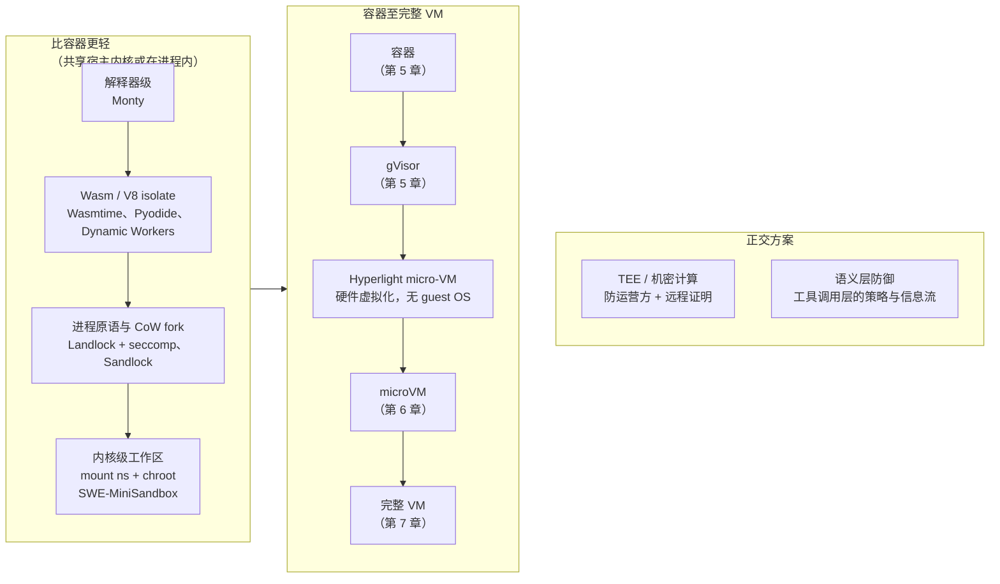

# 第 8 章　WASM、TEE 与轻量方案

## 本章导读

第 4–7 章沿着一根轴展开：从共享内核的 OS 原生原语，到容器与 gVisor，再到 microVM（微虚拟机）和完整 VM，隔离边界越来越硬，启动和资源开销也越来越大。本章讨论这根轴之外的两类方案。

第一类比容器更轻：WebAssembly（Wasm）与 V8 isolate、解释器级沙箱、判题系统式的代码专用沙箱、不用容器的内核级工作区、进程级写时复制 fork，以及横跨这根轴的 Hyperlight。它们都用更窄的适用面换更低的开销。本章要回答：Agent 负载里哪一段窄到可以接受这种交换。

第二类与沙箱正交：可信执行环境（TEE）防的是基础设施运营方，不是沙箱里的模型；工具调用层的语义防御（CaMeL、FIDES、Progent 等）管的是 Agent 该做哪些动作，不是动作在哪里执行。它们不能替代沙箱，沙箱也替代不了它们。

读完本章，读者应能：

- 说清 Wasm 的能力模型（capability model）为什么天然适合"执行一段生成代码"，又为什么到 SWE 和终端任务就不够用；
- 区分"轻在边界更弱"（Wasm、内核级工作区、进程 fork）和"轻在复用"（DSec FnCall、SandboxFusion），以及"硬边界也可以很快"的 Hyperlight；
- 理解 SWE-MiniSandbox 的收益与它自己声明的局限，以及在"模型就是对手"的训练集群里这些局限意味着什么；
- 说出 TEE 能防什么、不能防什么，知道 GPU TEE 的开销至今没有公开数字；
- 把语义层防御放到正确的位置：它们是"工具调用层的沙箱"，与 OS 层沙箱叠加使用；
- 按表 8-2 为一段具体负载选择方案。

## 8.1　两根轴

第 6 章表 6-1 把隔离技术按"边界从软到硬"排成一列。这一排序对本章仍然有用，但还要补一根轴。图 8-1 把本章涉及的方案按隔离边界的类型排列，并把两类正交方案单独画出。

**图 8-1　隔离边界谱系与两类正交方案**（示意图，依据本章各节来源绘制；箭头表示边界类型的排序，不是实测的强度刻度）

有两点要先说明。

第一，这根轴上的位置只说明**边界的类型**，不说明边界被实际攻破的难度。SandboxEscapeBench 只评测了容器逃逸，没有覆盖 gVisor、Firecracker、Kata 和 Wasm（arXiv 2603.02277；论文自述；见第 5 章、第 20 章）。Wasm 运行时在前沿模型面前到底有多硬，目前没有任何同行评审的测量。

第二，Hyperlight 的位置打破了"越硬越慢"的直觉：它是硬件虚拟化边界，创建时间却与进程级方案同一量级（见 8.5 节）。这说明启动开销主要来自"边界里装了什么"（guest 内核、设备、用户态），而不是边界本身（推断）。

## 8.2　WebAssembly：进程内的能力沙箱

### 8.2.1　机制：线性内存与"没有环境权限"

Wasm 模块运行在宿主进程内，隔离靠的是编译期与运行时的内存约束，而不是内核。Wasmtime 的安全文档写道，源语言中的指针"被编译为线性内存中的偏移量，因此虚拟地址等实现细节对应用不可见"；线性内存默认前置一段 2 GB 的保护区（guard region），用于防御符号扩展类错误；实例结束后，Wasmtime 会在可能的情况下把它用过的内存清零，以免信息在实例之间泄漏（Wasmtime 安全文档；一手文档）。

系统接口这一侧由 WASI（WebAssembly 系统接口）规定。WASI 官网的表述是："WASI 应用运行在基于能力的沙箱中：Wasm 模块或组件启动时没有任何环境权限（ambient authority），只能做宿主明确授予的事"（"start with no ambient authority and can only do what the host explicitly grants"；wasi.dev；一手文档）。Wasmtime 实现的 WASI 接口遵循同一模型，"确保应用只能访问被授予的文件和目录"（Wasmtime 安全文档；一手文档）。WASI 已有 0.1、0.2、0.3 三个里程碑版本（也称 Preview 1/2/3），0.3 为组件模型加入了原生异步（wasi.dev；一手文档）。

这正是 Agent 场景想要的语义：一段生成代码默认什么都不能碰，宿主按任务把需要的目录、函数、网络端点一项项授予它。与第 4 章的 Landlock、seccomp 相比，差别在于默认值：OS 原语是在一个什么都能做的进程上做减法，Wasm 是从零开始做加法（推断）。

Wasmtime 文档对 Spectre 类推测执行攻击列出了针对 `call_indirect` 与 `br_table` 的缓解措施，但没有把宿主函数的漏洞和一般侧信道列为保证范围（Wasmtime 安全文档；一手文档）。宿主函数恰恰是 Agent 场景里最大的暴露面：授予 Wasm 模块的每一个"能力"，都是宿主一侧的一段代码（推断）。

### 8.2.2　Pyodide：把 CPython 搬进 Wasm

Agent 生成的代码多半是 Python。Pyodide 是"基于 WebAssembly、面向浏览器和 Node.js 的 Python 发行版"，可以用 micropip 从 PyPI 安装纯 Python 包，NumPy、pandas、SciPy 等带 C、C++ 或 Rust 扩展的包也"已有许多被移植"（Pyodide 文档；一手文档）。

它的约束直接划出了适用边界。Pyodide 文档写明："由于 Pyodide 不支持线程和多进程，使用线程或多进程的包不打补丁就无法工作"；socket 属于"包含但不工作"的模块，HTTP 请求只能走浏览器 API，受 CORS 约束，不能控制证书和代理；`multiprocessing`、`threading`、`pty`、`tty` 可以导入但不起作用；`venv`、`termios`、`fcntl`、`resource`、`pwd` 等模块被整体移除（Pyodide WebAssembly 约束页；一手文档）。

字节跳动 coze-loop 的评测模块用的就是这种方案。它的 `pyodide` 包是"基于 Deno 的 Pyodide 运行时实现"，配置项包括内存上限 `MemoryLimitMB`、超时 `TimeoutSeconds`，以及 `AllowEnv`、`AllowRead`、`AllowWrite`、`AllowNet`、`AllowRun`、`AllowFFI` 六个权限开关（coze-loop pyodide 包文档，2025-09-02 发布；一手文档）。这里是两层沙箱叠加：外层是 Deno 的权限模型，内层是 Wasm 的线性内存（推断，基于包文档的配置项）。用途是执行评测器代码，不是让 Agent 在里面做多轮工程任务。

### 8.2.3　V8 isolate：Cloudflare 的两档方案

Cloudflare 是本书所见唯一把"isolate 档"和"容器档"并列作为 Agent 沙箱产品的厂商（推断，基于本书检索范围）。Dynamic Workers 博客（2026-03-24 发布，07-22 修订）称：一个 isolate 启动只需"几毫秒"、占用"几 MB 内存"，而容器启动要"数百毫秒"、运行要"数百 MB"，因此标题写"快 100 倍"（Cloudflare Dynamic Workers 博客；厂商自报）。安全上，它在 V8 沙箱之外另加一层自研沙箱，按风险评估动态隔离租户，并利用 MPK 等硬件特性加固 V8 沙箱（同上；厂商自报）。

语言上它以 JavaScript 为主：Workers"可以使用 Python 和 WebAssembly"，但博客明说，对 Agent 按需写的小段代码，"JavaScript 加载和运行快得多"（同上；厂商自报）。与之配套的 Code Mode 让 Agent 针对类型化 API 写一段 TypeScript，代替一连串工具调用；博客回顾此前的结果称，"只是把一个 MCP server 改写成 TypeScript API，就能把 token 用量减少 81%"（"simply converting an MCP server into a TypeScript API can cut token usage by 81%"；同上；厂商自报，未独立测试）。状态是开放 beta，beta 期间免收每个 Worker 每天 0.002 美元的加载费（同上；厂商自报）。

容器档 Sandboxes 于 2026-04-13 正式发布（GA）。GA 博客对两档的分工写得很直白：需要编译代码、后台进程和持久状态的 Agent 用 Sandboxes；不需要一台完整计算机的，"可以用轻量的东西"，即 Dynamic Workers（Cloudflare Sandbox GA 博客；一手文档）。同一篇博客给出容器档从快照恢复约 2 秒、克隆仓库并 npm install 的工作流约 30 秒（厂商自报；后者不是容器冷启动，博客未给冷启动数字；见第 11 章、附录 B C-46）。两档的启动时间相差约三个数量级（笔者推算：约 2 s 对"几毫秒"，口径不同，仅示量级）。

### 8.2.4　解释器级：Pydantic Monty

比 Wasm 再轻一步，是直接写一个受限解释器。有第三方博客把 Pydantic 的 Monty 归为 Wasm 方案（2026-02-07；二手报道）。回到仓库核对，**这一归类需要更正**：当前 README 称它是"用 Rust 编写、面向 AI 所写代码的安全 Python 沙箱"（"A secure Python sandbox, written in Rust, for code written by AI."；pydantic/monty README 原文，2026-10-04 读取；一手文档），实现方式是 Rust 写的 Python 解释器，不是 Wasm 运行时。README 区分两种形态：MIT 许可的开源版 OSS Monty（Python 3.14 沙箱）与商业服务端 Full Monty（同上；一手文档）。

文档首页称"Monty v1.0.0 已发布"，"我们现在认为它可以用于生产"（"we now consider it ready for production use"；Monty 文档；一手文档）。性能上，README 称从运行中的池新建一个 OSS Monty 沙箱"低于 1 ms"，Full Monty 约 2 ms（README；厂商自报，未独立核实）。能力由宿主控制：文件系统、环境变量和网络默认不可用，须由宿主以显式提供的函数开放（README；一手文档）。限制页列出在解析期即被拒绝的语法，包括类继承与元类（`class Foo(Bar):`）和 `match` 语句；第三方包不可用，"没有 `sys.path`，也没有 site-packages"（Monty 文档限制页；一手文档）。

Monty 与 CaMeL 的自定义解释器（见 8.7 节）思路相近：都不试图运行任意 Python，而是只运行一个可以完全掌控的子集（推断）。这类方案的上限由子集决定，适合"把几次工具调用串成一段脚本"，不适合任何需要第三方库的计算（推断）。

### 8.2.5　为什么只是窄场景

把 8.2.1–8.2.4 节放在一起，Wasm 与解释器级方案的适用面可以概括为三个条件同时成立：代码是一段短程序而不是一个工程；依赖能在受限运行时里满足（纯 Python 或已移植的科学计算包）；不需要子进程、shell、真实网络和包管理器（推断）。

Agent RL 的主力负载恰好不满足这些条件。SWE 任务要在一个真实仓库里装依赖、跑测试套件、调用 git；终端任务本身就是 shell；computer use 需要完整的图形栈（见第 3 章、第 7 章）。因此 Wasm 在训练侧的采用规模，本书没有找到任何公开披露，"未披露"即结论。它在产品侧和评测侧的落点则很清楚：代码解释器式的单步计算、评测器脚本、以及 Code Mode 这类"把工具调用编排成代码"的模式。

最后一类需要多说一句。在 Code Mode 和 Monty 设想的用法里，沙箱里跑的不是"用户要的计算"，而是"Agent 对工具的编排"：一段脚本依次调用宿主暴露的若干函数，中间结果在沙箱里流转，不必每一步都回到模型上下文。这样一来，沙箱的能力清单就等于 Agent 的权限清单：宿主授予哪些函数，Agent 就能做哪些事（推断）。这与 8.7 节 Execute-Only Agents 的思路在结构上相同，只是后者还要求模型完全看不到数据。轻量沙箱在这里承担的已经不只是"故障边界"，还开始承担"权限边界"。

## 8.3　代码专用沙箱：轻在复用，不在边界

判题系统（online judge）是 Agent 沙箱最老的近亲。它们的"轻"与 Wasm 不同：边界通常仍是容器或 Linux 原语，省下的是每次调用的供给开销。

**Judge0。** 仓库自述为"面向人类与 AI 的健壮、快速、可扩展、沙箱化的开源在线代码执行系统"，支持 90 多种语言，致谢 Isolate 与 Docker 作为底层技术，许可证 GPL-3.0，读取时约 4,500 星（Judge0 仓库，2026-10-04 读取；一手文档）。README 明确把 AI Agent 和 MCP 列为使用场景，说明判题系统已经主动向 Agent 工具市场靠拢。

**SandboxFusion。** 字节跳动开源的"用于运行和评判 LLM 生成代码的安全沙箱"，许可证 Apache-2.0，约 1,100 星（SandboxFusion 仓库；一手文档；星标未经 API 复核）。语言数没有统一口径：README 列出 21 个语言条目（含 CUDA 与 Verilog，另有 GPU 版 Python），未写总数；文档首页称"最多 20 种编程语言"，另一页的语言列表还包括 Lean（README 与文档；一手文档，文档页为摘要式抓取，未逐字核实）。流传的"24 种语言"一说在仓库和文档中都找不到出处，本书不采用。基准数也因来源而异：README 的在线评测列表为 11 个（HumanEval、MultiPL-E HumanEval、Shadow HumanEval、CodeContests、MBPP、MBXP、MHPP、CRUXEval、NaturalCodeBench、PAL-Math、verilog-eval），文档 Get Started 页另列 miniF2F，共 12 个（同上）。隔离方面，README 只提到 Docker 部署方式；文档首页称"在特权容器可用时提供内置安全隔离"（文档；摘要式抓取，未逐字核实），具体隔离机制**未披露**。veRL 有官方的 SandboxFusion 工具集成，用于 SGLang 多轮 rollout（一次策略与环境交互直至结束的完整采样过程，也称轨迹展开）中的工具调用（veRL v0.4.0 文档；一手文档；见第 17 章、第 18 章）。

**DSec FnCall。** DSec 四档后端中最轻的一档（见 24.2.2 节）。它运行在可复用的预创建 CPU 或 GPU 容器中；GPU FnCall 用 NVIDIA MIG 把 GPU 切成独占实例，由 CPU FnCall 负责编译、把产物交给 GPU FnCall 执行，并维护一个预初始化 Python 进程的预热池（DSec §2.2、§7；论文自述）。在 DSec 表 1 中，FnCall 的隔离级别与完整 OS 功能都被评为"未满足"（DSec 表 1；论文自述）。Kimi K3 技术报告同样提到一个"GPU 沙箱运行时"，与容器、AgentENV 并列（K3 §5.3.2；论文自述；见第 25 章），但没有给出机制细节。

这三者说明了同一件事：对 OJ 类、算子基准类任务，**答案完全由输出判定，不需要多轮交互状态**，于是可以把"一个沙箱"压缩成"一次函数调用"，用预热池和容器复用摊薄开销（推断）。GPU 沙箱则是全书的一块空白：DSec 与 K3 都只有机制描述，没有负载数据和隔离评估（见第 3 章、第 28 章）。

## 8.4　不用容器的内核级工作区

### 8.4.1　SWE-MiniSandbox

SWE-MiniSandbox（ICML 2026 已录用，PMLR 306；arXiv 2602.11210）是少数直接挑战"每个 SWE 任务一个容器"的学术工作，作者来自北京大学、蚂蚁集团（含蚂蚁国际）与香港大学（论文标题页；论文自述）。第 10 章已从存储角度介绍过它（见 10.7 节），本节补齐机制、数字与局限。

**机制。** 两件事。一是内核级隔离："每实例一个 mount namespace，加基于 chroot 的文件系统隔离"，每个任务有自己的终端会话和私有目录。二是环境预缓存：用 Python venv 代替更重的 Conda，把准备好的环境打成 tar.gz 包跨运行复用，再用 Ray 的资源控制与信号量限制并发解压，避免 I/O 饱和（SWE-MiniSandbox 正文；论文自述）。它的思路与 SOCK（ATC'18）用 bind mount 加 chroot 构建轻量容器一脉相承（推断；见第 5 章）。

**数字。** 存储方面，SWE-smith 上为 13.5 GB 对 295 GB，摘要写作"约为容器流水线的 5%"；SWE-bench Verified 上为 89 GB 对 605 GB，论文写作约 15%（同上；论文自述）。按原始数字计算，两者分别约为 4.6% 和 14.7%（笔者推算：13.5 ÷ 295；89 ÷ 605）。常被引用的"约 5%"只对 SWE-smith 成立。准备时间方面，3B 模型的实验中为 23.62 秒对 88.86 秒，论文写作"约为容器基线的 25%"（同上；论文自述），按原始数字约为 26.6%（笔者推算：23.62 ÷ 88.86）。

**训练效果与规模。** 训练用 1,600 个 SWE-smith 实例跑一个 epoch，每次更新 128 个并行隔离环境实例（批大小 16，每题 8 条 rollout）；评测用 SWE-bench Verified 的 500 个任务。3B 模型在容器下从 5.2 提升到 8.6，在 MiniSandbox 下从 5.8 提升到 9.2，RL 训练中奖励的平均偏差接近零（同上；论文自述）。不过，128 个并发实例的规模远小于第 3 章刻画的生产负载（DSec 单作业最多 32K 个沙箱），它在大规模突发下的表现没有数据。

**作者自己写明的局限。** 论文明确说，这种隔离比容器轻、依赖 Linux 专有机制，不提供完整的安全保证：共享内核，因此不适合"不可信或潜在恶意的代码"；不支持内核级操作，涉及设备驱动、系统模块修改的任务被排除；网络灵活性不如 Docker 网络（同上；论文自述）。另有约 2 万个 SWE-smith 实例因默认安装即通过或环境问题难以解决而被过滤（同上；论文自述）。本书抓取的正文中没有提到 PID 与网络命名空间的使用情况，是否隔离进程视图与网络**未核实**。

### 8.4.2　进程级写时复制 fork：Sandlock

更激进的做法是连 mount namespace 也不用。Sandlock 只用 Landlock、seccomp-bpf 与 seccomp user notification，不使用任何命名空间；模板进程初始化后 fork，子进程继承写时复制的页映射以及模板的规则集与过滤器。博客称 1,000 个克隆耗时 718 ms、每个克隆约 4 KB，目标场景包括 RL rollout、Agent 工具执行和代码评测（Sandlock 博客，2026-03-19；厂商自报）。机制细节、数字口径与不予引用的对比数字见 4.3.4 节（附录 B X-21）；Landlock 各 ABI 的能力演进见 4.3.3 节。

Sandlock 的卖点是"初始化重、执行轻"的负载：模板里预载好的 2 GB 模型或依赖在所有克隆间只占一份物理内存。这与 DSec GPU FnCall 的预初始化 Python 进程池、SOCK 的 zygote 是同一个思想（推断，见第 13 章）。它的代价也同样清楚：所有克隆共享一个内核，而且是同一个模板的后代。

> **边栏：谱系——"初始化一次，fork 多次"**
>
> 本节和 8.3 节的几种做法共享一个 serverless 时代的源头。SOCK（ATC'18）用 bind mount 加 chroot 搭出比 Docker 轻得多的容器，并用 zygote 进程缓存已导入的 Python 包，新请求从 zygote fork 出来；Catalyzer（ASPLOS'20）把这一思路搬到 gVisor 沙箱上，提出 sfork，从运行中的模板沙箱克隆新实例（两篇均为背景知识，本书未回原文核对具体数字）。Agent 时代的对应物分布在隔离轴的不同位置：SWE-MiniSandbox 继承了 SOCK 的 chroot 一半，DSec GPU FnCall 的预初始化 Python 进程池和 Sandlock 继承了 zygote 一半，第 11 章的 microVM 快照 fork 则是 Catalyzer 一支在硬件虚拟化上的延续（推断）。差别在于 serverless 函数通常无状态、来自同一个租户，而 Agent rollout 有状态、可能与模板作者对立；模板里预载的任何东西（凭据、缓存的答案、测试文件），都会被每一个克隆继承（推断，见第 18 章构建完整性）。

### 8.4.3　吞吐与隔离的张力

SWE-MiniSandbox 的作者说它不适合恶意代码；而全书的一个基本判断是，在 RL 训练集群里，被训练的模型本身就是最有动机的攻击者（见第 2 章、第 19 章）。两者放在一起，结论不是"内核级工作区不能用于训练"，而是要分两类风险来看。

**对取回型 reward hacking（奖励投机），边界类型不是第一位的。** 第 19 章的证据表明，模型瞄准的是答案可达的通道：包代理、镜像源、git 历史、平台 socket，而不是内核（见 19.1.2 节、19.4 节）。这些通道在容器里和在 chroot 里一样存在，堵住它们靠的是出站控制和环境构建的完整性（见第 14 章、第 15 章、第 18 章），换一种隔离原语不会自动堵上（推断）。

**对"爆炸半径"类事件，边界类型是决定性的。** DSec 记录了模型读 `/proc/kpagecgroup` 触发内核 bug、攻击命令打到自己容器的事件（DSec §6.4；论文自述；见 19.5.4 节）。在共享内核的方案里，这类事件的影响范围是整台节点；chroot 加 mount namespace 比容器少了 cgroup、seccomp、LSM 等默认层（推断，依据论文描述的机制），影响面只会更大。

于是，RL 吞吐把隔离往轻处推，hacking 与逃逸证据把隔离往重处推。两者之间的取舍没有任何测量：没有论文比较同一批任务在内核级工作区、容器、microVM 下的 hacking 率与事故率（见第 19 章空白、28.4 节）。

## 8.5　Hyperlight 与 unikernel：硬边界也可以很快

**Hyperlight。** 微软开源的 Rust 库，Apache-2.0 许可。它不启动 guest 操作系统，而是"创建一段线性内存并为它分配一个虚拟 CPU"，guest 是"把一个专用内核和应用运行时合成的单个可加载程序"；micro-VM 创建耗时 1–2 ms，传统 VM 超过 120 ms（Hyperlight 博客，2024-11-07；一手文档）。支持的虚拟化后端以 KVM 和 Hyper-V 为例；可运行独立的 C 或 Rust 函数，也可运行 WebAssembly 组件（同上；一手文档）。据 Hyperlight Wasm 博客，Hyperlight 于 2025 年 2 月进入 CNCF 沙箱项目（Hyperlight Wasm 博客，2025-03-26；一手文档）。

**Hyperlight Wasm。** 把 Wasmtime 编译成 Rust `no_std` 模块放进 Hyperlight guest，形成"Wasm 沙箱 + 硬件虚拟化"的双层隔离；支持 WASI 与组件模型，因此 C、Go、Rust 以及 Python、JavaScript、C# 都可以经 Wasm 运行。博客写道传统 VM 启动"约 125 毫秒"，Hyperlight Wasm"目前约 1–2 毫秒，正在努力降到 1 毫秒以下"（同上；一手文档）。两篇博客都没有提到 AI 或 Agent。

Hyperlight 把 Wasm 的能力模型和 microVM 的硬件边界叠在一起，代价是只能跑函数，不能跑一个带 shell 和包管理器的 Linux 用户态。它适合的负载与 8.2 节相同：函数级的工具调用和生成代码片段；它多给的是一层不依赖 Wasm 运行时正确性的硬件边界（推断）。这对产品推理场景中执行不可信第三方代码的多租户服务有价值；对 SWE 训练没有直接用处。

**unikernel。** Unikraft（EuroSys'21 最佳论文）用模块化的微库操作系统为每个应用组装专用 unikernel，代表了 VM 启动代价的下界（Unikraft 论文；书目已核实，启动数字未回原文）。Unikraft Cloud 声称冷启动低于 10 ms、单台服务器超过 10 万个实例（emirb 综述转述厂商说法；二手报道）。它面临与 Hyperlight 相同的约束：Agent 通常需要完整的 POSIX/Linux 用户态，unikernel 的专用化恰恰去掉了这一点（推断）。

## 8.6　TEE：防的是运营方，不是模型

### 8.6.1　威胁模型

前面各节的沙箱都在防同一个方向：沙箱里的代码伤害宿主或邻居。可信执行环境（TEE）反过来，防的是宿主伤害沙箱里的代码。

本书依据的主要材料是综述 *When Agents Handle Secrets: A Survey of Confidential Computing for Agentic AI*（Javad Forough、Marios Kogias、Hamed Haddadi，arXiv 2605.03213v1，2026-05-04；预印本）。它写道，TEE"为代码和数据提供硬件强制的隔离，使其免受包括 hypervisor 和操作系统在内的特权系统软件的影响"；其最强的对手模型"控制 hypervisor、云管理平面和物理硬件配置"；Intel TDX 与 AMD SEV-SNP 把信任边界"移到虚拟机这一级"，NVIDIA H100 的机密计算模式则借助受保护计算区把边界扩展到 GPU 推理（TEE 综述；论文自述）。

综述的平台分类共六类，除上述三者外还有 Intel SGX、ARM TrustZone 与 ARM CCA（同上；论文自述）。对 Agent 沙箱来说，边界放在哪一级很关键：SGX 一类的进程内 enclave 要求把应用切分为可信与不可信两部分，Agent 的工具链（解释器、包管理器、浏览器）很难这样切；TDX、SEV-SNP 把整台虚拟机放进 TEE，与第 6 章的 microVM 沙箱在形态上可以直接叠加（推断）。这也是 8.6.3 节的落地形态都以机密 VM 为单位的原因。

远程证明（remote attestation）是 TEE 在 Agent 场景中真正有用的部分：远端验证方可以"以密码学方式确认预期的代码正运行在真实的 TEE 中"，并据此决定是否"向它发送任何敏感数据"（同上；论文自述）。换成 Agent 的语言：只有当沙箱证明自己运行的是预期的镜像和策略时，密钥管理服务才把 API 凭据、用户数据的解密密钥交给它（推断，对综述机制的应用）。

### 8.6.2　它不防什么

综述对 TEE 的边界写得同样明确，见表 8-1。

**表 8-1　TEE 在 Agent 场景中能防与不能防的威胁**

| 威胁 | TEE 是否覆盖 | 综述原文要点 |
|---|---|---|
| 运营方、hypervisor、宿主 OS 读取或篡改 Agent 内存 | 覆盖 | 硬件强制隔离特权系统软件 |
| 向未经证明的环境释放密钥 | 覆盖（靠远程证明） | 发送敏感数据前确认代码与平台 |
| 提示注入 | 不覆盖 | TEE 能让数据保密，但"不能单凭自身阻止被提示注入的 Agent 通过自己的输出或工具调用泄露这些数据"（"it does not by itself stop a prompt-injected agent from leaking that data through its own outputs or tool calls"） |
| 供应链 | 不覆盖 | 证明只说明被度量的软件被正确实例化，不说明其来源；训练中被投毒的权重"会正确通过证明" |
| 拒绝服务 | 不覆盖 | 运营方可以拒绝调度、限流、拖延证明服务或终止 enclave |
| 侧信道 | 部分不覆盖 | 时序、缓存争用、缺页攻击与流量分析信号仍可能泄露 |

注：依据 TEE 综述（arXiv 2605.03213v1）；"覆盖"指在综述描述的平台威胁模型内。

可以看出，TEE 与本书的"两类对手"几乎不相交。被利用的代理人（提示注入）和作为对手的模型（reward hacking、逃逸）都发生在 TEE 的边界之内；TEE 防的是第三类主体，即基础设施运营方。

### 8.6.3　落地形态

**OpenShift 沙箱容器。** Red Hat 2026-05-22 的文章介绍了在 OpenShift 沙箱容器中使用机密 GPU：底层是 Kata Containers 运行时，默认运行时类为 `kata-cc-nvidia-gpu`；CPU 侧支持 AMD SEV-SNP 与 Intel TDX，但"目前只能管理一种 CPU TEE"；NVIDIA H100 与 RTX PRO 6000 Blackwell 经过机密计算测试；证明由 Red Hat build of Trustee 与 NVIDIA 远程证明服务（NRAS）配合完成，做 CPU 与 GPU 的联合证明（Red Hat 文章；一手文档）。文章没有说明该功能是技术预览还是正式发布，也没有提到 AI Agent 或性能开销。本书的推断是，机密 VM 与 Kata 式 microVM 沙箱的结合，会是受监管 Agent 负载的汇合点，OpenShift 的做法与此一致（推断）。

**Microsoft LiteBox。** README 自述为"一个大幅削减与宿主接口、从而缩小攻击面的沙箱化库操作系统"，向上提供类 POSIX 的"North"接口，向下对接多种"South"平台，包括 Linux 用户态、Windows 用户态、SEV-SNP、OP-TEE 与 LVBS；许可证 MIT，读取时约 2,700 星；README 声明项目"正在积极演进"，API 可能变化（microsoft/litebox README，2026-10-04 读取；一手文档）。2026 年 2 月的二手资料称其尚不可用于生产（manveerc；二手报道；本书未抓取，未核实）。README 没有提到 AI Agent。它的意义在于把"缩小宿主接口"（沙箱方向）和"在 SEV-SNP 中运行"（TEE 方向）放进同一个库操作系统（推断）。

**Grimlock。** Roblox 的研究者在 AgenticOS @ ASPLOS 2026 研讨会（2026-03-23，匹兹堡）发表的愿景论文。架构是每个 Agent 一台机密 VM（CVM），每台主机一台守卫代理 CVM；eBPF 钩子保证"所有沙箱流量都必须经过守卫"，Agent 无法绕过守卫去启动进程、打开任意 socket 或调用工具；守卫之间用 TLS 1.3 加 kTLS 通信，握手后再做远程证明，把证据与通道绑定，并签发"短期、与通道绑定、编码最小权限委托"的 Scope Token（Grimlock 论文；论文自述，愿景论文）。其威胁模型把主动网络对手、恶意或有缺陷的 Agent 运行时、不可信的宿主网络都纳入考虑。论文没有任何定量评估。出站侧的讨论见第 14 章边栏。

Grimlock 是本章唯一一个同时面向两个方向的设计：CVM 防运营方，eBPF 守卫与 Scope Token 防 Agent 越权（推断）。即便如此，它也只控制 Agent 能连到哪里、拿什么权限，不判断 Agent 的意图是否已被注入改变。

### 8.6.4　开销：没有数字

综述把"LLM 规模下的 GPU TEE 性能"列为六个开放挑战之一（TEE 综述 §VIII-E；论文自述），全文没有给出 TDX、SEV-SNP 或 H100 机密计算的具体开销数字。作为对照，它指出全同态加密和安全多方计算的开销高出二到四个数量级，"对十亿参数级的交互式负载不可行"（同上；论文自述）。综述的总体判断是："目前尚没有被广泛确立的端到端框架，能把这些硬件信任原语组合成面向生产 Agent AI 的一致安全底座"（同上；论文自述）。

本书没有找到任何在 Agent 负载下测量 TEE 开销的公开数据。对 Agent 沙箱特别相关、而又没有数据的问题至少有三个：机密 VM 的启动与证明延迟能否进入第 3 章所说的秒级创建预算；内存加密是否影响第 13 章依赖的页共享与写时复制（推断：跨 CVM 的页去重与加密内存在原理上冲突，需实测确认）；快照与 fork（第 11 章）在机密 VM 上如何保持证明链。

### 8.6.5　对三场景的意义

**训练。** 实验室自己运营训练集群，运营方就是自己，TEE 防的那类对手基本不存在（推断）。训练侧的对手是模型，TEE 帮不上忙。

**评测。** 第三方评测机构运行他人模型时，存在双向的保密需求：模型方不想暴露权重，评测方不想暴露题目（推断）。TEE 加远程证明在原理上适合这种场景，但本书没有找到公开的部署案例。

**产品推理。** 这是 TEE 最有现实意义的场景：企业把代码库、凭据和客户数据交给云上的 Agent 沙箱，运营方本身就在威胁模型里。即便如此，TEE 也只解决"运营方看不到"，不解决"Agent 被注入后自己交出去"（表 8-1）。

## 8.7　工具调用层的"沙箱"

第 2 章介绍了学术界的系统级防御主线：把 LLM 当作不可信组件，用经典安全机制包住它。这些工作几乎都作用于语义化的工具调用层，自称"沙箱"的也不少。本节不重复第 2 章的分类，只说明它们和本书讨论的 OS 层沙箱如何分工。

**控制流与信息流。** CaMeL 让特权 LLM 把可信的用户查询翻译成程序，由自定义解释器执行，隔离 LLM 只负责解析不可信数据，值上携带的能力在工具调用前由策略检查；在 AgentDojo 上以"可证明安全"完成 77% 的任务，无防御系统为 84%（CaMeL，arXiv 2503.18813 v2，2025-06-24；论文自述；附录 B B02-05）。FIDES（微软，arXiv 2505.23643）在规划器中追踪机密性与完整性标签，确定性地执行策略，并提供"对 LLM 隐藏变量"的原语（FIDES 摘要；论文自述）。

**引用监视器与最小权限。** Progent（v3 改题为 *Securing AI Agents with Privilege Control*，2026-05-14）用符号化策略确定性地检查工具名与参数，由 SMT 求解器判断策略更新是收紧还是扩张，保证"未经批准，Agent 的有效动作空间只能缩小"（Progent 摘要；论文自述）。AgentBound（FSE 2026）为 MCP server 提供类 Android 权限的声明式清单，在 296 个流行 MCP server 上评估，从源码自动生成策略的准确率为 80.9%（AgentBound 摘要；论文自述）。ceLLMate 利用"浏览器中有副作用的 UI 动作最终都会变成 HTTP 请求"这一观察，在 HTTP 层执行策略，延迟开销 7.25%–15%（附录 B B07-15；论文自述；见第 7 章）。

**沙箱作为信息流边界。** AgenticOS'26 的愿景论文 Execute-Only Agents 把上述思路推到 OS 层。它的原则是："LLM 绝不能观察到不可信数据。所有外部数据处理都在隔离的执行上下文中进行，结果不回传给 LLM"；LLM 只依据工具 schema 写脚本，脚本在沙箱中处理真实数据。作者分析了 AgentDojo 的 97 个任务：20% 只凭 schema 即可完成，58% 可从 schema 推断数据格式，两者合计约 78% 无需 LLM 看到数据；其余 22% 必须读内容，如摘要类任务，不在这一方案的覆盖范围内（Execute-Only Agents 论文；论文自述，愿景论文）。

这条线与本章其他方案的关系，可以用一句话概括：**OS 层沙箱限制一个动作能造成多大损害，语义层防御限制哪些动作会被发出**（推断）。前者对提示注入无能为力（被注入的 Agent 在授权范围内行事同样有害），后者假设执行底座可信（工具、解释器、宿主都没有被攻破）。两者目前没有打通：CaMeL 式的能力标签不会被编译成 seccomp、Landlock 或出站代理规则（见第 28 章研究方向）。Execute-Only Agents 和 Grimlock 是少数从 OS 一侧伸手去接语义层的设计，都还停在愿景论文阶段。

## 8.8　选型：哪一段负载用哪一种

表 8-2 汇总本章方案。"证据等级"一列沿用全书的来源类型：论文自述、厂商自报、一手文档（机制描述）、愿景论文（无评估）。

**表 8-2　轻量与正交方案：隔离边界、适用负载与证据**

| 方案 | 隔离边界 | 适合的负载（本书建议） | 不适合的负载（本书建议） | 代表 | 证据等级 |
|---|---|---|---|---|---|
| 解释器级 | 解释器只实现受限子集，能力由宿主提供的函数开放 | 把几次工具调用串成脚本；Code Mode 式编排 | 需要第三方包、类继承、子进程的代码 | Pydantic Monty | 一手文档（v1.0.0，自报性能） |
| Wasm | 线性内存 + WASI 能力模型，进程内 | 单步计算、评测器脚本、代码解释器式问答 | SWE、终端任务；多线程、socket、包管理 | Wasmtime、Pyodide（coze-loop） | 一手文档；训练侧采用未披露 |
| V8 isolate | V8 沙箱 + 厂商二层沙箱，进程内 | 产品侧的短 JS/TS 片段，毫秒级、一次性 | 完整开发环境、持久状态 | Cloudflare Dynamic Workers | 厂商自报（beta） |
| 代码专用沙箱 | 通常为容器或 Linux 原语；靠复用省开销 | OJ 类、算子基准、单元测试判分 | 多轮有状态交互、需要完整 OS 语义 | Judge0、SandboxFusion、DSec FnCall | 一手文档；论文自述（FnCall）；隔离机制多未披露 |
| 内核级工作区 | mount namespace + chroot，共享内核 | 可信或已筛选的 Python 仓库 SWE 训练，追求吞吐 | 不可信代码；内核级操作；复杂网络 | SWE-MiniSandbox | 论文自述（ICML 2026，128 并发规模） |
| 进程 CoW fork | Landlock + seccomp，无命名空间，共享内核 | 初始化重、执行轻的批量评测与 rollout | 需要隔离进程视图或强边界的任务 | Sandlock | 厂商自报 |
| Hyperlight | 硬件虚拟化，无 guest OS | 多租户产品中的函数级工具调用、不可信 Wasm 组件 | 需要 Linux 用户态与 shell 的任务 | Hyperlight、Hyperlight Wasm | 一手文档（1–2 ms 为自报） |
| TEE / 机密计算 | 硬件加密内存 + 远程证明，防运营方 | 产品侧处理企业机密；以证明控制密钥释放 | 防提示注入、reward hacking、供应链 | TDX、SEV-SNP、H100 CC；OpenShift 沙箱容器；LiteBox；Grimlock | 综述（开销无数字）；一手文档；愿景论文 |
| 语义层防御 | 工具调用前的策略、标签与控制流检查 | 处理不可信数据的产品 Agent | 执行底座被攻破；必须阅读数据的任务 | CaMeL、FIDES、Progent、AgentBound、ceLLMate、Execute-Only Agents | 论文自述（评测集中于 AgentDojo） |

注："适合的负载""不适合的负载"两列为本书建议（推断），不是各来源的结论。Unikraft 未列入，理由见 8.5 节。所有性能数字均为当事方自报，没有独立的横向基准。

**本书建议。** 以下为笔者依据本章材料提出的选型建议，不是任何来源的结论。

1. **先按"答案如何判定"切分负载，再选边界。** 答案完全由输出判定、无多轮状态的任务（OJ、算子基准、单元测试判分），用 FnCall 或代码专用沙箱，把开销压在复用上；需要多轮工程交互的任务，从容器起步（见第 5 章）。不要为了吞吐把 SWE 任务直接放进 Wasm 或解释器。
2. **内核级工作区只用于"已筛选、已断网"的任务集。** 在训练中使用 SWE-MiniSandbox 一类方案的前提是：出站已按第 14 章收紧，环境构建已按第 18 章做过完整性清理，且有节点级故障隔离与快速重建手段。同时在一小部分任务上并行跑容器档，对比 hacking 与事故率，把 19.6.2 节的测量协议用起来。
3. **产品侧采用"两档"而不是"一档"。** Cloudflare 的分工值得借鉴：短片段走 isolate、Wasm 或 Hyperlight，需要完整计算机的会话走容器或 microVM，并让 Agent 能显式请求升档。
4. **把 TEE 当作信任根，不当作沙箱。** 在处理企业机密的产品中，用远程证明控制凭据和数据密钥的释放；但同一个沙箱仍要有 OS 层隔离、出站控制和语义层策略。上线前自行测量机密 VM 的启动、证明与内存共享开销，不要依赖任何未在 Agent 负载下测得的数字。
5. **语义层与 OS 层同时部署，并让两者共享身份。** 至少做到：每个工具调用的策略裁决结果与沙箱的出站身份（第 14 章的 L4 身份）可以关联审计。完整的"标签编译到 OS 策略"仍是研究问题。

**空白。** 本章涉及的方案几乎都缺少独立数据，以下空白短期内不会消失，引用时应如实写出：

- Wasm、V8 isolate、Hyperlight 在前沿模型面前的逃逸难度没有任何基准；SandboxEscapeBench 只测了容器。
- Wasm 与代码专用沙箱在训练侧的采用规模未披露；SandboxFusion 的具体隔离机制未披露，语言数各处口径不一。
- SWE-MiniSandbox 只在 128 个并发实例的规模上评估，大规模突发、非 Python 仓库与 hacking 率均无数据。
- DSec GPU FnCall 与 K3 GPU 沙箱运行时只有机制描述，GPU 沙箱的隔离与负载均未刻画。
- TDX、SEV-SNP、H100 机密计算在 Agent 负载下的启动、证明与内存共享开销没有公开数字；OpenShift 机密 GPU 的发布状态未说明。
- Monty、Dynamic Workers 的性能数字只有厂商自报；Grimlock、Execute-Only Agents 是愿景论文，没有实现评估。

## 本章小结

- **两根轴。** 隔离边界从解释器、Wasm、进程原语、内核级工作区一路到完整 VM；TEE 与语义层防御与这根轴正交，分别防运营方和防注入，不能替代沙箱。
- **Wasm 与解释器级方案是窄场景。** 能力模型"从零授权"的语义很适合执行一段生成代码，但 Pyodide 不支持线程、多进程与 socket，Monty 只支持 Python 子集，不支持类继承、元类与第三方包（并更正：Monty 是 Rust 编写的解释器，不是 Wasm 方案）；训练侧采用规模未披露。
- **"轻"有两种。** Wasm、内核级工作区、进程 fork 轻在边界更弱；DSec FnCall、SandboxFusion、Judge0 轻在复用；Hyperlight 说明硬件边界本身可以只要 1–2 ms（自报），慢的是边界里装的东西。
- **SWE-MiniSandbox 的数字要带口径引用。** 存储约 5% 只对 SWE-smith 成立（SWE-bench Verified 约 15%），准备时间约 25%（23.62 s 对 88.86 s），规模为 128 个并发实例；作者自述不适合不可信代码。
- **吞吐与隔离的张力没有被测量。** 取回型 hacking 不因换原语而消失，爆炸半径则直接取决于是否共享内核。
- **TEE 防运营方，不防模型。** 远程证明适合控制密钥释放；提示注入、供应链、拒绝服务和侧信道都不在其覆盖范围内；GPU TEE 在 LLM 规模下的开销没有公开数字。
- **语义层防御是工具调用层的沙箱。** CaMeL、FIDES、Progent、AgentBound、ceLLMate 决定发出哪些动作，OS 层沙箱决定动作的损害上限；两层尚未打通，Execute-Only Agents 与 Grimlock 是从 OS 一侧伸出的愿景。

## 本章数字溯源

本表登记本章使用的全部数字。"备注"中的 B/C/X 编号对应附录 B；标"复核"者为本书 2026-10-04 回原文核对过的数字。

**表 8-3　本章数字溯源**

| 数字 | 含义 | 原文位置 / 来源 | 类型 | 备注 |
|---|---|---|---|---|
| 2 GB | Wasmtime 线性内存默认前置保护区 | Wasmtime 安全文档（复核） | 一手文档 | B08-12 |
| 0.1 / 0.2 / 0.3 | WASI 里程碑版本 | wasi.dev（复核） | 一手文档 | B08-14 |
| 6 个 | coze-loop Pyodide 运行时权限开关（AllowEnv/Read/Write/Net/Run/FFI） | coze-loop pyodide 包文档（复核） | 一手文档 | B08-15 |
| 几毫秒、几 MB；数百毫秒、数百 MB；100 倍 | isolate 与容器的启动和内存 | Cloudflare Dynamic Workers 博客（复核） | 厂商自报 | B08-05 |
| 81% | 把一个 MCP server 改写成 TypeScript API 后的 token 降幅 | 同上（复核） | 厂商自报 | B08-06 |
| 0.002 美元 / Worker / 天 | Dynamic Workers 加载费（beta 期免收） | 同上（复核） | 厂商自报 | B08-16 |
| 约 2 s；约 30 s | 容器档快照恢复；克隆仓库并 npm install 的工作流耗时（非冷启动，C-46） | Cloudflare Sandbox GA 博客（复核） | 厂商自报 | B11-12 |
| 约三个数量级 | 两档启动时间差 | 2 s ÷ 几毫秒 | 笔者推算 | 口径不同，仅示量级 |
| < 1 ms；约 2 ms；v1.0.0 | OSS Monty 从运行中的池新建沙箱；Full Monty；版本 | pydantic/monty README 原文与 Monty 文档（复核，2026-10-04） | 厂商自报；一手文档 | B08-07 |
| 90 多种；约 4,500 星 | Judge0 语言数；星标 | Judge0 仓库（2026-10-04 摘要式抓取） | 一手文档 | B08-08；星标未经 API 复核 |
| 21 个条目；最多 20 种；约 1,100 星 | SandboxFusion 语言数（README 条目 vs 文档首页）；星标 | SandboxFusion README 原文；文档（摘要式抓取，未逐字） | 一手文档 | B08-04；"24 种"无出处；星标未经 API 复核 |
| 11 个；12 个 | SandboxFusion 基准数（README 在线评测列表；文档 Get Started 页，多 miniF2F） | README 原文；文档（摘要式抓取） | 一手文档 | B08-04 |
| 13.5 GB vs 295 GB；约 5% | SWE-smith 存储 | SWE-MiniSandbox 正文（复核） | 论文自述 | B08-01 |
| 89 GB vs 605 GB；约 15% | SWE-bench Verified 存储 | 同上（复核） | 论文自述 | B08-01、B08-09 |
| 约 4.6%；约 14.7% | 按原始数字的存储比 | 13.5 ÷ 295；89 ÷ 605 | 笔者推算 | B08-17 |
| 23.62 s vs 88.86 s；约 25%；约 26.6% | 3B 模型环境准备时间；论文比例；按原始数字比例 | 同上（复核）；23.62 ÷ 88.86 | 论文自述；笔者推算 | B08-01、B08-09、B08-17 |
| 1,600 个；128 个；16；8；500 个 | 训练实例数；每次更新并行环境；批大小；每题 rollout 数；评测任务数 | 同上（复核） | 论文自述 | B08-10 |
| 5.2 → 8.6；5.8 → 9.2 | 3B 模型容器 / MiniSandbox 训练前后得分 | 同上（复核） | 论文自述 | B08-10 |
| 约 2 万个 | 被过滤的 SWE-smith 实例 | 同上（复核） | 论文自述 | B08-10 |
| 32K | DSec 单作业最多请求的沙箱数 | DSec §1、§4.1 | 论文自述 | B03-01 |
| 1,000 个克隆 718 ms；约 4 KB | Sandlock 进程 CoW fork | Sandlock 博客（复核） | 厂商自报 | B04-08；对比数字不引用（X-21） |
| 1–2 ms；> 120 ms | Hyperlight micro-VM 创建；传统 VM | Hyperlight 博客（复核） | 一手文档（自报） | B06-17 |
| 约 1–2 ms，目标 < 1 ms；约 125 ms | Hyperlight Wasm 启动；传统 VM | Hyperlight Wasm 博客（复核） | 一手文档（自报） | B08-18 |
| 2025 年 2 月 | Hyperlight 进入 CNCF 沙箱项目 | Hyperlight Wasm 博客（复核） | 一手文档 | B08-13 |
| < 10 ms；> 100,000 个实例 / 服务器 | Unikraft Cloud 冷启动与密度 | emirb 综述 | 二手报道 | B06-12 |
| 六个开放挑战之一 | GPU TEE 在 LLM 规模下的性能 | TEE 综述 §VIII-E（复核） | 论文自述 | B08-03 备注 |
| 二到四个数量级 | FHE / MPC 开销 | TEE 综述（复核） | 论文自述 | B08-03 |
| 一种 CPU TEE；H100、RTX PRO 6000 Blackwell | OpenShift 沙箱容器限制与经测试的 GPU | Red Hat 文章 2026-05-22（复核） | 一手文档 | B08-11 |
| 约 2,700 星 | LiteBox 星标 | microsoft/litebox 页面（2026-10-04 摘要式抓取） | 一手文档 | B08-19；未经 API 复核 |
| 77% vs 84% | CaMeL 在 AgentDojo 上的完成率 | CaMeL 摘要 v2（复核） | 论文自述 | B02-05 |
| 296 个；80.9% | AgentBound 评估的 MCP server 数；自动策略准确率 | AgentBound 摘要 v3（复核） | 论文自述 | B16-06 |
| 7.25%–15% | ceLLMate 延迟开销 | arXiv 2512.12594 | 论文自述 | B07-15 |
| 97 个；20%；58%；22%；约 78% | Execute-Only Agents 对 AgentDojo 任务的分类 | AgenticOS'26 论文 21（复核） | 论文自述（愿景论文） | B08-02 |

## 参考文献

[1] Javad Forough, Marios Kogias, Hamed Haddadi. *When Agents Handle Secrets: A Survey of Confidential Computing for Agentic AI*. arXiv:2605.03213v1, 2026-05-04（预印本）. https://arxiv.org/html/2605.03213v1

[2] Yosh Wuyts, Ralph Squillace. Introducing Hyperlight: Virtual machine-based security for functions at scale. Microsoft Open Source Blog, 2024-11-07. https://opensource.microsoft.com/blog/2024/11/07/introducing-hyperlight-virtual-machine-based-security-for-functions-at-scale/

[3] Yosh Wuyts, Lucy Menon. Hyperlight Wasm: Fast, secure, and OS-free. Microsoft Open Source Blog, 2025-03-26. https://opensource.microsoft.com/blog/2025/03/26/hyperlight-wasm-fast-secure-and-os-free/

[4] Danlong Yuan, Wei Wu, Enhan Zhao, Zhengren Wang, Xueliang Zhao, Huishuai Zhang, Dongyan Zhao. *SWE-MiniSandbox: Container-Free Reinforcement Learning for Building Software Engineering Agents*. ICML 2026（已录用）；arXiv:2602.11210. https://arxiv.org/html/2602.11210

[5] Cloudflare. Sandbox GA. 2026-04-13. https://blog.cloudflare.com/sandbox-ga/

[6] Kenton Varda, Sunil Pai, Ketan Gupta. Sandboxing AI agents, 100x faster. Cloudflare Blog, 2026-03-24（2026-07-22 修订）. https://blog.cloudflare.com/dynamic-workers/

[7] Bytecode Alliance. Wasmtime Security. https://docs.wasmtime.dev/security.html

[8] WASI.dev. https://wasi.dev/

[9] Pyodide 文档（首页；WebAssembly constraints）. https://pyodide.org/en/stable/ ；https://pyodide.org/en/stable/usage/wasm-constraints.html

[10] coze-dev. coze-loop evaluation sandbox: pyodide 包（2025-09-02 发布）. https://pkg.go.dev/github.com/coze-dev/coze-loop/backend/modules/evaluation/infra/sandbox/infra/pyodide

[11] Pydantic. Monty（README 原文经 raw.githubusercontent.com 读取，2026-10-04；文档首页与限制页）. https://github.com/pydantic/monty ；https://pydantic.dev/docs/monty

[12] victorstack. Pydantic Monty（第三方博客，2026-02-07；本章据此更正其"Wasm 方案"的归类）. https://victorstack-ai.github.io/agent-blog/2026-02-07-pydantic-monty-wasm/

[13] Judge0（README，2026-10-04 读取）. https://github.com/judge0/judge0

[14] ByteDance. SandboxFusion（README；项目文档）. https://github.com/bytedance/SandboxFusion ；https://bytedance.github.io/SandboxFusion/

[15] veRL. Sandbox Fusion Tool Integration（v0.4.0 文档）. https://verl.readthedocs.io/en/v0.4.0/sglang_multiturn/sandbox_fusion.html

[16] DeepSeek-AI. *DeepSeek Elastic Compute (DSec): A Sandbox Infrastructure for Effective Agentic Training at Scale*. arXiv:2609.22978v1, 2026-09-19. https://arxiv.org/html/2609.22978v1

[17] Moonshot AI (Kimi Team). *Kimi K3: Open Frontier Intelligence*（§5.3.2）. arXiv:2607.24653. https://arxiv.org/abs/2607.24653

[18] Multikernel. Sandlock: CoW fork with Landlock and seccomp. 2026-03-19. https://multikernel.io/2026/03/19/sandlock-cow-fork/

[19] Simon Kuenzer, et al. *Unikraft: Fast, Specialized Unikernels the Easy Way*. EuroSys 2021, DOI 10.1145/3447786.3456248（书目已核实，启动数字未回原文）. https://doi.org/10.1145/3447786.3456248

[20] emirb. MicroVM 2026 综述（二手）. https://emirb.github.io/blog/microvm-2026/

[21] Red Hat Developers. Protect data offloaded to GPU-accelerated environments with OpenShift sandboxed containers. 2026-05-22. https://developers.redhat.com/articles/2026/05/22/protect-data-offloaded-gpu-accelerated-environments-openshift-sandboxed

[22] Microsoft. LiteBox（README，2026-10-04 读取）. https://github.com/microsoft/litebox

[23] manveerc. AI agent sandboxing guide（二手，2026-02）. https://manveerc.substack.com/p/ai-agent-sandboxing-guide

[24] AgenticOS @ ASPLOS 2026 研讨会页面. https://os-for-agent.github.io/asplos-2026.html

[25] Qiancheng Wu, Wenhui Zhang, Gan Fang, Sheng Mao, Biao Gao, David Levitsky, Shawna Murphy Butterworth, Rob Cameron. *Grimlock: Guarding High-Agency Systems with eBPF and Attested Channels*. AgenticOS'26（愿景论文）. https://os-for-agent.github.io/papers/AgenticOS_2026_paper_23.pdf

[26] Rahul Tiwari, Dan Williams. *Execute-Only Agents: Architectural Defense Against Prompt Injection for AI Agents*. AgenticOS'26（愿景论文）. https://os-for-agent.github.io/papers/AgenticOS_2026_paper_21.pdf

[27] Edoardo Debenedetti, et al. *Defeating Prompt Injections by Design*（CaMeL）. arXiv:2503.18813（v2 2025-06-24）；IEEE SaTML 2026（会议页未回原文核对）. https://arxiv.org/abs/2503.18813

[28] Manuel Costa, et al. *Securing AI Agents with Information-Flow Control*（FIDES）. arXiv:2505.23643（v2 2025-09-03）. https://arxiv.org/abs/2505.23643

[29] Tianneng Shi, et al. *Progent: Securing AI Agents with Privilege Control*. arXiv:2504.11703（v3 2026-05-14）. https://arxiv.org/abs/2504.11703

[30] Christoph Bühler, Matteo Biagiola, Luca Di Grazia, Guido Salvaneschi. *AgentBound: Securing Execution Boundaries of AI Agents*. FSE 2026；arXiv:2510.21236（v3 2026-04-24）. https://arxiv.org/abs/2510.21236

[31] Luoxi Meng, Henry Feng, Ilia Shumailov, Earlence Fernandes. *ceLLMate: Sandboxing Browser AI Agents*. arXiv:2512.12594. https://arxiv.org/html/2512.12594v2

[32] Rahul Marchand, et al. *Quantifying Frontier LLM Capabilities for Container Sandbox Escape*（SandboxEscapeBench）. ICML 2026；arXiv:2603.02277. https://arxiv.org/abs/2603.02277

[33] Edward Oakes, et al. *SOCK: Rapid Task Provisioning with Serverless-Optimized Containers*. USENIX ATC 2018. https://www.usenix.org/conference/atc18/presentation/oakes

[34] Dong Du, Tianyi Yu, Yubin Xia, Binyu Zang, Guanglu Yan, Chenggang Qin, Qixuan Wu, Haibo Chen. *Catalyzer: Sub-millisecond Startup for Serverless Computing with Initialization-less Booting*. ASPLOS 2020, DOI 10.1145/3373376.3378512（书目经 Crossref 核实）

---
