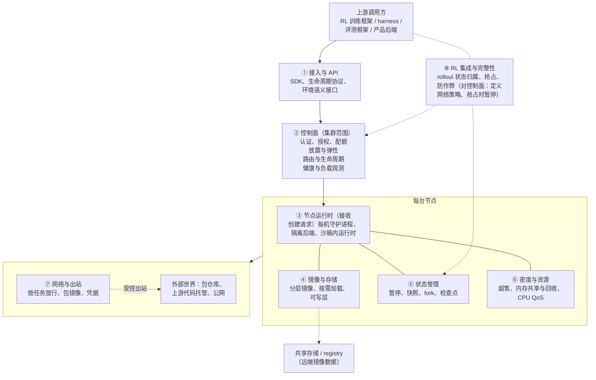
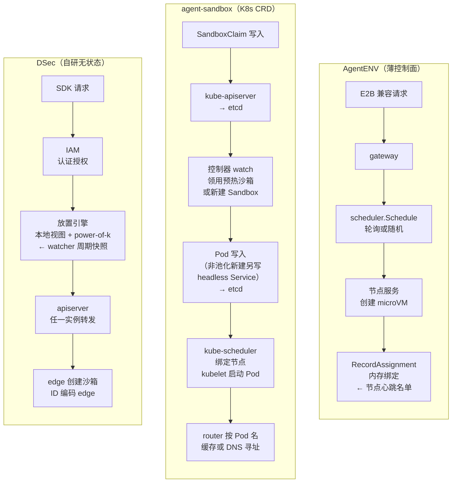

# 第 9 章　参考架构与控制面

## 本章导读

第二部分讨论的是隔离原语：一个沙箱怎样与宿主、与邻居隔开。第三部分换一个问题：当沙箱不是一个而是几十万个、每秒要新建几千个、彼此镜像各不相同、随时可能被训练框架暂停或丢弃时，围绕隔离原语还需要搭起哪些系统？本书把这些系统归纳为八层参考架构（eight-layer reference architecture）。本章先给出这张总图，再深入其中公开资料最少、却决定平台能否扛住突发的一层：控制面（control plane）。

本章的主线问题来自 DeepSeek DSec 的一个数字：单个规模单元的沙箱创建速率超过每秒 5,000 个（DSec §2.4；论文自述）。这样的平台，控制面怎样做到无状态、可水平扩展？Kubernetes（K8s）路线为什么在训练侧被广泛采用，却很少有人公开类似的创建速率？读完本章，读者应能：

- 复述八层架构各层的职责与关键设计问题，并知道每层在第 10–19 章的哪里展开；
- 说清"第④、⑤层是差异化所在，第⑧层是训练沙箱与产品沙箱的分水岭"这两个判断的依据；
- 把控制面的设计空间拆成路由状态、放置策略、编排底座、多租户与配额、弹性、预热、故障处理七个维度，并能在每个维度上对照 DSec、K8s CRD 路线与 AgentENV 的薄控制面；
- 理解 K8s 原生控制面在每秒数千次创建下会遇到哪些具体瓶颈，以及哪些折中办法能把 K8s 留在系统里、同时把它移出每个沙箱的创建关键路径；
- 在引用"并发""创建速率""任务"这几类规模数字时保留原文单位，不把它们混为一谈。

DSec 控制面的逐组件拆解已在第 24 章（见 24.3.2 节）完成，本章只复述理解对照所必需的部分，重点放在跨系统比较上。

## 9.1　为什么需要一套参考架构

### 9.1.1　从"一个运行时"到"一个平台"

DSec 在摘要里说，这类负载"需要一个弹性执行平台，而非单一的沙箱运行时"（requires an elastic execution platform rather than a single sandbox runtime），随后称 DSec 是"一个生产级沙箱平台"（a production sandbox platform）（DSec 摘要；论文自述）。这句话概括了 2026 年训练侧沙箱的基本事实：Firecracker、gVisor、Kata 这些隔离原语已经成熟，难点转移到原语之上。第 3 章刻画的负载特征说明了原因。单个 RL 作业最多请求 32K 个沙箱（DSec §1、§4.1；论文自述，原文为"up to 32K"），约 90% 的沙箱平均 CPU 不超过请求量的 5%（DSec §4.3；论文自述），容器沙箱的中位寿命为 17.4 分钟、p99 超过 3 小时（DSec §4.3；论文自述），活跃制品一周超过 130 TB（DSec §4.4；论文自述），而被训练的模型本身会主动寻找平台的漏洞（见第 19 章）。这些特征分别压在不同的层上："突发"压在控制面上，"镜像多样、低扇出"压在存储上，"稀疏、长寿命"压在密度上，"可中断"压在状态管理和 RL 集成上，"执行不可信"压在网络与完整性上。没有哪一个隔离原语能同时回答这些问题。

因此，本书把工业级 Agent 沙箱当作一个分层系统来写，而不是当作某种隔离技术的部署。分层有三个目的：一是给第 10–19 章一个共同的坐标，每章讲清自己在哪一层；二是给第 24–27 章的案例一个统一的拆解模板，让 DSec、AgentENV 和国内外各家的披露可以逐格对照；三是让"未披露"变得可见，某一层空着，本身就是一个发现。

### 9.1.2　八层的来历与划分原则

八层架构不是任何一家公司自己的分层。它最早出现在本书的前期调研报告《工业界 Agent 训练沙箱基础设施》中，是把 DSec 论文和 AgentENV 仓库这两份一手披露逐项对齐、再把其他公开系统填进去之后归纳出来的。DSec 论文本身没有这种编号，它的正文依次是概览、平台架构、负载刻画、存储与资源机制、与 RL 的协同设计、实现和评测（DSec §2–§8）；AgentENV 的架构文档则按"存储子系统、每节点编排器、分布式控制面"三块组织（AgentENV 架构文档；一手文档）。本书的八层是在两者之上的再归纳（推断）。

划分遵循三条原则。第一，**按职责而非组件划分**：DSec 的放置引擎和 AgentENV 的 scheduler 实现差别很大，但职责相同，都归第②层。第二，**沿请求路径从外到内排列**：第①层是调用方看到的接口，第②层是集群范围的认证、放置与路由，第③层是落到某台机器上的创建与执行，第④–⑥层是支撑节点运行的存储、状态与资源，第⑦层是沙箱与外界之间的边界，第⑧层回到上游，处理沙箱与 RL 训练系统的耦合。第三，**在职责上区分控制决策与数据面转发**：控制决策指放置、授权与路由解析，数据面转发指把命令执行、文件操作与流式 I/O 送到目标沙箱。两者在职责上可分，在实现上却常由同一组件承担。DSec 的 apiserver 是沙箱集群的入口代理，"所有沙箱请求，包括创建、命令执行和流式 I/O，都经过这个入口"（DSec §3.2；论文自述）；AgentENV 的 gateway 是 HTTP 反向代理，既为新沙箱调用 scheduler，也从请求头中解析沙箱数据面路由（AgentENV 架构文档；一手文档）。只有 kubernetes-sigs/agent-sandbox 把数据面拆给独立组件："Agent Sandbox 把创建与路由分开，路由器只处理数据面"（agent-sandbox `sandbox-router/README.md`；一手文档）。本书把入口代理的数据面转发记作第②层的一项子职责，命令在沙箱内的实际执行属于第③层。

图 9-1 给出八层的总体关系。

**图 9-1　工业级 Agent 沙箱的八层参考架构**（示意图，依据本书前期调研报告的八层表，以及 DSec §2–§7、AgentENV 架构文档的组件划分绘制）

图中第⑧层画成一条从上游回指的虚线，而不是压在最底下的一层，这是有意的：它不是一个独立的服务，而是 RL 框架与沙箱平台之间的一组契约，包括谁定义网络策略、GPU 作业被抢占时谁持有 rollout（一次策略与环境交互直至结束的完整采样过程，也称轨迹展开）状态、谁保证奖励信号不被篡改。第⑦层横跨节点与外部，因为出站策略的定义者（训练框架）和执行者（节点上的 eBPF 或代理）通常不在同一层。

## 9.2　八层参考架构总表

### 9.2.1　表 9-1：全书的锚点

表 9-1 是全书反复回到的锚点表。"DSec"与"AgentENV"两列取自各自的一手来源；"其他业界做法"一列的条目各有出处，其中厂商与二手材料已在格内注明。

**表 9-1　八层参考架构：职责、关键设计问题与代表性做法**

| 层 | 职责 | 关键设计问题 | DSec | AgentENV | 其他业界做法 | 本书详述 |
|---|---|---|---|---|---|---|
| ① 接入与 API | SDK、生命周期协议、环境语义接口 | 后端选择、空闲 TTL、网络策略是否进入接口；兼容事实标准还是自定协议 | 自有 Python SDK libdsec，摘要称以统一 SDK 暴露四档后端；§2.1 示例可声明资源上限、空闲 TTL、按包管理器的网络规则（示例以参数类型 `DSecContainerRunArgs` 与方法 `run_container` 选定容器后端，2026-10-04 复核） | E2B 兼容 HTTP API（改 `E2B_API_URL` 即可用标准 SDK）；`aenv` CLI | 阿里 ACS、腾讯 AGS、CubeSandbox 兼容 E2B 协议（厂商自报）；OpenEnv 的 `reset/step/state` + MCP；agent-sandbox 提供 Go/Python SDK | 第 16 章、附录 C |
| ② 控制面 | 认证与授权、配额、放置、路由、健康、弹性 | 路由状态放在哪里；放置算法如何避免羊群效应；编排底座是否用 K8s；突发时如何扩容 | 多级嵌套 IAM（人与 Agent 同一授权模型）、无状态 apiserver（沙箱 ID 编码所属 edge）、过滤 + power-of-k-choices 放置、watcher；BGP ECMP 入口；本地利用率超过 80% 时云突发 | Go gateway（HTTP :8080）+ scheduler（gRPC :9090）；round_robin（默认）/ random；沙箱到节点的绑定在内存中，重启即丢失 | MegaFlow：阿里云 K8s + Argo workflow；RollArt：独立 K8s CPU 集群；Kimi K2、Step 3.5：K8s；agent-sandbox：Sandbox / SandboxTemplate / SandboxClaim / SandboxWarmPool 四个 CRD；Cursor：编排迁至 Temporal | 本章 |
| ③ 节点运行时 | 在节点上创建与销毁沙箱；沙箱内执行代理 | 一个守护进程驱动几档后端；沙箱内运行时的攻击面 | 每节点 edge 驱动 FnCall、容器、Firecracker microVM、QEMU 完整 VM 四档；沙箱内 aether（UDS/vsock）+ chronus（shell 会话） | 每节点 Rust（Axum）服务 + 编排器；沙箱内 envd（取自 E2B）；Firecracker 进程、网络槽位、块设备预热池 | OpenSandbox：Docker/K8s 统一 SDK，可选 gVisor、Kata、Firecracker；agent-sandbox 经 `RuntimeClass` 把隔离委托给 gVisor/Kata | 第 5–8 章、24.3.3 节 |
| ④ 镜像与存储 | 镜像组织、分发、按需加载、可写层 | 低扇出下预拉取是否还有效；文件级还是块级分层 | 可组合 EROFS 只读层 + 3FS 按需读取，元数据本地化；microVM 可写盘用 OverlayBD over ublk | Rust overlaybd（LSMT）+ ublk；本地盘作有界缓存；可选 iroh P2P | RollArt：内部 registry 镜像 + 分布式缓存，env.reset 成功率超过 99.99%（论文自述）；快手重写镜像模块 | 第 10 章 |
| ⑤ 状态管理 | 暂停、快照、fork、检查点 | 状态能否比 GPU 作业活得久；fork 的粒度与代价 | 容器：cgroup swap + 主动回收；microVM：快照后终止 Firecracker 进程；pack_diff 增量磁盘检查点 | 增量内存 + 磁盘快照；同节点 fork | OpenAI：CoW XFS 块级快照、NBD 持久化到对象存储（二手）；Cursor：VM 在消息之间休眠与恢复 | 第 11、12 章 |
| ⑥ 密度与资源 | 超售、内存共享与回收、CPU QoS | 稀疏 CPU 下每核塞多少沙箱；只读层能否跨沙箱共享页缓存 | virtio-pmem DAX、DAMON + free page reporting、SCHED_IDLE + core scheduling | 内存快照 ublk 设备共享页缓存、balloon；超售 6.5×（K3 报告）与 9.6×（README）冲突 | CubeSandbox 自报单实例开销低于 5 MB | 第 13 章 |
| ⑦ 网络与出站 | 按任务放行、包镜像、凭据位置 | 策略由谁定义、按什么粒度执行；包代理是否成为出站通道 | 训练框架定义策略，每沙箱 eBPF 按 IP/端口/协议执行，随任务阶段切换；包镜像经 BGP ECMP 负载均衡 | 每沙箱独立网络命名空间与 iptables，命名空间内出站代理按 Host/SNI 判断，策略可运行时替换（架构文档）；API 只认证不加密 | OpenSandbox 出站凭据代理；Cursor 在评测 harness 中只放行白名单内的包 registry（reward hacking 博文）；Codex cloud 仅 setup 阶段联网 | 第 14、15 章 |
| ⑧ RL 集成与完整性 | rollout 状态归属、抢占、异步、防作弊 | GPU 作业被抢占时 rollout 状态归谁；奖励信号怎样不被篡改 | V4.1 起 agent sandbox 与 worker container 位于可抢占 GPU 池之外，共同作为 rollout 状态的唯一事实来源；AppArmor（root 下亦生效） | 文档化集成 Miles + OpenEnv | veRL、slime（心跳容错）、ROLL Flash、DORA；冗余 rollout；Step 3.5 在奖励模型侧的缓解 | 第 17–19 章 |

注：DSec 列依据 DSec §2–§7（论文自述），细节与出处见表 24-3；AgentENV 列依据仓库 README 与 `docs/src/internals/`（HEAD 00351e2，2026-10-01；一手文档），超售比冲突见第 13 章与附录 B C-01；"其他业界做法"列中 MegaFlow、RollArt、Kimi K2、Step 3.5 依据各自技术报告（论文自述），agent-sandbox 依据仓库 README（一手文档），Cursor 依据其 2026-06-02 云 agent 博文与 2026-06-25 reward hacking 博文（一手文档），OpenAI 条目为演讲的二手摘要。第③层在目录中没有独立成章，隔离后端见第二部分，DSec 的 edge/aether/chronus 见 24.3.3 节。

### 9.2.2　从总表读出的三个判断

**第一，第④、⑤层是差异化所在。** 按本书前期调研报告的归纳，DSec 论文的三大核心机制中有两个属于存储层：可组合 EROFS 层与 3FS 按需加载、OverlayBD/ublk 可写盘（DSec §4–§5、§7；论文自述）。AgentENV 的架构文档开篇就说："它的核心是一个存储子系统，提供可挂载进 VM 的分层块设备，以及基于 ublk 的内存快照恢复"（AgentENV 架构文档；一手文档）。在这一层，DSec 的 microVM 存储路径使用了 AgentENV 仓库中开源的 Rust OverlayBD/ublk 组件（论文称"我们参与贡献"）。存储与状态之所以是差异化所在，是因为它们直接决定了"几十万个互不相同的环境能否以接近零的空闲成本存在"这个全书的核心问题（推断）。

**第二，第⑧层是训练沙箱与产品沙箱的分水岭。** 产品沙箱不需要回答"GPU 作业被抢占时 rollout 状态归谁"；训练沙箱不回答这个问题，每次抢占都会丢掉 Agent 循环。DSec 在 V4.1 之前就遇到过这种情况："GPU 作业被抢占时，Agent 循环丢失了，而沙箱还在"，此后才把 rollout 状态移出可抢占的 GPU 池（DSec §6.2；论文自述；见第 17 章）。这也解释了为什么产品沙箱厂商的 API 能被训练系统迅速采纳，而它们的后端却不能照搬：接口层（第①层）相通，第②、④、⑧层的假设不同（推断）。

**第三，第②层是公开资料最薄的一层。** 表 9-1 中，第②层除 DSec 之外的条目几乎都只说到"用了 K8s"或"用了 Argo"为止，就本书检索所及，没有一家训练侧系统公开过创建速率、放置算法或故障时的行为。AgentENV 开源了控制面，但 MarkTechPost 的报道称其多节点控制面被描述为原型（MarkTechPost，2026-07-27；二手报道），开源版与 Moonshot 生产调度器的关系未披露。这是本章要用较大篇幅处理的空白。

### 9.2.3　第③–⑧层预览

**第③层　节点运行时。** 一台机器上的守护进程接住控制面的创建请求，驱动一档或几档隔离后端，并在沙箱内放一个执行代理。DSec 用一个 edge 统一驱动四档后端，把隔离强度变成按任务选择的参数；AgentENV 只用 Firecracker microVM。沙箱内运行时（DSec 的 chronus、AgentENV 的 envd）既是 harness（外壳/评测框架，负责驱动 Agent 循环、工具与打分）的一部分，也是 reward hacking（奖励投机）的目标：DSec §6.4 记录的数起行为正是冲着 chronus 的 socket 和日志去的（见 24.3.3 节、第 19 章）。隔离后端本身见第 5–8 章。

**第④层　镜像与存储。** 每个沙箱只读取镜像的 4.2%–13.3%（DSec 表 3；论文自述），容器镜像扇出的中位数只有 3（DSec §4.4；论文自述），预拉取和 P2P 在这种负载下收益很小。DSec 与 AgentENV 分别给出了文件级（EROFS 可组合层）和块级（overlaybd LSMT）两条路线。第 10 章展开。

**第⑤层　状态管理。** 等待推理最多占沙箱寿命的 98%（Kimi K3 技术报告；论文自述），暂停就是省钱；RL 的分支探索需要 fork；抢占要求状态比 GPU 作业活得久。第 11 章写沙箱内状态，第 12 章写沙箱外副作用与回滚语义。

**第⑥层　密度与资源。** DSec 单节点稳定运行至少 3,200 个容器或 800 个 microVM（DSec §4.3；论文自述），靠的是只读层页缓存共享、可写层内存回收与 CPU 分级。第 13 章展开，AgentENV 6.5 倍与 9.6 倍的超售比冲突也在那里并列。

**第⑦层　网络与出站。** DSec 把"这个任务能访问哪些软件源"做成任务定义的一部分，由训练框架声明、平台执行；包代理本身是最薄弱的出站点（OpenAI ExploitGym 一手复盘）。第 14、15 章展开。

**第⑧层　RL 集成与完整性。** rollout 状态归属、异步 rollout、冗余与长尾、token 一致性、环境构建完整性，以及 reward hacking 的遏制，分别见第 17、18、19 章。

## 9.3　控制面要回答的问题

### 9.3.1　职责

本书把控制面定义为负责认证、放置、健康检查与配额的集群服务（附录 A）。展开来说，一个 Agent 沙箱平台的控制面至少要回答六个问题：

1. **谁可以创建、操作、销毁哪些沙箱，最多能用多少资源？**（认证、授权、配额）
2. **新沙箱放在哪台节点上？**（放置）
3. **之后对这个沙箱的请求，怎样找到它所在的节点？**（路由）
4. **哪些节点健康、各自负载多少？**（观测）
5. **本地资源不够时怎么办？**（弹性）
6. **控制面自己的实例故障时，正在运行的沙箱和在途请求怎么办？**（可用性）

传统的容器编排系统也回答这六个问题，Agent 训练负载改变的是答案的权重。

### 9.3.2　负载对控制面的四个要求

**按峰值设计。** DSec 单个规模单元典型一天服务约 300 万个沙箱（DSec §2.4；论文自述），折合日均创建速率约 34.7 个/秒（3,000,000 ÷ 86,400；笔者推算），而峰值能力超过每秒 5,000 个，两者相差两个数量级以上（笔者推算）。也就是说，控制面在绝大多数时间里很闲，但在 RL 作业启动、一次请求数千到数万个沙箱的那几秒，它必须一次性吸收全部请求（DSec §4.1：典型容器任务创建数千个沙箱，尾部达数万；论文自述）。按平均负载配置的控制面会在每个训练步的开头成为瓶颈。

**路由状态寿命长。** 沙箱不是一次性函数，容器中位寿命 17.4 分钟、p99 超过 3 小时，期间每次工具调用都要被路由到同一个沙箱。"沙箱在哪台节点上"这条信息必须在整个寿命内可查，而且查询频率远高于创建频率（推断）。它放在哪里、怎样容错，是控制面设计的第一个分岔点（见 9.6.1 节）。

**后端异构。** DSec 的放置引擎第一步就要按"所需后端与硬件"过滤节点（DSec §3.2；论文自述），因为 FnCall、容器、microVM 与完整 VM 落在不同的机器上，GPU FnCall 还要 MIG 切分。只跑一种后端的平台（AgentENV）在这一步可以简化。

**调用方本身可能越权。** DSec 的 IAM 写明"人和 Agent 使用同一套管理 API 与授权模型"（DSec §3.2；论文自述）。当 Agent 自己也会创建、打包沙箱时，它就是平台的一个用户；而第 19 章说明，被训练的模型是最有动机、最有耐心的攻击者。控制面的授权模型因此要把 Agent 当作一个可能越权的主体来约束，而不是当作受信的内部服务。

## 9.4　DSec：无状态控制面的参照实现

### 9.4.1　四个组件与一条请求路径

DSec 的集群层由 IAM、apiserver、放置引擎（placement engine）和 watcher 四个组件构成。论文对请求路径的描述是："创建请求首先发往 IAM 做认证和授权；授权通过后进入放置引擎，放置引擎利用 watcher 收集的健康与负载信息选出目标节点；放置完成后，apiserver 把请求转发给该节点上的 edge"（DSec §3.1；论文自述）。各组件的逐句引文与分析见 24.3.2 节，这里只把它们归结为四个设计动作，供后文对照。

**动作一：把路由信息编进标识符。** apiserver"不维护任何单沙箱状态"，因为"每个沙箱 ID 都编码了它所属的 edge"，所以"任何 apiserver 实例都能解析请求并直接转发到目标 edge，入口层因此可以水平扩展"（DSec §3.2；论文自述）。这一步消掉了"沙箱在哪里"的查表，第 9.3.2 节所说的高频路由查询因此不需要任何共享存储。

**动作二：用随机采样加本地视图做放置。** 放置先过滤、再排序，排序阶段"随机采样少数几个合格节点，选择其中负载最低的那个"（DSec §3.2；论文自述）。算法名称与目的在 §7 的实现说明中才给出："调度器随机抽取 k 个节点，选负载最低者，避免羊群效应（herding），并减少突发的 RL 环境在搭建和工具调用阶段的相互干扰"，即 power-of-k-choices；同节还写道，每个放置引擎实例"在 watcher 周期快照的基础上叠加自己最近做出、尚未反映在快照中的放置决策"，从而"在不跨实例协调的前提下计入在途负载"（DSec §7；论文自述，本书 2026-10-02 回原文确认）。k 的取值与"负载"的定义论文均未给出（附录 B B09-04），本书不填写。

**动作三：用网络层而非软件层做入口高可用。** 对 API 网关、包镜像这类"辅助服务"以及控制面入口，DSec 采用"基于 BGP 的负载均衡：每个服务的各实例宣告同一个虚拟 IP，由上游交换机做 ECMP 路由"，实例故障时能"在数秒内把流量重定向到其余实例"（DSec §7；论文自述）。

**动作四：把云当作溢出容量。** 本地利用率超过 80% 时，放置引擎把一部分符合条件的创建请求卸载到云上 VM；一套去重后共 30 TB 的 EROFS 镜像集覆盖了 70% 容器任务所访问的镜像文件，只有被它完全覆盖的任务才能上云；生产中一个规模单元内的 200 台云 VM 吸收了约 30% 的峰值溢出（DSec §3.4；论文自述）。

此外，IAM 支持"多级项目嵌套，而不是云平台常见的扁平或两级层次"，委派受父级约束（DSec §3.2；论文自述）；论文还写到"资源配额限制资源消耗"（resource quotas limit resource consumption）（DSec §3.2；论文自述，本书 2026-10-02 回原文确认），但配额层级的具体形式没有展开。

### 9.4.2　没有 K8s，以及这意味着什么

DSec 论文全文没有出现"Kubernetes"或"K8s"（本书 2026-10-02 两次读取 HTML 版均未见；尚未以 PDF 全文检索复核）。这不等于 DeepSeek 内部不用 K8s，只说明 DSec 的控制面没有把 K8s 放在设计叙述里。笔者的解读是：编码 edge 的沙箱 ID、乐观的本地放置视图、BGP ECMP 入口三者结合，正是 DSec 在没有中心化一致性存储的情况下达到每秒 5,000 次以上创建的原因（推断）。论文没有这样表述，也没有给出控制面各组件的实例数、单实例吞吐或创建延迟分布，这一推断的检验只能留给 9.7 节用 K8s 一侧的一手数据从反面做。

DSec 的控制面也有它没说的代价。把 edge 编进 ID，意味着沙箱一旦创建就不能透明地换节点，跨节点迁移需要换 ID 或者另设一层映射（推断）；这与第 11 章所说的"跨节点 fork 与在线迁移没有一家工业系统披露"是同一个空白的两面。放置引擎的本地视图是乐观的，多个实例在同一瞬间仍可能把请求压到同一节点，论文用随机采样把这种概率压低，但没有给出冲突率（推断）。

## 9.5　Kubernetes 路线

### 9.5.1　训练侧：K8s 是事实上的默认底座

与 DSec 的自研路线相对，公开材料里的大多数训练侧系统都建在 K8s 上或支持 K8s，只是披露深度各不相同。表 9-2 按原文措辞汇总。

**表 9-2　训练侧 K8s 路线的公开披露**

| 系统 | 编排方式（原文要点） | 规模数字（原文单位） | 来源与类型 | 控制面细节 |
|---|---|---|---|---|
| 阿里 MegaFlow（Qwen3-Coder-Next） | "基于阿里云 Kubernetes 的完全云原生执行框架"；每个 Agent 编码任务是一个 Argo workflow，分 rollout、评测、后处理三阶段；rollout 阶段"一个 pod 通常把 Agent 容器与执行环境容器放在一起" | 未给并发数；任务规模为 807,693 个真实 PR 实例加 851,898 个合成 bug 实例 | arXiv 2603.00729；论文自述 | 未披露；报告另引一篇 MegaFlow 专文（Zhang et al., 2026c），本书未读 |
| 阿里 RollArt（OSDI'26） | 环境运行在"由 Kubernetes 编排"的 CPU 集群上，与 GPU 集群分开；"专用的 Kubernetes 集群管理并隔离每个容器化环境" | "数千个并发的、基于 Docker 的 Agent 环境"；训练用 3,000 张以上 GPU | arXiv 2512.22560；论文自述 | 未披露调度细节；披露了 env.reset 故障率（见 9.6.6 节） |
| Kimi K2 | "由 Kubernetes 提供可扩展性与安全性的沙箱基础设施" | "支持超过 10,000 个并发沙箱实例，性能稳定" | arXiv 2507.20534；论文自述 | 未披露 |
| 阶跃 Step 3.5 Flash | "专有的 Session-Router 通过 Kubernetes 编排容器生命周期，并通过 Tmux 保证交互一致性" | "数千个并发环境，状态无缝持久化" | arXiv 2602.10604；论文自述 | 只披露 Session-Router 这一层 |
| 蚂蚁 AEnvironment | 沙箱引擎可选 ASandbox 或 Kubernetes 等（原文称"支持扩展到 Kubernetes 等多种沙箱引擎"），配合 AReaL | "数万"吞吐（单位不明） | Ant Ling Medium，2025-12-17；厂商自报 | 未披露 |
| DeepSWE / rLLM（Agentica + Together） | 把过载的 Docker daemon 换成 Kubernetes，自动扩缩 | 每次迭代 512 个 Docker 容器；调度超过 1,000 个 CPU 核 | Together AI 博客，2025-07-02；一手文档 | 未披露 |

注：引号内为原文的中文译文。本书 2026-10-02 回 MegaFlow、RollArt、Kimi K2、Step 3.5 的 arXiv HTML 原文核对过上述措辞。智谱 GLM-5 的 Multi-Task Rollout Orchestrator"支持超过 1k 个并发 rollout"（arXiv 2602.15763；论文自述），但报告没有说明底座是否为 K8s，故不列入本表。

表 9-2 的条目有两个共同点。第一，所有条目的规模数字都是**并发数**（沙箱、环境或容器），没有一条是**创建速率**；而控制面的压力主要来自后者（见本章"方法"边栏）。第二，没有一家披露 K8s 之上的控制面做了什么：放置是否交给默认调度器、沙箱对象如何建模、路由信息存在哪里，都是空白。MegaFlow 的"一个 pod 内 Agent 容器与环境容器同置"是唯一披露的结构性选择。原文说这样做是为了以"最小的通信开销"支持长程交互（arXiv 2603.00729；论文自述），同一 pod 内的容器可经本地网络通信（推断）；代价是 Agent 循环的生命周期与环境容器绑在一起，这正是 DSec 在 V4.1 之前遇到、后来用 worker container 拆开的耦合（推断；见第 17 章）。

> **边栏：方法——并发、创建速率与任务：三种口径**
>
> 规模数字至少有三种单位，引用时必须保留原文措辞。**并发数**是某一时刻同时存在的沙箱或环境数，例如 DSec 峰值约 38 万个沙箱（DSec §2.4；论文自述）、Kimi K2 超过 10,000 个并发沙箱实例、美团 LongCat 最多 32,000 个环境并发（arXiv 2601.16725；论文自述）。**创建速率**是单位时间新建的沙箱数，例如 DSec 超过每秒 5,000 个、GKE Agent Sandbox 每秒 300 个（InfoQ，2026-05-07；二手报道）。**任务或 rollout 数**是训练框架层面的并发单位，例如 Kimi K2.5 的 Rollout Manager"最多编排 100,000 个并发 agent 任务"（arXiv 2602.02276；论文自述），每个任务从托管池中取一个带沙箱的环境实例，它不是 10 万个并发沙箱（附录 B C-09、X-09）；GLM-5 的"超过 1k 个并发 rollout"也属此类。另有"环境"作为任务世界的计数（如 GLM-5 的 1 万以上可验证环境），与前三者都不同（见附录 A"环境"条）。
>
> 三者之间只有在知道沙箱寿命分布时才能互相换算，而大多数来源不给寿命分布。本书的做法是：同一张表里只放同一单位的数字；跨单位比较只说量级，并注明"口径不同"。

### 9.5.2　平台侧：GKE Agent Sandbox 与 kubernetes-sigs/agent-sandbox

如果说训练侧的 K8s 用法大多不透明，那么开源项目 kubernetes-sigs/agent-sandbox（2025 年在 KubeCon NA 上作为 SIG Apps 子项目发布；InfoQ，2026-05-07；二手报道）及其 GKE 托管形态（Cloud Next '26 前后推出），就是 K8s 原生控制面目前最完整的一手样本。它是 K8s SIG Apps 下的子项目，自我定位为"沙箱编排器"：低层隔离委托给 gVisor 或 Kata 等"沙箱运行时"，自身只管理通过 `RuntimeClass` 使用这些运行时的 Pod（agent-sandbox README；一手文档）。README 开篇写明，它"适合 AI Agent 运行时和强化学习这类用例"（agent-sandbox README；一手文档）。

**对象模型。** 核心是 `Sandbox` 这个自定义资源（CRD），描述"一个有状态、具有稳定身份和持久存储的单 Pod"；扩展模块提供三个 CRD：`SandboxTemplate`（可复用的模板）、`SandboxClaim`（从预热池领用沙箱）、`SandboxWarmPool`（管理预热好的沙箱池）（agent-sandbox README，2026-09-30 版；一手文档）。本书早先（含附录 E 旧版）记为三个 CRD（Sandbox、SandboxTemplate、SandboxClaim），本书回仓库核对，扩展模块中另有 `SandboxWarmPool`，合计四个，附带的 RL 编排示例也要求"4 个 CRD"（agent-sandbox `examples/agent-sandbox-rl/README.md`；一手文档）。

**数据面与控制面分离。** 控制器遵循 K8s 的控制器模式：用户创建 `Sandbox` 资源，控制器据此创建 Pod 与 Service。数据面由一个无状态的 sandbox-router 承担，它按请求头 `X-Sandbox-ID`（即 Pod 名）把流量转发给对应的 Pod，可以用缓存中的 Pod IP 或集群 DNS 解析；路由器"从不创建或查找 Sandbox 资源"（agent-sandbox `sandbox-router/README.md`；一手文档）。也就是说，路由信息最终来自 K8s 自身（Pod 名、Service、DNS），而不是编码在沙箱 ID 里。

**规模宣称与一手调优数据。** InfoQ 报道 GKE Agent Sandbox 每秒创建 300 个沙箱，预热池可达亚秒级（InfoQ，2026-05-07；二手报道）；Google Cloud 博客称 Lovable 用它运行 AI 生成的应用，每天新建 20 万以上个项目，可扩到"每秒数百个安全沙箱"（Google Cloud 博客，2026-04-22；厂商自报）。更有价值的是开源仓库自带的性能调优文档，它是本书所见唯一一份公开讨论 K8s 原生沙箱控制面瓶颈的一手材料，9.7 节会详细使用。

### 9.5.3　其他 K8s 形态

阿里开源的 **OpenSandbox**（Apache-2.0，2026 年 3 月前后开源，据 Cryptonomist 报道，未回原文核对）在 Docker 与 Kubernetes 上提供统一 SDK，隔离可选 gVisor、Kata 或 Firecracker（依 2026-10-02 版 README；10-04 现行 README 未列 gVisor、Kata，暂停/恢复限 Firecracker 沙箱；仓库已迁至 opensandbox-group），预热 Firecracker 的参考创建延迟为 P50 97 ms（串行）、P99 308 ms（10 并发），支持预热池与暂停/恢复检查点，并把 RL 训练列为支持的负载（OpenSandbox README，2026-10-02 抓取；一手文档）；Northflank 的分析称它在每个沙箱中注入 Go 写的 execd 守护进程，并用 BatchSandbox 做池化（Northflank 博客；二手报道）。公开来源没有说明 OpenSandbox 或阿里云 ACS Agent Sandbox 是否支撑了 Qwen 的训练（本书检索范围内）。

AgentENV 也可以部署在 K8s 上，但用法不同：运行时节点以特权 DaemonSet 部署，scheduler 通过 EndpointSlice 发现节点，K8s 只用于部署与节点发现，不参与每个沙箱的创建（AgentENV 架构文档；一手文档）。这是 9.7.3 节所说"把 K8s 留在系统里、移出关键路径"的一个现成例子。

## 9.6　控制面设计空间

把 DSec、agent-sandbox、AgentENV 与其他公开系统放在一起，控制面的设计选择可以拆成七个维度。表 9-3 先给出全貌，各小节再逐一讨论。

**表 9-3　控制面设计空间**

| 维度 | DSec（自研无状态） | agent-sandbox / GKE（K8s CRD） | AgentENV（薄控制面） | 其他公开做法 |
|---|---|---|---|---|
| 路由状态（沙箱 → 节点） | 无状态：沙箱 ID 编码所属 edge，任一 apiserver 实例直接转发 | 存在 K8s 对象中（Sandbox、Pod、Service）；无状态 router 按 Pod 名经缓存或 DNS 解析 | 有状态：scheduler 中的绑定（默认在内存，重启丢失；可选 Redis），`RecordAssignment` 建立，节点心跳名单为准 | 其他系统未披露 |
| 放置策略 | 过滤（健康、后端、硬件）+ power-of-k-choices + 本地在途叠加；k 与负载定义未披露 | 交给 kube-scheduler；文档称默认配置下 Pod 调度约 70 个/秒 | round_robin（默认）或 random；未知策略名回落到 round_robin（代码） | OpenAI：快照感知调度（二手） |
| 编排底座 | 自研服务，论文未提 K8s | CRD + 控制器；控制器以领导者选举单活运行 | Go 服务；可选 K8s EndpointSlice 发现、DaemonSet 部署 | MegaFlow：Argo workflow；Cursor：Temporal |
| 多租户与配额 | 多级项目嵌套 IAM；人与 Agent 同一授权模型；资源配额 | 沿用 K8s 命名空间（`X-Sandbox-Namespace`）；其余未在本书所读文档中展开 | API 密钥认证，不加密流量 | Prime：默认并发上限 1,024（厂商自报）；Modal：每客户最多 5 万并发（厂商自报） |
| 弹性 | 本地利用率超过 80% 时云突发；200 台云 VM 吸收约 30% 峰值溢出 | 依赖集群节点自动扩缩；文档提到节点自动供给慢时需放宽就绪宽限期 | 未披露 | RollArt：独立 K8s CPU 集群；ACS/GKE 等托管服务 |
| 预热 | GPU FnCall 用 Python 进程预热池预先初始化运行时、导入库（§7）；容器、microVM 级预热池未披露 | `SandboxWarmPool` + `SandboxClaim`：集群级池与领用分离 | 节点级预热：网络槽位、ublk 块设备、预先启动的 Firecracker 进程 | Cua：pool 与 claim 分离；OpenSandbox：预热池；ACS：预热池"百毫秒级"创建（厂商自报） |
| 故障处理 | 组件无持久状态；BGP ECMP 数秒内切换；watcher 探测健康 | 状态持久在 etcd；控制器领导者选举；预热池"期望门控"超时 5 分钟 | 重启后由新建请求与下一轮心跳重建绑定；`binding_ttl` 过期即丢弃 | slime：心跳容错；Cursor：迁至 Temporal 后可靠性约 90% → 99% 以上 |

注：DSec 列依据 DSec §3.1–§3.4、§7（论文自述）；agent-sandbox 列依据仓库 README、`sandbox-router/README.md`、`docs/configuration.md`、`docs/performance-tuning.md`（HEAD 82d410e，2026-09-30；一手文档），GKE 规模数字为二手报道；AgentENV 列依据 `docs/src/internals/architecture.md` 与 `services/scheduler/internal/strategy.go`（HEAD 00351e2；一手文档）；Cursor 依据其 2026-06-02 博客（一手文档）；OpenAI 为演讲的二手摘要；Prime、Modal、ACS 为厂商自报。

### 9.6.1　路由状态：无状态编码还是有状态绑定

这是三条路线分岔最清楚的维度。DSec 把"沙箱在哪"编进 ID，路由不需要任何查表。agent-sandbox 把它放在 K8s 对象里，由 etcd 持久化、经 watch 同步到各处缓存。AgentENV 放在 scheduler 进程的内存里：网关为新沙箱调用 `Schedule()` 选节点，为已有沙箱调用 `LookupNode()` 查节点，创建成功后调用 `RecordAssignment()` 写入绑定；节点心跳携带本节点完整的沙箱 ID 名单，scheduler"把这份名单当作该节点的事实来源"，删掉名单里没有的绑定（AgentENV 架构文档；一手文档）。

三种做法对应三种可用性语义。DSec 的路由信息与沙箱同生共死，控制面实例任意重启都不影响已有沙箱的寻址。agent-sandbox 的路由信息可靠，但每次创建都要经过一致性存储。AgentENV 的文档自己写明了局限："所有绑定都在内存中（scheduler 重启即丢失）……Kubernetes 发现能动态更新可调度节点集，但绑定的持久化仍未做副本"（AgentENV 架构文档；一手文档）。这是默认配置；服务说明另提供 Redis 绑定存储，并可加 `--query-only` 只读调度副本，但"这种 HA 模式有意只覆盖数据面"（AgentENV services/README.md，首版即有；一手文档）。在默认的内存配置下，重启后绑定由新的创建请求与各节点下一轮心跳名单重建，在此之前对老沙箱的查询会失败（推断）。对一个原型而言，这是合理的取舍；对一个每天要服务数百万沙箱的生产系统，它至少需要持久化或可推导的路由（推断）。

### 9.6.2　放置策略：从轮询到 power-of-k

AgentENV 的两种策略都不看负载：轮询与随机。代码里，除"random"之外的任何策略名都会回落到 round_robin（AgentENV `strategy.go`；一手文档）。agent-sandbox 把放置交给 K8s 默认调度器，它的性能文档给出一个具体上限："Pod 调度在 kube-scheduler 默认 `--kube-api-qps=50` 下约为每秒 70 个"，每个预热池的补充上限约为每秒 70–85 个（agent-sandbox `docs/performance-tuning.md`；一手文档）。DSec 用 power-of-k-choices。

在 Agent 负载下，三者的差别不只是"均衡得好不好"。DSec 明确说，power-of-k 的目的是减少"突发的 RL 环境在搭建和工具调用阶段的相互干扰"（DSec §7；论文自述）：一个 RL 作业同时拉起的几千个沙箱会几乎同时进入 setup 阶段，同时拉镜像、装依赖，如果它们集中在少数节点，节点的磁盘与网络会被同一批请求打满。轮询能把同一批请求均匀撒开，但对节点之间已有的负载差异视而不见；"选全局最空闲"在并发决策下会让所有请求涌向同一节点；随机采样少数候选再取最优，加上本地在途叠加，是在无协调前提下兼顾两者的折中（推断）。OpenAI 工程师的演讲提到"快照感知调度"（snapshot-aware scheduling），即放置时考虑快照所在位置（ZenML 对 OpenAI 演讲的摘要；二手报道），这把放置与第⑤层耦合起来，是另一个方向，细节未披露。

### 9.6.3　编排底座：任务工作流与沙箱生命周期是两层

公开材料里出现了三类"编排"：K8s CRD 与控制器（agent-sandbox）、工作流引擎（MegaFlow 用 Argo，每个任务一个 workflow；Cursor 把云 agent 的编排从自研迁到 Temporal）、自研服务（DSec、AgentENV）。它们其实处在两个层次。Argo 与 Temporal 编排的是**任务**：一个任务有 rollout、评测、后处理几个阶段，每个阶段要不要重试、失败怎么补偿。CRD 控制器与 DSec 的放置引擎编排的是**沙箱**：一个沙箱放在哪、怎样找到它、何时回收（推断）。Cursor 的数据显示，迁到 Temporal 后，可靠性从约 90% 提到 99% 以上，平台每天执行 5,000 万次以上动作、700 万个以上 workflow（Cursor 博客，2026-06-02；一手文档）；把这一提升归因于任务层编排，是笔者的解读（推断）。而且这是产品侧云 agent 的数据，任务层与沙箱层在训练侧怎样分工，没有一家披露。

### 9.6.4　多租户、配额与 Agent 作为主体

DSec 的多级项目嵌套 IAM 是本书所见唯一一份把"Agent 也是授权主体"写进控制面设计的一手披露。训练集群里，同一个平台同时服务多个训练作业、评测作业和人工调试，资源要按项目层层切分；Agent 在 pack_diff 等流程中会自己创建沙箱（见 24.3.5 节），它能授出的权限不能超过它被授予的。云厂商的配额通常是扁平的单客户上限，例如 Prime Sandboxes 的默认并发上限为 1,024（Prime 博客，2026-09-23；厂商自报），Modal 宣称每客户最多 5 万个并发沙箱（Modal 页面，2026-07；厂商自报）。agent-sandbox 沿用 K8s 的命名空间作为租户边界，路由器以请求头 `X-Sandbox-Namespace` 区分命名空间，缺省为 `default`（agent-sandbox `sandbox-router/README.md`；一手文档）。AgentENV 只做 API 认证，README 警告它"不加密流量"，必须在代理处终止 HTTPS（AgentENV README；一手文档）。

### 9.6.5　弹性与预热：两种"让创建变快"的办法

让沙箱"更快可用"有两条互补的路。一条是**扩容**：DSec 在利用率超过 80% 时把请求溢出到云，但只有镜像落在 30 TB 集合内的任务（70% 的容器任务）才能上云，其余约 30% 的容器任务不能（100% − 70%；笔者推算）。这说明云突发的可行性建立在第④层之上：正因为镜像是按需读取的不可变只读层，才能挑出一个覆盖多数任务的紧凑子集放到云上（推断；见 24.3.2 节）。

另一条是**预热**：提前把沙箱或其部件准备好，请求到来时直接领用。预热池在不同系统里处在不同层次。agent-sandbox 的 `SandboxWarmPool` 与 `SandboxClaim` 是**集群级**的池与领用分离，开源平台 Cua 的 fleet 模式同样以 pool（启动制品）加 claim（租用实例）分离镜像准备与实例获取（Cua 文档；一手文档）。AgentENV 的预热在**节点级**：预先分配网络槽位、ublk 块设备，并预先启动"（网络槽位，Firecracker 进程）"对，恢复快照时直接接管，省去进程启动与等待 API socket 的时间（AgentENV 架构文档；一手文档）。DSec 也有一个进程级的例子：GPU FnCall 后端用"一个 Python 进程预热池预先初始化运行时并导入库，使请求可以直接开始执行算子"（DSec §7；论文自述）；容器与 microVM 是否有沙箱级预热池，论文没有说明。

集群级预热池在 Agent 训练负载下有一个结构性问题：池是按模板（也就是按镜像）建的。agent-sandbox 的 RL 编排示例正是这样做的：为每个镜像确保一个 `SandboxTemplate` 和一个 `SandboxWarmPool`，再为每个任务领用一个沙箱（agent-sandbox `examples/agent-sandbox-rl`；一手文档）。而 DSec 测得容器镜像扇出的中位数只有 3、p90 为 28（DSec §4.4；论文自述），表 2 列出的容器 workspace 超过 10 万个（102,171 个；DSec 表 2；论文自述）。为几万个各自只被用几次的镜像各维护一个预热池，池的空置成本会抵消它带来的延迟收益（推断）。这与 DSec 否定预拉取、转向按需加载是同一个理由（见第 10 章）。产品场景模板少、复用高，集群级预热池最有效（附录 A"预热池"条）；训练场景更依赖节点级的部件预热和存储层的按需加载（推断）。

### 9.6.6　故障处理：控制面故障与数据面故障

控制面自身的故障，三条路线的处理已在 9.6.1 节对照过。这里补充一点：公开的运维数据显示，训练侧最常见的故障并不在控制面，而在沙箱创建的数据路径上。RollArt 记录，env.reset（拉镜像加起容器）的环境超时"大约每十次迭代就发生一次"，在发生环境超时的迭代中，训练步平均时长从正常的 365.7 秒飙升到 513 秒（RollArt §3.1 图 3），env.reset 单独占去 rollout 时间的 78%。原因是"数百个环境工作进程同时拉取 Docker 镜像会打满网络链路"，以及新容器启动对宿主 CPU 和磁盘的争用；引入内部 registry 镜像与第二级分布式缓存后，env.reset 成功率超过 99.99%（arXiv 2512.22560；论文自述，本书 2026-10-02 回原文确认，513 秒为本次新取得的数字）。快手 KAT-Coder-V2.5 把沙箱反馈错误率从约 16% 降到 2% 以下（arXiv 2607.05471；论文自述；见第 17 章）。

这些数字提醒读者：控制面放置得再好，如果第④层扛不住突发的镜像拉取，失败会在创建之后才出现，并且以超时而非错误码的形式出现（推断）。因此，控制面与存储层之间需要一个反馈环：watcher 统计的"负载"若只计沙箱数、不计正在拉取镜像的 I/O，power-of-k 也会把请求送到正在拉镜像的节点上。DSec 没有定义"负载"，这个问题无从判断（附录 B B09-04）。

## 9.7　每秒 5,000 次创建：K8s 原生与自研控制面

### 9.7.1　创建速率溯源

表 9-4 汇总本书所见的全部创建速率数字。它们口径不同：有的是生产峰值，有的是产品宣称，有的测试条件不明，有的是单个预热池的补充上限，只能作量级参考。

**表 9-4　沙箱创建速率溯源**

| 系统 | 原文数字 | 折算为每秒 | 口径 | 来源与类型 | 日期 |
|---|---|---|---|---|---|
| DSec | "超过每秒 5,000 个实例" | > 5,000 | 单个规模单元的生产创建速率 | DSec §2.4、摘要；论文自述 | 2026-09 |
| DSec | 约 300 万个/天 | 约 34.7 | 日均，3,000,000 ÷ 86,400 | 笔者推算 | 2026-09 |
| GKE Agent Sandbox | 每秒 300 个 | 300 | 产品宣称，预热池亚秒级 | InfoQ；二手报道 | 2026-05-07 |
| Lovable on GKE | "每秒数百个安全沙箱" | 数百 | 客户用例的可扩展上限 | Google Cloud 博客；厂商自报 | 2026-04-22 |
| agent-sandbox（开源） | 每个预热池补充上限约 70–85 个/秒；默认配置下 Pod 调度约 70 个/秒 | 约 70–85 | 标准控制面，单池 | `docs/performance-tuning.md`；一手文档 | 2026-09-30 版 |
| 阿里云 ACS Agent Sandbox | 最高每分钟 1.5 万个 | 约 250 | 产品文档 | ACS 文档；厂商自报（折算为笔者推算） | 2026-06-22（附录 B 所记修改日期，本次核对页面未显示） |
| 阿里云 ACS Agent Sandbox | 每分钟 10 万个 | 约 1,667 | 营销文 | 阿里云营销文；厂商自报（折算为笔者推算） | 2026-09-28 |
| MiniMax 在 ACS 上 | 10 秒拉起 5,000 个沙箱 | 约 500 | 客户案例 | 阿里云营销文；厂商自报（折算为笔者推算） | 2026-09-28 |
| 腾讯云 Agent Runtime | "数十万实例/分钟" | 数千 | 产品页，原文紧接"超大规模并发"，口径混用 | 腾讯云产品页；厂商自报 | 性能数据采集于 2025-08（产品页注） |
| Modal | "一分钟内创建一百万个并发沙箱" | > 16,667 | 测试条件未说明（附录 B 记为工程演示，原页未见"演示"字样） | Modal 页面；厂商自报（折算为笔者推算） | 2026-07 |

注：ACS 的两组数字按日期并列（附录 B C-06、C-13）；腾讯云的"数十万实例/分钟"是创建速率，与其文档中"数万实例并发"的并发数口径不同（C-08），"数千"为量级换算（笔者推算）；Modal 一行折算为 1,000,000 ÷ 60。

把表 9-4 读成"谁更快"是错误的。DSec 的数字是自建集群在生产中实测的峰值，GKE、ACS、腾讯云是托管产品对所有客户的宣称，Modal 的测试条件不明，agent-sandbox 文档给出的是单个预热池在标准控制面上的补充上限。可以读出的只有量级：按 2026 年年中 GKE 与 ACS 的公开口径，这两家公有云沙箱服务的创建速率比 DSec 自建集群低一个数量级左右（口径不同，仅作量级比较；附录 B C-13 建议措辞）。Modal 的折算值高于 DSec，但原页未说明测试条件；腾讯云的"数十万实例/分钟"与 DSec 同量级，但来自未说明测试条件的产品页，两者都不计入这一比较；到 2026 年 9 月，ACS 的营销口径已升至约每秒 1,667 个（笔者推算），差距缩小到三倍左右（5,000 ÷ 1,667；笔者推算）。

### 9.7.2　K8s 原生路径的五个瓶颈

为什么 K8s 原生路线很少公开每秒数千次的创建速率？agent-sandbox 的调优文档给出了一份难得的一手答案。它的出发点是：在持续每秒 10–20 次以上领用、或管理 1,000–2,500 个以上副本的预热池时，"标准的控制器部署会遇到 API server 瓶颈和预热池补充停滞"（agent-sandbox `docs/configuration.md`；一手文档）。归纳起来是五个瓶颈，以下数字均出自该仓库的两份文档（一手文档），推算与解读另行标注。

**一是每个沙箱带来多次持久化写。** 在 K8s 原生模型里，从预热池领用至少涉及 SandboxClaim 的创建与 Sandbox、Pod 的更新；非池化的新建还要创建 Pod 和 headless Service（预热池中的沙箱没有单独的 Service；agent-sandbox `sandbox-router/README.md` 与控制器代码）。每一次都经 API server 写入 etcd。文档建议在高吞吐时关闭领用事件与观测注解，理由是"在每秒 20 次领用时可以消除约 40 次写 QPS"（`docs/configuration.md`）。也就是说，仅这两项辅助写入就约为每次领用 2 次写（40 ÷ 20；笔者推算）。若以 DSec 的每秒 5,000 次创建计，仅这两项就是每秒约 10,000 次写（5,000 × 2；笔者推算），还不算对象本身的创建与状态更新。

**二是调度器吞吐。** 文档写明，在 kube-scheduler 默认配置下，Pod 调度约为每秒 70 个，单个预热池的补充上限约为每秒 70–85 个（`docs/performance-tuning.md`）。每秒 5,000 次约为这一默认上限的 71 倍（5,000 ÷ 70；笔者推算）。调度器可以调参、可以多池并行，GKE 宣称的每秒 300 个与此并不矛盾（推断），但量级的差距说明，默认路径不是为这种突发设计的。

**三是 API server 的并发上限。** kube-apiserver 对每条 HTTP/2 连接的并发流有上限，默认 100，"所以单条连接无论工作线程数或 QPS 设置如何，有效并发都被限制在这个值"；文档因此提供 `--api-connections` 把写流量分片到多条连接，并建议在领用速率超过每秒约 50 次或 API server 与其他负载共享时，用 API 优先级与公平性（API Priority and Fairness，APF）给控制器划出专用并发席位（`docs/configuration.md`、`docs/performance-tuning.md`）。

**四是 watch 回路的门控。** 预热池控制器每批创建后，要等 informer 缓存通过 watch 观察到这一批的全部 ADD 事件，才发出下一批；如果写流量与 watch 共用一条连接，大批写入会使 watch 帧排队或丢失，"使预热池卡住，直到 5 分钟的兜底超时到期"（`docs/configuration.md`）。这是一致性存储加事件驱动控制器的典型代价：正确性靠"写入—观察"的往返保证，往返本身就成了吞吐的节拍（推断）。

**五是单活控制器。** 文档给出的高吞吐部署示例中，控制器 `replicas: 1` 并开启领导者选举（`docs/configuration.md`）。工作线程数可以调大，但文档的实测表明，工作线程过多反而"增加不必要的 API server 争用"：在 75 个并发领用、同样开启全部性能参数的测试中，推荐的 200/150/2/1 组配（p50 49.8 s）优于 1000/1000/500/100（p50 52.7 s）（`docs/performance-tuning.md`）。控制器的扩展方向是"更高效地使用 API server"，而不是"更多实例"（推断）。

这些瓶颈的代价体现在延迟上。在预热池健康、每秒 45 次泊松到达的测试中，领用延迟 p50 为 92 ms、p90 为 182 ms、p99 为 376 ms；而在 GKE 实测集群上，冷启动 Pod 的 p50 约为 42–50 秒，一旦预热池被抽干，请求就落回冷启动：在开启 `replenish-delay=20s` 的突发配置 I 下，75 次领用中一次瞬时 API 超时就让池被抽干，p90 为 205 秒，而持续配置 H 的 p90 为 74 秒（`docs/performance-tuning.md`；一手文档，测试集群为 kops 与 GKE，配置见原文）。也就是说，K8s 原生路线把大部分创建成本挪到了预热池的补充上，而预热池在 9.6.5 节讨论的低扇出负载下恰恰最难维持（推断）。

### 9.7.3　为什么自研控制面能做到，以及 K8s 的位置

对照之下，DSec 的创建路径上没有上述任何一项（推断）：IAM、放置引擎、apiserver 都不持有持久状态，放置决策在每个实例的内存中完成，路由信息随 ID 生成，不需要写入任何共享存储；入口由交换机的 ECMP 分摊，增加实例即可水平扩展。图 9-2 把三条创建路径并排画出。

**图 9-2　三种控制面的沙箱创建路径**（示意图，依据 DSec §3.1–§3.2、agent-sandbox README 与 `sandbox-router/README.md`、AgentENV 架构文档绘制；agent-sandbox 路径中 etcd、kube-scheduler、kubelet 为 K8s 标准组件，图中只示意其位置）

但由此得出"K8s 不适合 Agent 沙箱"是错误的。K8s 提供了自研路线需要从头做的一大批东西：声明式对象、`RuntimeClass` 对 gVisor/Kata 的接入、命名空间与生态工具、多集群部署；agent-sandbox 的 RL 编排示例可以跨多个集群调度同一批任务（agent-sandbox `examples/agent-sandbox-rl`；一手文档）。而公开的训练侧规模数字大多在"数千"到"一万以上"并发（表 9-2），这个量级在 K8s 上已有多家生产实践。需要每秒数千次创建的，是 DSec 这种单作业请求数万个沙箱、全平台每天数百万个的场景。

三种折中办法可以把 K8s 留在系统里，同时把它移出每个沙箱的创建关键路径（推断）：

1. **K8s 只管节点，不管沙箱。** AgentENV 的做法：运行时节点作为 DaemonSet 部署，scheduler 用 EndpointSlice 发现节点，沙箱本身不是 K8s 对象，创建不经过 etcd。
2. **批量预热，单个领用。** agent-sandbox 的做法：让池的补充以平稳速率在后台进行，领用只做一次轻量的对象更新；它在高复用的产品场景最有效。
3. **按集群分片。** RollArt 把环境放在独立的 K8s CPU 集群上，agent-sandbox 的 RL 示例跨多集群调度；把一个大突发拆给多个控制面，每个控制面面对的速率随之降低。

笔者的判断是：决定能否达到每秒数千次创建的，不是"用不用 K8s"，而是**每创建一个沙箱，关键路径上是否有一次或多次对一致性存储的写入**（推断）。DSec 的论文没有给出它的控制面在各种负载下的实测曲线，这一判断仍需更多一手数据检验（见第 28 章）。

> **边栏：谱系——谱系线在控制面上断开**
>
> 本书多处使用一条谱系线：TrEnv → AgentENV → DSec（推断，基于作者重合）。在第④层，这条线有一手证据支撑：DSec 的 microVM 存储路径使用了 AgentENV 仓库中开源的 Rust OverlayBD/ublk 组件（论文称"我们参与贡献"）。到了第②层，两边的设计几乎没有共同点：DSec 是无状态、ID 编码路由、power-of-k 放置、BGP ECMP 入口；AgentENV 是 Go 写的 gateway 与 scheduler、默认内存绑定（可选 Redis）、轮询放置。AgentENV 的核心节点是 Rust，多节点控制面却是一个独立的 Go 模块（AgentENV 架构文档；一手文档）。
>
> 一个可能的解读是：存储层是学术合作与开源共建的产物，控制面则各自留在公司内部，开源版的 scheduler 不代表 Moonshot 的生产调度器（推断，未核实）。这与本书前期调研的判断一致：沙箱存储层正在成为可以共建的公共基础设施，差异化留在控制面、RL 集成与任务定义里（推断）。

## 9.8　控制面与相邻层的接口

控制面不是孤立的一层。表 9-1 里，第②层与第①、④、⑤、⑦、⑧层都有接口，这些接口决定了控制面需要提供哪些原语。

**与第①层：接口里声明了什么，控制面就要执行什么。** libdsec 的创建请求里带着资源上限、空闲 TTL 和按包管理器的网络规则（DSec §2.1；论文自述），摘要称统一 SDK 暴露四档后端（DSec 摘要；论文自述）；§2.1 示例以参数类型 `DSecContainerRunArgs` 与方法 `run_container` 选定容器后端（DSec §2.1 代码清单；论文自述；2026-10-04 复核）。这四项分别落到控制面的四个动作上：按后端过滤节点，按配额检查资源，按 TTL 管理生命周期，把网络规则下发到节点上的每沙箱 eBPF（DSec §3.2、§6.5；论文自述）。论文没有说明空闲 TTL 由控制面还是 edge 执行。E2B 协议没有后端选择这个概念（见第 16 章），兼容它的平台若要支持多档后端，只能在协议之外扩展；AgentENV 在 E2B 兼容 API 之外另有面向用户的出站策略契约，可以在运行时替换（AgentENV 架构文档与 `networking.md`；一手文档）。

**与第⑤、⑧层：按作业批量操作。** DSec 在 GPU 作业被抢占时暂停相关沙箱、回收内存；原文写明，是"RL 框架主动向与被抢占作业相关的所有沙箱发送暂停请求"（DSec §6.3；论文自述；见第 11、17 章）。也就是说，作业到沙箱的映射在原文中由 RL 框架持有，平台逐沙箱执行暂停。若要把这类批量操作下沉到平台，控制面就需要能回答"某个训练作业名下有哪些沙箱"（推断）。watcher 统计运行中的沙箱时按 edge、用户、任务细分（DSec §3.2；论文自述），说明 DSec 的控制面至少在观测上以任务为单位聚合（推断）。agent-sandbox 的 `Sandbox` 控制器管理的生命周期包括"创建、定时删除、暂停与恢复"（agent-sandbox README；一手文档）；AgentENV 的编排器有 Creating、Running、Pausing、Paused、Resuming、Killing 等状态，并在重启后保留已暂停沙箱的记录（AgentENV 架构文档；一手文档）。但三者都没有公开"按作业一次暂停数千个沙箱"的实测数据，抢占风暴下的控制面与存储压力仍是开放问题（见第 11 章、第 28 章）。

**与第④层：放置要不要考虑镜像位置。** DSec 的放置过滤条件只写了健康、后端和硬件（DSec §3.2；论文自述），云突发时则按镜像能否在云上读到来筛选任务（DSec §3.4；论文自述）。agent-sandbox 的 RL 示例让同一个预热池的副本优先落在同一节点，"只有第一个副本拉取镜像，其余从节点的层缓存启动"（agent-sandbox `examples/agent-sandbox-rl` 性能报告样例；一手文档）。OpenAI 演讲提到的快照感知调度是同一思路在第⑤层上的版本（二手报道）。按需加载削弱了镜像位置的重要性，这可能是 DSec 放置条件里不含镜像亲和性的原因（推断）。

**与第⑦层：共享的入口与策略通路。** DSec 的控制面入口与包镜像使用同一套 BGP ECMP 负载均衡（DSec §7；论文自述），网络策略由训练框架定义、经创建请求进入平台、由节点执行。策略的定义者、传递者和执行者分属第⑧、②、③层，这是"网络策略是任务定义的一部分"在架构上的落点（见第 14 章）。

把以上讨论收拢，可以得到一份评估或设计 Agent 沙箱控制面时的检查清单（推断，供读者对照自己的系统）：

1. 创建一个沙箱，关键路径上有几次持久化写？峰值创建速率乘以这个次数，是否超出存储的写能力？
2. "沙箱在哪台节点"的信息从哪里来？控制面实例重启后，已有沙箱能否立即被寻址？
3. 放置算法怎样计入在途负载？"负载"是否包含镜像拉取与容器启动的 I/O？
4. Agent 是不是授权主体？它的委派是否受父级约束，配额是否分层？
5. 突发超出本地容量时溢出到哪里？哪些任务因镜像或硬件原因不能溢出？
6. 预热放在集群级还是节点级？在自己的镜像扇出分布下，按镜像建池是否划算？
7. 能否按训练作业批量暂停、恢复、回收沙箱？抢占时谁发起这个操作？

## 9.9　披露空白

按全书写作纪律，"未披露"是结论。表 9-5 列出与控制面有关的空白。

**表 9-5　控制面相关的披露空白**

| 对象 | 未披露的内容 | 为什么重要 | 本书处理 |
|---|---|---|---|
| DSec | power-of-k 的 k 值；"负载"的定义 | 无法复现放置行为，也无法判断是否计入镜像拉取 I/O | 附录 B B09-04，不填具体值 |
| DSec | 控制面各组件的实例数、单实例吞吐、创建延迟分布、放置冲突率 | 9.7.3 节"无一致性写即可水平扩展"的推断无法用 DSec 自己的数据检验 | 标注为推断 |
| DSec | 运营的规模单元总数；配额层级细节；空闲 TTL 的执行位置 | "DeepSeek 全部沙箱规模"无从得出；多租户模型无法完整复述 | 规模数字只写"单个规模单元" |
| DSec | 容器、microVM 是否有沙箱级预热池（§7 只描述了 GPU FnCall 的 Python 进程预热池） | 无法与 agent-sandbox、AgentENV 的预热层次完整对照 | 表 9-3 写"未披露" |
| MegaFlow、Kimi K2、Step 3.5、RollArt、AEnvironment | 创建速率；放置算法；沙箱在 K8s 中的对象模型；路由方式 | 无法判断 K8s 路线在训练侧的实际上限 | 表 9-2 只列并发数 |
| AgentENV | 开源 gateway/scheduler 与 Moonshot 生产调度器的关系 | 薄控制面能否撑起 K3 报告所述的规模无从判断（K3 训练与评测共创建 51,219,741 个沙箱，报告未写明全部由 AgentENV 创建；K3 报告；论文自述；附录 B X-34） | 写"未核实"，第 25 章展开 |
| GKE、ACS、腾讯云、Modal | 创建速率的测试条件（预热与否、镜像大小、集群规模） | 表 9-4 只能作量级参考 | 注明口径与日期 |
| Cursor | Temporal 编排的任务层与 VM 生命周期层如何分工 | 任务层可靠性提升的来源不清 | 9.6.3 节标注推断 |

## 本章小结

- **八层是全书的坐标。** 接入与 API、控制面、节点运行时、镜像与存储、状态管理、密度与资源、网络与出站、RL 集成与完整性按职责而非组件划分、沿请求路径排列，由本书对 DSec 与 AgentENV 两份一手披露逐项对齐归纳而来，DSec 论文本身没有这种编号。
- **差异化在第④、⑤层，分水岭在第⑧层，空白在第②层。** DSec 的 microVM 存储路径使用了 AgentENV 仓库中开源的 Rust OverlayBD/ublk 组件（论文称"我们参与贡献"）；rollout 状态归属决定了训练沙箱与产品沙箱的不同；而控制面除 DSec 外几乎没有一手披露。
- **控制面按峰值设计。** DSec 日均创建约 34.7 个/秒，峰值能力超过 5,000 个/秒，相差两个数量级以上（笔者推算）；其四个设计动作是沙箱 ID 编码所属 edge、power-of-k 加本地在途视图、BGP ECMP 入口、利用率超过 80% 时云突发（200 台云 VM 吸收约 30% 峰值溢出），论文全文没有提到 K8s。
- **训练侧的 K8s 用法普遍但不透明。** MegaFlow、RollArt、Kimi K2、Step 3.5、DeepSWE 都建在 K8s 上（AEnvironment 支持 K8s 作为沙箱引擎之一），公开的都是并发数，没有一家公开创建速率或放置算法；并发、创建速率、任务是三种口径，不能混用。
- **设计空间有七个维度。** 路由状态（无状态编码、K8s 对象、内存绑定）、放置（power-of-k、kube-scheduler、轮询）、编排底座（自研、CRD、工作流引擎）、多租户与配额（Agent 也是授权主体）、弹性（云突发依赖可上云的镜像子集）、预热（集群级池与领用、节点级部件预热）、故障处理（控制面无状态，或依赖持久存储与领导者选举）。
- **K8s 原生路线的瓶颈是一手可查的。** agent-sandbox 文档列出每次领用的多次 etcd 写、默认约 70 个/秒的 Pod 调度、HTTP/2 每连接 100 个并发流、watch 往返门控和单活控制器；预热池能把领用压到 p50 92 ms，但池被抽干时会落回数十秒的冷启动；集群级预热池在低扇出的训练负载下难以维持。
- **关键不在"用不用 K8s"，而在创建关键路径上有没有一致性写**（推断）：K8s 可以只管节点、批量预热或按集群分片，从而留在系统里而不在每个沙箱的路径上。
- **控制面的原语由相邻层决定。** 接口里声明的后端、配额、TTL、网络规则要由控制面执行；抢占要求按作业批量暂停；云突发与预热依赖第④层；网络策略的定义、传递、执行分属第⑧、②、③层。
- **空白本身是发现。** DSec 的 k 值、负载定义、控制面实例数与创建延迟分布，其他各家的放置算法与创建速率，AgentENV 开源调度器与生产版的差距，都未披露。

## 本章数字溯源

本表登记本章使用的全部数字。"类型"一列取值见凡例第四节；"备注"中的 B/C/X 编号对应附录 B。标"复核"者为本书 2026-10-02 回一手来源核对过的数字：DSec 读 arXiv HTML v1；AgentENV 读克隆仓库 HEAD 00351e2（2026-10-01）；agent-sandbox 读克隆仓库 HEAD 82d410e（2026-09-30）；MegaFlow、RollArt、Kimi K2、Step 3.5 读 arXiv HTML。arXiv 页面均为 HTML 版摘录，未以 PDF 逐字再核。

**表 9-6　本章数字溯源**

| 数字 | 含义 | 原文位置 / 来源 | 类型 | 备注 |
|---|---|---|---|---|
| 超过 5,000 个 / 秒 | DSec 单个规模单元的沙箱创建速率 | DSec §2.4、摘要（复核） | 论文自述 | B24-06 |
| 约 300 万个 / 天 | DSec 单个规模单元典型一天服务的沙箱数 | DSec §2.4（复核） | 论文自述 | B24-03 |
| 约 34.7 个 / 秒；两个数量级以上 | 日均创建速率及其与峰值能力之比 | 3,000,000 ÷ 86,400 | 笔者推算 | B24-14 |
| 峰值约 38 万（超过 380,000） | DSec 并发沙箱数 | DSec §2.4、摘要（复核） | 论文自述 | B24-04 |
| 32K | DSec 单作业最多请求的沙箱数 | DSec §1、§4.1 | 论文自述 | B03-01 |
| 数千；数万 | 典型容器任务创建的沙箱数及尾部 | DSec §4.1 | 论文自述 | B03-02 |
| 约 90%；5% | 平均 CPU 不超过请求量 5% 的沙箱比例 | DSec §4.3 | 论文自述 | B03-03 |
| 17.4 分钟；> 3 小时 | 容器中位寿命；p99 | DSec §4.3 | 论文自述 | B03-04 |
| 超过 130 TB | 一周活跃制品总量 | DSec §4.4 | 论文自述 | B03-07 |
| 4.2%–13.3% | 各语言运行时镜像的访问比例 | DSec 表 3 | 论文自述 | B03-09 |
| 3；28 | 容器镜像扇出中位数；p90 | DSec §4.4 | 论文自述 | B03-08 |
| 102,171 | DSec 表 2 中的容器 workspace 数 | DSec 表 2 | 论文自述 | B03-05 |
| 5,122 万个 | K3 训练与评测累计创建的沙箱数（原文 51,219,741） | Kimi K3 技术报告 §5.3.2 | 论文自述 | B25-05 |
| 至少 3,200；800 | 单节点稳定运行的容器、microVM 数 | DSec §4.3 | 论文自述 | B13-01 |
| 80% | 触发云突发的本地利用率 | DSec §3.4（复核） | 论文自述 | B09-01 |
| 30 TB；70% | 可上云镜像集大小；覆盖的容器任务比例 | DSec §3.4 | 论文自述 | B09-02 |
| 约 30% | 不可上云的容器任务比例 | 100% − 70% | 笔者推算 | B09-02 备注 |
| 200 台；约 30% | 云 VM 数；吸收的峰值溢出比例 | DSec §3.4 | 论文自述 | B09-03 |
| 数秒内 | BGP ECMP 在实例故障时的切换时间（辅助服务与控制面入口） | DSec §7 | 论文自述 | B09-13 |
| k 未给出 | power-of-k 的 k 值与"负载"定义 | DSec §7（复核；§3.2 只写"随机采样少数几个合格节点"） | 论文自述 | B09-04；属空白 |
| 6.5×；9.6× | AgentENV 内存超售比 | Kimi K3 报告；AgentENV README | 论文自述；一手文档 | C-01 |
| 最多 98% | 等待推理占沙箱寿命的比例 | Kimi K3 技术报告 | 论文自述 | B03-10 |
| :8080；:9090；round_robin / random | AgentENV gateway、scheduler 端口与调度策略 | AgentENV 架构文档、`strategy.go`（复核，HEAD 00351e2） | 一手文档 | B09-08；补"未知策略名回落 round_robin" |
| 4 个 | agent-sandbox 的 CRD 数（Sandbox、SandboxTemplate、SandboxClaim、SandboxWarmPool） | agent-sandbox README、RL 示例 README（复核，HEAD 82d410e） | 一手文档 | B09-14；附录 E C09-01（四个 CRD） |
| 每秒 300 个 | GKE Agent Sandbox 创建速率 | InfoQ 2026-05-07 | 二手报道 | B22-25 |
| 20 万以上 / 天；"每秒数百个" | Lovable 新项目数；可扩展的沙箱创建速率 | Google Cloud 博客 2026-04-22 | 厂商自报 | B21-12 |
| 约 70 个 / 秒；约 70–85 个 / 秒 | kube-scheduler 默认 `--kube-api-qps=50` 下的 Pod 调度速率；单个预热池补充上限 | agent-sandbox `docs/performance-tuning.md`（复核） | 一手文档 | B09-09 |
| 10–20 次 / 秒；1,000–2,500 个 | 开始遇到 API server 瓶颈的持续领用速率；预热池副本数 | agent-sandbox `docs/configuration.md`（复核） | 一手文档 | B09-10 |
| 约 40 次写 QPS；20 次领用 / 秒 | 关闭领用事件与观测注解可消除的写入量 | agent-sandbox `docs/configuration.md`（复核） | 一手文档 | B09-10 |
| 约 2 次写 / 次领用；约 10,000 次写 / 秒 | 上述两项辅助写的单次量；按 5,000 次 / 秒外推 | 40 ÷ 20；5,000 × 2 | 笔者推算 | B09-12 |
| 约 71 倍 | 5,000 次 / 秒与默认 Pod 调度速率之比 | 5,000 ÷ 70 | 笔者推算 | B09-12 |
| 100 | kube-apiserver 每条 HTTP/2 连接的默认并发流上限 | agent-sandbox `docs/configuration.md`（复核） | 一手文档 | B09-10 |
| 约 50 次 / 秒 | 建议启用 APF 隔离的领用速率阈值 | agent-sandbox `docs/performance-tuning.md`（复核） | 一手文档 | B09-10 |
| 5 分钟 | 预热池期望门控的兜底超时 | agent-sandbox `docs/configuration.md`（复核） | 一手文档 | B09-10 |
| 1 个副本 | 高吞吐部署示例中的控制器副本数（领导者选举） | agent-sandbox `docs/configuration.md`（复核） | 一手文档 | B09-10 |
| 200/150/2/1；1000/1000/500/100；75 个；49.8 s；52.7 s | 推荐与高配的工作线程组配；测试并发领用数；两者在开启全部性能参数时的 p50 | agent-sandbox `docs/performance-tuning.md`（复核） | 一手文档 | B09-11 |
| 92 ms；182 ms；376 ms；45 次 / 秒 | 预热领用延迟 p50、p90、p99；泊松到达率 | agent-sandbox `docs/performance-tuning.md`（复核） | 一手文档 | B09-11；kops 测试集群 |
| 约 42–50 s；74 s；205 s | GKE 测试集群冷启动 p50；持续配置 H 的 p90；突发配置 I（池被抽干）的 p90 | agent-sandbox `docs/performance-tuning.md`（复核） | 一手文档 | B09-11；20 台 e2-standard-16 |
| 最高每分钟 1.5 万个；约 250 个 / 秒 | ACS 创建速率（文档）及折算 | ACS 文档 2026-06-22；15,000 ÷ 60 | 厂商自报；笔者推算 | B26-11、B09-05、C-06 |
| 每分钟 10 万个；约 1,667 个 / 秒 | ACS 创建速率（营销文）及折算 | 阿里云营销文 2026-09-28；100,000 ÷ 60 | 厂商自报；笔者推算 | B26-12、C-06、C-13 |
| 三倍左右 | DSec 与 ACS 营销口径之比 | 5,000 ÷ 1,667 | 笔者推算 | B09-12 |
| 10 秒 5,000 个；约 500 个 / 秒 | MiniMax 在 ACS 上的拉起速度及折算 | 阿里云营销文 2026-09-28；5,000 ÷ 10 | 厂商自报；笔者推算 | B26-14；折算见 B09-12 |
| "数十万实例 / 分钟"；"数万实例并发" | 腾讯云 Agent Runtime 创建速率与并发数 | 腾讯云产品页（性能数据采集于 2025-08）；AGS 文档 | 厂商自报 | B26-07、B26-06、C-08 |
| 一分钟内一百万个；> 16,667 个 / 秒 | Modal 宣称（测试条件未说明）及折算 | Modal 页面 2026-07；1,000,000 ÷ 60 | 厂商自报；笔者推算 | B22-15；折算见 B09-12 |
| 5 万个 | Modal 每客户最多并发沙箱数 | Modal 页面 2026-07 | 厂商自报 | B22-15 |
| 1,024 | Prime Sandboxes 默认并发上限 | Prime 博客 2026-09-23 | 厂商自报 | B22-27 |
| 约 90% → 99% 以上；5,000 万以上；700 万以上 | Cursor 迁至 Temporal 后的可靠性；每天动作数；workflow 数 | Cursor 博客 2026-06-02 | 一手文档 | B09-07、B21-11 |
| 超过 10,000 个 | Kimi K2 并发沙箱实例（K8s） | arXiv 2507.20534（复核） | 论文自述 | B26-01、C-25 |
| 最多 100,000 个 | Kimi K2.5 并发 agent 任务（非沙箱） | arXiv 2602.02276 | 论文自述 | B17-11、C-09 |
| 数千个 | Step 3.5 Flash 并发环境 | arXiv 2602.10604（复核） | 论文自述 | B18-07 |
| 超过 1k 个 | GLM-5 并发 rollout | arXiv 2602.15763 | 论文自述 | B17-12 |
| 最多 32,000 个 | 美团 LongCat 并发环境 | arXiv 2601.16725 | 论文自述 | B26-02 |
| 807,693；851,898 | MegaFlow 真实 PR 实例与合成 bug 实例 | arXiv 2603.00729 | 论文自述 | B18-03；未给并发 |
| "数千个"；3,000 张以上 | RollArt 并发 Docker 环境；训练 GPU 数 | arXiv 2512.22560（复核） | 论文自述 | B17-03 |
| 约每十次迭代一次；365.7 秒 → 513 秒；78%；> 99.99% | RollArt 环境超时频率（按迭代）；训练步平均时长（正常 → 环境故障）；占 rollout 时间比例；缓存后成功率 | arXiv 2512.22560（复核） | 论文自述 | B10-14、B03-18 |
| 约 16% → 2% 以下 | 快手沙箱反馈错误率 | arXiv 2607.05471 | 论文自述 | B18-02 |
| 512 个；超过 1,000 个核 | DeepSWE 每次迭代容器数；CPU 核数 | Together AI 博客 2025-07-02 | 一手文档 | B17-09 |
| "数万" | AEnvironment 吞吐（单位不明） | Ant Ling Medium 2025-12-17 | 厂商自报 | B26-03 |
| 97 ms；308 ms | OpenSandbox 预热 Firecracker 创建 P50（串行）；P99（10 并发） | OpenSandbox README（2026-10-02 抓取） | 一手文档 | B26-04 需修订（原记约 80 ms） |
| 低于 5 MB | CubeSandbox 单实例内存开销 | CubeSandbox README | 厂商自报 | 第 13 章登记 |

## 参考文献

[1] DeepSeek-AI. *DeepSeek Elastic Compute (DSec): A Sandbox Infrastructure for Effective Agentic Training at Scale*. arXiv:2609.22978v1, 2026-09. https://arxiv.org/html/2609.22978v1

[2] kvcache-ai. AgentENV（README；`docs/src/internals/architecture.md`、`networking.md`；`services/scheduler`）. GitHub, HEAD 00351e2（2026-10-01）. https://github.com/kvcache-ai/AgentENV

[3] Kubernetes SIG Apps. kubernetes-sigs/agent-sandbox（README；`docs/configuration.md`；`docs/performance-tuning.md`；`sandbox-router/README.md`；`examples/agent-sandbox-rl/`）. GitHub, HEAD 82d410e（2026-09-30）. https://github.com/kubernetes-sigs/agent-sandbox ；文档站 https://agent-sandbox.sigs.k8s.io

[4] InfoQ. GKE Agent Sandbox and hypercluster（Cloud Next '26）. 2026-05-07. https://www.infoq.com/news/2026/05/gke-agent-sandbox-hypercluster/

[5] Google Cloud. What's new in GKE at Next '26. 2026-04-22. https://cloud.google.com/blog/products/containers-kubernetes/whats-new-in-gke-at-next26

[6] Qwen Team. Qwen3-Coder-Next Technical Report（MegaFlow）. arXiv:2603.00729v1, 2026-03. https://arxiv.org/html/2603.00729v1

[7] Wei Gao 等. RollArt: Disaggregated Multi-Task Agentic RL Training at Scale. OSDI 2026；arXiv:2512.22560. https://arxiv.org/html/2512.22560v1 ；https://www.usenix.org/conference/osdi26/presentation/gao

[8] Moonshot AI. Kimi K2: Open Agentic Intelligence. arXiv:2507.20534, 2025-07. https://arxiv.org/html/2507.20534v1

[9] Moonshot AI. Kimi K2.5 Technical Report. arXiv:2602.02276, 2026-02. https://arxiv.org/pdf/2602.02276

[10] 阶跃星辰. Step 3.5 Flash Technical Report. arXiv:2602.10604, 2026-02. https://arxiv.org/html/2602.10604

[11] 智谱 Z.ai. GLM-5 Technical Report. arXiv:2602.15763, 2026-02. https://arxiv.org/pdf/2602.15763

[12] 美团 LongCat 团队. LongCat-Flash-Thinking-2601 Technical Report. arXiv:2601.16725, 2026-01. https://arxiv.org/html/2601.16725v1

[13] 快手. KAT-Coder-V2.5 Technical Report. arXiv:2607.05471, 2026-07. https://arxiv.org/html/2607.05471v1

[14] Agentica、Together AI. DeepSWE: Training a state-of-the-art coding agent by scaling RL. 2025-07-02. https://www.together.ai/blog/deepswe

[15] 蚂蚁 inclusionAI（Ant Ling）. AEnvironment: an environment system for the agentic RL era. Medium, 2025-12-17. https://ant-ling.medium.com/aenvironment-an-environment-system-for-the-agentic-rl-era-out-of-the-box-and-interconnected-a2e2f958ec34

[16] 阿里巴巴. OpenSandbox（README，2026-10-02 抓取）. GitHub. https://github.com/opensandbox-group/OpenSandbox （原 alibaba/OpenSandbox）

[17] Northflank. Alibaba OpenSandbox architecture and use cases. 2026. https://northflank.com/blog/alibaba-opensandbox-architecture-use-cases

[18] 阿里云. ACS Agent Sandbox 用户指南. 2026-06-22. https://help.aliyun.com/zh/cs/user-guide/agent-sandbox/ ；营销文与 MiniMax 案例见附录 B [acs-163]

[19] 腾讯云. Agent Runtime（AGS）文档与 Agent 沙箱产品页. https://cloud.tencent.com/document/product/1814/129423 ；https://cloud.tencent.com/product/agentsandbox

[20] Modal. Best sandboxes for RL environments. 2026-07. https://modal.com/resources/best-sandboxes-rl-environments

[21] Prime Intellect. Prime Sandboxes. 2026-09-23. https://www.primeintellect.ai/blog/sandboxes

[22] Cursor. Lessons from building cloud agents. 2026-06-02. https://cursor.com/blog/cloud-agent-lessons

[23] Cursor. Reward hacking is swamping model intelligence gains. 2026-06-25. https://cursor.com/blog/reward-hacking-coding-benchmarks

[24] Cua. How sandboxes work. https://cua.ai/docs/concepts/how-sandboxes-work ；Cua. Cloud Fleets（2026-10-05 读取）. https://cua.ai/docs/cloud-fleets

[25] ZenML. Designing Agent Sandbox Infrastructure at Scale: From Runtime to Orchestration（OpenAI 工程师演讲摘要，二手）. https://www.zenml.io/llmops-database/designing-agent-sandbox-infrastructure-at-scale-from-runtime-to-orchestration

[26] Asif Razzaq. Kimi AI and kvcache-ai open-source AgentENV. MarkTechPost, 2026-07-27. https://www.marktechpost.com/2026/07/27/kimi-ai-and-kvcache-ai-open-sources-agentenv/

[27] Moonshot AI. Kimi K3 Technical Report（§5.3.2 AgentENV）. arXiv:2607.24653, 2026-07. https://arxiv.org/pdf/2607.24653

[28] Mitzenmacher, 2001（power-of-k-choices 算法出处）。转引自 [1] 的参考文献，本书未另行核对题名与出处。

---
