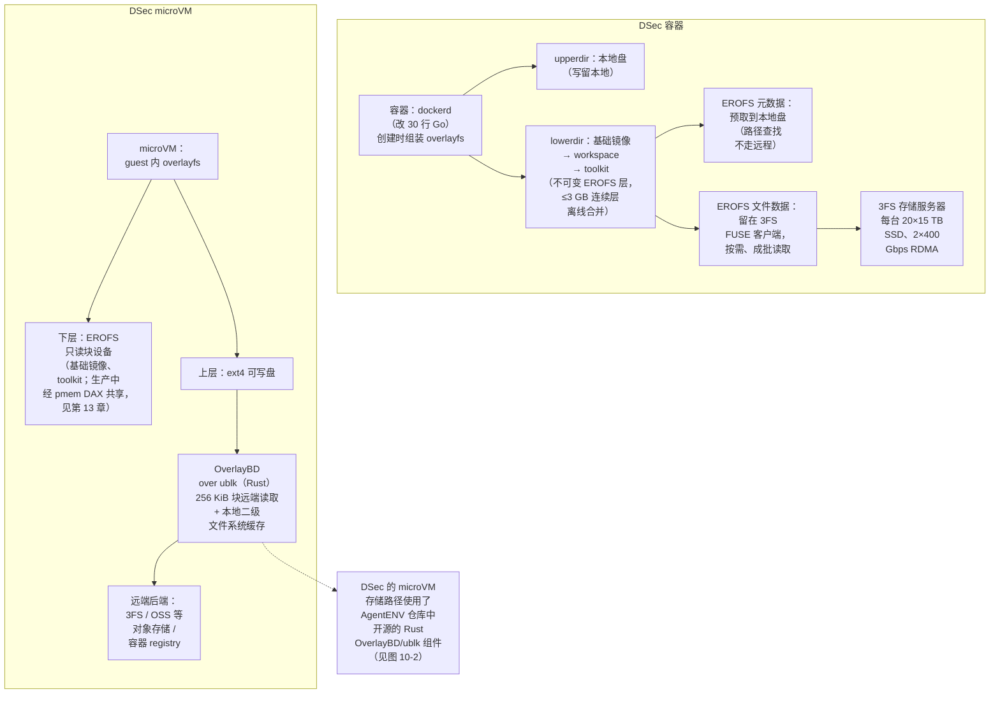
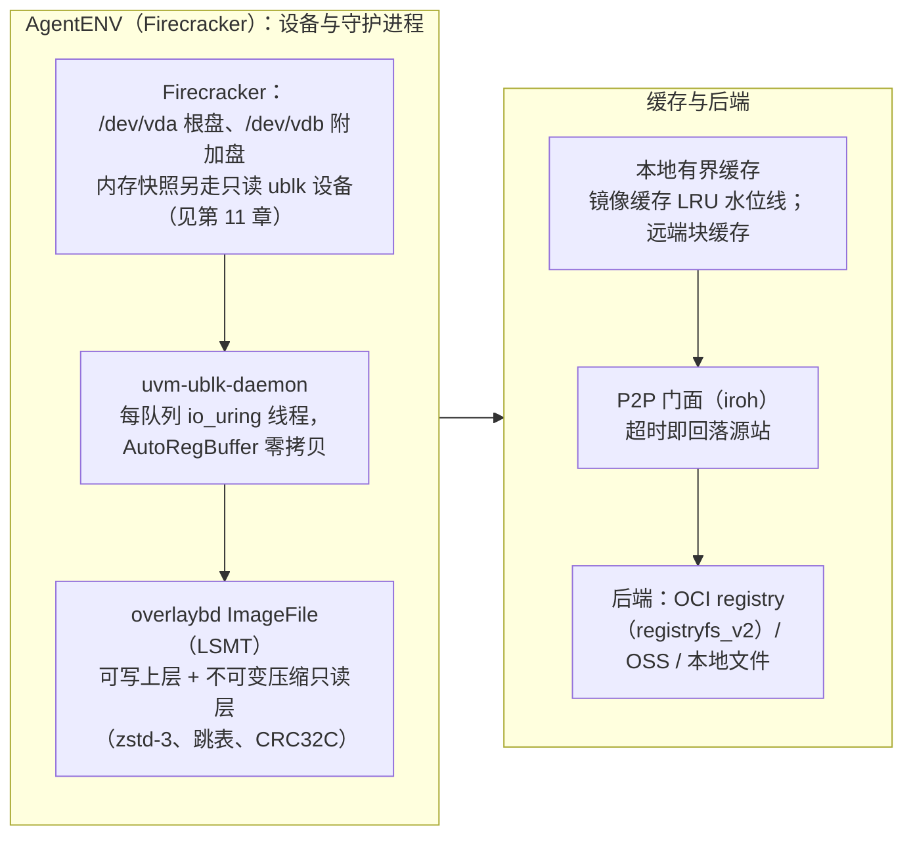

# 第 10 章　镜像与存储

## 本章导读

第 9 章把工业级 Agent 沙箱拆成八层，本章讲第④层（镜像与存储）。这一层回答一个看似朴素的问题：一个沙箱启动时，它的根文件系统从哪里来、写入落到哪里、要读的数据什么时候到。容器诞生以来，这个问题已经被 serverless 和云原生社区研究了十年，懒加载、块级镜像、P2P 分发都有成熟方案。Agent RL 训练没有推翻这些方案，但改变了它们的权重：镜像库大到任何节点都放不下，同一镜像很少被多个沙箱共享，每个沙箱只读镜像的一小部分，而成千上万个沙箱又在同一时刻涌来。沙箱活着的时候，还要不断写入、暂停、做检查点。

本章以 DSec 与 AgentENV 两套公开最完整的系统为主线，横向对照学术方案与其他国内厂商的运维披露。DSec 的存储机制已在第 24 章逐项拆解（见 24.3.4 节），沙箱内存快照见第 11 章；本章不重复细节，只把它们放进同一张设计空间里比较。读完本章，读者应能：

- 用"库大、扇出低、读得少、来得猛"四组数字说明 Agent RL 的镜像负载，并解释为什么"低复用 + 突发 + 长寿命有状态"这个组合让 serverless 的经典答案不再直接适用；
- 说清可组合层解决的是构建侧的组合爆炸，按需加载解决的是传输侧的"体量问题"，二者针对的不是同一个瓶颈；
- 对照文件级路径（DSec 的 EROFS + 3FS）与块级路径（AgentENV 的 overlaybd + ublk），知道各自在组合方式、远端存储、本地缓存、P2P、可写层和压缩上的选择；
- 按时间线复述从 Slacker 到 SOCI 的懒加载源流，并知道哪些数字已回原文核对、哪些只是背景知识；
- 按本书给出的步骤，为自己的 RL 镜像库做一次选型。

## 10.1　问题定量：Agent 的镜像问题为什么不是 serverless 的镜像问题

### 10.1.1　库大：一周 130 TB，总量 PB 量级

DSec 论文 §4.2 统计了 2026 年初一个生产周内活跃的环境制品："容器后端服务了 11,266 个基础镜像和 102,171 个 workspace，microVM 后端使用了两个共享基础镜像和 53,590 个任务专属 workspace"（DSec §4.2，表 2；论文自述）。按表 2，容器侧合计 82.8 TB，microVM 侧另有 4,889 个快照，合计 50.9 TB；§4.4 的结论是，一周内活跃的制品"总计超过 130 TB，远超单个工作节点所能存储的容量"（DSec §4.4；论文自述）。以评测节点为参照，microVM 评测节点的本地存储是 3.4 TB（DSec §8.1；论文自述），一周的活跃制品约为它的 38 倍（130 ÷ 3.4；笔者推算。前提是生产节点与评测节点的存储配置相近，论文未说明生产节点配置）。

这还只是"一周活跃"的口径。§2.4 写道，平台"管理着 PB 量级的层与镜像"（It manages petabytes of layers and images；DSec §2.4；论文自述）。两个数字口径不同，不能混用：PB 量级是平台管理的总量，超过 130 TB 是一周的活跃量。媒体所说的"PB 级镜像"有 §2.4 的依据（见 24.6 节）。

其他厂商的披露没有 DSec 这么细，但量级一致。Kimi K3 技术报告称，K3 训练与评测期间"共创建了 51,219,741 个沙箱，涉及 1,505,678 个镜像"（Kimi K3 报告 §5.3.2；论文自述）；Meta CWM 构建了超过 35,000 个可执行仓库 Docker 镜像（CWM，arXiv 2510.02387；论文自述）；快手 KAT-Coder-V2.5 构建了"12 种语言、超过 100,000 个可验证环境"（KAT-Coder-V2.5 报告；论文自述）；Qwen3-Coder-Next 的 MegaFlow 把所有环境存为可复用的 Docker 镜像，任务规模为 807,693 个真实 PR 实例加 851,898 个合成缺陷实例（Qwen3-Coder-Next 报告，arXiv 2603.00729；论文自述）。环境与镜像不是一一对应的，但这些数字共同说明：**RL 镜像库的规模以十万到百万个计**，而且随环境自动构建（见第 18 章）还在增长。

### 10.1.2　扇出低、读得少

库大本身不是问题，CDN 和对象存储每天都在服务更大的数据集。问题在于它的使用方式。

**扇出低。** 扇出（fanout）指同一个镜像被多少个沙箱使用。DSec §4.4 写道："容器镜像的扇出中位数为 3、p90 为 28，microVM 镜像的扇出中位数为 1、p90 为 3"（DSec §4.4，图 8；论文自述）。这里的扇出是"每任务"口径。Kimi 的数字给出另一种口径：51,219,741 个沙箱除以 1,505,678 个镜像，平均每个镜像约 34 个沙箱（笔者推算，见附录 B 的 B25-06）。两者并不矛盾：前者是单个任务内的扇出，后者是整个训练与评测周期的累计平均，平均值容易被少数高复用镜像拉高。本书把两者并列，不做换算。K3 报告还从另一侧描述了低复用："数万个沙箱，每个都带有一组独特的镜像，可能需要在几秒内创建出来"（tens of thousands of sandboxes, each with a unique set of images, may need to be created within seconds；Kimi K3 报告 §5.3.2；论文自述）。对存储设计而言，DSec 的口径更要紧，因为它决定了**同一时刻**有多少个沙箱可以分摊同一份数据的拉取。

**读得少。** DSec 表 3 对抽样容器镜像统计了运行时实际访问的数据比例：C++ 8.7%（镜像 4.9 GB）、Go 13.3%（4.1 GB）、Java 9.2%（12.1 GB）、JavaScript 4.2%（9.6 GB）、Python 6.0%（6.0 GB）。论文的判断是："运行时访问只覆盖镜像数据的 4.2% 到 13.3%，这使得全量拉取尤为浪费"（DSec §4.4，表 3；论文自述）。以 Java 为例，一个 12.1 GB 的镜像，运行时只读约 1.1 GB（12.1 × 9.2%；笔者推算）。

这个现象并不新。2016 年的 Slacker 就已观察到："拉取镜像包占容器启动时间的 76%，但其中只有 6.4% 的数据被读取"（Slacker 摘要，FAST'16；论文自述）。十年后，比例几乎没变，变的是规模：Slacker 面对的是单个镜像的启动延迟，Agent RL 面对的是十万量级镜像在突发中的总体积。DSec 把这一点概括为："按需拉取因此解决的不只是时间问题，还有体量问题"（on-demand pulling therefore addresses not just the timing problem but the volume problem；DSec §5.3；论文自述）。

### 10.1.3　来得猛：突发拉取把网络和磁盘压垮

DSec 的单个作业可以请求多达 32K 个沙箱，典型的容器任务也会创建数千个（DSec §1、§4.1；论文自述。"32K"为原文写法）。成千上万个沙箱同时启动，镜像拉取就从延迟问题变成了容量与可靠性问题。

阿里 RollArt 给出了一份难得的故障数据。它的 env.reset（环境重置，即拉镜像加起容器）在生产中"大约每十次迭代出现一次环境超时"；在这类情况下，env.reset 单独"消耗 rollout 时间的 78%"；长尾延迟"在生产中可达数百秒"。原因是"网络争用：并发的 Docker 镜像拉取打满了网络链路；以及宿主节点上的计算与 I/O 争用"（RollArt §3.1；论文自述）。快手 KAT-Coder-V2.5 记录的是磁盘：大规模并发拉镜像时，"峰值磁盘占用达到约 95%，垃圾回收几乎持续运行，超时导致的无效 rollout 约占全部 rollout 的 6%–7%"（KAT-Coder-V2.5 报告；论文自述）。

DSec 的受控实验把同一现象量化成写盘量：在 10 节点集群上突发创建 8,192 个容器，冷态全量预拉取（论文标为"Docker Pull (cold)"）每节点累计写盘超过 1,600 GB，峰值写 IOPS 接近按需路径的两倍（DSec §8.2；论文自述，细节见 24.3.4 节）。换句话说，突发拉取的代价首先落在**本地磁盘写**上，其次才是网络。

### 10.1.4　三者叠加：低复用、突发、长寿命有状态

单看每一项，serverless 都有现成答案：库大，就按需加载；突发，就用 P2P 或预热；启动慢，就做快照。DSec 在相关工作中给出的划界是：SAND、REAP、TrEnv、RunD 等 serverless 系统"为短命、无状态的函数优化冷启动延迟与资源共享"，而 Agent 训练"使用长寿命、有状态的沙箱，它们来自一个超出单节点存储、且每镜像扇出很低的镜像库"（DSec §9；论文自述）。

把 serverless 的典型场景摆在旁边，差别更清楚。AWS Lambda 的按需容器加载可以"为单个客户每秒新增多达 15,000 个容器"，启动时间"低至 50 ms"，支持的函数从 250 MB 的代码包扩大到 10 GiB 的容器镜像（On-demand Container Loading in AWS Lambda 摘要，ATC'23；论文自述）；阿里 DADI 的摘要称它能"在 1,000 台主机上于 4 秒内冷启动 10,000 个容器"（DADI 摘要，ATC'20；论文自述）。这些场景的共同点是同一个函数或应用的大量副本同时扩容（推断：DADI 摘要未说明 10,000 个容器是否使用同一镜像），扇出极高，P2P 与缓存天然有效；实例寿命短，可写层几乎没有分量。

Agent RL 的组合正好相反（表 10-1）。

**表 10-1　serverless 扩容与 Agent RL rollout 的镜像负载对照**

| 维度 | serverless / 云原生扩容（典型） | Agent RL rollout（DSec 等） | 设计后果 |
|---|---|---|---|
| 镜像库规模 | 每个函数或应用一个镜像，镜像上限 10 GiB（Lambda） | 一周活跃超过 130 TB；累计 150 万个镜像（K3） | 无法预置到每个节点；本地盘只能做缓存 |
| 每镜像扇出 | 高：同一镜像大量副本同时扩容 | 低：容器中位 3、p90 28；microVM 中位 1、p90 3 | P2P 与共享缓存的收益变小 |
| 访问比例 | 6.4%（Slacker，2016） | 4.2%–13.3%（DSec 表 3） | 按需加载在两者中都成立 |
| 突发形态 | 请求到达驱动，彼此大体独立 | 训练框架调度驱动，一个作业多达 32K 个沙箱同时启动 | 全量拉取会同时打满网络与本地写盘 |
| 实例寿命与写入 | 短命、近乎无状态 | 中位 15.5–17.4 分钟，p99 超过 3 小时；持续写文件、装依赖 | 可写层的位置、回收与检查点都要设计 |
| 可靠性要求 | 失败可重试，单次代价小 | env.reset 超时时单独占 rollout 时间的 78%（RollArt） | 拉取路径的可靠性本身是训练效率指标 |

注：serverless 一列来自 Lambda（ATC'23）、DADI（ATC'20）与 Slacker（FAST'16）摘要；Agent 一列来自 DSec §4、K3 报告 §5.3.2 与 RollArt §3.1；均为论文自述。寿命数字为 DSec 图 7。

这三者叠加，产生了本章反复出现的三条设计约束（推断）：第一，因为库大且读得少，**数据必须按需到达**，预先拉取既慢又写爆本地盘；第二，因为扇出低，**不能指望"别人已经拉过"**，P2P 与集群缓存是加速手段而不是主路径，主路径是一个带宽足够高、能承受突发的远端存储；第三，因为沙箱长寿命且有状态，**只读层与可写层要分开对待**：只读层追求共享与按需，可写层追求本地、可回收、可做检查点。

## 10.2　可组合层：把组合爆炸挪到创建时刻

按需加载解决传输侧的体量问题，可组合层解决的是构建侧的组合爆炸，两者针对的瓶颈不同。

DSec 把环境拆成三类制品：基础镜像（语言运行时与系统库）、workspace（具体仓库与任务数据）、toolkit（Agent 工具链）。设有 M 个基础镜像、N 个 workspace、K 个 toolkit，若打成单体镜像，升级 m 个基础镜像要重建 O(m·N) 次，升级 k 个 toolkit 要重建 O(k·N) 次；改为独立版本化的层并在创建时组合，两项成本降到 O(m) 和 O(k)（DSec §4.2、§5.1；论文自述）。"67.8% 的沙箱除基础镜像外至少还需要一个 workspace 或 toolkit"（DSec §4.2；论文自述），这是可组合层的定量依据。

实现上，DSec 利用了 overlayfs 现成的合并语义："当多个只读下层目录叠放时，内核呈现一棵统一的目录树"；它"修改容器运行时（即 dockerd），在沙箱创建时动态组装 overlayfs 栈（即 lowerdir）"，改动"很小，只需要 30 行 Go 代码"（DSec §5.1、§7；论文自述）。已发布的层不可变，所以用只读压缩文件系统 EROFS 存储；大小在阈值（论文举例 3 GB）以内的连续层离线合并成一对 EROFS 镜像，并保留 overlayfs 的 whiteout（删除标记）语义，以减少挂载层数（DSec §5.3；论文自述）。这些细节见 24.3.4 节。

它与 Docker 镜像层的区别在于层链何时固定。Docker 镜像也是分层的，但层链在**构建时**就固定了：一个镜像的第 n 层只能叠在它自己的第 n−1 层之上，换掉底层就意味着重建上面所有层。DSec 的层在**创建时**才选择：同一个 workspace 层可以叠在不同版本的基础镜像上，同一个 toolkit 层可以叠在任何组合上（推断，依据 §5.1 的组装方式）。这相当于把镜像从"预先烘焙好的成品"变成"运行时现场组装的零件"。它的代价是兼容性要自己负责：workspace 层里的二进制与新基础镜像的系统库是否匹配，overlayfs 不会替你检查（推断）。

块级路径也有对应物，只是形态不同。AgentENV 的根文件系统本身是一个 overlaybd 层栈，用户还可以为沙箱附加额外的块设备（extra drive），"只读盘与可写盘遵循同一套每沙箱设备生命周期，唯一的语义区别是 overlaybd 是否生成可写上层"（AgentENV 架构文档；一手文档）。块级组合的单位是"盘"，文件级组合的单位是"目录树"：前者无法像 overlayfs 那样把三棵目录树合并成一个根文件系统，需要在 guest 内挂载到不同路径（推断）。

可组合层还与第⑤层（状态管理）天然相通。DSec 的 pack_diff 把一次交互式会话的增量磁盘快照打包成新环境，增量快照本身就是一个可以叠在基础镜像上的新层；AgentENV 的暂停路径把当前可写层封存为最新的只读层，再开一个新的可写层（见第 11 章）。在两套系统里，"层"同时是分发单位、组合单位和检查点单位（推断）。

## 10.3　两条工业路径

图 10-1 与图 10-2 分别画出 DSec 与 AgentENV 的存储路径。图 10-1 中容器一侧是以文件为单位的 EROFS 路径，图 10-2 是以块为单位的 overlaybd 路径，两者的交汇点是 DSec 的 microVM 可写盘。

**图 10-1　DSec 的 EROFS + 3FS 路径与 microVM 存储路径**（示意图，依据 DSec §5.1、§5.3、§7 绘制；虚线表示组件复用关系，不表示两套系统互相调用）

**图 10-2　AgentENV 的 overlaybd + ublk 路径**（示意图，依据 AgentENV 架构文档、配置参考（HEAD 00351e2）绘制）

### 10.3.1　文件级：DSec 的 EROFS + 3FS

DSec 的远端存储是自家的分布式文件系统 3FS（Fire-Flyer File System）。各规模单元"共享同一套 3FS 部署，用于存放基础镜像与 workspace"（DSec §2.4；论文自述）；每台 3FS 存储服务器"配 20 块 15 TB SSD 和 2 张 400 Gbps RDMA 网卡"，CPU 节点"通过基于 FUSE 的客户端访问 3FS"（DSec §7；论文自述）。

§5.3 的出发点是 3FS 的 I/O 特性不对称：它擅长大块顺序读，不擅长小的随机 I/O。三条原则都从这里推出（DSec §5.3；论文自述）：

- **写留本地。** "沙箱的写入不规则、不可控，包括日志文件这类小而频繁的写"，所以可写层放在节点本地盘，"完全避开 3FS 的小写惩罚"。
- **读按需且成批。** 只读镜像数据"只在被访问时才从 3FS 取回，并以成批的方式执行 I/O，以利用 3FS 的高吞吐"。
- **元数据尽量本地。** "文件系统元数据常以小读的方式访问"，所以在格式允许时把元数据与数据分离、预取到本地。对容器，DSec"把 EROFS 元数据下载到工作节点的本地盘，文件数据留在 3FS，这样元数据遍历和路径查找都不产生远程 I/O"。

这三条原则可以概括为一句话：**把延迟敏感的小 I/O 留在本地，只让带宽敏感的大 I/O 走远端**（推断）。它也解释了为什么选 EROFS：EROFS 的元数据与数据天然可分，压缩以块为单位，"可以只读取并解压覆盖所请求数据的那些压缩块"（DSec §5.1；论文自述），正好把 4.2%–13.3% 的访问比例变成真实的 I/O 节省。

按需加载的效果，DSec 在 8,192 个容器的突发实验中给出了量化结果：按需路径约 35 分钟完成，与镜像全部预缓存在本地的基线（"Docker Pull (cached)"）持平；冷态全量预拉取超过 60 分钟，慢 1.71 倍；每节点写盘按需约 700 GB，接近约 600 GB 的全本地基线，预拉取超过 1,600 GB（DSec §8.2；论文自述）。预拉取比按需每节点多写约 900 GB（1,600 − 700；笔者推算）。EROFS 直接挂载与 tar 解包的对比是 45 分钟对 79 分钟，论文称"1.76 倍加速"，tar 路径的总写盘约为 5.5 倍（DSec §8.3；论文自述）。两组实验的对照组不同，不能合并引用（见 24.4 节）。

同一套 EROFS 格式还支撑了 DSec 的云突发：本地利用率超过 80% 时，部分创建请求被卸载到云上 VM，后者复用同一套容器运行时与 EROFS 路径；"一个紧凑、去重后共 30 TB 的 EROFS 镜像集，覆盖了 70% 容器任务所访问的镜像文件"（DSec §3.4；论文自述）。这个数字从侧面印证了访问比例低：只要把真正被读到的文件挑出来，一周 130 TB 的制品可以压到 30 TB 而覆盖七成任务（推断：两个数字的统计时段论文未说明是否相同）。

### 10.3.2　块级：AgentENV 的 overlaybd + ublk

AgentENV 走的是另一条路。它的每个沙箱都是 Firecracker microVM，根文件系统是一块虚拟磁盘，所以镜像天然以块设备的形式出现。架构文档开宗明义："它的核心是一个存储子系统，提供可挂进 VM 的分层块设备，以及基于 ublk 的内存快照恢复"（AgentENV 架构文档；一手文档）。

**镜像格式。** AgentENV 仓库中的 Rust 版 overlaybd 采用 LSMT（日志结构合并树）分层格式：每层文件有一个头尾结构和若干 16 字节的段映射项；"不可变的压缩只读层在底部，单一可写上层在顶部"；读请求自顶向下在各层的段索引中查找，"第一个包含该块范围映射的层提供数据"；压缩采用 zstd（level 3），带随机访问跳表与 CRC32C 校验（AgentENV 架构文档；一手文档）。跳表的作用与 EROFS 的分块压缩相同：在压缩数据中随机定位，只解压需要的部分（推断）。

**后端与镜像来源。** overlaybd 的后端通过 `VirtualFile` trait 插拔，文档列出本地文件（io_uring 读写，可选 O_DIRECT）、`registryfs_v2`（从 OCI registry 远程下载层）与 tar 归档，代码目录中另有 OSS 后端（AgentENV 架构文档、`storage/overlaybd/src/backend/`；一手文档）。标准 OCI 镜像在节点本地转换成 overlaybd 提交后缓存；对指定前缀的 registry，AgentENV 会先经 OCI Referrers API 查找该镜像的 overlaybd 原生制品，识别 accelerated-container-image 的 `obdconv` 产物与 Azure 容器镜像仓库（ACR）的 artifact streaming 产物，找不到再回落到本地转换；Turbo-OCI 格式则不支持（AgentENV 配置参考；一手文档）。换句话说，AgentENV 与 containerd 生态的 overlaybd 工具链在格式上直接兼容。

**ublk。** ublk 是 Linux 的用户态块设备框架。AgentENV 用它把 overlaybd 镜像暴露为 `/dev/ublkbN`，I/O 由每队列的 io_uring 工作线程异步处理，内核 6.8 以上可用 `AutoRegBuffer` 实现零拷贝；所有 ublk 设备由一个长驻的 `uvm-ublk-daemon` 进程统一持有，经 Unix 域套接字与节点服务通信，提供创建、预热池取还、restack 快照、删除等 RPC（AgentENV 架构文档；一手文档）。把块设备放在用户态的好处是，懒加载、缓存、P2P 这些逻辑都可以用普通的用户态代码实现，不必改内核（推断）。

**有界缓存。** README 的说法是："本地盘充当有界缓存，保留热数据、淘汰冷数据，因此镜像与快照的总占用可以超出本地盘容量几个数量级，而全集群的启动仍然很快，无需预热每一台主机"（AgentENV README；一手文档，"几个数量级"为定性说法）。配置参考给出了这个缓存的默认参数：镜像缓存容量预算 100 GB，超过 95% 水位线时按最近最少使用淘汰到 70%，最近 600 秒内用过的不淘汰；registryfs_v2 的远端块缓存上限默认 100 GiB；镜像（rootfs）层的后台整层下载由 `download_enable` 控制，默认关闭（AgentENV 配置参考，HEAD 00351e2；一手文档）。后台逐块下载默认只对内存快照的远端层开启：配置参考在内存快照专用小节中写明，这些设置"不改变一般 rootfs 或附加盘的默认值"，每次源请求取 16 MiB，前台读则保留更小的缓存块粒度，并说明"缓存是一个有界工作集：块在容量压力下可被淘汰，之后按需重新取回"（同上，`[memory_snapshot.background_download]` 小节；一手文档）。这些是开源版本的默认值，不是 Moonshot 生产集群的配置，后者未披露。

**P2P。** AgentENV 有一个可选的 P2P 制品传输层，基于 iroh 与 iroh-blobs，按内容哈希寻址；调度器在心跳中收集各节点的端点，供其他节点发现。overlaybd 层的读取经由本地的 P2P HTTP 门面加速：前台查找超时默认 300 ms、区间读取超时默认 2,000 ms，区间读取超时即"回落到源 registry"，查找超时被当作可缓存的未命中（AgentENV P2P 设计文档、配置参考；一手文档）。默认实现是关闭 P2P 的空传输，配置参考还明确提示："实验性：P2P 尚未在生产中测试过。除非部署方接受这一运维风险，否则在生产中请保持关闭"（Experimental: P2P has not been tested in production；AgentENV 配置参考 `[p2p]` 小节，HEAD 00351e2；一手文档）。这个设计把 P2P 定位为"尽力而为的加速路径"，源站始终是兜底（推断）。

K3 报告对生产效果只有一句概括："我们采用 OverlayBD 作为镜像格式，配合自研的 ublk 驱动实现、存储层共享与 P2P 传输，在大规模下实现了亚秒级的启动延迟"（Kimi K3 报告 §5.3.2；论文自述）。"亚秒级"没有给出分布、口径与负载条件。这里有一处张力：K3 报告称生产中采用了 P2P 传输，而开源仓库的文档称 P2P 尚未在生产中测试。可能的解释是 Moonshot 生产集群使用的 P2P 实现或版本与开源仓库不同，但两方都没有说明，本书并列两方，不作判断。

### 10.3.3　交汇点：DSec 的 microVM 可写盘

两条路径在 DSec 的 microVM 上交汇。microVM 的基础镜像与 toolkit 仍是 EROFS，以只读块设备交给 guest；guest 根文件系统是 overlayfs，上层是一块 ext4 可写盘上的目录（DSec §5.1；论文自述）。这块可写盘由 OverlayBD 提供、经 ublk 暴露；ublk 实现"以 256 KiB 的块取回 OverlayBD 数据，并存入本地的二级文件系统缓存"，用以缓解小读（DSec §5.3；论文自述）。存储层"支持 3FS、OSS 等对象存储服务和容器 registry 作为远端后端"（DSec §7；论文自述）。

§7 写明了这些组件的来源："我们使用我们参与贡献的 Rust 版 OverlayBD，以及我们的 Rust 用户态 ublk 库"，并给出开源地址 kvcache-ai/AgentENV 仓库的 `storage/overlaybd` 目录（DSec §7；论文自述）。因此，**DSec 的 microVM 存储路径使用了 AgentENV 仓库中开源的 Rust OverlayBD/ublk 组件（论文称"我们参与贡献"）**。这句话的范围仅限 microVM 可写盘这一段，DSec 的容器路径、EROFS 组合、3FS 集成都与 AgentENV 无关。

为什么可写盘用块级而只读层用文件级？论文没有直接解释。一个合理的解读是（推断）：只读层追求跨沙箱共享，EROFS 镜像可以在宿主上被多台 microVM 共享同一份页缓存（第 13 章的 pmem DAX）；可写盘是每个沙箱私有的，内容由沙箱运行时写出，没有"预先存在的文件树"可供按文件懒加载，块级格式反而更自然，而 LSMT 的封存—重开操作又能直接用于检查点（见第 11 章）。

## 10.4　可写层与缓存：长寿命有状态带来的问题

serverless 的存储讨论几乎只关心只读镜像。Agent 沙箱活几十分钟到几小时，写入量与写入方式都成了设计对象。

**写在哪里。** DSec 与 AgentENV 都把可写层放在本地：DSec 的理由是 3FS 的小写惩罚；AgentENV 的 overlaybd 可写上层就是本地文件，默认格式为 `hybridLogStructured`，另可选 `logStructured` 与 `sparse`（AgentENV 配置参考；一手文档）。本地写的代价是：可写层离开了这个节点就不存在，跨节点恢复要先把它上传（AgentENV 发布快照时压缩内存层与增量读写层，见第 11 章）。

**重复缓存。** DSec §4.3 指出一个块设备路径特有的浪费："经虚拟块设备读取的镜像数据，可能在宿主上缓存一次，又在每个 guest 里各缓存一次，同一份数据跨 guest—宿主边界被重复缓存"（DSec §4.3；论文自述）。文件级的容器路径没有这个问题，所有容器共享宿主页缓存。DSec 对 microVM 只读层的解法是 virtio-pmem + DAX，AgentENV 对内存快照的解法是让同一快照的沙箱共享一个只读 ublk 设备与页缓存，二者分别见第 13 章与第 11 章。这说明第④层与第⑥层（密度与资源）是同一个问题的两面：**存储格式决定了页缓存能不能共享**（推断）。

**回收与淘汰。** 本地盘既装可写层又装只读层的缓存，二者争用空间。KAT-Coder-V2.5 的经验是主动淘汰：快手"重新设计了沙箱服务的镜像管理模块，并引入早释放策略，主动删除后续步骤中不太可能复用的镜像"，此后"稳态磁盘占用降到约 60%，超时导致的无效 rollout 比例降到 1% 以下"（KAT-Coder-V2.5 报告；论文自述）。请注意口径：95% 是优化前的**峰值**，60% 是优化后的**稳态**，两者不是同一统计量，不宜写成"磁盘占用从 95% 降到 60%"这样的直接对比，更准确的写法是"峰值约 95%……优化后稳态约 60%"。AgentENV 的水位线淘汰是同一思路的通用实现。

**层数膨胀。** 可写层一旦被用来做检查点，层就会越叠越多，读路径随之变长。DSec 离线合并 3 GB 以内的连续层；AgentENV 的 LSMT 提供合并辅助函数（`stack.rs` 中的 open/merge/stack，AgentENV 架构文档；一手文档）。合并的时机与代价，两家都没有披露。

## 10.5　设计空间

把前几节的选择放进同一张表，可以看到每个系统在七个维度上的取舍（表 10-2）。

**表 10-2　镜像与存储的设计空间**

| 系统 | 粒度 | 组合方式 | 远端存储 | 本地缓存 | P2P | 可写层 | 压缩 / 格式转换 |
|---|---|---|---|---|---|---|---|
| DSec 容器路径 | 文件级（EROFS + overlayfs） | 创建时组装 lowerdir：基础镜像 → workspace → toolkit | 3FS（FUSE 客户端） | EROFS 元数据预取到本地盘；数据缓存策略未披露 | 未采用（论文理由：复用已支撑生产训练的 3FS，避免另建镜像分发层，§5.3） | 本地盘 upperdir | EROFS 分块压缩；需转换为 EROFS |
| DSec microVM 路径 | 只读层文件级（EROFS 块设备）；可写盘块级（OverlayBD） | 只读 EROFS 块设备 + guest 内 overlayfs | 3FS、OSS、容器 registry | 256 KiB 块 + 本地二级文件系统缓存 | 未披露 | ext4 可写盘（OverlayBD over ublk） | EROFS；OverlayBD |
| AgentENV | 块级（overlaybd LSMT over ublk） | 层栈 + 附加块盘 | OCI registry、OSS、本地文件 | 有界缓存，LRU 水位线淘汰；镜像层后台下载可选（默认关闭），内存快照层默认开启 | 可选（iroh，文档称未经生产测试），超时回落源站 | 本地 LSMT 上层，可封存为新层 | zstd-3 + 跳表；OCI 本地转换或取 overlaybd 原生制品 |
| DADI / overlaybd（ATC'20） | 块级 | 分层镜像 | 远端镜像存储 | 有 | 可选 P2P | 未在摘要中说明 | 块级格式，需转换 |
| Nydus / EROFS（Nydus 部分为 [K]） | 文件级 | 分层 | registry 等 | 有（EROFS over fscache，[K] 未核实） | 未核实 | — | RAFS v6 兼容 EROFS（[K] 未核实），需转换 |
| AWS Lambda（ATC'23） | 块级按需加载 | 未在摘要中说明 | 分层缓存后端 | 多级缓存 | 未在摘要中说明 | 函数实例近乎无状态 | 去重、收敛加密、纠删码 |
| SOCI（预印本） | 文件级（按字节区间） | 不改变 OCI 层 | OCI registry（HTTP range 请求） | FUSE snapshotter 本地缓存 | 未涉及 | 容器常规可写层 | 不转换镜像；索引作为独立 OCI referrer 制品 |
| FlacIO（FAST'25） | 运行时镜像（根文件系统内存态） | 面向服务的镜像抽象 | 未在摘要中说明 | 宿主"运行时页缓存" | 未在摘要中说明 | 未在摘要中说明 | 需构建运行时镜像 |
| RollArt（阿里） | 常规 Docker 镜像 | 未披露 | 内部 registry 镜像外部镜像 | 计算节点与 registry 之间的分布式负载均衡缓存 | 未披露 | 未披露 | 不转换 |

注：DSec、AgentENV、RollArt、SOCI 依据各自原文或仓库（本章已核对）；DADI、Lambda、FlacIO 依据 USENIX 摘要页，"未在摘要中说明"不等于不支持；Nydus 的机制描述为背景知识，未回原文核实；EROFS 有 ATC'19 论文。

从这张表可以归纳出三个判断。

**第一，粒度跟着隔离后端走。** 容器共享宿主内核，文件级格式可以直接挂成 overlayfs 的下层，宿主页缓存天然共享；microVM 看到的是磁盘，块级格式最自然。DSec 同时有容器和 microVM，于是两种都用；AgentENV 只有 Firecracker，于是只用块级（推断）。第 4–8 章讨论的隔离档位选择，会顺着这条线传导到存储格式。

**第二，P2P 的价值取决于扇出，两家给出了相反的取舍。** DSec §5.3 承认，"现有的按需镜像分发系统常把容器 registry 与点对点分发结合起来，以防 registry 成为瓶颈"，但它"改为把镜像放在 3FS 上，3FS 已经在规模上支撑着我们的生产训练负载"，理由是"复用已有的存储设施，避免部署单独的镜像分发层"（DSec §5.3；论文自述）。低扇出会进一步削弱 P2P 的收益，这一点是本书的推断，论文没有这样论证。Kimi K3 报告则把 P2P 传输列为实现亚秒级启动的手段之一（Kimi K3 报告 §5.3.2；论文自述）。两种做法并不必然矛盾：DSec 有一个每台 2 × 400 Gbps RDMA 的 3FS 集群作为主路径；AgentENV 的默认源站是 OCI registry 与对象存储，带宽与并发上限通常更低，P2P 更有用（但开源文档称其 P2P 尚未经生产测试，见 10.3.2 节）；K3 按累计口径平均每镜像约 34 个沙箱，也意味着存在可以分摊的复用（推断）。本书把两方并列，不判断谁对。

**第三，是否转换镜像格式，是兼容性与性能的交换。** EROFS、Nydus、overlaybd、FlacIO 都要求把 OCI 镜像转换成自己的格式；SOCI 的论文明确把"不需要格式转换"作为与 eStargz、Nydus 的区别，因为转换会改变镜像摘要、破坏签名，它把索引存为独立的 OCI referrer 制品（SOCI 论文；论文自述）。AgentENV 的折中是两条路都留：能取到预先转换好的 overlaybd 原生制品就用，取不到就在节点上转换并缓存。对 RL 镜像库而言，镜像大多由内部流水线自动构建，转换可以放进构建流水线，兼容性代价比公有云小得多（推断）。

## 10.6　源流：从 Slacker 到 DSec 与 AgentENV

懒加载的思想在十年间经历了几次换代。表 10-3 按时间排列与本章相关的工作。

**表 10-3　镜像懒加载的源流**

| 年份 | 工作 | 来源与状态 | 核心机制 | 关键数字（口径） | 与 Agent 沙箱的关系 |
|---|---|---|---|---|---|
| 2016 | Slacker | FAST'16 | 以集中式 NFS 存储为后端、把 NFS 文件当作虚拟块设备的懒取（正文） | 拉取占启动时间 76%，只读其中 6.4%（摘要） | 奠基观察；DSec 表 3 在十年后得到同量级比例 |
| 2020 | DADI（开源为 overlaybd） | ATC'20 | 块级分层镜像，细粒度按需远程传输，可选 P2P | 1,000 台主机 4 秒内冷启动 10,000 个容器（摘要） | AgentENV 仓库含其 Rust 版；DSec 的 microVM 存储路径使用了 AgentENV 仓库中开源的 Rust OverlayBD/ublk 组件 |
| 2019（EROFS） | EROFS / Nydus | EROFS：ATC'19 论文（摘要页已核对）；Nydus：Dragonfly（CNCF Graduated）子项目，无同行评审论文 | EROFS：只读压缩文件系统；Nydus RAFS v6 兼容 EROFS、EROFS over fscache 支持按需加载（[K]，未核实） | 未引用数字 | DSec 选 EROFS 作为不可变层格式 |
| 2021 | FaaSNet | ATC'21（阿里云函数计算；摘要页已核对） | 自适应函数树（adaptive function tree）P2P 分发与按需拉取 | 未引用数字 | DSec §9 引为 P2P 分发的代表，自己改用 3FS（§5.3） |
| 2022 | Starlight | NSDI'22（摘要页已核对） | 重新设计容器部署协议、文件系统与镜像存储格式，面向边缘与广域网 | 未引用数字 | 远端存储带宽受限时的参照 |
| 2023 | AWS Lambda 按需容器加载 | ATC'23 | 缓存、去重、收敛加密、纠删码、块级按需加载 | 镜像上限 10 GiB；单客户每秒新增多达 15,000 个容器；启动低至 50 ms（摘要） | 最接近 Agent 规模的生产先例，但扇出高、实例近乎无状态 |
| 2025 | FlacIO | FAST'25 | "运行时镜像"表示根文件系统的内存态，配合宿主运行时页缓存 | 冷启动比全量镜像快最多 23 倍、比现有懒加载快 4.6 倍（摘要） | 把"镜像"从存储对象改为内存对象，与第 13 章的页缓存共享同向 |
| 2026 | CoFS（经 DSec 引用） | 经 DSec 引用，本书未核对 | 按需镜像加载 | 未引用数字 | DSec 与 DADI 并列引用 |
| 2026 | SOCI（Seekable OCI） | arXiv 2607.06868，预印本（Amazon） | 外部 ztoc 索引把文件映射到压缩层的字节区间，FUSE snapshotter 用 HTTP range 请求取数 | 1.3 GB 镜像冷拉取 20 秒 → 2.8 秒（7.4 倍），2.5 GB 镜像 9.3 倍；访问密度低于约 80% 时懒加载占优 | 不转换镜像的懒加载；其 80% 拐点远高于 Agent 镜像的访问比例 |
| 2026 | DSec | arXiv 2609.22978，预印本 | 创建时组合的 EROFS 层；3FS 按需加载；microVM 可写盘 OverlayBD over ublk | 突发 8,192 个容器：按需约 35 分钟 vs 冷态预拉取超过 60 分钟（1.71 倍） | 第一份完整的 Agent RL 存储设计披露 |
| 2026 | AgentENV | GitHub 仓库（MIT），K3 报告 §5.3.2 | Rust overlaybd（LSMT）+ ublk；有界本地缓存；可选 iroh P2P；内存快照也走 ublk | 累计 1,505,678 个镜像（K3）；"亚秒级"启动（K3，无分布） | 块级路线的开源实现；DSec 的 microVM 存储路径使用了其仓库中开源的 Rust OverlayBD/ublk 组件 |

注：DADI、Lambda、FlacIO、Slacker 数字均来自 USENIX 摘要页（论文自述，本章已核对）；SOCI 来自 arXiv HTML（论文自述）；标 [K] 者为背景知识，未回原文核实，只作定性描述。FaaSNet（ATC'21）即 DSec §5.3 所引"Wang et al., 2021"；CoFS 转引自 DSec 参考文献，2026 年为 DSec 所注，本书未核实。Slacker 的机制描述出自其正文。

这条线索有两个转折。第一个转折是从"整体下载"到"按需传输"，Slacker 提出问题，DADI 与 Lambda 把它做成了生产系统。第二个转折是从"加速单个镜像的冷启动"到"在镜像库远超节点容量的前提下维持吞吐"：Slacker、Lambda、SOCI 的评测指标都是单个容器或任务的启动时间，DSec 的指标则是一整批突发任务的完成时间与每节点写盘量。这个指标变化本身就是 Agent RL 负载与 serverless 负载差别的体现（推断）。

SOCI 的访问密度拐点需要单独说明。它报告懒加载在访问密度低于约 80% 时占优、高于此时并行全量拉取更快（SOCI 论文；论文自述）。DSec 表 3 的访问比例最高为 13.3%，离这个拐点很远（推断：SOCI 的拐点是在它自己的镜像与网络条件下测得的，不能直接移植，但两者相差一个数量级以上，结论方向不受影响）。对 Agent 镜像来说，"要不要懒加载"不是问题，问题是"懒加载的远端能否承受突发"。

> **边栏：谱系——overlaybd 的三次迁移**
>
> overlaybd 这一块级格式在六年间换了三次"东家"。它起源于阿里的 DADI（ATC'20），摘要所列作者为 Huiba Li、Yifan Yuan、Rui Du、Kai Ma、Lanzheng Liu、Windsor Hsu（DADI 摘要页；论文自述），随后以 overlaybd 之名开源到 containerd 生态（accelerated-container-image）。2026 年，AgentENV 仓库中出现了 OverlayBD 的 Rust 版（DSec §7 称之为"Rust port of OverlayBD"，移植由谁完成，论文与仓库都没有明说），作为 Firecracker 沙箱根盘与内存快照的共同底座；AgentENV 至今仍能识别 accelerated-container-image 的 `obdconv` 产物（AgentENV 配置参考；一手文档）。同年 9 月，DSec 论文披露了它的 microVM 可写盘路径：**DSec 的 microVM 存储路径使用了 AgentENV 仓库中开源的 Rust OverlayBD/ublk 组件（论文称"我们参与贡献"）**。
>
> 提交记录层面 DeepSeek 一侧的参与（提交者、提交次数与日期）见第 24 章开篇边栏与第 25 章 25.6 节。另一个旁注：FaaSNet（ATC'21）的作者中也有 DADI 作者 Huiba Li 与 Rui Du（FaaSNet 摘要页；论文自述）。AgentENV 的提交历史中另有两名使用 alibaba-inc.com 邮箱的提交者（AgentENV 仓库 git 历史；一手文档），其中一人与 DADI 作者同名；是否同一人，本书未核实。
>
> 在此之上，本书推断存在一条"serverless 内存模板（TrEnv）→ 开源 Agent 沙箱（AgentENV）→ 生产级训练沙箱（DSec）"的传承线（推断，基于作者重合）。它能解释两家竞争公司为何在存储层共用代码，但不能推出 DSec 建立在 AgentENV 之上。完整证据链见第 25 章，作者重合的细节见第 24 章开篇边栏。

## 10.7　其他工业做法

DSec 与 AgentENV 之外，公开材料大多只披露存储层的一两个侧面，但每一个都对应本章的一条约束。

**RollArt：先把拉取路径做可靠。** RollArt 的生产优化不是懒加载，而是多级缓存："一个内部镜像 registry 镜像外部镜像，计算节点与 registry 之间再有一层分布式、负载均衡的缓存来吸收大流量请求"；结果是"env.reset 成功率提高到 99.99% 以上"，"优化后，在数十万次重置中，重尾的初始化事件不超过十次"（RollArt §8；论文自述）。RollArt 的会议归属，本书文献库记为 OSDI'26，所读 arXiv 版本未标注会议，两处并列。它说明的是：当镜像来自外部公共 registry 时，第一步是把源站搬进内网并加缓存，否则任何懒加载格式都会被源站的可靠性拖住（推断）。这些内部镜像源同时也是出站通道，第 15 章讨论它们的加固。

**快手 KwaiEnv：磁盘是第一个被打满的资源。** 见 10.4 节。快手的做法是重写镜像管理模块并主动早释放，配套指标是峰值磁盘占用、垃圾回收频率与超时无效 rollout 比例。这三项比"启动延迟"更直接地反映存储层对训练的影响（推断）。

**Qwen MegaFlow 与 Meta CWM：以常规 Docker 镜像为单位。** MegaFlow 基于阿里云 Kubernetes，每个任务是一个 Argo 工作流，所有环境存为可复用的 Docker 镜像（Qwen3-Coder-Next 报告；论文自述）；CWM 的 35,000 多个镜像同样是常规 Docker 镜像。两份报告都没有披露镜像分发方式，未披露即结论。

**SWE-MiniSandbox：干脆不用镜像。** SWE-MiniSandbox 以无容器方式取代每任务一个 Docker 容器，摘要报告存储约为容器方案的 5%、准备时间约为 25%，训练效果相当（SWE-MiniSandbox 摘要，arXiv 2602.11210；论文自述）。它用每实例 mount namespace、chroot 与 venv 预缓存（tar.gz 复用）实现。3B 模型实验中，准备时间为 23.62 秒对容器的 88.86 秒；存储"约 5%"只对 SWE-smith 成立（13.5 GB 对 295 GB），SWE-bench Verified 上约为 15%（89 GB 对 605 GB）。该工作发表于 ICML 2026（PMLR 306），作者来自北京大学、蚂蚁集团与香港大学（SWE-MiniSandbox 正文与标题页；论文自述；见 8.4.1 节）。这是存储设计空间的另一端：放弃镜像的完整性与隔离强度，换取极低的存储成本。它只适用于依赖可以用语言级环境（如 Python venv）表达的任务，隔离强度的讨论见第 8 章（推断）。

## 10.8　如何为 RL 镜像库选型（本书建议）

本节是本书的建议，不是任何一家的做法。前提是读者已有一个或多个 RL 训练任务、正在决定第④层怎么建。

**第一步：先测四个数。** 在动手选格式之前，用一周的生产或试运行数据测出：①活跃镜像总量与单节点可用本地盘之比；②每任务的镜像扇出（中位与 p90）；③抽样镜像的运行时访问比例（可以用 fanotify 或文件系统审计统计首次访问的文件与字节）；④单作业的峰值并发创建数与节点数之比。DSec §4 是这四个数的范本，附录 D 提供负载刻画模板。

**第二步：按四个数选主路径。** 表 10-4 给出一个起点。

**表 10-4　RL 镜像库选型速查（本书建议）**

| 观测 | 建议 | 依据 |
|---|---|---|
| 活跃镜像总量远超单节点盘（如超过 10 倍） | 本地盘只作有界缓存；必须按需加载 | DSec §4.4；AgentENV 有界缓存 |
| 访问比例远低于 SOCI 的约 80% 拐点 | 懒加载必然划算；重点转向远端能否承受突发 | DSec 表 3；SOCI |
| 扇出低（中位个位数） | 主路径投资在高带宽远端存储（分布式文件系统或对象存储），P2P 只作可选加速并保证超时回落 | DSec §4.4；AgentENV P2P 门面 |
| 扇出高或累计复用高 | P2P 与集群缓存值得投入 | DADI、K3 报告 |
| 超过一半的沙箱需要基础镜像以外的层 | 采用创建时组合的只读层，把重建成本从 O(m·N) 降到 O(m) | DSec §4.2、§5.1 |
| 以容器为主 | 文件级格式（EROFS 等）+ overlayfs，元数据本地、数据远端 | DSec 容器路径 |
| 以 microVM 为主 | 块级格式（overlaybd 等）over ublk，或 EROFS 只读块设备；同时规划宿主页缓存共享（第 13 章） | AgentENV；DSec microVM 路径 |
| 镜像来自公共 registry | 先建内部镜像源与分布式缓存，再谈懒加载 | RollArt §8 |
| 镜像需要保留签名、不便转换 | 考虑 SOCI 式外部索引，接受文件级粒度 | SOCI |
| 任务依赖可用语言级环境表达、隔离要求低 | 可考虑无容器方案 | SWE-MiniSandbox |

**第三步：可写层单独设计。** 可写层一律放本地盘，规划好三件事：容量（与只读缓存共享本地盘时设水位线与淘汰策略，参考快手的早释放）；检查点（若需要暂停或 fork，选择能"封存—重开"的分层格式，见第 11 章）；清理（构建期残留必须在打包前从可写层清除，否则参考答案会被打进镜像，DSec §6.1 的做法见第 18、19 章）。

**第四步：把存储格式与密度一起决定。** 块设备路径要提前回答"同一份只读数据在宿主上缓存几次"。如果答案是"每个 guest 一次"，密度会在内存上见顶（DSec §4.3）。选格式时就应同时选好共享手段：文件级靠宿主页缓存，块级靠 DAX 或共享只读设备（见第 13 章）。

**第五步：用训练指标而不是启动延迟验收。** 建议至少监控：env.reset 成功率与长尾（RollArt 的口径）；突发期间每节点写盘总量与峰值 IOPS（DSec §8.2 的口径）；本地盘峰值与稳态占用、垃圾回收频率、超时无效 rollout 比例（快手的口径）。单个沙箱的启动延迟只是其中一项，而且在突发下往往不是瓶颈。

**第六步：别忘了它也是攻击面。** 只读层不可变、按内容寻址，本身不构成写信道；但可写的共享服务（集群缓存、内部镜像源、包代理）是潜在的隐蔽信道与出站通道（见第 15、19 章）。P2P 层应校验内容哈希（AgentENV 的 iroh 传输按哈希验证字节），镜像源对训练中的沙箱应只读。

## 10.9　披露空白

以下参数在本章所读材料中均未披露，按体例作为结论写出：

- **DSec**：3FS 侧与节点侧的数据缓存容量与命中率；EROFS 元数据的体积；microVM 只读 EROFS 层的数据是否同样从 3FS 按需加载（§5.3 只说"仍使用 EROFS"）；层合并的触发频率与耗时；生产节点的本地盘配置。
- **AgentENV / Kimi**："亚秒级启动"的分布与条件；生产集群的缓存容量、P2P 命中率与源站类型；P2P 在 K3 生产中的使用方式与版本（开源默认关闭且文档称未经生产测试，K3 报告称采用了 P2P 传输）。
- **RollArt、快手、Qwen、Meta**：镜像格式与是否懒加载；缓存层的规模。
- **全行业**：没有任何一家公布镜像构建成本（CPU 时、存储增量）与镜像库的增长速度；没有公开的跨系统对比实验。

## 本章小结

- **Agent RL 的镜像负载是"库大、扇出低、读得少、来得猛"。** DSec 一周活跃制品超过 130 TB、平台管理 PB 量级，容器扇出中位 3，运行时只读 4.2%–13.3%，单作业多达 32K 个沙箱，Slacker 在 2016 年观察到的 76%/6.4% 在十年后以更大的尺度重现。
- **"低复用 + 突发 + 长寿命有状态"让 serverless 的答案需要重新加权。** 按需加载依然成立而且更必要，P2P 与共享缓存从主路径退为加速手段，可写层从可以忽略变成需要设计的对象。
- **可组合层与按需加载解决不同的瓶颈。** 前者把构建侧的 O(m·N) 降到 O(m)，后者解决传输侧的体量问题；DSec 用 30 行 Go 和 EROFS 同时做到了两者。
- **文件级与块级的选择跟着隔离后端走。** DSec 两种都用，AgentENV 只用块级；块级路径必须同时回答页缓存能否共享，这把第④层与第⑥层绑在一起。
- **两条路径在 DSec 的 microVM 可写盘交汇。** DSec 的 microVM 存储路径使用了 AgentENV 仓库中开源的 Rust OverlayBD/ublk 组件（论文称"我们参与贡献"）；这一复用只覆盖可写盘这一段，谱系线是推断。
- **P2P 的取舍两家相反，本书并列不判。** DSec 以复用 3FS、免建分发层为由不依赖 P2P（§5.3；低扇出削弱 P2P 收益为本书推断），Kimi K3 把 P2P 列为亚秒级启动的手段之一，而 AgentENV 开源文档称 P2P 尚未经生产测试。
- **验收要用训练指标。** env.reset 成功率、突发期写盘量、磁盘峰值与稳态占用，比单个沙箱的启动延迟更能反映存储层对训练的影响。

## 本章数字溯源

本表登记本章使用的全部数字。"备注"中的 B/C/X 编号对应附录 B。标"复核"者为本章 2026-10-02 回原文（或原文摘要页、仓库）核对过的数字。

**表 10-5　本章数字溯源**

| 数字 | 含义 | 原文位置 / 来源 | 类型 | 备注 |
|---|---|---|---|---|
| 11,266；102,171；2；53,590 | 一周活跃的容器基础镜像、容器 workspace、microVM 基础镜像、microVM workspace | DSec §4.2，表 2（复核） | 论文自述 | B03-05 |
| 82.8 TB；50.9 TB；4,889 | 容器侧合计、microVM 侧合计、microVM 快照数 | DSec 表 2 | 论文自述 | B03-05 |
| 超过 130 TB | 一周活跃制品总量 | DSec §4.4（复核） | 论文自述 | B03-07 |
| PB 量级 | 平台管理的层与镜像总量 | DSec §2.4（复核） | 论文自述 | B24-13；与 130 TB 口径不同 |
| 3.4 TB | microVM 评测节点本地存储 | DSec §8.1 | 论文自述 | B10-09 |
| 约 38 倍 | 一周活跃制品与评测节点本地存储之比 | 130 ÷ 3.4 | 笔者推算 | B10-24；前提为生产节点配置与评测节点相近 |
| 51,219,741；1,505,678 | K3 训练与评测累计沙箱数与镜像数 | K3 报告 §5.3.2（复核） | 论文自述 | B25-05 |
| 约 34 个 | K3 平均每镜像沙箱数 | 51,219,741 ÷ 1,505,678 | 笔者推算 | B25-06；与 DSec 每任务扇出口径不同 |
| 超过 35,000 个 | CWM 可执行仓库 Docker 镜像 | CWM，arXiv 2510.02387 | 论文自述 | B18-05 |
| 超过 100,000 个；12 种 | KAT-Coder-V2.5 可验证环境数与语言数 | KAT-Coder-V2.5 报告（复核） | 论文自述 | C26-20 |
| 807,693；851,898 | Qwen3-Coder-Next 真实 PR 实例与合成缺陷实例 | arXiv 2603.00729 | 论文自述 | C18-01 |
| 中位 3、p90 28；中位 1、p90 3 | 容器与 microVM 每任务镜像扇出 | DSec §4.4，图 8（复核） | 论文自述 | B03-08 |
| 8.7%/4.9 GB；13.3%/4.1 GB；9.2%/12.1 GB；4.2%/9.6 GB；6.0%/6.0 GB | 各语言镜像运行时访问比例与镜像大小 | DSec 表 3；§4.4（复核） | 论文自述 | B03-09 |
| 约 1.1 GB | 12.1 GB Java 镜像运行时读取量 | 12.1 × 9.2% | 笔者推算 | B10-25 |
| 76%；6.4% | 拉取占容器启动时间比例；被读取的数据比例 | Slacker 摘要（USENIX 页面，复核；独立核对另读正文） | 论文自述 | B10-16 |
| 32K | 单作业最多请求的沙箱数 | DSec §1、§4.1 | 论文自述 | B03-01；原文写法 |
| 约每十次迭代一次；78%；数百秒 | 环境超时频率；超时情况下 env.reset 占 rollout 时间；长尾延迟 | RollArt §3.1（复核） | 论文自述 | B10-14 |
| 约 95%；6%–7% | 优化前峰值磁盘占用；超时无效 rollout 比例 | KAT-Coder-V2.5 报告（复核） | 论文自述 | B10-15 需修订：95% 为峰值、60% 为稳态 |
| 约 60%；低于 1% | 优化后稳态磁盘占用；超时无效 rollout 比例 | KAT-Coder-V2.5 报告（复核） | 论文自述 | B10-15 |
| 10 节点；8,192 个 | 按需加载实验的节点数与突发容器数 | DSec §8.2（复核） | 论文自述 | B10-06 |
| 约 35 分钟；超过 60 分钟；1.71 倍 | 按需、冷态预拉取的完成时间及倍数 | DSec §8.2（复核） | 论文自述 | B10-06 |
| 超过 1,600 GB；约 700 GB；约 600 GB；近两倍 | 每节点写盘（预拉取、按需、全本地）；预拉取峰值写 IOPS | DSec §8.2（复核） | 论文自述 | B10-07 |
| 约 900 GB | 预拉取比按需每节点多写的量 | 1,600 − 700 | 笔者推算 | B10-26；1,600 为"超过"，结果为下限近似 |
| 45 分钟；79 分钟；1.76 倍；5.5 倍 | EROFS 与 tar 完成时间、加速比、总写盘倍数 | DSec §8.3（复核） | 论文自述 | B10-08 |
| 15,000 个 / 秒；50 ms；250 MB → 10 GiB | Lambda 单客户新增容器速率；启动时间下限；从 250 MB 代码包到 10 GiB 容器镜像 | Lambda ATC'23 摘要（复核） | 论文自述 | B10-19 |
| 10,000 个；1,000 台；4 秒 | DADI 冷启动规模与时间 | DADI ATC'20 摘要（复核） | 论文自述 | B10-20 |
| 30 行 | dockerd 改动量（Go） | DSec §7（复核） | 论文自述 | B10-01 |
| O(m·N)、O(k·N) → O(m)、O(k) | 重建复杂度 | DSec §4.2、§5.1 | 论文自述 | B10-02 |
| 67.8% | 至少还需一个 workspace 或 toolkit 的沙箱比例 | DSec §4.2（复核） | 论文自述 | B03-06 |
| 3 GB | 离线合并连续层的阈值（示例值） | DSec §5.3（复核） | 论文自述 | B10-03 |
| 20 × 15 TB；2 × 400 Gbps | 3FS 存储服务器 SSD 与 RDMA 网卡配置 | DSec §7（复核） | 论文自述 | B10-05 |
| 80%；30 TB；70% | 云突发阈值；去重 EROFS 镜像集大小；覆盖的容器任务比例 | DSec §3.4 | 论文自述 | B09-02 |
| 256 KiB | ublk 远端读取 OverlayBD 数据的块大小 | DSec §5.3（复核） | 论文自述 | B10-04 |
| 16 字节；level 3 | LSMT 段映射项大小；zstd 压缩级别 | AgentENV 架构文档（复核） | 一手文档 | B10-10 |
| 6.8 | `AutoRegBuffer` 零拷贝要求的内核版本 | AgentENV 架构文档（复核） | 一手文档 | B10-11 |
| 100 GB；95%；70%；600 秒 | 镜像缓存容量预算；淘汰高、低水位线；LRU 最短闲置时间 | AgentENV 配置参考，HEAD 00351e2（复核） | 一手文档 | B10-21；开源默认值，非生产配置 |
| 100 GiB | registryfs_v2 远端块缓存上限默认值 | 同上 | 一手文档 | B10-21 |
| 16 MiB | 内存快照远端层后台下载的块大小默认值 | 同上，`[memory_snapshot.background_download]` 小节 | 一手文档 | B10-22；镜像层后台下载默认关闭 |
| 300 ms；2,000 ms | P2P 前台查找与区间读取超时默认值 | 同上 | 一手文档 | B10-23；文档称 P2P 为实验性、未经生产测试 |
| "几个数量级" | 镜像与快照总占用超出本地盘的幅度 | AgentENV README（复核） | 一手文档 | B10-12；定性说法 |
| 亚秒级 | K3 的启动延迟 | K3 报告 §5.3.2（复核） | 论文自述 | B10-13；原句现已取得 |
| 23 倍；4.6 倍 | FlacIO 冷启动相对全量镜像与现有懒加载的加速 | FlacIO 摘要（复核） | 论文自述 | B10-18 |
| 7.4 倍（20 秒 → 2.8 秒，1.3 GB）；9.3 倍（2.5 GB）；约 80% | SOCI 冷拉取加速与访问密度拐点 | SOCI 论文（复核） | 论文自述 | B10-17 |
| 1,840 万 | Prime Day 2025 期间 ECS Fargate 每日启动的任务数 | SOCI 论文（复核） | 论文自述 | B10-17 需修订：原文为 Fargate 当日启动任务数，SOCI 部署于该平台，并非"SOCI 处理 1,840 万任务" |
| 超过 99.99%；不超过十次 / 数十万次 | 多级缓存后的 env.reset 成功率；重尾初始化事件 | RollArt §8（复核） | 论文自述 | B10-14（含重尾初始化事件） |
| 约 5%（SWE-smith）/ 约 15%（SWE-bench Verified）；约 25%（23.62 s vs 88.86 s） | SWE-MiniSandbox 存储与准备时间 | arXiv 2602.11210 正文（第 8 章 2026-10-04 核对） | 论文自述 | B08-01、C08-08 |
| 17.4 分钟；15.5 分钟；超过 3 小时 | 容器与 microVM 中位寿命；p99 | DSec §4.3，图 7 | 论文自述 | B03-04 |

## 参考文献

[1] DeepSeek-AI. *DeepSeek Elastic Compute (DSec): A Sandbox Infrastructure for Effective Agentic Training at Scale*. arXiv:2609.22978v1, 2026-09-19（预印本）. https://arxiv.org/html/2609.22978v1

[2] kvcache-ai. AgentENV（README、`docs/src/internals/architecture.md`、`docs/src/internals/p2p-design.md`、`docs/src/configuration/reference.md`，HEAD 00351e2，2026-10-01）. https://github.com/kvcache-ai/AgentENV ；存储组件 https://github.com/kvcache-ai/AgentENV/tree/main/storage/overlaybd

[3] Kimi Team. Kimi K3 Technical Report, §5.3.2. arXiv:2607.24653, 2026-07. https://arxiv.org/pdf/2607.24653

[4] Wei Gao, …, Wei Wang. RollArt: Disaggregated Multi-Task Agentic RL Training at Scale. arXiv:2512.22560（v1 2025-12-27，v2 2026-06-15；本书文献库记为 OSDI'26，arXiv 页面未标注）. https://arxiv.org/abs/2512.22560

[5] 快手. KAT-Coder-V2.5 Technical Report. arXiv:2607.05471, 2026-07. https://arxiv.org/html/2607.05471v1

[6] Qwen Team. Qwen3-Coder-Next Technical Report（MegaFlow）. arXiv:2603.00729, 2026-03. https://arxiv.org/html/2603.00729v1

[7] Meta. CWM 技术报告. arXiv:2510.02387, 2025-09/10. https://arxiv.org/html/2510.02387v1

[8] Tyler Harter, Brandon Salmon, Rose Liu, Andrea C. Arpaci-Dusseau, Remzi H. Arpaci-Dusseau. Slacker: Fast Distribution with Lazy Docker Containers. FAST 2016. https://www.usenix.org/conference/fast16/technical-sessions/presentation/harter （摘要已核对；作者名单为背景知识）

[9] Huiba Li, Yifan Yuan, Rui Du, Kai Ma, Lanzheng Liu, Windsor Hsu. DADI: Block-Level Image Service for Agile and Elastic Application Deployment. USENIX ATC 2020. https://www.usenix.org/conference/atc20/presentation/li-huiba （摘要与作者已核对）

[10] Nydus（Dragonfly 子项目，CNCF Graduated）. https://nydus.dev （RAFS v6、fscache 相关说法为背景知识，未核实）

[11] Xiang Gao, Mingkai Dong, Xie Miao, Wei Du, Chao Yu, Haibo Chen. EROFS: A Compression-friendly Readonly File System for Resource-scarce Devices. USENIX ATC 2019（摘要页经独立核对）

[12] Marc Brooker, Mike Danilov, Chris Greenwood, Phil Piwonka. On-demand Container Loading in AWS Lambda. USENIX ATC 2023. https://www.usenix.org/conference/atc23/presentation/brooker （摘要已核对）

[13] Jun Lin Chen, Daniyal Liaqat, Moshe Gabel, Eyal de Lara. Starlight: Fast Container Provisioning on the Edge and over the WAN. NSDI 2022（摘要页经独立核对）

[14] Yubo Liu, Hongbo Li, Mingrui Liu, Rui Jing, Jian Guo, Bo Zhang, Hanjun Guo, Yuxin Ren, Ning Jia. FlacIO: Flat and Collective I/O for Container Image Service. FAST 2025, pp. 87–101. https://www.usenix.org/conference/fast25/presentation/liu-yubo （摘要已核对）

[15] James Thompson, Wayne Mesard, Jesse Butler, Sri Saran Balaji Vellore Rajakumar, Henry Wang. Seekable OCI: Lazy-Loading Container Images via Range-Request Indexing. arXiv:2607.06868（预印本；日期 2026-07-07 据 arXiv HTML 版日期行，2026-10-06 读取）. https://arxiv.org/html/2607.06868v1

[16] Ao Wang, …, Huiba Li, Rui Du, Yue Cheng. FaaSNet: Scalable and Fast Provisioning of Custom Serverless Container Runtimes at Alibaba Cloud Function Compute. USENIX ATC 2021（摘要页经独立核对）。CoFS（按需镜像加载，2026）转引自 [1] 的参考文献，本书未核实题名与出处。

[17] Danlong Yuan, Wei Wu, Enhan Zhao, Zhengren Wang, Xueliang Zhao, Huishuai Zhang, Dongyan Zhao. SWE-MiniSandbox: Container-Free Reinforcement Learning for Building Software Engineering Agents. ICML 2026（PMLR 306）；arXiv:2602.11210. https://arxiv.org/html/2602.11210
