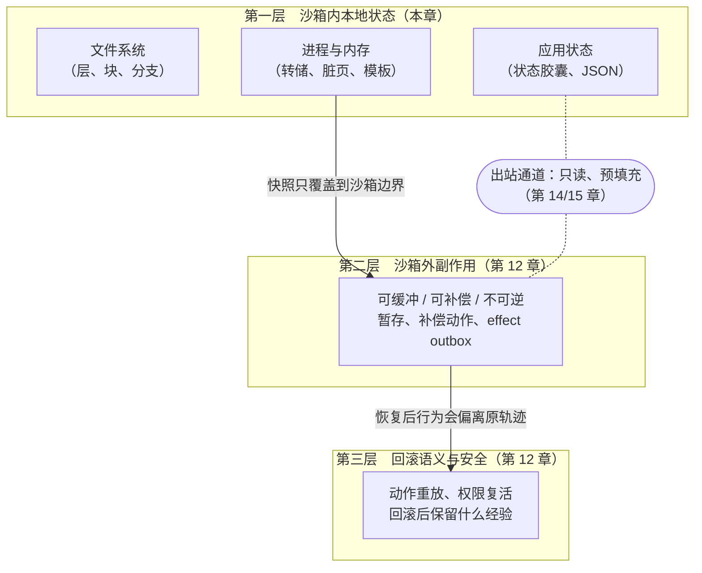
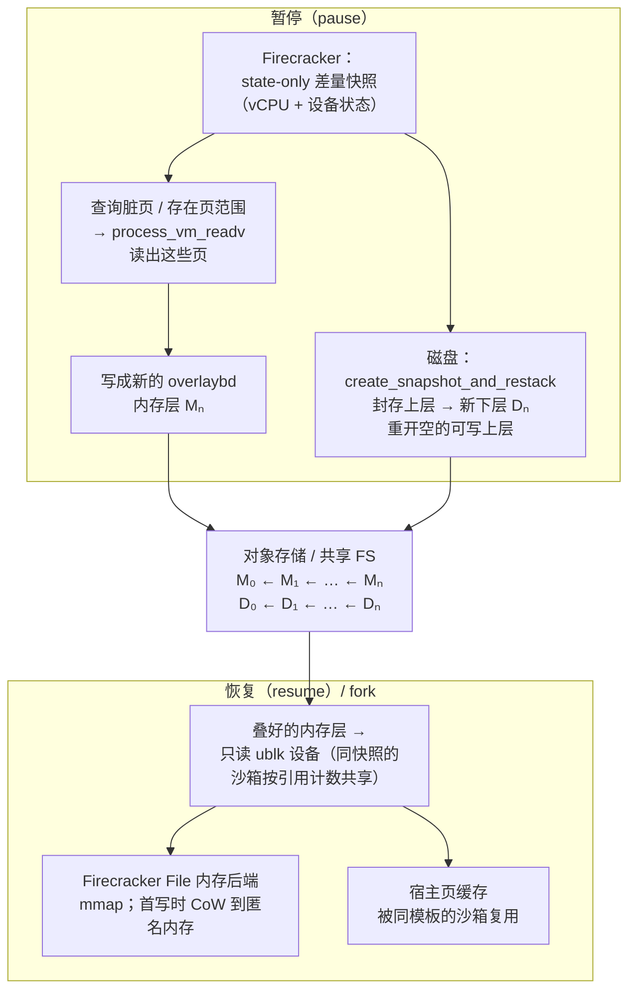

# 第 11 章　沙箱内状态：快照、fork 与检查点

## 本章导读

第三部分前几章讨论的是"怎样把沙箱造出来"：隔离原语、控制面、镜像与存储。本章开始讨论"造出来以后，沙箱里的东西怎么办"。Agent 沙箱与 serverless 函数最根本的不同在于它有状态：一次 rollout 或一次产品会话要在同一个沙箱里改文件、装依赖、起服务，持续几十分钟到几天。状态一旦存在，就带出三个工程问题。第一，在等模型推理的大段空闲时间里，状态能不能不占资源？第二，RL 和树搜索想从同一个中间状态分出多条路径时，状态能不能便宜地复制？第三，GPU 作业被抢占、节点出故障时，状态能不能活得比进程更久？

本书把"状态"作为与"对手"并列的第二主线，分三层讨论：沙箱内本地状态的快照与 fork（本章）、沙箱外副作用的事务化、回滚本身的语义与安全（后两层见第 12 章）。本章只写第一层。读完本章，读者应能：

- 说清 Agent 负载的三种需求（暂停即省钱、分支探索、可中断）为什么把检查点从 serverless 的"冷启动优化"变成了"高频、增量、在关键路径旁边"的操作；
- 掌握四类基本机制：进程级转储、整机快照与懒恢复、模板 fork、远端内存模板，以及脏页追踪、写时复制分层、工作集预取这几个反复出现的技术零件；
- 按机制复述 DSec、AgentENV、OpenAI（演讲转录）、Replit 等工业实现，以及 DeltaBox、Crab、BranchFS、YoloFS、AgentRewind、CUA-Sandbox、MobileGym 等 2026 年研究系统的做法与数字，并知道每个数字测的是什么；
- 用"状态粒度谱"判断一个设计换来了什么、放弃了什么；
- 识别模板 fork 的唯一性问题、恢复一致性问题和抢占风暴下的存储带宽问题，并知道哪些关键参数至今没有任何一家披露。

## 11.1　为什么状态是第二主线

### 11.1.1　状态三层框架

"回滚"这个词在 Agent 语境里经常被用得太宽。一个编码 Agent 删错了文件，把沙箱恢复到上一个检查点就能撤销；它若调用了支付接口、往生产数据库写了记录、给别人发了邮件，任何本地快照都无能为力；即便只是本地回滚，恢复后的 Agent 也会生成略有不同的请求，可能重放已经执行过的动作，或者让已经撤销的权限"复活"。三类问题的难度和解法完全不同，本书据此把状态分成三层（图 11-1）。

**图 11-1　状态三层框架：本地快照/fork → 外部副作用事务 → 回滚语义与安全**（示意图，依据 DeltaBox 同类清单的三层划分绘制）

第一层是沙箱内部的文件系统、进程和内存，以及 GUI 环境里的应用状态。这一层的工程已经相当成熟：2026 年的研究系统把检查点和回滚做到了毫秒甚至亚毫秒量级（见 11.4 节）。几乎所有系统都在论文里明确承认自己止步于这一层。DeltaBox 写道，它"目前不支持网络 I/O 的回滚，这可能带来外部副作用"（DeltaBox 局限一节；论文自述）；BranchFS 写道，"外部副作用（网络、IPC、设备 I/O）在放弃分支时不会回滚"（BranchFS 局限一节；论文自述）；AgentRewind 写道，"工作区文件系统之外的效果，例如网络请求、外部服务调用和外部运行时状态，无法撤销"（AgentRewind 范围说明；论文自述）。第二层和第三层是这些声明留下的空间，第 12 章讨论 Planarian、Cordon、Atomix、ACRFence 等工作怎样处理它们。两层之间还有一条出站通道：沙箱内可以回滚，沙箱外必须事务化或禁止，连接二者的出站路径应当只读、预填充，这是第 14、15 章的主题。

### 11.1.2　三种需求

**暂停即省钱。** Agent 沙箱的大部分寿命在等模型。Kimi K3 技术报告写道："Agent 在等待模型的推理结果，这最多可以占到沙箱寿命的 98%"，并据此设计为"暂停的沙箱不消耗内存或 CPU"（Kimi K3 技术报告 §5.3.2；论文自述；2026-07）。DSec 从另一侧给出了同样的刻画：容器和 microVM（微虚拟机）沙箱中，约 90% 的平均 CPU 用量不超过其请求量的 5%（DSec §4.3，图 5；论文自述）。CPU 稀疏可以靠超售（overcommit）消化（见第 13 章），内存却不行：沙箱闲着，它装好的依赖、打开的进程、写了一半的文件仍然占着内存。要把空闲时间真正变成可回收的资源，就必须能把状态从内存里"拿出来"，需要时再"放回去"。这就是暂停（pause）与休眠（hibernate）。按附录 A 的用词规范，前者停止执行、保留状态，状态可能仍在内存里（如 `docker pause`）；后者把状态写出后释放资源（如 DSec 对 microVM 快照后终止 Firecracker 进程）。

**分支探索。** RL 训练和测试时搜索都希望从同一个中间状态出发，尝试多条后续路径。GRPO 这类按组比较的算法需要同一提示下的一组 rollout；MCTS 式的树搜索需要在某一步回退、换一个动作重来。据 ZenML 对一场 OpenAI 工程师演讲的摘要，OpenAI 的沙箱栈支持"MCTS 式的检查点与回溯"（ZenML 摘要；二手报道；原视频未核实）。MobileGym 把"从任意快照精确重置与 fork"列为支撑 GRPO 等 RL 方法的前提（MobileGym；论文自述）。DeltaBox 的摘要把动机写得最直接：Agent 需要"高频的状态探索（例如测试时树搜索和强化学习）"，而现有机制"复制整个状态，每次检查点/回滚要数百毫秒到数秒，严重拖累深度搜索与大规模扇出"（DeltaBox 摘要；论文自述）。分支需要的不只是"保存"，还要能从一个状态便宜地派生出多个互相独立的子状态，也就是 fork（分叉）。

**可中断。** 训练集群里的 GPU 作业会被抢占，节点会出故障，云上的 spot 实例会被回收。DSec §6.3 的表述是："因为 GPU 作业的抢占不可避免，沙箱状态必须留在 DSec 上直到 rollout 完成。然而，这会让大量空闲沙箱在训练暂停期间一直占着内存"（DSec §6.3；论文自述）。在 V4.1 之前，"GPU 作业被抢占时，Agent 循环丢失了，而沙箱还在"（DSec §6.2；论文自述）。可中断性要求状态比 GPU 作业活得久，而且在它"活着但没人用"的时段里不能白占资源。它把前两个需求绑在一起：暂停是为了省钱，也是为了扛住抢占；检查点既是分支的起点，也是故障恢复的依据。rollout 状态归谁所有，第 17 章专门讨论。

### 11.1.3　与 serverless 的设计点有何不同

快照、fork、懒恢复都不是新东西，serverless 研究在 2018–2024 年间把它们做得很精细（见 11.2 节）。但 Agent 负载把设计点挪到了另一处，差别至少有五条。

**第一，从"一次快照、多次恢复"变成"反复检查点"。** serverless 快照的典型用法是：函数初始化完成后拍一次快照，此后每次冷启动都从这份不变的快照恢复。快照是离线产物，拍得慢一点无所谓，恢复快才要紧。Agent 沙箱的状态随每一轮工具调用变化，检查点要在一个会话里做很多次，于是检查点本身的开销第一次成为主要矛盾。系统书目笔记把这一点概括为：serverless 论文优化的是无状态的短函数，Agent 沙箱持有 GB 量级、可变、长寿命的状态，必须反复做检查点，而不是只做一次（系统书目笔记，推断）。

**第二，增量成为必需。** 反复检查点能否负担得起，取决于两次检查点之间变了多少。DeltaBox 的核心观察是"相邻检查点之间的沙箱状态只有少量差异"（DeltaBox 引言；论文自述）；Crab 的观察更激进："超过 75% 的 Agent 轮次不产生与恢复相关的状态，所以大多数检查点是不必要的"（Crab 摘要；论文自述）。因此，只复制变化部分（脏页、写时复制层、增量转储）成了 2026 年几乎所有系统的共同选择。

**第三，等待时间可以用来藏开销。** serverless 的恢复在请求的关键路径上，每一毫秒都直接计入延迟。Agent 的每一轮都有一段等模型的时间，检查点可以异步发出、藏在推理窗口里。DeltaBox 称其检查点约 10.83 ms 的本地工作"被推理时间掩盖（Agent 感知到的阻塞为零）"（DeltaBox 评测部分；论文自述）；Crab 的协调器专门把检查点和轮次边界对齐，与 LLM 等待重叠（Crab 摘要；论文自述）。

**第四，fork 的对象从"干净模板"变成"运行到一半的现场"。** Catalyzer 的 sfork 从一个初始化好的模板派生新实例，模板本身是干净的、只读的。Agent 的 fork 要从一个已经改过文件、跑着进程的沙箱派生子实例，子实例之后还要各自分叉下去。这使 fork 的源头变成了可变状态，也让唯一性、恢复一致性等正确性问题变得尖锐（见 11.6 节）。

**第五，规模与同时性。** 一次 GPU 抢占可能让成千上万个沙箱同时需要暂停，同一组 rollout 可能要求同一节点瞬间派生几十个子沙箱。serverless 的负载峰值来自请求到达，彼此大体独立；Agent 训练的峰值由训练框架的调度决定，天然同步。存储带宽因此可能成为新的瓶颈（见 11.6.3 节）。

### 11.1.4　几个用词

本章严格区分以下几个词（完整定义见附录 A）。**快照**（snapshot）是沙箱某一时刻内存和/或磁盘状态的持久化副本；**检查点**（checkpoint）是作为恢复点保存的快照，通常可增量、可多次，"C/R"即 checkpoint/restore；**恢复**默认指 restore（从快照重建沙箱），需要区分时写"恢复运行（resume）"，指让暂停的沙箱继续执行；**回滚**（rollback）是把状态恢复到先前的检查点，只对沙箱内状态可行；**fork（分叉）** 是从运行中的沙箱或快照派生多个共享父状态、写时复制的子实例；**分支**（branch）用于 BranchFS 等论文自己的术语，指文件系统或执行上下文层面的 fork。

## 11.2　源流：从 CRIU 到 CXLfork

2026 年的 Agent 检查点系统几乎都是在重新组合几类老机制。本节先把这些机制讲清楚，再说 serverless 留下了什么、没留下什么。本节涉及的经典论文多数只依据背景知识整理，本书未逐一回原文核对，因此只做定性描述，不引数字。

### 11.2.1　四类基本机制

**（一）进程级转储：CRIU。** CRIU（Checkpoint/Restore In Userspace）是 Linux 上用户态检查点/恢复的事实标准，runc、podman 的容器检查点都建立在它之上（CRIU 项目主页；背景知识，待核）。它的做法是：冻结目标进程树，借助 ptrace 和 `/proc` 读出每个进程的内存映射、寄存器、打开的文件描述符、套接字、命名空间等，写成一组镜像文件；恢复时按镜像重建进程骨架，再把内存内容填回去。CRIU 支持增量转储：借助内核的 soft-dirty 位（写页时由内核置位，转储后清零），第二次转储只需写出上次以来被写过的页。它也支持懒恢复（lazy pages）：先把进程骨架建起来、立即恢复执行，内存页等到第一次访问触发缺页时，再经由 userfaultfd 从镜像里取。CRIU 的主要问题在于"重建"本身：进程多、映射多、文件描述符多时，恢复要付出可观的固定成本。DeltaBox 与 Crab 都把 CRIU 作为底层零件或对照基线（见 11.4 节），而"从模板 fork 快于从转储恢复"正是模板派工作的出发点。

**（二）整机快照与懒恢复：Firecracker、REAP、FaaSnap、Sabre。** 对 microVM 来说，最自然的快照对象是整台虚拟机：guest 内存加上 vCPU 与设备状态。Firecracker 把快照分成两部分：一个很小的状态文件（vCPU 寄存器、设备模型）和一个与 guest 内存等大的内存文件；恢复时把内存文件 mmap 进来，guest 访问到哪一页，宿主就在缺页时从文件里读哪一页。这种懒恢复启动很快，但把代价挪到了恢复之后：guest 刚恢复时会在短时间内密集触发缺页，每次缺页都是一次同步 I/O。REAP 的贡献是指出 Firecracker 快照恢复的时间主要花在这些懒缺页上，并提出在第一次调用时记录函数真正访问的工作集（working set），之后恢复时一次性预取这组页（REAP，ASPLOS'21；背景知识，待核）。FaaSnap 在此基础上加入并发换页、按区域映射和对宿主页缓存的感知（FaaSnap，EuroSys'22；背景知识，待核）；Sabre 用 Intel IAA 硬件加速器压缩和解压内存快照，并把预取集成进 Firecracker 的恢复路径（Sabre，OSDI'24；USENIX 页面已核实，机制为背景知识）。整机快照还可以增量：KVM 能记录 guest 的脏页日志，Firecracker 据此支持只写出上次快照以来被写过的页的差量快照（diff snapshot）（背景知识，待核）。这正是 AgentENV 增量暂停的起点（见 11.3.2 节）。

**（三）模板 fork：Catalyzer、SEUSS、Fireworks、Nephele。** 与其每次从快照文件重建，不如让一个"模板"实例常驻内存，需要新实例时直接 fork 它：子实例共享模板的全部物理页，只复制页表，写时才复制（copy-on-write，CoW）。上海交通大学 IPADS 的 Catalyzer 为基于 gVisor 的沙箱提出了 sfork（sandbox fork），从运行中的模板沙箱克隆新实例，另配以从检查点镜像按需恢复（Catalyzer，ASPLOS'20；背景知识，待核）。SEUSS 用 unikernel 快照加页级写时复制换取极高的函数缓存密度（SEUSS，EuroSys'20；背景知识，待核）；Fireworks 在语言运行时 JIT 预热之后再对 microVM 拍快照，恢复出的实例同时跳过启动和 JIT，并在实例之间以写时复制共享内存（Fireworks，EuroSys'22；背景知识，待核）；Nephele 在 Xen 上为 unikernel VM 实现了类 `fork()` 的克隆原语，连同 I/O 设备一起克隆（Nephele，EuroSys'23；背景知识，待核）。同属 IPADS 的 Molecule 则在异构硬件上用 cfork（container fork）加速启动（Molecule，ASPLOS'22；背景知识，待核）。模板 fork 的优势是恢复几乎只剩页表复制；代价是模板必须常驻内存，而且模板要么干净，要么就得面对"子实例继承了不该继承的东西"（见 11.6.1 节）。

**（四）远端内存模板：TrEnv、CXLfork、Aquifer。** 前三类都局限在单机之内。把模板放到多台主机都能访问的共享内存里，就有了跨节点 fork 的可能。TrEnv 提出可复用的沙箱池加"mm-template"，后者以 CXL/RDMA 内存池为后端，让不同函数、不同节点共享执行环境（TrEnv，SOSP'24；背景知识，待核）；其扩展版 TrEnv-X 报告，在 LLM Agent 负载上相对 E2B 基线 P99 延迟降低 58%、内存降低 61%（TrEnv-X，arXiv 2509.09525；论文自述）。CXLfork 把进程状态检查点到 CXL 共享内存中，使其他主机能以接近零拷贝的方式从中 fork（CXLfork，ASPLOS'25；DOI 已核实，机制为背景知识）。Aquifer 按冷热把快照页分层，热页放 CXL、冷页放 RDMA，但只在模拟硬件上做了评估（Aquifer，arXiv 2606.24079；经聚合页核实，仅摘要）。这条线是目前唯一认真处理"跨节点"的研究方向，但离 Agent 训练集群的生产部署还有距离（见 11.6.4 节）。

此外还有一个常被忽略的前身：**Groundhog**。它对预热好的函数进程拍快照，每处理完一个请求就追踪被写脏的页并廉价地恢复到干净状态，以防请求之间泄漏数据（Groundhog，EuroSys'23；背景知识，待核）。把"请求"换成"episode"，这就是 RL 环境在两局之间的重置：同一个环境镜像要被上千条轨迹反复使用，每一局开始时必须回到完全相同的初始状态。

### 11.2.2　反复出现的三个零件

上面四类机制可以拆成三个在 2026 年系统里反复出现的零件。

**脏页与增量追踪。** 要做增量，先得知道什么变了。内存侧有三种办法：进程级用 soft-dirty 位（CRIU、Crab）；虚拟机级用 KVM 的脏页日志（Firecracker 差量快照）；或者干脆不追踪，而是在写入时通过写时复制把新页落到私有区域，"私有区域里有什么"就是变化集（模板 fork）。文件系统侧同理：overlayfs 的可写上层（upper）本身就是变化集；块设备侧，overlaybd 这类分层块格式的可写层也是变化集。

**写时复制分层。** 检查点的一种廉价做法是"封存当前可写层、在上面新开一层"：封存后的层成为只读的历史，之后的写入落在新层，回滚则是丢掉新层、回到旧的层栈。这个模式在文件级（overlayfs、DeltaFS、BranchFS）、块级（overlaybd 的 LSMT、Replit 的不可变块、OpenAI 的 CoW XFS）和内存级（AgentENV 的 overlaybd 内存层）都出现了。它的好处是检查点的代价与状态总量无关，只与"封存"这个元数据操作有关；坏处是层会越叠越多，读路径变长，需要定期合并（DSec 以 3 GB 为例给出了离线合并连续层的阈值，见第 10 章）。

**懒恢复与预取。** 恢复时不必把全部状态搬回来，可以先恢复执行，访问到再取。它的代价是恢复后的缺页风暴，缓解手段是预取：REAP 记录工作集，DSec 恢复容器前对进程映射调用 `MADV_WILLNEED` 发起异步预取（DSec §6.3；论文自述），AgentENV 则让同一内存镜像的沙箱共享宿主页缓存，把"预取"变成"别人已经读过了"（见 11.3.2 节）。

### 11.2.3　serverless 留下了什么，没留下什么

留下的是机制：快照恢复、模板 fork、内存模板这三族机制，被 2026 年的 Agent 检查点论文重新组合（系统书目笔记，推断）。没留下的是负载假设。serverless 论文里的快照是离线、一次性、对所有实例相同的；Agent 的检查点在线、高频、每个沙箱各不相同。serverless 里恢复出的实例生命短暂、用完即弃；Agent 恢复出的沙箱要继续跑几十分钟，恢复后缺页的长尾会反复出现。serverless 的模板干净；Agent 的 fork 源头是运行到一半的现场。这些差别决定了 2026 年系统的共同形态：**分层写时复制的文件系统，加上从模板 fork 的进程恢复，再加上把开销藏进 LLM 等待时间的调度**（系统书目笔记的归纳，推断）。本质上，这是把 Catalyzer 在 2020 年提出的思路用到了有状态沙箱上。

> **边栏：谱系——IPADS 的模板 fork 线：Catalyzer → Molecule → DeltaBox**
>
> 上海交通大学并行与分布式系统研究所（IPADS）是"面向 Agent 的操作系统"方向上最多产的学术团队，它的沙箱工作有一条可以按作者核实的连线。Catalyzer（ASPLOS'20）的作者包括 Dong Du、Yubin Xia、Haibo Chen，提出 sfork；Molecule（ASPLOS'22）的作者同样包括这三人，提出跨异构硬件的 cfork；2026 年的 DeltaBox 作者名单里仍有 Dong Du、Yubin Xia、Haibo Chen，另有华为的三位作者（DeltaBox 作者块；论文自述）。DeltaBox 的 DeltaCR 在回滚时"绕开传统流水线，直接从冻结的模板进程 `fork()`"（DeltaBox 摘要；论文自述），与 sfork 的思路一脉相承。同一团队在 2026 年还有 AgenticOS 研讨会上的 Skill OS、DMI，以及 SOSP'26 录用的 SkVM（见第 28 章）。
>
> 作者重合是可以核实的事实；"DeltaBox 的设计源自 Catalyzer"则是笔者据作者重合与机制相似作出的推断，不是当事方的陈述（推断）。Catalyzer 与 Molecule 的作者名单来自背景知识，尚未在 dblp 上核对（未核实）。

## 11.3　工业实现

AI 实验室对沙箱状态管理的一手披露，到 2026 年 9 月只有两份比较完整：DeepSeek 的 DSec 论文和 kvcache-ai 组织下的 AgentENV 仓库文档（连同 Kimi K3 技术报告；K3 报告称其与合作伙伴共同开发，kvcache-ai 与清华 MADSys 的关系本书未核实）。OpenAI 只有一场演讲的二手摘要；Anthropic、Google DeepMind 没有训练侧的状态管理披露。产品侧厂商的披露更多，但多是功能描述与宣传数字。

### 11.3.1　DSec：按后端分治的暂停与 pack_diff

按本书八层框架（第 9 章给出、第 24 章用于拆解 DSec；DSec 论文本身没有这种编号），DSec 在第⑤层（状态管理）上做了两件事：GPU 作业被抢占时暂停沙箱、回收内存；让 Agent 把沙箱打包成新的可复用环境（DSec 的完整拆解见 24.3.5 节）。这里只从机制角度看它的取舍。

**容器：挤到 swap，用时预取。** 论文原文是："edge 先发出 `docker pause` 冻结容器的进程树，再通过容器的 `memory.swap.max` 设置打开 swap，并通过 `memory.reclaim` 触发主动内存回收"；恢复时，"edge 对进程的内存映射施加 `MADV_WILLNEED` 以发起异步预取，然后发出 `docker unpause` 恢复执行"（DSec §6.3；论文自述，本书 2026-09-30 回原文核对）。这里没有任何"快照文件"：状态始终由原进程持有，只是内存页被 cgroup v2 的主动回收接口挤到了 swap 上。它的好处是实现简单、与容器运行时兼容，恢复时进程的一切（文件描述符、套接字、子进程）原样还在，不存在 CRIU 式的重建问题。代价是状态绑死在这台节点的 swap 设备上，不能迁移，也不能 fork。`MADV_WILLNEED` 预取与 REAP 的工作集预取目标相同，只是粒度更粗：它预取的是进程的全部映射，而不是记录下来的热页集合。

**microVM：写出快照，杀掉进程。** 原文是："暂停 microVM 时，DSec 把它的内存和执行状态保存为快照，然后终止正在运行的 Firecracker 进程，以释放 microVM 的运行时内存。恢复时，DSec 启动一个新进程并还原快照，继续 guest 的执行"（DSec §6.3；论文自述，同上核对）。按用词规范，这更接近"休眠"：状态写出之后，宿主上不再有任何进程为这个沙箱占用内存。§6.3 没有说明这里用的是全量快照还是 Firecracker 的差量快照，也没有说明快照写到本地盘还是 3FS（据 HTML 抓取，未用 PDF 全文检索复核）。

两种做法的差别体现了两种后端的本性：容器与宿主共享内核，暂停后进程仍在，于是"把内存挤出去、需要时再拉回来"；microVM 自带完整的 guest 状态，可以整体序列化，于是"写出快照、干脆把进程杀掉"。

**pack_diff：检查点即环境。** §6.1 描述了另一种状态操作："任何时候，Agent 都可以通过对沙箱做增量磁盘快照来打检查点，之后可以作为一个新沙箱恢复。这个检查点—恢复接口把一次交互式会话直接变成一个可复用的环境"（DSec §6.1；论文自述）。它与第④层的可组合层天然契合：增量磁盘快照就是一个可以叠加到基础镜像之上的新层（见第 10 章）。pack_diff 只涉及磁盘，不涉及内存，所以严格说它不是 fork，而是"把状态固化为镜像"。它同时是一个完整性风险点：构建环境的 Agent 若在沙箱里留下参考答案，答案会被打进镜像。论文的对策是"构建者与运行时 Agent 使用不同的账号，打包前从可写层中清除构建期的残留数据"（DSec §6.1；论文自述；另见第 18、19 章）。

**没有披露的东西。** 论文没有给出暂停与恢复的延迟、快照大小、pack_diff 的耗时与体积，也没有给出一次抢占需要暂停多少个沙箱。本书对 HTML 全文的核对也确认，论文**没有提到** fork、跨节点迁移或在线迁移（DSec 全文；2026-09-30 核对）。因此 DSec 在本章表 11-1 中只能占一行"未披露"（附录 B 冲突项 C-31）。这本身是一个发现：一个峰值约 38 万并发沙箱（DSec §2.4；论文自述）的生产系统，把状态管理做成了"保住就行"，而不是"又快又能分叉"；它的差异化投资在存储与密度上（见第 24 章）。

### 11.3.2　AgentENV：增量内存层与 restack

AgentENV（AENV）是 kvcache-ai 组织下以 MIT 许可开源的 Agent 环境平台，README 称它"支撑 Kimi K3 的 Agent RL 训练"（AgentENV README；一手文档）。它只有一种后端：每个沙箱是一台 Firecracker microVM。与 DSec 以密度为中心不同，AgentENV 是以暂停为中心设计的（第 25 章对两者做完整对照）。它的状态管理有三个关键机制，本书依据仓库的架构文档逐条核对（AgentENV `docs/src/internals/architecture.md`，2026-09-29 版；一手文档）。

**机制一：脏页直读，写成 overlaybd 内存层。** 文档写道："暂停时，Firecracker 创建一个仅含状态（state-only）的差量快照。AgentENV 查询 Firecracker 的脏页/存在页范围，用 `process_vm_readv` 读出选中的内存，直接创建 OverlayBD 内存层。先前快照的父层被叠在下面，构成完整的分层内存镜像。"这里有两处要细看。第一，Firecracker 只负责写出很小的 vCPU 与设备状态，**不写内存文件**；内存由 AgentENV 自己读。`process_vm_readv` 是 Linux 读取另一个进程地址空间的系统调用；guest 内存就映射在 Firecracker 进程的地址空间里，因此 AgentENV 可以跳过"先落一个完整内存文件、再转换格式"的中间步骤（机制解读，推断）。第二，只读脏页和存在页：上一次暂停以来没被写过的页已经在父层里，不必再存；从未被触碰过的页根本不存在，也不必存。每次暂停只产生一层薄薄的增量，叠在之前的层上。K3 技术报告对同一机制的描述是：增量检查点"只保存自上次检查点以来被写脏的页"（Kimi K3 技术报告；论文自述）。

**机制二：磁盘的 seal-and-restack。** 磁盘侧的暂停路径是 `ImageFile::create_snapshot_and_restack()`："它通过 `LSMTFile::close_seal_and_reopen()` 封存当前活跃的上层，使其成为最新的下层，然后原地重新打开一个新的可写上层"（AgentENV 架构文档；一手文档）。这就是 11.2.2 节所说的写时复制分层：检查点不复制任何数据块，只做一次元数据操作。overlaybd 是源自阿里 DADI 的块级分层镜像格式，AgentENV 用 Rust 重写为 LSMT（日志结构合并树）实现，经由用户态块设备框架 ublk 暴露为 `/dev/ublkbN` 挂进 VM（见第 10 章）。

**机制三：用 ublk 块设备而不是 userfaultfd 做内存恢复。** 这是 AgentENV 与 REAP 以来多数 microVM 恢复方案最不一样的地方。文档写道："内存快照恢复使用 ublk 支持的 overlaybd 设备，而不是 userfaultfd。恢复时，由叠好的内存 overlaybd 层创建一个只读 ublk 设备，作为 `BackendType::File` 内存后端交给 Firecracker。Firecracker mmap 这个块设备，并在首次写入时把页写时复制到匿名内存中，因此底层设备永远不会被修改。"随后一句解释了这样做的收益："从同一个快照模板启动的多个沙箱通过引用计数共享一个内存 ublk 设备。这使 Linux 页缓存可以在使用同一内存镜像的所有沙箱之间复用，显著减少同一模板并发启动时的 I/O"（AgentENV 架构文档；一手文档）。仓库里保留了一份基于 userfaultfd 的实现（`storage/uffd-core`），但已被排除在构建之外。

用 userfaultfd 做懒恢复，每个沙箱的缺页都由用户态处理程序单独服务，同一模板的一百个沙箱会把同一页读一百次。改成"块设备 + mmap + 页缓存"之后，第一个沙箱读过的页进入宿主页缓存，其余沙箱的缺页直接命中缓存；写入则由内核的写时复制落到各自的匿名内存里。换句话说，AgentENV 把模板 fork 的"共享物理页"语义，用块设备和页缓存在 VM 层面重新实现了一遍（推断）。图 11-2 把暂停与恢复的路径画在一起。

**图 11-2　AgentENV 增量暂停：脏页 → overlaybd 内存层 → restack**（示意图，依据 AgentENV 架构文档 2026-09-29 版绘制）

**fork。** 在这三个机制之上，fork 几乎是顺手的：`POST /sandboxes/{id}/fork` 把一个运行中的沙箱克隆成若干子沙箱。当前文档写道："fork 把一个运行中的沙箱克隆为同一节点上的独立子沙箱。源沙箱在状态被捕获时短暂暂停，之后回到运行状态。子沙箱继承源的文件系统、内存、网络策略、安全模式和 CPU/内存/磁盘配置。所有子沙箱使用同一份捕获的状态，但每个子沙箱可以各自成败"（AgentENV `docs/src/concepts/sandboxes/working.md`；一手文档）。有两处限制：只限**同一节点**；子沙箱数量上限为 100，但首版文档曾写作 16（见边栏）。仓库另有持久化快照（`aenv snapshot create`），源沙箱捕获后继续运行，快照之后可以启动一个或多个新沙箱；快照可以持久化到兼容 S3 的对象存储或共享分布式文件系统（AgentENV README；一手文档）。架构文档列出的生命周期状态为 Creating、Running、Pausing、Paused、Resuming、Killing，另有 Forking 状态见于代码 `src/orchestrator/types.rs` 与首版文档；预热池覆盖网络槽位、ublk 块设备和预先拉起的 Firecracker 进程，因此恢复时可以跳过进程启动（AgentENV 架构文档与代码；一手文档）。快照还可以跨节点恢复：配置参考写道，发布快照时"内存层和增量读写层在上传时压缩一次，减少跨节点恢复（cross-node resume）的网络字节"；PVM 部署文档提醒，"如果节点共享一个快照仓库，要确保负载只在与快照创建时相同模式的节点上恢复"（AgentENV `docs/src/configuration/reference.md`、`docs/src/deployment/pvm.md`，2026-09-29 版；一手文档）。这是整机快照经共享仓库的冷迁移，文档没有给出跨节点恢复的延迟。

**数字：两个来源，两种口径。** README 写道："以快照为后端的环境在 50 ms 以内启动或恢复、在 100 ms 以内暂停"；"AENV 以增量方式对内存和文件系统变化做快照，即使磁盘修改量很大也能在 100 ms 以内完成"（AgentENV README；一手文档，项目自报；2026-07-25 起，2026-09-29 版仍如此）。K3 技术报告写道，增量检查点"使检查点与恢复延迟最低可达 133 ms 与 49 ms"（Kimi K3 技术报告；论文自述；2026-07）。两组数字不能互相替代：README 是没有说明测试条件的宣称上界，K3 报告给出的是"最低可达"值（as low as），是下界而不是典型值，报告没有说明测量条件，也没有说这是生产统计（"真实负载"一语在原文中修饰的是 6.5 倍超售比）。二者在恢复上基本吻合（<50 ms 对 49 ms），在检查点上不吻合（<100 ms 对 133 ms）。本书按附录 B 冲突项 C-03 的处理，两者并列，正文优先引 K3 技术报告的数字并写明"最低可达"。两份来源都没有给出分布（中位数、P99）、快照大小或脏页比例。

> **边栏：方法——fork 上限：文档与代码不一致**
>
> AgentENV 的 fork 上限是一个"文档与代码不一致"的典型例子：2026-07-25 首次公开提交的文档写 fork 可克隆出"最多 16 个子沙箱"（up to 16 child sandboxes），而同一提交的 API 定义与生成代码已把 fork 的 `count` 限定为 1–100；2026-08-24 文档改为与代码一致的"最少 1、最多 100"（AgentENV 提交历史；一手文档）。也就是说，**变化的是文档口径，上限本身自首版起就是 100**。MarkTechPost（2026-07-27）与 bex.co（2026-09-22）沿用了 16（二手报道）。逐提交的核对见第 25 章 25.5.3 节。
>
> 教训有两条。其一，开源基础设施的文档与代码可能不一致，关键参数应以 API 定义或代码为准，并注明提交号与日期。其二，本书没有核对生产部署实际用的是哪个版本、是否另有配置限制。引用时建议写成"fork 数量上限为 100（代码自首版起即为 1–100；首版文档误写为 16，2026-08-24 更正），且仅限同节点"（附录 B C-02）。另一类情况是来源之间的数字差异：AgentENV 的内存超售比，K3 技术报告称借助写时复制内存与页缓存优化，真实负载下最高 6.5 倍；README（2026-08-10 提交）称借助内存气球，生产中达 9.6 倍；两者口径未说明，归因机制也不同（附录 B 冲突项 C-01；见第 13 章）。两类情况都要求引用时写"截至某日、某提交"。

> **边栏：谱系——TrEnv、AgentENV 与 DSec（推断，基于作者重合）**
>
> 本章讲到的两个工业系统之间有一条可以部分核实的连线。TrEnv（SOSP'24）及其扩展 TrEnv-X 的作者包括 Jialiang Huang、Sixing Lin、Yingdi Shan、Mingxing Zhang；Jialiang Huang 是 DSec 的第一作者；Sixing Lin 与 Yingdi Shan 是 AgentENV 提交最多的两位（AgentENV 提交历史；一手文档；提交者结构见第 25 章 25.2 节）。DSec 论文写道，它使用了"我们参与贡献的 Rust 版 OverlayBD，以及我们的 Rust 用户态 ublk 库"，并注明这些存储组件已在 AgentENV 仓库中开源。也就是说，**DSec 的 microVM 存储路径使用了 AgentENV 仓库中开源的 Rust OverlayBD/ublk 组件（论文称"我们参与贡献"）**。
>
> 从机制上看，这条线也说得通：TrEnv 的 mm-template 是"让许多执行环境共享同一份内存模板"，AgentENV 的"同快照沙箱共享一个内存 ublk 设备与页缓存"是它在单机、块设备层面的一个变体（推断）。但这只是笔者据作者重合与机制相似作出的推断，不是任何当事方的陈述，更不能推出 DSec 建立在 AgentENV 之上：DSec 是独立系统，整体没有开源，而且论文没有披露它的 microVM 暂停是否用到了 AgentENV 的增量内存层。完整的证据链见第 25 章。

### 11.3.3　OpenAI 与 Replit：块级写时复制

**OpenAI（演讲转录）。** 关于 OpenAI 沙箱的状态管理，目前能找到的只有一场 2026 年工程师演讲：ZenML 的 LLMOps 数据库有摘要，AI Engineer 官网有带时间戳的官方转录（2026-10-06 核对；原视频本书未看）。演讲以 Rust VMM（crosvm、Firecracker、Cloud Hypervisor）为例讲 microVM 参考设计，宿主与 guest 之间经 vsock 通信，但没有说 OpenAI 生产中用哪一种 VMM（官方转录；附录 B X-44）；在写时复制的 XFS 上做块级增量快照，用 fiemap 找出变化的块和区段，压缩后存入云存储；另外，为了常驻持久化，在 GCS、S3 这类对象存储之上实现一个文件系统，经由 NBD（网络块设备）协议挂载；"全球集群"采用快照感知的调度；从内存快照实现毫秒级启动；支持 MCTS 式的检查点与回溯；训练侧追求吞吐（并行 rollout），产品侧追求延迟（ZenML 摘要；官方转录中均有原话）。演讲没有任何具体延迟数字。"快照感知调度"意味着调度器知道快照放在哪里，会尽量把恢复请求派到数据就近的节点（推断），这是本书看到的唯一一处暗示把快照位置纳入调度的工业表述，但无法核实细节。

**Replit（一手）。** Replit 的博客《Inside Replit's Snapshot Engine》描述了一个面向产品的块级快照系统："Bottomless Storage"用 NBD 虚拟块设备，后端是 Google Cloud Storage 上 16 MiB 的不可变块；块级写时复制使"复制一块磁盘"变成"复制一份清单（manifest）"（Replit 博客；一手文档；未标日期）。与 OpenAI 的描述对照，两者的共同点是：状态的持久化形态是对象存储里的不可变块，块设备只是一层把它们拼起来的视图；快照与 fork 因此只是元数据操作。Replit 还把开发库与生产库分开，Agent 只能访问开发库，数据库本身也可以 fork。这已经触及第二层的问题（外部状态），第 12、21 章会回到它与 2025 年删库事件的关系。

**Morph Infinibranch。** Morph Cloud 在 2024-11-19 发布 Infinibranch，支持对运行中的 VM 做快照与分叉以并行执行（Morph 博客；厂商自报）。存档文章没有给出延迟数字。

### 11.3.4　产品侧：休眠、检查点与 fork 成为标配

到 2026 年，独立沙箱厂商之间的竞争点已经从冷启动转向"持久化、快照与 fork"；2026 年 1–4 月发布的 Fly.io Sprites、Vercel、Cloudflare 都以此作为卖点（推断）。这里只列与本章机制相关的几项，完整对比见表 21-1 与第 22 章。

- **Fly.io Sprites**（2026-01-13 发布）：基于 Firecracker 的持久化 VM，空闲自动休眠并保留存储，支持检查点与回滚；第三方对比给出检查点/恢复约 300 ms（Better Stack，2026-03-09；二手报道）；启动时间两个来源不一：Techzine 写 1–12 s，Better Stack 写创建 1–2 s（二手报道）。
- **Cursor 云 Agent**：VM 可以在消息之间休眠与恢复，镜像可以 checkpoint、restore、fork，另有只读与预热 VM（Cursor 博客，2026-06-02；一手文档）。
- **E2B**：2026-07-15 在控制面规范中加入 `POST /sandboxes/{sandboxID}/fork`，`count` 为 1–100，07-21 在 changelog 公告；fork 期间原沙箱短暂暂停并断开连接，暂停时长随自上次快照以来的磁盘改动量增长（e2b-dev/infra 规范与 E2B 文档；一手文档；见第 16 章）。
- **Manus**：每个任务一台云 VM，不活跃时自动休眠，唤醒后数据不变；闲置超过 Free 7 天、Pro 21 天回收（Manus 博客，2026-01-14；一手文档）。E2B 在 2025-05 的客户案例中写的是付费用户沙箱数据最多保留 14 天（厂商自报），两者相隔 8 个月，更可能是政策调整（附录 B 冲突项 C-04）。
- **Google Jules**：每个任务一台短命 Ubuntu VM，"Run and Snapshot"把 setup 结果做成快照供后续任务复用（Jules 文档；一手文档）。这与 DSec 的 pack_diff 是同一个思路：把搭建环境的代价只付一次。
- **阿里云 ACS Agent Sandbox**：支持"内存级 checkpoint"；营销文称深度休眠唤醒 P99 低于 600 ms（2026-09-28；厂商自报），产品文档称内存态唤醒 1–10 秒（文档修改日期 2026-06-22；厂商自报）。两者口径不同，不能比较（附录 B 冲突项 C-06）。

产品侧的状态管理与训练侧有一个结构性差别：产品的休眠以小时、天计，关注的是"醒来后东西还在"和"睡着时不收钱"（第 22 章讨论"暂停不计费"与"活跃 CPU 计费"）；训练侧的暂停以秒、分钟计，关注的是抢占期间的内存回收和分支的吞吐。两者用的是同一套机制，优化的目标却不同。

## 11.4　2026 年的研究系统

2026 年上半年，"Agent 沙箱检查点"在学术界从零散的研讨会话题变成了一个密集的方向。本节按机制层次介绍其中最重要的几项。先交代出版状态，这对一本参考书很重要：截至 2026-09-30，DeltaBox、Crab、AgentRewind 都是 arXiv 预印本；BranchFS 发表于非存档的 AgenticOS @ ASPLOS 2026 研讨会，另有 arXiv 预印本；YoloFS 已被 SOSP'26 录用（据 pchaigno 整理的 SOSP'26 录用清单；官方列表本书未抓取），arXiv 上仍是预印本 v2；MobileGym 在文献库中登记为 EMNLP 2026，本书抓取的 arXiv HTML 未显示会议信息；CUA-Sandbox 是 2026-09-26 提交的预印本，本书读全文（作者仓库所附 PDF）。

### 11.4.1　DeltaBox：只复制变化

DeltaBox（arXiv 2605.22781；v1 2026-05-21，v2 2026-06-08；预印本）来自上海交通大学 IPADS 与华为，提出一个新的 OS 抽象 DeltaState：把文件系统和进程内存当作一个耦合的事务单元，只保存相邻检查点之间的变化（DeltaBox 摘要；论文自述）。它由两个协同设计的机制组成。

**DeltaFS：运行时可重排的 overlay。** Linux 的 overlayfs 在挂载后不能改变层栈，DeltaFS 扩展了这一点。检查点时，它"冻结可写层并插入一个新层，把更新变成写时复制"：当前上层经重命名降为只读，插入一个新的可写上层，再用一次原子 ioctl 替换层数组（DeltaBox DeltaFS 一节；论文自述，据 v2 HTML 正文）。回滚于是变成一次简单的层切换。检查点之前已经打开的文件还指向旧 inode，DeltaFS 用一个按文件系统计数的代际号做懒切换：代际不匹配时走慢路径，内核按新层栈重新解析 inode，必要时复制一个新的上层副本。底层建在支持 reflink 的 XFS 上，一个在 N 次检查点间未被修改的 extent 只占一个物理块、被 N 个代际共享，从而把每次检查点的写放大压到 O(4 KB) 量级，而复制目录的基线是 O(目录)、Firecracker 快照是 O(整机)（DeltaBox 评测部分；论文自述）。

**DeltaCR：增量转储加模板 fork。** 进程侧，检查点同时做两件事：把一次 CRIU 转储交给后台单线程池（CRIU 短暂 SIGSTOP Agent 进程，把转储写到 tmpfs，完成后 SIGCONT）；再 `fork()` 出一个冻结的模板进程留在内存里。回滚时，如果目标检查点的模板还活着（快路径），系统杀掉当前 Agent 进程，从模板 fork 出一个新子进程；内核只复制页表，物理页全部写时复制共享。fork 之后，一个后台"异步预热"线程遍历子进程的可写匿名内存区，对每页做一次"读后写一个字节"，在后台提前完成写时复制，以免子进程运行时逐页撞上缺页。如果模板因池满被按 LRU 淘汰（快路径未命中），则退回 CRIU 的懒页恢复：重建进程骨架，把所有匿名内存区注册到 userfaultfd，边跑边按需取页（DeltaBox DeltaCR 一节；论文自述）。这正是 11.2.1 节里模板 fork 与 CRIU 懒恢复的组合：常用的检查点走 fork，冷门的走转储。

**网络代理守护进程。** 模板 fork 有一个老问题：进程里的线程和套接字不能被 fork 正确复制。DeltaBox 把 LLM SDK 客户端拆到一个旁路进程（Network Proxy Daemon）里，Agent 进程通过共享目录与它交换固定大小的 FIFO 令牌，"让每一个套接字和 SDK 线程都不在它的地址空间里"（DeltaBox；论文自述）。这个工程选择的思路是：与其让 C/R 机制去处理网络连接，不如把网络连接从被检查点的对象里移走。

**数字：摘要与正文口径不同。** DeltaBox 摘要写的是：在 SWE-bench 和 RL 微基准上，"检查点与回滚延迟分别为 14 ms 和 5 ms"（DeltaBox 摘要，v1/v2 相同；论文自述）。正文 v2 表 2 给出的是每事件平均耗时：检查点的本地工作约 10.83 ms，论文写明它"与 LLM 推理窗口重叠，因此 Agent 感知不到阻塞"（表 2 中"Agent 感知阻塞"一行，检查点为 0）；快路径恢复约 1.86 ms（模板 fork 加 overlay 切换）；慢路径恢复约 9.29 ms（CRIU 懒页回退）（DeltaBox 评测部分；论文自述，据 v2 HTML 正文，未以 PDF 核对）。摘要的 14/5 ms 与表 2 的 10.83/1.86 ms 口径显然不同，本书没有在正文中找到二者的对应关系，引用时并列，默认引摘要数字并注明"摘要口径"。

评测环境是一台 4 路 96 核、760 GB 内存的服务器，Agent 运行在 4 vCPU、8 GB 内存的 Firecracker microVM 里，回放的是 Qwen3-Coder-30B 在 SWE-bench Verified 上的轨迹；被 fork 的预热模板（仅用标准库的 agent.py）常驻内存约 15 MB，仓库文件数在数十万量级（DeltaBox 评测部分；论文自述）。对照基线的数字给出了"不做增量"时的量级：复制目录加命令重放为检查点 347 ms、恢复 27,694 ms；Firecracker 差量快照（内置 pause+dump）加 dm-snapshot 写时复制层为 622 ms、3,429 ms；CRIU 加复制目录为 590 ms、811 ms；E2B 的增量暂停/恢复为 524 ms、900 ms（DeltaBox 评测部分；论文自述）。论文称 E2B（增量）的恢复约为 DeltaBox 的 480 倍；按表 2 计算，检查点约为 48 倍（笔者推算，524.4 ÷ 10.83 ≈ 48，但 DeltaBox 的检查点本地工作被推理掩盖，这个倍数不代表 Agent 感知到的差距）。

在 30 次迭代的 MCTS 搜索中，按"LLM 加动作执行"的基线时间归一，DeltaBox 的总耗时保持在 1.01–1.02 倍，E2B（增量）为 1.30–1.93 倍；状态管理在 E2B（增量）上占总时间的 23%–48%，在 DeltaBox 上占 1%–2%。RL 扇出场景中，fork 延迟从 1 个子实例的 0.57 ms 增长到 64 个的 5.47 ms，64 个时 P99 为 14.74 ms；每个子实例的常驻内存约 11 MB，总占用只随各子实例的写工作集增长（DeltaBox 评测部分；论文自述）。

DeltaBox 自己列出的局限，恰好勾勒出第一层的边界：不支持网络 I/O 回滚；模板池有界，淘汰后退回毫秒级的 CRIU 恢复；只回滚文件系统而不回滚进程会让进程"记得"已经不存在的磁盘改动，因此二者必须耦合恢复；进程级 C/R 局限于单台 microVM 之内（DeltaBox 局限；论文自述；"跨主机需更高层协调"一说本书未在正文中找到对应语句，未核实）。

### 11.4.2　Crab：先判断要不要做

Crab（arXiv 2604.28138；2026-04-30；预印本）来自香港科技大学。它的出发点不是"让检查点更快"，而是"让大多数检查点不必做"。

Crab 把问题归结为一个"Agent 与 OS 之间的语义鸿沟"："Agent 框架看得到工具调用，但看不到它们在 OS 层面的效果；OS 看得到状态变化，但缺少判断其恢复相关性的轮次上下文"（Crab 摘要；论文自述）。填补这个鸿沟之后，会暴露出大量稀疏性："超过 75% 的 Agent 轮次不产生与恢复相关的状态"。Crab 的三个组件各管一件事（Crab；论文自述，机制据 v1 HTML 正文）：

- **检查器（inspector）**：挂在 `sys_enter`/`sys_exit` 原始跟踪点上的 eBPF 程序，追踪文件的创建、删除、重命名和写入，按 cgroup 成员关系追踪进程的创建与退出，用 soft-dirty 页追踪内存修改。它采用"净变化"语义：临时文件、短命子进程这类瞬时效果被忽略，只有持久效果（被修改的文件、仍活着的进程）才触发检查点，并决定检查点的粒度（只做文件系统，还是连进程一起）。
- **协调器（coordinator）**：拦截 Agent 与 LLM 之间的 HTTP 请求。一个出站请求意味着 Agent 执行完了上一轮的工具动作，也就是一轮的结束。检查点在此时异步发出，在推理窗口里完成；在把 LLM 响应交还给 Agent 之前设一道闸，确保检查点已经落定。
- **引擎（engine）**：在同一宿主上跨沙箱调度检查点流量，采用两队列：检查点仍被 LLM 等待时间覆盖的放普通队列，LLM 响应已经返回、延迟即将暴露的放高优先级队列，工作线程总是优先处理后者。

Crab 的底层 C/R 后端是现成的：进程用 CRIU（经 runc，增量转储），文件系统用 OpenZFS 的块级写时复制快照；每个检查点发布为一个版本化清单，把最新的进程制品与文件系统制品配对，只有改变的部分才重新做（Crab；论文自述）。换句话说，Crab 不改 C/R 后端，也不改 Agent，是一个透明的宿主侧运行时。

**数字。** 摘要的三个数字是：在 shell 密集与代码修复负载上，恢复正确率从 8%（只恢复对话）提高到 100%；检查点流量最多减少 87%；总耗时保持在无故障执行时间的 1.9% 以内（Crab 摘要；论文自述；2026-04-30）。正文评测（§7.2）给出的对照更细：只恢复对话的基线在 Terminal-Bench 上为 8%–13%；对话加文件系统在 SWE-bench 上可达 100%，在 Terminal-Bench 上却只有 28%（Claude Code）与 42%（iFlow CLI）；这说明对终端类任务，只回滚文件系统是不够的，活着的进程也是状态。作为对照，在 96 个沙箱同机的密度下，每次失败都从头重启在 SWE-bench 上最多增加 1.67 倍时间，每轮都做完整检查点在 Terminal-Bench 上最多增加 3.78 倍（Crab 评测部分；论文自述，据 v1 HTML 正文）。Crab 的单次检查点并不快：中位数/P95/P99 为 0.1/0.7/1.0 s，只做文件系统的检查点为 20–100 ms；但因为与等待重叠，64 个沙箱同机时，P95 的暴露检查点延迟只占任务时间的 0.44%（Crab 评测部分；论文自述）。这组数字说明了 Agent 负载的设计点：**检查点的绝对延迟并不关键，关键的是它有没有暴露在关键路径上**。

Crab 还做了几个案例：把回滚暴露为 Agent 可调用的工具，在 QEMU 启动案例中墙钟时间减少 29%（434 s → 307 s），另一案例中回滚所耗 token 减少 36%；spot 执行中，迁移开销中位数/P95 为 0.71/1.00 s，1–5 次抢占下中位时间只增加 0.45%–3.01%；RL rollout 中在树的分支间复用检查点，rollout token 减少 40.0%–64.2%（Crab 案例部分；论文自述，据 v1 HTML 正文）。

### 11.4.3　BranchFS：把分支做成 OS 原语

BranchFS 出自论文《Fork, Explore, Commit: OS Primitives for Agentic Exploration》（Cong Wang，Multikernel；Yusheng Zheng，UCSC；AgenticOS @ ASPLOS 2026 研讨会论文，非存档；arXiv 2602.08199 预印本）。它从另一端切入：不管内存，专门把"分支"做成操作系统原语。

论文提出"分支上下文"（branch context）抽象，即文件系统视图加进程组的隔离执行环境，生命周期分三步："从一个冻结的起点原子地创建 N 个分支上下文"；各分支独立并行探索，写时复制捕获文件系统修改；某个分支成功（例如测试通过）就提交，"它的差量被原子地应用到父状态"，父状态的代际计数加一，所有兄弟分支随之失效，即"先提交者胜"（first-commit-wins）（BranchFS；论文自述）。

实现是一个 FUSE 文件系统：创建分支只分配一个新的差量层目录，与基础文件系统大小无关，所以是 O(1)；文件第一次在分支上被修改时，整个文件被复制到该分支的差量层；提交时先应用删除（墓碑），再把修改过的文件复制到父层；全程不需要 root 权限。论文另外设计了一个 `branch()` 系统调用，含 BR_CREATE、BR_COMMIT、BR_ABORT 三个操作和 BR_FS、BR_MEMORY、BR_ISOLATE、BR_CLOSE_FDS 等标志，用来原子地组合在用户态难以避免竞态的多个内核子系统操作；提交的子进程还可以像 `execve()` 那样接管父进程的 PID（BranchFS；论文自述）。论文写明"`branch()` 目前只是设计提案"，计划在 Linux 6.19 上做原型；已实现、已测量的只有 FUSE 版 BranchFS。

**数字。** 分支创建低于 350 µs，与基础文件系统大小无关；提交 1 KB 修改为 317 µs，1 MB 修改为 2.1 ms；直通（passthrough）模式顺序读 7,236 MB/s，为原生的 82%，普通 FUSE 模式只有 1,655 MB/s（原生的 19%），原生为 8,800 MB/s（BranchFS 表 4、表 5、表 6；论文自述）。

BranchFS 的局限同样写得很清楚：外部副作用不回滚；文件级粒度带来的代价（指向分支外绝对路径的符号链接解析到未分支的文件，硬链接在写时复制时失去链接关系，FIFO、套接字、设备节点不支持）；当前实现**只捕获文件系统状态**，内存分支（BR_MEMORY）列为未来工作（BranchFS；论文自述）。它在粒度谱上处于文件系统一级（见 11.5 节）。

### 11.4.4　YoloFS 与 AgentRewind：面向"撤销"的检查点

前三项工作的目标都是性能：让检查点、回滚、fork 更快或更少。另有两项工作把检查点用在了"撤销 Agent 犯的错"上，更靠近安全与可用性。

**YoloFS**（arXiv 2604.13536v2，2026-04-16；SOSP'26 已录用，录用清单中的题名为"Information and Control in Agent-Native Filesystems"，与 arXiv 题名不同，以官方程序为准；arXiv 页头只显示 v2，v1 日期未核实）来自威斯康星大学麦迪逊分校、微软研究院与艾奥瓦州立大学。论文先分析了 13 个 Agent 框架在 2024–2026 年间的 290 份公开误操作报告，其中 40% 的损害不可逆，68% 的情形下 Agent 没有意识到自己造成了损害（YoloFS 实证研究部分；论文自述）。它在文件系统层提供三种机制：**暂存**（staging）把所有修改重定向到一个等待提交或拒绝的层；**快照与非破坏式回溯**让 Agent 打检查点、回到早先版本，但不抹掉历史，所有分支和证据都保留，Agent 可以从"恢复错了"中再恢复；**渐进权限**按层级规则树动态授予访问权（YoloFS；论文自述）。实现是一个 Linux 可堆叠文件系统，内核部分 2.5 千行 C、用户态 6.2 千行 Rust；快照用代际计数加写时复制，靠分段的追加式目录日志重建任意代际的视图，不依赖底层文件系统的快照能力（YoloFS 实现部分；论文自述）。评测中，在 11 个带隐藏破坏性副作用的任务上，接入 YoloFS 的 Claude Code 有 8 个自行纠正，另 3 个的破坏在提交前仍可交由用户审查；在 112 个常规文件操作上保持 99% 成功率，平均每任务 0.4 次用户交互（YoloFS 评测部分；论文自述）。YoloFS 的暂存层与"外部副作用"的暂存思路相通，第 12 章还会讨论它；本章关注的是它把快照从"性能工具"变成了"可审计的撤销"。

**AgentRewind**（arXiv 2608.14380；2026-08-14；预印本）来自中国科学院大学、清华大学交叉信息研究院、中科院自动化所等。它同步两类检查点：Agent 上下文（对话历史与决策记录）的检查点，和工作区文件系统的检查点，在每个 LLM 决策点（工具执行之前）各打一次；回退时"撤销之后的修改、恢复被删除的文件、移除新建的文件"，再把失败尝试中积累的认识（被证伪的假设、备选策略）总结成"回退记忆"附加到恢复后的上下文中（AgentRewind；论文自述）。在自建的 MettleBench（82 个任务，640 条验收标准）上，mini-SWE-agent 配 GPT-5.4 的任务成功率从 62.2% 提高到 87.8%（AgentRewind；论文自述）。论文没有给出延迟开销。AgentRewind 提出的问题比它的机制更重要：**状态不只在沙箱里，也在模型的上下文里**。只回滚工作区而不回滚上下文，Agent 会"记得"已经不存在的文件；只回滚上下文而不回滚工作区，Agent 会撞上它"不知道"的改动。这与 DeltaBox 强调的"文件系统与进程必须耦合恢复"是同一个问题在更高一层的表现（见 11.6.2 节）。

同属 SOSP'26 的 AgileLog（arXiv 2604.14590）提出面向 Agent 的可 fork 共享日志，本书只读到 alphaXiv 摘要（UIUC，实现为 Bolt），正文未读；见第 12 章 12.1.3 节。

### 11.4.5　GUI 状态：CUA-Sandbox 与 MobileGym

computer-use 与移动 Agent 的环境通常是整台 VM 或 Android 模拟器，状态就是整机状态，快照和 fork 都很贵。两项 2026 年的工作不再去快照整台机器，而是把状态从运行时里剥离出来（第 7 章从环境构建的角度讨论同一路线）。

**CUA-Sandbox**（arXiv 2609.32750；2026-09-26；预印本；通讯作者 Xingrui Yu（A*STAR）；全文据作者 GitHub 仓库所附 PDF，未与 arXiv 版逐字比对）的核心观察是："轨迹需要各自独立的可变状态，而初始化好的应用运行时可以在并发演化的环境之间复用"。它把每条轨迹私有的可变状态封装为状态胶囊（state capsule），让多个并发环境共享已初始化的应用运行时，并以事务式的 reset 与 branch 管理生命周期；相对"每个 rollout 一个 Docker 容器"，报告吞吐最高提高 6.20 倍、每环境内存降低 9.2 倍、增量存储降低 504 倍（三者都是 VisualWebArena、8 个并发环境下的值；WebArena 与 OSWorld 的吞吐提升为 2.22× 与 3.08×，内存降幅为 4.5× 与 3.2×；CUA-Sandbox §4.3；论文自述。论文附录表 6 的 VisualWebArena 一列与正文不一致）。

**MobileGym**（arXiv 2605.26114；中科院自动化所、北京大学、香港中文大学）走得更远：它不运行 Android 模拟器，而是在浏览器里模拟 App 与 OS，把状态表示为结构化 JSON。论文写道："完整的环境状态可以序列化为结构化 JSON 并按需恢复，从而能从任意快照精确重置与 fork，支持 GRPO 等 RL 方法"；它把读多写少的世界数据、每环境的运行时状态和 OS 运行时状态分开，"只有运行时状态被暴露用于配置、重置、评判和比较，使快照小而稳定"（MobileGym；论文自述）。每实例约 400 MB（模拟器约 4.5 GB），冷启动约 3 s（模拟器约 78 s，为未启用 KVM 时的中位数），单台服务器可承载数百个实例（论文实测 256 个并行实例 CPU 占用低于 10%、内存约 100 GB），快照恢复"在毫秒级"，但论文没有给出具体数字（MobileGym；论文自述）。

这两项工作代表了粒度谱的另一端：把可变状态从运行时中剥离，换取密度与可 fork 性。它们回答的是"GUI 环境能不能像代码环境一样便宜地分支"。代价各不相同：MobileGym 的环境不再是真实的 OS 与 App，需要额外证明模拟与真机的一致性（MobileGym 在 59 个真机任务上保留了 95.1% 的增益，见第 7 章）；CUA-Sandbox 保留真实应用，代价在于隔离依赖资源契约与绑定覆盖完整（见表 11-2）。

### 11.4.6　延迟怎么比

把本章出现的延迟数字放在一张表里（表 11-1），首先看到的不是谁快谁慢，而是**它们几乎都不可比**。有的是检查点，有的是恢复，有的是 fork，有的是分支创建；有的是摘要里的代表值，有的是每事件平均耗时（且可能被推理掩盖），有的是"最低可达"，有的是 P99，有的只是营销口径；状态大小、硬件、是否含内存，几乎没有一项是对齐的。

**表 11-1　检查点、恢复与 fork 延迟溯源**

| 系统 | 数值 | 测的是什么 | 来源 | 类型 | 日期 |
|---|---|---|---|---|---|
| DeltaBox | 约 14 ms / 约 5 ms | 检查点 / 回滚（SWE-bench 与 RL 微基准，摘要口径） | arXiv 2605.22781 摘要 | 论文自述（预印本） | 2026-05-21（v1） |
| DeltaBox | 约 10.83 ms；约 1.86 ms；约 9.29 ms | 检查点本地工作（与推理重叠，Agent 感知阻塞为 0）；快路径恢复（模板 fork）；慢路径恢复（CRIU 懒页） | 同上，v2 正文表 2 | 论文自述（预印本） | 2026-06-08（v2） |
| DeltaBox | 0.57 ms → 5.47 ms；P99 14.74 ms | fork 1 → 64 个子实例；64 个时 P99 | 同上 | 论文自述 | 2026-06-08 |
| E2B（增量） | 524 ms / 900 ms | 检查点 / 恢复，作为 DeltaBox 的基线在其环境中测得 | 同上 | 论文自述（第三方测量） | 2026-06-08 |
| E2B | 约 3 s（约 2 s 快照 + 约 1 s 恢复） | 512 MiB 沙箱的暂停/恢复（同文另称约每 GiB 内存 4 s） | bex.co | 二手报道 | 2026-09-06 |
| BranchFS | < 350 µs；317 µs / 2.1 ms | 分支创建（与文件系统大小无关）；提交 1 KB / 1 MB 修改 | arXiv 2602.08199 表 4、表 5 | 论文自述（研讨会） | 2026-03 |
| Crab | 0.1 / 0.7 / 1.0 s；20–100 ms | 单次检查点中位 / P95 / P99；仅文件系统检查点 | arXiv 2604.28138 §7.3 | 论文自述（预印本） | 2026-04-30 |
| Crab | 0.44% | 64 沙箱同机时 P95 暴露检查点延迟占任务时间比 | 同上 | 论文自述 | 2026-04-30 |
| AgentENV | < 50 ms；< 100 ms；< 100 ms | 快照启动/恢复；暂停；增量快照（"即使大量磁盘修改"） | AgentENV README | 一手文档（项目自报） | 2026-07-25 起 |
| AgentENV（Kimi K3） | 最低 133 ms / 最低 49 ms | 增量检查点 / 恢复（"as low as"，下界；未说明测量条件） | Kimi K3 技术报告 §5.3.2 | 论文自述 | 2026-07 |
| DSec | **未披露** | 暂停/恢复延迟、快照大小、pack_diff 耗时 | DSec §6.1、§6.3 | — | 2026-09-19 |
| MobileGym | "毫秒级"（无具体数） | JSON 状态快照恢复 | arXiv 2605.26114 | 论文自述 | 2026 |
| CUA-Sandbox | fork 0.054 s、create 0.071 s（3.6 GB 胶囊，CUA 自身值）；reset 为 Docker 的 1.03–7.29 倍速 | 应用层状态胶囊（数据库分支 + 文件写时复制 + 会话级 profile）的 fork/create/reset | CUA-Sandbox §4.4–4.5 | 论文自述（预印本） | 2026-09-26 |
| Fly.io Sprites | 约 300 ms | 检查点/恢复 | Better Stack；Techzine | 二手报道 | 2026-01/03 |
| Blaxel | 25 ms | 挂起/恢复 | The Next Web | 二手报道（厂商宣称） | 2026-09-10 |
| Cloudflare Sandbox | 2 s（克隆仓库并 npm install 约 30 s，非冷启动） | R2 快照恢复 | Cloudflare 博客 | 厂商自报 | 2026-04-13 |
| 阿里云 ACS | P99 < 600 ms；1–10 s | 深度休眠唤醒；内存态唤醒 | 营销文；产品文档 | 厂商自报 | 2026-09-28；2026-06-22 |
| AWS Lambda SnapStart | 约 28 ms | 快照恢复（非 Agent 负载） | emirb 博客 | 二手报道 | 2026-03-27 |
| OpenAI | "毫秒级"（无具体数） | 从内存快照启动 | 工程师演讲（AI Engineer 官方转录"start it in milliseconds"；ZenML 摘要同） | 一手（主办方转录） | 2026 |
| Fault-Tolerant Sandboxing | 约 1.82 s（开销 14.5%，与论文自身 4.69 s 基线不符） | 每个文件系统事务（原型用文件级复制，非 ZFS 快照；见第 12 章） | arXiv 2512.12806 §6.3 | 论文自述 | 2025-12 |

注：Blaxel、Cloudflare、阿里云 ACS 三行依据附录 B 转录，本书未回原文核对（未核实）。同一行内"/"分隔的数字对应"测的是什么"一列中以"/"分隔的对象。"暂停"与"休眠"、"内存态唤醒"与"深度休眠唤醒"不可混比（附录 A 用词规范）。附录 B 冲突项 C-31 登记了本表的口径差异。

读这张表时要记住三点。第一，研究系统的数字大多在"毫秒以下到几十毫秒"，工业与产品侧的数字大多在"几十毫秒到几秒"。这不能简单理解为学术界比工业界快：DeltaBox 与 BranchFS 测的是 microVM 内部的进程与文件系统，状态只有十几 MB 的进程常驻内存；AgentENV、E2B、Sprites 测的是整台 VM 的内存与磁盘。粒度不同，代价自然不同（见 11.5 节）。第二，DeltaBox 对 E2B 的测量（524/900 ms）与 bex.co 的报道（约 3 s）相差数倍，二者的负载、状态大小、是否含网络往返都不同，恰好说明同一系统在不同口径下可以差出一个数量级。第三，表中最重要的一行可能是 DSec 的"未披露"：训练规模最大、一手披露最完整的系统，恰恰没有给出状态管理的任何数字。

## 11.5　状态的粒度谱

把本章讨论过的系统按"快照的对象是什么"排列，可以得到一条从粗到细的谱（表 11-2）。越往粗的一端，捕获的状态越完整、对 Agent 越透明，但每次快照要处理的数据越多；越往细的一端，快照越小、越快、越容易 fork，但遗漏的状态越多，对环境或 Agent 的假设也越强。

**表 11-2　状态粒度谱**

| 粒度 | 捕获什么 | 代表系统 | 换来什么 | 失去什么 | 延迟量级（见表 11-1） |
|---|---|---|---|---|---|
| 整机快照 | guest 内存 + vCPU/设备状态 + 磁盘 | Firecracker 快照、DSec microVM 暂停、E2B、Sprites、Morph Infinibranch | 完全透明，任何进程、任何内核状态都在；与 guest 内容无关 | 数据量与 VM 内存同阶；恢复后缺页风暴；fork 需要内存共享机制配合 | 数百毫秒到秒级（增量可降到数十毫秒） |
| 块设备增量 | 磁盘块差量（内存可同样做成块层） | AgentENV（overlaybd 内存层 + restack）、OpenAI（CoW XFS 块级增量 + 对象存储，演讲参考设计）、Replit（16 MiB 不可变块）、DSec pack_diff（磁盘） | 快照是元数据操作；层可叠加、可共享、可放对象存储；与文件系统无关 | 层越叠越深需合并；块级看不到"哪个文件变了"，不利于审计 | 数十到百余毫秒 |
| 文件系统分支 / 层 | 文件级差量 | DeltaFS、BranchFS、YoloFS、Crab 的 ZFS 快照、AgentRewind 的工作区检查点 | 亚毫秒到毫秒；可审计（知道改了哪些文件）；易于提交与合并 | 不含进程与内存；特殊文件、硬链接等边角语义 | 亚毫秒到数十毫秒 |
| 进程增量转储 / 模板 | 进程内存脏页、寄存器、文件描述符 | CRIU 增量、DeltaCR（模板 fork）、Crab 的 CRIU 后端、DSec 容器暂停（swap，非转储） | 活着的进程也能回滚；模板 fork 恢复只需复制页表 | 线程与套接字难以正确复制（DeltaBox 需旁路进程）；模板常驻内存；局限于单机 | 毫秒级（快路径）到百毫秒级 |
| 状态胶囊 | 应用层的私有可变状态（数据库分支、文件写时复制、会话级 profile） | CUA-Sandbox | 快照小、fork 廉价；保留真实应用与原评估器 | 隔离依赖资源契约与绑定覆盖完整；没有适配器的资源退回粗粒度私有后端 | fork 0.054 s（3.6 GB 胶囊） |
| JSON 状态 | 应用层的私有可变状态 | MobileGym | 快照极小、fork 极廉价、密度极高 | 保真度：环境不再是真实 OS/App，需要证明 sim-to-real 一致 | 毫秒级（无具体数） |

注：DSec 的容器暂停把内存挤到 swap，不产生快照文件，严格说不在这条谱上，列在进程一级只是为了与 microVM 暂停对照。

这条谱揭示了三个设计规律。

**规律一：细粒度需要对 Agent 作假设。** 整机快照对 guest 里跑什么一无所知，所以对 Agent 完全透明；越往细走，系统越需要知道哪些状态重要。Crab 用 eBPF 从 OS 侧推断，AgentRewind 在 Agent 的决策点插桩，MobileGym 干脆规定只有"运行时状态"算状态。假设越强，快照越便宜，也越容易漏。Crab 的数字表明这种遗漏是真实存在的：只回滚对话加文件系统，在 Terminal-Bench 上正确率只有 28%–42%。

**规律二：组合优于单选。** 2026 年最有效的系统都是跨粒度组合的。DeltaBox 把文件系统层和进程模板耦合在一起；Crab 按每一轮的实际效果在"只做文件系统"与"连进程一起做"之间选择；AgentENV 把内存和磁盘都做成块层，用同一套 overlaybd 机制处理。它们的共同点是：**按状态的变化率和共享度分治**。只读、共享的部分放进可共享的下层（模板、基础镜像、页缓存），私有、易变的部分放进薄的增量上层。这与第 13 章讨论的"共享只读、回收私有"的密度分工是同一个道理。

**规律三：fork 的代价取决于"共享"在哪一层实现。** 模板 fork 在进程页表层共享（DeltaCR），AgentENV 在宿主页缓存层共享，BranchFS 在文件系统差量层共享，TrEnv 与 CXLfork 在远端内存池层共享。共享层越低，fork 越透明，但越难跨节点；共享层越高，越容易跨节点，但对上层的约束越多。至今没有一个生产系统披露透明的跨节点 fork；AgentENV 文档披露的跨节点能力是经共享快照仓库的冷恢复，不是 fork（见 11.6.4 节）。

## 11.6　正确性与开放问题

检查点做得快只是一半，另一半是恢复出来的东西对不对。本节讨论三个正确性问题和一组披露空白。回滚语义层面的正确性（恢复后的 Agent 重放动作、复活权限）属于第三层，见第 12 章。

### 11.6.1　模板 fork 之后的唯一性

一个快照克隆出很多实例时，快照里所有"本该唯一"的东西都被复制了。AWS 的 Marc Brooker 等人在《Restoring Uniqueness in MicroVM Snapshots》（arXiv 2102.12892，2021）中讨论了这个问题：随机数生成器的内部状态、UUID 以及类似的值在克隆出的 VM 之间重复，论文提出 `MADV_WIPEONSUSPEND` 与 SysGenId 两个接口，让克隆后的 VM 重新获得唯一性（arXiv 摘要页；论文自述）；VMGenID 则由 Firecracker 实现，guest 内核需 Linux 5.18 以上（Firecracker 快照文档；一手文档；见第 6 章）。

对 Agent 训练来说，这个问题比 serverless 更尖锐。GRPO 一组 rollout 若从同一个 fork 出发，而沙箱里的随机数种子、临时文件名、端口号都相同，一组"独立"的采样可能在环境侧并不独立，比如测试用例的随机顺序完全一致，或并行服务因端口冲突失败（推断）。更隐蔽的是密码学材料：fork 前生成的 SSH 主机密钥、TLS 会话密钥、令牌会被所有子实例共享。本书没有找到任何 Agent 沙箱系统披露它们如何处理 fork 之后的唯一性；AgentENV 的 fork 文档只说子沙箱"继承源的网络策略"，没有提到熵或标识符的重置（AgentENV 文档；一手文档）。这是一个应当写进环境构建规范的检查项（见第 18 章）。

### 11.6.2　恢复一致性

**文件系统与进程必须一起恢复。** DeltaBox 的一句话点出了问题："只回滚文件系统，会让进程带着陈旧的内存上下文，记得那些已经不存在的磁盘改动"（DeltaBox；论文自述）。反过来也一样：只恢复进程，进程会发现磁盘上多出了它不认识的文件。Crab 的数字给出了代价：终端类任务中，对话加文件系统的恢复正确率只有 28%–42%，只有把活着的进程一并纳入，才能达到 100%（Crab；论文自述）。

**上下文与环境必须一起恢复。** AgentRewind 把同样的逻辑推到模型一侧：Agent 的对话历史也是状态，必须与工作区在同一个决策点对齐（见 11.4.4 节）。这意味着检查点的"一致性快照"跨越了沙箱与推理服务两个系统，而后者通常由训练框架或 harness 管理。DSec 自 V4.1 起让 agent sandbox 与 worker container"共同保存完整的 rollout 状态，作为它的唯一事实来源"（DSec §6.2；论文自述），这是工业界把两边状态放到同一处管理的一个例子（见第 17 章）。

**网络连接无法快照。** 沙箱里的 TCP 连接的另一端在沙箱外，快照恢复后，对端早已超时或状态已经改变。DeltaBox 的做法是把 LLM SDK 的套接字移出被检查点的进程（见 11.4.1 节）；更一般的问题，即连接另一端的状态怎么办，属于第二层，见第 12 章。

**层数增长与合并。** 写时复制分层让检查点变得廉价，但每做一次检查点就多一层。读路径随层数变长，元数据随层数膨胀，最终需要把连续的层合并。DeltaFS 用 reflink 让未修改的 extent 在各代际之间共享，从而控制写放大；AgentENV 的内存层每次暂停叠一层，文档没有说明何时合并。长会话、多分支的 rollout 会怎样拖慢读路径，是一个没有公开数据的问题。

### 11.6.3　抢占风暴：存储带宽是新瓶颈

本章讨论的系统都在测"一个沙箱做一次检查点要多久"，而训练集群真正担心的是"一万个沙箱同时做检查点要多久"。GPU 作业抢占是同步事件：一个训练作业被抢占，它名下的全部 rollout 沙箱都需要在短时间内暂停。DSec 单作业最多请求 32K 个沙箱（DSec §1；论文自述），如果这些沙箱在同一时刻进入暂停，所有增量内存层与磁盘层都要在同一时间窗口内写到本地盘或远端存储；恢复时又是同步的读风暴，而且每个沙箱的私有状态各不相同，无法靠页缓存共享来吸收（推断）。

目前只有 Crab 在宿主层面做了检查点流量的调度，而且它的场景是同机几十个沙箱的异步检查点，不是抢占风暴（Crab；论文自述）。DSec 没有披露一次抢占暂停多少个沙箱、暂停耗时多久、快照写到哪里；AgentENV 没有披露快照大小分布与对象存储的写入带宽。Crab 的迁移数字（中位 0.71 s）是单个沙箱的，不是集群规模的。把抢占风暴下的暂停延迟、存储写带宽与"暂停省下的内存"放在一起做成本核算，是第 28 章列出的开放问题之一（见表 28-1 E3）。

### 11.6.4　披露空白

以下空白作为结论写出，不以推测填补：

- **DSec**：暂停与恢复延迟、快照大小、pack_diff 的耗时与体积、一次抢占暂停的沙箱数，论文均未披露；fork、跨节点迁移、在线迁移，论文均未提及（DSec 全文核对，2026-09-30）。
- **AgentENV**：只有 README 的上界与 K3 报告的"最低可达"值，没有延迟分布、快照大小或脏页比例；fork 仅限同节点。
- **跨节点 fork 与迁移**：本书检索到的工业系统中，没有一家披露跨节点的 fork 或在线迁移。AgentENV 文档披露了经共享快照仓库的跨节点恢复（cross-node resume，即整机快照的冷迁移），但没有给出其延迟，fork 仍限同节点（见 11.3.2 节）。OpenAI 演讲的"快照感知调度"（官方转录）暗示快照位置会影响调度，但细节不明。研究侧，CXLfork、TrEnv/TrEnv-X、Aquifer 依赖 CXL/RDMA 内存池，Aquifer 只在模拟硬件上评估；Crab 的 spot 迁移案例给出了单沙箱迁移开销，但本书未读到其跨节点设置的细节。
- **OpenAI、Anthropic、Google DeepMind**：训练侧状态管理没有一手披露；OpenAI 的只有二手摘要。
- **GUI 环境**：CUA-Sandbox 读全文（作者仓库所附 PDF），但没有 reset 的绝对延迟；MobileGym 的"毫秒级"没有具体数字；OSWorld 等基于完整 VM 的环境，其 VM 快照/回滚延迟没有一手数字（见第 7 章）。
- **AgileLog**：SOSP'26 录用，正文未读。

## 本章小结

- **状态分三层，本章只写第一层。** 沙箱内的文件系统、进程、内存与应用状态可以快照和回滚，沙箱外的副作用必须事务化或禁止，回滚本身带来语义与安全问题（后两层见第 12 章），而几乎所有系统都在论文里明确承认自己止步于第一层。
- **Agent 负载改变了设计点。** 等待推理最多占沙箱寿命的 98%（K3 报告），所以暂停就是省钱；RL 与树搜索需要分支探索，抢占要求状态比 GPU 作业活得久，检查点因此从 serverless 的"一次快照、多次恢复"变成"反复、增量、藏在等待时间里"的操作。
- **机制是老的，组合是新的。** CRIU、整机快照与懒恢复（REAP）、模板 fork（Catalyzer）、远端内存模板（TrEnv、CXLfork）是四族基本机制；2026 年的系统把它们重新组合为"分层写时复制 + 模板 fork + 与 LLM 等待重叠"。
- **工业实现各有侧重。** DSec 按后端分治：容器挤到 swap、恢复前 `MADV_WILLNEED` 预取，microVM 写出快照后杀掉 Firecracker 进程，pack_diff 把会话固化为镜像，但没有给出任何延迟数字。
- AgentENV 以 `process_vm_readv` 读脏页写成 overlaybd 内存层、磁盘 seal-and-restack，用 ublk 块设备而不是 userfaultfd 做内存恢复以共享页缓存，支持同节点 fork（数量上限为 100，代码自首版起即为 1–100，首版文档误写为 16，2026-08-24 更正），快照可经共享仓库跨节点恢复。
- OpenAI（二手）与 Replit 走块级写时复制加对象存储。
- **研究系统把代价压到毫秒以下。** DeltaBox 摘要称检查点约 14 ms、回滚约 5 ms（正文快路径恢复约 1.86 ms），BranchFS 分支创建低于 350 µs，Crab 表明超过 75% 的轮次无需检查点、恢复正确率从 8% 提高到 100%、开销在 1.9% 以内。
- YoloFS 与 AgentRewind 把检查点用于"撤销错误"，后者指出上下文与工作区必须对齐恢复。
- **粒度谱是取舍的地图。** 从整机快照到状态胶囊，越细越快、越容易 fork，但对 Agent 或环境的假设越强、遗漏越多；最有效的系统按变化率与共享度跨粒度分治。
- **数字几乎都不可比。** 检查点、恢复、fork、分支创建，摘要值、平均值、"最低可达"、P99，状态大小与硬件各不相同；比较时列表并注明口径，不做排名。
- **正确性与规模是下一站。** 模板 fork 后的唯一性、文件系统/进程/上下文的一致恢复、抢占风暴下的存储带宽，都缺少公开的工程数据；跨节点 fork 与在线迁移，没有一家工业系统披露；AgentENV 文档提到跨节点冷恢复，但没有给出延迟。

## 本章数字溯源

本表登记本章使用的全部数字。"类型"一列取值见凡例第四节；"备注"中的 B/C 编号对应附录 B。标"复核"者为本书 2026-09-30 回一手来源核对过的数字：DeltaBox、Crab、BranchFS、AgentRewind、MobileGym、YoloFS 读 arXiv 摘要页或 HTML 正文（正文为 HTML 版摘录，未以 PDF 逐字再核）；AgentENV 读克隆的仓库（HEAD `7e56ce8`，2026-09-29）；DSec 读 arXiv HTML v1。CUA-Sandbox 读全文（作者仓库所附 PDF，HEAD c4082c1；2026-10-06）。

**表 11-3　本章数字溯源**

| 数字 | 含义 | 原文位置 / 来源 | 类型 | 备注 |
|---|---|---|---|---|
| 最多 98% | Agent 等待模型推理占沙箱寿命的比例 | Kimi K3 技术报告 §5.3.2 | 论文自述 | B03-10 |
| 约 90%；5% | 平均 CPU 不超过请求量 5% 的沙箱比例 | DSec §4.3、图 5 | 论文自述 | B03-03 |
| 超过 75% | 不产生恢复相关状态的 Agent 轮次比例 | Crab 摘要（复核） | 论文自述 | B11-23 |
| 约 10.83 ms | DeltaBox 检查点本地工作（与推理重叠，Agent 感知阻塞为 0） | DeltaBox v2 表 2（复核） | 论文自述 | B11-18；与摘要 14 ms（B11-05）并列 |
| 3 GB | DSec 离线合并连续层的示例阈值 | DSec §5.3 | 论文自述 | B10-03 |
| 58%；61% | TrEnv-X 相对 E2B 的 P99 延迟与内存降幅 | TrEnv-X（arXiv 2509.09525） | 论文自述 | B13-11 |
| 约 38 万（超过 380,000） | DSec 峰值并发沙箱数 | DSec §2.4、摘要 | 论文自述 | B24-04 |
| 32K | DSec 单作业最多请求的沙箱数 | DSec §1 | 论文自述 | B03-01 |
| < 50 ms；< 100 ms；< 100 ms | AgentENV 快照启动/恢复、暂停、增量快照 | AgentENV README（复核，2026-09-29 版） | 一手文档（项目自报） | B11-01；C-03 |
| 最低 133 ms；最低 49 ms | K3 报告所述增量检查点、恢复（原文未称生产统计） | Kimi K3 技术报告 | 论文自述 | B11-02；C-03；"as low as"为下界 |
| 1–100；16 | AgentENV fork `count` 范围（首版起 API 与代码即为 1–100）；首版文档误写的上限 | AgentENV 提交 8f028b1 的 `openapi.yml`、`models.rs` 与 `sandboxes.md`；f57e9c6（2026-08-24）文档更正（复核） | 一手文档 | B11-03、C-02 需改为"文档与代码不一致，已解决" |
| 6.5 倍；9.6 倍 | AgentENV 内存超售比（K3 报告；README 2026-08-10） | K3 报告；README | 论文自述；一手文档 | C-01；详见第 13 章 |
| 16 MiB | Replit 快照引擎的不可变块大小 | Replit 博客 | 一手文档 | B11-15 |
| 2024-11-19 | Morph Infinibranch 发布日期 | Morph 博客 | 厂商自报 | B11-16 |
| 约 300 ms；1–12 s；1–2 s | Fly.io Sprites 检查点/恢复；启动（Techzine）；创建（Better Stack） | Better Stack 2026-03-09；Techzine | 二手报道 | B11-11；两来源启动口径不一 |
| 7 天；21 天；14 天 | Manus 闲置回收（Free/Pro，2026-01）；E2B 案例所述付费保留期（2025-05） | Manus 博客；E2B 客户案例 | 一手文档；厂商自报 | C-04 |
| P99 < 600 ms；1–10 s | ACS 深度休眠唤醒；内存态唤醒 | ACS 营销文 2026-09-28；产品文档 2026-06-22 | 厂商自报 | B26-11、B26-12；C-06 |
| 约 14 ms；约 5 ms | DeltaBox 检查点、回滚（摘要口径） | DeltaBox 摘要 v1/v2（复核） | 论文自述 | B11-05 |
| 约 1.86 ms；约 9.29 ms | DeltaBox 快路径、慢路径恢复 | DeltaBox v2 正文评测（复核） | 论文自述 | B11-18；与摘要口径并列 |
| O(4 KB) | DeltaBox 每次检查点写放大量级 | DeltaBox v2 正文 | 论文自述 | B11-29 |
| 4 × 96 核；760 GB；4 vCPU / 8 GB；约 15 MB | DeltaBox 评测服务器、microVM 配置、被 fork 的预热模板常驻内存 | DeltaBox v2 正文 | 论文自述 | B11-29、B11-21 |
| 347 / 27,694 ms；622.3 / 3,429 ms；590 / 811.4 ms；524.4 / 899.7 ms | 各基线检查点 / 恢复（复制+重放；FC 差量+dm-snapshot；CRIU+复制；E2B 增量） | DeltaBox v2 正文 | 论文自述 | B11-19；E2B 行为 DeltaBox 在其环境中测得 |
| 约 480 倍 | E2B（增量）恢复耗时约为 DeltaBox 的倍数 | DeltaBox v2 正文 | 论文自述 | B11-20 |
| 约 48 倍 | E2B（增量）检查点耗时与 DeltaBox 检查点本地工作之比 | 524.4 ÷ 10.83 | 笔者推算 | B11-20；不代表 Agent 感知差距 |
| 1.01–1.02 倍；1.30–1.93 倍；1%–2%；23%–48% | 30 次迭代 MCTS 归一化耗时（DeltaBox；E2B 增量）；状态管理占比 | DeltaBox v2 正文 | 论文自述 | B11-22 |
| 0.57 ms → 5.47 ms；14.74 ms；约 11 MB | fork 1 → 64 个子实例；64 个时 P99；每子实例常驻内存 | DeltaBox v2 正文 | 论文自述 | B11-21 |
| 8% → 100%；87%；1.9% | Crab 恢复正确率；检查点流量降幅；相对无故障执行开销 | Crab 摘要（复核） | 论文自述 | B11-07 |
| 8%–13%；28%；42%；100% | Terminal-Bench 上仅对话基线；对话+文件系统（Claude Code、iFlow CLI）；对话+文件系统在 SWE-bench 上 | Crab §7.2 | 论文自述 | B11-07；§3.1 动机实验另有 6%/28%（replay/在线），本章不用 |
| 1.67 倍；3.78 倍 | 96 沙箱密度下重启基线（SWE-bench）、逐轮完整检查点（Terminal-Bench）的最大时间开销 | Crab v1 正文 | 论文自述 | B11-25 |
| 0.1 / 0.7 / 1.0 s；20–100 ms；0.44%；64 个 | Crab 检查点中位/P95/P99；仅文件系统检查点；64 沙箱同机时 P95 暴露延迟占比 | Crab §7.3 | 论文自述 | B11-24 |
| 29%（434 s → 307 s）；36%；0.71 / 1.00 s；0.45%–3.01%；1–5 次；40.0%–64.2% | Crab 案例：QEMU 启动案例省时；回滚 token 降幅；spot 迁移中位/P95；抢占下时间增量；rollout token 降幅 | Crab §7.5 等 | 论文自述 | B11-26 |
| < 350 µs；317 µs；2.1 ms | BranchFS 分支创建；提交 1 KB、1 MB 修改 | BranchFS 表 4、表 5（复核） | 论文自述 | B11-06 |
| 7,236 MB/s（82%）；1,655 MB/s（19%）；8,800 MB/s | BranchFS 直通、普通 FUSE 顺序读；原生 | BranchFS 表 6（复核） | 论文自述 | B11-06 |
| 290 份；13 个；40%；68% | YoloFS 分析的误操作报告、框架数；不可逆损害比例；Agent 未察觉比例 | YoloFS v2 HTML（复核） | 论文自述 | B12-05、B11-28 |
| 2.5 千行；6.2 千行 | YoloFS 内核 C、用户态 Rust 代码量 | YoloFS v2 HTML | 论文自述 | B11-28 |
| 11 个（8 + 3）；112 项、99%；0.4 次 | YoloFS 不透明任务结果（8 个自纠，3 个提交前交用户审查）；常规操作成功率；每任务交互次数 | YoloFS v2 HTML（复核） | 论文自述 | B12-05 |
| 62.2% → 87.8%；82 个；640 条 | AgentRewind 在 MettleBench 上的成功率（mini-SWE-agent + GPT-5.4）；任务数；验收标准数 | AgentRewind v1 HTML（复核） | 论文自述 | B11-08 |
| 6.20 倍；9.2 倍；504 倍（WebArena 2.22×/4.5×，OSWorld 3.08×/3.2×） | CUA-Sandbox 吞吐（最高）、每环境内存、增量存储相对"每 rollout 一个 Docker"（均为 VWA、8 并发；括注为另两基准的吞吐/内存） | CUA-Sandbox §4.3（作者仓库所附 PDF） | 论文自述 | B07-06 |
| 0.054 s；0.071 s；1.03–7.29 倍速 | CUA-Sandbox fork、create（3.6 GB 胶囊，CUA 自身值）；reset 相对 Docker | CUA-Sandbox §4.5、表 3 | 论文自述 | B07-23 |
| 约 400 MB（约 4.5 GB）；约 3 s（约 78 s，无 KVM 中位数）；数百个；256 个、<10% CPU、约 100 GB | MobileGym 每实例内存、冷启动（括号内为模拟器）；单服务器实例数；实测并行实例与资源占用 | MobileGym HTML（复核） | 论文自述 | B07-07 需修订："约 400 实例"系把 400 MB 误读为实例数 |
| "毫秒级" | MobileGym 快照恢复 | MobileGym HTML（复核） | 论文自述 | B07-08；无具体数 |
| 59 个；95.1% | MobileGym 真机任务数与保留增益 | MobileGym | 论文自述 | B07-09 |
| 约 3 s（约 2 s + 约 1 s）；约 4 s/GiB | E2B 512 MiB 沙箱暂停/恢复；按内存折算 | bex.co 2026-09-06 | 二手报道 | B11-04 |
| 25 ms | Blaxel 挂起/恢复 | The Next Web 2026-09-10 | 二手报道 | B11-10 |
| 2 s；约 30 s | Cloudflare R2 快照恢复；克隆仓库并 npm install 的工作流耗时（非冷启动，C-46） | Cloudflare 博客 2026-04-13 | 厂商自报 | B11-12 |
| 约 28 ms | AWS Lambda SnapStart 快照恢复 | emirb 博客 2026-03-27 | 二手报道 | B06-13 |
| 约 1.82 s；14.5% | Fault-Tolerant Sandboxing 每事务耗时与开销（1.82 ÷ 4.69 ≈ 38.8%，与 14.5% 不符，论文内部不一致；笔者推算） | arXiv 2512.12806 §6.3（第 12 章复核） | 论文自述 | B12-04 |
| 无数字 | DSec 暂停/恢复延迟、快照大小、pack_diff 耗时 | DSec §6.1、§6.3（复核） | 论文自述（未披露） | C-31 |

注：Catalyzer、REAP、FaaSnap、SEUSS、Fireworks、Groundhog、Nephele、Sabre、CXLfork、Molecule、CRIU、Restoring Uniqueness 在本章只做定性描述，未引数字（背景知识，待核）；此前凭记忆记录的 REAP"平均约 3.7 倍"等数字，本章不采用。

## 参考文献

[1] DeepSeek-AI. *DeepSeek Elastic Compute (DSec): A Sandbox Infrastructure for Effective Agentic Training at Scale*. arXiv:2609.22978v1, 2026-09-19. https://arxiv.org/html/2609.22978v1

[2] kvcache-ai. AgentENV（README、`docs/src/internals/architecture.md`、`docs/src/concepts/sandboxes/working.md`、提交历史）. GitHub, HEAD 7e56ce8（2026-09-29）. https://github.com/kvcache-ai/AgentENV ；README https://github.com/kvcache-ai/AgentENV/blob/main/README.md ；存储组件 https://github.com/kvcache-ai/AgentENV/tree/main/storage/overlaybd

[3] Moonshot AI. Kimi K3 Technical Report. arXiv:2607.24653, 2026-07. https://arxiv.org/pdf/2607.24653

[4] Yunpeng Dong, Jingkai He, Shiqi Liu, Yuze Hou, Dong Du, Zhonghu Xu, Si Yu, Baochuan Yang, Yubin Xia, Haibo Chen. *DeltaBox: Scaling Stateful AI Agents with Millisecond-Level Sandbox Checkpoint/Rollback*. arXiv:2605.22781（v1 2026-05-21，v2 2026-06-08），预印本. https://arxiv.org/abs/2605.22781 ；HTML https://arxiv.org/html/2605.22781

[5] Tianyuan Wu, Chaokun Chang, Lunxi Cao, Wei Gao, Wei Wang. *Crab: A Semantics-Aware Checkpoint/Restore Runtime for Agent Sandboxes*. arXiv:2604.28138v1, 2026-04-30，预印本. https://arxiv.org/abs/2604.28138 ；代码 https://github.com/ChaokunChang/crab

[6] Cong Wang, Yusheng Zheng. *Fork, Explore, Commit: OS Primitives for Agentic Exploration*（BranchFS）. AgenticOS @ ASPLOS 2026（研讨会，非存档，2026-03-23，Pittsburgh）；arXiv:2602.08199（v2 2026-03-19）；`branch()` 为未实现的设计提案. https://arxiv.org/html/2602.08199 ；研讨会 PDF https://os-for-agent.github.io/papers/AgenticOS_2026_paper_8.pdf ；代码 github.com/multikernel/branchfs

[7] Shawn (Wanxiang) Zhong, Junxuan Liao, Jing Liu, Mai Zheng, Andrea C. Arpaci-Dusseau, Remzi H. Arpaci-Dusseau. *Don't Let AI Agents YOLO Your Files: Shifting Information and Control to Filesystems for Agent Safety and Autonomy*（YoloFS）. SOSP 2026 录用（录用清单题名为"Information and Control in Agent-Native Filesystems"，以 SOSP 官方程序为准）；arXiv:2604.13536v2, 2026-04-16. https://arxiv.org/html/2604.13536v2 ；代码 https://github.com/YoloFS/YoloFS

[8] Yu Zhuang, Kefei Chen, Yitong Duan, Shuxin Zheng, Jian Li, Xu-Yao Zhang. *AgentRewind: Recoverable Execution for Long-Horizon LLM Agents*. arXiv:2608.14380v1, 2026-08-14，预印本. https://arxiv.org/html/2608.14380v1

[9] Xin Yan, …, Yang You. *CUA-Sandbox: Efficient Environments for Computer-Use Agent Reinforcement Learning*. arXiv:2609.32750, 2026-09-26（预印本；通讯作者 Xingrui Yu；全文据作者仓库所附 PDF） https://github.com/windskyyx/CUA-Sandbox-Efficient-Environments-for-Computer-Use-Reinforcement-Learning ；https://arxiv.org/abs/2609.32750

[10] Dingbang Wu, …, Zhaoxiang Zhang. *MobileGym: A Verifiable and Highly Parallel Simulation Platform for Mobile GUI Agent Research*. arXiv:2605.26114（预印本；会议录用情况未核实，HTML 版未注明会议）. https://arxiv.org/html/2605.26114

[11] AgileLog: A Forkable Shared Log for Agents on Data Streams. SOSP 2026；arXiv:2604.14590（仅读到 alphaXiv 摘要）.

[12] Paul Chaignon. SOSP 2026 accepted papers with preprints. 2026-08-03. https://pchaigno.github.io/academic/2026/08/03/sosp-2026-papers.html

[13] ZenML LLMOps Database. Designing Agent Sandbox Infrastructure at Scale: From Runtime to Orchestration（OpenAI 工程师演讲摘要，二手）. https://www.zenml.io/llmops-database/designing-agent-sandbox-infrastructure-at-scale-from-runtime-to-orchestration ；原视频 https://www.youtube.com/watch?v=OqM67QG_Ikk （未核实）

[14] Replit. Inside Replit's Snapshot Engine. https://blog.replit.com/inside-replits-snapshot-engine

[15] Morph Cloud. Infinibranch（2024-11-19）. https://cloud.morph.so/docs/blog/developers

[16] Fly.io Sprites：Techzine. https://www.techzine.eu/news/devops/137884/fly-io-puts-ai-agents-in-vms-not-containers/ ；Better Stack. https://betterstack.com/community/comparisons/best-sandbox-runners/

[17] Cursor. Cloud agent lessons. 2026-06-02. https://cursor.com/blog/cloud-agent-lessons

[18] Manus. Understanding Manus sandbox - your cloud computer. 2026-01-14. https://manus.im/blog/manus-sandbox ；E2B. How Manus uses E2B. 2025-05-06. https://e2b.dev/blog/how-manus-uses-e2b-to-provide-agents-with-virtual-computers

[19] Google. Jules 文档：Environment. https://jules.google/docs/environment/

[20] bex.co. E2B scaling cracks, idle costs, suspend latency. 2026-09-06. https://bex.co/blog/2026/09/06/e2b-scaling-cracks-idle-costs-suspend-latency ；AgentENV/Kimi K3 自托管成本. 2026-09-22. https://bex.co/blog/2026/09/22/agentenv-kimi-k3-self-hosted-e2b-sandbox-cost

[21] MarkTechPost. Kimi AI and kvcache-ai open-sources AgentENV. 2026-07-27. https://www.marktechpost.com/2026/07/27/kimi-ai-and-kvcache-ai-open-sources-agentenv/

[22] emirb. MicroVM 2026（引 AWS Lambda SnapStart 数字）. 2026-03-27. https://emirb.github.io/blog/microvm-2026/

[23] Blaxel（The Next Web 报道，2026-09-10）；Cloudflare Sandbox 博客（2026-04-13）；阿里云 ACS Agent Sandbox 文档（2026-06-22）与营销文（2026-09-28）。链接见附录 B 对应条目。

[24] Jialiang Huang, Teng Ma, …, Mingxing Zhang. TrEnv-X: Transparently Share Serverless Execution Environments Across Different Functions and Nodes. ACM Transactions on Computer Systems 44(3): 1–39, 2026（2026-07-27 在线，2026-08-31 印刷；Crossref 核实），DOI 10.1145/3805475；预印本 arXiv:2509.09525. https://doi.org/10.1145/3805475 ；https://arxiv.org/html/2509.09525 ；TrEnv 原版见 SOSP 2024（DOI 10.1145/3694715.3695967）.

[25] Chloe Alverti, …, Tianyin Xu, Josep Torrellas. CXLfork: Fast Remote Fork over CXL Fabrics. ASPLOS 2025. DOI 10.1145/3676641.3715988

[26] Huaicheng Li, Junliang Hu, Ming-Chang Yang. Aquifer: Hierarchical Memory Pooling with CXL and RDMA for MicroVM Snapshots. arXiv:2606.24079, 2026-06-23（经聚合页核实）. https://pith.science/paper/2606.24079

[27] Dong Du, Tianyi Yu, Yubin Xia, Binyu Zang, Guanglu Yan, Chenggang Qin, Qixuan Wu, Haibo Chen. Catalyzer: Sub-millisecond Startup for Serverless Computing with Initialization-less Booting. ASPLOS 2020. DOI 10.1145/3373376.3378512（背景知识，作者名单待核）

[28] Dmitrii Ustiugov, Plamen Petrov, Marios Kogias, Edouard Bugnion, Boris Grot. Benchmarking, Analysis, and Optimization of Serverless Function Snapshots（REAP）. ASPLOS 2021, DOI 10.1145/3445814.3446714（书目经 Crossref 核实）. https://doi.org/10.1145/3445814.3446714

[29] Lixiang Ao, George Porter, Geoffrey M. Voelker. FaaSnap: FaaS Made Fast Using Snapshot-based VMs. EuroSys 2022, DOI 10.1145/3492321.3524270（书目经 Crossref 核实）. https://doi.org/10.1145/3492321.3524270

[30] James Cadden, Thomas Unger, Yara Awad, Han Dong, Orran Krieger, Jonathan Appavoo. SEUSS: Skip Redundant Paths to Make Serverless Fast. EuroSys 2020, DOI 10.1145/3342195.3392698（书目经 Crossref 核实）. https://doi.org/10.1145/3342195.3392698

[31] Wonseok Shin, Wook-Hee Kim, Changwoo Min. Fireworks: A Fast, Efficient, and Safe Serverless Framework using VM-level post-JIT Snapshot. EuroSys 2022. https://multics69.github.io/pages/pubs/fireworks-shin-eurosys22.pdf （背景知识，待核）

[32] Mohamed Alzayat, Jonathan Mace, Peter Druschel, Deepak Garg. Groundhog: Efficient Request Isolation in FaaS. EuroSys 2023（背景知识，待核）.

[33] Costin Lupu et al. Nephele: Extending Virtualization Environments for Cloning Unikernel-based VMs. EuroSys 2023（背景知识，待核）.

[34] Nikita Lazarev, …, Christina Delimitrou. Sabre: Hardware-Accelerated Snapshot Compression for Serverless MicroVMs. OSDI 2024. https://www.usenix.org/conference/osdi24/presentation/lazarev

[35] Dong Du, Qingyuan Liu, Xueqiang Jiang, Yubin Xia, Binyu Zang, Haibo Chen. Molecule: Serverless Computing on Heterogeneous Computers. ASPLOS 2022（背景知识，待核）.

[36] CRIU（Checkpoint/Restore In Userspace）. https://criu.org

[37] Marc Brooker, Adrian Costin Catangiu, Mike Danilov, Alexander Graf, Colm MacCarthaigh, Andrei Sandu. Restoring Uniqueness in MicroVM Snapshots. arXiv:2102.12892, 2021-02-04. https://arxiv.org/abs/2102.12892

[38] Boyang Yan（弗吉尼亚大学，论文作者块）. Fault-Tolerant Sandboxing（文件系统事务；原型用文件级复制，ZFS 为后端卷）. arXiv:2512.12806（详见第 12 章）.

[39] AI Engineer. *From fork() to Fleet: Designing an Agent Sandbox Cloud*（Abhishek Bhardwaj，AI Engineer World's Fair 2026，转录）. https://ai.engineer/talks/OqM67QG_Ikk-from-fork-fleet-designing-agent-sandbox-cloud
