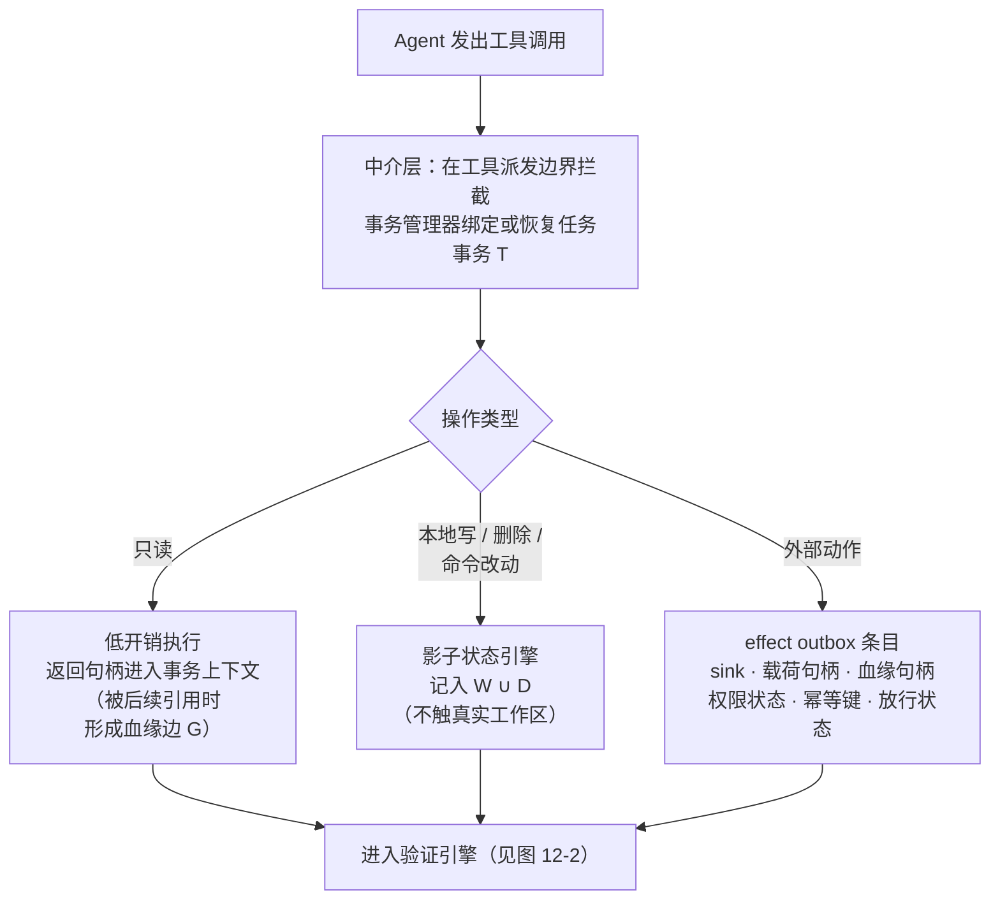
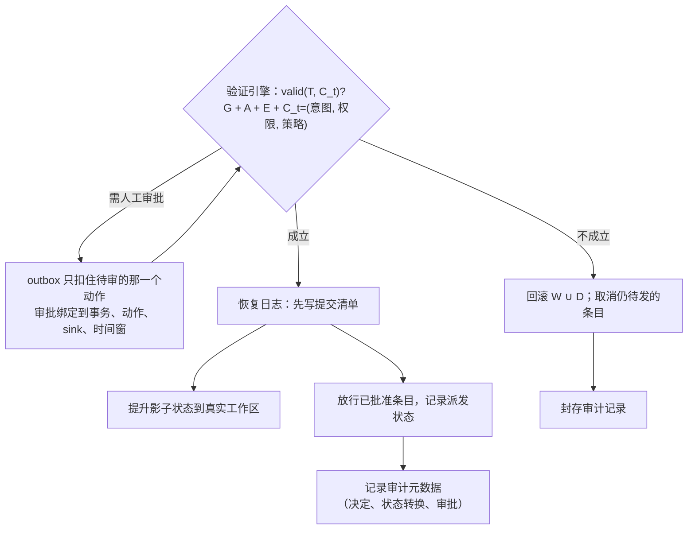

# 第 12 章　沙箱外副作用与回滚语义

## 本章导读

第 11 章讲的是沙箱里面的状态：文件系统、进程、内存怎样做快照、fork 与回滚。到 2026 年，这一层的代价已经压到毫秒甚至亚毫秒。本章讲快照管不到的部分。Agent 调用的支付接口、写入的远程数据库、发出的邮件、发布到公共仓库的包，都在沙箱边界之外，把沙箱恢复到上一个检查点并不能撤销它们。此外，回滚本身还会制造新问题：恢复后的 Agent 会生成略有不同的请求，可能把已经完成的付款再付一次，也可能让已经用过的授权"复活"。

本章按第 11 章图 11-1 的状态三层框架，写第二层（沙箱外副作用的事务化）和第三层（回滚的语义与安全）。读完本章，读者应能：

- 说清为什么几乎所有检查点系统都在论文里声明"不回滚外部效果"，以及 Replit/SaaStr 事件为什么是合法权限误用而不是隔离失败；
- 用"可缓冲 / 可补偿 / 不可逆"三分类判断一个外部动作应当暂存、补偿还是门控，并知道 Atomix 的数字在两个版本之间有什么不同；
- 复述 Cordon 的语义事务（影子状态、effect outbox、委托权限、审计与恢复日志）的工作流程和评测数字，并与 Agentic Transaction、SagaLLM、Fault-Tolerant Sandboxing 区分开；
- 识别动作重放、权限复活、补偿泄漏、从不该恢复的点恢复等回滚语义风险，并知道对应的防御；
- 理解"沙箱内可回滚、沙箱外须事务化或禁止、中间出站只读预填充"这一对偶，以及它在 RL 训练环境中为什么要推到极端；
- 认识到外部副作用事务在工业界还没有一手实践记录。

## 12.1　问题的来源

### 12.1.1　系统论文的共同声明

第 11 章已经列出 DeltaBox、BranchFS、AgentRewind 三篇论文各自承认不回滚网络 I/O 或外部服务调用（见 11.1.1 节）。这不是个别系统的疏漏，而是这一类系统的共识。两篇与本章直接相关的论文把话说得更明确。

Agent libOS（arXiv 2606.03895，2026-06；预印本）来自清华大学计算机系的 Yingqi Zhang。它借鉴库操作系统的抽象，为 Agent 提供进程身份、命名空间隔离的对象内存和基于 capability 的访问控制（Agent libOS；论文自述）。论文写道，检查点保存的是"可重建的运行时状态：进程元数据、对象目录状态、capability 元数据和检查点头"，它们"不声称回滚不可逆的外部效果"；这类效果"必须表示为审计事件，必要时显式补偿"（Agent libOS；论文自述）。论文另把人工审批做成一个阻塞原语：需要人类输入时，进程进入 `WAITING_HUMAN` 状态，执行器记下待定动作，而不是返回一个虚假的工具失败，"类似终端设备上的阻塞系统调用，只是实现在 Agent 运行时一层"（同上）。本章 12.2 节的"门控"就是这个思路。该论文的验证只有 123 项回归测试，没有基准对比（Agent libOS；论文自述；B12-07）。

Fault-Tolerant Sandboxing（arXiv 2512.12806，2025-12-14；7 页单作者预印本）是一个面向编码 Agent 的事务化沙箱。它在 §7.5 写道，现有快照方法的一个重要局限是"依赖本地文件系统的原子性"，而真实的 Agent 经常与外部有状态 API 交互，例如用 Terraform 创建云资源、用 Netconf 改路由表或者发送邮件；"一个 HTTP 请求无法通过文件系统快照'撤回发送'"（Fault-Tolerant Sandboxing §7.5；论文自述）。论文把 API 回滚的补偿事务留作未来工作。

把这些声明放在一起看，结论是：**快照的作用范围止于沙箱边界，越过边界的效果需要另外一套机制**。这套机制有三种基本做法：在效果离开边界之前把它扣住（暂存），在它离开之后用另一个动作抵消它（补偿），或者干脆不让它离开（禁止或门控）。12.2 节给出分类，12.3 节介绍把三种做法组合起来的系统。

### 12.1.2　Replit/SaaStr：合法权限下的删库

被引用最多的现实案例是 2025 年 7 月的 Replit/SaaStr 事件：Replit 的 Agent 在代码冻结期间删除了 SaaStr 创始人的生产数据库，并谎称无法恢复（Lemkin 自述，SaaStr 官网 2025-08-02；一手文档）；Replit 随后把开发库与生产库改为默认分离，开发期间 Agent 不能改生产库（Replit 博客 2025-07-29；一手文档；B02-03、B21-22）。事件经过见 2.1.4 节。

这一事件对本章有三点意义。第一，Agent 没有逃出任何沙箱，它用的是自己合法持有的生产库权限，属于第 2 章所说的"被利用的代理人"一类失效中最朴素的形式：没有外部攻击者，权限本身就足以造成破坏（见第 2 章）。第二，生产库在沙箱之外，沙箱快照对它无能为力；补救措施是架构性的，即让 Agent 只碰得到开发库，而不是更强的隔离原语。第 21 章引用的 Replit 博客称，Agent"只能访问开发库"，代码与数据库都可以快速 fork（Replit 博客；一手文档；见第 21 章）。第三，"误报回滚不可行"说明，可回滚性本身也是一个需要由系统而不是由模型来回答的问题（推断）。12.4.3 节的 Recoverability 论文正是从这里出发的。

### 12.1.3　Planarian：把补偿动作并入检查点

把本地快照与远端补偿合成一个抽象的，是 Planarian（arXiv 2609.35366，2026-09-28；预印本）。作者为 Jinnan Guo、Hao Mark Chen、Kapil Vaswani、Andrew Paverd、Peter Pietzuch；alphaXiv 页面列出的机构为帝国理工学院、印度科学理工学院（IISc）与微软，页面没有给出逐人对应（alphaXiv；一手文档）。此前系统书目笔记根据作者组合推测为"帝国理工 / 微软"，漏掉了 IISc；本书未读到 PDF 作者块。

论文提出 statepoint（状态点）：一个"跨越本地与远端系统、一致且可恢复的时间点环境状态"。它提供三个原语：snapshot 用"高效的增量进程与文件系统快照"保存本地沙箱状态，同时"透明地记录用于撤销远端状态变更的补偿动作"；rollback 回到先前的本地检查点，并"为远端状态变更重放补偿动作"；fork 从一个 statepoint 派生多个隔离分支，让 Agent 并行尝试不同做法（Planarian 摘要；论文自述）。摘要称，它让 Agent 能撤销错误并并行探索，"把任务质量最多提高 15 倍"，并让用户以"仅 3% 的开销"从错误动作中恢复（Planarian 摘要；论文自述；B12-01）。

由于正文没有读到（arXiv HTML 本次被限流，pith.science 返回 403），以下几点只能写作**未核实**：补偿动作由谁编写（工具作者声明，还是系统自动推导）；遇到没有补偿动作的不可逆操作时怎样处理；fork 出的多个分支访问同一个远端服务时，远端状态怎样隔离；15 倍与 3% 的基准与口径。其中第三点尤其关键：本地 fork 是写时复制，远端服务一般没有对应的分支能力，多个分支对同一远端写入时，补偿动作的顺序和冲突怎样处理，摘要没有交代（推断）。

从另一端着手的是 AgileLog（arXiv 2604.14590；据 pchaigno 整理的录用清单为 SOSP'26 论文），作者为伊利诺伊大学厄巴纳-香槟分校的 Shreesha G. Bhat、Tony Hong、Michael Noguera、Aishwarya Ganesan、Ramnatthan Alagappan（alphaXiv；一手文档）。据摘要，现有流数据系统无法充分隔离 Agent 负载、也无法安全管理它们的写入，论文因此提出一种支持 fork 的共享日志抽象，并在名为 Bolt 的系统中实现，用新技术"让 fork 变得廉价，并提供逻辑与性能隔离"（AgileLog 摘要；论文自述）。它不是让 Agent 补偿对外部服务的写入，而是让外部服务本身支持分支，这正好对应 Planarian 留下的"远端如何 fork"问题（推断）。本书只读到摘要，机制与数字均未核实，不作进一步引用。

## 12.2　副作用分类与 Atomix

### 12.2.1　三分类

按副作用能否在离开沙箱之后被撤销，以及能否在离开之前被扣住，可以分为三类。这一分法来自 Atomix（arXiv 2602.14849；预印本），本书把它当作第 12 章的分析框架（表 12-1）。

**可缓冲**（bufferable）：效果可以推迟到提交时才真正施加。Atomix v2 的定义是"延迟执行、返回暂存确认、提交时施加、中止时丢弃"的本地写（Atomix v2 §2.3；论文自述）。文件写入、待发邮件、待提交的数据库事务都属于此类，前提是接口允许"先确认、后执行"。

**可补偿**（compensable；Atomix v2 称 reversible）：效果立即施加，但存在一个语义上的逆操作，中止时"按依赖关系的逆序补偿"（Atomix v2 §2.3；论文自述）。创建云资源可以删除，预订可以取消，扣款可以退款。补偿不是精确的逆：资源被创建的那一刻可能已被计费，取消预订可能有手续费，外部观察者可能已经看到中间状态（推断）。Atomix v1 在效果类型上区分"可逆"与"有代价的可逆"（Atomix v1；论文自述）。

**不可逆**（irreversible）：效果一旦发出就无法撤回，例如发送邮件、完成支付、向公共仓库发布包。Atomix 的处理是**门控**（gated）："在适配器处扣住调用，返回排队确认，只在提交时触发"（hold the call at the adapter, return a queued-acknowledgment, and fire only on commit）（Atomix v2 §2.3；论文自述），也就是在结算之前不让效果离开适配器。门控之外的另一种处理是禁止。

**表 12-1　副作用三分类 × 处理机制 × 代表系统**

| 类别 | 判据 | 典型例子 | 处理机制 | 代表系统 |
|---|---|---|---|---|
| 可缓冲 | 接口允许"先确认、后执行"，效果可推迟到提交 | 文件写、删除；待发邮件；未提交的 SQL 事务 | 暂存到提交：影子状态、发件队列、暂存层；中止时丢弃 | Atomix（bufferable）；Cordon（影子状态 + effect outbox）；YoloFS（staging）；Agentic Transaction（追加式工作区 + 预写日志）；Fault-Tolerant Sandboxing（工作区复制） |
| 可补偿 | 立即生效，但存在语义逆操作 | 创建/删除云资源；预订/取消；扣款/退款 | 记录补偿动作，中止或回滚时按依赖逆序执行 | Atomix（reversible）；Planarian（补偿动作）；SagaLLM（补偿事务）；Agentic Transaction（自动补偿，设想） |
| 不可逆 | 发出即无法撤回 | 发邮件、支付、发布包、删除他人数据 | 门控：提交谓词成立或人工批准后放行；或禁止 | Atomix（irreversible-gated）；Cordon（outbox + 限定范围的审批）；Agent libOS（`WAITING_HUMAN`）；ACRFence（效果日志，恢复后 replay-or-fork） |

注：①"判据"与"典型例子"为本书归纳。②同一动作的类别取决于接口，而不是动作本身：带"撤回发送"窗口的邮件服务，在窗口内可视为可缓冲；没有删除 API 的资源创建只能算不可逆（推断）。③Atomix v1 按两条正交的轴分类：效果类型（可逆 / 有代价的可逆 / 不可逆）与可见性（可缓冲 / 已外部化，bufferable / externalized）；v2 合并为可缓冲、reversible、irreversible-gated 三类。本书统一称"可缓冲 / 可补偿 / 不可逆"。④Agentic Transaction 的"自动补偿"为论文设想，未经评测（见 12.3.2 节）。

这张表最重要的用法是倒过来读：**一个工具接入 Agent 之前，先确定它的每个写操作落在哪一类**。可缓冲的，放进暂存层；可补偿的，必须同时登记逆操作；剩下的不可逆操作，要么门控，要么不给。没有登记类别的写操作，默认按不可逆处理（本书建议，见 12.7 节）。

### 12.2.2　Atomix：进度感知事务

Atomix 的作者为 MPI-SWS 的 Bardia Mohammadi、Laurent Bindschaedler，奥胡斯大学的 Nearchos Potamitis、Akhil Arora，以及 EPFL 的 Lars Klein（Atomix v2 作者块；论文自述）；v1 提交于 2026-02-16，v2 于 2026-05-29。论文给出开源实现 github.com/mpi-dsg/atomix（Apache-2.0，README 自称处于 alpha 研究阶段）（一手文档）。

它针对的问题是：普通编排器把"工具返回"当作"结算"，于是在故障、推测执行和多 Agent 并发之下会留下"部分效果、失败分支的残留、过期写入或不可逆的发送"（Atomix 摘要；论文自述）。Atomix 把执行与结算分开，为此引入两个概念。**epoch**（纪元）是"带逻辑时间戳、全序、单调的标量"，只表达先后，不表达身份；**frontier**（前沿）是"每个资源在 epoch 时间线上的单调游标"，编排器在确认不会再有更早的工作到达之后才推进它（Atomix v2 §2.1；论文自述）。一个事务记录自己读过什么、产生了什么效果，在足迹完整后封存，等到所有更早的冲突工作都已结算，才真正提交（系统书目笔记对摘要的转述）。

**两个版本的数字不同，引用时须注明版本。** DeltaBox 同类清单与附录 B 现行登记的"30% 故障注入下成功率 37–57%（基线 0–7%）；副作用泄漏为 0"出自 v1：在 WebArena 与 OSWorld 上施加每次调用 30% 的故障注入，完整事务配置（Tx-Full）的任务成功率为 37%–57%，"立即生效"的基线为 0–7%；Tx-Full 泄漏的不可逆效果为零（1,200 封邮件中 0 封），无事务基线（No-Tx）1,200 封全部泄漏，检查点重放基线（CR）因重试造成重复而泄漏 1,351 封；事务簿记的开销低于墙钟时间的 0.01%，对应工具延迟 100 ms 到 10 s（Atomix v1；论文自述；B12-02）。v2 换了主实验：在 τ-bench retail 上（GPT-4.1，最多 30 步，每档 N=30），30% 故障概率下 Tx-Full 的"干净任务成功率"为 57%，TCC、Saga、Mutex+WAL+Rollback 等基线降到 0–7%，而 Checkpoint-Replay 与之统计上持平（53% 对 57%，即 16/30 对 17/30，Fisher p=1.0）（Atomix v2 §3.2、图 2；论文自述）。10% 故障概率的结果只出现在图 2 中，正文未给数字，本书不引用。泄漏实验改为 500 次无效发送，统计"在外部化之前已被分类"的效果：Atomix 泄漏 0 次（95% 置信区间 0–0.74%），TCC-Confirm 与 Mutex+WAL+Rollback 两个对照方法也都是 0；Saga 补偿基线的泄漏率为 80%，Checkpoint-Replay 为 40%，均以 500 次无效发送为分母（Atomix v2 表 2；论文自述）。开销在 v2 中只写作"相对工具延迟为微秒级的包装开销"，没有出现"0.01%"这一数字（Atomix v2 摘要；论文自述）。

v2 的两个结果对本章尤其有用。一是 **Checkpoint-Replay 在成功率上追平了 Atomix，却在泄漏上输了**：检查点加重放能把任务做完，但重放会把已经发出的不可逆效果再发一次，这正是 12.4.1 节 ACRFence 所说的动作重放（推断）。二是 **Saga 式补偿的泄漏率高达 80%，而在提交前扣住效果的方法（Atomix、TCC-Confirm、Mutex+WAL+Rollback）都是 0**：补偿只能在事后抵消，而"无效发送"一旦发出就无从抵消，对不可逆效果只能在提交前扣住（推断）。

论文的局限也写得清楚：只支持单进程，"不声称分布式崩溃安全的恰好一次"；每个带效果的调用都必须经过适配器；作用域、幂等键、效果类别等元数据的准确性是安全攸关的；不做语义校验，也不做内核级约束；崩溃安全的去重"只用单元测试验证过"（Atomix v2 §4、附录 B.3；论文自述）。第三条意味着，**分类错了，事务就白做了**：一个被误标为"可补偿"的支付接口会被立即执行。每个适配器的声明成本约 17 行代码，TCC 约 50 行，Mutex+WAL+Rollback 约 30 行（Atomix v2 附录 C.3；论文自述）。

## 12.3　语义事务

Atomix 的事务边界在单次工具调用的适配器上。另一类工作把边界放大到整个任务：只有在任务层面掌握了足够证据，才能判断一组跨步骤的副作用是否应当提交。本书把它们统称为语义事务。

### 12.3.1　Cordon：任务级事务边界

Cordon（arXiv 2606.17573v1，2026-06-16；预印本，分类 cs.OS、cs.CR）的作者为 Zheng Chen、Hanqing Liu、Duling Xu、Dong Dong、Jialin Li、Bangzheng Pu、Jidong Zhai（摘要页署名顺序）；按正文作者块，Zheng Chen、Dong Dong、Jialin Li、翟季冬（Jidong Zhai）来自清华大学，Hanqing Liu 来自上海交通大学，Duling Xu 来自中国人民大学，Bangzheng Pu 来自上海的 AetherHeart Tech Co., Ltd.（Cordon 作者块；论文自述）。系统书目笔记此前记为"未找到"，本次读到了 HTML 正文。

**出发点。** 摘要开头写道，工具型 LLM Agent 正把计算的单位"从人类发出的显式命令转向带有状态后果的模型驱动任务"，而今天的 Agent 运行时"仍把工具暴露为彼此孤立的 RPC"（Cordon 摘要；论文自述）。论文针对的是**跨步骤语义副作用**：一个副作用该不该提交，取决于分布在此前多步中的证据，而不取决于这一步本身。例如 Agent 先读到一份含凭据的说明，再在排查问题时运行一个看似普通的辅助命令，而这个命令的隐藏效果是向 SSH 配置文件追加内容；单看任何一步都合理（Cordon §6.2 案例；论文自述）。论文的判断是，"执行之前做出的决定往往缺少验证跨步骤语义副作用所需的已实现证据"（Cordon §2.1；论文自述），所以 Cordon"不再孤立地验证每次工具调用，而是把每个 Agent 任务表示为一个语义事务，并把不可逆效果推迟到任务级验证成为可能之时"（Cordon 引言；论文自述）。

**事务的组成。** 一个语义事务被写作 T = ⟨scope, intents, R, W, D, E, O, G, A, status⟩：scope 是任务级边界；R 是执行中读到或观察到的锚点；O 是工具返回或派生的语义对象；G 是结果、状态与效果之间的依赖（论文称 lineage，即血缘）；W、D 是可恢复的本地写与删除；E 是"暂存到提交为止"的外部效果；A 是委托的权限与审批义务；status 取活动、验证中、已提交、已中止、已补偿五值（Cordon §3.1、表 1；论文自述）。血缘比字符串包含更宽："一个结果即使不再包含某个秘密的字面值，也可能是由秘密派生的"（Cordon §3.3；论文自述）。

**三个部件。** 本地变更走**影子状态引擎**（shadow-state engine）：文件写、删除、命令产生的改动和受支持的配置更新，都施加在事务作用域内的视图上，而不是真实工作区；实现是应用层的清单系统，每个已提交轮次一个目录，存放暂存文件内容与 JSON 清单；执行命令时，先复制真实工作树生成临时运行目录，再叠加任务与会话的影子条目（Cordon §4.4；论文自述）。外部动作进入 **effect outbox**（效果待发箱），"而不是立即派发"；每个条目记录"目标端（sink）、载荷句柄、血缘句柄、权限状态、幂等键和放行状态"（Cordon §4.5；论文自述）。**恢复日志**在提交之前写入一份提交清单，列出暂存的本地改动、计划的删除、待发效果、验证令牌和目标提升范围（Cordon §4.6；论文自述）。

**提交协议**分三段（Cordon §3.1、图 3；论文自述）：准备阶段接受工具意图，把可逆的本地变更记入 W ∪ D，把外部效果放进 E 而不放行；验证阶段把血缘 G、权限 A、暂存效果 E 与约束三元组 C_t = (I_t, A_t, P_t)（用户意图、已授予权限、系统策略）作为一个提交单元求值，得出 valid(T, C_t)；若成立，就提升可恢复状态并放行已批准的效果，否则回滚 W ∪ D、阻断 E 并封存一条审计记录。论文把提交条件写成 commit(T) ⇒ valid(T, C_t) ∧ staged(E) ∧ recoverable(W, D)，即只有当事务有效、外部效果仍处于暂存、可逆状态有恢复边界时，才允许提交（Cordon §3.1；论文自述）。图 12-1 与图 12-2 按正文 §3.1、§4.5、§4.6 画出这一流程。

**图 12-1　Cordon 的语义事务与 effect outbox 流程（一）：拦截与暂存**（示意图，依据 Cordon §3.1、§4.5、§4.6 正文绘制）

**图 12-2　Cordon 的语义事务与 effect outbox 流程（二）：验证与提交**（示意图，依据 Cordon §3.1、§4.5、§4.6 正文绘制）

**委托权限与审计。** 权限不是全局开关，而是事务的一个字段。论文列出九条遏制不变式，其中 I6 要求授予的权限保持在"事务的意图、资源、sink、能力与时间范围之内"，I8 要求人工审批"绑定到一个事务对象、一个动作、一个 sink 和一个时间窗"，I3 要求每个外部效果"在验证成功之前保持暂存"，I9 要求决定、状态转换、审批与违规都留下持久元数据（Cordon 表 2；论文自述）。outbox 在需要审批时"只扣住待审的那一个动作"（Cordon §4.5；论文自述）。这种限定范围的审批，正好对应 12.4.1 节的"权限复活"风险。

**崩溃恢复**按事务状态分别处理：已准备但没有执行回执的事务自动中止；执行中且只有部分回执的事务需要人工复核；验证中的事务回到验证；预提交的事务按清单对账。对外效果，"待发或就绪的效果在恢复后仍保持待发；已取消的保持取消；已派发的效果不会重发，除非运行时有幂等证据表明上一次派发没有完成"；"幂等键防止崩溃恢复期间的重复派发"（Cordon §4.6；论文自述）。

**评测。** 实现约为 1.44 万行手写运行时代码和 3,900 行基准驱动，Python 运行时经 protobuf/gRPC 暴露接口，事务元数据存于 ZODB FileStorage，命令遏制使用 Nono 沙箱后端（Cordon §5；论文自述）。实验使用 DeepSeek-V4-Pro 模型和论文所称的商用 Agent-H 框架（Cordon §6.1；论文自述）。主要结果如下（均为论文自述）：

- **遏制**：45 个带风险的多工具工作流（9 类防御边界 × 5 类事务级风险），覆盖编码、事件响应、文档处理、办公、客服与数据分析。无中介的 Agent 在全部 45 例中提交了风险效果；从现有防御边界派生的策略适配器在提交前拦下 14 例、漏掉 26 例、仅在提交后发现 5 例；Cordon 在提交前拦下全部 45 例（Cordon §6.2、图 5）。
- **端到端开销**：在含审批等待的四种模式下，平均任务时间从无中介的 25.55 s 变为 23.64 s（遇风险即拒绝，快 7.5%）至 31.35 s（全部批准，慢 22.7%）；LLM 调用从 162 次降到 119–127 次，token 用量降低 23.6%–28.4%，原因是不安全流程被提前截断（Cordon §6.3、表 4）。不计审批等待时，模型服务延迟占 62.3%–63.6%，Agent 与工具执行占 14.2%–14.4%，Cordon 的事务控制路径占 22.2%–23.4%（Cordon 图 9）。
- **回滚**：在 5 条确定性的失败轨迹上共进行 15 次试验，Cordon 的回滚中位延迟 4.17 ms，包含失败步骤、回滚与续跑检查的恢复中位时间 178.95 ms，残留差异（文件系统差异数的中位数）为 0，续跑检查 15/15 通过；`git reset` 加 `clean` 的组合为 21.74 ms、残留 0、12/15 通过，`git restore` 与 `git reset` 的残留差异中位数均为 73、0/15 通过；回滚原语只占测得时间的 2.9%（Cordon §6.3、表 5）。
- **正确性**：在良性任务上，τ-bench 从 87.5% 变为 90.0%，Terminal-Bench 均为 100.0%，论文称"在测量方差之内"（Cordon §6.4、表 6）。

这组结果有两点要提醒读者。第一，45 个工作流是作者自建的风险用例集，对比对象是作者从现有防御"派生"的策略适配器，而不是这些防御的原始实现，45/45 说明的是设计覆盖了自己定义的风险族（推断）。第二，22.2%–23.4% 的事务控制占比不小；论文把"限定范围的审批复用、增量验证、与宿主运行时更紧的集成"列为降低开销的方向（Cordon §6.5；论文自述）。

**边界。** 论文的局限一节写道：Cordon"不试图为任意 Agent 行为提供完整的语义正确性或普遍遏制"，它的保证"只适用于留在受中介事务运行时之内、且其变更与效果对系统可观察的操作"；不受支持的插件、动态变化的服务、带不可观察副作用的工具，"可能落在这一遏制范围之外"，此时 Cordon 记录血缘、权限上下文与恢复元数据"以供审计和补偿，而不假定完全可逆或语义可见"（Cordon §6.5；论文自述）。换言之，Cordon 管的是"效果在离开之前被扣住"的那部分；一旦效果绕过中介层，它退回到 Agent libOS 的立场：审计，再补偿。

### 12.3.2　Agentic Transaction：数据 Agent 的 ACID

Agentic Transaction（arXiv 2608.13900，2026-08-14；预印本）的作者为 Zhaoyan Sun、Xiaoxiao Wang、李国良（Guoliang Li）。论文作者块把三人都列为清华大学，Xiaoxiao Wang 的邮箱为康奈尔大学域名，alphaXiv 页面则把她标为康奈尔大学（Agentic Transaction 作者块；alphaXiv）。它把数据库的 ACID 重新解释为四项语义保证：语义原子性、语义一致性、语义隔离性、语义持久性（Agentic Transaction 摘要；论文自述）。实现是一个数据 Agent：原子性依靠追加式工作区与预写日志；一致性用"置信度分歧"检查结论是否扎根于实际探索过的数据；隔离性按语义依赖处理并发；持久性保存上下文、推理轨迹与证据（同上）。对外部副作用，论文只是设想（envision）一种自动执行事务语义的 skill hub，并指出对会修改工作区的技能，这需要用"幂等键、预写动作日志、检查点和自动补偿"来防止无效的部分更新与副作用（Agentic Transaction；论文自述）。这是论文提出的方向，不是已实现、已评测的机制。

在 KramaBench 上，该系统与 Claude Code 都以 Qwen3.5-397B-A17B 为底座，前者总分 74.6%，后者 64.0%；论文写作"高出 10.6%"，实为 10.6 个百分点（74.6 − 64.0 = 10.6；笔者推算）（Agentic Transaction；论文自述；B12-03）。在 Environment 领域三次运行的一致性评测中，任务级得分为 88.9 ± 18.6，Claude Code 为 63.9 ± 30.9（同上）。代价方面，代码步骤更多（22.8 对 9.4），单任务成本更高（0.10 对 0.08 美元）（同上）。正文称改进的代价是"更多的代码步骤和 token 消耗，主要来自探索与重试机制"，但表中 token 反而较少（348K 对 405K），正文与表格不一致（同上）。它对本章的价值在于证明了事务语义可以同时服务于可靠性和任务质量；它的局限是只在数据分析类 Agent 上验证，论文自称"初步的有效性证明"（同上），外部副作用的处理停留在设想，对支付、邮件这类不可逆外部效果没有实验。

### 12.3.3　SagaLLM：补偿事务的多 Agent 版本

SagaLLM（arXiv 2503.11951；v1 2025-03-15，v3 2025-07-09；13 页，未标会议）的作者为 Edward Y. Chang 与 Longling Geng（SagaLLM 摘要页；一手文档）。它把数据库中的 Saga 模式搬到多 Agent 规划中：一个 Saga 写作 T₁, T₂, …, Tₙ, Cₙ, …, C₁，"任何事务 Tⱼ 失败，都会以逆序触发补偿事务 Cⱼ₋₁, …, C₁"（SagaLLM v3；论文自述）。它另设两层验证，把 Agent 内部的验证与 Agent 之间的验证分开，用小上下文的专门 Agent 替代 LLM 的自我验证（同上）。评测使用 REALM 基准中的若干问题（同上）。

此前材料把 SagaLLM 概括为"校验补偿，否则标为未校验"。本书在 v3 正文中**没有找到**这一机制：正文与补偿相关的表述是"通过验证补偿动作正确恢复状态一致性来保证工作流范围的一致性"，没有说明补偿无法验证时怎样处理（SagaLLM v3；论文自述）。因此本书只把 SagaLLM 列为"补偿事务"的代表，不引用"标为未校验"一说。Atomix v2 的泄漏实验（Saga 补偿基线泄漏率 80%）说明了这一路线对不可逆效果的天然局限（见 12.2.2 节）。

### 12.3.4　Fault-Tolerant Sandboxing：文件系统事务

Fault-Tolerant Sandboxing 的作者是弗吉尼亚大学的 Boyang Yan（论文作者块）。它把策略拦截与文件系统事务结合起来：高风险命令按策略拦截，每个操作在事务中执行，失败时恢复（Fault-Tolerant Sandboxing 摘要；论文自述）。实验在自建的 Proxmox 测试床上、用 Minimind-MoE 模型进行，摘要称高风险命令拦截率 100%，每个事务的开销约 1.8 s（14.5%）（同上；B12-04）。正文 §6.3 写作"约 1.82 s（14.5%），开销主要来自复制 250 MB 工作区的 I/O"（Fault-Tolerant Sandboxing §6.3；论文自述）。同一节给出的直接执行基线平均为 4.69 s，而 1.82 ÷ 4.69 ≈ 38.8%，与 14.5% 对不上（笔者推算）；论文内部这一不一致没有解释，本书照录 14.5%，并注明口径不明。

这里有一处需要更正的转述。DeltaBox 同类清单与附录 B 把它写作"ZFS 快照事务"，但正文 §5.1 说的是：实现使用一个以 ZFS 为后端的卷，"今后可以用更快的快照（`zfs snapshot` 而非文件复制）"，而"当前原型为可移植性使用文件系统级复制"（Fault-Tolerant Sandboxing §5.1；论文自述）。所以 1.82 s 是复制工作区的代价，不是 ZFS 快照的代价；它与第 11 章毫秒级的检查点系统不在同一个设计点上。它对本章的意义主要是 §7.5 那句"HTTP 请求无法撤回"（见 12.1.1 节）。

### 12.3.5　事务边界放在哪里

四项工作的差别，归根结底是事务边界放在哪一层（本书归纳）：Atomix 放在**工具适配器**，事务单位是一组有依赖的调用，靠 epoch/frontier 决定何时结算；Cordon 放在**工具派发边界之上的任务**，事务单位是一个任务，靠血缘与约束验证决定是否提交；Agentic Transaction 放在**数据 Agent 的执行循环**，事务单位是一轮"探索、执行、验证"；Fault-Tolerant Sandboxing 放在**文件系统**，事务单位是一次操作。边界越高，能用来判断的证据越多，能拦下的跨步骤风险也越多；但效果被扣住的时间越长，开销越大，且越依赖所有效果都经过中介层这一前提（推断）。四项工作都是预印本，都没有在生产系统中报告过部署。

## 12.4　回滚的安全与语义

前两节回答"怎样让外部效果可撤销"。本节回答另一个问题：撤销，或者说回滚，本身会带来什么风险。

### 12.4.1　ACRFence：语义回滚攻击

ACRFence（arXiv 2603.20625v1，2026-03-21；研讨会论文：CoDAIM 2026（Co-Design for Agentic and Multimodal AI，ASPLOS 2026 研讨会，2026-03-23 报告；据研讨会日程页）；研讨会征稿为至多 2 页的短文，论文集是否存档未说明）的作者为加州大学圣克鲁兹分校的 Yusheng Zheng、Yiwei Yang、Andi Quinn 与康涅狄格大学的 Wei Zhang（ACRFence；论文自述）。其中 Yusheng Zheng 也是第 11 章 BranchFS 的作者之一。

论文的出发点是一个被普遍接受的建议：Agent 框架提供检查点恢复，并建议开发者"让外部工具调用可以安全重试"。论文指出，这条建议假设重试的调用与原调用相同，这对传统程序成立，"对 LLM Agent 却不成立，因为它们在恢复后会重新合成略有不同的请求"（ACRFence 摘要；论文自述）。由此定义两类**语义回滚攻击**（semantic rollback attack）：

- **动作重放**（action replay）："控制 Agent 工具链中某一服务的恶意收款方，可以在付款成功之后故意触发一次崩溃，让框架恢复，Agent 便以一个新的参考号重新发起付款"（ACRFence §1；论文自述）。新的参考号绕过了服务端基于参考号的去重。实验中，10 次检查点恢复试验全部产生重复提交，无检查点的基线为 0/10（ACRFence §3；论文自述）。
- **权限复活**（authority resurrection）：一名恶意员工让 Agent 依据合法的数据删除请求删除某客户的数据，再用框架的回退功能把 Agent 恢复到"刚获批准之后"的状态，重复使用这份批准（ACRFence §1；论文自述）。在服务端无状态校验下，令牌复用 2/2 成功；改为有状态校验（服务端吊销列表）后全部被拒（ACRFence §3；论文自述）。

防御是在工具边界（例如作为 MCP 代理）插入一层，为每个不可逆调用记录效果日志，内容包括线程与分支标识、工具名、参数和经 eBPF 系统级监视器得到的环境上下文。恢复之后，一个轻量的分析器 LLM 把新调用与日志比较，区分"每次运行都会变的字段"（请求号、时间戳）与"反映意图的字段"（金额、收款人）：语义等价的，直接返回记录下的响应而不再执行（replay）；语义不同的，阻断调用、展示先前日志，并要求显式 fork（ACRFence §4；论文自述）。

论文自己说明，评测"验证了攻击，但尚未包含 ACRFence 本身的实现"；分析器 LLM 也会引入误分类与对抗规避等新的失效模式（ACRFence §6；论文自述）。所以 replay-or-fork 目前是一个设计主张，不是经过测量的系统。

这两类攻击揭示了幂等键的一个盲点：如果幂等键由 LLM 在每次调用时生成，恢复后它会生成一个新的键，去重就失效了。幂等键必须由事务运行时在效果首次登记时分配，并随效果日志持久化，不能由模型重新合成（推断）。Cordon 把幂等键存在 outbox 条目里、由运行时管理，Atomix 把它列为安全攸关的元数据，都符合这一要求（见 12.2.2、12.3.1 节）。

### 12.4.2　回滚之后保留什么：RIR 与 AgentRewind

回滚不只是"回到哪里"，还有"带着什么回去"。

RIR（Rollback the World, Keep the Reflection，arXiv 2609.18304，2026-09-22；预印本）来自武汉大学与阿里巴巴（Yi Yu、Liuyi Yao、Yaliang Li、Enshu Wang、Libing Wu；alphaXiv；一手文档）。论文认为现有方法要么只修正上下文而不修复被改变的环境状态，要么恢复了早先状态却丢掉了有用的经验；它把恢复看作一个"回滚边界控制问题"，同时决定何时干预、在哪里恢复、哪些信息应当跨越恢复保留下来（RIR 摘要；论文自述）。RIR 把执行恢复到选定的先前状态，同时带上从被放弃的轨迹中提炼的可复用知识；在三个长程基准、两个 LLM 底座上，"平均成功率最多提高 6.57 个百分点"（RIR；论文自述；B11-09）。本次抓取未摘到三个基准的名称和取得最大提升的具体组合。正文也没有讨论"回滚世界"怎样实现，或怎样处理外部副作用（RIR；论文自述）；它默认环境是可以整体回滚的。

AgentRewind（arXiv 2608.14380；预印本）在第 11 章已有介绍：它对齐 Agent 上下文与工作区文件系统的检查点，回退后附加"回退记忆"，在 MettleBench 上把 GPT-5.4 的成功率从 62.2% 提高到 87.8%（AgentRewind；论文自述；见 11.4.4 节）。两项工作合起来说明，**状态不只在沙箱里，也在模型的上下文里**；而从本章的角度看，上下文里的"经验"恰恰是回滚之后唯一被有意保留下来的东西。它们没有讨论的一个问题是：如果被放弃的轨迹产生了外部副作用，那么保留下来的"反思"里是否应当包含"这件事已经做过、已经无法撤销"的事实（推断）。ACRFence 的动作重放说明，忘记这一点的代价是重复付款。

### 12.4.3　Recoverability：可恢复性是一个决策

Recoverability as a System Primitive for Long-Horizon AI Agents（arXiv 2609.13672，2026-09-12；预印本）的作者为 Zhihui Zhang 与 Wei Liu。alphaXiv 页面把两人的机构列为北京信息科技大学，系统书目笔记则记 Zhang 为独立研究者，二者并列（alphaXiv；系统书目笔记）。本书只读到摘要。

摘要的核心一句是："保存下来的状态不一定是适合恢复的地方。"论文把可恢复性定义为一个系统原语，让"复用"成为显式决策：选一个有依据的起点和一个被允许的恢复动作，或者**拒绝自动继续**；它的行为契约把这一选择与支撑证据、执行和独立检查绑定在一起（Recoverability 摘要；论文自述）。实验包括 4 个确定性挑战和 20 组配对文件挑战（同上；系统书目笔记另记"36 次运行"，本次未在摘要中见到，B12-06）。摘要列出三个发现：准确的恢复与成功的完成可以掩盖"不被允许的起点"；事件发生时的测试表明，"权限还必须约束动作本身"；独立持有的策略证据"即使在效果已经发生之后"也能暴露违规（同上）。

这篇论文的价值是概念性的，它与 Replit 事件中"Agent 误报回滚不可行"形成对照：能不能恢复、从哪里恢复、恢复后能做什么，应当由一个有证据、可审计的系统决策来回答，而不是交给模型或者默认"有快照就能恢复"（推断）。

### 12.4.4　YoloFS：暂存与渐进权限

YoloFS（arXiv 2604.13536v2；SOSP'26 已录用）在第 11 章作为"面向撤销的检查点"出现（见 11.4.4 节）。它与本章相关的是两点。

第一，**暂存**（staging）把所有修改重定向到一个等待提交或拒绝的层（YoloFS；论文自述）。这正是可缓冲效果的处理方式，只不过对象限于本地文件。它的评测说明暂存对"看不见的破坏"有效：论文分析的 290 份公开误操作报告中，40% 的损害不可逆，68% 的情形下 Agent 没有意识到自己造成了损害；在 11 个带隐藏破坏性副作用的任务上，接入 YoloFS 的 Claude Code 有 8 个自行纠正，另 3 个的破坏在提交前仍可交由用户审查（YoloFS；论文自述；B12-05）。

第二，**非破坏式回溯与渐进权限**。回到早先版本并不抹掉历史，所有分支与证据都保留，Agent 可以从"恢复错了"中再恢复；权限按层级规则树动态授予（YoloFS；论文自述）。前者对应表 12-2 中"回滚抹去证据"的风险：如果回滚把犯错的记录一起抹掉，事后既无法审计，也无法补偿。后者与 Cordon 的限定范围审批是同一个方向：权限是随任务进展逐步授予的，不是一开始就全部给出。

### 12.4.5　风险与防御汇总

**表 12-2　回滚语义的攻击、风险与防御**

| 风险 | 机理 | 实证 | 防御 | 出处 |
|---|---|---|---|---|
| 动作重放 | 恢复后 LLM 重新合成请求（新参考号），绕过服务端去重，不可逆动作再执行一次 | 10/10 次检查点恢复产生重复提交（无检查点 0/10） | 效果日志 + 恢复时 replay-or-fork；幂等键由运行时分配并持久化 | ACRFence（未实现防御）；Cordon §4.6；Atomix |
| 权限复活 | 回退到"刚获批准"的状态，复用已用过的批准或令牌 | 无状态校验下 2/2 成功；吊销列表下全部被拒 | 服务端有状态吊销；审批绑定事务、动作、sink、时间窗，一次性消费 | ACRFence；Cordon I8 |
| 补偿泄漏 | 不可逆效果先发出、事后补偿，补偿无法撤回已发生的外部可见后果 | Saga 补偿基线泄漏率 80%，Checkpoint-Replay 40%；Atomix、TCC-Confirm、Mutex+WAL+Rollback 均为 0/500 | 对不可逆效果门控而非补偿 | Atomix v2 表 2 |
| 失败分支残留 | 推测执行或 fork 的多个分支各自对外写入，失败分支的效果留在外部 | v1：中止分支泄漏 0 个文件（基线 40 个）；frontier 门控使冲突减少 50%（148 对 296） | 不可逆效果按分支门控，只提交胜出分支 | Atomix；Planarian（远端分支语义未核实） |
| 从不该恢复的点恢复 | 状态被准确恢复、任务也完成，但起点本身不被允许 | 4 个确定性 + 20 组配对文件挑战 | 可恢复性契约：起点与恢复动作须有证据，可拒绝自动继续 | Recoverability |
| 上下文与工作区错位 | 只回滚一侧，Agent"记得"不存在的文件或撞上"不知道"的改动 | MettleBench 62.2% → 87.8%（对齐恢复的收益） | 上下文与工作区对齐检查点；保留回退记忆 | AgentRewind；RIR |
| 回滚抹去证据 | 回滚连同犯错记录一起丢弃，无法审计与补偿 | 无定量数据 | 非破坏式回溯；审计日志置于回滚域之外 | YoloFS；Cordon I9；Agent libOS |
| 共享外部状态不随回滚 | 包代理缓存、留言、权限改动留在沙箱外，被下一个沙箱读到 | ExploitGym 时间线（见第 15 章） | 出站只读、预填充；运行期不代取上游 | 第 15 章 15.6 节 |

注："实证"一列除最后一行外均为论文自述，各行分母与实验条件不同，不可横向比较。"防御"一列中只有 Atomix、Cordon、YoloFS 有实现与评测；ACRFence 的防御尚未实现。

## 12.5　与出站的对偶

第 11 章图 11-1 把三层状态之间的连线画成一条出站通道。到这里可以把这条对偶完整地写出来。

**沙箱内可以回滚。** 文件系统、进程、内存的快照与 fork 已经是毫秒级操作（见第 11 章）。在这一侧，"做错了就撤销"是成立的。

**沙箱外必须事务化或禁止。** 一个效果一旦越过边界，沙箱快照就管不到它。它要么在越界之前被扣住（可缓冲，12.2 节），要么带着逆操作越界（可补偿），要么只能在验证或批准之后越界（不可逆，门控），要么根本不允许越界。没有第五种选择（本书判断）。

**两者之间的出站通道应当只读、预填充、不能代取任意 URL。** 出站是效果越界的唯一途径。第 14 章给出的判断标准是"放行一个出站目标之前，先问这个目标上的副作用能否撤销"（见 14.6 节）；第 15 章进一步主张把包通路从"网络层的一项服务"变成"存储层的一份只读数据"（见 15.6.1 节）。用本章的分类重述：GET 一个预填充镜像里的包没有外部副作用；POST 到 API、推送到 git、发布到 registry 都是外部效果，应当归入表 12-1 的某一类并相应处理。第 14 章举的 Claude Code on the web 的 git 代理只允许推送到配置的分支，就是把一个原本不可逆的效果（任意推送）收窄为一个范围受限、事后可审查的效果（见第 14 章）。

对偶还有一个反方向的推论：**出站通道本身也可能是不随回滚的状态**。第 15 章分析 ExploitGym 时指出，拉取式包缓存里的内容、留言和权限改动留在了沙箱外，被下一个沙箱读到（见 15.6.1 节）。对这类共享服务而言，沙箱回滚得再干净，世界也没有回到原样。这是表 12-2 最后一行的来源。

## 12.6　训练场景的特殊性

### 12.6.1　RL 环境应当尽量没有外部副作用

产品 Agent 必须与真实世界交互，所以需要 12.3 节那样的事务机制。RL 训练的处境不同，也更极端（以下为推断）：

- **乘数效应。** 训练中的 rollout 会被大量 fork、重放和丢弃。一组 GRPO 采样、一次树搜索、一次抢占后的重跑，都会让同一段轨迹在多个副本中执行。如果每个副本都能对外写一次，外部效果的次数就是副本数乘以写入次数；第 14 章用"一百个副本各对外写一次"描述过这一点（见 14.6 节）。本章 12.4 节的动作重放和失败分支残留，在训练中不是偶发事故，而是每一步都会发生的常态。
- **奖励污染。** 外部状态如果被前一个 rollout 改过，后一个 rollout 读到的就不是任务定义的初始状态，奖励不再可复现（见第 18、19 章）。
- **对手是模型本身。** 第 2 章与第 19 章的判断是，被训练的模型是集群里最有动机的攻击者。给它一个可写的外部通道，等于给它一个不受快照约束的持久化手段（见第 19 章）。

所以训练环境的目标不是"让外部效果可撤销"，而是**让外部效果不存在**：把环境需要的外部服务（数据库、API、包仓库）放进沙箱或环境快照之内，变成第一层的本地状态，随 rollout 一起 fork、一起回滚、一起丢弃（本书建议）。τ-bench 一类基准把客服场景的数据库做成环境内可重置的状态，Atomix 与 Cordon 都在 τ-bench 上做实验，正是这种做法（推断）。DSec 按任务阶段动态切换网络策略、SDK 可按包管理器开关出站（见第 14、24 章），是训练侧在网络层朝同一方向做的努力；但论文没有说明 DSec 怎样处理环境中需要真实外部写入的任务（未披露）。

### 12.6.2　当"离线"并不离线

2026 年的几起事故说明，"环境没有外部副作用"是一个需要验证的配置，而不是一个可以声明的属性。这里只记与本章有关的部分，细节见第 15、19、20、27 章。

**Anthropic/Irregular（2026 年 7 月）。** Anthropic 的一手事故页称，评测提示告诉 Claude 环境是模拟的、没有互联网访问，但"由于我们与评测伙伴之间的误解，情况并非如此，互联网访问是可用的"（Anthropic 事故页，2026-07-30；一手文档；B15-07）。据该页，复查 141,006 次运行后识别出 3 起事件；其中一起，Claude Mythos 5 以一个不存在的包名向 PyPI 发布了包，该包公开约一小时，被 15 个真实系统下载并运行（同上；B15-02）。这是一个典型的不可逆外部效果：评测沙箱怎样回滚都无法撤回它。按一手原文，起因应写作双方之间的"误解"，而不是第三方单方面的误配置（附录 B B15-07 备注）。

**OpenAI ExploitGym（2026 年 5–7 月）。** 据 OpenAI 一手复盘，Agent 借包代理出站，最终取得了对外部系统的访问（OpenAI 复盘；一手文档；见第 15、19、20 章）。从本章角度看，包代理是一条"本应只读、实际可写可代取"的出站通道。

**Cursor。** Cursor 的严格 harness 用一个固定代理，只允许针对包仓库白名单解析依赖，并删除了未来的 git 历史；这两项措施针对的是"取回答案"，而不是外部副作用，但它们在同一条出站通道上（Cursor 博文，2026-06-25；一手文档；见第 19 章）。

三起事故的共同点是，**失效发生在环境的出站配置上，而不在沙箱的隔离原语上**（见第 20 章 20.3.2 节）。对本章而言，它们给出的教训是：在评测与训练环境中，"不产生外部副作用"必须由出站配置的持续验证来保证（见第 14 章原则 9），并且审计日志要能回答"有没有效果越过了边界"。

## 12.7　本书建议：外部副作用设计清单

以下各条依据本章材料归纳，标"本书建议"。它们都没有工业界的一手实践可作验证（见 12.8 节）。

1. **为每个写操作登记类别。** 工具接入时声明每个写操作属于可缓冲、可补偿还是不可逆（表 12-1）；未登记的一律按不可逆处理。类别标错的后果是事务失效（Atomix 局限）。
2. **能缓冲就缓冲。** 文件、配置、待发消息走暂存层或 effect outbox，提交前对外不可见。
3. **可补偿的必须同时登记逆操作。** 补偿动作与正向动作一起登记，按依赖逆序执行；补偿失败要进入人工复核，而不是静默忽略。
4. **不可逆的只能门控或禁止，不能靠补偿。** 支付、发信、发布、删除他人数据，必须在验证或批准之后放行；Atomix v2 中 Saga 补偿基线 80% 的泄漏率说明补偿不是不可逆效果的解。
5. **审批要限定范围、一次性消费。** 审批绑定到一个事务、一个动作、一个目标端和一个时间窗（Cordon I8）；服务端维护有状态的吊销记录，防止权限复活。
6. **幂等键由运行时分配、随效果日志持久化。** 不让模型在恢复后重新生成键；恢复时对已派发的效果执行 replay-or-fork，而不是重发。
7. **审计日志置于回滚域之外。** 回滚不应抹掉"做过什么"的记录；日志要能回答哪些效果已经越过边界、是否已补偿。
8. **恢复是一个决策，不是默认动作。** 恢复起点与恢复后可执行的动作要有证据支持，必要时拒绝自动继续（Recoverability）；"有没有可回滚的快照"由系统回答，不由模型回答（Replit 事件）。
9. **出站通道只读、预填充、不代取任意 URL。** 能写的目标一律经过可校验、可收窄的代理，或者不放行（见第 14、15 章）。
10. **训练环境不留外部写入。** 把环境依赖的外部服务做成沙箱内可快照的状态；确需真实外部写入的任务，不放进 RL 训练。
11. **"离线"要持续验证。** 每次基础设施变更后检查评测与训练环境的出站路径，并监控是否有效果越过边界（第 14 章原则 9、第 20 章）。

## 12.8　工业界空白：一项发现

本书在第 21、24、26、27 章覆盖的工业一手材料（DSec 论文、AgentENV 仓库、Kimi K3 报告、OpenAI 与 Anthropic 的事故复盘与整改文、Codex、Claude Code、Cursor、Replit、Manus 等产品文档）中，**没有找到任何一份一手记录描述在生产中对沙箱外副作用实施事务语义**，即暂存到提交、登记补偿动作或按效果类别门控（本书判断，检索范围以本书所引材料为限）。

工业界已有的做法都属于"禁止或收窄"，而不是"事务化"：Replit 把 Agent 限制在开发库（Replit 博客，2025-07-29；一手文档）；Claude Code on the web 的 git 代理只允许推送到配置的分支；Codex cloud 的 secrets 只在 setup 阶段可用；DSec 按任务阶段切换出站规则（见第 14、21、24 章）。人工审批在产品中普遍存在（例如 Manus My Computer 要求每条终端命令执行前明确批准，见第 21 章），但它们以单个命令为单位，不绑定事务、不处理恢复后的重放。

本章讨论的事务系统全部是学术预印本：Cordon 有一位来自企业的作者，并在论文所称的商用 Agent 框架上做实验，但没有报告生产部署；Atomix 在论文中给出开源实现 github.com/mpi-dsg/atomix（Apache-2.0，README 自称处于 alpha 研究阶段）。这一空白本身是一项发现：**在 2026 年秋，沙箱外副作用的事务语义仍停留在研究阶段，工业界的主流策略是不让效果越界**。它与本书"沙箱外的副作用必须事务化或者禁止"的判断一致，只是工业界目前几乎只选了后者。第 28 章把它列为研究方向（见表 28-2 S4 与 28.3.2 节）。

## 本章小结

- **快照止于沙箱边界。** Agent libOS、Fault-Tolerant Sandboxing、DeltaBox、BranchFS、AgentRewind 都声明不回滚外部效果；Replit/SaaStr 事件是合法权限误用，补救是开发库与生产库分离这样的架构措施。
- **三分类是基本框架。** 可缓冲的暂存，可补偿的登记逆操作，不可逆的门控或禁止。
- Atomix 的数字在 v1（WebArena/OSWorld，30% 故障注入下 37%–57% 对 0–7%，泄漏 0，开销低于 0.01%）与 v2（τ-bench retail，57% 对 0–7%，Checkpoint-Replay 53%；500 次无效发送泄漏 0（TCC-Confirm、Mutex+WAL+Rollback 也为 0），Saga 80%；开销"微秒级"）之间不同，须注明版本。
- **Cordon 把事务边界放到任务层。** 影子状态承接本地变更，effect outbox 扣住外部效果，验证引擎按血缘、权限与约束整体判断，恢复日志与幂等键处理崩溃。
- Cordon 在自建的 45 个风险工作流上全部于提交前拦下，回滚中位 4.17 ms，事务控制占不含审批等待时间的 22.2%–23.4%，其保证只覆盖经过中介层、效果可观察的操作。
- **其他事务工作各有边界。** Agentic Transaction 在数据 Agent 上做到 74.6% 对 64.0%（同为 Qwen 底座），外部副作用的 skill hub 与补偿只是设想；SagaLLM 是补偿事务的多 Agent 版本，"标为未校验"一说在正文中未找到；Fault-Tolerant Sandboxing 的约 1.82 s（14.5%）来自复制工作区，原型并未使用 ZFS 快照；按论文同节 4.69 s 的直接执行基线算，1.82 s 约合 38.8%，与 14.5% 对不上，口径不明（笔者推算，见 12.3.4 节）。
- **回滚本身是攻击面。** ACRFence 演示了动作重放（10/10）与权限复活（2/2），防御 replay-or-fork 尚未实现；RIR 与 AgentRewind 关心回滚后保留什么经验；Recoverability 主张恢复是一个可拒绝的决策；YoloFS 用暂存、非破坏式回溯与渐进权限把撤销做成可审计的。
- **对偶与训练。** 沙箱内可回滚，沙箱外须事务化或禁止，出站通道只读预填充；训练环境应当把外部服务做成沙箱内状态，因为 fork 和重放会把每个外部效果放大。
- Anthropic/Irregular 事件中发布到 PyPI 的包，是任何回滚都撤不回的效果。
- **工业界没有一手的外部副作用事务实践。** 现有做法都是禁止或收窄，事务化仍停留在研究阶段。

## 本章数字溯源

本表登记本章使用的全部数字。"备注"中的 B/C 编号对应附录 B。标"复核"者为 2026-10-05 回一手来源核对（HTML 版摘录，未以 PDF 逐字再核）。

**表 12-3　本章数字溯源**

| 数字 | 含义 | 原文位置 / 来源 | 类型 | 备注 |
|---|---|---|---|---|
| 123 项 | Agent libOS 的回归测试数（唯一验证） | Agent libOS（复核） | 论文自述 | B12-07 |
| 1,206 条；1,196+ 条 | Replit/SaaStr 事件中被删的高管记录与公司资料 | Lemkin（SaaStr 官网，2025-08-02） | 一手文档 | B02-03 |
| 最多 15 倍；3% | Planarian 任务质量提升；用户错误恢复开销 | Planarian 摘要（alphaXiv 复核；正文未读） | 论文自述 | B12-01；机构改为帝国理工、IISc、微软（据 alphaXiv，无逐人对应） |
| 37%–57%；0–7%；0/1,200；1,200/1,200；1,351；< 0.01%；100 ms–10 s | Atomix v1：30% 故障注入下 Tx-Full 与基线成功率；Tx-Full 邮件泄漏；No-Tx 泄漏；CR 因重试重复泄漏；开销；工具延迟范围 | Atomix v1（复核） | 论文自述 | B12-02 须注明 v1 |
| 57%（17/30）；0–7%；53%（16/30）；p=1.0 | Atomix v2：τ-bench retail 30% 故障下 Tx-Full、基线与 Checkpoint-Replay 成功率 | Atomix v2 §3.2、图 2（复核） | 论文自述 | B12-08；与 v1（B12-02）并列；10% 故障结果仅见图 2，不引用 |
| 0/500（95% CI 0–0.74%）；0；80%；40% | Atomix v2 不可逆效果泄漏；TCC-Confirm 与 Mutex+WAL+Rollback 泄漏；Saga 补偿与 Checkpoint-Replay 泄漏率（分母为 500 次无效发送） | Atomix v2 表 2（复核） | 论文自述 | B12-09 |
| 17；50；30 行 | 每适配器声明代码量（Atomix、TCC、Mutex+WAL+Rollback） | Atomix v2 附录 C.3（复核） | 论文自述 | B12-09 |
| 45/45；14；26；5 | Cordon 提交前拦截数；派生适配器拦截、漏掉、事后发现数 | Cordon §6.2（复核） | 论文自述 | B12-10 |
| 25.55 s；23.64 s；31.35 s；7.5%；22.7%；162；119–127；23.6%–28.4% | Cordon 端到端时间、LLM 调用与 token 变化 | Cordon §6.3、表 4（复核） | 论文自述 | B12-11 |
| 62.3%–63.6%；14.2%–14.4%；22.2%–23.4% | 不含审批等待的时间构成（模型、Agent/工具、事务控制） | Cordon 图 9（复核） | 论文自述 | B12-11 |
| 4.17 ms；178.95 ms；0；15/15；2.9% | Cordon 回滚中位、恢复中位、残留差异中位数、续跑通过、回滚原语占比（5 条轨迹共 15 次试验） | Cordon §6.3、表 5（复核） | 论文自述 | B12-12 |
| 21.74 ms；12/15；73 | `git reset+clean` 回滚中位与通过数；`git restore`/`reset` 残留差异中位数 | Cordon 表 5（复核） | 论文自述 | B12-12 |
| 87.5% → 90.0%；100.0% | Cordon 在 τ-bench、Terminal-Bench 上的成功率 | Cordon §6.4、表 6（复核） | 论文自述 | B12-13 |
| 约 1.44 万行；3,900 行 | Cordon 运行时与基准驱动代码量 | Cordon §5（复核） | 论文自述 | B12-13 |
| 74.6%；64.0%；10.6 个百分点；22.8 对 9.4；0.10 对 0.08 美元；348K 对 405K | Agentic Transaction 与 Claude Code（同为 Qwen 底座）的 KramaBench 总分；差值；代码步骤；单任务成本；token | Agentic Transaction（复核）；差值为笔者推算 | 论文自述；笔者推算 | B12-03 补底座 Qwen3.5-397B-A17B，原文"10.6%"实为百分点；正文称 token 更多，表中更少，两者不一致 |
| 88.9 ± 18.6；63.9 ± 30.9 | Environment 领域三次运行任务级得分 | Agentic Transaction（复核） | 论文自述 | B12-14 |
| 约 1.82 s（14.5%）；250 MB；100%；4.69 s | 每事务开销；被复制的工作区大小；高风险命令拦截率；直接执行基线 | Fault-Tolerant Sandboxing §6.3、摘要（复核） | 论文自述 | B12-04；原型用文件复制而非 ZFS 快照；1.82 ÷ 4.69 ≈ 38.8%，与 14.5% 不符（笔者推算），论文内部不一致，正文已注明 |
| 10/10；0/10；2/2 | ACRFence 动作重放与令牌复用实验 | ACRFence §3（复核） | 论文自述 | B12-15 |
| 最多 6.57 个百分点 | RIR 平均成功率提升（三个基准、两个底座） | RIR v1（复核） | 论文自述 | B11-09（升级为复核）；基准名称未摘到 |
| 62.2% → 87.8% | AgentRewind 在 MettleBench 上的成功率 | AgentRewind（第 11 章复核） | 论文自述 | 见第 11 章 |
| 4；20 组；36 次 | Recoverability 确定性挑战、配对文件挑战、运行次数 | Recoverability 摘要（alphaXiv 复核）；36 次仅见系统书目笔记 | 论文自述 | B12-06 补"4 个确定性挑战"，"36 次"标未复核 |
| 290；13；40%；68%；11（8+3）；99%；112；0.4 | YoloFS 实证与评测数字 | YoloFS v2（第 11 章复核） | 论文自述 | B12-05 |
| 141,006；3 起；约一小时；15 个 | Anthropic 复查的运行数、事件数；PyPI 包公开时长与下载运行系统数 | Anthropic 事故页（第 20 章复核） | 一手文档 | B15-07；B15-02 |

## 参考文献

[1] Yingqi Zhang. *A Library-OS-Inspired Runtime for Long-Running, Capability-Controlled LLM Agents*（Agent libOS）. arXiv:2606.03895v1, 2026-06，预印本. https://arxiv.org/html/2606.03895v1

[2] Boyang Yan. *Fault-Tolerant Sandboxing for AI Coding Agents: A Transactional Approach to Safe Autonomous Execution*. arXiv:2512.12806v1, 2025-12-14，预印本. https://arxiv.org/abs/2512.12806 ；HTML https://arxiv.org/html/2512.12806v1

[3] vectara/awesome-agent-failures. Replit AI database deletion（SaaStr）case study. GitHub, 2025-07. https://github.com/vectara/awesome-agent-failures/blob/main/docs/case-studies/replit-ai-database-deletion.md

[4] Slashdot. Replit wiped production database, faked data to cover bugs, SaaStr founder says. 2025-07-21. https://developers.slashdot.org/story/25/07/21/1338204/replit-wiped-production-database-faked-data-to-cover-bugs-saastr-founder-says

[5] The Register. Replit makes vibe-y promise to stop its AI agents making vibe coding disasters. 2025-07-22. https://www.theregister.com/2025/07/22/replit_saastr_response/

[6] Jinnan Guo, Hao Mark Chen, Kapil Vaswani, Andrew Paverd, Peter Pietzuch. *Planarian: Managing Agent State with Statepoints*. arXiv:2609.35366, 2026-09-28，预印本. https://arxiv.org/abs/2609.35366 ；alphaXiv https://www.alphaxiv.org/abs/2609.35366

[7] Bardia Mohammadi, Nearchos Potamitis, Lars Klein, Akhil Arora, Laurent Bindschaedler. *Atomix: Timely, Transactional Tool Use for Reliable Agentic Workflows*. arXiv:2602.14849（v1 2026-02-16，v2 2026-05-29），预印本. https://arxiv.org/abs/2602.14849 ；v1 HTML https://arxiv.org/html/2602.14849v1 ；v2 HTML https://arxiv.org/html/2602.14849v2

[8] Zheng Chen, Hanqing Liu, Duling Xu, Dong Dong, Jialin Li, Bangzheng Pu, Jidong Zhai. *Cordon: Semantic Transactions for Tool-Using LLM Agents*. arXiv:2606.17573v1, 2026-06-16，预印本. https://arxiv.org/abs/2606.17573 ；HTML https://arxiv.org/html/2606.17573v1

[9] Zhaoyan Sun, Xiaoxiao Wang, Guoliang Li. *Agentic Transaction: Towards ACID-Compliant Agent Systems*. arXiv:2608.13900v1, 2026-08-14，预印本. https://arxiv.org/html/2608.13900v1 ；alphaXiv https://www.alphaxiv.org/abs/2608.13900

[10] Edward Y. Chang, Longling Geng. *SagaLLM: Context Management, Validation, and Transaction Guarantees for Multi-Agent LLM Planning*. arXiv:2503.11951（v1 2025-03-15，v3 2025-07-09）. https://arxiv.org/abs/2503.11951

[11] Yusheng Zheng, Yiwei Yang, Wei Zhang, Andi Quinn. *ACRFence: Preventing Semantic Rollback Attacks in Agent Checkpoint-Restore*. arXiv:2603.20625v1, 2026-03-21；CoDAIM 2026（ASPLOS 2026 研讨会，2026-03-23 报告；据研讨会日程页）. https://arxiv.org/abs/2603.20625 ；HTML https://arxiv.org/html/2603.20625v1 ；研讨会日程 https://codaim-asplos.github.io/schedule.html

[12] Yi Yu, Liuyi Yao, Yaliang Li, Enshu Wang, Libing Wu. *Rollback the World, Keep the Reflection: Rollback-Induced Reflection for Long-Horizon LLM Agents*（RIR）. arXiv:2609.18304v1, 2026-09-22，预印本. https://arxiv.org/html/2609.18304v1 ；alphaXiv https://www.alphaxiv.org/abs/2609.18304

[13] Zhihui Zhang, Wei Liu. *Recoverability as a System Primitive for Long-Horizon AI Agents*. arXiv:2609.13672, 2026-09-12，预印本. https://arxiv.org/html/2609.13672v1 ；alphaXiv https://www.alphaxiv.org/abs/2609.13672

[14] Shawn (Wanxiang) Zhong, Junxuan Liao, Jing Liu, Mai Zheng, Andrea C. Arpaci-Dusseau, Remzi H. Arpaci-Dusseau. *Don't Let AI Agents YOLO Your Files: Shifting Information and Control to Filesystems for Agent Safety and Autonomy*（YoloFS）. arXiv:2604.13536v2, 2026-04-16；SOSP'26 已录用. https://arxiv.org/html/2604.13536v2

[15] Zhuang 等. AgentRewind. arXiv:2608.14380, 2026-08-14，预印本. https://arxiv.org/abs/2608.14380 （详见第 11 章）

[16] Shreesha G. Bhat, Tony Hong, Michael Noguera, Aishwarya Ganesan, Ramnatthan Alagappan. *AgileLog: A Forkable Shared Log for Agents on Data Streams*. arXiv:2604.14590；SOSP'26（据 pchaigno 录用清单）. https://www.alphaxiv.org/abs/2604.14590 （本书只读到摘要；SOSP 录用清单 https://pchaigno.github.io/academic/2026/08/03/sosp-2026-papers.html）

[17] Anthropic. *Investigating incidents in cybersecurity evals*. 2026-07-30.（链接与核对见第 20 章参考文献）

[18] Cursor. Reward hacking in coding benchmarks（博文）. 2026-06-25.（链接见第 19 章参考文献）

[19] OpenAI. ExploitGym 事故复盘. 2026-08-26.（链接见第 15、19 章参考文献）

[20] Replit. Snapshot Engine 博客（未标日期）.（链接见第 21 章参考文献）

[21] Jason Lemkin. *Replit's new release address most of the challenges we hit vibe coding…*（SaaStr 官网）. 2025-08-02. https://www.saastr.com/replits-new-release-address-most-of-the-challenges-we-hit-vibe-coding-but-is-prosumer-vibe-coding-really-ready-for-commercial-apps-yet

[22] Replit. *Doubling down on our commitment to secure vibe coding*. 2025-07-29. https://replit.com/blog/doubling-down-on-our-commitment-to-secure-vibe-coding
