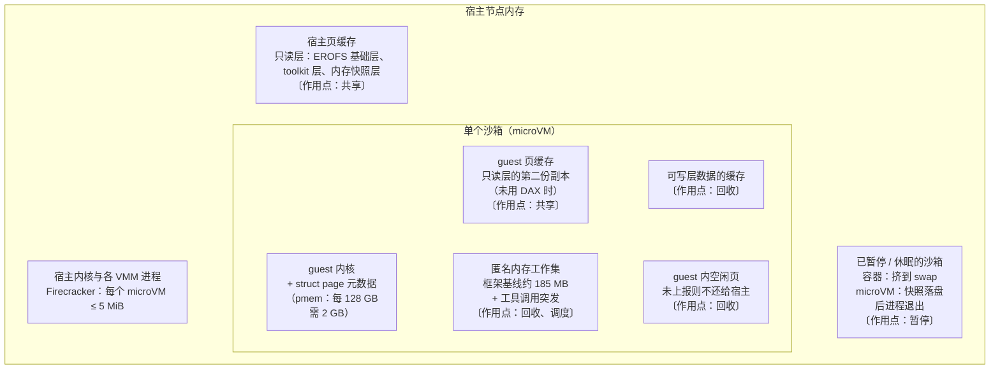
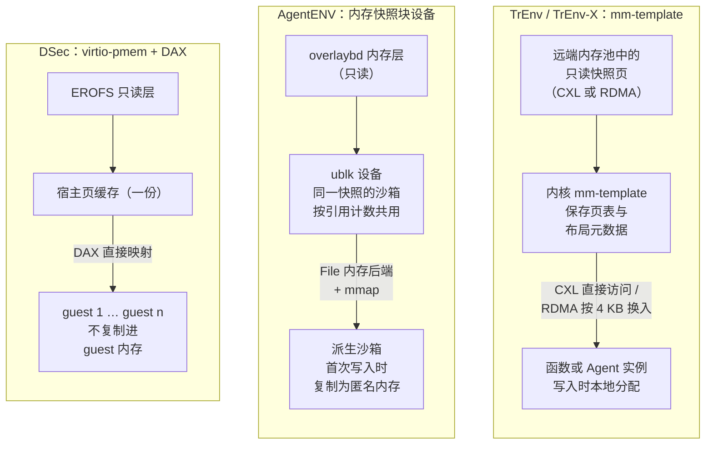

# 第 13 章　密度与资源管理

## 本章导读

第 3 章给出了 Agent 负载的两个基本事实：CPU 极度稀疏，沙箱又长时间有状态地存在。前者让人想到超售（overcommit），后者让超售在内存上处处碰壁。本章讨论八层架构的第⑥层（密度与资源），回答三个问题：一个节点上能放多少个沙箱，靠什么放进去，要付出什么代价。

DSec 第⑥层的逐项拆解见第 24 章（见 24.3.6 节），暂停与快照的机制见第 11 章（见 11.3 节），本章不再重复，而是把各家系统放到同一张图上比较。读完本章，读者应能：

- 说清为什么在 Agent 负载下限制密度的是内存而不是 CPU，以及一个节点的内存由哪几部分构成；
- 把已公开的密度技术归入共享、回收、暂停、调度四族，知道每一族管的是哪一部分内存，各自的实测效果与副作用是什么；
- 读懂各家密度数字与超售比的口径，知道哪些数字可以并列，哪些不能；
- 理解"空闲的成本"如何从训练集群的节点数传导到产品的计费方式，以及超售的风险落在谁身上。

## 13.1　为什么瓶颈是内存

### 13.1.1　CPU 稀疏：超售的前提

DSec 论文对一周生产数据的刻画是："容器与 microVM（微虚拟机）沙箱中，约 90% 的平均 CPU 用量不超过其请求 CPU 的 5%，这使超售成为自然的选择"（DSec §4.3，图 5；论文自述）。Kimi K3 技术报告从时间维度给出同一事实：Agent 在等待模型推理结果，这段时间"最多可占沙箱寿命的 98%"（as much as 98% of the sandbox lifetime）（Kimi K3 技术报告 §5.3.2；论文自述）。AgentCgroup 在 144 个 SWE-rebench 任务上的测量也一致：平均 CPU 利用率（按单核归一化，normalized to one core）在 Claude Haiku 4.5 后端下为 13.2%，在 GLM-4.7-Flash 后端下为 7.6%（AgentCgroup，AgenticOS'26 论文；论文自述）。

三个来源的口径不同：DSec 是平均用量占请求值的比例，K3 是等待时间占寿命的比例，AgentCgroup 是按单核归一化的平均利用率。但它们指向同一个结论：如果按请求值预留 CPU，绝大多数 CPU 时间是空转的。CPU 超售的门槛因此很低（推断）；它的代价不是容量，而是混部干扰下的延迟（见 13.5 节）。真正的瓶颈在别处。

### 13.1.2　内存：峰值高、驻留久、难以收回

AgentCgroup 是 DSec 之外少有的专门刻画 Agent 沙箱 OS 级资源的研究，作者来自 UCSC、VT 与 UConn。它的 arXiv 版本（2602.09345，v3，2026-07-22）摘要写道"内存而不是 CPU 是并发瓶颈"，并称"内存尖峰由工具调用驱动，峰均比最高 15.4 倍"（AgentCgroup arXiv 摘要；论文自述）。15.4 倍是单个任务的极端值（正文所举任务峰值 4,060 MB、均值 264 MB），不是总体统计（AgentCgroup，AgenticOS'26 论文；论文自述）。论文正文给出一个直观的算例："峰值内存可达 2–4 GB，所以按峰值分配时，128 GB 内存只能支撑 32–64 个实例，而在这个并发下 CPU 利用率仍低于 36%"（AgentCgroup，AgenticOS'26 论文；论文自述）。

正文还给出了内存的两层结构：约 185 MB 的框架基线，加上工具调用引发的突发，突发幅度在 500 MB 到 2 GB 之间，持续 1–2 秒；不同任务的峰值内存从 197 MB 到 4 GB 不等（约 20 倍，4,000 ÷ 197；笔者推算，原文未写倍数），同一任务重跑三次的执行时间分别为 402、222、259 秒（约 1.8 倍）（同上）。作为对照，论文称 Azure Functions 的内存曲线"几乎是平的"，Azure VM 的峰均比在 2–3 倍以内（同上）。附录 B 将这一对照登记为"云负载 1.5–3 倍"（B03-12），与本次抓取的原文措辞不完全一致，以原文为准。

这组数字说明了内存的第一个难处：**峰值高且不可预测**。按峰值预留，密度上不去；按均值预留，突发时会撞上 OOM。

第二个难处是**驻留久**。DSec 的沙箱中位寿命为 17.4 分钟（容器）和 15.5 分钟（microVM），p99 均超过 3 小时；论文明确说"这样长的寿命放大了被保留内存的成本"（DSec §4.3，图 7；论文自述）。CPU 在等待期间可以让给别的沙箱，内存却在整个寿命内被这个沙箱持有。

第三个难处是**收不回来**。DSec 点名了 microVM 内存浪费的两个来源："第一，经虚拟块设备读取的镜像数据，可能被宿主缓存一次，又被每个 guest 各缓存一次……第二，guest 内部的空闲页在没有显式上报的情况下不会还给宿主"（free pages inside a guest are not returned to the host without explicit reporting）（DSec §4.3；论文自述）。13.3.1 节的空闲页上报正是这里所说的"显式上报"。论文在引言中的结论是："在高密度超售下，这些驻留成本直接限制集群容量，因此内存共享与回收成为平台的重要需求"（DSec §1；论文自述）。

### 13.1.3　一个节点的内存由什么组成

把上述来源拼在一起，可以画出一个 microVM 节点的内存构成（图 13-1）。容器节点没有 guest 内核与第二份页缓存，但匿名内存、可写层缓存与空闲内存的问题同样存在。

**图 13-1　一个 microVM 节点的内存构成与四族技术的作用点**（示意图，依据 DSec §4.3、§5.2、§6.3，AgentCgroup，Firecracker SPECIFICATION 绘制；各部分比例未按实际绘制，没有任何来源披露过节点内存的分项占比）

图中的每一块都对应一类技术，本章据此把已公开的做法分成四族：

- **共享**：让多个沙箱共用同一份只读字节，针对宿主页缓存与 guest 页缓存的重复；
- **回收**：把不再使用的内存还给宿主，针对 guest 空闲页、冷的可写层缓存，以及（以压缩的形式）匿名内存；
- **暂停**：在沙箱等待时整体释放它的内存，针对整个沙箱；
- **调度**：不减少内存，而是控制谁在什么时候用资源，针对突发与混部干扰。

## 13.2　共享：让同一份字节只占一次内存

共享只对不可变的数据有效。Agent 沙箱恰好有大量不可变数据：基础镜像、语言运行时、工具链，以及从同一快照派生出来的内存镜像。已公开的工业与研究做法有三条路径（图 13-2）。

**图 13-2　只读数据的三种共享方式**（示意图，依据 DSec §5.2、AgentENV 架构文档、TrEnv-X v2 的机制描述绘制）

### 13.2.1　DSec：用 CPU 换内存

DSec 对只读的 EROFS 基础层与 toolkit 层启用 virtio-pmem + DAX（直接访问），让 guest 的文件访问"直接映射到宿主提供的页，而不复制进 guest 内存"（DSec §5.2；论文自述）。机制细节见 24.3.6 节，这里只看它的代价结构。

收益是：在一个真实 Agent RL 负载上，DAX 把各 guest 冗余的页缓存"合并为一份共享的宿主映射"，**宿主峰值内存下降 40.2%**（DSec §8.4，图 12；论文自述）。代价有三项：

1. **CPU**：瞬时峰值 CPU 利用率从 26.5% 升到 41.4%（同上）。论文没有解释上升来自哪里；同一节提到"经 DAX 的冷访问可能需要同步的缺页处理"（DSec §5.2；论文自述），二者可能有关（推断）。
2. **guest 内存元数据**：guest 必须为整段 pmem 地址空间分配 struct page，"一个 128 GB 的 pmem 设备需要 2 GB 的 guest 内存"存放这些元数据（DSec §5.2；论文自述），论文给出的比例是设备容量的 1/64（约 1.56%）（同上）。这部分开销按设备大小而不是实际访问量计，只读层越大，每个 guest 预付的元数据越多。
3. **冷访问延迟**：同步缺页处理落在访问路径上（同上）。

用 CPU 换内存在 Agent 负载下是划算的：13.1.1 节的三个来源都说明 CPU 有大量余量，而内存是瓶颈（推断）。但这个交换有前提：如果节点上混有 CPU 密集的沙箱（例如编译或测试阶段集中爆发），26.5% 到 41.4% 的峰值抬升会与 13.5 节讨论的 CPU 干扰叠加。论文没有给出两者叠加时的数据。

### 13.2.2　AgentENV：内存快照也是块设备

AgentENV 是 kvcache-ai 组织在 2026 年 7 月开源的 Agent 沙箱平台，README 称它支撑了 Kimi K3 的 Agent RL 训练（AgentENV README；一手文档）。它把共享从磁盘镜像延伸到了内存快照。据项目架构文档，内存恢复使用 ublk 支撑的 overlaybd 设备，"而不是 userfaultfd"：叠加后的内存层作为只读 ublk 设备，以 File 内存后端交给 Firecracker 并 mmap，首次写入时写时复制为匿名内存；从同一快照启动的沙箱按引用计数共用一个内存 ublk 设备，从而"让使用同一内存镜像的所有沙箱复用 Linux 页缓存"（AgentENV 架构文档；一手文档）。README 的表述是："通过 ublk 提供高性能 I/O，同时在存储数据与内存快照数据之间共享宿主页缓存"（AgentENV README；一手文档，2026-10-02 回原文核对）。不过，架构文档对同快照共用内存设备所说的收益是"显著减少并发启动时的 I/O"（significantly reducing I/O for concurrent launches）（AgentENV 架构文档；一手文档），内存上的节省没有量化。

与 DSec 相比，AgentENV 的共享对象多了一类：DSec 共享的是只读文件层，AgentENV 还共享"从同一快照派生的沙箱的内存初始内容"。后者的收益取决于派生沙箱有多少页从未被写过。项目没有公开这一比例，也没有单独给出页缓存共享的内存节省量。K3 报告把 6.5 倍超售归于"写时复制内存与页缓存优化"（见 13.6.2 节），这是共享族技术在 AgentENV 上唯一的量化陈述，而且与其他机制合在一起。AgentENV 的增量内存层与 restack 机制见 11.3.2 节。

### 13.2.3　TrEnv 与 TrEnv-X：跨节点的内存模板

TrEnv（SOSP'24）是面向 serverless 的工作，它提出可复用的沙箱池与基于 CXL/RDMA 内存池的 mm-template（TrEnv 论文；背景知识，本书未回原文核对，只引机制）。扩展版 TrEnv-X（ACM Transactions on Computer Systems 44(3): 1–39, 2026，2026-07-27 在线、2026-08-31 印刷，Crossref 核实，DOI 10.1145/3805475；预印本 arXiv:2509.09525）把评测扩展到了 Agent 负载；v2 正文称它是"对我们此前被 SOSP 2024 录用工作的实质性扩展"（TrEnv-X v2；论文自述）。据 v2 HTML，mm-template 是一个内核对象，保存页表与内存布局等元数据而不复制内存内容；快照页放在远端内存中，CXL 内存可以被 CPU 按字节直接访问、不产生缺页，RDMA 内存则在缺页时按 4 KB 块按需换入；共享页以写时复制保护，写入时在本地分配（TrEnv-X v2 正文；论文自述）。

论文称，在基于 VM 的 Agent 负载上，相对 E2B 这类系统"P99 延迟最多降低 58%、内存使用降低 61%"（reduces the P99 latency by up to 58% and memory usage by 61% compared to state-of-the-art systems like E2B）；评测中的基线是作者增强过的 E2B+，不是原版 E2B；在容器函数上 P99 延迟最多降 7 倍、内存节省 48%（TrEnv-X v2；论文自述，2026-10-02 回原文核对）。读这组数字要注意三点。第一，Agent 实验"在 20 个物理核上并发启动 200 个 Agent 实例"以评估超售下的效果（TrEnv-X 评测；论文自述），即每物理核 10 个实例（笔者推算），这是实验设定而不是生产密度。第二，轻量 Agent 实例配置为"1 vCPU、2 GB 内存、5 GB 存储"，带浏览器的实例为 4 GB 内存（TrEnv-X v2 §9.6；论文自述，2026-10-02 复核）。第三，报告的内存只计运行期间动态分配的部分，论文指出"这部分运行时内存的一个主要来源是 guest 与宿主操作系统之间的页缓存重复"（TrEnv-X v2 §3.4；论文自述），这与 DSec §4.3 的诊断一致：microVM 的双重页缓存是两家共同的靶子。

### 13.2.4　CubeSandbox：内核共享与写时复制

腾讯云的 CubeSandbox 在 README 中称"每沙箱不到 5 MB 的开销，通过内核共享与写时复制（CoW）使单台服务器可运行数千个实例"，并注明内存开销是在规格不超过 32 GB 的沙箱上测得的（CubeSandbox README；厂商自报，2026-10-02 回原文核对）。腾讯云开发者社区的发布文章给出的是更具体的数字："单台 96 核机器 2000+ 实例"（腾讯云开发者社区，2026-04-21；厂商自报）。两处口径一个是"数千个"，一个是"96 核 2,000+"，量级一致、精度不同（附录 B C-12）。按后者，每物理核约 20.8 个实例（2,000 ÷ 96；笔者推算），但这台机器的内存大小、实例规格与负载都未披露，这个数不能与 DSec 的生产数字直接比较。仓库内的性能报告（2026-06-01）给出另一种口径：按 free 差值摊算，空闲沙箱每个约 21.5 MB（100 个）至 25.7 MB（1,000 个），2 vCPU / 2 GiB 沙箱写满内存时 375 GiB 只能容纳约 185 个（CubeSandbox 性能报告；厂商自报）；README 的 < 5 MB 更接近 VMM 侧开销，两种口径不宜混用（推断；见第 6 章）。

"内核共享"在 README 中没有进一步解释；CubeSandbox 是每实例独立内核的硬件隔离方案，这里的"共享"具体指什么（例如 guest 内核镜像的只读页共享），本书没有找到一手说明，列为未披露。

### 13.2.5　共享的边界

共享只对"大家都一样"的数据有效，而 Agent 沙箱越跑越不一样。AgentENV README 用一句话点出了这一点：balloon 回收可回收的 guest 内存，以便"在环境运行更久、彼此分化（diverge）之后"维持高超售（AgentENV README；一手文档）。沙箱刚从模板派生时，绝大部分页可以共享；随着 Agent 安装依赖、编辑文件、启动服务，私有页越来越多。可写层与匿名内存不能共享，只能回收、压缩或在暂停时整体释放。第 24 章总结 DSec 的分工是"共享的就共享，不可共享的就尽早回收"（见 24.3.6 节），这句话同样适用于其他系统。

serverless 时代的 Medes（EuroSys'22）走的是第三条路：在暖、冷之间引入一个"去重"状态，对跨沙箱的冗余内存块去重、按需还原（Medes 论文；背景知识，本书未回原文核对）。它针对的正是"不完全相同、但高度相似"的页，这一思路在 2026 年由 AgentZip 以压缩的形式接续（见 13.3.3 节）。

> **边栏：谱系——从 mm-template 到内存快照页缓存（推断，基于作者重合）**
>
> TrEnv 与 TrEnv-X 的作者包括 Jialiang Huang、Sixing Lin、Yingdi Shan、Mingxing Zhang；Jialiang Huang 是 DSec 第一作者，Sixing Lin 与 Yingdi Shan 是 AgentENV 提交最多的两位（见第 25 章 25.2 节）。机制上，三者都在回答"许多执行环境怎样共用一份内存"：TrEnv 用远端内存池中的 mm-template，AgentENV 用单机上共享的内存快照块设备，DSec 用 pmem DAX 共享只读层的页缓存。笔者据作者重合与机制相似推断存在一条 TrEnv → AgentENV → DSec 的传承线（推断，基于作者重合），这不是任何当事方的陈述。可以确认的只有：DSec 的 microVM 存储路径使用了 AgentENV 仓库中开源的 Rust OverlayBD/ublk 组件（论文称"我们参与贡献"）。DSec 的页缓存共享用的是 virtio-pmem，而不是 AgentENV 的内存快照设备。完整证据链见第 25 章。

## 13.3　回收：把不再用的内存还给宿主

### 13.3.1　空闲页上报与 balloon

guest 释放的内存在 guest 看来是空闲的，在宿主看来仍被占用。virtio-balloon 驱动的空闲页上报（free page reporting，FPR）解决这个问题：guest"周期性扫描伙伴分配器，主动把空闲页上报给宿主 hypervisor，后者通过 `madvise(MADV_DONTNEED)` 释放对应的宿主内存"；默认粒度为"order-9 页，即在 4 KiB 基页下对应 2 MiB 的区域"（DSec §5.2；论文自述，2026-10-02 回原文核对）。

2 MiB 的粒度意味着，只有连续 2 MiB 都空闲的区域才会被上报。Agent 负载的内存突发持续 1–2 秒、幅度为数百 MB 到 2 GB（13.1.2 节），突发结束后释放的内存是否足够连续，取决于 guest 内的碎片情况；论文没有给出 order-9 之外其他粒度的对比数据。

AgentENV 同样使用 balloon，README 称它"把可回收的 guest 内存还给宿主"（AgentENV README；一手文档）。按术语表的区分，FPR 是 guest 主动上报，传统 balloon 是宿主按需要求 guest"充气"让出内存。README 没有说明用的是哪一种，但开源代码给出了答案：`src/sandbox/firecracker/instance.rs` 把 balloon 的目标大小设为 0（`amount_mib = 0`，不做目标充气），开启空闲页上报（`free_page_reporting: Some(true)`），并设置 `deflate_on_oom = true` 作为安全网；注释写明"主要目的是开启空闲页上报，使 guest 内核能经 `MADV_DONTNEED` 把未用的页还给宿主"（AgentENV 源码，提交 7e56ce8；一手文档）。生产配置是否相同未披露。据此，AgentENV 与 DSec 的回收机制基本同类；两家还都在 guest 内用 DAMON 回收冷文件页（见 13.3.2 节）。

### 13.3.2　DAMON：驱逐冷的文件页

FPR 只能收回 guest 已经释放的页。guest 页缓存里那些被读过一次、之后再没碰过的文件页，在 guest 看来不是空闲的。DSec 用 DAMON（Linux 的数据访问监控框架）处理这一部分：它"周期性地采样页访问位，找出超过可配置年龄阈值仍未被访问的冷文件页，并将其驱逐"（DSec §5.2；论文自述）。生产中 DAMON + FPR 用于"较大的可写盘"，与只读层的 pmem + DAX 分工（同上）。AgentENV 的默认 guest 内核命令行也开启了 DAMON_RECLAIM（`damon_reclaim.enabled=Y`，`skip_anon=Y`，只回收文件页），9 月 15 日合入的提交 `746f49b` 调整了参数（AgentENV `config/default.toml`；一手文档）。两家的区别在于 DSec 给出了效果数字，AgentENV 没有。

效果要按口径读：DAMON + balloon FPR 单独使用时，"峰值使用基本不变，但时间积分的宿主内存消耗下降 21.2%"；与 pmem + DAX 组合时"总体内存消耗最低"，论文没有给出组合的具体数字（DSec §8.4，图 12；论文自述）。

峰值与时间积分衡量的是两件事。峰值决定节点会不会 OOM，因而决定安全的超售上限；时间积分决定在一段时间内平均有多少内存可以分给新沙箱。回收类技术天然擅长后者：它收回的是"已经不用"的内存，而峰值恰恰出现在内存都在用的时候（推断）。所以 40.2% 与 21.2% 不能相加，也不能比较大小（见 24.3.6 节）。对容量规划而言，二者互补：前者抬高安全上限，后者提高平均可用量。

### 13.3.3　压缩：AgentZip

可写层与匿名内存不能共享，但它们之间仍有大量冗余。AgentZip（arXiv 2609.11294，2026-09-10 提交；预印本，未注明会议）的出发点是：高扇出的 Agent 任务会为一个任务派生许多并发沙箱，这些沙箱"源自同一个模板，执行相关的轨迹"，因此存在"相对模板的冗余"与"跨沙箱的冗余"（AgentZip 摘要；论文自述，2026-10-02 回原文核对）。

论文认为常规内存压缩在三个维度上不适配：怎么压（不能利用不完全相同的页之间的相似性）、压什么（为控制缺页开销而保守地选页）、何时压（要么由内存压力触发，要么不感知 Agent 的执行阶段）。AgentZip 的对应设计是：同时利用两类冗余；把压缩范围扩大到任何有划算表示的页，把开销控制从压缩时选页转到恢复时预取；把昂贵的压缩放在 LLM 等待期执行，避免干扰前台的工具执行（同上）。

结果：在 LLM 训练与推理负载上，AgentZip 把沙箱自有内存（sandbox-owned memory）最多降低 8.7 倍，Linux 配置为 2.1 倍；恢复时预取与感知执行阶段的调度，把激进压缩带来的减速从最高 3.1 倍降到 1.40 倍，同时"保留了几乎全部的内存节省"（同上）。这里有两点要注意：8.7 倍是"最多"，分母是"沙箱自有内存"，不含共享部分；1.40 倍仍是一个可观的减速，它落在工具执行的关键路径上还是只落在恢复路径上，摘要没有区分。

AgentZip 自称"第一个专为 AI Agent 沙箱设计的内存压缩系统"（同上），它把"LLM 等待期"当作执行昂贵操作的资源窗口。这与 13.4 节的暂停是同一个观察的两种用法：暂停在等待期把整个沙箱移出内存，压缩在等待期把沙箱的内存变小（推断）。

### 13.3.4　serverless 的前史

FaaSMem（ASPLOS'24）按 runtime、init、invocation 三段追踪 serverless 容器的内存，把冷页卸载到内存池（FaaSMem 论文；背景知识，本书未回原文核对）。DSec 的 DAMON 驱逐、AgentZip 的等待期压缩，都可以看作这一思路在 Agent 负载上的延续：serverless 函数在两次调用之间空闲，Agent 沙箱在两次工具调用之间空闲，只是后者的空闲段更长、状态更多（推断）。

## 13.4　暂停：零内存的等待

### 13.4.1　等待期就是密度

K3 技术报告在描述 AgentENV 时写道："暂停的沙箱不消耗内存或 CPU 资源"，而 Agent 等待模型推理结果的时间"最多可占沙箱寿命的 98%"（Kimi K3 技术报告 §5.3.2；论文自述，2026-10-02 回原文核对）。两句合起来，就是"暂停即密度"的全部论证：沙箱在等待期间若不占内存，节点能容纳的沙箱数就取决于同时活跃的沙箱数，而不是存在的沙箱总数。

可以把这一论证写成一个粗略的关系式（推断，本书整理）：节点内存需求 ≈ 同时活跃的沙箱数 × 活跃时的工作集 + 已暂停沙箱的残留内存 + 共享部分（只计一次）。不暂停时，第一项里的"同时活跃"要换成"同时存在"；暂停把这两个数拉开，拉开的幅度取决于等待占寿命的比例。若等待确实占寿命的 98%，且每次等待都暂停，同时活跃的沙箱数在平均意义上只有同时存在数的约 2%（笔者推算，1 − 98%）。这是一个理论上界，实际系统不会每次等待都暂停，也不可能让活跃期均匀错开。

这一换算有两个前提，都没有来源给出数据。第一，暂停与恢复的开销必须小于等待时长，否则暂停反而拖慢 rollout。K3 报告给出的检查点与恢复延迟"最低可达 133 ms 与 49 ms"（同上），即一次暂停—恢复往返最少约 182 ms（133 + 49；笔者推算）；单次 LLM 等待有多长，K3 报告与 DSec 都未披露。第二，活跃沙箱的峰值不能同时出现。RL 作业的沙箱往往成批启动、成批进入同一阶段（DSec 单作业最多请求 32K 个沙箱，见第 3 章），活跃期可能是相关的（推断）。

### 13.4.2　三种做法，三种"零"

各家的暂停实现不同，"释放内存"的程度也不同（机制细节见 11.3 节）：

- **DSec 容器：挤到 swap。** edge"先发出 `docker pause` 冻结容器的进程树，再通过容器的 `memory.swap.max` 设置打开 swap，并通过 `memory.reclaim` 触发主动内存回收"（DSec §6.3；论文自述，2026-10-02 回原文核对）。内存被换到本节点的 swap 设备上，进程仍在，宿主内存降下来了，但不是零，状态也绑在本节点。
- **DSec microVM：快照落盘，进程退出。** DSec 把 microVM 的内存与执行状态保存为快照，然后终止 Firecracker 进程（DSec §6.3；论文自述）。按术语表，这更接近"休眠"，宿主上不再有任何进程为这个沙箱占用内存。
- **AgentENV：增量内存层。** 暂停时把脏页写成新的 overlaybd 内存层，叠在父层之上（见 11.3.2 节）。恢复时从共享的内存块设备映射，内存按需回到页缓存（13.2.2 节）。

触发时机也不同。DSec 的暂停与 GPU 抢占绑定：可抢占的 GPU 作业被抢占时，暂停相应沙箱以回收内存，之后对已暂停沙箱的任何请求都会"透明地先恢复它，再执行请求的操作"（DSec §6.3；论文自述；另见第 17 章）。K3 报告的表述则把暂停与"等待推理"联系在一起（Kimi K3 技术报告 §5.3.2；论文自述）。前者把暂停当作抢占期间保住状态的手段，后者把暂停当作日常的密度手段（推断）。DSec 论文没有说明是否在普通的 LLM 等待期间也暂停沙箱，它的高密度主要靠 13.2、13.3 节的共享与回收在沙箱运行期间实现。

产品侧，暂停已经是标配（推断，依据 11.3.4 节所列产品）。CubeSandbox 在 v0.5 加入了 AutoPause/AutoResume（"空闲沙箱自动挂起，在下一个请求到来时唤醒"），在 v0.7.0（2026-08-28）加入了基于 S3 后端的跨节点暂停/恢复（预览）（CubeSandbox README；一手文档，2026-10-02 回原文核对）。README 把自动暂停列为"进一步提高部署密度与成本优化"的手段（同上）。其他产品的休眠与唤醒延迟见 11.3.4 节与附录 B C-31，口径各异，不作排名。

### 13.4.3　暂停的代价

暂停把内存问题转化成了其他问题：

- **恢复延迟落在关键路径上。** 下一次工具调用必须等恢复完成。AgentENV README 称启动/恢复不到 50 ms、暂停不到 100 ms，K3 报告给出的是"最低可达"133 ms 与 49 ms，两者口径不同（附录 B C-03）；DSec 没有披露暂停与恢复延迟（附录 B C-31）。
- **存储带宽成为新瓶颈。** 一次抢占可能同时暂停大量沙箱，快照写出集中发生（见 11.6.3 节）。
- **状态的位置。** swap 方案把状态绑在本节点；快照方案需要存储系统，跨节点恢复还需要共享存储（CubeSandbox v0.7 的跨节点恢复依赖 S3 后端）。

## 13.5　调度：CPU QoS 与细粒度控制

调度族不减少内存总量，只决定资源在争用时归谁。在高度超售的节点上，争用是常态。

### 13.5.1　DSec：LS/BE 与核心调度

DSec 把沙箱分为延迟敏感（latency-sensitive，LS）与尽力而为（best-effort，BE）两类，BE 沙箱以 SCHED_IDLE 运行，"使其在任何 LS 任务可运行时让出 CPU"；同时为 LS 沙箱开启 Linux 核心调度（core scheduling），"阻止无关的 BE 任务运行在同一物理核的兄弟线程上"（DSec §5.2；论文自述，2026-10-02 回原文核对）。

实验在一个真实评测负载的 LS 任务旁混部占节点容量 10% 到 50% 的 BE 负载（DSec §8.5；论文自述）。结果（DSec §8.5，图 13；论文自述）：

- 50% BE 负载下，不加 QoS 控制时，LS 任务的每步延迟比无混部基线增加 45.2%；
- 只用 SCHED_IDLE，延迟"最多改善 3.4%"，因为 LS 线程仍会与跑在兄弟超线程上的 BE 任务争用；
- 加上核心调度，低负载时延迟接近无混部基线，50% 负载时膨胀限制在 17.3%；剩余膨胀来自睿频降低、内存带宽与末级缓存争用。

这组实验说明：在开启 SMT 的节点上，**调度优先级管不到同一物理核上的另一个硬件线程**，只有把兄弟线程也纳入调度约束才有效。剩余的 17.3% 来自核以外的共享资源，调度器已无能为力。45.2% 到 17.3% 意味着膨胀幅度约缩小为原来的 1/2.6（45.2 ÷ 17.3；笔者推算）。以倍数概括这一结果的转述（如"7.4 倍改进"）与原文不符，本书不采用（附录 B X-02）。

论文没有说明一个沙箱如何被判为 LS 或 BE。按 §4.3 对负载的描述，"每步有固定时限的游戏 Agent"属于延迟敏感一类（见 24.3.6 节）；训练中大多数 SWE 类沙箱是否归入 BE，未披露。核心调度的代价，即 LS 沙箱所在物理核的另一个线程可能空闲、从而降低可用 CPU，论文也没有量化（推断）。

### 13.5.2　AgentCgroup：在工具调用边界上控制

DSec 的分级粒度是"整个沙箱"。AgentCgroup 认为这个粒度对 Agent 来说太粗：它把现有资源控制与 Agent 负载的错配归纳为三种，即粒度错配（容器级策略 vs 工具调用级动态）、响应错配（用户态反应 vs 亚秒级不可预测的突发）、适应性错配（基于历史的预测 vs 非确定的有状态执行）（AgentCgroup arXiv 摘要；论文自述）。

对应的设计是一个基于 eBPF 的控制器：按工具调用边界组织层级 cgroup，在内核中经 sched_ext（CPU）与 memcg_bpf_ops（内存）执行策略，并利用 Agent"声明资源需求、重构执行策略"的能力（同上）。在内存压力上升时，它按优先级施加分级响应，"通过 `memory.high` 延迟实施节流、通过 `cgroup.freeze` 实施冻结，而不是终止进程"（AgentCgroup，AgenticOS'26 论文；论文自述）。效果是：HIGH 优先级的 P95 内存分配延迟降低 29%（70.97 ms 降到 50.14 ms）（同上）。

这里有三处口径需要注意。第一，29% 是"分配延迟"（原文 "P95 allocation latency"），不是任务端到端延迟（附录 B B13-13）。第二，评测用的是轨迹重放、三个 Agent 轨迹并发，规模很小；arXiv 摘要自己的措辞是"初步评估显示改善了多租户隔离、减少了资源浪费"（AgentCgroup arXiv 摘要；论文自述）。第三，"OS 级执行占端到端延迟的比例"两个版本说法不同：AgenticOS'26 论文 PDF 写"占用户感知任务完成时间的 56–74%"，arXiv v3（2026-07-22）摘要写"55–60%"（附录 B C-21），两者并列，本书不二选一。AgentCgroup 是 AgenticOS'26 研讨会论文，arXiv 上有 v1 到 v3 三个版本。

AgentCgroup 的价值在于把"冻结"放进了资源控制的工具箱：它在超售的内存压力下用冻结替代 OOM，这与 13.4 节的暂停是同一个动作在不同时间尺度上的使用（推断）。

### 13.5.3　投机预热：用时间换内存

另一种调度思路是不让沙箱一直存在，而在需要的前一刻把它准备好。SpecBox（arXiv 2607.23933，2026-07-27 提交；预印本）在 LLM 生成 token 的过程中，用关键词匹配与语义嵌入识别即将发生的工具调用，"把沙箱启动与模型推理完全重叠"；再在沙箱依赖图上做随机预取，并用语义结果缓存与带外共享内存传输减少重复调用（SpecBox；论文自述，2026-10-02 回原文核对）。结果是：相对按需创建沙箱的基线，P99 端到端延迟最多降低 2.9 倍；相对长期预留、始终保温的沙箱部署，峰值内存降低 45.9%（同上）。

两个结果的基线不同：延迟对比的是"按需创建"，内存对比的是"永久预留"。SpecBox 的位置在两者之间，用预测换掉了"一直预留"的内存（推断）。它面向的是产品推理场景的 Agent 服务，与训练集群里成批创建的沙箱不同。

serverless 的 RainbowCake（ASPLOS'24）按裸容器、语言运行时、用户代码三层缓存并共享容器（RainbowCake 论文；背景知识，本书未回原文核对），对应 Agent 场景"基础镜像、语言运行时、仓库工作区"的分层预热池（推断）。

### 13.5.4　放置也是密度手段

节点内的手段之外，节点间的放置决定了突发会不会撞在一起。DSec 的放置引擎在少数合格节点中"选择负载最低的那个"（DSec §3.2；论文自述），实现上"采用 power-of-k-choices 算法：调度器随机采样 k 个节点并选择负载最低者，避免羊群效应，减少突发的 RL 环境在搭建和工具调用期间的相互干扰"（DSec §7；论文自述；见 24.3.2 节），k 值与负载度量未披露。AgentENV 开源版的调度策略只有轮询（默认）与随机（AgentENV 架构文档；一手文档），生产集群是否另有调度器，未披露（见第 25 章）。

## 13.6　四族对照与密度数字

### 13.6.1　四族对照

表 13-1 把本章讨论的技术放在一起。"效果"一列照录原文口径；凡原文无数字的，写"未披露"。

**表 13-1　密度技术四族对照**

| 族 | 技术 | 机制要点 | 实测效果（原文口径） | 代价 / 副作用 | 来源 | 类型 |
|---|---|---|---|---|---|---|
| 共享 | virtio-pmem + DAX | 只读层直接映射宿主页，guest 不复制 | 宿主峰值内存 −40.2% | 瞬时峰值 CPU 26.5% → 41.4%；冷访问同步缺页；每 128 GB pmem 需 2 GB guest 内存存 struct page | DSec §5.2、§8.4 | 论文自述 |
| 共享 | 内存快照块设备；写时复制内存与页缓存优化 | 同一快照派生的沙箱共用只读 ublk 内存设备与页缓存，写时复制 | 单项未披露；K3 将"写时复制内存与页缓存优化"合计归为最高 6.5× 内存超售比（真实负载，2026-07） | 收益随沙箱分化而递减（推断）；架构文档自述收益为启动 I/O | AgentENV 架构文档、README；K3 报告 §5.3.2 | 一手文档；论文自述 |
| 共享 | mm-template | 远端内存池（CXL/RDMA）中的只读快照页 + 内核元数据模板 | 对 E2B：内存最多 −61%、P99 最多 −58%；容器：P99 最多降 7×、内存 −48% | 需 CXL 或 RDMA 硬件；RDMA 路径按 4 KB 缺页换入 | TrEnv-X | 论文自述 |
| 共享 | 内核共享 + CoW | 未详述 | 每沙箱开销 < 5 MB（规格 ≤ 32 GB）；96 核 2,000+ 实例 | 未披露 | CubeSandbox README；腾讯云开发者社区 | 厂商自报 |
| 共享 | 跨沙箱去重（Medes） | 冗余内存块去重，按需还原 | 不引用 | 未核对 | Medes（EuroSys'22） | 背景知识 |
| 回收 | balloon FPR | guest 主动上报空闲页（默认 order-9 / 2 MiB），宿主 `MADV_DONTNEED` | 与 DAMON 合计：时间积分内存 −21.2%，峰值基本不变 | 只收回连续 2 MiB 空闲区域 | DSec §5.2、§8.4 | 论文自述 |
| 回收 | DAMON | 采样访问位，驱逐超过年龄阈值的冷文件页 | 同上（与 FPR 合测）；AgentENV 默认开启 DAMON_RECLAIM，未披露效果 | 驱逐后再访问需重新读取（推断） | DSec §5.2；AgentENV `config/default.toml` | 论文自述；一手文档 |
| 回收 | balloon（开源代码中为 FPR，目标充气为 0） | 把可回收的 guest 内存还给宿主；`deflate_on_oom` 兜底 | README 归为生产中 9.6× 内存超售比（提交 c561be6，2026-08-10） | 未披露 | AgentENV README；源码 7e56ce8 | 一手文档 |
| 回收 | 等待期压缩（AgentZip） | 利用相对模板与跨沙箱冗余，在 LLM 等待期压缩 | 沙箱自有内存最多降 8.7×（Linux 配置 2.1×） | 减速最高 3.1×，经预取与调度降到 1.40× | AgentZip | 论文自述 |
| 回收 | 冷页卸载（FaaSMem） | 分段追踪，冷页卸到内存池 | 不引用 | 未核对 | FaaSMem（ASPLOS'24） | 背景知识 |
| 暂停 | 容器暂停 + swap | `docker pause` + `memory.swap.max` + `memory.reclaim`；恢复前 `MADV_WILLNEED` 预取 | 未披露 | 状态绑定本节点 swap；恢复在关键路径上 | DSec §6.3 | 论文自述 |
| 暂停 | microVM 快照 + 终止进程 | 内存与执行状态写成快照，Firecracker 进程退出 | 未披露 | 恢复需重建进程并还原快照；延迟未披露 | DSec §6.3 | 论文自述 |
| 暂停 | 增量内存层 | 暂停时写出脏页为新 overlaybd 层 | "暂停的沙箱不消耗内存或 CPU"；检查点/恢复最低 133 ms / 49 ms | 依赖快照存储与带宽 | K3 报告 §5.3.2；AgentENV | 论文自述；一手文档 |
| 暂停 | AutoPause | 空闲自动挂起、下次请求唤醒；v0.7 起跨节点（预览） | 未披露 | 跨节点需 S3 后端 | CubeSandbox README | 一手文档 |
| 调度 | SCHED_IDLE（BE） | BE 在 LS 可运行时让出 CPU | 单独使用最多改善 3.4% | 挡不住兄弟超线程干扰 | DSec §5.2、§8.5 | 论文自述 |
| 调度 | 核心调度（LS） | 同一物理核兄弟线程不跑无关 BE 任务 | 50% BE 负载下延迟膨胀 45.2% → 17.3% | 剩余来自睿频、内存带宽、LLC；可用线程减少未量化（推断） | DSec §5.2、§8.5 | 论文自述 |
| 调度 | 工具调用级 eBPF 控制 | sched_ext + memcg_bpf_ops；节流（`memory.high`）与冻结（`cgroup.freeze`）替代 OOM | HIGH 优先级 P95 分配延迟 −29%（70.97 → 50.14 ms） | 评测规模小（三轨迹并发重放） | AgentCgroup | 论文自述 |
| 调度 | 投机预热 | 从流式 token 预测工具调用并预热沙箱 | P99 最多降 2.9×（对按需）；峰值内存 −45.9%（对永久预留） | 预测失误时的浪费未单列（推断） | SpecBox | 论文自述 |

注：DSec 的四项数字来自同一论文的两组实验（§8.4 内存、§8.5 CPU），实验条件不同，彼此不能组合推算。"背景知识"类条目本书未回原文核对，只引机制，不引数字。

### 13.6.2　密度数字的口径

各家的密度数字属于四种不同的东西：**能力**（平台能稳定承载多少）、**观测**（某一天实际出现了多少）、**比率**（超售比，分子分母各家自定）、**实验设定**（为测某项技术而人为设定的密度）。表 13-2 按这四类登记。

**表 13-2　单节点密度与超售比溯源**

| 系统 | 数字 | 口径 | 来源与日期 | 类型 |
|---|---|---|---|---|
| DSec | 每节点至少 3,200 个容器或 800 个 microVM | 能力：生产中"观测到的稳定运行" | DSec §4.3，2026-09-19 | 论文自述 |
| DSec | 单节点峰值 1,048 个容器、524 个 microVM | 观测：2026 年初某一天 | DSec §4.3，图 6 | 论文自述 |
| DSec | 平均每节点约 2,375（约 2,400）个；每物理核约 12.7 个 | 380,000 ÷ 160；380,000 ÷ 30,000 | 由 DSec §2.4 推算 | 笔者推算 |
| DSec | 每个约 488 MB（容器）；约 1.95 GB（microVM） | 每节点平均约 1.56 TB 内存分别除以 3,200 与 800 | 由第 24 章推算的每节点内存推算 | 笔者推算 |
| AgentENV | 内存超售比最高 6.5× | 比率："真实负载下"；归因于写时复制内存与页缓存优化 | Kimi K3 技术报告 §5.3.2，2026-07 | 论文自述 |
| AgentENV | 内存超售比 9.6× | 比率："生产中"；归因于内存气球 | AgentENV README，提交 c561be6，2026-08-10 | 一手文档（项目自报） |
| CubeSandbox | 96 核物理机 2,000+ 个实例；约 20.8 个 / 物理核 | 能力；内存与规格未披露 | 腾讯云开发者社区 2026-04-21；2,000 ÷ 96 | 厂商自报；笔者推算 |
| CubeSandbox | "单台服务器数千个实例" | 能力 | CubeSandbox README（2026-10-02 读取） | 厂商自报 |
| TrEnv-X | 20 个物理核上 200 个 Agent 实例（每核 10 个） | 实验设定 | TrEnv-X 评测 | 论文自述；笔者推算 |
| AgentCgroup | 128 GB 内存按峰值分配只能支撑 32–64 个实例，CPU < 36% | 按峰值预留的算例 | AgentCgroup，AgenticOS'26 论文 | 论文自述 |
| Firecracker | 每 microVM 内存开销 ≤ 5 MiB（1 vCPU / 128 MiB guest） | 规格 | Firecracker SPECIFICATION | 一手文档 |
| MobileGym | 单服务器 256 个并行实例，CPU < 10%，内存约 100 GB | 实验设定（浏览器托管的 Android 模拟） | MobileGym，arXiv 2605.26114 | 论文自述 |

注：DSec 每节点内存（约 1.56 TB = 250 TB ÷ 160）与核数来自第 24 章的推算（见 24.3.6 节），节点间配置是否一致未披露。AgentENV 的两个超售比按日期并列，二者口径均未说明，可能对应不同时间点或统计方式（附录 B C-01）。

几点读法：

**DSec 的能力与观测相差约三倍。** 3,200 与 1,048、800 与 524 并不矛盾：前者是平台的承载能力，后者是某一天的实际负载（见 24.3.6 节）。平均每节点约 2,375 个沙箱（笔者推算）则落在二者之间，且这一平均值混合了容器与 microVM、峰值并发与节点数两个可能口径不同的数字（附录 B B13-03）。

**内存账可以粗算。** 按每节点平均约 1.56 TB 内存，3,200 个容器意味着每个容器平均约 488 MB（笔者推算）。这个数只是 AgentCgroup 测得的约 185 MB 框架基线的两倍多，远低于其 2–4 GB 的峰值。如果每个容器都按 2–4 GB 的峰值预留，同样的内存只够约 390–780 个（1,560 ÷ 4；1,560 ÷ 2；笔者推算），3,200 个相当于按峰值计约 4.1–8.2 倍的内存超售（3,200 ÷ 780；3,200 ÷ 390；笔者推算）。这一估算混用了两个系统的不同负载，只能说明量级（推断）：它与 AgentENV 自报的 6.5 倍、9.6 倍处在同一区间，说明两家的生产系统都依赖"峰值不同时出现"这一统计性质（推断）。

**容器与 microVM 的密度差。** DSec 的能力数字中，容器是 microVM 的 4 倍（3,200 ÷ 800），某一天的观测峰值中是 2 倍（1,048 ÷ 524）（笔者推算）。论文没有分解这一差距的来源，但它对内存浪费的描述只针对 microVM："microVM 有两个内存浪费来源"，即双重页缓存与不归还的 guest 空闲页（DSec §4.3；论文自述）。容器与宿主共享内核，读取镜像时只有宿主一份页缓存，释放的内存直接回到宿主，不需要 FPR；microVM 则还要为 guest 内核、VMM 进程与（启用 pmem 时的）struct page 元数据付费（推断，依据 13.1.3 节的分解）。换言之，第⑥层的大部分技术是在为 microVM 补课，让它在内存上尽量接近容器（推断）。这一差距正是隔离强度的价格：DSec 把 SWE 与工具调用放在"启动快、装箱密度高"的容器，把安全与 computer use 类负载放在"提供更强隔离边界"的 microVM（DSec 表 1、§2.2；论文自述；见第 5、6 章与 24.2.2 节），密度是这一选择背后的约束之一（推断）。

**超售比没有统一定义。** K3 报告与 README 都没有说明超售比的分子是"分配给沙箱的内存总和"还是"沙箱请求的内存总和"，分母是"物理内存"还是"可用于沙箱的内存"。两个数字不但日期不同，两份来源归因的机制也不同：K3 报告写的是"我们用写时复制内存与页缓存优化进一步降低内存使用，在真实负载中实现最高 6.5 倍的内存超售比"（We further reduce memory usage with copy-on-write memory and page-cache optimizations…）（Kimi K3 技术报告 §5.3.2；论文自述），即共享族；README 写的是"内存气球把可回收的 guest 内存还给宿主，在生产中实现 9.6 倍的内存超售比"（AgentENV README；一手文档），即回收族。在定义公开之前，6.5 倍与 9.6 倍都只能作为自报量级引用，不能与其他系统的超售比比较，也不能据此判断哪一族贡献更大。

> **边栏：方法——超售比的三种算法**
>
> 同一个节点、同一批沙箱，按不同的分子分母可以算出相差很大的"超售比"（以下定义为本书整理，不是任何来源的定义）：
>
> - **名义超售比**＝节点上所有沙箱的内存上限（请求值）之和 ÷ 节点物理内存。它衡量平台"卖出去"了多少内存，与沙箱实际用了多少无关。
> - **峰值超售比**＝所有沙箱各自峰值之和 ÷ 节点物理内存。它衡量"如果峰值同时出现会缺多少"，是 OOM 风险的直接指标；13.6.2 节对 DSec 的 4.1–8.2 倍粗算即属此类。
> - **驻留超售比**＝所有存在的沙箱（含暂停者）的名义内存之和 ÷ 节点物理内存。暂停把沙箱移出内存却不减少沙箱数，所以以暂停为主的系统在这个口径下会得到很高的比值。
>
> 三者可以相差数倍。AgentENV 以暂停为核心设计（见第 25 章），它的 6.5 倍与 9.6 倍若属第三种，就与第一种口径下的数字不可比（推断）。报告超售比时，至少应写明属于哪一种，以及统计时段是峰值时刻还是时间平均。

**GUI 与完整 VM 的密度几乎是空白。** 表中唯一的 GUI 数据点来自 MobileGym 的实验设定（单个实例约 400 MB；附录 B B07-07），CUA-Sandbox 在 VisualWebArena 上把每环境内存从 1,745.2 MiB 降到 190.0 MiB（9.2×；WebArena 为 4.5×、OSWorld 为 3.2×），但只测了 8 个并发环境，论文明言"maximum density remains unmeasured"（CUA-Sandbox §4.3；论文自述；附录 B B07-06）。DSec 的完整 VM 后端没有密度数字。

## 13.7　经济学：空闲的成本

### 13.7.1　空闲成本在两种场景中的形态

在训练集群里，空闲成本体现为节点数。一个规模单元约 160 个节点、约 250 TB DRAM（DSec §2.4；论文自述），如果没有第⑥层的技术、每个沙箱按峰值预留，承载同样的并发需要多出数倍的节点（推断，倍数取决于实际超售比，DSec 未披露）。这部分成本由实验室自己承担，所以训练侧的系统会把共享、回收、暂停与调度都用上。

训练侧还有一种空闲是产品侧没有的：GPU 作业被抢占时，rollout 停下来，它的沙箱却还在。DSec 摘要把与 RL 框架的协同设计概括为"把有状态的 rollout 执行与可被抢占的 GPU 训练解耦，让沙箱生命周期与训练对齐，从而在保留 rollout 状态的同时回收空闲资源"（DSec 摘要；论文自述；见 24.1.2 节与第 17 章）。13.4.2 节的容器 swap 与 microVM 快照正是这里的"回收"。换句话说，训练侧的空闲有两个来源：每一步等待 LLM 的短空闲，以及 GPU 抢占造成的长空闲。DSec 的公开材料只说明了后者用暂停处理，前者主要靠运行期的共享与回收消化；AgentENV 的公开材料则把暂停与前者联系在一起（13.4.2 节）。两种做法哪种更省，取决于短空闲的时长分布，这正是 13.8 节列出的空白之一（推断）。

在产品侧，空闲成本体现为账单。用户的 Agent 等待模型时，沙箱仍在计费，这个成本由谁承担，取决于计费方式。2026 年产品沙箱定价的主要变化，可以看作对这个问题的回应（推断）：按活跃 CPU 计费，以及暂停近乎免费（见第 22 章）。Cloudflare 的 GA 博客把这一点说得很直白："Agent 等待 LLM 响应时，你不必为空闲的 CPU 付费"（you aren't paying for idle CPU while your agent is waiting for an LLM to respond）（Cloudflare 博客，2026-04-13；一手文档）。

### 13.7.2　计费方式

表 13-3 列出研究材料中有据可查的几种计费口径。

**表 13-3　产品沙箱的计费口径（摘录）**

| 厂商 | 计费口径 | 价格 | 来源与日期 | 类型 |
|---|---|---|---|---|
| E2B | 按秒：vCPU + 内存 | 每 vCPU $0.000014/s（约 $0.0504 / vCPU-h）；内存 $0.0000045 / GiB-s；默认 2 vCPU / 4 GiB 沙箱约 $0.166/h | e2b.dev/pricing（2026-10-02 读取）；$0.166/h 见 bex.co 2026-09-22 | 一手文档；二手报道 |
| Vercel Sandbox | 活跃 vCPU 时长 + 预置内存 GB-h（另有创建次数） | $0.128 / 活跃 vCPU-h；预置内存 $0.0212 / GB-h | Vercel Sandbox 定价文档（last_updated 2026-09-10） | 一手文档 |
| Cloudflare Sandbox（Containers 计费） | CPU 按活跃用量；内存与磁盘按预置量 | 超出额度后 $0.000020 / vCPU-s（约 $0.072 / vCPU-h）；内存 $0.0000025 / GiB-s（约 $0.009 / GiB-h） | Cloudflare Containers 定价页（last updated 2026-04-21）；折算为笔者推算 | 一手文档 |
| 腾讯云 AGS | 按量后付费、按秒计费，"按实际使用量结算"；暂停后 CPU、内存停止计费，系统盘持续计费 | CPU ¥0.000081 / 核 / 秒（约 ¥0.29 / 核 / 小时）；内存 ¥0.000025 / GiB / 秒（约 ¥0.09 / GiB / 小时） | 腾讯云计费文档，2026-09-09 | 一手文档 |
| Fly.io Sprites | 按 CPU 时长、内存与存储计费；running 计费，warm、cold 不计费 | $0.03825 / CPU-h；内存 $0.021875 / GB-h（2026-01 二手报道曾为 $0.07 / CPU-h） | fly.io/sprites（2026-10-02 读取）；Techzine、Better Stack | 一手文档；二手报道 |
| Blaxel | 挂起/恢复 25 ms；可空闲"数月"成本接近零 | 未列 | The Next Web，2026-09-10 | 二手报道 |

注：阿里云 ACS Agent Sandbox 中国内地标价为每 vCPU 每小时 0.078 元、每 GiB 内存每小时 0.039 元，按秒计费、按小时出账，休眠态不收 CPU 与内存费（ACS 文档，2026-06-22；一手文档，2026-10-05 核对单位无误，附录 B C-07 已解决；见第 22 章表 22-3）。腾讯 AGS 文档称"按实际使用量结算"，但没有说明 CPU 是否像 Vercel、Cloudflare 那样只计活跃时间。Vercel 与 Cloudflare 的价格出自各自定价文档，GA 博客只说明"只为活跃 CPU 付费"，没有给单价。

从表中可以读出三件事。

**第一，按活跃 CPU 计费把 CPU 稀疏性让渡给了用户，但单价更高。** Vercel 的活跃 vCPU 单价约为 E2B 按时长单价的 2.5 倍（0.128 ÷ 0.0504；笔者推算）。只看 CPU 一项，当沙箱的活跃 CPU 比例低于约 39.4%（0.0504 ÷ 0.128；笔者推算）时，按活跃计费更便宜。这一比较忽略了内存与其他计费项（Vercel 另按预置内存收取 $0.0212 / GB-h），两家产品也不是同一规格，只能说明方向。产品侧负载的 CPU 稀疏度没有公开数据，如果它接近 DSec 训练负载那样"约 90% 的沙箱平均用量不超过请求的 5%"，按活跃计费对用户显然有利（推断）。

**第二，内存在账单里占的份额不小。** 按 E2B 的价格，默认 2 vCPU / 4 GiB 沙箱每小时 CPU 部分约 $0.101、内存部分约 $0.065，内存约占 39%（2 × 0.0504；4 × 0.0000045 × 3,600；笔者推算），合计约 $0.166，与 bex.co 2026-09-22 一文给出的数字一致。按腾讯 AGS 的价格，同样 2 核 4 GiB 每小时 CPU 约 ¥0.58、内存 ¥0.36，内存约占 38%（笔者推算，假设一小时内资源全部计费）。两家在不同市场定价，内存份额却很接近。此外，两家按活跃 CPU 计费的厂商都对内存另按预置量收费：Vercel 按"分配给沙箱的内存乘以运行时间"计预置内存，Cloudflare 写明"内存与磁盘按预置资源计"（Vercel 定价文档、Cloudflare Containers 定价页；一手文档）。这与 13.1 节的结论一致：CPU 可以按活跃计费，内存却在整个寿命内被占用，计费也很难绕开它（推断）。

**第三，暂停是把内存账单降下来的唯一办法。** 按活跃 CPU 计费只解决 CPU 一半；内存要降到零，只能暂停或休眠。bex.co 认为 E2B 的弱点正是"空闲成本"与约 3 秒的暂停—恢复往返之间的取舍（bex.co，2026-09-06；二手报道）；Blaxel 宣称 25 ms 挂起恢复、可空闲数月成本接近零（The Next Web，2026-09-10；二手报道）；腾讯 AGS 文档写明"暂停后计算资源（CPU、内存）停止计费，但系统盘存储持续计费"（腾讯云计费文档，2026-09-09；一手文档）；Fly.io Sprites 只对 running 状态计费，warm 与 cold 状态不计费（fly.io/sprites；一手文档）；CubeSandbox 把 AutoPause 列为成本优化手段（CubeSandbox README；一手文档）。暂停越快，就越能在更短的等待中使用，空闲成本也就越接近零（推断）。

**一个企业内部的数据点。** 腾讯称元宝 AI 编程场景迁上 Cube Sandbox 后"资源核时消耗降低 95.8%"（腾讯云开发者社区，2026-04-21；厂商自报）。文章没有给出迁移前的方案、统计周期与负载是否可比，这个数字只能作为厂商自报的效果陈述引用，不能拆解到具体技术。

### 13.7.3　超售的风险落在谁身上

超售在平均意义上是安全的，风险在尾部。下面分四点看。

**峰值相关。** 超售依赖"各沙箱的峰值不同时出现"。AgentCgroup 测得的峰值来自工具调用，持续 1–2 秒、任务间差 20 倍（13.1.2 节）；RL 作业的沙箱又是成批启动、成批进入搭建与测试阶段的。同一作业的沙箱集中在少数节点上时，峰值可能相关（推断）。DSec 的 power-of-k-choices 放置意在打散这种集中（13.5.4 节），但论文没有给出放置策略对 OOM 率的影响。

**回收与峰值无关。** DAMON + FPR 降的是时间积分而不是峰值（13.3.2 节），只靠回收提高的超售比，在峰值相关时没有保护作用。能降峰值的是共享（pmem DAX 降峰值 40.2%）、暂停（让部分沙箱根本不在内存里）与 AgentCgroup 式的节流和冻结（推断）。

**风险的承担者。** 训练侧，超售失败的代价是 rollout 失败或变慢，由实验室自己承担，最终表现为训练效率；第 3 章引用的 RollArt、快手 KAT-Coder 的环境故障率说明这类代价并不小。产品侧，按活跃 CPU 计费把 CPU 超售的风险从用户转到了厂商：厂商按用户实际用量收费，却必须为同时活跃的峰值准备资源（推断）。这解释了为什么按活跃 CPU 计费的厂商仍单独对内存计费或设置并发上限（Cloudflare 标准计划的并发实例上限见第 22 章）。

**混部干扰。** CPU 超售的代价不是 OOM，而是延迟。DSec 的实验显示，即使开了核心调度，50% BE 负载下 LS 任务仍有 17.3% 的延迟膨胀（13.5.1 节）。对训练而言这意味着 rollout 变慢；对有每步时限的任务而言，它可能直接改变任务结果（推断）。

### 13.7.4　本书建议

以下是**本书建议**，依据本章的证据归纳，不是任何来源的做法：

1. **把内存当作密度的一等指标，峰值与时间积分分开报告。** DSec 的 40.2% 与 21.2% 说明两者回答不同的问题；只报一个，读者无法判断超售是否安全。
2. **按数据的可变性分层选择手段。** 只读层共享（DAX、内存快照设备、mm-template），可写层与匿名内存回收或压缩，等待期整体暂停。DSec 的"共享只读、回收私有"分工是有实测数据（真实 Agent RL 负载上的实验）支持的组合之一。
3. **公布超售比时写明分子、分母与统计时段。** 6.5 倍与 9.6 倍的冲突说明，没有定义的超售比无法比较，甚至无法与自己比较。
4. **暂停的触发条件要以等待时长为依据。** 只有当预期等待明显长于暂停与恢复往返时间时，暂停才同时有利于密度与延迟；平台应记录每次 LLM 等待的时长分布，这一数据目前没有任何来源公开。
5. **开启 SMT 的节点上，延迟敏感的沙箱应配合核心调度，而不只是调低他人的优先级。** DSec 的 3.4% 与 17.3% 说明单靠 SCHED_IDLE 几乎无效。LS/BE 的划分标准应写入平台文档。
6. **产品计费把暂停状态单独定价。** 按活跃 CPU 计费只处理了 CPU；内存的空闲成本只有通过暂停才能降下来，计费应让用户看见并选择暂停状态的价格与唤醒延迟（推断，依据表 13-3 的内存份额估算）。

## 13.8　披露空白与开放问题

- **DSec**：pmem + FPR 组合的具体数字、LS/BE 的判定标准、暂停与恢复延迟、超售比、各后端的内存配置均未披露（附录 B C-31）。
- **AgentENV**：6.5 倍与 9.6 倍的口径；页缓存共享与 balloon 各自的贡献；生产集群的节点数与每节点密度均未披露（见第 25 章）。
- **CubeSandbox**："内核共享"的具体含义；2,000+ 实例时的内存与规格；元宝 AI 编程场景 95.8% 的基线。
- **可写层的去重**：可写层只能回收、不能共享，是目前各工业系统的共同短板；AgentZip 的跨沙箱压缩是第一个针对性方案，尚未见生产部署报告。
- **LLM 等待时长分布**：暂停经济学的关键输入，没有任何来源公开（13.4.1 节）。
- **GUI 与完整 VM 的密度**：只有 MobileGym 与 CUA-Sandbox 的实验数据（13.6.2 节）。
- **独立基准**：本章的所有密度数字都来自系统作者或厂商自己，没有独立的同口径测量。

## 本章小结

- **瓶颈是内存。** CPU 在 Agent 负载下极度稀疏（DSec 约 90% 沙箱平均用量不超过请求的 5%，K3 等待推理最多占寿命 98%），CPU 超售门槛很低（推断，代价是混部延迟）；内存则峰值高（AgentCgroup 峰均比最高 15.4 倍）、驻留久、不经显式上报收不回来。
- **四族技术各管一块内存。** 共享针对只读层与模板派生的重复页（DSec pmem DAX 峰值 −40.2%、TrEnv-X 对 E2B 内存最多 −61%）；回收针对空闲页、冷页与私有页（DSec DAMON + FPR 时间积分 −21.2%，AgentZip 最多 8.7 倍）；暂停在等待期整体释放沙箱；调度控制争用（DSec 核心调度把 50% BE 负载下的延迟膨胀从 45.2% 压到 17.3%）。
- **每项技术都有代价。** DAX 用 CPU 换内存（峰值 CPU 26.5% → 41.4%）并预付 struct page 元数据；压缩带来减速；暂停把恢复延迟放进关键路径；核心调度管不到核以外的争用。
- **密度数字要按口径读。** 能力（DSec 3,200/800）、观测（1,048/524）、推算（每核约 12.7 个）、自报比率（AgentENV 6.5 倍 vs 9.6 倍，按日期并列）与实验设定（TrEnv-X 每核 10 个）不能混为一谈。
- **空闲的成本在训练侧表现为节点数，在产品侧表现为账单。** 按活跃 CPU 计费只处理了 CPU，内存在默认规格的账单中约占四成（笔者推算），要降到零只能暂停；超售的尾部风险在训练侧由实验室自担，在产品侧随按活跃 CPU 计费转给了厂商（推断）。

## 本章数字溯源

本表登记本章使用的全部数字。"备注"中的 B/C/X 编号对应附录 B；标"复核"者为本书 2026-10-02 回原文逐字或近逐字核对过的数字。

**表 13-4　本章数字溯源**

| 数字 | 含义 | 原文位置 / 来源 | 类型 | 备注 |
|---|---|---|---|---|
| 约 90% 沙箱 ≤ 请求 CPU 的 5% | CPU 稀疏性 | DSec §4.3，图 5（复核） | 论文自述 | B03-03 |
| 最多 98% | 等待推理占沙箱寿命 | K3 技术报告 §5.3.2（复核） | 论文自述 | B03-10 |
| 13.2%；7.6% | 平均 CPU 利用率（按单核归一化；Haiku 4.5；GLM-4.7-Flash） | AgentCgroup 论文 PDF（复核） | 论文自述 | B03-16 |
| 15.4×；4,060 MB / 264 MB | 内存峰均比（单个任务的极端值）；该任务峰值与均值 | AgentCgroup arXiv 摘要与 PDF（复核） | 论文自述 | B03-12 |
| 2–3×；几乎平坦 | Azure VM、Azure Functions 的对照 | AgentCgroup 论文 PDF（复核） | 论文自述 | B03-12 |
| 2–4 GB；128 GB → 32–64 个；< 36% | 峰值内存；按峰值分配的实例数；对应 CPU 利用率 | AgentCgroup 论文 PDF（复核） | 论文自述 | B13-16 |
| 约 185 MB；500 MB–2 GB；1–2 秒 | 框架基线；工具调用突发幅度与持续时间 | AgentCgroup 论文 PDF（复核） | 论文自述 | B03-13 写"突发 2–4 GB"，与原文"峰值 2–4 GB、突发 500 MB–2 GB"需区分 |
| 197 MB–4 GB；约 20×；402/222/259 秒（1.8×） | 任务间峰值范围；倍数；重跑差异 | AgentCgroup 论文 PDF（复核）；4,000 ÷ 197 | 论文自述；倍数为笔者推算 | B03-13 |
| 56–74% vs 55–60% | OS 级执行占端到端时延 | AgenticOS'26 PDF vs arXiv v3 摘要（复核） | 论文自述 | C-21，两版并列 |
| 17.4 分钟；15.5 分钟；p99 > 3 小时 | 沙箱中位与 p99 寿命 | DSec §4.3，图 7（复核） | 论文自述 | B03-04 |
| ≤ 5 MiB | 每 microVM 内存开销 | Firecracker SPECIFICATION | 一手文档 | B06-03 |
| −40.2%；26.5% → 41.4% | pmem DAX 宿主峰值内存；瞬时峰值 CPU | DSec §8.4，图 12（复核） | 论文自述 | B13-04 |
| 128 GB → 2 GB；1/64（约 1.56%） | struct page 元数据开销及比例 | DSec §5.2（复核） | 论文自述 | B11-17、B13-17 |
| order-9；2 MiB；4 KiB | FPR 默认粒度 | DSec §5.2（复核） | 论文自述 | B13-06 |
| −21.2%（峰值基本不变） | DAMON + FPR 时间积分内存 | DSec §8.4（复核） | 论文自述 | B13-05 |
| −58%；−61%；7×；48% | TrEnv-X 对 E2B（评测基线为增强版 E2B+）P99 与内存；容器 P99 与内存 | TrEnv-X v2（复核） | 论文自述 | B13-11 |
| 200 个实例 / 20 个物理核；每核 10 个 | TrEnv-X 超售实验设定 | TrEnv-X v2（复核）；200 ÷ 20 | 论文自述；笔者推算 | B13-18 |
| 1 vCPU / 2 GB / 5 GB；4 GB | TrEnv-X 轻量 Agent 与带浏览器 Agent 的实例配置 | TrEnv-X v2 §9.6（复核） | 论文自述 | B13-18 |
| < 5 MB（规格 ≤ 32 GB）；"数千个 / 服务器" | CubeSandbox 每沙箱开销与密度 | CubeSandbox README（复核） | 厂商自报 | B06-16、C-12 |
| 2,000+ / 96 核；约 20.8 个 / 核 | CubeSandbox 单机密度 | 腾讯云开发者社区 2026-04-21；2,000 ÷ 96 | 厂商自报；笔者推算 | B06-16、B13-19 |
| v0.5；v0.7.0（2026-08-28） | AutoPause；跨节点暂停/恢复（预览） | CubeSandbox README（复核） | 一手文档 | B13-29；C-11 版本冲突已消解（v0.5.0 为 2026-07-03，最新 v0.7.2 为 09-24） |
| 8.7× vs 2.1×；3.1× → 1.40× | AgentZip 内存降低；减速 | AgentZip 摘要（复核） | 论文自述 | B13-10；"常规方法"应为"Linux 配置" |
| 133 ms；49 ms；约 182 ms | K3 检查点/恢复最低值；往返 | K3 技术报告（复核）；133 + 49 | 论文自述；笔者推算 | C-03；B11-02、B13-23 |
| < 50 ms；< 100 ms | AgentENV 启动/恢复；暂停 | AgentENV README（复核） | 一手文档（项目自报） | C-03 |
| 6.5× | AgentENV 内存超售比（真实负载） | K3 技术报告（复核），2026-07 | 论文自述 | B13-08、C-01 |
| 9.6× | AgentENV 内存超售比（生产） | AgentENV README（复核），提交 c561be6，2026-08-10 | 一手文档（项目自报） | B13-09、C-01 |
| 10%–50% | QoS 实验中 BE 负载占节点容量 | DSec §8.5（复核） | 论文自述 | B13-31 |
| +45.2%；≤ 3.4%；+17.3% | QoS 实验结果 | DSec §8.5，图 13（复核） | 论文自述 | B13-07；X-02 所列转述不得使用 |
| 约 1/2.6 | 膨胀幅度缩小比例 | 45.2 ÷ 17.3 | 笔者推算 | B13-07 |
| −29%（70.97 → 50.14 ms） | HIGH 优先级 P95 内存分配延迟 | AgentCgroup 论文 PDF（复核） | 论文自述 | B13-13 |
| 2.9×；−45.9% | SpecBox P99（对按需）；峰值内存（对永久预留） | SpecBox v1（复核） | 论文自述 | B13-12 |
| 3,200 / 800 | 每节点稳定运行能力 | DSec §4.3（复核） | 论文自述 | B13-01 |
| 1,048 / 524 | 单日单节点峰值 | DSec §4.3，图 6（复核） | 论文自述 | B13-02 |
| 4×；2× | 容器与 microVM 的能力比、单日观测峰值比 | 3,200 ÷ 800；1,048 ÷ 524 | 笔者推算 | B13-22 |
| 约 2% | 等待占 98% 且每次暂停时，同时活跃数占同时存在数的理论比例 | 1 − 98% | 笔者推算 | B13-24；理论上界 |
| 约 2,375；约 12.7 | 平均每节点、每核沙箱数 | 380,000 ÷ 160；380,000 ÷ 30,000 | 笔者推算 | B13-03 |
| 近 160 节点；约 250 TB；30K 核；∼380K / 超过 380,000 | DSec 规模单元 | DSec §2.4（∼380K 峰值并发）；摘要（over 380,000） | 论文自述 | B24-02、B24-04、B24-05 |
| 约 1.56 TB；约 488 MB；约 1.95 GB | 每节点平均内存；每容器、每 microVM 平均内存 | 250 TB ÷ 160；1,560 GB ÷ 3,200；1,560 GB ÷ 800 | 笔者推算 | B13-20、B24-17；第 24 章用评测节点 1.5 TB 得 1.9 GB（B24-18） |
| 约 390–780 个；约 4.1–8.2× | 按 2–4 GB 峰值预留时的容量；对应超售倍数 | 1,560 ÷ 4、1,560 ÷ 2；3,200 ÷ 780、3,200 ÷ 390 | 笔者推算 | B13-21；跨系统混用，仅示量级 |
| 32K | 单作业最多请求的沙箱数 | DSec §1、§4.1 | 论文自述 | B03-01 |
| 256 个；CPU < 10%；约 100 GB；约 400 MB | MobileGym 并行实例、资源、单实例内存 | MobileGym | 论文自述 | B07-07 |
| 9.2×（1,745.2 → 190.0 MiB）；4.5×；3.2× | CUA-Sandbox 每环境内存降低：VWA、WebArena、OSWorld（8 并发；最大密度未测） | CUA-Sandbox §4.3 | 论文自述 | B07-06 |
| $0.000014/vCPU-s（约 $0.0504/vCPU-h）；$0.0000045/GiB-s；约 $0.166/h | E2B 价格；默认规格每小时 | e2b.dev/pricing（2026-10-02 读取）；bex.co 2026-09-22 | 一手文档；二手报道 | B22-03、B22-04 |
| 约 $0.101；约 $0.065；约 39% | 默认规格每小时 CPU、内存费用与内存份额 | 2 × 0.0504；4 × 0.0000045 × 3,600 | 笔者推算 | B13-25 |
| $0.128/活跃 vCPU-h；$0.0212/GB-h | Vercel 活跃 CPU 与预置内存价格 | Vercel 定价文档（2026-09-10） | 一手文档 | B22-17 |
| 约 2.5×；约 39.4% | Vercel 与 E2B 单价比；CPU 项盈亏平衡的活跃比例 | 0.128 ÷ 0.0504；0.0504 ÷ 0.128 | 笔者推算 | B13-27；忽略内存与其他计费项 |
| $0.000020/vCPU-s（约 $0.072/vCPU-h）；$0.0000025/GiB-s（约 $0.009/GiB-h） | Cloudflare 活跃 CPU 与预置内存价格及折算 | Cloudflare Containers 定价页（2026-04-21）；× 3,600 | 一手文档；笔者推算 | B22-18 |
| ¥0.000081/核/秒（约 ¥0.29/核/小时）；¥0.000025/GiB/秒（约 ¥0.09/GiB/小时） | 腾讯 AGS 价格 | 腾讯云计费文档 2026-09-09 | 一手文档 | B22-40 |
| 约 ¥0.58；¥0.36；约 38% | 2 核 4 GiB 每小时 CPU、内存费用与内存份额 | 2 × 0.2916；4 × 0.09 | 笔者推算 | B13-26；假设一小时内全部计费 |
| 暂停后 CPU、内存停止计费；系统盘持续计费 | 腾讯 AGS 暂停计费规则 | 腾讯云计费文档 2026-09-09 | 一手文档 | B13-28 |
| $0.03825/CPU-h；$0.021875/GB-h；（$0.07/CPU-h） | Sprites 现价；2026-01 二手报道价格 | fly.io/sprites（2026-10-02 读取）；Techzine、Better Stack | 一手文档；二手报道 | B22-19 需更新 |
| 25 ms；"数月"接近零成本 | Blaxel 挂起/恢复与空闲成本 | The Next Web | 二手报道 | B11-10 |
| 约 3 s | E2B 暂停—恢复往返 | bex.co 2026-09-06 | 二手报道 | C-31 |
| −95.8% | 元宝 AI 编程场景迁上 Cube 后资源核时 | 腾讯云开发者社区 2026-04-21 | 厂商自报 | B21-08；基线未披露 |

## 参考文献

[1] DeepSeek-AI. *DeepSeek Elastic Compute (DSec): A Sandbox Infrastructure for Effective Agentic Training at Scale*. arXiv:2609.22978v1, 2026-09-19. https://arxiv.org/html/2609.22978v1

[2] Moonshot AI (Kimi Team). *Kimi K3: Open Frontier Intelligence*（技术报告；§5.3.2 "Sandbox Infrastructure"，父节 5.3 "Infra for 1M Agentic RL"）. arXiv:2607.24653，v1 2026-07-27，v2 2026-08-07；本书核对的是 2026-10-02 可读的当前版本，6.5× 首次出现于哪一版未核实. https://arxiv.org/abs/2607.24653

[3] kvcache-ai. AgentENV（README，提交 c561be6，2026-08-10；架构文档 docs/src/internals/architecture.md；源码 src/sandbox/firecracker/instance.rs，HEAD 7e56ce8，2026-09-29）. GitHub. https://github.com/kvcache-ai/AgentENV ；https://github.com/kvcache-ai/AgentENV/blob/main/README.md

[4] Yusheng Zheng, Jiakun Fan, Quanzhi Fu, Yiwei Yang, Wei Zhang, Andi Quinn. *AgentCgroup: Understanding and Controlling OS Resources of AI Agents*. AgenticOS'26 研讨会论文 https://os-for-agent.github.io/papers/AgenticOS_2026_paper_10.pdf ；arXiv:2602.09345（v3，2026-07-22）https://arxiv.org/abs/2602.09345

[5] Mengming Li, Ceyu Xu, Qijun Zhang, Jiangnan Yu, Xiangfeng Sun, Haohui Mai, Zhiyao Xie. *Memory Compression for High-Fanout Agent Sandboxes*（AgentZip）. arXiv:2609.11294, 2026-09-10（预印本）. https://arxiv.org/abs/2609.11294

[6] Jialiang Huang, Mingxing Zhang, et al. *TrEnv: Transparently Share Serverless Execution Environments Across Different Functions and Nodes*. SOSP 2024. DOI 10.1145/3694715.3695967（本书未回原文核对）

[7] Jialiang Huang, Teng Ma, et al., Mingxing Zhang. *TrEnv-X: Transparently Share Serverless Execution Environments Across Different Functions and Nodes*. ACM Transactions on Computer Systems 44(3): 1–39, 2026（2026-07-27 在线，2026-08-31 印刷；Crossref 核实），DOI 10.1145/3805475；预印本 arXiv:2509.09525. https://doi.org/10.1145/3805475 ；https://arxiv.org/html/2509.09525v2

[8] Yihui Zhang, Tianyu Wo, et al., Renyu Yang. *SpecBox: Speculative Sandbox Scheduling for Efficient LLM Agent Serving*. arXiv:2607.23933v1, 2026-07-27（预印本）. https://arxiv.org/html/2607.23933v1

[9] TencentCloud. CubeSandbox（README，2026-10-02 读取）. GitHub. https://github.com/TencentCloud/CubeSandbox

[10] 腾讯云开发者社区. 腾讯云开源 OpenAI、Manus 同款 Agent 底座 Cube Sandbox. 2026-04-21. https://cloud.tencent.com/developer/article/2657863

[11] Firecracker. SPECIFICATION.md. https://github.com/firecracker-microvm/firecracker/blob/main/SPECIFICATION.md

[12] Divyanshu Saxena, et al. *Memory Deduplication for Serverless Computing with Medes*. EuroSys 2022（背景知识，本书未回原文核对）

[13] Chuhao Xu, Yiyu Liu, Zijun Li, Quan Chen, Han Zhao, Deze Zeng, Qian Peng, Xueqi Wu, Haifeng Zhao, Senbo Fu, Minyi Guo. *FaaSMem: Improving Memory Efficiency of Serverless Computing with Memory Pool Architecture*. ASPLOS 2024, DOI 10.1145/3620666.3651355（书目经 Crossref 核实，内容未回原文）

[14] Hanfei Yu, Rohan Basu Roy, Christian Fontenot, Devesh Tiwari, Jian Li, Hong Zhang, Hao Wang, Seung-Jong Park. *RainbowCake: Mitigating Cold-starts in Serverless with Layer-wise Container Caching and Sharing*. ASPLOS 2024, DOI 10.1145/3617232.3624871（书目经 Crossref 核实，内容未回原文）

[15] MobileGym. arXiv:2605.26114. https://arxiv.org/html/2605.26114

[16] Xin Yan, …, Yang You. *CUA-Sandbox: Efficient Environments for Computer-Use Agent Reinforcement Learning*. arXiv:2609.32750, 2026-09-26（预印本；通讯作者 Xingrui Yu；全文据作者仓库所附 PDF） https://github.com/windskyyx/CUA-Sandbox-Efficient-Environments-for-Computer-Use-Reinforcement-Learning ；https://arxiv.org/abs/2609.32750

[17] bex.co. E2B scaling cracks: idle costs and suspend latency. 2026-09-06. https://bex.co/blog/2026/09/06/e2b-scaling-cracks-idle-costs-suspend-latency ；AgentENV / Kimi K3 self-hosted E2B sandbox cost. 2026-09-22. https://bex.co/blog/2026/09/22/agentenv-kimi-k3-self-hosted-e2b-sandbox-cost

[18] E2B. Pricing（2026-10-02 读取）. https://e2b.dev/pricing

[19] Vercel. Vercel Sandbox pricing and quotas（last_updated 2026-09-10）. https://vercel.com/docs/vercel-sandbox/pricing ；Vercel Sandbox is now generally available. 2026-01-30. https://vercel.com/blog/vercel-sandbox-is-now-generally-available

[20] Cloudflare. Sandbox GA. 2026-04-13. https://blog.cloudflare.com/sandbox-ga/ ；Containers Pricing（last updated 2026-04-21）. https://developers.cloudflare.com/containers/pricing/

[21] 腾讯云. Agent Runtime（AGS）计费说明. 更新于 2026-09-09. https://cloud.tencent.com/document/product/1814/133249

[22] Techzine. Fly.io puts AI agents in VMs, not containers. 2026-01-13. https://www.techzine.eu/news/devops/137884/fly-io-puts-ai-agents-in-vms-not-containers/ ；Fly.io. Sprites（2026-10-02 读取）. https://fly.io/sprites/

[23] The Next Web. Baseten acquires Blaxel. 2026-09-10. https://thenextweb.com/news/baseten-acquires-blaxel-ai-agent-sandboxes

---
