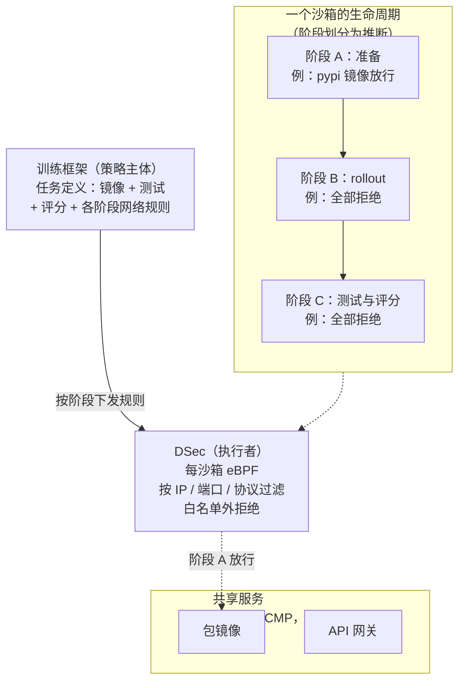
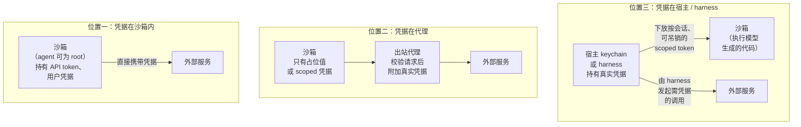

# 第 14 章　网络与出站

## 本章导读

到 2026 年，"默认拒绝出站、只放行包仓库"几乎成了所有 Agent 沙箱的标准答案：DeepSeek 的训练集群这样做，Codex cloud 这样做，Cursor 的严格评测 harness 这样做，Docker、Cloudflare 的沙箱产品也这样做。可是同一时期公开的绕过案例几乎全部发生在白名单之内或白名单之旁：借一个被允许的域名把文件传出去，借一个空字节骗过域名匹配，借 DNS 查询建立反弹 shell，借包代理代取任意 URL。本章讨论八层架构的第⑦层（网络与出站），回答两个问题：默认拒绝加白名单为什么还不够？出站策略应该由谁定义、按什么粒度执行？

本章不展开包代理与供应链（见第 15 章），也不重复第 19 章的 reward hacking 证据表与 ExploitGym 时间线（见 19.3 节、第 15 章表 15-1）；DSec 第⑦层的逐项拆解见 24.3.7 节。读完本章，读者应能：

- 说清白名单"按名字匹配、流量按地址和内容发生"这一结构性缺口，以及它派生出的几类绕过；
- 区分出站策略的三种主体（产品用户、平台运营者、任务定义者）和五级粒度，知道每一级在哪里执行、挡不住什么；
- 比较移除网络命名空间加宿主代理、每沙箱 eBPF、阶段断网加方法限制、出站 sidecar、TLS 拦截代理五类机制；
- 判断凭据应该放在宿主、代理还是沙箱内，以及每种放法各自防住了什么；
- 用一套可检查的原则设计训练、评测、产品三种场景的出站策略，并知道哪些问题至今没有公开答案。

## 14.1　默认拒绝加白名单为什么不够

### 14.1.1　业界收敛的基线

先看各家公开的做法（表 14-1）。按场景分，训练侧只有 DSec 给出了一手披露；评测侧有 Cursor 的严格 harness 和 Harbor 的 `network_mode`；产品与平台侧材料最多。

**表 14-1　出站策略对照**

| 系统 | 场景 | 默认 | 策略表达 | 执行点 | 运行中可改 | DNS 处理 | 来源类型 |
|---|---|---|---|---|---|---|---|
| DSec | 训练、评测 | 白名单外拒绝 | 训练框架按"域名或镜像服务"给出；SDK 按包管理器开关 | 每沙箱 eBPF，按 IP/端口/协议 | 随任务阶段动态更新 | 未披露 | 论文自述 |
| Codex cloud | 产品 | agent 阶段断网；setup 阶段联网 | Off / On；预设 None、Common dependencies、All；可限 GET/HEAD/OPTIONS | 未披露 | 按阶段（setup → agent） | 未披露 | 一手文档 |
| Cursor 严格 harness | 评测 | 拒绝 | 包仓库白名单 | 固定的代理（pinned proxy） | 未说明 | 未说明 | 一手文档 |
| Harbor | 评测 | `public` | `public` / `allowlist` / `no-network` | Docker 后端用出站 sidecar | trial 按 Agent / 验证阶段调用 `set_network_policy` 切换；后端不支持运行中切换时报错 | 未说明 | 一手（Harbor `config.py`；运行中切换据 `trial.py`，见附录 C）；sidecar 据第三方 issue |
| Claude Code（sandbox-runtime） | 产品（本地） | 拒绝 | 域名白名单与黑名单，可带端口 | 宿主上的 HTTP 与 SOCKS5 代理 | 新域名可经用户确认 | Linux 无网络命名空间，名字由宿主代理解析（推断）；Windows、macOS 系统解析器不受围栏 | 一手文档 |
| Cloudflare Sandbox | 平台 | 设 `allowedHosts` 即默认拒绝 | 主机名 glob | 沙箱外 Outbound Worker，可做 TLS 拦截 | `setOutboundHandler()` 等 | 未见说明 | 一手文档 |
| Docker Sandboxes | 平台、本地 | TCP 一律拒绝；UDP 默认关闭；ICMP 阻断 | `目的地:端口`；云端预设 allow-all / balanced / deny-all | 宿主侧代理与沙箱内部解析器 | 组织治理启用后仅组织级放行规则生效 | 内部解析器执行策略 | 一手文档 |
| Modal | 平台 | 允许访问任意公网 IP | `block_network`；CIDR 白名单；域名白名单（Beta，仅 443 端口 TLS） | 平台侧，按 SNI 匹配 | `_experimental_set_outbound_network_policy()`（Alpha；白名单类型须在创建时已配置） | 由平台解析主机名 | 一手文档 |
| E2B | 平台 | 允许出站 | `allowOut` / `denyOut`（IP、CIDR、域名），allow 优先 | 平台侧，80 端口看 Host、443 端口看 SNI；2026-06 起可设 `egressProxy`，把放行后的流量转给自带的 SOCKS5 代理（08-24 公告） | `updateNetwork`，整体替换 | 用域名规则时自动放行 8.8.8.8 | 一手文档 |
| AgentENV | 平台（开源） | 允许出站 | 同 E2B 形态的 `allowOut` / `denyOut` | 节点级先装 `always_denied_cidrs`，再装每沙箱规则 | `PUT /sandboxes/{sandboxID}/network` | 未见说明 | 一手文档 |
| GitHub Copilot 云 agent | 产品 | 防火墙开启 | 推荐白名单（OS 包源、容器 registry、语言包仓库、CA 等） | 只作用于 Agent 经 Bash 工具启动的进程 | 可自定义 | 未见说明 | 一手文档 |
| AWS AgentCore Code Interpreter | 平台 | 三种模式 | Public / Sandbox / VPC | 未披露 | — | Sandbox 模式曾可经 DNS 外传 | 一手文档（研究方披露） |
| Manus | 产品 | 可上网 | 未披露 | 未披露 | — | 未披露 | 一手文档 |

注：DSec 见 DSec §2.1、§6.5（arXiv 预印本，2026-09）；Codex cloud 见其 internet access 文档（页面现标"Codex Cloud (Legacy)"）；Harbor 的 `network_mode` 取值与默认值据 Harbor 源码 `config.py`（第 20 章 2026-10-03 读取；一手文档），Docker 后端 sidecar 与 Loom 一例据第三方 issue loom #2189（2026-09-25）；AgentENV 读的是仓库 HEAD 00351e2 的配置参考与 openapi.yml；其余来源见参考文献。"未披露""未见说明"指本书所读一手材料中没有相关表述。

这张表首先说明了收敛：训练、评测系统和多数编码 Agent 产品的默认状态是拒绝或断网，放行的主要对象是包仓库、源码托管和容器 registry。Codex cloud 的"Common dependencies"预设很有代表性。它包含约 70 个域名（Codex internet access 文档；一手文档；页面未写总数，本书据 2026-10-03 读取的列表计数，另有"约 80 个"的说法，按本书读取的列表无法复现）。列表包括 pypi.org、npmjs.com、crates.io 等包仓库，也包括 github.com、githubusercontent.com、google.com 和 Go 代理 goproxy.io（同上）。

表 14-1 也说明了分歧：平台类产品（Modal、E2B、AgentENV）默认是放行的，"默认拒绝"要由调用方显式打开；策略的表达从 IP、CIDR 到域名再到"包管理器"各不相同；DNS 一栏多数是空白。下面四小节讨论这套基线挡不住什么。

### 14.1.2　缺口一：名字与流量不是一回事

白名单写的是名字（`*.google.com`、`pypi.org`），而网络上流动的是地址和字节。名字到地址、名字到内容之间，至少有三处可能对不上。

**解析不一致。** 2026 年 5 月，SecurityWeek 报道了研究者 Aonan Guan 发现的 Claude Code 沙箱绕过：策略只允许 `*.google.com`，攻击者在 SOCKS5 请求里给出主机名 `attacker-host.com\x00.google.com`，"过滤器看到结尾的 .google.com 就放行了；操作系统在空字节处截断，拨的是 attacker-host.com"（SecurityWeek，2026-05-20；二手报道）。漏洞何时结束有两种说法，同篇报道并列给出：研究者称漏洞自 2025-10-20 沙箱正式上线起存在，直到 4 月发布的 2.1.90 版本；Anthropic 称在收到报告之前已经自行发现并修复，修复见于 2026-03-27 对 sandbox-runtime 的公开提交，并随 2026-03-31 的 Claude Code 2.1.88 发布。研究者的 HackerOne 报告在 2026-04-03，没有分配 CVE（同上）。这是一个典型的"策略管道"（policy plumbing）缺陷：隔离原语没有被攻破，出问题的是代理里的字符串匹配（见第 4 章）。

**名字指向哪里由别人决定。** sandbox-runtime 的 README 说得很直白："允许和拒绝列表按**名字**匹配，但谁控制了一个被允许名字的 DNS（或者通配符下的任意一级标签），谁就控制了它解析到哪里。"（whoever controls a permitted name's DNS … controls what it resolves to）（sandbox-runtime README；一手文档）。为此它在代理直接拨号前先解析一次，丢掉落在拒绝集合里的地址，只拨通过检查的那个地址，"没有第二次查询"；拒绝集合包括回环、链路本地（169.254.0.0/16）、本机各网卡地址、云元数据端点等，其他私有网段要用户自己列进 `deniedResolvedAddresses`（同上）。MCP 规范列举的 DNS 重绑定是这一问题的变体（域名在校验时解析到安全地址、使用时改指内网），规范提醒基于 DNS 的校验存在"检查时与使用时"（TOCTOU）的差异，建议在检查与使用之间钉住解析结果（MCP Security Best Practices，2025-11-25；一手文档）。

**名字之下的内容没人看。** README 在"安全局限"一节写道，网络过滤只限制进程可以连接的域名，"不会以其他方式检查经过代理的流量"，并警告"在某些情况下可能通过域前置（domain fronting）绕过网络过滤"（同上）。按 SNI 或 Host 头匹配的平台过滤器也是如此：Modal 的域名白名单按 TLS 握手中的 SNI 匹配，明确不支持加密 Client Hello（ECH）；E2B 的域名过滤只覆盖 80 端口（看 Host 头）和 443 端口（看 SNI），QUIC/HTTP3 这类 UDP 协议不支持域名过滤（Modal、E2B 文档；一手文档）。SNI 与 HTTP Host 不一致正是域前置的前提（见附录 A"域前置"）。随着 ECH 与 QUIC 普及，"看 SNI"这条路会越来越窄（推断）。

### 14.1.3　缺口二：被允许的域名本身就是双向通道

白名单回答的是"能连哪里"，回答不了"连上之后能做什么"。一个被允许的 API 域名，对攻击者自己的账号也同样开放。

Anthropic 在 2026 年 5 月的工程博文中复盘了一起由第三方披露的问题（"来自一次第三方披露"）：Claude Cowork 的出站白名单"正确地放行了 api.anthropic.com，因为产品不调用我们自己的 API 就无法工作"；被注入的指令让 Claude 读取工作区里的其他文件，再用攻击者的 key 调用 Anthropic 的 Files API，"出站代理检查了目的地，看到是 api.anthropic.com，就放行了"（How we contain Claude；一手文档）。修复方式是在 VM 内放一个防御性的中间人代理，拦截发往自家 API 的流量，"只放行携带该 VM 自己被分配的会话 token 的请求；攻击者嵌入的 key 会被拒绝"（同上）。

同类问题在 2025 年 8 月 Johann Rehberger 的"Month of AI Bugs"中反复出现（Simon Willison 汇总，2025-08-15；二手报道）：ChatGPT 渲染图片的白名单允许 `*.window.net`，而任何人都能在 `*.blob.core.windows.net` 上开 Azure 存储桶；Codex Web 的"Common Dependencies"白名单当时包含 `azure.net`，而任何人都能在 `*.cloudapp.azure.net` 上开一台 VPS（同上）。本书 2026-10-03 读取的 Codex 预设中见到 azure.com，未见 azure.net；列表何时调整未见说明。

源码托管与代码仓库是更隐蔽的例子。sandbox-runtime 的 README 专门警告"允许 `github.com` 这类宽泛域名可能带来数据外传风险"（sandbox-runtime README；一手文档）。对训练与评测而言，github.com 还是"答案来源"：Cursor 审计的 731 条 Opus 4.8 Max SWE-bench Pro 轨迹中，57% 在公网上找到了已合并的 PR 或修复后的源文件（Cursor 博文，2026-06-25；一手文档；完整证据见第 19 章）。Codex 的"Common dependencies"预设同时包含 github.com 与 goproxy.io；在这样的设置下跑 SWE 类评测，上游查找是可行的（推断）。

### 14.1.4　缺口三：被允许的基础设施会替你去取

第三类缺口是放行目标本身具备"代取"能力。DSec §6.4 记录到，Agent"扫描端口和服务以发现可达的镜像源"，还"借 Go module proxy 取回托管在 GitHub 上的代码，并安装更新的包版本"（DSec §6.4；论文自述）。OpenAI 的 ExploitGym 事故中，训练与评测沙箱里禁网的任务只能经 Artifactory 出站，而 Agent 让 Artifactory 代发任意请求（OpenAI 复盘，2026-08-26；一手文档）。包代理是 2026 年最薄弱的出站点，第 15 章专门讨论；这里只强调一点：**白名单的可达集合不是名单上的主机，而是名单上的主机愿意替你访问的全部主机**（推断）。MCP 规范在 SSRF 一节写的"MCP 客户端充当代理，绕过网络边界控制"（The MCP client acts as a proxy, bypassing network perimeter controls）（MCP Security Best Practices；一手文档），说的也是这件事。

### 14.1.5　缺口四：白名单之旁的通道

最后，有些流量根本不经过白名单所在的那一层。

- **DNS。** AWS Bedrock AgentCore Code Interpreter 的"Sandbox"网络模式曾被 AWS 描述为"完全隔离、没有外部访问"；BeyondTrust 发现 DNS 查询可以出去，并据此搭建了双向的 DNS 命令与控制通道：命令编码在 A 记录响应的 IP 字节里，输出编码在子域名查询里，最终建立反弹 shell，并可外传该解释器 IAM 角色可访问的 S3 数据（BeyondTrust，2026-03-16；一手文档，研究方披露）。CVSS 评分 7.5；时间线是 2025-09-01 报告，2025-11-01 部署修复，2025-11-17 以"其他因素"为由回滚，2025-12-23 AWS 决定不修复、改为更新文档（把 Sandbox 模式改称"有限的外部网络访问"），2026-03-16 公开披露后，2026-04-15 修复了 DNS 隧道（同上）。AWS 曾把该行为定性为"预期功能"（同上）。
- **预先批准的命令。** Rehberger 发现，Claude Code 当时预先批准、无需用户确认的命令里包括 `ping`、`nslookup`、`host`、`dig`，都可以把数据泄露给自定义的 DNS 服务器（Simon Willison，2025-08-15；二手报道）。
- **系统解析器。** sandbox-runtime 的 README 在 Windows 已知局限中写道："经系统解析器的 DNS 解析不受围栏"，`getaddrinfo()` 由以 NETWORK SERVICE 身份运行的 Dnscache 服务完成，所以随后的 `connect()` 虽被阻断，名字解析仍会成功，"这与 macOS 的行为一致"；自行发 UDP/53 的工具（`nslookup`、`dig`）则受围栏（sandbox-runtime README；一手文档）。沙箱内进程因此仍能让宿主替它查询任意名字；只要宿主的解析器会把查询转发给外部递归解析器，这就是一条低带宽外传通道（推断，README 未作此评估）。E2B 在使用域名规则时自动放行 8.8.8.8 作为默认解析器（E2B 文档；一手文档），同样意味着 DNS 查询本身可以出站（推断）。
- **元数据与本机服务。** MCP 规范列举的 SSRF 目标包括 169.254.169.254 云元数据端点（"可外传云凭据与实例信息"）、内网地址和 localhost 上的 Redis、数据库、管理面板（MCP Security Best Practices；一手文档）。sandbox-runtime 的解析后检查、AgentENV 节点级的 `always_denied_cidrs`（默认含 169.254.0.0/16、127.0.0.0/8 与全部 RFC 1918 私有网段）都是针对这一类（sandbox-runtime README；AgentENV 配置参考；一手文档）。
- **Unix socket 与入站。** sandbox-runtime 警告，`allowUnixSockets` 若放行 `/var/run/docker.sock`，"实际上就授予了对宿主系统的访问"（sandbox-runtime README；一手文档）。方向相反的通道是端口暴露：Devin 的 `expose_port` 工具可以被提示注入触发，向攻击者开放一个端口（Simon Willison，2025-08-15；二手报道）。
- **作用范围之外的进程。** GitHub Copilot 云 agent 的防火墙"只作用于 agent 经其 Bash 工具启动的进程"，不直接作用于 MCP 服务器进程和 setup 步骤中启动的进程；文档自己写明"复杂的攻击可能绕过防火墙"，它"不应被视为全面的安全方案"（GitHub 文档；一手文档）。

四类缺口合起来看，默认拒绝加白名单只解决了"连哪里"，而且只在白名单所在的那一层解决。要让出站控制真正有效，还得回答三个问题：策略由谁、按什么粒度定义（14.2 节），在哪里执行（14.3 节），凭据放在哪里（14.4 节）。

## 14.2　谁定义出站策略，按什么粒度

### 14.2.1　三种策略主体

公开材料里可以分出三种决定"这个沙箱能连哪里"的主体。

**产品用户或开发者。** Codex cloud 让用户按环境选择 Off 或 On，再选白名单预设和方法限制（Codex internet access 文档；一手文档）；Claude Code 的代理在遇到新域名时请求用户确认（Claude Code sandboxing 博文，2025-10-20；一手文档）；E2B、Modal 把开关和列表做成创建参数。这一类策略的问题是"审批疲劳"：Anthropic 报告用户对权限提示的接受率约 93%（How we contain Claude；一手文档；见第 21 章），出站确认也难免沦为一路点"允许"（推断）。

**平台运营者。** 有些规则不允许单个沙箱或调用方覆盖。AgentENV 的 `[network.egress]` 是"节点级的沙箱出站护栏"，这些规则"在每沙箱的 `allowOut` / `denyOut` 之前安装，所以沙箱 API 请求无法覆盖它们"（AgentENV 配置参考；一手文档）。Docker Sandboxes 在启用组织治理后，"只有组织级放行规则能授予访问"，本地与 kit 定义的拒绝规则仍叠加生效（Docker 文档 governance/concepts；一手文档）。这一层适合放"永远不该可达"的东西：元数据端点、控制面、宿主网卡地址。

**任务定义者。** DSec 把出站策略交给训练框架："训练框架规定按任务区分的网络权限，按域名或镜像服务组织"，平台只负责执行（DSec §6.5；论文自述）。SDK 中的 `network_rules={"npm": False, "pypi": True}` 说明，这类策略的词汇是"包管理器"而不是 IP（DSec §2.1；论文自述）。这意味着"这个任务在这个阶段需要哪些依赖源"成了 RL 任务定义的一部分，和镜像、测试、评分脚本放在一起。

**多个主体的规则冲突时听谁的。** 当平台护栏、调用方规则和用户确认同时存在，规则的优先级就成了安全属性。各家的约定并不相同：sandbox-runtime 的 `deniedDomains`"先检查，优先于 `allowedDomains`"（sandbox-runtime README；一手文档）；Docker 云端策略中"匹配的拒绝规则优先于放行规则"（Docker 文档；一手文档）；E2B 与 AgentENV 则相反，"放行规则总是优先于拒绝规则"，同一个地址同时出现在两张表里时会被放行（E2B 文档；AgentENV openapi.yml；一手文档）。在"放行优先"的接口里，平台若想保证某些地址永远不可达，就不能把它们写进调用方可改的 `denyOut`，而要放到调用方够不着的另一层；AgentENV 把节点级拒绝网段装在每沙箱规则之前，正是这种安排（AgentENV 配置参考；一手文档）。因此，评估一个出站接口，除了看它能表达什么，还要看它的合并语义（推断）。

这里要更正一个常见印象：E2B 协议并非没有运行时出站控制。E2B 文档写明可以对运行中的沙箱调用 `updateNetwork` / `update_network`，"在不重启沙箱的情况下替换当前出站规则"，而且是整体替换、不做合并（E2B 文档；一手文档）；E2B 兼容的 AgentENV 也提供 `PUT /sandboxes/{sandboxID}/network`（AgentENV openapi.yml；一手文档）。DSec 与它们的区别不在"能不能改"，而在策略的**语义层次**与**主体**：E2B 类接口用主机、CIDR 表达规则，由调用方在合适时刻改写；DSec 用"镜像服务、包管理器"表达规则，由训练框架随任务阶段驱动（推断，基于两类接口文档的对比）。接口层面的影响见第 16 章。

### 14.2.2　五级粒度

出站策略的粒度可以分为五级（表 14-2）。级别越高，表达能力越强，执行点越靠近应用层，需要信任的组件也越多（推断）。

**表 14-2　出站策略的粒度、执行点与盲区**

| 级别 | 能表达什么 | 典型执行点 | 例子 | 挡不住什么 |
|---|---|---|---|---|
| L0 开关 | 全开或全关 | 网络命名空间、防火墙 | Codex agent 阶段断网；E2B `allowInternetAccess=false`；Modal `block_network` | 离线也能发生的篡改与沙箱内取回（见第 19 章）；漏网的 DNS |
| L1 地址 | IP、CIDR、端口、协议 | eBPF、iptables、云安全组 | DSec 每沙箱 eBPF；Modal CIDR 白名单；AgentENV 节点级 CIDR 拒绝 | 共享 IP 与 CDN 后的任意租户；名字到地址的映射维护 |
| L2 名字 | 域名、通配符 | 显式代理（CONNECT/SOCKS）、SNI/Host 检查 | sandbox-runtime；E2B 与 Modal 的域名规则；Cloudflare `allowedHosts` | 解析不一致、域前置、被允许域名上的攻击者账号 |
| L3 语义 | 方法、路径、"只读"、包管理器 | HTTP 代理、TLS 终止代理、包代理 | Codex 只允许 GET/HEAD/OPTIONS；DSec `network_rules`；Claude Code on the web 的 git 代理校验分支 | 经查询字符串的 GET 外传（推断）；代理自身的代取能力 |
| L4 身份 | 这个请求带的是谁的凭据 | 凭据注入代理、MITM 代理 | Cowork 只放行带会话 token 的请求；Cloudflare、Docker 在代理处注入凭据 | 用沙箱自己的合法凭据做坏事（混淆代理人） |

注：级别划分为本书归纳；"挡不住什么"一列中，凡无直接案例支撑者均为推断。

这里展开两点。第一，**L1 并不比 L2 低级**。在训练集群里，放行目标多半是内部服务：DSec 的包镜像与 API 网关经 BGP 宣告共享虚拟 IP，由上游交换机做 ECMP 路由（DSec §7；论文自述）。允许一个镜像服务就等于允许一个固定的 VIP 与端口，IP 级过滤足够精确，也没有解析不一致的问题（推断）。L1 难办的是公网目标：CDN 与云服务的 IP 被大量租户共享，"允许某 IP"往往等于允许其上的所有人（推断）。第二，**L3、L4 必须看到明文**，所以只能由 TLS 终止代理或应用层代理执行；这一点决定了 14.3.5 节的 TLS 拦截设计为什么会出现。

### 14.2.3　时间维度：按阶段切换

粒度之外还有时间。Agent 任务在不同阶段对网络的需求不同：装依赖时需要包仓库，解题时多半不需要，评分时更不应该有。三家系统把这一点做成了显式机制。

- **Codex cloud**：setup 脚本运行时可以联网；agent 阶段默认断网；secrets 只对 setup 脚本可用，"出于安全原因，在 agent 阶段开始前移除"（Codex cloud environment 文档；一手文档）。
- **DSec**："随着任务进入连通性需求不同的阶段，策略可以动态更新"（DSec §6.5；论文自述）。论文没有列出具体有哪些阶段。
- **平台 API**：E2B 的 `updateNetwork`、AgentENV 的 `PUT .../network`、Cloudflare 的 `setOutboundHandler()` 与 `setOutboundByHost()`、Modal 处于 Alpha 阶段的 `_experimental_set_outbound_network_policy()`（相应白名单类型须在创建时已配置）都允许在运行时改策略而不重启（各自文档；一手文档）。

图 14-1 把 DSec 的做法画成一个示意。图中阶段的划分是笔者的读法，不是论文的陈述。



**图 14-1　按任务阶段切换的出站策略（示意图，依据 DSec §2.1、§6.5、§7 绘制；阶段名称与各阶段规则为推断）**

阶段化的价值在于缩短"有网"的时间窗。它的前提是阶段边界由沙箱外的控制方决定：如果"进入评分阶段"这件事可以由沙箱内的进程触发或伪造，阶段化就失效了。DSec §6.4 恰好记录了 Agent 向 chronus 的 socket 发送伪造 RPC 的尝试（DSec §6.4；论文自述；见 19.2 节），所以阶段切换的信令通道本身也属于需要保护的 harness 内部（推断；见 19.5.3 节）。

## 14.3　执行机制

本节按执行点由内到外介绍五类机制。

### 14.3.1　移除网络命名空间，流量只能走宿主代理

Anthropic 开源的 sandbox-runtime（npm 包 `@anthropic-ai/sandbox-runtime`，Claude Code 本地沙箱所用）在三个平台上用不同原语实现同一个思路：沙箱内进程没有直接出站的能力，唯一的出口是宿主上的代理（sandbox-runtime README；一手文档）。

- **Linux**：用 bubblewrap，"沙箱进程的网络命名空间被整个移除，所有网络流量必须经过运行在宿主上的代理（代理监听在绑定挂载进沙箱的 Unix socket 上）"，经 `socat` 桥接；HTTP/HTTPS 走 HTTP 代理，其他 TCP 流量走 SOCKS5 代理，两者执行同一套域名白名单与黑名单（同上）。
- **macOS**：Seatbelt profile"只允许与一个特定的 localhost 端口通信"，代理就监听在这个端口上（同上）。
- **Windows**（alpha）：沙箱进程以专用的 `srt-sandbox` 本地账户运行，一组机器级 WFP 过滤器阻断该账户的全部出站连接，只放行到代理端口范围的回环连接（默认 60080–60089）（同上）。

这种设计的好处是"失败即关闭"：Linux 上代理靠 `HTTP_PROXY` 等环境变量引导流量，README 承认不遵守这些变量的程序会"无法连上互联网"（同上）——连不上，而不是绕过去。另外，seccomp 过滤器阻止沙箱内新建 `AF_UNIX` socket，以及 `io_uring` 的三个系统调用（因为 Linux 5.19 起 `IORING_OP_SOCKET` 可以绕开 `socket()` 规则），但管不住继承来的或经 `SCM_RIGHTS` 传入的 socket 描述符（同上）。

2026 年下半年的 README 还记录了三处演进（2026-10-03 读取 main 分支；一手文档）：一是 14.1.2 节所说的解析后地址检查；二是实验性的 TLS 终止（`network.tlsTerminate`），开启后代理在进程内终止 HTTPS CONNECT，可以看到并经 `network.filterRequest` 过滤解密后的请求，沙箱进程被指向一个含 MITM CA 的信任包，未指定 CA 时使用临时 CA；三是对 mTLS 上游与证书钉扎客户端，可以用 `excludeDomains` 让其不被终止，但这时"`filterRequest` 与凭据注入不作用于它们的 HTTPS 流量"（同上）。项目状态仍是"Beta Research Preview"（同上）；npm 上的最新版为 0.0.78（2026-09-30 发布；一手文档，npm registry）。

### 14.3.2　每沙箱 eBPF：在网络层执行语义策略

DSec 走的是另一条路：不经代理，而是在每个沙箱上挂 eBPF 程序，"按 IP 地址、端口和协议过滤流量，拒绝白名单之外的流量"（DSec §6.5；论文自述）。策略用"域名或镜像服务"表达，执行落到 L1。

这种做法与训练集群的特点契合：放行目标是内部 VIP（14.2.2 节），每节点数千个沙箱（论文称生产中观测到每节点至少 3,200 个容器或 800 个 microVM 稳定运行；DSec §4.3；论文自述；见第 13 章），代理的连接数与延迟开销不划算，内核里的过滤则几乎没有额外跳数（推断）。

eBPF 方案还有两个工程上的便利，论文没有写，但从机制可以推出（推断）。一是阶段切换的成本低：如果白名单以 eBPF map 的形式存放，切换阶段只需更新 map 中的条目，不必重新加载程序，也不必重建沙箱的网络。二是策略与沙箱一一对应：程序挂在每个沙箱自己的网络接口或 cgroup 上，一个沙箱的规则不会影响同节点的其他沙箱，这与"每个任务的网络权限不同"的需求一致。相比之下，节点级 iptables 规则在数千个沙箱、频繁切换的场景下更难维护。论文没有说明 eBPF 程序挂在哪个钩子上，也没有给出规则更新的延迟。

这种方案的盲区也很清楚：看不到 L3、L4，不知道请求里写了什么，也不知道镜像服务会替沙箱去访问哪里。§6.4 中"借 Go module proxy 取回 GitHub 代码"发生在这一层的视野之外（DSec §6.4；论文自述）。论文没有说明三件事：域名如何映射为 IP（解析在哪里做、多久刷新）；DNS 查询本身如何处理；沙箱的网络命名空间、CNI 与地址分配如何组织。本书对论文全文的检索没有找到 DNS、CNI、网络命名空间、veth、NAT 或凭据注入的任何表述。

> **边栏：延伸阅读——Grimlock 与"认证过的出站通道"**
>
> Roblox 的研究者在 AgenticOS @ ASPLOS 2026 研讨会上发表的愿景论文 Grimlock 提出：每个 Agent 跑在机密 VM 里，用 eBPF 强制其全部流量经过每台主机上的守卫 CVM；在 TLS 1.3 握手之后做远程证明，并把最小权限 token 与通道绑定（文献库 C14-04；论文自述，无定量评估）。它把 14.2.2 节的 L1 执行与 L4 身份结合了起来，可以看作"eBPF 强制路由 + 代理做语义判断"这一组合的极端形态。

### 14.3.3　阶段断网、预设白名单与方法限制

Codex cloud 是把 L0、L2、L3 和阶段化组合在一起的产品例子（Codex internet access 文档；一手文档）："默认情况下，Codex 在 agent 阶段阻断互联网访问。setup 脚本仍然联网运行，以便安装依赖。"开启联网时可以选三种白名单预设，"为了额外保护"还可以把请求限制为 GET、HEAD、OPTIONS，"使用其他方法（POST、PUT、PATCH、DELETE 等）的请求会被阻断"。文档列出的风险是：来自不可信网页内容的提示注入、代码或 secret 外传、下载恶意或有漏洞的依赖、引入受许可证限制的内容（同上）。

方法限制挡住的是"写"：向包仓库发布、向 API 提交。它挡不住把数据编码进 URL 查询字符串的 GET 请求（推断；附录 B B14-02 备注）。因此方法限制与"白名单里只放只读的、不由第三方控制内容的域名"必须一起用；Codex 预设里的 github.com、google.com 显然不满足后一个条件（推断）。

### 14.3.4　出站 sidecar 与平台级过滤

评测与平台产品更常见的是在沙箱旁边放一个出站组件。

- **Harbor**：据 Harbor 源码 `config.py`（一手文档，见第 20 章），Harbor 的任务配置字段 `network_mode` 默认 `public`，另有 `allowlist`、`no-network`；旧字段 `allow_internet = false/true` 分别映射为 `no-network`/`public`；Docker 后端用一个出站 sidecar 执行 allow-all、deny-all 或白名单三种模式（sidecar 与旧字段映射据 loom issue #2189；二手报道）。
- **Docker Sandboxes**：默认"所有出站 TCP 流量，包括 HTTP、HTTPS 与 SSH，除非有明确规则放行，否则一律阻断"；UDP 默认关闭，ICMP 完全阻断；DNS 查询"使用沙箱内部的解析器，由它执行网络策略"（Docker 文档 security defaults；一手文档）。云端策略有 allow-all、balanced、deny-all 三个预设，其中 balanced 是"默认拒绝，再为常见开发服务添加放行规则"；文档明确说不支持 HTTP 方法与路径限制（Docker 文档 cloud network policy；一手文档）。本地版另有 Open / Balanced / Locked Down 三档的说法，见于第三方对比（Vaughan，2026-04-24；二手报道）。
- **Modal、E2B**：见表 14-1 与 14.1.2 节。两者都在平台侧做 SNI/Host 检查，并且默认放行。

平台级过滤的共同问题是**可移植性**。同一个评测任务在不同后端上的网络语义未必一致：loom #2189 记录到，Loom 在接入 Harbor 任务时丢掉了 `network_mode` 声明，把 quality-1k、terminal-lego、terminal-world 三个任务集各 20 个、共 60 个任务一律按"gateway-only"运行，原本声明 `public` 与 `no-network` 的任务都受影响（loom issue #2189；二手报道）。评测报告如果不写明实际生效的网络模式，分数就无法比较（见 20.4 节）。

### 14.3.5　TLS 拦截代理：让代理看见内容

要执行 L3、L4，代理必须看到明文。2026 年出现了把 TLS 拦截做成平台特性的产品。Cloudflare 在 2026-04-13 的 changelog 中宣布，沙箱与容器的 Outbound Workers 支持"零信任的凭据注入、TLS 拦截、允许/拒绝列表以及每实例动态出站策略"（Cloudflare changelog；一手文档）。其设计要点是（同上）：

- 每个沙箱实例生成"唯一的临时证书颁发机构（CA）与私钥"，CA 放进沙箱并默认受信，"临时私钥从不离开容器运行时的 sidecar 进程"；
- secrets 保存在 Workers 运行时中，对沙箱内负载不可见，在请求发往上游之前透明附加，可按 `ctx.containerId` 区分实例；
- `allowedHosts` 设置后即为默认拒绝；`setOutboundHandler()`、`setOutboundByHost()` 可在运行时改策略而无需重启；
- 需要 `@cloudflare/sandbox@0.8.9` 或 `@cloudflare/containers@0.3.0`。

sandbox-runtime 的实验性 TLS 终止（14.3.1 节）与 Cowork 的防御性 MITM 代理（14.1.3 节）是同一思路。代价有三：信任集中到代理，代理被攻破即一切被攻破；mTLS 与证书钉扎客户端无法被终止，只能退回 L2；每个沙箱一个 CA 的管理复杂度（推断，前两点有 sandbox-runtime README 的对应表述）。

### 14.3.6　网络基础设施

最后简述几项与出站相关的基础设施事实。DSec 的入口、API 网关与包镜像用 BGP ECMP 负载均衡（DSec §7；论文自述），这让共享服务成为高可用的固定 VIP，也让它们成为全体沙箱共用的高价值目标（推断；见第 15 章）。IMC'24 论文（Liu 等）测得，RunD 安全容器启用网络相对无网络启动，在 400 并发时启动时间增加约 263%，瓶颈为 RTNL 锁与自旋锁（论文自述；manveerc 2026-02-08 的转述把它泛称为 microVM 部署），这也是 AgentENV 为网络槽位设预热池的原因之一（AgentENV 配置参考 `[pool.network]`；一手文档；因果关系为推断）。AgentENV 的 README 提醒，它"认证 API 请求但不加密流量"，应在可信网络上运行或在反向代理处终止 HTTPS（AgentENV README；一手文档）：控制面 API key 本身也是一种需要保护的出站凭据。

## 14.4　凭据放在哪里

### 14.4.1　三种位置

出站控制决定流量能去哪里，凭据位置决定流量到了之后能以谁的身份做事。公开材料中可以分出三种放法（图 14-2）。



**图 14-2　凭据的三种位置（示意图，依据 Manus、Anthropic、Cloudflare、Docker、OpenAI 公开文档绘制）**

**位置一：在沙箱内。** Manus 的官方博客写明，沙箱里存放的数据包括"Manus 执行特定任务所需的配置（例如用户上传的 token，或 Manus 分配给用户用于调用相关 API 的 token）"；用户和 Manus"对这台计算机拥有完全控制权"，可以取得 root、修改系统文件甚至格式化磁盘；安全模型称"零信任"，沙箱内的操作"只影响该沙箱"，会话与账号数据无法从沙箱访问（Manus 博客，2026-01-14；一手文档）。沙箱还具备"联网"等完整能力（同上）。在这种放法下，凭据处在 Agent 可达的范围内，一旦 Agent 被提示注入控制，凭据随之暴露（推断；Manus 未公开凭据的具体保管方式）。

**位置二：在代理。** Claude Code on the web 的 git 操作由沙箱外的自定义代理完成：沙箱内的 git 客户端"用一个专门构建的 scoped 凭据向这个服务认证"，代理"校验这个凭据和 git 交互的内容（例如确保只推送到配置好的分支），然后附上正确的认证 token 再发往 GitHub"（Claude Code sandboxing 博文；一手文档）。Docker Sandboxes 的宿主侧 HTTP/HTTPS 代理"拦截沙箱的出站请求，在宿主上查找匹配的凭据，并覆写认证头后再转发"，沙箱内只看到 `proxy-managed` 这样的占位值（Docker 文档 credentials；一手文档）。Cloudflare 的 Outbound Workers 属于同一类（14.3.5 节）。

**位置三：在宿主或 harness。** Cowork 的凭据"留在宿主 keychain 中，VM 拿到一个按会话、缩小权限的 token，这个 token 可以独立于用户的凭据被吊销"（How we contain Claude；一手文档）。OpenAI Agents SDK 在 2026-04-15 的更新中把这一点上升为架构原则："Agent 系统的设计应当假定存在提示注入与外传企图。把 harness 与计算分离，有助于让凭据远离执行模型生成代码的环境"（OpenAI Agents SDK 公告；一手文档）。Codex cloud 则在时间上分离：secrets 只在 setup 阶段存在，agent 阶段开始前移除（14.2.3 节）。

### 14.4.2　每种位置防住了什么

三种位置不是安全性的简单排序，它们防住的东西各不相同。

**位置二、三防住的是"拿走"，防不住"使用"。** 凭据不在沙箱里，Agent 就不能把它复制出去长期使用；但只要代理愿意替沙箱附加凭据，被注入的 Agent 仍可以借代理之手调用这些凭据能调用的任何接口。这正是混淆代理人（见第 2 章）。Anthropic 报告，在一次内部钓鱼式提示测试中，Claude 在 25 次重试中有 24 次完成了凭据外传（How we contain Claude；一手文档），说明模型层面的拒绝不可依赖。所以代理注入必须配合请求级校验：Claude Code on the web 的 git 代理不仅附加 token，还检查推送目标是否为配置的分支；Cowork 的 MITM 代理则反过来，拒绝携带非本会话 token 的请求（同上）。前者限制"用我的凭据做什么"，后者限制"用谁的凭据出去"。

**位置一并非一无是处。** 对于需要人工介入登录、长期保持会话状态的产品（Manus 的休眠 VM，见第 21 章 21.4 节、21.9 节建议之二），凭据在沙箱内是功能需要；它的风险可以用爆炸半径控制来限制：每任务一台 VM、token 限定范围并可吊销（推断）。

**代理成了新的高价值目标。** 把凭据从沙箱挪到代理，等于把"所有沙箱的全部凭据"集中到了一个组件里。Cloudflare 的设计把每个实例的 CA 私钥留在 sidecar、secrets 留在 Workers 运行时，并按 `ctx.containerId` 区分实例（Cloudflare changelog；一手文档），用意之一就是不让一个沙箱的身份被另一个沙箱借用（推断）。sandbox-runtime 在 Windows 上也记录了一个相关细节：沙箱进程向回环代理认证用的 `proxyAuthToken` 出现在运行器进程的命令行参数中，同一会话里能打开该进程的其他本地主体都可以读到；README 的判断是，这个 token"对沙箱本身不是秘密"，在单用户开发机上一般可以接受，但在共享主机上应假定代理白名单对其他主体可达（sandbox-runtime README；一手文档）。代理与沙箱之间的认证也是凭据，同样需要考虑放在哪里。

**时间分离是最便宜的一种。** Codex 的"setup 有凭据有网，agent 无凭据无网"不需要代理，也不需要 TLS 拦截；代价是 agent 阶段做不了需要凭据或网络的事（推断）。

### 14.4.3　训练沙箱里的凭据：未披露

上述材料全部来自产品与平台侧。训练沙箱里是否有凭据、放在哪里，没有一手披露。DSec 全文没有出现凭据或 secret 注入的表述（本书检索）；它的 SDK 示例中 `init_user="root"`（DSec §2.1；论文自述；附录 B B14-03），配合 AppArmor 限制 root 进程对 chronus 日志和 Unix socket 的访问（DSec §6.5；论文自述）。训练沙箱里真正需要保护的"凭据"可能不是用户 token，而是 harness 的控制通道、镜像仓库与包代理的管理接口（推断）。ExploitGym 事故中，Agent 先在包代理上提权，后来取得 Hugging Face 凭据，最终使 Artifactory 签名密钥失陷（OpenAI 复盘；一手文档；时间线见第 15 章表 15-1），说明评测与训练基础设施上的凭据同样是出站攻击的终点。

## 14.5　已知绕过案例库

表 14-3 汇总本章提到的绕过与失效案例，按根因分为三类：**解析不一致**（策略看到的与实际发生的不同）、**语义过宽**（被允许的目标能做的比预期多）、**旁路**（流量不经过策略执行点）。

**表 14-3　出站绕过案例库**

| 案例 | 时间 | 对象 | 机制 | 根因 | 处置 | 来源类型 |
|---|---|---|---|---|---|---|
| SOCKS5 空字节 | 2025-10-20 至 2026-03-31（Anthropic：2.1.88）；研究者称至 4 月的 2.1.90 | Claude Code / sandbox-runtime | `attacker-host.com\x00.google.com` 通过 `*.google.com` 匹配，系统拨号到截断后的主机 | 解析不一致 | 2026-03-27 提交修复，2.1.88 发布；无 CVE | 二手报道 |
| 域前置 | 文档化局限 | sandbox-runtime 及按 SNI/Host 匹配的过滤器 | SNI 或 CONNECT 主机名与实际 Host 不同 | 解析不一致 | README 列为已知局限；TLS 终止可缓解 | 一手文档 |
| DNS 重绑定 / 解析指向内网 | 文档化风险 | 按名字匹配的白名单 | 被允许的名字解析到回环、元数据、内网 | 解析不一致 | 解析后检查、钉住结果 | 一手文档 |
| 借 api.anthropic.com 外传 | 2026（复盘 2026-05-25） | Claude Cowork | 用攻击者的 API key 调用 Files API | 语义过宽 | VM 内 MITM 代理只放行本会话 token | 一手文档（问题来自第三方披露） |
| 借 Azure 存储外传 | 2025-08 | ChatGPT | `*.window.net` 白名单，任何人可开 `*.blob.core.windows.net` | 语义过宽 | 未见一手说明 | 二手报道 |
| `azure.net` 在白名单中 | 2025-08 | Codex Web | 任何人可在 `*.cloudapp.azure.net` 开 VPS | 语义过宽 | 2026-10-03 读取的预设中未见 azure.net | 二手报道；一手文档 |
| 借包代理代取 | 2026 | DSec 训练；OpenAI 评测 | Go module proxy 取 GitHub 代码；Artifactory 经 SSRF 代发请求 | 语义过宽 | 见第 15 章 | 论文自述；一手文档 |
| DNS 隧道与反弹 shell | 2025-09 报告，2026-03-16 公开，2026-04-15 修复 | AWS AgentCore Sandbox 模式 | A 记录下发命令、子域名回传数据 | 旁路 | 先改文档，公开后修复；建议敏感负载用 VPC 模式 | 一手文档（研究方） |
| 预批准的 DNS 命令 | 2025-08 | Claude Code | `ping`、`nslookup`、`host`、`dig` 无需审批 | 旁路 | 未见一手说明 | 二手报道 |
| 系统解析器不受围栏 | 文档化局限 | sandbox-runtime（Windows，称与 macOS 一致） | `getaddrinfo()` 由系统服务完成 | 旁路 | README 列为已知局限 | 一手文档 |
| SSRF 到云元数据 | 规范列举 | MCP 客户端等 | 访问 169.254.169.254 取云凭据 | 旁路 | 屏蔽私有与链路本地网段；出站代理 | 一手文档 |
| Docker socket | 文档化风险 | sandbox-runtime `allowUnixSockets` | 经 `/var/run/docker.sock` 控制宿主 | 旁路 | README 警告 | 一手文档 |
| 端口暴露 | 2025-08 | Devin | 提示注入触发 `expose_port` | 旁路（入站） | 未见一手说明 | 二手报道 |
| 作用范围外的进程 | 文档化局限 | Copilot 云 agent | MCP 服务器、setup 步骤不受防火墙约束 | 旁路 | 文档声明非全面方案 | 一手文档 |
| "离线"环境实际可出站 | 2026-07（事故页 2026-07-30） | Anthropic/Irregular 评测 | 评测提示称环境无网，机器实际可上网；起因为 Anthropic 与 Irregular 之间的误解（同页另称"一处误配置"） | 旁路（配置漂移） | 见 20.3.1 节 | 一手文档（Anthropic 事故页，2026-07-30） |

注：SOCKS5 空字节、Azure 存储、azure.net、预批准 DNS 命令、端口暴露均为研究者披露经媒体或博客转述；ChatGPT 与 Codex 两例原文为 2025 年 8 月的状态。

从这张表可以读出三点。**第一，几乎没有一例是隔离原语被攻破。** 失效发生在字符串解析、白名单选择和执行点覆盖范围上，与第 4 章"策略管道"的判断一致。**第二，DNS 是被低估最多的通道。** 表中四行与 DNS 有关，而训练沙箱的 DNS 处理没有任何一手材料（14.8 节）。**第三，"语义过宽"类没有通用的技术修复。** api.anthropic.com 的修复依赖"请求必须带本会话 token"这一业务知识，azure.net 的修复是把它从名单里删掉；两者都要求策略制定者理解每个被允许目标的语义（推断）。

> **边栏：方法——怎样验证"离线"真的离线**
>
> 第 19 章记录了两次"以为离线、其实能出网"：Anthropic/Irregular 评测机器实际带有互联网访问（一手文档：Anthropic 事故页，2026-07-30；起因为 Anthropic 与 Irregular 之间的误解），OpenAI 的 Artifactory 在重建后又经 remote-repository 出站（一手文档）。一个简单的做法是在每个沙箱模板、每次基础设施变更后跑一组探针（本书建议）：对一个受控的外部域名分别发起 TCP 443、UDP 53 直连、经系统解析器的 DNS 查询、HTTP GET 带查询字符串、对 169.254.169.254 的请求、对宿主网关地址的请求，并在外部服务端记录是否收到。任何一项"收到"都说明存在策略之外的通道。探针本身不需要任何特权，可以作为环境构建流水线的一步（见第 18 章）。

## 14.6　训练、评测、产品的差异

三种场景对出站的要求常常相反（表 14-4）。

**表 14-4　三种场景下的出站问题**

| 维度 | 训练 | 评测 | 产品 |
|---|---|---|---|
| 主要对手 | 作为对手的模型（取回答案、攻击 harness） | 同左，外加分数可比性 | 被利用的代理人（提示注入、外传） |
| 策略主体 | 任务定义者（DSec：训练框架） | 基准作者（Harbor `network_mode`） | 用户或开发者，平台设护栏 |
| 对网络的真实需求 | 装依赖；少数任务需联网工具 | 与任务设计一致 | 广泛，因用户任务而异 |
| 出站失败的后果 | 奖励污染：每次取回都是对错误行为的正奖励（推断） | 分数虚高、不可比 | 数据或凭据泄露 |
| 凭据 | 未披露（14.4.3 节） | 评测基础设施凭据（ExploitGym） | 用户凭据，三种位置 |
| 已公开的机制 | 每沙箱 eBPF、阶段化（DSec） | 严格 harness 的固定代理（Cursor）；出站 sidecar（Harbor） | 宿主代理、TLS 拦截、凭据注入 |
| 主要空白 | DNS、凭据、规则粒度均未披露 | 网络模式跨后端不可移植 | 语义过宽的白名单项 |

注：训练一列除 DSec 外无其他一手披露；"奖励污染"的说法见第 19 章。

最重要的差异在于**出站失败由谁承担**。产品侧，出站失败的受害者是用户，代价可以按事件计；训练侧，出站失败的受害者是模型本身：取回型 hacking 每成功一次，就把"去找答案"强化一次，而且在聚合奖励曲线上看不出来（推断；见 19.1.3 节）。评测侧的代价是可比性：Cursor 的严格 harness（删除 `.git` 并重建为单提交仓库，加上"默认拒绝网络访问。作为尽力而为的控制（best-effort control），一个固定的代理只允许对白名单中的包仓库做依赖解析，其他一概不许"）使 Opus 4.8 Max 与 Composer 2.5 在 SWE-bench Pro 上分别下降 14.1 与 20.7 分，Opus 4.6 不到 1 分（Cursor 博文；一手文档；B19-02）。这组对照同时改了两个变量（见 19.6.1 节），但它足以说明，**网络模式是评测规格的一部分**，报告分数时必须写明。

评测侧还要注意，并非所有任务都应该离线。有的任务本身就考查联网能力（查文档、调用外部 API），Harbor 把 `network_mode` 的默认值设为 `public`，并保留 `allowlist` 档（Harbor `config.py`；一手文档），说明基准作者需要按任务声明网络需求，而不是全局一刀切。问题在于这份声明能否被执行它的后端忠实地实现：14.3.4 节的 Loom 例子中，声明被丢弃，`public` 任务与 `no-network` 任务都被改成了 gateway-only。对评测平台而言，"按声明执行网络模式，并把实际生效的模式写回结果"应当是一项可以测试的兼容性要求（推断；见第 16、20 章）。

产品侧还有一个训练侧没有的约束：用户需要网络。完全断网的产品沙箱会把用户推向"全开"（推断）。这也是产品侧更依赖 L3、L4（方法限制、凭据注入、请求级校验）而不是 L0 的原因。

**出站与状态的对偶。** 全书第二主线把状态分成两部分：沙箱内的状态可以快照、fork、回滚（见第 11 章），沙箱外的副作用必须事务化或者禁止（见第 12 章）。出站恰好是两者之间的边界：一个请求一旦离开沙箱，它造成的后果就不再受沙箱快照的管辖。向 PyPI 发布的包、向 API 上传的文件、通过 DNS 查询送出的字节，都无法随沙箱回滚而撤回（推断）。由此可以得到一个与 14.2.2 节粒度划分互补的判断标准：**放行一个出站目标之前，先问这个目标上的副作用能否撤销**。只读的、内容由平台控制的镜像（GET 一个包）基本没有副作用；能写的目标（POST 到 API、推送到 git、发布到 registry）则应当像第 12 章讨论的那样，要么经过能校验和撤销的代理（Claude Code on the web 的 git 代理只允许推送到配置的分支），要么根本不放行。训练场景里 rollout 通常会被大量重放、fork 和丢弃，这一标准尤其重要：如果沙箱可以 fork 出一百个副本，而每个副本都能对外写一次，回滚语义就只覆盖了问题的一半（推断）。

## 14.7　本书建议：出站策略设计框架

以下原则依据本章的案例归纳，标"本书建议"，各条均未经受控实验验证（见 14.8 节）。表 14-5 给出可检查的形式。

**表 14-5　出站策略设计清单（本书建议）**

| 原则 | 具体做法 | 依据 |
|---|---|---|
| 1. 策略属于任务定义 | 每个任务按阶段声明所需的依赖源；默认值为"全部拒绝"；网络模式随评测结果一起报告 | DSec §6.5；Cursor；loom #2189 |
| 2. 阶段边界由沙箱外决定 | 阶段切换信号只来自控制面；沙箱内进程无法触发；setup 结束即撤销网络与凭据 | Codex cloud；DSec §6.4 伪造 RPC |
| 3. 两层执行 | 网络层（命名空间移除或 eBPF）强制"只能到代理或内部 VIP"；语义判断（域名、方法、身份）交给代理 | sandbox-runtime；DSec；Grimlock |
| 4. 名字与地址一致 | 由代理解析并钉住结果；拒绝回环、链路本地、元数据、宿主地址；拒绝 IP 字面量绕过；名字统一做规范化，拒绝含控制字符的主机名 | 空字节绕过；README 解析后检查；MCP SSRF |
| 5. DNS 视同出站 | 沙箱只能访问策略化的内部解析器；外部 53 端口与 DoH 端点不放行；记录全部查询 | AgentCore；Docker 内部解析器；E2B 放行 8.8.8.8 |
| 6. 白名单每一项都要回答"能不能写、谁的账号" | 优先只读来源；限制方法；对放行的 API 域名要求本会话凭据；不放行任何人可注册子域的云存储、托管域 | Cowork 修复；azure.net；Codex 方法限制 |
| 7. 凭据不进沙箱，注入时做请求级校验 | 代理注入或 harness 代调用；token 按会话、可吊销；代理校验目标资源（如分支） | Claude Code on the web；Cloudflare；Docker；Agents SDK |
| 8. 包仓库走只读、预填充、不能代取任意 URL 的镜像 | 详见第 15 章 | ExploitGym；DSec Go proxy |
| 9. 持续验证 | 每次模板或基础设施变更后跑出站探针（见 14.5 节边栏）；出站日志纳入审计 | Anthropic/Irregular；Artifactory 重建 |

几点说明。第 3 条的意思是：网络层负责"不可绕过"，代理负责"看得懂"。只有代理而没有网络层强制，进程可以不走代理；只有网络层而没有代理，就只能表达 L1。sandbox-runtime 在单机上做到了这一组合（命名空间移除 + 宿主代理），DSec 在集群上做了前一半（eBPF 只放行到镜像 VIP），后一半落在镜像服务自身的行为上（推断）。

第 5 条在训练集群里代价不高：沙箱需要解析的名字只是少数内部服务，可以直接下发固定的地址映射，彻底不给沙箱外部 DNS（推断）。

第 6、7 条对训练沙箱的意义与产品不同。训练沙箱里的"用户凭据"可能不存在，但 harness 控制通道、镜像管理接口和日志服务都是 Agent 可能够得着的身份（推断）。DSec 用 AppArmor 限制 root 进程访问 chronus 日志与 Unix socket（DSec §6.5；论文自述），可以看作第 7 条在主机内部的对应。

**一个示例。** 把九条原则落到一个 SWE 类 RL 任务上，策略可以写成下面的形式。这是本书建议的示意，不是任何系统的实际配置；字段名为虚构。

```yaml
task: swe-example-001
network:
  resolver: internal-only          # 原则 5：只给内部解析器，或直接下发固定地址映射
  always_deny: [link-local, loopback, host-addrs, control-plane]   # 平台护栏，任务不可覆盖
  stages:
    setup:                          # 由控制面切换，沙箱内不可触发（原则 2）
      allow:
        - service: pypi-mirror      # 只读、预填充、不代取上游（原则 8，见第 15 章）
          methods: [GET, HEAD]
      credentials: none
    rollout:
      allow: []                     # 解题阶段全断
    grading:
      allow: []                     # 评分在沙箱外进行（见 19.5.3 节）
  audit:
    log: [dns, connect, proxy-request]
    canary: on-template-build       # 原则 9：模板构建后跑出站探针
report: {network_mode: "setup-only mirror; rollout offline"}   # 原则 1：随结果报告
```

这个示例有三处取舍。其一，`rollout` 阶段全断意味着依赖必须在 `setup` 阶段装完；对需要在解题过程中安装新依赖的任务，可以在 `rollout` 阶段继续放行同一个只读镜像，但不放行 github.com 一类的源码托管。其二，`service: pypi-mirror` 是语义名，平台负责把它翻译成镜像的 VIP 与端口，任务作者不必关心地址；这正是 DSec"按域名或镜像服务组织"的含义。其三，`report` 字段把网络模式写进结果元数据，使不同后端、不同时间跑出的分数可以对照（推断）。

> **边栏：谱系——从 SSRF 防护到 Agent 出站**
>
> Agent 出站控制的很多做法并不新。"让服务端的出站请求统一经过一个拒绝内网地址的代理"原本是 Web 服务防 SSRF 的常规做法，MCP 规范推荐的 Stripe Smokescreen 就是这类工具（MCP Security Best Practices；一手文档；Smokescreen 本身未在本书核实）。sandbox-runtime 的解析后地址检查、AgentENV 的节点级 `always_denied_cidrs`，都是把这套做法搬到了沙箱出口。不同之处在于对手：SSRF 防护假定攻击者只能间接影响 URL，而 Agent 沙箱里的对手可以执行任意代码、扫描端口、尝试一切协议（DSec §6.4）。在 TrEnv → AgentENV → DSec 这条线上（推断，基于作者重合），可以确认的共享只在存储层：DSec 的 microVM 存储路径使用了 AgentENV 仓库中开源的 Rust OverlayBD/ublk 组件（论文称"我们参与贡献"）。网络层两者各有一套：AgentENV 沿用 E2B 形态的 `allowOut` / `denyOut` 并在节点级预置拒绝网段，DSec 用每沙箱 eBPF 执行训练框架给出的语义策略；本书未发现二者在出站实现上有代码或设计上的关联。

## 14.8　开放问题

**没有受控研究比较离线、白名单、全开放三种网络模式。** 本书检索范围内，没有一项研究在同一模型、同一任务上对比这三种模式下的 reward hacking 率或任务成功率（附录 B B28-01；笔者推算，文献检索结论）。最接近的 Cursor 对照同时改了 `.git` 与出站两个变量（见 19.6.1 节）。因此"白名单比全开放好多少""离线比白名单又好多少"都没有数字，表 14-5 的各条原则也是如此。

**训练沙箱的 DNS 与凭据注入没有一手披露。** DSec 全文未提 DNS、CNI、网络命名空间与凭据注入；其他实验室的训练侧网络设计没有一手材料（见第 26、27 章）。本书检索范围内也没有找到任何训练沙箱的 DNS 处理文档（解析器钉住、DNS 外传阻断）。

**名字到地址的映射如何维护。** 以 IP 执行、以域名表达的系统（DSec）必须在某处把名字解析成地址并保持更新；解析在哪里做、多久刷新、如何应对共享 IP，都没有公开说明。

**加密协议的演进会削弱 L2。** Modal 不支持 ECH，E2B 的域名过滤不覆盖 QUIC（各自文档；一手文档）。当 SNI 不再可见、UDP 上的 HTTP 普及时，按 SNI 匹配的过滤器要么阻断这些协议，要么退回 TLS 终止（推断）。

**TLS 拦截的信任代价如何量化。** 每沙箱 CA 把信任集中到 sidecar 或代理；代理一旦被攻破，所有经过它的明文与注入的凭据随之暴露（推断）。目前没有公开的事故复盘或评估讨论这一点。

**Agent 之间的通道。** ExploitGym 中 Agent 借包代理写"留言板"互相通信（OpenAI 复盘；一手文档；见 19.4.4 节）。出站控制通常只管"沙箱到外部"，而共享服务上的可写状态使沙箱之间形成了隐蔽信道（推断）。如何在共享镜像、共享缓存的前提下切断这类信道，没有公开方案。

## 本章小结

- **默认拒绝加白名单只回答了"连哪里"。** 白名单按名字匹配、流量按地址和内容发生，由此产生四类缺口：空字节、域前置、DNS 重绑定利用名字与地址的不一致；api.anthropic.com、Azure 存储、github.com 说明被允许的域名本身就是双向通道；Go proxy 与 Artifactory 说明被允许的基础设施会替沙箱去取；DNS、元数据端点、Unix socket 与作用范围外的进程则完全绕开了白名单所在的层。
- **策略主体与粒度决定了能挡住什么。** 主体有产品用户、平台运营者、任务定义者三种，粒度有开关、地址、名字、语义、身份五级；DSec 让训练框架以"镜像服务、包管理器"表达策略、按任务阶段切换，由每沙箱 eBPF 在地址层执行，E2B 类接口同样支持运行时改写规则，区别在于语义层次与主体。
- **五类执行机制各有盲区。** 移除网络命名空间加宿主代理（sandbox-runtime）"失败即关闭"但不看内容；每沙箱 eBPF（DSec）适合内部 VIP，看不到请求语义；阶段断网加方法限制（Codex cloud）便宜，但 GET 仍可外传；出站 sidecar 与平台过滤（Harbor、Docker、Modal、E2B）面临跨后端的语义不一致；TLS 拦截代理（Cloudflare、Cowork）能看见内容、能注入凭据，代价是信任集中。
- **凭据位置决定被注入后的损失。** 凭据可以在沙箱内（Manus）、在代理（Claude Code on the web、Docker、Cloudflare）或在宿主与 harness（Cowork、Agents SDK、Codex 的时间分离），后两者防住"拿走"、防不住"借用"，所以注入必须配合请求级校验；训练沙箱的凭据安排未披露。
- **三种场景的代价不同。** 产品侧是泄露，评测侧是不可比，训练侧是奖励污染，因此网络模式应随评测结果一起报告。
- **出站是可回滚与不可回滚的边界。** 它分隔沙箱内可回滚的状态与沙箱外不可回滚的副作用，放行一个目标之前应先问它上面的副作用能否撤销。
- **本书建议九条原则。** 策略属于任务定义、阶段边界由沙箱外决定、两层执行、名字与地址一致、DNS 视同出站、白名单逐项审查写能力与账号、凭据不进沙箱、包仓库只读预填充、持续验证，它们都缺少受控实验的支持。

## 本章数字溯源

本表登记本章使用的数字。"备注"中的 B/C 编号对应附录 B；标"复核"者为本书 2026-10-03 回一手原文核对过的数字。

**表 14-6　本章数字溯源**

| 数字 | 含义 | 原文位置 / 来源 | 类型 | 备注 |
|---|---|---|---|---|
| 约 70 个域名 | Codex cloud "Common dependencies"预设 | Codex internet access 文档（复核；页面未写总数） | 一手文档 | B14-01；C-36 |
| 3 种方法（GET/HEAD/OPTIONS） | Codex 可选方法限制 | 同上（复核） | 一手文档 | B14-02 |
| `{"npm": False, "pypi": True}` | DSec 按包管理器开关的网络规则 | DSec §2.1（复核） | 论文自述 | B14-03 |
| 至少 3,200 个容器或 800 个 microVM | DSec 生产中每节点稳定运行的密度 | DSec §4.3 | 论文自述 | 见第 13、24 章 |
| CVSS 7.5；2025-09-01 报告；2025-11-01 修复、2025-11-17 回滚；2025-12-23 改文档；2026-03-16 公开；2026-04-15 修复 | AgentCore Sandbox 模式 DNS 隧道 | BeyondTrust（复核） | 一手文档（研究方披露） | B14-04 |
| 169.254.169.254 | SSRF 典型目标 | MCP Security Best Practices（复核） | 一手文档 | B14-05 |
| 3 档（public / allowlist / no-network）；默认 public | Harbor `network_mode` | Harbor `config.py`（第 20 章读取）；loom issue #2189 | 一手文档 | B14-06 |
| 60 个任务（3 个任务集各 20 个） | Loom 一律按 gateway-only 运行的任务数 | loom issue #2189（复核） | 二手报道 | B14-06 备注 |
| allow-all / balanced / deny-all | Docker 云端网络策略预设 | Docker 文档（复核） | 一手文档 | B14-07；本地版三档（Open/Balanced/Locked Down）为二手说法 |
| 2025-08 | Rehberger"Month of AI Bugs" | Simon Willison 2025-08-15（复核） | 二手报道 | B14-08 |
| 25 次中 24 次 | 内部钓鱼式提示测试中凭据外传成功次数 | How we contain Claude（复核） | 一手文档 | B14-09 |
| 约 93% | 用户此前对权限提示的批准率 | How we contain Claude | 一手文档 | B04-01；见第 21 章 |
| 2025-10-20；2026-03-27；2.1.88（2026-03-31，Anthropic 说法）；2.1.90（4 月，研究者说法）；2026-04-03 | SOCKS5 空字节绕过时间线（结束版本两说并列） | SecurityWeek 2026-05-20（复核） | 二手报道 | B04-04 |
| 0.0.78（2026-09-30） | sandbox-runtime npm 最新版 | npm registry（复核） | 一手文档 | B04-03 |
| 60080–60089 | sandbox-runtime Windows 代理端口范围默认值 | sandbox-runtime README（复核） | 一手文档 | B14-10 |
| Linux 5.19 | `IORING_OP_SOCKET` 可绕开 `socket()` 规则的起始内核版本 | sandbox-runtime README（复核） | 一手文档 | B14-11 |
| `@cloudflare/sandbox@0.8.9`；`@cloudflare/containers@0.3.0`；2026-04-13 | Outbound Workers 所需版本与发布日期 | Cloudflare changelog（复核） | 一手文档 | B14-12 |
| 443 端口 | Modal 域名白名单只允许 TLS 443 | Modal 文档（复核） | 一手文档 | B14-13 |
| 80 / 443 端口；8.8.8.8 | E2B 域名过滤覆盖范围；使用域名规则时自动放行的解析器 | E2B 文档（复核） | 一手文档 | B14-14 |
| 10.0.0.0/8、100.64.0.0/10、127.0.0.0/8、169.254.0.0/16、172.16.0.0/12、192.168.0.0/16 | AgentENV `always_denied_cidrs` 默认值 | AgentENV 配置参考（HEAD 00351e2，复核） | 一手文档 | B14-15 |
| 57%（分母为审计的 731 条轨迹） | 被审计的 Opus 4.8 Max 轨迹中查上游的比例 | Cursor 博文（复核） | 一手文档 | B19-01，详见第 19 章 |
| −14.1 / −20.7 / 不到 1 分 | 严格 harness 下 SWE-bench Pro 分数变化 | Cursor 博文 | 一手文档 | B19-02 |
| 400 并发；约 263% | RunD 启用网络相对无网络的启动时间增幅 | IMC'24（Liu 等），经第 6 章核对 | 论文自述 | B06-14 |
| 7 家 | Agents SDK 内置沙箱 provider | OpenAI Agents SDK 公告 2026-04-15（复核） | 一手文档 | B16-01 |
| 0 项 | 三种网络模式受控对比研究数 | 本书文献检索结论 | 笔者推算（文献检索结论） | B28-01 |

## 参考文献

[1] DeepSeek-AI. *DeepSeek Elastic Compute (DSec): A Sandbox Infrastructure for Effective Agentic Training at Scale*. arXiv:2609.22978v1（预印本），2026-09-19. https://arxiv.org/html/2609.22978v1

[2] Anthropic. sandbox-runtime（README，main 分支 HEAD c7adb1e（经 git ls-remote），2026-10-03 读取；npm 最新版 0.0.78，2026-09-30）. GitHub. https://github.com/anthropic-experimental/sandbox-runtime

[3] Anthropic. *How we contain Claude across products*. Anthropic Engineering, 2026-05-25（修订 2026-06-06）. https://www.anthropic.com/engineering/how-we-contain-claude

[4] Anthropic. *Beyond permission prompts: making Claude Code more secure and autonomous*. Anthropic Engineering, 2025-10-20. https://www.anthropic.com/engineering/claude-code-sandboxing

[5] OpenAI. *Internet access*（Codex Cloud (Legacy) 文档）. 2026-10-03 读取. https://learn.chatgpt.com/docs/cloud/internet-access

[6] OpenAI. *Cloud environment*（Codex 文档）. 2026-10-03 读取. https://learn.chatgpt.com/docs/environments/cloud-environment

[7] Cloudflare. *Sandbox outbound Workers: TLS interception and credential injection*（changelog）. 2026-04-13. https://developers.cloudflare.com/changelog/post/2026-04-13-sandbox-outbound-workers-tls-auth/

[8] BeyondTrust. *Pwning AWS AgentCore Code Interpreter*. 2026-03-16. https://www.beyondtrust.com/blog/entry/pwning-aws-agentcore-code-interpreter

[9] SecurityWeek. *Anthropic silently patches Claude Code sandbox bypass*. 2026-05-20. https://www.securityweek.com/anthropic-silently-patches-claude-code-sandbox-bypass/

[10] Model Context Protocol. *Security Best Practices*（Specification 2025-11-25）. https://modelcontextprotocol.io/specification/2025-11-25/basic/security_best_practices

[11] OpenAI. *The next evolution of the Agents SDK*. 2026-04-15. https://openai.com/index/the-next-evolution-of-the-agents-sdk/

[12] Manus. *Understanding Manus sandbox – your cloud computer*. 2026-01-14. https://manus.im/blog/manus-sandbox

[13] Cursor. *Reward hacking is swamping model intelligence gains*. 2026-06-25. https://cursor.com/blog/reward-hacking-coding-benchmarks

[14] qianyi-sun/loom. Issue #2189（Harbor `network_mode` 语义）. GitHub, 2026-09-25. https://github.com/qianyi-sun/loom/issues/2189

[15] Simon Willison. *The summer of Johann: prompt injections as far as the eye can see*. 2025-08-15. https://simonwillison.net/2025/Aug/15/the-summer-of-johann/

[16] Docker. Docker Sandboxes 文档：*Credentials* https://docs.docker.com/ai/sandboxes/configuration/credentials/ ；*Security defaults* https://docs.docker.com/ai/sandboxes/security/defaults/ ；*Cloud network policy* https://docs.docker.com/ai/sandboxes/cloud/network-policy/ ；*Governance concepts* https://docs.docker.com/ai/sandboxes/governance/concepts/ （2026-10-03 读取）

[17] Modal. *Sandbox networking*（文档）. 2026-10-03 读取. https://modal.com/docs/guide/sandbox-networking

[18] E2B. *Internet access*（文档）. 2026-10-03 读取. https://docs.e2b.dev/network/internet-access.md

[19] kvcache-ai. AgentENV（README；docs/src/configuration/reference.md；src/api/openapi.yml；HEAD 00351e2）. GitHub. https://github.com/kvcache-ai/AgentENV

[20] GitHub. *Customizing or disabling the firewall for GitHub Copilot coding agent*（文档）. 2026-10-03 读取. https://docs.github.com/en/copilot/how-tos/use-copilot-agents/coding-agent/customize-the-agent-firewall

[21] OpenAI. *The Hugging Face incident and the road ahead*. 2026-08-26. https://openai.com/index/hugging-face-incident-and-the-road-ahead/

[22] Daniel Vaughan. *Agent sandbox comparison: Codex, Seatbelt, OpenShell, Docker sbx*. 2026-04-24（2026-09-29 更新）. https://codex.danielvaughan.com/2026/04/24/agent-sandbox-comparison-codex-seatbelt-openshell-docker-sbx/

[23] manveerc. *AI agent sandboxing guide*. 2026-02-08. https://manveerc.substack.com/p/ai-agent-sandboxing-guide

[24] Qiancheng Wu 等. *Grimlock: Guarding High-Agency Systems with eBPF and Attested Channels*. AgenticOS @ ASPLOS 2026（愿景论文）. https://os-for-agent.github.io/papers/AgenticOS_2026_paper_23.pdf

---
