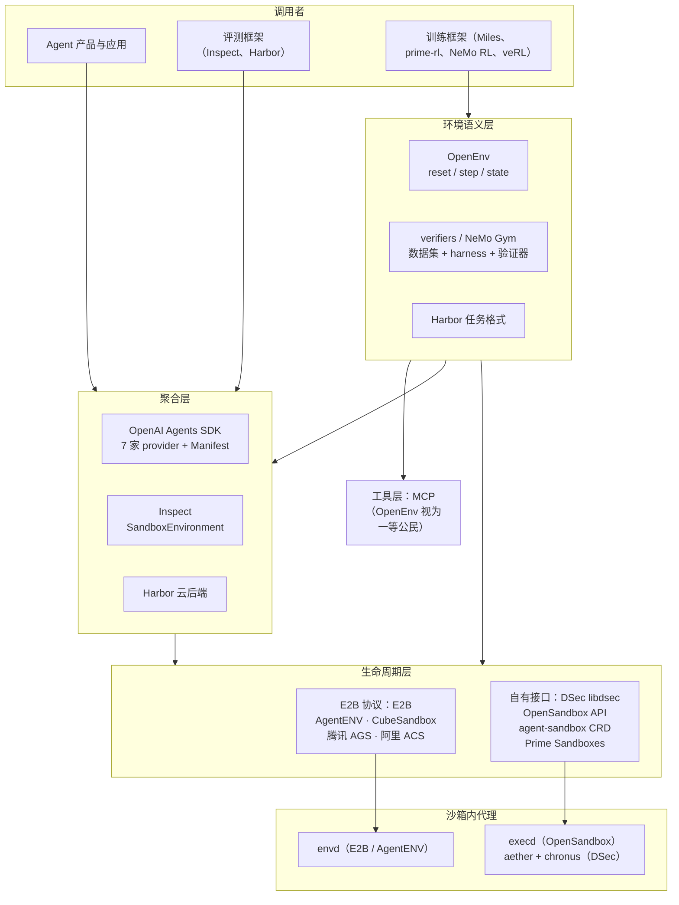

# 第 16 章　API 与接口标准（E2B 协议、OpenEnv、MCP）

## 本章导读

前面各章拆的是沙箱"里面"：隔离原语、控制面、存储、状态、密度、网络。本章转到它的"表面"，也就是八层架构的第①层接入与 API（见第 9 章）。2026 年这一层出现了一个乍看矛盾的局面。一方面，接口在快速收敛：腾讯云与阿里云的三款沙箱产品（AGS、ACS、FC）、kvcache-ai 组织（清华 MADSys 牵头）开源并用于 Kimi K3 训练的 AgentENV、腾讯开源的 CubeSandbox 都宣称兼容 E2B 的 API，OpenAI Agents SDK 把七家沙箱厂商做成了可互换的后端，Meta 与 Hugging Face 发起的 OpenEnv 已经设立了 11 家机构组成的指导委员会。另一方面，迄今公开得最完整的训练沙箱 DeepSeek DSec 用的是自有 SDK，而且它的创建请求里写着几样 E2B 协议没有的东西。

本章的基本判断是：**沙箱生命周期层正在向 E2B 兼容 API 收敛，环境语义层正在向 Gym 式 `reset/step/state`（OpenEnv）加 MCP 工具收敛；但两层现有的协议都是为产品推理和评测设计的，缺少训练场景必需的若干概念**，包括作为一等对象的网络策略、按任务阶段切换策略、抢占与作业级暂停语义、完整性约束、fork 的语义约定、资源与后端声明，以及能与 rollout 关联的可观测性。

读完本章，读者应能：

- 分清"生命周期层""环境语义层""工具层"和"聚合层"各自规定什么，知道 E2B、OpenEnv、MCP、Agents SDK 分别落在哪一层；
- 复述 E2B 协议的对象模型（Sandbox、Template、envd）与主要操作，并知道哪些操作是 2026 年才加入的；
- 判断"兼容 E2B"这一说法的证据强弱，以及 DSec、OpenSandbox、agent-sandbox 为什么不走这条路；
- 列出训练场景需要而现有协议缺失的七个概念，以及每个概念目前有哪些系统部分支持；
- 读懂本书提出的最小扩展草案，并清楚它只是建议，不是任何现行标准。

## 16.1　四个层次与"事实标准"

### 16.1.1　四个层次

谈"沙箱 API"时，人们常把几件不同的事混在一起。本书把与沙箱相关的接口分成四层（图 16-1）。

**生命周期层**规定"一台沙箱"的创建、暂停、恢复、销毁、超时、网络规则，以及在沙箱里执行命令、读写文件。它的调用者是 harness（外壳/评测框架，负责驱动 Agent 循环、工具与打分）或训练框架，它的实现者是沙箱平台。E2B 协议（E2B 的沙箱生命周期 HTTP API 与 SDK 约定，非正式标准，本书称"事实标准"）、DSec 的 libdsec、OpenSandbox 的生命周期与执行 API、K8s 的 agent-sandbox CRD 都属于这一层。

**环境语义层**规定"一个环境"怎样被一次 rollout 使用：怎样重置、怎样执行一步动作、怎样返回观察与奖励。这里的"环境"是 RL 与评测语义上的任务世界（数据集或任务 + harness + 验证器），通常跑在一个或多个沙箱里。OpenEnv、Prime Intellect 的 verifiers、NVIDIA NeMo Gym、Harbor 的任务格式属于这一层。

**工具层**规定 Agent 怎样发现并调用工具，代表是 MCP（Model Context Protocol）。它与环境语义层有交叠：OpenEnv 把 MCP 当作"一等公民"，蚂蚁 AEnvironment 干脆用 MCP 语义表达整个环境（见第 17 章）。

**聚合层**不定义新的沙箱，而是把多家生命周期层实现包装成一个统一的后端接口：OpenAI Agents SDK 的沙箱 provider、UK AISI Inspect 的 `SandboxEnvironment`、Harbor 的云后端都是这一类。聚合层越成熟，生命周期层各家的差异就越被抹平。



**图 16-1　Agent 沙箱接口的四个层次**（示意图，笔者依据本章所引各系统文档绘制；箭头表示调用关系，同一系统可能跨层）

这张图有两点要说明。第一，层与层之间不是严格的上下级：Harbor 同时定义任务格式（环境语义层）和后端插件（聚合层）；AgentENV 文档化的 Miles 用例里，训练框架经 OpenEnv 定义任务，再直接通过 E2B SDK 调用 AgentENV（见 16.4.5 节）。第二，**图中没有任何一层规定"网络策略由谁声明、在哪个阶段生效"**，这正是 16.6 节要讨论的缺口。

### 16.1.2　事实标准与正式标准

"标准"在这里只能打引号。截至 2026 年 10 月，沙箱与隔离已写入非强制的实践指南（TC260《智能体系统开发安全指南（征求意见稿）》v1.0-202609 第 8 章 n）项、TC260《智能体部署使用安全指引》TC260-PG-20266A、五眼联盟机构联合指南）和实验室治理框架（Google DeepMind FSF v3.1、OpenAI《Frontier Governance Framework》），但在本书检索范围内尚未进入任何强制性标准或法规（见第 23 章）；Agent 沙箱的接口与行为更没有任何正式规范。最接近"标准组织"的是 Linux Foundation 于 2025 年 12 月 9 日成立的 Agentic AI Foundation（AAIF），成立时它托管 Anthropic 贡献的 MCP、Block 贡献的 goose 和 OpenAI 贡献的 AGENTS.md 三个项目；白金会员为 AWS、Anthropic、Block、Bloomberg、Cloudflare、Google、Microsoft、OpenAI 八家，新闻稿称已有"10,000 多个"已发布的 MCP server、"60,000 多个"开源项目采用 AGENTS.md（Linux Foundation 新闻稿，2025-12-09；一手文档）。新闻稿没有提到沙箱、执行隔离或任何安全规范（同上）。

此后 AAIF 又接纳了 agentgateway（负责"运维、路由、策略与可观测性"）与 Agent 间通信协议 A2A；A2A 的加入公告发布于 2026 年 8 月 17 日（aaif.io *A2A joins AAIF*，2026-08-17；一手文档），agentgateway 则于 2026 年 6 月 4 日加入（AAIF 博文；一手文档）。2026 年 9 月 9 日 Agent Router 加入后为六个项目（aaif.io *Agent Router joins AAIF*；一手文档），都不是沙箱或执行隔离规范。所以 AAIF 治理的是工具与 Agent 间协议、Agent 说明文件和流量网关，而不是执行环境。

于是"标准"的含义退化为两种事实状态：一是某个厂商的 API 被足够多的其他实现照抄（E2B 协议）；二是某个开源接口被多家机构共同治理（OpenEnv）。前者靠的是生态惯性，后者靠的是治理结构，两者对兼容性的约束力都很弱：没有一致性测试，也没有版本承诺（见 16.2.3 节）。本书第 23 章讨论正式标准与监管，这里只讨论工程上的收敛。

## 16.2　生命周期层：E2B 协议

### 16.2.1　对象模型：Sandbox、Template、envd

E2B 文档把它的产品归结为三个构件。**沙箱**是"按需为 Agent 创建的快速、安全的 Linux 虚拟机，可以按需暂停和恢复"；**模板**"定义沙箱以什么环境启动"；**持久化**让文件系统与内存状态得以保留（E2B 文档首页；一手文档）。官方 SDK 有 Python 与 JavaScript/TypeScript 两种（同上）。

**模板**不只是镜像。文档写道，模板可以定义基础镜像、环境变量、要复制的文件、要执行的命令，以及"一条在模板构建期间运行、并被捕获进快照的启动命令，这样从模板创建沙箱时该进程**已经在运行**"（E2B 模板文档；一手文档）。也就是说，E2B 的模板本质上是一个带运行中进程的 microVM 快照（推断），与第 11 章讨论的"模板 fork"属于同一类思路。

**envd** 是沙箱内的守护进程。E2B 开源控制面仓库对它的描述是"运行在沙箱内、让 SDK 的调用得以与沙箱交互的守护进程"（e2b-dev/infra `packages/envd/README.md`；一手文档）。它的接口分两部分：一部分是基于 Protocol Buffers 定义的进程服务（`Start`、`Connect`、`List`、`SendInput`、`SendSignal` 等）和文件系统服务（`Stat`、`ListDir`、`Move`、`Remove`、`WatchDir` 等）；另一部分是 HTTP 接口，包括 `/init`、`/files`、`/envs`、`/health`、`/metrics`，以及与快照配合的 `/freeze`、`/unfreeze`、`/fsfreeze`、`/fsthaw`（`packages/envd/spec/` 下的 proto 与 `envd.yaml`；一手文档）。envd 在 guest 内监听 49983 端口（附录 B B16-05；一手文档），E2B 规范中也写明这个端口不能被列为沙箱的 HTTPS 服务端口（e2b-dev/infra `spec/openapi.yml`；一手文档）。

envd 的存在决定了"兼容 E2B"有深浅之分：只实现控制面 REST、沙箱内换成自家代理，SDK 的命令执行与文件操作就要另做适配；把 envd 一并放进 guest，SDK 的全部能力才能原样工作（见 16.2.3 节）。

### 16.2.2　主要操作

表 16-3 把 E2B 协议的主要操作与其他系统并列，这里先按生命周期说明 E2B 自身。

**创建与超时。** 创建请求的必填项只有模板 ID；可选项包括超时、自动暂停、出站网络配置、元数据、环境变量、MCP 配置、工作负载身份（`iam`）和卷挂载（e2b-dev/infra `spec/openapi.yml` 中 `NewSandbox` 与 `NewSandboxV2`；一手文档）。其中超时字段的说明是"沙箱的存活时间（秒）"，v2 接口默认 300 秒（v1 为 15 秒）（同上）。连续运行上限为 Pro 套餐 24 小时、基础套餐 1 小时（E2B sandbox 文档；一手文档；persistence 页把后者称为 Hobby 套餐）。创建请求里**没有** CPU 与内存字段，资源规格随模板确定（推断，依据 `NewSandbox` 的字段列表与模板构建接口中的 `cpuCount`、`memoryMB`）。

**暂停与恢复。** `pause()` 保存文件系统与内存；`connect()` 把已暂停的沙箱恢复到运行状态（E2B persistence 文档；一手文档）。文档给出的耗时是"暂停约每 GiB 内存 4 秒，恢复约 1 秒"（同上；bex.co 引用的"约每 GiB 4 秒"与此同源）；第三方 bex.co 对 512 MiB 沙箱给出的往返约 3 秒（约 2 秒快照、约 1 秒恢复；二手报道；附录 B B11-04），两者口径不同，前者按内存大小折算，后者是单一规格的数字，并列备查（各系统暂停延迟的口径差异见附录 B C-31 与第 11 章）。暂停接口在 REST 层有 `memory` 字段（SDK 参数为 `keepMemory` / `keep_memory`），设为 false 时只持久化文件系统，恢复时冷启动（`SandboxPauseRequest`；一手文档）。创建时可设 `onTimeout: "pause"`，让超时变成自动暂停（persistence 文档；一手文档）；文档写明默认行为是超时即终止而非暂停，规范中 `autoPause` 的默认值也是 false（同上；`NewSandbox`；一手文档）。bex.co 称 E2B"默认空闲 15 分钟自动暂停"（附录 B B11-04；二手报道），与此不一致，本书以一手文档为准。文档中还有一句要特别留意："已暂停的沙箱**无限期**保留。没有存活时间，也不会自动删除"，必须显式调用 `kill()`（同上）。

**快照与 fork。** `createSnapshot()` 对运行中的沙箱做包括文件系统与内存在内的时间点捕获，原沙箱继续运行；之后可以把快照 ID 传给 `Sandbox.create()`，从同一快照创建多个新沙箱，文档称这是与暂停/恢复的"一对一"相对的"一对多"（E2B snapshots 文档；一手文档）。2026 年 7 月 15 日，E2B 控制面规范加入了 `POST /sandboxes/{sandboxID}/fork`（e2b-dev/infra 提交 643d726，"feat(api): add sandbox fork endpoint (#3202)"；一手文档），7 月 21 日在 changelog 公告（E2B changelog；一手文档）：原地对运行中的沙箱做检查点（短暂暂停、带完整内存快照、再在原节点恢复，ID 与过期时间不变），然后从该快照创建 `count` 个新沙箱，`count` 取值 1–100（`SandboxForkRequest`；一手文档）。文档提醒，fork 期间原沙箱的暂停时长"随自上次快照以来的磁盘改动量增长"，所有活动连接（WebSocket、PTY、命令流）都会断开（E2B fork 文档；一手文档）。

**网络。** 出站规则由 `allowOut`（CIDR、IP 或域名）与 `denyOut`（只支持 CIDR 与 IP）组成，"放行条目总是优先于拒绝条目"；运行中可以整体替换规则（见第 14 章 14.2.1 节）。`egressProxy` 于 2026-06-12 写入规范、08-24 在 changelog 公告（"Bring Your Own Proxy"），把放行后的出站 TCP 经 SOCKS5 代理转发，"沙箱对此无感知"（e2b-dev/infra 提交 1fc3820 与 `SandboxEgressProxyConfig`；E2B changelog；一手文档）。另有按域名对出站 HTTPS 请求做变换的 `rules` 字段（`SandboxNetworkConfig`；一手文档；用途本书未展开）。

**查询与观测。** 列出运行中沙箱时可按元数据过滤，例如"`user=abc&app=prod`"（`GET /sandboxes` 参数说明；一手文档）；另有单沙箱的指标与日志接口，以及沙箱事件与 webhook 接口（`spec/openapi.yml` 路径列表；一手文档）。

把这些操作放在一起看，E2B 协议在 2026 年的演进方向很清楚：从"短命的代码执行器"走向"可暂停、可 fork、出站可代理的长寿命 microVM"。这与第 11 章所说的"状态成为第二主线"是同一个趋势在接口层的投影。

### 16.2.3　谁兼容 E2B，证据有多强

表 16-1 汇总了主要系统与 E2B 协议的关系。这里的"兼容"几乎全部是**实现者自己的声明**；本书没有找到任何第三方一致性测试，E2B 也没有发布过兼容性认证。

**表 16-1　主要系统与 E2B 协议的关系**

| 系统 | 关系 | 原文表述或证据 | 兼容深度 | 证据类型 |
|---|---|---|---|---|
| AgentENV | 宣称兼容 | "提供 E2B 兼容的 HTTP API"；改 `E2B_API_URL` 即可使用标准 E2B SDK | 控制面 + guest 内 envd（由 e2b-dev/infra 编译） | 一手文档（README、仓库） |
| CubeSandbox（腾讯，开源） | 宣称兼容 | "兼容 E2B SDK 接口，替换一个环境变量即可从 E2B 云无缝切换"；CubeAPI 为"兼容 E2B 的 REST API 网关"；Roadmap 列有"补齐与 E2B 规范的剩余差距" | 控制面与 E2B 协议代理；guest 内代理未核实 | 一手文档（README_zh） |
| 腾讯云 AGS | 宣称兼容 | "兼容 E2B 等社区主流开源沙箱协议"；另有自有 Python/Go SDK、CLI、MCP、REST | 未披露 | 一手文档（产品文档） |
| 阿里云 ACS Agent Sandbox | 宣称兼容 | 推荐"E2B 兼容 SDK"，"沿用 E2B SDK 调用方式完成沙箱创建、连接、执行和回收" | 未披露 | 一手文档（用户指南，2026-06-22） |
| 阿里云函数计算 FC | 宣称兼容（部分） | 逐项列出 E2B SDK 与 CLI 能力的支持、部分支持与不支持；网络配置"可调用但效果受限" | 见左 | 一手文档（产品文档） |
| Manus | E2B 客户 | E2B 客户案例：用 E2B 的 Firecracker microVM，且 E2B 可自托管在 Manus 基础设施上 | 使用者，非实现者 | 厂商自报（客户案例，含 Manus 联合创始人署名引语） |
| OpenAI Agents SDK | E2B 为 7 家 provider 之一 | 内置 Blaxel、Cloudflare、Daytona、E2B、Modal、Runloop、Vercel | 聚合层 | 一手文档 |
| NeMo Gym | E2B 为可选后端之一 | 沙箱后端含 OpenSandbox、Apptainer、E2B、Docker、ECS Fargate | 聚合层 | 一手文档（2026-10-04 复核） |
| DSec | 不兼容 | 自有 Python SDK libdsec | — | 论文自述 |
| OpenSandbox（阿里，开源） | 不兼容（自有） | "可扩展的沙箱协议"（自有生命周期与执行 API）、多语言 SDK、`osb` CLI；仓库已迁至 opensandbox-group | — | 一手文档（README） |
| agent-sandbox（K8s SIG Apps） | 不兼容（自有） | CRD 声明式 API + Python SDK；README 未提 E2B | — | 一手文档（README） |
| Prime Sandboxes | 不兼容（自有） | `prime sandbox create/run` CLI 与 SDK；未提 E2B | — | 厂商自报（博文，2026-09-23） |

注：AgentENV 的 envd 来源与端口见附录 B B16-05（`thirdparty/envd/` 是节点侧经 gRPC 访问 envd 的 Rust 客户端库，不是 envd 源码）；CubeSandbox 迁移所需环境变量两说并列：README_zh 写"替换一个环境变量"，腾讯云开发者社区文章列出 `E2B_API_URL`、`E2B_API_KEY`、`CUBE_TEMPLATE_ID` 三个（附录 B B16-08；厂商自报；后者本书未回原文，未核实）；Manus 一行依据 E2B 客户案例，本章未回原文核对（未核实）；ACS 的扩展速度用户指南写"15K Sandbox"每分钟（厂商自报），与营销稿口径存在冲突（文献库 C26-07），本章不引。

从表 16-1 可以读出三点。

**第一，兼容有三种深度。** 最浅的是 SDK 层面：调用方改一个环境变量（`E2B_API_URL`），请求打到另一家的控制面。中间一层是控制面 REST 的语义一致，包括错误码、超时、元数据过滤这些细节。最深的一层是 guest 内也跑 envd，于是 SDK 的命令执行、文件操作、流式输出原样可用。AgentENV 属于最深的一层（见第 25 章 25.3.1 节）。CubeSandbox 披露到控制面：README_zh 列出"兼容 E2B 的 REST API 网关"CubeAPI 与"兼容 E2B 协议"、把请求路由到对应沙箱的反向代理 CubeProxy（CubeSandbox README_zh；一手文档）。阿里云函数计算 FC 公布了逐项的兼容范围：命令执行、进程管理、标准输入与 PTY 受支持；文件系统部分支持（暂不支持自定义文件元数据）；快照与暂停/恢复需加白名单；日志与网络配置"接口可调用，但返回结果或实际效果受限"；卷与访问令牌"暂不兼容"（FC *E2B Compatibility* 页；一手文档）。腾讯 AGS 与阿里 ACS 只披露到 SDK 层面。FC 这份清单是本章论点的直接证据：在"兼容"的平台上，网络配置调用可以成功返回，而实际效果被弱化（见 16.8.1 节原则四）。

**第二，协议演进由 E2B 主导，兼容者处于跟随位置（推断）。** fork 端点是一个例子：E2B 在 2026-07-15 把它写入控制面规范（提交 643d726），07-21 在 changelog 公告（"Sandbox Forking & Snapshot Name Filters"；E2B changelog；一手文档）；AgentENV 于 07-25 首次公开时已带路径相同（`POST /sandboxes/{id}/fork`）、`count` 同为 1–100 的 fork 接口，首版文档一度误写为 16（见第 25 章 25.5.3 节）。三个日期只相隔 6–10 天，有意对齐与各自独立开发都有可能，本书没有找到双方关于这一点的说明。CubeSandbox 的 Roadmap 写着"补齐与 E2B 规范的剩余差距，实现完整的兼容替代"（CubeSandbox README_zh；一手文档），说明兼容者自己也承认在追赶。兼容者面对的现实是：E2B 每加一个字段，"兼容"的含义就变一次，而规范里没有版本化的一致性声明可供对照（推断）。bex.co 也提醒，AgentENV 的 E2B 兼容安全沙箱实现"在发布后仍在公开评审中加固"（bex.co，2026-09-22；二手报道；见第 25 章）。

**第三，兼容是生态选择，不是能力选择。** 宣称兼容的系统大多是产品化或开源的通用平台，它们需要承接已经为 E2B 写好的 Agent 框架与评测脚手架；走自有接口的系统要么是只服务自家训练的平台（DSec），要么是以 K8s 声明式 API 为核心的编排器（agent-sandbox、OpenSandbox）。腾讯 AGS 同时提供自有 SDK 与 E2B 兼容，说明两条路并不互斥。

**接口相同，内部各异。** 宣称兼容的几家，在 E2B 接口之下的实现差别很大。CubeSandbox 的 README 列出的组件是：E2B 兼容的 REST 网关 CubeAPI、负责编排调度的 CubeMaster、每节点管理生命周期的 Cubelet、基于 eBPF 的虚拟交换机 CubeVS 和管理 KVM microVM 的 CubeHypervisor，另有一个负责出站过滤与凭据注入的七层网关 CubeEgress（CubeSandbox README_zh；一手文档）；冷启动"不到 60 ms"、单实例内存开销"不到 5 MB"（同上；厂商自报；附录 B B06-15、B06-16）。ACS 的用户指南写的是 microVM 级隔离、预热池带来"百毫秒级"创建、实例休眠后"内存状态保持，快速唤醒"（1–10 秒），以及面向并行探索的"Checkpoint 和 Restore"，并把 AgentRL 训练列为首要场景（ACS 用户指南；厂商自报）。AgentENV 则是 Firecracker 加 Rust overlaybd/ublk 块设备栈（见第 25 章）。同一个 `Sandbox.create()`，在三家背后分别落到三套存储、网络和调度设计上。这正是第 1 章提出的判断在接口层的样子：接口能共用，后端不能。它也意味着，同一段调用代码在不同"兼容"平台上的性能、隔离强度与出站行为可以完全不同，迁移时需要逐项验证，而不能只看 SDK 能否跑通（推断）。

### 16.2.4　反例：为什么不兼容

**DSec 的 libdsec。** 论文 §2.1 的最小示例如下（DSec §2.1 代码清单；论文自述）：

```python
client = DSecClient()
await client.open()
args = DSecContainerRunArgs(
    container_image="registry.../sphinx-9658:official",
    memory_limit_mb=4096,
    cpu_cores_limit=4,
    ttl_running_stop=300,      # idle timeout
    network_rules={"npm": False, "pypi": True},
    init_user="root",
)
sandbox = await client.run_container(args, timeout=120)
result = await sandbox.run_shell("echo hello world")
await sandbox.stop()
```

与 E2B 的创建请求对照，差别一目了然：后端由参数类型和方法名选定（`DSecContainerRunArgs` 与 `run_container`），而 E2B 只有一种沙箱形态；资源上限按沙箱声明，而 E2B 随模板确定；空闲超时是创建时的策略，而 E2B 的超时是"存活时间"；网络规则以"npm""pypi"这样的语义单位表达，而 E2B 以主机、CIDR 表达（见第 24 章 24.3.1 节）。这几项都不是偶然的设计偏好。DSec 有四档后端，必须让调用方选；它的负载 CPU 稀疏、等待推理占大部分寿命，空闲回收必须由调用方声明意图（见第 3、13 章）；它面对的是会主动寻找镜像源的模型，网络策略必须由训练框架按任务阶段下发（DSec §6.5；见第 14 章）。换句话说，libdsec 暴露的正是 E2B 协议缺少的几个概念（见 16.6 节）。

**OpenSandbox。** 阿里开源的 OpenSandbox（仓库现已迁至 `opensandbox-group/OpenSandbox`）自称提供"可扩展的沙箱协议：基于已定义的沙箱生命周期与执行 API 构建自定义运行时集成"（2026-10-02 抓取的旧版 README 写作"OpenAPI 生命周期/执行规范"，现行版本已无此字样），SDK 覆盖 Python、Java/Kotlin、TypeScript/JavaScript、C#/.NET、Go，另有 `osb` 命令行（负责创建、执行、文件操作、诊断与出站策略管理）和一个 OpenSandbox MCP server（OpenSandbox README；一手文档）。其中"Firecracker 沙箱支持保留内存与磁盘状态的暂停/恢复"，其他运行时未见暂停能力；另有"每沙箱的出站策略"、不让真实凭据进入沙箱的凭据库，以及面向评测与 RL 的"资源池与批量创建"，并附 Harbor 集成示例（同上）。它把出站策略和批量创建做进了接口，这两点恰好是 E2B 协议在训练场景下的短板。

**agent-sandbox。** K8s SIG Apps 的 agent-sandbox 用四个 CRD 表达生命周期：`Sandbox`（"为一个有状态、具有稳定身份和持久存储的单 Pod 提供声明式 API"）、`SandboxTemplate`、`SandboxClaim`（从预热池领用）、`SandboxWarmPool`；控制器管理"创建、定时删除、暂停与恢复"，隔离委托给 gVisor 或 Kata（agent-sandbox README；一手文档；见第 9 章 9.5.2 节）。另有 Go 与 Python SDK，后者自称提供"简单的高层接口"（agent-sandbox Python SDK README；一手文档；与第 9 章一致）。README 没有提到 E2B 兼容。网络策略写在 `SandboxTemplate.spec.networkPolicy`（K8s NetworkPolicy 的受限子集），由控制器为每个模板建一份共享策略；`networkPolicyManagement: Managed` 且未给策略时，默认只放行公网出站，阻断 RFC1918 与元数据服务（agent-sandbox `sandboxtemplate_types.go`，HEAD fa39d57；一手文档；见附录 C）。声明式 API 的好处是能直接复用 K8s 的配额、RBAC 与审计；代价是每次创建都要经过 API server 的持久化写（见第 9 章 9.7.2 节）。

## 16.3　聚合层：把后端变成可替换件

### 16.3.1　OpenAI Agents SDK

2026 年 4 月 15 日，OpenAI 发布 Agents SDK 的更新，内置七家沙箱 provider："Blaxel、Cloudflare、Daytona、E2B、Modal、Runloop 和 Vercel"（OpenAI 博文，2026-04-15；一手文档；附录 B B16-01）。与 provider 一同引入的是 **Manifest**，用来"描述 Agent 的工作区"：开发者可以"挂载本地文件、定义输出目录，并从存储服务引入数据"（同上）。

这次更新的架构主张有两条。一是 harness 与计算分离："把 harness 与计算分开，有助于让凭据远离执行模型生成代码的环境"（Separating harness and compute helps keep credentials out of environments where model-generated code executes）（同上；见第 14 章 14.4 节）。二是持久执行："当 Agent 的状态被外置，丢掉一个沙箱容器并不意味着丢掉这次运行"；借助内置的快照与再水化（rehydration），SDK 可以"在新容器中恢复 Agent 的状态，从最近一个检查点继续"（同上；见第 17 章 17.6.2 节）。

这次更新对本章的意义在于抽象单位变了。Agents SDK 抽象的不是"一台沙箱"，而是"一个工作区"：Manifest 描述工作区里有什么，provider 决定它跑在哪里，快照让它可以换一台机器继续。七家 provider 在这里是可替换件，它们之间的 API 差异由 SDK 吸收。生命周期层的差异化因此被压缩到性能、价格与隔离档位（推断；第 22 章讨论市场含义）。

### 16.3.2　Inspect 与 Harbor

**Inspect** 是 UK AISI 的评测框架。它的 `SandboxEnvironment` 接口只有几个方法：`exec()`、`exec_remote()`、`write_file()`、`read_file()`、`connection()`（Inspect 沙箱文档；一手文档）。内置 `docker` 与 `local` 两种实现，扩展包提供 k8s、daytona、modal、ec2、proxmox、vagrant 以及 NVIDIA 的 openshell（同上）。AISI 在介绍 Inspect Sandboxing Toolkit 时把隔离分为三个轴：**工具**（"限制模型可用的工具和/或执行代码的能力"）、**宿主**（"防止模型逃逸或攻破宿主系统"）、**网络**（"控制模型经网络与外部系统，包括互联网的交互"）（AISI 博文，2025-08-07；一手文档）。博文强调的设计选择是"Inspect 本身位于沙箱**之外**，向沙箱内发送命令"（同上），这与 Agents SDK 的 harness/计算分离是同一个原则在评测侧的表述。

**Harbor** 与 Terminal-Bench 2.0 一同发布，自述为"评测与优化 Agent 和语言模型的框架"，把任务、Agent/harness、环境/沙箱三者解耦；README 列出的云沙箱后端有 Daytona、Modal、LangSmith、Blaxel、Novita Sandbox、Tensorlake、Runta（harbor-framework/harbor README；一手文档），也可以"为 RL 优化生成 rollout"（同上）。Harbor 有一个其他聚合层没有的东西：任务配置里的 `network_mode`（`no-network`、`public`、`allowlist`，默认 `public`），并可在 Agent 阶段与评分阶段分别覆盖（Harbor `config.py`；一手文档；见第 20 章）。也就是说，Harbor 在环境语义层声明网络需求、在聚合层交给后端执行。问题是后端未必照办：第三方接入 Harbor 任务时曾丢掉 `network_mode`，60 个任务一律按同一种网络模式运行（loom issue #2189；二手报道；见第 14 章 14.3.4 节）。

聚合层的共同效果，是让"选哪家沙箱"变成部署配置而不是代码改动。它的共同局限，是只能抽象各家共有的那部分能力：exec、文件、生命周期。网络策略、暂停语义、fork，这些各家差异最大的部分，恰恰最难进入公共接口（推断）。

## 16.4　环境语义层：OpenEnv 及其同类

### 16.4.1　OpenEnv

OpenEnv 由 Meta-PyTorch 与 Hugging Face 发起。2026 年 6 月 8 日的更新博文把它描述为"熟悉的 Gymnasium 式 API（`reset()`、`step()`、`state()`）"，采用"client/server 架构"和"HTTP、WebSocket 等标准协议"，环境以 Docker 打包；并写道"MCP 是一等公民，因此 OpenEnv 环境可以即刻兼容 MCP server"（OpenEnv 博文，2026-06-08；一手文档）。仓库 README 补充：`EnvClient` 经 WebSocket/HTTP 与隔离的 `Environment` 服务通信；`step()` 的结果合并了观察、奖励与结束标志；延迟奖励以 RFC 004 提出；运行时 provider 有 `LocalDockerProvider`、`DockerSwarmProvider`，以及 `UVProvider`、`DaytonaProvider`、`ACASandboxProvider`、`ModalProvider`、`HFSandboxProvider`、`NovitaSandboxProvider`，`KubernetesProvider` 在规划中（huggingface/OpenEnv README 与 `src/openenv/core/containers/runtime/`，HEAD 436ee3a，2026-10-05；一手文档）。Daytona 同时是 Agents SDK 与 Harbor 的后端，可见环境语义层也在直接对接生命周期层的商业实现。

同一篇博文宣布 OpenEnv 转为多组织治理。指导委员会为 Meta-PyTorch、Reflection、Unsloth、Modal、Prime Intellect、NVIDIA、Mercor、Fleet AI、Microsoft、Hugging Face、RadixArk 共 11 家（同上；附录 B B16-04）；支持者列表包括 PyTorch Foundation、vLLM、SkyRL（UC Berkeley）、Lightning AI、Axolotl、Stanford Scaling Intelligence Lab、Scale AI、Surge AI、Turing、Snorkel AI、SGLang、Miles 等（同上；本书只列部分，不给总数，因摘录所得名单与其自述计数不一致）。仓库迁至 `huggingface/OpenEnv`；近期计划包括外部奖励定义、任务集与数据集集成、harness 支持、端到端训练示例，以及衡量环境质量的自动验证（同上）。

规模方面，Hugging Face 2026 年 9 月 11 日的博文称"超过 4,000 个 Space 带有 OpenEnv 标签"（HF 博文 *One sandbox per rollout*，2026-09-11；附录 B B16-03 记为二手报道）。这是一个标签计数，不等于 4,000 个可用于训练的环境；OpenEnv 博文本身没有给出任何环境数量（OpenEnv 博文；一手文档）。

OpenEnv 的定位要放在图 16-1 里看。它规定的是"一步交互"的语义，不规定"一台沙箱"的生命周期：环境服务跑在什么隔离里、出站怎样控制、能不能暂停与 fork，都不在接口之内。`state()` 返回的是 episode 元数据（episode_id、step_count 等），不是 rollout 的状态，也不是沙箱快照（见第 17 章 17.6.3 节）。

### 16.4.2　verifiers、Environments Hub 与 Prime Sandboxes

Prime Intellect 的 verifiers 自述为"我们用来创建训练与评测 LLM 的环境的库"，与 Environments Hub、prime-rl 训练框架和托管训练平台相连（PrimeIntellect-ai/verifiers README；一手文档）。2026 年 9 月 23 日，Prime 发布 Sandboxes，称"每个沙箱都是一台功能完整的 Linux 虚拟机"，有独立 guest 内核；可访问"超过 365,000 个预构建环境"；与 verifiers、prime-rl 原生配合，定位是"RL 原生栈"的一部分（Prime Sandboxes 博文，2026-09-23；厂商自报）。路线图写明将来要支持"在运行中途保存、恢复与 fork 沙箱"（同上）；截至 2026-10-04 的 prime-sandboxes SDK 已提供文件系统检查点（`checkpoint`，并可以 `checkpoint_id` 创建新沙箱）与运行中替换出站规则（`set_network`），未见 fork 与暂停（PrimeIntellect-ai/prime HEAD 32098eb；一手文档；见附录 C）。这是一个"环境语义层与生命周期层由同一家垂直整合"的例子。

### 16.4.3　NeMo Gym

NVIDIA NeMo Gym 把环境定义为"数据集、Agent harness 与验证器"三者的组合，汇集来自 Aviary、Harbor、OpenEnv、Reasoning Gym、Verifiers 五个来源的 1,000 多个社区环境；训练侧对接 NeMo RL、Unsloth、veRL，harness 有 OpenHands、mini-SWE-agent、LangGraph（NeMo Gym ecosystem 页；一手文档；附录 B B16-07）。沙箱后端可选 OpenSandbox、Apptainer、E2B、Docker、ECS Fargate（NeMo Gym ecosystem 页；一手文档；2026-10-04 复核）。NeMo Gym 的做法说明，环境语义层的"标准之争"正在通过适配器而不是单一胜者来解决：它不要求环境作者改用某一种规范，而是把几种规范都接进来（推断）。

### 16.4.4　AEnvironment：用 MCP 表达环境

蚂蚁的 AEnvironment 走得更远：它主张"一切皆环境"，上层 Agent"只需面对一致的语义：`list_tools`/`call_tool`/`release`"，即用 MCP 的工具语义表达整个环境（AEnvironment 博文；厂商自报；见第 17 章 17.6.3 节）。与 OpenEnv 的 `reset/step/state` 相比，它少了显式的 episode 边界与奖励返回，奖励由外部计算（推断）。这两种路线谁更适合 Agent RL，目前没有公开的对比。

### 16.4.5　两层的串联

一个完整的串联例子来自 AgentENV 文档：用 RadixArk 的 Miles 以 GRPO 在 Terminal-Bench-2 上训练 GLM-4.7-Flash，"OpenEnv 提供配方所用的任务交互与评估接口，AgentENV 为每个 episode 运行隔离的沙箱"，接入方式是设置 `E2B_API_URL`、`E2B_API_KEY` 等环境变量（AgentENV `docs/src/use-cases/miles.md`；一手文档；见第 25 章 25.3.8 节）。这里环境语义层（OpenEnv）、生命周期层协议（E2B）和实现（AgentENV）来自三家不同的组织，靠两份接口拼在一起。

其他串联还有 OpenSandbox 的 Harbor 集成示例（OpenSandbox README；一手文档）与 NeMo Gym 的多后端（16.4.3 节）。Hugging Face 的综述把这一层的格局概括为四层：任务、契约（"越来越多地就是 harness 本身"）、沙箱、训练（HF 博文，2026-09-11）。它同时归纳了 harness 与训练器的三种集成模式：白盒（重建 harness 以便训练器控制每一步）、黑盒（记录未经改动的 Agent 流量）、harness 化 RL（由 harness 掌控交互循环）（同上）。三种模式对沙箱接口的要求不同：白盒模式下训练器直接调用环境语义层；黑盒与 harness 化模式下，harness 自己调用生命周期层，训练器只看到模型调用。后者正在成为主流（推断；三种模式的详细讨论与 token-in/token-out 一致性问题见第 17 章 17.5、17.6 节）。

## 16.5　MCP：工具层协议里的沙箱条款

MCP 不是沙箱协议，但截至本书写作，它的安全最佳实践是 Agent 生态中**措辞最规范**的沙箱要求来源（笔者判断；见第 23 章）；在政府背书的文本中，TC260《智能体系统开发安全指南（征求意见稿）》第 8 章 n）项第 1）条以"应"字要求沙箱或隔离边界，措辞强度更高但不列技术选项（见 23.3.3 节）。2025-11-25 版规范的 Security Best Practices 中与沙箱直接相关的条款有四组（MCP 规范 2025-11-25 Security Best Practices；一手文档）。

**本地 MCP server 失陷。** 规范指出，本地 server 是"下载并在与 MCP 客户端同一台机器上执行的二进制"，没有沙箱与同意机制时，攻击者可以在客户端配置中植入恶意启动命令、在 server 本身中分发恶意载荷，或借 DNS 重绑定访问留在 localhost 上的不安全 server。对策中，支持一键配置的客户端"**必须**在执行命令前实现同意机制"；规范另建议 MCP 客户端"**应当**"：在"最小默认权限"的沙箱环境中执行 MCP server 命令；以受限的文件系统、网络与其他系统资源访问启动 server；提供机制让用户在需要时显式授予额外权限；使用"平台适用的沙箱技术（容器、chroot、应用沙箱等）"；并保持沙箱方案更新。

**stdio 代理场景。** 当一个本地代理服务以 `stdio` 方式派生 MCP server 子进程时，XSS 一类客户端漏洞可以升级为任意命令执行；规范要求这类代理"**应当**"对派生进程实施沙箱化或容器化、限制文件系统访问、记录所有 `stdio` 使用。

**token passthrough。** MCP server"**禁止**接受任何不是明确签发给该 MCP server 的 token"。理由之一是，不校验就转发 token 的 server 会成为"数据外传的代理"。

**SSRF 与出站代理。** 在 OAuth 元数据发现过程中，恶意 server 可以把 URL 指向内网、`169.254.169.254` 云元数据端点或 localhost 服务；规范要求部署在服务端的 MCP 客户端"**必须**考虑 SSRF 风险"，并"**应当**"阻断私有与保留地址段；运营方"应当考虑使用强制网络策略的出站代理"，规范举的例子是 Stripe 的 Smokescreen。

此外还有一组不直接提沙箱、但与训练沙箱高度相关的条款：**scope 最小化**。规范反对"一次性申请全部权限"，主张"渐进的最小权限 scope 模型"：初始只给只读、低风险的最小集合，在首次尝试特权操作时再通过有针对性的 `WWW-Authenticate` 挑战增量提升，并记录每次提升（同上）。这与 DSec 按任务阶段切换网络策略是同一种思路在两个层次上的表达：权限随任务推进而变化，而不是在创建时一次给足（推断）。

这四组条款对训练沙箱有两层含义。其一，**当训练任务本身要用 MCP 工具时，MCP server 放在哪里就是一个隔离决策**：放在沙箱内，它与 Agent 共享被攻破的命运；放在沙箱外，它就是一个能代 Agent 出站的代理，需要按第 15 章对包代理的标准加固（推断）。E2B 的创建请求已经有一个 `mcp` 配置字段（`NewSandbox`；一手文档；字段语义本书未核实），说明生命周期层开始把"沙箱里有哪些工具"纳入接口。其二，MCP 规范的出发点是"被利用的代理人"：恶意 server、恶意链接、被盗 token。它没有考虑"作为对手的模型"（见第 2 章），因此"最小默认权限"只是起点，不能替代训练沙箱对出站、完整性与可观测性的要求（推断）。

## 16.6　协议缺什么：训练需要的七个概念

### 16.6.1　为什么会缺

E2B 协议诞生于产品推理场景：一个开发者为自己的用户创建沙箱，沙箱的生命由一次会话决定，调用者与沙箱里运行的代码同属一方。OpenEnv 诞生于"把 Gym 搬到网络上"的需求：环境是被动的，按步响应。两者都没有把三件事当作前提：**大量沙箱同属一个可被抢占的训练作业；沙箱里的租户是会主动寻找答案的对手；同一个任务在不同阶段需要不同的权限**。这三件事恰好是第 2、3、17、19 章反复出现的训练特征。缺的概念由此而来。

### 16.6.2　七个概念与现有支持

**表 16-2　训练场景需要而协议缺失或只部分支持的概念（本书归纳）**

| 概念 | 训练场景为什么需要 | 已有的部分支持 | 仍然缺什么 |
|---|---|---|---|
| ① 网络策略作为一等对象 | 取回型 reward hacking 依赖出站；"能访问哪些软件源"是任务定义的一部分（第 14、19 章） | DSec `network_rules` 以包管理器/镜像服务表达（论文自述，自有接口）；E2B `allowOut`/`denyOut`/`egressProxy` 以主机与 CIDR 表达；AgentENV `PUT .../network`；OpenSandbox 每沙箱出站策略；Harbor `network_mode` 三档 | 语义级的命名策略（"pypi 镜像""go 代理"）不在任何公开协议中；策略版本与审计记录 |
| ② 任务阶段策略切换 | setup 需要装包，rollout 与评分需要断网或白名单（DSec §6.5） | DSec 由训练框架按阶段动态更新（论文自述）；Harbor 按 Agent/评分阶段覆盖 `network_mode`，trial 在运行时调用 `set_network_policy` 切换阶段策略，后端须声明 `dynamic_network_policy`；E2B 与 AgentENV 可在运行中整体替换规则 | "阶段"本身不是协议对象；切换由调用方自行计时，平台无法校验阶段与策略的对应 |
| ③ 抢占与作业级暂停语义 | GPU 作业被抢占时需批量暂停相关沙箱、保住 rollout 状态、回收内存（DSec §6.3） | E2B `pause`（可选是否保留内存）、超时自动暂停、按元数据过滤列表；agent-sandbox 暂停/恢复；Agents SDK 快照与再水化；DSec 由 RL 框架向被抢占作业的全部沙箱发暂停请求 | "作业"或"租约"分组；按组暂停/恢复/销毁；已暂停沙箱的存活期（E2B 已暂停沙箱无限期保留） |
| ④ 完整性约束 | 模型会翻读 chronus 日志找残留答案、覆盖 `/bin/bash` 以绕过检查、借 `XFS_IOC_SWAPEXT` 绕过文件访问控制（DSec §6.4）；也会挖 `.git` 历史、改测试（第 19 章） | DSec AppArmor 对 root 也生效（平台内部，不在 SDK）；Inspect 与 Agents SDK 把 harness 放在沙箱外；Harbor 分离 Agent 与评分阶段 | 以接口声明"Agent 不可读/不可写的路径""评分阶段才出现的文件""禁止访问的套接字"；评分环境的可证明性 |
| ⑤ fork/分支的语义 | GRPO 分组、树搜索、从中间状态重试（第 11 章） | E2B `fork`（`count` 1–100，2026-07 起）与一对多快照；AgentENV 同节点 fork（1–100）；ACS Checkpoint/Restore；Prime 文件系统检查点（fork 仍在路线图） | 子实例的身份与熵（网络地址、随机种子、令牌）是否重置；外部副作用怎样处理（第 11、12 章）；跨节点 fork |
| ⑥ 资源与后端声明 | 负载异构，隔离档位应按任务选择（第 3、9 章） | DSec 按沙箱声明内存、CPU 并由参数类型选后端；E2B 资源随模板；agent-sandbox 经 Pod 规格与 RuntimeClass（推断）；Harbor `EnvironmentCapabilities`（网络、GPU、动态网络策略等能力位）是目前唯一见到的能力声明 | 统一的隔离档位词表（容器/gVisor/microVM/完整 VM）；能力协商（平台支持哪些档位） |
| ⑦ 可与 rollout 关联的可观测性 | 发现异常行为、事后取证、区分环境故障与模型失败（DSec §6.5"增强可观测性"；第 17、19 章） | E2B 指标、日志、事件与 webhook；DSec watcher 按 edge、用户、任务统计（调度用统计，不是行为事件）；Inspect 评测日志 | 把沙箱事件（进程、文件、网络）与 rollout ID、步号关联的公共格式 |

注：七个概念的划分与"仍然缺什么"一列为本书判断（推断）。"已有的部分支持"列中，DSec 各项均为论文自述且只存在于自有接口；E2B 各项见 16.2.2 节所引规范与文档；Harbor 见第 20 章；ACS 见其用户指南"Checkpoint 和 Restore"（厂商自报）。

表 16-2 有三点值得单独说明。

**网络策略已经进了接口，但停在"地址"层。** 第 14 章已经更正过一个常见印象：E2B 并非没有出站控制，它可以在创建时与运行中设定规则，并在 2026 年加入了出站代理。但兼容平台未必照办：阿里云 FC 对网络配置的说明是"可调用但效果受限"（16.2.3 节）。缺的是两样东西：一是**语义层次**，"允许 pypi、禁止 npm"这种以服务为单位的表达，需要平台把名字翻译成地址并跟踪变化，DSec 做了，公开协议没有；二是**主体**，在 E2B 类接口里，策略由"创建沙箱的人"决定，而训练场景要求它由"任务定义者"决定，并且能被审计（推断）。

**暂停有了，"一组沙箱"没有。** E2B 的暂停语义已经相当完整，甚至区分了带内存与不带内存两种快照。但训练侧真正需要的操作是"作业 J 被抢占了，暂停它名下的 3,000 个沙箱"。今天的做法要么像 DSec 那样由 RL 框架自己维护作业到沙箱的映射、逐个发请求（DSec §6.3；论文自述），要么借元数据过滤先列出再逐个暂停。E2B 文档那句"已暂停的沙箱无限期保留，没有存活时间"在产品场景里是一种承诺，在训练场景里却意味着作业被取消后孤儿快照会一直占用存储，除非调用方记得清理（推断）。

**fork 的接口有了，fork 的语义还没有。** E2B 与 AgentENV 都提供了一次最多 100 个子实例的 fork，这在 2026 年年中之前还只存在于少数系统中。但接口只规定"从同一快照启动 N 个"，没有规定子实例之间哪些东西必须不同：随机数状态、网络身份、已签发的令牌。第 11 章讨论过模板 fork 后的唯一性问题，第 12 章讨论过恢复后外部副作用的重放问题；这些问题在接口层仍是空白（推断）。

### 16.6.3　用现有协议拼出一次训练 rollout

把上面的缺口放回一次具体的 rollout，更容易看清调用方今天要自己补多少东西。设想一个软件工程任务：先装依赖，再让 Agent 修 bug，最后跑隐藏测试打分；它属于某个可被抢占的训练作业，GRPO 每组要从同一个中间状态分出 8 条轨迹。在 E2B 兼容平台上，训练框架大致要做下面几件事（推断，依据 16.2 节所列接口）：

1. **创建。** 以任务模板创建沙箱，`allowOut` 填入包镜像的域名；把作业 ID、组号写进元数据，以便日后按元数据找回。CPU 与内存只能靠事先为每种规格准备不同的模板。
2. **装依赖后收紧网络。** 依赖装完，调用方自己判断"setup 结束了"，调用 `updateNetwork` 把规则整体替换为拒绝全部出站。平台不知道这一刻对应任务的哪个阶段，也无法拒绝一个"在 Agent 阶段放开网络"的错误请求。
3. **分组。** 在 Agent 开始前调用 `fork`，`count=8`。子实例里的随机种子、主机名与已经下发的令牌是否相同，接口没有说明，调用方需要自己在每个子实例里重置。
4. **抢占。** GPU 作业被抢占时，训练框架按元数据列出该作业的全部沙箱，逐个 `pause`。作业若被取消，已暂停的沙箱不会自行消失，需要再逐个 `kill`。
5. **打分。** 隐藏测试要在 Agent 结束后才放进沙箱，或在沙箱外运行；评分脚本、平台日志、`.git` 历史对 Agent 是否可见，全靠模板构建时的约定，接口里没有声明处（见第 19、20 章）。
6. **取证。** 事后若怀疑 reward hacking，需要把平台的沙箱日志与训练侧的轨迹按时间对齐，因为两边没有共同的关联 ID。

DSec 在自有接口里把第 1 步做成了声明式参数（资源、语义级网络规则），第 2 步由训练框架随阶段动态更新策略，第 4 步由 RL 框架按作业批量发起，第 5 步在平台内部用 AppArmor 兜底（DSec §2.1、§6.3、§6.5；论文自述）。第 3、6 步，DSec 论文没有说明对应的接口。换句话说，即使是最完整的训练沙箱，表 16-2 的七项也只覆盖了一部分；公开协议覆盖得更少。

## 16.7　API 对照

表 16-3 把主要操作按系统并列。它只记录公开文档或论文中出现过的操作；"未见"表示本书核对的材料中没有出现，不等于不存在。附录 C 给出字段级的完整对照。

**表 16-3　主要系统的沙箱操作对照**

| 操作 | E2B | AgentENV | DSec（libdsec） | OpenSandbox | agent-sandbox | Agents SDK | OpenEnv |
|---|---|---|---|---|---|---|---|
| 创建 | `Sandbox.create`（模板 ID） | 同 E2B | `run_container` 等（按后端分方法） | SDK / `osb` | `Sandbox` / `SandboxClaim` CR | 经 provider；Manifest 描述工作区 | 环境服务由 provider 启动 |
| 执行与文件 | envd（进程、文件服务） | envd（同 E2B） | `run_shell` | SDK / `osb` | Python `commands.run`、`files.write` / `read` | 经 provider | `step(action)` |
| 暂停 / 恢复 | `pause`（可选内存）/ `connect` | 有（增量） | 有（抢占时由 RL 框架触发；SDK 形式未披露） | Firecracker 运行时支持（保留内存与磁盘） | `operatingMode: Suspended`（终止 Pod、保留对象与卷）；GKE 扩展 `suspend` / `resume` | 快照与再水化 | 未见 |
| 快照 / fork | 快照一对多；`fork` ≤100 | 快照；同节点 fork ≤100 | pack_diff（打包为新环境） | 快照 `POST /sandboxes/{id}/snapshots`，以 `snapshotId` 创建；fork 未见 | GKE 扩展（PodSnapshot）`snapshots.create`、`restore`；fork 未见 | 快照（恢复用） | 未见 |
| 超时 / TTL | 存活时间；超时可转暂停 | 存活时间；到期默认暂停（`autoPause` 默认 true，与 E2B 的 false 相反） | 创建时声明空闲 TTL | `timeout`（≥60 s，上限由服务器配置；null 不过期）；`renew-expiration` | 定时删除 | 未见 | 未见 |
| 运行中改出站规则 | `updateNetwork`（整体替换） | `PUT .../network` | 按阶段动态更新 | `PATCH /sandboxes/{id}/networkpolicy`（合并语义；另有 `PUT`、`DELETE`） | 模板级 `networkPolicy`，修改作用于该模板全部沙箱 | 未见 | 未见 |
| 资源 / 后端 | 随模板 / 单一形态 | 随模板 / 仅 microVM | 按沙箱声明 / 四档 | Firecracker 等（gVisor、Kata 依第 9 章所引 10-02 版 README，现行 README 未列） | Pod 规格 / RuntimeClass（推断） | provider 决定 | provider 选择（Docker、Swarm、Daytona、ACA、Modal、HF、Novita、UV；Kubernetes 为占位） |
| 批量 / 分组 | 按元数据过滤列表 | 未见 | 由 RL 框架维护映射 | 资源池与批量创建 | `SandboxWarmPool` | 未见 | 未见 |
| 观测 | 指标、日志、事件、webhook | 未核实 | watcher（调度统计，平台内部） | 诊断（`osb`） | K8s 自身 | 未见 | 未见 |

注：E2B 见 e2b-dev/infra `spec/openapi.yml`（HEAD 9219790）与 E2B 文档；AgentENV 见第 25 章与 openapi.yml（HEAD 00351e2）；DSec 见 §2.1、§6.1、§6.3、§6.5；OpenSandbox、agent-sandbox 见各自 README；Agents SDK 见 2026-04-15 博文；OpenEnv 见博文与 README。DSec 的四档后端见摘要；pack_diff 是把沙箱打包为可复用新环境的增量磁盘快照（§6.1），与 fork 用途不同。字段级对照与 2026-10-05 的更正见附录 C。

## 16.8　本书建议：最小扩展草案

> 以下是**本书建议**，不是任何现行标准或已有项目的计划。它的目的是把 16.6 节的七个缺口转写为接口层面的具体形态，供平台与框架作者讨论。

### 16.8.1　四条原则

**一是扩展而不替换。** E2B 协议已经承载了大量既有代码，任何新字段都应是可选的，未识别的字段由旧实现忽略；平台通过一个能力查询接口声明自己支持哪些扩展。

**二是声明在语义层，执行在生命周期层。** 网络需求、阶段划分、完整性约束属于"任务是什么"，应由环境语义层（OpenEnv 环境描述、Harbor 任务配置）声明；平台负责把声明翻译成 eBPF 规则、AppArmor 配置、快照策略并执行。Harbor 的 `network_mode` 已经是这种分工的雏形，loom #2189 的教训则说明，声明必须在跨后端传递时不丢失。

**三是以作业为单位，而不是以沙箱为单位。** 训练侧的大部分管理动作（暂停、回收、观测、审计）天然以作业或租约为单位。

**四是安全相关字段失败即拒绝。** "未识别的字段由旧实现忽略"对性能提示是合理的，对网络与完整性约束却是危险的：一个不支持 `integrity` 的平台若静默忽略它，任务会在毫无防护的沙箱里照常运行，调用方却以为约束已生效。loom #2189 中 `network_mode` 在跨后端传递时丢失，就是这类失败的现实版本（见第 14 章 14.3.4 节）；阿里云 FC 的兼容页写明网络配置"接口可调用，但返回结果或实际效果受限"（FC *E2B Compatibility* 页；一手文档），说明即便在一手文档里，弱化也可能只以一行说明的形式出现。因此扩展字段应分为两类：提示类（资源、隔离档位偏好）可以降级；约束类（网络、阶段、完整性）在平台不支持时必须让创建请求失败，并在响应中返回实际生效的策略，供调用方核对（本书建议）。

### 16.8.2　草案

下面用 YAML 写出一个创建请求的扩展部分（字段名均为本书拟定）：

```yaml
# 本书建议：E2B 兼容创建请求的可选扩展（示意，非现行规范）
templateID: swe-task-1234
timeout: 1800
x-train:
  lease: job-7f3a/rollout-group-12      # ③ 作业/租约分组
  isolation: microvm                    # ⑥ 隔离档位：container | gvisor | microvm | vm
  resources: {cpu: 2, memoryMB: 4096}   # ⑥ 按沙箱声明
  idleTTL: 300                          # ③ 空闲回收（运行中）
  pausedTTL: 86400                      # ③ 已暂停快照的存活期
  network:                              # ① 命名策略，由平台翻译为地址规则
    profiles: [mirror:pypi]
    stages:                             # ② 阶段与策略的对应
      setup:   [mirror:pypi, mirror:apt]
      agent:   []
      verify:  []
  integrity:                            # ④ 完整性约束
    readOnly: [/opt/grader]
    hiddenUntil: {verify: [/opt/grader/tests]}
    denySockets: [/run/platform/*.sock]
  fork:                                 # ⑤ fork 时必须重置的身份
    regenerate: [hostname, machine-id, rng-seed, tokens]
  trace:                                # ⑦ 事件与 rollout 关联
    correlationID: rollout-88213
    events: [process, file-write, net-connect]
```

配套的操作只需三个：`POST /leases/{lease}/pause|resume|kill`，按组执行③中的动作；`POST /sandboxes/{id}/stage`，切换到声明过的阶段，平台返回生效的策略版本供审计；`GET /capabilities`，返回平台支持的扩展与隔离档位。

**表 16-4　扩展草案与缺失概念、已有先例的对应**（本书建议）

| 扩展 | 对应缺口 | 已有先例 | 主要难点 |
|---|---|---|---|
| `lease` 与按组操作 | ③ | DSec 由 RL 框架逐沙箱暂停；E2B 元数据过滤 | 数千沙箱同时暂停时的存储带宽（第 11 章开放问题） |
| `pausedTTL` | ③ | DSec `ttl_running_stop`（运行中空闲） | 与产品侧"无限期保留"承诺的兼容 |
| 命名网络策略与 `stages` | ①② | DSec `network_rules` 与阶段切换；Harbor `network_mode` 分阶段 | 名字到地址的翻译与 DNS 一致性（第 14 章） |
| `integrity` | ④ | DSec AppArmor；Inspect/Agents SDK 把 harness 放在外面 | 在 microVM 内由谁执行，guest 内代理本身可能被攻破 |
| `fork.regenerate` | ⑤ | E2B 与 AgentENV 的 fork | guest 内各类身份的枚举与重置 |
| `isolation`、`resources` 与能力查询 | ⑥ | DSec 四档后端；agent-sandbox RuntimeClass | 各家档位语义不等价 |
| `trace` | ⑦ | E2B 事件与 webhook；DSec watcher（仅调度统计） | 事件量与隐私；格式由谁维护 |

### 16.8.3　由谁来推

这份草案能否落地，取决于谁有动力。E2B 的客户主要在产品侧，训练专用字段对它的优先级未必高（推断）。OpenEnv 指导委员会里有 Modal、Prime Intellect 这样的沙箱厂商，也有 NVIDIA、Microsoft、RadixArk 这样的训练框架方，可能是讨论"环境声明网络与阶段需求"的合适场合（推断）。AAIF 目前没有沙箱相关项目（16.1.2 节）；其中 agentgateway 涉及策略与可观测性，与缺口①⑦在网关一侧有交集，但它管的是 Agent 与工具之间的流量，不是沙箱的出站（推断）。在缺少正式渠道之前，更现实的路径是：大型训练平台在自有 SDK 中先实现这些概念（DSec 已经做了其中四项），再由兼容 E2B 的开源实现以可选扩展的形式跟进（推断）。

## 16.9　开放问题

**一致性测试。** 没有一套公开的测试能回答"某平台在多大程度上兼容 E2B"。fork、快照、出站代理这些新字段加入后，兼容声明的含义每隔几个月就会变化。

**兼容层的安全。** 兼容意味着信任同一套令牌与端口约定。envd 的 49983 端口、沙箱访问令牌的校验方式，在每个兼容实现里都要单独审计；bex.co 对 AgentENV 安全实现"仍在加固"的提醒说明这不是空想（见第 25 章）。

**环境语义层与 rollout 状态。** OpenEnv 的 `state()` 不是 rollout 状态，Agents SDK 的快照与再水化又是产品侧的设计。训练侧需要一种跨框架的 rollout 状态格式，才能在不同框架之间做抢占后的恢复（见第 17 章 17.8 节）。

**MCP 在训练沙箱中的位置。** 训练任务越来越多地以 MCP 工具定义（Kimi K2 报告称把来自 GitHub 仓库的"3000+"真实 MCP 工具纳入工具库，用于合成工具调用训练数据；论文自述），MCP server 跑在沙箱内还是沙箱外、它的出站怎样纳入任务的网络策略，没有公开的工程实践。

## 本章小结

- **四个层次。** 生命周期层（E2B 协议、libdsec、OpenSandbox 生命周期与执行 API、agent-sandbox CRD）、环境语义层（OpenEnv、verifiers、NeMo Gym、Harbor 任务格式）、工具层（MCP）、聚合层（Agents SDK、Inspect、Harbor 后端）各自规定不同的东西，而 AAIF 治理的 MCP、goose、AGENTS.md 以及后来加入的 agentgateway、A2A 与 Agent Router 中没有沙箱规范。
- **生命周期层向 E2B 收敛。** AgentENV、CubeSandbox、腾讯 AGS、阿里 ACS 宣称兼容，证据几乎都是实现者自述，兼容深度分 SDK、控制面、guest 内 envd 三种；E2B 在 2026 年加入了 fork（≤100）、出站代理等能力，兼容者处于跟随位置。
- **反例有其理由。** DSec 的 libdsec 按沙箱声明后端、资源、空闲 TTL 与语义级网络规则；OpenSandbox 把出站策略与批量创建做进接口；agent-sandbox 以 CRD 复用 K8s 的治理能力。
- **环境语义层向 Gym 式接口加 MCP 收敛。** OpenEnv 有 11 家指导委员会成员，NeMo Gym 通过适配器汇集五个来源的 1,000 多个环境，两层之间靠 OpenEnv + E2B 协议这样的组合串联。
- **MCP 规范是最规范的沙箱条款来源。** 本地 server 应在最小默认权限沙箱中执行，禁止 token passthrough，用出站代理防 SSRF；但它针对的是被利用的代理人，不是作为对手的模型。
- **训练场景缺七个概念。** 语义级网络策略、阶段切换、作业级暂停、完整性约束、fork 语义、资源与后端声明、与 rollout 关联的可观测性各有系统部分支持，但没有一个公开协议同时具备。
- **本书建议一份最小扩展草案**，遵循可选扩展、语义层声明加生命周期层执行、以作业为单位、约束类字段失败即拒绝四条原则。

## 本章数字溯源

本表登记本章使用的数字。"备注"中的 B/C 编号对应附录 B 与文献库；标"复核"者为本书 2026-10-04 回一手来源核对过的数字。

**表 16-5　本章数字溯源**

| 数字 | 含义 | 原文位置 / 来源 | 类型 | 备注 |
|---|---|---|---|---|
| 2025-12-09；10,000 多个；60,000 多个；8 家 | AAIF 成立日期；已发布 MCP server 数；采用 AGENTS.md 的项目数；白金会员数 | Linux Foundation 新闻稿（复核） | 一手文档 | B16-02 |
| 49983 | envd 在 guest 内的端口 | AgentENV 配置；E2B `spec/openapi.yml`（复核） | 一手文档 | B16-05；E2B 规范为佐证 |
| 300 秒（v2）；15 秒（v1） | E2B 创建接口 `timeout` 默认值 | e2b-dev/infra `spec/openapi.yml`（HEAD 9219790） | 一手文档 | B16-09 |
| 24 小时（Pro）；1 小时（Base/Hobby） | E2B 连续运行上限 | E2B sandbox、persistence 文档（复核） | 一手文档 | B16-10；两页套餐名不同 |
| 约每 GiB 4 秒；约 1 秒 | E2B 暂停、恢复耗时 | E2B persistence 文档（复核） | 一手文档 | B16-11；与 B11-04 bex.co 约 3 秒往返（512 MiB，二手）口径不同，并列；C-31 |
| 1–100；2026-07-15；2026-07-21 | E2B fork `count` 取值；写入规范日期；changelog 公告日期 | `SandboxForkRequest`；提交 643d726（#3202）；E2B changelog（复核） | 一手文档 | B16-12 |
| 1–100 | AgentENV fork `count` 取值 | AgentENV 文档与代码 | 一手文档 | 见第 25 章；首版文档误写 16 |
| 2026-06-12；2026-08-24 | E2B SOCKS5 出站代理（`egressProxy`）写入规范；changelog 公告 | 提交 1fc3820（#2642）；E2B changelog（复核） | 一手文档 | B16-13 |
| 2026-06-04；2026-08-17；5 个项目；2026-09-09；6 个项目 | agentgateway 加入 AAIF；A2A 加入公告日期及其后托管项目数（MCP、goose、AGENTS.md、agentgateway、A2A）；Agent Router 加入及其后项目数 | aaif.io *agentgateway joins AAIF*、*A2A joins AAIF*、*Agent Router joins AAIF*（第 23 章核对） | 一手文档 | B16-15 |
| 1 个环境变量 | 从 E2B 迁移到 AgentENV 所需改动 | AgentENV README（复核） | 一手文档 | B16-08 |
| 1 个 / 3 个环境变量 | 迁移到 CubeSandbox：README_zh 写一个；开发者社区文章列 `E2B_API_URL`、`E2B_API_KEY`、`CUBE_TEMPLATE_ID` | CubeSandbox README_zh（复核）；腾讯云开发者社区（未核实） | 一手文档；厂商自报 | B16-08；两说并列 |
| 7 家 | Agents SDK 内置沙箱 provider | OpenAI 博文 2026-04-15（复核） | 一手文档 | B16-01 |
| 4 个 | agent-sandbox 的 CRD 数 | agent-sandbox README（复核） | 一手文档 | 见第 9 章；C09-01 |
| 2026-06-08；11 家 | OpenEnv 多组织治理更新日期；指导委员会成员数 | OpenEnv 博文（复核） | 一手文档 | B16-04 |
| 4,000 多个 | 带 OpenEnv 标签的 HF Space | HF 博文 2026-09-11（复核） | 二手报道（按 B16-03 现行分类） | B16-03；OpenEnv 博文本身未给数量 |
| 1,000 多个；5 个来源 | NeMo Gym 可拉取的社区环境；环境来源 | NeMo Gym ecosystem 页（复核） | 一手文档 | B16-07 |
| 超过 365,000 个 | Prime Sandboxes 可访问的预构建环境 | Prime 博文 2026-09-23（复核） | 厂商自报 | B16-14 |
| 7 家（Daytona、Modal、LangSmith、Blaxel、Novita Sandbox、Tensorlake、Runta） | Harbor README 列出的云沙箱后端 | harbor-framework/harbor README（复核） | 一手文档 | B16-17；README 用"providers like"，非穷举；文献库 C16-04 |
| 3 档；默认 public | Harbor `network_mode` | Harbor `config.py` | 一手文档 | B14-06；见第 20 章 |
| 3 个轴；2025-08-07 | Inspect Sandboxing Toolkit 的隔离分类（工具、宿主、网络）；博文日期 | AISI 博文（复核） | 一手文档 | B16-18 |
| 4,096 MB；4 核；300 秒 | DSec §2.1 示例的内存上限、CPU 上限、空闲 TTL | DSec §2.1 代码清单（复核） | 论文自述 | 见第 24 章 |
| 60 个 | 接入 Harbor 时丢失 `network_mode` 的任务数 | loom issue #2189 | 二手报道 | B14-06 备注 |
| 169.254.169.254 | MCP 规范列举的云元数据 SSRF 目标 | MCP Security Best Practices（复核） | 一手文档 | B14-05 |
| 2025-11-25 | MCP 规范版本日期 | MCP 规范（复核） | 一手文档 | C23-01 |
| 3000+ | Kimi K2 使用的真实 MCP 工具数 | Kimi K2 报告（arXiv 2507.20534）（复核） | 论文自述 | 用于工具调用数据合成，非 RL 环境数 |

## 参考文献

[1] E2B. Documentation（首页、Sandbox、Persistence、Snapshots、Fork、Template quickstart 各页）. 2026-10-04 读取. https://docs.e2b.dev/ ；https://docs.e2b.dev/sandbox ；https://docs.e2b.dev/sandbox/persistence ；https://docs.e2b.dev/sandbox/snapshots ；https://docs.e2b.dev/sandbox/fork ；https://docs.e2b.dev/template/quickstart

[2] E2B. e2b-dev/infra（`spec/openapi.yml`；`packages/envd/`）. GitHub, HEAD 9219790（2026-10-03）；fork 端点提交 643d726（2026-07-15）；SOCKS5 出站代理提交 1fc3820（2026-06-12）. https://github.com/e2b-dev/infra

[3] E2B. Internet access（文档）. 2026-10-03 读取. https://docs.e2b.dev/network/internet-access.md

[4] kvcache-ai. AgentENV（README；`docs/src/use-cases/miles.md`）. GitHub. https://github.com/kvcache-ai/AgentENV

[5] 腾讯云. CubeSandbox README_zh. GitHub. https://github.com/TencentCloud/CubeSandbox/blob/master/README_zh.md

[6] 腾讯云. Cube Sandbox 开源介绍. 腾讯云开发者社区，2026-04-21. https://cloud.tencent.com/developer/article/2657863

[7] 腾讯云. Agent Runtime（AGS）产品文档. https://cloud.tencent.com/document/product/1814/129423

[8] 阿里云. ACS Agent Sandbox 用户指南. 2026-06-22 修改. https://help.aliyun.com/zh/cs/user-guide/agent-sandbox/

[9] 阿里云. 函数计算 FC E2B 兼容说明（完整条目见 [34]）. https://help.aliyun.com/en/functioncompute/e2b-compatibility-description

[10] E2B. Manus 客户案例（How Manus uses E2B）. 2025-05-06. https://e2b.dev/blog/how-manus-uses-e2b-to-provide-agents-with-virtual-computers （本章未回原文核对）

[11] DeepSeek-AI. *DeepSeek Elastic Compute (DSec): A Sandbox Infrastructure for Effective Agentic Training at Scale*. arXiv:2609.22978v1（预印本）, 2026-09. https://arxiv.org/html/2609.22978v1

[12] OpenSandbox（原 alibaba/OpenSandbox，现迁至 opensandbox-group）. README, 2026-10-04 读取. https://github.com/opensandbox-group/OpenSandbox

[13] Kubernetes SIG Apps. agent-sandbox. GitHub. https://github.com/kubernetes-sigs/agent-sandbox

[14] Prime Intellect. Prime Sandboxes（博文）. 2026-09-23. https://www.primeintellect.ai/blog/sandboxes

[15] Prime Intellect. verifiers. GitHub. https://github.com/PrimeIntellect-ai/verifiers

[16] OpenAI. *The next evolution of the Agents SDK*. 2026-04-15. https://openai.com/index/the-next-evolution-of-the-agents-sdk/

[17] UK AI Security Institute. Inspect: Sandboxing（文档）. https://inspect.aisi.org.uk/sandboxing.html

[18] UK AI Security Institute. *The Inspect Sandboxing Toolkit: scalable and secure AI agent evaluations*. 2025-08-07. https://www.aisi.gov.uk/blog/the-inspect-sandboxing-toolkit-scalable-and-secure-ai-agent-evaluations

[19] Harbor Framework. harbor（README；`src/harbor/models/task/config.py`）. GitHub. https://github.com/harbor-framework/harbor

[20] qianyi-sun/loom. Issue #2189（Harbor `network_mode` 语义）. GitHub, 2026-09-25. https://github.com/qianyi-sun/loom/issues/2189

[21] Meta-PyTorch, Hugging Face 等. OpenEnv: agentic RL environments（多组织治理更新博文）. 2026-06-08. https://huggingface.co/blog/openenv-agentic-rl

[22] Hugging Face. OpenEnv. GitHub. https://github.com/huggingface/OpenEnv

[23] Sergio Paniego（Hugging Face）. *One sandbox per rollout, or how labs run RL for agents in 2026*. 2026-09-11. https://huggingface.co/blog/sergiopaniego/rl-environments-2026

[24] NVIDIA. NeMo Gym: Ecosystem. https://docs.nvidia.com/nemo/gym/latest/about/ecosystem.html

[25] inclusionAI（蚂蚁）. AEnvironment: an environment system for the agentic RL era. Medium, 2025-12-17. https://ant-ling.medium.com/aenvironment-an-environment-system-for-the-agentic-rl-era-out-of-the-box-and-interconnected-a2e2f958ec34

[26] RadixArk. Miles. https://github.com/radixark/miles

[27] Model Context Protocol. *Specification 2025-11-25: Security Best Practices*. https://modelcontextprotocol.io/specification/2025-11-25/basic/security_best_practices

[28] Linux Foundation. *Linux Foundation Announces the Formation of the Agentic AI Foundation*. 2025-12-09. https://www.linuxfoundation.org/press/linux-foundation-announces-the-formation-of-the-agentic-ai-foundation

[29] bex.co. *AgentENV, Kimi K3 self-hosted E2B sandbox cost*. 2026-09-22. https://bex.co/blog/2026/09/22/agentenv-kimi-k3-self-hosted-e2b-sandbox-cost

[30] bex.co. *E2B scaling cracks: idle costs and suspend latency*. 2026-09-06. https://bex.co/blog/2026/09/06/e2b-scaling-cracks-idle-costs-suspend-latency

[31] Moonshot AI. *Kimi K2: Open Agentic Intelligence*. arXiv:2507.20534. https://arxiv.org/html/2507.20534

[32] Agentic AI Foundation. *A2A joins AAIF*. 2026-08-17. https://aaif.io/blog/a2a-joins-aaif

[33] E2B. Changelog（2026-07-21 Sandbox Forking & Snapshot Name Filters；2026-08-24 Bring Your Own Proxy & Sandbox List Filters）. https://e2b.dev/changelog

[34] 阿里云. 函数计算 FC：E2B Compatibility（E2B SDK 与 CLI 兼容范围）. 2026-10-04 读取. https://help.aliyun.com/en/functioncompute/e2b-compatibility-description

[35] kubernetes-sigs. agent-sandbox Python SDK README（clients/python）. https://github.com/kubernetes-sigs/agent-sandbox

---
