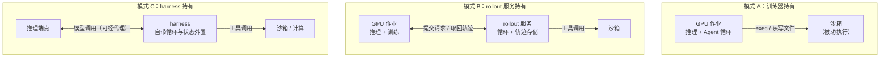
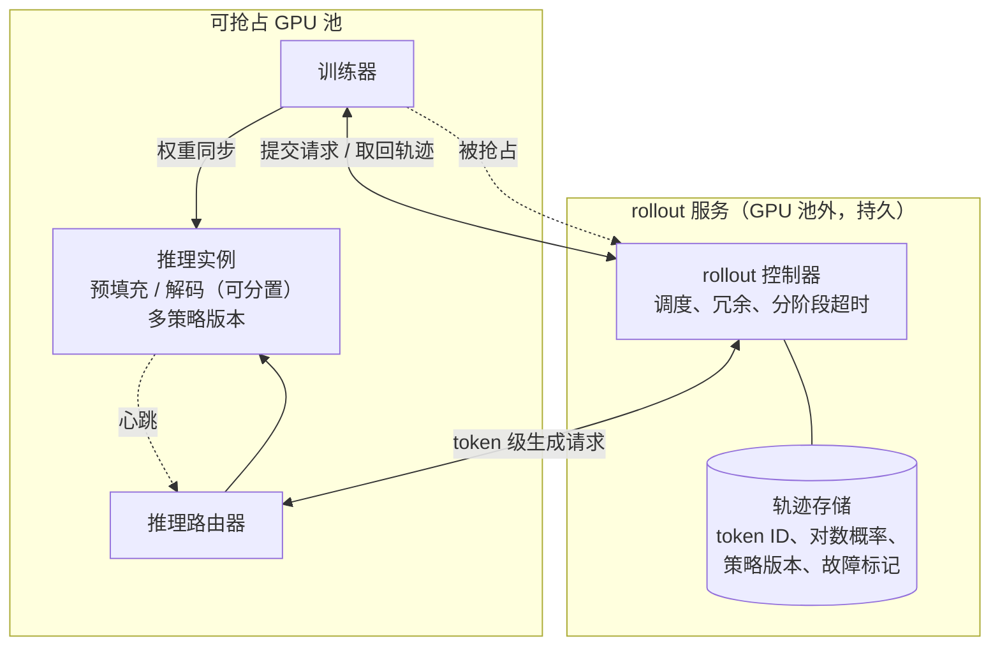
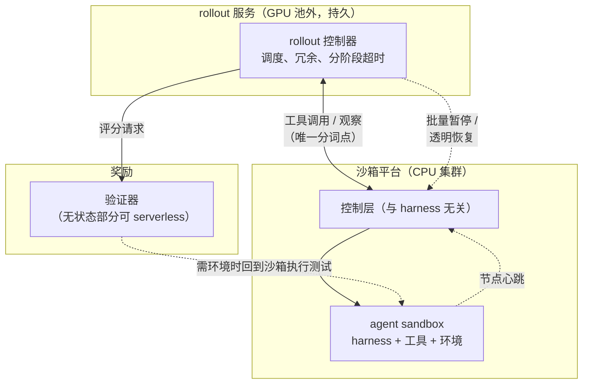

# 第 17 章　Rollout 架构与 RL 框架集成

## 本章导读

前面几章把沙箱当作一个独立的平台来拆：控制面怎样在突发下拉起几万个实例（第 9 章），镜像怎样按需加载（第 10 章），状态怎样暂停和 fork（第 11 章），内存怎样超售（第 13 章）。这些讨论有一个隐含前提：沙箱的使用者是"某个训练框架"，它会按时来取结果。本章把这个前提拆开。在 Agent RL 里，沙箱只是一次 rollout（一次策略与环境交互直至结束的完整采样过程，也称轨迹展开）的一部分；同一次 rollout 的另一半跑在 GPU 上，而 GPU 作业会被抢占、会失败、会因为权重更新而暂停。于是出现了一个此前各层都没有回答的问题：**rollout 进行到一半时，它的状态归谁？**

本章对应八层架构的第⑧层（RL 集成与完整性）中"集成"的一半；"完整性"的一半由第 19 章讨论。读完本章，读者应能：

- 说清一次 Agent rollout 的状态由哪几部分组成，分别落在 GPU 侧、harness（外壳/评测框架，负责驱动 Agent 循环、工具与打分）侧还是沙箱侧，以及"训练器持有""rollout 服务持有""harness 持有"三种归属模式各自的代价；
- 把 RollArt、ROLL Flash、ProRL Agent、DORA、slime、veRL、AReaL、Seer 等系统放进同一张设计空间表，知道它们各自把哪一段解耦、解耦后由谁兜底；
- 区分两种长尾（生成长度的长尾与环境的长尾）以及与之对应的冗余、心跳、超时手段，并知道冗余会带来什么偏差；
- 理解 token 一致性为什么是沙箱接口问题，而不只是分词器问题；
- 理解"harness 与计算分离"在训练侧和产品侧的不同含义，并据此读懂本书对 rollout 状态归属的建议。

DSec 的 agent sandbox 与 worker container 已在 24.3.8 节逐句拆解，本章只取其结论作为参照；env.reset 的故障数据见 3.6.2 节与 9.6.6 节；暂停与快照的机制见 11.3 节；规模口径的一般讨论见第 9 章"并发、创建速率与任务"边栏。

## 17.1　问题：rollout 状态归谁

### 17.1.1　一次 rollout 由哪些状态组成

一次 Agent rollout 是一个循环：模型生成一段动作，harness 把动作解析成工具调用，沙箱执行工具并返回观察，观察再拼回上下文交给模型，直到任务结束、打分。这个循环里至少有四类状态，分布在三个地方（表 17-1）。

**表 17-1　一次 Agent rollout 的状态组成**

| 状态 | 内容 | 通常所在位置 | 丢失后能否重建 |
|---|---|---|---|
| 策略侧状态 | 当前策略版本号、KV 缓存、已生成 token 及其对数概率 | GPU 推理实例 | KV 缓存可重算（代价是重新预填充）；版本号与对数概率丢了就无法做离策略修正（推断） |
| 循环状态 | 对话历史（token 序列）、轮次计数、harness 内部变量、待执行的工具调用 | harness 进程（可在 GPU 作业里、独立服务里或沙箱里） | 若只有文本没有 token，重建会引入分词漂移（见 17.5 节） |
| 环境状态 | 文件系统修改、已安装依赖、后台进程、浏览器或 GUI 状态 | 沙箱 | 只能重放全部工具调用，且外部副作用不一定可重放（见第 12 章） |
| 评分状态 | 测试结果、验证器输出、奖励 | 验证器（沙箱内或独立服务） | 通常可重算，但前提是环境状态还在 |

注：本表为笔者归纳，依据 DSec §6.2、GLM-5 §4.1.2、veRL 文档与 RollArt §3 的描述；"能否重建"一列为推断。

这张表说明，"rollout 状态归谁"不能忽略。四类状态的寿命不同：KV 缓存以秒计，对话历史以分钟到小时计，环境状态的中位寿命为 15.5–17.4 分钟、p99 超过 3 小时（DSec §4.3；论文自述；见 3.4.1 节），而 GPU 作业的抢占随时可能发生。只要四类状态不在同一个故障域里，就必须有一方被指定为"事实来源"，其余各方在故障后向它对齐。

### 17.1.2　三种中断

训练侧的中断有三种来源，它们对状态归属的要求不同。

**GPU 作业抢占。** DSec 写道："我们 GPU 集群中的训练作业会被例行抢占，以提高利用率"（Training jobs in our GPU cluster are routinely preempted to improve utilization）（DSec §6.2；论文自述）。抢占是集群调度的结果，与 rollout 本身无关，发生时刻不可预测，影响的是一个作业名下的全部 rollout。

**算法主动暂停。** Kimi K3 的部分 rollout（partial rollout）在一定比例的轨迹完成后暂停生成阶段，未完成的 rollout 在下一次迭代优先恢复（K3 §4.1.2；论文自述；见附录 A"部分 rollout"条）。Kimi K2.5 报告也说，Rollout Manager 通过对任务的细粒度控制支持部分 rollout（K2.5 附录 D；论文自述）。这种中断是有计划的，但它要求沙箱跨迭代保留状态，而且恢复时策略已经换了版本。

**组件故障。** 推理实例崩溃、沙箱创建失败、工具调用超时。RollArt 记录的环境超时约每十次迭代一次（RollArt §3.1；论文自述；见 3.6.2 节），快手 KAT-Coder-V2.5 初查时"大约 16% 的轨迹至少包含一次可归因于沙箱本身的故障"（KAT-Coder-V2.5；论文自述）。

三者的共同点是：中断发生时，沙箱多半还活着。DSec 对 V4.1 之前状况的描述最为直白："当 GPU 作业被抢占时，Agent 循环丢失了，而沙箱还在"（DSec §6.2；论文自述）。

### 17.1.3　DSec 的两种答案：回放与转移所有权

DSec 先后用过两种办法，正好代表两种思路（详见 24.3.8 节）。

**回放。** V4.1 之前，"恢复依靠一份命令日志，把训练框架恢复出的 rollout 状态与沙箱的执行状态对齐。回放时，已完成的操作复用记录下的结果，而不是重新执行"（DSec §6.2；论文自述）。这是数据库与工作流引擎里常见的日志重放思路：事实来源是"训练框架的检查点 + 命令日志"，沙箱是被动执行者，回放时用日志里的结果代替真实执行，以免把副作用做两遍。它的难点在于两边要对得上：训练框架恢复到的那一步，必须和沙箱实际执行到的那一步在日志里精确对应。

**转移所有权。** 从 DeepSeek-V4.1 起，rollout 执行移到 DSec 上，拆成承载脚手架（scaffold）与工具的 agent sandbox 和提供控制层的 worker container，"两者都运行在可抢占的 GPU 池之外"；"worker container 与 agent sandbox 共同保存完整的 rollout 状态，作为它的唯一事实来源，使被抢占的 GPU 作业能够重新连接并继续，而不必通过命令日志回放来重建执行过程"（DSec §6.2；论文自述）。抢占发生时，"RL 框架主动向与被抢占作业相关的所有沙箱发送暂停请求"（The RL framework therefore proactively sends pause requests to all sandboxes associated with a preempted job）；之后"对于容器与 microVM，任何发往已暂停沙箱的请求都会透明地恢复它"（DSec §6.3；论文自述）。

回放思路在工业界并不陌生。持久执行（durable execution）类工作流引擎的基本做法，就是把每一步活动的结果写进事件历史，故障恢复时按历史重放代码、跳过已完成的活动并直接取用记录的结果；Cursor 把云 Agent 的编排迁到 Temporal 后，可靠性从"一个 9"提到"超过两个 9"（约 90% → 99% 以上，为本书换算）（Cursor 博客，2026-06-02；一手文档；见 9.6.3 节）。DSec 旧方案的命令日志与此同构（推断）。它在训练侧遇到的特殊困难有两点：一是训练框架恢复出的 rollout 状态来自检查点，与命令日志的最后一条不一定落在同一步上；二是工具执行的结果只是环境状态的一个投影，跳过执行虽然拿回了返回值，沙箱里的文件与进程却必须本来就处在执行之后的状态，否则后续步骤会在错误的环境上运行（推断）。在 DSec 的场景下沙箱一直存活，第二点恰好成立，这可能正是回放方案能够工作的原因。

两种办法的差别不在技术细节，而在**谁是事实来源**。回放模式下，事实来源在 GPU 一侧，沙箱需要向它对齐；转移模式下，事实来源在 GPU 池之外，GPU 作业变成可以随时断开、随时重连的客户端。后者把一个分布式一致性问题（两份状态怎样对齐）变成了一个可用性问题（GPU 池之外的那份状态怎样不丢）。DSec 论文没有披露 worker container 与训练框架之间的协议，也没有说明重连时正在执行的工具调用如何处理（DSec 全文；2026-10-03 核对），这是 17.8 节列出的开放问题之一。

### 17.1.4　三种归属模式

把公开系统按"谁持有循环状态"归类，可以得到三种模式（图 17-1）。

**图 17-1　rollout 状态的三种归属模式**（示意图，笔者依据 DSec §6.2、ProRL Agent、veRL 文档、OpenAI Agents SDK 博文与 HF 博文归纳）

**模式 A：训练器持有。** Agent 循环跑在训练作业里（或与推理同进程），沙箱只负责执行。veRL 的 AgentLoop 默认形态属于此类：推理引擎是服务端，AgentLoop 是客户端，用 asyncio 协程让每个 rollout 请求异步执行，以"避免在等待工具调用返回时 GPU 空闲"（veRL 文档；一手文档）。阿里 MegaFlow 让"一个 pod 通常把 Agent 容器与执行环境容器放在一起"（arXiv 2603.00729；论文自述；见表 9-2），是这一模式在 K8s 上的变体。DSec 在 V4.1 之前也属此类。优点是简单、延迟低；缺点是 GPU 作业的故障域覆盖了循环状态，抢占即丢失。

**模式 B：rollout 服务持有。** 循环与轨迹从训练作业里拿出来，放进一个独立服务，训练器通过 API 提交请求、取回完整轨迹。NVIDIA ProRL Agent 是这一模式的明确表述，论文标题即"rollout 即服务"（Rollout-as-a-Service）：训练器"提交 rollout 请求并接收完成的轨迹与奖励，rollout 服务器负责环境执行、工具使用、评测与推理协调"，接口包括提交任务的 `POST /process` 与取消任务的 `POST /cancel`（ProRL Agent 正文；论文自述）。它的出发点是"现有基础设施往往把 rollout 编排与训练循环耦合在一起，使系统难以迁移和维护"（ProRL Agent 摘要；论文自述）。DSec 自 V4.1 起的 worker container 也属此类，只是它把服务放进了沙箱平台本身。

**模式 C：harness 持有。** 循环由一个与训练框架无关的 harness 掌控，训练侧只看到模型调用。Hugging Face 的综述称之为"harness 化 RL"，并援引 Agent Lightning 框架的定义："由 harness 而不是训练引擎掌控环境交互循环"（The harness, rather than the training engine, owns the environment interaction loop）（HF 博文，2026-09-11；二手报道）。产品侧的 OpenAI Agents SDK 把这一模式推到了状态外置："当 Agent 的状态被外置时，丢掉一个沙箱容器并不意味着丢掉这次运行"；借助内置的快照与再水化（rehydration），SDK 可以"在新容器中恢复 Agent 的状态，并在原环境失败或过期时从上一个检查点继续"（OpenAI Agents SDK 博文，2026-04-15；一手文档）。

三种模式不是互斥的。DSec 的 agent sandbox 承载 DeepSeek Harness 本身，worker container 提供"与脚手架无关的控制层"，可以看作 B 与 C 的组合：harness 在沙箱里，控制层在沙箱旁，二者都在 GPU 池外（推断）。

## 17.2　解耦架构

"解耦"在 RL 系统论文里有多种含义。为了避免混用，本节按被拆开的边界分成四类：硬件与阶段的解耦（RollArt）、环境级异步（ROLL Flash）、rollout 服务化（ProRL Agent，17.1.4 节已述）、生成与训练的异步（AReaL、DORA、CWM、slime、prime-rl）。Seer 不做解耦，放在最后作为对照。

### 17.2.1　RollArt：按阶段映射硬件

RollArt 是阿里巴巴与港科大的工作，arXiv 2512.22560（v1 2025-12-27，v2 2026-06-15），发表于 OSDI'26（USENIX 演讲页；附录 B C-20）。它的核心主张是"解耦的基础设施"：把流水线的每一段映射到最合适的硬件，"把预填充密集的任务路由到计算优化的 GPU，把解码密集的任务路由到带宽优化的 GPU"，并且"把无状态的奖励计算卸载到 serverless 基础设施"（RollArt 摘要；论文自述）。环境则运行在 CPU 集群上，"CPU 集群为多样的容器化运行环境提供弹性容量，由 Kubernetes 编排"（RollArt v2 正文；论文自述；另见表 9-2）。论文在"超过 3,000 张 GPU"的集群上训练"数千亿参数的 MoE 模型"，训练时间比多种 RL 系统缩短 1.31–2.05 倍（RollArt 摘要；论文自述）。

对沙箱而言，RollArt 有三处要注意。

**第一，奖励被单独拿出来。** RollArt 用"弹性 serverless 平台承载奖励 worker"，由此免去"专用的热备 GPU，同时获得自动扩缩与容错"（RollArt v2 正文；论文自述）。这意味着评分状态（表 17-1 第四行）与环境状态分离：沙箱只负责产生可评分的产物，打分在别处做。这样做的前提是奖励"无状态"，即评分不需要回到沙箱里跑测试；对 SWE 类任务，测试通常要在环境里执行，此时奖励就不是无状态的（推断）。论文没有说明 SWE 任务的测试在哪一侧运行。

**第二，以轨迹为调度粒度。** "每个 EnvManager 按自己的时间线运行，因此一个慢环境永远不会阻塞其他环境"；"每条轨迹独立地经历生成、环境交互与奖励计算"（RollArt v2 正文；论文自述）。这是 ROLL Flash 设计的延续（见 17.2.2 节）。

**第三，故障由推理侧兜底。** 原文写："若某个推理 worker 失败，RollArt 先在同一张 GPU 上重启它；多次失败后，该 worker 被移除，它所存储的轨迹在健康的 worker 上继续"（RollArt v2 正文；论文自述）。可见 RollArt 的轨迹状态在推理 worker 失败后仍可取回，但论文没有说明这些轨迹存在哪里，也没有讨论整个 GPU 作业被抢占的情形。按图 17-1 的分类，它介于 A 与 B 之间（推断）。

把环境放进独立的 CPU 集群，还有一个论文没有强调、但对本章很关键的效果：**环境与 GPU 作业不再共享故障域**。在 MegaFlow 式的同 pod 部署中，GPU 侧的任何重启都会连带环境容器；在 RollArt 式的分集群部署中，GPU 作业被抢占时，CPU 集群上的环境天然存活。这正是 DSec 在 V4.1 之前所处的状态："Agent 循环丢失了，而沙箱还在"。换句话说，把环境移出 GPU 集群只完成了解耦的一半；另一半是让循环状态也移出去，否则存活下来的沙箱无人认领（推断）。

RollArt 在陈旧度上的做法是"按轨迹施加异步上界 α"，"超出这个窗口的轨迹被中止"（RollArt v2 正文；论文自述）。中止一条轨迹，对沙箱来说意味着一段已经投入的执行时间作废；这一点在 17.4.2 节与冗余放在一起讨论。

### 17.2.2　ROLL Flash：每个环境一个事件循环

ROLL Flash（arXiv 2510.11345，2025-10；阿里巴巴、上海交通大学、港科大）与 RollArt 出自同一条工作线，两篇论文的作者有重合（推断，基于作者重合；见本节边栏）。它把环境侧的并发单位定为 EnvManager："每个 EnvManager 先通过 reset 重置其环境，然后进入一个独立的事件循环，在它的 BaseEnv 与共享的 LLMProxy 之间居中协调"（ROLL Flash 正文；论文自述）。所谓"环境级异步 rollout"，是指当一条轨迹进入环境交互时，SampleBuffer 中等待的其他轨迹立刻被派发到空闲的推理 worker 上继续生成，以减少 GPU 在等待环境时的空闲（ROLL Flash 正文；论文自述；本句为转述，机制方向与原文一致，未逐字核到）。

论文报告的总体效果是：RLVR 任务"最高 2.24 倍加速"，Agent 任务"2.72 倍"（ROLL Flash；论文自述）。真实环境中的结果分两步报告，不能首尾相连。第一步是环境级异步：即使在同步训练下，它也把 SWE 的端到端训练时间从 10.22 小时降到 8.32 小时（1.23 倍），把 ALFWorld 从 13.37 小时降到 8.44 小时（1.58 倍）（ROLL Flash §5.2.1；论文自述）。第二步是在此基础上加冗余环境 rollout：同步 rollout 下，SWE 从 8.32 小时降到 7.66 小时（−7.9%），ALFWorld 从 8.44 小时降到 7.85 小时（−7.0%）；异步 rollout 下，SWE 从 6.09 小时降到 5.65 小时（−7.2%），ALFWorld 从 5.87 小时降到 4.91 小时（−16.4%）（ROLL Flash §5.2.2；论文自述）。论文概括为"在真实 Agent 环境中 7%–16% 的额外吞吐提升"。两步之间还隔着"同步 rollout → 异步 rollout"的切换（8.32 → 6.09 小时、8.44 → 5.87 小时），论文没有把这一项单独作为结论报告。冗余的形式与偏差见 17.4.2 节。

ROLL Flash 的 LLMProxy 提供逐步推理、带回调的后处理和命令处理（ADD/ABORT）三类服务（ROLL Flash 正文；论文自述）。ABORT 命令的存在说明，在这一设计里，"取消一条 rollout"是推理侧的一等操作；对应地，沙箱侧需要能及时回收被取消轨迹占用的环境，论文没有讨论回收延迟。

> **边栏：谱系——ROLL、RollArt 与 Crab；Seer 与 AgentENV**
>
> 本章涉及的几项系统之间有明显的作者重合。ROLL Flash 的共同一作中有 Zichen Liu、Shaopan Xiong、Wei Gao、Weixun Wang，四人也都在 RollArt 的作者名单里（Wei Gao 为 RollArt 第一作者）；RollArt 的第一作者 Wei Gao 与末位作者 Wei Wang，又与 Tianyuan Wu、Lunxi Cao 一起出现在面向 Agent 沙箱的检查点系统 Crab 的作者中（见 11.4.2 节）。笔者据此推断，阿里与港科大的这条线经历了"环境级异步（ROLL Flash）→ 解耦部署（RollArt）→ 沙箱内状态（Crab）"的演进，从 GPU 侧逐步走向沙箱侧（推断，基于作者重合）。另一条线上，Seer 的作者包括 Yingdi Shan、Yongwei Wu、Mingxing Zhang，其中 Yingdi Shan 是 AgentENV 提交次数最多的两位作者之一（见第 25 章）。也就是说，同一批研究者既做 GPU 侧的 rollout 调度（Seer），也做沙箱平台（AgentENV），但两者在公开材料中没有被放进同一个系统里讨论（推断，基于作者重合）。这两条线都不是当事方陈述。

### 17.2.3　生成与训练的异步

另一条解耦边界在生成与训练之间。同步 RL 每一步都要等最慢的一条轨迹生成完才能更新权重；异步 RL 让二者并行推进，代价是部分轨迹由旧版本策略生成，需要控制陈旧度（staleness）。这条线上的系统主要优化 GPU 利用率，但它们的陈旧度策略直接决定沙箱会被"作废"多少次。

**AReaL。** 蚂蚁的 AReaL"完全把生成与训练解耦"，rollout worker 持续生成、训练 worker 独立更新，用"陈旧度增强的 PPO 变体"处理过时样本，报告"相对同步系统最高 2.77 倍训练加速"（AReaL 摘要，arXiv 2505.24298；论文自述）。AReaL 与蚂蚁的环境层 AEnvironment 配合，见 17.6.3 节。

**DORA。** 美团 LongCat 团队的 DORA（arXiv 2604.26256）认为，现有缓解长尾的办法要么付出系统开销（"部分 rollout 方法中的重新预填充"），要么付出算法代价（"基于复制的方法丢弃长轨迹"），二者都隐含假设"所有 rollout 实例必须围绕单一策略版本同步"（DORA 摘要；论文自述）。DORA 的做法是在 rollout 集群内**同时维持多个策略版本**，用大小不超过 K 的滑动窗口约束陈旧度，让长尾轨迹"在原版本下继续"（DORA 正文；论文自述）。在开源基准上，DORA 相对同步训练取得"最高 2.12 倍端到端吞吐提升和 8.2 倍 rollout 阶段加速"（DORA 摘要；论文自述）；按正文，8.2 倍出自 64 张 GPU 的实验（rollout 阶段 14.9 分钟降到 1.8 分钟），2.12 倍出自 128 张 GPU 的吞吐对比（DORA 正文；论文自述）。生产部署中，DORA 在 4,096 张加速卡上训练约 5,000 亿参数的 MoE 模型，相对生产中调优过的同步基线，在数学与工具推理任务上 rollout 加速 3.6 倍，在 Tau2-bench 与 Vita 上的 Agent 训练"最高 6.2 倍"（DORA 正文；论文自述）。论文指出，Agent 负载上差距更大，是因为那里"响应最长、偏斜最大"（DORA 正文；论文自述）。DORA 没有讨论工具调用与沙箱如何处理，它对本章的意义在于：多版本并存使"一条轨迹跨越多次权重更新"成为常态，而沙箱的状态也就要跨越同样长的时间（推断）。

**Meta CWM。** CWM 采用完全异步 RL，worker 与 trainer 分离，权重甚至在轨迹中途更新，超过 100 步的陈旧轨迹被丢弃（arXiv 2510.02387；论文自述；附录 B B17-08）。

**slime 与 prime-rl。** 智谱 GLM-5 报告称其新的异步 RL 基础设施"进一步把生成与训练解耦，以最大化 GPU 利用率"（GLM-5 §3 Post-Training；论文自述）。Prime Intellect 的 prime-rl 自述为"面向大规模高吞吐 Agent 训练的完全异步 RL"，推理、训练与编排三个组件解耦（prime-rl README；一手文档）。

### 17.2.4　Seer：同步框架里的 GPU 侧调度

Seer（arXiv 2511.14617，2025-11-18 提交，2026-04-03 修订；作者包括 Yingdi Shan、Yongwei Wu、Mingxing Zhang 等，摘要页未显示单位，**单位未核实**）走的是另一条路：保持同步 RL，用"在线上下文学习"压缩长尾。它观察到"共享同一提示的请求在输出长度与响应模式上高度相似"，据此做分段 rollout 负载均衡、上下文感知调度和自适应分组投机解码，报告"最高 2.04 倍端到端 rollout 吞吐提升"，长尾延迟降低"72%–94%"（Seer 摘要；论文自述）。

Seer 的全部优化都在 GPU 侧，沙箱在其中是黑盒。DSec 在相关工作里正是把 Slime、veRL、OpenRLHF 与 Seer 归为一类："它们把执行环境当作黑盒，假定沙箱可用且配置正确"（DSec 相关工作节；论文自述；另见 24.1.4 节）。这句批评点出了本章的主题：RL 框架层面的长尾治理已经相当成熟，却默认环境侧不会出问题，而第 3 章的数据表明，环境侧恰恰是长尾与故障的大头。

### 17.2.5　设计空间

表 17-2 把本节与 17.1.4 节涉及的系统放在一起。表 17-4（17.7 节）再把设计空间抽象成维度与选项。

**表 17-2　RL 框架与沙箱接口对照**

| 系统 | 机构 | 异步方式 | 环境 / 沙箱接口 | rollout 状态持有方 | 容错与长尾手段 | 来源与类型 |
|---|---|---|---|---|---|---|
| DSec（V4.1 起） | DeepSeek | 未披露 | agent sandbox 内运行 DeepSeek Harness；worker container 提供与脚手架无关的控制层 | worker container + agent sandbox（GPU 池外） | 抢占时由 RL 框架主动暂停沙箱，请求到达时透明恢复 | DSec §6.2–§6.3；论文自述 |
| RollArt | 阿里巴巴 / 港科大 | 轨迹级异步，异步上界 α | EnvManager；环境在 K8s CPU 集群；奖励在 serverless | 未明确；推理 worker 失败后轨迹在健康 worker 上继续 | 冗余 rollout；收够即终止在途轨迹；多级镜像缓存 | RollArt；论文自述；OSDI'26 |
| ROLL Flash | 阿里巴巴 / 上交 / 港科大 | 环境级异步 | 每环境一个 EnvManager 事件循环 + 共享 LLMProxy | 推理侧 SampleBuffer（推断） | 冗余环境组（`num_env_groups`、`group_size`）；ABORT | ROLL Flash；论文自述 |
| ProRL Agent | NVIDIA | rollout 与训练解耦 | HTTP API（`/process`、`/cancel`）；SingularityRuntime，rootless | rollout 服务 | 分阶段超时；每阶段异常回调；最小堆负载均衡 | ProRL Agent；论文自述 |
| slime（GLM-5） | 智谱 / 清华 | 生成与训练解耦 | rollout 服务器与推理路由器经标准 HTTP API 暴露；可定制 rollout 逻辑 | 未披露 | 心跳驱动容错（推理侧）；尾延迟优化 | GLM-5 §3.6；论文自述 |
| veRL AgentLoop | 字节跳动 | 服务化异步（asyncio 协程） | token 级 API；SandboxFusion 工具集成（属 SGLang 多轮 rollout 路径，见另一文档页，不一定经由 AgentLoop） | 训练器侧 AgentLoop | 未披露 | veRL 文档 [11]；一手文档 |
| Kimi K2.5 Rollout Manager | Moonshot | 每任务一个异步协程；支持部分 rollout | Gym 式接口；从托管池取带沙箱与工具的环境实例 | Rollout Manager（推断） | 记录全部推理输出的对数概率用于训推失配修正 | K2.5 附录 D；论文自述 |
| AReaL + AEnvironment | 蚂蚁 | 完全异步 | MCP 语义（`list_tools`/`call_tool`/`release`）；沙箱引擎 ASandbox 或 K8s | 未披露 | 陈旧度增强 PPO | AReaL 摘要；AEnvironment 博文（厂商自报） |
| DORA | 美团 | 多版本流式 | 未讨论 | 推理侧（KV 缓存跨实例迁移） | 多版本并存，滑动窗口 K | DORA；论文自述 |
| Miles + OpenEnv | RadixArk | 未核实 | OpenEnv 定义任务；AgentENV 作 E2B 兼容后端 | 未披露 | 未披露 | AgentENV 仓库文档；一手文档 |
| prime-rl + verifiers | Prime Intellect | 完全异步 | verifiers 环境库 + Environments Hub | 未披露 | 未披露 | 仓库 README；一手文档 |
| SkyRL-Agent | UC Berkeley | 异步流水线调度 | 轻量工具集成；可对接多个训练后端（SkyRL-train、veRL、Tinker） | 未披露 | 异步调度器比朴素异步批处理快 1.55 倍 | SkyRL-Agent 摘要；论文自述 |
| rLLM / DeepSWE | Agentica + Together | 未核实 | R2E-Gym，K8s 调度容器 | 未披露 | K8s 自动扩缩 | Together AI 博客；一手文档 |
| Seer | Moonshot / 清华 | 同步 | 黑盒 | 训练器 | 分段 rollout、上下文感知调度、投机解码 | Seer 摘要；论文自述 |

注："未披露"指本书核对过的一手材料中没有相应内容；"（推断）"为笔者依据描述归类。MiniMax Forge 与快手 KwaiEnv 见 17.5、17.6 节。

从表 17-2 能读出两点。第一，**明确回答了"状态归谁"的系统只有 DSec 与 ProRL Agent**，其余系统要么默认训练器持有，要么没有说。第二，**容错手段几乎都在推理侧**：RollArt 的 worker 重启、slime 的心跳、DORA 的多版本，保护的都是生成过程；沙箱侧的容错只出现在 DSec（暂停）、RollArt（缓存与冗余）和 ProRL Agent（分阶段超时）三处。

> **边栏：方法——怎样读异步 RL 论文的加速比**
>
> 本节引用的加速比不能横向比较，原因有三。**基线不同**：ROLL Flash、AReaL、DORA 的开源实验以同步训练为基线；DORA 的生产数字以"生产中调优过的同步基线"为基线，原文说明这是因为"在这一规模上运行全部基线代价过高"；RollArt 以"多种 RL 系统"为基线；SkyRL-Agent 的 1.55 倍以"朴素异步批处理"为基线；Seer 是同步系统，以其他同步系统为基线。**度量不同**：有的是端到端训练时间，有的是 rollout 阶段时长，有的是 token 吞吐。DORA 一篇论文里就同时出现 8.2 倍（rollout 阶段时长，64 张 GPU）、5.9 倍（rollout 阶段，128 张 GPU）、2.12 倍（token 吞吐，128 张 GPU）与 1.56 倍（端到端步长，64 张 GPU）。**负载不同**：同一系统在 Agent 负载上的加速通常高于数学推理（DORA 6.2 倍对 3.6 倍；ROLL Flash 2.72 倍对 2.24 倍），因为 Agent 轨迹的长度偏斜更大。本书引用时一律写出"相对什么、测的是什么、在什么负载上"。还要注意，这些数字衡量的都是 GPU 侧的收益；沙箱侧因此多付出的作废时间与暂停次数，没有一篇论文报告。

## 17.3　规模口径

训练侧的"并发数"至少有四种单位：沙箱、环境、任务、rollout。第 9 章的边栏已经讨论过并发数、创建速率与任务数的区别，这里只列出与 rollout 架构直接相关的数字，并保留原文单位（表 17-3）。

**表 17-3　训练侧并发规模溯源（保留原文单位）**

| 系统 | 原文数字 | 原文单位 | 来源与类型 | 说明 |
|---|---|---|---|---|
| DSec | 单作业最多 32K 个；峰值并发约 38 万个（摘要称超过 380,000） | 沙箱实例 | DSec §1、§2.4；论文自述 | "32K"为原文写法（见第 24 章） |
| Kimi K2 | 超过 10,000 个 | 并发沙箱实例 | arXiv 2507.20534；论文自述 | Kubernetes |
| Kimi K2.5 | 最多 100,000 个 | 并发 agent 任务 | K2.5 附录 D；论文自述 | 是协程任务，**不是沙箱**（附录 B C-09） |
| 智谱 GLM-5 | 超过 1k（1,000）个 | 并发 rollout | GLM-5 §4.1.1；论文自述 | Multi-Task Rollout Orchestrator |
| 美团 LongCat | 最多 32,000 个 | 并发环境 | arXiv 2601.16725；论文自述 | 约 400 台物理机 |
| 阿里 Qwen3-Coder | 20,000 个 | 并行独立环境 | Qwen3-Coder 博客；一手文档 | 2025-07 |
| 阶跃 Step 3.5 Flash | "数千" | 并发环境 | arXiv 2602.10604；论文自述 | 由 Session-Router 经 K8s 编排 |
| DeepSWE / rLLM | 512 个（批大小 64 × 8 次采样） | 每次 RL 迭代并行的 Docker 容器 | Together AI 博客；一手文档 | 超过 1,000 个 CPU 核 |
| Cursor（Composer） | "数十万个" | 并发沙箱化编码环境 | HF 博文转述；二手报道 | 未见一手 |

注：同一列中的数字单位不同，不能直接比较大小。一个任务在其生命周期内可能先后占用多个沙箱，也可能在等待推理时不占用运行中的沙箱（若被暂停），因此任务数与沙箱数之间没有固定比例。

K2.5 的例子最能说明为什么口径重要。原文是："我们的 RL 框架把每个 agent 任务当作一个独立的异步协程"；"一个专用的 Rollout Manager 在 RL 过程中最多编排 100,000 个并发 agent 任务"；"每个任务从托管池中获取一个环境实例，该实例配有沙箱与专用工具"（K2.5 附录 D；论文自述）。10 万是 Rollout Manager 这一层的并发度，环境池有多大、池中实例是否被多个任务复用、等待推理的任务是否持有运行中的沙箱，原文都没有说。与之对照，K3 报告称"暂停的沙箱不消耗内存或 CPU"，而 Agent 等待模型推理的时间"最多可占沙箱寿命的 98%"（K3 §5.3.2；论文自述；附录 B B03-10）。如果 K3 时期的 Rollout Manager 配合 AgentENV 在等待期暂停沙箱，那么"并发任务数"与"同时运行的沙箱数"之间可以相差一个数量级以上（推断；Kimi 内部 rollout 与 AgentENV 的集成方式未披露）。

另外两个数字也需要按 rollout 的结构来读。DeepSWE 的 512 个容器是"每次 RL 迭代并行启动"的数量，原文注明为"批大小 64、每题 8 次采样"（Together AI 博客；一手文档），也就是 GRPO 一类组采样算法下"一组 8 条轨迹、每条一个沙箱"的直接结果。这说明 rollout 架构中的沙箱并发度首先由算法参数决定（批大小 × 组大小 × 冗余倍数），其次才由平台容量决定（推断）。美团 LongCat 则说明了另一种关系：它的代码沙箱"并行运行数千个沙箱"，并用异步的准备与回收来掩盖启动开销（arXiv 2601.16725；论文自述），可以理解为环境池的预热与回收由 rollout 框架而不是沙箱平台来驱动（推断）。K2.5 的"从托管池获取环境实例"与此相同。环境池归谁管，是状态归属问题在资源层面的翻版。

## 17.4　长尾、冗余与容错

### 17.4.1　两种长尾

Agent RL 的长尾有两个来源，治理手段完全不同。

**生成侧长尾。** 一步训练的时长由最长的那条轨迹决定。GLM-5 报告把这一点说得很清楚：对 rollout 而言，"优化目标不是总吞吐，而是端到端延迟，它由每一步中最慢的（长尾）样本主导"（GLM-5 §3.6.2；论文自述）。slime 的对策全在推理侧：多节点推理部署与分布式 KV 缓存、"rollout 推理用 FP8 以降低每 token 延迟"，以及在小批量解码下"尤其有效"的多 token 预测（MTP）（GLM-5 §3.6.2；论文自述）。DORA 的多版本与 Seer 的投机解码也属此类。

**环境侧长尾。** 环境创建失败、镜像拉取慢、工具调用卡死。RollArt 的生产数据（环境超时约每十次迭代一次、长尾可达数百秒、超时迭代中 env.reset 占 rollout 时间的 78%）与多级缓存后的效果已在 3.6.2 节和 9.6.6 节详述，这里不再重复。快手的数字说明环境侧故障不只是慢：超时造成的无效 rollout 一度占全部 rollout 的"约 6%–7%"，环境变量处理问题造成的验证器输出损坏一度占样本的"约 6%–7%"，修复后二者都降到 1% 以下，沙箱反馈错误率从约 16% 降到 2% 以下（KAT-Coder-V2.5；论文自述）。

两种长尾的交点在于：生成侧的长尾轨迹往往也是交互轮数最多、环境寿命最长的轨迹（推断；RollArt 表 1 给出的 SWE-bench 交互轮数为 30–50 轮，GEM-math 不到 5 轮）。所以，凡是"截断长尾"的手段，都同时在作废长寿命的沙箱。

### 17.4.2　冗余及其偏差

冗余 rollout 是环境侧长尾最常见的对策：多启动一些轨迹，收够目标数量就停。

ROLL Flash 的冗余环境 rollout"通过并发启动环境组与候选轨迹来缓解慢故障（fail-slow）与停止故障（fail-stop）"，带来 7%–16% 的额外吞吐；两个旋钮是 `num_env_groups`（环境组数）与 `group_size`（每组候选轨迹数），论文发现"增加组数比扩大组的规模更能提高韧性"（ROLL Flash；论文自述）。RollArt 的表述是："一旦收集到目标数量的轨迹，在途轨迹即可终止。由于 rollout 以轨迹为粒度管理，慢的或失败的环境不会阻塞快的环境，从而缓解掉队者"（RollArt v2 正文；论文自述）。阿里云在介绍 Qwen-Coder-Qoder 训练时称，异步调度、前缀与 KV 复用加冗余环境执行合计带来 10 倍吞吐提升（阿里云博客，2026-07-17；厂商自报；附录 B B17-05，本章未回原文核对）。

冗余有两项代价，公开材料都没有量化。

**资源代价。** 被终止的在途轨迹所占用的沙箱时间全部作废。若冗余比例为 r，最坏情况下有 r/(1+r) 的沙箱时间被浪费（笔者推算，假设冗余轨迹与正常轨迹寿命相同）。对 GPU 侧这一代价可以被吞吐提升抵消，但沙箱侧没有对应的收益：它只是更多的创建、更多的内存。

**采样偏差。** "收够就停"会系统性地丢掉最慢的那部分轨迹，而最慢的轨迹往往是最长、最难的。DORA 的摘要把这一点列为现有方法的"算法代价"：基于复制的方法"丢弃长轨迹"，而长轨迹"往往对 RL 训练最有价值"（DORA 摘要；论文自述）。冗余对付的是"环境坏了"，但它无法区分"环境坏了导致慢"与"任务本身难导致慢"（推断）。

本书据此认为，冗余应当以环境健康信号为条件，而不是无条件地"先到先得"（见 17.7.3 节建议 5）。

### 17.4.3　心跳、超时与故障—奖励解耦

**心跳保护的是谁。** slime 的"心跳驱动容错"常被简述为"rollout 容错"。GLM-5 报告的原文是："rollout 服务器周期性地发出心跳"（Rollout servers periodically emit heartbeats），不健康的服务器会被主动终止，"并从推理路由器中注销"（deregistered from the inference router）（GLM-5 §3.6.3；论文自述；"由编排层监控"一语本书核对未能逐字取得，**未核实**）。从"从推理路由器中注销"看，这里的 rollout 服务器指的是推理服务实例，心跳保护的是生成侧，不是沙箱（推断）。沙箱侧的心跳在公开材料里出现在 AgentENV 的调度器：调度器以节点心跳名单为事实来源，沙箱到节点的绑定关系保存在内存中，调度器重启即丢失（AgentENV 架构文档；一手文档；见 9.6.6 节与附录 B B09-08）。两种心跳覆盖的是不同的故障域，一套完整的 rollout 系统需要两者都有（推断）。

**超时怎么计。** ProRL Agent 的"分阶段超时"值得单独一提：计时器"只在活跃的流水线阶段（init、run、eval）累计耗时，不计入在阶段间队列中等待的时间"；每个阶段注册专门的异常回调，以免故障拖住 worker 池（ProRL Agent 正文；论文自述）。这解决了一个常见的误判：在异步系统里，一条 rollout 可能因为排队等推理而"看起来超时"，如果按墙钟计时就会把排队误判为环境故障，把健康的沙箱杀掉（推断）。

**故障不等于零奖励。** 快手的数据说明，沙箱故障如果直接变成零奖励或损坏的验证器输出，就会污染梯度。原文把超时引起的问题称为"无效 rollout"（timeout-induced invalid rollouts），说明它们是被识别并区别对待的（KAT-Coder-V2.5；论文自述）。把"基础设施失败"作为一类显式的轨迹状态，与"任务失败"区分开，是 rollout 服务的基本职责（推断；见 17.7.3 节建议 4）。

### 17.4.4　底座本身的成本差距

Daytona 作者的 *The Rollout Infrastructure Tax*（arXiv 2607.01415，2026-07-01；投稿 ACM SoCC 2026 的预印本，6 页）比较了四种执行底座：单容器、托管沙箱、Kubernetes 编排的容器和云虚拟机，报告"冷启动延迟最高相差 110 倍"，对"一百万条 150 步轨迹"预计的 worker 工时相差 1.8 倍（摘要；论文自述）。作者来自沙箱厂商，结论倾向"把基础设施优化纳入训练系统设计"，引用时应注明利益关系（附录 B B17-13）。这篇论文与 RollArt、快手的生产数据方向一致：在 Agent RL 中，环境侧的成本与故障已经不能被当作部署细节。

## 17.5　token 一致性

### 17.5.1　问题

token 一致性看上去是训练框架内部的事：训练时计算损失所用的 token 序列，必须与推理时模型实际采样出的 token 序列逐一对应。但在 Agent rollout 中，序列是由模型输出与工具输出交替拼接而成的，工具输出来自沙箱，以文本形式返回。问题出在拼接方式上。

GLM-5 报告给出了两种做法的定义："在 RL rollout 场景中，token 进 token 出（token-in-token-out，TITO）指训练流水线直接消费推理引擎产生的精确分词结果与解码 token 流，并直接用它构建学习所用的轨迹。与之相对，文本进文本出把 rollout 引擎当作返回最终文本的黑盒，训练器随后对文本重新分词（并常常重新推导边界与截断）来构建轨迹，再计算损失"（GLM-5 §4.1.2；论文自述）。

veRL 文档说明了为什么后者会出错："token 与文本之间的转换可能是不可逆的。例如，由 '<think>' 转换得到的 token 会与 LLM 生成的不同"；因此"必须严格使用 LLM 推理生成的 token，以免优势计算不准确，进而影响模型性能"（veRL 文档；一手文档）。

问题的规模由快手给出：在约 200 轮的规模上，使用标准聊天接口时，"约 40% 的样本"出现重新分词漂移，"由此产生的 token 漂移不可忽略"（KAT-Coder-V2.5；论文自述；附录 B B17-10）。

### 17.5.2　各家做法

公开材料中的做法可以归为三类。

**绕过聊天接口。** 快手的 Gateway Server 中介全部流量并"强制 token 一致性"，它"完全绕过聊天接口，把每个请求直接发往推理后端的 `/generate` 端点"（KAT-Coder-V2.5；论文自述）。veRL 用 token 级 API 代替 chat completion（veRL 文档；一手文档）。

**以 token ID 为规范表示。** ProRL Agent "在整个训练过程中以 token ID 作为规范表示"："rollout worker 把 prompt_ids 直接发给 LLM 后端，接收带逐 token 对数概率的 response_ids"（ProRL Agent 正文；论文自述）。

**记录对数概率做失配修正。** Kimi K2.5"记录推理引擎全部输出的对数概率，用于训练—推理失配修正，确保 RL 训练稳定"（K2.5 附录 D；论文自述）。这一做法与 TITO 互补：TITO 保证序列一致，对数概率记录保证离策略修正有据可依。GLM-5 在异步训练稳定性一节同时列出 TITO、双侧重要性采样、丢弃离策略或噪声样本和 DP 感知路由（GLM-5 §4.1.2；论文自述）。

### 17.5.3　为什么这是沙箱接口问题

token 一致性与 rollout 状态归属直接相关。若事实来源放在 GPU 池之外（模式 B 或 DSec 的做法），那么这份状态必须包含 token ID、对数概率与生成它们的策略版本号，而不能只是一份文本对话记录；否则 GPU 作业重连之后，只能对文本重新分词，前面防住的漂移会在恢复路径上重新出现（推断）。DSec 论文没有说明 worker container 保存的 rollout 状态是 token 级还是文本级。

另一处交界在工具输出的分词。工具输出以文本形式离开沙箱，必须在某一点被分词一次，此后只以 token 形式流转。这个"唯一的分词点"放在 harness、rollout 服务还是训练器，决定了谁需要持有分词器与对话模板（推断）。截断是同一问题的另一面。GLM-5 的定义特别提到文本进文本出的做法"常常重新推导边界与截断"。工具输出的长度不受模型控制：DSec §6.4 记录过无界输出在沙箱里堆出数十 GB 的情形（DSec §6.4；论文自述；见第 19 章）。观察被截断到多长、截在哪里、截断标记怎样表示，都会进入训练序列；如果截断在沙箱侧做一次、在训练侧又做一次，两次的结果可能不同（推断）。因此截断策略应当与分词放在同一个点上执行，并作为轨迹的一部分记录下来。

E2B 协议与 OpenEnv 都以文本或结构化观察为接口，不涉及这一层（见第 16 章）。

## 17.6　harness 集成

### 17.6.1　三种集成模式

Hugging Face 的综述把训练系统与 Agent harness 的接法归为三类（HF 博文，2026-09-11；二手报道）：**白盒**，由训练器重建或接管 harness、驱动每一步（转述；博文此处以 Kimi K3 为例，原句未逐字核到）；**黑盒**，用一个代理层"把 Agent harness 当作黑盒，无需修改"，在代理层捕获 token 级轨迹；**harness 化 RL**，博文援引 Agent Lightning 的定义，"由 harness 而不是训练引擎掌控环境交互循环"。

三者对沙箱的含义不同。白盒模式下，训练器知道每一步的工具调用，沙箱可以只提供 exec 与文件接口。黑盒模式下，harness 是一个不可修改的程序，它自己决定何时启动进程、读写哪些文件，沙箱必须完整地承载这个程序及其全部依赖；训练侧对沙箱内部发生的事一无所知，只能看到经过代理的模型调用（推断）。harness 化模式下，循环状态由 harness 持有，训练器要想在抢占后恢复，就得依赖 harness 自己的状态外置能力。

黑盒模式还有一个容易被忽略的网络含义。代理层要捕获 token 级轨迹，就必须位于 harness 与推理端点之间；当 harness 在沙箱内运行时，沙箱必须能访问这个代理端点。于是，沙箱的出站策略里至少有一条通往推理服务的路径，而这条路径本身也是被训练模型可以触达的（推断）。DSec 由训练框架按阶段下发出站策略（见第 14 章），可以把这条路径限制在代理端点的地址与端口上；但它仍然是出站白名单中最特殊的一项，因为流经它的是模型自己的调用。

MiniMax 的 Forge 是同时支持白盒与黑盒的代表：它自称"完全不依赖 Agent 的内部实现细节"，M2.5 训练中处理过"超过十万个不同的真实 Agent scaffold 与环境"，涉及"数百种 scaffold 与数千种不同的工具调用格式"，每日处理"数百万样本"量级（MiniMax Forge 博文，2026-02-13；厂商自报；附录 B B17-16）。阶跃 Step 3.5 的训练 harness 覆盖 OpenHands、SWE-agent 等多种 scaffold（arXiv 2602.10604；论文自述；见附录 A"脚手架"条），目的是避免模型对单一 harness 过拟合。据 HF 博文转述，智谱 GLM-5.3 把环境"作为数据生成"接入 slime，"而不是作为对训练循环的修改"（HF 博文转引 z.ai 博客；二手报道，本书未直接核实）。

多 harness 训练对沙箱平台的要求是：同一个任务要能在不同 harness 下复现同样的初始环境，且环境镜像与 harness 镜像要能独立组合（推断）。这与 DSec 的可组合层（base → workspace → toolkit，见第 10 章）思路一致。

### 17.6.2　harness 放在沙箱里还是沙箱外

"harness 与计算分离"在训练侧与产品侧有不同的出发点。

**产品侧的出发点是凭据。** OpenAI Agents SDK 写道："Agent 系统的设计应当假定会遇到提示注入与数据外泄尝试。把 harness 与计算分离，有助于让凭据远离执行模型生成代码的环境"（OpenAI Agents SDK 博文，2026-04-15；一手文档）。同一篇博文给出的第二个理由是持久执行：状态外置后，丢掉沙箱不等于丢掉运行（见 17.1.4 节）。SDK 内置 Blaxel、Cloudflare、Daytona、E2B、Modal、Runloop、Vercel 七家沙箱 provider，并用 Manifest 描述工作区（同上）。

**训练侧的出发点是可抢占。** DSec 把 harness 放进沙箱：agent sandbox"承载脚手架（如 DeepSeek Harness）及其工具"（DSec §6.2；论文自述）。这样做的好处是 harness 与环境同生共死，暂停与恢复是一个原子单位，GPU 作业断开时二者一起被冻结。代价是模型生成的代码与 harness 运行在同一个沙箱里。DSec §6.4 记录的行为里，有一类正是攻击平台自身：伪造 chronus 的 RPC、翻读日志（DSec §6.4；论文自述；见第 19 章与 24.5 节）。chronus 是沙箱内负责 shell 会话的组件（见 24.3.3 节），不是 harness 本身，但它说明了同一沙箱内的控制组件会成为攻击目标。DSec 的对策是 AppArmor profile 控制对 chronus 日志与 Unix domain socket 的访问，"即使 Agent 控制的进程在沙箱内以 root 身份运行"也生效（DSec §6.5；论文自述）。

两种做法各有道理。把 harness 放在沙箱外，凭据与评分逻辑更安全，但抢占时 harness 与沙箱要分别保存、再对齐，又回到了 17.1.3 节的回放问题；把 harness 放在沙箱内，状态归属简单，但 harness 与评分逻辑暴露给被训练的模型（推断）。DSec 的折中是：harness 在内，与脚手架无关的控制层（worker container）在外，并用强制访问控制隔开沙箱内的控制通道。

### 17.6.3　接口层

rollout 服务与环境之间的接口在 2026 年呈现"多规范、靠适配器互联"的格局，细节见第 16 章，这里只记与 rollout 架构相关的几点。

- **Gym 式接口。** Kimi K2.5 的 RL 框架"提供标准化的 Gym 式接口，以简化多样环境的实现"（K2.5 附录 D；论文自述）。OpenEnv 用 client/server 形式提供 `reset()/step()/state()`，MCP 是"一等公民"（OpenEnv 博文，2026-06-08；一手文档；见第 16 章）。
- **MCP 式接口。** 蚂蚁 AEnvironment 主张"一切皆环境"："无论是基准、工具集还是另一个 Agent，都可以作为统一的环境接口被调用"；上层 Agent"只需面对一致的语义：`list_tools`/`call_tool`/`release`"；它与 AReaL 深度协作，自称支持万亿参数模型训练与"数万"吞吐（AEnvironment 博文，2025-12-17；厂商自报）。
- **环境库。** NVIDIA NeMo Gym 把环境定义为"数据集、Agent harness 与验证器"，汇集来自 Aviary、Harbor、OpenEnv、Reasoning Gym、Verifiers 的 1,000 多个社区环境，沙箱后端可选 OpenSandbox、Apptainer、E2B、Docker、ECS Fargate（NeMo Gym 文档；一手文档，2026-10-04 第 16 章复核）；ProRL Agent 作为其一部分开源（ProRL Agent 摘要；论文自述）。Prime Intellect 的 verifiers 是"用于构建 LLM 训练与评测环境的库"，与 Environments Hub、prime-rl 配套（verifiers README；一手文档）。
- **沙箱后端。** AgentENV 的文档给出了一个完整组合：用 RadixArk 的 Miles 框架以 GRPO 训练 GLM-4.7-Flash，任务由 OpenEnv 定义，Terminal-Bench-2 为数据，AgentENV 作为 E2B 兼容的沙箱后端（AgentENV 仓库 `docs/src/use-cases/miles.md`；一手文档；见第 25 章）。

这些接口的共同缺口是：**都没有抢占语义**。E2B 协议有暂停与恢复，但没有"与某个训练作业关联的一组沙箱"这一概念，也没有"作业被抢占时批量暂停"的操作；OpenEnv 的 `state()` 返回的是环境状态，不是 rollout 状态（推断；见第 16 章与 17.8 节）。DSec 的"RL 框架主动向与被抢占作业相关的所有沙箱发送暂停请求"，目前只存在于自研系统内部。

## 17.7　参考架构与本书建议

### 17.7.1　参考 rollout 架构

综合前几节，图 17-2 与图 17-3 给出一个参考架构。它不是任何一家的实现，而是把公开系统中已被验证的做法放进同一组图：GPU 侧的解耦来自 RollArt 与 DORA，状态归属来自 DSec 与 ProRL Agent，token 一致性来自 GLM-5、veRL 与快手，奖励卸载来自 RollArt，心跳来自 slime 与 AgentENV。

**图 17-2　参考 rollout 架构（一）：GPU 池与 rollout 服务**（示意图，笔者综合 DSec §6.2–§6.3、RollArt v2、ProRL Agent、GLM-5 §3.6 与 §4.1.2 绘制；各连线为逻辑关系，不代表任何一家的具体协议）

**图 17-3　参考 rollout 架构（二）：rollout 服务、沙箱平台与奖励**（示意图，笔者综合 DSec §6.2–§6.3、RollArt v2、ProRL Agent、GLM-5 §3.6 与 §4.1.2 绘制；各连线为逻辑关系，不代表任何一家的具体协议）

图中的关键设计是：**轨迹存储放在 GPU 池之外，并以 token 为单位记录**；沙箱平台只对 rollout 控制器负责，不直接与训练器对话；抢占的信号经由 rollout 控制器传给沙箱平台，变成批量暂停。

表 17-4 把这组图背后的设计维度展开。

**表 17-4　rollout 架构的设计空间**

| 维度 | 选项 | 代表系统 | 主要取舍 |
|---|---|---|---|
| 循环状态归属 | 训练器 / rollout 服务 / harness | veRL AgentLoop、MegaFlow / ProRL Agent、DSec / OpenAI Agents SDK | 简单与低延迟 ↔ 抢占后可续 |
| 抢占后恢复 | 重跑 / 命令日志回放 / 重连 | — / DSec（V4.1 前）/ DSec（V4.1 起） | 实现成本 ↔ 两份状态的对齐难度 |
| 抢占期沙箱处置 | 销毁 / 保持运行 / 暂停 | — / — / DSec、AgentENV | 内存成本 ↔ 恢复延迟（见第 11、13 章） |
| 异步粒度 | 批同步 / 环境级 / 轨迹级 / 多版本流式 | Seer / ROLL Flash / RollArt / DORA | GPU 利用率 ↔ 陈旧度与沙箱作废 |
| 陈旧度控制 | 丢弃超龄轨迹 / 中止窗口外轨迹 / 多版本并存 | CWM / RollArt / DORA | 浪费沙箱时间 ↔ 维护多版本的推理开销 |
| 环境侧长尾 | 冗余 / 缓存 / 超时重试 | ROLL Flash、RollArt / RollArt / ProRL Agent | 吞吐 ↔ 资源浪费与采样偏差 |
| 健康检测 | 推理心跳 / 节点心跳 / 分阶段超时 | slime / AgentENV / ProRL Agent | 覆盖的故障域不同 |
| 轨迹表示 | 文本 / token ID / token ID + 对数概率 | 聊天接口 / 快手 Gateway、veRL、ProRL Agent / K2.5、GLM-5 | 接口通用性 ↔ 训练正确性 |
| 奖励位置 | 沙箱内 / 独立服务 / serverless | 多数 SWE 环境 / NeMo Gym 验证器 / RollArt | 需环境状态 ↔ 弹性与隔离 |
| harness 位置 | 沙箱内 / 沙箱外 | DSec / OpenAI Agents SDK | 状态归属简单 ↔ 凭据与评分逻辑暴露 |
| 环境与 GPU 的物理关系 | 同 pod / 同集群 / 独立 CPU 集群 | MegaFlow / — / RollArt、DSec | 通信延迟 ↔ 故障域隔离与弹性 |

注：代表系统按公开材料归类；"—"表示本书未见公开系统明确采用。

### 17.7.2　三种故障在参考架构中的路径

用图 17-2 与图 17-3 走一遍 17.1.2 节的三种中断，可以检查这套架构是否自洽（本节为笔者推演，不对应任何一家的实现）。

**GPU 作业被抢占。** 训练器断开；rollout 控制器发现与该作业关联的全部 rollout 失去了生成端，按作业批量向沙箱平台下发暂停；沙箱平台对容器做冻结与内存回收、对 microVM（微虚拟机）写快照并终止进程（见 11.3.1 节）。轨迹存储中的 token 序列、对数概率与策略版本号保持不变。作业恢复后，训练器重新连接控制器；控制器先比较每条 rollout 的策略版本与当前版本之差，超出陈旧度窗口的直接放弃并释放沙箱，其余的向推理实例重新提交生成请求（KV 缓存需要重新预填充），第一次工具调用到达时沙箱被透明恢复。这里没有任何回放：沙箱从未离开过它被暂停时的状态。

**单个推理实例失败。** 心跳超时，路由器注销该实例；正在其上生成的请求失败。由于轨迹存储在控制器一侧，控制器只需把这些 rollout 的生成请求改投到健康实例，沙箱不受影响。这与 RollArt"轨迹在健康 worker 上继续"的效果相同，区别在于轨迹状态不依赖失败实例。

**单个沙箱失败。** 若是创建失败（env.reset），控制器按分阶段超时判定后重试或启用冗余；若是执行中失败（节点宕机、内存溢出），这条 rollout 被标记为"基础设施失败"，不进入奖励与梯度，同组的其他轨迹照常完成。若平台支持检查点，也可以从最近的检查点恢复后继续，但这要求轨迹存储记录"检查点对应第几步"，以免同一段工具调用被重复计入轨迹（推断）。

三条路径中，只有第一条需要沙箱平台理解"作业"这一概念；这正是 17.6.3 节所说的接口缺口。

### 17.7.3　本书建议：rollout 状态归属

以下为**本书建议**，依据前述公开系统的做法与本章的推断，不代表任何一家的实践。

1. **把 rollout 状态的唯一事实来源放在可抢占资源之外。** 循环状态与环境状态应当位于同一个、比 GPU 作业更长寿的故障域中，GPU 作业只作为可断开、可重连的客户端。DSec 的 worker container + agent sandbox 是目前唯一有生产披露的实现。
2. **事实来源以 token 为单位记录轨迹。** 至少包括 token ID、每 token 对数概率、生成该段的策略版本号，以及每次工具调用的输入、输出与"已执行"标记。只存文本的事实来源会在恢复路径上重新引入分词漂移（17.5.3 节）。
3. **抢占时暂停而不是销毁，并且由训练侧主动发起。** 暂停请求按"作业"批量下发，恢复由下一次请求透明触发（DSec §6.3 的做法）。同时为暂停设定预算：超过一定时长或一定策略版本差的 rollout 应被放弃并回收（陈旧度与沙箱寿命要用同一把尺子）。暂停风暴对存储带宽的压力见 11.6.3 节。
4. **把"基础设施失败"作为一类显式的轨迹终态。** 沙箱故障、环境超时、验证器异常不应折算为零奖励进入梯度，而应标记后丢弃或重试，并单独统计（快手 16% → 2% 的经验说明它的规模）。
5. **冗余要以健康信号为条件，并监控偏差。** 冗余只用于被判定为慢故障或停止故障的环境；同时记录被取消轨迹的长度与难度分布，用以检查"收够就停"是否在系统性地丢掉长轨迹。
6. **超时按活跃阶段计，心跳覆盖三个故障域。** 采用 ProRL Agent 式的分阶段超时；心跳同时覆盖推理实例、沙箱节点与 rollout 服务自身。
7. **harness 与评分逻辑的位置要与对手模型一起考虑。** 若 harness 必须在沙箱内（为了与环境一起暂停），则沙箱内的控制通道（RPC socket、日志、评分脚本）要用强制访问控制隔开，凭据不进沙箱；评分尽量在沙箱外或在 Agent 结束后的独立阶段运行（见第 19 章）。
8. **在接口层补上抢占语义。** 沙箱 API 应支持"作业"或"租约"一类的分组概念，以便按组暂停、按组回收；这是 E2B 协议与 OpenEnv 目前缺少的部分（见第 16 章）。

## 17.8　开放问题

**重连时的恰好一次语义。** DSec 旧方案在回放时"复用记录下的结果，而不是重新执行"，明确处理了重复执行问题；新方案说 GPU 作业可以"重新连接并继续"，但没有说明抢占发生时正在执行的工具调用怎样处理：是等它完成、结果缓存在 worker container 里，还是中断后重试（DSec §6.2；2026-10-03 核对）。对有外部副作用的工具（见第 12 章），这决定了副作用会不会被执行两次。

**陈旧度与沙箱寿命的耦合。** 异步 RL 用"步数"或"版本差"衡量陈旧度，沙箱平台用"时长"衡量空闲。一条被暂停了很久的 rollout，在恢复时可能已经落在陈旧度窗口之外，恢复它的成本白费；反过来，为了不白费而放宽陈旧度窗口，又会影响训练稳定性。目前没有公开系统把两者放在同一个调度器里决策（推断）。

**冗余与截断的偏差没有被量化。** ROLL Flash 与 RollArt 报告了冗余的吞吐收益，DORA 指出了复制方法丢弃长轨迹的代价，但没有一篇论文测量过冗余对最终模型能力、尤其是对长程任务能力的影响。

**跨框架的 rollout 状态格式。** 环境接口正在收敛（OpenEnv、verifiers、NeMo Gym 之间有适配器），但 rollout 状态本身没有公共格式：同一条轨迹在 veRL、slime、prime-rl 之间无法迁移，也就无法在框架之间做抢占后的恢复（推断）。

**多版本推理与沙箱的配合。** DORA 让长尾轨迹"在原版本下继续"，并在同版本实例之间迁移 KV 缓存。若沙箱平台也知道每个沙箱属于哪个策略版本，就可以在资源紧张时优先暂停最旧版本的沙箱；这种跨层协同目前没有公开实现（推断）。

**harness 自身的可快照性。** 17.6.2 节讨论了 harness 放在哪里，但没有讨论 harness 的状态能否被保存。DSec 把 harness 放进 agent sandbox，借助沙箱的暂停把 harness 一起冻结；OpenAI Agents SDK 则要求 Agent 状态显式外置。对黑盒集成的第三方 harness（17.6.1 节），这两条路都不一定走得通：容器暂停能保住进程，但跨节点迁移或 microVM 快照恢复后，harness 持有的网络连接（例如到推理端点的长连接）会断开，harness 是否能自行重连取决于它的实现（推断）。

**训练、评测与产品能否共用 rollout 服务。** 三种场景的 rollout 在结构上相同，但对状态归属的要求不同：训练要求抢占后可续、可以作废；评测要求可复现，作废会影响分数的可比性（见第 20 章）；产品要求用户会话永不丢失（见第 21 章）。公开材料里，OpenAI 一位工程师自述其团队同时负责 RL 基础设施与 ChatGPT、Codex Web 的不可信代码执行基础设施（AI Engineer 官方转录），但没有说两者共用同一底座，ZenML 摘要也没有这样说；rollout 层是否共用同样未披露。

**披露空白。** 以下事项在本书核对过的一手材料中均未披露：DSec worker container 与训练框架之间的协议、rollout 状态的表示（token 级或文本级）、一次抢占暂停多少沙箱及耗时；Kimi 内部 Rollout Manager 与 AgentENV 怎样集成、K3 时期等待推理的任务是否暂停其沙箱；slime 是否对沙箱侧做健康检测；字节 Seed 内部 RL 的沙箱规模（Seed1.8、Seed2.0 模型卡均未给出）；OpenAI 训练侧是否使用 MCTS 式的检查点回溯（演讲转录只说 harness 可以对沙箱做检查点、做蒙特卡洛树搜索并回溯，"rollouts over many, many days"，没有说训练侧是否采用）。

## 本章小结

- 一次 Agent rollout 的状态分布在 GPU、harness、沙箱、验证器四处，寿命各不相同；GPU 作业抢占、算法主动暂停与组件故障三种中断发生时，沙箱多半还活着，因此必须指定一方为事实来源。
- DSec 先用命令日志回放、后用所有权转移回答这个问题：自 V4.1 起，worker container 与 agent sandbox 在可抢占 GPU 池之外共同作为 rollout 状态的唯一事实来源，抢占时由 RL 框架主动暂停相关沙箱，请求到达时透明恢复。
- 公开系统按状态归属可分为训练器持有、rollout 服务持有、harness 持有三种模式；明确回答了归属问题的只有 DSec 与 ProRL Agent。
- 解耦有四条边界：硬件与阶段（RollArt，OSDI'26，1.31–2.05 倍）、环境级异步（ROLL Flash，Agent 任务 2.72 倍，冗余另加 7%–16%）、rollout 服务化（ProRL Agent）、生成与训练异步（AReaL、DORA、CWM、slime、prime-rl），其中 DORA 在生产中对 Agent 训练的 rollout 加速最高 6.2 倍。
- 长尾分生成侧与环境侧：RL 框架的容错手段大多在生成侧，slime 的心跳保护的是推理实例而非沙箱；冗余能缓解环境侧长尾，但浪费沙箱时间，并可能系统性地丢掉长轨迹。
- token 一致性是沙箱接口问题：工具输出必须在唯一的点被分词一次，位于 GPU 池外的事实来源必须保存 token 级轨迹（快手约 200 轮时约 40% 样本受重新分词漂移影响）。
- harness 放在沙箱内（DSec）有利于状态归属，放在沙箱外（OpenAI Agents SDK）有利于凭据安全；训练侧要在可抢占与对手模型之间折中。
- 现有沙箱接口普遍缺少抢占语义；重连时的恰好一次语义、陈旧度与沙箱寿命的耦合、冗余偏差都是开放问题。

## 本章数字溯源

本表登记本章使用的数字。"核对"一列：**复核**＝本书 2026-10-03 回一手原文核对过；**沿用**＝沿用第 3、9、11、24 章已核对的文字；**未复核**＝本章未回原文核对，来源一列为原始出处。"备注"中的 B/C 编号对应附录 B。

**表 17-5　本章数字溯源**

| 数字 | 含义 | 来源 | 类型 | 核对 | 备注 |
|---|---|---|---|---|---|
| 自 DeepSeek-V4.1 起 | rollout 执行移到 DSec | DSec §6.2 | 论文自述 | 复核 | B17-01 |
| 15.5–17.4 分钟；p99 超过 3 小时 | 沙箱中位寿命（microVM、容器）；p99 寿命 | DSec §4.3 | 论文自述 | 沿用 | 见第 3 章 |
| 32K；约 38 万（摘要：超过 380,000） | 单作业沙箱请求上限；峰值并发沙箱 | DSec §1、§2.4 | 论文自述 | 沿用 | B24-04；见第 24 章 |
| 约每十次迭代一次；78% | 环境超时频率（按迭代）；超时迭代中 env.reset 占 rollout 时间 | RollArt §3.1 | 论文自述 | 沿用 | B10-14 |
| 超过 3,000 张 GPU；1.31–2.05 倍 | RollArt 集群规模；训练时间缩短 | RollArt 摘要 | 论文自述 | 复核 | B17-03；OSDI'26（C-20） |
| 30–50 轮；不到 5 轮 | SWE-bench、GEM-math 交互轮数 | RollArt 表 1（§2.1） | 论文自述 | 沿用 | B03-20、B17-04 |
| 2.24 倍；2.72 倍 | ROLL Flash 在 RLVR、Agent 任务上的最高加速 | ROLL Flash | 论文自述 | 复核 | B17-02 |
| 10.22 → 8.32 小时（1.23 倍）；13.37 → 8.44 小时（1.58 倍） | 同步训练下环境级异步对 SWE、ALFWorld 端到端训练时间的效果 | ROLL Flash §5.2.1 | 论文自述 | 复核 | B17-02 |
| 8.32 → 7.66、8.44 → 7.85 小时（同步）；6.09 → 5.65、5.87 → 4.91 小时（异步）；7%–16% | 冗余环境 rollout 对 SWE、ALFWorld 训练时间的效果（−7.9%、−7.0%、−7.2%、−16.4%） | ROLL Flash §5.2.2 | 论文自述 | 复核 | B17-02 |
| 10 倍 | Qwen-Coder-Qoder 训练吞吐提升 | 阿里云博客，2026-07-17 | 厂商自报 | 未复核 | B17-05 |
| 2.77 倍 | AReaL 相对同步系统的训练加速 | AReaL 摘要 | 论文自述 | 复核 | B17-19 |
| 2.12 倍；8.2 倍（64 张 GPU，14.9 → 1.8 分钟） | DORA 开源基准端到端吞吐；rollout 阶段加速 | DORA 摘要与正文 | 论文自述 | 复核 | B17-06 |
| 4,096 张；约 5,000 亿参数；3.6 倍；最高 6.2 倍 | DORA 生产部署规模；数学与工具推理、Agent 训练（Tau2-bench、Vita）的 rollout 加速，相对生产同步基线 | DORA 正文 | 论文自述 | 复核 | B17-06 |
| 超过 100 步 | CWM 丢弃陈旧轨迹的阈值 | CWM | 论文自述 | 未复核 | B17-08 |
| 2.04 倍；72%–94% | Seer 端到端 rollout 吞吐提升；长尾延迟降低 | Seer 摘要 | 论文自述 | 复核 | B17-20 |
| 1.55 倍 | SkyRL-Agent 异步调度器相对朴素异步批处理的加速 | SkyRL-Agent 摘要 | 论文自述 | 复核 | B17-21 |
| 超过 10,000 个 | Kimi K2 并发沙箱实例 | Kimi K2 报告 | 论文自述 | 沿用 | 见第 9 章 |
| 最多 100,000 个 | K2.5 Rollout Manager 并发 agent 任务 | K2.5 附录 D | 论文自述 | 复核 | B17-11；C-09 |
| 最多 98% | 等待推理占沙箱寿命 | K3 §5.3.2 | 论文自述 | 沿用 | B03-10 |
| 超过 1k 个 | GLM-5 并发 rollout | GLM-5 §4.1.1（v1、v2 结构查询一致） | 论文自述 | 复核 | B17-12 |
| 最多 32,000 个；约 400 台 | LongCat 并发环境；物理机 | arXiv 2601.16725 | 论文自述 | 沿用 | 见第 9 章 |
| 20,000 个 | Qwen3-Coder 并行环境 | Qwen3-Coder 博客 | 一手文档 | 未复核 | — |
| 512 个（64 × 8）；超过 1,000 个 CPU 核 | DeepSWE 每次迭代并行容器；集群规模 | Together AI 博客 | 一手文档 | 复核 | B17-09 |
| "数十万个" | Cursor 并发沙箱化编码环境 | HF 博文转述 | 二手报道 | 复核（仅转述） | B17-17 |
| 约 16% → 2% 以下；约 6%–7% → 1% 以下（两项） | 快手沙箱反馈错误率；超时无效 rollout 与验证器输出损坏 | KAT-Coder-V2.5 | 论文自述 | 复核 | B17-22 |
| 约 200 轮；约 40% | 重新分词漂移影响的样本比例 | KAT-Coder-V2.5 | 论文自述 | 复核 | B17-10 |
| 110 倍；1.8 倍；100 万条 150 步轨迹 | 四种底座冷启动差距；预计工时差距 | arXiv 2607.01415 摘要 | 论文自述（厂商作者） | 复核 | B17-13 |
| 超过十万个；每日数百万样本 | MiniMax Forge 处理的 scaffold 与环境；吞吐 | MiniMax Forge 博文 | 厂商自报 | 未复核 | B17-16 |
| 约 90% → 99% 以上 | Cursor 编排迁至 Temporal 后的可靠性（原文"one 9"→"past two 9s"，本书换算） | Cursor 博客，2026-06-02 | 一手文档 | 沿用 | B09-07 |
| 七家 | OpenAI Agents SDK 内置沙箱 provider | OpenAI 博文，2026-04-15 | 一手文档 | 复核 | — |
| 1,000 多个 | NeMo Gym 汇集的社区环境 | NeMo Gym 文档 | 一手文档 | 未复核 | — |
| r/(1+r) | 冗余比例为 r 时被作废沙箱时间的上界 | 笔者推算 | 笔者推算 | — | 假设冗余轨迹与正常轨迹寿命相同 |

## 参考文献

[1] DeepSeek-AI. *DeepSeek Elastic Compute (DSec): A Sandbox Infrastructure for Effective Agentic Training at Scale*. arXiv:2609.22978v1, 2026-09. §6.2、§6.3、§6.4、§6.5、相关工作节. https://arxiv.org/html/2609.22978v1

[2] Wei Gao, Yuheng Zhao, Tianyuan Wu, …, Wei Wang. *RollArt: Disaggregated Multi-Task Agentic RL Training at Scale*. OSDI'26；arXiv:2512.22560（v1 2025-12-27，v2 2026-06-15）. https://arxiv.org/abs/2512.22560 ；https://www.usenix.org/conference/osdi26/presentation/gao

[3] Han Lu, Zichen Liu, Shaopan Xiong 等（阿里巴巴 / 上海交通大学 / 港科大）. *ROLL Flash: Accelerating RLVR and Agentic Training with Asynchrony*. arXiv:2510.11345, 2025-10. https://arxiv.org/html/2510.11345v1

[4] Tianhao Hu, Xiangcheng Liu 等（美团 LongCat 团队）. *DORA: A Scalable Asynchronous Reinforcement Learning System for Language Model Training*. arXiv:2604.26256, 2026-04（预印本）. https://arxiv.org/html/2604.26256

[5] Zhipu AI（Z.ai）. *GLM-5 Technical Report*. arXiv:2602.15763, 2026-02. §3、§3.6、§4.1.1、§4.1.2. https://arxiv.org/pdf/2602.15763

[6] THUDM. slime. GitHub 仓库. https://github.com/THUDM/slime

[7] Hao Zhang, Mingjie Liu, Shaokun Zhang, …, Yi Dong（NVIDIA）. *ProRL Agent: Rollout-as-a-Service for RL Training of Multi-Turn LLM Agents*. arXiv:2603.18815, 2026-03-19（预印本）. https://arxiv.org/abs/2603.18815

[8] Moonshot AI（Kimi Team）. *Kimi K2.5 Technical Report*. arXiv:2602.02276, 2026-02. 附录 D. https://arxiv.org/pdf/2602.02276

[9] Moonshot AI（Kimi Team）. Kimi K2 技术报告. arXiv:2507.20534, 2025-07. https://arxiv.org/html/2507.20534v1

[10] Moonshot AI（Kimi Team）. *Kimi K3 Technical Report*. arXiv:2607.24653, 2026-07. §4.1.2、§5.3.2. https://arxiv.org/pdf/2607.24653

[11] veRL. Agentic RL Training（AgentLoop）文档. https://verl.readthedocs.io/en/latest/start/agentic_rl.html ；Sandbox Fusion Tool Integration（SGLang 多轮 rollout）. https://verl.readthedocs.io/en/v0.4.0/sglang_multiturn/sandbox_fusion.html

[12] 蚂蚁 inclusionAI 等. *AReaL: A Large-Scale Asynchronous Reinforcement Learning System for Language Reasoning*. arXiv:2505.24298（v1 2025-05-30，现行版本 2026-03-02）. https://arxiv.org/abs/2505.24298

[13] Ant Ling. AEnvironment: An Environment System for the Agentic RL Era, Out of the Box and Interconnected. Medium, 2025-12-17. https://ant-ling.medium.com/aenvironment-an-environment-system-for-the-agentic-rl-era-out-of-the-box-and-interconnected-a2e2f958ec34

[14] Ruoyu Qin, Weiran He, …, Yingdi Shan, Yongwei Wu, Mingxing Zhang. *Seer: Online Context Learning for Fast Synchronous LLM Reinforcement Learning*. arXiv:2511.14617（2025-11-18 提交，2026-04-03 修订）. https://arxiv.org/abs/2511.14617

[15] Shiyi Cao, Dacheng Li, …, Joseph E. Gonzalez, Ion Stoica. *SkyRL-Agent: Efficient RL Training for Multi-turn LLM Agent*. arXiv:2511.16108, 2025-11-20. https://arxiv.org/abs/2511.16108

[16] Agentica, Together AI. DeepSWE 发布博文（rLLM）. 2025-07-02. https://www.together.ai/blog/deepswe

[17] Meta FAIR. *CWM: An Open-Weights LLM for Research on Code Generation with World Models*. arXiv:2510.02387, 2025-09. https://arxiv.org/html/2510.02387v1

[18] 快手. *KAT-Coder-V2.5 Technical Report*. arXiv:2607.05471, 2026-07. https://arxiv.org/html/2607.05471v1

[19] Daniel Thi Graviet, Lovre Pesut, Ivan Dagelic, Vedran Jukic, Ivan Burazin（Daytona）. *The Rollout Infrastructure Tax in Coding-Agent Reinforcement Learning*. arXiv:2607.01415, 2026-07-01（投稿 ACM SoCC 2026 的预印本）. https://arxiv.org/abs/2607.01415

[20] OpenAI. The next evolution of the Agents SDK. 2026-04-15. https://openai.com/index/the-next-evolution-of-the-agents-sdk/

[21] Sergio Paniego（Hugging Face）. One sandbox per rollout, or how labs run RL for agents in 2026. 2026-09-11. https://huggingface.co/blog/sergiopaniego/rl-environments-2026

[22] MiniMax. Forge: Scalable Agent RL Framework and Algorithm. 2026-02-13. https://www.minimax.io/news/forge-scalable-agent-rl-framework-and-algorithm

[23] Prime Intellect. prime-rl；verifiers. GitHub 仓库. https://github.com/PrimeIntellect-ai/prime-rl ；https://github.com/PrimeIntellect-ai/verifiers

[24] NVIDIA. NeMo Gym: Ecosystem. https://docs.nvidia.com/nemo/gym/latest/about/ecosystem.html

[25] Hugging Face 等. OpenEnv: agentic RL environments（更新博文）. 2026-06-08. https://huggingface.co/blog/openenv-agentic-rl

[26] kvcache-ai. AgentENV. GitHub 仓库（`docs/src/use-cases/miles.md`、`docs/src/internals/architecture.md`）. https://github.com/kvcache-ai/AgentENV

[27] Meituan LongCat Team. LongCat-Flash-Thinking-2601 技术报告. arXiv:2601.16725, 2026-01. https://arxiv.org/html/2601.16725v1

[28] Qwen Team. Qwen3-Coder 发布博文. 2025-07. https://qwenlm.github.io/blog/qwen3-coder/

[29] StepFun. Step 3.5 Flash 技术报告. arXiv:2602.10604, 2026-02. https://arxiv.org/html/2602.10604

[30] Alibaba Cloud. Qwen-Coder-Qoder 训练介绍博文. 2026-07-17. https://www.alibabacloud.com/blog/603370

[31] Qwen Team. Qwen3-Coder-Next 技术报告（MegaFlow）. arXiv:2603.00729, 2026-03. https://arxiv.org/html/2603.00729v1

[32] Cursor. Lessons from building cloud agents. 2026-06-02. https://cursor.com/blog/cloud-agent-lessons

[33] ZenML LLMOps Database. Designing Agent Sandbox Infrastructure at Scale: From Runtime to Orchestration（OpenAI 工程师演讲摘要，二手）. https://www.zenml.io/llmops-database/designing-agent-sandbox-infrastructure-at-scale-from-runtime-to-orchestration

[34] AI Engineer. *From fork() to Fleet: Designing an Agent Sandbox Cloud*（Abhishek Bhardwaj，AI Engineer World's Fair 2026，转录）. https://ai.engineer/talks/OqM67QG_Ikk-from-fork-fleet-designing-agent-sandbox-cloud
