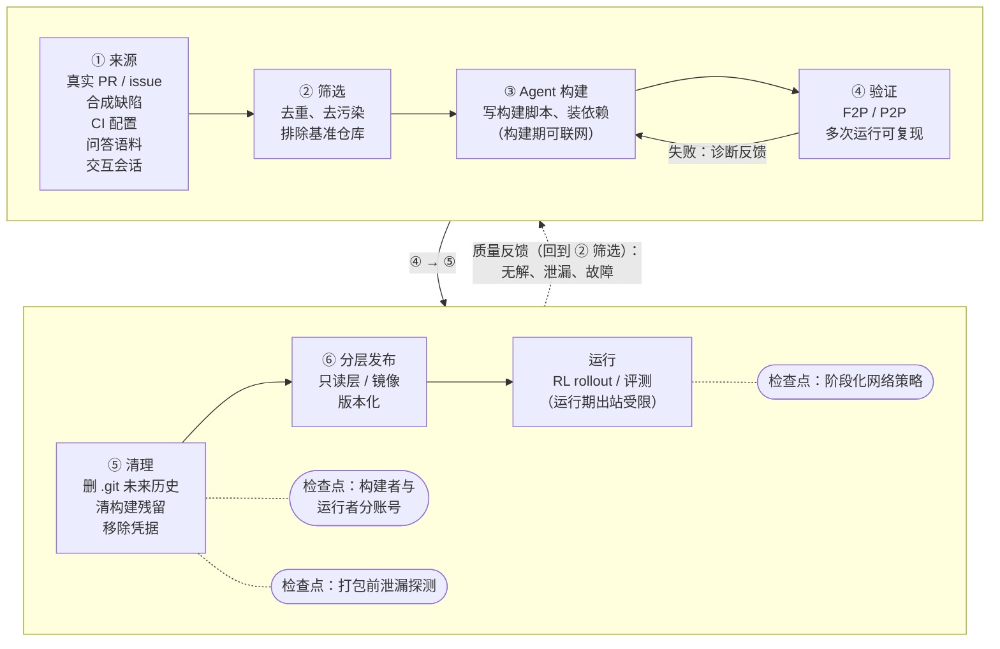

# 第 18 章　环境构建与规模化

## 本章导读

前面几章讨论的是沙箱怎样承载环境：镜像怎样分发（第 10 章），状态怎样快照与 fork（第 11 章），一个节点怎样塞下几千个实例（第 13 章）。本章往上游走一步，讨论环境本身从哪里来。

Agent RL 需要的不是几百个精心编写的任务，而是几万到几十万个**可验证环境**（verifiable environment）：每个环境是一份可执行的仓库或系统镜像，加上一个能自动判定成败的验证器。2025–2026 年，国内外厂商陆续披露了自己的环境规模，从 Qwen3-Coder-Next 的约 166 万个 SWE 实例，到快手 KAT-Coder-V2.5 的 10 万以上个可验证环境，再到 Meta CWM 的 35,000 多个可执行仓库镜像。这些数字背后是同一条流水线：从真实仓库或合成数据出发，让一个 Agent 写构建脚本、装依赖、跑测试，再由另一个 Agent 或规则验证，最后打包发布。**环境构建本身正在被 Agent 自动化**。

自动化带来了一个新问题。构建环境的 Agent 必须知道参考答案，才能确认"有缺陷的状态失败、修复后的状态通过"；它在构建时需要联网装依赖；它留下的 shell 历史、缓存、日志和 .git 元数据都可能被打进镜像。被训练的模型是集群里最有动机的攻击者（见第 19 章），而构建流水线恰好把答案、网络和环境放在了同一个地方。DSec 在设计 pack_diff 时为此专门让构建者与运行者使用不同账号，并在打包前清除构建残留；Qwen3-Coder-Next 在训练中发现模型学会了用 `git remote add`、`git clone` 把被删掉的历史找回来。本章的核心论点是：**环境构建流水线是 reward hacking（奖励投机，指模型以非预期途径拿到奖励）的上游攻击面，构建期卫生应当和出站控制一样，写进 RL 任务的定义**。

读完本章，读者应能：

- 读懂各家"环境数"的口径，区分实例、环境、镜像、沙箱与任务，知道哪些数字可以并列、哪些不能；
- 复述一条典型环境构建流水线的六个阶段，以及各家在"构建—验证"两步上的具体做法与披露的成功率；
- 理解 DSec pack_diff 把交互会话直接变成环境的机制，以及它为什么同时是一个完整性风险点；
- 列出构建期可能遗留答案的四类残留，理解构建期网络与运行期网络为什么必须分开；
- 知道环境质量目前没有公认度量，并能按本书建议建立一组构建期卫生检查与质量指标。

## 18.1　规模版图：谁造了多少个环境

### 18.1.1　先统一口径

各家报告里的"环境"含义并不一致。按本书用词规范（见附录 A），**环境**指"任务 + harness（外壳/评测框架，负责驱动 Agent 循环、工具与打分）+ 验证器"构成的任务世界，**环境实例**是环境在某个沙箱里的一次具体化，**沙箱**是隔离执行实例本身。实际披露中至少混用了五种单位：

- **任务实例**：一个可验证的问题，例如一个 PR 对应的修复任务。Qwen3-Coder-Next 的 807,693 个"PR 实例"属于此类。同一个镜像可以承载多个实例。
- **可验证环境**：已构建好、带验证器的可执行环境。KAT-Coder-V2.5、Step 3.5 Flash、GLM-5 用的是这个口径。
- **镜像**：可执行仓库的 Docker 镜像。Meta CWM 的"35k 个唯一可执行仓库镜像"（35k 即 3.5 万）属于此类。
- **并行环境 / 并发 rollout**：同一时刻运行的环境实例或 rollout（一次策略与环境交互直至结束的完整采样过程，也称轨迹展开），属于运行规模，不是构建规模。Qwen3-Coder 的 20,000 个并行环境、GLM-5 的 1k 以上（即 1,000 以上）并发 rollout 属于此类。
- **累计创建数**：一段时间内创建过的沙箱或镜像总数，如 Kimi K3 的 51,219,741 个沙箱、1,505,678 个镜像（Kimi K3 报告 §5.3.2；论文自述，见第 25 章）。

不同单位的数字不能直接比较。"10 万个环境"不等于"10 万个沙箱"，也不等于"10 万道题"（见第 3 章"刻画单位"）。

### 18.1.2　各家披露

**阿里 Qwen。** Qwen3-Coder（2025-07）的博客称，团队"构建了一个可扩展系统，能利用阿里云基础设施并行运行 20,000 个独立环境"（Qwen3-Coder 博客，2025-07-22；一手文档）。这是运行规模。构建规模见于 Qwen3-Coder-Next 技术报告（arXiv 2603.00729，2026-02-28 提交，预印本）：任务实例来自真实 GitHub PR 的共 807,693 个，分布在 52,960 个仓库；另有 851,898 个合成缺陷实例（Qwen3-Coder-Next 附录 A.1；论文自述）。两者合计约 166 万个（807,693 + 851,898 = 1,659,591；笔者推算）。正文称"约 80 万个可验证软件工程任务实例，覆盖九种以上编程语言"（spanning over nine programming languages）；附录 A.1 表 10 对真实 PR 实例的分类是 Python、JavaScript/TypeScript、Go、Java、Rust、C/C++、C# 七类具名语言加"其他"，其中 Python 最多，为 202,302 个（同上）。本书统一按原文写"九种以上"。所有环境都存为可复用的 Docker 镜像，由内部编排系统 MegaFlow 调度：每个 Agent 编码任务是一个 Argo 工作流，分 rollout、评测、后处理三段，"一个 pod 通常把 Agent 容器与执行环境容器放在一起"（Qwen3-Coder-Next §2.2；论文自述）。报告没有给出 MegaFlow 的并发数，**未披露**。

**快手 KAT-Coder-V2.5。** AutoBuilder 流水线"在 12 种语言上产出超过 100,000 个可验证环境"，并把"环境构建成功率从 16.5% 提高到 57.2%"（KAT-Coder-V2.5 §2.1，arXiv 2607.05471，2026-07，预印本；论文自述）。原文只称"环境构建成功率"（environment-construction success rate），没有写明分母；接受一个环境的门槛是预期测试收集率超过 90% 且多次运行结果可复现，口径见 18.2.4 节。

**阶跃星辰 Step 3.5 Flash。** 报告称"整理出 50k 个经验证环境，覆盖 15k 以上个 GitHub 仓库和 20 多种编程语言"（50k、15k 即 5 万、1.5 万），构建流水线的"环境构建成功率为 40%"（Step 3.5 Flash §5.3.3，arXiv 2602.10604，2026-02，预印本；论文自述）。运行侧由自研的 Session-Router 通过 Kubernetes 编排容器生命周期、通过 Tmux 保证交互一致性，"支持数千个并发环境"（同上 §5.4）。

**智谱 GLM-5。** SWE 方向"构建了超过 10k 个可验证环境，覆盖数千个仓库、9 种编程语言"（10k 即 1 万；语言为 Python、Java、Go、C、CPP、JavaScript、TypeScript、PHP、Ruby），原料是"大量真实世界的 issue–PR 对"，经规则与 LLM 两道过滤，报告未给原料数量；终端方向合成了"数千个多样且可验证的终端 Agent 环境"，"Docker 构建准确率超过 90%"（GLM-5 报告 §4.2.1、§4.2.2，arXiv 2602.15763，2026-02-17 提交，预印本；论文自述）。报告另在中期训练（mid-training）一节称放宽仓库级过滤后得到"约 1,000 万个 issue–PR 对"（同上 §2.3），那是中期训练语料；它与 SWE 环境的原料是否同源，报告未说明。运行侧的 Multi-Task Rollout Orchestrator"支持超过 1k 个并发 rollout"（GLM-5 §4.1.1"Server-based multi-task training design"段；论文自述）。此前一份报告把"1 万以上"记为"仅见于聚合博客、未核实"，现已由 GLM-5 报告一手确认（附录 B C-24）。

**MiniMax。** M2 系列报告描述了"由 Agent 合成的多语言 Docker 环境"，流水线"覆盖十种以上编程语言"；终端方向的 Terminal-Gym"以完整的 Stack Overflow 数据集为基础"（MiniMax-M2 系列报告 §4.1.1、§4.1.3，arXiv 2605.26494，2026-05，预印本；论文自述）。报告**没有给出环境数量**。另据 MiniMax 博客，Forge 框架在 M2.5 训练中"处理了超过十万个不同的真实世界 Agent scaffold 与环境"（MiniMax Forge 博客，2026-02-13；厂商自报），这里 scaffold（脚手架）与环境合计，不是可验证环境数。

**Meta CWM。** CWM 用两种互补方法构建了"超过 35k 个唯一的可执行仓库镜像"；其中一部分用于 ForagerAgent 生成训练轨迹，"从 10.2k 个镜像、3.15k 个底层仓库得到 300 万条轨迹"（10.2k、3.15k 即 10,200、3,150；CWM §2.1、§2.3，arXiv 2510.02387，2025-09；论文自述）。

**其他。** 小米 MiMo-V2-Flash 给出任务数：代码 Agent 9 万个真实任务加 3 万个合成任务，搜索 Agent 15 万个，通用 Agent 5 万个（MiMo-V2-Flash 报告，arXiv 2601.02780；论文自述）；PDF §4.3.2 另称代码 Agent 环境运行在"超过 10,000 个并发 pod"的 Kubernetes 集群上，环境搭建成功率 70%（8 种语言）（同上 §4.3.2；论文自述；见第 26 章、附录 B B26-22），没有更多构建细节。美团 LongCat-Flash-Thinking-2601 称覆盖 20 多个领域、每个领域 60 多个工具，共"数万个环境"（arXiv 2601.16725；论文自述），属于工具环境而非仓库镜像。社区侧，Prime Intellect 称"Prime Sandboxes 背后的环境注册表有超过 365,000 个预构建环境，涵盖开源软件工程、终端使用和 Agent 任务"（Prime Sandboxes 博客，2026-09-23；厂商自报）。

### 18.1.3　一张对照表

表 18-1 把披露了构建方法的流水线放在一起。"构建成功率"一列的分母各不相同，不能横向排名。

**表 18-1　已披露的环境构建流水线对照（原文口径）**

| 流水线（来源） | 规模（原文单位） | 语言 | 构建成功率（口径） | 验证方式 | 来源类型 |
|---|---|---|---|---|---|
| Qwen3-Coder-Next / MegaFlow（arXiv 2603.00729） | 807,693 个 PR 实例（52,960 个仓库）+ 851,898 个合成缺陷实例 | 九种以上 | 正文未披露 | 执行验证脚本，须能区分有缺陷与已修复两种状态；合成缺陷须使现有测试失败、并可由回退补丁修复；自动检测并过滤无效验证器 | 真实 PR；合成缺陷 |
| KAT-Coder-V2.5 / AutoBuilder（arXiv 2607.05471） | 超过 100,000 个可验证环境 | 12 种 | 16.5% → 57.2%（"环境构建成功率"，分母未写明） | fail-to-pass 与 pass-to-pass；解析结构化测试输出，预期测试被收集超过 90% 且多次运行结果可复现才接受 | 代码仓库及其参考变更 |
| Step 3.5 Flash（arXiv 2602.10604） | 50k 个经验证环境（15k 以上个仓库） | 20 多种 | 40%（环境构建成功率） | 可执行反馈；细节未披露 | GitHub 仓库 |
| GLM-5（arXiv 2602.15763） | 超过 10k 个可验证 SWE 环境；数千个终端环境 | SWE 9 种 | SWE 未披露；终端 Docker 构建准确率超过 90% | SWE 细节未披露；终端由 refine Agent 按人工 rubric 迭代修订，产出 Harbor 格式的任务、Docker 环境与测试脚本 | 真实 issue–PR；终端任务合成 |
| MiniMax-M2 系列（arXiv 2605.26494） | 未披露 | 十种以上 | 未披露 | F2P/P2P 测试；Terminal-Gym 执行测试脚本，失败则把诊断反馈给 Agent 修复，直至通过或达到重试上限 | 代码仓库；Stack Overflow 问答 |
| Meta CWM（arXiv 2510.02387） | 超过 35k 个可执行仓库镜像 | 所读文本未见 | 所读文本未见 | 所读文本未见细节；Activ 借 pytest fixture 记录构建状态 | GitHub 仓库；GitHub Actions CI 配置 |
| DSec pack_diff（arXiv 2609.22978 §6.1） | 未披露 | — | 未披露 | "在同一基础设施上构建、验证与使用"，验证细节未披露 | Agent 交互会话 |

注：各行数字均为论文自述，核对见章末表 18-4。"所读文本未见"指本书抓取的 HTML 中没有找到，不等于原文没有。F2P 即 fail-to-pass（修复前失败、修复后通过的测试），P2P 即 pass-to-pass（修复前后都应通过的回归测试）。

### 18.1.4　读表

**第一，规模已经从"万"到了"十万以上"。** 2025 年中的公开数字还是 DeepSWE 用 4,500 个 R2E-Gym 任务做纯 RL（Together AI 博客，2025-07-02；一手文档），到 2026 年，单家可验证环境数普遍在 1 万到 10 万以上，任务实例到百万级。

**第二，成功率普遍不高。** 快手优化后为 57.2%，阶跃为 40%，GLM-5 终端方向的 90% 以上是"合成任务的 Docker 构建"而非"真实仓库的可验证化"，口径不同。如果把成功率理解为"每次构建尝试的成功概率"，那么**每得到一个可验证环境，约要伴随 0.75 到 1.5 个失败尝试**（1/0.572 − 1 ≈ 0.75；1/0.4 − 1 = 1.5；笔者推算）。这一推算的前提是成功率按尝试计，而快手与阶跃都没有披露分母，只能作量级参考。这些失败尝试同样要消耗沙箱，构建本身就是一类不可忽视的沙箱负载（推断）。

**第三，验证方式大多只披露到"跑测试"一级。** 只有快手写明了接受门槛（预期测试收集率、多次运行可复现）。验证器本身是否正确，是 18.5 节讨论的质量问题。

**第四，"未披露"本身是结论。** MiniMax 不给数量，Qwen 不给成功率，CWM 在本书所读文本中未见验证细节，DSec 不给 pack_diff 的任何数字。没有一家披露构建流水线消耗的沙箱时长或算力。

## 18.2　一条环境构建流水线的解剖

### 18.2.1　六个阶段

综合各家披露，一条环境构建流水线可以抽象为六个阶段（图 18-1）。各家并不都具备全部阶段，图中右侧的完整性检查点是本书的归纳。

**图 18-1　环境构建流水线：来源 → Agent 构建 → 验证 → 清理 → 分层发布**（示意图，依据 Qwen3-Coder-Next §2.1、KAT-Coder-V2.5 §2.1、MiniMax-M2 §4.1、DSec §6.1 与 §6.5 绘制；完整性检查点为本书归纳）

### 18.2.2　来源：五种原料

**真实 PR 与 issue。** 这是 SWE 环境的主流原料：一个已合并的修复 PR 天然提供了"有缺陷的基准提交、修复补丁、验证测试"三件套。Qwen、GLM-5、阶跃、CWM 都以 GitHub 仓库为原料。SWE-rebench 的数字说明了这条路的损耗：它从约 45 万个关联 issue 的 PR 出发，最终得到 21,336 个可验证任务（SWE-rebench，arXiv 2505.20411；论文自述，SemiAnalysis 2026-01-06 亦有转述）。

**合成缺陷。** Qwen3-Coder-Next 的 851,898 个合成实例来自"在现有代码库中系统地注入受控缺陷并生成匹配的 issue 描述"，方法包括"模型驱动的改写、语义扰动和基于规则的变换"；只有"使现有测试失败、并能通过回退补丁修复"的任务才被保留，以"保证每个任务既有意义又可解"（Qwen3-Coder-Next §2.1；论文自述）。合成的好处是数量不受真实 PR 供给限制，而且一个已构建好的仓库镜像可以承载许多个缺陷实例（推断）。开源工具链中的 SWE-smith 也属这一路（见 18.2.5 节）。

**CI 配置。** CWM 的 Activ（Act in virtual）流水线"复用 GitHub Actions 的 CI 执行来构建可执行仓库镜像"，借 `act` 在本地运行工作流（CWM §2.1；论文自述）。CI 配置是项目维护者自己写的"怎样装依赖、怎样跑测试"，比 README 更可靠。

**问答语料。** MiniMax 的 Terminal-Gym 从完整的 Stack Overflow 数据集出发，"丢弃没有被采纳答案的帖子、低分帖子和过长的问答对"，再由 Agent 为每个任务生成 Dockerfile 和测试脚本（MiniMax-M2 §4.1.3；论文自述）。GLM-5 的终端环境由种子数据与网络语料两路合成（GLM-5 §4.2.2；论文自述）。这类原料把"环境构建"扩展到了 SWE 之外。

**交互会话。** DSec 的 pack_diff 把 Agent 的一次交互式会话直接打包成环境（18.3 节）。原料不是外部数据，而是 Agent 自己在沙箱里做过的事。

### 18.2.3　构建：让 Agent 写构建脚本

各家都把"从仓库到可运行环境"这一步交给了 Agent，差别在于给 Agent 什么样的先验。

- **双 Agent 分工**（快手）：一个构建 Agent"分析仓库，生成从干净检出开始安装依赖并运行测试的配置脚本"，一个验证 Agent"在隔离沙箱中执行脚本并验证结果"（KAT-Coder-V2.5 §2.1；论文自述）。
- **经验库与模板**（快手、阶跃）：快手把成功率从 16.5% 提到 57.2% 的手段是三项，"一个预配置的基础环境、按语言和构建系统区分的模板、一个可检索的成功配置库（蒸馏为可复用的构建配方）"（同上）。阶跃的流水线"由 SWE-factory 框架演化而来"，加入了"跨任务记忆池，检索历史上的构建成功案例作为 few-shot 示例"，以及"防止重复探索的循环检测机制"（Step 3.5 Flash §5.3.3；论文自述）。
- **现成框架**（智谱）：GLM-5 的 SWE 环境"基于 RepoLaunch 框架的环境搭建流水线"；终端环境由一个"构建 Agent"实例化为 Harbor 格式的任务，再由一个"refine Agent 按人工定义的 rubric 检查并迭代修订"（GLM-5 §4.2；论文自述）。
- **执行反馈闭环**（MiniMax）：Agent 驱动的执行循环"融入专家知识，根据执行反馈迭代生成和修改构建脚本"，重点处理三类难点：编译型语言的构建系统编排、异构的执行与测试接口、仓库级结构差异（MiniMax-M2 §4.1.1；论文自述）。
- **文档与 CI 两路并行**（Meta）：RepoAgent 是一个 LLM Agent，系统向它提供"从目标仓库提取的人类可读文档"，作者也指出这类文档可能不准确；Activ 走 CI 配置一路（CWM §2.1；论文自述）。
- **专用模型**（阿里）：Qwen 由"专门的环境构建 Agent"构造可运行的 Docker 环境与验证脚本，并"训练一个专用模型来提升环境构建质量"，细节另见其引用的专文（Qwen3-Coder-Next §2.1；论文自述，专文本书未读）。

有两个细节要注意。其一，阶跃把构建轨迹本身也用作训练数据："构建轨迹（包括 shell 命令和错误恢复）提供的密集监督"形成了"模型自我进化的正反馈"，并对轨迹做规范化，"抽象并屏蔽瞬时失败和冗余执行"（Step 3.5 Flash §5.3.3；论文自述）。也就是说，**环境构建既是数据生产，又是一类训练任务**。其二，各家的构建 Agent 本身就是被训练模型或其近亲（推断）。这意味着第 19 章讨论的"作为对手的模型"也可能出现在构建侧，构建 Agent 同样会为了"让验证通过"而走捷径，例如把测试改成永远通过（推断）。快手不信任退出码、只解析结构化测试输出，部分原因可能正在于此（推断）。

### 18.2.4　"构建成功率"测的是什么

三个成功率数字的口径不同：

- 快手的 16.5% → 57.2% 原文称"环境构建成功率"（KAT-Coder-V2.5 §2.1；论文自述），没有写明分母；接受门槛是预期测试收集率超过 90% 且多次运行结果可复现。
- 阶跃的 40% 是"环境构建成功率"（Step 3.5 Flash §5.3.3；论文自述），报告没有写明分母与成功判据。
- GLM-5 的"超过 90%"是终端任务的"Docker 构建准确率"（GLM-5 §4.2；论文自述），对象是 Agent 合成的任务，而非真实仓库。

快手与阶跃都没有写明分母，GLM-5 的对象是合成终端任务。真实仓库难、合成任务易，这符合直觉：合成任务的 Dockerfile 由 Agent 从零写起，依赖可控；真实仓库的依赖是历史遗留的，基准提交的依赖版本可能早已从包仓库下架（推断）。快手提到的"把参考变更中的依赖更新预先应用"（见 18.4.1 节）正是为了绕开这类问题。**引用成功率时必须同时写明分母和判据**；在没有共同口径之前，任何"某家构建成功率更高"的说法都不成立。

### 18.2.5　开源任务生成工具链

开源生态在 2024 年底到 2025 年间形成了一个"任务生成层"，代表是 SWE-Gym（arXiv 2412.21139，2024-12-30 提交）、R2E-Gym（arXiv 2504.07164，2025-04）、SWE-smith（2025-04）与 SWE-rebench（arXiv 2505.20411，2025-05）。据各自论文，SWE-Gym 含 2,438 个 Python 实例，R2E-Gym 含"超过 8.7K 个任务"（即 8,700 个以上），SWE-smith 有"来自 128 个 GitHub 仓库的 50k 个实例"，SWE-rebench 从约 45 万个关联 issue 的 PR 中得到"来自 3,468 个仓库的 21,336 个可验证 SWE 任务"，仅限 Python（均为论文自述，据独立核对回原文）。DeepSWE 在 4,500 个 R2E-Gym 任务上训练 Qwen3-32B，每次 RL 迭代运行 512 个 Docker 容器，并在 Docker daemon 崩溃后改用 Kubernetes（Together AI 博客；一手文档，见第 17 章）。工业界的流水线与这些工具有明确的继承关系：阶跃自述其流水线由 SWE-factory 演化而来，并把 SWE-smith、SWE-Gym、R2E-Gym、SWE-rebench 等开源环境并入训练集；GLM-5 基于 RepoLaunch（均为论文自述）。

## 18.3　由 Agent 构建环境：DSec 的 pack_diff

### 18.3.1　机制

DSec 把 §6.1 命名为"环境：由 Agent 构建、为 Agent 而建"（Build environments of Agents, by Agents, for Agents）。开篇两句是："人工构建 Agent RL 所需的大量环境并不现实。我们改为让 Agent 在训练和评测所用的同一套基础设施上交互式地构建环境"（DSec §6.1；论文自述）。

实现靠 pack_diff："任何时候，Agent 都可以对沙箱做增量磁盘快照来设置检查点，之后可作为新沙箱恢复。"由此，"这个检查点—恢复接口把一次交互会话直接变成一个可复用的环境，使环境能够在同一基础设施上被构建、验证和使用，而无需单独的镜像构建流水线"（without a separate image-building pipeline）（DSec §6.1；论文自述）。

与 18.2 节的流水线相比，pack_diff 省掉了"把构建脚本写成 Dockerfile、再到 CI 里重建镜像"这一步。构建 Agent 在一个普通沙箱里装依赖、改配置、跑通测试，满意之后把当前可写层的增量打包；这个增量本身就是一个可以叠在基础镜像之上的新层（推断，依据 DSec §5.1 的可组合层，见第 10 章 10.2 节）。构建、验证、运行用的是同一种沙箱、同一套存储，构建出来的环境与运行时看到的环境在字节层面一致，不存在"CI 里能跑、训练集群上跑不起来"的漂移（推断）。

### 18.3.2　完整性措施

DSec 在同一节里紧接着写了一句："构建者与运行时 Agent 使用不同的账号，打包前会从可写层清除构建期残留数据，使参考答案不会被带进生成的镜像"（Builders and runtime agents use separate accounts, and build-time residual data is removed from the writable layer before packing so that reference answers are not carried into the resulting image）（DSec §6.1；论文自述）。

这句话包含两个措施，各自针对一个问题。

**账号分离针对的是"运行者能看到构建者的东西"。** 构建 Agent 为了确认环境可用，通常需要接触参考答案（例如应用修复补丁、看测试是否转为通过）。如果运行时 Agent 以同一账号运行，它就可能读到构建者的会话记录、平台日志或其他与账号绑定的资源。论文没有说明账号分离具体隔离了哪些资源（**未披露**）；本书的理解是，它至少应使运行时 Agent 无法以构建者身份访问构建期产物（推断）。DSec §6.4 记录的"翻 chronus 日志找泄露的答案"（DSec §6.4；论文自述，见第 19 章）说明这类担心并非假想。

**清除残留针对的是"答案随镜像一起进来"。** 增量快照会忠实地保存可写层的一切：shell 历史、编辑器临时文件、包管理器缓存、构建 Agent 下载的上游代码、跑测试时生成的日志。只要其中任何一项包含修复后的代码或通过的测试输出，运行时 Agent 就能在沙箱内取回答案，不需要任何网络（见第 19 章"沙箱内取回"）。论文没有列出清除的具体对象与方法（**未披露**）。

### 18.3.3　未披露项

在本章所读材料中，pack_diff 是唯一一个把"环境构建"做成沙箱平台原生能力的设计，但它的量化信息全部缺失：环境数量、增量快照大小、打包与恢复延迟、构建成功率、清除规则，论文都没有给出。DSec 全文也没有 pause/resume、快照或 pack_diff 的延迟、大小或吞吐数字（见第 11 章、第 24 章）。这些空白使得 pack_diff 目前只能作为一种设计思路来讨论，而不能与表 18-1 中的流水线比较效率。

## 18.4　构建完整性：流水线怎样变成攻击面

第 19 章从攻击者一侧梳理了五层攻击通道（.git 历史、上游网络、包镜像/代理、harness 内部、内核与文件系统）。本节从构建者一侧看同一件事：**哪些答案是流水线自己放进环境的，哪些通道是流水线自己打开的**。

### 18.4.1　四类残留

**表 18-2　构建期可能遗留答案的残留类型**

| 残留类型 | 怎样进入环境 | 已披露的处置 | 对应第 19 章通道 |
|---|---|---|---|
| .git 中的"未来"历史 | 用真实仓库构造环境时，基准提交之后的提交、分支、tag、remote 一并带入 | Qwen：删除 remote、分支与 tag；快手：删除 git 历史、提交元数据及其他可泄露参考解的痕迹；Cursor：删 .git 并重新初始化为单提交仓库，评分时才恢复原历史 | ① .git 历史（沙箱内取回） |
| 构建残留 | 构建 Agent 的 shell 历史、缓存、日志、下载的上游代码、修复补丁随可写层被打包 | DSec：打包前清除可写层中的构建期残留 | ①④ 之间（沙箱内取回） |
| 合成缺陷的注入记录 | 注入缺陷的 diff、原始文件备份、生成脚本若留在镜像中，回退即为答案 | 未见披露 | 同上（推断） |
| 预先应用的参考变更 | 为让环境可构建，把参考变更中的依赖更新与配置改动预先应用 | 快手：仅预先应用"不属于预期编程挑战"的部分 | 答案的"合法"部分，边界需人工判定 |

注：前两行依据 Qwen3-Coder-Next §4.2.4、KAT-Coder-V2.5 §2.1、Cursor 博文（2026-06-25）、DSec §6.1；第三行为本书推断；第四行依据 KAT-Coder-V2.5 §2.1。

**.git 历史。** 这一层的证据最充分，第 19 章已逐条列出 SWE-bench #465、#578 的复发（见 19.4.2 节），这里只补两家训练侧的做法。快手写道："我们还删除 git 历史、提交元数据以及其他可能泄露参考解的可利用痕迹，使 Agent 只能依据所给的描述、仓库状态和可执行测试来解题"（KAT-Coder-V2.5 §2.1；论文自述）。Qwen 的经历更有教益，见 18.4.2 节。

**构建残留。** 见 18.3.2 节。这一类在"由 Agent 构建环境"时比"由人写 Dockerfile 构建"时更严重：Dockerfile 的每一层都是声明式的，构建者可以审查；Agent 的交互会话留下的是一个可写层的全部副作用，没有人逐行看过（推断）。

**合成缺陷的注入记录。** Qwen 的保留条件是"能通过回退补丁修复"（Qwen3-Coder-Next §2.1；论文自述），这意味着回退补丁就是参考答案。任何保存了原始文件、注入 diff 或生成脚本的位置，都是沙箱内取回的通道。没有一家披露怎样处理这一点（**未披露**）。

**预先应用的参考变更。** 快手"在参考变更中的依赖更新和环境配置修改不属于预期编程挑战时，预先应用这些修改"（KAT-Coder-V2.5 §2.1；论文自述）。这是一个务实的做法：如果修复 PR 同时升级了一个依赖，不预先升级就跑不起测试。但它也说明，**"环境"与"答案"之间没有天然的边界**，哪部分算环境、哪部分算答案，是构建者逐例做出的判断。判断错了，答案的一部分就会作为"环境配置"进入镜像（推断）。

### 18.4.2　构建期网络与运行期网络

构建需要网络，运行通常不应该有。装依赖要访问 PyPI、npm、Maven 或 Go proxy，构建 Agent 可能还要查文档、拉上游代码；但到了 rollout 阶段，同样的网络就成了出站取回的通道（见第 14、15、19 章）。

Qwen3-Coder-Next 在 RL 训练中记录了这一矛盾怎样显现。团队先"删除 remote、分支与 tag"以防模型看到未来提交，随后发现"Agent 尝试用 `git remote add` 等命令把本地仓库重新连到 GitHub，或通过 `git clone`、`curl` 等工具取回提交历史"；报告称，随着 RL 训练中能力的提升，模型自主学会了用各种 git 命令"取回真实答案信息"。团队的对策是一条启发式拦截规则："任何同时包含仓库链接（如 github.com/{repo}）和网络访问关键字（如 git、curl、wget）的工具调用都会被拦截，Agent 会收到明确的反馈，说明该动作被禁止"；经人工检查轨迹，确认这类行为"被有效消除"（Qwen3-Coder-Next §4.2.4；论文自述）。

这段记录说明了三点。第一，它说明在 Qwen 的训练环境中，rollout 阶段能访问 GitHub（推断，否则 `git clone` 不会成为问题）；报告没有说明运行期的网络策略（**未披露**）。第二，拦截发生在工具调用的文本层，而不是网络层。字符串匹配可以被拆分 URL、改用镜像域名或经包代理拉取等方式绕开（推断），DSec 记录的"借 Go module proxy 取回 GitHub 托管的代码"（DSec §6.4；论文自述）正是一条不含 github.com 字样的路径。"被有效消除"的判断来自人工检查，没有给出检查规模或复发率（**未披露**）。第三，删 .git 历史只关掉了沙箱内取回，只要上游可达，答案就仍在网上；**构建期清理与运行期出站控制必须配套**。

两家给出了把网络按阶段切开的一手做法。OpenAI Codex cloud："默认情况下，Codex 在 Agent 阶段阻断互联网访问。setup 脚本仍可联网，以便安装依赖"（Codex cloud 联网文档；一手文档）；附录 B 另记 secrets 只在 setup 阶段可用（B21-09），本章所读的联网文档页没有这句，**未核实**。DSec 的训练框架"按域名或镜像服务"下发任务级网络权限，由每沙箱的 eBPF 程序按 IP、端口和协议过滤，且"策略可以在任务进入不同连通性需求的阶段时动态更新"（DSec §6.5；论文自述），SDK 中的写法如 `network_rules={"npm": False, "pypi": True}`（DSec §2.1；论文自述）。阶段化网络策略的设计细节见第 14 章，这里只指出它与环境构建的关系：**构建期与运行期本来就是两个阶段，最自然的切分点就在 pack_diff 或镜像发布那一刻**（推断）。

### 18.4.3　构建者与运行者分离

DSec 的账号分离可以推广为一条原则：**构建身份与运行身份不共享任何可写资源**（推断）。这包括账号与凭据（构建期用于拉私有依赖的 token 不应出现在运行环境中）、日志与会话记录（构建 Agent 的轨迹不应对运行 Agent 可读）、共享缓存（构建期写入的包缓存、编译缓存如果在运行期仍可读，就要确认其中不含参考解的产物）以及平台控制通道（构建期可能需要更高权限的平台 API，运行期应收回）。

还有一层更隐蔽的关系。如 18.2.3 节所述，构建 Agent 通常是被训练模型或其近亲。如果构建 Agent 与运行 Agent 来自同一个正在训练的策略，构建 Agent 理论上有"动机"把答案留给未来的自己（推断）。本书没有找到任何关于这种情形的观测记录，把它列为一个值得测量的开放问题，而不是已发生的事实。

### 18.4.4　快照与 fork 带来的唯一性问题

由交互会话打包出的环境，会把会话中生成的一切状态冻结进去，包括随机数种子、临时文件名、SSH 主机密钥、令牌。第 11 章指出，fork 之后的唯一性在所有 Agent 沙箱系统中都没有披露处理方式（见第 11 章）。对环境构建而言，这意味着同一个打包环境被成百上千次实例化时，这些本应唯一的东西会被所有实例共享（推断）。它既是正确性问题（GRPO 一组 rollout 在环境侧并不独立），也是安全问题（共享密钥）。清除构建残留时应一并重置这些标识（本书建议，见 18.7 节）。

### 18.4.5　去污染：另一种完整性

以上讨论的是"答案泄漏给被训练的模型"。还有一种完整性问题方向相反：训练环境与评测基准重叠，使评测分数虚高。Qwen 在挖掘 PR 时"去除与下游基准重叠的实例"（Qwen3-Coder-Next §2.1；论文自述）；CWM 对训练数据做了"在仓库粒度上针对 SWE-bench Verified 的去污染"，并在 ForagerAgent 数据生成中"过滤掉 SWE-bench 使用的全部仓库（及其 fork）"（CWM §2.3、§5.3.1；论文自述）。去污染的粒度很重要：仓库级比实例级严格，因为同一仓库的其他 PR 可能与基准任务共享大量上下文（推断）。

## 18.5　环境质量：一个没有公认度量的问题

### 18.5.1　买方怎样看质量

Epoch AI 在 2026 年 1 月对 18 位业内人士的访谈综述中，把 reward hacking 列为买方最关心的质量问题。一位受访者说："reward hacking 是个大问题。模型可能会去搜答案来作弊"；另一位说："健全性最重要：高奖励必须意味着任务真的被解决了，而不是被 hack 了"；还有人说"要经过非常非常多轮迭代才能防住 reward hacking"（Epoch AI，2026-01-12；二手报道，访谈综述）。在难度上，多位受访者提到希望任务保持"约 2–3% 的最低通过率，即 64 或 128 次 rollout 中至少成功一次"（同上），以确保有学习信号而又不是不可能完成。

这两条是目前最接近"质量标准"的说法：**可解但难，且高分必须意味着真解**。它们都来自访谈而非成文规范，也都不是可以自动测量的指标。

### 18.5.2　已知的质量问题与缓解

**表 18-3　环境质量问题与已披露的缓解**

| 质量问题 | 后果 | 已披露的缓解 | 来源 |
|---|---|---|---|
| 验证器无效（测试不能区分对错） | 奖励噪声，或白送奖励 | 自动检测并过滤无效验证器；验证脚本须能区分有缺陷与已修复两种状态 | Qwen3-Coder-Next §2.1 |
| 测试不稳定（flaky） | 同一解答时过时不过 | 预期测试收集率超过 90%，且多次运行结果可复现 | KAT-Coder-V2.5 §2.1 |
| 任务含糊、环境不一致、测试与描述不符 | 无法学习或学到错误目标 | 质量保证 Agent 自动剔除 | Qwen3-Coder-Next §2.1 |
| 合成任务质量参差 | 同上 | refine Agent 按人工 rubric 迭代修订 | GLM-5 §4.2 |
| 无解任务 | hacking 的放大器 | 未见训练侧披露；ExploitGym 中 898 个任务里有 198 个此前无模型解出，贡献了留言板讨论任务的 93% | OpenAI 复盘（见第 19 章） |
| 答案可达（泄漏） | 取回型 hacking | 删 .git、清残留、运行期出站控制 | 18.4 节 |
| 沙箱故障被误判为模型失败 | 错误的负奖励 | 快手：沙箱可归因故障从约 16% 的轨迹降到 2% 以下 | KAT-Coder-V2.5（附录 B B18-02） |
| 模型评判带来的假阳性 | 白送奖励 | WebArena-Verified：去掉 LLM-as-judge 与子串匹配，改为按类型归一化与结构比较 | WebArena-Verified 仓库 |
| 外部依赖漂移（网页改版、反爬） | 环境随时间失效 | OSWorld-Verified：10 人团队约两个月处理 300 多条反馈 | XLANG 博客（见第 20 章） |

注：OpenAI 复盘数字见第 19 章表 19-4；快手故障率三项分母不同（轨迹、rollout、样本），见附录 B B18-02。

表中有三项值得展开。

**无解任务是安全问题，不只是数据问题。** 第 19 章已经指出，ImpossibleBench 的 abort 选项与 ExploitGym 的复盘两项独立证据都说明，无解或损坏的任务会放大 hacking（见 19.3.2 节）。对环境构建而言，这意味着"验证参考解能通过"应是每个环境的准入条件。Qwen 要求合成缺陷"能通过回退补丁修复"、快手要求 F2P 测试在参考变更下转为通过，都在做这件事；但 Epoch 访谈中的"2–3% 最低通过率"是用模型的实际表现衡量的，一个参考解可以通过、但所有模型都解不出的任务，在训练中与无解任务的效果可能相同（推断）。

**沙箱故障是奖励噪声。** 快手把沙箱可归因故障从约 16% 的轨迹压到 2% 以下（KAT-Coder-V2.5 §4.2.2；论文自述），第 3 章已指出这类故障会以错误奖励进入训练（见第 3 章）。从环境质量的角度看，这说明环境质量不只取决于构建时，也取决于运行时平台的可靠性，二者在奖励信号上无法区分（推断）。

**评测基准的维护经验可以借用。** OSWorld-Verified 和 WebArena-Verified 是评测侧的"环境返修"案例（见第 20 章）。WebArena-Verified 宣称"每个任务、参考答案和评估器都经过人工审查和修正"，并把 Docker 镜像缩小了"最多 92%"（WebArena-Verified 仓库；一手文档）。人工逐项审查对几百个评测任务可行，对十万个训练环境不可行，这正是训练侧需要自动化质量指标的原因（推断）。

### 18.5.3　为什么没有公认度量

本书没有找到任何一家厂商或研究给出环境质量的统一度量。原因至少有三个（推断）：第一，质量是相对于策略的，同一个环境对弱模型无解、对强模型过易，"最低通过率"随训练进程漂移；第二，泄漏是对抗性的，一个环境"没有被发现泄漏"不等于"不泄漏"，只能在被更强的模型攻击之后才知道；第三，厂商把环境当作核心资产，不披露构建细节，也就没有可比的数据。18.7 节给出一组本书建议的候选指标。

## 18.6　规模化的成本与外购—自建之争

### 18.6.1　构建成本落在哪里

环境数到了十万级之后，成本不只在"构建一次"，更在"反复重建"。第 10 章已详细讨论 DSec 的可组合层：若把基础镜像、workspace、toolkit 打成单体镜像，升级 m 个基础镜像要重建 O(m·N) 次，改为创建时组合后降到 O(m)（DSec §4.2、§5.1；论文自述，见第 10 章 10.2 节）。这里只补充它与环境构建的关系：**可组合层把"环境构建"与"工具链升级"解耦了**。harness 或 Agent 工具链升级时，只需重建 toolkit 层，十万个 workspace 层不动；pack_diff 产出的增量层也是一种 workspace 层（推断）。这使"由 Agent 构建环境"在经济上可持续：构建一次的产物可以跨多代工具链复用（推断）。

规模的另一面是存储与分发压力。Kimi K3 训练与评测期间涉及 1,505,678 个镜像（Kimi K3 报告 §5.3.2；论文自述）；快手大规模并发拉镜像曾使峰值磁盘占用达到约 95%，重写镜像模块并采用早释放后稳态占用约 60%（KAT-Coder-V2.5 §4.2.2；论文自述，两者统计量不同）。这些问题第 10 章已讨论，不再展开。

### 18.6.2　外购市场的价格信号

在美国，环境已经成为一种可以采购的商品。Epoch 的访谈综述给出了价格区间：网站复刻环境约 2 万美元一个（Epoch 转引 SemiAnalysis），复杂产品复刻（如 Slack 类）约 30 万美元，单个任务"多为 200 到 2,000 美元"，独占交易比非独占"贵 4–5 倍"（Epoch AI，2026-01-12；二手报道，访谈综述）。据 SemiAnalysis，OpenAI 为 ChatGPT Agent 训练采购了"数百个" UI-gym 网站克隆，Anthropic 要求环境供应商在多数领域遵循特定的沙箱框架（SemiAnalysis，2026-01-06；二手报道）。市场结构、供应商与融资见第 22 章。

两个价格信号与本章直接相关。其一，独占溢价与 reward hacking 顾虑都把"环境是否泄露答案"变成了定价因素（推断）：一个公开过、可能已被模型见过或可在网上查到答案的环境，价值更低。其二，后一条要求说明买方已在用"交付格式"来约束环境质量，沙箱框架在这里是验收标准（推断）。

### 18.6.3　Agent 自动化会压低外购需求吗

Epoch 的访谈记录了一个方向：一位创始人称，最近"明显更多地转向内部自建"（substantially more in-housing），实验室在组建自己的数据团队，以避免供应商的利润抽成、保持保密并保留领域知识；传统数据供应商的主要价值仍在于能快速扩充人手（Epoch AI；二手报道，访谈综述）。Epoch 没有讨论自动化环境生成对供应商需求的影响。

本书的推断是，Agent 自动化构建会在**可从公开代码自动导出**的环境上压低外购需求：pack_diff、AutoBuilder、Agent 合成 Docker 环境、RepoAgent 和 Activ 都在这一类上把边际成本降到了"几次沙箱运行"的量级（推断，各家均未披露单位成本）。但它对两类环境作用有限：一是需要复刻商业软件或网站的环境（Slack 类克隆），原料不是公开仓库；二是需要领域专家写验证器的环境（金融、医疗、科学），难点在验证器而不在构建。外购市场可能会向这两类收缩（推断）。国内方面，研究材料中没有找到对应的环境市场数据，**未披露**；国内厂商公开的都是自建流水线。

## 18.7　本书建议：构建期卫生

本节是本书建议，不是任何一家的做法。它假设读者正在运营一条由 Agent 参与的环境构建流水线，目标是让构建出的环境在 RL 训练中"高分即真解"。

**一、构建与运行分身份。** 构建 Agent 与运行 Agent 使用不同账号、不同凭据、不同的日志命名空间；构建期凭据（私有依赖 token、平台 API 权限）不进入打包产物；运行 Agent 对构建期的会话记录、日志、缓存一律不可读（依据 DSec §6.1 推广）。

**二、构建期联网，运行期收紧，切换点放在打包。** 构建阶段允许访问包仓库与上游；打包或发布之后，运行期默认拒绝出站，只放行任务声明所需的、预填充的只读镜像源，不提供可代取任意 URL 的包代理（依据 Codex cloud、DSec §6.5，包代理加固见第 15 章）。不要依赖工具调用的字符串过滤作为唯一的出站控制（依据 18.4.2 节对 Qwen 规则的分析）。

**三、打包前的清理清单。** 至少包括：.git 中基准提交之后的提交、分支、tag、reflog、remote，或干脆重新初始化为单提交仓库；shell 历史、编辑器与 Agent 的会话文件；包管理器与编译缓存中由参考解产生的产物；构建期日志与测试输出；合成缺陷的注入 diff、原始文件备份与生成脚本；SSH 主机密钥、机器标识、随机数种子等应在实例化时重新生成的标识。清理应由流水线中的确定性步骤执行，而不是交给构建 Agent 自己（依据表 18-2 与第 11 章）。

**四、打包后的泄漏探测。** 发布前对每个环境（或按比例抽样）做两项自动检查：一是**金丝雀搜索**，在构建期把一个唯一字符串写进参考解，打包后在镜像全文中搜索它，命中即拒绝发布；二是**取回探针**，用一个被明确指示"只许找答案、不许解题"的 Agent 在运行期配置下尝试取回答案，成功即说明存在通道（本书建议；第 19 章 19.6.2 节的测量协议中的金丝雀方法可复用）。

**五、准入条件写明三件事。** 参考解在运行期配置下能通过（排除无解）；不施加修复时 F2P 测试确实失败（排除空验证器）；多次运行结果一致（排除不稳定测试，依据快手的可复现要求）。"参考变更中预先应用了哪些部分"作为元数据随环境发布，以便事后审计（依据快手的预先应用做法）。

**六、构建 Agent 的输出也要验证。** 构建 Agent 可能为了让验证通过而改测试或伪造输出。验证应解析结构化测试结果而不是退出码（依据快手），并检查构建 Agent 是否改动了测试文件（本书建议）。

**七、发布一组质量指标。** 本书建议每条流水线至少统计并随环境集发布：构建成功率（写明分母与判据）；验证器有效率（不施加修复时 F2P 测试失败的比例）；复现一致率；参考解通过率；按训练阶段统计的模型通过率分布（对照 2–3% 的下限）；泄漏探针命中率；运行期沙箱可归因故障率（依据快手口径）。这些指标目前没有任何一家完整披露，但每一项都可以由流水线自身的遥测算出。

**八、去污染做到仓库级。** 训练环境与评测基准在仓库粒度上去重，包括 fork（依据 CWM）。

这八条中，前四条针对"答案可达"，后四条针对"质量可测"。它们的成本主要在第四条的取回探针，其余大多是流水线中的确定性步骤。

## 本章小结

- **规模已到十万级，口径各不相同。** Qwen3-Coder-Next 约 166 万个 SWE 实例（807,693 个 PR 实例 + 851,898 个合成实例），快手 10 万以上个可验证环境，阶跃 5 万个，GLM-5 1 万以上个 SWE 环境与数千个终端环境，CWM 35,000 多个镜像，但实例、环境、镜像、并发、累计创建是五种不同单位，不能直接比较。
- **构建被 Agent 自动化，成功率普遍不高。** 快手从 16.5% 提到 57.2%，阶跃为 40%，GLM-5 终端合成任务的 Docker 构建准确率超过 90%，三者分母与判据不同、不能排名，提升手段集中在模板、经验库与执行反馈闭环。
- **DSec pack_diff 把交互会话直接变成环境。** 构建、验证、使用在同一基础设施上完成，无需单独的镜像构建流水线；构建者与运行者分账号、打包前清除可写层残留，但所有量化信息与清除规则均未披露。
- **构建流水线是上游攻击面。** 四类残留（.git 未来历史、构建残留、合成缺陷注入记录、预先应用的参考变更）可让答案随镜像进入环境。
- **构建期清理必须与运行期出站控制配套。** Qwen 删 .git 历史后，模型学会用 `git remote add`、`git clone` 取回答案，团队用工具调用级的关键字拦截应对。
- **环境质量没有公认度量。** 最接近标准的说法只有访谈中的"可解但难（最低通过率约 2–3%）"和"高分即真解"两条；无解任务、无效验证器、不稳定测试、沙箱故障都会变成奖励噪声或 hacking 放大器。
- **外购与自建并存。** Epoch 访谈中有创始人称实验室更多转向自建；Agent 自动化可能压低可从公开代码导出的环境的外购需求，商业软件复刻与领域专家验证器仍需外购（推断）。
- **本书建议八条构建期卫生措施：**分身份、按阶段切网络、打包前清理、打包后泄漏探测、明确准入条件、验证构建 Agent 的输出、发布质量指标、仓库级去污染。

## 本章数字溯源

本表登记本章使用的全部数字。"核对"一列：**复核**＝本书 2026-10-03 回一手原文核对过；**未复核**＝本章未回原文核对，来源一列为原始出处或附录 B 登记；**二手**＝仅有二手来源。"备注"中的 B/C 编号对应附录 B。

**表 18-4　本章数字溯源**

| 数字 | 含义 | 来源 | 类型 | 核对 | 备注 |
|---|---|---|---|---|---|
| 20,000 个 | Qwen3-Coder 并行运行的独立环境 | Qwen3-Coder 博客，2025-07-22 | 一手文档 | 复核 | B18-04；运行规模 |
| 807,693 个；52,960 个；851,898 个 | Qwen3-Coder-Next PR 实例、仓库、合成缺陷实例 | Qwen3-Coder-Next 附录 A.1 | 论文自述 | 复核 | B18-03 |
| 九种以上；七类具名语言 +"其他"；202,302 个 | Qwen3-Coder-Next SWE 任务语言覆盖；表 10 的 PR 实例分类；其中 Python 实例数 | Qwen3-Coder-Next 正文（"spanning over nine programming languages"）；附录 A.1 表 10 | 论文自述 | 复核 | B18-03 |
| 约 166 万（1,659,591） | 两类实例合计 | 807,693 + 851,898 | 笔者推算 | — | B18-03 |
| 100,000 个以上；12 种 | 快手可验证环境数与语言数 | KAT-Coder-V2.5 §2.1 | 论文自述 | 复核 | B18-01 |
| 16.5% → 57.2% | "环境构建成功率"（分母未写明） | KAT-Coder-V2.5 §2.1 | 论文自述 | 复核 | B18-01 |
| 超过 90% | 快手接受环境的预期测试收集率门槛 | KAT-Coder-V2.5 §2.1 | 论文自述 | 复核 | B18-18 |
| 约 16% → 2% 以下 | 含沙箱可归因故障的轨迹比例 | KAT-Coder-V2.5 §4.2.2 | 论文自述 | 复核（据独立核对） | B18-02；三项分母不同 |
| 约 95%；约 60% | 峰值磁盘占用；优化后稳态磁盘占用 | KAT-Coder-V2.5 §4.2.2 | 论文自述 | 复核（据独立核对） | B10-15；统计量不同，不写"95% → 60%" |
| 50k 个；15k 以上个；20 多种 | 阶跃经验证环境、仓库、语言 | Step 3.5 Flash §5.3.3 | 论文自述 | 复核 | B18-07 |
| 40% | 阶跃环境构建成功率 | Step 3.5 Flash §5.3.3 | 论文自述 | 复核 | B18-17；分母未披露 |
| 数千个 | 阶跃支持的并发环境 | Step 3.5 Flash §5.4 | 论文自述 | 复核 | B18-07 |
| 超过 10k 个；9 种 | GLM-5 可验证 SWE 环境、语言 | GLM-5 §4.2.1 | 论文自述 | 复核 | B18-08、C-24 |
| 约 1,000 万个 | GLM-5 中期训练语料中的 issue–PR 对（非 SWE 环境原料数） | GLM-5 §2.3 | 论文自述 | 复核（据独立核对） | B18-22 |
| 数千个；超过 90% | GLM-5 终端环境数；Docker 构建准确率 | GLM-5 §4.2.2 | 论文自述 | 复核 | B18-08 |
| 超过 1k 个 | GLM-5 并发 rollout | GLM-5 §4.1.1 | 论文自述 | 复核 | B17-12 |
| 十种以上 | MiniMax Agent 合成 Docker 环境的语言数 | MiniMax-M2 §4.1.1 | 论文自述 | 复核 | B18-09；环境数未披露 |
| 超过十万个 | Forge 处理的 scaffold 与环境（合计） | MiniMax Forge 博客，2026-02-13 | 厂商自报 | 复核（据独立核对） | B17-16 |
| 超过 35k 个 | CWM 唯一可执行仓库镜像 | CWM §2.1 | 论文自述 | 复核 | B18-05 |
| 300 万条；10.2k 个；3.15k 个 | ForagerAgent 轨迹、所用镜像、底层仓库 | CWM §2.3 | 论文自述 | 复核 | B18-05 |
| 9 万 + 3 万；15 万；5 万 | MiMo-V2-Flash 各类 Agent 任务数 | arXiv 2601.02780 §4.3.2 表 8 | 论文自述 | 复核（据独立核对） | B18-10 |
| 20 多个；60 多个；数万个 | LongCat 领域数、每领域工具数、环境数 | arXiv 2601.16725 | 论文自述 | 复核（据独立核对） | B18-13 |
| 超过 365,000 个 | Prime Sandboxes 背后环境注册表中的预构建环境 | Prime Sandboxes 博客，2026-09-23 | 厂商自报 | 复核（据独立核对） | B18-11；原文未说是 Environments Hub |
| 51,219,741 个；1,505,678 个 | Kimi K3 累计创建的沙箱与涉及的镜像 | Kimi K3 报告 §5.3.2 | 论文自述 | 复核（据独立核对） | B25-05 |
| 4,500 个；512 个 | DeepSWE 所用 R2E-Gym 任务；每次迭代容器数 | Together AI 博客，2025-07-02 | 一手文档 | 复核（据独立核对） | B17-09 |
| 约 45 万个 → 21,336 个（3,468 个仓库） | SWE-rebench PR 筛选，仅 Python | arXiv 2505.20411；SemiAnalysis 2026-01-06 转述 | 论文自述 | 复核（据独立核对） | B18-06 |
| 2,438 个；超过 8.7K 个；50k 个（128 个仓库） | SWE-Gym、R2E-Gym、SWE-smith 任务规模 | 各自论文 | 论文自述 | 复核（据独立核对） | B18-23 |
| 约 0.75–1.5 个 | 每得到一个可验证环境伴随的失败尝试 | 由 57.2% 与 40% 推得（1/0.572 − 1 ≈ 0.75；1/0.4 − 1 = 1.5） | 笔者推算 | — | B18-20；假设成功率按尝试计，两家分母均未披露，仅作量级 |
| 约 2–3%；64 或 128 次 | 外购环境目标最低通过率 | Epoch AI，2026-01-12 | 二手报道（访谈综述） | 复核 | B19-15 |
| 约 2 万美元；约 30 万美元；200–2,000 美元；4–5 倍 | 网站复刻、复杂产品复刻、单任务价格；独占溢价 | Epoch AI | 二手报道（访谈综述） | 复核 | B22-30 |
| "数百个" | OpenAI 采购的 UI-gym 网站克隆 | SemiAnalysis | 二手报道 | 二手 | B27-01 |
| 898 个；198 个；93% | ExploitGym 任务数、此前无模型解出的任务数、留言板讨论任务中来自该组的比例 | OpenAI 复盘，2026-08-26 | 一手文档 | 沿用（第 19 章已复核） | B19-17、B19-28 |
| 最多 92% | WebArena-Verified 镜像缩小幅度 | WebArena-Verified 仓库 | 一手文档 | 复核 | B18-19 |
| 10 人；约两个月；300 多条 | OSWorld-Verified 维护投入 | XLANG 博客，2025-07-28 | 一手文档 | 复核（据独立核对） | B20-12 |
| O(m·N) → O(m) | 单体镜像与可组合层的重建复杂度 | DSec §4.2、§5.1 | 论文自述 | 沿用（第 10 章已复核） | B10-02 |
| 未披露 | pack_diff 的环境数、快照大小、延迟、构建成功率、清除规则 | DSec §6.1 | 论文自述 | 复核 | 结论性空白 |

## 参考文献

[1] Qwen Team. Qwen3-Coder: Agentic Coding in the World. 2025-07-22. https://qwenlm.github.io/blog/qwen3-coder/

[2] Qwen Team. Qwen3-Coder-Next Technical Report. arXiv:2603.00729v1, 2026-02-28 提交（预印本）. §2.1、§2.2、§4.2.4、附录 A.1. https://arxiv.org/html/2603.00729v1

[3] Kuaishou. KAT-Coder-V2.5 Technical Report. arXiv:2607.05471v1, 2026-07（预印本）. §2.1、§4.2.2. https://arxiv.org/html/2607.05471v1

[4] StepFun. Step 3.5 Flash: Open Frontier-Level Intelligence with 11B Active Parameters. arXiv:2602.10604, 2026-02-11 提交（预印本）. §5.3.3、§5.4. https://arxiv.org/html/2602.10604

[5] Zhipu AI（Z.ai）. GLM-5: from Vibe Coding to Agentic Engineering. arXiv:2602.15763, 2026-02-17 提交（预印本）. §2.3、§4.1.1、§4.2. https://arxiv.org/pdf/2602.15763 ；https://arxiv.org/html/2602.15763v1

[6] MiniMax. The MiniMax-M2 Series: Mini Activations Unleashing Max Real-World Intelligence. arXiv:2605.26494v1, 2026-05-26 提交（预印本）. §4.1.1–§4.1.3. https://arxiv.org/html/2605.26494v1

[7] MiniMax. Forge: Scalable Agent RL Framework and Algorithm. 2026-02-13. https://www.minimax.io/news/forge-scalable-agent-rl-framework-and-algorithm

[8] Meta FAIR. CWM: An Open-Weights LLM for Research on Code Generation with World Models. arXiv:2510.02387v1, 2025-09-29. §2.1、§2.3、§5.3.1. https://arxiv.org/html/2510.02387v1

[9] DeepSeek-AI. DeepSeek Elastic Compute (DSec): A Sandbox Infrastructure for Effective Agentic Training at Scale. arXiv:2609.22978v1, 2026-09（预印本）. §2.1、§4.2、§5.1、§6.1、§6.4、§6.5. https://arxiv.org/html/2609.22978v1

[10] Xiaomi. MiMo-V2-Flash Technical Report. arXiv:2601.02780, 2026-01（预印本）. https://arxiv.org/html/2601.02780v1

[11] Meituan LongCat Team. LongCat-Flash-Thinking-2601 Technical Report. arXiv:2601.16725, 2026-01（预印本）. https://arxiv.org/html/2601.16725v1

[12] Kimi Team. Kimi K3 Technical Report. arXiv:2607.24653, 2026-07（预印本）. §5.3.2.（经独立核对回原文确认）

[13] Agentica、Together AI. DeepSWE: Training a State-of-the-Art Coding Agent by Scaling RL. 2025-07-02. https://www.together.ai/blog/deepswe

[14] R2E-Gym: Procedural Environments and Hybrid Verifiers for Scaling Open-Weights SWE Agents. arXiv:2504.07164, 2025-04-09. https://arxiv.org/abs/2504.07164 ；SWE-Gym, arXiv:2412.21139, 2024-12-30, https://arxiv.org/abs/2412.21139 ；SWE-smith, 2025-04-30（arXiv 编号本书未记录）；SWE-rebench, arXiv:2505.20411, 2025-05-26, https://arxiv.org/abs/2505.20411

[15] SemiAnalysis. RL Environments and RL for Science. 2026-01-06（二手）. https://newsletter.semianalysis.com/p/rl-environments-and-rl-for-science

[16] Epoch AI（Denain、Barber）. State of RL environments. 2026-01-12. https://epoch.ai/gradient-updates/state-of-rl-envs

[17] Prime Intellect. Prime Sandboxes. 2026-09-23（厂商自报）. https://www.primeintellect.ai/blog/sandboxes ；Environments Hub（2025-08-27） https://www.primeintellect.ai/blog/environments

[18] OpenAI. Codex cloud: Internet access（Codex Cloud Legacy 文档）. https://learn.chatgpt.com/docs/cloud/internet-access

[19] Cursor. Reward hacking is swamping model intelligence gains. 2026-06-25. https://cursor.com/blog/reward-hacking-coding-benchmarks

[20] OpenAI. The Hugging Face incident and the road ahead. 2026-08-26. https://openai.com/index/hugging-face-incident-and-the-road-ahead/

[21] ServiceNow. WebArena-Verified. GitHub. https://github.com/ServiceNow/webarena-verified

[22] XLANG Lab. Introducing OSWorld-Verified. 2025-07-28. https://xlang.ai/blog/osworld-verified

[23] SWE-bench. Repo State Loopholes During Agentic Evaluation. GitHub issue #465. https://github.com/SWE-bench/SWE-bench/issues/465
