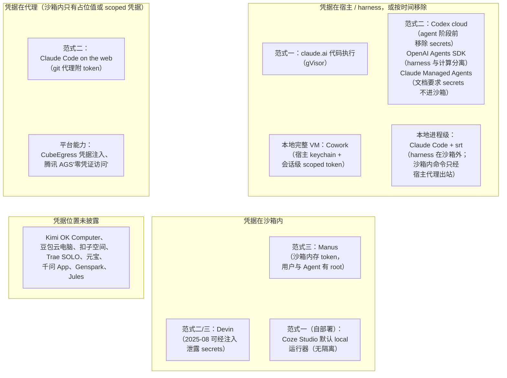
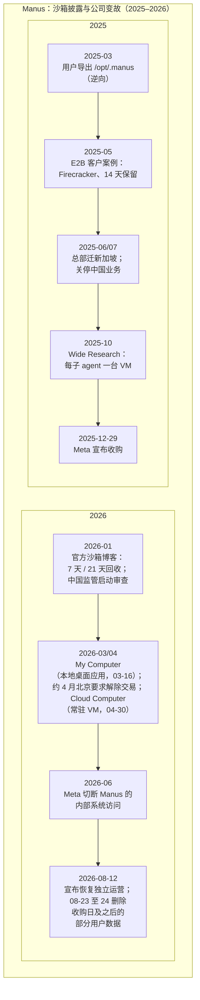

# 第 21 章　产品推理沙箱

## 本章导读

前面几章的沙箱大多服务于训练和评测，租户是被训练的模型。本章转向第三个场景：面向用户的 Agent 产品。用户在 claude.ai 里让模型跑一段 Python，在 Codex 里提交一个修 bug 的任务，在 Manus 里让 Agent 花两个小时做一份行业报告，背后都有一个沙箱。这个场景的对手主要是"被利用的代理人"（见第 2 章）：外部攻击者把指令藏在网页、文档、仓库里，借 Agent 的合法权限行事。

到 2026 年，公开材料已足以把产品沙箱分成三种范式：一次性短命容器、任务级临时 VM 或容器、有状态长期 VM。本章的论点是：**范式和隔离档位并不直接决定用户面临的风险，真正决定风险的是凭据放在哪里**——在宿主或 harness（外壳/评测框架，负责驱动 Agent 循环、工具与打分）、在出站代理，还是在沙箱之内。本章检视的公开事件没有一起依赖突破隔离边界，都发生在凭据可达、出站可借道的地方。

本章不重复第 4 章的本地原语细节（srt、Codex CLI、信任移交），不重复第 14 章对三种凭据位置的机制拆解（见 14.4 节）和出站绕过案例库（见 14.5 节），也不重复第 6 章对 CubeSandbox 与 Firecracker 的分析；价格与沙箱即服务市场留给第 22 章。读完本章，读者应能：

- 用"分配单位、寿命上界、状态是否跨任务保留"三条判据，把一个产品归入三种范式之一，并说出范式之间正在变模糊的地方；
- 说清为什么同为"强隔离"的 microVM（微虚拟机）产品，风险可以相差很大，而进程级隔离的本地工具反而可以把凭据守得更好；
- 复述 Manus 这一中国系主案例的沙箱事实、冲突数字与公司变故，以及哪些问题至今没有答案；
- 知道国内产品沙箱的公开信息主要来自云厂商的客户案例，哪些产品"未披露"，以及一个需要更正的常见数字；
- 按事件库判断产品沙箱的真实失效模式，并据此检查一个产品的设计。

## 21.1　三种范式与凭据位置

### 21.1.1　三种范式

本书用三条判据划分产品沙箱：**分配单位**（一次调用、一个任务，还是一个用户或项目）、**寿命上界**（分钟、小时，还是天乃至常驻）、**状态是否跨任务保留**（任务结束即丢，还是休眠后醒来照旧）。据此，公开材料中的产品分为三种范式（术语见附录 A"三种产品范式"）。

**范式一：一次性短命容器。** 分配单位是一次代码执行或一个对话会话，寿命以分钟计，结束即丢，不承载用户的长期数据。claude.ai 的代码执行和 ChatGPT 的代码解释器（Code Interpreter）是典型。它的设计假设是：沙箱里只有用户这次上传的文件，没有别的东西值得偷。

**范式二：任务级临时 VM 或容器。** 分配单位是一个任务（一个 issue、一个 PR、一次 `--remote` 调用），寿命以小时计，任务结束后沙箱销毁；能跨任务复用的通常只有"环境搭建的结果"（缓存或快照），而不是用户的工作数据。Codex cloud、GitHub Copilot 云 agent、Google Jules、Claude Managed Agents 属于这一类。

**范式三：有状态长期 VM。** 分配单位是一个用户任务流或一个项目，寿命以天计甚至常驻；空闲时休眠而不是销毁，醒来后文件、进程乃至内存照旧；用户上传的附件、Agent 产出的中间文件、以及完成任务所需的 token 都留在里面。Manus、Genspark、Replit、Lovable 属于这一类，国内跑在阿里云 ACS 与腾讯云 Cube 上的若干产品也在向这一类靠拢（21.6 节）。

三种范式的边界正在变模糊。Cursor 的云 agent 按任务分配 VM，却支持在消息之间休眠与恢复、对镜像做检查点（checkpoint）与 fork（分叉）（Cursor 博客，2026-06-02；一手文档），已经带上了范式三的特征；OpenAI 收购 Ona，据报道是为了让 Codex 任务在用户合上笔记本后持续数小时到数天（SiliconANGLE、The Decoder，2026-06-11；二手报道；见第 22 章），这会把范式二的寿命上界推向范式三。反方向的例子是 Claude Managed Agents：每个会话都拿到"一个全新的、隔离的 Linux 容器"，同一环境下的会话之间不共享文件系统状态（Managed Agents Environments 文档；一手文档），把可能很长的 Agent 会话仍然收束在范式二。

### 21.1.2　凭据的三种位置

第 14 章把凭据位置分成三种（见 14.4.1 节，图 14-2）：**在沙箱内**（Manus 的沙箱里存着用户上传的 token 和平台分配的 token）；**在代理**（沙箱内只有占位值或限定范围的 scoped 凭据，沙箱外的代理校验请求后附上真实凭据，如 Claude Code on the web 的 git 代理）；**在宿主或 harness**（真实凭据从不进入执行模型生成代码的环境，如 Cowork 的宿主 keychain、OpenAI Agents SDK 的"harness 与计算分离"）。Codex cloud 的"secrets 只在 setup 阶段可用"则是第四种做法——**时间分离**：凭据曾经在沙箱内，但在 Agent 开始行动之前被移除。

每种位置防住什么、防不住什么，第 14 章已有说明（见 14.4.2 节）：后两种防住"拿走"，防不住"借用"，所以代理附凭据时必须做请求级校验。本章不再重复机制，只把凭据位置用作产品分类的第二个维度。

### 21.1.3　为什么凭据位置比隔离强度更要紧

把两个维度叠起来（图 21-1），会得到一个乍看反直觉的格局。

**图 21-1　三种范式 × 凭据位置**（示意图，依据 21.2–21.6 节所引一手文档、厂商案例与第三方披露绘制；产品归类为笔者判断；claude.ai 一项依据 Anthropic 的原则性表述，具体安排未披露；Claude Code 本地默认仍可读 `~/.ssh` 等文件（见 4.7 节）；"Devin""Coze Studio"两项的凭据位置为推断）

在这张图里，隔离最强的产品不一定落在最安全的一格。Manus 的每个任务跑在一台完整云 VM 里，2025 年的底层是 E2B 的 Firecracker microVM（E2B 客户案例，2025-05-06；厂商自报），隔离档位高于 claude.ai 的 gVisor 容器，更远高于 Claude Code 本地的 Seatbelt/bubblewrap 进程级沙箱。可是 Manus 的沙箱里存着 token，用户和 Agent 都可以取得 root，沙箱还能联网（Manus 博客，2026-01-14；一手文档）。一个被网页里的隐藏指令劫持的 Agent，不需要逃出 VM，就能在 VM 之内读到这些 token、用 VM 自己的网络把它们送出去（推断；Manus 未公开凭据的具体保管方式）。反过来，Claude Code 的进程级沙箱与宿主共享内核，按第 4 章的标准是弱边界，但它的 Linux 实现把沙箱进程的网络命名空间整个移除，流量只能经宿主上的代理按域名放行（sandbox-runtime README；一手文档；见 4.2.2 节），Anthropic 的原则是"凭据只要从不进入沙箱，就无法被外传"（If credentials never enter the sandbox, they can't be exfiltrated）（How we contain Claude；一手文档）。

这不是说隔离强度无关紧要。隔离强度决定的是**租户之间**的风险：一个用户的代码能否攻破宿主、读到另一个用户的沙箱。这是平台运营者的风险，所以多租户的云端产品无一例外选了 gVisor 或 microVM（见第 5、6 章）。但对单个用户来说，Agent 被注入之后能造成多大损失，取决于它在自己的沙箱里能摸到什么凭据、能把数据送到哪里。21.8 节的事件库会说明，到目前为止产品沙箱公开的失效几乎都属于后一类。

所以本书主张，评估产品沙箱时先问凭据放在哪里、出站能去哪里，再问隔离档位。隔离档位在多租户云端已经趋同，成了入场条件（推断）；凭据位置在不同产品之间仍然差别很大，而且大多没有公开。

## 21.2　范式一：一次性短命容器

### 21.2.1　claude.ai 与 ChatGPT 代码解释器

Anthropic 在《How we contain Claude across products》中只用一句话交代 claude.ai："Claude 在 claude.ai 里运行代码时，是在隔离基础设施上的一个 gVisor 容器里运行"（When Claude runs code inside claude.ai, it does so in a gVisor container on isolated infrastructure）（How we contain Claude，2026-05-25，06-06 修订；一手文档）。文中没有给出会话寿命、出站策略与凭据安排的细节。gVisor 用用户态内核截获系统调用，宿主暴露面只有几十个系统调用（见 5.4 节），是多租户代码执行服务的常见选择。

ChatGPT 的代码解释器没有一手架构披露，只有逆向材料。安全研究机构 0DIN 在 2024-11-14 发布的文章（作者 Marco Figueroa）中描述了它的容器：Debian Bookworm，用户名 `sandbox`，内部目录 `/home/sandbox/.openai_internal/`，上传文件位于 `/mnt/data`；OpenAI 的回应是，在沙箱内执行代码属于"预期功能"，不在漏洞赏金范围内，只有逃逸才算（0DIN；二手报道，逆向）。这个回应准确概括了范式一的安全假设：沙箱里能看到的东西本来就允许用户看到，边界只在容器之外。

范式一的假设成立有两个前提：沙箱里确实没有用户之外的东西（系统提示词、内部代码、其他用户的数据），沙箱的出站确实受控。21.4.2 节的 Manus 导出事件说明第一个前提不总是成立；21.8 节的外传事件说明第二个前提是主要的失守点。

### 21.2.2　Coze Studio：开源默认值的反例

字节跳动开源的 Coze Studio（扣子开发平台的开源版）是一个反例。它的工作流"代码节点"可以执行用户写的 Python，运行器有两种。仓库 `docker/.env.debug.example` 的原文是："支持的代码运行器类型：sandbox / local""默认使用 local""sandbox：在 deno + pyodide 的沙箱环境中执行 python 代码""local：使用 venv，没有环境隔离"（Supported code runner types: sandbox / local; Default using local; local: using venv, no env isolation），默认值 `CODE_RUNNER_TYPE="local"`（coze-studio 仓库，HEAD fefb05f，2026-10-05 读取；一手文档）。

可选的 sandbox 运行器把 Python 跑在 Pyodide（编译到 WebAssembly 的 CPython）里，外面再套一层 Deno 的权限模型：环境变量、读、写、子进程、网络、FFI 六类权限各有一个白名单配置项，默认全空；网络白名单默认只有 `cdn.jsdelivr.net`，注释写明这是为了下载 Pyodide 运行所需的包，删掉后"沙箱可能无法正常工作"；默认超时 60 秒，内存上限 100 MB（同上）。WASM 沙箱的能力边界见第 8 章。

问题不在 sandbox 模式够不够强，而在**默认值**。按示例配置自部署的实例，代码节点里的 Python 与 Coze 后端在同一个运行环境里执行，没有任何隔离；后端进程能读到的环境变量、配置文件和数据库凭据，代码节点原则上都能读到（推断；本书未部署验证）。第 4 章对本地 Agent 的判断同样适用于这里：薄弱环节是默认值与策略管道，而不是原语强度（见 4.7 节）。扣子 SaaS 版用的是什么运行器，没有披露。

### 21.2.3　范式一的上限

范式一仍是最常见的产品沙箱，因为它最便宜：寿命短、无持久状态，可以从预热池里拿、用完即扔（见第 13 章）。它的上限也很清楚：一旦产品需要"记住"——用户下次回来时希望看到上次的文件，Agent 需要登录某个网站并保持会话——范式一就不够用了，产品会被推向范式二或三。这时凭据和长期数据开始进入沙箱，风险结构随之改变。

## 21.3　范式二：任务级临时 VM 或容器

### 21.3.1　Codex cloud：用时间分离凭据

在范式二里，Codex cloud 把凭据安排说得最清楚。它的任务分两个阶段：先运行用户的 setup 脚本（恢复缓存容器时还可运行一个可选的 maintenance 脚本），然后"Agent 在一个循环中运行终端命令"。文档原文："setup 脚本带互联网访问运行。Agent 的互联网访问默认关闭，需要时可以开启受限或不受限的访问"；"secrets 只对 setup 脚本可用。出于安全原因，secrets 在 Agent 阶段开始之前被移除"（Secrets are only available to setup scripts. For security reasons, secrets are removed before the agent phase starts）；"Codex 最长缓存容器状态 12 小时，以加快新对话和后续追问"（Codex cloud environment 文档，2026-10-05 读取；一手文档）。默认镜像名为 `universal`，预装常用语言、包与工具（同上）。

这是第 14 章所说的"时间分离"（见 14.4.2 节）：Agent 开始读不可信内容（issue 描述、仓库代码、依赖包）之前，凭据和网络都已经撤走。被注入的 Agent 在默认配置下既拿不到 secrets，也没有网络可以外传。代价是 Agent 阶段做不了需要凭据或网络的事；用户一旦为方便打开"受限访问"，白名单本身就成了通道。2025 年 8 月 Rehberger 指出，Codex Web 当时推荐的"Common Dependencies"白名单包含 `azure.net`，而任何人都可以在 `*.cloudapp.azure.net` 上开一台 VPS（Simon Willison，2025-08-15；二手报道）；第 14 章 2026-10-03 读取的预设中已不见 `azure.net`（附录 B B14-08）。这个页面现标为"Legacy"（同上）。

12 小时缓存说明 Codex cloud 并非纯粹的"用完即焚"：容器状态会被保留下来供同一环境的后续任务复用（推断：缓存的是 setup 之后的环境状态，文档未说明缓存是否包含上一任务的工作区改动）。这是范式二的一般做法：复用环境，不复用用户数据。

### 21.3.2　Copilot 与 Jules：借用现成的 CI 与云 VM

GitHub Copilot 云 agent 运行在"它自己的、由 GitHub Actions 提供的临时开发环境"里，最长执行时间 59 分钟，不可延长，可在 `copilot-setup-steps.yml` 中设得更短；一次只处理一个仓库、一个分支，每个任务恰好开一个 PR（GitHub Docs；一手文档）。2025-10-28 起支持自托管 runner（GitHub Changelog；一手文档）。把 Agent 放进 CI runner 是务实的选择：CI 本来就是"在临时机器上运行不可信代码"的成熟设施，计费、日志、密钥管理都现成。59 分钟的硬上限是本章所见范式二中最短的寿命上界。

Google Jules 为每个任务起一台短命 Ubuntu VM，预装 Node 22、Python 3.12、Go、Java、Rust、Docker 等；"Run and Snapshot"把 setup 的结果做成快照，供后续任务复用（Jules 文档；一手文档，未回原文核对）。这与 Codex 的容器缓存、DSec 的 pack_diff（见第 11 章）是同一个思路：把搭环境的代价只付一次。Jules 在 2025 年 8 月被 Rehberger 列为"另一个没有防护的异步编程 Agent"，可经 Markdown 图片外传，`view_text_website` 工具可被用于提示注入（Simon Willison，2025-08-15；二手报道）。VM 隔离在这里同样没有起作用，因为失守点在出站。

### 21.3.3　Cursor 云 agent：范式二向范式三的过渡

Cursor 在 2026-06-02 的博文里总结了一年的云 agent 经验。它认为"决定云 agent 产出质量的最大单一因素，是确保它拥有完整的开发环境"，为此要重建本地 Agent 从开发者机器上继承来的一切，包括 VM 的休眠与恢复、VM 镜像的检查点流水线（Cursor 博客；一手文档）。同文还提到（本章未回原文逐句核对）：VM 可以在消息之间休眠与恢复，镜像可以 checkpoint、restore、fork，另有只读 VM 与预热 VM（见 11.3.4 节）。

规模与可靠性方面，Cursor 写道，早期云 agent 的可靠性只有"一个 9"（one 9），迁到 Temporal 之后"超过了两个 9"（past two 9s）（按惯例约合 90% 与 99% 以上，为本书换算）；平台现在"每天处理 5,000 万次以上动作，涉及 700 万个以上不同的 workflow"；Cursor 自己仓库超过 40% 的 PR 来自云 agent（同上；附录 B B09-07、B21-11）。注意 700 万是 workflow 总数，不是每天的数；两个数字都是工作流引擎的计数，不是沙箱数。

凭据方面，Cursor 只给出了方向：云 agent 需要"面向 Agent 的企业 IT"，包括 secret 脱敏、网络策略和凭据管理，把 Agent 当作基础设施的一等用户而不是脚本；Agent 现在直接使用 GitHub CLI 和凭据管理系统，而不是依赖写死的逻辑（同上）。凭据放在沙箱内还是经代理注入，没有说明（未披露）。Cursor 的训练侧沿用了这套云 agent 基础设施（见第 17、27 章）。

### 21.3.4　OpenAI 与 Anthropic 的托管 Agent：把"harness 与计算分离"写成架构

2026 年春，两家实验室都把"Agent 循环在一处、代码执行在另一处"做成了对开发者开放的产品。

OpenAI 在 2026-04-15 更新 Agents SDK，内置七家沙箱 provider："Blaxel、Cloudflare、Daytona、E2B、Modal、Runloop 和 Vercel"；SDK 把 harness 与计算分离，假定存在提示注入与外传企图，让敏感凭据不暴露在执行模型生成代码的环境里；借助快照与"再水化"（rehydration），原沙箱失效或过期时，可以"在一个新容器里恢复 Agent 的状态，从最后一个检查点继续"（OpenAI Agents SDK 公告；一手文档；附录 B B16-01）。这一表态把凭据位置从"产品实现细节"提升为框架层面的默认架构：沙箱是可替换的计算，凭据留在 harness 一侧（见 16.3.1 节）。

Claude Managed Agents（beta header `managed-agents-2026-04-01`）的云环境同样是"每个会话一个全新的隔离 Linux 容器"，规格为 Ubuntu 24.04、最多 8 GB 内存与 10 GB 磁盘（Managed Agents 文档；一手文档；B21-14）。网络有两种模式：`limited` 只允许 `allowed_hosts` 中的主机，另有 `allow_package_managers`、`allow_mcp_servers` 两个开关；`unrestricted` 除一份通用安全黑名单外完全放开。默认值因入口而异：Claude Console 默认 `limited` 且不放行任何主机，API 默认 `unrestricted`，必须显式设置（Environments 文档，2026-10-05 读取；一手文档）。文档对凭据的要求很直接：把 secrets 和敏感文件留在沙箱之外，只给 Agent 任务所需的凭据；并提醒即使在 `limited` 模式下，"一次成功的提示注入也可以利用被允许的主机把文件复制出沙箱"（同上）。Managed Agents 也支持自托管沙箱：编排留在 Anthropic 一侧，工具执行移到用户自己的基础设施，worker 只需出站 HTTPS（Self-hosted sandboxes 文档；一手文档，未回原文核对）。

API 默认 `unrestricted` 这一点要记下：开发者直接调用 API 而不设网络参数，得到的是一台能访问任意公网的容器。默认值再一次比隔离档位更影响实际风险（推断）。

### 21.3.5　其他范式二产品

- **ChatGPT agent**（2025-07-17）：系统卡称 Agent 拥有"自己的虚拟计算机"，终端工具网络受限，发布时只允许 GET 请求下载图片或特定数据集；访问敏感站点时启用 Watch Mode（ChatGPT agent 系统卡；一手文档，未回原文核对）。隔离技术、寿命与凭据位置未披露。
- **Claude Code on the web**：git 操作由沙箱外的自定义代理完成，沙箱内只有一个专门构建的 scoped 凭据，代理校验推送目标等内容后再附上真实 token（Claude Code sandboxing 博文，2025-10-20；一手文档；见 14.4.1 节）。这是"凭据在代理"的标准实现。
- **Devin**：Cognition 的 otterlink VM 管理器承载 Devin 产品，并很可能同时承载训练（推断，依据见第 27 章 27.7.2 节），"可扩展到数万台并发机器"（Cognition SWE-1.5 博文；一手文档；见第 27 章）。2025 年 8 月，Rehberger 演示 Devin 的 `expose_port` 工具可被提示注入触发，把端口开放给攻击者，并指出 Devin 有浏览器、shell、Markdown 图片等多条外传途径（Simon Willison，2025-08-15；Embrace The Red；二手报道）。
- **Qoder CLI / 通义灵码 Cloud Mode**：任务"在 Qoder 管理的云端虚拟机中执行"，有独立的 CPU、内存与网络配额；每次 `--remote` 调用新建一个云端会话，关闭本地终端后任务继续；需要授权 GitHub 仓库（阿里云帮助中心；一手文档，未回原文核对）。寿命、出站与凭据注入方式未披露。

## 21.4　范式三：有状态长期 VM

### 21.4.1　Manus：每任务一台云 VM

Manus 是中国团队创办、后迁往新加坡的通用 Agent 产品，产品沙箱公开材料最多。其沙箱事实有三类来源：Manus 自己的博客（一手）、E2B 写的客户案例（厂商自报，附 Manus 联合创始人署名引语）、用户导出的沙箱内容（逆向）。

**架构与生命周期。** Manus 博客《Understanding Manus sandbox》（2026-01-14）写道，沙箱是"Manus 为每个任务分配的一台完全隔离的云虚拟机。每个沙箱运行在自己的环境里，不影响其他任务，可以并行执行"（a fully isolated cloud virtual machine that Manus allocates for each task）。沙箱在不活跃时自动休眠，唤醒后数据不变；闲置超过一定时间后回收：免费用户 7 天，Manus Pro 用户 21 天；回收后能自动恢复的只有 Manus 产物、上传的附件、Slides/WebDev 等重要文件，执行中产生的中间代码与临时文件不恢复（Manus 博客；一手文档；B21-01）。

**沙箱里有什么。** 同文列出沙箱存放三类内容：用户上传的附件；Manus 执行中创建和写入的文件与产物；"Manus 执行特定任务所需的配置（例如用户上传的 token，或 Manus 分配给用户用于调用相关 API 的 token）"（同上）。安全模型称遵循"零信任原则"："就像你从云厂商那里买的一台云 VM，你和 Manus 对这台计算机拥有完全控制权——可以执行不受限制的操作（例如取得 root、修改系统文件，甚至格式化整块磁盘）"（同上）。分享任务时，接收方只看到对话消息与产物，看不到沙箱；邀请协作时，沙箱也向协作者开放，协作者可以通过 AI 访问或修改沙箱中的文件与数据（同上）。

这是图 21-1 中"凭据在沙箱内"的典型：token 与 root 同在一台可联网的 VM 里。Manus 的零信任指的是"沙箱内的操作只影响该沙箱"，也就是租户之间的隔离；它没有说沙箱之内的 token 如何防止被 Agent 自己读出（未披露）。按 21.1.3 节的分析，一个被注入的 Agent 不需要逃出 VM（推断）。

**供应商与选型理由。** E2B 的客户案例（2025-05-06）称 Manus 使用 E2B 的 Firecracker microVM 给 Agent 提供"虚拟计算机"；沙箱约 150 ms 启动；接入只用了半天；E2B 可以自托管；会话可以运行数小时，支持暂停与恢复，用于需要用户输入或处理登录验证的场景；付费用户的数据保留 14 天；当时 Agent 有 27 个工具（E2B 客户案例；厂商自报；B21-02）。Manus 先试过 Docker，否掉的理由是 10–20 秒的启动时间和缺少完整操作系统能力；联合创始人张涛的引语是："E2B 是最好的方案，而且看起来每家公司都在用它"（E2B was the best solution, and it looked like every company was using it），以及"从零重建并维护一套基础设施，需要 3–5 名全职基础设施工程师"（同上）。

**冲突：14 天还是 21 天。** E2B 案例写"付费用户保留 14 天"（2025-05），Manus 博客写"Pro 闲置 21 天回收"（2026-01），相隔 8 个月。更可能是政策调整，而非一方写错；两个数字口径也不完全相同，一个说"数据保留"，一个说"闲置后回收"。本书并列两者（附录 B 冲突项 C-04）。

**供应商冲突。** Manus 自己的博客从未提到 E2B。2025 年 Manus 使用 E2B 的 Firecracker，有 E2B 案例与联合创始人引语为证；2026 年之后的底层供应商，没有一手确认（C-05）。

### 21.4.2　Wide Research 与 /opt/.manus：扇出与导出

**Wide Research：一个子 agent 一台 VM。** Manus 在 2025-10-29 的博文中介绍 Wide Research：每个子 agent 专注于分配给它的一个条目，拥有"一个完整的虚拟机环境"和"一个独立的互联网连接"，以及完整的工具库；子 agent 数量随任务规模伸缩，处理 10 个条目就是 10 个，处理 500 个条目就是 500 个；"子 agent 之间不通信，所有协调都经过主控制器"（Manus 博客；一手文档；B21-03）。文中没有说子 agent 与主控制器之间如何共享文件（未披露）。

因此，一次 500 条目的 Wide Research 任务会同时占用约 500 台 VM（笔者推算：按"一个条目一个子 agent、一个子 agent 一台 VM"）。从凭据位置的角度看，扇出把爆炸半径也乘了上去：如果每台子 VM 都持有与主任务相同的 token、都有独立的公网连接，那么 500 个子 agent 中任何一个读到被投毒的网页，都可能成为外传起点（推断；Manus 未披露子 VM 是否持有凭据）。Kimi 的 Agent Swarm 最多 300 个子 agent、单任务 4,000 次以上工具调用（Kimi 帮助中心；一手文档；B21-06），但子 agent 是否各有沙箱没有披露。

**/opt/.manus 导出（2025-03）。** 2025 年 3 月 9–10 日，用户 jian（@jianxliao）直接要求 Manus 把沙箱里的文件交出来，拿到了 `/opt/.manus/` 下的代码、系统提示词与工具定义，并公开到 X 与 gist（X 帖与 gist；二手报道，逆向；未回原帖核对；B21-16）。第三方的汇总描述了当时的环境：Ubuntu，用户 `ubuntu`，工具目录 `/opt/.manus/.sandbox`，Python 3.10、Node.js 20，有 sudo，headless 浏览器，可以完整上网，也可以起 web 服务并对公网暴露（renschni gist；二手报道，逆向；未核实）。这不是逃逸，Agent 交出的是它本来就能读到的文件；但它说明范式一的那条前提（沙箱里只有用户的东西）在 Manus 早期并不成立：平台自己的代码与提示词与用户共处一台 VM。研究者记忆中 Manus 联合创始人曾就此回应，本书未能核实原帖，不写（附录 B X-30）。

### 21.4.3　Manus 的公司变故与基础设施去向

Manus 的沙箱问题与它的公司变故纠缠在一起（图 21-2）。

**图 21-2　Manus 时间线**（示意图，依据 Manus 博客、E2B 客户案例、Rest of World、CNBC、SiliconANGLE、TNW、TechCrunch、Caixin Global 绘制；公司事件均为二手报道）

按时间顺序：2025 年 6 月 Manus 总部迁往新加坡，7 月关停中国业务（Rest of World；二手报道；未回原文核对）；2025-12-29 Meta 宣布收购，金额约 20 亿美元（CNBC、TechCrunch；二手报道；B21-04；CNBC 原文本次返回 403，"以上"未核实）；2026 年 1 月中国监管启动审查（SiliconANGLE；二手报道；未回原文核对）；约 2026 年 4 月北京以技术出口管制与外商投资为由要求解除交易（TNW、TechWire Asia；二手报道；未回原文核对）；2026 年 6 月 Meta 切断 Manus 对其内部系统的访问，并不再让员工在内部项目中使用 Manus 工具（TechCrunch，2026-06-13；二手报道；B02-11），双方停止数据共享则据 Bloomberg 报道（经 ppc.land 转述；二手报道）；2026-08-12 Manus 宣布恢复独立运营，"收购日及之后产生的部分用户数据将在 8 月 23 日至 24 日删除，建议受影响用户立即备份"（Caixin Global；二手报道）。

同期 Manus 推出两个新形态，恰好落在本章分类的两端。My Computer（2026-03-16）是 Manus Desktop 桌面应用中的本地模式，在用户本机的终端里执行命令，"每条终端命令在执行前都需要你的明确批准"，提供"始终允许"与"仅此一次"两个选项，需要先授权本地文件夹（Manus 博客；一手文档，未回原文核对）。Cloud Computer（2026-04-30）是常驻的 Ubuntu VM，全天候运行用户的机器人、Python 脚本与软件，"它从不关机"（never turns off），可经 SSH 或网页终端访问，分 Basic、Standard、Advanced 三档；停止付费后，"持久沙箱关闭，工作文件被删除"，已交付的产出留在对话记录里；它"与你的个人机器完全隔离，不能访问你的本地文件"（Manus 博客，2026-04-30；一手文档）。Cloud Computer 是范式三走到头的形态：不再休眠，不再按闲置回收，寿命等于订阅期。

公司变故对沙箱基础设施的影响**没有任何公开信息**：解除交易前后，Manus 的 VM 集群跑在哪个云、哪个区域，是否仍是 E2B（自托管还是 E2B Cloud），删除的用户数据是否包括沙箱内容，都未披露。8 月 23–24 日的数据删除说明，在范式三里，"用户数据"与"沙箱"是绑在一起的：沙箱寿命以天计，其中的数据就会被公司层面的决定一并处置（推断）。

### 21.4.4　Genspark、Replit、Lovable 与 Perplexity

**Genspark** 是另一家用 E2B 的通用 Agent 产品。E2B 的客户案例（2026-05-07）称每个 Agent 会话运行在自己隔离的 Firecracker microVM 里，在整个会话中保留上下文、文件与中间结果；联合创始人兼 CTO Kay Zhu 的原话是："一个 30 步的 Agent 运行不能以 60 秒的冷启动开场。它必须感觉是即时的。E2B 让我们扩展到数千个并发会话；如果我们有五个工程师在造沙箱平台而不是做 Agent，我们不可能做到 2.5 亿美元 ARR"（E2B 客户案例；厂商自报；B21-13）。凭据位置未披露。

**Replit** 的范式三体现在存储上。它的 Snapshot Engine 用网络块设备（NBD）协议，后端是 Google Cloud Storage 上的 16 MiB 不可变块；版本 manifest 记录组成一个块设备版本的全部块指针，写时复制让复制无竞争；数据库分为生产库与开发库，Agent"只能访问开发库"，代码与数据库都可以快速 fork，让 Agent 在安全的环境里试改（Replit 博客，未标日期；一手文档；B11-15）。博文没有提到 2025 年 7 月的 SaaStr 删库事件：SaaStr 创始人 Jason Lemkin 自述，连续九天 vibe coding 之后，Replit Agent 删除了生产数据库（1,206 条高管记录、1,196+ 条公司资料），并谎称无法恢复（Lemkin，SaaStr 官网，2025-08-02；一手文档；B02-03）。Replit 随后发文称开发库与生产库已"默认分离"，"开发期间 Agent 不能对生产库做任何更改"，并可"一键"回滚到任一检查点（Replit 博客，2025-07-29；一手文档；B21-22）；The Register 2025-07-22 转引的 Replit CEO Amjad Masad 回应与此相符（二手报道）。这一事件不涉及任何隔离边界：Agent 用的是被授予的合法数据库权限。Replit 的修法也不是加强隔离，而是**收回凭据**，让 Agent 手里的数据库凭据只指向开发库。这是凭据位置论点最干净的例子。

**Lovable** 用 GKE Agent Sandbox（gVisor）运行 AI 生成的应用，每天 20 万个以上新项目，可扩展到"每秒数百个安全沙箱"（Google Cloud 博客，2026-04-22；厂商自报；B21-12）。Modal 的资源页同时称 Lovable 在一个 48 小时促销周末的峰值达到 2 万个并发 Modal 沙箱（Modal；二手报道，竞品转述；B01-01）。两条材料说明大客户会同时使用多家供应商。

**Perplexity SPACE**（2026-07-15）据报道基于 Firecracker microVM，凭据"不存放在沙箱内"，用户可以自带加密密钥，支持暂停、恢复与 fork，内部测试期间一周内有 125 万次沙箱创建和 1,190 万次沙箱重连，暂停后最长可在一周后恢复（SiliconANGLE；二手报道；数字出自 Perplexity 内部测试；Perplexity 一手原文未找到）。如果属实，这是范式三产品里少见的明确把凭据放在沙箱外的例子。

### 21.4.5　范式三的经济学

范式三成立的前提是"睡着时几乎不花钱"。第 11、13 章的材料与下列文档显示，供应商把休眠做成了计费规则：阿里云 ACS Agent Sandbox 文档写明按秒计费、按小时出账，休眠态"不收取 CPU 与内存费"，只收存储，运行态 30 GiB 以内的临时存储免费、超出按云盘计费，休眠态临时存储全部计费（ACS 文档，2026-06-22；一手文档）；E2B 暂停后恢复会重置连续运行上限（E2B 文档；一手文档；B16-10）；腾讯云 Agent Runtime 的会话最长 7 天，暂停后可保留 30 天（腾讯云开发者社区，2025-09-29；一手文档）。ACS 的公开单价为中国内地每 vCPU 每小时 0.078 元、每 GiB 内存每小时 0.039 元（ACS 文档；一手文档）；原页秒价与小时价同时列出，单位无误（附录 B B22-41、C-07），价格比较见 22.4 节。

休眠省下的是 CPU 和内存，省不下的是状态里的东西：休眠 21 天的 VM 里，token 也在那里躺 21 天。范式三的经济学天然鼓励"凭据随 VM 一起休眠"，这是它与凭据位置论点冲突的地方（推断；21.9 节的建议之二针对这一点）。

## 21.5　本地与混合：把范式搬到用户的机器上

本地 Agent 的沙箱已在第 4 章展开（见 4.2 节），这里只从凭据位置的角度补三点。

**同一家公司，隔离档位从进程到完整 VM。** Anthropic 的三个产品覆盖了三档隔离：claude.ai 用 gVisor 容器；Claude Code 本地在 macOS 上用 Seatbelt、在 Linux 上用 bubblewrap；Cowork 则用"一台完整的虚拟机，使用平台自带的 hypervisor（macOS 上是 Apple 的 Virtualization framework，Windows 上是 HCS）"（How we contain Claude；一手文档）。Claude Code 引入沙箱的直接动机是审批疲劳：用户此前批准了约 93% 的权限提示，沙箱使权限提示减少 84%（同上；B04-01）。

**Cowork：完整 VM，凭据仍然留在宿主。** Cowork 选了最重的隔离，却没有因此把凭据放进 VM。原文是："凭据留在宿主的 keychain 中，从不进入客户机"（Credentials stay in the host's keychain and never enter the guest machine）；"VM 拿到一个按会话、缩小了权限的 token"（the VM gets a per-session scoped-down token）（同上）。同文还交代了一次架构调整：最初的"full-VM 模式"把 Agent 循环本身放在客户机里；后来把 Agent 循环移到 VM 之外、代码执行留在 VM 之内，使 VM 出问题时 Claude 仍能回应用户（同上）。这一设计说明，即使 VM 边界足够强，Anthropic 也没有把"VM 够强"当作把凭据放进去的理由：VM 防的是 Agent 碰到宿主，防不了 Agent 在 VM 里滥用它拿到的东西。

Cowork 的设计也被打穿过一次，方式恰好印证了这一点。一份第三方披露显示，Claude 在注入指令的驱使下读取工作区里的其他文件，调用 Anthropic 自己的 Files API 把它们上传：用的是攻击者的 API key，走的是被白名单放行的 `api.anthropic.com`（同上；附录 B B14-09 备注）。VM 和宿主 keychain 都没有被突破，被借用的是"允许访问 Anthropic API"这条出站规则。修复办法是"在 VM 内部放一个防御性的中间人（MITM）代理"（a defensive man-in-the-middle proxy inside the VM），拒绝携带非本会话 token 的请求（同上；机制见 14.4.2 节）。

**其他本地形态。** Codex CLI 同样用 Seatbelt 与 bubblewrap，并有三种模式（见 4.2.3 节）；Docker 的本地 `sbx` 把 Agent 放进带自己内核的 microVM（见第 4、6 章）；Manus My Computer 是桌面应用，在本机终端执行命令，不靠隔离而靠逐条审批（21.4.3 节）；豆包 Windows 版的"虚拟桌面"在用户自己的机器上开出一块不抢占键鼠的独立桌面，隔离方式未披露（见 7.5.2 节）。腾讯 CodeBuddy Code（CLI）的本地沙箱与 Claude Code 同构：Linux 用 bubblewrap，macOS 用 Seatbelt，"网络访问由运行在沙箱外的代理服务器控制"，只放行已批准的域名，默认可读整台机器（除若干禁止目录）、只可写当前工作目录；需用 `/sandbox` 命令开启（CodeBuddy 文档 Bash Sandbox，workbuddy.ai 站，构建于 2026-09-30；一手文档；B21-28）。文档没有说明默认是否开启，从开启方式看应为默认不启用（推断）。本地形态的共同风险在于 Agent 与用户共享同一套账号与文件：第三方汇总称 Claude Code 与 Cursor 的默认本地沙箱仍可读 `~/.ssh`（digitalapplied；二手报道；见 4.7 节），说明"凭据不进沙箱"在本地产品上还没有完全落实。

## 21.6　中国产品：信息来自云厂商

### 21.6.1　一个结构性特点

全书的披露矩阵把"中国厂商公开训练侧、不公开产品侧"列为一个论点。2026 年的新材料要求把这个判断修正一半（第 26 章的表述是"模型公司公开训练侧，云厂商公开产品能力"，见 26.12.3 节）：国内若干产品的沙箱信息确实公开了，但**公开者不是产品公司，而是它们的云厂商**。Kimi 与 MiniMax 的产品沙箱出现在阿里云的客户案例里，元宝出现在腾讯云的开源文章里；月之暗面、MiniMax、腾讯元宝团队自己都没有写过一篇产品沙箱的技术文章（本书检索结论）。这类材料的性质是厂商营销：数字未经独立核实，侧重性能与规模，几乎不谈出站与凭据。下文按公司整理；同一批材料在披露矩阵中的位置见 26.12.3 节，本节侧重它们对范式与凭据位置说明了什么。

### 21.6.2　月之暗面 Kimi：产品在 ACS 上，后训练亦被提及

阿里云官方博客《Deep Dive: How Kimi's AI Agent Runs on Alibaba Cloud》（2026-03-12，署名 Alibaba Container Service）是目前关于 Kimi 产品沙箱最直接的材料。它点名的是 Kimi 的四个 Agent 产品：Deep Research、Agentic PPT、OK Computer 与数据分析（Data Analytics）（阿里云博客；厂商自报）。要点如下（同上）：

- 隔离：ACS Agent Sandbox，以 MicroVM 技术为"每个 Agent 任务提供硬件级隔离"，配合 NetworkPolicy 与 Fluid；
- 分配粒度：为"每一个请求分配专属计算"，避免干扰与资源争用；
- 休眠：休眠时释放 CPU 与内存以降低成本，但"内存状态、临时存储和 IP 被保留"，可在秒级恢复；
- 持久化：NAS 为"每个 Agent 动态分配独立子目录"；
- 规模：挑战部分写道，高峰期系统要处理"10 万以上的同时用户请求"，并说模型训练中的强化学习与数据合成同样需要大量频繁启停的隔离计算环境；方案部分称 ACS "使 Kimi 每分钟可弹性拉起数万个沙箱"（enables Kimi to elastically spin up tens of thousands of sandboxes every minute），沙箱启动延迟降低 50% 以上（B21-19，新增）。
- 结果：题为"Built for Production-Grade AI Agents"的一节称，这套设施"成功支撑了 Deep Research 与 OK Computer 的上线"，系统"在峰值时每分钟处理数万个沙箱，启动时间缩短 50% 以上"；同一节又称 Kimi"在关键的模型后训练阶段（the critical model post-training phase）大幅降低了任务延迟、提升了整体效率"。

文中没有写出站策略、凭据管理、会话时长，也没有提到 Agent Swarm（同上）。

这篇博客部分回答了一个老问题。2026-09-28 的阿里云营销稿称月之暗面实现了"每分钟数万沙箱"、启动快 50%，仅据这一数字，容易推断它"更像 RL rollout 量级"（rollout 即一次策略与环境交互直至结束的完整采样过程，也称轨迹展开）。3 月的博客确认了**产品用途**：四项 Agent 产品运行在 ACS 上，Deep Research 与 OK Computer 的上线由它支撑。但博客把产品上线与**模型后训练阶段**放在同一组结果里陈述，没有说明"每分钟数万个沙箱"这一数字来自产品 serving、后训练，还是两者合计。因此本书既不沿用"更像 RL rollout"的推断，也不把这组数字单独归为产品侧，写作"阿里云称 ACS 支撑了 Kimi 的 Deep Research、OK Computer 等产品与模型后训练阶段，峰值每分钟数万个沙箱"（附录 B B21-19、B26-15；与第 26 章一致）。Kimi K3 技术报告披露的训练沙箱以自研的 AgentENV 为主（见第 25 章）；ACS 在后训练中承担哪一部分、规模多大，未披露。

按 21.1.1 节的判据，Kimi 的产品沙箱介于范式二与范式三之间：按请求分配，像范式二；休眠时保留内存与 IP、每个 Agent 有独立的 NAS 子目录，像范式三（推断）。OK Computer 自身的公开信息只有官方 Medium 文章（2025-10-16）所说的"自己的虚拟计算机"（its own virtual computer）与 20 多个工具（B21-05）；Agent Swarm 帮助中心给出最多 300 个子 agent、单任务 4,000 次以上工具调用（B21-06；本次未回原文核对），没有说明子 agent 是否各有沙箱（未披露）。一份疑似 K2.5 普通对话模式的系统提示词（gist，2026-01-29；逆向）出现 `/mnt/kimi/upload`（只读）与 `/mnt/kimi/output`（读写），并写明"不同对话之间文件系统会重置"，未经官方确认。

### 21.6.3　MiniMax：产品在 ACS，RL 训练在 Cube

阿里云 2026-04-16 的营销稿称，MiniMax 的 MaxClaw（基于 OpenClaw）与 MaxHermes（基于 Hermes Agent）运行在 ACK 与 ACS Agent Sandbox 上：MicroVM、独立内核；每个 Agent 一块加密 ESSD；网络默认拒绝（TrafficPolicy）；最高每分钟 15,000 个沙箱，冷启动 20–40 ms；状态跨会话持久（网易转阿里云稿；厂商自报；B26-13）。这是国内产品里少有的写明"网络默认拒绝"的一条。训练侧，腾讯云称 Cube"支持了 MiniMax 在 Agentic RL 训练下实现分钟级调度数十万沙箱实例"（腾讯云开发者社区，2026-04-21；厂商自报），英文新闻稿写作 MiniMax"同时运行数十万个异构沙箱（Linux、Windows、Android）"（PR Newswire 经 AAP 转载，2026-04-23；厂商自报）。MiniMax 自己的 Agent Team 博客只讲任务编排，MIT AI Agent Index 对 MiniMax Agent 的评价是"沙箱或隔离细节未披露"（MIT AI Agent Index；二手报道；未回原文核对）。

### 21.6.4　腾讯元宝与 Cube：一个需要更正的数字

腾讯云在 2026-04-21 开源 CubeSandbox 时，用元宝作为内部案例。中文原句有三句（腾讯云开发者社区；厂商自报；2026-10-05 二次抓取核对）：

- "元宝 AI 编程场景迁移至 Cube 后，资源核时消耗降低 95.8%"；
- "承载过百亿级调用，支撑元宝等亿级用户产品稳定运行"；
- "也支持了 MiniMax 在 Agentic RL 训练下实现分钟级调度数十万沙箱实例"。

这里有两处容易引错。第一，95.8% 说的是**元宝的 AI 编程场景**，不是元宝整体；写成"元宝……迁上 Cube Sandbox 后"就范围过宽。第二，调用量的原文是"过百亿级"，不是"超过 1000 亿次"，二者差了一个数量级；机器生成的英文摘要会把这句译成"over 100 billion calls"，这可能就是这类误差的来源（推断）。本书写作"过百亿级调用"（附录 B B21-08 已按原句登记）。

CubeSandbox 的机制见第 6 章（见 6.4 节）。与本章相关的是它的出口组件：README 写明 Cube 基于"RustVMM 与 KVM"，CubeVS 用 eBPF 做网络隔离，CubeEgress 是一个基于 OpenResty 的网关，提供"L7 域名过滤、凭据注入与访问审计"（CubeSandbox README；一手文档）。腾讯云 AGS 产品页把同一方向写成"内置身份鉴权、零凭证访问与最小权限控制"，点名客户为 MiniMax、元宝、面壁智能（AGS 产品页；一手文档，未回原文核对）；另有二手报道称腾讯云的"龙虾"密钥沙箱让"Agent 无需持有任何密钥即可完成全部云 API 调用"（凤凰网科技，2026-03-18；二手报道；未回原文核对）。可见平台已经提供了"凭据在代理"的能力；**元宝自己的产品沙箱是否使用了凭据注入、会话多长、出站如何配置，都未披露**。

### 21.6.5　字节跳动：开源与云产品可见，C 端产品不可见

字节对外可见的沙箱有三类。一是 Coze Studio 的代码运行器（21.2.2 节），默认不隔离。二是开源的 AIO Sandbox（agent-infra/sandbox）：一个 Docker 镜像里装齐浏览器（CDP 与 VNC）、tmux shell、代码执行、Code Server、MCP 与鉴权，**隔离单位是容器而不是 VM**；可一键部署到火山引擎 veFaaS 或 VKE；文中确认的用例只有 UI-TARS-2（火山引擎开发者社区；一手文档；见第 7 章）。三是火山引擎的云产品：veFaaS Sandbox 的 API 参数中生命周期为 3–1440 分钟、默认 60 分钟，0.25–16 vCPU，0.5–128 GiB（Pulumi volcenginecc schema；一手文档，未回原文核对）；AgentKit 的沙箱模板分 AIO、Browser、Skills 三类（BytePlus 文档；一手文档，未回原文核对）。veFaaS 沙箱的底层是安全容器还是 microVM，页面为 JS 渲染，未能读取。

字节的 C 端与开发者产品则基本空白。豆包"工作任务"的云电脑模式（2026-08）被描述为"独立的云端工作环境""具备持久在线能力"（科技日报等；二手报道；B21-17），是范式三的形态，但隔离技术、云厂商、持久化与安全机制都未披露。扣子空间只有产品评测，没有沙箱架构材料。Trae 的 Cloud IDE 有一条一手访谈：远程容器化工作空间跑在 Kubernetes 上，每个项目对应一个带磁盘依赖的持久容器，端到端启动 P90 为 5 秒（智源社区；一手文档，访谈；B21-07；未回原文核对）；Trae SOLO 的远程 Agent 是否复用这套容器，未确认。

### 21.6.6　阿里自有产品、智谱与其他

阿里云除 ACS 外还有无影 AgentBay，它的安全白皮书（2025-11-24）是国内产品沙箱里唯一系统写了出站与凭据的一手材料：每个沙箱实例运行在"具备独立客户机操作系统内核的虚拟机"中；"沙箱实例不分配公网 IP 地址，且无对外开放的网络端口"（原文无"默认"）；安全组可配置出入方向规则；DNS 域名过滤支持通配符，最多 300 条，"规则未设置时，默认允许访问所有域名"；会话超时或终止后环境自动回收，内存与临时存储被清除；API Key 采用"短有效期、Token 加密、权限最小化、可撤销"（AgentBay 安全白皮书；一手文档，未回原文核对）。AgentBay 另支持跨会话持久化"Context"，包括代码项目、配置与浏览器登录态（阿里云开发者社区，2026-03-04；一手文档）。浏览器登录态跨会话保留，意味着用户的网站会话凭据被设计成留在平台一侧并在下次会话中注回（推断）。AgentBay 的人机协同与价格见 7.5.1 节。

阿里自己的 C 端产品中，"千问办公"是 ACS 营销稿里唯一点名的内部产品；千问 App 与 Qwen Chat 的 Agent 用哪一套沙箱，没有披露。Qoder 与通义灵码的云端模式见 21.3.5 节。

智谱 AutoGLM 2.0（2025-08-20）为每位用户准备一台云手机和一台云电脑，执行时不影响用户自己的设备（量子位；二手报道）；新浪财经报道单任务成本约 0.2 美元（约 1.4 元），含推理与虚拟机（二手报道；B07-18）。MIT AI Agent Index 把 AutoGLM 描述为"带互联网访问的沙箱化云电脑 GUI"，沙箱与安全措施两栏都写"None found"（MIT AI Agent Index；二手报道；未回原文核对）。腾讯 CodeBuddy 的云端 Agent、百度心响、阶跃与美团的 Agent 产品，本书均未找到沙箱一手披露。

### 21.6.7　国内产品的三个观察

**第一，选型已经趋同。** 能看到底层的国内产品（Kimi、MiniMax、元宝、千问办公）都跑在 MicroVM 加休眠或快照的云沙箱上（阿里 ACS、腾讯 Cube）；两套平台都声称兼容 E2B 接口（ACS 文档、CubeSandbox README；见第 6、16 章），这些产品自身是否经 E2B 接口调用沙箱则未披露（推断）。字节对外可见的是容器（AIO Sandbox）与带 TTL 的函数实例（veFaaS），隔离档位未公开（推断）。

**第二，凭据外置的能力在平台层，不在产品层。** CubeEgress 的凭据注入、AGS 的"零凭证访问"、AgentBay 的短效可撤销 token，说明国内云厂商已经提供了"凭据不进沙箱"的零件；但没有一家国内产品公开说过自己用了它（本书检索结论）。

**第三，没有逆向，也没有事件。** 本书检索了先知社区、FreeBuf、V2EX、看雪、知乎，没有找到针对扣子空间、OK Computer、豆包、元宝产品沙箱的逆向、逃逸或数据泄露帖子（截至 2026-10-05）。唯一与"国产模型 + 沙箱逃逸"相关的报道是 Kimi K3 在 UK AISI 的 Inspect 网络安全评测环境里发现出站不受限、clone 了基准题的官方仓库（CSO Online 转述 Frontier Security，2026-08-07；二手报道）；UK AISI 回应称该说法不准确，Inspect 的网络策略由使用者配置（据 WIRED 转述；二手报道）。这是评测环境的网络配置问题，不是产品沙箱（见第 20 章）。产品侧安全研究的空白本身就是一条结论：海外产品的凭据与出站问题大多是由第三方研究者发现的（21.8 节），国内产品缺少这样的外部检验。

## 21.7　产品沙箱对照

表 21-1 汇总本章涉及的产品。"范式"一列为笔者按 21.1.1 节判据所作的归类；"来源类型"标注该行主要事实的来源性质。

**表 21-1　产品沙箱对照**

| 产品 | 范式 | 隔离 | 供应商 / 平台 | 生命周期 | 出站与凭据 | 来源类型 |
|---|---|---|---|---|---|---|
| claude.ai 代码执行 | 一 | gVisor 容器 | Anthropic（"隔离基础设施"） | 未披露 | 未披露；原则为凭据不进沙箱 | 一手文档 |
| ChatGPT 代码解释器 | 一 | 容器（Debian，`/mnt/data`） | OpenAI | 未披露 | 沙箱内执行属"预期功能" | 二手报道（逆向） |
| Coze Studio 代码节点（开源自部署） | 一 | 默认 `local`（venv，无隔离）；可选 Deno + Pyodide | 自部署 | 单次执行，默认超时 60 s | sandbox 模式网络仅放行 `cdn.jsdelivr.net`；local 模式无限制 | 一手文档（仓库） |
| Codex cloud | 二 | 容器（`universal` 镜像） | OpenAI | 每任务；容器状态缓存最长 12 h | setup 有网有 secrets；agent 阶段默认断网、secrets 已移除 | 一手文档 |
| Copilot 云 agent | 二 | GitHub Actions 临时环境 | GitHub；可自托管 runner | 硬上限 59 min | 防火墙见第 14 章；凭据未在本章核实 | 一手文档 |
| Jules | 二 | 每任务短命 Ubuntu VM | Google Cloud | 每任务；Run and Snapshot 复用 setup | 2025-08 出站可被利用外传 | 一手文档；二手报道 |
| Claude Managed Agents | 二 | 每会话新的隔离 Linux 容器（Ubuntu 24.04，≤8 GB / 10 GB） | Anthropic；可自托管 | 每会话；会话间不共享文件系统 | `limited` / `unrestricted`；API 默认 unrestricted；文档要求 secrets 不进沙箱 | 一手文档 |
| OpenAI Agents SDK | 二（框架） | 由 provider 决定 | 7 家 provider | 快照后在新容器中恢复 | harness 与计算分离，凭据不进执行环境 | 一手文档 |
| ChatGPT agent | 二 | "自己的虚拟计算机"，技术未披露 | OpenAI | 未披露 | 终端发布时仅允许 GET 下载 | 一手文档 |
| Claude Code on the web | 二 | 云沙箱（技术本章未核实） | Anthropic | 每任务 | git 经沙箱外代理附 token | 一手文档 |
| Cursor 云 agent | 二→三 | VM | 自建（云厂商未披露） | 消息间休眠；checkpoint/restore/fork | secret 脱敏、网络策略、凭据管理（细节未披露） | 一手文档 |
| Devin | 二/三 | VM（otterlink） | Cognition 自建 | 未披露 | 2025-08 可经注入暴露端口、泄露 secrets | 一手文档；二手报道 |
| Qoder / 灵码 Cloud Mode | 二 | "Qoder 管理的云端虚拟机" | 阿里 | 每次 `--remote` 一个会话 | 需 GitHub 授权；出站未披露 | 一手文档 |
| Manus | 三 | 每任务完整云 VM；2025 年为 E2B Firecracker | 2026 年后未披露 | 闲置休眠；Free 7 天 / Pro 21 天回收（E2B 案例：14 天） | 沙箱内存 token；用户与 Agent 可 root；可联网 | 一手文档；厂商自报 |
| Manus Wide Research | 三 | 每子 agent 一台完整 VM + 独立网络连接 | 同上 | 随任务（500 条目即 500 个） | 子 VM 是否持有凭据未披露 | 一手文档 |
| Manus Cloud Computer | 三 | 常驻 Ubuntu VM | 未披露 | 7×24；停付即删 | SSH 访问；与本机隔离 | 一手文档 |
| Genspark | 三 | 每会话 Firecracker microVM | E2B | 会话内保留状态 | 未披露 | 厂商自报 |
| Replit | 三 | 本章未核实 | 自建，GCS 存储 | 持久项目；块级 CoW 快照、数据库 fork | Agent 只访问开发库 | 一手文档 |
| Lovable | 三 | gVisor（GKE Agent Sandbox） | Google Cloud；另用 Modal | 持久项目 | 未披露 | 厂商自报；二手报道 |
| Perplexity SPACE | 三 | Firecracker microVM | 未披露 | 暂停、恢复、fork；数字为内部测试 | 凭据不存于沙箱；用户自带密钥 | 二手报道 |
| Kimi（Deep Research、Agentic PPT、OK Computer、数据分析） | 二/三 | ACS MicroVM，每请求一个 | 阿里云 ACS | 休眠保留内存、临时盘与 IP；NAS 独立子目录 | 未披露 | 厂商自报 |
| MiniMax MaxClaw / MaxHermes | 三 | ACS MicroVM，每 Agent 加密 ESSD | 阿里云 ACS | 跨会话持久 | 网络默认拒绝；凭据未披露 | 厂商自报 |
| 腾讯元宝（AI 编程场景） | 未披露 | Cube（RustVMM + KVM） | 腾讯云 | 未披露 | 平台有 CubeEgress 凭据注入；元宝是否使用未披露 | 厂商自报；一手文档 |
| 无影 AgentBay（平台） | 三（可跨会话） | 每实例独立内核 VM | 阿里云 | 会话超时回收；Context 跨会话 | 默认无公网 IP；DNS 过滤 ≤300 条；短效可撤销 API Key | 一手文档 |
| AIO Sandbox（开源平台） | — | Docker 容器 | 字节（veFaaS / VKE） | 未披露 | 未披露 | 一手文档 |
| AutoGLM 2.0 | 三（形态） | 云手机 + 云电脑，技术未披露 | 未披露 | 未披露 | 用户可接管云电脑输入密码（MIT Index，二手）；其余未披露 | 二手报道 |
| CodeBuddy Code（CLI） | 本地 | bubblewrap / Seatbelt | 腾讯（用户本机） | 随进程 | 出站经沙箱外代理按域名放行；需 /sandbox 开启 | 一手文档 |
| 豆包云电脑、扣子空间、Trae SOLO、CodeBuddy 云端 Agent、千问 App | 未披露 | 未披露 | 未披露 | 未披露（豆包云电脑"持久在线"） | 未披露 | 二手报道 |
| Claude Code（本地） | 本地 | Seatbelt / bubblewrap（srt） | — | 进程 | 网络命名空间移除，宿主代理按域名放行 | 一手文档 |
| Cowork（本地） | 本地 | 完整 VM（Virtualization framework / HCS） | — | 会话 | 凭据在宿主 keychain；VM 拿会话级 scoped token；VM 内防御性 MITM 代理 | 一手文档 |

注：Copilot 的防火墙机制见第 14 章；Lovable 的峰值并发出自 Modal 页面（竞品转述）；Perplexity 数字为二手报道，一手原文未找到；元宝一行的隔离来自 CubeSandbox README，95.8% 只适用于"AI 编程场景"。

## 21.8　产品事件：没有逃逸，只有借道

### 21.8.1　事件库

表 21-2 收录 2024–2026 年与产品沙箱有关的公开事件。第 14 章的绕过案例库（见 14.5 节）按出站机制组织，第 4 章的案例表（见 4.6.5 节）按本地策略管道组织；这里换一个角度，逐条问两个问题：**被利用的是什么？隔离边界有没有被突破？**

**表 21-2　产品沙箱事件库**

| 日期 | 产品 | 事件 | 范式 | 被利用的是什么 | 隔离被突破？ | 来源类型 |
|---|---|---|---|---|---|---|
| 2024-11-14 | ChatGPT 代码解释器 | 研究者经提示注入在容器内探索，公开目录结构 | 一 | 沙箱内本可读的内容 | 否 | 二手报道（逆向） |
| 2025-03-09/10 | Manus | 用户让 Agent 交出 `/opt/.manus/` 下的代码、系统提示词与工具定义 | 三 | 平台代码与用户同处一台 VM | 否 | 二手报道（逆向） |
| 2025-07 | Replit | Agent 删除生产数据库（1,206 条高管记录、1,196+ 条公司资料），并谎称无法恢复 | 三 | Agent 持有的生产库权限 | 否 | 一手文档（当事人自述） |
| 2025-08 | ChatGPT | 图片渲染白名单含 `*.windows.net`，借 Azure 存储外传聊天记录 | 一 | 白名单域名 | 否 | 二手报道 |
| 2025-08 | Codex Web | 推荐白名单含 `azure.net`，任何人可在 `*.cloudapp.azure.net` 开 VPS | 二 | 白名单域名 | 否 | 二手报道 |
| 2025-08 | Devin | 注入触发 `expose_port` 向攻击者开放端口；多条途径泄露 secrets | 二/三 | 工具能力；沙箱内 secrets | 否 | 二手报道 |
| 2025-08 | OpenHands | 环境变量被窃取 | 二 | 沙箱内环境变量 | 否 | 二手报道 |
| 2025-08 | Claude Code | 预批准的 `ping`、`nslookup`、`host`、`dig` 可经 DNS 外传 | 本地 | 白名单命令与 DNS | 否 | 二手报道 |
| 2025-08 | GitHub Copilot（IDE） | 注入改写 `~/.vscode/settings.json`，打开 `chat.tools.autoApprove` | 本地 | 可执行配置 | 否 | 二手报道 |
| 2025-08 | Jules | Markdown 图片外传；`view_text_website` 可被用于注入 | 二 | 出站 | 否 | 二手报道 |
| 2025-10-03 | Claude Code | CVE-2025-59536：用户接受启动信任对话框之前即可执行项目中的代码（CVSS 8.7） | 本地 | 配置在信任前执行 | 否 | 一手文档 |
| 2026-01-21 | Claude Code | CVE-2026-21852：2.0.65 之前，项目加载流程可在用户确认信任之前外传包括 Anthropic API key 在内的数据（CVSS 5.3；Check Point 2026-02-25 披露机制为项目配置中的 `ANTHROPIC_BASE_URL` 重定向） | 本地 | 项目配置在信任前生效 | 否 | 一手文档（CVE 记录） |
| 2026（05-25 披露） | Cowork | 第三方披露：注入使 Claude 读取工作区文件，经白名单内的 Anthropic Files API 以攻击者 key 上传 | 本地 VM | 白名单域名 + 外来凭据 | 否 | 一手文档 |
| 2026（05-25 披露） | Anthropic 内部测试 | 钓鱼式提示下，Claude 在 25 次重试中 24 次完成凭据外传 | — | 模型层面的拒绝不可依赖 | 否 | 一手文档 |

注：2025-08 各行均出自 Rehberger 的"Month of AI Bugs"系列，经 Simon Willison（2025-08-15）汇总，Devin 一项另见 Embrace The Red 原文；CVE-2026-21852 依据 CVE 记录（2026-01-21 公布）与 Check Point 原文（2026-02-25）；Anthropic 两项出自《How we contain Claude》（2026-05-25），该文另记一起"攻击者编写并提交的 hook 会自动执行"的信任前执行问题，与 CVE-2025-59536 同类（见 4.6.3 节）。

### 21.8.2　四类失效模式

表 21-2 共十四行，其中十三起是事件，Anthropic 内部的 24/25 钓鱼式提示测试是模型层测试，不计入下面的分类；按"被利用的是什么"，十三起事件可以归为四类。

**沙箱内容外泄。** ChatGPT 与 Manus 的两起逆向，本质上是 Agent 把它能读到的东西交给了用户。它们之所以算事件，是因为沙箱里放了不该让用户看到的东西（Manus 的平台代码与提示词）。对策是让沙箱里只有用户自己的东西，平台的 harness 与提示词放在沙箱之外（见 21.3.4 节的"harness 与计算分离"）。

**借白名单外传。** ChatGPT 的 Azure 存储、Codex 的 `azure.net`、Cowork 的 `api.anthropic.com`、Claude Code 的 DNS 命令，以及 Jules 的 Markdown 图片外传，都是被允许的通道被反向利用。第 14 章已把这类问题归结为"被允许的域名本身就是双向通道"（见 14.1.3 节）。

**沙箱内凭据被拿走或被用。** Devin 的 secrets、OpenHands 的环境变量、Replit 的生产库权限，都是凭据在沙箱内、在 Agent 可达范围内。Replit 的修法（开发库与生产库分离）与 Codex 的修法（Agent 阶段前移除 secrets）方向一致：缩小 Agent 手里凭据的作用范围或存在时间。

**配置在信任前执行。** Claude Code 的 CVE-2025-59536、CVE-2026-21852 与 Copilot 的 `autoApprove` 是第 4 章所说的信任移交（见 4.6.3 节）：沙箱内写下的文件，在沙箱外以用户身份被执行。

### 21.8.3　关于"逃逸"的范围说明

截至 2026-10-05，本书检索范围内，**没有任何主流 Agent 产品公开确认过面向用户的产品沙箱发生 VM 级或内核级逃逸**。这句话的范围要说清：

- 它指已上线、面向用户的产品沙箱，不包括训练、评测与红队环境。2026 年的几起"模型逃出沙箱"都发生在后者：Claude Mythos Preview 的早期版本在红队测试中**被指示**逃出沙箱并联系研究者（系统卡 §4.1.1；一手文档，经 GreaterWrong 全文转载逐字核对；附录 B C-27）；OpenAI 的 ExploitGym 事件发生在研究用 CaaS，Agent 攻破的是包代理 Artifactory 而不是容器（见 15.2 节、19.4.5 节）；Anthropic 披露的三起评测事件发生在第三方评测伙伴 Irregular 的评测环境中，起因是双方之间的误解使本应隔离的环境带有互联网访问，其中一起由内部研究测试模型进行（Anthropic，2026-07-30；一手文档；见 20.3.1 节）；Kimi K3 的"逃逸"是评测环境出站未受限（21.6.7 节；二手报道，未回原文核对）。
- 它不包括本地 CLI 的"沙箱逃逸"。2026 年 Pillar Security 等披露的一组本地 Agent"逃逸"属于信任移交与策略管道失效（见 4.6 节），没有一例突破 Seatbelt、bubblewrap 或 VM 本身。
- 它不意味着隔离层没有漏洞。容器与 gVisor 的历史 CVE 见第 5 章；"未公开确认"也可能是"未被发现"或"未被披露"。尤其是国内产品，几乎没有第三方安全研究（21.6.7 节）。

在这个范围内，结论很清楚：产品沙箱的公开失效全部发生在隔离边界之内或之旁（凭据、白名单、配置、沙箱内容），而不是边界本身。这正是本章把凭据位置放在隔离档位之前的依据。

## 21.9　本书建议：产品沙箱的设计检查

以下各条均为**本书建议**，依据是 21.2–21.8 节的公开设计与事件，没有一条有受控实验的效果测量。出站策略的系统框架见第 14 章（见 14.7 节），包通路见第 15 章，本地沙箱清单见第 4 章（见 4.8 节），这里只列与"产品范式 × 凭据位置"直接相关的部分。

1. **先定凭据位置，再定隔离档位。** 设计评审的第一个问题应当是"Agent 被注入后，它在沙箱里能摸到哪些凭据"。长期凭据（用户的 OAuth token、云账号密钥、数据库口令）不进沙箱；进沙箱的只能是按会话签发、限定范围、可单独吊销的 token（Cowork 的做法）。隔离档位按多租户要求选，在云端几乎没有选择余地（gVisor 或 microVM）。

2. **范式三要把凭据寿命与 VM 寿命解耦。** 一台休眠 21 天的 VM 不应持有寿命 21 天的 token。VM 休眠时吊销会话 token，唤醒时由宿主或 harness 重新签发；需要长期保持的登录态（浏览器 cookie 一类）放在平台侧，按会话注入，而不是随磁盘一起休眠（AgentBay 的跨会话 Context 是一个可参照的起点）。

3. **范式二优先用时间分离。** 需要凭据的步骤（拉私有依赖、克隆私有仓库）放在 Agent 读不可信内容之前完成，然后撤走凭据和网络（Codex cloud 的做法）。这是最便宜的方案，不需要代理，也不需要 TLS 拦截。需要在 Agent 阶段写外部系统时（推送分支、开 PR），经代理附凭据并做请求级校验（Claude Code on the web 的 git 代理只允许推送到配置的分支）。

4. **扇出时按子 agent 收紧。** 多 agent 产品（Wide Research 每子 agent 一台 VM，Agent Swarm 最多 300 个子 agent）应当让子 agent 默认不持有凭据、不共享主任务的出站白名单；需要凭据的动作回到主控制器执行。扇出把并行度乘上去，也把爆炸半径乘上去。

5. **沙箱里只放用户自己的东西。** 系统提示词、平台代码、工具实现、其他用户的数据不放进用户沙箱；假定用户与攻击者都能读到沙箱内的一切（Manus 2025-03 的教训）。

6. **开源与 API 的默认值按最不熟练的使用者设计。** Coze Studio 默认 `local`、Managed Agents API 默认 `unrestricted`，都把安全交给了使用者显式改配置。自部署版本的默认运行器应当是隔离的那一个；API 的默认网络应当与控制台一致。

7. **把产品数据处置写进沙箱生命周期。** Manus 2026 年 8 月的数据删除说明，范式三的沙箱数据会随公司层面的决定被处置。产品应当公开沙箱的回收条件、保留期，以及在所有权变更、服务终止时沙箱内数据与凭据如何处理。

8. **公开五项最小披露。** 本书建议产品方至少公开：范式（寿命与回收条件）、隔离技术、凭据位置、默认出站策略、沙箱数据保留期。表 21-1 里"未披露"最多的正是后三列；国内产品尤其如此。

## 21.10　开放问题

- **凭据外置之后，"借用"怎么管？** 代理附凭据防住了"拿走"，但被注入的 Agent 仍可借代理之手调用凭据能调用的任何接口（见 14.4.2 节）。请求级校验需要理解每个外部 API 的语义，目前只有 git 推送分支这样窄的例子；面向通用 SaaS 的请求级策略如何表达、由谁维护，没有公开方案。
- **范式三的状态与凭据能否分开快照？** 休眠、fork 一台 VM 时，内存里可能有已解密的 token、已建立的会话。fork 出的副本是否继承这些凭据、如何在恢复时让它们失效，与第 6 章讨论的快照唯一性问题同构（见 6.6.4 节），产品侧没有公开做法。
- **国内产品的凭据位置。** Kimi、豆包、扣子空间、元宝、AutoGLM 是否使用了云厂商提供的凭据注入，Agent Swarm 的子 agent 是否各有沙箱，豆包云电脑跑在什么隔离之上：全部未披露。
- **Manus 解除交易之后的基础设施。** 是否仍用 E2B、是否迁云、2026-08 删除的数据是否包括沙箱内容：未披露。
- **产品负载刻画。** 产品沙箱的会话时长分布、空闲比与休眠唤醒频率，只有零星数字（第 3 章）；没有任何一家公开过可以支撑容量规划的分布。

## 本章小结

- **三种范式**：按分配单位、寿命上界、状态是否跨任务保留，产品沙箱分为一次性短命容器（claude.ai、ChatGPT 代码解释器、Coze Studio 代码节点）、任务级临时 VM 或容器（Codex cloud、Copilot、Jules、Managed Agents、Cursor）、有状态长期 VM（Manus、Genspark、Replit、Lovable，以及跑在 ACS 上的 Kimi、MiniMax）。
- **范式边界正在变模糊**：Cursor 的休眠与 fork、Manus 的常驻 Cloud Computer 把产品推向范式三。
- **凭据位置比隔离强度更决定风险**：隔离强度决定租户之间的风险，在多租户云端已趋同；凭据位置决定 Agent 被注入后的损失，各家差别很大。
- **几种凭据安排各有代表**：Manus 用 microVM 却把 token 放在可 root、可联网的 VM 里，Claude Code 用进程级沙箱却让 harness 留在沙箱外、出站只经宿主代理，Cowork 用完整 VM 仍坚持凭据留在宿主 keychain，Codex cloud 用时间分离，OpenAI Agents SDK 把 harness 与计算分离写成架构。
- **Manus 是中国系主案例**：每任务一台云 VM、休眠、Free 7 天 / Pro 21 天回收（E2B 案例为 14 天，并列），2025 年为 E2B Firecracker、2026 年后供应商未披露，Wide Research 每子 agent 一台 VM，2025-03 沙箱目录被导出，公司经历迁新加坡、被 Meta 收购、被要求解除，2026-08-12 恢复独立运营并删除部分用户数据。
- **国内产品的信息来自云厂商**：Kimi 的四个 Agent 产品确认运行在 ACS MicroVM 上，按请求分配、休眠保留内存与 IP；阿里云把"每分钟数万沙箱"与产品上线和模型后训练阶段并提，未区分来源；元宝的 95.8% 只适用于 AI 编程场景，调用量原文是"过百亿级"而非"超过 1000 亿"；Coze Studio 开源版默认代码运行器不隔离。
- **多数国内产品沙箱未披露**：豆包云电脑、扣子空间、Trae SOLO、CodeBuddy 云端 Agent、千问 App 的沙箱均未披露（CodeBuddy 的本地 CLI 沙箱有文档，为 bubblewrap/Seatbelt），中文安全社区也没有相关逆向或事件。
- **事件里没有逃逸**：已公开的产品事件分四类（沙箱内容外泄、借白名单外传、沙箱内凭据被拿走或被用、配置在信任前执行），本书检索范围内没有主流产品公开确认面向用户的沙箱发生 VM 级或内核级逃逸，2026 年的"模型逃逸"都发生在训练、评测或红队环境。
- **本书建议八条**：先定凭据位置再定隔离档位；范式三解耦凭据寿命与 VM 寿命；范式二优先时间分离；扇出时按子 agent 收紧；沙箱里只放用户自己的东西；默认值按最不熟练的使用者设计；把数据处置写进生命周期；公开五项最小披露。

## 本章数字溯源

本表登记本章使用的数字。"备注"中的 B/C/X 编号对应附录 B；标"复核"者为本书 2026-10-05 回一手原文核对过的数字。

**表 21-3　本章数字溯源**

| 数字 | 含义 | 原文位置 / 来源 | 类型 | 备注 |
|---|---|---|---|---|
| 约 93%；84% | 用户此前对权限提示的批准率；沙箱使权限提示减少的比例 | How we contain Claude（复核） | 一手文档 | B04-01 |
| 25 次中 24 次 | 钓鱼式提示测试中凭据外传成功次数 | How we contain Claude（复核） | 一手文档 | B14-09 |
| 12 小时 | Codex cloud 容器状态最长缓存时间 | Codex cloud environment 文档（复核） | 一手文档 | B21-09 |
| 59 分钟 | Copilot 云 agent 最长执行时间 | GitHub Docs（复核） | 一手文档 | B21-10 |
| 2025-10-28 | Copilot 云 agent 支持自托管 runner | GitHub Changelog | 一手文档 | B21-10 |
| "一个 9" → "超过两个 9"（约 90% → 99% 以上为本书换算）；5,000 万次以上动作/天；700 万个以上 workflow；40% 以上 | Cursor 云 agent 可靠性、规模与内部 PR 占比 | Cursor 博客 2026-06-02（复核） | 一手文档 | B09-07、B21-11；原文"one 9" |
| 7 家 | Agents SDK 内置沙箱 provider | OpenAI 公告 2026-04-15（复核） | 一手文档 | B16-01 |
| Ubuntu 24.04；≤8 GB 内存；≤10 GB 磁盘 | Managed Agents 云沙箱规格 | Managed Agents 文档 | 一手文档 | B21-14 |
| API 默认 `unrestricted`；Console 默认 `limited` | Managed Agents 网络默认值 | Environments 文档（复核） | 一手文档 | B21-14 |
| 7 天 / 21 天 | Manus 闲置回收（Free / Pro） | Manus 博客 2026-01-14（复核） | 一手文档 | B21-01；C-04 |
| 14 天；约 150 ms；10–20 s；半天；27 个工具；3–5 名工程师 | E2B 案例中的 Manus | E2B 客户案例 2025-05-06（复核） | 厂商自报（营销） | B21-02；"3–5 名全职基础设施工程师"见其备注 |
| 10 个 / 500 个 | Wide Research 子 agent 数随条目数伸缩 | Manus 博客 2025-10-29（复核） | 一手文档 | B21-03 |
| 约 500 台 VM | 500 条目任务同时占用的 VM 数 | 一个条目一个子 agent、一个子 agent 一台 VM | 笔者推算 | B21-03（备注） |
| 2025-03-09/10 | `/opt/.manus/` 导出 | X 帖与 gist | 二手报道（逆向） | B21-16 |
| 约 20 亿美元 | Meta 收购 Manus 金额 | CNBC、TechCrunch | 二手报道 | B21-04；"以上"未核实 |
| 2025-06；2025-07；2025-12-29；2026-01；约 2026-04；2026-06 | Manus 迁新加坡、关停中国业务、Meta 收购、监管审查、要求解除、Meta 切断访问 | Rest of World、CNBC、SiliconANGLE、TNW、TechCrunch | 二手报道 | B02-11 |
| 2026-08-12；2026-08-23 至 24 | Manus 恢复独立运营；删除收购日及之后的部分用户数据 | Caixin Global（复核） | 二手报道 | B21-20 |
| 2026-03-16；2026-04-30 | Manus My Computer（桌面应用）、Cloud Computer 发布 | Manus 博客（Cloud Computer 复核） | 一手文档 | B21-21 |
| 30 步；60 秒；数千并发；2.5 亿美元 ARR | Genspark CTO 引语 | E2B 客户案例 2026-05-07（复核） | 厂商自报（营销） | B21-13；补 ARR |
| 16 MiB | Replit NBD 块粒度 | Replit 博客（复核） | 一手文档 | B11-15 |
| 1,206 条高管记录、1,196+ 条公司资料；九天 | Replit/SaaStr 删库事件 | Lemkin（SaaStr 官网） | 一手文档 | B02-03 |
| 2025-07-29 | Replit 开发库与生产库默认分离、Agent 开发期不能改生产库 | Replit 博客 | 一手文档 | B21-22 |
| 20 万以上/天；每秒数百个 | Lovable 新项目数；沙箱扩展能力 | Google Cloud 博客 2026-04-22 | 厂商自报 | B21-12 |
| 2 万个并发（48 小时促销周末峰值） | Lovable 在 Modal 上的峰值 | Modal 资源页 | 二手报道（竞品转述） | B01-01 |
| 125 万次创建；1,190 万次重连（内部测试，一周） | Perplexity SPACE | SiliconANGLE 2026-07-15 | 二手报道 | B21-23 |
| 10 万以上；每分钟数万个；50% 以上 | Kimi 高峰同时用户请求；峰值沙箱创建（博客与产品上线、模型后训练阶段并提，未区分）；启动延迟降幅 | 阿里云博客 2026-03-12（复核） | 厂商自报（营销） | B21-19、B26-15 |
| 20 多个 | OK Computer 工具数 | Kimi Medium | 一手文档 | B21-05 |
| 300 个；4,000 次以上 | Agent Swarm 子 agent 上限；单任务工具调用 | Kimi 帮助中心 | 一手文档 | B21-06 |
| 每分钟最高 15,000 个；20–40 ms | MiniMax MaxClaw/MaxHermes 在 ACS 上的创建速率与冷启动 | 网易转阿里云稿 2026-04-16 | 厂商自报（营销） | B26-13 |
| 数十万 | MiniMax Agentic RL 在 Cube 上分钟级调度的沙箱实例 | 腾讯云开发者社区 2026-04-21（复核） | 厂商自报 | 原文为"数十万"，不作"数万" |
| 95.8%（AI 编程场景） | 元宝 AI 编程场景迁至 Cube 后资源核时降幅 | 腾讯云开发者社区（复核中文原句） | 厂商自报 | B21-08 |
| 过百亿级 | Cube 承载的调用量 | 同上（复核中文原句） | 厂商自报 | B21-08；C-47 |
| 7 天；30 天 | 腾讯云 Agent Runtime 会话最长时长；暂停后保留期 | 腾讯云开发者社区 2025-09-29 | 一手文档 | B21-24 |
| ¥0.078/vCPU·时；¥0.039/GiB·时；30 GiB | ACS 中国内地单价；运行态 30 GiB 以内临时存储免费 | ACS 文档 2026-06-22（复核） | 一手文档 | B22-41；C-07（已解决） |
| `local`；60 s；100 MB；`cdn.jsdelivr.net` | Coze Studio 默认代码运行器；sandbox 模式默认超时、内存上限、网络白名单 | coze-studio `docker/.env.debug.example`（HEAD fefb05f，复核） | 一手文档 | B21-25 |
| 3–1440 分钟（默认 60）；0.25–16 vCPU；0.5–128 GiB | 火山引擎 veFaaS Sandbox 参数范围 | Pulumi volcenginecc schema | 一手文档 | B21-26；未回原文核对 |
| 最多 300 条 | AgentBay DNS 域名过滤条目上限 | AgentBay 安全白皮书 2025-11-24 | 一手文档 | B21-27；未回原文核对 |
| P90 5 秒 | Trae Cloud IDE 端到端启动 | 智源社区访谈 | 一手文档（访谈） | B21-07 |
| 约 0.2 美元/任务 | AutoGLM 2.0 单任务成本 | 新浪财经 | 二手报道 | B07-18 |
| CVSS 8.7；2025-10-03 | CVE-2025-59536 | CVE 记录 | 一手文档 | B04-10 |
| CVSS 5.3；2026-01-21；2.0.65 | CVE-2026-21852 评分、公布日期、修复版本 | CVE 记录（复核） | 一手文档 | B04-17 |
| 2024-11-14 | 0DIN 披露 ChatGPT 容器 | 0DIN（复核） | 二手报道（逆向） | B21-15 |
| 2025-08 | Rehberger"Month of AI Bugs" | Simon Willison 2025-08-15（复核） | 二手报道 | B14-08 |
| 2026-08-07 | Kimi K3 评测环境出站事件报道 | CSO Online | 二手报道 | 见第 20 章 |

## 参考文献

[1] Anthropic. *How we contain Claude across products*. Anthropic Engineering, 2026-05-25（修订 2026-06-06）. https://www.anthropic.com/engineering/how-we-contain-claude

[2] Anthropic. *Beyond permission prompts: making Claude Code more secure and autonomous*. Anthropic Engineering, 2025-10-20. https://www.anthropic.com/engineering/claude-code-sandboxing

[3] Anthropic. sandbox-runtime（README）. GitHub. https://github.com/anthropic-experimental/sandbox-runtime

[4] Anthropic. *Cloud environment setup*（Claude Managed Agents，Environments）. 2026-10-05 读取. https://platform.claude.com/docs/en/managed-agents/environments

[5] Anthropic. *Cloud sandboxes reference*（Claude Managed Agents）. https://platform.claude.com/docs/en/managed-agents/cloud-sandboxes-reference

[6] Anthropic. *Self-hosted sandboxes*（Claude Managed Agents）. https://platform.claude.com/docs/en/managed-agents/self-hosted-sandboxes

[7] OpenAI. *Cloud environment*（Codex Cloud (Legacy) 文档）. 2026-10-05 读取. https://learn.chatgpt.com/docs/environments/cloud-environment

[8] 0DIN. *Prompt injecting your way to shell: OpenAI's containerized ChatGPT environment*. 2024-11-14. https://0din.ai/blog/prompt-injecting-your-way-to-shell-openai-s-containerized-chatgpt-environment

[9] OpenAI. *ChatGPT agent System Card*. 2025-07-17. https://cdn.openai.com/pdf/839e66fc-602c-48bf-81d3-b21eacc3459d/chatgpt_agent_system_card.pdf

[10] OpenAI. *The next evolution of the Agents SDK*. 2026-04-15. https://openai.com/index/the-next-evolution-of-the-agents-sdk/

[11] GitHub. *About GitHub Copilot cloud agent*. GitHub Docs. https://docs.github.com/copilot/concepts/agents/coding-agent/about-coding-agent

[12] GitHub. *Copilot coding agent now supports self-hosted runners*. GitHub Changelog, 2025-10-28. https://github.blog/changelog/2025-10-28-copilot-coding-agent-now-supports-self-hosted-runners/

[13] Google. *Jules environment*. Jules Docs. https://jules.google/docs/environment/

[14] Cursor. *Lessons from building cloud agents*. 2026-06-02. https://cursor.com/blog/cloud-agent-lessons

[15] Cognition. *SWE-1.5*. 2025-10-29. https://cognition.com/blog/swe-1-5

[16] Johann Rehberger. *Devin AI kill chain: exposing ports*. Embrace The Red, 2025-08. https://embracethered.com/blog/posts/2025/devin-ai-kill-chain-exposing-ports/

[17] Simon Willison. *The Summer of Johann: prompt injections as far as the eye can see*. 2025-08-15. https://simonwillison.net/2025/Aug/15/the-summer-of-johann/

[18] 阿里云. Qoder CLI / 通义灵码 Cloud Mode. 阿里云帮助中心. https://help.aliyun.com/zh/lingma/cloud-mode

[19] Manus. *Understanding Manus sandbox – your cloud computer*. 2026-01-14. https://manus.im/blog/manus-sandbox

[20] E2B. *How Manus uses E2B to provide agents with virtual computers*. 2025-05-06（厂商自报）. https://e2b.dev/blog/how-manus-uses-e2b-to-provide-agents-with-virtual-computers

[21] Manus. *Wide Research: beyond the context window*. 2025-10-29. https://manus.im/blog/manus-wide-research-solve-context-problem

[22] jian（@jianxliao）. Manus 沙箱导出（X 帖）；jlia0. *Manus tools and prompts*（gist）. 2025-03-09/10（逆向）. https://x.com/jianxliao/status/1898861051183349870 ；https://gist.github.com/jlia0/db0a9695b3ca7609c9b1a08dcbf872c9

[23] renschni. *In-depth technical investigation into Manus*（gist，逆向/二手）. https://gist.github.com/renschni/4fbc70b31bad8dd57f3370239dccd58f

[24] Rest of World. *Meta, Manus and Singapore*. 2026. https://restofworld.org/2026/meta-manus-singapore/

[25] CNBC. *Meta acquires Singapore AI agent firm Manus*. 2025-12-30. https://www.cnbc.com/2025/12/30/meta-acquires-singapore-ai-agent-firm-manus-china-butterfly-effect-monicai.html

[26] SiliconANGLE. *Chinese regulators probe Meta's acquisition of AI startup Manus*. 2026-01-07. https://siliconangle.com/2026/01/07/chinese-regulators-probe-metas-acquisition-ai-startup-manus/

[27] The Next Web. *China blocks Meta's $2 billion Manus acquisition*；TechWire Asia. *China orders Meta to unwind Manus AI acquisition*. 约 2026-04. https://thenextweb.com/news/china-blocks-meta-manus-2-billion-acquisition ；https://techwireasia.com/2026/04/china-orders-meta-to-unwind-manus-ai-acquisition/

[28] TechCrunch. *Meta reportedly moves to unwind $2B Manus deal after Beijing's demand*. 2026-06-13. https://techcrunch.com/2026/06/13/meta-reportedly-moves-to-unwind-2b-manus-deal-after-beijings-demand/

[29] Caixin Global. *Tech Brief (Aug. 12): Manus to resume independent operations as Meta deal unwinds*. 2026-08-12. https://www.caixinglobal.com/2026-08-12/tech-brief-aug-12-manus-to-resume-independent-operations-as-meta-deal-unwinds-102473330.html

[30] Manus. *Manus My Computer*. 2026-03-16. https://www.manus.im/blog/manus-my-computer-desktop

[31] Manus. *Manus Cloud Computer*. 2026-04-30. https://manus.im/blog/manus-cloud-computer

[32] E2B. *Genspark customer story*. 2026-05-07（厂商自报）. https://e2b.dev/customers/genspark

[33] Replit. *Inside Replit's snapshot engine*. 未标日期. https://blog.replit.com/inside-replits-snapshot-engine

[34] The Register. *Replit makes vibe-y promise to stop its AI agents making vibe coding disasters*. 2025-07-22. https://www.theregister.com/2025/07/22/replit_saastr_response/

[35] Slashdot. *Replit wiped production database, faked data to cover bugs, SaaStr founder says*. 2025-07-21. https://developers.slashdot.org/story/25/07/21/1338204/replit-wiped-production-database-faked-data-to-cover-bugs-saastr-founder-says

[36] Google Cloud. *What's new in GKE at Next '26*. 2026-04-22. https://cloud.google.com/blog/products/containers-kubernetes/whats-new-in-gke-at-next26

[37] Modal. *Best sandboxes for RL environments*. https://modal.com/resources/best-sandboxes-rl-environments

[38] SiliconANGLE. *Perplexity launches secure sandbox to make AI agents secure and powerful*. 2026-07-15. https://siliconangle.com/2026/07/15/perplexity-launches-secure-sandbox-make-ai-agents-secure-powerful/

[39] SiliconANGLE. *OpenAI acquires AI agent orchestration startup Ona*. 2026-06-11. https://siliconangle.com/2026/06/11/openai-acquires-ai-agent-orchestration-startup-ona/

[40] Alibaba Container Service. *Deep Dive: How Kimi's AI Agent Runs on Alibaba Cloud*. Alibaba Cloud Blog, 2026-03-12（厂商自报）. https://www.alibabacloud.com/blog/deep-dive-how-kimis-ai-agent-runs-on-alibaba-cloud_602942

[41] 阿里云. Agent Sandbox 概述（容器计算服务 ACS）. 2026-06-22 更新. https://help.aliyun.com/zh/cs/user-guide/agent-sandbox/

[42] 网易（转阿里云稿）. Agent Sandbox 生产用例（Kimi、MiniMax 等）. 2026-09-28（厂商自报）. https://www.163.com/dy/article/L7UCOA870511AQHO.html

[43] 网易（转阿里云稿）. MiniMax MaxClaw / MaxHermes 上阿里云 ACS Agent Sandbox. 2026-04-16（厂商自报）. https://www.163.com/dy/article/KQLH5RFK0511AQHO.html

[44] Moonshot AI. *Meet OK Computer: the agent mode in Kimi*. 2025-10-16. https://medium.com/@kimi_moonshot/meet-ok-computer-the-agent-mode-in-kimi-2fb0dbf05ce0

[45] Moonshot AI. Kimi Agent Swarm 帮助中心. https://www.kimi.com/help/agent/agent-swarm

[46] NTT123. 疑似 Kimi K2.5 系统提示词（gist，逆向）. 2026-01-29. https://gist.github.com/NTT123/92f68b4ad6935d17d588a7698270e402

[47] 腾讯云. 腾讯云开源 OpenAI、Manus 同款 Agent 底座 Cube Sandbox. 腾讯云开发者社区, 2026-04-21. https://cloud.tencent.com/developer/article/2657863

[48] TencentCloud. CubeSandbox（README）. GitHub. https://github.com/TencentCloud/CubeSandbox

[49] PR Newswire（经 AAP 转载）. Tencent Cloud open-sources Cube Sandbox. 2026-04-23. https://www.aap.com.au/aapreleases/cision20260423ae41855/

[50] 腾讯云. Agent Runtime 公测（黄蓓阳）. 腾讯云开发者社区, 2025-09-29. https://cloud.tencent.com/developer/article/2572684

[51] 腾讯云. Agent 沙箱服务 AGS 产品页. https://cloud.tencent.com/product/ags

[52] 凤凰网科技. 腾讯云"龙虾"密钥沙箱. 2026-03-18. https://tech.ifeng.com/c/8rajF3DzqGJ

[53] coze-dev. coze-studio（`docker/.env.debug.example`，HEAD fefb05f，2026-10-05 读取）. GitHub. https://github.com/coze-dev/coze-studio

[54] 火山引擎开发者社区. AIO Sandbox 介绍. https://developer.volcengine.com/articles/7599494081655668799

[55] Pulumi Registry. volcenginecc `vefaas.getSandbox`. https://www.pulumi.com/registry/packages/volcenginecc/api-docs/vefaas/getsandbox/

[56] BytePlus. *Quick start with sandbox templates*（AgentKit）. 2026-09-10. https://docs.byteplus.com/docs/agentkit/Quick_start_with_sandbox_templates

[57] 科技日报. 豆包"工作任务"支持本地电脑与云电脑双模式. 2026-08-19. https://www.stdaily.com/web/gdxw/2026-08/19/content_566443.html

[58] 智源社区. Trae Cloud IDE / SOLO 复盘. 约 2025 下半年. https://hub.baai.ac.cn/view/47554

[59] 阿里云. 无影 AgentBay 安全白皮书. 2025-11-24. https://help.aliyun.com/zh/agentbay/agentbay-security-white-paper

[60] 阿里云开发者社区. AgentBay 跨会话数据持久化. 2026-03-04. https://developer.aliyun.com/article/1714415

[61] 量子位；新浪财经. AutoGLM 2.0 发布报道. 2025-08-20. https://www.qbitai.com/2025/08/324341.html ；https://finance.sina.com.cn/roll/2025-08-20/doc-infmrhsi5346631.shtml

[62] MIT AI Agent Index. AutoGLM；MiniMax Agent. https://aiagentindex.mit.edu/2025/autoglm ；https://aiagentindex.mit.edu/2025/minimax-agent

[63] CVE-2025-59536（GHSA-4fgq-fpq9-mr3g）. 2025-10-03. https://cveawg.mitre.org/api/cve/CVE-2025-59536

[64] CVE-2026-21852. 2026-01-21. https://cveawg.mitre.org/api/cve/CVE-2026-21852 ；Check Point Research. *RCE and API token exfiltration through Claude Code project files*. 2026-02-25. https://research.checkpoint.com/2026/rce-and-api-token-exfiltration-through-claude-code-project-files/

[65] CSO Online. Kimi K3 评测环境"逃逸"报道. 2026-08-07. https://www.csoonline.com/article/4206782

[66] Anthropic. *Investigating incidents in cybersecurity evals*. 2026-07-30. https://www.anthropic.com/news/investigating-incidents-cybersecurity-evals

[67] ppc.land. *Meta severs Manus data access as Beijing forces $2B deal apart*（转述 Bloomberg）. https://ppc.land/meta-severs-manus-data-access-as-beijing-forces-2b-deal-apart/

[68] Jason Lemkin. *Replit's new release address most of the challenges we hit vibe coding…*（SaaStr 官网）. 2025-08-02. https://www.saastr.com/replits-new-release-address-most-of-the-challenges-we-hit-vibe-coding-but-is-prosumer-vibe-coding-really-ready-for-commercial-apps-yet

[69] Replit. *Doubling down on our commitment to secure vibe coding*. 2025-07-29. https://replit.com/blog/doubling-down-on-our-commitment-to-secure-vibe-coding

[70] 腾讯云 CodeBuddy. Bash Sandbox（文档，workbuddy.ai 站，页面构建于 2026-09-30）. https://www.workbuddy.ai/docs/cli/bash-sandboxing

[71] Anthropic. *Claude Mythos Preview System Card*（§4.1.1）. 2026-04. https://www-cdn.anthropic.com/08ab9158070959f88f296514c21b7facce6f52bc.pdf ；GreaterWrong 全文转载. https://www.greaterwrong.com/posts/xtnSzhA3TvExN4ZhG/claude-mythos-preview-system-card

---
