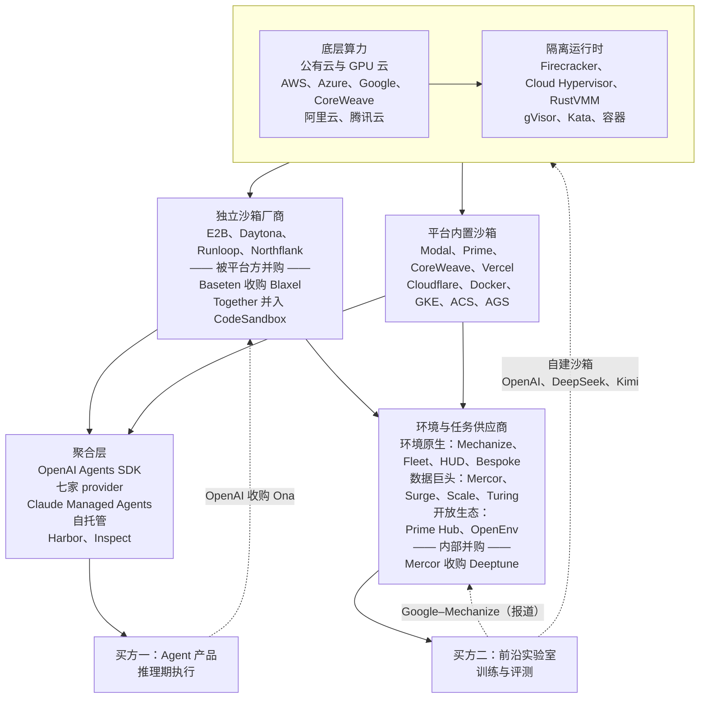

# 第 22 章　沙箱与环境的产业化

## 本章导读

前面各章把沙箱当作系统来拆解。本章把它当作一门生意，回答两个问题：沙箱是一个独立品类，还是推理平台和 Agent 平台的标配组件？环境作为商品，是怎样定价的？

本章的判断有两条。第一，**沙箱正在被吸收为平台的标准组件**。2026 年，OpenAI 收购 Ona（原 Gitpod），Baseten 收购 Blaxel；Docker、Cloudflare、Vercel、Google 都推出了一方沙箱；OpenAI Agents SDK 把七家厂商列为可替换的 provider，沙箱 API 因此被商品化。独立厂商仍在融资，但量级停留在种子轮到 A 轮；唯一能单独量化沙箱收入的官方数字，来自推理平台 Modal。第二，**RL 环境正在变成有价格的商品**。单个任务、一个网站复刻、一份季度合同都已经有了可以引用的价位区间，数据承包商和大实验室正在通过收购与授权把环境公司纳入自身。两条线交汇于一点：环境是商品，沙箱是它的交付介质（见附录 A"RL 环境市场"）。

先交代证据的性质。本章几乎所有数字都来自利益相关方：价格页、融资公告、客户案例、竞品对比。少数第三方材料（Epoch、SemiAnalysis）是访谈综述或付费通讯，而且**没有任何机构给出可信的市场规模数字**。本章逐条标注来源类型，把"未披露"和"未证实"当作结论写出。

读完本章，读者应能：

- 说出沙箱被平台吸收的三条路径，以及 API 商品化之后独立厂商还能在哪些方面差异化；
- 读懂表 22-1 的厂商版图，知道各家"冷启动"数字为什么不能横向比较；
- 区分墙钟计费、活跃 CPU 计费、暂停免费三类计价方式，能按自己的负载估算账单；
- 掌握中国云厂商 Agent 沙箱的公开价格锚点，以及哪些厂商的价格尚未披露；
- 复述 RL 环境市场的价格结构、主要交易，以及这些数字各自的可信度；
- 按本书建议的清单评估沙箱厂商与环境供应商，判断自建还是外购。

## 22.1　从独立品类到平台组件

### 22.1.1　三条吸收路径

2026 年的事件可以归成三条路径。

**并购。** 2026 年 6 月 11 日，OpenAI 宣布收购 Ona（原 Gitpod），条款未披露，目的是支持需要"数小时或数天"的长任务，Codex 周活用户超过 500 万（SiliconANGLE，2026-06-11；二手报道）；The Decoder 另报道该收购"尚需监管批准"，并称目的是让 Codex 任务在用户合上笔记本后仍能继续运行（The Decoder；二手报道）。OpenAI 与 Ona 原文本书未取得。9 月 10 日，推理平台 Baseten 宣布收购 microVM（微虚拟机）沙箱公司 Blaxel，新闻稿未披露财务条款，称 Blaxel 的沙箱"启动和恢复速度最高比竞品快 5 倍"（spin up and resume up to 5x faster than competitive sandbox solutions）（Baseten 新闻稿，BusinessWire，2026-09-10；厂商自报）。更早一例是 2024 年 12 月 CodeSandbox 加入 Together AI 并推出基于 Firecracker 的 CodeSandbox SDK（CodeSandbox 博客，2024-12-12；一手文档）。三家收购方分别是模型公司、推理平台、推理平台，动机各有侧重：OpenAI 要的是长时、可在用户合上笔记本后继续的任务执行能力，这对应第 11 章讨论的"长寿命、可休眠"状态管理；Baseten 的新闻稿则把沙箱与模型并列为"生产环境中 Agent 的基础设施"，其 CTO 称"Agent 需要模型，也需要一个快速、可扩展、足够可靠的安全运行环境"（Baseten 新闻稿；一手文档）。收购方买的不是一项隔离技术，而是"模型调用之后的下一步"。

**一方产品。** 基础设施厂商把沙箱做成自家平台的一项功能：Vercel Sandbox 于 2026-01-30 GA，Cloudflare Sandbox 于 2026 年 4 月 GA，Google 在 Cloud Next '26 推出 GKE Agent Sandbox，Docker 于 2026-09-24 发布 Cloud Sandboxes，CoreWeave 于 2026-05-14 发布面向 RL、工具调用和模型评测的 CoreWeave Sandboxes（各家博客与新闻稿；一手文档）。AWS AgentCore Code Interpreter 与 Azure Container Apps dynamic sessions 更早已存在（见第 6 章）。国内的阿里云 ACS Agent Sandbox、无影 AgentBay、腾讯云 Agent Runtime、火山引擎 AgentKit、百度智能云 AX 也都属于这一类（见 22.4 节）。

**训练平台自带。** Modal、Prime Intellect、CoreWeave 本来卖推理或训练算力，沙箱是向 RL 客户追加销售的一项。Modal 在 C 轮公告中称"沙箱已贡献超过三分之一的收入"（Sandboxes already drive more than a third of our revenue）（Modal 博客，2026-05-21；厂商自报）。Prime Intellect 的 Prime Sandboxes 于 2026-09-23 GA（Prime 博客；一手文档），与其 Environments Hub 和训练服务绑在一起。

### 22.1.2　API 层的商品化

吸收容易，是因为接口层已经趋同。OpenAI Agents SDK 在 2026-04-15 的更新中内置了"Blaxel、Cloudflare、Daytona、E2B、Modal、Runloop 和 Vercel"七家沙箱 provider，并用 Manifest 描述可移植的工作区；博客写道，"把 harness 与计算分离，有助于让凭据远离执行模型生成代码的环境"（Separating harness and compute helps keep credentials out of environments where model-generated code executes）（OpenAI 博客，2026-04-15；一手文档）。Anthropic 的 Claude Managed Agents 自托管沙箱指南列出了 AWS Lambda MicroVMs、Blaxel、Cloudflare、Daytona、E2B、Fly.io、GKE Agent Sandbox、Modal、Namespace、Superserve、Vercel 等平台（Claude Platform 文档；一手文档，未回原文核对）。评测侧的 Harbor 也以 Daytona、Modal、LangSmith、Blaxel 等为云后端（见第 16 章）。在这些聚合层（aggregation layer）里，沙箱厂商是可替换件，彼此的 API 差异由 SDK 吸收。另一条趋同线是 E2B 协议：阿里 ACS、腾讯 CubeSandbox、PPIO 都宣称兼容（实现者自述，无一致性测试，见第 16 章）。

聚合层还改变了责任边界。Agents SDK 与 Claude Managed Agents 都把 harness（外壳/评测框架，负责驱动 Agent 循环、工具与打分）留在平台一侧，只把工具执行放进沙箱，凭据不进入执行模型代码的环境（见第 14、21 章）。这样，沙箱厂商只承担"执行不可信代码"这一窄职责，凭据管理、会话状态与审计留在聚合层；沙箱越窄，越容易被替换（推断）。

接口趋同之后，独立厂商的差异化空间主要剩四处（推断）：一是性能与密度，即冷启动、暂停恢复与单位成本；二是状态能力，即快照、fork、长时会话（Daytona、Sprites、Runloop 的方向）；三是部署形态，例如 Northflank 的自带云账号（BYOC）；四是面向 RL 的配套，例如预构建环境目录与并发上限。前三项平台方都能复制，第四项则把沙箱厂商推向环境市场（见 22.7 节）。

### 22.1.3　独立厂商的位置

独立沙箱厂商的融资规模比平台方小一到两个数量级。E2B 于 2025-07-28 完成 2,100 万美元 A 轮，累计融资 3,200 万美元（E2B 博客；厂商自报）；Daytona 于 2026-02-05 完成 2,400 万美元 A 轮（Daytona 博客；厂商自报）；Runloop 于 2025-07-30 完成 700 万美元种子轮（Runloop 新闻稿；厂商自报）；Northflank 2024 年 11 月 A 轮约 2,100 万欧元（tech.eu 交易库；二手报道）。截至 2026-10-04，本书未检索到这四家在 2026 年内的新一轮融资（本书检索结论）。作为对照，Modal 的 C 轮是 3.55 亿美元，Baseten 此前 F 轮估值 130 亿美元。这组数字支持本章的第一个判断：**沙箱作为独立品类在资本上是小公司，作为平台组件在收入上已是大生意**（推断）。

## 22.2　厂商版图

表 22-1 汇总本书材料覆盖的主要沙箱即服务（sandbox-as-a-service）厂商。每格都标了来源类型。"冷启动"一列尤其要注意：各家的起止点不同（是从模板快照恢复还是从镜像启动，是否含网络和健康检查），单并发与千并发也不是一回事（见第 6 章 6.6 节）。表中价格是官方价格页的标价，抓取日期见表注。

**表 22-1　沙箱即服务厂商版图（截至 2026-10-04）**

| 厂商 | 隔离 | 冷启动宣称（来源类型） | 持久化与暂停 | 计价单位与官方标价 | 融资或归属（主要来源） |
|---|---|---|---|---|---|
| E2B | Firecracker microVM | 约 150 ms / < 200 ms / "sub-500 ms"（二手，三说冲突，C-18） | 支持暂停/恢复，往返约 3 s（二手）；默认超时即终止（一手，C-41）；会话 1 h（Hobby）/ 24 h（Pro） | 按运行秒：$0.0504/vCPU·h，$0.0162/GiB·h | A 轮 $21M（2025-07-28），累计 $32M（官方博客） |
| Daytona | 默认 Linux 容器，另有 VM 与 GPU 沙箱（一手文档） | 亚 90 ms（二手） | 快照（容器仅文件系统、VM 含内存）；暂停与 fork 仅 VM/Windows（一手文档） | 按秒：$0.0504/vCPU·h，$0.0162/GiB·h | A 轮 $24M（2026-02-05，官方博客） |
| Modal | gVisor，另有 VM 运行时（一手文档） | 300–500 ms 与 p50 约 100 ms（二手，C-16） | 本书未核实 | 按秒：$0.1419/物理核·h（1 核 = 2 vCPU），$0.024/GiB·h；约为普通 Function 单价的 3 倍（笔者按价格页推算） | C 轮 $355M、估值 $4.65B（2026-05-21，官方博客） |
| Vercel Sandbox | Firecracker microVM（一手） | "亚秒级启动"（厂商自报，GA 博客） | 快照（一手）；Pro 会话 24 h、并发 10,000（一手文档）；二手报道另写 45 分钟–5 小时 | $0.128/活跃 CPU·h；内存 $0.0212/GB·h 按预置量；创建 $0.60/百万次 | 一方产品 |
| Cloudflare Sandbox | 容器（底层隔离本书未核实） | 未见容器冷启动数字；GA 博客中克隆仓库并 npm install 的工作流约 30 s，从 R2 备份恢复约 2 s（厂商自报） | R2 快照 | $0.072/vCPU·h 仅按活跃使用；$0.009/GiB·h 按预置量 | 一方产品 |
| Fly.io Sprites | Firecracker VM（二手） | 1–12 s（二手） | 持久化，自动休眠保留存储，检查点/回滚 | $0.03825/CPU·h，$0.021875/GB·h；只在 running 状态计费 | 一方产品 |
| Docker Cloud Sandboxes | microVM，独立内核与 Docker daemon（一手） | 未披露 | 暂停不计费；会话默认 1 h、最长 24 h | 按秒：1 vCPU/2 GiB $0.07/h 至 16 vCPU/32 GiB $1.12/h（打包价） | 一方产品（2026-09-24） |
| Blaxel | microVM | 启动与恢复"最高快 5 倍"（厂商自报）；恢复 25 ms（二手） | 挂起后可空闲数月近零成本（二手） | 本书未取得 | 种子轮 $7.3M（官方，未核实）；2026-09-10 被 Baseten 收购 |
| Runloop | micro-VM devbox（一手） | 未披露 | 快照与 Blueprint | $0.108/CPU·h，$0.0252/GB·h；Pro $250/月 | 种子轮 $7M（2025-07-30，官方） |
| Northflank | Kata（Cloud Hypervisor）+ gVisor（厂商自报） | 未披露 | 会话不限时（厂商自报）；BYOC | $0.01667/vCPU·h，$0.00833/GB·h | A 轮约 €21M（2024-11，二手，未核实） |
| Prime Sandboxes | 带独立 guest kernel 的硬件虚拟化 microVM（一手） | 未披露 | 文件系统检查点已提供（SDK，2026-10-04；一手文档）；fork 仍在路线图上 | **促销价**至 2026-12-22：$0.02/vCPU·h，$0.0125/GiB·h | 母公司 A 轮 $130M（2026-07-08，官方） |
| CoreWeave Sandboxes | 未说明技术；新闻稿称单个沙箱的故障、内存激增或失控进程"不会影响任何其他沙箱"（厂商自报） | 未披露 | 未披露 | 未公布价格 | 一方产品（2026-05-14） |
| GKE Agent Sandbox | gVisor（Google 博客）；开源项目 kubernetes-sigs/agent-sandbox 另支持 Kata（项目文档） | "每秒 300 个沙箱、亚秒级延迟"（厂商自报） | 开源 CRD；预热池见开源项目文档 | 按 GKE 资源计费（本书未取得专项价） | 一方产品 + 开源（kubernetes-sigs/agent-sandbox） |
| CodeSandbox SDK | Firecracker microVM | 从运行中 VM 或快照克隆约 3 s（厂商自报，未核实） | 快照、克隆 | 本书未取得 | 2024-12 并入 Together AI |

注：价格依各家官方价格页，E2B、Modal、Daytona、Vercel、Cloudflare、Sprites、Northflank、Runloop 为 2026-10-04 抓取，Docker、Prime 于 2026-10-04 回原文核对；Daytona 页面"前 5 GiB 免费"经独立核对指存储（Price per GiB after first 5 free）。AWS AgentCore（Firecracker）与 Azure dynamic sessions（Hyper-V，预热池毫秒级分配，40 多个区域）见第 6 章。冷启动一列中，GKE、Vercel、CodeSandbox、Blaxel 为厂商一手宣称，其余为二手或未披露；Cloudflare 的 30 s 与 2 s 是工作流耗时，不是容器冷启动。

**读表。** 从隔离看，表中 14 家有 8 家以 microVM 为主，Modal 与 GKE 以 gVisor 为主，Daytona 与 Cloudflare 以容器为主，Northflank 兼用 Kata 与 gVisor，CoreWeave 未说明技术；Prime 从 INTELLECT-3 时期的 gVisor 转向 microVM（见第 27 章），是"训练侧向 microVM 靠拢"的一个实例。从冷启动看，**表中没有一项可以横向比较**（Cloudflare 的数字甚至不是冷启动）：E2B 一家就有三个说法，Modal 有两个相差三到五倍的说法，Daytona 的"亚 90 ms"来自评测博客，而 22.9 节的第三方排行榜测得的是另一种口径。从计价看，单位不统一（vCPU、物理核、"CPU"、活跃 CPU，GiB 与 GB），比较前必须换算到同一规格（见 22.3 节）。

表中没有列出的维度同样重要，首先是出站。厂商的"网络模式"标签不等于出站被拒绝：AWS AgentCore Code Interpreter 的"Sandbox"网络模式曾被 BeyondTrust 演示可经 DNS 隧道外泄数据并建立反弹 shell，AWS 起初称其为预期行为，2026 年 4 月才修复 DNS 隧道（BeyondTrust，2026-03-16；一手文档，见第 14 章）。E2B 与 Modal 的沙箱默认可以访问公网，需要显式配置才会收紧（两家网络文档；一手文档，见第 14 章）；Docker Sandboxes 则默认阻断全部出站 TCP，并在宿主侧代理中注入凭据（Docker 文档；一手文档）。它对产品负载决定提示注入后数据能否外传，对训练与评测负载决定模型能否取回答案（见第 19 章）。出站能力目前是各家文档里差异最大、也最少被营销的一项（推断）。

## 22.3　定价：从墙钟到活跃 CPU

### 22.3.1　三类计费方式

按表 22-1，海外厂商的计费可分为三类。

**按墙钟时间计费。** E2B、Daytona、Modal、Runloop、Northflank 按沙箱运行的秒数收 CPU 与内存费，不论 CPU 是否在忙。

**按活跃 CPU 计费。** Vercel 的 CPU 价格是"活跃 CPU 小时"，I/O 等待和 LLM 调用期间不计（Vercel 定价文档，2026-09-10 更新；一手文档）；Cloudflare 的 vCPU 费"仅按活跃使用计费"（Cloudflare Containers 定价页；一手文档）。两家的内存都按预置量计费。

**空闲或暂停不计费。** Sprites 只在 running 状态计费，warm 与 cold 状态不收 CPU 与内存费（Fly.io 官方页；一手文档）；Docker Cloud Sandboxes 写明"暂停的沙箱不收费"（Paused sandboxes cost nothing）（Docker 博客，2026-09-24；一手文档）；阿里 ACS 休眠态与腾讯 Agent Runtime 暂停态都不收 CPU 与内存费，只收存储（见 22.4 节）。

三类方式回应同一个负载事实：Agent 沙箱的 CPU 大部分时间在等模型（见第 3 章"CPU 稀疏性"）。按活跃 CPU 计费，是厂商在账单上承认这一点；暂停免费，则把等待的成本从"按秒付钱"变成"付一次恢复延迟"（见第 11、13 章）。

### 22.3.2　同一规格下的账单

为便于比较，本书按标价把各家换算到 2 vCPU / 4 GiB 运行 1 小时（表 22-2）。这是笔者推算，不是厂商报价；GiB 与 GB 的差别、免费额度、存储与创建费均忽略。

**表 22-2　2 vCPU / 4 GiB 运行 1 小时的标价账单（笔者推算）**

| 厂商 | CPU 100% 活跃 | CPU 10% 活跃 | 算式（100% 情形） |
|---|---|---|---|
| Northflank | 约 $0.067 | 同左 | 2 × 0.01667 + 4 × 0.00833 |
| Prime（促销价） | 约 $0.09 | 同左 | 2 × 0.02 + 4 × 0.0125 |
| Docker Cloud（Small） | $0.14 | 同左 | 官方打包价 |
| Sprites | 约 $0.164 | 同左（running 状态） | 2 × 0.03825 + 4 × 0.021875 |
| E2B / Daytona | 约 $0.166 | 同左 | 2 × 0.0504 + 4 × 0.0162 |
| Cloudflare | 约 $0.18 | 约 $0.05 | 2 × 0.072 + 4 × 0.009 |
| Modal | 约 $0.238 | 同左 | 1 物理核 × 0.1419 + 4 × 0.024 |
| Runloop | 约 $0.317 | 同左 | 2 × 0.108 + 4 × 0.0252 |
| Vercel | 约 $0.341 | 约 $0.11 | 2 × 0.128 + 4 × 0.0212 |

注：10% 活跃一列只对按活跃 CPU 计费的两家有差异，算式为 CPU 项乘以 0.1、内存项不变。Vercel 文档本身也以 10% CPU 利用率为例估算（一手文档）。E2B 默认规格的 $0.166/h 与 bex.co 的估算一致（bex.co，2026-09-22；二手报道）。Fly.io 学习页对六家做过同类换算，数字与本表一致（Fly.io，2026-09-09；厂商自报，竞品对比；本书未回原文）。

表 22-2 可以读出三点。第一，标价的离散度约为五倍（$0.067 到 $0.341），排序主要由 CPU 单价决定。第二，**计费方式比单价更重要**：CPU 只有 10% 活跃时，Cloudflare 从中游跌到约 $0.05，Vercel 从最贵跌到约 $0.11；反过来，RL 训练中的编译和测试是高 CPU 负载，活跃 CPU 计费的优势会消失。第三，**低活跃度下内存成了账单主体**：10% 活跃时，Cloudflare 账单中内存约占 71%（0.036 ÷ 0.0504），Vercel 约占 77%（0.0848 ÷ 0.1104）（笔者推算）。这与第 13 章的结论相互印证：按活跃 CPU 计费把 CPU 超售的风险转给了厂商，厂商便通过单独计收预置内存和设置并发上限来对冲（推断）。

> **边栏：方法——用自己的负载重算账单**
>
> 表 22-2 只是两个点。要比较厂商，应当用自己的轨迹日志算一个"每千次 rollout 成本"（rollout 即一次策略与环境交互直至结束的完整采样过程，也称轨迹展开）。做法是：从一批真实轨迹中统计每条轨迹的墙钟时长 T、CPU 活跃时间占比 a、平均内存 M、暂停总时长 P 与暂停次数 n；然后对每家厂商按其规则代入：墙钟计费为 (vCPU 单价 × 核数 + 内存单价 × M) × T；活跃 CPU 计费为 vCPU 单价 × 核数 × a × T + 内存单价 × M × T；暂停免费的厂商把 P 从计费时长中扣除，但要把 n 次恢复延迟加进轨迹时长，再看它是否拖慢了训练步（见第 17 章）。创建费、存储费与免费额度另加。这个算式不需要厂商配合，就能把"谁更便宜"变成和自己负载绑定的问题。

### 22.3.3　暂停的价格与代价

暂停免费并不等于空闲免费。暂停有恢复延迟，E2B 的暂停/恢复往返约 3 秒（bex.co，2026-09-06；二手报道，B11-04）；而 E2B 默认在超时后终止沙箱，要在创建时显式设置才会自动暂停（E2B 文档；一手文档，C-41）。"睡着时不收钱"与"醒来时东西还在"是两项不同的承诺：前者看计费规则，后者看状态保留的范围。阿里 ACS 的休眠保留内存状态，唤醒需 1–10 秒（ACS 文档；一手文档）；Sprites 的自动休眠保留的是存储（Techzine；二手报道）。选型时要分开问（见第 11 章）。

### 22.3.4　自托管的盈亏点

外购还是自建，第一个粗算来自 bex.co：E2B 默认规格约每小时 0.166 美元、约每月 121 美元；一台每月 97.30 欧元的 Hetzner AX42 大约在每月 600–700 沙箱小时时与之持平，但自托管要自己承担模板仓库、快照存储、TLS 终结、跨节点 KVM 容量规划与用量计量（bex.co，2026-09-22；二手报道，见第 25 章）。这是单机粗算，不含工程人力，也不适用于训练集群规模；22.10 节给出更完整的判断框架。

### 22.3.5　沙箱在 RL 总成本中的位置

把沙箱单价放进 RL 总成本，就能看清买方为什么更在意吞吐与可靠性，而不是单价。设一条 150 步轨迹在 2 vCPU / 4 GiB 沙箱中占用 30 分钟（笔者假设，非任何来源的数字），按 E2B 标价约 0.08 美元（0.166 ÷ 2）；按 Epoch 引述的 Mechanize 估计，每个任务在 RL 训练中消耗的算力约 2,400 美元（Epoch；二手报道）。即便一个任务要采样上千条轨迹，按标价计的沙箱费用也只是任务算力的几分之一到几十分之一的量级（笔者推算，依赖上述假设，口径粗糙）。真正昂贵的是沙箱故障与慢启动拖住的 GPU 时间：第 3 章引用的 RollArt 数据显示，约每十次迭代出现一次环境超时，在发生环境超时的迭代中，env.reset 占 rollout 时间的 78%（RollArt §3.1；论文自述，见第 3、17 章）。所以训练侧买方的核心指标是"每 GPU 小时完成多少有效 rollout"，标价差异是次要的（推断）。产品侧则相反：沙箱费用直接进入每个用户会话的毛利，计费方式的差异会被放大。

## 22.4　中国云厂商的价格锚点

### 22.4.1　已公开的价格

国内主要云厂商都已推出 Agent 沙箱，其中三家公开了价格（表 22-3）。

**表 22-3　中国云厂商 Agent 沙箱价格锚点**

| 产品 | 隔离 | 官方标价 | 计费规则 | 来源与日期 |
|---|---|---|---|---|
| 阿里云 ACS Agent Sandbox（公测） | MicroVM 级 | 中国内地：vCPU ¥0.0000217/秒（¥0.078/小时），内存 ¥0.00001083/GiB·秒（¥0.039/GiB·小时）；港澳及海外 ¥0.1232/vCPU·小时、¥0.0616/GiB·小时 | 按秒计费、按小时出账；运行态 30 GiB 临时存储免费；休眠态不收 CPU 与内存费，存储全额计费 | ACS 文档，2026-06-22 更新；一手文档，2026-10-04 核对 |
| 阿里云无影 AgentBay | 每实例独立客户机内核的 VM | 云电脑、云手机 1 积分/小时，浏览器、Code Space 0.5 积分/小时；1 积分 = 1.2 元（约 ¥1.2/小时、¥0.6/小时） | 每小时整点结算；可用积分包或按量付费；秒级计量（未核实） | AgentBay 计费页，2025-09-11 更新；一手文档，2026-10-04 核对 |
| 腾讯云 Agent Runtime（AGS） | 自研 Cube 轻量虚拟化（RustVMM + KVM） | CPU ¥0.000081/核·秒（约 ¥0.29/核·小时），内存 ¥0.000025/GiB·秒（约 ¥0.09/GiB·小时）；系统盘 ¥0.0021/GiB·小时，每实例 15 GiB 免费 | 按秒计费，不足 1 秒按 1 秒；暂停后 CPU 与内存停止计费，系统盘继续计费 | 腾讯云计费文档，2026-09-09 更新；一手文档，2026-10-04 核对 |
| 火山引擎 AgentKit / veFaaS 沙箱 | 未披露 | **未披露**（价格页为 JS 渲染，未能取得） | API 参数：生命周期 3–1,440 分钟，0.25–16 vCPU，0.5–128 GiB | AgentKit 产品页；Pulumi schema（一手文档） |
| 百度智能云 Agent 沙箱（AX） | "把代码关进容器或虚拟机" | **未披露**（文档未公开价格；AX 文档导航无计费页，2026-10-06 查） | 代码、浏览器、桌面、自定义四类沙箱 | 百度文档，2026-08-14 更新 |

注：ACS 的单价在本书前期材料中曾被疑为单位解析错误。经回原文核对，秒价与小时价同时列出，秒价 × 3,600 等于小时价，单位无误（附录 B C-07 已标为已解决）。ACS 在营销稿中另有经济型 ¥0.060/¥0.030 与性能型 ¥0.120/¥0.060（元/vCPU·时、元/GiB·时）两档，官方概述页只列默认档，本书不引用营销稿价格。AgentBay 国际站另有按核·小时的美元价（$0.027/核·h、$0.0113/GB·h；日文版计费页，2026-06-25，本书未回原文），与国内积分制口径不同。

按 2 vCPU / 4 GiB 运行 1 小时换算：ACS 约 ¥0.31（2 × 0.078 + 4 × 0.039），按 1 美元 ≈ 7.1 元（笔者假设的汇率）约合 $0.044，约为 E2B 同规格（$0.166）的四分之一；腾讯 AGS 约 ¥0.94（2 × 0.2916 + 4 × 0.09），约合 $0.13，与 E2B 同一量级（笔者推算）。ACS 是本书所见最低的公开标价。AgentBay 的积分价对应的是整台云电脑或云手机，规格未在计费页写明，不能与按 vCPU 计价的产品直接换算；若 RL 训练让 1,000 个 GUI 环境各跑 1 小时，按标价约 1,200 元，未计折扣（笔者推算，B22-39）。

### 22.4.2　四个特征

**价格不高于海外，接口向 E2B 看齐。** ACS 文档把"E2B SDK"列为生态兼容项，腾讯 CubeSandbox 宣称兼容 E2B SDK（腾讯新闻稿，2026-04-23；一手文档），PPIO 派欧云在 2025 年 WAIC 发布"兼容 E2B 接口的 Agent 沙箱"，基于 Firecracker，启动低于 200 ms，未公布价格（PPIO 文档；厂商自报，未核实）。对海外开发者，这意味着迁移成本主要在网络与合规，而不在接口（推断）。

**暂停语义比海外更长。** 腾讯 Agent Runtime 的会话最长 7 天、暂停后可保留 30 天（腾讯云开发者社区，2025-09-29；厂商自报，已回原文确认）；ACS 的休眠保留内存、临时盘和 IP（阿里云博客，2026-03-12；厂商自报，未核实）。这与 Manus 一类"长寿命、可休眠"的产品范式一致（见第 21 章）。

**官方文档与营销稿的数字口径不同。** ACS 官方文档写的创建速度是每分钟 1.5 万个沙箱（ACS 文档；一手文档）；营销稿则写每分钟 10 万个、单 Region 100 万并发、冷启动 P99 低于 180 ms、深度休眠唤醒 P99 低于 600 ms（阿里云营销稿，2026-09-28；厂商自报，未核实）。二者统计口径不同，本书分开标注，不取其一（见附录 B 相关条目与第 26 章）。腾讯一侧也有类似情况：产品页写"数十万实例/分钟"，Agent Runtime 公测文章写冷启动低于 100 ms、每分钟 10 万以上实例（腾讯云；厂商自报，均未核实）。

**具名客户集中在模型公司。** 阿里云博客称 Kimi 的 Deep Research、Agentic PPT、OK Computer、数据分析四项 Agent 产品运行在 ACS Agent Sandbox 上，同一篇博客又称 Kimi 在"关键的模型后训练阶段"借此降低了任务延迟，"每分钟数万沙箱"与产品上线、后训练阶段并提，未区分来源（阿里云博客，2026-03-12；厂商自报，未核实；见第 21 章 21.6.2 节、第 26 章）；腾讯称 Cube 支持 MiniMax 在 Agentic RL 训练中"分钟级调度数十万沙箱实例"（腾讯云开发者社区，2026-04-21；厂商自报，未核实）。

### 22.4.3　中国的创业公司与环境市场

本书**没有找到经一手来源核实的中国沙箱或 RL 环境创业公司融资**。可见的线索只有两条：36 氪报道 Agent-native 运行时 PaaS 公司 CoreSpeed 获百度风投、初心资本"数百万美元"融资，称其"每个用户的智能体实例在独立容器中运行"（36 氪，2025-11-14；二手报道，金额未核实）；PPIO 有沙箱产品，但没有单独的沙箱融资记录。无问芯穹 2026-05-07 融资超过 7 亿元，但没有单独的沙箱或 RL 环境产品（新浪财经；二手报道，未核实）；光轮智能约 10 亿元的融资属于物理仿真，不是软件 Agent 沙箱（投中网；二手报道，未核实，B22-42）。数据标注公司方面，海天瑞声公开提到建设"智能体应用数据"，但未提 RL 环境；数据堂、标贝、整数智能、澳鹏中国均**未检索到**面向 Agentic RL 环境的公开业务（本书检索结论）。

一种可能的解释是（推断）：国内大厂既是云厂商又是模型厂商，训练侧自建环境流水线（见第 18、26 章），产品侧由自家云提供沙箱，CubeSandbox、OpenSandbox 又以 Apache-2.0 开源，留给独立沙箱公司的空间很小。环境侧，SemiAnalysis 提到 Surge 也向月之暗面与 Z.ai 销售（SemiAnalysis；二手报道），说明部分国内实验室的外购需求流向了海外供应商。

## 22.5　资本事件与收入信号

### 22.5.1　事件表

**表 22-4　2024–2026 年沙箱与 RL 环境的主要资本事件**

| 日期 | 事件 | 金额与条款 | 来源类型 |
|---|---|---|---|
| 2024-11 | Northflank A 轮 | 约 €21M（Bain Capital Ventures 领投） | 二手报道 |
| 2024-12-12 | CodeSandbox 加入 Together AI | 未披露 | 一手文档 |
| 2025-07-28 | E2B A 轮 | $21M（Insight Partners 领投），累计 $32M | 厂商自报 |
| 2025-07-30 | Runloop 种子轮 | $7M | 厂商自报 |
| 2026-02-05 | Daytona A 轮 | $24M（FirstMark 领投；Datadog、Figma Ventures 战略投资） | 厂商自报 |
| 2026-03-19 | Deeptune A 轮 | $43M（a16z 领投） | 一手文档（投资方公告） |
| 2026-05-21 | Modal C 轮 | $355M，投后估值 $4.65B（General Catalyst、Redpoint 领投） | 厂商自报 |
| 2026-06-11 | OpenAI 收购 Ona | 未披露，尚需监管批准 | 二手报道 |
| 2026-07-08 | Prime Intellect A 轮 | $130M（Radical Ventures 领投），累计超过 $150M；估值未披露 | 厂商自报 |
| 2026-07-09 | Mercor 收购 Deeptune | 未披露 | 一手文档 |
| 2026-09-10 | Baseten 收购 Blaxel | 未披露 | 一手文档 |
| 2026-09-11 | Google 与 Mechanize 交易交割（报道） | 据报道超过 $1.5B 的人才加授权交易，授权为非独占；Google 未确认 | 二手报道，未证实 |
| 2026-09-23 / 09-28 | Modal 新一轮（报道） | Bloomberg 称洽谈约 $15B 估值；TechCrunch 援引单一未具名信源称正"接近完成"（closing in on）以 $15.75B 估值融资约 $750M（Accel 领投），Modal 拒绝置评；未官宣 | 二手报道，未证实 |

注：Fleet、Bespoke Labs、Mercor 的融资与收入见 22.7.3 节。截至 2026-10-04，未检索到 10 月 1–4 日的新沙箱并购或融资（本书检索结论）。

### 22.5.2　收入信号

可以单独量化"沙箱收入"的只有一个数字：Modal 自报年化收入超过 3 亿美元，"沙箱已贡献超过三分之一"，平台累计启动的沙箱超过 10 亿个（Modal 博客，2026-05-21；厂商自报）。由此推得 Modal 的沙箱年化收入在 1 亿美元以上（笔者推算：3 亿 × 1/3）。仅这一家推理平台的沙箱收入，就远超独立沙箱厂商披露过的任何收入数字：Daytona 称不到 3 个月（博客未说明起算点）达到 100 万美元前瞻营收年化（forward revenue run rate），"六周后翻倍"（Daytona 博客；厂商自报）；E2B 没有披露收入。

两个旁证指向同一方向。Prime Intellect 称"不到一年"年化收入超过 1 亿美元、客户超过 6,000 家（Prime 博客，2026-07-08；厂商自报），但没有拆分沙箱占比。Modal 公告中引用了 Applied Compute CEO 的话："沙箱是强化学习最重要的构件之一"（Sandboxes are one of the most important building blocks for Reinforcement Learning）（Modal 博客；厂商自报）。**RL 训练是沙箱收入增长的主要来源之一**，这是厂商自己的叙事；独立数据**未披露**。

估值差距同样明显。Modal 的 C 轮投后估值为 46.5 亿美元，Baseten 此前 F 轮估值 130 亿美元，二者都以推理为主业；独立沙箱厂商均未披露估值。据报道，环境侧的 Fleet 正以约 7.5 亿美元估值融资（二手报道，未证实），已与独立沙箱厂商的融资额不在一个量级。资本的信号是：**单独卖执行环境的公司估值有限，把执行环境与模型、推理或数据绑在一起的公司估值更高**（推断，样本很少）。

报道中的 Modal 新一轮融资（约 7.5 亿美元、估值 157.5 亿美元）只有单一匿名信源，本书只写"据报道正在洽谈"（附录 B X-24）。Prime Intellect 的"估值 10 亿美元"只见 SiliconANGLE 标题，官方未披露（X-25）。

## 22.6　具名 RL 客户

厂商公开点名的 RL 客户不多，且全部出自厂商自己的案例页或新闻稿（表 22-5）。

**表 22-5　沙箱厂商公开的 RL 及相关客户**

| 厂商 | 客户 | 披露内容 | 来源类型 |
|---|---|---|---|
| Modal | Applied Compute | 在 RL 训练中并行运行数千个 Modal 沙箱 | 厂商自报 |
| Modal | Lovable（产品负载） | 一个 48 小时促销周末峰值 20,000 个并发沙箱；单客户上限 50,000 并发；"不到一分钟创建 100 万个并发沙箱"（未说明测试条件） | 厂商自报 |
| Daytona | Trajectory | 用于 RL 后训练管线，已创建 70 万个沙箱，"数千个并发"，启动时间从 30 分钟降到不到 5 秒（案例页未标日期；未核实） | 厂商自报 |
| Daytona | Turing | Turing 本身是 RL 环境供应商（"RL Gyms"） | 厂商自报 |
| CoreWeave | IBM Research、Mistral | IBM Research："每个训练步并行运行数千个沙箱"（thousands of sandboxes in parallel per training step）；Mistral："在 CPU 节点上，以及 GPU 节点上与 Slurm 训练作业并行，运行数百个并发沙箱" | 厂商自报（客户引语） |
| E2B | Hugging Face、LMArena | 官方描述为"AI 研究规模化"；Modal 竞品页称 HF Open R1 用 E2B 执行 reward 函数、客户 Rogo 运行 1–1.5 万并发 | 厂商自报 / 竞品转述 |
| Prime Sandboxes | 未点名 | Beta 期约 3,000 万个沙箱；演示面板超过 20,000 并发；默认上限 1,024；"超过 365,000 个预构建环境" | 厂商自报 |
| 腾讯 Cube / AGS | MiniMax | Agentic RL 训练中"分钟级调度数十万沙箱实例" | 厂商自报 |

注：Lovable 同时是 GKE Agent Sandbox 的生产用户（Google Cloud 博客；厂商自报，见第 21 章），说明大客户会同时使用多家供应商。Prime 的 365,000 是任务或镜像口径，不等于 Environments Hub 的环境数（B18-11）。

还有一个可供对照的量级：DeepSeek DSec 披露的自建集群创建速率超过每秒 5,000 个，而按公开口径，GKE Agent Sandbox 为每秒 300 个，ACS 官方文档为每分钟 1.5 万个（约每秒 250 个，营销稿口径约每秒 1,667 个）。按 2026 年年中的公开口径，公有云沙箱服务比自建集群低一个数量级左右；若取 ACS 营销稿口径（约每秒 1,667 个），差距约为 3 倍（附录 B C-13；口径不同，仅作量级比较，见第 24 章）。这也是前沿实验室自建的原因之一（推断）。

表 22-5 的信息量有限。第一，没有一家给出 RL 客户的成本、失败率或与自建方案的对比。第二，前沿实验室（OpenAI、Anthropic、Google DeepMind）没有出现在任何一家的客户名单上，它们的训练沙箱是自建的（OpenAI 的架构演讲见第 27 章；DSec、AgentENV 见第 24、25 章）。外购沙箱的 RL 客户，主要是应用公司的自训团队（Applied Compute、Trajectory、Rogo）和中型模型公司（Mistral、MiniMax）（推断）。

## 22.7　RL 环境市场：环境是商品

### 22.7.1　价格结构

关于 RL 环境的价格，最常被引用的是 Epoch AI 的访谈综述。作者与 9 人通话，另有 9 人以文字或邮件提供意见，此外还有 4 人只做合理性检查、未提供内容（共 22 人）（Epoch AI，2026-01-12；二手报道，访谈综述）。表 22-6 按原文整理，并标出每个数字出自谁。

**表 22-6　RL 环境的价格结构（Epoch AI 访谈综述）**

| 项目 | 价格 | 原文措辞 |
|---|---|---|
| 单个任务 | 大多 200–2,000 美元；2 万美元"很少见但可能" | "I've seen $200 to $2000 mostly. $20k per task would be rare but possible." |
| 网站复刻（UI gym） | 约 2 万美元一个 | Epoch 转引 SemiAnalysis（"UI gyms often cost about $20,000 per website"），非受访者所说 |
| 复杂产品复刻（如 Slack） | 约 30 万美元 | "figures around $300k" |
| 季度合同（一位 RL 环境公司创始人） | 常为"每季度七位数或以上" | "one RL environment founder noted that contracts are often seven figures per quarter or more" |
| 季度合同（一位新兴实验室研究员） | 见过 30 万–50 万美元的合同 | "seeing contracts in the $300k-$500k range" |
| 独占溢价 | 约为非独占的 4–5 倍 | "roughly 4-5x more expensive than non-exclusive ones" |
| 每任务 RL 算力（Mechanize 估计） | 约 2,400 美元 | 经 Epoch 转述 |

注：本书前期材料曾把"30 万–50 万美元/季度"写成常见合同规模。经回原文核对，两个合同数字各出自一位受访者（七位数出自一位环境公司创始人，30 万–50 万美元出自一位新兴实验室研究员），都不能当作典型值，此处更正（附录 B B22-30 已同步）。Epoch 另记：环境"常以 Docker 容器交付，但并非总是如此"；最低通过率约 2–3%（64 或 128 次 rollout 中至少成功 1 次）。

表 22-6 有两点与本书前几部分直接相关。一是**独占溢价**：同一环境卖给多家实验室会降低价值，部分原因是答案与解法可能扩散，环境的"保密性"被定价了（推断，与第 19 章的取回型 reward hacking（奖励投机）同源）。二是**算力与环境费用同量级**：每任务约 2,400 美元的 RL 算力，与 200–2,000 美元的任务单价相当，这意味着沙箱执行的效率（第 13 章的密度、第 17 章的 rollout 架构）会直接进入环境的总拥有成本（推断）。

### 22.7.2　供应商结构

SemiAnalysis 称"超过 35 家公司"在做 RL 环境，多为种子期；"Anthropic 要求供应商在大多数领域遵循特定的沙箱框架"，并链接到 laude-institute/sandboxes（Harbor 的前身）；"OpenAI 已为 ChatGPT Agent 训练购买了数百个网站"（SemiAnalysis，2026-01-06；二手报道，可见部分已核对）。Troveo 把供应商分为三类：数据巨头（Scale、Surge、Mercor、Turing、Centific）、环境原生公司（Mechanize、Fleet、HUD、Veris AI、Plato、Bespoke Labs）、开放生态与基础设施（Prime Intellect、General Reasoning、Modal、E2B），并称定价"几乎一切都是定制范围"（Troveo，2026-08-09；二手报道）。

三类供应商的商业模式不同（推断）。数据巨头卖的是专家人力与规模，环境只是新增品类：SemiAnalysis 称 Scale AI 2024 年收入超过 14 亿美元、Surge 年化收入约 10 亿美元（估计），而 Surge 2024 年收入另有 12 亿美元的说法，两者口径不同，均为二手（附录 B C-28）；Turing 公开销售名为"RL Gyms"的产品（Turing 网站；厂商自报），同时又是 Daytona 的客户。环境原生公司卖的是软件复刻与验证器，客户集中在少数实验室，SemiAnalysis 称多数供应商规模不足 20 人、只服务 1–3 家实验室（B22-32；二手报道）。开放生态与基础设施公司（Prime、Modal、E2B）卖的是执行与分发，把环境当作吸引算力消费的入口。

Anthropic 的要求说明**沙箱接口本身已是采购门槛**：环境要以买方指定的沙箱格式交付，才能进入其训练管线（推断）。OpenEnv 的指导委员会同时包括 Modal、Prime Intellect、Mercor、Fleet AI（HF 博客，2026-06-08；一手文档，B16-04），环境供应商与沙箱厂商在接口标准上已经坐到了一起（见第 16 章）。

### 22.7.3　交易与收入

2026 年的环境侧交易比沙箱侧更集中在大买方手里。

- **Mercor 收购 Deeptune**（2026-07-09）：价格未披露；Deeptune 团队两年内"复刻了数百个企业应用，从电子表格到 Salesforce"，此前完成 a16z 领投的 4,300 万美元 A 轮；Mercor 称其网络有"超过五百万领域专家"（Mercor 博客；一手文档）。另有报道称 Mercor 年化收入约 20 亿美元、正以约 200 亿美元估值洽谈融资（二手报道，未证实）。
- **Google 与 Mechanize**：Business Insider 2026-08-05 报道 Google 在谈一笔人才加授权交易，2026-09-11 报道交易完成，金额超过 15 亿美元，授权为非独占，联合创始人 Tamay Besiroglu 与十余名员工加入 Google DeepMind，Mechanize 由新 CEO 继续运营（AI Weekly 转述 BI；二手报道，未证实，Google 未正式确认；BI 原文未取得）。
- **Fleet**：据 Sacra 估计，年化收入从 2025 年约 100 万美元增长到 2026 年 4 月约 6,000 万美元（Sacra 研究估计；二手报道）；另有报道称其正以约 7.5 亿美元投后估值融资至少 5,000 万美元（KuCoin 快讯；二手报道，未见官方公告）。产品是复刻 Excel、Salesforce 等软件的 RL 环境。
- **Bespoke Labs**：披露种子轮加 A 轮合计 4,000 万美元（TAMradar，2026-07-06；二手报道，未核实）。

把三笔交易放在一起（推断）：Deeptune 与 Fleet 的产品都是"企业软件复刻"，Mechanize 以授权形式被吸收，价值集中在"专家任务 + 软件复刻 + 验证器"的组合上，而这个组合的最大买方是前沿实验室和拥有专家网络的数据承包商。与沙箱一样，环境也在被更大的平台吸收，只是吸收方换成了数据公司和模型公司。

### 22.7.4　市场规模：没有可信数字

本书**没有找到任何可信的"Agent 沙箱"或"RL 环境"市场规模（TAM）估计**；Epoch、SemiAnalysis、Troveo 都没有给出总量。现有的只是单一买方支出的估计，而且彼此相差一个数量级以上：

- The Information（经 TechCrunch，2025-09-21）称 Anthropic 讨论过在接下来一年里在 RL 环境上花费超过 10 亿美元；这是"讨论"，不是已发生的支出（二手报道，B22-34）。Epoch 将其与 OpenAI 2026 年"预计约 190 亿美元"的研发算力支出对照（Epoch；二手报道）。
- Wing VC（2026-01）估计 Anthropic 的 RL 环境支出为"每年数千万美元"（on the order of tens of millions annually），并称**各实验室合计**的环境支出 2026 年可能增长 3–5 倍（二手报道）。Wing 文中没有利益披露；据 TAMradar，Wing 领投了 Bespoke Labs 的 A 轮（二手报道），存在利益关系。

本书的处理是两说并列，不取中值，不由此外推市场规模。

## 22.8　价值链：利润落在哪里

图 22-1 把前文的厂商、聚合层与环境供应商放进一条价值链。实线表示供给关系，虚线表示 2024–2026 年的收购或授权。

**图 22-1　沙箱与 RL 环境的价值链（示意图，依据表 22-1、22-4、22-5 与 22.7 节绘制）**

图 22-1 可以读出三点（均为推断）。

第一，**沙箱位于两个大买方之间的中段**。上游是云与 GPU 算力，下游一边是 Agent 产品，一边是经环境供应商转手的实验室。中段的 API 已被聚合层商品化，单纯的执行时长利润最薄，这解释了为什么吸收方都是向下游延伸的平台（推理平台、模型公司）。

第二，**前沿实验室绕过了中段**。它们自建沙箱（第 24、25、27 章），只在环境层外购，而且按自己指定的沙箱格式验收。这使得沙箱厂商面向实验室的直接收入有限，RL 需求更多经由环境供应商和中型训练客户传导（与表 22-5 一致）。

第三，**环境层的价值在内容，不在执行**。独占溢价、专家网络、软件复刻的人工成本，这些才是环境定价的来源。沙箱是环境的交付介质，它的商品化反而降低了环境供应商的交付成本。

结合第 18 章的"外购—自建之争"，可以对未来一两年作一个判断（推断，未经数据检验）：可以从公开代码自动导出的环境，会随 Agent 自动化构建而降价，外购需求向"商业软件复刻"和"专家验证器"两类收缩；沙箱执行则继续向平台集中，独立沙箱厂商要么像 Daytona、Runloop 那样向状态能力与评测基础设施延伸，要么被推理平台或模型公司收购。国内市场的结构更早走到了终点：云厂商同时是模型厂商与沙箱供应商，独立环节几乎没有出现。这个判断也有反例：Modal 以平台身份获得了最大的沙箱收入，而 Prime Intellect 同时做环境目录、沙箱与训练服务，说明"一体化"不一定由模型公司来完成。

## 22.9　没有独立基准

### 22.9.1　现有的三类"基准"

截至 2026-10-04，严格意义上的学术或中立横评仍然缺乏。可用的材料分三类。

**第三方排行榜：ComputeSDK。** 由 Snelling, LLC 运营，Namespace 提供测试机（页面写 4 vCPU / 16 GB、北弗吉尼亚），赞助商包括 Google Cloud Run 等，**而 Google 自己也有沙箱产品**（ComputeSDK 页面，2026-10-04 读取；一手文档）。其 Burst TTI 指标让 100 个沙箱一次性并发启动，测从 `create()` 到第一次 `runCommand()` 成功的时间，以 10 秒为上限计分；综合分按中位数 60%、p95 25%、p99 15% 加权，再乘以成功率。harness 代码和原始 JSON 在 GitHub 公开。2026-10-02 一次运行的中位数/p95 为：Isorun 0.07/0.08 秒，Daytona 0.33/0.42 秒，Vercel 0.48/0.71 秒，Cloudflare 0.54/0.73 秒，Blaxel 0.89/1.72 秒，Runloop 1.11/1.19 秒，E2B 1.28/1.60 秒，Modal 1.57/2.23 秒，CodeSandbox 7.53/9.82 秒，Northflank 成功率为 0（ComputeSDK；一手文档，单次运行）。参评厂商数随页面更新而变：本书 10-02 读取时记 28 家，10-04 读取时页面写 30 家（附录 B C-43）；不含 Sprites 与 Prime。已有厂商拿排名做营销，例如 NodeOps/CreateOS 2026-08-15 宣称"第 1 名"（NodeOps；厂商自报）。

这组数字的价值在于口径统一、代码公开，局限在于只有一个区域、一种规格、一次突发，测的是"并发 100 个时的首个命令"，不是 RL 场景关心的万级并发吞吐、暂停恢复与单位成本（推断）。它与厂商自报的冷启动也不是一回事：Daytona 自报"亚 90 ms"，这里的中位数是 0.33 秒；E2B 的约 150 ms，这里是 1.28 秒。差异来自口径而非对错，正说明冷启动数字必须带定义使用（见第 6 章）。

**厂商作者的论文：The Rollout Infrastructure Tax。** arXiv 2607.01415（2026-07-01 提交，SoCC 2026 投稿预印本）比较单容器、托管沙箱、K8s 容器、云 VM 四类执行底座，报告"冷启动延迟最多相差 110 倍，100 万条 150 步轨迹的预计工时相差 1.8 倍"（论文自述）。五位作者（Daniel Thi Graviet、Lovre Pešut、Ivan Dagelić、Vedran Jukic、Ivan Burazin）署名单位均为 Daytona，**属厂商作者**。它的结论"把执行底座当作训练系统的一部分来优化"与本书一致（见第 17 章），但其中的厂商排序应当谨慎引用。

**不宜引用的材料。** Superagent 的"AI Code Sandbox Benchmark 2026"（2026-01-16）没有方法论，也没有利益披露。Modal、Fly、Northflank、Morph、Upstash、Novita 等厂商写的对比页，只能用于价格交叉核对，不能当作独立测量。

### 22.9.2　为什么没有

缺少独立基准有现实原因（推断）：冷启动的边界各家不同；RL 场景的关键量（万级并发下的吞吐、暂停恢复、每千次 rollout 成本）需要大规模预算才能测；厂商没有动力在对手的最优配置上测；而买方中最有能力测的前沿实验室，恰恰是自建者，不需要公开结果。第 6 章已讨论这一空白对单机性能数字的影响，本章补充它对采购的影响：**买方目前只能依靠自己的试用测量**。

## 22.10　本书建议：买方怎样选

以下为本书建议，不是现行行业做法。

### 22.10.1　自建还是外购

**本书建议按四个变量判断。**

1. **规模与并发形态。** 峰值并发是否超过厂商默认上限（Prime 默认 1,024；E2B Pro 100–1,100；Vercel Pro 10,000；Modal 单客户 50,000，均为厂商自报），创建速率是否超过厂商的分配速率上限（如 Vercel 每分钟 5,000 vCPU）。持续数万并发、频繁暂停恢复的训练负载，目前公开可见的大规模案例都是自建（DSec、K3/AgentENV、OpenAI；见第 24、25、27 章）。
2. **CPU 活跃度。** 推理期 Agent 的 CPU 大部分时间空闲，活跃 CPU 计费或暂停免费的厂商更划算；RL 训练中编译、测试密集的负载，墙钟计费的低单价厂商或自建更划算（表 22-2）。
3. **状态与网络需求。** 需要 fork、长时休眠、细粒度出站与凭据注入的负载，要逐项核对厂商是否已发布（Prime 已提供文件系统检查点，fork 仍在路线图上），并对照第 11、14 章的要求。
4. **工程承担能力。** bex.co 的单机盈亏点（每月 600–700 沙箱小时）不含人力；自建要承担模板仓库、快照存储、调度、计量与安全响应。开源组件（AgentENV、CubeSandbox、OpenSandbox、kubernetes-sigs/agent-sandbox）降低了起点，但没有降低运维。

**本书建议的默认路径是"接口统一、后端可换"。** 用 E2B 兼容 API 或聚合层（Agents SDK、Harbor）写业务代码，产品侧先外购，训练侧在规模越过阈值后自建或混合。2026 年的并购说明，供应商可能在一年内换了东家、改了路线，保留切换能力本身就是风险控制；Lovable 同时使用 Modal 与 GKE（表 22-5 注）也说明多源采购在大客户中已经存在。国内负载还要加一项数据驻留与合规，这通常直接决定了供应商范围。

**国内买方的特殊情况。** 国内公开标价已经低于海外（表 22-3），而且三大云都宣称 E2B 兼容，外购的门槛不在价格与接口。需要额外核对的是三件事：一是公测产品的服务等级与配额（ACS 仍为公测，不支持 GPU）；二是火山引擎、百度这类未公开价格的产品，要在合同中写明计费单位与暂停规则；三是营销稿与官方文档的数字差异（22.4.2 节），验收应以文档和自己的测量为准。国内训练侧的大规模用户（MiniMax 之于 Cube）说明云厂商愿意为训练负载做定制，但定制条款未披露。

### 22.10.2　怎样评估沙箱厂商

**本书建议在试用阶段逐项要求厂商回答，并自己测量以下内容。**

- **冷启动的定义**：是从模板快照恢复还是从镜像启动，是否含网络与就绪检查；同时测单并发与目标并发下的 p50、p99（见第 6 章）。
- **并发与速率上限**：默认值、可提升到多少、提升是否需要合同；创建失败时的错误语义。
- **暂停语义**：暂停时保留什么（内存、磁盘、IP），按什么计费，恢复延迟随内存大小怎样变化（见 22.3.3 节）。
- **内存计费方式**：活跃 CPU 计费的厂商是否按预置内存收费；按自己的 CPU 活跃度重算表 22-2。
- **出站默认值**：E2B 与 Modal 的沙箱默认可访问公网（见第 14 章），训练与评测负载要确认能否默认拒绝、按域名放行、在沙箱外注入凭据。
- **兼容性声明的范围**：E2B 兼容多为实现者自述，阿里函数计算的兼容说明就列出了"部分支持""需白名单""暂不兼容"的接口（见第 16 章），要按自己用到的接口逐项验证。
- **客户引用的性质**：所引案例是 RL 训练还是产品 serving（如 Kimi 之于 ACS，阿里云博客同时提到产品上线与后训练阶段，未区分），是否有可联系的技术负责人。
- **厂商的独立性**：是否已被收购或正在被收购，排行榜成绩是否来自其赞助的基准。

### 22.10.3　怎样采购环境

**本书建议在环境合同中写明四项。** 一是交付格式，以买方的沙箱框架或 Harbor/OpenEnv 一类公开格式交付，便于在不同沙箱后端上运行；二是完整性要求，包括构建期残留清理、出站策略、答案隔离（见第 18、19 章）；三是验证器与通过率，参照 Epoch 记录的约 2–3% 最低通过率口径，要求供应商给出参考解在目标模型上的通过率分布；四是独占条款，按 4–5 倍的独占溢价评估是否值得，非独占环境应默认其解法可能已在其他模型中出现。

### 22.10.4　本书计划的独立基准

为补上 22.9 节的空白，本书计划设计一套沙箱厂商的统一测量方案（第 6 章已预告，开放问题见表 28-1 E12 与 28.6.2 节）。**目前只有设计，没有任何测量结果**，计划内容如下：

- **口径**：固定区域与规格（2 vCPU / 4 GiB），明确冷启动起止点（API 调用到第一条命令返回），分别测模板快照恢复与镜像启动；
- **负载**：单并发、100、1,000、10,000 的并发阶梯；一组 CPU 稀疏的推理型负载与一组 CPU 密集的 RL 型负载（编译加测试）；
- **指标**：p50/p99 启动延迟、创建失败率、暂停恢复往返随内存大小的变化、出站策略的实际生效情况（含 DNS 侧信道检查，见第 14 章），以及按标价计算的每千次 rollout 成本；
- **披露**：公开 harness 与原始数据，不接受被测厂商赞助，记录测试日期与厂商版本。

方案的成本与可行性尚未评估，最终是否执行、覆盖哪些厂商，将在后续版本中说明。

## 本章小结

- **沙箱正在被平台吸收**：2026 年 OpenAI 收购 Ona、Baseten 收购 Blaxel，Docker、Cloudflare、Vercel、Google、CoreWeave 推出一方沙箱，OpenAI Agents SDK 内置七家 provider，把沙箱 API 商品化。
- **独立品类资本小，平台组件收入大**：独立厂商停留在种子轮到 A 轮（E2B 累计 3,200 万美元，Daytona A 轮 2,400 万美元），而 Modal 自报沙箱贡献其 3 亿美元以上年化收入的三分之一以上。
- **价格看计费方式**：海外标价换算到 2 vCPU / 4 GiB 每小时约 0.07–0.34 美元，CPU 10% 活跃时活跃 CPU 计费可把账单压到三分之一以下，但内存会成为账单主体。
- **暂停免费与状态保留是两项不同的承诺**：前者看计费规则，后者看休眠时保留了什么。
- **中国价格不高于海外**：阿里 ACS 经核对为 ¥0.078/vCPU·小时、¥0.039/GiB·小时，是本书所见最低公开标价，AgentBay 云电脑约 1.2 元/小时，腾讯 AGS 为 ¥0.000081/核·秒，火山引擎与百度未披露价格。
- **未见经核实的中国沙箱创业融资**：本书没有找到经核实的中国沙箱或 RL 环境创业公司融资。
- **环境是有价格的商品**：单任务多为 200–2,000 美元，网站复刻约 2 万美元，复杂产品复刻约 30 万美元，季度合同的说法只有两位受访者（每季度七位数以上；30 万–50 万美元），独占约贵 4–5 倍。
- **环境也在被大买方吸收**：Mercor 收购 Deeptune、Google 与 Mechanize 的报道交易都指向这一点。
- **没有市场规模，也没有独立基准**：Anthropic 环境支出的两个估计相差一个数量级以上，ComputeSDK 有厂商赞助，Rollout Infrastructure Tax 出自厂商作者，买方只能自己测，本书计划的统一测量方案尚无结果。

## 本章数字溯源

本表登记本章使用的全部数字。"核对"一列：**复核**＝本书 2026-10-04 回一手原文核对过；**未复核**＝本章未再回原文核对，来源一列为原始出处或附录 B 登记；**二手**＝仅有二手来源。"备注"中的 B/C/X 编号对应附录 B。

**表 22-7　本章数字溯源**

| 数字 | 含义 | 来源 | 类型 | 核对 | 备注 |
|---|---|---|---|---|---|
| 2026-06-11；超过 500 万 | OpenAI 收购 Ona；Codex 周活（"尚需监管批准"出自 The Decoder） | SiliconANGLE；The Decoder | 二手报道 | 二手 | B22-29 |
| 2026-09-10；最高快 5 倍 | Baseten 收购 Blaxel；Blaxel 启动与恢复速度宣称 | Baseten 新闻稿 | 一手文档 / 厂商自报 | 复核 | B22-21 补 |
| 超过 $2B；F 轮估值 $13B；F 轮 $1.5B | Baseten 此前融资 | Baseten 新闻稿 | 厂商自报 | 复核 | B22-22 |
| 七家 | Agents SDK 内置 provider | OpenAI 博客 2026-04-15 | 一手文档 | 复核 | C16-02 |
| 超过三分之一；超过 $300M；超过 10 亿个 | Modal 沙箱收入占比；年化收入；累计沙箱 | Modal C 轮博客 2026-05-21 | 厂商自报 | 复核 | B22-44 |
| 1 亿美元以上 | Modal 沙箱年化收入 | 300M × 1/3 | 笔者推算 | — | B22-45 |
| $355M；$4.65B | Modal C 轮金额与投后估值 | Modal 博客 | 厂商自报 | 复核 | B22-13 升级一手 |
| 约 $750M；$15.75B；约 $15B | Modal 新一轮（报道，"接近完成"，未官宣） | TechCrunch；Bloomberg 经 Reuters | 二手报道 | 二手 | B22-14、X-24 |
| $21M；$32M；88% | E2B A 轮；累计融资；Fortune 100 注册比例 | E2B 博客 2025-07-28 | 厂商自报 | 复核 | B22-01 改；X-18 改 |
| $24M；$1M，六周后翻倍 | Daytona A 轮；前瞻营收年化 | Daytona 博客 2026-02-05 | 厂商自报 | 复核 | B22-08、B22-09 补 |
| $7M | Runloop 种子轮 | Runloop 新闻稿 | 厂商自报 | 未复核 | B22-23 |
| 约 €21M | Northflank A 轮 | tech.eu | 二手报道 | 未核实 | B22-46 |
| $7.3M | Blaxel 种子轮 | Blaxel 博客 | 厂商自报 | 未核实 | B22-21 |
| $130M；超过 $150M；超过 $100M；超过 6,000 | Prime A 轮；累计；ARR；客户数 | Prime 博客 2026-07-08 | 厂商自报 | 复核 | B22-28 |
| 约 3 秒 | CodeSandbox 克隆 VM | CodeSandbox 博客 | 厂商自报 | 未核实 | B22-47 |
| $0.0504/vCPU·h；$0.0162/GiB·h | E2B、Daytona 单价 | 官方价格页 | 一手文档 | 未复核 | B22-03；B22-48（Daytona） |
| $0.1419/物理核·h；$0.024/GiB·h；约 3 倍 | Modal 沙箱单价；与 Function 单价之比（笔者推算） | Modal 价格页 | 一手文档 / 笔者推算 | 复核（据独立核对） | B22-12、B22-49 |
| $0.128/活跃 CPU·h；$0.0212/GB·h；$0.60/百万次 | Vercel | Vercel 定价文档 | 一手文档 | 未复核 | B22-17 |
| $0.072/vCPU·h；$0.009/GiB·h | Cloudflare | Containers 定价页 | 一手文档 | 未复核 | B22-18 |
| $0.03825/CPU·h；$0.021875/GB·h | Sprites | fly.io/sprites | 一手文档 | 未复核 | B22-19 |
| $0.01667/vCPU·h；$0.00833/GB·h | Northflank | 价格页 | 一手文档 | 未复核 | B22-20 |
| $0.108/CPU·h；$0.0252/GB·h；$250/月 | Runloop | 价格页 | 一手文档 | 未复核 | B22-50 |
| $0.02/vCPU·h；$0.0125/GiB·h；至 2026-12-22 | Prime 促销价 | Prime Sandboxes 博客 | 一手文档 | 复核 | B22-51 |
| $0.07–$1.12/h；默认 1 h、最长 24 h | Docker Cloud Sandboxes | Docker 博客 2026-09-24 | 一手文档 | 复核 | B22-52 |
| 约 30 s；约 2 s | Cloudflare GA 博客中克隆仓库加 npm install 的工作流耗时；从 R2 备份恢复（均非容器冷启动） | Cloudflare 博客 | 厂商自报 | 复核（据独立核对） | C22-12 要点宜改 |
| 1–12 s | Sprites 启动 | Techzine | 二手报道 | 二手 | C22-15 |
| 每秒 300 个；亚秒级 | GKE Agent Sandbox | Google Cloud 博客 | 厂商自报 | 未复核 | B22-25 |
| 约 150 ms / < 200 ms / sub-500 ms | E2B 冷启动 | Morph、Better Stack、bex.co | 二手报道 | 二手 | B22-02、C-18 |
| 亚 90 ms | Daytona 冷启动 | Better Stack | 二手报道 | 二手 | B22-10；与 ComputeSDK 口径不同，C-44 |
| 300–500 ms / p50 约 100 ms | Modal 冷启动 | Morph、bex.co | 二手报道 | 二手 | B22-11、C-16 |
| 25 ms | Blaxel 恢复 | TNW | 二手报道 | 二手 | C22-18 |
| $0.067–$0.341；$0.05；$0.11 | 2 vCPU/4 GiB 每小时账单（100% 与 10% 活跃） | 表 22-2 算式 | 笔者推算 | — | B22-53 |
| 约 71%；约 77% | 10% 活跃时内存占账单比例 | 表 22-2 | 笔者推算 | — | B22-53 |
| 约 3 s | E2B 暂停恢复往返 | bex.co | 二手报道 | 二手 | B11-04、C-41 |
| 1–10 秒 | ACS 内存态唤醒 | ACS 文档 | 一手文档 | 复核 | C26-07 |
| $0.166/h；约 $121/月；€97.30/月；600–700 小时 | 自托管盈亏点 | bex.co 2026-09-22 | 二手报道 | 二手 | B22-04 |
| ¥0.0000217/s（¥0.078/h）；¥0.00001083/GiB·s（¥0.039/h）；¥0.1232、¥0.0616；30 GiB | ACS 价格与免费临时存储 | ACS 文档 2026-06-22 | 一手文档 | 复核 | B22-41；C-07（已解决） |
| 1 积分/h、0.5 积分/h；1.2 元/积分 | AgentBay | 计费页 2025-09-11 | 一手文档 | 复核 | B22-38 |
| ¥0.000081/核·s；¥0.000025/GiB·s；¥0.0021/GiB·h；15 GiB | 腾讯 AGS | 计费文档 2026-09-09 | 一手文档 | 复核 | B22-40 补暂停规则 |
| $0.027/核·h；$0.0113/GB·h | AgentBay 国际站 | 日文版计费页 2026-06-25 | 一手文档 | 未核实 | B22-54 |
| 3–1,440 分钟；0.25–16 vCPU；0.5–128 GiB | veFaaS 沙箱参数 | Pulumi schema | 一手文档 | 未复核 | B22-55 |
| ¥0.31（约 $0.044）；¥0.94（约 $0.13）；约 1/4 | ACS、AGS 同规格账单；ACS 与 E2B 比 | 表 22-3 算式；汇率 7.1 为笔者假设 | 笔者推算 | — | B22-56 |
| 约 1,200 元 | 1,000 个 GUI 环境 1 小时 | B22-38 推算 | 笔者推算 | — | B22-39 |
| < 200 ms | PPIO 沙箱启动 | PPIO 文档 / AIbase | 厂商自报 | 未核实 | B22-57 |
| 7 天；30 天 | 腾讯 Agent Runtime 会话与暂停保留 | 腾讯云开发者社区 2025-09-29 | 厂商自报 | 复核（第 21 章） | B21-24 |
| 数十万 | Cube 支持 MiniMax 分钟级调度沙箱实例 | 腾讯云开发者社区 2026-04-21 | 厂商自报 | 未核实 | B22-59 |
| 数百万美元 | CoreSpeed 融资 | 36 氪，2025-11-14 | 二手报道 | 未核实（金额） | B22-60 |
| 超过 7 亿元 | 无问芯穹融资（非沙箱） | 新浪财经 | 二手报道 | 未核实 | B22-61 |
| 约 10 亿元 | 光轮智能（物理仿真） | 投中网 | 二手报道 | 未核实 | B22-42 |
| 数千个；20,000；50,000；100 万 | Applied Compute 并行；Lovable 峰值；单客户上限；一分钟创建 | Modal RL 资源页 | 厂商自报 | 未复核 | B22-15 |
| 70 万；数千；30 分钟 → 不到 5 秒 | Trajectory 沙箱数、并发、启动时间 | Daytona 案例页 | 厂商自报 | 未核实 | B22-62 |
| 数百个；数千个/训练步 | Mistral 在 CoreWeave 的并发沙箱；IBM Research 每训练步并行沙箱 | CoreWeave 新闻稿 | 厂商自报 | 复核（据独立核对） | B22-63 |
| 1–1.5 万 | E2B 客户 Rogo 并发 | Modal 竞品页 | 二手报道 | 二手 | B22-16 |
| 约 3,000 万；超过 20,000；1,024；超过 365,000 | Prime Sandboxes | Prime 博客 | 厂商自报 | 复核 | B22-27、B18-11 |
| 9 人；9 人；另 4 人（共 22 人） | Epoch 通话人数；文字或邮件意见人数；只做合理性检查者 | Epoch | 二手报道 | 复核 | B22-30 改 |
| $200–$2,000；$20k；约 $20k；约 $300k；七位数/季度；$300k–$500k；4–5 倍 | RL 环境价格结构（约 $20k 网站复刻为 Epoch 转引 SemiAnalysis；两个合同数字各出自一位受访者） | Epoch；SemiAnalysis | 二手报道（访谈综述） | 复核 | B22-30 改 |
| 约 $2,400 | 每任务 RL 算力 | Mechanize 经 Epoch | 二手报道 | 未复核 | B22-31 |
| 约 2–3%；64 或 128 次 | 最低通过率 | Epoch | 二手报道 | 未复核 | B22-64 |
| 超过 35 家；数百个网站 | 环境供应商数；OpenAI 采购 | SemiAnalysis | 二手报道 | 未复核 | B22-32 |
| 超过 $10 亿/年 | Anthropic 讨论的环境投入 | The Information 经 TechCrunch | 二手报道 | 未复核 | B22-34 |
| 数千万美元/年；3–5 倍 | Anthropic 环境支出估计；各实验室合计支出 2026 年增长倍数 | Wing VC | 二手报道（利益相关） | 未复核 | B22-65、C-45 |
| 数百个；$43M；超过五百万 | Deeptune 复刻应用；A 轮；Mercor 专家网络 | Mercor 博客；a16z | 一手文档 | 复核 | B22-66 |
| 约 $2B；约 $20B | Mercor 年化收入；洽谈估值 | KuCoin/CryptoBriefing | 二手报道 | 未核实 | B22-67，未证实 |
| 超过 $1.5B | Google–Mechanize 交易 | AI Weekly 转述 BI | 二手报道 | AI Weekly 页一致，BI 原文未核实 | B22-68，未证实 |
| 约 $1M（2025 年）→ 约 $60M（2026-04）；约 $750M；至少 $50M | Fleet 年化收入（Sacra 估计）；估值；融资额 | Sacra、KuCoin | 二手报道 | 二手 | B22-69，未证实 |
| $40M | Bespoke Labs 种子 + A 轮 | TAMradar | 二手报道 | 未核实 | B22-70 |
| 100 个；10 秒；60/25/15% | ComputeSDK Burst TTI 口径 | ComputeSDK | 一手文档 | 复核 | B22-71 |
| 0.07/0.08 … 7.53/9.82 秒；0 | 2026-10-02 运行结果 | ComputeSDK | 一手文档（单次运行） | 复核 | B22-71 |
| 28 家 / 30 家 | ComputeSDK 参评厂商数 | 页面（10-02 / 10-04 读取） | 一手文档 | 复核 | C-43 |
| 110 倍；1.8 倍 | 冷启动差距；预计工时差 | arXiv 2607.01415 | 论文自述（厂商作者） | 复核 | B17-13 |
| 1.5 万/分钟；10 万/分钟；100 万并发；P99 < 180 ms；P99 < 600 ms | ACS 创建速率（文档 / 营销稿）及营销稿其他口径 | ACS 文档；阿里云营销稿 2026-09-28 | 一手文档 / 厂商自报 | 复核（文档）/ 未核实（营销稿） | 附录 B 已有 ACS 口径冲突条目（C-06、C-13） |
| 数十万实例/分钟；10 万以上/分钟；< 100 ms | 腾讯 AGS 产品页与公测文章口径 | 腾讯云 | 厂商自报 | 未核实 | B22-58 |
| 超过 5,000/秒；300/秒；约 250/秒；约 1,667/秒 | DSec、GKE、ACS（文档、营销稿）创建速率 | DSec；Google；ACS | 论文自述 / 厂商自报 / 笔者推算 | 未复核 | B24-06、B22-25、B09-05、B09-06、C-13 |
| 约每十次迭代一次；78% | 环境超时频率；超时迭代中 env.reset 占 rollout 时间 | RollArt §3.1 | 论文自述 | 未复核 | B10-14（不带"最多"） |
| 2026-03-16；2026-04 | AgentCore DNS 隧道公开与修复时间 | BeyondTrust | 一手文档 | 未核实（本书未回原文） | C14-02（文献库） |
| 30 分钟；约 $0.08 | 假设的单轨迹沙箱时长与 E2B 标价费用 | 笔者假设；0.166 ÷ 2 | 笔者推算 | — | B22-73，依赖假设 |
| 超过 $14 亿；约 $10 亿；$12 亿 | Scale 2024 收入；Surge ARR 估计；Surge 2024 收入 | SemiAnalysis；TechCrunch / Wikipedia | 二手报道 | 二手 | B22-33、C-28 |
| 不足 20 人；1–3 家 | 多数环境供应商规模与客户数 | SemiAnalysis | 二手报道 | 未复核 | B22-32 |
| 5,000 vCPU/分；10,000 | Vercel Pro 分配速率与并发 | Vercel 文档 | 一手文档 | 未复核 | B22-72 |
| 100–1,100 | E2B Pro 并发 | E2B 价格页 | 一手文档 | 未复核 | B22-03 补 |

## 参考文献

[1] Modal. Modal raises $355M Series C. 2026-05-21（厂商自报）. https://modal.com/blog/modal-series-c

[2] TechCrunch. Source: Inference provider Modal Labs closing in on $750M round at $15.75B valuation. 2026-09-28（二手，单一信源）. https://techcrunch.com/2026/09/28/source-inference-provider-modal-labs-closing-in-on-750m-round-at-15-75b-valuation/ ；Bloomberg 报道经 Reuters 转载，2026-09-23. https://kfgo.com/?p=1355648

[3] E2B. E2B raises $21M Series A. 2025-07-28（厂商自报）. https://changelog.e2b.dev/blog/series-a ；Insight Partners 公告 https://www.insightpartners.com/ideas/e2b-raises-a-21m-series-a-to-offer-cloud-for-ai-agents-to-fortune-100/

[4] Daytona. Daytona raises $24M Series A to give every agent a computer. 2026-02-05（厂商自报）. https://www.daytona.io/dotfiles/daytona-raises-24m-series-a-to-give-every-agent-a-computer

[5] Prime Intellect. Series A. 2026-07-08（厂商自报）. https://www.primeintellect.ai/blog/series-a

[6] Prime Intellect. Prime Sandboxes. 2026-09-23（厂商自报）. https://www.primeintellect.ai/blog/sandboxes

[7] Runloop. Runloop raises $7M seed round. 2025-07-30. https://www.runloop.ai/press/runloop-raises-7m-seed-round-to-bring-enterprise-grade-infrastructure-to-ai-coding-agents

[8] Baseten. Baseten Acquires Blaxel to Build the Infrastructure for AI Agents in Production. BusinessWire, 2026-09-10. https://www.businesswire.com/news/home/20260910783896/en/Baseten-Acquires-Blaxel-to-Build-the-Infrastructure-for-AI-Agents-in-Production ；Blaxel 种子轮 https://blaxel.ai/blog/Blaxel-Raises-7-3M-Seed-Round-led-by-First-Round-to-Build-Cloud-Infrastructure-for-the-AI-Agent-Eco-23247e47b1ea8067b923d998364e3ced ；The Next Web 报道 https://thenextweb.com/news/baseten-acquires-blaxel-ai-agent-sandboxes

[9] SiliconANGLE. OpenAI acquires AI agent orchestration startup Ona. 2026-06-11（二手）. https://siliconangle.com/2026/06/11/openai-acquires-ai-agent-orchestration-startup-ona/ ；The Decoder. OpenAI buys Ona to push Codex toward long-running autonomous coding tasks（二手；"尚需监管批准"出处）. https://the-decoder.com/openai-buys-ona-to-push-codex-toward-long-running-autonomous-coding-tasks/

[10] CodeSandbox. Joining Together AI, introducing CodeSandbox SDK. 2024-12-12. https://codesandbox.io/blog/joining-together-ai-introducing-codesandbox-sdk

[11] CoreWeave. CoreWeave Sandboxes launches to accelerate reinforcement learning, agent tool use, and model evaluation. 2026-05-14. https://coreweave.com/news/coreweave-sandboxes-launches-to-accelerate-reinforcement-learning-agent-tool-use-and-model-evaluation

[12] OpenAI. The next evolution of the Agents SDK. 2026-04-15. https://openai.com/index/the-next-evolution-of-the-agents-sdk/

[13] Anthropic. Claude Managed Agents: Self-hosted sandboxes. https://platform.claude.com/docs/en/managed-agents/self-hosted-sandboxes

[14] Docker. Introducing Cloud Sandboxes: start on your laptop, finish in the cloud. 2026-09-24. https://www.docker.com/blog/introducing-cloud-sandboxes-start-on-your-laptop-finish-in-the-cloud/

[15] Cloudflare. Sandbox GA. 2026-04-13. https://blog.cloudflare.com/sandbox-ga/ ；Containers Pricing https://developers.cloudflare.com/containers/pricing/

[16] Vercel. Vercel Sandbox pricing and quotas（2026-09-10 更新）. https://vercel.com/docs/vercel-sandbox/pricing ；Vercel Sandbox is now generally available, 2026-01-30. https://vercel.com/blog/vercel-sandbox-is-now-generally-available

[17] Google Cloud. What's new in GKE at Next '26. 2026-04-22. https://cloud.google.com/blog/products/containers-kubernetes/whats-new-in-gke-at-next26

[18] E2B. Pricing. https://e2b.dev/pricing ；Internet access https://docs.e2b.dev/network/internet-access.md

[19] Modal. Pricing. https://modal.com/pricing ；Sandboxes 文档 https://modal.com/docs/guide/sandboxes

[20] Daytona. Pricing. https://www.daytona.io/pricing ；Sandboxes 文档 https://www.daytona.io/docs/en/sandboxes

[21] Fly.io. Sprites. https://fly.io/sprites/ ；AI sandbox pricing（2026-09-09，厂商对比） https://fly.io/learn/ai-sandbox-pricing/ ；Techzine, 2026-01-13. https://www.techzine.eu/news/devops/137884/fly-io-puts-ai-agents-in-vms-not-containers/

[22] Northflank. Pricing. https://northflank.com/pricing ；Top AI sandbox platforms for code execution, 2026-01-17（厂商自报）. https://northflank.com/blog/top-ai-sandbox-platforms-for-code-execution ；A 轮 https://funding.tech.eu/deals/731FA7B2-5977-47E0-B00A-F611BBC582D6

[23] Runloop. Pricing. https://www.runloop.ai/pricing

[24] bex.co. E2B scaling cracks: idle costs and suspend latency. 2026-09-06（二手）. https://bex.co/blog/2026/09/06/e2b-scaling-cracks-idle-costs-suspend-latency ；AgentENV, Kimi K3 and self-hosted E2B sandbox cost, 2026-09-22. https://bex.co/blog/2026/09/22/agentenv-kimi-k3-self-hosted-e2b-sandbox-cost

[25] 阿里云. ACS Agent Sandbox 概述（2026-06-22 更新）. https://help.aliyun.com/zh/cs/user-guide/agent-sandbox/

[26] 阿里云无影. AgentBay 计费说明（2025-09-11 更新）. https://help.aliyun.com/zh/agentbay/product-overview/agentbay-billing ；国际站日文版 https://www.alibabacloud.com/help/ja/agentbay/product-overview/agentbay-billing-instructions

[27] 腾讯云. Agent Runtime 计费说明（2026-09-09 更新）. https://cloud.tencent.com/document/product/1814/133249 ；Agent Runtime 公测文章，2025-09-29. https://cloud.tencent.com/developer/article/2572684

[28] 腾讯云开发者社区. CubeSandbox 开源文章. 2026-04-21. https://cloud.tencent.com/developer/article/2657863 ；英文新闻稿（AAP 转载），2026-04-23. https://www.aap.com.au/aapreleases/cision20260423ae41855/

[29] Alibaba Cloud. Deep Dive: How Kimi's AI Agent Runs on Alibaba Cloud. 2026-03-12（厂商自报）. https://www.alibabacloud.com/blog/deep-dive-how-kimis-ai-agent-runs-on-alibaba-cloud_602942

[30] 阿里云. 函数计算 E2B 兼容说明. https://help.aliyun.com/en/functioncompute/e2b-compatibility-description

[31] 火山引擎. AgentKit. https://www.volcengine.com/product/agentkit ；veFaaS Sandbox schema（Pulumi） https://www.pulumi.com/registry/packages/volcenginecc/api-docs/vefaas/getsandbox/

[32] 百度智能云. Agent 沙箱（AX）文档（2026-08-14 更新）. https://cloud.baidu.com/doc/AX/s/amoi8d7oo

[33] PPIO. E2B 兼容沙箱文档. https://ppio.com/docs/sandbox/e2b-compatible ；AIbase 报道 https://news.aibase.com/zh/news/20030

[34] 36 氪（硅兔君）. 融资数百万美元，这家初创要为 AI Agent 修"高速公路"……（CoreSpeed 融资报道，二手）. 2025-11-14. https://36kr.com/p/3552832377371780

[35] 新浪财经. 无问芯穹融资报道. 2026-05-07. https://finance.sina.com.cn/wm/2026-05-07/doc-inhwzvzh7738591.shtml ；投中网，光轮智能融资. https://www.chinaventure.com.cn/news/78-20260609-391757.html

[36] Modal. Best sandboxes for RL environments（厂商页，含竞品转述）. https://modal.com/resources/best-sandboxes-rl-environments

[37] Daytona. Customer story: Trajectory（厂商案例，未标日期）. https://www.daytona.io/customers/trajectory

[38] Epoch AI（Denain、Barber）. State of RL environments. 2026-01-12. https://epoch.ai/gradient-updates/state-of-rl-envs

[39] SemiAnalysis. RL Environments and RL for Science. 2026-01-06（部分付费）. https://newsletter.semianalysis.com/p/rl-environments-and-rl-for-science

[40] Troveo. RL environment companies. 2026-08-09. https://www.troveo.ai/resources/rl-environment-companies

[41] Wing VC（Chris Zeoli）. RL environments for agentic AI: who will win the training & verification layer by 2030. 2026-01（利益相关方）. https://www.wing.vc/content/rl-environments-for-agentic-ai-who-will-win-the-training-verification-layer-by-2030

[42] TechCrunch. Silicon Valley bets big on environments to train AI agents. 2025-09-21（二手）. https://techcrunch.com/2025/09/21/silicon-valley-bets-big-on-environments-to-train-ai-agents/

[43] Mercor. Mercor to acquire Deeptune. 2026-07-09. https://www.mercor.com/blog/mercor-to-acquire-deeptune/ ；a16z, Investing in Deeptune, 2026-03-19. https://a16z.com/announcement/investing-in-deeptune/ ；Mercor 估值报道（未证实） https://www.kucoin.com/news/flash/mercor-in-talks-for-20b-valuation-amid-ai-training-demand-surge

[44] AI Weekly（转述 Business Insider）. Google closes $1.5B Mechanize talent deal. 2026-09（二手，未证实）. https://aiweekly.co/alerts/google-closes-15b-mechanize-talent-deal-epoch-ai-cofounder-joins-deepmind

[45] Sacra. Fleet（二手）. https://sacra.com/c/fleet ；KuCoin 快讯，2026-04-14. https://kucoin.com/news/flash/ai-training-firm-fleet-eyes-750m-valuation-amid-60x-revenue-surge

[46] TAMradar. Bespoke Labs Series A $40M. 2026-07-06（二手）. https://www.tamradar.com/funding-rounds/bespoke-labs-series-a-40m

[47] Hugging Face. OpenEnv: agentic RL environments. 2026-06-08. https://huggingface.co/blog/openenv-agentic-rl

[48] ComputeSDK. Sandbox benchmarks: Burst TTI（2026-10-04 读取）. https://computesdk.com/benchmarks/sandboxes/burst-tti ；Methodology https://computesdk.com/methodology ；harness 与原始数据 https://github.com/computesdk/benchmarks

[49] Graviet, D. T., Pesut, L., Dagelic, I., Jukic, V., Burazin, I. The Rollout Infrastructure Tax in Coding-Agent Reinforcement Learning. arXiv:2607.01415, 2026-07-01（SoCC 2026 投稿预印本；作者来自 Daytona）. https://arxiv.org/abs/2607.01415

[50] Superagent. AI Code Sandbox Benchmark 2026. 2026-01-16（无方法论，不作引用依据）. https://www.superagent.sh/blog/ai-code-sandbox-benchmark-2026 ；NodeOps. CreateOS is now the #1 sandbox provider, 2026-08-15. https://nodeops.substack.com/p/createos-is-now-the-1-sandbox-provider

[51] Morph. Daytona alternative comparison. 2026-04-04（竞品对比）. https://www.morphllm.com/comparisons/daytona-alternative ；Better Stack. Best sandbox runners. 2026-03-09. https://betterstack.com/community/comparisons/best-sandbox-runners/

[52] Harbor. harbor-framework/harbor. GitHub. https://github.com/harbor-framework/harbor

[53] BeyondTrust. Pwning AWS AgentCore Code Interpreter. 2026-03-16. https://www.beyondtrust.com/blog/entry/pwning-aws-agentcore-code-interpreter

[54] Docker. Docker Sandboxes: Security defaults / Credentials（2026-10-03 读取，据第 14 章）. https://docs.docker.com/ai/sandboxes/security/defaults/ ；https://docs.docker.com/ai/sandboxes/configuration/credentials/

[55] Modal. Sandbox networking（2026-10-03 读取）. https://modal.com/docs/guide/sandbox-networking

[56] Turing. RL Gyms（厂商页）. https://www.turing.com/advance/rl-gyms
