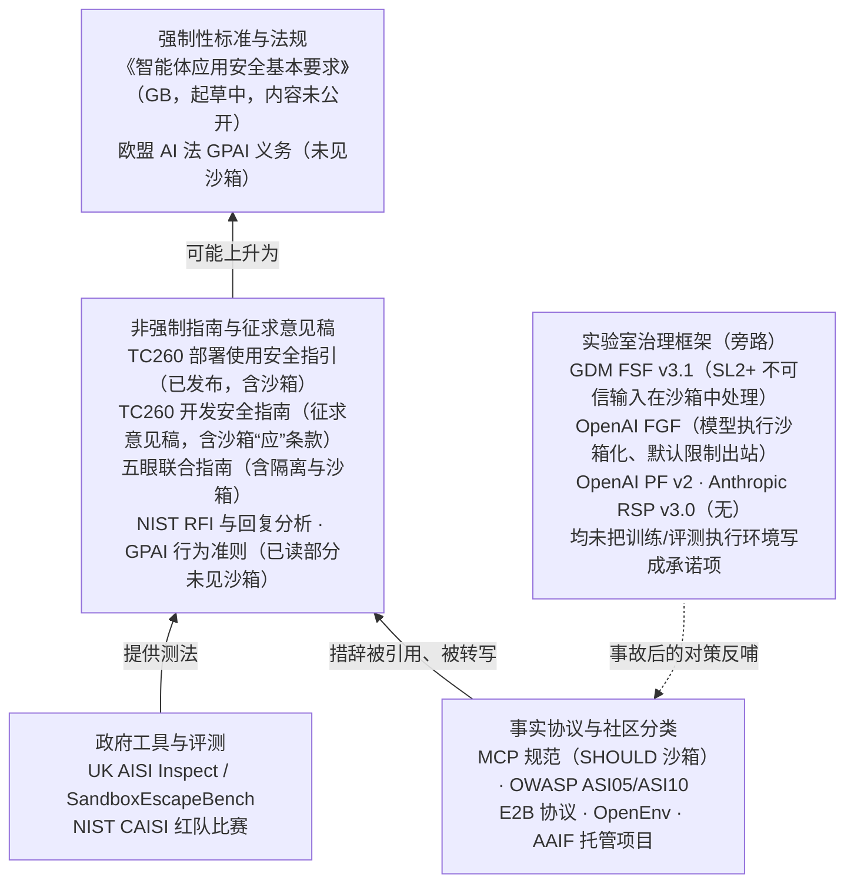

# 第 23 章　标准与治理

## 本章导读

前面各章讨论的都是工程问题：用什么隔离、出站怎么管、包代理怎么建、评测规格写什么。本章要问的是：**这些做法在中外的规范体系里处于什么位置？** 哪些已经写进了标准或指南，用的是"应"还是"宜"；哪些仍然只是厂商文档里的最佳实践；哪些在任何规范里都找不到。

本章起笔时的判断（见目录 v2）是：在中国、美国、英国和欧盟，沙箱与隔离都只以厂商最佳实践和事实协议的形式存在，没有成为强制条款。写作中本书取得了全国网络安全标准化技术委员会（TC260）两份智能体实践指南、五眼联盟网络安全机构联合指南的原文，以及 Google DeepMind 与 OpenAI 两份实验室治理文件，其中都有明确的沙箱或隔离表述，原判断因此需要修正。修正后的表述是：

> **截至 2026 年 10 月 5 日，沙箱与隔离已经写入非强制的实践指南（TC260《智能体系统开发安全指南（征求意见稿）》第 8 章 n）项、《智能体部署使用安全指引》TC260-PG-20266A、五眼联盟机构联合指南《Careful adoption of agentic AI services》）和实验室治理框架（Google DeepMind Frontier Safety Framework v3.1、OpenAI《Frontier Governance Framework》），但在本书检索范围内，尚未进入任何强制性标准或法规；中国已立项的智能体强制性国家标准仍在起草，内容未公开。**

读完本章，读者应能：

- 区分强制性标准、非强制指南、事实协议、实验室自律框架四种规范力度，知道沙箱条款目前停在哪一层；
- 准确引用 TC260《智能体系统开发安全指南（征求意见稿）》第 8 章 n）项和《智能体部署使用安全指引》中的沙箱与隔离条款，知道它们的措辞强度和适用范围；
- 说清 MCP 规范、OWASP Agentic Top 10、NIST CAISI、五眼联合指南、GPAI 行为准则、ISO/IEC SC 42 与三家实验室的治理文件各自对沙箱写了什么、没写什么；
- 理解为什么现有规范几乎都只针对"被利用的代理人"，而没有覆盖训练与评测中"作为对手的模型"（见第 2 章）；
- 读懂本书提出的"最小沙箱条款"草案，并清楚它只是作者观点，不是任何现行标准。

本章不重复第 16 章对 MCP 安全条款和 AAIF 的逐条讨论（见 16.1.2 节、16.5 节），也不重复第 20 章对 UK AISI 工具链的介绍（见 20.2 节）。

## 23.1　全景：规范力度的四个层次

### 23.1.1　四种规范力度

讨论"标准里有没有沙箱"之前，先要分清规范的力度。本章把相关文本分为四层（**图 23-1**）。

**事实协议与社区分类**：MCP 规范、OWASP Top 10、E2B 协议、OpenEnv。它们没有法律效力，却被大量实现照做，措辞也最具体。MCP 规范用 RFC 2119 风格的 MUST / SHOULD，是目前措辞最规范的沙箱要求来源（见第 16 章）。

**政府工具与评测**：UK AISI 的 Inspect 与 SandboxEscapeBench，NIST CAISI 的红队比赛。它们不规定别人怎么做，但为"怎么测隔离"提供了事实上的参考实现（见第 20 章）。

**非强制指南与征求意见稿**：TC260 实践指南、五眼联盟机构的联合指南、NIST 的征求意见与回复分析、EU GPAI 行为准则。前两者已经写入沙箱或隔离条款；后两者在已读部分没有。这里不用"推荐性"一词：TC260 实践指南的前言只说它是"标准相关技术文件"，而"推荐性"在中国标准体系里专指 GB/T 等推荐性标准。

**强制性标准与法规**：中国的《智能体应用安全基本要求》（强制性国家标准，起草中）、欧盟《人工智能法》第 55 条对系统性风险 GPAI 模型的义务。截至本章写作，在本书检索范围内，这一层没有任何沙箱条款可以引用。

实验室的治理框架（OpenAI Preparedness Framework 及其配套的 Frontier Governance Framework、Google DeepMind Frontier Safety Framework、Anthropic RSP）不属于上述任何一层。它们是企业对自身的公开承诺，23.6 节单独讨论。其中 DeepMind 与 OpenAI 的文件已出现沙箱表述，但语境是权重保护与内部威胁。

**图 23-1　沙箱相关规范的来源层次**（示意图，笔者依据本章所引各文本绘制；自下而上规范力度递增，箭头为笔者对影响方向的推断）

图中的箭头不是已发生的事实，而是推断：协议层的措辞（"沙箱、容器或其他隔离边界"）先在工程社区里稳定下来，再被指南转写；指南中被反复验证的条款，才可能进入强制性标准。TC260 开发安全指南第 8 章 n）项的措辞与 MCP 规范"使用平台适用的沙箱技术（容器、chroot、应用沙箱等）"相当接近，可以视为这一过程的一个例子（推断；两份文本之间没有引用关系）。

### 23.1.2　逐项对照

**表 23-1** 把本章检查过的规范逐项列出。"有"表示原文出现了沙箱、容器隔离或执行环境隔离的明确条款；"无"表示读到了原文（或其全部相关章节）而没有找到；"未核实"表示没有读到原文，判断只能依赖二手材料。

**表 23-1　中外规范中的沙箱相关条款对照**

| 规范 | 主体与日期 | 力度 | 沙箱条款 | 原文要点（引文） | 核实 |
|---|---|---|---|---|---|
| 智能体系统开发安全指南（征求意见稿） | TC260 秘书处，2026-09-18 征求意见，10-02 截止 | 实践指南（非标准、无强制力），草案 | **有** | 第 8 章 n）项第 1）条"将模型推理、工具执行、代码执行等执行活动置于适当的沙箱、容器或其他隔离边界内" | 一手（PDF 摘录） |
| 智能体部署使用安全指引（TC260-PG-20266A） | TC260 秘书处，v1.0-202607 | 实践指南（非标准、无强制力），已发布 | **有** | 第 6 章 e）项"宜优先选择集成安全沙箱……等机制的智能体"；第 7 章 b）项虚拟化部署"应……实施严格隔离"；第 7 章 d）项"基于沙箱等技术的环境隔离" | 一手（PDF 摘录） |
| 智能体应用安全基本要求 | 国标委计划 20263116-Q-252，2026-06-27 下达，周期 18 个月 | 强制性国家标准，起草中 | 未核实 | 报道列"系统权限调用""高风险操作人工干预""紧急停机"等，未提沙箱 | 二手（草案未公开） |
| 智能体安全标准化研究（TC260-TR-005-2026） | TC260，2026-03-26 发布（网安秘字〔2026〕34 号），92 页（页数据搜狐转载摘要，未核实） | 技术报告 | 未核实 | 五类标准体系、11 类风险；摘要未见"沙箱""隔离" | 二手 |
| 人工智能安全治理框架 2.0 | 国家网信办指导、国家互联网应急中心牵头，2025-09-15 | 政策框架 | 未核实（据专家解读：无） | 专家解读提"紧急停机"；解读未列隔离执行环境 | 专家解读（非框架原文） |
| 智能体规范应用与创新发展实施意见 | 网信办、发改委、工信部，2026-05-08 | 政策文件 | 无 | 提"越权操作""行为失控"风险与决策权限边界；无"沙箱""隔离" | 一手（经抓取） |
| 可信 AI 智能体评估体系 2.0 | 信通院，2026-04-15 | 评估体系 | 无（报道层面） | 维度一"智能体运行环境"指硬件适配、弹性扩展等能力 | 二手 |
| MCP 规范 Security Best Practices | MCP，2025-11-25 版 | 事实协议 | **有**（SHOULD） | 客户端"应当"在"最小默认权限"的沙箱环境中执行 MCP server 命令 | 一手（全文） |
| OWASP Agentic Top 10 2026 | OWASP GenAI，2025-12-09 | 社区分类 | **有**（缓解建议） | ASI05"在沙箱化容器中运行代码"；ASI10"受限执行环境（如容器沙箱）" | 一手（PDF 摘录） |
| AAIF 托管项目 | Linux Foundation，2025-12-09 起 | 开源治理 | 无 | 六个项目（2026-09-09 Agent Router 加入后）均非执行隔离规范；"Sandbox 阶段"指项目成熟度 | 一手 |
| CAISI RFI（NIST-2025-0035） | NIST CAISI，联邦公报 2026-01-08 | 征求意见 | 问题有，结论无 | 4(a)"可以用什么技术手段约束 AI agent 系统部署环境的访问或范围？" | 一手（全文） |
| AI Agent Standards Initiative；RFI 回复分析 | NIST，2026-02-17；2026-05-18 | 倡议；报告 | 无（倡议）；未核实（报告全文） | 三大支柱不涉及沙箱 | 一手（公告）/ 摘要 |
| Careful adoption of agentic AI services | ASD's ACSC、CISA、NSA、CCCS、NCSC-NZ、NCSC-UK，2026-05-01 | 联合指南（"不应视为法律意见"） | **有** | "Implement isolation and segmentation to limit blast radius of agent failure scenarios"；"Deploy sandbox environments to test agent behaviour before production deployment" | 一手（PDF 摘录） |
| GPAI 行为准则安全章节 | 欧盟，2025-07-10 | 自愿准则 | 无（已读部分）；附录 4 未核实 | 仅 Measure 5.1 提"安全的 AI agent 生态"技术；附录 4 未读到 | 一手（截断） |
| ISO/IEC JTC 1/SC 42 | 22989 Amd 2，2026-08-28 进入 CD | 国际标准（术语） | 无（检索所见） | 修订预计纳入 agent 定义；未见沙箱工作项 | 一手元数据 / 二手 |
| GDM FSF v3.1 | Google DeepMind，2026-04-17 | 实验室自律 | **有**（安全/权重保护语境） | §2.1.1 SL2+："mandating that the processing of untrusted inputs occurs within sandboxed environments" | 一手 |
| OpenAI Frontier Governance Framework | OpenAI，2026-05-28 | 实验室治理文件（PF 的配套合规文件） | **有**（内部威胁语境） | §3"Model execution is sandboxed, with restricted egress by default." | 一手 |
| OpenAI PF v2；Anthropic RSP v3.0 | 2025-04-15；2026-02-24 | 实验室自律 | 无 | 关注能力阈值、权重安全、内部部署与风险报告；未写沙箱 | 一手 |

注：①"力度"一栏为笔者归类。②TC260 两份实践指南的引文从 PDF 提取文本；开发安全指南第 8 章 n）项已经独立核对逐字一致。③"未核实"不等于"无"。④实验室两行的"有"只说明文件中出现沙箱表述；两者都没有把训练与评测执行环境写成承诺项（见 23.6 节）。

表 23-1 可以读出三点。第一，**最具体的沙箱条款仍然在协议层**：MCP 规范列出了技术选项（容器、chroot、应用沙箱），OWASP 写到了"从不以 root 运行"。第二，**中国在指南层走得最远**：两份 TC260 实践指南都把"沙箱"写进了正文；部署指引第 7 章 b）项对虚拟化部署用了条件式的"应……实施严格隔离"，开发指南第 8 章 n）项第 1）条则以"应"要求把执行活动置于沙箱或隔离边界内。五眼联合指南也写入了隔离与沙箱，但措辞是建议性的。第三，**强制层是空的**：在本书检索范围内，无论中国的强制性国标还是欧盟的 GPAI 义务，都还没有可以引用的沙箱文字。

## 23.2　事实规范：协议与社区

### 23.2.1　MCP 规范：措辞最规范的来源

MCP 规范 2025-11-25 版的 Security Best Practices 有三处直接提到沙箱（MCP 规范；一手文档）。第一处在"本地 MCP server 失陷"一节：支持一键配置的客户端"**必须**在执行命令前实现同意机制"，并"**应当**"在"最小默认权限"的沙箱环境中执行 MCP server 命令（Execute MCP server commands in a sandboxed environment with minimal default privileges），使用"平台适用的沙箱技术（容器、chroot、应用沙箱等）"，并保持沙箱方案更新。第二处在"stdio 代理场景"一节：派生 MCP server 的代理服务"**应当**"对派生进程实施沙箱化或容器化（Implement sandboxing or containerization for spawned processes）。第三处是对客户端的纵深防御建议：为代理服务本身实施进程级沙箱，或在容器、受限环境中运行代理。此外，SSRF 一节建议，对部署在服务端的 MCP 客户端，运营方"**应当**"考虑使用强制网络策略的出站代理；token passthrough 一节则有"**禁止**"条款。

这些条款对训练沙箱的含义，第 16 章已逐条讨论（见 16.5 节），这里只强调一点：沙箱相关条款全部是 SHOULD；在"本地 MCP server 失陷"一节中，唯一的 MUST 是执行命令前的同意机制。规范在其他小节另有不少 MUST（按客户端同意、redirect_uri 与 state 校验、服务端客户端须考虑 SSRF 风险、校验所有入站请求、授权 URL 的 scheme 校验等），但都不涉及执行隔离。可见，即便在措辞最规范的文本里，**沙箱也是建议，不是要求**。

### 23.2.2　OWASP：两份清单

OWASP 的 LLM 应用 Top 10（2025 版）把"过度代理"（LLM06 Excessive Agency）列为一类风险，指功能、权限和自主性超出必要（OWASP LLM Top 10；一手文档，背景知识，本次未重新抓取）。2025 年 12 月 9 日发布的 Agentic Applications Top 10 2026 则把 agent 风险细分为 ASI01–ASI10（OWASP GenAI；一手文档）。其中与沙箱直接相关的是两项（OWASP Agentic Top 10 PDF；一手文档，摘录）：

- **ASI05 意外代码执行（Unexpected Code Execution (RCE)）**。缓解建议写道："执行环境安全：从不以 root 运行。在沙箱化容器中运行代码，并施加包括网络访问在内的严格限制"（Never run as root. Run code in sandboxed containers with strict limits including network access），以及"按会话隔离环境并设置权限边界……把代码生成与执行分开，以校验关口相连"。
- **ASI10 失控 Agent（Rogue Agents）**。缓解建议包括"部署受限执行环境（例如容器沙箱），并按最小权限设定 API 范围"，"实现急停开关与凭据吊销等快速机制"，以及"把可疑 agent 隔离到沙箱环境中做取证"。

在本章检查的协议与社区文本中，ASI10 是唯一明确把"agent 本身偏离预期功能"当作威胁的条目，对应第 2 章所说的"作为对手的模型"。但 OWASP 的语境是应用部署，它的"rogue agent"指被攻破或行为偏离的生产 agent，没有讨论训练期为了拿奖励而攻击环境的模型（见第 19 章）。

### 23.2.3　事实接口与 AAIF

E2B 协议与 OpenEnv 是生命周期层与环境语义层的事实接口（见第 16 章）。它们规定的是"怎样创建和操作沙箱"，而不是"沙箱必须隔离到什么程度"；E2B 协议近来加入了出站规则字段，但没有任何一致性测试，"兼容"只是实现者自述（见 16.2.3 节）。

Linux Foundation 于 2025 年 12 月 9 日成立的 Agentic AI Foundation（AAIF）是最接近"标准组织"的机构。agentgateway 于 2026 年 6 月 4 日加入（AAIF 博文；一手文档）；截至 2026 年 8 月 17 日 A2A 加入，它托管 MCP、goose、AGENTS.md、agentgateway 与 A2A 五个项目（aaif.io *A2A joins AAIF*；一手文档）；2026 年 9 月 9 日 Agent Router 加入后为六个（aaif.io *Agent Router joins AAIF*；aaif.io/projects；一手文档）。六个项目均不是执行隔离规范。这里要提醒一个命名巧合：AAIF 在 2026 年 9 月 1 日的博文中引入了"Sandbox 阶段"，这是项目成熟度的入门级别（笔者类比为 CNCF 的 Sandbox；博文本身拿 CNCF 的高门槛作对比），只提供"standard infrastructure only. No funding, no marketing, no scanning"，设 6 个月检查点，12 个月内可申请进入 Growth 阶段（aaif.io *AAIF sandbox phase*；一手文档），**与执行沙箱无关**。引用时不要把"进入 AAIF Sandbox"误读为"AAIF 开始做沙箱规范"。

## 23.3　中国：从研究报告到实践指南，再到强制性国标

### 23.3.1　文本的层级

2025–2026 年，中国与智能体安全有关的规范文本可以排成一条从宏观到具体的链：

1. **政策框架**：《人工智能安全治理框架》2.0 于 2025 年 9 月 15 日在国家网络安全宣传周主论坛上发布，由国家互联网应急中心在国家网信办指导下组织制定（扬子晚报；二手报道）。据网信办网站刊发的专家解读，"当AI系统引入高度自主的操作能力时，可以在极端情况下迅速介入紧急停机，防止失控造成损害"；解读中没有把隔离执行环境列为具体条款（网信办网站专家解读，作者洪延青，2025-09-28；二手报道，非框架原文）。框架原文本书未读，其中有无隔离执行环境未核实。2026 年 5 月 8 日，网信办、国家发展改革委、工业和信息化部联合部署《智能体规范应用与创新发展实施意见》，指出智能体"高自主性、高权限等特性也带来了隐私泄露、越权操作、行为失控等安全风险"，要求"厘清仅限用户本人决策、需由用户授权决策和智能体自主决策等各种决策方式的合理边界及所需权限"，并提出"制定智能体标准化工作指导文件"（新华网 2026-05-08；网信办；一手文档，经抓取）。全文未出现"沙箱""隔离"。工信部 2026 年单独发布的智能体规章，本次没有检索到；它以联合发文方的身份出现在上述实施意见中。
2. **技术报告**：TC260-TR-005-2026《智能体安全标准化研究》（TC260 秘书处 2026-03-26 以网安秘字〔2026〕34 号通知，随另外四份研究报告一并发布，安全内参 2026-04-03 转载通知；92 页，据搜狐转载摘要），提出基础共性、安全管理、关键技术、测评、产品与应用五类标准体系，识别智能体挟持、数据泄露与投毒、供应链污染、身份仿冒、幻觉扩散、多智能体级联故障、协议漏洞等 11 类核心风险，标准体系中的一类在摘要里写作"测试评估"（搜狐转载摘要；二手报道）。本次仍未取得全文（TC260 附件下载链接需浏览器会话，2026-10-06 再查未得），摘要中没有"沙箱""隔离""运行环境"字样，**是否有执行环境条款未核实**。另需注意，欧盟 SESEC 项目网站上有一份题为"TC260-005"的英译文件，内容是人工智能应用伦理安全指引，与这份技术报告不是同一文件（SESEC；二手）。
3. **实践指南**：TC260 秘书处发布的《网络安全标准实践指南》系列，2026 年有两份直接针对智能体（23.3.2–23.3.3 节）。
4. **强制性国家标准**：《智能体应用安全基本要求》，2026 年 6 月下达计划（23.3.4 节）。
5. **评估与团体标准**：信通院可信 AI 智能体评估、行业联盟团体标准（23.3.5 节）。

先说清实践指南的性质。两份指南的前言都写道：《网络安全标准实践指南》是 TC260 秘书处"组织制定和发布的标准相关技术文件，旨在……宣传网络安全相关标准及知识，提供标准化实践指引"（开发安全指南前言；一手文档）。前言没有"推荐性"或"强制性"字样。它不是国家标准（包括推荐性国标 GB/T），也不是行业标准，没有强制力；但它由国家标准化技术委员会秘书处发布，起草单位包括主要厂商，在合规实践中常被当作检查依据（推断）。

### 23.3.2　《智能体部署使用安全指引》

这份指引编号 TC260-PG-20266A，版本标注 v1.0-202607（指引 PDF 封面；一手文档）。发布日期有两种记录：英文媒体与国内转载在 2026 年 7 月 4–6 日报道其发布（Geopolitechs 2026-07-04；MLex 2026-07-06；cn-sec 2026-07-06；二手报道），TC260 实践指南列表页显示的日期是 2026-08-24（TC260 列表页；一手文档）。本书写作"2026 年 7 月发布（版本 v1.0-202607；TC260 列表页日期 2026-08-24）"，两者并列。

指引的范围是"部署使用智能体的安全指引，覆盖评估、准备、部署、使用、停用等阶段"，适用于"智能体部署使用的安全风险防范，也可为选择使用商业智能体服务提供参考"（指引第 1 章；一手文档）。因此，它的读者是**部署和使用智能体的组织与个人**，不是开发者。与沙箱相关的条款有五处（指引 PDF；一手文档，PDF 文本提取）：

- **第 6 章 e）项（评估阶段，选型）**："宜优先选择集成安全沙箱、高风险操作管控、急停控制、可回溯文件系统等机制的智能体；不应选择缺少日志审计、权限管理等基础性安全机制的智能体。"
- **第 7 章 b）项（准备阶段，部署方式）**：本地部署"应选择独立设备安装智能体，不宜与日常生活、工作办公等用途的设备混用"；"拟在虚拟机、容器等虚拟化环境部署的，应通过禁止虚拟机访问其宿主机内文件等配置实施严格隔离，防止安全问题扩散至宿主机"；云上部署"应选择具备智能体身份管理、访问控制、日志审计和安全告警等能力的云平台"。
- **第 7 章 d）项（准备阶段，差距分析）**：对所选智能体与大模型的已有安全机制做差距分析，不足者"宜通过部署安全工具或接入安全服务等方式进行增强"，所列七项能力中，第 6）条是"基于沙箱等技术的环境隔离"，其余包括第 4）条"智能体供应链（如技能、工具等）安全检测"、第 5）条"高风险操作拦截与管理"、第 7）条"资源消耗与成本控制"等。
- **第 8 章 c）项（部署阶段）**："不应使用操作系统管理员权限运行智能体。宜仅授予智能体完成预期任务所必需的最小权限"。前半句是"不应"，后半句是"宜"。
- **第 8 章 e）项、g）项（部署阶段）**：将智能体配置为仅本机可访问、不开放至外部网络；"应提前建立高风险操作清单……对清单内操作实行二次确认或直接阻断"。

此外，第 9 章 a）项把"使用者是否可以便捷地急停控制智能体"列为使用阶段的检查点。

这份指引的语境很清楚：2026 年上半年，本地部署的开源个人智能体大量出现，许多用户以管理员权限运行、把管理端口暴露到公网。指引里的"独立设备""不以管理员运行""仅本机可访问"都是针对这类场景（推断，依据条款内容）。它对沙箱的态度是"宜优先选择""宜增强"，是选型和补强建议，不是对智能体产品本身的要求；唯一用"应"的隔离条款第 7 章 b）项是条件式的，只针对虚拟化部署与宿主机之间的隔离。

### 23.3.3　《智能体系统开发安全指南（征求意见稿）》

2026 年 9 月 18 日，TC260 秘书处以网安秘字〔2026〕119 号通知，就《网络安全标准实践指南——智能体系统开发安全指南（征求意见稿）》公开征求意见，截止日期为 10 月 2 日，联系人邮箱属中国电子技术标准化研究院（TC260 通知；一手文档）。通知正文没有涉及沙箱。**附件 PDF 本次已取得**：版本标注 v1.0-202609，编号栏印作"TC260-PG-2026NA"（笔者理解为编号尚未分配），共 26 页，分范围、规范性引用文件、术语、缩略语、概述、准备、设计、实现、测试、发布十章，无附录；起草单位 12 家，包括浦江国家实验室、中国电子技术标准化研究院、中国移动、中国软件评测中心、阶跃星辰、中兴、火山引擎、网易、科大讯飞、蚂蚁集团等（征求意见稿；一手文档）。

**范围与原则。** 指南适用于"基于大模型的智能体系统在准备、设计、实现、测试、发布阶段"的安全开发，适用对象为"软件形态的智能体系统开发活动"（指南第 1 章、5.1 节）。术语一章把"运行环境"明确列为智能体系统的组成部分："由一个或多个智能体，以及支撑其运行的模型、工具、数据、外部服务、运行环境等组成"（指南第 3 章）。开发原则中的"纵深防御原则"要求"避免依赖单一安全控制措施，通过多层次安全控制、能力约束和风险隔离措施"降低风险（指南 5.2 节 d）项）。

**核心条款：第 8 章 n）项。** 实现阶段的第 n）项题为"运行环境安全管理"，全文如下（征求意见稿第 8 章；一手文档，PDF 文本提取）：

> n）运行环境安全管理：应实现运行环境安全控制能力，包括：
> 1）将模型推理、工具执行、代码执行等执行活动置于适当的沙箱、容器或其他隔离边界内；
> 2）默认限制不必要的网络访问、文件系统访问和系统调用权限；
> 3）实施最小操作系统权限、资源配额、超时、并发及网络目的地控制，并对隔离策略失效、越权访问等异常行为进行检测，并采取告警、阻断或终止措施；
> 4）禁止智能体直接访问不必要的敏感资源。

这是本书检索到的**第一处由政府背书的标准化文本、以"应"字引导、明确要求把智能体的执行活动放进沙箱或隔离边界的条款**。此前的部署使用指引第 7 章 b）项已有条件式的"应……实施严格隔离"，但对象是虚拟化部署与宿主机之间的边界，不是执行活动本身。这一条有三处要点。

第一，隔离对象不只是代码执行，还包括"模型推理"和"工具执行"。把推理也列进去，说明起草者考虑的是整个智能体运行时，而不只是代码解释器。

第二，它写的是技术中立的"沙箱、容器或其他隔离边界"，没有规定档位。按第 5、6 章的讨论，普通容器与 microVM（微虚拟机）的隔离强度差别很大，SandboxEscapeBench 的作者建议默认把"普通 Docker 隔离"视为不足（见第 5 章、20.2 节）。"适当的"三个字把档位选择留给了开发者。

第三，第 3）条要求对"隔离策略失效"进行检测。这比"声明已隔离"更进一步，与第 14 章的持续出站探针（见 14.5 节）、第 20 章的出站验证（见 20.3.4 节）是同一思路：隔离是会悄悄失效的配置，必须验证。

**相关条款。** 其他章节中与沙箱配合的条款还有：设计阶段第 7 章 g）项第 5）条要求对"可能产生不可逆影响或具有外部副作用的操作，设计回滚、撤销或者补偿机制"，实现阶段第 8 章 e）项第 4）条进一步要求"实现人工确认、回滚、撤销或补偿机制"；第 8 章 e）项第 2）条要求限制"执行步骤、模型调用次数、工具调用次数、执行时间、重试次数、资源使用量和外部服务调用额度"；第 8 章 g）项第 4）条要求对"密钥、访问令牌、证书等敏感凭据进行安全存储、使用和更新"，第 8 章 k）项第 4）条要求避免在"代码、配置文件、提示词、上下文数据或者普通日志中明文存储密钥、令牌"；第 8 章 m）项要求识别包括"MCP服务"在内的供应链要素并形成软件物料清单；第 8 章 o）项要求记录关键行为并"采取日志完整性保护措施，防止日志被篡改或删除"，并具备"暂停、隔离、终止、回滚"等处置能力；测试阶段第 9 章 k）项要求"对测试环境和生产环境进行隔离"。指南的参考文献列出了《人工智能安全治理框架》2.0 和《智能体部署使用安全指引》，说明两份实践指南是配套设计的（征求意见稿参考文献；一手文档）。

**没有写什么。** 对照本书前面各章，这份征求意见稿有五处空白（笔者对照）：

- **凭据位置**。第 8 章 g）项第 4）条要求凭据"安全存储"，但没有区分"凭据在沙箱内"与"凭据在沙箱外由代理注入"。第 21 章的结论是，凭据位置比隔离强度更要紧（见 21.1.3 节）。
- **出站的语义层**。"网络目的地控制"只到目的地，没有涉及域名与地址一致、DNS 作为出站、被允许的服务本身能代取的问题（见 14.1 节）。
- **包通路**。供应链条款关注引入组件的来源与完整性，没有涉及运行期包代理作为出站通道的风险（见第 15 章）。
- **harness（外壳/评测框架，负责驱动 Agent 循环、工具与打分）自身的完整性**。日志完整性有了，但"评分器与控制通道不应被沙箱内进程触及"这类要求不在其中，因为指南的对象是产品开发，不涉及训练与评测（见第 19 章）。
- **适用场景**。全文面向"软件形态的智能体系统"的开发与发布，没有覆盖模型训练与评测中的执行环境。第 2 章所说的"作为对手的模型"，在这份指南中只以"目标偏移""异常循环"等运行风险的形式间接出现（第 8 章 e）项第 3）条）。

### 23.3.4　强制性国家标准《智能体应用安全基本要求》

2026 年 6 月 27 日，国家标准化管理委员会以国标委发〔2026〕41 号文下达《智能体应用安全基本要求》等 29 项强制性国家标准计划。该标准计划号 20263116-Q-252，主管部门为中央网信办，归口 TC260，制定周期 18 个月，起草单位为中国移动、中国电子技术标准化研究院、国家计算机网络应急技术处理协调中心（国标委发〔2026〕41 号附件；一手文档，经地方政府网站转载）。新华网称其为"全球首部面向智能体安全的强制性国家标准"，聚焦"面向公众的智能体产品与服务"，针对"信息泄露、权限失控、工具滥用、意图偏离等问题"（新华网 2026-07-28；二手报道）。CGTN 英文报道列出的预期内容包括身份识别、系统权限调用、工具使用、数据收集与使用、高风险操作的人工干预、输入输出安全防护、日志留存、动态监测、异常操作阻断与紧急停机，适用于部署在手机、平板、电脑、可穿戴设备或云平台、能调用系统或本地工具的智能体应用（CGTN 2026-07-28；二手报道）。CGTN 给出的英文名"General Security Requirements for Artificial Intelligence Agent Application"与官方中文名不完全对应，本书以国标委文件为准。

这些报道都没有提到沙箱或隔离，本次也没有检索到该标准的征求意见稿。草案文本尚未公开，**它是否会把开发指南第 8 章 n）项那样的隔离条款纳入强制要求，是本章最重要的未知数**。按 18 个月周期推算，标准文本最早在 2027 年底前后报批（笔者推算：2026-06 + 18 个月）。

### 23.3.5　信通院评估与团体标准

中国信通院 2026 年 3 月 16 日启动"可信 AI-智能体"系列评估，4 月 15 日发布评估体系 2.0，共 8 个维度：智能体基础设施、数据资源、核心组件、平台支撑、关键能力、典型应用、运维管理、价值评价（21CSP；经济观察网；二手报道）。维度一写的是"重点关注智能体运行环境、硬件资源适配、异构兼容、弹性扩展等能力"（21CSP；二手报道）。这里的"运行环境"是能力与适配意义上的，不是隔离意义上的；报道中没有任何沙箱或隔离评估项。评估细则未公开，**是否有隔离相关检查项未核实**。

团体标准方面，北京金融科技产业联盟 2026 年 9 月发布《智能体技术金融应用安全要求》，报道的核心条款是"手机端第三方智能体未经金融机构授权不得利用系统权限自动化读取、操作金融应用软件GUI界面"（科技日报，2026-09-14；二手报道）。这是对 GUI 智能体（见第 7 章）访问边界的规定，但报道中没有执行环境隔离的内容。本次没有检索到以智能体沙箱为主题的团体标准。

## 23.4　美国与英国：问题已经提出，答案在工具和联合指南里

### 23.4.1　NIST CAISI：从征求意见到回复分析

美国国家标准与技术研究院（NIST）下属的 AI 标准与创新中心（CAISI）就 AI agent 系统安全发布了信息征询（RFI），联邦公报于 2026 年 1 月 8 日刊登，案卷号 NIST-2025-0035，截止 3 月 9 日（联邦公报 2026-00206；一手文档）。二手指南把 RFI 的发布日期记为 1 月 12 日（CASRAI；二手报道），两说并列，前者为公报刊登日期。

RFI 的第 4 部分专门问部署环境，几个问题与本书主题直接相关（联邦公报 RFI；一手文档）：

- 4(a)"可以用什么方式、什么技术手段，约束 AI agent 系统对部署环境的访问或其范围？"（In what manner and by what technical means could the access to or extent of an AI agent system's deployment environment be constrained?）
- 4(b)"如何修改虚拟或物理环境，以缓解影响 AI agent 系统的安全威胁、风险或漏洞？"
- 4(d)"可以用什么方法监测部署环境中的安全威胁、风险或漏洞？"
- 4(e)"当前的 AI agent 系统是否广泛部署在开放互联网或其他无边界的环境中？"

RFI 原文没有使用"sandbox"一词，但 4(a)(b) 问的正是本书第二、三部分讨论的内容。2026 年 2 月 17 日，NIST 宣布启动 AI Agent Standards Initiative，三大支柱是推动产业主导的 agent 标准与美国在国际标准组织中的领导地位、促进社区主导的开源协议、推进 agent 安全与身份研究（NIST 公告，2026-02-17；一手文档）；公告中没有沙箱或隔离的字样。同期，NCCoE 发布了软件与 AI agent 身份与授权的概念文件草案，征求意见至 4 月 2 日（同上）。

2026 年 5 月 18 日，NIST 发布《关于 AI agent 安全考量信息征询的回复汇总分析》，作者 5 人，出版物页标注的系列编号为 Trustworthy and Responsible AI 800-5（NIST 出版物页；一手文档）。摘要称，回复者普遍认为 agent 带来新的安全威胁，基本的网络安全原则仍然适用但需要调整，并希望政府提供实施指南、促进信息共享和推动标准（同上）。**全文 PDF 本次未取得**，其中是否汇总了沙箱或隔离方面的回复意见未核实。截至本章写作，CAISI 没有发布针对 agent 部署环境的定稿指南（NIST 项目页；一手文档）。

NIST 的通用框架 AI RMF 1.0（2023-01）和生成式 AI 剖面 NIST AI 600-1（2024-07）不包含 agent 沙箱的专项控制（NIST；一手文档，背景知识，本次未重新抓取）。

### 23.4.2　五眼联合指南

2026 年 5 月 1 日，澳大利亚信号局澳大利亚网络安全中心（ASD's ACSC）、美国网络安全与基础设施安全局（CISA）、国家安全局（NSA）、加拿大网络安全中心（CCCS）、新西兰国家网络安全中心（NCSC-NZ）与英国国家网络安全中心（NCSC-UK）联合发布指南《Careful adoption of agentic AI services》（CISA 公告，2026-05-01；指南 PDF；一手文档）。指南 PDF 经澳大利亚网络安全中心网站取得，与沙箱和隔离相关的原文有四处（指南 PDF；一手文档，PDF 文本提取）：

- "开发安全的 agent"部分的"弹性"条目："为 agentic AI 系统嵌入失效安全的默认值和遏制机制，以限制意外行为的爆炸半径"（Embed agentic AI systems with fail-safe defaults and containment mechanisms that limit the blast radius of unexpected behaviours）；
- 同一部分的"红队"条目："在投产前部署沙箱环境，测试 agent 的行为"（Deploy sandbox environments to test agent behaviour before production deployment）；
- "安全部署 agent"部分的"隔离"条目："实施隔离与分段，以限制 agent 故障场景的爆炸半径"（Implement isolation and segmentation to limit blast radius of agent failure scenarios），以及"把 agent 隔离在对日志没有写权限的飞地中"（Isolate agents into enclaves with no write access to logs）；
- 附录 A："在安全的、沙箱化的环境中构建系统基础设施，并采用加密、速率限制与输入净化"（Build system infrastructure in a secure, sandboxed environment with encryption, rate limiting and sanitisation）。

此外，指南要求严格遵守最小权限原则，"把 AI agent 的权限限制在其任务所需的最小范围"（同上）。免责声明写明，指南内容"具有一般性质，不应视为法律意见"（同上）。

这份指南的沙箱表述有两个特点。其一，"沙箱"出现在测试与基础设施构建两处，运行期用的是"隔离与分段""飞地"；它没有规定隔离档位，也没有涉及出站代理或凭据位置。其二，"对日志没有写权限"一句与第 19 章"日志与输出捕获出带"的建议（见 19.5.3 节）方向一致，是现有政府文本中少见的、针对 agent 自身篡改审计记录的条款。CSA 研究笔记中"沙箱隔离应被视为必需的架构控制，而非可选的加固措施"一句，经核对是 CSA 自己的建议，不是指南原文（CSA 研究笔记，2026-05-13；二手报道），本书不把它当作指南原文引用。

这份指南的定位与 TC260 部署使用指引相似：面向采用方，力度为建议。

### 23.4.3　UK AISI：工具即规范

英国没有发布针对 agent 沙箱的标准文本（检索所见），英国国家网络安全中心是上述五眼指南的联署方之一。英国在这一领域的实际影响来自 AI 安全研究所（UK AISI）的开源工具：Inspect 框架与 Inspect Sandboxing Toolkit 把隔离拆成工具、宿主、网络三个轴（AISI 博客，2025-08-07；一手文档），SandboxEscapeBench 测量模型的容器逃逸能力（AISI 博客，2026-03-23；一手文档）。第 20 章已详细讨论（见 20.2 节）。它们不规定别人必须怎么做，但为"隔离测到什么程度"提供了事实上的公共参照，是图 23-1 中"政府工具"一层的主要内容。

## 23.5　欧盟与国际标准

### 23.5.1　GPAI 行为准则

欧盟《通用目的人工智能模型行为准则》于 2025 年 7 月 10 日发布，其安全与安保（Safety and Security）章节面向具有系统性风险的模型提供者（CSET 解读；二手报道）。本次取得了该章 PDF 的镜像，但抓取在附录 3.5 处被截断，附录 4（安全缓解目标）没有读到（GPAI 行为准则安全章节 PDF；一手文档，截断）。在已读部分中检索 sandbox、isolat、contain、air-gap、agent 等词，只有一处与 agent 相关：Measure 5.1 把"支持安全的 AI agent 生态的技术，例如模型标识、专用通信协议或事件监测工具"列为安全缓解措施的示例；附录 1.3 把"使用工具的能力，包括'computer use'"和"自主运行的能力"列为需要考虑的模型能力（同上）。网页版（code-of-practice.ai）的抓取同样截断，在已读部分中也没有找到 sandbox、containment、isolation（code-of-practice.ai；一手文档，截断）。有一条线索：OpenAI 的《Frontier Governance Framework》明言对标 GPAI 准则，其内部威胁条目下写有"模型执行沙箱化"（见 23.6 节）；准则附录 4 的内部威胁类措施中是否有对应表述，有待补读（未核实）。

结论是：**在已读部分中，准则没有任何沙箱或 agent 遏制条款**；附录 4 是否提及隔离未核实。由于准则是履行《人工智能法》第 55 条义务的合规路径，本章对"强制层为空"的判断限定为"本书检索范围内"。准则把"失控"列为四类系统性风险之一，但对策落在评估、监测与权重安全上，而不是执行环境。

### 23.5.2　ISO/IEC JTC 1/SC 42

ISO/IEC JTC 1/SC 42（人工智能分委会）在 2026 年没有可检索到的 agent 沙箱或执行环境工作项。与 agent 相关的进展主要是术语：ISO/IEC 22989:2022（AI 概念与术语）的第 2 号修订于 2026 年 8 月 28 日进入委员会草案（CD）征询阶段（ISO 标准页；一手文档），据一篇分析欧盟法下 AI agent 的论文，这次修订"预计专门处理 AI agent 的定义"（Nannini 等，arXiv 2604.04604；预印本；二手；论文全文中的这两处表述本次未能回原文复核）。同一论文提到，人类监督指南 ISO/IEC 42105 在 2025 年 11 月进入 DIS 投票，但"没有把复合 agent 系统作为分析单位"（同上）。TC260 开发安全指南的参考文献中列有 ISO/IEC 22989:2022，是中外规范之间可见的少数直接引用之一。

## 23.6　实验室治理框架与第三方建议

三家前沿实验室的治理框架主要关心"模型能力到了什么阈值时需要什么保障"，而不是"训练和评测时把模型放在什么环境里"。2026 年的两份文件已出现沙箱表述，但都处在权重保护与内部威胁的语境中。

**OpenAI Preparedness Framework v2**（2025-04-15）把生物与化学、网络安全、AI 自我改进列为跟踪类别，把长程自主、sandbagging、自主复制与适应、破坏安全措施等列为研究类别；达到高能力的系统"必须有足以把相关严重危害风险降到足够低的保障措施才能部署"，达到关键能力的系统"在开发期间也需要"这类保障（OpenAI；一手文档）。框架本身没有沙箱要求，本次也没有检索到它在 2026 年的新版本。

**OpenAI《Frontier Governance Framework》**（2026-05-28）不是 Preparedness Framework 的新版本，而是它的配套文件：OpenAI 称其把 Preparedness Framework 的相关部分落实为一份公开治理文件，面向加州《前沿 AI 透明法》（TFAIA）、EU GPAI 行为准则与《人工智能法》的合规义务（OpenAI 公告页与 PDF；一手文档）。PDF 第 3 节"安全风险管理"的内部威胁条目下写道："模型执行是沙箱化的，默认限制出站"（Model execution is sandboxed, with restricted egress by default.），同一条目还有人员审查、对异常活动的内部监控、对模型参数接口的访问控制（同上）。这是三家实验室的公开治理文件中唯一同时出现"沙箱"与"默认限制出站"的表述，但语境是防内部人员与权重泄露；文件没有说明这一句是否适用于训练与评测中的模型执行，也没有给出隔离档位与出站例外的规则。2026 年 7 月 ExploitGym 事件后，OpenAI 的对策（CoT 监控覆盖、训练模型在任务损坏时安全停止等）是以事故复盘的形式公布的，不是框架修订（见第 19 章 19.5.6 节）。

**Google DeepMind Frontier Safety Framework**。v3（2025-09-22）新增了针对"失准的 AI 模型可能干扰操作者引导、修改或关停它们的能力"的工具性推理等级，并指出对机器学习研发类能力而言，"大规模内部部署也可能带来风险"（DeepMind 博客；一手文档）。当前版本为 v3.1（2026-04-17；DeepMind Frontier Safety 页；一手文档）。v3.1 在 §2.1.1 安全等级 2+（Security Level 2+）的措施中写有："强制要求对不可信输入的处理在沙箱环境中进行"（mandating that the processing of untrusted inputs occurs within sandboxed environments），与之并列的是模拟资源充足对手的高级红队（FSF v3.1 PDF；一手文档）；§3.1.2 的部署缓解措施列出"限制可用能力（limiting affordances）、监控与上报、审计和对齐训练"（同上）。前者属于权重保护的安全等级，防的是外部对手借不可信输入攻破处理系统，而不是被训练的模型本身；后者"限制可用能力"在方向上与沙箱一致，但没有展开为执行环境要求。

**Anthropic RSP v3.0**（2026-02-24 生效）有两处与本章相关（RSP v3.0 PDF；一手文档）。一是权重安全：SL4 一句位于"缓解措施：有雄心的全行业建议"（Mitigations—ambitious industry-wide recommendations）一栏，原文措辞是相关能力水平"可能意味着大致相当于 RAND SL4 的安全水平"，这本身就说明 SL4 已从单方承诺变为面向全行业的建议；GovAI 转述 Anthropic 一方的看法，认为 RAND SL5 这样更高的安全标准目前不可行（GovAI；二手报道）。二是 Risk Report："我们将每 3–6 个月发布一次 Risk Report"，覆盖发布时所有公开部署的模型；并且"在确定某个内部部署模型落入范围后 30 天内，我们将发布一份讨论（在系统卡或其他地方），说明该模型的能力与倾向如何影响或改变 Risk Report 中的分析"（同上）。全文没有 sandbox、isolat、egress 等词，第 27 章已指出它不涉及训练环境或沙箱（见第 27 章）。

四份文件有一个共同点：**它们都把"内部部署"和"开发期间"纳入了视野，DeepMind 与 OpenAI 的文件也已写到沙箱，却没有一份把训练与评测的执行环境写成承诺项**。2026 年最严重的遏制失效恰恰都发生在训练和评测环境（见第 19、20 章）。

**第三方建议。** 云安全联盟（CSA）2026 年 7 月 22 日的研究笔记 *The Benchmark That Broke Containment: An OpenAI Evaluation Model Escaped Its Sandbox and Breached Hugging Face* 引用 Rich Mogull 的分析（2026-07-21）建议：把被评测系统按"具备内部人能力的对手"建模，对高级能力评测采用"生物实验室级"（biolab-level containment）隔离（原文另提及 air-gapping），设置带显式、受监控例外的硬出站控制，并实施轨迹级监控（CSA 研究笔记；一手文档，即第三方研究机构的建议；所转述的事件细节为二手）。"biolab-level containment"没有技术定义（见 20.3.3 节）。这是目前唯一明确以"作为对手的模型"为对象的隔离建议，但它是研究笔记，不是标准。

## 23.7　读法：规范缺什么

综合 23.2–23.6 节，可以得到四个观察。

**一、规范都在防"被利用的代理人"。** MCP 规范防的是恶意 server 与被盗 token；OWASP 的 ASI10 是被攻破的生产 agent；TC260 两份指南面向产品开发与部署使用；五眼指南面向采用方，它的"意外行为的爆炸半径"已经接近把 agent 本身当作风险源，但没有区分训练与评测场景；FSF v3.1 与 OpenAI FGF 的沙箱句防的是外部对手与内部人员。只有 CSA 的研究笔记明确把被评测的模型本身当作对手。第 2 章区分的两类对手，在规范层面只覆盖了一类。

**二、规范都不覆盖训练与评测。** 训练集群里每天数以百万计的沙箱（见第 3、24 章），评测里专门放松拒答以测网络攻击能力的环境（见第 20 章），在所有指南与标准的适用范围之外。实验室治理框架本可以覆盖这一块：OpenAI FGF 的"模型执行沙箱化、默认限制出站"在字面上可能涵盖训练与评测，但文件没有这样说明，也没有给出例外规则；FSF v3.1 的沙箱句针对的是不可信输入的处理。

**三、有"沙箱"，没有"档位"。** 所有提到沙箱的文本都使用技术中立的措辞："沙箱、容器或其他隔离边界""平台适用的沙箱技术""沙箱化容器""隔离与分段""沙箱环境"。没有一份规定在什么风险下必须用什么强度的隔离。这与第 5、6 章的结论形成张力：普通容器与 microVM 之间的差距，恰恰是工程上最需要指引的地方。

**四、有"隔离"，没有"出站语义"与"凭据位置"。** TC260 开发指南走得最远，写到了"网络目的地控制"和"隔离策略失效检测"；OpenAI FGF 写到了"默认限制出站"，五眼指南写到了"对日志没有写权限"；但第 14、15、21 章反复出现的失效模式（被允许的服务代为取回、包代理代取上游、凭据进入沙箱）在所有规范中都没有对应条款。

## 23.8　本书建议：最小沙箱条款（草案）

> 以下是**本书建议（作者观点）**，不是任何现行标准、征求意见稿或已有项目的内容。它把第 14、15、16、19、20、21 章的建议压缩为可以写进标准或指南的条款形式，措辞仿照国家标准的"应 / 宜"用法。条款依据的是公开事故与一手文档的归纳，**没有一条有受控实验的效果测量**（见第 19 章 19.6 节）。

### 23.8.1　起草原则

1. **只写"最小"**：只收录在多个独立事故或一手设计中反复出现、且缺失时已造成实际后果的要求。
2. **区分场景**：产品推理、评测、训练的要求不同（见第 1 章），条款注明适用场景。
3. **可检查**：每条都应能由第三方核验，或至少能由提供方出具证据。
4. **技术中立但不回避档位**：不指定具体产品，但要求按风险声明隔离档位。

### 23.8.2　条款草案

**表 23-2　最小沙箱条款草案（本书建议）**

| 编号 | 条款（建议措辞） | 适用场景 | 依据（本书章节） | 与 TC260 开发指南（征求意见稿）的关系 |
|---|---|---|---|---|
| S1 | 执行不可信代码、调用工具的进程应运行在隔离边界内；提供方应声明隔离档位（进程级、容器、用户态内核、microVM、完整 VM），并说明多租户场景下的选择理由 | 全部 | 第 5、6 章；20.7 节表 20-3 | 第 8 章 n）项第 1）条已有隔离要求，未要求声明档位 |
| S2 | 出站应默认拒绝；网络层强制流量只能到达受控代理，语义判断由代理执行；DNS 应视同出站；应拒绝回环、链路本地与云元数据地址 | 全部 | 14.7 节原则 1、3、4、5；MCP 规范 SSRF 一节 | 第 8 章 n）项第 2）、3）条有"默认限制""网络目的地控制"，未涉及代理与 DNS |
| S3 | 长期凭据不应进入沙箱；确需凭据时，应由沙箱外代理注入，或签发按会话、限定范围、可单独吊销的令牌 | 全部 | 14.4 节；21.9 节第 1–3 条 | 第 8 章 g）项第 4）条要求安全存储，未规定位置 |
| S4 | 运行期的包与依赖通路应为只读，且不能代取任意上游；训练与评测宜使用构建期冻结的依赖快照 | 训练、评测；产品宜 | 第 15 章 15.6 节 | 第 8 章 m）项关注组件来源，未涉及运行期通路 |
| S5 | 评分器、harness 控制通道与日志不应被沙箱内进程读写；控制通道应认证；输出与存储应设上限 | 训练、评测 | 19.5.3 节四条原则 | 第 8 章 o）项第 1）条有日志完整性，未涉及评分器与控制通道 |
| S6 | 环境构建与运行应使用不同身份；打包前应清除可能泄露答案的残留 | 训练、评测 | 19.5.3 节第 4 条；第 18 章 | 无 |
| S7 | 每次模板或基础设施变更后，应从沙箱内部执行出站探测，结果留档；隔离失效应可被检测 | 全部 | 14.5 节；20.3.4 节 | 第 8 章 n）项第 3）条要求检测隔离策略失效，未要求主动探测 |
| S8 | 沙箱内状态宜可快照与回滚；对沙箱外的副作用，应事务化、经人工确认，或禁止 | 产品、评测 | 第 11、12 章；21.9 节 | 第 7 章 g）项第 5）条、第 8 章 e）项第 4）条已有回滚、人工确认 |
| S9 | 提供方应公开隔离档位、默认出站策略、凭据位置、沙箱数据保留期；评测结果应附隔离规格 | 产品、评测 | 21.9 节第 8 条；20.7 节 | 无 |
| S10 | 高危能力评测与前沿模型训练应按"作为对手的模型"建模：最高隔离档位外加不可出站的外层隔离，并实施轨迹级监控 | 训练、评测 | 第 2 章；20.3 节；CSA 建议 | 无（适用范围之外） |

注：①"应"表示本书认为的最低要求，"宜"表示推荐。②S10 的"最高隔离档位"随技术变化，本书不指定具体技术。③第 16 章 16.8 节的接口扩展草案（网络、阶段、完整性字段"失败即拒绝"）可以作为 S1、S2、S6 在 API 层的实现形式（见 16.8.1 节）。

### 23.8.3　几点说明

**为什么 S1 要求"声明档位"而不是"规定档位"。** 档位与成本、吞吐直接相关：DSec 按任务在 FnCall、容器、microVM、完整 VM 之间选择，AgentENV 统一使用 microVM（见第 24、25 章）。一刀切规定档位会把训练集群推向两难（见 19.5.4 节）。要求声明并说明理由，既保留了工程弹性，又让使用方和审查方知道风险落在哪里。

**为什么 S3、S4 是独立条款。** 第 21 章的事件库显示，产品侧没有一例真正的隔离逃逸，失效全部是"借道"：经被允许的服务、经代理、经凭据（见 21.8 节）。第 15 章的 ExploitGym 时间线显示，训练与评测侧最严重的一次失陷，入口是包代理（见 15.2 节）。只写"隔离"而不写凭据与包通路，条款会给出一种虚假的安全感。

**为什么 S10 写进"最小"条款。** 它看起来最不"最小"，但 2026 年的几起事故说明，对网络安全类评测而言，遏制失效的后果已经越出实验室，波及第三方（见第 20 章）。现有规范的适用范围恰好把这类环境排除在外，这是缺口最大的一处。

**这份草案没有覆盖的东西。** GUI 与移动环境的特殊问题（见第 7 章）、多 agent 扇出的权限收紧（见 21.9 节第 4 条）、TEE 等机密计算场景（见第 8 章）都没有写入。它们重要，但证据还不足以写成"最小"条款。第 28 章把相关问题列入研究议程。

## 23.9　预留更新位：征求意见稿定稿之后

《智能体系统开发安全指南》的征求意见于 2026 年 10 月 2 日截止，本章写作时定稿尚未发布。**表 23-3** 列出定稿后需要回填和核对的项目。

**表 23-3　定稿后回填清单**

| 回填项 | 截至 2026-10-05 的状态 | 定稿后核对点 |
|---|---|---|
| 第 8 章 n）项的引导词 | "应实现运行环境安全控制能力" | 是否保留"应"，或降为"宜" |
| 第 8 章 n）项第 1）条的措辞 | "沙箱、容器或其他隔离边界"；隔离对象含"模型推理" | "沙箱"一词是否保留；隔离对象是否收窄 |
| 第 8 章 n）项第 3）条：隔离失效检测 | 有 | 是否保留；是否增加验证方法 |
| 编号与版本 | "TC260-PG-2026NA"，v1.0-202609 | 正式编号、版本、发布日期 |
| 与部署使用指引的衔接 | 参考文献互引 | 是否新增凭据位置、出站代理、档位声明等条款（对照表 23-2） |
| 适用范围 | 软件形态智能体系统开发 | 是否扩展到训练与评测环境 |
| 《智能体应用安全基本要求》 | 计划 2026-06-27 下达，草案未公开 | 征求意见稿是否含隔离条款；"应"或"宜"；是否引用实践指南 |
| TC260-TR-005-2026 全文 | 未取得 | 关键技术类标准中有无执行环境或沙箱项 |
| NIST RFI 回复分析全文；CAISI 后续指南 | 全文未取得；无定稿 | 是否汇总沙箱或部署环境约束意见 |
| 五眼指南原文 | 已取得（2026-10-05，经澳大利亚网络安全中心网站） | 后续版本是否增加运行期沙箱或档位要求 |
| GPAI 行为准则附录 4 | 未读到 | 安全缓解目标中有无隔离或遏制，尤其是内部威胁类措施（OpenAI FGF 对标准则并写有"模型执行沙箱化"） |
| 实验室治理框架 | FSF v3.1、OpenAI FGF 有沙箱表述（权重保护/内部威胁语境） | 后续版本是否把训练与评测执行环境写成承诺项 |

回填时，表 23-1 的对应行、23.1 节开头的修正后判断和图 23-1 应同步更新；若强制性国标的征求意见稿含有隔离条款，图 23-1 最上一层的"未见沙箱"需改写，23.7 节的第三、四个观察也需重新评估。

## 本章小结

- **判断需要修正**：沙箱与隔离已写入非强制的实践指南和实验室治理框架，但都不具强制力。
- **各文本的沙箱条款**：TC260《智能体部署使用安全指引》（v1.0-202607）建议"优先选择集成安全沙箱"的智能体并以"基于沙箱等技术的环境隔离"补强；TC260《智能体系统开发安全指南（征求意见稿）》（2026-09-18）第 8 章 n）项第 1）条以"应"字要求"将模型推理、工具执行、代码执行等执行活动置于适当的沙箱、容器或其他隔离边界内"；五眼联合指南（2026-05-01）要求"实施隔离与分段"并在投产前"部署沙箱环境"测试；DeepMind FSF v3.1 要求 SL2+ 下不可信输入在沙箱中处理，OpenAI FGF 写明"模型执行是沙箱化的，默认限制出站"。
- **强制层是空的（本书检索范围内）**：中国已立项的《智能体应用安全基本要求》（强制性国标，计划 2026-06-27 下达，周期 18 个月）草案未公开，欧盟 GPAI 行为准则已读部分没有沙箱条款，美国 NIST 只有征求意见与回复分析。
- **最具体的措辞仍在协议层**：MCP 规范以 SHOULD 列出沙箱技术选项，OWASP ASI05、ASI10 写到"从不以 root 运行""容器沙箱""急停开关"。
- **规范的共同空白**：只防"被利用的代理人"，不覆盖训练与评测（实验室治理框架虽已出现沙箱表述，也没有把训练与评测执行环境写成承诺项）；有"沙箱"无"档位"；有"隔离"无出站语义与凭据位置。
- **本书建议十条"最小沙箱条款"**：声明档位、默认拒绝出站并两层执行、凭据不进沙箱、只读包通路、harness 自我保护、构建与运行分离、出站探测、状态回滚与副作用事务化、最小披露、高危评测按"作为对手的模型"隔离。

## 本章数字溯源

本表登记本章使用的数字与日期。"备注"中的 B/C 编号对应附录 B 与文献库。

**表 23-4　本章数字溯源**

| 数字 | 含义 | 原文位置 / 来源 | 类型 | 备注 |
|---|---|---|---|---|
| 2026-09-18；2026-10-02；网安秘字〔2026〕119 号 | 开发安全指南征求意见发布与截止；通知文号 | TC260 通知页（复核） | 一手文档 | B23-01 |
| v1.0-202609；26 页；10 章；12 家起草单位 | 开发安全指南征求意见稿版本、页数、结构、起草单位数 | 征求意见稿 PDF | 一手文档 | B23-11；PDF 文本提取 |
| TC260-PG-20266A；v1.0-202607 | 部署使用安全指引编号与版本 | 指引 PDF | 一手文档 | B23-12 |
| 2026-07-04 / 07-06；2026-08-24 | 部署使用指引发布的媒体报道日期；TC260 列表页日期（同日列有 PG-20267A、PG-20265A） | Geopolitechs、MLex、cn-sec；TC260 列表页 | 二手报道 / 一手文档 | C-51；冲突并列 |
| 7 项 | 部署使用指引第 7 章 d）项列出的待补强安全能力数 | 指引 PDF | 一手文档 | B23-12 |
| 国标委发〔2026〕41 号；2026-06-27；29 项；20263116-Q-252；18 个月；3 家 | 强制性国标计划文号、日期、批次项数、计划号、周期、起草单位数 | 国标委通知附件 | 一手文档 | B23-13 |
| 约 2027 年底 | 《智能体应用安全基本要求》最早报批时间 | 2026-06 + 18 个月 | 笔者推算 | B23-14 |
| 2026-03-26（通知日期）；92 页（未核实）；5 类；11 类 | TR-005 发布日期、页数、标准体系类数、风险类数 | 安全内参转载 TC260 通知（日期）；搜狐转载摘要（页数与内容） | 转载的官方通知（日期）；二手（页数与内容） | B23-02 |
| 2025-09-15；2025-09-28 | 治理框架 2.0 发布；专家解读日期 | 扬子晚报；网信办网站专家解读 | 二手报道 | B23-03 |
| 2026-05-08；3 个部门 | 智能体实施意见发布日期；联合部署部门数 | 网信办页；新华网 | 一手文档 | B23-10 |
| 2026-03-16；2026-04-15；8 个维度 | 信通院评估启动、体系 2.0 发布、维度数（含"运维管理"） | 21CSP；经济观察网 | 二手报道 | B23-04 |
| 2026-09-14 | 金融智能体团体标准报道日期 | 科技日报 | 二手报道 | B23-18 |
| 2025-11-25 | MCP 规范版本 | MCP 规范（复核） | 一手文档 | C23-01 |
| 2025-12-09；ASI01–ASI10 | OWASP Agentic Top 10 发布日期与条目 | OWASP（复核） | 一手文档 | B02-02 |
| 2025-12-09；2026-06-04；2026-08-17；5 个项目；2026-09-09；6 个项目 | AAIF 成立；agentgateway 加入；A2A 加入及其后项目数；Agent Router 加入及其后（现）项目数 | Linux Foundation；aaif.io | 一手文档 | B16-02、B16-15 |
| 2026-09-01；6 个月；12 个月 | AAIF Sandbox 阶段博文日期；检查点；毕业窗口 | aaif.io | 一手文档 | B23-16 |
| 2026-01-08（公报）/ 2026-01-12（二手）；2026-03-09；NIST-2025-0035 | CAISI RFI 刊登日期、截止日期、案卷号 | 联邦公报；CASRAI | 一手文档 / 二手报道 | B23-06；冲突并列 |
| 2026-02-17；3 个支柱 | AI Agent Standards Initiative 启动；支柱数 | NIST 公告（复核） | 一手文档 | B23-06 |
| 2026-04-02 | NCCoE 身份与授权概念文件征求意见截止 | NIST 公告 | 一手文档 | B23-06 |
| 2026-05-18；5 人；800-5 | RFI 回复分析发布日期、作者数、系列编号 | NIST 出版物页 | 一手文档 | B23-06 |
| 2026-05-01；6 家机构；5 国 | 五眼联合指南发布日期、联署机构数、国家数 | CISA 公告；指南 PDF | 一手文档 | B23-15 |
| 2025-07-10 | GPAI 行为准则发布 | CSET | 二手报道 | B23-05 |
| 2026-08-28 | ISO/IEC 22989 Amd 2 进入 CD 征询 | ISO 标准页 | 一手文档 | B23-17 |
| 2025-04-15 | OpenAI PF v2 | OpenAI（复核） | 一手文档 | B23-08 |
| 2026-05-28 | OpenAI《Frontier Governance Framework》发布 | OpenAI 公告页与 PDF | 一手文档 | B23-19 |
| 2025-09-22；2026-04-17；2+ | FSF v3 发布；v3.1 发布；含沙箱条款的安全等级 | DeepMind 博客；Frontier Safety 页；FSF v3.1 PDF §2.1.1 | 一手文档 | B23-09 |
| 2026-02-24；30 天；3–6 个月 | RSP v3.0 生效；内部部署模型落入范围后发布讨论的时限；Risk Report 周期 | RSP v3.0 PDF | 一手文档 | B23-07 |

## 参考文献

[1] 全国网络安全标准化技术委员会秘书处. 关于对《网络安全标准实践指南——智能体系统开发安全指南（征求意见稿）》公开征求意见的通知（网安秘字〔2026〕119 号）. 2026-09-18. https://www.tc260.org.cn/tc260/tzgg/202609/e5b82ae7aca244d19d36b39575cbb458.shtml

[2] 全国网络安全标准化技术委员会秘书处. 网络安全标准实践指南——智能体系统开发安全指南（征求意见稿）v1.0-202609（PDF）. https://www.tc260.org.cn/tc260/tzgg/202609/e5b82ae7aca244d19d36b39575cbb458/files/《网络安全标准实践指南——智能体系统开发安全指南（征求意见稿）》.pdf.pdf

[3] 全国网络安全标准化技术委员会秘书处. 网络安全标准实践指南——智能体部署使用安全指引（TC260-PG-20266A，v1.0-202607，PDF）. https://www.tc260.org.cn/tc260/sjzn/202608/67702dcf57214da792499be8518446dc/files/f3be1cc4d35d428c98a9f5d197c963ac.pdf

[4] 全国网络安全标准化技术委员会. 网络安全标准实践指南（列表页）. 2026-10-05 读取. https://www.tc260.org.cn/tc260/sjzn/list.shtml

[5] Geopolitechs. China's cybersecurity standard on AI agent deployment. 2026-07-04. https://geopolitechs.org/p/chinas-cybersecurity-standard-on

[6] MLex. China issues new guidelines on deployment, use of AI agents. 2026-07-06. https://www.mlex.com/mlex/articles/2497218

[7] cn-sec. 发布丨网络安全标准实践指南——智能体部署使用安全指引. 2026-07-06. https://cn-sec.com/archives/5322540.html

[8] 国家标准化管理委员会. 国家标准委关于下达《智能体应用安全基本要求》等 29 项强制性国家标准计划和相关标准外文版计划的通知（国标委发〔2026〕41 号）. 2026-06-27（新疆维吾尔自治区市场监督管理局转载）. https://scjgj.xinjiang.gov.cn/xjaic/tzgg/202607/4e9fe0cc06484829908fe75adca8f240/files/国家标准委关于下达《智能体应用安全基本要求》等29项强制性国家标准计划和相关标准外文版计划的通知.pdf

[9] 新华网. 《智能体应用安全基本要求》强制性国家标准立项. 2026-07-28. https://www.news.cn/tech/20260728/8ebf5083cf0e487287f894fb31e123f5/c.html

[10] CGTN. China launches plan to draft mandatory safety standard for AI agents. 2026-07-28. https://news.cgtn.com/news/2026-07-28/China-launches-plan-to-draft-mandatory-safety-standard-for-AI-agents-1P9iZyWenD2/p.html

[11] 搜狐（转载）. TC260-TR-005-2026《智能体安全标准化研究》. 2026-04-09. https://www.sohu.com/a/1007172854_121864792

[12] SESEC. Translation: Understanding TC260-005（人工智能应用伦理安全指引，非 TR-005）. 2026-06. https://sesec.eu/wp-content/uploads/2026/06/SESEC-V-Translation-Understanding-TC260-005.pdf

[13] 国家互联网信息办公室. 《人工智能安全治理框架》2.0 专家解读. 2025-09-28. https://www.cac.gov.cn/2025-09/28/c_1760779758683488.htm

[14] 国家互联网信息办公室. 智能体规范应用与创新发展实施意见. 2026-05-08. https://www.cac.gov.cn/2026-05/08/c_1779979789523320.htm

[15] 新华网. 三部门部署智能体规范应用与创新发展. 2026-05-08. https://www.news.cn/politics/20260508/13043a992f834853a7ce009ba7ecaabc/c.html

[16] 21CSP. 可信 AI 智能体评估体系 2.0 发布. 2026-04-15. https://news.21csp.com.cn/c3/202604/11429533.html

[17] 经济观察网. 信通院启动 2026 年"可信AI-智能体"系列评估. 2026-03-16. http://www.eeo.com.cn/2026/0316/811619.shtml

[18] 科技日报. 首个金融领域智能体安全团体标准发布. 2026-09-14. https://www.stdaily.com/web/gdxw/2026-09/14/content_580749.html

[19] Model Context Protocol. Specification 2025-11-25: Security Best Practices. https://modelcontextprotocol.io/specification/2025-11-25/basic/security_best_practices

[20] OWASP GenAI Security Project. OWASP Top 10 for Agentic Applications for 2026. 2025-12-09. https://genai.owasp.org/resource/owasp-top-10-for-agentic-applications-for-2026/ ；PDF：https://genai.owasp.org/download/52117/

[21] OWASP. Top 10 for LLM Applications 2025. https://genai.owasp.org/llm-top-10/

[22] Linux Foundation. Linux Foundation announces the formation of the Agentic AI Foundation. 2025-12-09. https://www.linuxfoundation.org/press/linux-foundation-announces-the-formation-of-the-agentic-ai-foundation

[23] Agentic AI Foundation. A2A joins AAIF. 2026-08-17. https://aaif.io/blog/a2a-joins-aaif

[24] Agentic AI Foundation. AAIF sandbox phase. 2026-09-01. https://aaif.io/blog/aaif-sandbox-phase

[25] Federal Register. Request for Information Regarding Security Considerations for Artificial Intelligence Agents（NIST-2025-0035）. 2026-01-08. https://www.govinfo.gov/content/pkg/FR-2026-01-08/html/2026-00206.htm

[26] NIST. Announcing the AI Agent Standards Initiative for Interoperable and Secure Innovation. 2026-02-17. https://www.nist.gov/news-events/news/2026/02/announcing-ai-agent-standards-initiative-interoperable-and-secure

[27] NIST. AI Agent Standards Initiative（项目页）. 2026-10-05 读取. https://www.nist.gov/artificial-intelligence/ai-agent-standards-initiative

[28] Riggs J., Hamin M., Perry N., Edelman B., Cihon P. Summary Analysis of Responses to the Request for Information Regarding Security Considerations for AI Agents. NIST, 2026-05-18. https://www.nist.gov/publications/summary-analysis-responses-request-information-regarding-security-considerations-ai

[29] CASRAI. NIST AI Agent Standards Initiative（指南）. https://casrai.org/guides/nist-ai-agent-standards-initiative

[30] NIST. AI Risk Management Framework. https://www.nist.gov/itl/ai-risk-management-framework

[31] CISA. CISA and Partners Release Guidance on Adopting Agentic AI Services（公告）. 2026-05-01. https://content.govdelivery.com/accounts/USDHSCISA/bulletins/41544ff ；指南页：https://www.cisa.gov/resources-tools/resources/careful-adoption-agentic-ai-services

[32] ASD's ACSC, CISA, NSA, CCCS, NCSC-NZ, NCSC-UK. Careful adoption of agentic AI services（PDF）. 2026-05-01. https://www.cyber.gov.au/sites/default/files/2026-05/careful_adoption_of_agentic_ai_services.pdf

[33] OpenAI. OpenAI's Frontier Governance Framework. 2026-05-28. https://openai.com/index/openai-frontier-governance-framework ；PDF：https://cdn.openai.com/pdf/e37d949b-8c9f-4d76-b99e-4272f4631a7e/openai-frontier-governance-framework.pdf

[34] Cloud Security Alliance. Careful Adoption: CISA's Framework for Agentic AI Security（研究笔记）. 2026-05-13. https://labs.cloudsecurityalliance.org/research/csa-research-note-cisa-agentic-ai-adoption-guide-20260513-cs/

[35] UK AISI. The Inspect Sandboxing Toolkit: scalable and secure AI agent evaluations. 2025-08-07. https://www.aisi.gov.uk/blog/the-inspect-sandboxing-toolkit-scalable-and-secure-ai-agent-evaluations

[36] UK AISI. Can AI agents escape their sandboxes? A benchmark for safely measuring container breakout capabilities. 2026-03-23. https://www.aisi.gov.uk/blog/can-ai-agents-escape-their-sandboxes-a-benchmark-for-safely-measuring-container-breakout-capabilities

[37] European Commission. Code of Practice for General-Purpose AI Models: Safety and Security Chapter. 2025-07-10（镜像 PDF，抓取截断于附录 3.5）. https://www.editionmultimedia.fr/wp-content/uploads/2025/07/Code-of-Practice-for-GPAI-Safety-Security-10-07-25.pdf ；网页版：https://code-of-practice.ai/?section=safety-security

[38] CSET. EU AI Code of Practice: Safety and Security. https://cset.georgetown.edu/article/eu-ai-code-safety/

[39] ISO. ISO/IEC 22989:2022/CD Amd 2. https://www.iso.org/standard/93144.html

[40] Nannini L. 等. AI Agents Under EU Law. arXiv:2604.04604（预印本）, 2026-04-06. https://arxiv.org/pdf/2604.04604

[41] OpenAI. Updating our Preparedness Framework. 2025-04-15. https://openai.com/index/updating-our-preparedness-framework/

[42] Google DeepMind. Strengthening our Frontier Safety Framework. 2025-09-22. https://deepmind.google/blog/strengthening-our-frontier-safety-framework/ ；Frontier Safety Framework v3.1（2026-04-17）：https://deepmind.google/frontier-safety/ ；PDF：https://storage.googleapis.com/deepmind-media/DeepMind.com/Blog/strengthening-our-frontier-safety-framework/frontier-safety-framework_3-1.pdf

[43] Anthropic. Responsible Scaling Policy v3.0. 2026-02-24. https://www.anthropic.com/responsible-scaling-policy/rsp-v3-0

[44] GovAI. Anthropic's RSP v3.0: how it works, what's changed, and some reflections. 2026. https://www.governance.ai/analysis/anthropics-rsp-v3-0-how-it-works-whats-changed-and-some-reflections

[45] Cloud Security Alliance. The Benchmark That Broke Containment: An OpenAI Evaluation Model Escaped Its Sandbox and Breached Hugging Face（研究笔记）. 2026-07-22. https://labs.cloudsecurityalliance.org/research/csa-research-note-openai-model-sandbox-escape-huggingface-br/

[46] Agentic AI Foundation. Agent Router joins AAIF. 2026-09-09. https://aaif.io/blog/agent-router-joins-aaif ；项目页：https://aaif.io/projects

[47] Agentic AI Foundation. agentgateway joins AAIF as an open gateway for agentic AI infrastructure. 2026-06-04. https://aaif.io/blog/agentgateway-joins-aaif-as-an-open-gateway-for-agentic-ai-infrastructure

[48] 扬子晚报. 《人工智能安全治理框架》2.0 版发布. 2025-09-15. https://www.yzwb.net/news/yw/202509/t20250915_264528.html

[49] 安全内参（转载 TC260 通知，网安秘字〔2026〕34 号，2026-03-26）. 全国网安标委发布 5 项网络安全标准化技术研究报告. 2026-04-03. https://www.secrss.com/articles/89139

---
