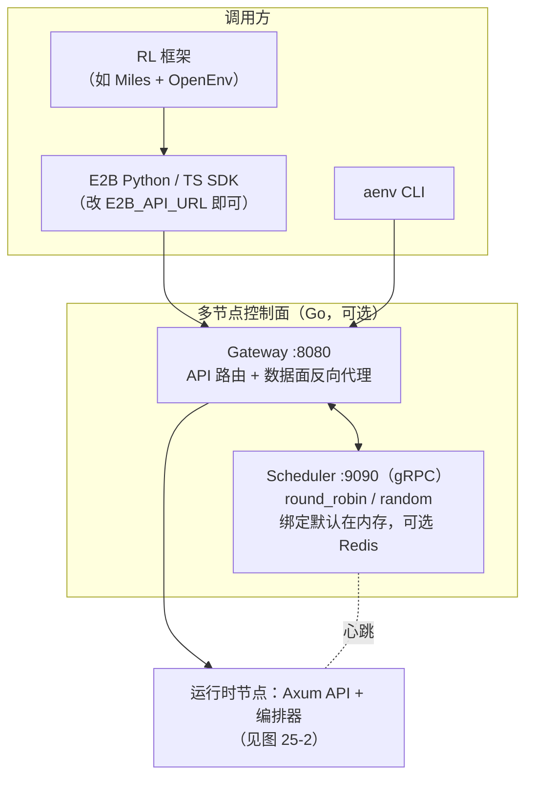
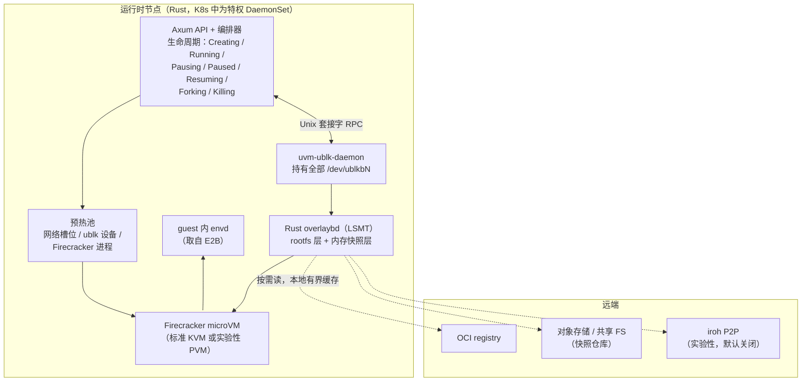
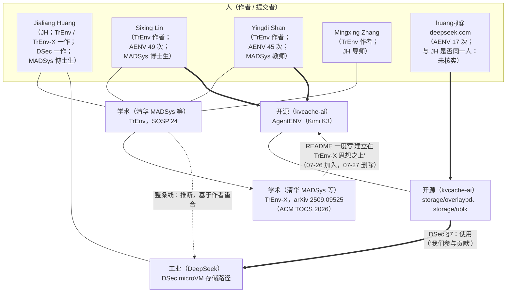

# 第 25 章　AgentENV 与清华 MADSys 谱系（TrEnv → AgentENV → DSec，推断）

## 本章导读

第 24 章拆解的 DSec 有论文，系统本身没有开源。本章的主角正好相反：AgentENV（AENV）是一个开源仓库，没有独立论文，生产侧的披露只有 Kimi K3 技术报告中的一节。两者构成全书第六部分的一对对照案例：DSec 以密度为中心，用四档后端覆盖异构负载；AgentENV 以暂停为中心，统一使用 microVM（微虚拟机），把工程投入集中在块设备层，再用 E2B 兼容 API 接入现有生态。两家竞争公司的系统，却在存储层用到了同一个仓库里的代码。

本章回答三个问题：AgentENV 是什么、谁在写、谁在用；它的生产数字该怎样引用；贯穿全书的推断线索——TrEnv → AgentENV → DSec 谱系（推断，基于作者重合）——有哪些证据、能推出什么。各节按案例章的固定结构展开：背景与负载、提交者结构、八层拆解、对手与遏制、生产数字与冲突，最后专设一节讨论谱系。机制细节已在第 9–13 章展开，本章只做整合与交叉引用。读完本章，读者应能：

- 说清 AgentENV 是什么、谁在写、由谁在生产中使用，以及哪些说法有一手依据、哪些没有；
- 按八层架构复述 AgentENV 的设计，并知道每一层的细节在哪一章；
- 并列引用 K3 报告与项目 README 中互相冲突的数字（6.5 倍与 9.6 倍、133/49 ms 与 <50/100 ms），并避开 fork 上限"16 个"、P2P"已用于生产"这类常见误读；
- 区分谱系证据中"可以核实的事实"与"笔者的推断"，掌握可以稳妥写和不能写的表述；
- 用一张 16 行的表对照 DSec 与 AgentENV 的两种设计哲学。

## 25.1　背景与负载

### 25.1.1　项目事实

AgentENV 的 README 第一句是："AgentENV（AENV）是一个大规模运行 Agent 环境的平台，为 **Kimi K3** 的 Agent RL 训练提供支撑"（AgentENV README；一手文档）。仓库位于 GitHub 的 kvcache-ai 组织下，许可证为 MIT，LICENSE 文件的版权行是"Copyright (c) 2026 AgentENV"，没有写任何公司名（AgentENV 仓库；一手文档）。

仓库的首次提交是 Sixing Lin 的"feat: Initial open-source release of AgentENV"（`8f028b1`），作者时间为 2026 年 7 月 25 日 11:18，同日 19:10 进入仓库（+0800），同日打出 v0.1.0 标签。此后的版本依次是 v0.1.1（08-03）、v0.1.2（08-10）、v0.1.3（08-20）、v0.2.0（09-03）、v0.2.1（09-11）、v0.2.2（09-18），以及本章核对时新出现的 v0.2.3（09-30）（AgentENV 标签；一手文档）。截至 2026 年 9 月 29 日，仓库共有 225 次提交；本章核对所用的 HEAD 是 2026 年 10 月 1 日的 `00351e2`，共 233 次提交，其中没有合并提交（AgentENV 提交历史；一手文档）。媒体的报道日期晚两天：MarkTechPost 与 OpenSourceForU 都在 7 月 27 日报道（OpenSourceForU 本次未回原文核对），AI Weekly 在 7 月 28 日发布、8 月 11 日更新（二手报道）。本书统一写作"2026 年 7 月 25 日开源（媒体于 7 月 27 日报道）"（附录 B C-19）。K3 技术报告 v1 也在 7 月 27 日提交到 arXiv，v2 于 8 月 7 日提交（arXiv 2607.24653 摘要页；一手文档）。

AgentENV 没有单独的论文或技术博客。关于它的生产使用，唯一的一手来源是 K3 技术报告 §5.3.2"Sandbox Infrastructure"。这一节的第一句话常被忽略："我们使用多种沙箱运行时来满足 Kimi K3 后训练与评测的多样化需求，包括传统的基于容器的运行时、GPU 沙箱运行时，以及最值得一提的、一个名为 AgentENV 的基于 microVM 的新沙箱运行时"（We employ multiple sandbox runtimes … including a traditional container-based runtime, a GPU sandbox runtime, and, most notably, a new microVM-based sandbox runtime called AgentENV；K3 §5.3.2；论文自述）。也就是说，**AgentENV 不是 K3 训练中唯一的沙箱**。紧接着一句写道："AgentENV 是与我们的合作伙伴共同开发的"（developed in collaboration with our partners），合作伙伴是谁，报告没有点名（K3 §5.3.2；论文自述）。Kimi 官方 X 帖的标题据检索为"We've open-sourced AgentENV in collaboration with …"，正文因 robots.txt 限制未能读取，合作方名单**未核实**。

K3 本身的规模，报告摘要写作"2.8T 参数的混合专家（MoE）模型，激活参数 1,040 亿（104 billion）"（K3 摘要；论文自述）。MarkTechPost 的"2.8 万亿参数"与之一致（二手报道）。

### 25.1.2　kvcache-ai 与 MADSys

kvcache-ai 组织的自我描述是："KVCache.AI 是 MADSys 与顶级产业合作方的联合研究项目，专注于高效的 LLM 服务"（KVCache.AI is a joint research project between MADSys and top industry collaborators, focusing on efficient LLM serving），组织页列出的联系邮箱是 `zhang_mingxing@mail.tsinghua.edu.cn`，网站指向清华大学 MADSys 主页（kvcache-ai 组织页，2026-10-03 读取；一手文档）。组织旗下最知名的两个项目是 Mooncake（自述"Kimi 的服务平台"）和 KTransformers。MADSys 主页的教师名单依次列有 Yongwei Wu、Kang Chen（注明 2026 年调往北京大学）、Jinlei Jiang、Mingxing Zhang、Yingdi Shan、Jing Zheng；博士生名单列有 Jialiang Huang、Sixing Lin、Linzhi Zheng 等 33 人；项目列表把 AgentENV 列在 KVCache.AI 之下，描述为"一个大规模运行 Agent 环境的分布式平台"（MADSys 主页，2026-10-03 读取；一手文档）。

由此可以确认几件此前标为"未核实"的事：Mingxing Zhang 与 Yingdi Shan 列在 MADSys 主页的教师名单中；DSec 与 TrEnv 的第一作者 Jialiang Huang、AgentENV 提交最多的 Sixing Lin 和第四多的 Linzhi Zheng 列在博士生名单中；AgentENV 被 MADSys 当作自己的项目列出。中文社区（linux.do，2026-07-27）把 AgentENV 视为月之暗面与"清华 kvcache 团队（KTransformers 作者）"的联合发布，与同期开源的 FlashKDA、MoonEP 并列（二手报道；本次未回原帖核对）。这与 Mooncake 的模式相同：学术实验室牵头的组织，承载一家模型公司的生产基础设施（推断）。

本书不引用 AgentENV 或 kvcache-ai 各仓库的星标数。本书早期一次读取得到的"32 stars、7 forks"几乎可以肯定是过时的缓存渲染（附录 B X-01）。

### 25.1.3　负载：K3 报告给出的三条设计目标

K3 报告把 AgentENV 的设计目标归纳为三条，每一条都对应第 3 章的一个负载特征（K3 §5.3.2；论文自述）。

**高保真的隔离运行时。** 报告写道，Agent 越强、任务越难，探索就越激进，"甚至可能尝试 reward hacking（奖励投机）"；"在早期使用传统容器沙箱运行时的实验中，我们观察到若干由 Agent 的非预期操作引起的内核崩溃（kernel panic）和死锁"。另一方面，团队希望"尽可能允许探索"，复杂任务需要接近真实世界的环境，例如 Agent "应当能够随意挂载磁盘、运行容器，甚至启动虚拟机"。结论是："通过用 Firecracker 运行隔离的 microVM，AgentENV 提供了基于容器的运行时无法企及的隔离性与保真度。"这一条对应"执行不可信"（见第 2、3 章），也是 AgentENV 统一使用 microVM 的直接理由。

**灵活的生命周期。** 报告写道，暂停中的沙箱"不消耗内存或 CPU 资源"，因此可以在 Agent 等待模型推理结果时暂停，"而等待最多可占沙箱寿命的 98%"（which can account for as much as 98% of the sandbox lifetime）。这是第 3 章"稀疏"特征最极端的一个数据点（附录 B B03-10），也是本章把 AgentENV 概括为"以暂停为中心"的依据。

**高效率、高密度。** 报告写道："在我们的负载中，可能需要在几秒钟之内创建数万个沙箱，每个沙箱都带有一组独特的镜像"（tens of thousands of sandboxes, each with a unique set of images, may need to be created within seconds）。这一句同时说了突发与低扇出（见第 3 章）。

规模数字只有一句："在 Kimi K3 的整个训练与评测中，共在 1,505,678 个镜像上创建了 51,219,741 个沙箱"（K3 §5.3.2；论文自述）。平均每个镜像约 34 个沙箱（51,219,741 ÷ 1,505,678 ≈ 34.0；笔者推算），但平均数容易被少数高复用镜像拉高，不能与 DSec 的扇出中位数（容器 3、microVM 1）直接比较（见第 3 章）。这句话在报告中紧跟 AgentENV 的三条设计目标之后，但字面上说的是"K3 的训练与评测"，没有说这些沙箱都由 AgentENV 创建；而同一节开头说 K3 用了三类运行时。项目 README 把"150 万个镜像"直接写成 AgentENV 的生产规模，并链接到 K3 报告（AgentENV README；一手文档）。本书的写法是："K3 报告称其训练与评测共创建 51,219,741 个沙箱；AgentENV README 把其中的 150 万个镜像归于 AgentENV。"5,122 万是否全部出自 AgentENV，属于待确认问题（见 25.6.4 节）。

与 DSec 相比，K3 对负载的刻画是定性的。DSec 用 2026 年初一周的生产数据逐项量化了七个负载特征：寿命分布、CPU 稀疏度、镜像与 workspace 数量、扇出、访问比例（见第 3、24 章）；K3 报告只给出三个形容（数万、数秒、独特镜像）、一个上界（98%）和一组累计数。因此本章说"AgentENV 的设计与负载一致"，依据的是 K3 自己的叙述，而不是可以独立检验的分布数据。读者若想用 AgentENV 的设计论证自己的选型，应先按第 3 章的模板在自己的集群上采集同样的量（本书建议）。

## 25.2　提交者结构

AgentENV 的提交记录本身就是一条产业信息。表 25-1 按提交邮箱统计了主要提交者。

**表 25-1　AgentENV 主要提交者与邮箱域（截至 2026-09-29，225 次提交）**

| 提交者（git 署名） | 提交数 | 邮箱域 | 主要改动范围 | 备注 |
|---|---|---|---|---|
| Sixing Lin | 49 | qq.com | 全仓库；首次公开发布提交 | TrEnv、TrEnv-X 作者之一；列于 MADSys 主页博士生名单 |
| Yingdi Shan | 45 | GitHub noreply | 全仓库；版本发布、合并他人提交 | TrEnv、TrEnv-X 作者之一；列于 MADSys 主页教师名单 |
| huajq | 27 | mails.tsinghua.edu.cn | — | 清华邮箱；与 MADSys 博士生 Jinqi Hua 名字可对应（推断） |
| Linzhi Zheng | 21 | gmail.com | 文档、E2B 集成、guest 内存回收调优等 | 列于 MADSys 主页博士生名单 |
| huang-jl | 17 | deepseek.com | 15 次以 `storage/`（overlaybd、LSMT）为主（其中 4 次同时改动节点侧代码），2 次 CI 与 README | GitHub 归属账号 huang-jl（署名 Jialiang Huang，自述 MADSys 博士生、TrEnv 作者；账号自述） |
| Tao Lin | 7 | radixark.ai | 模板构建与 CLI 修复 | RadixArk 为 Miles 的开发方 |
| guozy18 | 5 | mails.tsinghua.edu.cn | — | 清华邮箱（guozy22@）；与 MADSys 博士生 Zhengyan Guo 名字可对应（推断） |
| Ruoqing He | 3 | moonshot.ai | — | 唯一的 moonshot.ai 邮箱 |
| 其余约 30 人 | 各 1–5 | alibaba-inc.com（2 人）、xiaomi.com、transwarp.io、inesa.com、xiaobangtouzi.com、nyu.edu 及个人邮箱 | 零散修复与文档 | 另有 1 次提交来自主机名 `Madsys-4-6.maas` |

注：依据本书对仓库的克隆统计（`git shortlog -sne`，截止 2026-09-29 的 225 次提交）。截至 HEAD `00351e2`（2026-10-01，233 次），Sixing Lin 为 50 次、Yingdi Shan 为 47 次，表中其余人不变；另新增 Qiliang Yuan（2 次）、yanxiang（1 次）两位贡献者和 2 次 dependabot 提交。按姓名与邮箱合并重复署名后，非机器人贡献者约 37 人（笔者统计）。"主要改动范围"一列仅对 huang-jl 逐次核对了改动路径。

这张表能读出三件事。

**第一，核心开发者是 MADSys 一侧。** 提交数最多的两位都是 TrEnv 与 TrEnv-X 的作者（TrEnv-X 作者名单；论文自述）。提交数前四位中，Sixing Lin 与 Linzhi Zheng 列于 MADSys 主页的博士生名单，Yingdi Shan 列于教师名单（MADSys 主页；一手文档）。Yingdi Shan 也是事实上的合入者：截至 9 月 29 日，作者与提交者不同的 168 次提交中有 143 次由 Yingdi Shan 合入（AgentENV 提交历史；笔者统计）。清华邮箱另有两位，按名字可分别对应博士生名单中的 Jinqi Hua 与 Zhengyan Guo（推断）。相比之下，moonshot.ai 邮箱只有 3 次提交。这不说明 Moonshot 投入少：公司员工常用个人邮箱提交，邮箱域只是下限（推断）。但它与"清华 MADSys 牵头、Moonshot 生产使用"的格局一致。

**第二，DeepSeek 的提交集中在存储层。** `huang-jl@deepseek.com` 的 17 次提交中，15 次以 `storage/` 目录为主（其中 4 次同时改动了节点侧的 `src/`、测试或 `Cargo.lock`），内容包括为 LSMTFile 引入 `index()` 与 `flatten_with_args()`、把可写上层封存为新层、对象存储后端、上传进度回调、本地文件与 io_uring 解耦、磁盘写满时预分配缓存块以避免 SIGBUS 等；另外 2 次是 CI 配置与 README 修改（AgentENV 提交历史；一手文档，笔者按提交标题与改动路径分类；附录 B B24-12）。

这里还要更正一个流传较广的说法："huang-jl 在公开发布之前（07-22）就提交过 overlaybd 代码。"07-22 是那次提交的作者日期（author date）；它的提交日期（commit date）是 2026-07-31，由 Yingdi Shan 合入，晚于 07-25 的公开发布。作者日期可以在本地任意设定，也可能只是代码在本地写成的时间，不能据此认定这项工作早于发布。按提交日期，huang-jl 最早的两次提交都在 7 月 26 日，即发布次日（AgentENV 提交历史；一手文档）。其中一次正是 25.6 节要讨论的"引用"小节。

**第三，竞争对手在底层开源协作。** 除 DeepSeek 外，RadixArk、阿里巴巴、小米、星环（transwarp）等公司邮箱都出现在提交记录里。两名 alibaba-inc.com 提交者中有一人署名 Yifan Yuan，与阿里 DADI（overlaybd 的源头）论文作者同名，是否同一人，本书未核实（见第 10 章"overlaybd 的三次迁移"边栏）。不过，个人以公司邮箱提交不等于公司采用：除了 DeepSeek（DSec 论文自述使用了其中的存储组件）和 RadixArk（仓库文档化了 Miles 集成）之外，没有任何一手证据表明其他公司在生产中使用 AgentENV。"很多大公司在用 AgentENV"一说没有来源（附录 B X-20）。

社区层面能看到的采用信号也很有限：GitCode 上有镜像，GitHub 上有若干分叉，另有一个名为 `dsh-agentenv-sandbox` 的第三方衍生项目，其作者也在 AgentENV 有提交（二手，未逐一核对）。这些信号说明有人在试用和改造，不说明有人在生产中大规模运行。对一个开源两个多月的基础设施项目来说，这并不意外；本书的判断是，AgentENV 目前唯一有一手证据的生产用户仍是 Kimi K3（推断）。

## 25.3　八层拆解

图 25-1 与图 25-2 是 AgentENV 的架构示意（分为控制面与运行时节点两张）。与 DSec 相比，它的结构简单得多：一个可选的多节点控制面，加上每台机器上的一个 Rust 节点服务；复杂度几乎都在节点服务与 ublk 守护进程之间的存储路径上。

**图 25-1　AgentENV 架构（一）：调用方与控制面**（示意图，依据 AgentENV `docs/src/internals/architecture.md`、`services.md` 与 README，HEAD `00351e2` 绘制）

**图 25-2　AgentENV 架构（二）：运行时节点与存储**（示意图，依据 AgentENV `docs/src/internals/architecture.md`、`services.md` 与 README，HEAD `00351e2` 绘制）

表 25-2 按八层汇总，后文逐层简述，细节见对应章节。

**表 25-2　AgentENV 八层拆解**

| 层 | AgentENV 的做法 | 主要来源 | 详见 |
|---|---|---|---|
| ① 接入与 API | E2B 兼容 HTTP API；guest 内 envd 取自 E2B；`aenv` CLI；Codex 用例 | README；`tools-image/`；`thirdparty/envd`（客户端） | 第 16 章 |
| ② 控制面 | Go gateway + scheduler；轮询或随机放置；绑定默认在内存中，可选 Redis 与只读调度副本；首版标为"原型" | 架构文档；部署文档 | 第 9 章 |
| ③ 节点运行时 | 每沙箱一台 Firecracker microVM；实验性 PVM；三类预热池 | README；PVM 部署文档 | 第 6 章 |
| ④ 镜像与存储 | Rust overlaybd（LSMT）+ ublk；本地有界缓存；registry/对象存储后端；实验性 P2P | 架构文档；配置参考 | 第 10 章 |
| ⑤ 状态管理 | 内存快照即块设备；增量暂停与 restack；同节点 fork（1–100）；经共享仓库跨节点冷恢复 | 架构文档；OpenAPI；配置参考 | 第 11 章 |
| ⑥ 密度与资源 | 同快照共享页缓存；guest DAMON_RECLAIM + balloon 空闲页上报；等待推理时暂停 | 架构文档；源码；K3 §5.3.2 | 第 13 章 |
| ⑦ 网络与出站 | 每沙箱独立网络栈；按 IP、CIDR、域名的出站策略，默认允许访问互联网 | 沙箱网络文档 | 第 14 章 |
| ⑧ RL 集成与完整性 | 文档化 Miles + OpenEnv 集成；K3 内部集成方式未披露 | `docs/src/use-cases/miles.md`；K3 §5.3.2 | 第 17 章 |

### 25.3.1　第①层　接入与 API：E2B 兼容

README 写道："AgentENV 提供 E2B 兼容的 HTTP API。把 `E2B_API_URL` 指向你的服务器，就能不改任何代码地使用标准 E2B Python / TypeScript SDK"（AgentENV README 与文档；一手文档）。兼容不只停留在协议层：guest 内负责命令执行、文件操作与健康上报的守护进程 envd 就取自 E2B：仓库的 `tools-image/` 从 `e2b-dev/infra` 按指定版本编译 envd，打进挂到每台 guest 上的只读 tools 驱动器；`thirdparty/envd/` 则是节点侧经 gRPC 与 envd 通信的 Rust 客户端库（AgentENV `tools-image/README.md`、`thirdparty/envd/README.md`；一手文档）。envd 端口为 49983（AgentENV `config/default.toml` 的 `control_plane_port`、安全沙箱认证文档；一手文档。MarkTechPost 的报道与之一致）。仓库另提供 `aenv` CLI（pull、build、start、exec、pause、resume、snapshot、fork 等），并有一个把 Codex 终端跑在沙箱副本上的用例（`aenv codex start`）。README 用醒目的警告框提醒："AgentENV 对 API 请求做认证，但不加密流量"，需要在可信网络中运行，或在反向代理处终结 HTTPS（AgentENV README；一手文档）。

用 E2B 协议换生态，是 AgentENV 最重要的产品决策。它让任何为 E2B 写的 Agent 框架、评测脚手架与 RL 连接器都能直接切换到自托管后端，代价是协议演进由 E2B 主导（推断）。bex.co 指出，E2B 兼容的安全沙箱实现"在发布后仍在公开评审中加固，维护者在合并前对令牌信任边界的处理提出了异议"（二手报道）。E2B 协议作为沙箱生命周期层事实标准的讨论见第 16 章。

### 25.3.2　第②层　控制面：薄而诚实

多节点部署在节点服务之前加一个 Go 写的 Gateway（HTTP :8080）和 Scheduler（gRPC :9090）。放置策略只有 `round_robin`（默认）与 `random`；沙箱到节点的绑定默认保存在内存中，由节点心跳重建；也可以改用 Redis 存储。服务说明写道："scheduler 的沙箱绑定存储可以在内存中，也可以由 Redis 支撑"；为了高可用，可以运行一个设置了 `scheduler.redis_addr` 的主 scheduler，外加若干以 `--query-only` 启动、读取同一 Redis 的只读副本，"这种 HA 模式有意只覆盖数据面"（AgentENV `services/README.md`，首版 `8f028b1` 即有；一手文档）。环境变量文档说明，不设 `SCHEDULER_REDIS_ADDR` 时"绑定在内存中，scheduler 重启即丢失"。Kubernetes 部署清单采用的正是默认配置，文档写道："沙箱绑定保存在内存中，因此 scheduler 应以单副本运行。重启后绑定会丢失"（AgentENV `docs/src/deployment/kubernetes.md`；一手文档）。运行时节点在 K8s 中以特权 DaemonSet 部署，scheduler 通过 EndpointSlice 发现节点。

首版文档把这一层明确标为原型："多节点控制面……是一个原型"（The multi-node control plane in `services/` is a prototype；首次提交 `8f028b1` 的架构文档；一手文档）。2026 年 8 月 3 日的提交 `b59881f`（"docs: remove control plane prototype label"）删去了这个标签，但设计本身没有实质变化（AgentENV 提交历史；一手文档）。笔者的判断是：开源版控制面不大可能就是 Moonshot 生产集群的调度器，K3 报告也没有描述生产调度（推断，未核实）。第 9 章把它作为"薄控制面"一端，与 DSec 的无状态控制面、K8s CRD 路线并列比较，并指出谱系线在控制面上断开（见第 9 章）。

### 25.3.3　第③层　节点运行时：只有 microVM

每个沙箱都是一台 Firecracker microVM，"拥有自己的内核、文件系统、进程和网络栈"（AgentENV `docs/src/concepts/overview.md`；一手文档）。所用 Firecracker 不是上游原版：KVM 模式下载 kvcache-ai 自维护的补丁版 v1.15.1-patch-v1，PVM 模式下载 firecracker-next v1.17.0-next.1（AgentENV `config/deps_manifest.toml`；一手文档；见第 6 章）。运行要求是 Linux 6.8 以上内核与 `/dev/kvm`。对没有嵌套虚拟化的云主机，仓库提供实验性的 PVM 模式，依据的是 SOSP'23 论文 *PVM: Efficient Shadow Paging for Deploying Secure Containers in Cloud-native Environment*。部署文档提醒，PVM"尚未合入主线 Linux 内核"，需要先安装 kvcache-ai 单独发布的 PVM 宿主内核包并重启；随附的 guest 内核基于 `virt-pvm/linux` 的 `pvm-612` 分支，版本 6.12.33（AgentENV `docs/src/deployment/pvm.md`；一手文档）。这是本书所见唯一一个在开源 Agent 沙箱中提供"云 VM 内跑 microVM"方案的项目，也是第 28 章"云上与嵌套虚拟化"开放问题的一个具体答案（推断）。

节点上有三类预热池：网络槽位、ublk 块设备，以及预先拉起的 Firecracker 进程。恢复时可以直接接管一个"网络槽位 + Firecracker 进程"对，从而"把进程拉起与 API 套接字等待移出恢复的关键路径"（AgentENV 架构文档；一手文档）。microVM 的启动与隔离原语见第 6 章。

### 25.3.4　第④层　镜像与存储：系统的重心

架构文档开宗明义："它的核心是一个存储子系统，提供可挂进 VM 的分层块设备，以及基于 ublk 的内存快照恢复"（AgentENV 架构文档；一手文档）。overlaybd 被用 Rust 重写为 LSMT 分层格式，以 zstd（level 3）压缩并带随机访问跳表；ublk 把它暴露为 `/dev/ublkbN`，所有设备由一个长驻的 `uvm-ublk-daemon` 进程持有；后端可插拔，包括本地文件、OCI registry 与对象存储；本地盘是有界缓存，README 称"镜像与快照的总占用可以超出本地盘容量几个数量级"（定性说法，无具体数字）。K3 报告对这一层的概括是："我们采用 OverlayBD 作为镜像格式，配合自研的 ublk 驱动实现、存储层共享与 P2P 传输，在大规模下实现了亚秒级的启动延迟"（K3 §5.3.2；论文自述）。

第 10 章已经把这条块级路径与 DSec 的文件级路径（EROFS + 3FS）逐项对照，包括缓存默认值、overlaybd 原生制品的发现、P2P 门面的超时设置（见第 10 章 10.3.2 节）。本章只强调一点：DSec 论文所说"我们参与贡献的 Rust 版 OverlayBD"与"我们的 Rust 用户态 ublk 库"，指的正是这一层的代码（见 25.6 节）。

### 25.3.5　第⑤层　状态管理：内存快照也是块设备

AgentENV 在这一层有三个关键设计（AgentENV 架构文档；一手文档。详见第 11 章 11.3.2 节）：

- **增量暂停。** Firecracker 只写出仅含 vCPU 与设备状态的差量快照，AgentENV 查询脏页与存在页的范围，用 `process_vm_readv` 读出，写成一个新的 overlaybd 内存层，叠在父层之上；磁盘侧用 `create_snapshot_and_restack()` 把当前可写上层封存为新的下层，再打开一个空的可写上层。
- **用块设备而不是 userfaultfd 恢复内存。** 叠好的内存层作为只读 ublk 设备，以 File 内存后端交给 Firecracker mmap，首次写入时写时复制到匿名内存；仓库保留了一份 userfaultfd 实现（`storage/uffd-core`），但已排除在构建之外。
- **fork 与快照。** `POST /sandboxes/{id}/fork` 在同一节点上把运行中的沙箱克隆为若干子沙箱，`count` 的取值范围为 1–100（见 25.5.3 节）；持久化快照可存入兼容 S3 的对象存储或共享分布式文件系统。

K3 报告给出了这些机制在 RL 中的三种用法：暂停与恢复用于等待推理；fork"从原沙箱的确切状态创建一个新沙箱，同时保持原沙箱继续运行，可用于无副作用的奖励评判"（useful for reward judging without side effects）；快照"可以定期保存，用于错误恢复"（K3 §5.3.2；论文自述）。第二种用法的价值在于：在原沙箱的副本上跑测试，评判过程不会污染还要继续交互的现场。DSec 论文没有说明奖励计算放在哪里（见第 24 章 24.3.8 节），两家在这一点上无从比较。

此外，文档披露了经共享快照仓库的**跨节点冷恢复**：配置参考写道，发布快照时内存层与增量读写层"在上传时压缩一次，减少跨节点恢复（cross-node resume）的网络字节"（该表述首见于 2026-09-08 合入的提交 `e83b1e7`；AgentENV 配置参考；一手文档）。文档没有给出跨节点恢复的延迟，也没有跨节点 fork 或在线迁移。

### 25.3.6　第⑥层　密度与资源：等待即节省

AgentENV 的密度手段有三类。其一是共享：从同一快照启动的沙箱按引用计数共用一个内存 ublk 设备，"使 Linux 页缓存可以在使用同一内存镜像的所有沙箱之间复用"（AgentENV 架构文档；一手文档）。其二是回收：README 称"内存气球把可回收的 guest 内存还给宿主"；源码中 balloon 的配置为 `amount_mib = 0`、开启空闲页上报（free page reporting）、`deflate_on_oom = true`，即只做空闲页上报，不做目标充气（AgentENV `src/sandbox/firecracker/instance.rs`；一手文档；附录 B B13-30）。此外，默认的 guest 内核命令行开启了 DAMON_RECLAIM（`damon_reclaim.enabled=Y`，`skip_anon=Y`，即只回收冷的文件页），这一设置自首版即在默认配置中，9 月 15 日合入的提交 `746f49b` 调整了它的参数（AgentENV `config/default.toml`、配置参考；一手文档）。9 月 30 日的提交 `59b36a4` 又加入了空闲页上报粒度的设置与调优指南（AgentENV 提交历史；一手文档）。其三是暂停：暂停中的沙箱不占内存与 CPU，而等待最多占寿命的 98%。若每次等待都暂停，同时活跃的沙箱最多只占同时存在的约 2%，理想的时间复用上界约 50 倍（1 ÷ (1 − 98%)；笔者推算，忽略暂停开销与活跃时段重叠；附录 B B03-24、B13-24）。实际报告的超售比远低于这个上界，而且两个来源互相冲突（见 25.5.2 节）。第 13 章把这三类手段与 DSec、TrEnv-X、AgentZip 等并列讨论（见第 13 章）。

### 25.3.7　第⑦层　网络与出站

每个沙箱有独立的网络栈。出站策略分两级：节点级的 `always_denied_cidrs` 在沙箱策略之前生效，不可被覆盖；沙箱级有 `allow_internet_access`（默认 `true`）、`network.allowOut`（可写 IP、CIDR 或域名模式）与 `network.denyOut`（只支持 IP 与 CIDR），且策略可以在运行中替换（AgentENV `docs/src/concepts/sandboxes/networking.md`；一手文档）。也就是说，**开源版的默认姿态是"允许访问互联网"**，收紧要由调用方显式设置。仓库的网络设计文档还描述了出站代理（`docs/src/internals/networking.md`，本章未逐条核对）。K3 训练中实际使用的出站策略，报告没有披露。与 DSec 按任务阶段放行的每沙箱 eBPF 白名单相比（见第 24 章），这一层是 AgentENV 披露最少的部分之一（见 25.4 节、第 14 章）。

### 25.3.8　第⑧层　RL 集成与完整性

仓库文档化的 RL 集成只有一个：RadixArk 的 RL 框架 Miles。示例沿用 Miles 的 OpenEnv 配方，用 GRPO 在 Terminal-Bench-2 上训练 GLM-4.7-Flash；"OpenEnv 提供配方所用的任务交互与评估接口，AgentENV 为每个 episode 运行隔离的沙箱"；接入方式就是设置 `E2B_API_URL`、`E2B_API_KEY` 等环境变量（AgentENV `docs/src/use-cases/miles.md`；一手文档）。这个例子正好把两层事实标准串在一起：OpenEnv 定义环境语义（reset/step/state），E2B 协议定义沙箱生命周期（见第 16、17 章）。

Kimi 内部的 RL 框架怎样调度 AgentENV、暂停由谁触发、rollout（一次策略与环境交互直至结束的完整采样过程，也称轨迹展开）状态由谁持有，K3 报告都没有说明。报告引言提到，百万 token 级的 Agent RL 系统结合了部分 rollout、外部 KV cache 保留、自适应限流与"可恢复的 microVM 沙箱"，以保存长寿命的模型与环境状态；§4.1.2 写道，生成阶段在一定比例的轨迹完成后即暂停，"被暂停的 rollout 进入队列，在下一次迭代开始时优先恢复，这由我们的沙箱基础设施（§5.3.2）支撑"（K3 引言、§4.1.2；论文自述）。也就是说，AgentENV 的暂停在 K3 中至少服务于两种等待：单个轮次内等待模型推理，以及跨迭代等待训练步完成。具体协议没有披露。AI Weekly 的评语也指向这一点："报道没有说明 AENV 在 Moonshot 的 K3 训练循环中实际如何使用、集群有多大，以及经济性与 E2B 或超大规模云相比如何"（二手报道）。

**自托管经济学。** bex.co（2026-09-22）从产品侧给了一个外部视角：E2B 默认的 2 vCPU / 4 GiB 沙箱"约每小时 0.166 美元，约每月 121 美元"；一台每月 97.30 欧元的 Hetzner AX42 大约在"每月 600–700 沙箱小时"时与之持平；但自托管要自己承担模板仓库、快照存储、TLS 终结、跨节点的 KVM 容量规划与用量计量（bex.co；二手报道）。这是对单机自托管的粗算，不涉及训练集群规模的经济性，第 22 章另有讨论。

## 25.4　对手与遏制

K3 报告是少数直接把"模型作为对手"写进沙箱设计理由的一手材料：reward hacking 与容器中的内核崩溃、死锁被并列为选择 microVM 的原因（见 25.1.3 节）。它的遏制思路可以概括为"给足探索空间，靠更强的边界兜底"：允许 Agent 在沙箱里挂盘、跑容器、起虚拟机，把爆炸半径限制在一台有独立内核的 microVM 内。用第 19 章的分类说，这一思路针对的是打崩内核、拖死宿主这类破坏执行环境的行为（第 19 章 19.2.1 节称"非故意的破坏"），对**取回型**行为（从 git 历史、平台日志、包代理拿答案）基本无能为力，后者靠的是出站策略与环境构建（见第 19 章）。

就公开材料而言，AgentENV 一侧缺三样东西。第一，没有任何 reward hacking 的实例记录或发生率，K3 报告只说"甚至可能尝试"。第二，开源版出站默认允许访问互联网（见 25.3.7 节），K3 训练中的实际策略未披露。第三，fork 用于"无副作用的奖励评判"能防止评判污染现场，但如果评判所依赖的测试文件在原沙箱里就能被模型读到或改动，fork 不能解决这个问题（推断）。与之对照，DSec §6.4 记录了具体的攻击行为，§6.5 给出 AppArmor 与阶段化 eBPF 白名单等对策，并坦承局限（见第 24 章 24.5 节）。两家的差别不是谁更安全，而是披露的层次不同：K3 披露了"为什么选 microVM"，DSec 披露了"在边界之内模型做了什么"。

还有一处值得追问的张力。K3 希望 Agent "能够随意挂载磁盘、运行容器，甚至启动虚拟机"，这意味着 guest 内需要相应的特权与虚拟化能力；开源文档没有说明在 AgentENV 沙箱里运行容器或嵌套虚拟机的方式，PVM 文档讨论的是宿主侧缺少嵌套虚拟化时如何运行 microVM，而不是 guest 内（AgentENV 文档；一手文档）。K3 的生产环境怎样满足这一点，报告没有说明。保真度越高，guest 内的攻击面越大，microVM 边界承担的压力也越大（推断）。

fork 与快照也带来新的对手问题。第 11 章讨论过模板 fork 之后的唯一性（随机数种子、密钥、网络标识）与"语义回滚攻击"（恢复检查点后重放动作、复活权限）（见第 11 章 11.6 节）。在 RL 场景中，fork 出来用于评判的子沙箱继承了父沙箱的全部内存与文件状态；如果模型能在父沙箱中留下只在评判时触发的程序，评判就可能被操纵（推断）。K3 报告与 AgentENV 文档都没有讨论这类问题。

## 25.5　生产数字与冲突

AgentENV 的数字有两个一手来源：K3 技术报告与项目 README。它们的口径不同，有两处直接冲突；媒体又在其间沿用了已经更正的文档。表 25-3 把它们并列。

**表 25-3　AgentENV 生产数字：来源、口径与冲突**

| 指标 | K3 技术报告（2026-07） | AgentENV README / 文档 | 媒体 | 本书处理 |
|---|---|---|---|---|
| 累计规模 | 训练与评测共创建 51,219,741 个沙箱、1,505,678 个镜像（未写明全部出自 AgentENV） | "生产中 150 万个镜像"（链接 K3 报告） | Daily Dose of DS 等转述 | 并列；归属待确认 |
| 检查点 / 暂停 | 增量检查点"最低可达"133 ms | 暂停 < 100 ms；增量快照 < 100 ms | MarkTechPost 沿用 README | 口径不同，并列（C-03） |
| 恢复 | "最低可达"49 ms | 启动或恢复 < 50 ms | 同上 | 同上 |
| 内存超售比 | "真实负载中最高 6.5×"，归因于写时复制内存与页缓存优化 | "生产中 9.6×"，归因于内存气球（2026-08-10，提交 `c561be6`） | bex.co 沿用 9.6× | 冲突，并列（C-01） |
| 启动 | "大规模下亚秒级启动延迟" | — | — | 无分布与条件 |
| P2P | 生产采用"P2P 传输" | "实验性：P2P 尚未在生产中测试" | — | 张力，并列（C-34） |
| fork 上限 | — | 代码与 OpenAPI 自首版起为 1–100；首版文档误写 16，2026-08-26 更正 | MarkTechPost、bex.co 写"最多 16 个" | 写 100（C-02） |
| 跨节点 | — | 经共享快照仓库的跨节点冷恢复（2026-09-08 起），无延迟数字 | — | 写"已披露冷恢复，无数字" |
| 等待占比 | 最多占沙箱寿命 98% | — | — | 直接引用 |

注：K3 报告依据 §5.3.2 PDF 全文逐字核对；README 与文档依据 HEAD `00351e2`。"最低可达"对应原文"as low as"。所有数字均为当事方自报，未经独立测试；AI Weekly 明确指出"性能数字来自项目本身，而非独立基准测试"（二手报道）。

### 25.5.1　延迟：上界与下界

K3 报告写道，增量检查点"只保存自上次检查点以来被写脏的内存页"，"使检查点与恢复延迟最低可达 133 ms 与 49 ms"（K3 §5.3.2；论文自述）。README 写道："以快照为后端的环境在 50 ms 以内启动或恢复，在 100 ms 以内暂停"；增量快照"即使在大量磁盘修改下也能在 100 ms 以内完成"（AgentENV README；一手文档，项目自报）。两组数字不能互相替代：README 是没有说明条件的宣称上界，K3 报告是"最低可达"的下界，后者也没有说明测量条件。二者在恢复上吻合（<50 ms 与 49 ms），在检查点上不吻合（<100 ms 与 133 ms）。本书正文优先引用 K3 报告的数字并写明"最低可达"（附录 B C-03、X-29）。两份来源都没有分布（中位数、P99）、快照大小与脏页比例。第 11 章把它们与 DeltaBox、E2B、DSec（无数字）放在同一张延迟对照表中（见第 11 章 11.4.6 节）。

### 25.5.2　超售比：两个数字，两种归因

这是 AgentENV 最需要小心引用的数字。K3 报告的原句是："我们用写时复制内存与页缓存优化进一步降低内存用量，在真实负载中实现了最高 6.5 倍的内存超售比"（We further reduce memory usage with copy-on-write memory and page-cache optimizations, achieving a memory overcommit ratio of up to 6.5× in real workloads；K3 §5.3.2；论文自述）。README 在 2026 年 8 月 10 日的提交 `c561be6`（"docs: add production scale metrics"）中写道："内存气球把可回收的 guest 内存还给宿主，随着环境运行时间变长、彼此分化，在生产中实现了 9.6 倍的内存超售比"（AgentENV README；一手文档，项目自报）。

两个数字的差别不只是大小。第一，归因的机制不同：K3 归于写时复制与页缓存（共享族），README 归于内存气球（回收族）。第二，限定词不同："最高"（up to）与"生产中"（in production）。第三，时间不同：K3 报告 v1 为 7 月 27 日，README 为 8 月 10 日；6.5 倍首见于报告的哪个版本，本书未核实。第四，开源默认配置的回收手段只有 balloon 空闲页上报与 guest 内的 DAMON_RECLAIM，没有目标充气（见 25.3.6 节）；这与"气球带来 9.6 倍"之间是否矛盾，取决于生产配置是否与开源默认值相同，后者未披露（推断）。把两个数字放到 25.3.6 节的理论上界旁边看：6.5 倍约为理想时间复用上界（约 50 倍）的 13%，9.6 倍约为 19%（6.5 ÷ 50、9.6 ÷ 50；笔者推算）。差距本身不奇怪，暂停与恢复有开销，活跃时段会重叠，节点还要为突发留余量；但它提醒读者，"等待占 98%"不能直接换算成"能省 98% 的内存"。两个数字都没有给出算法：分母是物理内存还是可分配内存，分子是沙箱声明内存还是驻留内存，统计的是峰值时刻还是时间平均，均未说明（第 13 章"超售比的三种算法"边栏）。本书的写法是（附录 B C-01）："K3 技术报告称借助写时复制内存与页缓存优化，真实负载下内存超售比最高 6.5 倍；项目 README（2026-08-10）称借助内存气球，生产中达 9.6 倍。两个数字均为自报，口径未说明，归因机制也不同。"

### 25.5.3　两处已更正的误读

**fork 上限从来不是 16。** 首次提交 `8f028b1`（2026-07-25）的文档写的是"最多 16 个子沙箱"，但同一提交的 OpenAPI 定义已把 fork 的 `count` 限定为 `minimum: 1`、`maximum: 100`，生成代码中的校验同样是 1–100；提交 `f57e9c6`（2026-08-24 编写、08-26 合入）把文档改成与代码一致（AgentENV 提交历史；一手文档）。变化的是文档口径，上限本身自首版起就是 100。MarkTechPost（07-27）写"最多 16 个独立子沙箱"，bex.co（09-22）在文档更正之后仍沿用 16（二手报道）。"fork 上限随版本从 16 提高到 100"的叙事不成立（附录 B C-02、X-31；第 11 章"fork 上限：文档与代码不一致"边栏）。fork 仅限同一节点。另外，E2B 自己的控制面规范于 2026-07-15 加入了同路径、`count` 同为 1–100 的 fork 端点（07-21 在 changelog 公告），早于 AgentENV 首发（07-25）；两者是否有意对齐未见说明（e2b-dev/infra 规范与 E2B changelog；一手文档；是否对齐为推断，见第 16 章）。

**P2P 是否用于生产，两方说法不一。** K3 报告把"P2P 传输"列为实现亚秒级启动的手段之一；开源仓库的配置参考则写道："实验性：P2P 尚未在生产中测试。除非部署方接受这一运维风险，否则在生产中请保持关闭"（AgentENV 配置参考 `[p2p]`；一手文档）。可能的解释是生产集群使用的 P2P 实现或版本与开源仓库不同，但双方都没有说明。本书写作"K3 报告称采用了 P2P 传输；开源仓库文档称 P2P 尚未经生产测试"（附录 B C-34）。

> **边栏：方法——把 README 当作带日期的来源**
>
> AgentENV 的 README 不是一份静态文件，而是一个随提交演变的来源。本章涉及的几处关键文字都有明确的"出生日期"：2026-07-25 首版写"fork 最多 16 个子沙箱"（文档）而代码为 100；2026-07-26 加入、07-27 删除"建立在 TrEnv-X 思想之上"的引用小节；2026-08-03 删除控制面的"原型"标签；2026-08-10 加入"生产中 9.6 倍超售"与"生产中 150 万个镜像"；2026-08-26 把 fork 文档更正为 1–100；2026-09-08 起配置参考出现"跨节点恢复"（AgentENV 提交历史；一手文档）。媒体在 7 月 27 日的报道依据的是首版文档，bex.co 在 9 月 22 日的报道则混用了 8 月 10 日加入的 9.6 倍与已经更正的 16。
>
> 对开源基础设施，本书采用三条引用规则（本书建议）。第一，引用 README 或文档中的数字时，写明"截至某日、某提交"，必要时给出提交号。第二，文档与代码不一致时，以 API 定义或代码为准（如 fork 上限以 OpenAPI 的 `maximum: 100` 为准）。第三，已删除的文字可以引用，但要写明"一度出现、某日删除"，不能当作现行表述。这三条用到的工具都很朴素：`git log -S` 找某段文字的加入与删除，`git log --format` 区分作者日期与提交日期，`git shortlog -sne` 统计提交者。作者日期由提交者本地设定，不能用来证明时间先后；提交日期也可以被改写，但在被合入主干时由合入者生成，更接近"何时进入仓库"。

### 25.5.4　K2、K2.5 与 OK Computer

AgentENV 这个名字只与 K3 绑定。K2 技术报告描述的沙箱基础设施是 Kubernetes 上"超过 10,000 个并发沙箱实例"（Kimi K2 报告 §3.2.1；论文自述；附录 B B26-01）；K2.5 的"10 万"是并发 Agent 任务，不是沙箱数（见第 26 章）。没有一手证据表明 K2、K2.5 Agent Swarm 或 OK Computer 产品使用了 AgentENV，也没有证据表明 AgentENV 是它们所用系统的演进版本。DSec 论文把"Kimi-K2.5 的 Agent Swarm"列为推理侧系统的例子（DSec §9；论文自述），这是 DSec 论文中唯一一处点名 Kimi 的地方（§7 另外链接了 AgentENV 仓库，但没有提到 Kimi）。

## 25.6　谱系：TrEnv → AgentENV → DSec（推断，基于作者重合）

本书第三部分各章的"谱系"边栏、第 24 章开篇边栏都引向这里。这条线是：serverless 内存模板（TrEnv）→ 开源 Agent 沙箱（AgentENV）→ 生产级训练沙箱（DSec）（推断，基于作者重合）。本节逐条列出证据，标明每条的性质，再给出可以稳妥写的表述、不能写的表述与待确认的问题。

### 25.6.1　证据链

**表 25-4　谱系证据链**

| # | 证据 | 来源 | 性质 | 连接的环节 |
|---|---|---|---|---|
| E1 | TrEnv（SOSP'24）与 TrEnv-X 的作者包括 Jialiang Huang、Sixing Lin、Yingdi Shan、Mingxing Zhang 等 14 人；TrEnv-X 标注 Jialiang Huang 的单位为"清华大学与阿里巴巴集团"，另有 5 位作者标注阿里巴巴单位 | TrEnv-X v2 HTML 作者块；TrEnv BibTeX | 论文自述 | TrEnv 的人 |
| E2 | "Jialiang Huang 是 Mingxing Zhang 指导的博士生，他在 DeepSeek-AI 实习期间、在 Liyue Zhang 指导下参与贡献了这项工作"（He contributed to this work during an internship at DeepSeek-AI） | DSec 作者脚注 | 论文自述 | TrEnv 的人 → DSec |
| E3 | Sixing Lin（49 次）、Yingdi Shan（45 次）是 AgentENV 提交最多的两位 | AgentENV 提交历史 | 一手文档 | TrEnv 的人 → AgentENV |
| E4 | kvcache-ai 自述为"MADSys 与顶级产业合作方的联合研究项目"，联系邮箱为 Mingxing Zhang 的清华邮箱；MADSys 主页教师名单列有 Mingxing Zhang、Yingdi Shan，博士生名单列有 Jialiang Huang、Sixing Lin、Linzhi Zheng，项目列表列有 AgentENV | kvcache-ai 组织页；MADSys 主页 | 一手文档 | 组织归属 |
| E5 | 2026-07-26，`huang-jl@deepseek.com` 在 README 中加入"研究背景与引用"小节："AgentENV 建立在我们 TrEnv-X 研究背后的部分思想与动机之上，并整合了它们"，附 TrEnv-X 与 TrEnv 的 BibTeX；次日的提交 `c748877` 在一次文档改写中删去该小节 | AgentENV 提交 `9fbcf19`、`c748877` | 一手文档（已删除） | TrEnv-X → AgentENV |
| E6 | DSec §7："我们使用我们参与贡献的 Rust 版 OverlayBD，以及我们的 Rust 用户态 ublk 库……这些存储组件已在 https://github.com/kvcache-ai/AgentENV/tree/main/storage/overlaybd 开源" | DSec §7 | 论文自述 | AgentENV 代码 → DSec |
| E7 | `huang-jl@deepseek.com` 在 AgentENV 有 17 次提交，15 次以 `storage/` 为主 | AgentENV 提交历史 | 一手文档 | DeepSeek 一侧参与存储层 |
| E8 | DSec §9 把 TrEnv 与 SAND、REAP 并列为"为短命、无状态函数优化"的 serverless 系统 | DSec §9 | 论文自述 | 同一作者对前作的定位 |
| E9 | K3 报告称 AgentENV"与我们的合作伙伴共同开发"，未点名 | K3 §5.3.2 | 论文自述 | Moonshot 一侧 |
| E10 | 机制相似：TrEnv 的 mm-template、AgentENV 的共享内存快照设备、DSec 的 pmem DAX，都在回答"许多执行环境怎样共用一份内存" | 第 13 章 | 推断 | 思想传承 |

注：E5 是本章核对中新发现的证据。按提交日期，该小节在仓库中存在约 21 小时（2026-07-26 23:30 进入仓库，2026-07-27 20:46 被删除，均为 +0800；按作者日期则为 07-26 21:29 至 07-27 17:24）。删除提交的作者为 Linzhi Zheng，由 Yingdi Shan 合入。删除它的提交标题是"docs: improve E2B, configuration, and on-demand loading guides"，同时改写了多份文档，提交说明没有提到删除原因。

E5 需要单独说明。它是整条线上唯一一处**项目一方的文字陈述**，而不是作者名单或代码的旁证：AgentENV"建立在我们 TrEnv-X 研究背后的部分思想与动机之上"（AgentENV builds on and integrates some of the ideas and motivation behind our TrEnv-X research）。"我们"出自一位 DeepSeek 邮箱提交者之手，所附 BibTeX 的引用键是 `huang2026trenvx`，第一作者是 Jialiang Huang。这让"huang-jl 即 Jialiang Huang"的可能性大大增加，但仍不等于确认（推断）。这段 BibTeX 还顺带填补了一个空白：它把 TrEnv-X 登记为 *ACM Transactions on Computer Systems*（TOCS）的文章，状态为"Just Accepted"，DOI 10.1145/3805475（AgentENV 提交 `9fbcf19`；一手文档，属作者自述）。Crossref 记录显示该文已正式刊出：ACM TOCS 44(3): 1–39，2026-07-27 在线，2026-08-31 印刷，"Just Accepted"已过时。

同样要看到 E5 的局限。第一，它说的是"思想与动机"，不是代码来源；AgentENV 的 overlaybd、ublk、Firecracker 集成与 TrEnv 的 mm-template（内核对象，依赖 CXL/RDMA 远端内存）在实现上并不相同（见第 13 章）。第二，它在一天之内被删除，删除原因不明。可能只是文档精简，也可能是项目对外表述的调整，本书不作猜测。引用时应写明"一度出现、次日删除"。

图 25-3 把这些证据画成两类连线：人和代码。

**图 25-3　TrEnv → TrEnv-X → AgentENV → DSec 谱系**（示意图，依据表 25-4 的证据绘制。粗线为一手可核实的代码或提交关系，细实线为作者关系，虚线为推断或未确认的关系；整条谱系为推断，基于作者重合）

### 25.6.2　可以稳妥写的表述

以下表述中，前七条有一手来源，可以直接使用（括注来源），第八条是须带推断标注的结论：

1. "DSec 的 microVM 存储路径使用了 AgentENV 仓库中开源的 Rust OverlayBD/ublk 组件（论文称'我们参与贡献'）。"（DSec §7）严格地说，"我们参与贡献"在原文中修饰的是 Rust 版 OverlayBD，ublk 库被称为"我们的"。
2. "DSec 第一作者 Jialiang Huang 也是 TrEnv（SOSP'24）与 TrEnv-X 的第一作者；DSec 脚注称他是 Mingxing Zhang 指导的博士生，在 DeepSeek 实习期间参与贡献了 DSec；MADSys 主页的博士生名单列有他。"（DSec 脚注；TrEnv-X 作者块；MADSys 主页）
3. "AgentENV 提交最多的两位开发者 Sixing Lin 与 Yingdi Shan 都是 TrEnv 的作者。"（提交历史；作者名单）
4. "AgentENV 托管在 kvcache-ai 组织下，该组织自称清华 MADSys 与产业合作方的联合研究项目；MADSys 主页把 AgentENV 列为自己的项目。"（组织页；MADSys 主页）
5. "邮箱为 `huang-jl@deepseek.com` 的提交者在 AgentENV 有 17 次提交，其中 15 次以存储目录为主。"（提交历史）
6. "Jialiang Huang、Sixing Lin、Linzhi Zheng 列于 MADSys 主页的博士生名单，Mingxing Zhang、Yingdi Shan 列于教师名单。"（MADSys 主页）
7. "AgentENV 的 README 曾于 2026 年 7 月 26 日加入一段文字，称 AgentENV 建立在'我们 TrEnv-X 研究'的部分思想与动机之上，该段次日被删除。"（提交 `9fbcf19`、`c748877`）
8. "笔者据作者重合与上述旁证推断，存在一条 TrEnv → AgentENV → DSec 的学术到工业的传承线（推断，基于作者重合）。"

### 25.6.3　不能写的表述

1. "DSec 基于 AgentENV 构建"或"DSec 是 AgentENV 的生产版"。DSec 是独立系统，它的控制面、容器路径、EROFS 组合、密度机制与 RL 集成都与 AgentENV 无关；DSec 整体没有开源（见第 24 章）。
2. "DeepSeek 使用 AgentENV"。DeepSeek 使用的是托管在 AgentENV 仓库里的存储组件，不是 AgentENV 平台。
3. "AgentENV 是 TrEnv 的开源实现"或"AgentENV 的代码来自 TrEnv"。E5 只说"思想与动机"，而且已被删除。
4. "huang-jl 就是 Jialiang Huang"。可能性很高，但未经本人确认。
5. "DeepSeek 工程师在 AgentENV 公开发布之前就提交了代码"。按提交日期，huang-jl 最早的提交在发布次日（见 25.2 节）。
6. "这条谱系是当事方的说法"。除 E5（已删除）外，没有任何当事方把三者描述为一条线。
7. "Moonshot 与 DeepSeek 合作开发了 AgentENV"。K3 报告的"合作伙伴"未点名；DeepSeek 邮箱的提交属于个人贡献，DSec 论文也只说"参与贡献"。
8. "很多大公司在用 AgentENV"（附录 B X-20）。

### 25.6.4　待向作者确认的问题

本书建议就以下问题向 AgentENV 维护者、DSec 作者或 Moonshot 求证（本书建议）：

1. `huang-jl@deepseek.com` 是否即 DSec 与 TrEnv 的第一作者 Jialiang Huang？已部分解决（账号自述层面）：GitHub 把这些提交归属到账号 huang-jl，该账号署名 Jialiang Huang，自述为清华 MADSys 博士生、TrEnv（SOSP）作者；这是账号持有人的自述，不是第三方认证。（TrEnv-X 给出的 Jialiang Huang 联系邮箱是 `huangjl22@mails.tsinghua.edu.cn`，与之没有直接关联。）
2. README 中"建立在 TrEnv-X 思想之上"的引用小节为何在次日删除？这一表述是否仍代表项目的立场？
3. Rust 版 OverlayBD 由谁移植？DSec 生产所用的存储组件与仓库版本是否一致？DSec 链接只指向 `storage/overlaybd`，`storage/ublk` 与 `storage/ublk-daemon` 是否也在其中？
4. K3 报告所说的"合作伙伴"是哪些机构？Kimi 官方 X 帖的合作方名单是什么？
5. 51,219,741 个沙箱是否全部由 AgentENV 创建，还是包括容器与 GPU 沙箱运行时？
6. 6.5 倍与 9.6 倍超售比各自的统计口径、时间范围与机制是什么？
7. 生产集群是否使用 P2P？与开源版的 P2P 实现是否相同？
8. Moonshot 生产集群的调度器与开源版 gateway/scheduler 的关系；峰值并发、节点数与单节点密度。
9. MADSys 成员（Sixing Lin、Yingdi Shan、Linzhi Zheng 等）与 Moonshot 的关系：是以实验室身份合作，还是同时在 Moonshot 任职？清华邮箱提交者 huajq、guozy18 是否即博士生名单中的 Jinqi Hua、Zhengyan Guo？

### 25.6.5　这条线解释了什么，没有解释什么

作为推断，这条线有一个用处：它能解释两家竞争公司为什么会在存储层共用代码。一个合理的图景是（推断）：同一个实验室的成员分别在两家公司的生产系统上工作，存储层是他们在学术合作与开源共建中共同维护的部分，于是同一段 Rust 代码同时出现在 Kimi K3 的训练集群和 DeepSeek 的 microVM 路径上。这与 Mooncake 由 MADSys 与 Moonshot 共建的先例一致。

它解释不了的同样重要。第一，它解释不了两边设计哲学的分歧：同一批人的前作 TrEnv 是一个面向 serverless、追求跨函数共享的系统，DSec 论文却把 TrEnv 列为不适用于 Agent 训练的 serverless 系统之一（E8）；AgentENV 走向了以暂停为中心的单一 microVM，DSec 走向了以密度为中心的多档后端。这说明负载与公司环境（DSec 有 3FS，Moonshot 一侧没有披露对应的分布式文件系统）对设计的影响，比作者谱系更大（推断）。第二，它解释不了控制面：第 9 章已指出，谱系线在控制面上断开。第三，它不提供任何关于生产规模、可靠性或安全性的证据。

如果这条推断成立，它对整个领域还有一层含义（推断）。Agent 沙箱的关键机制，从 serverless 的内存模板到块级分层镜像，原本都是学术论文与云厂商的内部系统；在这条线上，它们经由博士生实习、实验室开源组织与跨公司提交，以可运行的代码形式同时进入了两家头部模型公司的训练集群。开源仓库在这里充当了一块中立地带：竞争对手不必签订合作协议，也能在同一段存储代码上协作。这种模式的代价是责任边界模糊：DSec 生产所用的版本是否与仓库一致、安全修复由谁负责、哪家公司的需求决定接口演进，公开材料都没有回答。

## 25.7　两种设计哲学：DSec 与 AgentENV 对照

把第 24 章与本章放在一起，可以得到表 25-5。DSec 一列的出处均为 DSec 论文（见第 24 章），AgentENV 一列的出处见本章前文。

**表 25-5　DSec vs AgentENV 全维度对照**

| 维度 | DeepSeek DSec | kvcache-ai / Moonshot AgentENV |
|---|---|---|
| 形态与披露 | 内部生产平台；预印本论文完整披露；整体未开源，存储组件公开于 AgentENV 仓库 | MIT 开源平台；无独立论文；生产侧只有 K3 报告一节 |
| 自我定位 | "弹性执行平台，而非单一沙箱运行时" | "大规模运行 Agent 环境的平台"；K3 中三类运行时之一 |
| 隔离后端 | FnCall / 容器 / Firecracker microVM / QEMU 完整 VM，按任务选择 | 仅 Firecracker microVM（另有实验性 PVM） |
| 设计中心 | 密度：单节点至少 3,200 个容器或 800 个 microVM | 暂停：等待推理（最多占寿命 98%）时零内存、零 CPU |
| 选择隔离的理由 | "没有哪一种沙箱抽象适合所有 Agent 任务" | 容器中曾出现内核崩溃与死锁；microVM 的隔离性与保真度 |
| 只读层与远端存储 | EROFS 可组合层，3FS 按需成批读取 | overlaybd LSMT 层，OCI registry / 对象存储按需读取，本地有界缓存 |
| 可写层 | 容器：本地盘；microVM：OverlayBD over ublk（与 AgentENV 同源组件） | overlaybd 可写上层 over ublk |
| 内存共享 | virtio-pmem DAX 共享只读层页缓存 | 同快照沙箱共享内存 ublk 设备与页缓存 |
| 内存回收 | DAMON 驱逐冷文件页 + balloon 空闲页上报 | guest DAMON_RECLAIM（只回收文件页）+ balloon 空闲页上报（开源默认不做目标充气） |
| 暂停的触发与方式 | GPU 作业被抢占时；容器 cgroup swap + reclaim，microVM 快照后终止进程；无延迟数字 | 等待推理时、部分 rollout 跨迭代时；增量内存层 + restack；"最低可达"133/49 ms |
| fork / 检查点 | pack_diff 增量磁盘检查点，恢复为新沙箱 | 运行中沙箱同节点 fork（1–100）；定期快照用于错误恢复 |
| 跨节点 | 未涉及恢复位置与迁移 | 经共享快照仓库的跨节点冷恢复（无数字）；无跨节点 fork 与在线迁移 |
| 部署环境 | 自有集群，峰值溢出时分流到云上 VM（云突发）；规模单元共享 3FS | Linux 6.8+ 与 `/dev/kvm`；systemd、Docker、Compose、K8s；无 KVM 的云主机用实验性 PVM |
| 控制面 | 无状态 IAM / apiserver / 放置引擎（power-of-k）/ watcher；BGP ECMP；云突发；无 K8s | Go gateway + scheduler；轮询或随机；绑定默认在内存中，可选 Redis 与只读副本（只保数据面路由）；可部署于 K8s |
| 接入 API | 自有 libdsec Python SDK | E2B 兼容 HTTP API + envd；`aenv` CLI |
| RL 集成与防作弊 | 与 DSH 共同设计；worker container 持有 rollout 状态；AppArmor + 阶段化 eBPF 白名单；§6.4 记录攻击行为 | 文档化 Miles + OpenEnv；K3 内部集成未披露；依赖 microVM 边界，出站默认允许，无攻击记录 |
| 规模数字 | 单个规模单元约 160 节点；每天约 300 万个沙箱；峰值并发约 38 万；创建超过每秒 5,000 个 | K3 训练与评测累计 51,219,741 个沙箱、1,505,678 个镜像；超售 6.5×（报告）或 9.6×（README）；无并发与节点数 |

注：两列数字口径不同，DSec 为单个规模单元的日量与峰值，K3 为整个训练周期的累计数，不能直接比较。"与 AgentENV 同源组件"即 DSec 的 microVM 存储路径使用了 AgentENV 仓库中开源的 Rust OverlayBD/ublk 组件（论文称"我们参与贡献"）。

从这张表可以读出三点。

**第一，两者押注的稀缺资源不同。** DSec 认为瓶颈是"同时存在的沙箱太多"，于是接受容器的较弱隔离换取每节点数千个实例，再用 AppArmor 与 eBPF 补足边界；AgentENV 认为瓶颈是"沙箱大部分时间在等"，于是统一使用强隔离的 microVM，把等待期整个挂起。两种押注都与各自的负载数据一致：DSec 的数据是约 90% 的沙箱平均 CPU 不超过请求量的 5%，K3 的数据是等待最多占寿命的 98%（见第 3 章）。两家暂停的**粒度**也不同：DSec 论文描述的暂停服务于 GPU 作业被抢占时保住 rollout 状态，是作业级的事件；K3 报告除了跨迭代恢复部分 rollout，还明确把"等待模型推理时暂停"作为用法，这是轮次级的事件（依据两份原文的描述）。轮次级暂停要求暂停与恢复足够快、足够便宜，能在每个 Agent 轮次中执行，这可以解释 AgentENV 为什么把投入集中在增量快照与块设备恢复上（推断）。K3 报告没有说明生产中是否真的在每次推理等待时都暂停。

**第二，两者对生态的取舍不同。** DSec 用自有 SDK，与 DeepSeek Harness 共同设计，代价是外部难以复用；AgentENV 用 E2B 协议，任何 E2B 客户端都能直接接入，代价是 RL 集成的深度留给调用方。从三场景的框架看，AgentENV 的设计更容易迁移到产品推理（E2B 协议、快速恢复、Codex 用例），DSec 更贴近超大规模训练集群的运维现实（抢占、云突发、多级配额）（推断）。

**第三，两者都没有回答的问题相同。** 跨节点 fork 与在线迁移，两家都没有；放置算法的关键参数，DSec 未披露 k 值，AgentENV 开源版只有轮询；独立基准，两家都没有。这些是第 28 章开放问题的一部分。

### 25.7.1　对自建者的含义（本书建议）

对正在自建训练沙箱的团队，这组对照可以转化为几条选型判断（本书建议，依据前文的一手披露与推断）。

- **负载以单一类型的代码与终端任务为主、需要强隔离、轮次之间等待很长：** AgentENV 式的"统一 microVM + 快速暂停"更合适。它的前提是有 KVM（或接受实验性的 PVM），并能承受 microVM 双重页缓存的内存开销；收益是边界清楚，Agent 可以在沙箱里做接近真机的操作。
- **负载高度异构（OJ、SWE、GPU 算子、Android、图形），且大部分任务可以接受容器级隔离：** DSec 式的"多档后端 + 密度优先"更合适。它要求补足容器的边界（AppArmor、按阶段的出站白名单），也要求一个能承受突发创建的控制面。
- **团队没有现成的分布式文件系统：** AgentENV 的 registry/对象存储 + 本地有界缓存路径更容易落地；DSec 的按需加载建立在 3FS 之上，论文明确以"复用现有存储基础设施"为由不另建分发层（见第 10 章）。
- **需要与现有 Agent 框架和评测脚手架对接：** E2B 兼容 API 是目前接入成本最低的选择，AgentENV 与国内多家云厂商的沙箱产品都支持它（见第 16、26 章）。
- **无论选哪条路：** 开源版的控制面不足以直接承载每秒数千次创建的突发（见第 9 章）；暂停与恢复的延迟要在自己的负载上实测，不要直接引用任何一方的宣称值；出站默认策略要显式收紧（见第 14、15 章）。

两条路也不是互斥的。DSec 本身就在 microVM 档复用了 AgentENV 仓库中的存储组件；反过来，AgentENV 的设计并不排斥在前面加一层按任务选择后端的调度。K3 报告说 Moonshot 同时使用容器、GPU 沙箱与 AgentENV 三类运行时，说明在生产中，两种哲学很可能是叠加使用的（推断）。

## 25.8　更广的谱系：上交 IPADS 一线

清华 MADSys 不是唯一一条从 serverless 走向 Agent 沙箱的学术线。上海交通大学并行与分布式系统研究所（IPADS）有一条可以按作者核实的线：Catalyzer（ASPLOS'20）提出从模板 fork 的 sfork；Molecule（ASPLOS'22）把模板 fork 扩展到异构硬件（cfork）；2026 年的 DeltaBox（arXiv 2605.22781，预印本）把"从冻结模板进程 fork"用于 Agent 沙箱的毫秒级检查点与回滚，作者名单中仍有 Dong Du、Yubin Xia、Haibo Chen（DeltaBox 作者块；论文自述。Catalyzer 与 Molecule 的作者名单为背景知识，待在 dblp 上再核）。详见第 11 章"IPADS 的模板 fork 线"边栏。

同一团队在"面向 Agent 的操作系统"上还有几项工作：AgenticOS'26 研讨会上的 Skill OS 与声明式 GUI 接口 DMI（后者作者包括 Haibo Chen 等，单位含中科院软件所与上交），以及 SOSP'26 已录用的 SkVM（arXiv 2604.03088），把 skill 当作程序、在编译期完成环境绑定，也就是沙箱供给（文献库 C07-19、C28-10、C28-11；论文自述）。这些工作的着眼点与 AgentENV、DSec 不同：IPADS 一线更关心 OS 抽象（fork、事务、技能、接口），MADSys 一线更关心生产规模的存储与内存共享（推断）。

MADSys 自身也有一条更宽的产学合作线，可以作为理解 AgentENV 的背景。kvcache-ai 组织旗下的 Mooncake 自述为"Kimi 的服务平台"，KTransformers 是面向异构硬件的推理与微调框架（kvcache-ai 组织页；一手文档）；MADSys 主页还列有面向 RDMA 与 CXL 的分布式共享内存项目 RDSM（MADSys 主页；一手文档），这与 TrEnv 的 CXL/RDMA 内存模板一脉相承（推断）。文献库另登记了 MADSys 的 EuroSys'25 论文 AlloyStack（serverless 工作流的库操作系统），本书只确认了它的存在，没有核对内容。从 Mooncake 到 AgentENV，MADSys 与 Moonshot 的合作模式是一致的：实验室以 kvcache-ai 组织的名义开源，Moonshot 在生产中使用并在技术报告里披露规模（推断）。不同的是，AgentENV 的存储层又被另一家公司拿去用了。

两条线放在一起看，可以得到一个关于学术源流的判断（推断）：2026 年的 Agent 沙箱系统，基本是在重组 serverless 时代的三类机制，即快照恢复（REAP 一系）、从模板 fork（Catalyzer 一系）和内存模板（TrEnv 一系），新的变量是状态的大小与寿命（见第 11 章 11.2.3 节）。MADSys 一线的特殊之处在于，它的成员同时出现在两家头部模型公司的生产系统里，使学术机制以开源代码的形式直接进入了工业部署。

## 25.9　披露空白

**表 25-6　AgentENV 披露空白**

| 层 | 未披露的内容 | 为什么重要 | 本书处理 |
|---|---|---|---|
| 全局 | 5,122 万个沙箱中 AgentENV 所占比例；K3 三类运行时各自的用量 | 无法确定 AgentENV 的真实生产规模 | 并列 K3 原文与 README（25.1.3 节） |
| ② | Moonshot 生产调度器；峰值并发、节点数、单节点密度 | 无法与 DSec 的 160 节点、38 万并发对照 | 表 25-5 写"无" |
| ③ | 生产中 PVM 是否使用；预热池规模 | 无法评估云上部署 | —— |
| ④ | 生产是否用 P2P；"亚秒级启动"的分布与条件 | K3 与文档说法不一（C-34） | 并列 |
| ⑤ | 暂停、恢复延迟的分布；快照大小与脏页比例；跨节点恢复延迟 | 无法评估抢占风暴或大规模恢复时的存储压力 | 只引"最低可达" |
| ⑥ | 6.5 倍与 9.6 倍的算法与口径；生产 balloon 配置 | 两个数字互相冲突（C-01） | 并列 |
| ⑦ | K3 训练中的出站策略 | 取回型 reward hacking 的主要通道（第 15、19 章） | 写"未披露" |
| ⑧ | Kimi RL 框架与 AgentENV 的协议；暂停由谁触发；奖励评判的位置 | 无法复述 rollout 状态机 | —— |
| 安全 | reward hacking 实例与发生率 | 无法与 DSec §6.4 对照 | 写"未披露" |
| 谱系 | huang-jl 身份；README 引用小节的删除原因；"合作伙伴"名单 | 谱系只能停留在推断 | 25.6.4 节列为待确认 |

这些空白不是待填的格子，而是本章的结论之一：AgentENV 的开源让它的机制成为全书最透明的，它的生产使用却比 DSec 更不透明。开源仓库能告诉读者系统**能**怎样运行，不能告诉读者它在 Kimi 的集群里**实际**怎样运行。

## 本章小结

- **AgentENV 是 MADSys 牵头、跨公司提交的开源平台**：2026 年 7 月 25 日以 MIT 许可开源，托管在自称"MADSys 与产业合作方联合研究项目"的 kvcache-ai 组织下，提交最多的两位是 TrEnv 作者，DeepSeek 邮箱的 17 次提交集中在存储层。
- **生产侧披露很薄**：AgentENV 没有独立论文，生产侧只有 K3 报告一节，而 K3 同时使用了容器、GPU 沙箱与 AgentENV 三类运行时。
- **以暂停为中心、统一 microVM**：K3 以容器中的内核崩溃与死锁为由选择 microVM，以"等待最多占寿命 98%"为由把暂停作为成本杠杆。
- **工程重心在块设备层**：Rust overlaybd + ublk、内存快照也作为块设备、共享页缓存、增量暂停与 restack、同节点 fork 构成系统主体，控制面则很薄（首版自称原型），接口是 E2B 兼容 API。
- **数字要按来源并列**：检查点、恢复"最低可达"133/49 ms（K3）与 <100/50 ms（README）口径不同，超售比 6.5 倍（K3，归于写时复制与页缓存）与 9.6 倍（README，归于内存气球）冲突。
- **两处常见误读要避开**：fork 上限自首版起就是 100，"16"是首版文档的误写；P2P 在 K3 中称已采用，在文档中称未经生产测试。
- **谱系仍是推断，但多了一条证据**：TrEnv → AgentENV → DSec（推断，基于作者重合）的证据包括作者重合、DSec 脚注、DSec §7 的"我们参与贡献"、提交记录，以及本章新发现的、README 中一度出现又在次日删除的"AgentENV 建立在我们 TrEnv-X 研究的思想之上"。
- **固定表述不变**：DSec 的 microVM 存储路径使用了 AgentENV 仓库中开源的 Rust OverlayBD/ublk 组件（论文称"我们参与贡献"）；huang-jl 的提交最早在发布次日，不是发布之前。
- **两种哲学，同一组空白**：DSec 押注密度与多档后端，AgentENV 押注暂停与生态，两者都没有跨节点 fork、在线迁移与独立基准。
- **透明度倒挂**：AgentENV 的机制最透明，生产使用却比 DSec 更不透明。

## 本章数字溯源

本表登记本章使用的全部数字。"类型"一列取值见凡例第四节；"备注"中的 B/C/X 编号对应附录 B。标"复核"者为本书 2026-10-03 回原文或仓库核对过的数字。

**表 25-7　本章数字溯源**

| 数字 | 含义 | 原文位置 / 来源 | 类型 | 备注 |
|---|---|---|---|---|
| 2026-07-25 11:18（+0800） | 首次公开发布提交 | AgentENV 提交 `8f028b1`（复核） | 一手文档 | B25-01 |
| v0.1.0 07-25 … v0.2.2 09-18；v0.2.3 09-30 | 版本标签日期 | AgentENV 标签（复核） | 一手文档 | B25-03 |
| 225 次；233 次 | 截至 2026-09-29、截至 HEAD `00351e2`（10-01）的提交数 | AgentENV 提交历史（复核） | 一手文档 | B25-02 |
| 2026-07-27；07-28（08-11 更新） | 媒体报道日期 | MarkTechPost、OpenSourceForU；AI Weekly | 二手报道 | C-19 |
| v1 2026-07-27；v2 2026-08-07 | K3 报告 arXiv 版本日期 | arXiv 2607.24653 摘要页（复核） | 一手文档 | — |
| 2.8T；1,040 亿（104 billion） | K3 总参数与激活参数 | K3 摘要（复核） | 论文自述 | B25-07 |
| 98% | 等待推理最多占沙箱寿命的比例 | K3 §5.3.2（复核） | 论文自述 | B03-10 |
| 数万；数秒 | 需在数秒内创建的沙箱数量级 | K3 §5.3.2（复核） | 论文自述 | B03-15 |
| 51,219,741；1,505,678 | K3 训练与评测累计沙箱数与镜像数 | K3 §5.3.2（复核） | 论文自述 | B25-05；未写明全部出自 AgentENV |
| 150 万 | README 所称生产镜像数 | AgentENV README（复核） | 一手文档（厂商自报） | B25-12 |
| 约 34.0 | 平均每镜像沙箱数 | 51,219,741 ÷ 1,505,678 | 笔者推算 | B25-06 |
| 49；45；27；21；17；7；5；3 | 主要提交者提交数（截至 09-29） | `git shortlog -sne`（复核） | 一手文档 | B25-04 |
| 50；47 | Sixing Lin、Yingdi Shan 截至 HEAD `00351e2` 的提交数 | 同上 | 一手文档 | B25-04 |
| 约 37 人 | 合并重复署名后的非机器人贡献者 | 笔者按姓名与邮箱合并 | 笔者推算 | B25-15 |
| 143 / 168 | 作者与提交者不同的提交中由 Yingdi Shan 合入的次数（截至 09-29） | `git log` 作者与提交者比对（复核） | 笔者推算 | B25-14 |
| 15 次 + 2 次；4 次 | huang-jl 以 `storage/` 为主的提交与 CI/README 提交；其中同时改动节点侧代码的次数 | 提交路径（复核） | 一手文档 | B24-12；B25-04 |
| 07-22（author）/ 07-31（commit）；07-26 | huang-jl 最早提交的作者日期与提交日期；按提交日期的最早一次 | 提交 `c6cad05`、`9fbcf19`（复核） | 一手文档 | B24-12；X-33（更正"发布前提交"一说） |
| 约 21 小时 | README 引用小节在仓库中的存续时间（按提交日期） | `9fbcf19`（07-26 23:30 +0800）至 `c748877`（07-27 20:46 +0800） | 笔者推算 | B25-11；按作者日期约 20 小时 |
| 14 人 | TrEnv-X 作者人数 | TrEnv-X v2 作者块（复核）；BibTeX | 论文自述 | B25-10 |
| :8080；:9090 | Gateway、Scheduler 端口；绑定默认在内存，可选 Redis 与 `--query-only` 只读副本 | 架构文档；`services/README.md`（复核，首版即有） | 一手文档 | B09-08 |
| 33 人；6 人 | MADSys 主页博士生名单人数（含 Jialiang Huang、Sixing Lin、Linzhi Zheng）；教师名单人数 | MADSys 主页（2026-10-03 读取） | 一手文档 | B25-19 |
| 2026-08-03 | 删除控制面"原型"标签 | 提交 `b59881f`（复核） | 一手文档 | B25-13 |
| 49983 | envd 端口 | `config/default.toml`（`control_plane_port`）、安全沙箱认证文档（复核）；MarkTechPost 一致 | 一手文档 | B16-05 |
| 6.8+ | 内核版本要求 | README（复核） | 一手文档 | B10-11 |
| 6.12.33 | PVM guest 内核版本 | PVM 部署文档（复核） | 一手文档 | B25-16 |
| 133 ms；49 ms | 检查点、恢复"最低可达" | K3 §5.3.2（复核） | 论文自述 | B11-02；C-03 |
| < 50 ms；< 100 ms；< 100 ms | 启动/恢复、暂停、增量快照 | README（复核） | 一手文档（厂商自报） | B11-01；C-03 |
| 6.5× | 真实负载中最高内存超售比（归于写时复制与页缓存） | K3 §5.3.2（复核） | 论文自述 | B13-08；C-01 |
| 9.6×；2026-08-10 | 生产中内存超售比（归于内存气球）及加入日期 | README 提交 `c561be6`（复核） | 一手文档（厂商自报） | B13-09；C-01 |
| `amount_mib = 0` | balloon 不做目标充气 | 源码 `instance.rs` | 一手文档 | B13-30 |
| `damon_reclaim.enabled=Y`；`skip_anon=Y`；2026-09-15 | 默认 guest 内核开启 DAMON_RECLAIM，只回收文件页；`746f49b` 调参合入日期 | `config/default.toml`（复核，自 `8f028b1` 起）；提交历史 | 一手文档 | B13-30 |
| 约 2%；约 50 倍 | 理论活跃占比上界；理想时间复用上界 | 由 98% 推算 | 笔者推算 | B13-24；B03-24 |
| 约 13%；约 19% | 6.5×、9.6× 相对约 50× 上界的比例 | 6.5 ÷ 50；9.6 ÷ 50 | 笔者推算 | B25-17 |
| 1–100；16；2026-08-26 | fork `count` 范围；首版文档误写值；文档更正合入日期（作者日期 08-24） | OpenAPI；`8f028b1`；`f57e9c6`（复核） | 一手文档 | B11-03；C-02；X-31 |
| 2026-09-08 | "跨节点恢复"表述首见（合入日期；作者日期 09-07） | 提交 `e83b1e7`（复核） | 一手文档 | B11-27 |
| 亚秒级 | 大规模下的启动延迟 | K3 §5.3.2（复核） | 论文自述 | B10-13 |
| 1 Gbps；10 Gbps | 建议网络带宽下限与推荐值 | MarkTechPost | 二手报道 | B25-08 |
| $0.166/h；约 $121/月；€97.30/月；600–700 | E2B 默认沙箱价格；Hetzner AX42 月价；盈亏平衡沙箱小时 | bex.co（复核） | 二手报道 | B22-04 |
| 超过 10,000 | K2 并发沙箱实例（K8s） | K2 报告 §3.2.1 | 论文自述 | B26-01 |
| 3,200；800；约 160；约 300 万；约 38 万；超过 5,000/s；约 90%；5% | DSec 对照数字 | DSec（见第 24 章表 24-8） | 论文自述 | B13-01、B24-02 至 B24-06、B03-03 |

## 参考文献

[1] kvcache-ai. AgentENV（README、文档、OpenAPI 与提交历史；本章核对所用 HEAD `00351e2`，2026-10-01）. GitHub. https://github.com/kvcache-ai/AgentENV ；文档站 https://kvcache-ai.github.io/AgentENV/ ；引用小节的加入与删除见提交 https://github.com/kvcache-ai/AgentENV/commit/9fbcf19 、https://github.com/kvcache-ai/AgentENV/commit/c748877

[2] Kimi Team. *Kimi K3: Open Frontier Intelligence*. arXiv:2607.24653（v1 2026-07-27，v2 2026-08-07），§5.3.2 Sandbox Infrastructure. https://arxiv.org/abs/2607.24653 ；PDF https://arxiv.org/pdf/2607.24653

[3] DeepSeek-AI. *DeepSeek Elastic Compute (DSec): A Sandbox Infrastructure for Effective Agentic Training at Scale*. arXiv:2609.22978v1，2026-09-19（预印本）. https://arxiv.org/html/2609.22978v1

[4] Jialiang Huang, Teng Ma, Zheng Liu, Sixing Lin, Kang Chen, Jinlei Jiang, Xia Liao, Yingdi Shan, Yongwei Wu, Ning Zhang, Mengting Lu, Tao Ma, Haifeng Gong, Mingxing Zhang. *TrEnv-X: Transparently Share Serverless Execution Environments Across Different Functions and Nodes*. ACM Transactions on Computer Systems 44(3): 1–39, 2026（2026-07-27 在线，2026-08-31 印刷；Crossref 核实），DOI 10.1145/3805475；预印本 arXiv:2509.09525v2. https://arxiv.org/html/2509.09525v2

[5] Jialiang Huang, Mingxing Zhang, et al. *TrEnv: Transparently Share Serverless Execution Environments Across Different Functions and Nodes*. SOSP 2024, pp. 421–437. DOI 10.1145/3694715.3695967. https://doi.org/10.1145/3694715.3695967

[6] kvcache-ai（KVCache.AI）组织主页. GitHub. https://github.com/kvcache-ai

[7] 清华大学 MADSys 主页. https://madsys.cs.tsinghua.edu.cn/

[8] Asif Razzaq. Kimi AI and kvcache-ai Open-Sources AgentENV. MarkTechPost，2026-07-27. https://www.marktechpost.com/2026/07/27/kimi-ai-and-kvcache-ai-open-sources-agentenv/

[9] Moonshot AI, kvcache-ai open source AgentENV to scale agentic reinforcement learning. OpenSourceForU，2026-07-27（本次未回原文核对）. https://www.opensourceforu.com/2026/07/moonshot-ai-kvcache-ai-open-source-agentenv-to-scale-agentic-reinforcement-learning/

[10] Moonshot open-sources AgentENV, the RL sandbox for Kimi K3. AI Weekly，2026-07-28（2026-08-11 更新）. https://aiweekly.co/alerts/moonshot-open-sources-agentenv-the-rl-sandbox-for-kimi-k3

[11] AgentENV, Kimi K3 self-hosted E2B sandbox cost. bex.co，2026-09-22. https://bex.co/blog/2026/09/22/agentenv-kimi-k3-self-hosted-e2b-sandbox-cost

[12] *PVM: Efficient Shadow Paging for Deploying Secure Containers in Cloud-native Environment*. SOSP 2023. DOI 10.1145/3600006.3613158；作者 Hang Huang, Jiangshan Lai, Jia Rao, Hui Lu, Wenlong Hou, Hang Su, Quan Xu, Jiang Zhong, Jiahao Zeng, Xu Wang, Zhengyu He, Weidong Han, Jiang Liu, Tao Ma, Song Wu（Crossref）；pp. 515–530. https://dl.acm.org/doi/10.1145/3600006.3613158

[13] RadixArk. Miles. https://github.com/radixark/miles ；Hugging Face 等. OpenEnv. https://github.com/huggingface/OpenEnv

[14] Kimi Team. *Kimi K2: Open Agentic Intelligence*. arXiv:2507.20534. https://arxiv.org/html/2507.20534v1

[15] Kimi.ai. We've open-sourced AgentENV in collaboration with …（X 帖，正文未能读取）. https://x.com/Kimi_Moonshot/status/2081762978391843020

[16] linux.do. 我宣布，月之暗面是新的源神！2026-07-27（本次未回原帖核对）. https://linux.do/t/topic/2663312

[17] Yunpeng Dong, …, Yubin Xia, Haibo Chen. *DeltaBox: Scaling Stateful AI Agents with Millisecond-Level Sandbox Checkpoint/Rollback*. arXiv:2605.22781（预印本）. https://arxiv.org/abs/2605.22781

[18] Dong Du, Tianyi Yu, Yubin Xia, Binyu Zang, Guanglu Yan, Chenggang Qin, Qixuan Wu, Haibo Chen. *Catalyzer: Sub-millisecond Startup for Serverless Computing with Initialization-less Booting*. ASPLOS 2020. DOI 10.1145/3373376.3378512（书目经 Crossref 核实）

[19] Dong Du, Qingyuan Liu, Xueqiang Jiang, Yubin Xia, Binyu Zang, Haibo Chen. *Molecule: Serverless Computing on Heterogeneous Computers*. ASPLOS 2022. DOI 10.1145/3503222.3507732（书目经 Crossref 核实；Crossref 题名不带"Molecule:"前缀）

[20] Le Chen, Erhu Feng, Yubin Xia, Haibo Chen. *SkVM: Revisiting Language VM for Skills across Heterogenous LLMs and Harnesses*（SOSP'26 录用题名 *Skill VM: Write Once, Run Everywhere Efficiently*；附录 B C-54）. SOSP 2026（已录用）；arXiv:2604.03088. https://arxiv.org/abs/2604.03088

[21] Le Chen, …, Yubin Xia, Haibo Chen. *Skills are the new Apps — Now It's Time for Skill OS*. AgenticOS @ ASPLOS 2026. https://os-for-agent.github.io/papers/AgenticOS_2026_paper_13.pdf

[22] Yuan Wang, Mingyu Li, Haibo Chen. *Rethinking OS Interfaces for LLM Agents*（DMI）. AgenticOS @ ASPLOS 2026. https://os-for-agent.github.io/papers/AgenticOS_2026_paper_9.pdf

[23] huang-jl. GitHub 个人主页与个人资料 README（账号自述：Jialiang Huang，清华 MADSys 博士生、TrEnv 作者；2026-10-06 读取）. https://github.com/huang-jl

---
