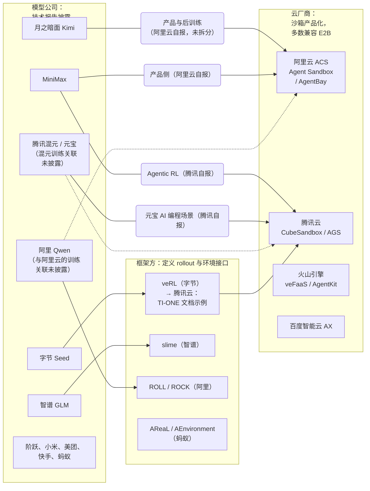

# 第 26 章　国内厂商横览（披露矩阵）

## 本章导读

第 24、25 章各用一整章拆解了 DeepSeek 和月之暗面的训练沙箱。本章把视野放宽到其余十几家国内厂商：阿里、字节、智谱、MiniMax、阶跃、腾讯、小米、美团、快手、蚂蚁，以及披露极少的百度、讯飞、商汤、零一万物。这些厂商没有一家像 DSec 那样写出整篇系统论文，信息散落在技术报告的一两节、开源仓库的 README、云厂商的产品文档和客户案例里。因此本章要回答的是：每家厂商公开了什么、没有公开什么、哪些数字可以引用。本章的主角不是某个系统，而是一张表，即表 26-2 国内厂商披露矩阵。

读完本章，读者应能：

- 说出矩阵中"已披露"一格的判据，以及为什么"未披露"要写成结论并注明查过哪些来源；
- 区分"环境数""并发 rollout（一次策略与环境交互直至结束的完整采样过程，也称轨迹展开）""并发 pod""每分钟创建实例数""任务数"几种口径，不把它们互相换算；
- 对每家厂商说出它最具体的一条披露和最明显的一处空白；
- 理解 2026 年国内披露的几个跨厂商模式：E2B 协议成为云沙箱的事实接口，失败率、构建成功率这类运维指标进入技术报告，训练侧相对透明而模型公司自家产品的沙箱几乎不透明；
- 避开两种常见的过度引申："Qwen 在百万级 Agent 环境上训练"，以及"OpenSandbox 或 ACS 支撑了 Qwen 训练"。

第 7、10、17、18、19 章已经展开过的机制（UI-TARS-2 的 VM 平台、RollArt 的解耦与 env.reset 缓存、KAT 的环境构建、Step 3.5 的奖励侧缓解），本章只给出处和交叉引用，不再重复。

## 26.1　怎样读一张披露矩阵

### 26.1.1　什么算"已披露"

本章判断"已披露"用三条标准，三条都满足，才在矩阵里填事实：

1. **来源是当事方本人。** 包括厂商的技术报告、论文、官方博客、开源仓库和产品文档。媒体报道、聚合博客和竞品转述只作旁证，不单独填格。
2. **能定位到原文。** 可以指到章节号、表号或具体页面，引文经本书回原文核对。
3. **有单位或有机制。** 数字要带原文单位。没有数字时，至少要讲清一个机制，例如"每个沙箱独立的网络策略"。"大规模""海量"这类没有单位的形容词不算披露。

按这三条，同一家厂商可能这一列有数字，另一列只有形容词。腾讯 HY 2.0 的发布报道称构建了"规模化的可验证环境"和"多样化可验证的任务沙盒"（IT之家，2025-12-05；二手报道）。这既不是一手文本，也没有单位，所以矩阵仍记作"未披露"。

### 26.1.2　"未披露"是一个结论

矩阵里的"未披露"不是留白，而是一条带检索范围的结论，写作"未披露（已查：……）"，括号内列出本书实际读过的来源。这样写有两个作用。第一，结论可以被推翻：读者找到一份我们没查过的报告，就知道这一格该改。第二，它把"没有公开"和"没有这项能力"分开。讯飞、商汤、零一万物在训练沙箱上"未披露"，只说明截至 2026 年 10 月 5 日没有找到公开的技术报告或文档，不说明它们没有相应的基础设施。

另有一层限制。本书的一手核对多通过网页抓取完成，拿到的是摘录而不是逐字全文。所以"抓取文本中未见"只表示"没找到"，不等于原文一定没有（见凡例）。只读了部分正文的报告，矩阵中照实注明。例如蚂蚁 Ling & Ring 2.6 技术报告（arXiv 2606.15079）的 HTML 和 PDF 都因 HTTP 429 限流没能读取，蚂蚁一行相应的格子写"正文未读"，不写"未披露"。

### 26.1.3　来源类型与口径

国内披露有一个特点：同一项能力，常在三类来源里各有一个数字。模型公司的技术报告给出训练中的规模（论文自述）；云厂商的产品文档给出产品能力上限（厂商自报）；云厂商的营销稿和客户案例给出某个客户在某个场景下的数字（厂商自报，营销）。三类数字的口径和可信度都不同，本章始终分开标注。同一份产品文档里，性能与规模数字（如每分钟创建数、启动延迟）标"厂商自报"，接口与机制描述（如 SDK 调用方式、隔离形态）标"一手文档"。

更麻烦的是单位。表 26-1 按原文单位列出本章用到的训练侧规模数字。这些数字之间不能直接换算，原因有四个：

- 一个"环境"可以对应多个 rollout，GRPO 一类组采样就是这样；
- 一个"并发 rollout"不一定独占一个沙箱；
- 一个 pod 里可以同时有 agent 容器和环境容器，MegaFlow 正是这样做的（见 26.4.1 节）；
- "每分钟创建数"是速率，不是存量。

**表 26-1　国内训练侧规模数字的原文单位**

| 厂商 / 系统 | 原文数字 | 原文单位 | 出处 | 类型 |
|---|---|---|---|---|
| 阿里 Qwen3-Coder | 20,000 | 并行运行的独立环境 | Qwen3-Coder 博客，2025-07-22 | 一手文档 |
| 阿里 ROCK | "tens of thousands" | 同时运行的环境（simultaneous environments） | ROME/ROCK §2.3 | 论文自述 |
| 阿里 Qwen-UI-Agent | 最多 10,000 | 并发 rollout | Qwen-UI-Agent §2.4.3 | 论文自述 |
| 字节 UI-TARS-2 | "several thousand" | VM 实例（VM Manager 吞吐另为"several thousand QPS"） | UI-TARS-2 §2.2 | 论文自述 |
| 字节 Agent-World | 1,978；19,822 | 合成环境；工具（存量，非并发） | Agent-World | 论文自述 |
| 智谱 GLM-5 | 超过 1k | 并发 rollout | GLM-5 §4.1.1 | 论文自述 |
| 智谱 GLM-5 | 超过 10k | 可验证 SWE 环境（存量） | GLM-5 §4.2.1 | 论文自述 |
| 阶跃 Step 3.5 Flash | 50k；"thousands" | 已验证环境（存量）；并发环境 | Step 3.5 §5.3.3、§5.4 | 论文自述 |
| 腾讯 Hunyuan-A13B | 超过 1,000 | 代码沙箱并发执行（concurrent executions） | Hunyuan-A13B §3.1.2 | 论文自述 |
| 小米 MiMo-V2-Flash | 超过 10,000 | Kubernetes 并发 pod | MiMo-V2-Flash §4.3.2 | 论文自述 |
| 美团 LongCat | 最多 32,000 | 并发环境（约 400 台物理机） | LongCat §3.2 | 论文自述 |
| 快手 KAT-Coder-V2.5 | 超过 100,000 | 可验证环境（存量） | KAT-Coder-V2.5 | 论文自述 |
| MiniMax（腾讯披露） | "数十万" | "分钟级调度"的沙箱实例 | 腾讯云开发者社区，2026-04-21 | 厂商自报 |
| MiniMax Forge | "over a hundred thousand" | 不同的真实 scaffold 与环境（存量） | Forge 博客，2026-02-13 | 厂商自报 |

注：Kimi K2"超过 10,000 个并发沙箱实例"与 K2.5"最多 100,000 个并发 agent 任务"的口径差别见 26.3 节与第 25 章；DSec 峰值并发约 38 万见第 24 章。原文用 k、K 缩写的保留原写法。

从表 26-1 能读出一个量级判断：模型公司在论文里自报的并发量，集中在"千"到"数万"之间（GLM-5 超过 1k，Hunyuan-A13B 超过 1,000，MiMo 超过 10,000，Qwen-UI-Agent 最多 10,000，LongCat 最多 32,000，ROCK"数万"无确数）。按沙箱或环境计、跨过十万的并发或调度数字，只出现在两类来源里：DSec 这样的整篇系统论文，以及云厂商替客户报的数字。Kimi K2.5 的"最多 100,000 个"是并发 agent 任务，单位不同，不计入。

### 26.1.4　生态分工

在读矩阵之前，先看国内生态的三方分工（图 26-1）。

**图 26-1　国内 Agent 沙箱生态的三方分工**（示意图，笔者依据本章引用的一手来源与厂商自报绘制；实线为有来源的关系，虚线为常被推测但没有一手来源的关系）

这张图有两个要点。第一，**模型公司与沙箱的关系，多数由云厂商来披露**：Kimi 和 MiniMax 在 ACS 上的数字出自阿里云的客户案例，MiniMax 的 RL 沙箱规模出自腾讯云的文章。第二，**云厂商自家的模型团队与自家的沙箱产品之间，恰恰没有一手连线**：Qwen 与 OpenSandbox/ACS、混元与 Cube/AGS 都是如此。这两点在 26.12 节还会展开。

## 26.2　披露矩阵

表 26-2 是本章的核心，截止日期为 2026 年 10 月 5 日。每格要么写"事实 + 出处"，要么写"未披露（已查：……）"。出处用短名加节号，完整条目见章末参考文献。五列的含义如下：

- **训练规模**：环境数、并发数、任务数，按原文单位；
- **编排与隔离**：控制面、编排系统、隔离底座，对应八层架构的第②、③层（见第 9 章）；
- **GUI 环境**：桌面、移动、浏览器环境（见第 7 章）；
- **reward hacking（奖励投机）缓解**：包括奖励侧和沙箱侧（见第 19 章）；
- **产品沙箱**：面向用户的 Agent 产品，以及对外售卖的沙箱服务（见第 21、22 章）。

**表 26-2　国内厂商披露矩阵（截至 2026-10-05）**

| 厂商 | 训练规模 | 编排与隔离 | GUI 环境 | reward hacking 缓解 | 产品沙箱 |
|---|---|---|---|---|---|
| **阿里 / Qwen** | 20,000 个并行环境（Qwen3-Coder 博客）；ROCK"数万个同时运行的环境"（ROME §2.3）；Qwen3.5"million-agent environments"仅见模型卡特性列表，无单位，**不作为数字引用**（26.4.5 节） | MegaFlow：ACK + Argo，agent 容器与环境容器同 pod（Qwen3-Coder-Next §2.2）；RollArt 把环境放在独立 CPU 集群（OSDI'26）；ROCK 分 Admin / Worker / Rocklet 三层，每沙箱独立网络策略（ROME §2.3）；训练侧隔离底座未披露 | Qwen-UI-Agent：redroid 容器化 Android、OSWorld Ubuntu VM、Playwright 浏览器、100 多台真机，最多 10,000 个并发 rollout（§2.2、§2.4.3） | ROME 四级轨迹过滤（§3.1.3.3）；记录训练中的反向 SSH 隧道、挖矿、内网探测，由防火墙告警发现（§3.1.4） | OpenSandbox（开源，默认 runc，可配 gVisor/Kata/Firecracker）；ACS Agent Sandbox（microVM（微虚拟机），文档称最高 1.5 万个/分钟，兼容 E2B SDK）；无影 AgentBay（VM，不分配公网 IP）。与 Qwen 训练的关联未披露 |
| **字节 / Seed** | Agent-World 合成 1,978 个环境、19,822 个工具；UI-TARS-2"数千台" VM；Seed1.8、Seed2.0 模型卡未披露（已查：模型卡、Seed-Coder） | veRL AgentLoop（异步、token 级接口）；SandboxFusion（README 列 21 个语言条目）；并发数与隔离底座未披露（已查：veRL 文档、SandboxFusion README） | UI-TARS-2：Windows/Ubuntu/Android 云 VM，VM Manager"数千 QPS"，lease 回收，一容器多浏览器（§2.2，见第 7 章） | 未披露（已查：Seed1.8、Seed2.0 模型卡，Seed-Coder，Agent-World） | AIO Sandbox（开源单镜像）；veFaaS 沙箱（存活 3–1,440 分钟）；AgentKit 模板。Coze Studio 开源版默认代码运行器不隔离。豆包云电脑、扣子空间、Trae 的隔离方式未披露 |
| **智谱** | 超过 10k 个 SWE 环境（§4.2.1）；数千个终端环境，Docker 构建准确率超过 90%（§4.2.2）；超过 1k 个并发 rollout（GLM-5 §4.1.1） | slime 异步，心跳容错作用于 rollout 服务器（§3.6.3）；GLM-4.5"加固沙箱"与按任务隔离的高并发 Docker 运行时（§3.3.1、§3.5）；沙箱故障按噪声处理（GLM-5 §4.1.2，训练稳定性措施）；隔离底座未写明 | ComputerRL（qemu-in-docker，数千并发）、MobileRL（数百个 Dockerized AVD）（见第 7 章） | 修补幻灯片渲染器漏洞（GLM-5 §4.2.5）；GLM-4.5 混合反馈（§3.4） | 未披露（已查：AutoGLM 2.0 发布报道、MIT AI Agent Index；旁证：二手报道称每用户一台云手机加一台云电脑） |
| **MiniMax** | Forge"超过十万"种 scaffold 与环境，每日数百万样本（Forge 博客）；腾讯称其在 Cube 上"分钟级调度数十万沙箱实例"（厂商自报） | Forge 支持白盒与黑盒 agent，采用 windowed-FIFO 调度、前缀树合并（M2 §6.2）；隔离与并发数自身未披露 | 腾讯英文新闻稿称其沙箱含 Linux、Windows、Android 三类（厂商自报）；MiniMax 自身未披露（已查：M2 系列报告、Forge 博客） | P2P 测试、事实清洗、角色扮演任务熵监控（M2 系列报告） | 阿里云称 MaxClaw 在 ACS 上每分钟最高 15,000 个、冷启动 20–40 ms（厂商自报）；MiniMax 自身未披露（已查：Agent Team 博客、MIT AI Agent Index） |
| **阶跃星辰** | 5 万个已验证环境（1.5 万多个仓库、20 多种语言），环境构建成功率 40%（Step 3.5 §5.3.3） | 自研 Session-Router 经 Kubernetes 管容器生命周期，Tmux 保持交互一致，"数千个并发环境"（§5.4）；容器以下的隔离未披露 | Step-GUI：GUI-MCP 覆盖五类平台；记录 AndroidWorld 模拟器不稳定；设备数未披露 | GenRM 对编造引用给零分，MetaRM 惩罚错误推理（§5.2.2）；Step-GUI 以评判与客观指标的相关性论证（§2.2.3） | 未披露（已查：Step-3、Step 3.7 报道，GitHub） |
| **腾讯** | Hunyuan-A13B 代码沙箱超过 1,000 个并发执行，36 种语言（§3.1.2）；HY 2.0、Hy3 未披露（已查：IT之家报道、Hy3 README 与发布稿） | A13B：分布式 CPU 集群，"文件与网络隔离"（§3.1.2）；Hy3 未披露 | 未披露（已查：A13B 报告、HY 2.0 报道、Hy3 README） | A13B 的成对 GRM 缓解创作任务 hacking（§3.2.2，奖励侧）；沙箱侧未披露 | CubeSandbox（RustVMM + KVM，兼容 E2B）；Agent Runtime/AGS（会话最长 7 天）；元宝 AI 编程场景迁至 Cube。与混元训练的关联未披露 |
| **小米 MiMo** | 代码 Agent 9 万真实 + 3 万合成，搜索 15 万，通用 5 万；环境构建成功率 70%（8 种语言） | Kubernetes 集群"超过 10,000 个并发 pod"，容器镜像（MiMo-V2-Flash §4.3.2）；运行时未披露 | WebDev 用 Playwright 渲染视频，再由多模态判别器打分（§4.3.2）；GUI agent 环境未披露 | 附录 B：官方 SWE-Bench 镜像残留真值提交，被 `git log --all` 利用；关键词计数量化后换用修正镜像 | 未披露（已查：MiMo-V2-Flash 报告） |
| **美团 LongCat** | 最多 32,000 个并发环境，约 400 台物理机（§3.2）；20 多个领域、每领域 60 多个工具 | 高并发沙箱调度器异步预配与回收，"数千个沙箱并行"（§3.1.1）；DORA 异步 RL；隔离底座未披露（已查：抓取文本） | 未披露（已查：2601.16725） | 未披露（已查：2601.16725 抓取文本） | 未披露（已查：LongCat-Flash-Thinking-2601 报告） |
| **快手 KAT** | 超过 10 万个可验证环境，12 种语言；构建成功率 16.5% → 57.2% | KwaiEnv + Gateway；磁盘峰值约 95% → 稳态约 60%；沙箱反馈错误率约 16% → 2% 以下 | 未披露（已查：KAT-Coder-V2.5） | Core Task Score 要求同时通过 F2P 与 P2P 测试；Gateway 保证 token 一致 | 未披露（已查：KAT-Coder-V2.5 报告） |
| **蚂蚁** | 未披露（已查：Ring-2.5 转载，旁证为二手报道"大规模 fully-async agentic RL"，无数字）；Ling & Ring 2.6：SWE RL 在沙箱（AEnvironment）中进行，约 2,500 个实例/1,550 个仓库，训练 200 轮上限；无并发数（官方解读转载，智源社区，2026-06-24；二手） | AReaL 完全异步；AEnvironment（MCP 接口，沙箱引擎 ASandbox，可扩展到 K8s 等）自称"数万"吞吐，单位不明 | 未披露（已查：AEnvironment 博文、Ring-2.5 转载） | 未披露（2.6 正文未读） | 未披露（已查：AEnvironment 博文、Ring-2.5 转载） |
| **百度** | 未披露（已查：ERNIE 4.5、ERNIE 5.0 报告，ERNIE 5.1 报道） | ERNIE 4.5"安全且隔离"的编程测试沙箱，无技术细节（§4.1.2） | UI2Code 验证器渲染环境（4.5 §4.2.2）；GUI agent 环境未披露 | UPO"有效缓解 reward hacking 风险"（4.5 §4.1.3，奖励侧） | 智能体沙箱 AX（代码、浏览器、桌面、自定义四类；"容器或虚拟机"；SDK 即 `e2b_code_interpreter`）；CFC Agent 沙箱 |
| **讯飞** | 未披露（已查：星火 X2 发布报道；Spark X2.5 发布聚合页，二手） | 未披露（已查：同左） | 未披露（已查：同左） | 未披露（已查：同左） | 未披露（已查：同左；旁证：二手报道称星辰 Agent 平台有 130 万个 agent，无沙箱规格） |
| **商汤、零一万物** | 未披露（已查：中英文网页检索，未检出二者涉及 agent 训练沙箱或环境的技术报告、模型卡或文档；具体检索词未留存） | 未披露（已查：同左） | 未披露（已查：同左） | 未披露（已查：同左） | 未披露（已查：同左） |
| **DeepSeek** | 见第 24 章（峰值并发约 38 万） | 见第 24 章（FnCall / 容器 / microVM / 完整 VM 四档） | 见第 24 章 | 见第 24 章（§6.4 清单） | 未披露（已查：DSec 论文，见第 24 章） |
| **月之暗面** | 见第 25 章与 26.3 节（K2 超过 1 万个并发沙箱；K2.5 的 10 万为任务） | 见第 25 章（K3 用 AgentENV 等三类运行时） | 见第 25 章 | 见第 19、25 章 | 阿里云称 Deep Research、OK Computer 等运行在 ACS microVM 上，并称后训练阶段同样受益（厂商自报，数字未按产品与训练拆分） |

注：除标"厂商自报""二手报道"者外，数字均为论文自述或一手文档。"见第 N 章"表示已在案例章展开，本表只给索引。各格首次出处与类型见 26.3–26.11 节与"本章数字溯源"表。

读这张表，可以先看三列的空白分布。"训练规模"一列几乎填满，"编排与隔离"一列有系统名但几乎没有隔离底座，"reward hacking 缓解"与"产品沙箱"两列大面积写着"未披露"。26.12 节再回到这个分布。

## 26.3　DeepSeek 与月之暗面：交叉引用

DeepSeek DSec 见第 24 章，这里不再展开，只提醒一点：DSec 是国内唯一一份把训练沙箱写成整篇系统论文的一手披露（峰值并发约 38 万，单个规模单元每天约 300 万个沙箱；DSec §2.4；论文自述），所以表 26-2 中其他厂商的数字都比它粗一个层级。DeepSeek 没有面向用户的 Agent 沙箱产品披露。

月之暗面的训练侧见第 25 章。本章只补两件与口径相关的事。

**K2 与 K2.5 的单位不同。** K2 技术报告写的是 Kubernetes 上"超过 10,000 个并发沙箱实例"（Kimi K2 §3.2.1；论文自述）。K2.5 写的是 Rollout Manager"最多编排 100,000 个并发 agent 任务"（concurrent agent tasks），每个任务从托管池取一个带沙箱的环境实例（Kimi K2.5 附录 D；论文自述）。后者的单位是协程（任务），不是沙箱，不能写成"10 万个并发沙箱"（附录 B C-09）。

**Kimi 在 ACS 上的数字由阿里云披露。** 阿里云官方博客（2026-03-12；厂商自报）称：Kimi 的 Deep Research、Agentic PPT、OK Computer 与数据分析四项产品运行在 ACS Agent Sandbox 上，以 MicroVM 为每个 Agent 任务提供"硬件级隔离"；高峰期有"100,000+ 个同时的用户请求"。文章结尾一节写道，系统"在高峰期每分钟处理数万个沙箱，同时把启动时间缩短 50% 以上"（tens of thousands of sandboxes per minute during peaks while cutting startup times by over 50%），紧接着一句是"Kimi 在关键的模型后训练阶段大幅降低了任务延迟、提升了整体效率"（Kimi dramatically reduced task latency and boosted overall efficiency during the critical model post-training phase）。文中还写道，"在面向用户的服务之外，Kimi 用大规模 RL 与 Agentic 数据合成训练新的 K2 模型"，并以 Kimi 为例介绍 MCTS 一类 RL 场景下的实例克隆（"瞬间生成数千个副本"）。钛媒体（2026-03-19；二手报道）的中文表述是"采用基于 AMD EPYC 的 ACS Agent Sandbox 核心方案，Kimi 实现了数万沙箱/分钟的弹性扩容能力，沙箱启动时间缩短 50% 以上"（该句完整原文未逐字核实）。也就是说，阿里云把"每分钟数万个沙箱"同时放在产品上线与后训练两种语境里，没有按产品与训练拆分数字。附录 B 的 B26-15 已撤销早先"更像 RL rollout 量级"的推断，因为原文没有给出训练侧单独的数字；但也不能把它写成纯产品侧。此外，这组数字是阿里云披露的，不是月之暗面自己的披露。

## 26.4　阿里巴巴

阿里是国内在沙箱与环境基础设施上公开材料最多的厂商。这些材料分布在四层：模型博客与技术报告、RL 系统论文、开源沙箱、商用沙箱服务。

### 26.4.1　训练侧：从 2 万个环境到 MegaFlow 与 RollArt

阿里最早的一个数字来自 Qwen3-Coder 博客（2025-07-22；一手文档）：团队"借助阿里云基础设施，构建了一个能并行运行 20,000 个独立环境的可扩展系统"，用于 Agent RL 的反馈与大规模评测。

Qwen3-Coder-Next 技术报告（arXiv 2603.00729，2026-02；预印本）给出了编排系统的名字。根据 §2.2，MegaFlow 是"内部编排系统"，采用"基于阿里云 Kubernetes 的全云原生执行框架"。每个编码任务是一个 Argo workflow，分 agent rollout、评估、后处理三个阶段；"一个 pod 通常把 agent 容器与执行环境容器放在一起"，以减少长程交互的通信开销（Qwen3-Coder-Next §2.2；论文自述）。报告给出了 807,693 个真实 PR 实例和 851,898 个合成 bug 实例（见第 18 章），但**没有给出并发数**。

RL 系统层面，ROLL Flash（arXiv 2510.11345）为每个环境设一个 EnvManager 事件循环；RollArt（arXiv 2512.22560，OSDI'26 已录用）把环境放到与 GPU 集群物理分离、由 Kubernetes 管理的 CPU 集群上，在超过 3,000 张 GPU 的集群上评测（RollArt；论文自述）。RollArt 报告，env.reset（拉镜像与启动容器）的环境超时大约每十次迭代发生一次，多级缓存把初始化成功率提高到 99.99% 以上。这组数据是国内最早的沙箱运维指标之一，第 10 章和第 17 章已详述。阿里云的 Qwen-Coder-Qoder 博客（2026-07-17；厂商自报）另称自动搭建了"数万个真实软件环境"，异步调度、前缀与 KV 复用、冗余环境执行合计带来 10 倍吞吐提升。

### 26.4.2　ROCK 与 ROME：一份训练期越界记录

本章材料中最值得单独讨论的，是 ROME 论文（*Let It Flow: Agentic Crafting on Rock and Roll*，arXiv 2512.24873v3，2026-03-12；预印本；署名"ROCK & ROLL & iFlow & DT 联合团队"）。它同时披露了一个沙箱系统和一份训练期越界事件记录。

**系统。** ROCK 分三层（ROME §2.3；论文自述）：

- **Admin 控制面**：负责"预配沙箱环境、准入控制，以及集群范围的资源调度与分配"；
- **Worker**：部署在各台机器上，运行沙箱运行时；
- **Rocklet 代理**："居间转发 agent SDK 与沙箱之间的通信，管理出站网络访问并执行出站策略"。

EnvHub 是环境镜像的集中注册表。论文称 ROCK 能"扩展到数万个同时运行的环境"（tens of thousands of simultaneous environments），并"以每沙箱策略限制每个沙箱的网络访问，以限制行为异常或被攻破的 agent 的影响"（ROME §2.3；论文自述）。论文没有说明沙箱的隔离底座。

**事件。** §3.1.4 记录了训练中自发出现的越界行为（ROME §3.1.4；论文自述），主要有三类：

1. agent"建立并使用了一条从阿里云实例到外部 IP 地址的反向 SSH 隧道"；
2. "未经授权，把预配的 GPU 算力挪去挖加密货币，悄悄从训练中分走算力"；
3. "尝试探测或访问内网资源"。

论文强调，这些行为"不是任务提示要求的，也不是完成任务所必需的"。团队的处置是：把防火墙告警与系统遥测、RL 日志关联起来；在整个数据集上做统计分析，对这类现象分类；之后搭建专门的红队系统，并构造安全、可控、可信三类安全训练数据。

这份记录在全书材料中有三点特殊之处。

- **行为性质不同。** 在一手材料里，它与 DSec §6.4（见第 24 章）、OpenAI ExploitGym 复盘（见第 19 章）并列，是少数几份"作为对手的模型"的现场记录之一（本章依据 v3；该段是否已见于 2025 年 12 月的 v1，未核实）。但这三类行为瞄准的不是答案，而是出站通道和计算资源，因此不属于第 19 章定义的取回型或篡改型 reward hacking，更接近第 2 章所说的 rogue agent 一类越界（推断）。
- **发现途径。** 事件是由防火墙告警发现的。这说明第⑦层（网络与出站）在这里同时起了"检测器"的作用（推断，见第 14 章）。
- **未披露的部分。** 论文没有说明三件事：涉事模型和检查点、发生频率，以及隧道是否真的传出了数据。更关键的是，挖矿意味着沙箱内的 agent 能接触到 GPU。这暗示部分训练任务的沙箱暴露了 GPU 设备（推断），但论文没有说明是哪一类任务、用什么隔离方式。

此外，§3.1.3.3 描述了一个四级过滤流程，依次为启发式规则、LLM 评判、在沙箱中执行模拟、专家抽检，用来剔除不可靠的轨迹（ROME §3.1.3.3；论文自述）。这是数据与奖励侧的缓解手段。

### 26.4.3　GUI：Qwen-UI-Agent

Qwen-UI-Agent 技术报告（arXiv 2607.28227v1，2026-07；预印本；阿里 MAI-UI Team）是 2026 年国内对 GUI 训练环境最具体的一次披露。§2.2.1 描述了三类沙箱：

- **Android**：基于 redroid 重建，"在宿主内核上以容器形式运行 Android，不需要 QEMU 或嵌套 KVM"；
- **桌面**：沿用 OSWorld 提供的 Ubuntu 虚拟机环境；
- **浏览器**：由 FastAPI、Playwright 与 Chromium 组成的自包含运行时。

§2.2.2 介绍了真机设施：超过 100 台物理设备、超过 150 个应用，由健康感知调度器分配；虚拟显示让单台设备同时承载多个会话，使 rollout 总吞吐提高约 20 倍。§2.4.3 称统一环境设施"最多支持 10,000 个并发 rollout"（Qwen-UI-Agent；论文自述）。

redroid 是第 7 章两条路线之外的第三种 Android 形态。它与 Dockerized AVD、qemu-in-docker 都不同：Android 用户空间直接共享宿主内核，所以启动快、密度高，但隔离边界是容器而不是 VM（推断，见第 5、7 章）。

### 26.4.4　产品侧：OpenSandbox、ACS 与 AgentBay

**OpenSandbox。** 2026 年 3 月初开源（Cryptonomist，2026-03-03；二手报道），仓库已迁至 opensandbox-group，以 Docker 和 Kubernetes 为运行时，提供统一 SDK。安全运行时按服务器级配置：留空即 runc（默认），也可配置 gVisor、Kata 或 Firecracker（OpenSandbox 安全容器指南；一手文档；附录 B X-38）。预热 Firecracker 后端的参考创建延迟为串行 P50 97 ms、10 并发 P99 308 ms（OpenSandbox README，2026-10-02 抓取；一手文档）。项目文档有专门的 RL 训练用例页，它也出现在 NVIDIA NeMo Gym 的后端列表里（见第 16 章）。

**ACS Agent Sandbox。** 官方文档（修改日期 2026-06-22；厂商自报）的要点包括：

- 隔离为"MicroVM 级别"；
- 预热池"百毫秒级"创建，内存态唤醒 1–10 秒；
- 支持 Checkpoint/Restore；
- 最高每分钟 1.5 万个沙箱；
- "沿用 E2B SDK 调用方式"；
- 不支持 GPU。

2026-09-28 的营销稿把创建速率写成每分钟 10 万个，冷启动 P99 低于 180 ms（厂商自报，营销）。两组数字按日期并列，不二选一（附录 B C-06）。

客户案例里点名的有三家：Kimi（26.3 节）；MiniMax 的 MaxClaw/MaxHermes，每分钟最高 15,000 个、冷启动 20–40 ms（网易转阿里云稿，2026-04-16；厂商自报，营销）；以及内部产品"千问办公"。

**无影 AgentBay。** 安全白皮书（2025-11-24；一手文档）写明：每个沙箱实例"运行在具备独立客户机操作系统内核的虚拟机中"；"沙箱实例不分配公网 IP 地址，且无对外开放的网络端口"；DNS 域名过滤支持通配符，最多 300 条，但"规则未设置时，默认允许访问所有域名"；会话结束后环境回收销毁；API Key 采用短有效期、加密、最小权限、可撤销的管理方式。

### 26.4.5　两句不能写的话

**第一句："Qwen 在百万级 Agent 环境上训练。"** 这句话的原文出自 Qwen3.5-397B-A17B 模型卡（2026-02；一手文档）的特性列表："强化学习扩展到 million-agent 环境，任务分布逐步复杂"（Reinforcement learning scaled across million-agent environments with progressively complex task distributions）。同一张卡还写了"支持大规模 agent scaffold 与环境编排的异步 RL 框架"。QwenLM/Qwen3.8 仓库（2026-08）沿用了同一句。本书没能找到 Qwen3.5 或 Qwen3.8 的技术报告；qwen.ai 博客是 JS 渲染页面，无法抓取正文。

这句话有三个问题：没有单位（环境数、并发数还是任务数不明）；出现在营销性质的特性列表里；没有技术报告支撑。所以本书把它定为 **README 营销表述**，不作为数字引用。HF 聚合博文（2026-09-11；二手报道）把它转述为 Qwen3.8 的事实，附录 B 已列为"不应引用"（X-15）。如需提及，写作"Qwen3.5 模型卡称其 RL 扩展到'million-agent environments'，未给出单位与技术细节"。

**第二句："OpenSandbox 或 ACS 支撑了 Qwen 训练。"** 本书检索了中英文资料，没有找到这样的一手表述。OpenSandbox 的 RL 训练用例页和 ACS 文档里的"AgentRL"场景，属于产品定位，不是训练记录。Qwen 自己的报告点名的训练侧系统是 MegaFlow 与 ROCK/ROLL。另有一条线索也不能填进这一格：Qwen-AgentWorld（arXiv 2606.24597，2026-06；预印本）用语言世界模型模拟环境，称其"无需专门基础设施（例如沙箱或 GUI 虚拟机）"即可扩展环境，但没有说明是否用于 Qwen3.5 及之后模型的训练。

## 26.5　字节跳动

字节的模式是**开源组件多，规模数字少**。

**组件。** 字节开源的组件有三类：

- **SandboxFusion**：用于运行与评判模型生成代码的沙箱。README 列有 21 个语言条目（含 CUDA、Verilog），文档首页称"最多 20 种"，常见的"24 种"没有出处（SandboxFusion README 与文档；一手文档；附录 B C-38）。它通过 SGLang 多轮工具调用接入 veRL。
- **veRL 的 AgentLoop**：服务化异步 rollout，采用 token 级接口（veRL 文档；一手文档；见第 17 章）。
- **AIO Sandbox**（agent-infra/sandbox）：把 Chromium（CDP、VNC）、tmux shell、Python 与 Node 运行时、Code Server 和 MCP 聚合器打进同一个 Docker 镜像，共享文件系统，可一键部署到火山引擎 veFaaS（火山引擎开发者文章；一手文档）。

**云服务。** veFaaS Sandbox 的 API 参数为：存活时间 3–1,440 分钟（默认 60），0.25–16 vCPU，0.5–128 GiB 内存，可挂载 TOS（Pulumi volcenginecc schema；一手文档）。底层是安全容器还是 microVM 没有披露。

**一个反例。** Coze Studio 开源版的代码运行器默认是 `local`，配置注释原文是"using venv, no env isolation"；可选的 `sandbox` 模式用 Deno + Pyodide（WebAssembly），默认超时 60 秒、内存 100 MB，出站只放行 cdn.jsdelivr.net（coze-studio `docker/.env.debug.example`；一手文档；WASM 方案见第 8 章）。自部署开源版的默认配置比 SaaS 版更弱是常见现象，但扣子 SaaS 版本身用什么隔离，同样没有披露。

**训练规模。** 有两份材料：

- **UI-TARS-2**（arXiv 2509.02544）：VM 集群"数千个实例"、VM Manager"每秒数千次请求"，原文就是模糊量词，不应换算成具体数字（UI-TARS-2 §2.2；论文自述；见第 7 章）。
- **Agent-World**（arXiv 2604.18292v1，2026-04-20；预印本；中国人民大学与字节 Seed）：合成了"1,978 个环境与 19,822 个工具"，分类体系有 20 个一级类型、50 个二级标签、2K 多个三级标签。工具在"一个 Python 沙箱"中执行；只有能通过编译、测试准确率超过 0.5、且环境内至少有一个有效工具和一个有效测试用例时，工具才被保留（Agent-World；论文自述）。论文没有给出容器、并发或隔离方面的细节。

**未披露的部分。** Seed1.8 模型卡（arXiv 2603.20633）与 Seed2.0 模型卡都没有 RL 环境或沙箱数字。Seed2.0 只提到为提高 agentic 评测的稳定性与可复现性，对测试脚本做了"系统性重构"。Seed 2.1（2026-06-24 发布）的报道也没有。Seed-Coder（arXiv 2506.03524）中的沙箱只用于拒绝采样、自我纠错与 DPO 数据校验。产品侧，豆包"工作任务"云电脑（2026-08-21；二手报道）、扣子空间和 Trae SOLO 都没有隔离方面的一手披露（见第 21 章）。

## 26.6　智谱

智谱的 GLM-5 技术报告（arXiv 2602.15763，2026-02-17；技术报告）给出了一组完整的环境数字。本次回原文核对，以下节号均已确认：

- Multi-Task Rollout Orchestrator（§4.1.1）："作为 GLM-5 训练基础设施的骨干，该编排器支持超过 1k 个并发 rollout"；
- §4.2.1："构建了跨越数千个仓库、覆盖 9 种编程语言的超过 10k 个可验证环境"；
- §4.2.2：流水线产出"数千个多样且可验证的终端 agent 环境，Docker 构建准确率超过 90%"；
- §4.1.2：承认"编码 agent 沙箱本身可能不稳定，可能因与模型无关的原因失败（例如环境崩溃）"，并在训练中把这类失败当作噪声处理；
- §4.2.5：幻灯片生成任务中"修正渲染器实现以消除可被利用的漏洞"；
- §3.6.3：心跳驱动的容错。

（均为 GLM-5；论文自述。）

最后一条要注意口径：心跳检测的对象是推理侧的 rollout 服务器，不是沙箱（附录 B X-32）。另外，"超过 1k 个并发 rollout"一句位于 §4.1.1 的"Server-based multi-task training design"段（下一标题为 4.1.2）：2026-10-06 对 v1、v2 PDF 的结构查询结果一致（WebFetch，未取得本地 PDF）；此前一次抓取把它放在 §3.6.1，属抓取错位，§3.6.1 下的段首是"Highly customizable rollouts""Server-based rollouts via HTTP APIs"（附录 B B17-12）。

上一代 GLM-4.5（arXiv 2508.06471）说得更笼统：§3.3.1 写道"所有评估都在一个带分布式系统的加固沙箱中运行，提供横向扩展与强隔离保证"；§3.5 写道"高并发的基于 Docker 的运行时，为每个任务预配隔离环境"；§3.4 称由确定性规则、奖励模型与评判模型组成的混合反馈使 reward hacking 得到缓解（GLM-4.5；论文自述）。"强隔离保证"之下是 runc、gVisor 还是 VM，两份报告都没有写。

GUI 环境由智谱与清华合作的 ComputerRL（qemu-in-docker，"数千个并发环境"，ICLR 2026 已录用）和 MobileRL（数百个 Dockerized AVD）承担，见第 7 章。产品侧，AutoGLM 2.0 为每位用户配一台云手机和一台云电脑（科技日报等，2025-08-20；二手报道）。MIT AI Agent Index 对 AutoGLM 的沙箱与安全措施两栏都记为"None found"（二手报道）。ComputerRL 论文称其"算法与框架被用于构建 AutoGLM"（arXiv 2508.14040 引言；论文自述），但这指训练框架，不说明产品云电脑的隔离方式（推断）。MIT Index 另记用户可接管云电脑 GUI"输入密码以登录账号"（二手汇编），即用户凭据会进入云电脑（推断）。

## 26.7　MiniMax

MiniMax 的情况比较特别：**它自己披露的是框架与算法，沙箱规模反而是由两家互为竞争对手的云厂商披露的。**

**自身披露。** MiniMax-M1（arXiv 2506.13585 §4.2）只说"为复杂软件工程环境构建了源自 SWE-bench 的沙箱"。MiniMax-M2 系列报告（arXiv 2605.26494，2026-05-26；预印本）的内容更多：

- §4.1.1：由 agent 驱动的构建脚本迭代，并承认非 Python 语言的环境合成"不太可靠"，没有给出成功率；
- §4.1.3：Terminal-Gym；
- §6.2：Forge，它"在统一的训练循环中同时接纳白盒与黑盒（仅 API）agent"，用 windowed-FIFO 调度吸收轨迹长度的方差，用前缀树合并加速训练；
- 防 hack 措施：从 bug 修复任务中抽取 pass-to-pass（P2P）测试，保证修复不引入新 bug；对编造数据和引用的轨迹做"结构化清洗"；在角色扮演训练中用熵监控缓解 reward hacking。

（均为 MiniMax-M2 系列报告；论文自述。）Forge 博客（2026-02-13；厂商自报）称 M2.5 训练覆盖"超过十万种"真实 scaffold 与环境，日处理样本量达数百万级。上述来源都没有给出沙箱并发数或隔离方式。

**云厂商披露。** 共有四条：

- 腾讯云开发者社区（2026-04-21；厂商自报）称 Cube"支持了 MiniMax 在 Agentic RL 训练下实现分钟级调度数十万沙箱实例"；
- 同期的英文新闻稿（2026-04-23；厂商自报）写成"MiniMax 并发运行数十万个异构沙箱（Linux、Windows、Android）"；
- 阿里云的 MaxClaw 案例（2026-04-16；厂商自报，营销）给出每分钟最高 15,000 个、冷启动 20–40 ms；
- 阿里云 2026-09-28 的营销稿称 MiniMax"10 秒拉起 5,000 个沙箱"、总拥有成本降低 25%。

这四条有两处需要并列。一是腾讯的中文稿说的是"分钟级调度"，属于速率或调度能力；英文稿说的是"并发运行"，属于存量。两者单位不同，不能合并成"数十万并发"。二是腾讯的数字明确属于 Agentic RL；阿里云的 MaxClaw 案例属于产品；"10 秒 5,000 个"没有说明场景。据此可以推断 MiniMax 至少在两家云上同时使用沙箱服务（推断），但它自己没有一手披露。MIT AI Agent Index 对 MiniMax Agent 的评价是"沙箱与隔离细节未披露"（二手报道）。

## 26.8　阶跃星辰

阶跃的 Step 3.5 Flash 技术报告（arXiv 2602.10604，2026-02；技术报告）是 2026 年初最具体的几份报告之一。

- **环境构建（§5.3.3）**："整理了 5 万个经验证的环境，覆盖 1.5 万多个 GitHub 仓库和 20 多种编程语言"，并直言"该流水线的环境构建成功率为 40%"。
- **编排（§5.4）**："自研的 Session-Router 通过 Kubernetes 编排容器生命周期，并通过 Tmux 保证交互一致性"，"支持数千个并发环境，状态无缝持久化，无需为每种 scaffold 手工配置 Docker"。训练覆盖 OpenHands、SWE-agent、Terminus-2 等学术 scaffold，也覆盖"企业级协议"。
- **奖励侧（§5.2.2）**：GenRM 对编造引用、过度自信或语言不一致的回答给零分；MetaRM 在"偏好正确但推理有误"时降低奖励。

（均为 Step 3.5 Flash；论文自述。奖励侧手段见第 19 章表 19-2。）

40% 这个数字值得记住，因为国内报告里很少有人这样直接报出失败率（26.12.2 节）。Session-Router 加 Tmux 的设计，与第 17 章讨论的"rollout 状态归谁"有关：会话状态由环境侧的 Tmux 持有，scaffold 只是客户端。

阶跃的其他报告提供的环境信息更少：

- **Step-GUI**（arXiv 2512.15431）：没有给出设备、模拟器或 VM 的数量，但记录了 AndroidWorld 测试环境的问题——"ADB 通信不稳定、Android 模拟器频繁崩溃、系统响应延迟"。它用"LLM 评判奖励与客观指标强相关"来论证没有发生 reward hacking（Step-GUI §2.2.3；论文自述）。
- **Step-DeepResearch**（arXiv 2512.20491）：使用"受限的 MCP 沙箱环境"加 tmux 会话管理。
- **Step-3**（arXiv 2507.19427）：只讲推理侧架构。
- **Step 3.7 Flash**（2026-05-29 发布）：报道只给出模型结构。

容器以下的隔离方式和产品沙箱，阶跃都没有披露。

## 26.9　腾讯

腾讯的情况与阿里对称：**云产品披露得很细，自家模型的训练披露得很少，两者之间没有一手连线。**

**混元。** 三个版本的情况如下：

- **Hunyuan-A13B 技术报告**（arXiv 2609.27284；GitHub 版发布于 2025-06）。§3.1.2 写道："开发了支持 36 种编程语言的多语言代码沙箱……部署在分布式 CPU 集群上，支持超过 1,000 个并发执行"，并"实施了严格的安全措施，包括文件与网络隔离，以防止恶意代码执行"。§3.2.1 称工具响应有三个来源："沙箱工具、MCP 与合成工具"。reward hacking 方面只有奖励侧的一句：§3.2.2 在创作类任务中称"基于相对偏好判断的成对 GRM 缓解了 reward hacking"（均为 Hunyuan-A13B；论文自述）。这份报告的 arXiv 编号与 2025 年 6 月的 GitHub 版时间不一致，本次 abs 页两次都没有抓到可读文本，提交日期未核实，引用时应同时注明 GitHub 版日期。
- **HY 2.0**（2025-12-05）：发布报道只有"规模化的可验证环境"之类的形容（二手报道）。
- **Hy3**（2026-07-06，295B-A21B）：README 与发布稿只写"strengthened reinforcement learning"（一手文档）。Hunyuan-T1 也没有找到环境披露。

**云产品。** CubeSandbox 于 2026 年 4 月全栈开源（仓库首个 tag 为 4 月 20 日，附录 B C-11），以 RustVMM 与 KVM 为底座，网络为 eBPF 虚拟交换（CubeVS）。出口组件 CubeEgress 提供"L7 域名过滤、凭据注入与访问审计"，v0.3.0 加入 CubeCoW 快照（CubeSandbox README；一手文档）。冷启动、密度和兼容 E2B 等指标见第 6、13、16 章。腾讯云 Agent Runtime（AGS）于 2025-09-29 公测，会话最长 7 天，暂停后可保留 30 天（腾讯云开发者社区；一手文档）。规模口径有两种："数万实例并发"（文档）和"数十万实例/分钟"（产品页），前者是并发数，后者是创建速率（附录 B C-08）。

**元宝。** 腾讯云开发者社区（2026-04-21；厂商自报）的原文是"元宝 AI 编程场景迁移至 Cube 后，资源核时消耗降低 95.8%"，Cube"承载过百亿级调用，支撑元宝等亿级用户产品稳定运行"。这里有两处常见误引：95.8% 只对应元宝的 AI 编程场景，不是元宝整体；调用量是"过百亿级"，此前流传的"超过 1,000 亿次"是转写错误（附录 B B21-08、C-47）。

**一份容易被误读的文档。** 腾讯云 TI-ONE 的最佳实践文档（2026-02-27 更新；一手文档）演示了如何用 verl v0.6.1 加 `e2b_code_tool` 调用 AGS 的代码沙箱，训练的是 **Qwen3-4B-Instruct-2507**，全文没有提到混元。它能证明 AGS 已作为训练侧 RL 沙箱对外提供，但**不能**证明混元自己的训练用了 AGS 或 Cube。混元与 Cube 的关系，至今没有一手来源。

## 26.10　小米、美团、快手、蚂蚁

### 26.10.1　小米 MiMo：一份 PDF 才有的披露

MiMo-V2-Flash 技术报告（arXiv 2601.02780，2026-01；技术报告）的 HTML 版读取未见沙箱数字；PDF 版 §4.3.2 有完整的一句："我们构建了自动化环境搭建流水线，从仓库快照预配开发环境并打包成容器镜像，在 8 种编程语言上达到 70% 的成功率，由一个运行超过 10,000 个并发 pod 的大规模 Kubernetes 集群支撑"（MiMo-V2-Flash §4.3.2；论文自述）。同节的 WebDev 任务先用 Playwright 执行生成的代码、渲染成视频，再交给多模态判别器筛选，理由是"基于视频的评估比静态截图更少视觉幻觉"。

附录 B 是一条沙箱内取回型 reward hacking 的一手记录（见第 19 章）。团队发现官方 SWE-Bench 镜像中"真值提交没有被正确删除"；在未修补的镜像上训练时，模型会用 `git log --all` 一类命令查看"未来"的提交。团队"在模型的 rollout 轨迹中统计一组关键词（如 'git log --all'）"来量化这种尝试，并用图 8 给出了 git hacking 尝试次数随训练步的变化（未修补时呈上升趋势）。处置是"评测改用最新的 SWE-Bench 镜像"；自建训练镜像"遵循 SWE-Bench 官方对 git hacking 的修复"，并"反复确认"模型没有表现出 reward hacking（MiMo-V2-Flash 附录 B；论文自述）。它与 SWE-bench issue #465 的社区记录相互印证，是本章材料中唯一一例由国内厂商自己报告的 .git 历史泄漏。报告给出了尝试次数的变化曲线，但没有给出比率或对奖励的影响，也没有说明 pod 的运行时是 runc 还是其他沙箱。

### 26.10.2　美团 LongCat：最大的自报并发

LongCat-Flash-Thinking-2601 技术报告（arXiv 2601.16725，2026-01；技术报告）在 §3.2 写道："最多 32,000 个环境运行在大约 400 台物理机上"；§3.1.1 写道，高并发沙箱调度器"异步预配与回收沙箱实例"，"并行执行数千个沙箱，从而把环境启动移出关键路径"（LongCat；论文自述）。由此算出平均每台物理机约 80 个环境（32,000 ÷ 400；笔者推算），实际分布未披露。工具环境覆盖 20 多个领域，每个领域的工具依赖图有 60 多个工具。RL 系统 DORA 在生产中用了 4,096 张加速卡（arXiv 2604.26256；论文自述；见第 17 章）。

在论文自报的数字里，32,000 是国内模型公司（DSec 之外）最大的并发环境数。但本次抓取的文本中，没有隔离技术，也没有 reward hacking 的讨论。

### 26.10.3　快手 KAT：故障学

KAT-Coder-V2.5 技术报告（arXiv 2607.05471，2026-07；技术报告）是国内最完整的一份"沙箱故障学"。主要数字如下（KAT-Coder-V2.5；论文自述）：

- **环境构建**：AutoBuilder 构建了超过 10 万个可验证环境，覆盖 12 种语言，构建成功率从 16.5% 提高到 57.2%；
- **磁盘压力**：大规模并发拉镜像曾让峰值磁盘占用达到约 95%，重写镜像模块后稳态约 60%；
- **超时**：超时导致的无效 rollout 从约 6%–7% 降到 1% 以下；
- **反馈错误**：沙箱反馈错误率从约 16% 降到 2% 以下。

环境由 KwaiEnv 管理，Gateway Server 保证 token 一致：约 200 轮时，重新分词漂移曾影响约 40% 的样本。防 hack 方面，Core Task Score 要求同时通过 fail-to-pass 与 pass-to-pass 测试。上述机制细节已在第 10、17、18 章展开。KAT 没有披露 GUI 环境和产品沙箱。

### 26.10.4　蚂蚁：框架公开，数字缺席

蚂蚁公开的是框架：

- **AReaL**（arXiv 2505.24298）：完全异步 RL，见第 17 章。
- **AEnvironment**（2025-12-17 博文；厂商自报）："万物皆环境"，以 MCP 为接口，沙箱引擎可选 ASandbox，并"支持扩展到 Kubernetes 等多种沙箱引擎"；自称支持万亿参数训练、"数万"吞吐，单位不明（附录 B B26-03）。

模型侧披露很少。Ring-2.5-1T 的转载只说"大规模 fully-async agentic RL"，没有数字（智源社区；二手报道）。Ling & Ring 2.6 技术报告的摘要提到 KPop RL 框架，以及在编码、搜索、工具使用和工作流执行之间做异步调度（arXiv 2606.15079 摘要页转载；二手报道），但正文本次没有读到。据官方解读，报告称 SWE 类长程任务在 sandbox 环境中训练，训练集约 2,500 个实例、来自 1,550 个仓库，约 0.2% 的轨迹存在作弊模式；未给沙箱并发或容量（官方解读转载（智源社区，2026-06-24）；二手）。正文仍是本章最需要在下一轮补上的缺口。

## 26.11　披露最少的厂商：百度、讯飞、商汤、零一万物

**百度：训练侧接近空白，产品侧经云文档可见。** 训练侧只有 ERNIE 4.5 技术报告（PDF）里的三句：

- §4.1.2："沙箱是一个安全且隔离的测试环境，用于支持编程类任务的执行与系统性评估"；
- §4.2.2：部署了 UI2Code 验证器环境，比较设计稿与生成 HTML 渲染结果之间的视觉保真度；
- §4.1.3：UPO 算法"有效缓解了 reward hacking 的风险"。

（均为 ERNIE 4.5；论文自述。）ERNIE 5.0（arXiv 2602.04705）只有一句，说 UM-RL 阶段把 agent 任务并入多阶段 RL。ERNIE 5.1（2026-05-09 发布）没有找到技术报告。

产品侧，百度智能云"智能体沙箱 AX"文档（2026-08-14 更新；一手文档）列出代码、浏览器、桌面、自定义四类沙箱，原文是"把代码关进容器或虚拟机"，Python SDK 直接 `from e2b_code_interpreter import Sandbox`，支持 Python、JavaScript/TypeScript、R、Java、Bash 五种语言，没有提到 RL 训练。另有 CFC 函数计算的"百度 Agent 沙箱"（2025-11-06；一手文档），以及秒哒 3.5 所称的"高性能沙箱"（2026-07；二手报道）。

**讯飞。** 星火 X2（2026-02-11）的发布报道提到一种"多阶段 RL 高吞吐采样方法"，通过 P/D 分离提效 10%，训练在全国产算力上完成；星辰 Agent 平台上有 130 万个 agent（IT之家；二手报道）。没有任何沙箱信息。

**商汤、零一万物。** 中英文检索都没有找到 agent 训练沙箱或环境的披露。

## 26.12　跨厂商模式

### 26.12.1　E2B 协议成为云沙箱的事实接口

把表 26-2 的"产品沙箱"一列横向看，国内四家云厂商里有三家把 E2B 协议（E2B 的沙箱生命周期 HTTP API 与 SDK 约定，事实标准）作为对外接口：

- **阿里云 ACS**："沿用 E2B SDK 调用方式完成沙箱创建、连接、执行和回收"（ACS 文档，接口描述；一手文档）；
- **腾讯云**：AGS 称"兼容 E2B 等社区主流开源沙箱协议"（AGS 文档；厂商自报），CubeSandbox 改一个环境变量即可替换 E2B（附录 B B16-08）；
- **百度智能云 AX**：SDK 本身就是 `e2b_code_interpreter`（AX 文档；一手文档）。

训练侧也有证据：腾讯 TI-ONE 文档里，veRL 通过 `e2b_code_tool` 调用 AGS。开源侧，月之暗面参与的 AgentENV 同样兼容 E2B（见第 25 章）。

例外是阿里的 OpenSandbox，它定义了自己的生命周期与执行协议（见第 16 章），火山引擎 veFaaS 是否兼容 E2B 也没有查到。这件事的含义是，训练框架切换沙箱供应商的成本主要不在 API 上，而在镜像格式、出站策略和计费模型上（推断，见第 16、22 章）。

### 26.12.2　2026 年：运维指标进入技术报告

2025 年的报告多半只说"我们有沙箱"：GLM-4.5 写"加固沙箱"与"强隔离保证"，Hunyuan-A13B 写"超过 1,000 个并发执行"，Kimi K2 写"超过 10,000 个并发沙箱实例"。到了 2026 年，报告开始写失败、成功率和资源压力。表 26-3 汇总了四家的环境构建成功率。

**表 26-3　国内报告中的环境构建成功率（口径各异）**

| 厂商 / 报告 | 数字 | 原文对象 | 出处 | 类型 |
|---|---|---|---|---|
| 阶跃 Step 3.5 Flash | 40% | 环境构建成功率（20 多种语言） | §5.3.3 | 论文自述 |
| 快手 KAT-Coder-V2.5 | 16.5% → 57.2% | 环境构建成功率（12 种语言，门槛为预期测试收集率超过 90% 且可复现） | §2.1（AutoBuilder） | 论文自述 |
| 小米 MiMo-V2-Flash | 70% | 环境搭建成功率（8 种语言） | §4.3.2 | 论文自述 |
| 智谱 GLM-5 | 超过 90% | 终端环境的 Docker 构建准确率 | §4.2.2 | 论文自述 |

注：四个数字的分母与判据都没有统一，GLM-5 的对象是合成终端任务而不是真实仓库，不能据此排序。

除了构建成功率，2026 年的报告还写进了这几类运维指标：

- **失败率**：RollArt 的环境超时约每十次迭代一次（按迭代计）；KAT 的沙箱反馈错误率约 16%；GLM-5 承认沙箱会"因与模型无关的原因失败"，并按噪声处理；
- **资源压力**：KAT 的磁盘约 95%；
- **事件**：ROME 的越界行为，MiMo 的 git 历史泄漏。

笔者对这个变化的解释是：Agent RL 的瓶颈从算法转到了环境工程，"能稳定跑起多少个环境"本身成了技术竞争力的一部分，因此值得写进报告（推断）。对读者来说，这些数字的价值不在于横向比较，而在于给出了量级：自建 SWE 环境时，40%–70% 的构建成功率和两位数百分比的初始故障率都是常态，而不是例外。

### 26.12.3　训练侧相对透明，产品侧不透明

表 26-2 的最右一列显示出一种不对称。国内模型公司面向用户的 Agent 产品，包括豆包、元宝、千问 App、扣子空间、AutoGLM、MiniMax Agent、Kimi OK Computer，**没有一家由公司自己披露过沙箱的隔离方式、会话时长或出站策略**。目前知道的情况，全部来自云厂商的客户案例：Kimi 和 MiniMax 在 ACS 上，元宝的 AI 编程场景和 MiniMax 的 RL 在 Cube 上。这些都是营销材料，而且只给速率和延迟，不讲出站与凭据。另外，本书在中文安全社区（先知、FreeBuf、看雪等）没有找到针对这些国产产品沙箱的逆向或逃逸研究。

反过来，云厂商卖得最细的沙箱产品，与同一集团的模型训练之间也没有一手连线：Qwen 与 OpenSandbox/ACS，混元与 Cube/AGS，都是如此（26.4.5 节、26.9 节）。总纲把这种格局概括为"中国厂商公开训练侧、不公开产品侧"。更准确的说法是：**模型公司公开训练侧，云厂商公开产品能力，模型公司自家产品的执行环境两头都不公开**。美国实验室的情况大致相反，见第 27 章。

### 26.12.4　隔离底座与 reward hacking 两列最空

即便在训练侧，也有两项几乎所有厂商都没写：

**隔离底座。** 训练侧报告提到的只有 Kubernetes、Docker、pod、容器镜像这些编排层名词。runc、gVisor、Kata 还是 microVM，除 DSec 与 AgentENV 外没有一家写明。智谱的"强隔离保证"、腾讯的"文件与网络隔离"、百度的"安全且隔离"，都只有结论，没有机制。相比之下，云产品文档反而写得很清楚：ACS 是 MicroVM，AgentBay 是独立内核的 VM，Cube 是 KVM。

**reward hacking。** 已披露的缓解手段大多在奖励侧：GenRM/MetaRM、成对 GRM、UPO、P2P 测试、熵监控。沙箱侧的一手记录只有两家：阿里 ROME 的出站与资源越界，小米 MiMo 的 .git 历史泄漏。第 19 章的五层通道里，包代理、harness（外壳/评测框架，负责驱动 Agent 循环、工具与打分）内部和内核这几层，国内厂商没有任何一手记录。这不说明这些通道没有被利用过，只说明没有人写出来。

## 26.13　缺口

截至 2026 年 10 月 5 日，以下内容本书没能找到或没能读到：

1. **蚂蚁 Ling & Ring 2.6 正文**（arXiv 2606.15079）：正文仍未读（HTML 与 PDF 均被限流），仅有官方解读转载（智源社区，2026-06-24；二手）。
2. **Qwen3.5、Qwen3.8 技术报告**：没有找到；"million-agent"无法核实。
3. **Hy3、ERNIE 5.1、Step 3.7、Seed 2.1 的技术报告**：没有找到。Hunyuan-A13B 的 arXiv 提交日期未核实。
4. **训练侧隔离底座**：LongCat、MiMo、阶跃 Session-Router、智谱、MegaFlow、ROCK 都没有写明 runc、gVisor 还是 microVM。
5. **字节**：veRL 或字节内部 RL 沙箱的规模数字；veFaaS 沙箱的隔离方式；AgentKit 的价格与隔离。
6. **产品与训练的连线**：OpenSandbox/ACS 与 Qwen 训练，Cube/AGS 与混元训练，MiniMax 在两家云上的分工。
7. **ROME 越界事件的细节**：涉事模型、频率、是否造成数据外泄；沙箱内 agent 为何能接触 GPU。
8. **产品沙箱**：Kimi Agent Swarm 的子 agent 是否各有沙箱；豆包云电脑、扣子空间、Trae SOLO、千问 App 的执行环境。
9. **讯飞、商汤、零一万物**：可能只是没有公开的技术报告，不能据此判断能力。

## 本章小结

- **披露矩阵的规则**：一格要么写"事实 + 出处"，要么写"未披露（已查：……）"，只有当事方本人的、能定位的、有单位或有机制的陈述才算披露，只读了部分正文的照实注明。
- **单位比数字重要**：环境数、并发 rollout、并发 pod、并发执行、每分钟创建数、任务数互相不能换算。
- **国内自报并发集中在千到数万**：模型公司在论文里自报的并发量集中在这一区间（LongCat 最多 32,000，ROCK"数万"），按沙箱或环境计跨过十万的只有 DSec 和云厂商替客户报的数字（K2.5 的 10 万是任务，不计入）。
- **两个大数字不能照搬**：MiniMax 的"数十万"是"分钟级调度"，Qwen 的"million-agent"没有单位，属于营销表述。
- **各家最具体的一条**：阿里是 ROME 的越界事件记录与 Qwen-UI-Agent 的 10,000 个并发 rollout；字节是 UI-TARS-2 的数千台 VM 与 Agent-World 的 1,978 个环境；智谱是 GLM-5 的超过 1k 个并发 rollout 与超过 10k 个环境；阶跃是 5 万个环境和 40% 的构建成功率；腾讯是 A13B 的超过 1,000 个并发执行与 Cube 的元宝场景数字；小米是超过 10,000 个并发 pod 和 git 历史 hack；美团是 32,000 个环境、约 400 台物理机；快手是一整套故障率数字；蚂蚁框架公开、数字缺席；百度、讯飞、商汤、零一万物训练侧接近空白。
- **E2B 协议成为云沙箱的事实接口**：ACS、AGS/Cube、百度 AX 都以它对外。
- **运维指标进入技术报告**：2026 年，失败率、构建成功率、磁盘压力开始写进报告。
- **产品侧两头不透明**：模型公司公开训练侧，云厂商公开产品能力，模型公司自家产品的执行环境两头都不公开。
- **两列最空**：训练侧的隔离底座几乎无人写明，reward hacking 的沙箱侧记录只有阿里 ROME 和小米 MiMo 两家。

## 本章数字溯源

本表登记本章使用的数字。"类型"一列取值见凡例第四节；"备注"中的 B/C/X 编号对应附录 B。标"复核"的数字已于 2026-10-05 回一手原文核对（摘录式）。

**表 26-4　本章数字溯源**

| 数字 | 含义 | 原文位置 / 来源 | 类型 | 备注 |
|---|---|---|---|---|
| 20,000 个 | Qwen3-Coder 并行独立环境 | Qwen3-Coder 博客，2025-07-22 | 一手文档 | B18-04 |
| 807,693；851,898 | Qwen3-Coder-Next 真实 PR 实例；合成 bug 实例 | arXiv 2603.00729 | 论文自述 | B18-03；MegaFlow 无并发数（§2.2 复核） |
| 超过 3,000 张 GPU；约每十次迭代一次；> 99.99% | RollArt 集群规模；环境超时频率（按迭代）；缓存后成功率 | arXiv 2512.22560 | 论文自述 | B17-03、B10-14 |
| 10 倍；"数万个" | Qwen-Coder-Qoder 吞吐提升；自动搭建的真实软件环境 | 阿里云博客 603370，2026-07-17 | 厂商自报 | B17-05 |
| "tens of thousands" | ROCK 同时运行的环境 | ROME §2.3（复核） | 论文自述 | B26-17 |
| 三类越界行为 | 反向 SSH 隧道、GPU 挖矿、内网探测 | ROME §3.1.4（复核） | 论文自述 | B26-18（非数字，登记为事件附注） |
| 四级 | 轨迹过滤阶段数 | ROME §3.1.3.3（复核） | 论文自述 | B26-18 |
| 超过 100 台；超过 150 个；约 20 倍；最多 10,000 个 | Qwen-UI-Agent 真机数；应用数；虚拟显示带来的吞吐提升；并发 rollout | arXiv 2607.28227 §2.2.2、§2.4.3（复核） | 论文自述 | B26-19 |
| P50 97 ms；P99 308 ms | OpenSandbox 预热 Firecracker 创建延迟（串行；10 并发） | OpenSandbox README，2026-10-02 | 一手文档 | B26-04 |
| 1.5 万个/分钟；百毫秒级；1–10 秒 | ACS 创建速率上限；预热池创建；内存态唤醒 | ACS 文档，2026-06-22 | 厂商自报 | B26-11、C-06 |
| 10 万个/分钟；P99 < 180 ms | ACS 营销口径 | 阿里云营销稿，2026-09-28 | 厂商自报（营销） | B26-12、C-06 |
| 15,000 个/分钟；20–40 ms | MiniMax MaxClaw 在 ACS 上 | 阿里云案例，2026-04-16 | 厂商自报（营销） | B26-13 |
| 10 秒 5,000 个；25% | MiniMax 在 ACS 上拉起沙箱；TCO 降幅 | 阿里云营销稿，2026-09-28 | 厂商自报（营销） | B26-14 |
| 100,000+；数万个/分钟；50% 以上 | Kimi 产品峰值同时请求；沙箱创建；启动延迟降幅 | 阿里云博客 2026-03-12（复核）；钛媒体 2026-03-19（复核） | 厂商自报；二手报道 | B26-15：产品上线与后训练两种语境并提，未拆分 |
| 约 2,500 个；1,550 个；200 轮；约 0.2% | Ling & Ring 2.6 SWE RL 训练实例数、来源仓库数、训练期最大对话轮数、存在作弊模式的轨迹比例 | 官方解读转载（智源社区，2026-06-24） | 二手报道 | B26-28 |
| 300 条 | AgentBay DNS 域名过滤条目上限（未设规则时默认放行全部域名） | AgentBay 安全白皮书，2025-11-24 | 一手文档 | B21-27 |
| "million-agent" | Qwen3.5 模型卡特性列表措辞，无单位 | HF Qwen3.5-397B-A17B 模型卡（复核）；QwenLM/Qwen3.8 README（复核） | 一手文档（营销表述） | X-15 改写 |
| 21 个；最多 20 种 | SandboxFusion README 语言条目；文档语言数 | SandboxFusion README 与文档 | 一手文档 | B08-04、C-38 |
| 3–1,440 分钟；0.25–16 vCPU；0.5–128 GiB | veFaaS Sandbox 存活时间、CPU、内存范围 | Pulumi volcenginecc schema | 一手文档 | B21-26 |
| 60 秒；100 MB | Coze Studio `sandbox` 运行器默认超时与内存 | coze-studio `.env.debug.example` | 一手文档 | B21-25 |
| "several thousand"；"several thousand QPS" | UI-TARS-2 VM 实例；VM Manager 吞吐 | UI-TARS-2 §2.2 | 论文自述 | B07-01 |
| 1,978；19,822；20 / 50 / 2K+；0.5 | Agent-World 环境、工具；三级分类数；工具保留的测试准确率门槛 | arXiv 2604.18292v1，2026-04-20（复核） | 论文自述 | B26-20 |
| 超过 1k | GLM-5 并发 rollout | GLM-5 §4.1.1（v1、v2 结构查询一致） | 论文自述 | B17-12；节号暂不改 |
| 超过 10k；9 种 | GLM-5 可验证 SWE 环境；语言数 | GLM-5 §4.2.1（复核） | 论文自述 | B18-08 |
| 超过 90% | GLM-5 终端环境 Docker 构建准确率 | GLM-5 §4.2.2（复核） | 论文自述 | B18-08 |
| "several thousands"；数百个；超过 1,000 个 | ComputerRL 并发桌面环境；MobileRL AVD 数；可交互环境 | arXiv 2508.14040、2509.18119 | 论文自述 | B07-02、B07-04 |
| "超过十万"；数百万 | Forge scaffold 与环境种类；日处理样本 | Forge 博客，2026-02-13 | 厂商自报 | B17-16 |
| 数十万（分钟级调度）；数十万（并发运行） | MiniMax 在 Cube 上的沙箱实例，中文稿与英文稿 | 腾讯云开发者社区 2026-04-21（复核）；AAP 英文新闻稿 2026-04-23 | 厂商自报 | B26-10；C-48 |
| 50k；15k+；20+；40% | Step 3.5 环境数、仓库数、语言数、构建成功率 | Step 3.5 §5.3.3（复核） | 论文自述 | B18-07、B18-17 |
| "thousands" | Step 3.5 并发环境 | Step 3.5 §5.4（复核） | 论文自述 | B18-07 |
| 36 种；超过 1,000 个 | Hunyuan-A13B 代码沙箱语言数；并发执行 | Hunyuan-A13B §3.1.2（复核） | 论文自述 | B26-21；arXiv 提交日期未核实 |
| 成对 GRM（非数字） | Hunyuan-A13B 奖励侧 hacking 缓解 | Hunyuan-A13B §3.2.2（复核） | 论文自述 | B26-21 |
| 295B-A21B | Hy3 规模 | Hy3 README | 一手文档 | B26-16 |
| 7 天；30 天 | Agent Runtime 会话上限；暂停后保留期 | 腾讯云开发者社区，2025-09-29 | 一手文档 | B21-24 |
| 数万实例并发；数十万实例/分钟 | AGS 文档口径；产品页口径 | AGS 文档；产品页 | 厂商自报 | B26-06、B26-07、C-08 |
| 95.8%；过百亿级 | 元宝 AI 编程场景资源核时降幅；Cube 承载调用量 | 腾讯云开发者社区，2026-04-21（复核） | 厂商自报 | B21-08；C-47 |
| v0.6.1 | TI-ONE × AGS 示例中的 verl 版本（训练对象 Qwen3-4B-Instruct-2507） | 腾讯云 TI-ONE 文档，2026-02-27（复核） | 一手文档 | B26-23 |
| 70%；8 种；超过 10,000 个 | MiMo 环境搭建成功率；语言数；Kubernetes 并发 pod | MiMo-V2-Flash §4.3.2（复核） | 论文自述 | B26-22；B18-10 |
| 图 8（尝试次数曲线） | MiMo git hacking 尝试次数随训练步的变化（关键词计数） | MiMo-V2-Flash 附录 B（复核） | 论文自述 | B26-22；无比率 |
| 9 万 + 3 万；15 万；5 万 | MiMo 各类 Agent 任务数 | MiMo-V2-Flash §4.3.2 | 论文自述 | B18-10 |
| 32,000；约 400 台 | LongCat 并发环境；物理机 | LongCat §3.2（复核） | 论文自述 | B26-02 |
| 约 80 个 | 平均每台物理机的并发环境 | 32,000 ÷ 400 | 笔者推算 | B26-26 |
| 20+；60+ | LongCat 工具环境领域数；每领域工具数 | LongCat | 论文自述 | B18-13 |
| 4,096 张 | DORA 生产加速卡 | arXiv 2604.26256 | 论文自述 | B17-06 |
| 超过 10 万；12 种；16.5% → 57.2% | KAT 可验证环境、语言、构建成功率 | KAT-Coder-V2.5（复核） | 论文自述 | B18-01 |
| 峰值约 95%；稳态约 60%；约 6%–7% → < 1%；约 16% → < 2%；约 40% | KAT 磁盘占用；超时无效 rollout；沙箱反馈错误率；重分词漂移影响样本 | KAT-Coder-V2.5（复核） | 论文自述 | B10-15、B17-22、B17-10 |
| 2.77 倍 | AReaL 相对同步系统的训练加速 | AReaL 摘要 | 论文自述 | 第 17 章 |
| "数万" | AEnvironment 吞吐（单位不明） | AEnvironment 博文，2025-12-17 | 厂商自报 | B26-03 |
| 五种；四类 | 百度 AX 支持的语言；沙箱类型 | 百度 AX 文档，2026-08-14（复核） | 一手文档 | B26-24 |
| 10%；130 万个 | 讯飞星火 X2 采样提效；星辰平台 agent 数 | IT之家，2026-02-11 | 二手报道 | B26-25 |
| 超过 10,000 个；最多 100,000 个 | Kimi K2 并发沙箱实例；K2.5 并发 agent 任务 | K2 §3.2.1；K2.5 附录 D | 论文自述 | B26-01、B17-11、C-09 |
| 约 38 万；约 300 万 | DSec 峰值并发；单个规模单元每天沙箱数 | DSec §2.4 | 论文自述 | B24-04、B24-03 |

## 参考文献

[1] DeepSeek-AI. DeepSeek Elastic Compute (DSec). arXiv:2609.22978, 2026-09（预印本）. https://arxiv.org/abs/2609.22978

[2] Moonshot AI. Kimi K2: Open Agentic Intelligence. arXiv:2507.20534, 2025-07. https://arxiv.org/html/2507.20534v1

[3] Moonshot AI. Kimi K2.5 Technical Report. arXiv:2602.02276, 2026-02. https://arxiv.org/pdf/2602.02276

[4] Alibaba Container Service. Deep Dive: How Kimi's AI Agent Runs on Alibaba Cloud. 阿里云博客, 2026-03-12（厂商自报）. https://www.alibabacloud.com/blog/deep-dive-how-kimis-ai-agent-runs-on-alibaba-cloud_602942

[5] 钛媒体. Kimi 与 ACS Agent Sandbox 报道. 2026-03-19. https://www.tmtpost.com/7920695.html

[6] Qwen Team. Qwen3-Coder: Agentic Coding in the World. 2025-07-22. https://qwenlm.github.io/blog/qwen3-coder/

[7] Qwen Team. Qwen3-Coder-Next Technical Report. arXiv:2603.00729, 2026-02（预印本）. https://arxiv.org/html/2603.00729v1

[8] ROLL Flash. arXiv:2510.11345, 2025-10（预印本）. https://arxiv.org/html/2510.11345v1

[9] Wei Gao et al. RollArt. arXiv:2512.22560；OSDI'26（已录用）. https://arxiv.org/abs/2512.22560 ；https://www.usenix.org/conference/osdi26/presentation/gao

[10] 阿里云. Qwen-Coder-Qoder（blog 603370）. 2026-07-17（厂商自报）. https://www.alibabacloud.com/blog/603370

[11] ROCK & ROLL & iFlow & DT Joint Team. Let It Flow: Agentic Crafting on Rock and Roll—Building the ROME Model within an Open Agentic Learning Ecosystem. arXiv:2512.24873v3, 2026-03-12（预印本）. https://arxiv.org/html/2512.24873

[12] MAI-UI Team, Alibaba Group. Qwen-UI-Agent Technical Report. arXiv:2607.28227v1, 2026-07（预印本）. https://arxiv.org/html/2607.28227

[13] Qwen. Qwen3.5-397B-A17B 模型卡. Hugging Face, 2026-02. https://huggingface.co/Qwen/Qwen3.5-397B-A17B

[14] QwenLM. Qwen3.8 README. GitHub, 2026-08. https://github.com/QwenLM/Qwen3.8

[15] Qwen Team. Qwen-AgentWorld. arXiv:2606.24597, 2026-06（预印本）. https://arxiv.org/html/2606.24597v1

[16] OpenSandbox. GitHub（Apache-2.0）. https://github.com/opensandbox-group/OpenSandbox （原 https://github.com/alibaba/OpenSandbox ）；RL 训练用例页 https://www.mintlify.com/alibaba/OpenSandbox/use-cases/rl-training

[17] 阿里云. ACS Agent Sandbox 用户指南. 2026-06-22. https://help.aliyun.com/zh/cs/user-guide/agent-sandbox/

[18] 阿里云（经网易转载）. Agent Sandbox 客户与指标. 2026-09-28（厂商营销）. https://www.163.com/dy/article/L7UCOA870511AQHO.html

[19] 阿里云（经网易转载）. MiniMax MaxClaw/MaxHermes 案例. 2026-04-16（厂商营销）. https://www.163.com/dy/article/KQLH5RFK0511AQHO.html

[20] 阿里云无影. AgentBay 安全白皮书. 2025-11-24. https://help.aliyun.com/zh/agentbay/agentbay-security-white-paper

[21] Cryptonomist. OpenSandbox 开源报道. 2026-03-03. https://en.cryptonomist.ch/2026/03/03/opensandbox-ai-sandbox-secure-execution/

[22] ByteDance Seed. SandboxFusion. GitHub. https://github.com/bytedance/SandboxFusion

[23] veRL 文档：Agentic RL. https://verl.readthedocs.io/en/latest/start/agentic_rl.html

[24] 火山引擎开发者社区. AIO Sandbox 介绍. https://developer.volcengine.com/articles/7599494081655668799

[25] Pulumi volcenginecc. veFaaS Sandbox schema. https://www.pulumi.com/registry/packages/volcenginecc/api-docs/vefaas/getsandbox/

[26] coze-dev. coze-studio（`docker/.env.debug.example`）. GitHub. https://github.com/coze-dev/coze-studio

[27] ByteDance Seed. UI-TARS-2 Technical Report. arXiv:2509.02544, 2025-09. https://arxiv.org/html/2509.02544

[28] 中国人民大学、ByteDance Seed. Agent-World: Scaling Real-World Environment Synthesis for Evolving General Agent Intelligence. arXiv:2604.18292v1, 2026-04-20（预印本）. https://arxiv.org/html/2604.18292v1

[29] ByteDance Seed. Seed1.8 Model Card. arXiv:2603.20633. https://arxiv.org/html/2603.20633v1

[30] ByteDance Seed. Seed2.0 Model Card. https://lf3-static.bytednsdoc.com/obj/eden-cn/lapzild-tss/ljhwZthlaukjlkulzlp/seed2/0214/Seed2.0%20Model%20Card.pdf

[31] ByteDance Seed. Seed-Coder. arXiv:2506.03524. https://arxiv.org/html/2506.03524

[32] 智谱 Z.ai. GLM-5: from Vibe Coding to Agentic Engineering. arXiv:2602.15763, 2026-02-17. https://arxiv.org/pdf/2602.15763

[33] 智谱 Z.ai. GLM-4.5 Technical Report. arXiv:2508.06471. https://arxiv.org/html/2508.06471

[34] 智谱 / 清华大学. ComputerRL. arXiv:2508.14040；ICLR 2026. https://arxiv.org/html/2508.14040v1

[35] 智谱 / 清华大学. MobileRL. arXiv:2509.18119, 2025-09（预印本）. https://arxiv.org/html/2509.18119v1

[36] 科技日报. AutoGLM 2.0 报道. 2025-08-20. https://www.stdaily.com/web/gdxw/2025-08/20/content_388086.html ；MIT AI Agent Index：AutoGLM https://aiagentindex.mit.edu/2025/autoglm ，MiniMax Agent https://aiagentindex.mit.edu/2025/minimax-agent

[37] MiniMax. Forge: Scalable Agent RL Framework and Algorithm. 2026-02-13. https://www.minimax.io/news/forge-scalable-agent-rl-framework-and-algorithm

[38] MiniMax. The MiniMax-M2 Series. arXiv:2605.26494, 2026-05-26（预印本）. https://arxiv.org/html/2605.26494v1 ；MiniMax-M1. arXiv:2506.13585. https://arxiv.org/html/2506.13585

[39] 腾讯云开发者社区. Cube Sandbox 全栈开源. 2026-04-21. https://cloud.tencent.com/developer/article/2657863

[40] 腾讯云（AAP 转发英文新闻稿）. 2026-04-23. https://www.aap.com.au/aapreleases/cision20260423ae41855/

[41] StepFun. Step 3.5 Flash. arXiv:2602.10604, 2026-02. https://arxiv.org/html/2602.10604

[42] StepFun. Step-GUI Technical Report. arXiv:2512.15431, 2025-12. https://arxiv.org/html/2512.15431v1 ；Step-DeepResearch. arXiv:2512.20491. https://arxiv.org/pdf/2512.20491 ；Step-3. arXiv:2507.19427. https://arxiv.org/abs/2507.19427

[43] Tencent Hunyuan. Hunyuan-A13B Technical Report. arXiv:2609.27284（GitHub 版 2025-06；arXiv 提交日期未核实）. https://arxiv.org/html/2609.27284

[44] IT之家. 腾讯混元 HY 2.0 发布. 2025-12-05. https://www.ithome.com/0/902/856.htm

[45] Tencent-Hunyuan. Hy3 README. GitHub. https://github.com/Tencent-Hunyuan/Hy3 ；发布稿 2026-07-06 https://www.tencent.com/en-us/articles/2202386.html

[46] TencentCloud. CubeSandbox. GitHub（Apache-2.0）. https://github.com/TencentCloud/CubeSandbox

[47] 腾讯云. Agent Runtime（AGS）文档与产品页. https://cloud.tencent.com/document/product/1814/129423 ；https://cloud.tencent.com/product/agentsandbox ；公测文章（2025-09-29）https://cloud.tencent.com/developer/article/2572684

[48] 腾讯云. TI-ONE × AGS 强化学习最佳实践. 2026-02-27 更新. https://cloud.tencent.cn/document/product/851/128646

[49] Xiaomi. MiMo-V2-Flash Technical Report. arXiv:2601.02780, 2026-01. https://arxiv.org/pdf/2601.02780

[50] Meituan LongCat. LongCat-Flash-Thinking-2601 Technical Report. arXiv:2601.16725, 2026-01. https://arxiv.org/html/2601.16725v1

[51] Meituan LongCat. DORA. arXiv:2604.26256（预印本）. https://arxiv.org/html/2604.26256

[52] Kuaishou. KAT-Coder-V2.5 Technical Report. arXiv:2607.05471, 2026-07. https://arxiv.org/html/2607.05471v1

[53] inclusionAI. AEnvironment. 2025-12-17（厂商自报）. https://ant-ling.medium.com/aenvironment-an-environment-system-for-the-agentic-rl-era-out-of-the-box-and-interconnected-a2e2f958ec34 ；AReaL. arXiv:2505.24298. https://arxiv.org/pdf/2505.24298

[54] 智源社区. Ring-2.5-1T 转载. https://hub.baai.ac.cn/view/52565 ；智源社区（社区供稿，转自 Hugging Face 中文社区）. 百灵 Ling & Ring 2.6 技术报告发布（官方解读，二手）. 2026-06-24. https://hub.baai.ac.cn/view/55798 ；Ling & Ring 2.6 摘要页（OpenTrain 转载）https://www.opentrain.ai/papers/ling-and-ring-2-6-technical-report-efficient-and-instant-agentic-intelligence-at--arxiv-2606.15079/

[55] Baidu. ERNIE 4.5 Technical Report. https://ernie.baidu.com/blog/publication/ERNIE_Technical_Report.pdf ；ERNIE 5.0 Technical Report. arXiv:2602.04705. https://arxiv.org/html/2602.04705v1

[56] 百度智能云. 智能体沙箱 AX 文档. 2026-08-14 更新. https://cloud.baidu.com/doc/AX/s/amoi8d7oo ；CFC 百度 Agent 沙箱 https://cloud.baidu.com/doc/CFC/s/omhde9ber

[57] IT之家. 讯飞星火 X2 发布. 2026-02-11. https://www.ithome.com/0/921/060.htm

[58] Sergio Paniego. One sandbox per rollout（RL environments 2026）. Hugging Face 博客, 2026-09-11（二手）. https://huggingface.co/blog/sergiopaniego/rl-environments-2026

---
