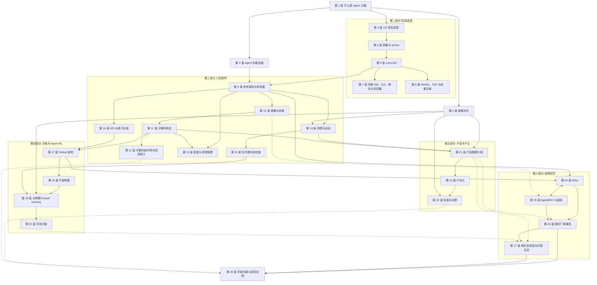

# AI Agent 沙箱

材料截至 2026 年 10 月初。约 40 万汉字正文，28 章，附录 A–E。

这本书把 AI Agent 沙箱当作与 GPU 集群、分布式存储同一量级的系统基础设施来写：它同时是 Agent RL 训练的 rollout 底座、评测的受控环境和面向用户的产品执行环境。以工业实践为主线，安全为辅线；每个数字都标明来源类型，冲突并列，"未披露"作为结论写出。

## 目录

- [前言](00-preface.md)
- [凡例](STYLE.md)
- [导读](#导读)

**第一部分　定义与问题**

- [第 1 章　什么是 Agent 沙箱（三场景：训练 / 评测 / 产品推理）](01-what-is-an-agent-sandbox.md)
- [第 2 章　两类对手：被利用的代理人与作为对手的模型](02-two-adversaries.md)
- [第 3 章　Agent 负载刻画（突发、稀疏、有状态、低扇出、可中断）](03-agent-workload-characterization.md)

**第二部分　隔离原语**

- [第 4 章　OS 原生原语（Seatbelt、bubblewrap、Landlock、seccomp）](04-os-native-primitives.md)
- [第 5 章　容器与 gVisor](05-containers-and-gvisor.md)
- [第 6 章　microVM（Firecracker、Cloud Hypervisor、libkrun、PVM、CubeSandbox）](06-microvm.md)
- [第 7 章　完整 VM、GUI、移动与浏览器环境](07-full-vm-gui-mobile-browser.md)
- [第 8 章　WASM、TEE 与轻量方案](08-wasm-tee-lightweight.md)

**第三部分　工业级沙箱的八层架构**

- [第 9 章　参考架构与控制面](09-reference-architecture-control-plane.md)
- [第 10 章　镜像与存储](10-images-and-storage.md)
- [第 11 章　沙箱内状态：快照、fork 与检查点](11-in-sandbox-state.md)
- [第 12 章　沙箱外副作用与回滚语义](12-external-side-effects-rollback.md)
- [第 13 章　密度与资源管理](13-density-and-resources.md)
- [第 14 章　网络与出站](14-network-and-egress.md)
- [第 15 章　包代理与供应链](15-package-proxy-supply-chain.md)
- [第 16 章　API 与接口标准（E2B 协议、OpenEnv、MCP）](16-api-and-interface-standards.md)

**第四部分　沙箱与 Agent RL**

- [第 17 章　Rollout 架构与 RL 框架集成](17-rollout-architecture-rl-integration.md)
- [第 18 章　环境构建与规模化](18-environment-construction-at-scale.md)
- [第 19 章　训练期 reward hacking 与遏制](19-training-reward-hacking.md)
- [第 20 章　评测沙箱](20-evaluation-sandboxes.md)

**第五部分　产品与产业**

- [第 21 章　产品推理沙箱](21-product-inference-sandboxes.md)
- [第 22 章　沙箱与环境的产业化](22-industrialization.md)
- [第 23 章　标准与治理](23-standards-and-governance.md)

**第六部分　案例研究**

- [第 24 章　DeepSeek DSec：把沙箱做成弹性执行平台](24-deepseek-dsec.md)
- [第 25 章　AgentENV 与清华 MADSys 谱系（TrEnv → AgentENV → DSec，推断）](25-agentenv-madsys-lineage.md)
- [第 26 章　国内厂商横览（披露矩阵）](26-china-vendors-disclosure-matrix.md)
- [第 27 章　海外实验室与开源生态（披露矩阵）](27-overseas-labs-open-source.md)

**第七部分　前沿**

- [第 28 章　开放工程问题与研究议程](28-open-problems-research-agenda.md)

**附录**

- [附录 A　术语表](91-appendix-a-glossary.md)
- [附录 B　关键数字溯源表](92-appendix-b-number-provenance.md)
- [附录 C　各系统 API 对照](93-appendix-c-api-comparison.md)
- [附录 D　负载刻画模板](94-appendix-d-workload-template.md)
- [附录 E　文献库](95-appendix-e-bibliography.md)

编写用文件：[`OUTLINE.md`](OUTLINE.md)（详细目录与每章要点）、[`STYLE.md`](STYLE.md)（凡例）、[`FIGURE-GUIDE.md`](FIGURE-GUIDE.md)（图的规约）。

## 导读

这篇导读回答四个问题：这本书说了什么，怎样组织，从哪里读起，附录怎样用。它不引入正文之外的事实。每条论断都附有章号，论证、限定条件与出处请回到对应章节查看。体例上的约定（来源类型、"推断""本书建议""未披露"的含义）见《凡例》与附录 A 开头的"用词规范"。

### 一、全书一页纸

本书讨论的对象是 Agent 沙箱：为 LLM Agent 执行代码、调用工具、操作界面而提供的隔离执行实例及其配套设施。全书沿四条线组织：三场景（训练、评测、产品推理）、八层架构（①接入与 API、②控制面、③节点运行时、④镜像与存储、⑤状态管理、⑥密度与资源、⑦网络与出站、⑧RL 集成与完整性）、两类对手（被利用的代理人；作为对手的模型），以及贯穿其中的第二主线"状态"（第 1 章图 1-1）。下面十条是全书的核心论断，提炼自第 1 章 1.5.3 节"全书的主要判断"与第 28 章 28.1 节"八个趋势回顾"。

1. **Agent 沙箱是一类独立的负载。** Agent 训练负载的五个核心特征是突发、稀疏、有状态、低扇出、可中断（DSec 原文另有"异构""执行不可信"两项，合称七特征）。低镜像复用、高突发、长寿命有状态三者同时出现，所以它不是 serverless 负载，serverless 的经典答案要重新加权：按需加载更必要，P2P 与预热退为辅助，内存成为第一约束。这一判断的经验基础很窄，产品、GUI 与评测负载几乎没有刻画（第 1、3 章；28.1.1 节）。

2. **三场景方向相反，却落在同一底座上。** 训练要突发下的创建吞吐，产品推理要单次交互的时延；评测批量小、状态短，对手却是最强的模型。接口可以共用，第②层（控制面）与第④层（镜像与存储）的后端难以共用，第⑧层（RL 集成与完整性）不能共用。生命周期层向 E2B 协议收敛，环境语义层向 Gym 式接口加 MCP 收敛，两层都缺少训练场景必需的七个概念（第 1、9、16 章）。

3. **两类对手需要不同的防线。** 防"被利用的代理人"，语义层能力控制更有效；默认拒绝加白名单只回答了"连哪里"，凭据位置决定被注入后的损失。防"作为对手的模型"，隔离强度与基础设施配置的正确性才是关键（第 2、14、21 章）。

4. **原语很少被攻破，失效多在原语周围。** 2025–2026 年本地沙箱的失效几乎都发生在原语周围的"策略管道"上。多租户场景中，microVM（微虚拟机）已是 Agent 沙箱的默认选项，但所有启动与密度数字都是厂商自报或二手转述，没有独立的横向基准；训练集群是"单租户、但租户不可信"，DSec 把 SWE 与工具调用任务放在容器里，是信任模型、密度与兼容性三者权衡的结果（第 4、5、6 章）。

5. **存储取代隔离原语成为竞争点，暂停是成本杠杆。** 差异化在第④、⑤层，分水岭在第⑧层，公开资料的空白在第②层。Agent RL 的镜像负载是"库大、扇出低、读得少、来得猛"；密度的瓶颈是内存而不是 CPU，暂停在等待期把整个沙箱移出内存。AgentENV 以暂停为中心，DSec 以密度为中心（第 9、10、13、25 章；28.1.2、28.1.3 节）。

6. **rollout 状态归谁，是训练沙箱的分水岭。** rollout（一次策略与环境交互直至结束的完整采样过程，也称轨迹展开）进行到一半时，状态分布在 GPU、harness（外壳/评测框架，负责驱动 Agent 循环、工具与打分）、沙箱与验证器四处，必须指定一方为事实来源；明确回答了这个问题的公开系统只有 DSec 与 ProRL Agent（第 17、24 章；28.1.4 节）。

7. **沙箱内的状态可以回滚，沙箱外的副作用必须事务化或者禁止。** 两者之间的出站通道要按"只读、预填充、不能代取任意 URL"来设计。检查点正从"一次快照、多次恢复"变成"反复、增量、藏在等待时间里"；快照止于沙箱边界，外部副作用的事务化在工业界还没有一手实践记录；包代理不是缓存，而是一条出站通道，本书建议把包通路从网络层搬到存储层（第 11、12、14、15 章）。

8. **被训练的模型是训练集群里最有动机的攻击者。** 它瞄准的往往是答案可达的通道（.git 历史、上游网络、包代理、harness 内部），而不是内核；生产对策几乎都没有量化效果。环境构建正在被 Agent 自动化，构建流水线是 reward hacking（奖励投机，指模型以非预期途径拿到奖励）的上游攻击面。评测环境本身是安全边界的一部分，隔离级别是评测规格的一部分，"离线"必须验证，不能声明（第 18、19、20 章）。

9. **沙箱与隔离已写入非强制的实践指南和实验室治理框架，但尚未进入任何强制性标准或法规。** 现有规范几乎都只针对"被利用的代理人"，没有覆盖训练与评测中"作为对手的模型"（在本书检索范围内；第 23 章，28.1 节"关于标准的补充判断"）。

10. **披露格局不对称，底层正在变成公共品。** 国内模型公司公开训练侧，产品沙箱信息只经云厂商客户案例间接可见；美国闭源前沿实验室公开产品沙箱与事故复盘，训练环境几乎不透明。披露开始转向失败率、构建成功率等运维指标；竞争集中在模型与数据上，沙箱的底层组件正在变成公共品（推断）。沙箱即服务与 RL 环境市场没有可信的市场规模数字，也没有独立基准（第 22、26、27 章；28.1.6、28.1.8 节）。

### 二、七个部分

**第一部分　定义与问题（第 1–3 章）。** 这一部分搭框架。第 1 章说明"沙箱""环境""沙箱平台"的区别，用八个维度对照训练、评测、产品推理三种场景，解释为什么训练负载不是 serverless、为什么接口能共用而后端不能，并给出全书地图、证据标注约定、主要判断与读者路线图。第 2 章定义两类对手，把混淆代理人、致命三要素、提示注入与 reward hacking、环境篡改、逃逸放进同一张威胁地图。第 3 章刻画负载五特征，解释"空闲"的几种口径为何得出 98%、90%、55%–60% 这样看似矛盾的数字，并指出产品侧与 GUI 负载几乎没有刻画。

**第二部分　隔离原语（第 4–8 章）。** 这一部分自下而上介绍隔离技术：OS 原生原语（Seatbelt、bubblewrap、Landlock、seccomp）、容器与 gVisor、microVM、完整 VM 与 GUI、移动和浏览器环境，以及 WASM、TEE 与轻量方案。它不评判"哪种原语最强"，而是说明每种原语适合什么负载与信任模型，以及失效常出在哪里：本地沙箱出在策略管道，GUI 环境的瓶颈已经转到廉价地复制与回滚 GUI 状态，TEE 防运营方而不防模型。

**第三部分　工业级沙箱的八层架构（第 9–16 章）。** 这是全书的主体。第 9 章给出八层参考架构并讨论控制面；第 10 章写镜像与存储；第 11、12 章写状态，前者是沙箱内的快照、fork 与检查点，后者是沙箱外副作用与回滚语义；第 13 章写密度与资源；第 14、15 章写网络与出站、包代理与供应链；第 16 章写 API 与接口标准（E2B 协议、OpenEnv、MCP）。第 10–13 章各设"谱系"边栏，交代机制的 serverless 源流。

**第四部分　沙箱与 Agent RL（第 17–20 章）。** 这一部分写训练与评测。第 17 章讨论 rollout 架构与 RL 框架集成，核心是 rollout 状态的归属；第 18 章写环境构建与规模化，包括由 Agent 自动化的环境构建；第 19 章写训练期 reward hacking 及其遏制，按取回型与篡改型二分；第 20 章写评测沙箱，论证隔离级别为什么必须写进评测规格。

**第五部分　产品与产业（第 21–23 章）。** 第 21 章把产品沙箱分为三种范式：一次性短命容器、任务级临时 VM 或容器、有状态长期 VM，并论证决定用户风险的是凭据位置而不是隔离档位。第 22 章写沙箱即服务与 RL 环境市场，包括计费模式与公开标价。第 23 章写标准与治理，逐份梳理实践指南、实验室治理框架与标准文件中关于沙箱的条款。

**第六部分　案例研究（第 24–27 章）。** 第 24 章用八层架构逐层拆解 DeepSeek DSec，这是迄今大模型公司对自家训练沙箱最完整的一手披露；第 25 章写 AgentENV 与清华 MADSys 谱系（TrEnv → AgentENV → DSec，推断，基于作者重合），两章成对阅读。第 26、27 章分别用披露矩阵横览国内厂商与海外实验室、开源生态，每一格要么是事实加出处，要么是"未披露"。

**第七部分　前沿（第 28 章）。** 第 28 章用八个趋势收束全书，把第 3–27 章散落的空白归并为 13 项开放工程问题与 12 项安全线研究方向，提出把隔离强度、出站控制、单 episode 算力上限与轨迹监控作为"遏制预算"联合优化，并给出一份最小可发表实验清单与统一口径测量方案（均为本书建议）。

### 三、阅读路线

无论走哪条路线，都建议先读第 1、3 章，并把附录 B 当作查数字的工具。第 1 章表 1-4 是完整的读者路线图；下面摘出三类主要读者的路线，另两类附在最后。

**RL 基础设施工程师。** 关心怎样拉起、暂停、回收几十万个有状态沙箱，以及 rollout 状态归谁。建议路线：第 3 → 9 → 10 → 11 → 13 → 17 → 18 → 24 → 25 章；再读第 19 章（完整性）、第 16 章（接口）。可略读第 7 章（除非做 GUI）和第 22 章。

**评测平台与安全研究者。** 关心怎样让"离线"可验证、隔离设置怎样影响分数、模型能做什么。建议路线：第 2 → 5 → 14 → 15 → 19 → 20 章；再读第 12 章（不可逆效果）、第 23 章。可略读第 10、13 章。

**Agent 产品运行时工程师。** 关心选什么隔离档位、凭据放在哪里、怎样计费与休眠。建议路线：第 2 → 4 → 6 → 14 → 21 → 22 章；再读第 11 章（休眠与 fork）、第 16 章（E2B 协议）。可略读第 17、18 章。

表 1-4 另列了两类读者。**系统方向研究者与研究生**可按第 3 → 9 → 10 → 11 → 12 → 13 章读，并读各章"谱系"边栏与第 25、28 章，略读第 22、26、27 章的商业细节；**技术管理者、投资与标准制定人员**可按第 1 → 2 → 22 → 23 → 26 → 27 章读，并参考附录 B，略读第 4–15 章的机制细节。

前置知识方面，读者需要 Linux 系统编程与容器基础；RL 只要求知道 rollout、reward、GRPO 这类概念。每章开头的"本章导读"列出读完该章应能回答的问题，章末的"本章小结"可以作为跳读时的替代。边栏是补充，跳过它不影响正文论证。

### 四、怎样使用附录

**附录 A　术语表。** 开头的"用词规范"规定译名、计数单位与框架性名称，是《凡例》第二节的细则；其后按主题分组，每条给出定义、易混淆项和首次出现的章。遇到不熟悉的术语，或拿不准"沙箱"与"环境"、"快照"与"检查点"、"暂停"与"休眠"该怎样区分时，先查这里。

**附录 B　关键数字溯源表。** 全书数字的最终依据。它按章分区，编号写作 Bnn-xx（附录 C 的专用数字写作 BC-xx），每行列出原文数字、口径、来源、来源类型、日期、可信度、冲突备注与使用章节。另有两节值得单独留意："冲突数字登记"（C-xx）给出每条冲突的判断与建议措辞；"不应引用的数字"（X-xx）列出流传较广、但已被一手来源纠正的说法。引用本书中的任何数字之前，建议先在附录 B 中找到它的编号，确认口径与可信度；正文与附录 B 不一致时，以附录 B 为准。

**附录 C　各系统 API 对照。** 把 15 个沙箱系统的接口名按生命周期与状态，网络、凭据、I/O 与集成，训练场景缺失概念三张表并列，接口名原样照录。选型或设计接口时可以查它，也可以对照第 16 章的七个缺失概念来读。附录 C 是 2026 年 10 月初的切片，"文档未见（10-05）"不等于该系统没有这项能力；引用时以所注的提交号与读取日期为准。

**附录 D　负载刻画模板。** 以第 3 章表 3-6 为底稿，给出 48 个字段的填写模板，以及 DSec、Kimi K3/AgentENV、快手与 RollArt 三份示例，空格写"未披露"。它有两种用法：报告自己系统的负载，或者判断一份公开数据缺了什么。

**附录 E　文献库。** 全书引用的文献，每条只登记一次，放在主章节下，其他相关章节列入"另见"。核实状态分五档：一手已核实、仅摘要或二手、背景知识未核实、存在冲突、无法访问。引用"仅摘要或二手"及以下各档的条目时，应回到原文。

### 五、章节依赖关系

下图给出章节之间的主要依赖：箭头从先读的章指向后读的章。实线表示后一章直接使用前一章的框架或机制，虚线表示较弱的参照关系。图中没有画出的引用，以各章交叉引用为准。

**图　章节依赖关系**（示意图，依据第 1 章图 1-1、表 1-4 与各章交叉引用绘制；箭头所示的先后为本书建议的阅读顺序，不是唯一读法）

读这张图有三点提示。第一，第 1、2、3 章是几乎所有后续章节的前提，尤其是三场景、两类对手与负载五特征三套框架。第二，第三部分内部有两条最紧的链：第 10 → 11 → 12 章（存储到状态，再到沙箱外副作用），第 14 → 15 章（出站到包代理）；第四部分的第 19 章同时依赖这两条链。第三，第 24、25 章需要前面八层架构的词汇才能读顺，二者互相参照；第 28 章则汇总全书，适合最后读，也适合在读完第 1 章后先浏览，以了解本书认为哪些问题还没有答案。

## 已知待补

DSec 署名作者人数（131）待以论文 PDF 复核；火山引擎、百度智能云沙箱定价，Check Point 报告原文，TC260 TR-005 附件需人工用浏览器取得；附录 C 的产品接口变化快，发布新版前需复核。
