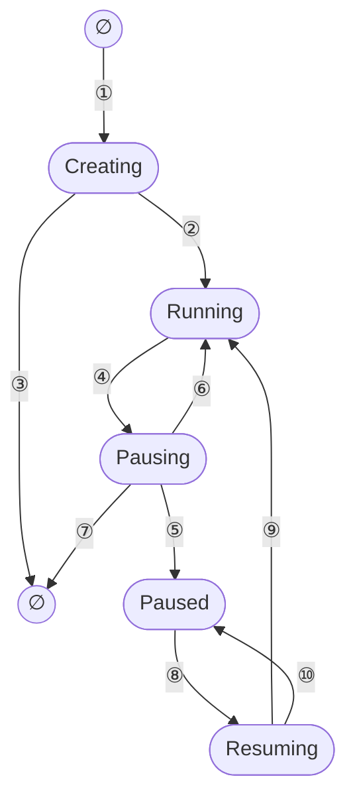
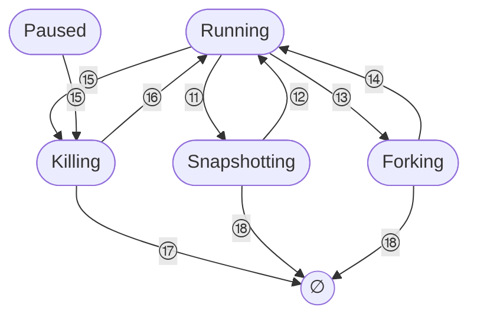

# 19 · 状态机与并发控制

> 一台沙箱在同一时刻可能同时被 API 请求、代理的自动恢复、过期回收任务与关闭流程操作，而其中最慢的操作要跑好几秒。
> orchestrator 不用一把贯穿始终的大锁，而是把「谁正在操作这台沙箱」写进一个显式的状态字段，
> 用比较并交换（CAS）推进它，用 `watch` 通道让后来者等待。本篇讲这台状态机的八个状态、每条转换的条件、
> 等待与取消的机制，以及仓库里的测试怎样验证它。
>
> **读者**：工程师。　**预备**：[第 10 篇 · 节点进程与对象模型](10-node-process-and-object-model.md)、[第 07 篇 · Rust 异步](07-rust-async-primer.md)。
> **代码**：`src/orchestrator/types.rs`、`src/orchestrator/store/mod.rs`、`src/orchestrator/store/in_memory.rs`、`src/orchestrator/service.rs`、`src/orchestrator/tests.rs`、`src/sandbox/mock.rs`

---

## 0. 本篇要回答的问题

1. 为什么 orchestrator 需要一个显式的沙箱状态，而不是看「有没有活着的 VM」？八个状态里哪些是稳定态，为什么没有 Killed？
2. 每条状态转换的触发者是谁、CAS 的期望集合是什么、失败时退回哪里？
3. 一个调用方怎样等另一个调用方的转换结束？`watch` 通道为什么必须用 `send_replace`？
4. HTTP 调用方中途断开时，正在进行的 pause 或 delete 会怎样？
5. 两个 pause、两个 resume、pause 与 delete 同时到达时，各自得到什么结果？
6. 这些并发语义靠什么测试来保证，测试覆盖不到什么？

---

## 1. 问题：一台沙箱，多个操作者

一个节点上的 `server` 进程里，能改变一台沙箱命运的来源至少有五个：
控制面 API（create、pause、resume、delete、snapshot、fork、connect 与改 TTL）、
反向代理收到发往暂停沙箱的请求时触发的自动恢复（[第 17 篇](17-reverse-proxy.md)）、
每秒一轮的过期回收任务（[第 23 篇](23-auto-eviction-and-ttl.md)）、
进程关闭时把运行中沙箱逐个暂停的流程（[第 22 篇](22-persistence-across-restarts.md)），
以及模板构建器在构建结束时删除自己的 builder VM（[第 52 篇](52-template-builder.md)）。

这些操作的耗时差别很大。查询只读一份元数据；pause 要打 Firecracker 快照、导出脏页、写一层 overlaybd 层（[第 42 篇](42-memory-snapshot-over-ublk.md)）；
带卷的 delete 还要冻结 guest 文件系统并把卷的可写层发布到快照仓库（[第 21 篇](21-deletion-and-volume-capture.md)）。
如果不加约束，会出现三类错误：两个 pause 各自导出一遍内存；delete 把状态写成「正在删除」之后，
慢一步的 pause 又把最终状态写成 Paused，删除被覆盖；resume 刚把 VM 拉起，keep-alive 却因为看到中间状态而返回失败。

最直白的做法是每台沙箱一把互斥锁，任何操作从头到尾持有它。它的问题有三个。
第一，查询与代理路由也得排队，一次几秒的 pause 会让同一沙箱的所有只读请求一起等待。
第二，排队的人只知道「锁被占着」，不知道占着它的是什么操作，因而无法做「对方正在 pause，我等它的结果就行」这种合并。
第三，异步代码里持锁的 future 一旦被丢弃，锁自动释放，但沙箱可能停在半途。

AgentENV 的做法是把「谁正在操作」写成数据：元数据里的 `state` 字段既是沙箱的生命周期阶段，也是一把**逻辑锁**。
进入一个过渡态就等于拿到了这把锁，离开过渡态就等于释放它；拿锁靠 CAS，等锁靠 `watch` 通道。
真正调用后端的那段代码另外持有每个沙箱句柄上的 `tokio::sync::Mutex`，但那把锁只负责把对同一个 VM 的调用串行化，不承担生命周期语义。

---

## 2. 八个状态

`SandboxState`（`src/orchestrator/types.rs`）有八个变体：

| 状态 | 类别 | 含义 | 有无活着的 VM 句柄 |
|---|---|---|---|
| `Creating` | 过渡 | 新沙箱已启动 Firecracker，等待 envd 就绪 | 有 |
| `Resuming` | 过渡 | 从暂停状态拉起，等待就绪 | 构建后才有 |
| `Running` | 稳定 | 可接流量、可被操作 | 有 |
| `Snapshotting` | 过渡 | 正在捕获快照或封存卷，结束后回到 Running | 有 |
| `Forking` | 过渡 | 正在从本沙箱分叉子沙箱，结束后回到 Running | 有 |
| `Pausing` | 过渡 | 正在暂停并落盘 | 已摘出句柄表 |
| `Paused` | 稳定 | 只剩快照产物与一条持久记录 | 无 |
| `Killing` | 过渡 | 正在删除 | 删除推进中摘出 |

只有 `Running` 与 `Paused` 是稳定态。对外 API 把它们之外的状态折叠成 running 或 paused（[第 14 篇](14-sandbox-api.md)），
所以用户看不到过渡态，但服务端的每个操作都要面对它们。

表里没有 `Killed`。删除完成时 `remove_deleted_sandbox()` 直接调用 `MetadataStore::remove()`，记录从 store 里消失，
等待者从 `watch` 通道收到 `None`。这样「已删除」与「从未存在」在 store 层面无法区分，
代价是删除后的查询只能返回 404，而不能返回「它曾经存在、已被删除」；收益是 store 里没有需要另行清理的墓碑记录。

元数据本体是 `SandboxMetadata`（`src/orchestrator/store/metadata.rs`），状态只是其中一个字段，其余有 TTL、资源、网络策略、卷挂载等。
状态与运行期的另外两张表是分开的：`sandboxes` 存活着的 VM 句柄，`proxy_routes` 存可接流量的路由，
三者的分工与锁顺序在[第 10 篇](10-node-process-and-object-model.md)讲过。
回顾：句柄表与路由表总是按「先 `sandboxes`、后 `proxy_routes`」的顺序加锁，
`detach_sandbox_handle_and_route()` 与 `upsert_proxy_route_if_current_handle()` 的注释都写明了这一点。

---

## 3. 转换图与转换表

全部转换画在一张图里会让十几条带标签的边挤在 Running 周围，所以分成两张：
第一张是创建、暂停与恢复的主干，第二张是在 Running 上「借出再归还」的旁路，以及删除。
图中的 `∅` 表示 store 里没有这条记录。



| 编号 | 触发 | CAS 期望集合 | 代码位置 |
|---|---|---|---|
| ① | create：`start_nowait()` 成功之后才写入记录 | 无，`add()` 要求记录不存在 | `launch_sandbox()` |
| ② | `wait_for_ready()` 成功 | `[Creating]` | `launch_sandbox()` 的 `update_if_state()` |
| ③ | 任一启动阶段失败或进程开始关闭 | 无，直接 `remove()` | `rollback_failed_launch_metadata()` |
| ④ | 显式 pause；或过期且 `timeout_action = Pause` | `[Running]` | `pause_sandbox_inner()`、`claim_expired_running_sandbox()` |
| ⑤ | 后端 pause 成功且持久化成功 | 无条件 `update()` | `pause_sandbox_impl()` |
| ⑥ | 可恢复失败，或持久化失败后原地 resume 成功 | `[Pausing]` | `pause_sandbox_impl()` |
| ⑦ | 终止性失败，或句柄已不在表里 | 无，直接 `remove()` | `pause_sandbox_impl()` |
| ⑧ | resume，包括代理触发的自动恢复 | `[Paused]` | `resume_sandbox_inner()` |
| ⑨ | 恢复后就绪 | `[Resuming]` | `launch_sandbox()` |
| ⑩ | 恢复失败，或持久记录标记失败 | `[Resuming]` | `rollback_failed_launch_metadata()`、`resume_sandbox_inner()` |

⑤ 是这里唯一一次无条件写。能这样写，是因为 Pausing 态下其它所有操作都在等待或被拒绝，
持有逻辑锁的 pause 任务是唯一的写者；它在写之前先读一遍最新元数据，只改 `state` 与 `paused_state`。



| 编号 | 触发 | CAS 期望集合 | 代码位置 |
|---|---|---|---|
| ⑪ ⑫ | capture snapshot 或 snapshot volumes 的开始与结束（含可恢复失败） | `[Running]` / `[Snapshotting]` | `begin_snapshot_operation()`、`finish_snapshot_operation()`、`fail_snapshot_operation()` |
| ⑬ ⑭ | fork 的开始与结束（含可恢复失败） | `[Running]` / `[Forking]` | `fork_sandbox_inner()` |
| ⑮ | delete；或过期且 `timeout_action = Delete` | `[Running, Paused]`；过期回收为 `[Running]` | `delete_sandbox_inner()`、`claim_expired_running_sandbox()` |
| ⑯ | 删除时卷捕获出现可恢复失败，退回删除前的状态（图中只画了退回 Running） | `[Killing]` | `delete_sandbox_impl()` |
| ⑰ | 删除完成 | 无，直接 `remove()` | `remove_deleted_sandbox()` |
| ⑱ | 快照或 fork 的终止性失败 | 无，直接 `remove()` | `fail_snapshot_operation()`、`fork_sandbox_inner()` |

有两处不在图里。其一，fork 出来的子沙箱不经过 Creating：后端把子 VM 全部启动好以后，
`fork_sandbox_inner()` 直接以 Running 状态 `add()` 进 store，失败的子沙箱从不出现在 store 里。
其二，Creating 只在 `start_nowait()` 成功之后才写入，所以 Firecracker 启动期间 store 里没有这台沙箱；
它的 ID 在 `create_sandbox()` 内部生成，调用方此时还不知道 ID，也就无从查询。
模板构建器的 builder VM 是例外，构建 ID 预先已知，于是用一张单独的 `template_build_ids` 表在这段时间里占住路由（`list_sandbox_ids()`）。
启动流水线的每一步与失败回滚在[第 20 篇](20-launch-plan-and-rollback.md)展开。

---

## 4. CAS 原语

`MetadataStore`（`src/orchestrator/store/mod.rs`）是一个 trait，核心是两个条件写：

- `update_state_if_state(id, new_state, expected_states)`：当前状态在期望集合里才改状态，返回**改之前**的状态；
- `update_if_state(id, expected_states, update)`：当前状态在期望集合里才执行回调，回调可以改任意字段，返回改前与改后两份元数据。

不满足期望时，两者都返回 `StoreError::StateConflict { expected_states, actual_state }`。
`actual_state` 是这套设计的关键：调用方拿到冲突时知道对方处在什么状态，于是能分情况处理，而不是一律报 409。
`pause_sandbox_inner()` 是最典型的例子：

```rust
match self.store
    .update_state_if_state(&sandbox_id, SandboxState::Pausing, &[SandboxState::Running])
    .await
{
    Ok(_) => {}
    Err(StoreError::StateConflict { actual_state, .. }) => {
        return match actual_state {
            SandboxState::Pausing => self.join_concurrent_pause(sandbox_id).await,
            SandboxState::Paused => Ok(()),
            SandboxState::Killing => Err(OrchestratorError::SandboxNotFound(sandbox_id)),
            _ => Err(OrchestratorError::InvalidSandboxState { sandbox_id, state: actual_state }),
        };
    }
    Err(err) => return Err(OrchestratorError::from(err)),
}
```

已在 Pausing 就去等对方的结果，已经 Paused 就直接算成功，正在 Killing 就当作不存在。
「Killing 映射为 SandboxNotFound」在 `resume_sandbox_inner()`、`begin_snapshot_operation()`、`fork_sandbox_inner()` 里都是同一个口径：
从调用方的角度看，一台正在被删除的沙箱已经没有了。

`update_if_state()` 的回调是同步闭包。trait 的注释写明了理由：实现可以在持有元数据锁时执行回调，所以回调里不能做异步操作。
这让「判断加修改」能放进同一个临界区。两处用法值得一提：
`claim_expired_running_sandbox()` 在回调里再判一次 `is_expired(cutoff)`，防止列出过期沙箱之后 keep-alive 又延长了 TTL；
`keep_alive_for()` 在回调里比较新旧过期时间，`allow_shorter = false` 时不缩短。
代价是回调里不能调用后端，凡是需要 I/O 才能决定的事情，都得先做完 I/O，再用 CAS 校验前提是否仍然成立。

目前唯一的实现是 `InMemoryMetadataStore`（`src/orchestrator/store/in_memory.rs`）：
一把 `tokio::sync::RwLock` 包住整个 `StoreInner`，里面是 `HashMap<SandboxId, SandboxRecord>` 与按过期时间排序的 `BTreeSet<(SystemTime, SandboxId)>`。
所有沙箱的所有写操作共用这一把锁，但临界区里没有 `.await` 之外的阻塞、也没有后端调用，持有时间很短。
过期索引与记录在同一把锁下维护，`update_if_state()` 只在 `expires_at` 真的变化时才重建索引项（[第 23 篇](23-auto-eviction-and-ttl.md)）。
store 只在内存里，进程重启后只有 Paused 沙箱能从持久层恢复回来（[第 22 篇](22-persistence-across-restarts.md)）。

---

## 5. 等待一次转换结束

拿不到逻辑锁的一方需要等。`SandboxRecord` 里除了元数据还有一个 `watch::Sender<Option<SandboxState>>`，
每次状态变化都把新状态送进去，记录被删除时送 `None`。
`wait_while_in_states(id, transitional_states)` 的步骤是：

1. 在读锁下订阅这条记录的 `watch` 通道；记录不存在就直接返回 `None`；
2. 调用 `Receiver::wait_for()`，谓词是「值为 `None`，或状态不在给定的过渡态集合里」；当前值已满足时立即返回，不挂起；
3. 醒来后重新读一次 `inner` 拿最新元数据返回。

第 3 步与醒来之间有一个窗口，状态可能又变了。注释要求调用方把返回值当作提示而不是事实，动手之前再用 CAS 校验一遍。
`delete_sandbox_inner()` 就是这样写的：等完之后不直接删，而是回到循环开头重新尝试 CAS。

通知的发送时机也有讲究。`update()`、`update_state_if_state()`、`update_if_state()` 都在释放写锁**之后**才发通知，
这样被唤醒的任务去读 `inner` 时不会撞上通知者自己还没放开的写锁，而且读到的一定是触发通知的那个状态或更新的状态。

`notify_state()` 用的是 `send_replace()` 而不是 `send()`。原因在 `add()` 里：
记录创建时调用 `watch::channel(Some(state))` 得到 `(tx, _)`，初始的接收端立刻被丢弃。
tokio 的 `watch::Sender::send()` 在没有任何接收端时返回错误、**不更新通道里的值**；
如果此时恰好没有人在等，状态从 Pausing 变成 Paused 的通知就丢了，通道里还是 Pausing。
之后有人订阅，看到的初始值是陈旧的 Pausing，于是挂起等待一个已经发生过的转换。
`send_replace()` 无论有没有接收端都替换通道里的值，这个问题就不存在。

`Orchestrator::wait_for_transition()` 在 store 的等待外面套了一层 60 s 超时（`WAIT_TRANSITION_TIMEOUT`），
超时返回 `InvalidSandboxState { state: <仍然所处的过渡态> }`，记录被删则返回 `SandboxNotFound`。
常量的注释说明了用途：持有过渡态的任务如果 panic 而没有回滚，等待者不能无限期挂住。
这个兜底只解救等待者，不解救沙箱本身：过渡态没有人回滚，会一直停在那里。
另一个后果是合法的慢操作也会触发它。一台大内存沙箱的 pause，或一次要上传卷的 delete，若超过 60 s，
并发到达的第二个请求会拿到 InvalidSandboxState，尽管第一个操作仍在正常推进。
Firecracker 的 REST 调用本身没有超时（`src/sandbox/firecracker/socket.rs` 的 `UnixSocketClient::request()` 直接 await），
Firecracker 卡死时持有过渡态的任务不会结束，60 s 只让其它等待者放弃。

---

## 6. 取消安全：操作不随请求一起死

axum 在客户端断开连接时会丢弃 handler 的 future。如果 pause 的代码直接跑在 handler 的 future 里，
丢弃点可能落在「句柄已从表里摘出、后端快照做了一半」的位置：
沙箱停在 Pausing，句柄随 future 一起被 drop，没有任何代码负责把状态退回 Running。

`run_cancellation_safe()`（`src/orchestrator/service.rs`）把操作体 `tokio::spawn` 成一个独立任务，
handler 只等一个 `oneshot` 接收端。调用方被丢弃时，丢掉的只是接收端；任务继续跑完，
发送结果时发现没人收，只记一条 debug 日志「operation completed after caller stopped waiting」。
create、template builder 的创建、fork、delete、pause、resume、capture snapshot、snapshot volumes、
更新网络策略与 patch custom extension 参数都走这一层。
`keep_alive_for()`、查询与 `proxy_lookup_for()` 不走：它们要么只做一次 CAS，要么只读。

这一层保证的是**状态转换不会被调用方的取消打断**，代价有两个。
一是请求放弃后工作照做，资源照花，一次没人等的 create 仍然会把沙箱建出来并开始计 TTL。
二是任务如果 panic，`oneshot` 的发送端被丢弃，调用方拿到 `InternalError("operation task ended before reporting result")`，
沙箱停在过渡态，回到上一节 60 s 兜底的情形。

后端接口的文档注释说明了另一个依赖这一层的地方。
`SandboxBackend::freeze_and_snapshot_volumes()` 要求调用方「持有所有权直到完成并 thaw 或 stop；丢弃这个 future 不会取消 guest 内的 I/O」，
并明确说 orchestrator 用一个自有任务保护删除不被请求取消打断。
第 21 篇讲它为什么在冻结之前先登记 thaw 义务。

---

## 7. 同一沙箱上的并发操作

有了 CAS 与等待，几种常见的并发组合的结果如下。「已在进行」指先到者已经通过 CAS 进入的过渡态。

| 已在进行 | 新到达 | 结果 | 代码 |
|---|---|---|---|
| Pausing | pause | 等前者结束：Paused 返回成功；退回 Running 返回 `InvalidSandboxState(Running)`；变成 Killing 返回 404 | `join_concurrent_pause()` |
| （已是 Paused） | pause | 直接成功 | `pause_sandbox_inner()` |
| Resuming | resume | 等前者结束：Running 时用**自己的** TTL 参数更新；退回 Paused 返回 `InvalidSandboxState(Paused)` | `resume_sandbox_inner()`、`join_concurrent_resume()` |
| （已是 Running） | resume | 只按 `NewTimeout` 更新 TTL，`NewTimeout::None` 会清除过期时间 | `maybe_update_running_timeout()` |
| 任一过渡态 | delete | 等过渡结束，再重试 `[Running, Paused]` 的 CAS | `delete_sandbox_inner()` |
| Killing | delete | 第二个删除者在删除进度锁上排队，拿到锁后按进度续做或直接成功 | 第 21 篇 |
| Creating / Resuming / Snapshotting / Forking | keep-alive | 等过渡结束再判断，避免把中间态当成失败 | `keep_alive_for()` |
| Pausing / Killing | keep-alive | 立即返回 `InvalidSandboxState` | `keep_alive_for()` |
| 非 Running | snapshot / fork | Killing 返回 404，其余返回 `InvalidSandboxState` | `begin_snapshot_operation()`、`fork_sandbox_inner()` |

「等对方的结果」而不是「报冲突」，是为了让重复请求幂等：SDK 的重试、代理的自动恢复与用户的显式 resume 撞在一起时，
都应当看到同一个结局。代价是语义上的细微差别。
`join_concurrent_pause()` 在对方失败时返回的是 InvalidSandboxState(Running)，调用方看到的不是对方的真实错误，而是「沙箱现在在运行」；
`join_concurrent_resume()` 用后到者自己的 TTL 参数覆盖，两个参数不同的并发 resume 最终谁的 TTL 生效，取决于谁后执行 `maybe_update_running_timeout()`。

delete 的等待循环有一个刻意的选择：等到 Killing 结束之后也不直接返回，而是重试 CAS。
注释说明这是为了处理「进行中的删除回滚到稳定态」的情况，宁可再试一次，也不让两个删除者同时推进。

有两类操作不用逻辑锁。`replace_sandbox_network_policy()` 与 `patch_sandbox_custom_extension_params()` 先读状态确认是 Running，
再锁住句柄改后端，最后用 `update_if_state([Running])` 写回元数据。中间若有 pause 抢先进入 Pausing，最后一步会冲突：
句柄已被摘出时返回 `SandboxOperationConflict`；后端已改、元数据写回失败时返回 `InvalidSandboxState`。
后一种情况下运行中的 VM 已经用了新参数，元数据里却还是旧的。
`patch_sandbox_custom_extension_params_inner()` 的注释承认这个窗口，理由是这类状态与网络策略一样被视为暂态。
推论：一次与 pause 撞上的 `PUT /network`，暂停前的 VM 已经应用了新策略，暂停后的记录里保存的却是旧策略，resume 后以旧策略为准。

---

## 8. 怎样验证这台状态机

`src/orchestrator/tests.rs` 里有 104 个测试，都不启动真的 Firecracker，而是用两类替身构造交错。

后端替身在 `src/sandbox/mock.rs`。`MockBehavior` 按操作（`MockOperation::Pause`、`Stop`、`WaitForReady`、`SnapshotVolumes`、`ThawVolumes` 等）排队预设动作：
`Succeed`、`SucceedAfter(延迟)`、`Fail`、`FailTerminal`、`FailAfter`；还可以用 `set_on_operation()` 在某个操作发生时执行一个钩子。
store 替身在测试文件里：`ScriptedStore` 包住 `InMemoryMetadataStore`，能对 `add` 与 `update_if_state` 注入失败，
还带 `StoreClaimGate` 与 `StoreListGate` 两种由 `tokio::sync::Barrier` 组成的闸门，把一个操作卡在「已认领」或「已列出」之后。
另有 `ScriptedWaitStore`、`ConflictOnUpdateStore`、`RaceBeforeUpdateStore` 用来制造等待结果与 CAS 冲突。

测试里反复出现四种模式。

- **延迟加竞争**：给一个操作设 `SucceedAfter(200 ms)`，同时 spawn 另一个操作，用 `tokio::join!` 收齐结果，断言「允许的结局集合」。
  `orchestrator_keep_alive_during_resume_never_reports_resuming_state` 允许 keep-alive 成功或报 Paused，唯独不允许报 Resuming；
  `orchestrator_delete_during_pause_completes_cleanly` 要求无论谁赢，沙箱最终都不在 store 里。
- **闸门固定交错**：`auto_evict_claim_prevents_late_keep_alive_success` 让过期回收在认领之后停在闸门上，
  此时发起的 keep-alive 必须失败并报出认领后的状态，放开闸门后回收必须完成。这种测试的交错是确定的，不依赖调度运气。
- **逐阶段注入失败**：`launch_sandbox_shutdown_just_after_start_stops_without_persisting_state` 一类测试在启动流水线的每个检查点注入失败或关闭信号，
  检查回滚后的 store、路由与计数器（第 20 篇）。
- **模拟取消**：`orchestrator_concurrent_delete_calls_are_idempotent` 在第一个删除者卡在 stop 时 `abort()` 它，
  再并发发起三个删除，断言 stop 只被调用一次、删除最终完成、计数器归零。

断言的对象不只是返回值，还有三处旁证：`proxy_lookup_for()` 的结果（路由表与状态是否一致）、
`metrics_snapshot()` 的计数（第 24 篇讲它为什么从 store 现算）、以及 `MockBehavior` 记录的 stop 次数。

这套测试的边界也要说清楚。替身不覆盖 Firecracker、ublk-daemon 与 envd 的真实耗时与失败形态；
延迟加竞争类的测试只证明「这次调度下没出错」，不证明所有交错都正确。
仓库没有引入 loom 一类的交错枚举工具（推论：依据是 `Cargo.toml` 中未见相关依赖）。
真实组件上的生命周期由端到端套件覆盖（[第 63 篇](63-testing-and-benchmarks.md)）。

---

## 9. 与 e2b infra 的对照

e2b infra 把沙箱状态放在 API 服务的运行态存储里（memory 或 Redis），转换走 `StartRemoving()` 的三段式，
跨实例的等待者每 20 ms 轮询一次转移键。AgentENV 把状态放在每个节点 orchestrator 的内存里，用 CAS 加 `watch` 通道，
因为 scheduler 的绑定已经保证一台沙箱只由一个节点操作，状态机不需要跨进程协调。
代价是节点进程退出时，非 Paused 的状态全部丢失，只能靠关闭前的暂停与持久化弥补。

---

## 10. 小结

- `state` 字段既是生命周期阶段，也是逻辑锁：进入过渡态即拿锁，离开即放锁；后端调用另由句柄 `Mutex` 串行化。
- 八个状态里只有 Running 与 Paused 是稳定态；没有 Killed，删除即 `remove()`，等待者收到 `None`。
- 所有进入过渡态的转换都是带期望集合的 CAS；冲突时返回的 `actual_state` 让调用方能分情况合并、放行或拒绝。
- `update_if_state()` 的回调是同步的，「判断加修改」在同一临界区里完成；需要 I/O 的判断只能先做 I/O，再用 CAS 校验。
- 等待基于每条记录一个 `watch` 通道；通知在释放写锁后发出，并且必须用 `send_replace()`，否则无接收端时值不更新。
- `wait_for_transition()` 的 60 s 超时只解救等待者，不回滚卡住的过渡态；合法的慢操作也会让并发请求超时失败。
- `run_cancellation_safe()` 把生命周期操作放进独立任务，调用方取消不打断转换；代价是放弃的请求照样消耗资源。
- 重复的 pause、resume 合并到先到者的结果上；delete 遇到任何过渡态都先等再重试 CAS。
- 网络策略与扩展参数的更新不持逻辑锁，与 pause 撞上时 VM 与元数据可能短暂不一致。
- 104 个基于替身的测试用延迟、闸门、逐阶段注入与 abort 覆盖并发语义，但不覆盖真实组件的时序。

---

## 延伸阅读 / 下一篇

- [第 10 篇 · 节点进程与对象模型](10-node-process-and-object-model.md)：三张表与锁顺序。
- [第 21 篇 · 删除与卷的捕获提交](21-deletion-and-volume-capture.md)：Killing 态内部的可重入进度。
- [第 23 篇 · 自动驱逐与 TTL](23-auto-eviction-and-ttl.md)：过期索引与认领。
- [e2b 手册第 18 篇 · 沙箱生命周期 API](../e2b-infra/18-sandbox-lifecycle-api.md)、[e2b 手册第 20 篇 · 沙箱运行态存储](../e2b-infra/20-sandbox-state-storage.md)：同一组问题在 API 层的三段式做法。
- 下一篇：[第 20 篇 · launch plan 与失败回滚](20-launch-plan-and-rollback.md)。
