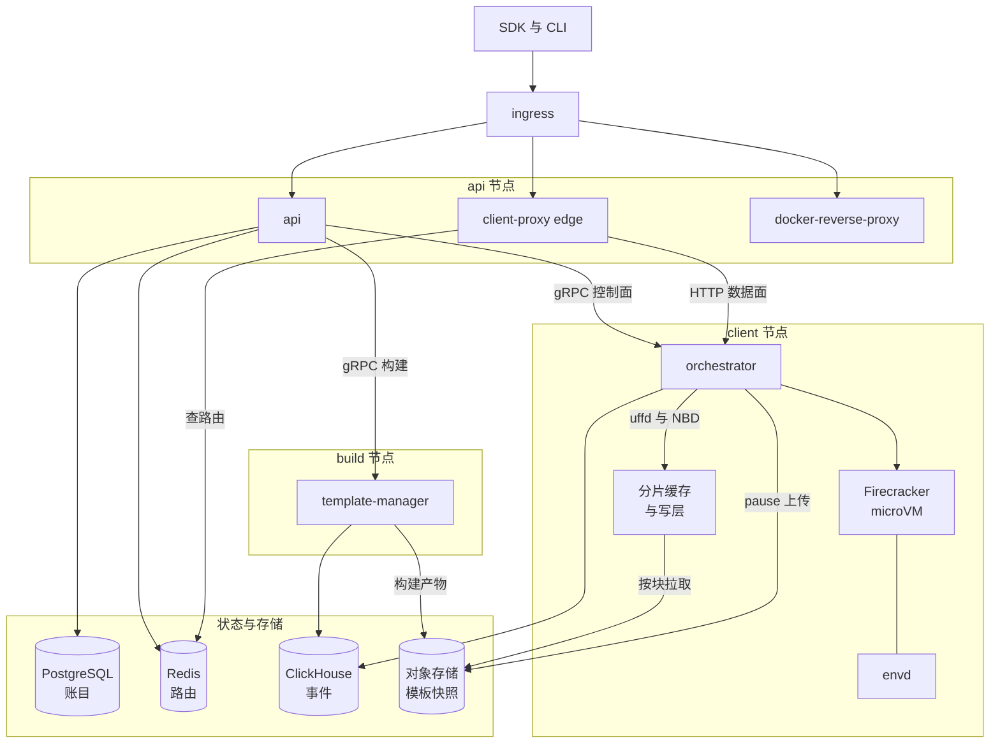

# 00 · 全书导读与系统总览

> 一篇读完全貌。e2b 解决什么问题、由哪些进程和存储组成、「沙箱从不冷启动」这条主线怎么把它们串起来、
> aarch64 适配版改了什么又付出了什么代价、这本书的九十一篇该按什么顺序读。
>
> **读者**：评审、决策者、第一天到岗的新人；也是所有读者的入口。　**预备**：无。
> **代码**：本篇不做新的代码考证，每个论断都指向展开它的那一篇。

---

## 0. 本篇要回答的问题

1. e2b 服务端基础设施解决什么问题？为什么这个问题不能用容器或者普通虚机直接解决？
2. 一共有几个进程、几类存储？各自守着什么，谁离开了谁就不能工作？
3. 「沙箱从不冷启动」这句话具体指什么？一台沙箱从被创建到被暂停，数据经过哪些部件？
4. ARM 适配版相对上游改了多少、改在哪几类地方、留下了哪些已知的后果？
5. 这套系统有几种部署形态，各自适合什么场合？
6. 我该从哪一篇开始读，读到哪一篇为止？

---

## 1. 问题与一句话架构

### 1.1 要执行的是一段不可信代码

大语言模型会生成代码，而生成的代码只有真的跑起来才有价值：装依赖、读写文件、访问网络、
启动长时间的服务进程。这段代码没有经过人的审阅，也没有稳定的来源，因此必须假定它是敌对的 ——
它可能试图读取同一台机器上别人的数据，可能耗尽 CPU 与内存，可能向外发起攻击。
与此同时，调用方是一个 Agent 的决策循环，它期望「要一台机器」这件事在一秒之内完成，
并且随时可以要一百台。

隔离强度与启动速度在这里直接冲突。容器共享宿主内核，起得快，但内核是一个几千万行的攻击面；
传统虚机隔离强，但一次开机要走固件、引导、内核初始化、用户态服务，几秒到几十秒起步。
这个取舍谱系与 e2b 的选择在[第 02 篇 · AI 代码沙箱](02-why-sandbox.md#3-隔离谱系)展开。

e2b 的答案是 microVM 加快照：用 Firecracker 提供硬件级隔离，用「从快照恢复」而不是「开机」
把启动代价挪走。这也是本书的主线。

### 1.2 一句话架构

一句话说：**一组无状态的多租户 API 进程，指挥一批宿主机上的 orchestrator，
把对象存储里的模板快照恢复成正在运行的 Firecracker microVM，并把公网 HTTP 流量按域名转发进去。**

这句话里有四个要素，对应本书的四大块内容：多租户账目（第三部分）、宿主运行时（第四部分）、
快照产物与构建（第五部分）、流量与沙箱内代理（第六、七部分）。

---

## 2. 六个进程与四类存储

### 2.1 进程

上游 2026.09 部署六个自研 Go 进程，加一个默认副本数为 0 的控制台后端与若干第三方组件。
完整清单、端口与部署形态见[第 10 篇 §2](10-system-architecture.md#2-进程清单)。

| 进程 | 一句话职责 | 跑在哪 | 展开 |
|---|---|---|---|
| api | 对外 REST API：认证、配额、模板与沙箱的增删改查、节点放置 | api 节点，多实例 | [第 15 篇](15-api-service-structure.md) |
| orchestrator | 宿主侧沙箱运行时：拉起 / 暂停 / 销毁 Firecracker，管内存、磁盘与网络 | 每台 client 节点一个 | [第 25 篇](25-orchestrator-process.md) |
| template-manager | 模板构建：拉镜像、造 rootfs、跑构建沙箱、上传产物 | 每台 build 节点一个 | [第 46 篇](46-template-manager-service.md) |
| client-proxy（edge） | 把 `<端口>-<沙箱 ID>.<域名>` 的 HTTP 流量转发到沙箱所在节点 | api 节点，多实例 | [第 53 篇](53-client-proxy-edge.md) |
| docker-reverse-proxy | 用 e2b 凭证换镜像仓库 token，代理 Docker Registry 协议 | api 节点 | [第 57 篇](57-docker-reverse-proxy.md) |
| envd | 沙箱内守护进程：执行进程、读写文件、转发用户端口 | 每个沙箱内一个 | [第 48 篇](48-envd-overview.md) |

有两处形态容易看错，先说明。第一，orchestrator 与 template-manager 是**同一个二进制**，
靠环境变量 `ORCHESTRATOR_SERVICES` 区分角色；构建器因此天然复用了运行时的全部能力，
代价是 build 节点上跑着一份用不到的沙箱服务端代码。第二，client-proxy 在 2026.09 是一个
纯粹的反向代理，`spec/openapi-edge.yml` 里那套 edge 接口在上游仓库内**只有客户端实现**
（[第 56 篇 §1](56-edge-api.md#1-一个刻意留下的缺口)）。

按「出错时谁受影响」划分，这些通信分成两类：控制面是 api 单向发起的 gRPC，
数据面是经 ingress、client-proxy、orchestrator 三层转发的 HTTP。控制面故障不影响已经跑起来的沙箱，
对象存储故障会（[第 10 篇 §3](10-system-architecture.md#3-控制面与数据面)）。

### 2.2 存储

数据落在四类共享存储加一份节点本地磁盘上。分层的理由是五种互不兼容的访问模式，
详见[第 13 篇 §1](13-storage-landscape.md#1-五类存储五种约束)；「谁读谁写」的矩阵在[§2](13-storage-landscape.md#2-进程--存储读写矩阵)。

| 存储 | 装什么 | 谁访问 | 丢了会怎样 |
|---|---|---|---|
| PostgreSQL | 团队、模板、build、快照记录等账目 | api、dashboard-api | 系统不可用，但已跑的沙箱不受影响 |
| Redis | 沙箱运行态、占位、路由目录、事件流 | api 读写，client-proxy 只读，orchestrator 只写事件 | 路由与到期管理失效 |
| ClickHouse | 沙箱与宿主的指标、事件 | orchestrator / template-manager 只写，api 查询 | 只影响观测 |
| 对象存储 | 模板与快照产物：memfile、rootfs、header、snapfile | 只有 orchestrator 与 template-manager | 新沙箱起不来，已跑的沙箱可能缺页失败 |
| 节点本地磁盘 | 分片缓存、overlay 写层、Firecracker 要 `mmap` 的文件 | 所在节点的 orchestrator | 该节点上的沙箱丢失 |

两条边界值得记住，因为它们解释了这套系统为什么能横向扩展：**api 不碰对象存储**（删产物走 gRPC 请
template-manager 代劳），**orchestrator 不碰 Postgres**（构建参数由 api 一次性带下来）。
收益是节点不需要数据库连接与桶写权限，代价是删除变成异步的跨进程调用，
且 orchestrator 无法在本地做任何需要查表的判断。

---

## 3. 主线：沙箱从不冷启动

### 3.1 这句话的准确含义

上游 2026.09 的 `Create` RPC 唯一的实现是 `Factory.ResumeSandbox()`，它总是从一份已有的快照
拉起虚拟机；冷启动的 `CreateSandbox()` 只被模板构建路径用到
（[第 27 篇 §1](27-resume-sandbox.md#1-恢复而不是启动)）。
所谓「创建一台沙箱」，实际是「从模板的快照恢复一台沙箱」。

于是整个系统变成一个循环：

- **造快照**：模板构建真的开一台 microVM，跑完安装与 start 命令，停在就绪状态，
  把这一刻冻成产物（[第 41 篇 §4](41-template-build-overview.md#4-主流程)）。
  产物不是镜像层，而是一台已经开机的虚拟机。
- **拉起**：恢复时不整份读入内存，而是把 guest 内存交给 userfaultfd、把 rootfs 交给 NBD，
  按缺页与按块从本地缓存或对象存储拉（第 30、31、33 篇）。
- **用完即弃或暂停**：到期时按 `AutoPause` 分岔，要么杀掉，要么暂停成一个**新的 build** ——
  一份只含改动块的差分加一张映射表（[第 37 篇](37-pause-and-snapshot.md)）。
- **新快照又能被拉起**，回到第二步。

这个循环有三个直接后果，本书后面反复回到它们：产物必须**不可变**（所以 pause 分配新 build ID
而不是原地改写，缓存因此不需要失效协议）；产物必须**可按偏移随机读**（所以有 header 这层映射表，
见[第 29 篇](29-template-artifact-format.md)）；暂停的成本必须**正比于改动量**而不是虚机规格
（所以整套方案压在「脏块判据」这一个点上，见[第 37 篇 §3](37-pause-and-snapshot.md#3-脏页判据)）。

### 3.2 全系统结构

### 3.3 一次走查

把上图按时间走一遍，就是[第 12 篇](12-sandbox-lifecycle-walkthrough.md)的内容，这里只给骨架。

SDK 调一次 `Sandbox.create()`，请求经 ingress 进 api。api 做认证、查团队配额、
把模板名解析成某一次 build 的规格（vCPU、内存、磁盘、内核与 Firecracker 版本都来自 build 记录，
不来自创建请求），在 Redis 里占位，再按放置算法挑一台 client 节点，发一个 gRPC 的 `Create`。

orchestrator 收到后走 `ResumeSandbox()`：并行地申请网络槽位、准备 rootfs overlay、
准备内存后端，三个 promise 收敛后才起 Firecracker 进程，让它加载 snapfile。
这里的关键握手是 Firecracker 通过 socket 把 userfaultfd 与内存区间映射交给宿主侧的 uffd 服务，
宿主收到才算就绪；此后 guest 的每一次缺页都由这个服务从本地分片缓存或对象存储填回
（[第 31 篇 §4](31-uffd-memory-backend.md#4-一次缺页)）。虚机恢复出来之后，envd 的 `/init` 负责换令牌、
对时、换环境变量 —— 因为这台 guest 是从别人的快照里醒来的。

沙箱可达之后，api 把「沙箱在哪台节点」写进 Redis 路由目录。此后 SDK 与沙箱之间的所有交互
都走另一条路：ingress → client-proxy → orchestrator 的沙箱代理 → envd，不再经过 api
（[第 53 篇 §3](53-client-proxy-edge.md#3-域名解析从-host-头到-sandboxid-与端口)）。
寻址完全编码在域名里。

到期由 api 侧的 evictor 轮询发现，orchestrator 自己不驱动到期。若配置了 auto-pause，
orchestrator 把 guest 内存里的脏块与 overlay 里的脏块导出成 diff，与基底的映射表合并，
在 Postgres 里登记一个新的 build，先落本地缓存再异步上传对象存储。
因为 RPC 不等上传完成，存在一个短暂的「已 paused 但产物未就绪」窗口
（[第 37 篇 §7](37-pause-and-snapshot.md#7-上传与失败状态)）。下一次 resume 从这个新 build 拉起，
循环闭合。

---

## 4. 上游与 ARM 适配版

### 4.1 改了什么

上游 2026.09 是为 x86_64、Ubuntu guest、GCP 托管环境写的。目标平台是鲲鹏加 openEuler 加
无外网的私有机房，有五个前提不成立：CPU 架构、guest 发行版、宿主镜像、云服务、编排层 ——
**只有第一个是架构问题，其余四个是环境替换**。

补丁共 94 个文件、5293 行。按行数，`iac/` 占 2227 行、`helm/` 占 1751 行，Go 源码不到一千行，
其中与 aarch64 本身相关的不到两百行。改动按五类分组，互斥且穷尽
（[第 67 篇 §3](67-arm-port-overview.md#3-改动地图)）：

| 类 | 内容 | 文件数 | 可回退性 |
|---|---|---|---|
| A | 架构相关：内核命令行、`KvmClock`、uffd 写保护、构建平台 | 14 | 不可回退 |
| B | guest 发行版相关：包列表、busybox、provision 脚本 | 5 | 不可回退 |
| C | 部署环境替换：MinIO、Kubernetes 发现、Helm、Nomad 脚本 | 62 | 可回退，等于放弃对应部署形态 |
| D | 参数放宽与兼容降级：超时、并发上限、cgroup、健康检查 | 12 | 应随实测条件改善逐步回退 |
| E | 可观测埋点 | 1 | 同上 |

### 4.2 代价

代价集中在两处，都在 D 类与 A 类：**uffd 写保护关闭**，脏页判据从「写过即脏」退化成「读过即脏」，
正确性不变但 diff 体积放大，且与预取相乘（[第 72 篇 §4](72-uffd-on-arm.md#4-后果一读过即脏)）；
**超时与并发上限全面放宽**，把系统的失败模式从「快速拒绝」换成了「慢速劣化」，
最典型的是健康检查从 20 s / 100 ms 放到 300 s / 60 s。

[第 86 篇 §1](86-known-issues-and-debt.md#1-这份清单怎么读)把留下后果的改动汇成 20 项清单，按严重度分四类：
**正确性 5 项、性能 2 项、可运维性 7 项、可维护性 6 项**。正确性 5 项必须修，修法都不大。
性能类只有 2 项，但影响面最大。可运维性类的共同形状是「静默」——降级不打日志、
指标名对调让面板长期指向错误的量。按向上游合并的处理方式，20 项里 11 项不该进上游，
7 项需要条件化，3 项要新实现或部分原样采用；真正有上游价值的是三块：MinIO provider、Kubernetes 服务发现、
按架构分支的内核命令行与包列表。除这 20 项之外，部署脚本、SDK 覆盖层、分叉 Firecracker 与压测工具链上另有 20 条同类条目，
其中正确性类占 8 条且多数是静默出错（[第 86 篇 §6](86-known-issues-and-debt.md#6-部署sdk-与工具链侧的条目)）；
还有 12 项问题**继承自上游**，不在这套补丁的职责范围内
（[第 86 篇 §7](86-known-issues-and-debt.md#7-继承自上游的问题)）。

至于「沙箱活着时的高频回退」这项后续功能，与原生 pause / resume 并存而不替代，
本书只在[第 87 篇](87-beyond-checkpoint-restore.md)给问题、定位与三处关键能力的轮廓，
细节在另一套手册里。

### 4.3 三种部署形态

| 形态 | 一句话 | 篇目 |
|---|---|---|
| Helm / Kubernetes | 用十份 YAML 把整套 e2b 搬进 k8s，上游没有任何 k8s 资源定义 | [第 78 篇](78-helm-k8s-deployment.md) |
| Nomad 多节点 | 保留 Nomad 与 Consul，拿掉它下面的整个云资源层，job 由 shell 脚本渲染后提交 | [第 79 篇](79-nomad-multinode-deployment.md) |
| 单机离线 RPM | 一个 RPM 包加两条命令，把一台不能联网的服务器改造成一朵「单机云」 | [第 80 篇](80-single-node-rpm.md) |

上游自己的形态是第四种：Terraform 在 GCP 上造机器与网络、Packer 造镜像、Nomad 投递 job
（[第 63 篇](63-gcp-terraform.md)）。三种适配形态都是在拿掉云服务这一层之后重新拼出来的。

---

## 5. 怎么读这本书

### 5.1 分读者的路径

| 你是 | 建议路径 |
|---|---|
| 想先看个全貌 | **00** |
| 不熟悉虚拟化 / 内核接口 | **02 → 03 → 04 → 05 → 06 → 07**，然后 **10 → 12** |
| 后端工程师，要接手上游代码 | **10 → 11 → 12**，然后按部读第三至第八部分；orchestrator 的最短路径是 **26 → 27 → 29 → 30 → 31 → 33 → 35 → 37** |
| 做 ARM 适配与后续开发 | **10 → 12 → 27 → 31 → 37**，然后 **67 → 87** 全部 |
| 运维 / 部署 | **10 → 13 → 14**，然后 **63 → 66**（上游）或 **78 → 82**（ARM） |
| SDK / 应用开发者 | **12 → 48 → 52 → 53** |
| 评审 / 决策者 | **00 → 67 → 86** |

只有半天时间的读者读本篇加[第 12 篇](12-sandbox-lifecycle-walkthrough.md)：
前者给结构，后者给一条端到端的路径，两篇合起来足以参加设计评审。

### 5.2 全书结构

| 部 | 篇目 | 一句话 |
|---|---|---|
| 〇 导读 | 00–01 | 全貌，以及 e2b 生态里有哪些仓库、本书只讲其中的服务端 |
| 一 预备知识 | 02–09 | 沙箱的威胁模型、Firecracker、KVM 与内存虚拟化、userfaultfd、NBD 与 COW、netns、Go 工程、Nomad 与 Consul |
| 二 总体架构 | 10–14 | 进程与端口、对象模型与状态机、端到端走查、存储全景、配置与版本约定 |
| 三 API 服务 | 15–24 | 认证与多租户、创建与生命周期接口、节点放置、运行态存储、集群发现、模板接口、指标 |
| 四 Orchestrator | 25–40 | 全书核心：Sandbox 对象、恢复路径、产物格式、块层、uffd 内存后端、预取与大页、NBD 与 rootfs、缓存、网络、代理、暂停与差分、cgroup、清理、volumes |
| 五 模板构建 | 41–47 | 从 Dockerfile 到可恢复的快照：阶段流水线、rootfs 制作、构建期沙箱、层缓存、服务与开发工具 |
| 六 envd | 48–52 | 沙箱内守护进程：启动与鉴权、进程服务、文件系统服务、端口与权限、SDK 兼容 |
| 七 边缘与流量 | 53–57 | client-proxy、共享代理库、沙箱目录与跨节点路由、edge API、镜像仓库代理 |
| 八 数据与可观测 | 58–62 | Postgres 模式与迁移、ClickHouse、遥测三件套、事件与 webhook、测试体系 |
| 九 上游部署与开发 | 63–66 | GCP Terraform、Nomad job、构建与发布、本地开发环境 |
| 十 ARM 适配版 | 67–87 | 总览、aarch64 差异、内核与 Firecracker、四组代码改动、三类环境替换、三种部署形态、SDK、实测、技术债、后续方向 |
| 附录 | 88–91 | 术语表、代码地图、配置项总表、端口路径与存储键总表 |

查东西的时候先翻附录：[第 89 篇 §1](89-code-map.md#1-上游-202609-的目录)按目录告诉你某段逻辑在哪个包，
[第 91 篇](91-ports-paths-keys.md)是端口、宿主目录、对象存储键与 Redis 键的总表，
[第 88 篇](88-glossary.md)给术语的固定译法。

### 5.3 三条纪律

读的时候留意本书的三条口径，它们在每一篇都成立。第一，**未特别说明处讲的都是上游 2026.09**；
ARM 适配版的差异集中在第十部分，上游各篇末尾若有变化会有一个「ARM 适配版的差异」小节。
第二，**事实与推论分开**：涉及系统行为的陈述要么给出代码位置，要么明确标注「推论」。
第三，**代价与收益成对出现**；只讲收益的段落不是这本书的写法。

---

## 6. 小结

- e2b 要同时满足强隔离与秒级启动，答案是 Firecracker microVM 加快照恢复：
  隔离由硬件虚拟化提供，启动代价被挪到模板构建时。
- 六个自研进程沿「无状态租户逻辑 / 有状态宿主运行时 / 长任务构建器 / 纯转发流量层 / guest 内代理」
  这几条边界拆分；代价是一次创建至少两跳 RPC，一次沙箱内命令三跳代理。
- 四类共享存储加节点本地磁盘，各承担一种访问模式。两条关键边界是 api 不碰对象存储、
  orchestrator 不碰 Postgres，它们让节点可以横向扩展。
- 主线是一个循环：模板构建造出快照，恢复时按缺页与按块加载，暂停时导出差分成新的快照。
  产物不可变、可随机读、暂停成本正比于改动量，是这个循环成立的三个前提。
- 面向用户的沙箱创建路径没有冷启动；冷启动只留在模板构建里。
- ARM 适配补丁 94 个文件、5293 行，其中与 aarch64 架构真正相关的 Go 改动不到两百行，
  其余是环境替换与参数放宽。
- 补丁本身的技术债展开为 20 项，正确性 5、性能 2、可运维性 7、可维护性 6；影响面最大的是「读过即脏」
  与超时全面放宽这两项性能债，最危险的是内嵌 busybox 的占位文件。部署、SDK 与工具链侧另有 20 条。
- 三种适配部署形态分别对应 Kubernetes、Nomad 多节点与单机离线 RPM，都是拿掉云服务层之后重新拼的。

---

## 延伸阅读 / 下一篇

- 下一篇：[第 01 篇 · e2b 生态与仓库地图](01-e2b-ecosystem.md) —— e2b-dev 组织下有哪些仓库、
  infra 仓库的目录怎么组织。
- 想直接看系统怎么跑：[第 10 篇 · 系统架构](10-system-architecture.md)与
  [第 12 篇 · 端到端走查](12-sandbox-lifecycle-walkthrough.md)。
- 想直接看 ARM：[第 67 篇 · ARM 适配总览](67-arm-port-overview.md)与
  [第 86 篇 · 已知问题与技术债](86-known-issues-and-debt.md)。
- 相关手册：checkpoint / restore 的设计与实现在
  [`../../e2b-infra-docs/rollback/docs/`](../../e2b-infra-docs/rollback/docs/README.md)，
  入口是[第 87 篇](87-beyond-checkpoint-restore.md)。
