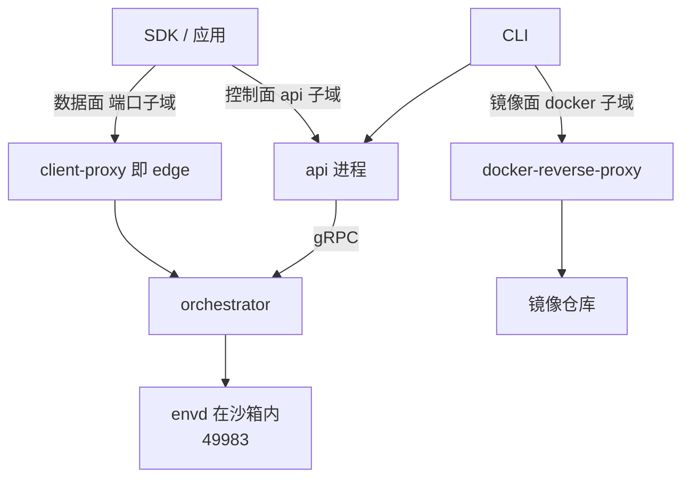
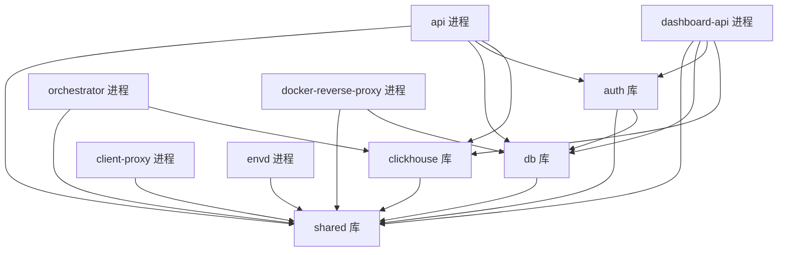

# 01 · e2b 生态与仓库地图

> e2b 不是一个仓库，是十几个仓库分工出来的一套系统。本篇先画出这张地图：哪个仓库负责什么、
> 客户端的一次调用会落到服务端的哪个进程、本书要讲的 `e2b-dev/infra` 内部怎么切分。
> 读完这一篇，后面九十篇里出现的任何一个路径，你都能定位到它属于哪一块。
>
> **读者**：所有读者；工程师必读。
> **预备**：无。
> **代码**：`go.work`、`Makefile`、`spec/*.yml`、`packages/*/go.mod`、
> `packages/orchestrator/internal/cfg/service.go`、`packages/docker-reverse-proxy/internal/handlers/proxy.go`

---

## 0. 本篇要回答的问题

1. e2b-dev 组织下有十几个仓库，它们之间是什么关系？本书讲的是哪一个？
2. SDK 里的一行 `sandbox.commands.run("ls")`，最终打到服务端的哪个端口、哪个进程？
   为什么这条路径和「创建沙箱」的路径不是同一条？
3. `infra` 仓库里的十二个 Go 模块各自做什么？谁依赖谁？
4. 代码量在这些模块之间怎么分布？这个分布如何决定了本书的篇幅安排？
5. 哪些东西**不在**这个仓库里，需要去别处找？

---

## 1. 一个产品，三层仓库

e2b 卖的是一件事：**给 AI agent 一台可以跑不可信代码的机器，并且要快**。
为什么这件事需要一台虚拟机而不是一个容器，是 [第 02 篇 §1](02-why-sandbox.md#1-问题一段不可信代码必须被真的执行) 的题目；
这里只关心它被切成了几个仓库。

按离用户的远近，e2b-dev 组织下的仓库可以分成三层。

| 层 | 仓库 | 主要语言 | 定位 | star 量级 |
|---|---|---|---|---|
| 示例与产品 | `fragments`、`surf`、`open-computer-use`、`e2b-cookbook` | TypeScript / Python | 用 e2b 搭出来的应用与教程，展示能力，不是产品的一部分 | 几百到数千 |
| 客户端 | `E2B`（SDK + CLI） | Python / TypeScript | 开发者唯一的入口：创建沙箱、在沙箱里执行、构建模板 | 14k |
| 客户端 | `code-interpreter`、`desktop`、`mcp-server` | Python / TypeScript | 建立在 SDK 之上的场景封装：跑 notebook、跑桌面、接 MCP | 2.4k / 1.5k / 数百 |
| 控制台 | `dashboard` | TypeScript | 网页控制台：团队、密钥、用量 | 数百 |
| 服务端 | **`infra`** | **Go** | **本书的对象**：跑沙箱的全部服务端代码与基础设施定义 | **1.4k** |
| 服务端 | `firecracker`（分叉）、`fc-kernels` | Rust / Shell | 定制过的 VMM 与 guest 内核构建 | 数百 / 数十 |

客户端层内部还有一层嵌套。`E2B` 仓库里的 SDK 提供的是通用能力：起一台沙箱、在里面跑命令、
读写文件、把沙箱里的端口暴露出来。`code-interpreter` 在这之上封装了「跑一段带状态的
Python / JavaScript 并拿回图表与富输出」，`desktop` 封装了「沙箱里有一个 X 桌面，
可以截屏与发键鼠事件」，`mcp-server` 则把这些能力包成 Model Context Protocol 的工具。
三者共享同一套服务端，区别只在于它们默认使用的模板不同、在沙箱里预装的东西不同。
这解释了一个贯穿全书的设计事实：**服务端不认识「代码解释器」或「桌面」这些概念**，
它只认识模板与沙箱；差异全部被推到模板里去了。

三层之间的耦合方式不同，值得分开说。

**示例层是单向的**：它们导入 SDK，SDK 不知道它们存在。这一层对理解系统没有帮助，
本书之后不再提及。

**客户端层与服务端层通过三份契约耦合**：REST API 的 OpenAPI 规格、envd 的 Connect-RPC 协议、
以及 Docker Registry 的 HTTP API。三份契约的服务端定义都在 `infra` 仓库的 `spec/` 与
`packages/envd/spec/` 里，客户端按它们生成代码。这意味着 SDK 与服务端可以独立发版，
代价是兼容性要靠人守 —— 这个代价在 [第 52 篇 §2](52-envd-legacy-and-sdk-compat.md#2-legacy-包做了什么)
里会看到具体形态：envd 至今保留着一套 legacy 服务，只为了老版本 SDK 还能连上。

**服务端层内部是「取用」关系**。`infra` 不包含 Firecracker 的源码，也不包含 guest 内核，
它在运行时从 `/fc-versions/` 与 `/fc-kernels/` 目录里按版本号取用别处构建好的二进制。
`firecracker` 分叉与 `fc-kernels` 就是产出这些二进制的仓库。
需要注意的是，e2b 的 Firecracker 分叉仓库已于 2026-08-26 归档。
归档不等于不再使用 —— 上游 2026.09 的默认 Firecracker 版本仍是分叉的产物；
它意味着这个分叉的维护责任落回了使用者身上，
ARM 适配版正是在此基础上继续打补丁的（[第 70 篇 §5](70-firecracker-fork.md#5-分叉归档之后)）。

---

## 2. 客户端打到服务端的三条路

SDK 表面上只有一个 `Sandbox` 类，底下却有三条独立的通信路径，落到三个不同的服务端进程。
把这三条路分清楚，是读懂后面所有内容的前提。

为什么要分开？如果只有一条路，那么「在沙箱里执行一条命令」这样的高频、长连接、
可能持续几十分钟的流量，会和「创建沙箱」这种低频但要查数据库、要做配额判断的流量挤在同一个
服务上。前者要求转发路径尽量薄且能长时间保持连接，后者要求事务性与鉴权完整。
分成两条之后，控制面可以做成无状态、可水平扩展的 API 服务，数据面则只做路由与转发，
两者的扩缩容与故障域相互独立。代价是**沙箱的位置信息必须在两条路之间共享** ——
控制面决定沙箱落在哪个节点，数据面要能查到这个结论，这就是
[第 55 篇 §1](55-sandbox-catalog-and-routing.md#1-问题一次请求要跨过两次不知道) 要解决的问题。

第一条是**控制面**。`ConnectionConfig` 把 API 的地址算成 `https://api.${domain}`
（`E2B` 仓库的 `packages/js-sdk/src/connectionConfig.ts`；本节涉及客户端的三处路径都相对该仓库，
其余各处的路径一律相对 `infra`），创建、暂停、恢复、列举沙箱都走这里，
落到 `packages/api` 进程的 REST 接口，接口定义在 `spec/openapi.yml`。

第二条是**数据面**。SDK 用 `getHost()` 把地址算成 `${port}-${sandboxID}.${domain}`
（同一文件的 `ConnectionConfig.getHost()`），执行命令、读写文件、访问用户在沙箱里起的服务，
全都走这个子域名。请求先到 client-proxy，由它按 sandbox ID 找到承载该沙箱的节点，
转发给该节点上的 orchestrator，orchestrator 再把它送进沙箱内的 envd。
envd 的默认端口是 49983，定义在 `packages/shared/pkg/consts/envd.go` 的 `DefaultEnvdServerPort`；
orchestrator 的转发逻辑在 `packages/orchestrator/internal/proxy/proxy.go` 里，
它用这个常量区分「发给 envd 自己的请求」和「发给用户进程的请求」。

第三条是**镜像面**。CLI 构建模板时，先 `docker login docker.${domain}`
（`packages/cli/src/commands/template/build.ts`），在本地用 Docker 构建镜像并推上去，
再调 API 触发服务端构建。`docker.${domain}` 后面是 `packages/docker-reverse-proxy`：
它把 e2b 的 API key 换成对象仓库的凭证，并且只放行 `/v2/e2b/custom-envs/` 前缀下的路径，
其它一律 403（`internal/handlers/proxy.go` 的 `Proxy()`）。
换句话说，它是一个「只允许推自己那一格」的镜像仓库代理，细节在
[第 57 篇 §5](57-docker-reverse-proxy.md#5-转发面proxy)。



三条路各自的完整时序在 [第 10 篇 §6](10-system-architecture.md#6-三条典型路径) 与
[第 12 篇 §6](12-sandbox-lifecycle-walkthrough.md#6-数据面sdk-的第二条路)。

---

## 3. infra 仓库的骨架

仓库根目录只有六样东西值得记住：

```text
infra/
├── go.work              Go 工作区：12 个模块 + tests/integration
├── Makefile             顶层只做基础设施编排，转发给 iac/provider-$(PROVIDER)
├── packages/            全部服务端代码，13 个子目录
├── iac/                 Terraform + Nomad job 定义
│   ├── modules/         9 个 job 模块：clickhouse、client-proxy、ingress、loki、orchestrator 等
│   │                    多数 Nomad job 的 .hcl 已经收到 modules/job-*/jobs/ 下
│   ├── provider-gcp/    GCP 上的完整部署：*.tf、nomad-cluster/
│   │                    nomad/jobs/ 下只剩 api、redis、template-manager 等六个 job
│   └── provider-aws/    只有一个 Makefile —— AWS 支持尚未落地
├── spec/                四份 OpenAPI 规格：openapi、edge、dashboard、hyperloop
├── tests/               integration/（独立 Go 模块）与 periodic-test/
└── scripts/             版本号、迁移编号、依赖完整性等辅助脚本
```

`iac/` 值得单独一提。它不是「部署脚本」，而是这套系统在生产环境里的**完整定义**：
节点池怎么划分、每个 job 用多少 CPU 与内存、宿主机镜像里预装什么、
`/fc-versions/` 与 `/fc-kernels/` 目录从哪来。很多在 Go 代码里读不出来的行为约束
（比如 orchestrator 必须跑在开了 KVM 与 NBD 的节点上）只写在这里。
上游 2026.09 的 `iac/` 有约 1.17 万行 Terraform、Nomad HCL 与 Shell，
只覆盖 GCP 一家；这也是 ARM 适配版改动最集中的地方。

`packages/` 下有 13 个子目录，但只有 12 个是 Go 模块 —— `otel-collector` 里只有一个
Makefile 与测试配置，它交付的是采集器的配置而不是代码。`go.work` 列出了这 12 个模块
再加上 `tests/integration`，后者单列是因为它依赖测试专用的重型依赖，不该污染生产模块的
依赖图。这是 Go 多模块工作区的典型用法，[第 08 篇 §1](08-go-service-toolkit.md#1-一个仓库十二个模块)
会讲这套工具链。

---

## 4. 十二个模块各自做什么

下表的行数是 tag `2026.09` 上的**有效 Go 代码**：用 `git ls-tree` 列出模块内的 `.go` 文件，
排除 `_test.go`，再排除生成代码（`*.pb.go`、`*.connect.go`、`*.gen.go`、`generated.go`、
`mocks/` 目录，以及 `packages/shared/pkg/fc/` 这棵由 go-swagger 从 Firecracker 的 OpenAPI
规格生成的树），对剩余文件 `wc -l`。行数只用来说明规模量级，不必精确到百位。

| 模块 | 形态 | 一句话职责 | 有效行数 |
|---|---|---|---|
| `orchestrator` | 进程 | 在一台节点上把沙箱跑起来：Firecracker、内存与磁盘后端、网络、快照、模板构建 | 32.8k |
| `api` | 进程 | 面向用户的 REST API：鉴权、配额、放置、生命周期、模板管理 | 18.5k |
| `shared` | 库 | 被所有服务复用的部件：存储、gRPC 契约、feature flag、缓存、遥测、Firecracker 客户端 | 11.8k |
| `envd` | 进程 | 跑在沙箱**内部**的守护进程：执行命令、读写文件、暴露端口 | 5.8k |
| `db` | 库 | Postgres 访问层：sqlc 生成的查询与迁移 | 5.2k |
| `clickhouse` | 库 | 指标与事件的写入与查询 | 1.1k |
| `auth` | 库 | API key、access token、JWT 的校验与缓存 | 0.8k |
| `docker-reverse-proxy` | 进程 | 模板镜像推送的鉴权代理 | 0.7k |
| `client-proxy` | 进程 | 边缘流量入口，把 `port-sandboxID` 子域名的请求路由到承载节点 | 0.6k |
| `dashboard-api` | 进程 | 控制台专用的只读接口 | 0.3k |
| `local-dev` | 工具 | 本地开发时给数据库灌种子数据 | 0.2k |
| `nomad-nodepool-apm` | 插件 | Nomad autoscaler 的 APM 插件，按节点池规模驱动扩缩 | 0.2k |

这十二个数字加起来约 7.8 万行。作为对照，`packages/` 下所有非测试 `.go` 文件合计
13.6 万行 —— 也就是说，**四成以上的 Go 代码是生成的**。生成的部分包括：
`packages/api/internal/api/api.gen.go`（1.2 万行，从 `spec/openapi.yml` 生成的 REST 骨架）、
`packages/shared/pkg/fc/`（1.9 万行，Firecracker REST API 的 go-swagger 客户端与模型）、
各处的 `*.pb.go`（proto 生成的 gRPC 与 Connect-RPC 桩）、
以及 `packages/db` 里 45 个 `*.sql.go`（sqlc 从 SQL 文件生成的查询）。
另有 3.4 万行单元测试和 2.2 万行集成测试（`tests/integration`）。
读这个仓库时把生成的部分先划掉，能省下大半力气；这也是本书引用代码位置时几乎不会指向
`.gen.go` 与 `.pb.go` 的原因 —— 要理解的是生成它们的规格文件，而不是产物。

有三处容易误解，需要点明。

**template-manager 不是一个模块。** 它是 orchestrator 二进制的另一副面孔：
`packages/orchestrator/internal/cfg/service.go` 的 `ServiceType` 只认
`orchestrator` 与 `template-manager` 两个名字（`ParseServiceType()` 把其余一切归成
`orch-unknown`），由环境变量 `ORCHESTRATOR_SERVICES` 选择启用哪些
（`cfg/model.go` 里默认值是 `orchestrator`）。
同一份二进制、不同的启动参数，跑在不同的节点池上。这个设计的收益是模板构建可以直接复用
沙箱运行时的全部代码 —— 构建过程本身就要启动一台沙箱；代价是二进制体积与依赖被绑在一起，
只想部署构建节点也得带上完整的沙箱运行时。详见
[第 46 篇 §1](46-template-manager-service.md#1-一个二进制两个角色)。

**client-proxy 与 edge 是同一个东西。** 模块的 Go 路径是
`github.com/e2b-dev/infra/packages/proxy`，目录名是 `client-proxy`，
而 Nomad job 文件叫 `edge.hcl`、job 名字是 `client-proxy`。全书统一用 client-proxy（edge）
这个写法，见 [第 53 篇 §2](53-client-proxy-edge.md#2-进程结构两个端口没有第三个)。

**行数不等于复杂度，但方向是对的。** orchestrator 一家占了全部有效代码的四成，
它也是本书第四部分十六篇的题目；`shared` 虽然只有 1.2 万行，却被除
`nomad-nodepool-apm` 之外的所有模块依赖，改动的爆炸半径最大。

---

## 5. 依赖方向

模块之间的依赖是一张严格分层的无环图。用 `grep -rhoE 'github\.com/e2b-dev/infra/packages/[a-z-]+'`
扫一遍各模块的 Go 文件，得到的边如下。



三条观察。

其一，**没有任何库反向依赖进程**，也没有进程之间的直接代码依赖。进程之间只通过网络契约
（gRPC 或 HTTP）交互，契约本身放在 `shared/pkg/grpc/` 与 `spec/`。
这让「api 与 orchestrator 分别部署、分别升级」成为可能。

其二，**orchestrator 不依赖 `db`**。它不碰 Postgres：沙箱的持久化状态由 api 写，
orchestrator 只持有内存态并通过 gRPC 上报。这条边的缺席是理解
[第 20 篇 §1](20-sandbox-state-storage.md#1-为什么需要单独一份运行态) 的关键 ——
「谁是沙箱状态的权威」这个问题，答案不在节点上。

其三，**envd 几乎不依赖 shared**。它只导入了 `shared/pkg/` 下的 `id`、`keys`、`smap`、
`utils` 四个小包。这不是巧合：envd 的二进制要被塞进每一个模板的 rootfs 里，
在沙箱启动的最早期运行，依赖越少越好。代价是 envd 与主仓库的一些公共抽象重复实现，
比如它自己维护一套 `internal/services/spec/` 下的 proto 生成结果，
与 `shared/pkg/grpc/envd/` 是同一份 proto 的两份产物。

---

## 6. 不在这个仓库里的东西

一本讲仓库的书要说清楚边界在哪。以下几样在 `infra` 里能看到痕迹，但源码不在这里。

**Firecracker 二进制与 guest 内核。** 前面说过，运行时按版本号从宿主目录取用。
本地开发时由 `packages/orchestrator/README.md` 里描述的 `-storage` 机制自动下载。

**edge API 的服务端实现。** `spec/openapi-edge.yml` 定义了一套集群内的服务发现与
沙箱目录接口，但 `packages/shared/pkg/http/edge/cfg.yaml` 里的 `generate:` 只开了
`client: true` 与 `models: true` —— 仓库里只生成客户端，使用者是
`packages/api/internal/clusters/discovery/remote.go` 的 `RemoteServiceDiscovery.Query()`，
它调用远端集群的 `V1ServiceDiscovery`。而上游 2026.09 的 `packages/client-proxy/main.go`
只起了流量代理与健康检查两个 HTTP 服务，并不实现这套接口。
**推论**：上游 2026.09 的 client-proxy 尚未承担 edge API 的服务端角色，
这套接口是为「api 管理多个远端集群」准备的，服务端实现不在本仓库内。
这一点对 [第 21 篇 §4](21-clusters-and-discovery.md#4-三种发现来源) 与
[第 56 篇 §1](56-edge-api.md#1-一个刻意留下的缺口) 有直接影响。

**控制台前端、SDK 与 CLI 的源码。** 本书只在需要说明契约时引用它们，
集中出现在 [第 52 篇 §3](52-envd-legacy-and-sdk-compat.md#3-sdk-从外面怎么找到-envd) 与
[第 83 篇 §1](83-sdk-adaptation.md#1-上游-sdk-里的四条环境假设)。

**AWS 上的部署。** `iac/provider-aws/` 只有一个 Makefile，README 里 AWS 标着「进行中」。
上游只有 GCP 一条完整的部署路径，见 [第 63 篇 §1](63-gcp-terraform.md#1-一次部署要产生什么)。

**可观测组件本身。** `packages/otel-collector/` 里没有 Go 代码，只有 Makefile 与测试配置；
真正的采集器是社区的 OpenTelemetry Collector 二进制，配置由 `iac/modules/job-otel-collector/`
下发。Loki、ClickHouse 同理 —— 仓库里有部署它们的 job 定义和读写它们的 Go 客户端，
没有它们的实现。哪些数据流进哪个后端，是 [第 60 篇 §4](60-telemetry.md#4-采集器与落点) 的题目。

判断一个东西在不在仓库里，有一条经验规则：**e2b 自己实现的是「沙箱怎么跑起来」，
凡是通用基础设施都用现成的**。这条规则也解释了 `shared/pkg/` 下为什么有那么多薄封装层 ——
它们的职责是把外部组件收敛成本仓库统一的接口，比如 `shared/pkg/storage/storage.go` 里的
`StorageProvider` 接口，上游给出了 GCS、S3 与本地文件系统三个实现
（`storage_google.go`、`storage_aws.go`、`storage_fs.go`），
ARM 适配版正是靠新增一个 `storage_minio.go` 接进了 MinIO。

---

## 7. ARM 适配版的差异

ARM 适配版没有增删任何 Go 模块，`go.work` 未改动；它在仓库根目录**新增了 `helm/`**
（Chart 加 11 个 template，约 1.75k 行），并大幅重写了 `iac/` 下的 Nomad 与 Consul 部署脚本。
按 `git diff --numstat f8c2f0cde fbee6fcd1` 统计，5293 行新增里 `iac/` 占 2227 行、
`helm/` 占 1751 行，两者合计约四分之三；Go 代码的净新增只有一千多行，
主要落在 `shared`（MinIO 存储 provider、Kubernetes 服务发现）与 `orchestrator`
（Firecracker 启动、cgroup、uffd 的宿主兼容）。

| 区域 | 新增 | 删除 |
|---|---|---|
| `iac/` | 2227 | 762 |
| `helm/` | 1751 | 0 |
| `packages/shared` | 520 | 23 |
| `packages/orchestrator` | 467 | 127 |
| `packages/api` | 235 | 100 |
| 其余（db、envd、client-proxy、clickhouse、.github） | 93 | 117 |

这个分布本身就是结论：**移植的主要工作量不在算法，在部署形态**。
展开见 [第 67 篇 §2](67-arm-port-overview.md#2-改动的规模与形状)、
[第 75 篇 §5](75-minio-storage.md#5-把默认-provider-改成-minio)、
[第 78 篇 §1](78-helm-k8s-deployment.md#1-这不是一份通用-chart)。
ARM 适配版之外还有两个独立仓库参与：分叉 Firecracker 的 aarch64 构建修复
（[第 70 篇 §3](70-firecracker-fork.md#3-在-aarch64-上构建)）与 arm64 内核配置（[第 69 篇 §2](69-guest-kernel-for-arm.md#2-构建流程)）；
把三者打成 RPM 在单机上离线部署的形态是 [第 80 篇 §2](80-single-node-rpm.md#2-rpm-的构建模型)。

---

## 8. 小结

- e2b 的仓库分三层：示例层单向依赖 SDK；客户端层与服务端层通过 OpenAPI、Connect-RPC
  与 Docker Registry 三份契约耦合；服务端层运行时取用 Firecracker 与 guest 内核的构建产物。
- 本书只讲 `e2b-dev/infra`（上游 2026.09，commit `f8c2f0cde`）及其 aarch64 适配。
- 客户端有三条路：控制面 `api.${domain}` 到 api 进程；数据面 `${port}-${sandboxID}.${domain}`
  经 client-proxy 与 orchestrator 到沙箱内 49983 端口的 envd；镜像面 `docker.${domain}`
  到 docker-reverse-proxy。
- `packages/` 有 13 个目录、12 个 Go 模块；`otel-collector` 只交付配置。
- template-manager 不是独立模块，是 orchestrator 二进制由 `ORCHESTRATOR_SERVICES`
  选择的另一种角色；client-proxy 与 edge 是同一个进程的两个名字。
- 有效 Go 代码约 7.8 万行，orchestrator 占四成、api 占两成四；`shared` 虽小但被除
  `nomad-nodepool-apm` 外的所有模块依赖。
- 依赖图无环且分层：库不依赖进程，进程之间只走网络契约；orchestrator 不碰 Postgres；
  envd 只用 `shared` 的四个小包，因为它要被塞进每个模板的 rootfs。
- edge API 在上游 2026.09 只生成客户端，服务端实现不在本仓库；AWS 的 IaC 也只有一个空壳。
- ARM 适配版不动模块划分，改动的四分之三集中在 `iac/` 与新增的 `helm/`。

---

## 延伸阅读 / 下一篇

- 下一篇：[第 02 篇 · AI 代码沙箱：问题、威胁模型与隔离谱系](02-why-sandbox.md) ——
  为什么这套系统必须建在 microVM 上。
- 想直接看系统全貌：[第 00 篇 §2](00-overview.md#2-六个进程与四类存储)（六个进程与四类存储）与
  [第 10 篇 §2](10-system-architecture.md#2-进程清单)（进程清单）。
- 想按目录反查讲解位置：[第 89 篇 §1](89-code-map.md#1-上游-202609-的目录)。
- 想在本地把这套东西跑起来：[第 66 篇 §1](66-local-development.md#1-本地环境的分界线)，
  以及仓库里的 `DEV.md`、`DEV-LOCAL.md`、`self-host.md`。
- 外部资料：[e2b-dev/infra](https://github.com/e2b-dev/infra)、
  [Firecracker 官方文档](https://github.com/firecracker-microvm/firecracker/tree/main/docs)。
