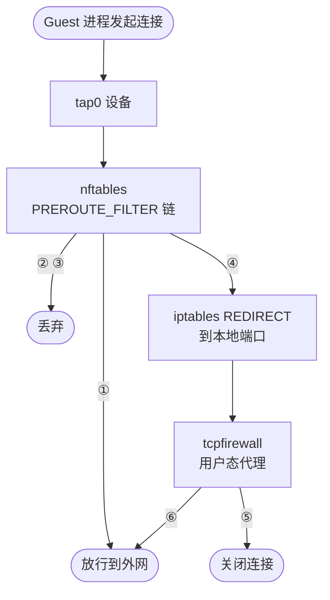

# 02 · AI 代码沙箱：问题、威胁模型与隔离谱系

> 一个 AI agent 写出来的程序，必须被真的执行才知道它对不对。执行它的地方要同时满足两件互相拉扯的事：
> 边界足够硬，启动足够快。本篇先把「不可信代码执行」这个问题和它的威胁模型讲清楚，
> 再把可选的隔离手段排成一条谱系，最后说明 e2b 站在谱系的哪一档、为此付了什么代价。
>
> **读者**：所有读者；本书的第一篇技术内容。
> **预备**：操作系统课程里的进程、虚拟内存、系统调用；不需要虚拟化背景。
> **代码**：`packages/shared/pkg/sandbox-network/firewall.go`、
> `packages/orchestrator/internal/sandbox/network/`、`packages/orchestrator/internal/tcpfirewall/`

---

## 0. 本篇要回答的问题

1. 为什么「让 LLM 生成的代码跑起来」不能用一个普通的容器或一个进程池解决？
2. 在这个场景里，攻击者是谁、他能做什么、要保护的资产是什么？
3. 从进程加 seccomp 到完整虚拟机，隔离手段的边界、代价与密度差在哪几个数量级？
4. e2b 为什么选 microVM 加快照，这个组合各自解决了上面的哪一半问题？
5. 「沙箱从不冷启动」是什么意思，在代码里体现在哪里？
6. 威胁模型落到代码上长什么样 —— 以出站网络的默认拒绝为例。

---

## 1. 问题：一段不可信代码必须被真的执行

大模型能写代码，但写出来的代码是否正确、是否真的能跑，只有执行一次才知道。
数据分析要看到图画出来，网页脚本要看到抓下来的内容，一个多步骤 agent 更是每一步都依赖上一步的实际输出。
静态检查回答不了这类问题：程序的行为依赖它读到的数据、装上的依赖、访问到的网络。

于是出现了一类新的服务：接受一段任意代码，在受控环境里执行，把 stdout、文件、进程状态交回去。
这类服务有四条约束，任意一条单独看都不新鲜，四条同时成立才构成难题。

**代码完全不可信。** 它不是用户在自己机器上跑自己的程序，而是一个第三方系统替终端用户执行终端用户
（或者模型）产生的代码。没有代码审查环节，也不存在「只允许某个语言子集」的余地 —— 允许 `pip install`
就等于允许执行任意二进制，允许编译就等于允许调用任意系统调用。

**多租户。** 同一批物理机上同时跑着成百上千个互不相识的团队的代码。任何一个租户拿到另一个租户的数据，
都是这类服务最严重的事故。

**生命周期短且不可预测。** 一次执行可能是三秒的 `print`，也可能是一个跑二十分钟的爬虫；
沙箱数量随 agent 的调用量抖动，峰谷可以差一个数量级。这意味着创建与销毁是常态操作，不是罕见操作。

**交互式，要秒级可用。** agent 的一轮推理是几秒，如果拿到执行环境要等三十秒，整条链路就没法用。
用户在浏览器里点「运行」，等待预算大约是一秒量级。

对照几个熟悉的系统就能看出差别。CI runner 也执行不可信代码，但它的启动预算是分钟级，
每个 job 可以独占一台虚机。FaaS 平台启动快、密度高，但它只执行受平台约束的函数，
一般不允许长驻进程、任意端口监听、装内核模块。Jupyter 内核交互性好，但它默认假设代码是可信的。
AI 代码沙箱要的是这三者的交集：CI 的隔离强度、FaaS 的密度、Jupyter 的响应速度。

---

## 2. 威胁模型

### 2.1 攻击者的能力

在这个场景里定义攻击者时，要把假设放到最坏：**攻击者已经在沙箱内部，并且拥有 root**。
这不是失守之后的假设，而是产品的正常形态 —— 用户本来就该能 `sudo apt install`、能挂载文件系统、
能开监听端口。因此沙箱内部的任何软件手段（限制 shell、审计命令、禁用某些工具）都不构成安全边界，
它们至多是易用性设施。

攻击者能做的事包括：调用任意系统调用；加载内核模块（如果沙箱里跑着可写的内核）；
发起任意网络连接；填满内存与磁盘；长时间占满 CPU；读取沙箱里的一切文件，包括平台注入进去的守护进程与配置。

### 2.2 要保护的资产与五类攻击面

| 攻击面 | 攻击者的目标 | 边界应当在哪 |
|---|---|---|
| 逃逸 | 从沙箱内取得宿主上的代码执行 | 隔离技术本身：内核 / VMM 的攻击面 |
| 横向 | 读到同一宿主上其它租户的沙箱数据 | 隔离边界 + 每沙箱独立的存储与网络命名空间 |
| 内网访问 | 访问宿主内网、控制面 API、云元数据服务 | 出站网络策略 |
| 资源耗尽 | 占满 CPU / 内存 / 磁盘 / 文件描述符，影响同宿主邻居 | 资源上限与配额 |
| 数据外泄 | 把拿到的数据送出去 | 出站网络策略 + 审计 |

前两类由隔离技术决定，是第 3 节的主题。第三、五类落在网络上，是第 5 节的主题。
第四类落在资源记账上，是第 6 节的主题。

这里要强调一个常被忽略的方向：**云元数据服务**。绝大多数公有云在 `169.254.169.254` 上提供
一个无需认证的 HTTP 服务，返回当前实例的凭据。如果沙箱能访问它，就等于拿到了宿主实例的云身份，
隔离做得再好也没有意义。这也是为什么第 5 节里那张默认拒绝网段表，第一眼看上去平平无奇，
实际上是整个威胁模型里最关键的一条。

---

## 3. 隔离谱系

把常见的隔离手段按「共享多少」排成一条线，从共享最多到共享最少。

### 3.1 五档

| 维度 | 进程 + seccomp | 容器 | gVisor 类用户态内核 | microVM | 完整 VM |
|---|---|---|---|---|---|
| 与宿主共享 | 内核、大部分系统调用 | 内核，命名空间隔离视图 | 内核，但系统调用先经用户态内核 | 只共享 KVM 与 VMM | 同 microVM，设备面更全 |
| 逃逸要突破的 | 允许的系统调用集合 | 整个内核系统调用面 | 用户态内核 + 少量宿主系统调用 | KVM 与 VMM 的虚拟设备 | 同左 |
| 攻击面量级 | 数十个系统调用 | 数百个系统调用 | 数十个宿主系统调用 | 若干个虚拟设备加 KVM ioctl | 数十个虚拟设备 |
| 启动时间量级 | 亚毫秒 | 十毫秒到百毫秒 | 百毫秒 | 十毫秒到百毫秒 | 秒到数十秒 |
| 单机密度量级 | 数千 | 数百到数千 | 数百 | 数百 | 数十 |
| 兼容性 | 只能跑受限程序 | 几乎所有用户态程序 | 大部分程序，部分系统调用不支持 | 完整 Linux，含内核模块 | 完整 Linux |
| 每实例固定开销 | 可忽略 | 很小 | 中等 | 一份 guest 内核加 VMM 内存 | 一份完整固件加内核 |

上表给的是数量级，不是测量值；具体数字取决于机型、内核版本与负载，本书凡是给具体数字的地方
都会附上测量条件（例如[第 84 篇 §5](84-arm-performance.md#5-已有的数据)）。

### 3.2 为什么容器这一档不够

容器不是一种隔离机制，而是一组内核机制的组合：namespace 隔离视图、cgroup 限制资源、
capability 与 seccomp 削减权限。这些机制都由**同一个内核**实现，而这个内核同时服务宿主和所有容器。
于是攻击面就是内核暴露给非特权用户的那部分，包含数百个系统调用和它们背后的全部子系统。
历史上被用于容器逃逸的漏洞几乎覆盖了内核的每一个大模块。

第 2.1 节的假设让情况更糟：沙箱里的用户是 root，还可能要装内核模块、挂载文件系统。
这些能力在容器模型里要么直接给不了，要么给了就等于放弃隔离。

结论不是「容器不安全」，而是「容器的安全边界与本场景要求的信任模型不匹配」。
把不可信代码放进容器，等于把内核的完整攻击面暴露给攻击者；在单租户场景里这可以接受，
在多租户场景里不行。

### 3.3 microVM 这一档的代价

microVM 把边界换成硬件虚拟化：guest 跑在 KVM 提供的非根模式里，它执行的系统调用由 **guest 自己的内核**
处理，根本不到达宿主内核。要逃逸就得先突破 KVM 的地址翻译，或者攻破 VMM 实现的那几个虚拟设备。
这些设备在 Firecracker 里被刻意砍到了最少 —— 没有 BIOS、没有 PCI、只有 virtio-mmio 上的几个设备，
细节见[第 03 篇 §1](03-firecracker-primer.md#1-砍掉了什么)。

代价是明确的三条：

第一，**每个沙箱多出一份 guest 内核和一份 VMM 进程的内存**。容器共享宿主内核，microVM 不共享。

第二，**启动要先引导一个内核**。哪怕内核精简到只剩必要驱动，从加电到 init 起来仍然是数十到数百毫秒，
再加上用户态的初始化（装载运行时、起 Python 解释器、装依赖），一个「有用的」沙箱的冷启动是秒到数十秒。
这一条直接顶到第 1 节的「秒级可用」约束上。

第三，**I/O 要穿过 VMM**。guest 的磁盘读写和网络收发都要经过用户态的设备模型，
这在吞吐和延迟上都不如宿主原生。

前两条代价里，第一条只能承受，第二条有办法绕开 —— 那就是快照。

---

## 4. e2b 的选择：microVM 加快照

### 4.1 硬件边界怎么落地

e2b 的每一台沙箱是一个 Firecracker 进程。orchestrator 启动它的方式在
`packages/orchestrator/internal/sandbox/fc/process.go` 的 `NewProcess()` 里：
拼出一段启动脚本，用 `exec.CommandContext` 执行 `unshare -m -- bash -c <脚本>`，
并给进程设置 `Setsid`。脚本的模板在同目录的 `script_builder.go`（常量 `startScriptV2`），
它先 `mount --make-rprivate /`，再把沙箱用到的目录挂成 tmpfs，最后用
`ip netns exec <namespace> <firecracker> --api-sock <socket>` 把 Firecracker 拉起来。

所以一台沙箱在宿主上占的隔离设施有三层：独立的 mount namespace（`unshare -m`）、
独立的 network namespace（`ip netns exec`，槽位由
`packages/orchestrator/internal/sandbox/network/network.go` 的 `CreateNetwork()` 建立）、
以及硬件虚拟化边界本身。

值得指出的是上游 2026.09 **不使用 Firecracker 自带的 jailer**：在 `packages/` 与 `iac/` 下
搜不到 `jailer` 的调用，也没有自定义 seccomp 过滤器的代码。Firecracker 二进制自带的默认 seccomp
仍然生效，但 jailer 提供的 chroot、uid/gid 降权、cgroup 归属这一层被换成了上面那套自建的
namespace 加 cgroup 组合。这是一个权衡：自建的路径更容易与网络槽位池、cgroup 记账集成，
代价是 VMM 进程仍以 orchestrator 的身份运行，一旦 VMM 被攻破，攻击者拿到的权限比有 jailer 时更高。
完整对照见[第 03 篇 §3](03-firecracker-primer.md#3-jailer-与-seccompe2b-只用了后者)，后果的展开见[第 28 篇 §7](28-firecracker-process-management.md#7-为什么不用-jailer以及后果)。

### 4.2 「沙箱从不冷启动」

3.3 节的第二条代价，e2b 的答案是：**用户请求创建的沙箱，从来不是启动出来的，而是恢复出来的。**

这不是修辞。orchestrator 的 gRPC `Create` 处理函数在
`packages/orchestrator/internal/server/sandboxes.go` 里，先用 `templateCache.GetTemplate()`
取到模板对应的快照，然后调用 `s.sandboxFactory.ResumeSandbox(...)`。
从暂停恢复的那条路径（同文件里的 `Resume` 处理）调用的也是这个函数。
`packages/orchestrator/internal/sandbox/sandbox.go` 里确实还有一个 `Factory.CreateSandbox()`，
但它的调用者只有模板构建那一侧 —— `internal/template/build/layer/create_sandbox.go` 与
`internal/template/build/phases/base/provision.go`。

也就是说，冷启动在这套系统里只发生一次：**模板构建期**。构建的最后一步是把一台已经装好依赖、
起好解释器、跑完 start 命令的沙箱暂停成快照（[第 41 篇 §4](41-template-build-overview.md#4-主流程)）。
之后成千上万次「创建沙箱」都是从这份快照恢复。

这一步把成本从请求路径挪到了构建路径，代价随之全部转移到「怎么把一份快照又快又省地恢复出来」上：

- 快照的内存部分可能有几个 GiB，不能等它全部读完再开跑，于是有了按需缺页的内存后端
  （[第 05 篇 §1](05-userfaultfd.md#1-问题内存内容不在本地)、[第 31 篇 §1](31-uffd-memory-backend.md#1-内存后端是一个接口)）；
- 快照存在对象存储上，本地要有缓存与分片读取（[第 30 篇 §1](30-block-layer.md#1-一次读要穿过多少层)、[第 34 篇 §4](34-template-cache-and-local-storage.md#4-缓存查找顺序一次块读查几张表)）；
- rootfs 要在只读基底上叠一层每沙箱的写层（[第 06 篇 §5](06-block-devices-nbd-cow.md#5-写时复制的两种实现)、[第 33 篇 §4](33-nbd-and-rootfs.md#4-两个-rootfs-provider)）；
- 暂停时要知道哪些页被改过，才能只存增量（[第 37 篇 §3](37-pause-and-snapshot.md#3-脏页判据)）。

本书第四部分的大半篇幅，都是在处理这一句话带来的后果。这条主线在后面各篇会反复出现。

---

## 5. 威胁模型的落地：出站网络

隔离技术管住了「逃逸」和「横向」，管不住「内网访问」和「数据外泄」—— 一个完全不逃逸的沙箱，
照样可以向 `169.254.169.254` 发一个 HTTP 请求。这一节看 e2b 怎么处理，作为威胁模型落到代码上的样本。
完整机制在[第 35 篇 §5](35-sandbox-networking.md#5-tcp-防火墙进程)，内核侧的基础在
[第 07 篇 §6](07-linux-networking-for-sandboxes.md#6-出站过滤两层两种粒度)。

### 5.1 一张永远拒绝的网段表

`packages/shared/pkg/sandbox-network/firewall.go` 里有一个包级变量 `DeniedSandboxCIDRs`：

```go
var DeniedSandboxCIDRs = []string{
	// IPv4 private/local ranges
	"10.0.0.0/8",
	"127.0.0.0/8",
	"169.254.0.0/16",
	"172.16.0.0/12",
	"192.168.0.0/16",
	// IPv6 local ranges
	"::1/128",
	"fc00::/7",
	"fe80::/10",
}
```

三组 RFC 1918 私有网段，加上环回，加上链路本地 `169.254.0.0/16` —— 云元数据地址就在最后这一段里。
这张表不受用户配置影响：它被灌进 nftables 的 `predefinedDenySet`，
而用户自定义的规则进的是另外两个集合 `userDenySet` / `userAllowSet`
（`packages/orchestrator/internal/sandbox/network/firewall.go` 的 `NewFirewall()` 与 `ResetDeniedSets()`）。

### 5.2 两条执行路径

规则的执行分成两条路，因为 TCP 和非 TCP 需要的检查粒度不同。



| 编号 | 判定 | 结果 |
|---|---|---|
| ① | 连接已建立，ESTABLISHED 或 RELATED | 放行 |
| ② | 目的地址命中 predefinedDenySet | 丢弃 |
| ③ | 非 TCP 且命中 userDenySet | 丢弃 |
| ④ | TCP | 转交用户态代理 |
| ⑤ | isEgressAllowed 判定拒绝 | 关闭连接 |
| ⑥ | isEgressAllowed 判定允许 | 放行 |

nftables 侧的规则顺序写在 `firewall.go` 的 `installRules()` 注释里，
按序是：ESTABLISHED/RELATED 放行、`predefinedAllowSet` 放行、`predefinedDenySet` 丢弃、
非 TCP 的 `userAllowSet` 放行、非 TCP 的 `userDenySet` 丢弃、默认接受。
最后一条「默认接受」并不意味着 TCP 不受管：TCP 在 `nat/PREROUTING` 上被
`packages/orchestrator/internal/sandbox/network/tcpproxy.go` 的 `tcpProxyConfig.append()`
用 `REDIRECT` 劫持到宿主上的三个本地端口 —— 目的端口 80 一个、443 一个、其余一个。

分三个端口是为了协议识别：80 端口那一路要读 HTTP 的 `Host` 头，443 那一路要读 TLS 的 SNI，
而其余端口上可能跑着 SSH 这类**服务端先说话**的协议，对它做协议识别会一直阻塞。
这三条路由在 `packages/orchestrator/internal/tcpfirewall/proxy.go` 的 `Proxy.Start()` 里注册。

`REDIRECT` 会改写目的地址，所以代理需要 `SO_ORIGINAL_DST` 才能知道 guest 原本要连谁 ——
这就是 `tcpfirewall/utils.go` 的 `getOriginalDst()`。拿到原始目的地址后，
`connectionHandler.HandleConn()` 用连接的源地址在 `sandbox.Map` 里反查是哪台沙箱，
再交给 `handlers.go` 的 `isEgressAllowed()` 判定。

### 5.3 判定顺序与两种欺骗

`isEgressAllowed()` 的优先级写在注释里，也体现在代码顺序上：先查允许的域名，
再查允许的 CIDR，再查拒绝的 CIDR，**都不命中则放行**。默认放行这一点很重要 ——
沙箱默认是能上网的；关闭上网是通过在配置里塞进一条拒绝规则实现的。
`server/sandboxes.go` 的创建路径里可以看到：当 `AllowInternetAccess` 为假时，
它往 `network.Egress.DeniedCidrs` 里塞进 `sandbox_network.AllInternetTrafficCIDR`，即 `0.0.0.0/0`。

按域名放行会引出两种欺骗，代码里对两种都做了处理：

**一是 `/etc/hosts` 或 DNS 应答伪造。** 沙箱可以把 `example.com` 解析到任意 IP，
然后带着 `Host: example.com` 去连那个 IP。`domainHandler()` 的应对是：当放行理由是域名匹配时，
**不用 guest 给的目的 IP，而是用主机名重新拨号**，由 orchestrator 侧自己解析。

**二是 DNS 重绑定。** 域名本身合法，但它解析出来的地址是内网。
`proxyWithIPVerification()` 在 `net.Dialer` 上装了 `ControlContext` 回调 ——
这个回调在 DNS 解析之后、`connect()` 系统调用之前触发，拿到的是已解析的 IP。
回调里调用 `isIPInAlwaysDeniedCIDRs()` 拿 5.1 节那张表做检查，命中就返回错误，
TCP 握手根本不会发出去。

### 5.4 这套设计的代价

代价有四条，都能在代码里看到：

每条 TCP 连接都在宿主上多了一次用户态转发，吞吐与延迟都要打折扣；
`tcpfirewall/proxy.go` 里因此有一个每沙箱连接数上限，由特性开关
`featureflags.TCPFirewallMaxConnectionsPerSandbox` 控制，超限直接关连接
（`connectionHandler.HandleConn()` 里的 `limiter.TryAcquire`）。

`getOriginalDst()` 只解析 IPv4 的 `sockaddr_in`，注释里也写明了「IPv4」；
非 TCP 流量则完全不走代理，只有 nftables 那几条集合规则。

按域名的判定依赖明文的 `Host` 头与 SNI，两者都由 guest 自己填，本身不可信；
它之所以仍然可用，是因为 5.3 节那两道 IP 校验兜底 —— 允许列表可以被骗成「连一个允许的域名」，
但骗不成「连一个内网地址」。

最后，`connectionHandler.HandleConn()` 每次都要按源地址反查沙箱，
查不到就关连接并记一次 `ErrorTypeSandboxLookup` —— 这条路径把网络转发和沙箱生命周期耦合在了一起。

---

## 6. 资源耗尽这一面

第 2.2 节表里的第四行需要单独说，因为 e2b 的处理方式和直觉不同。

沙箱的 CPU 与内存上限**不是由宿主 cgroup 施加的**，而是由 Firecracker 的机器配置施加的：
一台 microVM 有几个 vCPU、多少内存，是在快照与 `machine-config` 里定死的，guest 内核只能看到这么多。
这是 microVM 相对容器的一个结构性优势 —— 内存上限不是「限制」，而是「物理事实」，
guest 里的 OOM 由 guest 自己的内核处理，不会波及宿主。

宿主侧的 cgroup 在这里主要用于**记账**。`packages/orchestrator/internal/sandbox/cgroup/manager.go`
的 `managerImpl.Create()` 只做三件事：建目录、打开目录拿到 fd（供 `CLONE_INTO_CGROUP` 用于
fork 时原子地把进程放进去）、打开 `memory.peak`；它不写 `memory.max`，也不写 `cpu.max`。
读取侧的 `getStatsForPath()` 采集的是 `cpu.stat` 与 `memory.current` / `memory.peak`。
所以这套 cgroup 是给计费和监控用的，不是给限制用的（[第 38 篇 §2](38-cgroups-and-host-stats.md#2-上游的-cgroup只记账不设限)）。

真正的准入控制在更上一层：`server/sandboxes.go` 的创建路径上有一个 `startingSandboxes` 信号量，
容量是同文件里的常量 `maxStartingInstancesPerNode = 3`。它限制的是「同时正在启动的沙箱数」，
保护的是启动路径上的宿主资源（对象存储带宽、页缓存、CPU），不是稳态资源。
两条路径对拿不到许可的反应不同：从模板起的沙箱走 `TryAcquire`，拿不到立刻返回
`codes.ResourceExhausted`；从暂停快照恢复的沙箱走 `utils.go` 的 `waitForAcquire()`，
先带 `acquireTimeout` 等一段时间，超时才报同一个错误。

代价是：磁盘配额、文件描述符、宿主网络带宽这几项在上游 2026.09 里没有每沙箱的硬限制。
**推论：** 这意味着一个恶意沙箱仍然可以通过大量小 I/O 或大量连接影响同宿主的邻居，
缓解手段是上面提到的连接数上限与启动并发上限，而不是硬隔离。

---

## 7. 这些概念在本书哪几篇被用到

- 「microVM 的边界」是[第 03 篇 §1](03-firecracker-primer.md#1-砍掉了什么)与[第 04 篇 §1](04-kvm-and-memory-virtualization.md#1-kvm-的接口形状)的出发点；
- 「沙箱从不冷启动」是[第 12 篇 §4](12-sandbox-lifecycle-walkthrough.md#4-orchestrator闸门与-resumesandbox-的阶段)与整个第四部分的主线，
  尤其是[第 27 篇 §1](27-resume-sandbox.md#1-恢复而不是启动)；
- 本篇提到的出站过滤在[第 07 篇 §6](07-linux-networking-for-sandboxes.md#6-出站过滤两层两种粒度)讲内核机制，
  在[第 35 篇 §5](35-sandbox-networking.md#5-tcp-防火墙进程)讲完整实现；
- 多租户的身份与配额在[第 16 篇 §6](16-auth-and-multitenancy.md#6-tier-与配额额度在哪几步被检查)；
- 入站方向（外界怎么访问沙箱里的端口）在[第 53 篇 §1](53-client-proxy-edge.md#1-这一跳为什么必须存在)。

---

## 8. ARM 适配版的差异

本篇讲的是概念，不涉及架构相关的机制。唯一与本篇相邻的改动是网络槽位池的容量：
`packages/orchestrator/internal/sandbox/network/pool.go` 里的 `NewSlotsPoolSize` 与
`ReusedSlotsPoolSize` 在 ARM 适配版被从 32 / 100 提到 300 / 1000。
这影响的是密度与启动排队，不影响隔离边界，详见
[第 71 篇 §7](71-orchestrator-arm-fc-changes.md#7-网络槽位池32--100--300--1000)。

---

## 9. 小结

- AI 代码沙箱的难点不在任何单一约束，而在「不可信 + 多租户 + 短生命周期 + 秒级可用」四条同时成立。
- 威胁模型的起点是「攻击者已在沙箱内且是 root」，因此沙箱内部的一切限制都不算安全边界。
- 五类攻击面里，逃逸与横向由隔离技术决定，内网访问与外泄由网络策略决定，资源耗尽由配额与准入决定。
- 隔离谱系上，容器的攻击面是整个内核系统调用面；microVM 把边界换成 KVM 加少数虚拟设备，
  攻击面小一到两个数量级，代价是每实例一份 guest 内核和一次内核引导。
- e2b 用快照消掉了内核引导这笔代价：`Create` 请求走的是 `ResumeSandbox()`，
  `CreateSandbox()` 只在模板构建时被调用；冷启动一生只发生一次。
- 代价被转移而不是消除：整个第四部分都在处理「怎么把快照又快又省地恢复出来」。
- 上游 2026.09 不用 jailer，改用 `unshare -m` 加 `ip netns exec` 加自建 cgroup；
  好处是与槽位池、记账的集成更直接，代价是 VMM 进程的降权更弱。
- 默认拒绝的网段表 `DeniedSandboxCIDRs` 覆盖私有网段、环回与链路本地，
  后者包含云元数据地址；它由 nftables 的 `predefinedDenySet` 强制，用户规则改不了。
- TCP 的出站判定在用户态代理里做，因此可以按域名放行，也因此付出了转发开销与每沙箱连接数上限。
- 按域名放行的两个欺骗面（`/etc/hosts` 伪造、DNS 重绑定）由「用主机名重新拨号」和
  「`connect()` 前校验已解析 IP」两道机制兜住。
- 沙箱的 CPU 与内存上限来自 Firecracker 的机器配置，宿主 cgroup 只用于记账；
  磁盘与网络带宽没有每沙箱的硬限制。

---

## 延伸阅读 / 下一篇

- 下一篇：[第 03 篇 · Firecracker 入门](03-firecracker-primer.md) —— 本篇说「microVM 的攻击面小」，
  下一篇具体看它砍掉了什么、留下了什么。
- [第 04 篇 §1](04-kvm-and-memory-virtualization.md#1-kvm-的接口形状)：硬件边界究竟由什么维持。
- [第 35 篇 §5](35-sandbox-networking.md#5-tcp-防火墙进程)：本篇第 5 节的完整版。
- [第 10 篇 §3](10-system-architecture.md#3-控制面与数据面)：把本篇的问题陈述放进具体的进程与数据流里。
- Firecracker 的设计论文：Agache 等，*Firecracker: Lightweight Virtualization for Serverless
  Applications*，NSDI 2020 —— 谱系里 microVM 那一档的原始论证。
- Young 等，*The True Cost of Containing: A gVisor Case Study*，HotCloud 2019 ——
  用户态内核那一档的代价测量。
