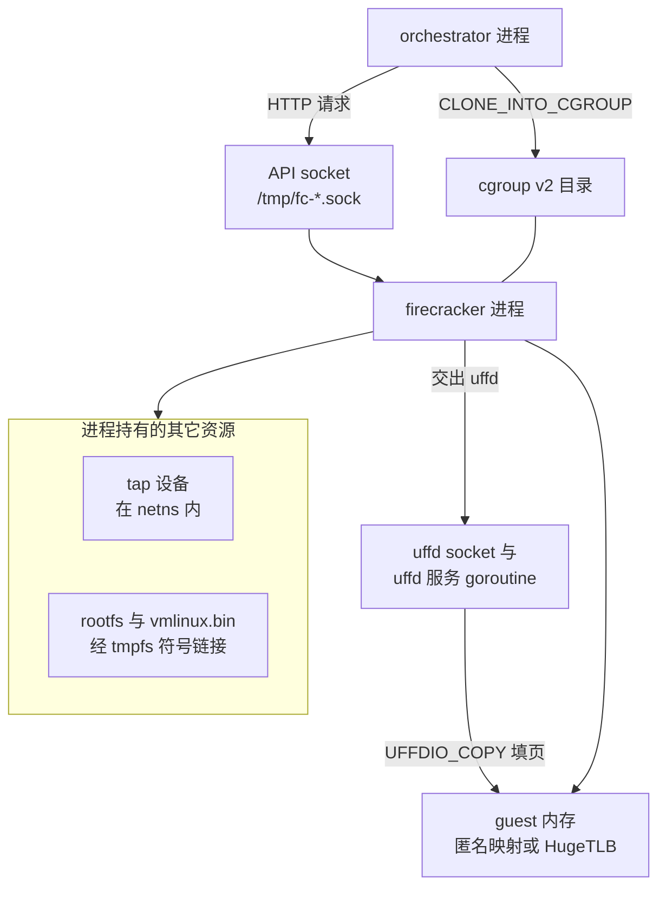

# 03 · Firecracker 入门

> Firecracker 是 e2b 每个沙箱底下那个进程。本篇讲它砍掉了什么、控制面长什么样，
> 以及 e2b 实际用到的那一小块 API —— 三十二个操作里的十四个，其中三个是分叉才有的。
>
> **读者**：工程师、系统工程师。　**预备**：[第 02 篇 §3](02-why-sandbox.md#3-隔离谱系)。
> 知道 KVM 是什么会读得更顺，不知道也能读，[第 04 篇 §1](04-kvm-and-memory-virtualization.md#1-kvm-的接口形状) 会补上。
> **代码**：`packages/orchestrator/internal/sandbox/fc/`、`packages/shared/pkg/fc/`、
> `src/vmm/src/rpc_interface.rs`、`src/vmm/src/vmm_config/snapshot.rs`

---

## 0. 本篇要回答的问题

1. Firecracker 相对通用虚拟机监视器砍掉了什么，砍掉之后失去了什么能力？
2. 它的控制面是什么形态？e2b 在这个控制面上实际调用了哪些操作，按什么顺序？
3. e2b 用 jailer 吗？不用的话，jailer 提供的那些隔离由谁提供？
4. 快照的 create 与 load 各自的前置状态是什么？e2b 为什么两次都不让 Firecracker 写内存文件？
5. `mem_backend` 的 `Uffd` 模式在协议层面是怎么把内存交给外部进程的？

---

## 1. 砍掉了什么

一个通用虚拟机监视器（QEMU 是典型）要模拟一台完整的 PC：BIOS 或 UEFI 固件、PCI 总线、
IDE / SATA 控制器、显卡、声卡、USB 控制器、软驱。这些设备模型是几十万行 C 代码，
它们跑在宿主的用户态、直接处理来自 guest 的输入。对多租户代码沙箱来说，这是两笔开销：

- **攻击面**：设备模拟代码历史上是虚拟机逃逸漏洞的主要来源。guest 里的不可信代码
  能直接驱动这些模型。
- **启动时间**：固件探测总线、枚举设备、加载引导扇区，这些步骤加起来是几百毫秒到几秒，
  而沙箱的目标是把整个创建过程压到这个量级以内。

Firecracker 的做法是把设备集合砍到刚好够跑一个 Linux guest：不做固件，直接把内核镜像
（未压缩的 `vmlinux`）加载进 guest 物理内存并跳转；不做 PCI，virtio 设备挂在 MMIO 上
（分叉代码 `src/vmm/src/devices/virtio/mmio.rs`）；设备类型只有 block、net、vsock、balloon、rng
五种（`src/vmm/src/devices/virtio/` 的目录），加上极少数平台设备 ——
在 x86_64 上是 i8042 键盘控制器与 8250 串口，在 aarch64 上是 PL031 RTC 与串口
（`src/vmm/src/devices/legacy/`：`i8042.rs`、`serial.rs`、`rtc_pl031.rs`）。

进程模型同样是「一台虚拟机一个进程」：没有守护进程，没有虚拟机之间的共享状态。
进程内的线程分工是 API 线程、VMM 主线程、每个 vCPU 一个线程。
这个模型让宿主侧的每一项资源记账 —— cgroup、内存占用、CPU 时间 ——
都可以直接落在一个 PID 上，这正是 orchestrator 依赖的前提（[第 38 篇 §2](38-cgroups-and-host-stats.md#2-上游的-cgroup只记账不设限)）。

代价要一并说清楚。没有 PCI 意味着没有设备直通，也没有热插拔：
一台 microVM 启动之后不能加网卡、不能加磁盘。没有固件意味着 guest 内核必须由宿主提供，
不能从磁盘引导任意操作系统镜像，内核配置还得裁到与这套设备集合匹配
（[第 69 篇 §4](69-guest-kernel-for-arm.md#4-arm64-配置里与-e2b-相关的项)）。设备少也意味着 guest 里跑不了
需要图形、USB 或特殊硬件的负载。对「跑一段 Python」这个场景，这些都不是损失；
对通用云主机，它们是。

---

## 2. 控制面：Unix socket 上的一套 REST API

Firecracker 不从命令行接受虚拟机配置。它启动后创建一个 Unix domain socket，
在上面提供一套 HTTP/1.1 的 REST 接口，配置与控制全部走这个接口。
e2b 的启动命令行只给了一个参数（`packages/orchestrator/internal/sandbox/fc/script_builder.go`
的 `startScriptV2` 模板末行）：

```text
ip netns exec {{ .NamespaceID }} {{ .FirecrackerPath }} --api-sock {{ .FirecrackerSocket }}
```

socket 的路径在 `packages/shared/pkg/storage/sandbox.go` 的 `SandboxFirecrackerSocketPath()`：
`/tmp/fc-<sandboxID>-<randomID>.sock`。进程起来之后 socket 文件才出现，
所以 orchestrator 在 `internal/sandbox/socket/socket.go` 的 `Wait()` 里以 10 ms 为间隔轮询
这个文件存在与否，作为「可以开始调 API 了」的信号。

e2b 不手写这个客户端。`packages/shared/pkg/fc/firecracker.yml` 是一份 Swagger 2.0 描述
（`info.version` 写的是 1.12.1），`generate.go` 用 go-swagger 从它生成
`packages/shared/pkg/fc/client/`。生成结果里 `operations/operations_client.go`
一共有 32 个操作方法，与 yml 里的 32 个 `operationId` 对应。

整个 e2b 代码库里被调用的只有 14 个。下表按调用它的函数列出
（全部在 `packages/orchestrator/internal/sandbox/fc/client.go`）：

| 操作 | HTTP | 调用方 | 用在哪条路径 |
|---|---|---|---|
| `PutGuestBootSource` | PUT /boot-source | `setBootSource` | 冷启动 |
| `PutGuestDriveByID` | PUT /drives/rootfs | `setRootfsDrive` | 冷启动 |
| `PutGuestNetworkInterfaceByID` | PUT /network-interfaces/{id} | `setNetworkInterface` | 冷启动 |
| `PutMmdsConfig` | PUT /mmds/config | `setNetworkInterface` | 冷启动 |
| `PutMachineConfiguration` | PUT /machine-config | `setMachineConfig` | 冷启动 |
| `PutEntropyDevice` | PUT /entropy | `setEntropyDevice` | 冷启动 |
| `CreateSyncAction` | PUT /actions | `startVM` | 冷启动 |
| `LoadSnapshot` | PUT /snapshot/load | `loadSnapshot` | 恢复 |
| `PatchVM` | PATCH /vm | `resumeVM` / `pauseVM` | 恢复、暂停 |
| `PutMmds` | PUT /mmds | `setMmds` | 恢复 |
| `CreateSnapshot` | PUT /snapshot/create | `createSnapshot` | 暂停 |
| `GetMemoryMappings` | GET /memory/mappings | `memoryMapping` | 暂停 |
| `GetMemory` | GET /memory | `memoryInfo` | 暂停 |
| `GetDirtyMemory` | GET /memory/dirty | `dirtyMemory` | 暂停 |

没有被用到的 18 个里，值得点名的是 balloon 的五个（`putBalloon`、`patchBalloon` 等）、
vsock（`putGuestVsock`）、日志与指标（`putLogger`、`putMetrics`）、
CPU 模板（`putCpuConfiguration`）。也就是说：e2b **不用 balloon 回收 guest 内存**，
**不用 vsock 与 guest 通信**（它走 tap 上的 TCP，[第 36 篇 §1](36-orchestrator-proxy-and-envd-client.md#1-三条通道三种信任关系)），
**不让 Firecracker 自己写日志文件**（进程的 stdout / stderr 被 orchestrator 接管，
见 `fc/process.go` 的 `configure()`），**不设 CPU 模板**（于是 guest 看到的是宿主 CPU 的特性集，
这对跨机型迁移快照是个约束）。

两条调用序列的分界很清楚。冷启动只发生在模板构建里
（`internal/sandbox/sandbox.go` 的 `CreateSandbox()` → `fc/process.go` 的 `Create()`）：
boot-source、drive、network-interface + mmds/config、machine-config、entropy，然后
`InstanceStart`。用户创建沙箱走的是恢复路径（`ResumeSandbox()` → `Resume()`）：
snapshot/load、PATCH /vm 到 `Resumed`、PUT /mmds。恢复路径上一个配置类操作都没有 ——
机器配置、磁盘、网卡全都躺在快照里。这是 [第 27 篇 §4](27-resume-sandbox.md#4-串行段从-fcnewprocess-到-resumevm) 的主题。



---

## 3. jailer 与 seccomp：e2b 只用了后者

Firecracker 上游提供一个配套的 `jailer` 二进制。它的职责是在 exec Firecracker 之前
把它关进一组约束里：`chroot` 到一个专属目录、切换到指定的 uid/gid、
进入指定的网络命名空间、新建 PID 与 mount 命名空间、把进程放进指定 cgroup、
关掉不需要的文件描述符。上游文档把 jailer 当作生产部署的推荐入口。

**e2b 不用 jailer。** 依据有两条。第一，在上游 2026.09 的整个代码库里
（`.go`、`.hcl`、`.tf`、`.sh`、`.md`）检索 `jailer` 没有任何命中。
第二，`fc/process.go` 的 `NewProcess()` 里 `exec.CommandContext` 的第一个参数是
`unshare`，参数是 `-m -- bash -c <startScript>`，脚本内容由 `script_builder.go` 生成，
最后一行才 exec Firecracker 本身。

jailer 的那几项职责被拆开、由别处提供：

| jailer 提供的 | e2b 的替代 | 代码位置 |
|---|---|---|
| mount 命名空间 + chroot | `unshare -m` + `mount --make-rprivate /` + 在 `SandboxDir` 上挂 tmpfs | `fc/process.go`、`script_builder.go` |
| 固定的资源路径 | tmpfs 里建符号链接，让 rootfs 与内核在每台沙箱里路径相同 | `startScriptV2` |
| 网络命名空间 | `ip netns exec <NamespaceID>`，槽位由 network 包预建 | `script_builder.go`、[第 35 篇 §2](35-sandbox-networking.md#2-建立一个槽位createnetwork-的完整步骤) |
| cgroup 放置 | orchestrator 先建 cgroup，再用 `CLONE_INTO_CGROUP` 在 fork 时原子放入 | `fc/process.go` 的 `configure()` |
| 降权到非 root uid | 无对应替代 | —— |

符号链接那一步是这套方案的关键，也是不用 jailer 的一个合理动机（**推论**：代码里没有
写明理由）。快照文件里记着磁盘与内核在宿主上的路径；如果每台沙箱的路径不同，
从同一份快照恢复出的多台沙箱就会互相打架。`startScriptV2` 的做法是在私有 mount
命名空间里给 `SandboxDir` 挂一层 tmpfs，再把真实的 rootfs 与内核软链进去，
于是所有沙箱看到的都是同一个路径，而每个沙箱看到的内容不同。
`Create()` 与 `Resume()` 开头都先把这个链接指向 `/dev/null`，等 rootfs provider
真正就绪后再 `SymlinkForce` 到实际文件 —— 这样 Firecracker 进程可以先起来、
和 rootfs 的准备并行。

**seccomp 保留了。** Firecracker 的过滤器是编译进二进制的，默认启用，
只有传 `--no-seccomp` 或 `--seccomp-filter <path>` 才会关闭或替换
（分叉代码 `src/firecracker/src/main.rs` 的参数定义）。e2b 的命令行只有 `--api-sock`，
所以走的是默认过滤器。

没有 jailer 的代价是明确的：Firecracker 进程与 orchestrator 同一个 uid 运行，
没有降权，也没有独立 PID 命名空间。Nomad 上 orchestrator 用的是 `raw_exec` driver
（`iac/modules/job-orchestrator/jobs/orchestrator.hcl`），**推论**：它通常以 root 运行，
Firecracker 也就以 root 运行。此时 guest 逃逸后面对的是 seccomp 过滤器加宿主内核，
而不是再加一层 chroot 与非特权 uid。

---

## 4. 快照：create 与 load

Firecracker 的快照由两个产物构成：**vmstate 文件**（e2b 叫 snapfile），
里面是 vCPU 寄存器、KVM 内部状态、设备状态、内存布局描述；
以及 **guest 内存的内容**。两者分开，是因为前者是几百 KiB 的结构化数据，
后者是几百 MiB 到几 GiB 的原始字节，处理方式完全不同。

`PUT /snapshot/create` 只能在 microVM 处于 `Paused` 状态时调用，
参数是 `CreateSnapshotParams`（分叉 `src/vmm/src/vmm_config/snapshot.rs`）：
`snapshot_type` 取 `Full` 或 `Diff`，`snapshot_path` 必填，`mem_file_path` 是 `Option`，
不给就不导出内存。`Diff` 类型只写出自上次以来被写过的页，前提是启动或加载时
开了 `track_dirty_pages` / `enable_diff_snapshots`，让 KVM 打开脏页日志。

e2b 两个字段都不用。`client.go` 的 `createSnapshot()` 固定传
`SnapshotType: models.SnapshotCreateParamsSnapshotTypeFull` 且不设 `mem_file_path`；
`setMachineConfig()` 固定传 `TrackDirtyPages: false`；`loadSnapshot()` 固定传
`EnableDiffSnapshots: false`。`sandbox.go` 的 `Pause()` 上方那段注释把意图写得很直白：
调 snapshot 端点而不给 memfile 路径，作用只是「生成 snapfile 并把磁盘排空、刷盘」；
内存则由后面三个只读端点加上宿主侧的拷贝自己处理。

于是 e2b 的暂停序列是：`PATCH /vm` 置 `Paused` → `PUT /snapshot/create`（只出 snapfile）
→ 取脏页信息 → 从 Firecracker 进程的地址空间里把脏页直接拷进本地缓存
（`fc/memory.go` 的 `ExportMemory()` 调 `block.NewCacheFromProcessMemory`）。
这么绕的收益是差分粒度与产物布局都归 e2b 自己控制
（[第 37 篇 §4](37-pause-and-snapshot.md#4-内存导出跨进程直读)、[第 29 篇 §2](29-template-artifact-format.md#2-一代产物六个对象)）；
代价是它依赖分叉才有的端点，也依赖读另一个进程内存的能力。

`PUT /snapshot/load` 反过来，只能在 pre-boot 阶段调用：一个刚起来的 Firecracker 进程，
除 logger 与 metrics 外什么都没配。参数里 `mem_backend` 与 `mem_file_path` 二选一，
`resume_vm` 决定加载成功后是否直接跑起来。e2b 传 `ResumeVM: false`，
加载完让虚拟机停在 `Paused`，因为中间还有事要做：`loadSnapshot()` 在
`LoadSnapshot` 返回后要等 `uffdReady` 这个 channel 关闭，确认 uffd 服务已经
接到 fd、可以应答缺页，然后才由 `resumeVM()` 发 `PATCH /vm` 置 `Resumed`。

---

## 5. 内存后端：File 与 Uffd

`MemBackendType` 只有两个取值（`src/vmm/src/vmm_config/snapshot.rs`）：

- `File`：`backend_path` 是内存文件路径，Firecracker 自己把它映射进 guest 物理内存。
- `Uffd`：`backend_path` 是一个 Unix domain socket 的路径，
  外部进程在那里监听；Firecracker 会连过去，把一个 userfaultfd 的文件描述符交给它。

e2b 只用 `Uffd`（`client.go` 的 `loadSnapshot()` 里 `backendType` 写死
`models.MemoryBackendBackendTypeUffd`）。原因在于内存文件根本不在本地：
它是对象存储里的一组分片，加上本地缓存与差分层，按需拉取
（[第 30 篇 §1](30-block-layer.md#1-一次读要穿过多少层)、[第 31 篇 §1](31-uffd-memory-backend.md#1-内存后端是一个接口)）。
`File` 模式要求一个完整的本地文件，等于把「秒级恢复」变成「先下几百 MiB」。

握手协议只有一次交互，值得完整写出来。分叉侧在 `src/vmm/src/persist.rs`：
`create_guest_memory()` 先按快照记录的内存区间做匿名映射，为每个区间构造一条
`GuestRegionUffdMapping{ base_host_virt_addr, size, offset, page_size }`；
接着创建 userfaultfd 并把每个区间 `register` 上去；最后 `send_uffd_handshake()`
连接那个 UDS，用 `send_with_fd` 一次发出两样东西 —— 正文是这组映射的 JSON 数组，
控制消息（`SCM_RIGHTS`）里是 uffd 本身。

e2b 侧的接收在 `packages/orchestrator/internal/sandbox/uffd/uffd.go` 的 `handle()`：
一次 `ReadMsgUnix` 同时取正文与控制消息，正文反序列化成 `[]memory.Region`
（`uffd/memory/region.go`），控制消息里取出那个 fd，两者一起交给事件循环；
监听侧对这次连接设了 10 s 的超时（`uffdMsgListenerTimeout`）。
逐字段的含义、`base_host_virt_addr` 与 `offset` 之间的换算、以及事件循环本身，
都在 [第 04 篇 §4](04-kvm-and-memory-virtualization.md#4-memslot-在用户态的镜像) 与
[第 05 篇 §5](05-userfaultfd.md#5-firecracker-怎么把-uffd-交出去)，本篇不重复。

这里只点出协议里最反直觉的一处：**Firecracker 发完 fd 之后并不关掉自己那一份**。
`send_uffd_handshake()` 上方的注释解释了原因 —— 顺利时本来可以关，
但一旦处理进程崩掉而 Firecracker 手里没有副本，这些区间就会**静默地**退化成
普通匿名内存：缺页由内核填零，不报错，guest 读到的数据默默错掉。
留着一份 fd，失败模式就从「静默的数据损坏」变成「guest 卡死」。
e2b 侧对应的另一半是 `uffd/fdexit/` 与 `Uffd.Exit()`：
处理侧出错时主动让沙箱停下，而不是让它带着错数据继续跑。

---

## 6. 分叉多出来的三个只读端点

上一节提到的 `/memory/mappings`、`/memory`、`/memory/dirty` 不是上游 Firecracker 的接口。
它们在分叉的 `src/vmm/src/rpc_interface.rs` 里作为 `VmmAction::GetMemoryMappings`、
`GetMemory`、`GetMemoryDirty` 出现，也写进了 e2b 自己维护的 `firecracker.yml`。

| 端点 | 返回 | e2b 的用法 |
|---|---|---|
| GET /memory/mappings | 区间数组，字段同 uffd 握手 | 暂停时把脏块偏移换算成宿主虚拟地址区间 |
| GET /memory | `resident` 与 `empty` 两张位图 | 冷启动路径（无 uffd）下判定哪些页要落盘 |
| GET /memory/dirty | `bitmap` 一张位图，需要先 Pause | 恢复路径下取写保护统计出的脏页 |

两条路径用不同的来源，是因为内存后端不同。恢复出来的沙箱有 uffd 服务，
脏页由写保护机制得到（`uffd/uffd.go` 的 `DiffMetadata()` 直接转调
`fc.Process.DirtyMemory()`）。模板构建时冷启动的沙箱没有 uffd，
用的是 `uffd/noop.go` 的 `NoopMemory.DiffMetadata()`：调 `/memory` 拿到
resident 与 empty，`Dirty = resident - empty`，其余全算 empty。
`fc/memory.go` 的注释点明 resident 就是 `mincore` 意义上「被填进来过」的页 ——
它比真正的脏页集合大，冷启动只做一次，宁可多算。分叉相对上游还有别的改动，
留给 [第 70 篇 §2](70-firecracker-fork.md#2-分叉改了什么)。

---

## 7. MMDS：给 guest 的元数据通道

MMDS（microVM Metadata Service）是 Firecracker 在 guest 网络里模拟出的一个
只读元数据服务，地址固定 `169.254.169.254`，形态与云厂商的实例元数据服务一致。
它需要两步配置：`PUT /mmds/config` 声明版本与绑定哪些网卡，
`PUT /mmds` 写入内容。e2b 在 `setNetworkInterface()` 里把版本设为 `"V2"`
并绑定唯一那张网卡，在恢复流程末尾由 `setMmds()` 写内容。

内容就是 `fc/mmds.go` 的 `MmdsMetadata` 四个字段，JSON 名与 Go 字段名故意不同
（源码注释专门警告不要改序列化名）：`instanceID`（沙箱 ID）、`envID`（模板 ID）、
`address`（orchestrator 在沙箱网络内的日志收集地址）、`accessTokenHash`。
guest 侧由 envd 读：`packages/envd/internal/host/mmds.go` 先 `PUT /latest/api/token`
换一个 60 s 有效的 token（V2 要求），再带 token `GET /`。
沙箱的身份、日志去处、访问令牌哈希都从这条通道来
（[第 48 篇 §3](48-envd-overview.md#3-mmdsguest-唯一的带外身份来源)）。

放在恢复流程的最后一步是必要的：快照里带着上一次的 MMDS 内容，
而新沙箱的 ID 与令牌都变了，必须在 guest 里的 envd 读之前覆盖掉。

---

## 8. 版本

Firecracker 二进制按版本装在 `<FirecrackerVersionsDir>/<version>/firecracker`
（`fc/config.go` 的 `Config.FirecrackerPath()`），版本字符串跟着模板走，
存在数据库的 build 记录里。默认值与可选集合在
`packages/shared/pkg/feature-flags/flags.go`：常量
`DefaultFirecackerV1_10Version = "v1.10.1_30cbb07"`、
`DefaultFirecackerV1_12Version = "v1.12.1_a41d3fb"`，
`DefaultFirecrackerVersion` 指向后者；`FirecrackerVersionMap` 把 `v1.10` 与 `v1.12`
两个短名映射到这两个具体版本，并通过 `firecracker-versions` 这个特性开关下发。
版本号里的后缀是构建时的 commit 短 SHA —— 因为这些二进制来自 e2b 自己的分叉，
不是上游发布的产物。

---

## 9. ARM 适配版的差异

三处与本篇相关。`setMachineConfig()` 里 `smt` 从 `true` 改成 `false`
（`smt` 在 Firecracker 的 API 定义里就注明只能在 x86 上开），
且删掉了 `TrackDirtyPages` 字段；内核参数按 `runtime.GOARCH` 分支，
`pci=off`、`i8042.*`、`random.trust_cpu`、`clocksource=kvm-clock` 只在 x86 上加；
`configure()` 里 `CLONE_INTO_CGROUP` 那段被注释掉。
`flags.go` 的两个版本常量都改成 `"v1.13.1"`，指向自建的分叉二进制。
详见 [第 71 篇 §3](71-orchestrator-arm-fc-changes.md#3-machine-configsmt-与-track_dirty_pages)、
[第 73 篇 §2](73-cgroup-and-host-compat.md#2-cgroup关闭宿主侧记账)
与 [第 70 篇 §4](70-firecracker-fork.md#4-版本命名源码-1121装成-v1131)。

---

## 10. 小结

- Firecracker 用「砍设备」换攻击面与启动时间：无固件、无 PCI、virtio-mmio、五类 virtio 设备
  加两三个平台设备；代价是无热插拔、无直通、guest 内核必须定制。
- 控制面是 Unix socket 上的 REST API，进程只接受 `--api-sock` 一个参数就够用。
  e2b 从生成的 32 个操作里只调 14 个，且冷启动与恢复两条序列几乎不重叠。
- balloon、vsock、logger、metrics、CPU 模板这五组能力 e2b 一个都没用。
- e2b 不用 jailer：mount 命名空间靠 `unshare -m`，路径固定靠 tmpfs 加符号链接，
  netns 靠 `ip netns exec`，cgroup 靠 `CLONE_INTO_CGROUP`；seccomp 用默认编译进去的过滤器。
  少掉的那一项是 uid 降权。
- 快照分 vmstate 与内存两部分。e2b 只让 Firecracker 写 vmstate，
  内存由自己从进程地址空间导出，因此 `Full`/`Diff`、`track_dirty_pages` 这些上游机制全部关掉。
- 恢复只能用 `Uffd` 后端，因为内存文件在对象存储里。握手是一次
  `send_with_fd`：正文是区间映射 JSON，控制消息是 userfaultfd。
- Firecracker 保留自己那份 uffd，把「处理进程崩溃」从静默的数据损坏变成 guest 卡死；
  e2b 仍要靠 `fdexit` 主动叫停沙箱。
- `/memory/mappings`、`/memory`、`/memory/dirty` 是分叉扩展；
  恢复路径用 `/memory/dirty`，冷启动路径用 `/memory` 的 resident 减 empty。
- MMDS 是 orchestrator 把新身份交给 guest 的唯一通道，必须在 resume 之后立刻覆盖。

---

## 延伸阅读 / 下一篇

- [第 04 篇 §3](04-kvm-and-memory-virtualization.md#3-memslotguest-物理内存就是-vmm-进程的一段虚拟内存)：guest 物理内存为什么
  就是 VMM 进程的一段虚拟内存 —— 本篇第 5 节的前提。
- [第 05 篇 §3](05-userfaultfd.md#3-事件循环)：拿到那个 fd 之后要做的事。
- [第 28 篇 §2](28-firecracker-process-management.md#2-启动脚本unsharetmpfs-与符号链接)：启动脚本、
  内核参数逐项解释、进程退出的观测。
- [第 27 篇 §3](27-resume-sandbox.md#3-并行段三个-promise-和一个后台预取)：本篇的 API 序列放进完整的并行流程里。
- [第 37 篇 §3](37-pause-and-snapshot.md#3-脏页判据)：`/memory/dirty` 之后发生什么。
- [第 70 篇 §2](70-firecracker-fork.md#2-分叉改了什么)：这三个端点在分叉里的实现，以及分叉的其它改动。
- 上游文档：Firecracker 仓库 `docs/` 下的 `snapshotting/`、`jailer.md`、`mmds/`。
- 下一篇：[第 04 篇 · KVM 与内存虚拟化](04-kvm-and-memory-virtualization.md) —— 本篇反复出现的「guest 内存」「memslot」「脏页」，下一篇给出它们在 KVM 一侧的定义。
