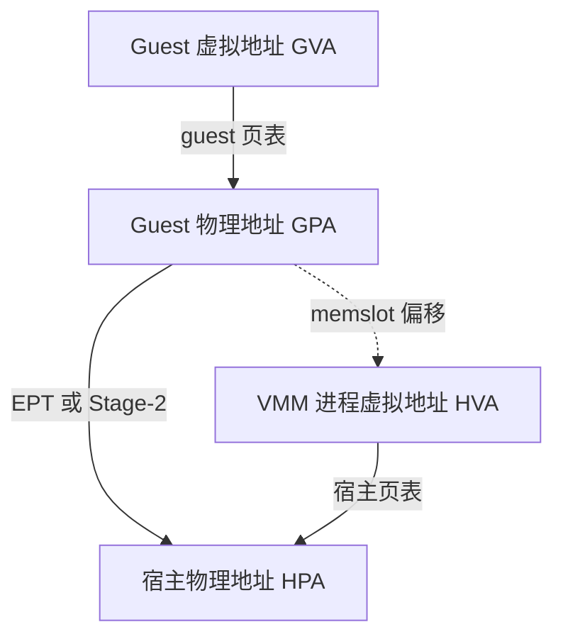

# 04 · KVM 与内存虚拟化

> 本书后面反复出现一句话：「guest 的物理内存就是 VMM 进程的一段虚拟内存」。这句话不是比喻，
> 它是 KVM 的接口约定，也是 e2b 能把内存文件按需拉取、能把脏页导出成差分产物的全部前提。
> 本篇只讲支撑这些机制所需的那部分 KVM 与内存虚拟化知识。
>
> **读者**：学过操作系统与页表、但没写过 VMM 的读者。 　**预备**：[第 03 篇 §1](03-firecracker-primer.md#1-砍掉了什么)。
> 　**代码**：`src/vmm/src/vstate/vm.rs`、`src/vmm/src/vstate/memory.rs`、`src/vmm/src/persist.rs`、
> `packages/orchestrator/internal/sandbox/uffd/memory/`

---

## 0. 本篇要回答的问题

1. KVM 给用户态提供的接口是什么形状？一台虚机在宿主上表现为什么？
2. 「两级地址翻译」翻译的是哪两级，各由谁维护？
3. memslot 是什么？为什么说 guest 物理内存就是 VMM 进程的一段虚拟内存？
4. guest 内部的缺页和宿主上的缺页有什么区别？后者由谁处理，能不能改？
5. 用 2 MiB 大页装 guest 内存，换来了什么、付出了什么？
6. 「这一页被写过」这件事，有哪几种知道的办法？

---

## 1. KVM 的接口形状

早期的虚拟化靠软件模拟或二进制翻译，代价高。x86 的 VMX 与 arm64 的虚拟化扩展把这件事挪进硬件：
CPU 有一个专门的「guest 执行模式」，guest 代码直接跑在物理核上，只有它做了宿主必须介入的事
（访问设备寄存器、执行特权指令、访问未映射的物理地址）才陷出来。KVM 是内核里管理这套硬件能力的模块，
它把能力包装成一组 ioctl 暴露给用户态。

接口是三层文件描述符：

| 层 | 从哪来 | 管什么 |
|---|---|---|
| 系统 fd | `open("/dev/kvm")` | 查询能力（`KVM_CHECK_EXTENSION`）、创建 VM |
| VM fd | 在系统 fd 上 `KVM_CREATE_VM` | 内存布局、中断控制器、创建 vCPU |
| vCPU fd | 在 VM fd 上 `KVM_CREATE_VCPU` | 一个虚拟 CPU 的寄存器与运行 |

分叉 Firecracker 里这三层分别对应 `src/vmm/src/vstate/kvm.rs` 的 `Kvm::new`、
`src/vmm/src/vstate/vm.rs` 的 `Vm::create_common`、同文件的 `create_vcpus`。
`create_common` 里有一段值得注意的注释：`KVM_CREATE_VM` 在负载高的机器上会返回 `EINTR`
（内核在 `mm_take_all_locks()` 这类耗时路径上响应信号），代码里对它重试最多 5 次并做指数退避。
这不是理论问题 —— 一台宿主上同时跑几百台 microVM 时它会真的发生。

**运行一个 vCPU 就是一个循环。** 用户态在 vCPU fd 上调 `KVM_RUN`，控制权交给 guest；
guest 一直跑到需要宿主介入，`KVM_RUN` 返回，用户态读出退出原因、处理、再调一次 `KVM_RUN`。
`src/vmm/src/vstate/vcpu.rs` 的 `run_emulation` 就是这个循环的一次迭代，
返回值交给 `handle_kvm_exit` 分派：`VcpuExit::MmioRead` / `MmioWrite` 转给设备总线，
`Hlt`、`Shutdown`、`SystemEvent` 表示 guest 要停机，`FailEntry`、`InternalError` 是硬件或 KVM 出了问题。

这张分派表短得反常，因为 Firecracker 的设备少：没有 PCI、没有传统 x86 外设，只有 virtio-mmio 和几个必需件
（[第 03 篇 §1](03-firecracker-primer.md#1-砍掉了什么)）。**设备少 = 退出原因少 = 每秒陷出次数少**，
这是 Firecracker 启动快、开销低的一个来源，代价是 guest 里能用的硬件也少。

一台虚机在宿主上表现为一个普通进程：有 pid，受 cgroup 约束，能被 `kill`，
它的 vCPU 是这个进程里的线程。宿主看不到「虚机」这个对象，只看到进程和它持有的几个 fd。

---

## 2. 两级地址翻译

不开虚拟化时，页表把虚拟地址翻成物理地址，一级。开了虚拟化后是两级：



上面一级是 guest 自己的事：guest 内核以为 GPA 就是真实物理内存，照常维护它的页表。
下面一级由宿主 KVM 维护，x86 上叫 EPT（Extended Page Tables），arm64 上叫 Stage-2 翻译。
两级都由硬件页表游走器（page table walker）自动完成，命中 TLB 时一次翻译零成本；
未命中时硬件要走两层页表，最坏情况下的访存次数是一级时的数倍 —— 这是虚拟化下 TLB 压力更敏感的原因，
也是[第 6 节](#6-大页)里大页值钱的原因。

图里那条虚线是本篇的核心：**GPA 到 HVA 的对应关系不是页表，是 memslot 定义的一个固定偏移**。
KVM 建立 Stage-2 页表项时，先按 memslot 把 GPA 换算成 VMM 进程里的一个虚拟地址，
再走宿主自己的页表把它落到物理页上。

---

## 3. memslot：guest 物理内存就是 VMM 进程的一段虚拟内存

VMM 通过 `KVM_SET_USER_MEMORY_REGION` 告诉 KVM guest 的物理内存长什么样。
一个 memslot 是一个四元组，在 `src/vmm/src/vstate/vm.rs` 的 `register_memory_region` 里填出来：

```rust
let memory_region = kvm_userspace_memory_region {
    slot: next_slot,
    guest_phys_addr: region.start_addr().raw_value(),
    memory_size: region.len(),
    userspace_addr: region.as_ptr() as u64,
    flags,
};
```

含义是：guest 物理地址 `[guest_phys_addr, guest_phys_addr + memory_size)` 这一段，
内容在本进程虚拟地址 `[userspace_addr, userspace_addr + memory_size)` 这一段里。
memslot 的数量有上限（`Kvm::max_nr_memslots`），`register_memory_region` 会先检查，
超了返回 `VmError::NotEnoughMemorySlots`。

一台虚机通常不止一个 memslot，因为 guest 物理地址空间里有留给 MMIO 的空洞。
`src/vmm/src/arch/x86_64/mod.rs` 的 `arch_memory_regions` 在内存超过 `MMIO_MEM_START`（约 3 GiB）时
返回两段：空洞之前一段，`FIRST_ADDR_PAST_32BITS` 之后一段。
`src/vmm/src/arch/aarch64/mod.rs` 的同名函数简单得多，只返回一段，从 `DRAM_MEM_START`（`0x8000_0000`）开始 ——
arm64 的设备与 GIC 都排在 DRAM 之下，不需要在中间挖洞。**同样大小的 guest，在两个架构上 memslot 的个数不一样**，
这一点会在[第 4 节](#4-memslot-在用户态的镜像)变成一个具体的工程约束。

一台 4 GiB 的 x86 guest，三个地址空间的对应大致是这样（地址为示意）：

```text
Guest 物理地址空间 (GPA)          VMM 进程虚拟地址空间 (HVA)        内存文件偏移
0x0000_0000 ┌──────────────┐      0x7f10_0000_0000 ┌──────────┐    0x0000_0000 ┌──────────┐
            │  memslot 0   │ ───► │ 一次 mmap 的结果 │ ◄─────────── │ 前 3 GiB   │
0xC000_0000 └──────────────┘      0x7f10_C000_0000 └──────────┘    0xC000_0000 ├──────────┤
            ░ MMIO 空洞     ░                  （地址不连续）                     │ 后 1 GiB  │
0x1_0000_0000 ┌────────────┐      0x7f20_0000_0000 ┌──────────┐    0x1_0000_0000└──────────┘
            │  memslot 1   │ ───► │ 另一次 mmap    │ ◄───────────
0x1_4000_0000└────────────┘      0x7f20_4000_0000 └──────────┘
```

GPA 里的空洞在文件里不占位置，两个 memslot 在宿主虚拟地址空间里也没有位置关系。
把这三列对齐起来的那张区间映射，就是[第 4 节](#4-memslot-在用户态的镜像)的内容。
它与全书术语表里的「映射表（header）」不是一回事：后者记的是块到某一代 diff 的归属
（[第 29 篇 §3](29-template-artifact-format.md#3-header-的字节布局)），这里记的是区间到宿主虚拟地址的换算。

那段进程虚拟内存从哪来？`src/vmm/src/vstate/memory.rs` 的 `create` 是唯一的出口，三个调用方各给一组 mmap 参数：

| 函数 | mmap 方式 | 用在哪 |
|---|---|---|
| `anonymous` | `MAP_PRIVATE \| MAP_ANONYMOUS` | 冷启动；以及从快照加载且内存后端是 uffd 时 |
| `memfd_backed` | `MAP_SHARED` + 一个 memfd | 需要与别的进程共享 guest 内存时 |
| `snapshot_file` | `MAP_PRIVATE` + 内存文件 | 从快照加载且内存后端是 File 时 |

三者都带 `MAP_NORESERVE`：只建立映射，不预先承诺物理内存。
`snapshot_file` 这一行就是「内存文件可以 mmap 后交给 KVM」的字面实现 ——
guest 内存的初值不需要事先读进来，映射建好、memslot 注册完，guest 就能跑，
访问到哪一页，宿主内核就从文件读哪一页。

e2b 走的是另一条：`src/vmm/src/persist.rs` 的 `guest_memory_from_uffd` 调 `memory::anonymous` 建出匿名映射，
把每个区间注册到一个 userfaultfd 上，然后通过 Unix socket 把 uffd 和区间描述一起发给 orchestrator。
匿名映射的每一页初始都不存在，谁来填由用户态说了算 —— 这是[第 05 篇 §2](05-userfaultfd.md#2-接口) 的主题。

这个约定还有一个反方向的用处。既然 guest 内存就是 VMM 进程的普通虚拟内存，
宿主上任何能读进程内存的手段都能读到它。
`packages/orchestrator/internal/sandbox/fc/memory.go` 的 `ExportMemory` 正是这么做的：
它拿到需要导出的块范围，换算成宿主虚拟地址范围，交给
`packages/orchestrator/internal/sandbox/block/cache.go` 的 `NewCacheFromProcessMemory`，
后者用 `process_vm_readv` 直接从 Firecracker 进程里把这些页读出来写进缓存文件。
不经过 Firecracker 的 API，不经过 guest，也不需要暂停之外的任何配合。

---

## 4. memslot 在用户态的镜像

Firecracker 把 memslot 交给 orchestrator 的形式，是 `src/vmm/src/persist.rs` 里的
`GuestRegionUffdMapping`：`base_host_virt_addr`（这段区间在 Firecracker 进程里的起始虚拟地址）、
`size`、`offset`（这段内容在内存文件里的起始偏移）、`page_size`。
`create_guest_memory` 按 memslot 顺序累加 `offset`，也就是说**内存文件里的布局是各 memslot 内容首尾相接，
GPA 空间里的空洞在文件里不占位置**。

orchestrator 侧的镜像在 `packages/orchestrator/internal/sandbox/uffd/memory/region.go`：

```go
type Region struct {
	BaseHostVirtAddr uintptr `json:"base_host_virt_addr"`
	Size             uintptr `json:"size"`
	Offset           uintptr `json:"offset"`
	// This field is deprecated in the newer version of the Firecracker with a new field `page_size`.
	PageSize uintptr `json:"page_size_kib"` // This is actually in bytes in the deprecated version.
}
```

`region.go` 上的四个方法就是这一节全部的算术：`endOffset`、`endHostVirtAddr` 给出两个空间里的右端点，
`shiftedOffset(addr)` 把宿主虚拟地址换成文件偏移，`shiftedHostVirtAddr(off)` 反过来。
`mapping.go` 的 `Mapping` 持有一组 `Region`，提供三个查询：

- `GetOffset(hostVirtAddr)` —— 收到缺页事件时用：内核给的是宿主虚拟地址，要知道去文件的哪里取数据；
- `GetHostVirtAddr(off)` —— 预取时用：手里有文件偏移，要知道往哪个地址填；
- `GetHostVirtRanges(off, size)` —— 导出时用：一段连续的文件区间，可能横跨多个 memslot，
  返回的是**一组**宿主虚拟地址区间。

第三个方法解释了为什么这里必须是「一组区间」而不是一个基址加偏移。
文件偏移是连续的，宿主虚拟地址在跨 memslot 时会跳变（两次 mmap 的结果之间没有任何位置关系），
所以一次跨区间的请求必须被切开，`GetHostVirtRanges` 里那个 `for n := int64(0); n < size;` 循环做的就是切分。
在只有一个 memslot 的 arm64 上这个循环永远只跑一轮；在内存超过 3 GiB 的 x86 上它是必需的。
两个查询方向都是对 `Regions` 的线性扫描，区间个数是个位数，所以没有做索引。

这份镜像从哪来：`packages/orchestrator/internal/sandbox/uffd/uffd.go` 的 `handle` 在握手时
把收到的 JSON 反序列化成 `[]memory.Region`，再用 `memory.NewMapping(regions)` 建出这张区间映射。
接收缓冲区固定 1024 字节（`regionMappingsSize`）—— 对个位数个区间够用。
握手协议本身（谁先连谁、fd 怎么随带外消息传过来、为什么 Firecracker 自己还留一份）
在[第 05 篇 §5](05-userfaultfd.md#5-firecracker-怎么把-uffd-交出去)，本篇不重复。

同一个结构还有第二个来源：`packages/orchestrator/internal/sandbox/fc/client.go` 的 `memoryMapping`
调 Firecracker 的 `GetMemoryMappings` 接口拿到 `GuestMemoryRegionMapping` 列表，
用 `NewMappingFromFc` 转成同一个 `Mapping`。暂停一台运行中的沙箱、要导出它的内存时走的是这一条。

---

## 5. 两层缺页

「缺页」这个词在虚拟化语境下指两件完全不同的事，混淆它们会导致对整套机制的误解。

| | Guest 缺页 | 宿主缺页 |
|---|---|---|
| 触发 | guest 访问自己页表里不存在的 GVA | 硬件走 Stage-2 / EPT 时该 GPA 对应的宿主页不存在 |
| 谁处理 | guest 内核的缺页处理程序 | 宿主内核；先由 KVM 接住，再走 VMM 进程地址空间的常规缺页路径 |
| 宿主是否可见 | 不可见，不产生 VM-Exit | 可见 |
| 能否被用户态接管 | 不能 | **能** —— 这一段若注册给 userfaultfd，就由用户态填页 |

第一行的不对称是关键：**guest 内部的换页活动对宿主是透明的**。
guest 换出一页、再换进来，宿主什么都不知道，也不该知道。
宿主要关心的只有第二列：某个 GPA 第一次被访问时，那一页的内容从哪来。

不接管时，答案由 mmap 的方式决定：匿名映射给一张清零页，文件映射从页缓存或磁盘读。
接管之后，答案可以是任意的 —— 本地缓存文件、远端对象存储上的一个分片、另一台沙箱的同一页。
e2b 用的就是这条：模板的内存文件不需要预先下载完整，沙箱先跑起来，
访问到的页才去拉，拉的粒度是分片而不是页（[第 30 篇 §1](30-block-layer.md#1-一次读要穿过多少层)、
[第 31 篇 §1](31-uffd-memory-backend.md#1-内存后端是一个接口)）。

代价也在这里：每一次宿主缺页现在都要经过一次内核到用户态再回内核的往返。
一次本地填页是几十微秒量级，远端拉取是毫秒量级，而不接管时的匿名页缺页是微秒量级。
这个代价是「沙箱从不冷启动」这条设计换来的 —— 用启动时不读全部内存，换运行时的按需读取。

---

## 6. 大页

宿主的默认页是 4 KiB。一台 4 GiB 的 guest 有一百万页，
这意味着一百万个可能的宿主缺页事件、一张覆盖一百万页的 Stage-2 页表、以及 TLB 里每一项只覆盖 4 KiB。

改用 2 MiB 的 HugeTLB 页，这三项各降 512 倍。分叉 Firecracker 里这是 mmap 的一个 flag，
`src/vmm/src/vmm_config/machine_config.rs` 的 `HugePageConfig::mmap_flags` 对 `Hugetlbfs2M`
返回 `MAP_HUGETLB | MAP_HUGE_2MB`，`page_size()` 返回 `2 * 1024 * 1024`；
它一路传到 `memory::anonymous`，成为 guest 内存映射的属性。
orchestrator 侧的入口是 `packages/orchestrator/internal/sandbox/fc/client.go` 的 `setMachineConfig`：
`hugePages` 为真时给 machine-config 带上 `huge_pages: "2M"`。

对 e2b 的额外收益是缺页事件数：guest 内存由 uffd 托管，页越大，事件越少，
每次事件搬运的数据越多，用户态往返的固定开销被摊得越薄。
`page_size` 顺着 `GuestRegionUffdMapping` 传到 orchestrator，成为 `Region.PageSize`，
`GetOffset` 把它一并返回 —— 填页时必须按这个粒度对齐，不能按 4 KiB 填一个 HugeTLB 区间。

代价有三项，都不小：

- **必须预留。** HugeTLB 页不能从普通页临时凑，要提前从 `nr_hugepages` 里分配。
  上游的节点初始化脚本 `iac/provider-gcp/nomad-cluster/scripts/start-client.sh` 里，
  一部分比例写进 `/proc/sys/vm/nr_hugepages`（永久预留，监控里显示为已用），
  其余写进 `nr_overcommit_hugepages`（按需分配，会受宿主内存碎片影响而失败）。
  预留多了浪费，少了沙箱起不来。
- **粒度浪费。** 内存以 2 MiB 为单位分配，guest 里稀疏使用的区域会整块占住。
- **差分放大。** e2b 的内存产物按块记录改动，块大小跟着页大小走：
  `packages/shared/pkg/storage/header/diff.go` 里 `PageSize` 是 4 KiB、`HugepageSize` 是 2 MiB，
  `packages/orchestrator/internal/template/build/config/config.go` 的 `MemfilePageSize(hugePages)`
  在两者之间二选一。开了大页，guest 改动一个字节就要在差分里写 2 MiB。
  快照的存储与传输成本因此可能显著上升（[第 29 篇 §6](29-template-artifact-format.md#6-块大小与大页)、
  [第 37 篇 §3](37-pause-and-snapshot.md#3-脏页判据)）。

还有一条硬约束：从 hugetlbfs 支撑的快照恢复时**只能用 uffd 后端**。
`src/vmm/src/persist.rs` 的 `GuestMemoryFromFileError::HugetlbfsSnapshot` 就是这个拒绝
（「Cannot restore hugetlbfs backed snapshot by mapping the memory file. Please use uffd.」）。
对 e2b 无所谓，它本来就走 uffd。

上游 2026.09 里这个开关不是用户直接设的：`packages/api/internal/sandbox/sandbox_features.go` 的
`HasHugePages()` 按 Firecracker 版本判断（1.7 及以上为真），结果通过 gRPC 的 `HugePages` 字段
一路带到模板构建与沙箱创建。也就是说它是**每模板 / 每沙箱携带的一个布尔值，取值由所用的 Firecracker 版本决定**。
更细的行为在[第 32 篇 §5](32-memory-prefetch-and-hugepages.md#5-大页改变了哪些量)。

---

## 7. 脏页从哪里知道

「哪些页被写过」是增量快照的全部前提：只存改动量的前提是知道改了什么。
判据宁可多记不可漏记 —— 多记只是慢，漏记会让快照里混进错误的数据。知道这件事有三条路，代价差很远。

**一、KVM 脏页日志。** VMM 给 memslot 打 `KVM_MEM_LOG_DIRTY_PAGES`，KVM 把 Stage-2 页表设成只读，
guest 第一次写某页触发权限故障陷出，KVM 在位图里置位并放开该页。VMM 用 `KVM_GET_DIRTY_LOG` 取位图。
分叉 Firecracker 里，`register_memory_region` 在区间带 bitmap 时就加上这个 flag，
`vm.rs` 的 `get_dirty_bitmap` 和 `reset_dirty_bitmap` 是取和清。
代价模型很清楚：**每个干净页的第一次写付一次 VM-Exit**，之后免费。
注意 `KVM_GET_DIRTY_LOG` 是破坏性读 —— 取走即清空，所以 `memory.rs` 的 `dump_dirty` 在写文件失败时
调 `store_dirty_bitmap` 把 KVM 位图折回用户态位图，成功时才 `reset_dirty`。

**二、userfaultfd 写保护。** 内存由 uffd 托管时，填页的 `UFFDIO_COPY` 可以选择保留写保护位：
因读而填的页保留，之后 guest 若去写它会再触发一次写保护事件；因写而填的页不保留。
于是 `/proc/<pid>/pagemap` 里的 uffd-wp 位就是一个精确判据：存在且未写保护 = 被写过。
这是上游 e2b 实际使用的机制，细节在[第 05 篇 §4](05-userfaultfd.md#4-写保护)与[第 37 篇 §3](37-pause-and-snapshot.md#3-脏页判据)。
它的好处是不依赖 KVM 的写保护，坏处是读缺页要多走一次用户态往返。

**三、硬件标脏。** 部分 CPU 能在写 Stage-2 覆盖的页时由硬件直接记录，不产生为标脏而生的陷出。
接口上仍然从 `KVM_GET_DIRTY_LOG` 出口，所以对 VMM 透明 —— 好处是代码不用分叉，
坏处是**降级完全静默**，退回软件写保护时功能全对，只是慢。
本书不展开硬件标脏，它属于 checkpoint / restore 手册的范围
（[第 87 篇 §3](87-beyond-checkpoint-restore.md#3-三处关键能力的轮廓) 给指引）。

还有一个容易被漏掉的来源：**VMM 自己写 guest 内存不经过 Stage-2 故障**。
设备模拟往 virtio 队列里写数据时用的是宿主的普通内存写，KVM 不知道。
`memory.rs` 里每个区间因此另有一份用户态的 `AtomicBitmap`，由 `mark_dirty` 维护，
`dump_dirty` 写差分时取的是**两份位图的并集**。

| | 判据来源 | 每个干净页首次写的代价 | 精度 |
|---|---|---|---|
| KVM 脏页日志 | Stage-2 权限故障 | 一次 VM-Exit | 精确 |
| uffd 写保护 | pagemap 的 uffd-wp 位 | 一次用户态往返 | 精确 |
| 硬件标脏 | CPU 直接记录 | 接近零 | 精确 |
| VMM 用户态位图 | VMM 自己标记 | 无 | 只覆盖 VMM 的写 |

---

## 8. ARM 适配版的差异

三处与本篇相关。其一，`packages/orchestrator/internal/sandbox/fc/client.go` 的 `setMachineConfig`
不再显式发送 `track_dirty_pages`，并把 `smt` 从 `true` 改为 `false`。
其二，`packages/orchestrator/internal/sandbox/uffd/userfaultfd/userfaultfd.go` 里
`UFFDIO_COPY_MODE_WP` 那两行被注释掉，[第 7 节](#7-脏页从哪里知道)的第二条路因此在 ARM 适配版上不成立，
脏页判据塌缩成「常驻即脏」。其三，Firecracker 的内核命令行参数按架构分流，
`pci=off`、`i8042.*`、`clocksource=kvm-clock` 只在 x86 上传。
详见[第 71 篇 §3](71-orchestrator-arm-fc-changes.md#3-machine-configsmt-与-track_dirty_pages)、
[第 72 篇 §3](72-uffd-on-arm.md#3-判据是怎么塌缩的)
与[第 82 篇 §4](82-host-kernel-nbd-hugepages.md#4-大页预留算法与-aarch64-上的一个假设)。

---

## 9. 小结

1. KVM 的接口是三层 fd：系统 fd 查能力、VM fd 管内存与中断、vCPU fd 跑 `KVM_RUN` 循环。
   一台虚机在宿主上就是一个普通进程，vCPU 是它的线程。
2. 地址翻译两级：GVA→GPA 由 guest 自己维护，GPA→HPA 由宿主 KVM 用 EPT / Stage-2 维护。
   两级都靠硬件走表，代价体现在 TLB 未命中时的访存次数上。
3. memslot 用四元组把一段 GPA 绑到 VMM 进程的一段虚拟地址。
   这条约定同时支撑了两件事：内存文件可以 mmap 后直接交给 KVM；宿主可以用 `process_vm_readv`
   从 Firecracker 进程里把 guest 内存读出来。
4. x86 因为 MMIO 空洞可能有两个 memslot，aarch64 只有一个。文件偏移连续而宿主虚拟地址跨区间跳变，
   所以 `Mapping.GetHostVirtRanges` 必须返回一组区间而不是一个。
5. guest 缺页对宿主不可见；宿主缺页可见，且可以被 userfaultfd 接管。
   接管换来按需加载，代价是每次缺页多一次用户态往返。
6. 2 MiB 大页把缺页次数、页表规模、TLB 覆盖各改善 512 倍，代价是必须预留、粒度浪费，
   以及差分块变成 2 MiB 导致的快照放大。hugetlbfs 支撑的快照只能用 uffd 后端恢复。
7. 脏页判据有三个来源（KVM 日志、uffd 写保护、硬件标脏）加一份 VMM 自己的位图；
   最终写差分时取并集。KVM 脏页日志是破坏性读，取图之后必须先折回再做可能失败的事。

---

## 延伸阅读 / 下一篇

- [第 05 篇 §3](05-userfaultfd.md#3-事件循环) —— 本篇第 5 节的接管机制的完整接口与事件循环。
- [第 31 篇 §3](31-uffd-memory-backend.md#3-事件循环) —— `Mapping` 在真实的缺页处理路径上怎么被用。
- [第 32 篇 §5](32-memory-prefetch-and-hugepages.md#5-大页改变了哪些量) —— 大页在 e2b 里的实际配置与预取的配合。
- [第 37 篇 §3](37-pause-and-snapshot.md#3-脏页判据) —— 脏页判据落到产物上的完整路径。
- [第 03 篇 §2](03-firecracker-primer.md#2-控制面unix-socket-上的一套-rest-api) —— 本篇讲的 KVM 接口被 Firecracker 包装成了什么。
- 外部：Linux 内核文档 `Documentation/virt/kvm/api.rst`（memslot 与 `KVM_GET_DIRTY_LOG` 的权威语义）；
  `Documentation/admin-guide/mm/hugetlbpage.rst`（HugeTLB 的预留模型）。

**下一篇**：[第 05 篇 · userfaultfd：把缺页交给用户态](05-userfaultfd.md)。
