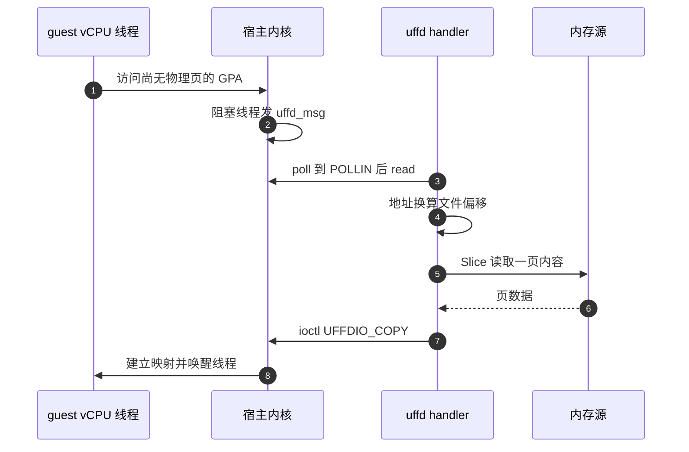
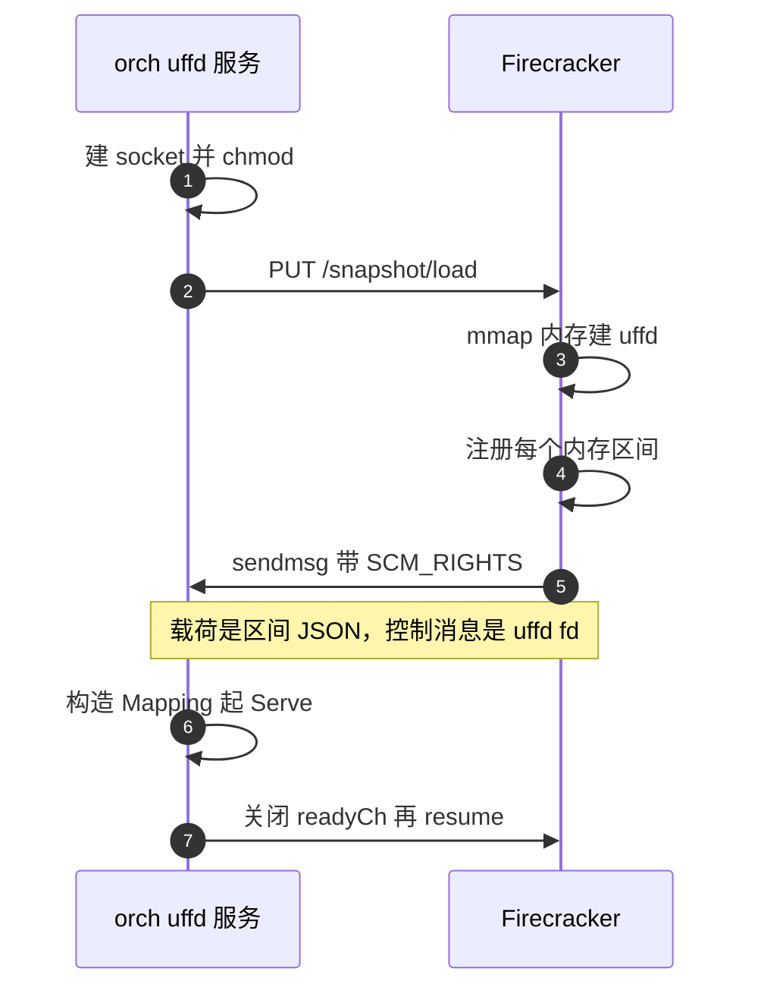

# 05 · userfaultfd：把缺页交给用户态

> 一台从快照恢复的沙箱，内存内容在对象存储里，不在本地。userfaultfd 让宿主内核在 guest 触碰
> 某一页时停下来问用户态进程「这一页的内容是什么」，于是「按需从远端取内存」成为可能。
> 本篇讲这个内核接口本身：它的 API、事件循环、写保护，以及 Firecracker 怎么把这个 fd 交给别的进程。
>
> **读者**：懂虚拟内存与缺页概念、没用过 userfaultfd 的读者。
> **预备**：[第 04 篇 §3](04-kvm-and-memory-virtualization.md#3-memslotguest-物理内存就是-vmm-进程的一段虚拟内存)（memslot）与 [§2](04-kvm-and-memory-virtualization.md#2-两级地址翻译)（两级翻译）；
> [第 03 篇 §2](03-firecracker-primer.md#2-控制面unix-socket-上的一套-rest-api)（snapshot/load 与 REST API）。
> **代码**：`packages/orchestrator/internal/sandbox/uffd/userfaultfd/fd.go`、
> `packages/orchestrator/internal/sandbox/uffd/userfaultfd/userfaultfd.go`、
> `packages/orchestrator/internal/sandbox/uffd/uffd.go`、
> `packages/orchestrator/internal/sandbox/uffd/memory/`；分叉 Firecracker 的 `src/vmm/src/persist.rs`、
> `src/vmm/src/utils/pagemap.rs`。

---

## 0. 本篇要回答的问题

1. 已经有 `mmap` 一个文件这种按需加载手段了，为什么还需要 userfaultfd？
2. 一个 userfaultfd 从创建到能服务缺页，要走哪几步 ioctl？各步能选什么？
3. 事件循环长什么样：读到的是什么结构，怎么区分读缺页与写缺页，填页之后 guest 怎么被唤醒？
4. 「写保护」在 userfaultfd 里有两种用法，同步的与异步的，各自的代价是什么？为什么 pagemap 的
   bit 57 可以当脏页判据？
5. Firecracker 自己创建的 uffd，怎么跨进程交给另一个程序？为什么它自己还要留一份？
6. 大页（2 MiB）区域用 userfaultfd 有什么不同？

---

## 1. 问题：内存内容不在本地

[第 04 篇 §3](04-kvm-and-memory-virtualization.md#3-memslotguest-物理内存就是-vmm-进程的一段虚拟内存) 已经说明，guest 物理内存在宿主上就是 VMM 进程的一段
虚拟内存（memslot）。于是「从快照恢复一台虚机」在最朴素的实现里就是：把快照里的内存文件读进
这段虚拟内存，再让 vCPU 跑起来。

朴素实现有两个问题。

**其一，它是全量的。** 一台 4 GiB 内存的沙箱，恢复时要先搬 4 GiB。而绝大多数沙箱只活几十秒、
只碰其中很小一部分页。把没人碰的页也搬一遍，时间与带宽都白花。

**其二，内容不一定在本地。** e2b 的内存文件放在对象存储里，本地只有缓存；而且一个快照的内存
往往是「基底 + 若干代 diff」拼出来的（[第 29 篇 §5](29-template-artifact-format.md#5-diff-链是怎么长出来的)），
某一页到底该取哪一代，要查映射表才知道。

第一个问题，`mmap` 一个文件加上内核的按需换页可以解决一半：页表初始为空，guest 第一次访问某页时
宿主缺页，内核从文件读进来。但这条路上**决策权全在内核**：内核只会去读那个文件的对应偏移。
它不会替你查映射表，不会替你发 HTTP 请求去对象存储，也不会在取不到时告诉你该怎么办。

userfaultfd 补的正是这个缺口：**把「这一页的内容从哪来」这个决策，从内核挪到用户态**。
代价也很清楚 —— 每一次首次访问都要经历一次「陷入内核 → 唤醒用户态进程 → 用户态填页 → 唤醒
guest」的往返，而不是内核内部的一次文件读。这条往返有多贵，决定了必须配合预取
（[第 32 篇 §1](32-memory-prefetch-and-hugepages.md#1-按需缺页的账)）。

---

## 2. 接口

### 2.1 创建与特性协商

`userfaultfd(2)` 系统调用返回一个文件描述符。常见的标志是 `O_CLOEXEC` 与 `O_NONBLOCK`；
上游 2026.09 的测试辅助函数 `uffd/userfaultfd/fd_helpers_test.go` 的 `newFd()` 就是用这两个标志
直接发 `NR_userfaultfd` 系统调用的。

拿到 fd 之后第一件事是 `UFFDIO_API` ioctl：调用方填入自己支持的 API 版本（`UFFD_API`）与希望
启用的特性位，内核回填它实际支持的特性集。这是一次**协商**，不是一次声明 —— 请求了内核不支持的
特性会失败，因此调用方必须能接受降级。上游 2026.09 在 `fd_helpers_test.go` 的 `configureApi()`
里请求两个特性：页大小是 2 MiB 时加 `UFFD_FEATURE_MISSING_HUGETLBFS`，以及 `UFFD_FEATURE_WP_ASYNC`。

`UFFD_FEATURE_WP_ASYNC` 是较新的内核特性，`fd.go` 里为它准备了一段 C 兜底定义：如果编译环境的
`linux/userfaultfd.h` 里没有这个宏，就按 `1 << 15` 自己定义一个。这说明代码要能在头文件较旧的
构建环境里编译过，但**能不能编译过与运行时内核支不支持是两回事** —— 运行时不支持时，
`UFFDIO_API` 会拒绝这个特性位。

### 2.2 注册区间：MISSING、WP、MINOR

`UFFDIO_REGISTER` 把一段虚拟地址区间挂到这个 fd 上，`mode` 字段选择要拦截哪类事件：

| 模式 | 拦截什么 | 用来做什么 |
|---|---|---|
| `UFFDIO_REGISTER_MODE_MISSING` | 访问一个尚未有物理页的地址 | 按需填充内存 |
| `UFFDIO_REGISTER_MODE_WP` | 写一个被写保护标记的已有页 | 跟踪「哪些页被写过」 |
| `UFFDIO_REGISTER_MODE_MINOR` | 页已在页缓存但当前页表无映射 | shmem / hugetlbfs 上的 minor fault，e2b 不用 |

上游 2026.09 在 `fd.go` 中导出了 `UFFDIO_REGISTER_MODE_MISSING` 与 `UFFDIO_REGISTER_MODE_WP`
两个常量，没有导出 MINOR。不过在 e2b 的运行路径上，`UFFDIO_REGISTER` 是由 Firecracker 发的
（见 [§5](#5-firecracker-怎么把-uffd-交出去)），orchestrator 拿到的是一个已经注册好的 fd。
`userfaultfd.go` 的 `Serve()` 在收到 MINOR 或 WP 标志的事件时直接报错退出，
注释写明「我们没有用这些标志注册」。

### 2.3 解决一次缺页

事件发生后，用户态用下面几个 ioctl 之一把这一页「补上」，内核随即唤醒被卡住的线程：

- `UFFDIO_COPY`：从用户态缓冲区拷贝一页（或多页）内容到目标地址。这是 e2b 唯一用到的填页手段。
- `UFFDIO_ZEROPAGE`：填零页，省掉一次内存拷贝。
- `UFFDIO_CONTINUE`：MINOR 模式下让内核直接用页缓存里已有的内容建立映射。
- `UFFDIO_WRITEPROTECT`：不填页，只改一段区间的写保护状态（加上或去掉）。

`fd.go` 里 `Fd.copy()` 封装了 `UFFDIO_COPY`，做了两件容易漏的事：把目标地址按页大小向下对齐
（`CULong(addr) &^ CULong(pagesize-1)`），以及检查内核回填的 `copy` 字段是否等于请求的长度 ——
`UFFDIO_COPY` 允许部分完成，不检查就会静默丢数据。

`UffdioWriteProtect` 结构在 `fd.go` 里有类型别名，但上游 2026.09 的运行路径没有调用它。
原因见 [§4](#4-写保护)。

---

## 3. 事件循环

一个 userfaultfd 的服务端就是一个循环：等 fd 可读 → 读出事件 → 找页 → 填页。
上游 2026.09 的实现在 `uffd/userfaultfd/userfaultfd.go` 的 `Userfaultfd.Serve()`。



### 3.1 poll 两个 fd

`Serve()` 同时 poll 两个描述符：uffd 本身，以及一个「退出管道」的读端
（`uffd/fdexit/fdexit.go` 的 `FdExit`，本质是 `os.Pipe()`）。这样服务端不需要超时轮询也能被
外部叫停 —— 谁想让它停下，就往管道写一个字节。收到退出信号时，`Serve()` 先 `errgroup.Wait()`
等所有在途的填页 goroutine 结束再返回，避免在 `UFFDIO_COPY` 进行中把 fd 关掉。

`poll` 返回 `EINTR` 或 `EAGAIN` 时继续 poll。此外代码里有一处防御：即使 `poll` 返回了，
uffd 上也可能没有 `POLLIN`，这时 `read` 会返回 `EAGAIN`；`Serve()` 用两个计数器
（`uffd: no data in fd`、`uffd: eagain during fd read`）把这种情况累计后再打日志，而不是每次都打。
代码注释指向 Firecracker 的 issue 5056，说明这是实测中确实会遇到的现象。

### 3.2 事件结构与两类缺页

读出的是一个 `struct uffd_msg`。`Serve()` 先检查 `event` 字段必须是 `UFFD_EVENT_PAGEFAULT`
（其它事件类型如 `UFFD_EVENT_REMOVE` 在这里被当作错误），再把 `arg` 联合体按
`struct uffd_pagefault` 解释，取出 `flags` 与 `address`。

`flags` 决定填页时的写保护处理：

- `flags & UFFD_PAGEFAULT_FLAG_WRITE != 0`：写访问触发的缺页；
- `flags == 0`：读访问触发的缺页；
- 其它取值（MINOR、WP）：不该出现，直接关闭 uffd。

注意这里的 `address` 是**宿主虚拟地址**，而内存源是按**内存文件偏移**索引的。两者的换算由
`uffd/memory/` 完成：`Mapping.GetOffset()` 在若干 `Region` 里线性查找包含该地址的区间，
返回 `shiftedOffset(addr) = addr - BaseHostVirtAddr + Offset` 与该区间的页大小。
`Region` 的字段直接对应 Firecracker 握手时发来的 JSON（见 [§5](#5-firecracker-怎么把-uffd-交出去)）。

### 3.3 并发与失败

每个缺页事件都交给一个 goroutine 处理（`faultPage()`），主循环立刻回去 poll。这是必要的：
多个 vCPU 会同时缺页，而从对象存储取一页可能要几十 ms，串行处理会把并发缺页排成队。
`NewUserfaultfdFromFd()` 用 `errgroup.SetLimit(maxRequestsInProgress)` 把在途请求限制在 4096 个，
注释说明这个上限在高并发下反而改善了处理表现。

`faultPage()` 里有三处值得注意的处理：

- **`EEXIST` 当成功。** 两个 vCPU 同时缺同一页，或者预取线程与缺页处理撞车时，第二次
  `UFFDIO_COPY` 会返回 `EEXIST`。代码把它当作「页已经在了」，返回 nil。
- **取数据或填页失败时拉响退出信号。** `faultPage()` 的 `onFailure` 参数在真实缺页路径上是
  `fdExit.SignalExit`。取不到页而让 guest 继续跑，等于给它一页未定义内容；让整个沙箱停下来是更
  安全的选择。预取路径（`Prefault()`）传的是 `nil`，因为预取失败只是白跑一趟。
- **记账。** 成功填页后把偏移记入 `missingRequests` 与 `prefetchTracker`，前者是缺页集合，
  后者带访问类型，供下次启动做预取用（[第 32 篇 §2](32-memory-prefetch-and-hugepages.md#2-预取映射从哪来)）。

---

## 4. 写保护

### 4.1 两种 WP

userfaultfd 的写保护有两种用法，差别在「写保护故障由谁处理」。

**同步 WP（经典用法）**：区间以 `UFFDIO_REGISTER_MODE_WP` 注册，guest 写一个被保护的页时，
内核生成一条带 WP 标志的 `uffd_msg` 发给用户态，用户态处理完再用 `UFFDIO_WRITEPROTECT` 解除保护、
唤醒写者。语义最灵活（用户态能在写发生的那一刻做任何事），代价是**每个干净页的第一次写都要
一次用户态往返**。

**异步 WP（`UFFD_FEATURE_WP_ASYNC`）**：同样注册 WP 模式，但内核**不**通知用户态 —— 它自己清掉
该页的写保护位、放行这次写。用户态事后去 `/proc/self/pagemap` 里看哪些页的 WP 位还在，就知道
哪些页从未被写过。代价从「一次用户态往返」降到「一次内核内的权限故障」，换来的是**只能事后批量
查询，不能在写发生时介入**。上游 2026.09 的 `uffd/userfaultfd/async_wp_test.go` 就是在验证
这条语义，测试注释把判据写得很明确。

### 4.2 判据：pagemap bit 57

`/proc/self/pagemap` 每个虚拟页对应一个 8 字节条目，本篇用到两位：

```text
bit 63  present     该页当前有物理页在 RAM 中
bit 57  uffd-wp     该页被 userfaultfd 写保护
bit 55  soft-dirty  软脏位（另一套机制，e2b 未使用）
bits 0-54  PFN
```

于是有：

```text
这一页是脏的  ⟺  present == 1  且  uffd-wp == 0
```

要让这个判据成立，填页时必须**主动保留写保护位**。`UFFDIO_COPY` 默认会清掉目标页的 WP 位；
`userfaultfd.go` 的 `faultPage()` 因此这样选择 `copyMode`：

```go
// Performing copy() on UFFD clears the WP bit unless we explicitly tell
// it not to. We do that for faults caused by a read access. Write accesses
// would anyways cause clear the write-protection bit.
if accessType != block.Write {
    copyMode |= UFFDIO_COPY_MODE_WP
}
```

读缺页与预取填进来的页保留 WP（记为「干净」），写缺页填进来的页不保留（记为「脏」）。
之后若 guest 去写一个「因读而填」的页，异步 WP 让内核悄悄清掉 bit 57，判据自动跟上。

**代价**：一个先读后写的页要经历两次故障 —— 一次 MISSING 缺页（走到用户态），一次 WP 故障
（内核内解决）。**收益**：脏页集合是精确的，只读不写的页不进内存 diff。

### 4.3 谁去读 pagemap

上游 2026.09 里，读 pagemap 的不是 orchestrator，而是 Firecracker 进程自己。
`uffd/uffd.go` 的 `Uffd.DiffMetadata()` 只有一行，转手调用 `fc.Process.DirtyMemory()`；
后者走 `fc/client.go` 的 `dirtyMemory()`，调 Firecracker 的 `GetDirtyMemory` 操作 ——
生成的客户端里这个操作打到 `GET /memory/dirty`（`shared/pkg/fc/client/operations/operations_client.go`
的 `PathPattern`，与 `firecracker.yml` 里的路径一致）—— 拿回一个位图。
分叉 Firecracker 侧的实现是 `src/vmm/src/lib.rs` 的 `get_dirty_memory()`：对每个 guest 内存区间
先用 `mincore` 求出常驻页位图，只对常驻页去 `src/vmm/src/utils/pagemap.rs` 的
`PagemapReader::is_page_dirty()` 查一次 pagemap，判据正是 `is_present() && !is_write_protected()`。
先 `mincore` 后 pagemap 是为了少做 `pread` —— 对一台大部分页从未被触碰的沙箱，这能省掉绝大多数
读取。

这个位图怎么变成内存 diff，是 [第 37 篇 §3](37-pause-and-snapshot.md#3-脏页判据) 的内容。

---

## 5. Firecracker 怎么把 uffd 交出去

uffd 有一个硬约束：**只有创建 uffd 的那个进程的地址空间里的区间能被注册**。而 guest 内存是
Firecracker 进程 `mmap` 出来的。所以 uffd 必须由 Firecracker 创建，再想办法交给别的进程去服务。

Firecracker 的做法是：在 `PUT /snapshot/load` 的请求体里接受
`mem_backend: {backend_type: "Uffd", backend_path: "<unix socket 路径>"}`
（orchestrator 侧见 `fc/client.go` 的 `loadSnapshot()`，它固定填
`models.MemoryBackendBackendTypeUffd` 与 uffd socket 路径），然后**主动连到**这个 socket，
把 fd 和一段描述发过去。



分叉 Firecracker 的 `src/vmm/src/persist.rs` 里，这条路径是
`guest_memory_from_uffd()`：

1. `create_guest_memory()` 按快照记录的区间 `mmap` 出匿名内存，同时构造一组
   `GuestRegionUffdMapping`，每项记录 `base_host_virt_addr`、`size`、`offset`、`page_size`
   （以及一个已废弃、名字带 `_kib` 但单位其实是字节的重复字段）。`offset` 是这一段在内存文件里
   的起始偏移，按区间顺序累加。
2. `UffdBuilder` 创建 uffd：`close_on_exec(true)`、`non_blocking(true)`、`user_mode_only(false)`，
   并 `require_features(FeatureFlags::EVENT_REMOVE)`。注释说明 `EVENT_REMOVE` 是为 balloon 设备
   `madvise` 准备的，没有 balloon 时也无害。
3. 对每个区间调 `uffd.register()`。
4. `send_uffd_handshake()` 连到 socket，用 `send_with_fd()` 把区间数组的 JSON 作为普通数据、
   把 uffd 作为 `SCM_RIGHTS` 控制消息一起发出，然后 `forget(socket)` 故意不关闭 socket ——
   注释解释：若连接关闭的消息先于数据抵达，handler 可能永远收不到区间描述。

orchestrator 侧的接收在 `uffd/uffd.go` 的 `Uffd.handle()`：`Accept()` 之后一次
`ReadMsgUnix()` 同时拿到 JSON 与控制消息，`ParseUnixRights()` 取出 fd（严格要求恰好一条控制消息、
恰好一个 fd），`json.Unmarshal` 成 `[]memory.Region`，再 `NewUserfaultfdFromFd()`。
监听有 10 秒超时（`uffdMsgListenerTimeout`）：Firecracker 若迟迟不连过来，这一路直接失败。

两处设计值得单独说：

**Firecracker 自己留了一份 fd。** `send_uffd_handshake()` 的注释说明了原因：如果 handler 进程
崩溃退出，而 Firecracker 手里没有 uffd 的副本，这些区间就退化成普通匿名内存 —— guest 会读到
全零页而不是报错，是**静默的数据损坏**。保留一份 fd 让这种情况变成「guest 卡死」，一个吵闹但
安全的失败。orchestrator 侧对应的另一半是 `FdExit`：handler 出错时主动停下，由沙箱层面去杀
Firecracker。

**握手完成才算就绪。** `Uffd.handle()` 在拿到 fd 之后 `close(u.readyCh)`；
`sandbox.go` 把 `fcUffd.Ready()` 传给 Firecracker 的 resume 流程，恢复过程要等这个 channel 才继续
（[第 27 篇 §3](27-resume-sandbox.md#3-并行段三个-promise-和一个后台预取)）。没有这个同步，vCPU 可能在 handler 进入
事件循环之前就开始跑，缺页无人应答。

---

## 6. 大页与 uffd

沙箱可以用 2 MiB 大页承载 guest 内存。对 userfaultfd 有三处影响。

**特性位。** hugetlbfs 区间上的 MISSING 事件需要 `UFFD_FEATURE_MISSING_HUGETLBFS`；上游 2026.09
的 `configureApi()` 只在页大小等于 `header.HugepageSize`（2 MiB）时请求它。

**填页单位变成 2 MiB。** `UFFDIO_COPY` 的长度必须是整个大页，不能只填其中 4 KiB。
`NewUserfaultfdFromFd()` 因此在构造时就校验：每个 `Region.PageSize` 必须等于内存源的
`BlockSize()`，不等就直接报错。这条约束把「块大小」这个概念从存储层一路贯到了缺页处理层
（[第 30 篇 §2](30-block-layer.md#2-三个接口与两种读法)）。

**代价与收益反了个方向。** 大页把缺页次数降到 1/512，每次往返摊得更薄，TLB 也更省；
但每次缺页要搬 2 MiB 而不是 4 KiB，而且脏页判定的粒度也变成 2 MiB —— 改一个字节，
整个 2 MiB 都要进 diff。pagemap 本身始终按 4 KiB 索引，分叉 Firecracker 的
`is_page_dirty()` 对一个大页只采样它的第一个宿主页，注释说明大页内各宿主页的状态通常一致。
这是一个**采样**，不是完整检查。

---

## 7. ARM 适配版的差异

ARM 适配版把 `faultPage()` 里那段设置 `UFFDIO_COPY_MODE_WP` 的代码整体注释掉了
（`uffd/userfaultfd/userfaultfd.go`），并把 `uffd.go` 里的握手等待从 10 秒放宽到 120 秒。
前者的后果是 bit 57 永远为 0，脏页判据退化成「常驻即脏」：正确性不变，内存 diff 变成真实脏页集
的超集。详见 [第 72 篇 §3](72-uffd-on-arm.md#3-判据是怎么塌缩的)。

注册模式本身不在 orchestrator 手里：本书能读到的分叉 Firecracker 中，
`guest_memory_from_uffd()` 调的是 `uffd.register()`，该封装只带 MISSING 模式，
`require_features()` 也只要了 `EVENT_REMOVE`（[第 70 篇 §2](70-firecracker-fork.md#2-分叉改了什么)）。
上游 `fd_helpers_test.go` 的注释「This is already called by the FC, but only with the
`UFFDIO_REGISTER_MODE_MISSING`」说的是同一件事。
这三行为什么在 aarch64 上留不住 —— 注册模式、内核版本、HugeTLB 支持、`WP_ASYNC` 四个前提
缺哪一个 —— 由 [第 72 篇 §2](72-uffd-on-arm.md#2-为什么这三行在-aarch64-上留不住) 逐条讨论。

---

## 8. 小结

- userfaultfd 的价值不是「按需加载」本身，而是**把「这一页从哪来」的决策交给用户态**：
  查映射表、走对象存储、失败时叫停沙箱，这些内核都做不了。
- 一个可用的 uffd 要走三步：`UFFDIO_API` 协商特性、`UFFDIO_REGISTER` 注册区间与模式、
  循环读事件并用 `UFFDIO_COPY` 填页。注册由 Firecracker 做，只带 MISSING；
  写保护在 e2b 这一侧只以 `UFFDIO_COPY_MODE_WP` 这个填页标志出现，填法只有 `UFFDIO_COPY` 一种。
- 事件里的地址是宿主虚拟地址，要靠 Firecracker 握手时发来的区间描述换算成内存文件偏移；
  这份换算在 `uffd/memory/mapping.go`。
- 每个缺页事件一个 goroutine，在途上限 4096；`EEXIST` 视为成功；取数据或填页失败时通过退出管道
  停掉整个 handler，而不是给 guest 一页垃圾。
- 写保护有同步与异步两种。异步 WP 把每次写故障的代价从「用户态往返」降到「内核内故障」，
  代价是只能事后查 pagemap。读缺页填页时带 `UFFDIO_COPY_MODE_WP`，写缺页不带，
  于是 `present && !uffd-wp` 成为精确的脏页判据。
- 上游 2026.09 读 pagemap 的是 Firecracker 而非 orchestrator：`get_dirty_memory()` 先 `mincore`
  过滤常驻页，再逐页查 bit 57，位图经 REST 接口交回。
- uffd 只能由拥有那段内存的进程创建，所以 Firecracker 创建、注册，再通过 Unix socket 的
  `SCM_RIGHTS` 把 fd 连同区间 JSON 交出去；它自己保留一份 fd，把「handler 死了」从静默损坏
  变成 guest 卡死。
- 大页把缺页次数降到 1/512，同时把填页单位与脏页粒度都放大到 2 MiB；块大小必须与区间页大小
  严格一致，否则 handler 构造时就失败。

---

## 延伸阅读 / 下一篇

- [第 06 篇 §5](06-block-devices-nbd-cow.md#5-写时复制的两种实现)：磁盘一侧的同类问题与另一套解法。
- [第 31 篇 §3](31-uffd-memory-backend.md#3-事件循环)：e2b 的 uffd 服务实现细节。
- [第 32 篇 §1](32-memory-prefetch-and-hugepages.md#1-按需缺页的账)：怎么把缺页往返的代价压下去。
- [第 37 篇 §3](37-pause-and-snapshot.md#3-脏页判据)：脏页位图之后发生了什么。
- [第 72 篇 §1](72-uffd-on-arm.md#1-改动的全貌三行注释) · orchestrator 的 ARM 改动 II：写保护退化。
- [checkpoint / restore 手册第 7 篇 · 脏页跟踪](../../e2b-infra-docs/rollback/docs/07-dirty-page-tracking.md)：
  三种脏页跟踪机制的对比，含硬件标脏。
- 内核文档 `Documentation/admin-guide/mm/userfaultfd.rst` 与 `pagemap.rst`；`userfaultfd(2)` 手册页。
- 下一篇：[第 06 篇 · 块设备、NBD 与写时复制](06-block-devices-nbd-cow.md) —— 内存这一侧按需取页的问题解决了，磁盘那一侧是同一个问题的另一套解法。
