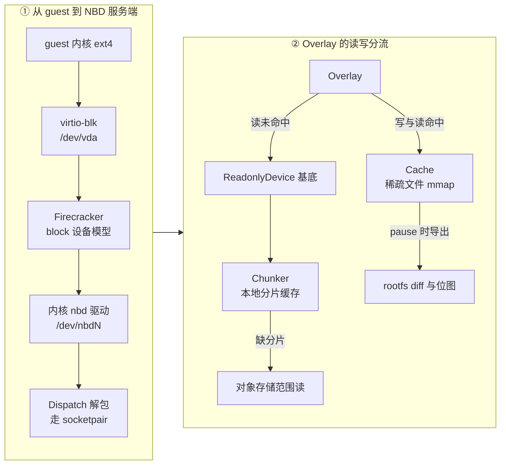

# 06 · 块设备、NBD 与写时复制

> 沙箱的根盘不是一个普通文件：它要在几百台沙箱之间共享同一份只读基底，要按需从对象存储拉取，
> 还要在暂停时把这一台沙箱写过的部分单独导出来。本篇讲清楚支撑这件事的三样东西 ——
> 块设备抽象、NBD，以及写时复制 —— 以及 e2b 用它们搭出的 overlay 结构。
>
> **读者**：所有读者；对内核块层不熟悉的人从 [§1](#1-一块磁盘要满足的三个约束) 开始读。
> **预备**：[第 03 篇 · Firecracker 入门 §2](03-firecracker-primer.md#2-控制面unix-socket-上的一套-rest-api)（知道 virtio-blk 与 drive 配置即可）。
> **代码**：`packages/orchestrator/internal/sandbox/block/`（接口）、
> `packages/orchestrator/internal/sandbox/nbd/`、`packages/orchestrator/internal/sandbox/rootfs/`、
> `packages/shared/pkg/storage/header/`

---

## 0. 本篇要回答的问题

1. guest 里的 `/dev/vda` 一路往下，最终落在宿主的什么东西上？中间有几层？
2. NBD 协议长什么样？为什么 e2b 要把「按需拉块」包装成一个块设备，而不是包装成一个文件？
3. `nbds_max` 是什么，为什么它是单节点沙箱密度的一条硬上限？
4. 稀疏文件的「逻辑大小」和「占用空间」为什么会差好几个数量级？这个性质被用来做什么？
5. 写时复制有哪两类做法？e2b 选了哪一类，放弃了什么？
6. 为什么 e2b 的「已缓存位图」和「脏块位图」是同一张位图？这带来什么后果？

---

## 1. 一块磁盘要满足的三个约束

先看需求。一台 e2b 沙箱从某个模板的某次构建（build）恢复出来，它的根盘要同时满足三件事：

**共享。** 同一个模板可能在一台节点上同时跑几十台沙箱。模板 rootfs 动辄几 GiB，
不可能为每台沙箱复制一份 —— 复制的时间和磁盘都付不起。基底必须是只读共享的。

**按需。** 沙箱要在秒级起来，而模板产物在对象存储上。等整个 rootfs 下载完再启动，
启动时间就等于下载时间。必须做到 guest 读到哪一块，才去拉哪一块。

**可导出。** 沙箱暂停（pause）时要产生一个只含改动的差分（diff）。
这要求宿主侧能精确回答「这台沙箱写过哪些块」，并且能把这些块紧凑地写成一个文件。

普通文件满足不了。用 `cp` 复制一份模板文件违反共享；用 overlayfs 之类的文件系统级方案，
基底得先完整落到本地磁盘，违反按需；而「哪些块被写过」这种信息，普通文件系统不会告诉用户态。

所以 e2b 的做法是：**在用户态自己实现一个块设备**。读请求由自己的代码回答（查缓存、
不在就去拉分片），写请求由自己的代码记录（写进本地缓存文件并置位）。剩下的问题是，
怎么让 Firecracker 相信这是一块真磁盘。答案就是 NBD。

---

## 2. 块设备抽象

### 2.1 内核眼里的块设备

块设备是内核对「可随机寻址、以固定大小的块为单位读写的持久存储」的抽象。
它的接口窄得出奇：给定一个起始扇区和一个长度，读出来或者写进去。
上层（文件系统、`mmap`、`dd`）把请求变成 `bio` 结构，经过块层的合并、排序、限流，
交给驱动；驱动可以是 NVMe 这样的真硬件驱动，也可以是 loop（后端是一个文件）、
device-mapper（后端是别的块设备）、或者 NBD（后端是一个 socket 的另一端）。

对本篇要紧的只有一点：**块设备的实现者可以是任何东西，包括一个用户态进程。**
只要它能按「偏移 + 长度」回答读写，内核就愿意在它上面挂文件系统。

### 2.2 guest 到宿主的三层

Firecracker 给 guest 提供的是 virtio-mmio 上的 virtio-blk 设备，
guest 内核里表现为 `/dev/vda`。宿主侧的后端由 drive 配置里的 `path_on_host` 指定 ——
`packages/orchestrator/internal/sandbox/fc/client.go` 的 `setRootfsDrive()` 就是在设这个字段。
Firecracker 对这个路径的要求只是「能 open、能 pread/pwrite」，它不关心背后是文件还是设备。

于是完整的链路是三层：

```text
guest 进程      write(2) 到 /code/foo
   │            guest 内核 ext4 → guest 块层
   ▼
/dev/vda        virtio-blk 请求进 virtqueue
   │            VM-Exit / 通知 → Firecracker 的 block 设备模型
   ▼
path_on_host    Firecracker 对宿主路径做 pwrite
   │            这个路径在 e2b 里是 /dev/nbdN
   ▼
NBD 客户端      内核 nbd 驱动把请求打包发到一个 socket
   │
   ▼
orchestrator    Dispatch 解包 → Overlay.WriteAt → 本地 cache 文件
```

值得注意的是这里出现了**两次**块设备抽象：guest 内部一次（virtio-blk），
宿主内部一次（nbd）。Firecracker 处在中间，它以为自己在操作一个普通的宿主文件。

---

## 3. NBD：把用户态代码变成一块磁盘

### 3.1 协议

NBD（Network Block Device）是一个很小的协议，分两个阶段。

**握手阶段**在连接建立后进行：服务端发魔数与标志，客户端选择要导出的 export 名字，
服务端回答这个 export 的字节大小和传输标志（是否只读、是否支持 FLUSH、是否支持多连接等）。
握手结束后进入**传输阶段**，此后双方只交换定长头 + 数据。

传输阶段的请求头是 28 字节，`packages/orchestrator/internal/sandbox/nbd/dispatch.go` 里的
`Request` 结构就是它的逐字段镜像：4 字节魔数 `0x25609513`、4 字节命令类型、
8 字节 handle（请求标识，用于乱序应答）、8 字节起始偏移、4 字节长度。
写命令的数据紧跟在头后面。响应头是 16 字节：魔数 `0x67446698`、4 字节错误码、8 字节 handle；
读命令的数据跟在响应头后面。

命令类型 e2b 只实现了四个，见 `dispatch.go` 的 `Handle()`：
`NBDCmdRead`、`NBDCmdWrite`、`NBDCmdDisconnect`、`NBDCmdTrim`。
`NBDCmdFlush` 直接返回错误 —— 服务端在握手时没有声明支持 FLUSH，
所以内核不会发它（推论：代码里 Flush 分支返回 `not supported: Flush` 而不是做任何事，
说明这条路径被认为不可达）。`NBDCmdTrim` 被无条件应答成功但不做任何事：
`cmdTrim()` 里真正的实现被注释掉了，guest 的 discard 请求因此不会释放宿主空间。

### 3.2 内核客户端 `/dev/nbdN`

内核的 nbd 驱动在模块加载时一次性创建 `nbds_max` 个设备节点 `/dev/nbd0` … `/dev/nbdN-1`，
数量之后不能改。把一个设备与一个 socket 绑定有两条路：老的 ioctl 接口（`nbd-client` 用的），
和新的 netlink 接口（内核 4.12 引入）。netlink 接口的关键好处是可以一次传**多个** socket，
即 multi-conn：内核把并发请求分散到多条连接上，避免单条 socket 成为串行点。

e2b 走的是 netlink，用的是 `github.com/Merovius/nbd/nbdnl` 库。
`nbd/path_direct.go` 的 `DirectPathMount.Open()` 做四件事：

1. 从设备池要一个空闲槽位；
2. 建 N 对 `AF_UNIX` / `SOCK_STREAM` socketpair，一端交给内核、一端留给自己，
   每一端起一个 `Dispatch` 协程；N 由特性开关 `nbd-connections-per-device` 决定，
   默认 4（`packages/shared/pkg/feature-flags/flags.go`）；
3. 调 `nbdnl.Connect()`，带上设备号、这批 socket、导出大小、
   标志 `FlagHasFlags | FlagCanMulticonn`，块大小固定 4096；
4. 轮询 `nbdnl.Status()` 直到 `Connected`。

这里有一个容易被忽略的事实：**握手阶段被完全跳过了。**
导出大小与传输标志是通过 netlink 由宿主进程直接告诉内核的，
socket 一建立就处于传输阶段。这也是 e2b 用 socketpair 而不是 TCP 的原因 ——
它根本不需要「网络」块设备的网络部分，只需要 NBD 那套「用户态回答块请求」的机制。
代价是这套代码只能在本机用，跨节点提供块设备的能力被放弃了（对 e2b 无所谓，
沙箱的 rootfs 本来就只在本节点用）。

`Dispatch` 的并发模型也值得一提：`Handle()` 是**单协程顺序解包**，
但每个读写命令都 `go` 出去执行（`cmdRead()` / `cmdWrite()`），
应答由 `writeResponse()` 加锁串行写回 socket。乱序应答靠 handle 字段区分。
读缓冲区 4 MiB，单次写请求上限 32 MiB —— 注释里写明了取舍：
再大的缓冲区乘以几百台沙箱的连接数，内存就不划算了。

### 3.3 `nbds_max` 与设备池

`nbds_max` 是模块参数，只能在 `modprobe nbd nbds_max=…` 时指定一次。
它同时是**一台节点上能同时存在的 NBD 挂载数的硬上限**，
也就是「用 NBD 提供 rootfs 的沙箱数」的上限。上游的节点镜像里设成 4096
（`iac/provider-gcp/nomad-cluster/scripts/start-client.sh`）。

`nbd/pool.go` 的 `DevicePool` 管理这些槽位。它启动时读
`/sys/module/nbd/parameters/nbds_max` 得到总数，读不到就返回 `ErrNBDModuleNotLoaded`；
用一个 bitset 记录已分配槽位，后台 `Populate()` 协程持续把「确认空闲」的槽位灌进一个
容量 64 的 channel（常量 `maxSlotsReady`），`GetDevice()` 从 channel 取。

「确认空闲」的判据在 `isDeviceFree()`：`/sys/block/nbdN/pid` 文件不存在，
**并且** `/sys/block/nbdN/size` 为 0。两个条件缺一不可，因为一个刚断开的设备
pid 文件已经消失、size 却可能还没归零。归还设备的 `ReleaseDevice()` 用同样的判据，
不满足就返回 `DeviceInUseError` 让调用方重试；`DirectPathMount.Close()` 归还时带
`WithInfiniteRetry()`，也就是宁可一直重试也不能把一个还在用的槽位交出去。
这是一条重要的不变量：**槽位复用必须晚于设备真正断开**，否则新沙箱会读到旧沙箱的数据。

最后是一条运维细节：nbd 设备的 add/change uevent 会触发 udev 的 inotify 监听，
在设备频繁上下线时成为性能问题。上游与 ARM 适配版的宿主脚本都写了同一条规则

```text
ACTION=="add|change", KERNEL=="nbd*", OPTIONS:="nowatch"
```

关掉这个监听。

---

## 4. 稀疏文件

### 4.1 逻辑大小与占用空间

在 ext4、XFS 这类文件系统上，一个文件的**逻辑大小**（`stat` 的 `st_size`）
和它**实际占用的块**（`st_blocks`）是两回事。用 `ftruncate` 把一个空文件扩到 8 GiB，
`st_size` 立刻是 8 GiB，`st_blocks` 仍然是 0：中间全是**空洞**（hole）。
读空洞返回全零且不碰磁盘；写空洞时文件系统才真正分配块。

相关的三个系统调用：`fallocate` 可以预分配（保证以后写不会 ENOSPC），
也可以用 `FALLOC_FL_PUNCH_HOLE` 反过来把已分配的区域打回空洞；
`lseek` 的 `SEEK_HOLE` / `SEEK_DATA` 可以在文件里跳着找出哪些区间是有数据的。

### 4.2 e2b 怎么用它

每台沙箱的写层就是一个稀疏文件。`block/cache.go` 的 `NewCache()`：
`os.OpenFile` 建文件，`f.Truncate(size)` 扩到与基底同样大 —— 代码注释直接写着
「This should create a sparse file on Linux」—— 然后整段 `mmap` 成读写映射。
于是一台只写了几 MiB 的沙箱，它的 cache 文件逻辑上是几 GiB，磁盘上只占几 MiB。
`Cache.FileSize()` 专门用 `stat.Blocks * fsStat.Bsize` 报告真实占用，
而不是用 `st_size` —— 这个数字用于本地磁盘水位的判断。

代价有两条。第一，`df` 与逻辑大小对不上，容量规划要按真实占用而不是文件大小做，
这一点在多沙箱共存时容易估错。第二，也是更硬的一条：**空间不足的错误被推迟到了写的时候**，
而写是通过 `mmap` 做的 —— `mmap` 区域写入时底层块分配失败，进程收到的是
`SIGBUS` 而不是一个可以处理的 `error`。ARM 适配版在这里加了防御，见 [§7](#7-arm-适配版的差异)。

---

## 5. 写时复制的两种实现

写时复制（copy-on-write，COW）的含义是：多个使用者共享同一份数据，
谁要写谁就先复制一份自己的副本，其他人看到的仍是原件。实现层次有两类。

**文件系统 / 块层做。** Btrfs 与 XFS 的 reflink（`FICLONE` ioctl）让两个文件共享 extent，
写时由文件系统分裂；device-mapper 的 snapshot target 在块层做同样的事；
qcow2 把 COW 做进镜像格式，由 QEMU 解释。共同点是**对上层完全透明**，
不需要应用改代码，性能路径在内核里。

**应用自己做。** 应用维护一张位图记录哪些块被写过，读的时候按位图决定去写层还是去基底，
写的时候只写写层。这正是 e2b 的做法。

| 维度 | 文件系统级 COW | 应用级 overlay + 位图 |
|---|---|---|
| 对上层是否透明 | 透明 | 需要应用实现读写路径 |
| 基底的位置 | 必须是本地文件系统上的完整文件 | 可以是任意能按偏移读的东西，包括对象存储 |
| 「哪些块脏了」能否拿到 | 一般拿不到，或要解析文件系统内部结构 | 位图就在应用手里 |
| 依赖 | 特定文件系统或 dm 配置 | 无 |
| 写路径开销 | 内核内完成 | 多一次用户态往返 |

e2b 选后者的理由从上面这张表就能看出来：它要的「基底可以是远端对象存储」和
「脏块位图必须能直接拿到」这两条，文件系统级方案给不了。付出的代价是每一次 guest 磁盘写
都要穿过 NBD 到用户态再回来，这条路径比内核内的 COW 长得多。

---

## 6. e2b 的 overlay

### 6.1 三个接口

`block/device.go` 只定义了三个接口，全篇的结构都建立在它们上面：

```go
type Slicer interface {
	Slice(ctx context.Context, off, length int64) ([]byte, error)
	BlockSize() int64
}

type ReadonlyDevice interface {
	storage.SeekableReader // ReadAt(ctx, p, off) + Size(ctx)
	io.Closer
	Slicer
	BlockSize() int64
	Header() *header.Header
}

type Device interface {
	ReadonlyDevice
	io.WriterAt
}
```

`ReadonlyDevice` 是「只读基底」的抽象，它的实现包括 `block/local.go` 的 `Local`
（本地一个完整文件）、`block/empty.go` 的 `Empty`（全零，不占任何存储）、
以及从对象存储按分片拉取的 chunker（`block/chunk.go`、`block/streaming_chunk.go`）。
`Device` 多一个 `WriteAt`，代表可写设备。`Header()` 返回的是块到某一代 build 的映射表，
它是差分链的核心，细节在 [第 29 篇 · 模板产物格式 §3](29-template-artifact-format.md#3-header-的字节布局)。

`Slice` 与 `ReadAt` 的区别值得留意：`ReadAt` 把数据拷进调用者的缓冲区，
`Slice` 直接把内部缓冲区的一段暴露出去，零拷贝但需要调用者自己保证线程安全。
uffd 的缺页路径用 `Slice`（把这一页的指针直接交给 `UFFDIO_COPY`），
NBD 路径用 `ReadAt`（数据要写进 socket）。

### 6.2 Overlay 与 Cache

`block/overlay.go` 的 `Overlay` 只有两个字段：一个 `ReadonlyDevice`（基底）和一个 `*Cache`（写层）。
逻辑短得可以整段读完：

- `ReadAt()`：把请求按块切开，**逐块**先问 cache；cache 返回 `BytesNotAvailableError`
  就转去问基底。注意它不把基底读到的数据回填 cache —— 回填是 chunker 那一层的事。
- `WriteAt()`：无条件写进 cache。基底永远不被写。
- `Header()`：直接返回基底的 header。
- `EjectCache()`：用一个原子标志保证只能调一次，把 cache 的所有权交出去，
  之后 `Overlay.Close()` 不再关闭它。这是 pause 时把写层「摘下来」导出的入口。

`Cache` 就是 [§4.2](#42-e2b-怎么用它) 那个稀疏文件加上一张位图。位图的实现是
`dirty sync.Map`，键是块偏移。关键在于**这张位图有两重身份**：

- `WriteAtWithoutLock()` 写完数据后调 `setIsCached()` 置位；
- `Slice()` 与 `isCached()` 用它判断「这一块在 cache 里有没有有效数据」，没有就报
  `BytesNotAvailableError`；
- `ExportToDiff()` 用它枚举要导出的块。

也就是说，**「这一块被缓存过」和「这一块是脏的」在磁盘侧是同一件事**，
因为写进 cache 的路径只有两条：guest 的写，和 chunker 把远端拉来的分片填进来。
后者只发生在 `Chunker` 自己持有的 cache 上，不在 overlay 的 cache 上。
构造函数的 `dirtyFile` 参数是给「文件里本来就有内容」的场景准备的
（`Slice()` 里 `dirtyFile` 为真时跳过位图检查，直接返回映射区间），
`NewNBDProvider()` 传的是 `false`。

这个设计的收益是零额外记账；代价是**磁盘 diff 的粒度就是块粒度**，
guest 只改了一个字节，整个 4 KiB 块也算脏。这与内存侧靠 userfaultfd 写保护做判定
（[第 05 篇 · userfaultfd §4](05-userfaultfd.md#4-写保护)）是两套完全不同的机制。

### 6.3 导出

`Cache.ExportToDiff()`：先 `mmap.Flush()`，再按排好序的脏块偏移逐块调
`header.DiffMetadataBuilder.Process()`。`Process()` 做一个判断（`storage/header/diff.go`
的 `IsEmptyBlock()`）：如果这一块全是零，只在 `empty` 位图里置位、**不写进 diff 文件**；
否则在 `dirty` 位图置位并把这 4 KiB 追加到输出。

这是稀疏思想在产物格式里的第二次出现：全零块不占字节，恢复时按位图当成零处理。
支持的块大小只有两种，`RootfsBlockSize`（4096）和 `HugepageSize`（2 MiB），
分别对应磁盘与内存，其它值直接报错。

### 6.4 两种 Provider

`rootfs/rootfs.go` 定义 `Provider` 接口：`Start` / `Close` / `Path` / `ExportDiff`。
`Path()` 返回的字符串就是交给 Firecracker 的 `path_on_host`。有两个实现：

| | `NBDProvider`（`rootfs/nbd.go`） | `DirectProvider`（`rootfs/direct.go`） |
|---|---|---|
| `Path()` 返回 | `/dev/nbdN` | 一个本地文件路径 |
| 基底怎么读 | Overlay，按需 | 事先把内容准备在文件里 |
| 用在哪 | 运行期沙箱 | `rootfsCachePath` 非空时（`sandbox.go`） |
| 占用 NBD 槽位 | 是 | 否 |

`sandbox.go` 里的选择条件是 `rootfsCachePath == ""`，注释说明 direct 路径是为了
「把所有块标记为脏并能直接读」。运行期沙箱走 NBD。

`NBDProvider.Close()` 的顺序是一条硬约束：先 `sync()`（对 `/dev/nbdN` 发
`BLKFLSBUF` ioctl 把内核块层缓冲刷下来，再 `fsync` 一次），
然后关 NBD 挂载，最后才关 overlay 的 cache。顺序反了就会丢数据 ——
内核块层里还压着没下发的写请求时就把服务端拆了，这些写永远到不了 cache 文件。

### 6.5 一次读和一次写



图里从 `Overlay` 往下的两条分支就是 COW 的全部：写永远向左，读先向左、不中再向右。
`Chunker` 与对象存储那一段的细节在 [第 30 篇 · block 包 §6](30-block-layer.md#6-两种-chunker)，
NBD 服务器与 rootfs provider 的细节在 [第 33 篇 · 磁盘：NBD 服务器与 rootfs §4](33-nbd-and-rootfs.md#4-两个-rootfs-provider)，
diff 产物怎么变成下一代模板在 [第 37 篇 · Pause §5](37-pause-and-snapshot.md#5-磁盘-diff另一条路)。

---

## 7. ARM 适配版的差异

`nbd/` 目录在 ARM 补丁里没有改动；`block/` 只改了 `cache.go` 的 `WriteAtWithoutLock()`：
加了 `recover`、mmap 非空检查和偏移范围检查，注释写明是为了应对 mmap 失效导致的 `SIGBUS`。
`recover` 能否捕获 `SIGBUS` 是有疑问的（Go 运行时默认把 `SIGBUS` 当作致命信号处理），
这一点连同它的实际效果在 [第 73 篇 · 宿主兼容 §5](73-cgroup-and-host-compat.md#5-blockcachego-的四条防御) 讨论。

宿主侧的差异更实际：上游节点镜像用发行版自带的 nbd 模块、`nbds_max=4096`；
单机离线版用的是自行编译的 nbd 模块，`nbds_max` 固定为 512，
并且模块的加载被从部署脚本里移出、改为通过 `modules-load.d` 与 `modprobe.d` 一次性固化
（`e2b-deploy/dep/init-client.sh`、`single-node-offline-deploy.md`）。
`nowatch` 的 udev 规则两边一致。这条 512 的上限直接封顶了单机的沙箱并发数，
见 [第 82 篇 · 宿主内核要求与调优 §3](82-host-kernel-nbd-hugepages.md#3-nbd设备号就是并发上限)。

---

## 8. 小结

- guest 的一次磁盘写要穿过两层块设备抽象：guest 内的 virtio-blk 和宿主内的 nbd；
  Firecracker 处在中间，它以为 `path_on_host` 是一个普通文件。
- e2b 用 NBD 的目的不是「网络」，而是「让用户态代码扮演一块磁盘」。
  它走 netlink 接口、用 socketpair、默认 4 条连接，握手阶段被完全跳过。
- `Dispatch` 顺序解包、并发执行、加锁串行应答，靠 NBD 请求头里的 handle 支持乱序返回。
  只实现了读、写、断开、trim 四个命令，其中 trim 是空实现。
- `nbds_max` 在模块加载时固定，是单节点 NBD 沙箱数的硬上限。设备池用
  `/sys/block/nbdN/pid` 不存在且 `size` 为 0 判定空闲，归还失败时无限重试 ——
  槽位复用必须晚于设备真正断开。
- 稀疏文件让每台沙箱的写层可以「逻辑上和基底一样大、磁盘上只占写过的部分」。
  代价是容量要按 `st_blocks` 算，以及空间不足会以 `SIGBUS` 的形式在 mmap 写入时爆出来。
- e2b 选应用级 COW 而非文件系统级，是因为它需要基底可以是远端对象存储、
  且脏块位图必须直接可得。代价是每次 guest 磁盘写多一次用户态往返。
- `Overlay` 的规则只有两条：写永远进 cache，读先查 cache 再落基底。
  cache 的「已缓存位图」同时就是「脏块位图」，因此磁盘 diff 的粒度就是 4 KiB 块粒度。
- 导出时全零块只记进 `empty` 位图、不占 diff 文件字节，这是稀疏思想在产物格式里的复用。
- 关闭顺序是不变量：先刷块层缓冲，再断 NBD，最后关 cache。

## 延伸阅读 / 下一篇

- 这些概念在本书哪里被用到：[第 30 篇 · block 包 §3](30-block-layer.md#3-cachemmap-加一张位图)（Cache、Overlay、Chunker 的完整实现）、
  [第 33 篇 · 磁盘：NBD 服务器与 rootfs §1](33-nbd-and-rootfs.md#1-设备池一种在进程之外的资源)（设备池与 provider 的生命周期）、
  [第 29 篇 · 模板产物格式 §5](29-template-artifact-format.md#5-diff-链是怎么长出来的)（header 与 diff 链）、
  [第 37 篇 · Pause §5](37-pause-and-snapshot.md#5-磁盘-diff另一条路)（磁盘 diff 的导出）、
  [第 43 篇 · rootfs 制作 §3](43-rootfs-construction.md#3-层解包成-ext4)（模板的 ext4 镜像是怎么造出来的）、
  [第 34 篇 · 模板缓存与本地存储 §3](34-template-cache-and-local-storage.md#3-节点本地目录谁建谁删)（cache 文件在本地磁盘上的位置）。
- 内存侧的对应机制是 userfaultfd，见 [第 05 篇 · userfaultfd](05-userfaultfd.md)；
  两者的分工在 [第 27 篇 · ResumeSandbox §3](27-resume-sandbox.md#3-并行段三个-promise-和一个后台预取) 里合流。
- 外部资料：Linux 内核文档 `Documentation/block/`；NBD 协议规范
  （NetworkBlockDevice/nbd 仓库的 `doc/proto.md`）；`man 2 fallocate`、`man 2 lseek` 的
  `SEEK_HOLE` 一节。
- 下一篇：[第 07 篇 · 沙箱网络的内核基础](07-linux-networking-for-sandboxes.md)。
