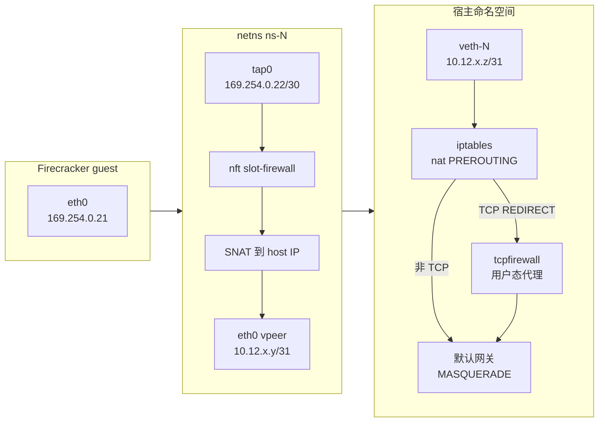

# 07 · 沙箱网络的内核基础

> 一台 microVM 的「网卡」在宿主上只是一个 tap 设备；要让上千台这样的虚拟机在同一台宿主上
> 各自上网、互不可见、又能被外界按端口访问，靠的是 netns、veth、路由、NAT 与 conntrack 这几件内核设施。
> 本篇讲清楚这些设施各自解决什么问题，并用上游 orchestrator 建立一个网络槽位（slot）的过程作为落地示例。
>
> **读者**：工程师、系统工程师。　**预备**：[第 02 篇 · AI 代码沙箱 §2](02-why-sandbox.md#2-威胁模型) 的威胁模型；
> [第 03 篇 · Firecracker 入门](03-firecracker-primer.md) 的设备模型。懂 IP 路由与 iptables 基本概念会读得更顺。
> **代码**：`packages/orchestrator/internal/sandbox/network/`（`slot.go`、`network.go`、`firewall.go`、`tcpproxy.go`）、
> `packages/orchestrator/internal/tcpfirewall/`、`packages/shared/pkg/sandbox-network/firewall.go`

---

## 0. 本篇要回答的问题

1. guest 的网卡在宿主上是什么？tap 与 veth 各自解决什么问题，为什么两个都要？
2. 为什么每台沙箱可以用同一个 guest IP？netns 让什么成为可能，代价是什么？
3. 一个包从 guest 出去，依次经过哪些转换点与过滤点？conntrack 在其中承担什么？
4. 沙箱怎么解析域名？为什么「只允许访问某些域名」这件事没法只靠 iptables 完成？
5. 外界怎么访问沙箱里的一个端口？为什么宿主上看不到成千上万条端口映射规则？

---

## 1. 问题：一台虚拟机的网卡要接到哪里

Firecracker 给 guest 提供的是一块 virtio-net 网卡。虚拟机里的驱动往这块网卡发包，
包最终要从 VMM 进程手里交给宿主内核。宿主这一侧需要有一个「看起来像网卡、
但读写它的是一个用户态进程」的东西 —— 这就是 tap 设备。

只有 tap 还不够。把 e2b 的场景摊开，网络这一层要同时满足四条约束：

- **密度**。一台节点上可能同时有几百到上千台沙箱，每台都要能上网。
- **地址不冲突**。模板是共享的：同一个模板恢复出来的所有沙箱，guest 里的网络配置完全一样。
  如果 guest IP 必须互不相同，那么每次恢复都要在 guest 内部重新配置网络，
  而恢复是从内存快照拉起的，guest 内核的网络状态早已固化在快照里。
- **互不可见**。租户 A 的沙箱不能扫描到租户 B 的沙箱，也不能访问宿主的内网。
  这是 [第 02 篇 §2](02-why-sandbox.md#2-威胁模型) 威胁模型里的一条。
- **可寻址**。控制面要能主动连进沙箱（健康检查、envd 初始化、用户流量转发）。

第二条与第四条看上去矛盾：所有沙箱用同一个 guest IP，宿主又要能分别连到每一台。
解决这个矛盾的是网络命名空间：**guest 侧的地址在每个命名空间里重复，
宿主侧再给每个命名空间分配一个唯一地址，两者之间做 NAT。**
下面几节把这句话拆开。

---

## 2. 内核给的四块积木

### 2.1 网络命名空间（netns）

netns 把内核的整套网络栈 —— 网络设备、IP 地址、路由表、ARP 表、iptables/nftables 规则、
conntrack 表、socket 端口空间 —— 复制成互相独立的多份。一个进程属于哪个 netns，
就只看得见那一份。两个 netns 里可以各有一个叫 `eth0` 的设备、各自持有 `169.254.0.21`，
彼此毫无关系。

命名空间可以是匿名的（只由持有它的进程或一个 fd 维持），也可以挂到 `/var/run/netns/<name>`
成为具名命名空间，这样 `ip netns exec` 与其它进程都能按名字进入。
上游用的是后者：`network.go` 的 `CreateNetwork()` 调用 `netns.NewNamed(s.NamespaceID())`，
名字是 `ns-<槽位号>`（`slot.go` 的 `NamespaceID()`）；`storage_local.go` 里的 `netNamespacesDir`
常量就是 `/var/run/netns`。具名的代价是它不随进程退出而消失，必须显式删除，
否则宿主上会留下泄漏的命名空间。

有一个操作系统层面的细节：切换 netns 是**线程**级别的（`setns(2)` 作用于调用线程），
而 Go 的 goroutine 会在线程间迁移。`CreateNetwork()` 因此以 `runtime.LockOSThread()` 开头，
并在返回前把线程切回宿主命名空间。忘记这一点会让后续任意一段无关代码在错误的命名空间里执行。

### 2.2 veth 对

netns 之间默认没有任何连通性。veth 是一对虚拟以太网设备：从一端进去的包从另一端出来，
像一根虚拟网线。把一端留在宿主命名空间、另一端移进沙箱的命名空间，两个命名空间就通了。

上游的做法在 `CreateNetwork()` 里：先在新命名空间中创建 veth 对，
再用 `netlink.LinkSetNsFd()` 把其中一端移回宿主命名空间。留在命名空间里的一端叫 `eth0`
（`slot.go` 的 `VpeerName()`），移到宿主的一端叫 `veth-<槽位号>`（`VethName()`）。
两端各配一个地址，构成一条点对点链路。

### 2.3 tap 设备与 VMM

tap 是内核提供的虚拟二层设备：内核看它是一块网卡，用户态进程通过一个 fd 读写它上面的以太网帧。
Firecracker 的 virtio-net 后端就绑在 tap 上：guest 发出的帧被 VMM 写进 tap，
内核便当作「从这块网卡收到的包」处理；反向同理。

`CreateNetwork()` 在沙箱命名空间里建 `tap0`（`slot.go` 的 `tapInterfaceName`），
配上地址后，通过 Firecracker 的 REST API 把它交给 VMM：
`fc/client.go` 的 `setNetworkInterface()` 提交 `iface_id`、`host_dev_name`（即 `tap0`）
与固定的 `guest_mac`（`slot.go` 的 `tapMAC`，`02:FC:00:00:00:05`）。
同一个调用里还把 MMDS 绑定到这个接口上（`PutMmdsConfig`，版本 V2）——
guest 访问 `169.254.169.254` 时，包被 Firecracker 的设备模型直接截住并回应，不会到达 tap。

于是三段链路串起来了：**guest 网卡 ↔ tap0 ↔（命名空间内的路由）↔ eth0 ↔ veth-N ↔ 宿主**。

### 2.4 为什么是路由而不是桥接

把上千个 tap 挂到一个网桥上也能让虚拟机上网，这是传统虚拟化的默认做法。上游没有这么做，
`network.go` 里没有任何 `bridge` 相关调用，取而代之的是每个槽位一条 `/31` 点对点链路加静态路由。
两种做法的差别：

| 维度 | 桥接 | 每槽位路由 |
|---|---|---|
| 二层广播域 | 所有 guest 在同一个广播域，能互相 ARP | 每个 guest 独占一个命名空间，天然不可见 |
| guest IP | 必须互不相同 | 可以全部相同 |
| 规模代价 | 桥的 FDB 与广播随端口数增长 | 每槽位一条路由与若干 NAT 规则 |
| 隔离 | 要靠额外的 ebtables / 端口隔离 | 隔离是默认状态 |

密度与「所有沙箱共用一个 guest IP」这两条约束一起，把设计推向了后者。

---

## 3. 地址规划：一个槽位的五个地址

`slot.go` 顶部的常量与 `NewSlot()` 把槽位号 `Idx` 映射成一组地址。默认值如下
（前两个网段可由 `SANDBOXES_HOST_NETWORK_CIDR` 与 `SANDBOXES_VRT_NETWORK_CIDR` 覆盖）：

| 地址 | 取值 | 位置 | 作用 |
|---|---|---|---|
| guest IP | `169.254.0.21`（`NamespaceIP()`） | guest 内 | 所有沙箱相同 |
| tap IP | `169.254.0.22`，掩码 `/30`（`tapIp` / `tapMask`） | 沙箱命名空间 | guest 的默认网关 |
| vpeer IP | `10.12.0.0/16` 中第 `2*Idx+1` 个地址 | 沙箱命名空间的 `eth0` | 点对点链路的一端 |
| veth IP | 同段中第 `2*Idx` 个地址 | 宿主的 `veth-<Idx>` | 点对点链路的另一端 |
| host IP | `10.11.0.0/16` 中第 `Idx` 个地址 | 宿主视角的沙箱地址 | 宿主与控制面用它连沙箱 |

几个推导值得说明。`vrtMask` 是 `/31`，一个 `/31` 块正好两个可用地址，
所以每个槽位在 vrt 段里占 2 个地址，槽位上限 `GetVrtSlotsSize()` 就是
段内地址数除以 2 再减去 2（减法是为了按槽位号递增分配时不越界）；默认 `/16` 段给出约 3 万个槽位。
`hostMask` 是 `/32`，因为宿主侧每个槽位只需要一个地址。
`tapMask` 是 `/30`，`169.254.0.20/30` 里的两个可用地址正好给 guest 与网关。
（`slot.go` 的类型注释把 vpeer 与 veth 的分配次序写反了，以 `NewSlot()` 的代码为准。）

guest 侧的配置不是在 guest 里跑 DHCP 得到的，而是通过内核命令行传进去的。
`fc/process.go` 拼出的 `ip=` 参数形如：

```text
ip=169.254.0.21::169.254.0.22:255.255.255.252:instance:eth0:off:tap0
    本机 IP     网关          掩码             主机名  接口 dhcp 关
```

这是 Linux 内核 `ip=` 引导参数的标准格式，由内核在启动早期直接配置接口，不需要 guest 里的任何服务。
对从快照恢复的沙箱，这段配置早已固化在 guest 内存里 —— 这正是「所有沙箱共用同一个 guest IP」的价值：
恢复时不需要改 guest 里的任何网络状态。



---

## 4. NAT 与 conntrack

### 4.1 命名空间内的两条规则

包离开命名空间前，源地址还是 `169.254.0.21` —— 一个所有沙箱都在用的地址，宿主没法据此区分来源。
`CreateNetwork()` 因此在命名空间内装两条 NAT 规则（用 `go-iptables`）：

- `nat/POSTROUTING`：出接口是 `eth0`、源地址是 guest IP 的包，SNAT 成该槽位的 host IP。
- `nat/PREROUTING`：入接口是 `eth0`、目的地址是 host IP 的包，DNAT 成 guest IP。

一出一入互为镜像。**host IP 因此成了这台沙箱在宿主视角下的唯一身份**：
宿主上看到源地址 `10.11.0.7` 的连接，就知道它来自 7 号槽位上的沙箱。
后面 `tcpfirewall` 认沙箱、orchestrator 的代理连沙箱，用的都是这个地址。

### 4.2 宿主侧的三类规则

回到宿主命名空间后，`CreateNetwork()` 继续装：

- 一条静态路由：目的 host IP `/32`、网关是 vpeer IP。宿主发往沙箱的包由此进入命名空间。
- 一对 `filter/FORWARD` ACCEPT：`veth-N` 与默认网关之间双向放行。
  默认网关的接口名不是写死的，`host.go` 的 `getDefaultGateway()` 通过 netlink 找 `0.0.0.0/0` 路由，
  取其出接口名。
- 一条 `nat/POSTROUTING` MASQUERADE：源地址是该槽位 host CIDR、出接口是默认网关的包，
  源地址改写成宿主的出口地址。

MASQUERADE 与 SNAT 的区别只在于前者从出接口现取地址，适合出口地址可能变化的场景。
包出宿主时经过了两次源地址改写：guest IP → host IP → 宿主出口 IP。

需要注意的是：仓库里**没有**设置 `net.ipv4.ip_forward`。
**推论**：转发依赖节点镜像或所安装软件（例如 Docker）留下的默认值；
在一个干净的宿主上单独跑 orchestrator，需要自行打开转发，否则包会在路由后被丢弃。
`ip_forward` 与下一节的 `nf_conntrack_max` 一起构成宿主的网络前置条件，
各部署形态怎么落实见 [第 82 篇 · 宿主内核要求与调优 §5](82-host-kernel-nbd-hugepages.md#5-sysctl-与-ulimit配了什么没配什么)。

### 4.3 conntrack 是这套方案的隐含依赖

上面每一条 NAT 规则都不是无状态改写。Linux 的 NAT 建立在连接跟踪（conntrack）之上：
第一个包经过 `nat` 表时决定一次转换，转换结果记在 conntrack 条目里，
该连接后续的包（包括反向的回包）按条目改写，不再查规则。这带来三个后果：

- **回包不需要额外规则。** 反向的 DNAT/SNAT 是 conntrack 自动完成的。
- **状态匹配成为可能。** `firewall.go` 装的第一条 nftables 规则就是放行 `ESTABLISHED` 与 `RELATED`，
  这样即使目的地落在拒绝网段里，已建立连接的回包也不会被丢 —— 更重要的是，
  它保证过滤只作用在连接的第一个包上。
- **表容量成了容量上限。** 每条连接一个条目。上游的节点镜像把
  `net.netfilter.nf_conntrack_max` 提到 2097152（`iac/provider-gcp/nomad-cluster-disk-image/main.pkr.hcl`），
  就是为了让上千台沙箱同时开连接时不被这张表卡住。表满时新连接被丢弃，
  症状是间歇性的连接失败，不容易与应用层问题区分。

### 4.4 iptables 与 nftables 并存

同一套路径上，上游同时用了两个 API：地址转换与端口重定向用 `go-iptables`（`network.go`、`tcpproxy.go`），
出站过滤用 `google/nftables` 直接下发 netlink（`firewall.go`）。
现代内核里 `iptables` 通常是 `nft` 后端的兼容层，两者最终作用于同一套 hook，
优先级决定先后顺序。混用的收益是过滤侧能用上 nftables 的**集合（set）**——
一条规则匹配一整张 IP 集合，且集合内容可以在运行时增删而不必重建规则链；
代价是排错时要同时看 `iptables-save` 与 `nft list ruleset` 两份输出。

---

## 5. DNS

沙箱的解析器是在模板构建期写死的：`internal/template/build/core/rootfs/files/resolv.conf.tpl`
往 rootfs 的 `/etc/resolv.conf` 里写一行 `nameserver`，取值来自
`packages/shared/pkg/sandbox-network/firewall.go` 的 `DefaultNameserver`，即 `8.8.8.8`；
构建阶段的 `provision.sh` 还对这个文件做了 `chattr +i`。
也就是说，**沙箱不使用宿主的解析器**，DNS 查询以普通 UDP 报文的形式沿着上一节的路径出宿主。

这个选择的收益是宿主的内部解析视图（例如 Consul DNS 注册的服务名）不会暴露给 guest；
代价是沙箱的解析结果完全取决于外部公共 DNS，在没有外网的部署形态里要自行替换。

DNS 与出站过滤有一处耦合：当团队配置了「只允许某些域名」时，
`api/internal/orchestrator/create_instance.go` 的 `buildNetworkConfig()` 会把
`DefaultNameserver` 追加进允许的地址列表 —— 否则沙箱连域名都解析不出来，域名白名单也就无从匹配。

---

## 6. 出站过滤：两层，两种粒度

### 6.1 网段级：命名空间里的 nftables

`firewall.go` 的 `NewFirewall()` 在**沙箱命名空间内**建一张 `inet` 族的表 `slot-firewall`，
其中一条 `prerouting` 钩子、优先级 -150 的链 `PREROUTE_FILTER`，只匹配从 `tap0` 进来的包。
链里按顺序装五条规则（`installRules()`）：

1. `ESTABLISHED`/`RELATED` → accept；
2. 预置允许集合 → accept（初始内容是 orchestrator 在沙箱内的地址，见 §7）；
3. 预置拒绝集合 → drop，所有协议；
4. 非 TCP 且命中用户允许集合 → accept；
5. 非 TCP 且命中用户拒绝集合 → drop。

链的默认策略是 accept。预置拒绝集合的内容是 `sandbox-network/firewall.go` 里的
`DeniedSandboxCIDRs`：`10.0.0.0/8`、`127.0.0.0/8`、`169.254.0.0/16`、`172.16.0.0/12`、
`192.168.0.0/16`，以及 IPv6 的 `::1/128`、`fc00::/7`、`fe80::/10`。
这就是威胁模型里「不得访问宿主内网」那一条的落地：私有网段一律硬拒绝，
连团队自己的允许列表也不能覆盖它（规则 3 排在用户集合之前）。

规则 4、5 只作用于非 TCP，是因为 TCP 走另一条路 —— 见下一小节。

### 6.2 域名级：为什么必须在用户态

「只允许访问 `api.example.com`」这条策略没法直接翻译成包过滤规则：
内核看到的是 IP 与端口，域名只出现在应用层（HTTP 的 `Host` 头、TLS 的 SNI），
而且同一个域名的 IP 会变、同一个 IP 上会有多个域名。
按解析结果放行 IP 也不安全：沙箱可以自己改 `/etc/hosts` 或用别的解析器，
让一个被允许的域名「解析」到任意地址。

上游的做法是把 TCP 连接劫持到一个用户态代理。`tcpproxy.go` 在宿主命名空间的
`nat/PREROUTING` 上，对入接口为 `veth-N` 的 TCP 包装三条 `REDIRECT`：
目的端口 80 的重定向到 HTTP 端口，443 的到 TLS 端口，其余的到 other 端口
（默认 5016 / 5017 / 5018，见 `network/pool.go` 的 `Config`）。
分三个端口而不是一个，是因为协议探测要读客户端的第一段数据，
而 SSH 这类服务器先说话的协议会因此卡住；只有前两个端口做协议探测。

代理进程是 `internal/tcpfirewall`。`proxy.go` 的 `Start()` 在三个端口上分别注册
HTTP `Host` 匹配、TLS SNI 匹配与纯 CIDR 三种处理器。每接到一条连接：

1. 用连接的源地址查沙箱 —— 源地址正是 §4.1 里 SNAT 出来的 host IP，
   `sandbox/map.go` 的 `GetByHostPort()` 按它遍历沙箱表；
2. 取每沙箱连接数配额（特性开关 `TCPFirewallMaxConnectionsPerSandbox`），超了直接关连接；
3. 用 `getsockopt(SOL_IP, SO_ORIGINAL_DST)` 取回**被 REDIRECT 改写之前**的目的地址与端口
   （`tcpfirewall/utils.go` 的 `getOriginalDst()`）—— 这是这类透明代理的关键：
   重定向之后 socket 的本地地址已经是代理自己，原始目的地只能从 conntrack 经这个 socket 选项取回；
4. `handlers.go` 的 `isEgressAllowed()` 依次判断：允许域名 → 允许 CIDR → 拒绝 CIDR → 默认允许；
5. 放行时由代理自己向上游建连接，再把两个方向的数据对拷。

第 5 步里有一个针对 DNS 重绑定的处理：如果这条连接是**按域名**放行的，
`proxyWithIPVerification()` 用 Go 的 `net.Dialer` 直接拨域名（而不是沙箱解析出的那个 IP），
并在 `ControlContext` 回调里检查解析结果 —— 该回调在 DNS 解析之后、`connect(2)` 之前触发，
落在私有网段的地址在握手发生前就被拒绝。

这一层的代价要说清楚：**所有 TCP 出站流量都经过一个用户态进程转发**，
多一次内存拷贝与一次上下文切换，每条连接在宿主上多占一个 socket；
orchestrator 进程崩溃会中断所有沙箱的 TCP 出站。
收益是拿到了域名粒度的策略与逐连接的可观测性。
UDP 不走这条路，所以域名策略对基于 UDP 的协议无效。

---

## 7. 入站与反向：谁能连进沙箱

**宿主连沙箱**走 §4.2 的静态路由：目的地址是 host IP，经 veth 进入命名空间，
由 §4.1 的 DNAT 换成 guest IP 送到 guest。orchestrator 的健康检查、envd 初始化、指标抓取
都是这么发起的（`sandbox/health.go`、`sandbox/envd.go`、`sandbox/metrics.go`，
目标端口是 envd 的 `49983`）。

**外界连沙箱**多一跳。宿主上没有为每个沙箱端口建 DNAT 映射 ——
上千台沙箱乘以任意端口，规则表会不可维护。取而代之，端口被编码进域名：
`<port>-<sandboxID>.<domain>`（`packages/shared/pkg/proxy/host.go` 的 `parseHost()`
只取最左一段子域，按 `-` 切开后读前两段；历史上第三段是 clientID，现在不参与寻址），
由 client-proxy 解析后转发到对应节点的 orchestrator，
orchestrator 的代理再把请求发给 `host IP : port`（`internal/proxy/proxy.go`）。
这样内核里只有每槽位一条路由，端口维度的分发完全在应用层。细节在
[第 53 篇 · client-proxy（edge）§3](53-client-proxy-edge.md#3-域名解析从-host-头到-sandboxid-与端口) 与
[第 36 篇 · 代理与 envd 通信 §2](36-orchestrator-proxy-and-envd-client.md#2-通道一orchestrator-里的沙箱代理)。

**沙箱连宿主服务**是第三个方向。orchestrator 给沙箱暴露了几个内部服务，
用一个约定的地址 `192.0.2.1`（`network/pool.go` 的 `OrchestratorInSandboxIPAddress`，
取自 RFC 5737 的文档专用网段）。`CreateNetwork()` 在宿主的 `nat/PREROUTING` 上，
对目的地址为该地址的 TCP 包按端口重定向到本地端口：80 到 hyperloop 代理、
111 到 portmapper、2049 到 NFS 代理。因为这个地址不在 §6.1 的拒绝网段里，
而且被放进了预置允许集合，所以它是拒绝私有网段这条策略上唯一的、受控的开口。

---

## 8. 复用一个槽位的代价

槽位是预先建好、循环使用的：沙箱结束后 `network/pool.go` 的 `Return()`
把槽位放回复用队列，只调用 `ResetInternet()` 把防火墙的用户集合清空恢复成初始内容；
命名空间、veth、tap、路由、NAT 规则原样保留。这样下一台沙箱省掉了建网络的时间。
只有队列满了或复位失败时才走 `cleanup()` → `RemoveNetwork()`，那里才真正删规则、删 veth、删命名空间。

conntrack 表是每个命名空间一份，删除命名空间时随之消失；复用槽位时它被保留下来。
**推论**：上一台沙箱留下的、尚未超时的 conntrack 条目会被下一台沙箱看到；
由于两台沙箱的 guest IP 与 host IP 完全相同，一条残留条目在理论上可以让新沙箱的包
沿用旧的转换与状态判定（例如被当成 `ESTABLISHED` 而跳过过滤）。
代码里没有针对复用做 conntrack 清理。这类风险的严重程度取决于复用间隔与 conntrack 超时，
[第 35 篇 · 沙箱网络 §4](35-sandbox-networking.md#4-复用一个槽位复位了什么没复位什么) 会结合槽位池的实际时序讨论。

另一处代价在 `RemoveNetwork()` 的注释里写着：veth 设备被显式删除，
而不是依赖删除命名空间时的自动清理 —— 否则紧接着用同名创建新 veth 会撞上竞态。
这是复用同一批名字（`veth-<Idx>`、`ns-<Idx>`）带来的必然麻烦。

---

## 9. ARM 适配版的差异

网络这一层的内核机制在 aarch64 上没有差别，ARM 适配版对
`packages/orchestrator/internal/sandbox/network/` 的改动只有槽位池容量
（`pool.go` 的 `NewSlotsPoolSize` 与 `ReusedSlotsPoolSize` 由 32 / 100 改为 300 / 1000）
与一处池状态日志；`tcpfirewall/` 与 `shared/pkg/sandbox-network/` 未改动。
池容量的取值与后果见 [第 71 篇 · orchestrator 的 ARM 改动 I §7](71-orchestrator-arm-fc-changes.md#7-网络槽位池32--100--300--1000)。

---

## 10. 小结

- guest 的网卡在宿主上是一个 tap 设备；tap 解决「VMM 与内核之间收发帧」，
  veth 解决「两个命名空间之间连通」，两者缺一不可。
- 每台沙箱一个网络命名空间，是「所有沙箱共用同一个 guest IP」的前提；
  而共用 guest IP 又是「从同一份内存快照恢复出多台沙箱而不改 guest 网络状态」的前提。
- 槽位号是一切地址的来源：guest IP 与 tap IP 固定，vpeer/veth 从 `/31` 块推导，
  host IP 从 `/16` 段按序推导，host IP 就是这台沙箱在宿主视角下的身份。
- 一个出站包经过两次源地址改写（SNAT 到 host IP、MASQUERADE 到宿主出口）与两处过滤
  （命名空间内的 nftables、宿主上重定向到的用户态代理）。
- NAT 与状态匹配都建立在 conntrack 上：它让回包与已建立连接自动放行，
  也让 `nf_conntrack_max` 成为节点的一条容量上限。
- 网段级策略能在内核完成，域名级策略不能 —— 域名只存在于应用层，
  且沙箱可以操纵自己的解析结果，所以必须由一个能读 `Host`/SNI、并自己完成解析与连接的用户态代理执行。
- 入站不做端口映射：端口编码在域名里，由 client-proxy 与 orchestrator 的代理在应用层分发，
  内核里只保留每槽位一条路由。
- 槽位复用省掉了建网络的时间，代价是命名空间内的残留状态（conntrack 条目）跨沙箱存活，
  以及同名设备重建时的竞态。

## 延伸阅读 / 下一篇

- 本篇的概念在后面这些地方用到：[第 35 篇 · 沙箱网络 §2](35-sandbox-networking.md#2-建立一个槽位createnetwork-的完整步骤)（槽位池、
  防火墙实现与回收细节）、[第 27 篇 · ResumeSandbox §3](27-resume-sandbox.md#3-并行段三个-promise-和一个后台预取)（取槽位是恢复路径的一个并行阶段）、
  [第 36 篇 · 代理与 envd 通信 §1](36-orchestrator-proxy-and-envd-client.md#1-三条通道三种信任关系)、
  [第 53 篇 · client-proxy（edge）§3](53-client-proxy-edge.md#3-域名解析从-host-头到-sandboxid-与端口)（入站域名规则）、
  [第 40 篇 · Volumes 与 NFS proxy §4](40-volumes-and-nfsproxy.md#4-一次挂载的完整路径)（`192.0.2.1` 上的 NFS 与 portmapper）、
  [第 17 篇 · 创建沙箱 §2](17-sandbox-create-api.md#2-请求体字段与它们的校验层)（出站策略的 API 形态）、
  [第 43 篇 · rootfs 制作 §5](43-rootfs-construction.md#5-注入了哪些文件)（`/etc/resolv.conf` 的来源）。
- 下一篇：[第 08 篇 · 本书用到的 Go 服务工程](08-go-service-toolkit.md)。
- 外部资料：`man 7 network_namespaces`、`man 8 ip-netns`、`man 4 tun`（tap 设备的 fd 接口）、
  Linux 内核文档 `Documentation/admin-guide/nfs/nfsroot.rst`（`ip=` 引导参数格式）、
  nftables wiki 的集合与优先级章节、Firecracker 仓库的 `docs/network-setup.md`。
