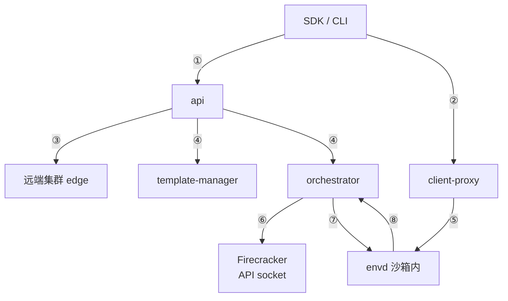

# 08 · 本书用到的 Go 服务工程

> e2b 的服务端是十二个 Go 模块拼起来的，进程之间用四种不同的接口技术说话，
> 而且其中绝大部分的胶水代码不是手写的，是从规格文件生成的。本篇把这套脚手架讲清楚：
> 哪种技术用在系统的哪个位置、为什么是它、生成物在哪、怎么再生成。
>
> **读者**：所有读者。工程师读完应当能改一个接口并让全仓库跟着变。
> **预备**：会读 Go；知道 HTTP/1.1 与 HTTP/2 的区别。不需要事先了解 gRPC、Connect-RPC、OpenAPI。
> **代码**：`go.work`、`Makefile`、`packages/orchestrator/*.proto`、`packages/envd/spec/`、
> `spec/openapi*.yml`、`packages/db/sqlc.yaml`、`packages/shared/pkg/{telemetry,logger,feature-flags,grpc}`

---

## 0. 本篇要回答的问题

1. 一个仓库里为什么要有十几个 Go module，而不是一个？多出来的记账成本是什么？
2. gRPC、Connect-RPC、OpenAPI、Swagger 2.0 这四种接口技术，分别用在系统的哪一段，
   凭什么这样切分？
3. 生成的代码在哪里、由谁生成、为什么要签入仓库？
4. 数据库访问是怎么组织的？sqlc 从哪里读到表结构？
5. 遥测与特性开关是怎样做到「没有后端也能跑」的？这对离线部署意味着什么？
6. 我改了一个 `.proto` 或 `.yml`，接下来要敲哪条命令？

---

## 1. 一个仓库，十二个模块

`go.work` 列出十三个工作区成员：`packages/` 下的十二个 Go module，加上 `tests/integration`。
十二个模块是 api、auth、clickhouse、client-proxy、dashboard-api、db、docker-reverse-proxy、
envd、local-dev、nomad-nodepool-apm、orchestrator、shared（`packages/otel-collector` 是配置目录，
没有 `go.mod`）。

**为什么不是一个 module。** 每个服务有自己的 `go.mod`，是为了让容器构建能分层缓存。
看 `packages/api/Dockerfile`：它先逐个 `COPY` 各依赖模块的 `go.mod` / `go.sum` 并 `go mod download`，
再 `COPY` 源码。依赖不变时这几层全部命中缓存。单 module 做不到这种粒度 ——
任何一个服务加一个依赖，所有服务的依赖层都失效。另一个收益是依赖面收窄：
envd 要塞进 guest 的 rootfs，它的 `go.mod` 里就不该出现 GCS SDK。

**代价是同一件事要写两遍。** 模块之间的本地引用既写在 `go.work` 的 `use` 里，
也写在各模块 `go.mod` 的 `replace` 里（`packages/api/go.mod` 把
`github.com/e2b-dev/infra/packages/{auth,clickhouse,db,shared}` 全部 `replace` 到 `../`）。
两者不是冗余：`Dockerfile` 从来不 `COPY` `go.work`，容器里只有被拷进去的几个目录，
此时靠的正是 `replace`。而本地开发与 CI 用 `go.work`，好处是 `go work sync` 能把各模块
对同一个第三方库的版本对齐。仓库用 `scripts/golang-dependencies-integrity.sh`
（`make tidy`）把「逐模块 `go mod tidy` + `go work sync`」固化成一条命令，
就是因为手工维护这两套记账很容易漂移。

**工具版本也进 `go.mod`。** Go 1.24 起的 `tool` 指令被用来钉住代码生成器：
`packages/api/go.mod` 里是 `oapi-codegen` 与 `air`，`packages/db/go.mod` 里是 `goose` 与 `sqlc`，
`packages/shared/go.mod` 里是 `go-swagger`。调用形式统一为 `go tool <pkg>`，
于是「生成器版本」和「代码版本」在同一次提交里变更。例外是 protoc 与 buf ——
它们不是 Go 包，必须预先装在开发机上，这是本仓库代码生成链条上唯一一处版本不受仓库约束的地方。

`packages/shared` 是公共库：`pkg/grpc`（生成的 gRPC / Connect 桩）、`pkg/telemetry`、`pkg/logger`、
`pkg/feature-flags`、`pkg/consts`、`pkg/storage`、`pkg/id` 等。除 envd 之外的服务基本都依赖它。

---

## 2. 四种接口技术，四个位置

系统里进程之间的每一条边，都要选一种序列化 + 传输方案。e2b 的选法可以用一句话概括：
**接口两端都由本仓库控制、且都是 Go，就用 gRPC；有一端是第三方 SDK 或需要穿过普通 HTTP 代理，
就用 HTTP + JSON 规格；对方的接口是既成事实，就把对方的规格文件抄进来生成客户端。**

| 技术 | 规格文件 | 生成器 | 典型用途 |
|---|---|---|---|
| gRPC / protobuf | `packages/orchestrator/{orchestrator,info,template-manager}.proto`、`packages/shared/pkg/grpc/proxy/proxy.proto` | `protoc` + `protoc-gen-go`、`protoc-gen-go-grpc` | 控制面：api ↔ orchestrator / template-manager |
| Connect-RPC | `packages/envd/spec/{process,filesystem}/*.proto` | `buf` + `protoc-gen-connect-go` | 沙箱内执行面：SDK ↔ envd |
| OpenAPI 3 | `spec/openapi.yml`、`openapi-edge.yml`、`openapi-hyperloop.yml`、`openapi-dashboard.yml`、`packages/envd/spec/envd.yaml` | `oapi-codegen` | 对外 REST、边缘控制、guest → host 回调 |
| Swagger 2.0 | `packages/shared/pkg/fc/firecracker.yml` | `go-swagger` | Firecracker 的 Unix socket API |



| 编号 | 接口形态 | 契约来源 |
|---|---|---|
| ① | OpenAPI REST | api 的 OpenAPI 规格 |
| ② | Connect-RPC over HTTP/1.1 | protobuf |
| ③ | OpenAPI 客户端调远端集群 | 同 ① 的规格 |
| ④ | gRPC | protobuf |
| ⑤ | HTTP 反向代理 | 无，透传 |
| ⑥ | Swagger 生成的客户端 | Firecracker 的 OpenAPI |
| ⑦ | OpenAPI 生成的模型 | envd 的规格 |
| ⑧ | OpenAPI hyperloop 回调 | orchestrator 的规格 |

图中每条边的方向都对应一份规格文件。下面逐类展开。

---

## 3. gRPC：控制面

三个 `.proto` 放在 `packages/orchestrator/` 下，生成物落到 `packages/shared/pkg/grpc/`：

- `orchestrator.proto` → `pkg/grpc/orchestrator/`，含 `SandboxService`
  （`Create`、`Update`、`List`、`Delete`、`Pause`、`Checkpoint`、`ListCachedBuilds`）
  与 `VolumeService`。
- `info.proto` → `pkg/grpc/orchestrator-info/`，含 `InfoService`
  （`ServiceInfo`、`ServiceStatusOverride`）。节点自报状态、角色、机器信息与主机指标；
  `ServiceInfoRole` 有 `TemplateBuilder` 与 `Orchestrator` 两个取值，这正是
  「template-manager 可以与 orchestrator 同进程」的协议依据。
- `template-manager.proto` → `pkg/grpc/template-manager/`，含 `TemplateService`
  （`TemplateCreate`、`TemplateBuildStatus`、`TemplateBuildDelete`、`InitLayerFileUpload`）。

生成方式写在 `packages/orchestrator/generate.go`：三条 `//go:generate protoc ...`，
`--go_out` 与 `--go-grpc_out` 直接指向 `../shared/pkg/grpc/` 下的目标目录，
用 `paths=source_relative`。这里没有用 buf，也没有 `buf.yaml`，所以 protoc 与两个插件必须
预装在开发机上。

`packages/shared/pkg/grpc/proxy/proxy.proto` 是个例外：它定义了 `SandboxService.ResumeSandbox`
（client-proxy 遇到指向已暂停沙箱的流量时，请求把它恢复起来），生成物 `proxy.pb.go` 与
`proxy_grpc.pb.go` 签在仓库里，但全仓库 grep 不到任何一条针对它的 `go:generate` 指令 ——
它的生成命令不在仓库中。同样地，仓库里只有它的**客户端**用法
（`packages/client-proxy/internal/proxy/paused_sandbox_resumer_grpc.go`），
服务端实现不在开源 infra 仓库内。

**服务端的公共装配**在 `packages/shared/pkg/grpc/server.go` 的 `NewGRPCServer()`，
所有 gRPC 服务共用同一套：

- keepalive：服务端每 15 s 发 ping、5 s 超时；强制策略允许客户端最快每 5 s ping 一次，
  且无活跃流时也允许。这是为长连接穿过云上负载均衡准备的。
- `grpc.StatsHandler` 挂 `otelgrpc.NewServerHandler`，外面再包一层 `NewStatsWrapper`
  （`pkg/grpc/filter.go`）把健康检查从 trace 里摘掉，并从 `SandboxCreateRequest` 里提取
  「这次是不是 resume」作为 metric 属性。
- unary 链上是 `recovery` + `logging` 拦截器，`selector` 把
  `/TemplateService/TemplateBuildStatus`、`/InfoService/ServiceInfo` 等高频轮询接口排除在日志之外。

用 gRPC 的代价是它要求端到端 HTTP/2。控制面全在集群内部、两端都是 Go，这个要求不难满足；
下一节的执行面就不是这样了。

---

## 4. Connect-RPC：envd 为什么不能用 gRPC

envd 跑在沙箱里，调用它的是用户机器上的 JS / Python SDK，路径是
`SDK → client-proxy → envd`，中间那一跳是一个普通的 HTTP 反向代理。
如果这条链要跑 gRPC，代理与两端都必须支持 HTTP/2 与 gRPC 的 trailer 语义。
实际代码里恰恰相反：全仓库找不到任何 `h2c` 或 `golang.org/x/net/http2` 的引用，
而 `packages/shared/pkg/proxy/pool/client.go` 与
`packages/orchestrator/internal/sandbox/sandbox.go` 都显式写了 `ForceAttemptHTTP2: false`。
envd 自己的 `http.Server`（`packages/envd/main.go`）也没有任何 HTTP/2 配置。
**这条链是纯 HTTP/1.1 的。**

Connect-RPC 正是为这个场景存在的：同一份 `.proto` 生成的 handler 同时接受三种线上协议
（Connect 自身的 JSON / 二进制协议、gRPC、gRPC-Web），其中 Connect 协议的一元调用就是
一次普通的 `POST /<package>.<Service>/<Method>`，服务端流式用分帧的响应体，
两者在 HTTP/1.1 上都成立。于是反向代理不需要知道 RPC 的存在。

两个服务定义在 `packages/envd/spec/`：

- `process/process.proto` 的 `Process`：`Start`、`Connect`（都是服务端流式）、
  `SendInput`、`SendSignal`、`Update`、`List`、`CloseStdin`。
- `filesystem/filesystem.proto` 的 `Filesystem`：`Stat`、`MakeDir`、`Move`、`ListDir`、`Remove`、
  `WatchDir`（服务端流式）以及非流式的 `CreateWatcher` / `GetWatcherEvents` / `RemoveWatcher`。

`process.proto` 里还有一个客户端流式的 `StreamInput`，envd 侧在
`internal/services/process/input.go` 实现了它，但客户端流式需要 HTTP/2，
SDK 走的是一元的 `SendInput`（`e2b-arm` 的 `packages/js-sdk/src/sandbox/commands/index.ts`、
`packages/python-sdk/e2b/sandbox_sync/commands/command.py`）。
`WatchDir` 之外又补了三个非流式的 watcher 方法，动机同样是绕开流式在受限传输上的麻烦
（推论：注释只写了「Non-streaming versions of WatchDir」，未说明动机）。

**生成两份。** `packages/envd/spec/generate.go` 跑两次 buf：
`buf.gen.yaml` 生成到 `packages/envd/internal/services/spec/`（envd 自己实现 handler 用），
`buf.gen.shared.yaml` 生成到 `packages/shared/pkg/grpc/envd/`（宿主侧进程当客户端用）。
两份代码从同一份 `.proto` 出来，包路径不同，这样 envd 的模块不必被 `shared` 拖累。

**挂载。** `packages/envd/main.go` 建一个 chi router，
`filesystem.Handle()` 与 `process.Handle()` 各自调用生成的 `spec.NewFilesystemHandler(...)`
拿到 `(path, handler)` 再 `server.Mount(path, handler)`。拦截器有两个：
日志拦截器，以及 `legacy.Convert()`。后者服务于一个历史包袱 ——
`packages/envd/internal/services/legacy/readme.md` 记录，旧版 Python SDK 遇到响应里的新字段会抛异常，
所以 `interceptor.go` 的 `shouldHideChanges()` 按 `user-agent` 判定客户端，
命中时把响应转换回旧协议的形状。旧的两份 `.proto` 被原样复制到 `legacy/` 目录冻结保存。
这是「接口生成」的代价的一个实例：生成器保证了两端类型一致，但保证不了跨版本的行为兼容，
兼容层还得手写。

---

## 5. OpenAPI 优先：一份规格，七个生成点

`spec/` 下有四份 OpenAPI 3 文档，再加 envd 自己的一份：

| 规格 | 生成配置 | 生成什么 | 谁用 |
|---|---|---|---|
| `spec/openapi.yml`（约 3300 行） | `packages/api/internal/api/cfg.yaml` | gin-server + client + models + embedded-spec | api 服务端 |
| 同上 | `tests/integration/internal/api/cfg.yaml` | client + models | 集成测试 |
| `spec/openapi-edge.yml` | `packages/shared/pkg/http/edge/cfg.yaml` | client + models | api 调远端集群 |
| `spec/openapi-hyperloop.yml` | `packages/orchestrator/internal/hyperloopserver/contracts/cfg.yaml` | gin-server + models | orchestrator 接沙箱回调 |
| `spec/openapi-dashboard.yml` | `packages/dashboard-api/internal/api/cfg.yaml` | gin-server + models | dashboard-api |
| `packages/envd/spec/envd.yaml` | `packages/envd/internal/api/cfg.yaml` | chi-server + models | envd 服务端 |
| 同上 | `packages/orchestrator/internal/sandbox/envd/cfg.yaml` | 仅 models | orchestrator 调 envd |

有几处值得单独说。

**embedded-spec 不只是文档。** api 打开了 `embedded-spec: true`，`packages/api/main.go`
在启动时 `api.GetSwagger()` 把规格读回内存，然后用
`middleware.OapiRequestValidatorWithOptions(swagger, ...)` 作为 gin 中间件。
于是路径参数、请求体 schema 的校验在进 handler 之前就完成了，handler 里不必再写一遍。
更进一步，鉴权也挂在这里：`openapi.yml` 的 `securitySchemes` 声明了 `ApiKeyAuth`、
`AccessTokenAuth`、`Supabase1TokenAuth`、`Supabase2TeamAuth`、`AdminTokenAuth` 五种，
中间件的 `openapi3filter.Options.AuthenticationFunc` 指向
`auth.CreateAuthenticationFunc(...)`，按 scheme 名分派到具体的验证器。
规格文件里那两个 `1` / `2` 的编号还留着一条注释：生成的代码按字母序遍历 security scheme，
编号是为了强制先验 token 再验 team。**规格文件在这里已经不是描述，是可执行的配置。**

**envd 同时讲两种协议。** `envd.yaml` 只有五条路径：`/health`、`/metrics`、`/init`、`/envs`、`/files`。
生成的 chi-server 接口由 `api.New()` 实现，`api.HandlerFromMux(service, m)` 把它挂到
**同一个** chi router `m` 上 —— 也就是和 Connect handler 共用一个端口。
分工很清楚：文件的上传下载（`/files`，multipart 与大二进制流）、启动时的一次性初始化（`/init`）
走 REST，结构化的、需要流式与强类型的进程与文件系统操作走 Connect。
用 protobuf 传大文件不划算，用 REST 表达带流的进程控制也不划算，两者各取所长。

**hyperloop 是反方向的。** `openapi-hyperloop.yml` 只有 `/me` 与 `/logs`，
服务端在 orchestrator（`internal/hyperloopserver/`），调用方是沙箱内部。
这是全系统里唯一一条 guest 主动打到 host 的控制通道。

**契约复用是这套做法的主要收益。** 同一份 `openapi.yml` 同时生成 api 的服务端接口
和集成测试的客户端，测试与实现不可能对不上字段名。同理，`envd.yaml`
在 envd 侧生成服务端、在 orchestrator 侧只生成 models
（`prefer-skip-optional-pointer: true`，因为宿主侧只需要构造请求体）。

**代价。** 生成的 gin-server 是非 strict 模式：handler 签名是
`func (a *APIStore) PostSandboxesSandboxIDPause(c *gin.Context, sandboxID api.SandboxID)`，
请求体的绑定和响应的写出仍要手写。生成物也很大 —— `packages/api/internal/api/api.gen.go`
约 12000 行，`packages/shared/pkg/fc/` 下的 Firecracker 客户端约 19000 行。
这些文件签入仓库，review 时基本不可读，只能靠「规格文件的 diff 是否合理」来把关。

**Firecracker 那份是抄来的。** `packages/shared/pkg/fc/firecracker.yml` 是 Firecracker 的
Swagger 2.0 规格（`version: 1.12.1`），用 `go tool swagger generate client` 生成。
它不是原样照抄：`/memory/mappings`、`/memory`、`/memory/dirty` 三个端点是分叉版
Firecracker 才有的（分别返回内存映射与可跳过页位图、常驻页与零页位图、脏页位图），
上游 Firecracker 没有。规格文件被 vendored 之后就地扩展，这是与第三方接口打交道的常见形态，
代价是每次跟进对方版本都要手工合并。分叉的细节见
[第 70 篇 · Firecracker 分叉 §2](70-firecracker-fork.md#2-分叉改了什么)。

---

## 6. 数据访问：sqlc

`packages/db` 用 sqlc 从 SQL 生成 Go，而不是用 ORM。写法是在 `queries/*.sql` 里写带注解的查询：

```sql
-- name: GetActiveClusters :many
SELECT DISTINCT sqlc.embed(c)
FROM public.clusters c
JOIN public.teams t ON t.cluster_id = c.id;
```

生成的是 `queries/get_active_clusters.sql.go`，里面是一个方法、一个 row 结构体，
SQL 原样嵌在常量里。`packages/db/sqlc.yaml` 配了三组生成：主查询集
（`queries/**` → `queries/`）、认证查询集（`pkg/auth/sql_queries/**` → `pkg/auth/queries/`）、
测试辅助集（`pkg/testutils/`）。

**schema 从哪来。** sqlc 的 `schema` 字段指向 `migrations` 与 `schema` 两个目录。
前者就是 goose 的迁移脚本本身 —— 没有第二份表定义，表结构的唯一真相是迁移历史。
后者只有一个 `schema/sqlc_overrides.sql`，文件头写明用途：被 `DO $$ ... $$` 包起来的迁移语句
sqlc 的静态解析器看不见，所以把等价的 `ALTER TABLE` 单写一份给解析器读，这些语句永不执行。
这是静态生成方案遇到动态 DDL 时的典型补丁。

**类型映射靠 overrides。** `sqlc.yaml` 把 `uuid` 映射到 `github.com/google/uuid.UUID`、
`numeric` 映射到 `decimal.Decimal`、`timestamptz` 映射到 `time.Time`，
并把 `public.env_builds.status` 之类的列映射到 `packages/db/pkg/types` 里的自定义枚举
（`BuildStatus`、`BuildStatusGroup`、`BuildReason`），`public.snapshots.config` 映射到
`PausedSandboxConfig`。可空列统一用指针（`emit_pointers_for_null_types: true`）。
于是「这一列是什么类型」这个问题在 Go 侧有确定答案，不需要在每个调用点手工转换。

生成的 `queries/db.go` 定义了一个 `DBTX` 接口，只要求 `Exec` / `Query` / `QueryRow`。
pgx 的连接池与事务都满足它，所以同一批查询方法既能直接跑也能在事务里跑，
事务边界由调用方决定。

**再生成的姿势。** `packages/db/Makefile` 的 `generate` 目标是
`rm -rf queries/*.go && go tool sqlc generate` —— 先删后生，避免删掉一条查询后
留下孤儿 `.go` 文件。迁移则用 goose：`make -C packages/db create-migration NAME=xxx`、
`make migrate`。表与迁移的细节在
[第 58 篇 · Postgres 模式与迁移 §2](58-postgres-schema-and-migrations.md#2-表与关系)。

代价也很直白：sqlc 只处理静态 SQL。需要按条件拼 where 子句的地方，要么写成
`WHERE (@filter::text IS NULL OR col = @filter)` 这类形式，要么绕开生成层手写。

---

## 7. 遥测与日志：一次装配，处处可用

`packages/shared/pkg/telemetry` 的 `New()` 是所有服务的统一入口，一次装配三样东西：
metric exporter（OTLP over gRPC，导出周期 15 s，histogram 用 base-2 指数桶）、
log provider、span exporter，并把 meter provider、tracer provider、text map propagator
设为 OTel 的全局单例。资源属性由 `config.go` 的 `GetResource()` 拼出，
含 `service.name`、`service.version`（版本号加 commit）、`service.instance.id`、`host.id`（节点 ID）。

**没有后端时怎么办。** `config.go` 里 `otelCollectorGRPCEndpoint` 读自环境变量
`OTEL_COLLECTOR_GRPC_ENDPOINT`；`New()` 的第一句就是：这个值为空则直接返回 `NewNoopClient()`，
里面全是 noop 的 provider 与 exporter。业务代码里的 `telemetry.SetAttributes()`、
`ReportEvent()`、`ReportCriticalError()` 照常调用，只是不产生任何输出。
这条空实现路径是单机与离线部署能跑起来的前提之一。

**日志与 trace 是绑在一起的。** `packages/shared/pkg/logger` 的 `Logger` 接口，
每个方法的第一个参数都是 `context.Context`：`Info(ctx, msg, fields...)`。
`TracedLogger.generateFields()` 从 ctx 里取出 span context，把 `trace_id` 与 `span_id`
作为字段加进每一条日志。这个签名上的选择让「从一条日志跳到对应的 trace」不依赖任何约定，
代价是日志调用点比标准库多一个参数，且 ctx 为 nil 时静默退化。

底层是 zap，用 `zapcore.NewTee` 把多个 core 并起来：控制台 core（可选）
与 `GetOTELCore()` 返回的 `otelzap` core，后者把日志送进 OTel 的 log provider。
每条日志固定带 `service`、`internal`、`pid` 三个字段，`internal` 用来区分
内部日志与用户可见的沙箱日志。`logger/fields.go` 把常用字段名固化成函数：
`WithSandboxID`、`WithTemplateID`、`WithBuildID`、`WithTeamID`、`WithNodeID`、
`WithClusterID`、`WithExecutionID` 等，避免同一个概念在不同服务里写成不同的键名。
遥测的全景在 [第 60 篇 · 遥测 §1](60-telemetry.md#1-一个客户端三类信号)。

---

## 8. 特性开关：默认值写在代码里

`packages/shared/pkg/feature-flags` 包着 LaunchDarkly 的 Go server SDK。四种类型的开关
（`BoolFlag`、`IntFlag`、`StringFlag`、`JSONFlag`）各有一个构造函数，
以 `newIntFlag(name, fallback)` 为例，它做两件事：记下名字与 fallback，
并把这个 fallback 写进包级变量 `launchDarklyOfflineStore`（一个 `ldtestdata.DataSource()`）。
所有开关都以包级变量的形式声明在 `flags.go` 里，包初始化时离线数据源就被填满了。

`client.go` 的 `NewClient()` 据此分岔：环境变量 `LAUNCH_DARKLY_API_KEY` 为空，
就用 `MakeCustomClient("", Config{DataSource: launchDarklyOfflineStore}, 0)`；
非空才连真正的 LaunchDarkly。两条路径返回同一个 `*Client`，调用点的
`ff.IntFlag(ctx, featureflags.MaxSandboxesPerNode)` 写法完全一样。
`getFlag()` 里还有两道兜底：client 为 nil 直接返回 fallback，评估出错则记一条 warning 后
返回 SDK 给的默认值。

**开关是带上下文求值的。** LaunchDarkly 的 context kind 在 `flags.go` 顶部定义：
`sandbox`（带 `template-id`、`kernel-version`、`firecracker-version` 属性）、`team`、`user`、
`cluster`、`tier`、`service`、`template`、`volume`、`deployment`。
`context.go` 的 `AddToContext()` 把它们塞进 Go 的 `context.Context`，
求值时由 `mergeContexts()` 合并；api 用 `middleware.InitLaunchDarklyContext`
在每个请求上挂好 team 与 user 上下文。于是同一个开关可以按团队、按模板、按部署分别取值。

`flags.go` 也是若干关键默认值的所在地：`max-sandboxes-per-node` 200、
`best-of-k-sample-size` 3、`nbd-connections-per-device` 4、
`memory-prefetch-max-fetch-workers` 16、`envd-init-request-timeout-milliseconds` 50，
以及 Firecracker 的默认版本常量 `DefaultFirecrackerVersion`。
代价是：这些默认值是编译期常量，在没有 LaunchDarkly 的部署里，
改一个默认值等于改代码重新编译。开关清单与语义见
[第 14 篇 · 配置、特性开关与版本约定 §2](14-config-flags-versions.md#2-特性开关)。

---

## 9. 怎么再生成

根 `Makefile` 的 `generate` 目标转发到六个 package 加两组附加目标：

```text
make generate
├── packages/api        make generate → go generate ./...  → oapi-codegen (openapi.yml)
├── packages/orchestrator                                  → protoc ×3
│                                                          → oapi-codegen (hyperloop, envd models)
├── packages/client-proxy                                  → 当前无 go:generate 指令
├── packages/envd                                          → buf ×2、oapi-codegen (envd.yaml)
├── packages/db         make generate → rm queries/*.go; go tool sqlc generate
├── packages/shared                                        → go-swagger (firecracker.yml)
│                                                          → oapi-codegen (openapi-edge.yml)
├── tests/integration                                      → oapi-codegen (openapi.yml, envd.yaml)
└── generate-mocks      → go run github.com/vektra/mockery/v3@v3.5.0（读 .mockery.yaml）
```

三点需要留意：

1. **`packages/dashboard-api` 不在 `generate` 的目标列表里**，尽管它有
   `internal/api/generate.go`。改 `spec/openapi-dashboard.yml` 之后要单独
   `make -C packages/dashboard-api generate`。
2. **生成物全部签入仓库。** 各服务的 `Dockerfile` 只 `COPY` 源码后 `make build`，
   从不运行任何生成器。这带来两个后果：构建不需要 protoc / buf，
   但改了规格文件却忘记提交生成物，CI 与运行时都不会立刻报错。
3. **外部工具只有两个**：protoc（含 `protoc-gen-go`、`protoc-gen-go-grpc`）与 buf。
   其余生成器都由 `go tool` 从 `go.mod` 的 `tool` 指令解析，版本随仓库走。

改一个接口的完整路径因此是：改规格文件 → 跑对应的 `make generate` →
补齐服务端实现（编译器会因为接口不满足而报错）→ 提交规格文件与生成物。

---

## 10. ARM 适配版的差异

本篇涉及的两处代码在 ARM 适配版有改动，都是参数而非结构：
`packages/shared/pkg/feature-flags/flags.go` 调高了若干默认值
（`max-sandboxes-per-node` 200 → 10000、`best-of-k-max-overcommit` 400 → 1200、
`envd-init-request-timeout-milliseconds` 50 → 120000、两个内存预取 worker 数各翻倍），
并把 Firecracker 默认版本常量指向分叉版的 `v1.13.1`；
`packages/shared/pkg/grpc/server.go` 加了 `grpc.MaxConcurrentStreams(1000)`
并显式把 `MaxConnectionAge` / `MaxConnectionIdle` 置零。
这些改动的动机与风险在
[第 77 篇 · API 层与特性开关默认值的调整 §1](77-api-and-flags-on-arm.md#1-没有开关服务的部署开关就是常量)。
接口技术的选型、生成链条与遥测组织在 ARM 适配版没有变化。

---

## 11. 小结

- 仓库是 `go.work` 管的十三个模块（`packages/` 十二个 + `tests/integration`）；
  多模块换来 Docker 的分层缓存与收窄的依赖面，代价是 `go.work` 与各 `go.mod` 的 `replace`
  必须同步维护，容器构建靠的是后者。
- 接口技术按位置划分：集群内部 Go 到 Go 的控制面用 gRPC；要穿过普通 HTTP 反向代理、
  面向多语言 SDK 的执行面用 Connect-RPC；对外与跨组件的 REST 用 OpenAPI；
  第三方既有接口把规格 vendored 进来生成客户端。
- envd 用 Connect 而非 gRPC，直接原因是 SDK → client-proxy → envd 这条链是 HTTP/1.1 的：
  仓库里没有任何 h2c，且两处 HTTP 客户端显式关掉了 HTTP/2 尝试。
- envd 在同一个 chi router、同一个端口上同时提供 Connect 服务与 OpenAPI 生成的 REST 端点，
  大文件与初始化走 REST，进程与文件系统操作走 Connect。
- `spec/openapi.yml` 不只是文档：api 把它嵌进二进制，在中间件里做请求校验，
  并按 `securitySchemes` 分派鉴权。
- sqlc 的 schema 直接读 goose 的迁移目录，`schema/sqlc_overrides.sql` 补上静态解析器
  看不见的 `DO $$` 块；生成的 `DBTX` 接口让同一批查询在连接池与事务上都可用。
- 遥测与特性开关都有完整的空后端路径：`OTEL_COLLECTOR_GRPC_ENDPOINT` 为空得到 noop client，
  `LAUNCH_DARKLY_API_KEY` 为空得到由 `flags.go` 中 fallback 填充的离线数据源。
  这是离线部署可行的前提。
- 生成物一律签入仓库，Dockerfile 不跑生成器；外部工具只有 protoc 与 buf，
  其余生成器由 `go tool` 钉在 `go.mod` 里。
- `proxy.proto` 与 `openapi-edge.yml` 在开源仓库里只有客户端一侧，
  服务端实现不在本仓库中；`packages/dashboard-api` 不在 `make generate` 的目标列表里。

## 延伸阅读 / 下一篇

- [第 09 篇 · Nomad、Consul 与 Terraform §3](09-nomad-consul-terraform.md#3-e2b-怎么用-nomad)：这些服务被编排起来的方式。
- [第 10 篇 · 系统架构 §4](10-system-architecture.md#4-端口表)：本篇画的接口位置图在那里展开成完整的进程与端口图。
- [第 14 篇 · 配置、特性开关与版本约定 §2](14-config-flags-versions.md#2-特性开关)：`flags.go` 的完整清单。
- [第 48 篇 · envd 概览 §7](48-envd-overview.md#7-一个端口两条协议)、
  [第 52 篇 · legacy 服务与 SDK 兼容 §2](52-envd-legacy-and-sdk-compat.md#2-legacy-包做了什么)：Connect 服务的实现与兼容层。
- [第 58 篇 · Postgres 模式与迁移 §6](58-postgres-schema-and-migrations.md#6-sqlc查询的组织)、
  [第 60 篇 · 遥测 §1](60-telemetry.md#1-一个客户端三类信号)：本篇只讲了脚手架，内容在那两篇。
- [第 65 篇 · 构建与发布 §3](65-build-and-release.md#3-makefile-的三层结构)、
  [第 66 篇 · 本地开发环境 §3](66-local-development.md#3-容器那一半make-local-infra)：Makefile 的其余目标。
- Connect 协议规格：<https://connectrpc.com/docs/protocol>；
  oapi-codegen 配置项：<https://github.com/oapi-codegen/oapi-codegen>；
  sqlc 文档：<https://docs.sqlc.dev/>。
