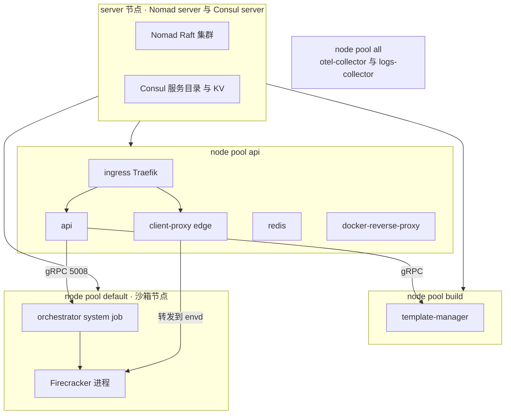

# 09 · Nomad、Consul 与 Terraform

> 一个 e2b 集群不是一个进程，是十来种进程分布在四类机器上，其中一种必须以近乎裸机的权限运行。
> 本篇讲上游 2026.09 用来描述、投放和串联这些进程的三件工具：Nomad 负责放置与生命周期，
> Consul 负责名字与一小块共享状态，Terraform 与 Packer 负责机器本身。
>
> **读者**：工程师、运维。 　**预备**：[第 08 篇 · 本书用到的 Go 服务工程 §1](08-go-service-toolkit.md#1-一个仓库十二个模块)。
> 不需要用过 Nomad。 　**代码**：`iac/provider-gcp/nomad/jobs/*.hcl`、`iac/modules/job-*/jobs/*.hcl`、
> `iac/provider-gcp/nomad-cluster/scripts/`、`iac/provider-gcp/nomad-cluster-disk-image/`、
> `packages/orchestrator/internal/sandbox/network/storage_kv.go`、
> `packages/shared/pkg/clusters/discovery/nomad.go`

---

## 0. 本篇要回答的问题

1. Nomad 的 job / group / task / allocation 分别是什么，调度类型与 driver 怎么选，e2b 各选了什么？
2. 一台沙箱节点上的 orchestrator 是怎么被投放上去的？它为什么不是容器？
3. Consul 在 e2b 里到底承担了几件事？哪些事上游其实没有用 Consul 做？
4. Terraform 与 Packer 的分工是什么？「不可变镜像 + 启动脚本」这条线在哪里断开？
5. 上游选 Nomad 而不是 Kubernetes，收益是什么，代价是什么？

---

## 1. 这一层要解决的问题

先看要放什么。上游 2026.09 的一个 GCP 部署里有这些长期运行的进程：api、edge（client-proxy）、
orchestrator、template-manager、docker-reverse-proxy、dashboard-api、redis、clickhouse、loki、
otel-collector、logs-collector、ingress（Traefik），外加一个每小时跑一次的 NFS 缓存清理任务。
它们的要求彼此冲突：

- **api** 是无状态 HTTP 服务，要多副本、要滚动更新、要能被负载均衡器发现；
- **orchestrator** 必须在每一台沙箱节点上**恰好有一个**实例，而且要直接使用宿主的 `/dev/kvm`、
  hugetlbfs 挂载点、`/dev/nbd*` 设备、网络命名空间和本地 NVMe 目录 —— 它不是被隔离的负载，
  它是宿主上的一个特权守护进程；
- **template-manager** 一次构建可能跑几十分钟，进程被强杀就丢掉整次构建；
- **otel-collector**、**logs-collector** 要在每台机器上各有一份，作为本地采集端点。

同时，这些进程要互相找到对方：api 要知道有哪些 orchestrator 节点、每个节点的地址与端口；
所有进程要知道 redis、clickhouse、loki 在哪；外部流量要落到当前健康的 api 与 edge 副本上。

「把进程放到合适的机器上并维持住」是调度问题，「让进程互相找到」是服务发现问题，
「先有机器」是基础设施供给问题。上游用三件工具分别处理，边界基本清晰：Nomad 管调度，
Consul 管名字与一小块共享 KV，Terraform 加 Packer 管机器。本篇按这个顺序讲。

---

## 2. Nomad 的模型

### 2.1 集群与对象

Nomad 是一个集群调度器。它有两种角色：**server** 组成 Raft 集群，保存状态、做调度决策；
**client** 跑在每台工作机上，向 server 汇报资源与属性，并真正启动进程。
上游用 `iac/provider-gcp/nomad-cluster/scripts/run-nomad.sh` 的 `generate_nomad_config`
生成两种配置：`--server` 的机器写 `server { enabled = true, bootstrap_expect = N }`，
`--client` 的机器写 `client { enabled = true, node_pool = ... }`。同一份脚本、两个开关。

用户提交的单位是 **job**。一个 job 含若干 **group**，一个 group 含若干 **task**。
调度的最小单位是 group：Nomad 为一个 group 的一份副本创建一个 **allocation**（分配），
把它放到某个 client 上，该 group 里的所有 task 一起落在这台机器上。
`iac/provider-gcp/nomad/jobs/api.hcl` 就是这个结构的直接例子：job `api` 有一个 group `api-service`，
group 里有两个 task —— `start` 跑 api 二进制，`db-migrator` 带 `lifecycle { hook = "prestart", sidecar = false }`，
即在主 task 启动前跑一次数据库迁移然后退出。两个 task 必然同机，迁移与服务的启动顺序由 Nomad 保证。

### 2.2 调度类型

job 的 `type` 决定副本数由谁决定：

| type | 语义 | e2b 中的例子 |
|---|---|---|
| `service`（默认） | 由 `count` 指定副本数，失败后重新调度 | `api`、`redis`、`template-manager` |
| `system` | 每个匹配的 client 上各一份，节点加入即自动获得 | `orchestrator`、`otel-collector`、`logs-collector` |
| `batch` | 跑完退出；配 `periodic` 就是定时任务 | `filestore-cleanup` |

`iac/modules/job-orchestrator/jobs/orchestrator.hcl` 的第一行是 `type = "system"`。
这一句话就回答了「新加一台沙箱节点，谁把 orchestrator 装上去」：不需要谁，节点注册到 Nomad
之后调度器自己会补一个 allocation。`iac/provider-gcp/nomad/jobs/clean-nfs-cache.hcl`（job 名是 `filestore-cleanup`）则是
`type = "batch"` 加 `periodic { cron = "0 * * * *", prohibit_overlap = true }`，每小时清一次 NFS 缓存，
并保证上一轮没跑完就不起下一轮。

### 2.3 driver：进程怎么被启动

Nomad 自己不定义「怎么运行一个 task」，交给 driver 插件。上游只用两种：

- **docker**：拉镜像、起容器。`api`、`client-proxy`、`redis`、`clickhouse`、`loki` 等都用它。
  注意这些 job 的 `config` 里普遍写 `network_mode = "host"`，容器只用来分发文件系统，不做网络隔离。
- **raw_exec**：直接在宿主上 fork 一个进程，不做任何隔离。`orchestrator`、`template-manager`、
  `nomad-autoscaler`、`filestore-cleanup` 用它。

raw_exec 默认是关闭的，因为它等于把宿主交给 job。上游在 `run-nomad.sh` 的 client 配置里显式打开，
而且关掉了 cgroup 约束：

```hcl
plugin "raw_exec" {
  config {
    enabled = true
    no_cgroups = true
  }
}
```

orchestrator 的 task 配置只有一行 `chmod +x local/orchestrator && local/orchestrator`，
二进制由 `artifact` 块从对象存储下载。选 raw_exec 的原因在第 1 节已经给出：orchestrator 要
自己管 cgroup、要挂 netns、要打开 `/dev/kvm` 与 `/dev/nbd*`。`no_cgroups = true` 意味着
Nomad 不再给它套一层 cgroup，orchestrator 对沙箱的资源记账不会与调度器打架
（细节见[第 38 篇 · cgroup、资源记账与主机统计 §7](38-cgroups-and-host-stats.md#7-nomad-与-no_cgroups)）。
代价是 Nomad 对这个 task 的 `resources` 声明形同虚设：它不限制、也不准确记账 orchestrator 的实际用量。

### 2.4 放到哪台机器上：node pool、constraint 与端口

Nomad 有三层放置约束，e2b 三层都用。

**node pool** 是节点的静态分组。`run-nomad.sh` 在 client 配置里写 `node_pool = "$node_pool"`，
值来自各自的启动脚本；`create_node_pools` 在 server 上创建 `api` 与 `build` 两个池。
加上 Nomad 内置的 `default` 与 `all`，上游一共用到四个：

| node pool | 谁在这里 | 主要 job |
|---|---|---|
| `api` | api 节点 | `api`、`client-proxy`、`ingress`、`redis`、`docker-reverse-proxy`、`dashboard-api` |
| `build` | 构建节点 | `template-manager`、`filestore-cleanup` |
| `default` | 沙箱节点 | `orchestrator` |
| `all` | 全部 | `otel-collector`、`logs-collector` |

**constraint** 是动态谓词。`api.hcl` 用 `constraint { operator = "distinct_hosts", value = "true" }`
禁止两个 api 副本落在同一台机器；orchestrator 用
`constraint { attribute = "${meta.orchestrator_job_version}", value = "..." }` 匹配节点元数据，
这一条在 §3.2 单独讲。

**端口**也被当成一种放置约束用。`api.hcl` 在 `network` 块里声明 `static = 40234` 的
`scheduling-block` 端口，注释写明它的用途是阻止 api 与 loki 被调度到同一台节点上：
静态端口在一台机器上只能被一个 allocation 占用，于是「抢同一个端口」就成了一把互斥锁。
这是个便宜但隐晦的技巧 —— 它把「不要同机」表达成了「抢同一个数字」，读 job 文件的人如果不看注释
是猜不出意图的。

其余端口声明是常规用法：`static` 表示固定端口（orchestrator 的 gRPC 与 proxy 端口都是静态的，
因为 api 侧假定端口固定，见 §3.3），不带 `static` 则由 Nomad 动态分配并通过 `NOMAD_PORT_<name>`
环境变量注入，例如 `client-proxy.hcl` 里的 `HEALTH_PORT = "$${NOMAD_PORT_health}"`。

### 2.5 服务、健康检查与更新策略

group 里的 `service` 块声明「这个 allocation 提供一个叫某某的服务，在某个端口上」，
`check` 块声明怎么判断它是否健康。`api.hcl` 注册了两个服务：`api`（HTTP `/health`，3 s 一次）
和 `api-grpc`（TCP 探测）。健康检查不只是给运维看的，它是滚动更新的判据。

`update` 块描述滚动更新的节奏。`api.hcl` 的写法值得看：`max_parallel = 1`、`canary = 1`、
`auto_promote = true`、`auto_revert = true`，即先起一个新版本副本，健康后自动晋升并逐个替换旧副本，
失败则回滚。`healthy_deadline` 与 `progress_deadline` 被设成 10800 s / 10801 s，注释解释这是
「故意留得很紧，一旦被判为不健康就立刻失败」。`restart`（同机重启）与 `reschedule`（换机重放）
是另外两层：`iac/modules/job-client-proxy/jobs/client-proxy.hcl` 的写法是 10 分钟内最多重启 2 次，
再失败就以指数退避换一台机器。

对 `template-manager`，`kill_timeout` 在启用滚动更新时被设为 70 分钟，client 侧
`run-nomad.sh` 相应地写了 `max_kill_timeout = "24h"`。这两个数字的含义是：收到 SIGTERM 后
最多等这么久再 SIGKILL，让进行中的模板构建有机会跑完。代价是一次部署可能被单个构建拖住一个多小时。

---

## 3. e2b 怎么用 Nomad

### 3.1 job 清单

jobspec 分散在两处：`api`、`redis`、`docker-reverse-proxy`、`template-manager`、
`nomad-autoscaler`、`clean-nfs-cache` 还留在 `iac/provider-gcp/nomad/jobs/`，
其余的（orchestrator、client-proxy、ingress、clickhouse、loki、两个 collector、dashboard-api）
已经移到与云厂商无关的 `iac/modules/job-<名字>/jobs/` 下，由 GCP 与 AWS 两个 provider 目录共同引用。

| job | type | driver | node pool | 说明 |
|---|---|---|---|---|
| `api` | service | docker | `api` | 带 prestart 的 db-migrator |
| `client-proxy` | service | docker | `api` | 通过 `tags` 暴露给 Traefik |
| `ingress` | service | docker | `api` | Traefik v3.5 |
| `docker-reverse-proxy` | service | docker | `api` | 模板镜像推送入口 |
| `redis` | service | docker | `api` | 未使用托管 Redis 时 |
| `orchestrator` | system | raw_exec | `default` | 每台沙箱节点一份 |
| `template-manager` | service | raw_exec | `build` | 副本数由 autoscaler 跟随节点数 |
| `clickhouse` / `loki` | service | docker | 各自的池 | |
| `otel-collector` / `logs-collector` | system | docker | `all` | 每台机器一份 |
| `nomad-autoscaler` | service | raw_exec | `api` | 自带 nodepool APM 插件 |
| `filestore-cleanup` | batch + periodic | raw_exec | `build` | 每小时清 NFS 缓存 |

下图是这些 job 与四类机器的对应关系。



`template-manager` 是个混合体：它是 `service` 类型，却要求「每台构建节点一份」。上游的做法是
`constraint { distinct_hosts }` 加一个 `scaling` 块，用自定义的 `nomad-nodepool-apm` 插件把
`build` 池的节点数作为伸缩指标，让 `count` 跟随节点数。这比直接写 `type = "system"` 复杂，
换来的是 `system` 类型不支持的 `update`（滚动更新）与 `scaling` 语义。

### 3.2 orchestrator 的版本化 job

`type = "system"` 有一个后果：新版本的 job 一提交，所有节点上的 orchestrator 都会被替换。
对一个每台机器上跑着几十上百台沙箱的进程，这是不可接受的。上游的处理办法在
`iac/modules/job-orchestrator/main.tf`：

1. 把 job 定义连同变量渲染一遍，与 orchestrator 二进制的校验和一起做 sha256，喂给
   `random_id` 的 `keepers`。内容不变则 ID 不变，内容一变则得到一个新的随机十六进制 ID。
2. job 名字带上这个 ID：`job "orchestrator-${latest_orchestrator_job_id}"`。
   于是新版本是一个**新的 job**，而不是旧 job 的新版本；`nomad_job` 资源上写了
   `deregister_on_id_change = false`，Terraform 不会去注销旧 job。
3. job 里带一条 constraint，只允许落在 `meta.orchestrator_job_version` 等于该 ID 的节点上。
4. 当前 ID 同时写进一个 Nomad 变量 `nomad/jobs`（`nomad_variable` 资源）。
5. 节点开机时，`start-client.sh` 先用 `dig +short nomad.service.consul` 找到一台 Nomad server，
   再用 HTTP API 读 `/v1/var/nomad/jobs` 取出 `latest_orchestrator_job_id`，把它作为
   `--orchestrator-job-version` 传给 `run-nomad.sh`，写进 client 的 `meta`。取不到就退出，节点不启动。

合起来的效果是：升级 orchestrator 不是原地替换进程，而是**加新节点**。新节点带着新 ID 加入，
只有新 job 会落上去；旧节点继续跑旧 job，直到上面的沙箱被排空后销毁。代价是升级必须伴随节点轮换，
一次升级要多占一段时间的双份机器；收益是运行中的沙箱不会因为一次部署而消失。

### 3.3 api 侧读 Nomad API 做节点发现

上游没有让 api 通过 Consul 找 orchestrator，而是直接查 Nomad。两条路径：

- `packages/api/internal/orchestrator/client.go` 的 `listNomadNodes()` 调用 Nomad 的
  `Nodes().List()`，过滤条件是 `Status == "ready" and NodePool == "default"`，
  取每个节点的地址拼上 `consts.OrchestratorAPIPort`（`ORCHESTRATOR_PORT`，默认 5008）
  作为 orchestrator 的 gRPC 地址。这解释了 §2.4 里 orchestrator 端口为什么必须是 `static`。
- `packages/shared/pkg/clusters/discovery/nomad.go` 的
  `ListOrchestratorAndTemplateBuilderAllocations()` 调用 `Allocations().List()`，
  过滤器按 `TaskGroup` 与 `JobID` 前缀匹配（`client-orchestrator` / `orchestrator`、
  `template-manager` / `template-manager`），从 allocation 的
  `AllocatedResources.Shared.Networks[0].IP` 取地址。`packages/api/internal/clusters/discovery/local.go`
  用它发现构建节点；代码注释里说明本地 orchestrator 仍走上面那条旧路径，「为了少改动暂时保持现状」。

两处都注明了同一个简化：端口写死在常量里，没有从 Nomad API 的端口映射里取。
更完整的讨论在[第 21 篇 · 集群与服务发现 §4](21-clusters-and-discovery.md#4-三种发现来源)。

---

## 4. Consul 在 e2b 里做什么

Consul 的完整能力是服务目录 + 健康检查 + DNS + KV + 服务网格。上游 2026.09 只用了其中三块，
而且不是最显眼的那一块。

### 4.1 DNS：`*.service.consul`

Consul agent 在每台机器的 8600 端口提供 DNS。`start-client.sh` 与 `start-api.sh` 都写了
`/etc/systemd/resolved.conf.d/consul.conf`，把 `127.0.0.1:8600` 设为 DNS 服务器。
沙箱节点更进一步：它把 GCE 自带的 `gce-resolved.conf` 改名禁用，让 Consul 成为**唯一**的解析器，
`.consul` 域自己解析，其余查询通过 `--recursor` 转发给从元数据服务动态取到的 GCE DNS。
脚本里对这个顺序做了显式处理 —— 先起 Consul、轮询 8600 端口通了、再重启 systemd-resolved，
注释说明反过来会让 systemd-resolved 把 `127.0.0.1:8600` 标记为不可达。

这个 DNS 名字空间是配置里的服务地址来源。`iac/provider-gcp/nomad/main.tf` 的 `locals` 直接拼字符串：
`clickhouse://.../@clickhouse.service.consul:...`、`redis.service.consul:...`、
`http://loki.service.consul:...`。也就是说，进程之间的地址是**在 Terraform 里写成 DNS 名字、
在运行时由 Consul 解析**的，没有客户端侧的服务发现逻辑。

### 4.2 服务目录：给 Traefik 用

Nomad 的 `service` 块可以注册到 Consul，也可以注册到 Nomad 自己的服务目录，由 `provider` 字段决定，
默认是 Consul。上游两种都在用：`orchestrator.hcl` 与 `template-manager.hcl` 写了
`provider = "nomad"`，`api.hcl`、`client-proxy.hcl` 没写，因此进 Consul。

消费者是 ingress 里的 Traefik。`iac/modules/job-ingress/jobs/ingress.hcl` 同时打开两个 provider：
`--providers.nomad=true` 与 `--providers.consulcatalog=true`，都带 `exposedByDefault=false`。
路由规则写在被代理服务的 `tags` 里，例如 `client-proxy.hcl` 的
`traefik.http.routers.client-proxy.rule=PathPrefix(...)` 与 `priority=100`（最低优先级，兜底接管
带动态子域名的沙箱流量）。于是「谁对外可见、走什么路由」是写在各自 job 里的，Traefik 只是把目录读出来。

### 4.3 KV：网络槽位的分配

第三个用途与服务发现无关。`packages/orchestrator/internal/sandbox/network/storage_kv.go`
用 Consul 的 KV 做沙箱网络槽位（slot）的互斥分配：`NewStorageKV()` 用 `CONSUL_TOKEN` 建客户端，
`Acquire()` 随机挑一个槽位序号，以 `<nodeID>/<slotIdx>` 为键做 `kv.CAS()`（compare-and-swap，
`ModifyIndex` 为 0 即「仅当键不存在时写入」），成功则占有该槽位，失败换一个再试；
`Release()` 用 `DeleteCAS()` 释放。代码注释里明说「没有 Consul 锁，所以可能多个沙箱同时抢同一个槽位」
—— CAS 保证了正确性，冲突靠重试解决。

这是 Consul 在 e2b 里唯一承担**共享状态**的地方，而且它是可替换的：
`packages/orchestrator/main.go` 的 `newStorage()` 在开发模式或
`USE_LOCAL_NAMESPACE_STORAGE=true` 时改用 `NewStorageLocal()`，把槽位分配退化为单机本地状态。
单机部署因此可以完全不要 Consul KV。槽位本身的语义见
[第 35 篇 · 沙箱网络 §1](35-sandbox-networking.md#1-槽位号的分配两种存储一条不变量)。

### 4.4 安全配置

`run-consul.sh` 生成的配置里 ACL `default_policy` 是 `deny`，开启 gossip 加密
（`--enable-gossip-encryption` 加一个密钥），集群成员发现用 `retry_join` 的
`provider=gce project_name=... tag_value=...`，即按 GCE 实例标签自动组网。
`configure_acl` 在 leader 上创建两个策略：`dns-request-policy`（对 `node_prefix ""` 与
`service_prefix ""` 只读）和 `register-service-policy`（`service_prefix ""` 可写），
再签出一个客户端 token 作为 agent 的默认 token。Nomad 侧则在配置里写
`consul { address = "127.0.0.1:8500", allow_unauthenticated = false, token = ... }`。

---

## 5. Terraform 与 Packer

### 5.1 Terraform 的三个概念

Terraform 用声明式配置描述基础设施，核心是三件事：**provider** 是与某个云或系统对话的插件；
**resource** 是一个被管理的对象；**state** 是 Terraform 记住的「我创建过什么」。
每次 `apply` 就是把配置、state 和真实世界三者对齐。**module** 是配置的复用单位。

`iac/provider-gcp/main.tf` 的 `required_providers` 里有四个 provider：`google`、`cloudflare`、
`nomad`、`random`，state 存在 GCS（`backend "gcs"`）。其中 `nomad` provider 是关键 ——
它让 Nomad job 也成为 Terraform 管理的资源：

```hcl
resource "nomad_job" "api" {
  jobspec = templatefile("${path.module}/jobs/api.hcl", { ... })
}
```

`templatefile()` 把 `.hcl` 里的 `${...}` 占位符替换成变量值再提交。这就是为什么 job 文件不是
合法的独立 jobspec —— 它是模板。渲染出来的 job 内容进入 Terraform state，
`terraform apply` 因此能对 job 做增量更新，也能算出「job 定义变了没有」（§3.2 的哈希就是这么来的）。
注意 job 里的 `$${...}` 是转义：先躲过 Terraform 的插值，留给 Nomad 在运行时展开成
`NOMAD_PORT_health`、`node.unique.id` 这类值。

模块层次是三层：`iac/provider-gcp/main.tf` → `nomad-cluster`（机器、网络、Filestore、节点池）
与 `nomad`（job）→ `iac/modules/job-*`（单个 job 的模块，被 GCP 与 AWS 两个 provider 目录共享）。
资源细节留给[第 63 篇 · GCP 上的部署 §1](63-gcp-terraform.md#1-一次部署要产生什么)，逐个 job 的讲解留给
[第 64 篇 · Nomad job 详解 §2](64-nomad-jobs.md#2-读一份-jobspec-要看的六件事)。

### 5.2 Packer 与那条断开的线

`iac/provider-gcp/nomad-cluster-disk-image/main.pkr.hcl` 用 Packer 从
`ubuntu-2204-jammy-v20251023` 出发烤一个自定义镜像 `e2b-orch`。装进去的东西：Docker、
gcsfuse、nfs-common、Go（snap）、jq/unzip/qemu-utils/build-essential、
gruntwork 的 bash-commons、Consul（默认 1.16.2）、Nomad（默认 1.6.2）、Vault（默认 1.20.3）、
Google Cloud Ops Agent，以及 `/opt/nomad/plugins` 目录、放宽的 `limits.conf`、
调大的 `nf_conntrack_max`，最后用 `dpkg-divert` 把 GCE 的 resolved 配置改道（对应 §4.1 的 DNS 安排）。
镜像还声明 `image_licenses = ["projects/vm-options/global/licenses/enable-vmx"]` 打开嵌套虚拟化 ——
没有这一条，节点上起不了 Firecracker。Vault 被装进镜像但在 job 与脚本里都没有使用
（推论：为将来的密钥管理预留）。

值得注意的是，镜像**只装工具，不含配置**。所有配置发生在开机时：`start-server.sh`、
`start-api.sh`、`start-client.sh` 作为 GCE 启动脚本运行，用 `gsutil` 从对象存储把
`run-consul.sh` 与 `run-nomad.sh` 拉下来（文件名里带内容哈希，见
`nomad-cluster/main.tf` 里的 `file_hash`），再由这两个脚本生成 Consul 与 Nomad 的配置文件并启动。
Consul 用 systemd 单元，Nomad 用 supervisor（`install-nomad.sh` 的 `install_supervisord_debian`）。

`start-client.sh` 是三者里最重的一个，它做的事按顺序是：把本地 NVMe 盘做成 RAID 0 或直接格式化成
XFS 挂到 `/orchestrator`、建 100 GiB swapfile、按需挂 NFS 并把 NFS 预读设成 4096 KiB、
挂 65 GiB tmpfs 到 `/mnt/snapshot-cache`、调 `somaxconn` 等内核参数、给 NBD 设备加
`OPTIONS:="nowatch"` 的 udev 规则并 `modprobe nbd nbds_max=4096`、用 gcsfuse 只读挂载
envd/kernels/fc-versions 三个桶、配置 Consul DNS、按可用内存的一个比例预留 2 MiB 大页
（`nr_hugepages` 与 `nr_overcommit_hugepages` 按 `BASE_HUGEPAGES_PERCENTAGE` 切分），
最后才启动 Consul 与 Nomad。这些设置是后面许多篇的前提：NBD 见
[第 06 篇 · 块设备、NBD 与写时复制 §3](06-block-devices-nbd-cow.md#3-nbd把用户态代码变成一块磁盘)，大页见
[第 32 篇 · 预取与大页 §5](32-memory-prefetch-and-hugepages.md#5-大页改变了哪些量)。

「不可变镜像 + 幂等启动脚本」是标准做法，但这里的分工有代价：镜像里的 Consul / Nomad 版本
与脚本里的配置是分开演进的，改一行启动脚本要重新滚一遍节点，而改镜像还要先跑一次 Packer。
两者之间没有版本约束关系，只有 `file_hash` 保证脚本本身被重新下载。

---

## 6. 为什么是 Nomad 而不是 Kubernetes

上游没有在代码里解释这个选择，以下是从代码事实反推的（推论）。

**收益。** 第一，orchestrator 本质上是宿主守护进程而不是容器：它要 `/dev/kvm`、要
`/dev/nbd*`、要在宿主的网络命名空间之间来回操作、要自己管 cgroup。raw_exec 加
`no_cgroups = true` 是一行配置就能表达的事；在 Kubernetes 里对应的是特权 DaemonSet 加
一堆 hostPath 与 `hostNetwork`，能做但表达要绕。第二，Nomad 允许 docker 与 raw_exec 两种
负载在同一个调度器下共存，e2b 恰好一半是容器一半是裸进程。第三，Nomad 是单个二进制，
控制面的运维成本远低于一套 Kubernetes；节点初始化脚本里 Nomad 只占几行。

**代价。** 生态是最直接的一项：没有 Helm 那样的打包分发，job 模板要靠 Terraform 的
`templatefile()` 自己渲染；没有 Operator 模式，像「system job 不能滚动更新」这种缺口要靠
§3.2 的哈希 job ID 与节点轮换手工补；`template-manager` 想要「每节点一份且能滚动更新」，
只能写自定义 APM 插件让 autoscaler 跟随节点数。此外，Nomad 与 Consul 是一对搭配，
引入 Nomad 基本上等于同时引入 Consul，而 §4 已经说明 e2b 对 Consul 的使用其实很浅。

---

## 7. ARM 适配版的差异

ARM 适配版保留了 Nomad 与 Consul，但去掉了 Terraform 与 GCP 这一层。
`iac/provider-gcp/nomad/jobs/` 下补齐了 orchestrator、edge、clickhouse、loki、otel-collector、
logs-collector 等全部 job 的 `.hcl`（上游中它们分散在 `iac/modules/job-*/`），
占位符从 Terraform 的 `${var}` 改成 shell 环境变量，由新增的 `deploy.sh` 读 `.env`、
用 `envsubst` 渲染到 `rendered/` 再 `nomad job run` 逐个提交；同一个脚本用 `--type k8s`
可以改走 Helm。`run-nomad.sh`、`run-consul.sh` 剥掉了 GCE 元数据服务与 gsutil 的依赖，
Nomad 的进程管理从 supervisor 换成 systemd 单元（新增 `setup/nomad.service`），
orchestrator job 的版本化 constraint 被移除（job 名固定为 `orchestrator`）。
细节见[第 79 篇 · 部署形态二：Nomad 多节点 §3](79-nomad-multinode-deployment.md#3-渲染层从-templatefile-换成-envsubst)、
[第 78 篇 · 部署形态一：Helm / Kubernetes §5](78-helm-k8s-deployment.md#5-与-nomad-形态的概念对照)与
[第 80 篇 · 部署形态三：单机离线 RPM §6](80-single-node-rpm.md#6-buildsh--s从空机器到可用集群)。

---

## 8. 小结

- Nomad 的调度单位是 group；job 的 `type` 决定副本数由谁定：`service` 靠 `count`，
  `system` 每节点一份，`batch` 跑完就退。e2b 三种都用。
- orchestrator 是 `system` + `raw_exec` + `no_cgroups`，因为它是特权宿主守护进程而非被隔离的负载；
  代价是 Nomad 对它的资源声明不生效。
- 放置由三层约束表达：node pool（`api` / `build` / `default` / `all`）、constraint
  （`distinct_hosts`、节点 meta）、静态端口（被当作互斥锁使用）。
- `system` job 不支持滚动更新，上游用「job 名带内容哈希 + 节点 meta constraint + Nomad 变量」
  把 orchestrator 的升级变成节点轮换，代价是升级期间双份机器。
- api 侧的节点发现走 Nomad API 而不是 Consul：`Nodes().List()` 按
  `Status == "ready" and NodePool == "default"` 过滤，端口取自常量而非 Nomad 的端口映射。
- Consul 在上游承担三件事：机器级 DNS（`*.service.consul` 是配置里的地址来源）、
  给 Traefik 用的服务目录、以及网络槽位的 CAS 分配。第三件可以用本地存储替换。
- Terraform 管机器与 job 两层，`nomad_job` + `templatefile()` 让 jobspec 进入 state；
  Packer 只烤工具不烤配置，配置全在开机脚本里，`start-client.sh` 承担了磁盘、swap、NFS、NBD、
  大页、DNS 的全部准备工作。
- 选 Nomad 换来了对裸进程负载的直接表达和低运维成本，代价是生态缺口要自己补
  （版本化 job、自定义 APM 插件）。

---

## 延伸阅读 / 下一篇

- 下一篇：[第 10 篇 · 系统架构：组件、进程、端口与数据流 §2](10-system-architecture.md#2-进程清单)，
  把本篇的 job 清单落到进程、端口与数据流上。
- [第 63 篇 · GCP 上的部署 §3](63-gcp-terraform.md#3-节点池五类机器)：Terraform 资源与节点池的逐项讲解。
- [第 64 篇 · Nomad job 详解 §7](64-nomad-jobs.md#7-job--节点池--端口)：每个 job 的资源、端口、环境变量与健康检查。
- [第 21 篇 · 集群与服务发现 §4](21-clusters-and-discovery.md#4-三种发现来源)：api 侧发现逻辑的完整形态。
- [第 35 篇 · 沙箱网络 §1](35-sandbox-networking.md#1-槽位号的分配两种存储一条不变量)：Consul KV 分配的槽位到底是什么。
- Nomad 官方文档的 job specification 与 scheduler 两章；Consul 的 ACL 生产配置教程
  （`run-consul.sh` 的注释直接引用了它）。
