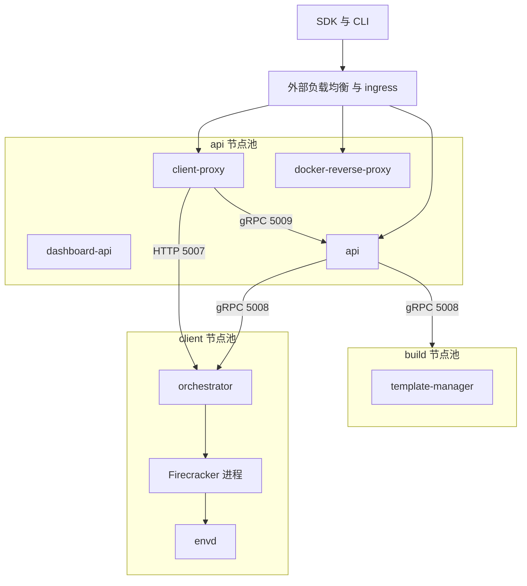
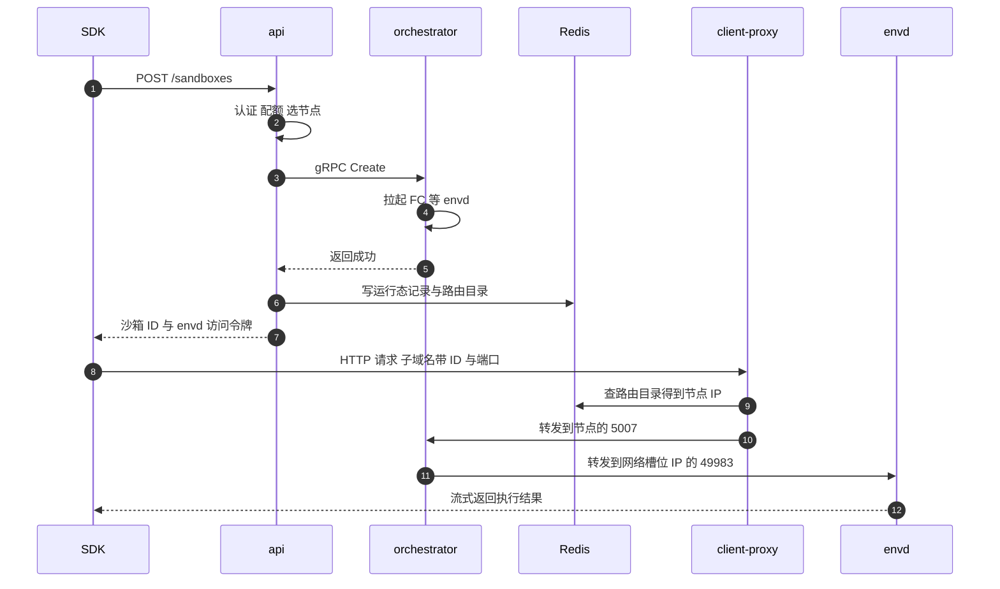
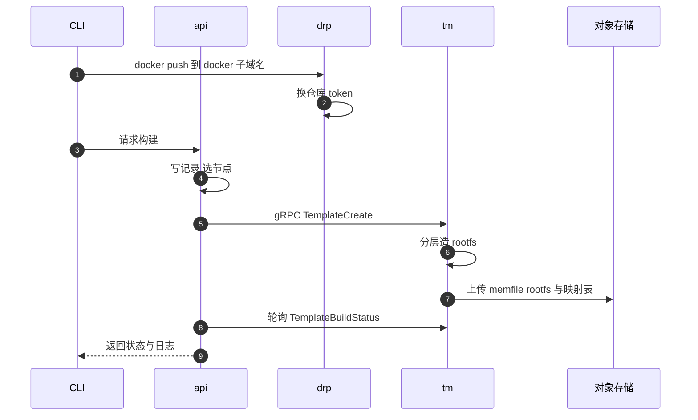

# 10 · 系统架构：组件、进程、端口与数据流

> 这一篇是全书的地图。它回答「一共有几个进程、它们各自守着哪个端口、谁调谁、请求沿着什么路径走完一次沙箱创建」，
> 后面各部分会反复回到这张图上，说明自己讲的那一块在哪里。
>
> **读者**：所有读者；工程师必读。　**预备**：[第 09 篇 §3](09-nomad-consul-terraform.md#3-e2b-怎么用-nomad)（知道 job、node pool、服务注册是什么）。
> **代码**：`packages/shared/pkg/consts/`、`packages/*/main.go`、`packages/*/internal/cfg/`、
> `iac/provider-gcp/nomad/jobs/*.hcl`、`iac/modules/job-*/jobs/*.hcl`、`iac/provider-gcp/variables.tf`

---

## 0. 本篇要回答的问题

1. 上游 2026.09 一共部署几类进程？哪些是同一个二进制的不同角色？
2. 哪些通信属于控制面、哪些属于数据面？两者的失败后果有什么不同？
3. 每个进程监听哪些端口、端口号从哪里来？沙箱内部能看到宿主的哪些端口？
4. 三类节点各跑什么？为什么要把构建和运行分到不同的节点池？
5. 「创建沙箱」「在沙箱里执行命令」「构建模板」这三条路径分别经过哪些进程和存储？

---

## 1. 为什么不是一个进程

先看这个系统要同时满足的几件事，它们彼此冲突：

- **对外是一个多租户的 REST API**：要认证、要限流、要查配额、要写数据库，逻辑重、状态在 PostgreSQL 里。
- **对内是一堆 microVM 的宿主管理器**：要开 KVM、挂 NBD 设备、注册 userfaultfd、建 netns。
  这些操作要求 root、要求特定内核特性，而且一台机器上的沙箱数量决定了这台机器的内存与 CPU 是否够用。
- **沙箱里的 HTTP 流量要能从公网直达**：一个沙箱可能在任意一台节点上，而且随时可能被暂停、被恢复到另一台节点。
- **模板构建是长任务**：一次构建要跑 Docker 拉取、rootfs 组装、启动一台一次性沙箱执行安装命令，
  可能持续几分钟到几十分钟，期间占满一台机器的磁盘与 CPU。

把这些放进一个进程，意味着 API 的一次滚动升级会杀掉所有正在运行的沙箱，
也意味着一次失控的模板构建会把承载线上沙箱的机器拖垮。上游 2026.09 的拆分正是沿着这几条边界切的：
**无状态的租户逻辑**（api）、**有状态的宿主运行时**（orchestrator）、**长任务的构建器**（template-manager）、
**只做转发的流量层**（client-proxy）、**沙箱内的代理**（envd）。

代价是引入了跨进程边界：一次创建沙箱要经过至少两跳 RPC，一次沙箱内的命令要经过三跳代理，
每一跳都要处理超时、重试与鉴权。本篇后面的端口表与时序图，讲的就是这些边界的具体形状。

---

## 2. 进程清单

下表按「谁写的」分成两类：`packages/` 下的 Go 进程，和作为依赖部署的第三方进程。

| 进程 | 代码 | 职责 | 部署形态 |
|---|---|---|---|
| api | `packages/api/main.go` | 对外 REST API：认证、配额、模板与沙箱的增删改查、节点放置 | api 节点池，多实例 |
| orchestrator | `packages/orchestrator/main.go` | 宿主侧沙箱运行时：拉起 / 暂停 / 销毁 Firecracker、内存与磁盘后端、网络槽位 | client 节点池，每节点一个 |
| template-manager | 同上（同一二进制） | 模板构建：拉镜像、造 rootfs、跑构建沙箱、上传产物 | build 节点池，每节点一个 |
| client-proxy（edge） | `packages/client-proxy/main.go` | 把 `<端口>-<沙箱 ID>.<域名>` 的 HTTP 流量转发到沙箱所在节点 | api 节点池，多实例 |
| docker-reverse-proxy | `packages/docker-reverse-proxy/main.go` | 用 e2b 的凭证换取镜像仓库 token，代理 Docker Registry 协议 | api 节点池 |
| envd | `packages/envd/main.go` | 沙箱内守护进程：执行进程、读写文件、转发用户端口 | 每个沙箱内一个 |
| dashboard-api | `packages/dashboard-api/main.go` | 控制台后端，独立于 api 的一小组只读接口 | api 节点池，默认副本数 0 |
| ingress | Traefik v3.5 镜像 | 集群入口，按 Nomad / Consul 服务标签生成路由 | api 节点池 |
| otel-collector | `packages/otel-collector/` 的配置 | 收集各进程的 trace 与 metric | system job，所有节点 |
| logs-collector | Vector 镜像 | 收集日志并写入 Loki | system job，所有节点 |

第三方有状态组件：PostgreSQL（元数据）、Redis（沙箱运行态与路由目录）、ClickHouse（指标与事件）、
Loki（日志）、对象存储（模板与快照产物）。它们的分工在[第 13 篇 §1](13-storage-landscape.md#1-五类存储五种约束)展开。

### 2.1 orchestrator 与 template-manager 是同一个二进制

这一点容易误解，值得单独说。`packages/orchestrator/Makefile` 的 `upload/template-manager`
把编译出来的 `./bin/orchestrator` 原样上传成对象存储里名为 `template-manager` 的文件；
两个 Nomad job 拉的是同一份代码，靠环境变量 `ORCHESTRATOR_SERVICES` 区分角色。

`packages/orchestrator/internal/cfg/service.go` 的 `GetServices()` 把这个变量解析成
`orchestrator` 与 `template-manager` 两种服务类型（默认只有 `orchestrator`）。
`main.go` 里只有 `slices.Contains(services, cfg.TemplateManager)` 为真时才会构造 `tmplserver.New()`
并注册 `TemplateService` 这个 gRPC 服务；而沙箱代理、网络池、NBD 设备池、模板缓存这些是无条件启动的
—— 因为构建过程本身也要启动一台沙箱来执行安装命令。

这个设计的收益是构建器天然复用了运行时的全部能力（同样的 Firecracker 启动路径、同样的块设备层），
代价是 build 节点上跑着一份用不到的沙箱服务端代码，且两者的配置项混在同一个 `cfg.Config` 里。

### 2.2 client-proxy 在 2026.09 的形态

`packages/client-proxy/internal/` 下只有 `cfg`、`info.go`、`proxy` 三项：这个进程在 2026.09
是一个纯粹的反向代理，不再自带 HTTP 服务端。它做三件事：从请求里解析出沙箱 ID 与端口、
查路由目录拿到沙箱所在节点的 IP、把请求转发到该节点的 5007 端口。

`spec/openapi-edge.yml` 里定义的那套 edge 接口（`/v1/service-discovery`、`/v1/sandboxes/{id}/logs` 等）
在上游 2026.09 里**只有客户端实现**：`packages/shared/pkg/http/edge/generated.go` 由该 spec 生成，
被 `packages/api/internal/clusters/` 用来访问**远端集群**的 edge。本仓库内没有实现这套接口的服务端。
这是查阅[第 56 篇 §1](56-edge-api.md#1-一个刻意留下的缺口)时要留意的口径。

---

## 3. 控制面与数据面

把通信按「出错时谁受影响」分成两类，比按协议分更有用。

**控制面**决定沙箱的存在与归属，参与者是 api、orchestrator、template-manager，
载体是 gRPC（`packages/shared/pkg/grpc/`）：

- `SandboxService`：`Create`、`Update`、`List`、`Delete`、`Pause`、`Checkpoint`、`ListCachedBuilds`
  （`packages/orchestrator/orchestrator.proto`）
- `InfoService`：`ServiceInfo`、`ServiceStatusOverride`（`info.proto`），api 靠它轮询节点健康与容量
- `TemplateService`：`TemplateCreate`、`TemplateBuildStatus`、`TemplateBuildDelete`、`InitLayerFileUpload`
  （`template-manager.proto`）
- `VolumeService`：持久卷的创建与删除（`orchestrator.proto`）

控制面中断时，已经跑起来的沙箱**不会停**：Firecracker 进程与 envd 仍在，用户流量仍能到达。
受影响的是创建、暂停、续期与到期回收。

**数据面**是用户流量本身：SDK 或浏览器 → 外部负载均衡 → ingress → client-proxy → orchestrator 的沙箱代理 → envd。
全程是 HTTP，没有 gRPC。数据面中断时沙箱还活着但「打不开」。

两者有一处交叉：client-proxy 在路由目录里找不到沙箱时，会通过 gRPC 调 api 的
`proxygrpc.SandboxService.ResumeSandbox`（`packages/shared/pkg/grpc/proxy/proxy.proto`），
让一个暂停的沙箱在流量到达时被恢复。这条路径由特性开关 `SandboxAutoResumeFlag` 控制，
未配置 `API_GRPC_ADDRESS` 时直接禁用（`packages/client-proxy/internal/proxy/proxy.go` 的 `handlePausedSandbox`）。

下图是全系统结构，本书后面各篇都可以在这张图上定位自己。



有状态组件不画在图里，它们与上面各进程的对应关系是：

| 进程 | 依赖的有状态组件 |
|---|---|
| api | PostgreSQL、Redis、ClickHouse、Loki |
| client-proxy | Redis（路由目录） |
| orchestrator | ClickHouse、对象存储 |
| template-manager | 对象存储 |
| dashboard-api | PostgreSQL |

图中一条边都不是双向的：控制面永远是 api 主动发起，orchestrator 从不回调 api。
节点状态是被轮询出来的，不是被推送的 —— 这一点决定了节点故障的发现延迟，见
[第 19 篇 §2.4](19-node-management-and-placement.md#24-状态三个来源合成一个答案)。

---

## 4. 端口表

端口号有三个来源，优先级从低到高：Go 代码里的 `envDefault`、Terraform 变量、Nomad job 注入的环境变量。
下表给出上游 2026.09 在 GCP 上的实际取值，以及它在代码里的名字。

| 端口 | 进程 | 用途 | 定义位置 |
|---|---|---|---|
| 50001 | api | 对外 REST API 与 `/health` | `iac/provider-gcp/variables.tf` 的 `api_port`；代码默认 80，由 `--port` 覆盖 |
| 5009 | api | gRPC，仅供 client-proxy 调 `ResumeSandbox` | `API_GRPC_PORT`，`packages/api/internal/cfg` |
| 5008 | orchestrator | gRPC 与 HTTP `/health` 复用同一端口 | `GRPC_PORT`；`packages/shared/pkg/consts/sandboxes.go` 的 `OrchestratorAPIPort` |
| 5007 | orchestrator | 沙箱 HTTP 流量的反向代理入口 | `PROXY_PORT`，`packages/orchestrator/internal/cfg/model.go` |
| 5010 | orchestrator | hyperloop：沙箱内向宿主发起的 `/me` 与 `/logs` | `SANDBOX_HYPERLOOP_PROXY_PORT`，`internal/sandbox/network/pool.go` |
| 5011 | orchestrator | NFS 代理，仅在配置了持久卷时监听 | `SANDBOX_NFS_PROXY_PORT` |
| 5012 | orchestrator | portmapper，配合上面的 NFS 代理 | `SANDBOX_PORTMAPPER_PORT` |
| 5016 / 5017 / 5018 | orchestrator | 沙箱出口 TCP 防火墙的 HTTP / TLS / 其它三个入口 | `SANDBOX_TCP_FIREWALL_*_PORT` |
| 5008 | template-manager | gRPC，与 orchestrator 同号但在不同节点池 | `iac/provider-gcp/variables.tf` 的 `template_manager_port` |
| 3002 | client-proxy | 沙箱流量入口 | `PROXY_PORT`；GCP 用 `client_proxy_port` |
| 3001 | client-proxy | 健康检查 | `HEALTH_PORT`；代码默认 3003，GCP 用 `client_proxy_health_port` |
| 5000 | docker-reverse-proxy | Docker Registry 协议 | `docker_reverse_proxy_port`；代码 `--port` 默认 5000 |
| 3010 | dashboard-api | REST | `PORT`，`packages/dashboard-api/internal/cfg/model.go` |
| 49983 | envd | 沙箱内的 HTTP 与 Connect-RPC | `packages/shared/pkg/consts/envd.go` 的 `DefaultEnvdServerPort` |
| 8800 / 8900 | ingress | Traefik 的 web 入口与控制面 | `ingress_port`、`ingress_control_port` |
| 4646 / 8600 | Nomad / Consul | 调度 API 与本机 DNS | `nomad_port`；`start-client.sh` 把 8600 设为唯一 DNS |
| 6379 / 3100 | Redis / Loki | 运行态存储 / 日志查询 | `redis_port`、`loki_service_port` |
| 9000 / 8123 | ClickHouse | 原生协议 / HTTP 健康检查 | `clickhouse_server_service_port`、`clickhouse_health_port` |
| 4317 / 4318 / 13133 / 8888 | otel-collector | OTLP gRPC / OTLP HTTP / 健康 / 自身指标 | `iac/modules/job-otel-collector/jobs/otel-collector.hcl` |
| 30006 / 44313 | logs-collector | Vector 的日志接收 / 健康 | `logs_proxy_port`、`logs_health_proxy_port` |

有三处值得单独说明。

**orchestrator 的 5008 同时承载 gRPC 和 HTTP。** `main.go` 用 `cmux` 在一个 TCP 监听上分流：
`cmuxServer.Match(cmux.HTTP1Fast())` 拿走 HTTP/1 请求交给健康检查处理器，
`cmuxServer.Match(cmux.Any())` 把其余流量交给 gRPC 服务端。这样 Nomad 的 HTTP 健康检查和 api 的 gRPC
调用共用一个静态端口，节点上少开一个口子。

**5010 至 5018 是给沙箱看的，不是给集群看的。** 这些端口监听在宿主上，但沙箱通过网络槽位里的
`SANDBOX_ORCHESTRATOR_IP`（默认 `192.0.2.1`，一个文档保留地址）访问它们，
集群里的其它节点访问不到。细节在[第 35 篇 §2](35-sandbox-networking.md#2-建立一个槽位createnetwork-的完整步骤)。

**client-proxy 的健康端口在代码与 Terraform 里不一致。** 代码默认 3003，
GCP 部署把 `HEALTH_PORT` 设成 Nomad 分配的 3001。以部署为准，代码默认值只在本地开发时生效。

---

## 5. 三类节点

Nomad 的 node pool 把机器分成互不干扰的几组。与沙箱有关的是三类：

| 节点池 | Terraform 变量 | 跑什么 | 关键约束 |
|---|---|---|---|
| api | `api_node_pool`，默认 `api` | api、client-proxy、ingress、docker-reverse-proxy、dashboard-api、Redis、Loki | 无状态，可滚动升级；`distinct_hosts` 保证多实例不同机 |
| build | `build_node_pool` | template-manager | 需要 KVM 与大页；一节点一实例 |
| client | `orchestrator_node_pool`，默认 `default` | orchestrator | 需要 KVM、大页、NBD；`type = "system"`，每节点必有一个 |

另外还有 Nomad server 节点池（`nodepool-control-server.tf`）与可选的 ClickHouse、Loki 专用池。

**为什么构建与运行要分池。** 一次模板构建会拉取镜像、写几 GiB 的 rootfs、跑一台一次性沙箱，
磁盘 I/O 与页缓存的抖动会直接影响同机上其它沙箱的缺页延迟。分池之后，构建的抖动被限制在 build 节点内。
代价是两类机器不能互相借用容量：构建高峰期 client 节点的空闲 CPU 帮不上忙。
上游用 Nomad autoscaler 加 `nomad-nodepool-apm` 插件让 template-manager 的实例数跟随 build 池的节点数
（`iac/provider-gcp/nomad/jobs/template-manager.hcl` 的 `scaling` 块）来缓解这一点。

**client 节点池的 job 是 system 类型。** `iac/modules/job-orchestrator/jobs/orchestrator.hcl`
的 job 块开头就写着 `type = "system"`：新节点一加入就自动跑上 orchestrator，不需要调度决策。
这与 orchestrator 的角色一致 —— 它不是「一个可以被调度到任意机器的任务」，而是「这台机器的沙箱管理器」。

**jobspec 文件分在两处。** 上游 2026.09 里大多数 job 已经迁进 `iac/modules/job-<名字>/jobs/`：
orchestrator、client-proxy、ingress、dashboard-api、otel-collector（含 Nomad server 那一份）、
logs-collector、Loki、ClickHouse 都在这里，每个模块自带 Terraform 变量与 jobspec。
留在 `iac/provider-gcp/nomad/jobs/` 的只剩六份：`api.hcl`、`redis.hcl`、`docker-reverse-proxy.hcl`、
`template-manager.hcl`、`nomad-autoscaler.hcl`、`clean-nfs-cache.hcl`。
读 job 文件时先确认路径，否则会找错版本。逐份解读见[第 64 篇 · Nomad 作业](64-nomad-jobs.md#1-jobspec-是怎么被投递的)。

**节点上必须预置什么。** orchestrator 的配置默认值给出了一份清单
（`packages/orchestrator/internal/cfg/model.go` 的 `BuilderConfig`）：
`/fc-versions` 放各版本 Firecracker 二进制，`/fc-kernels` 放各版本 guest 内核，
`/fc-envd/envd` 是待注入沙箱的 envd 二进制，`/orchestrator` 是缓存与构建的根目录，
`/fc-vm` 放每个沙箱的运行目录。这些路径由机器镜像与启动脚本准备
（`iac/provider-gcp/nomad-cluster/scripts/start-client.sh`），不是由 Nomad job 分发的。
换句话说，orchestrator 不是一个「可以在任意 Linux 上跑起来」的容器，它对宿主环境有硬性假设，
这也是[第 82 篇 · 宿主内核要求与调优](82-host-kernel-nbd-hugepages.md#1-宿主是一个配置项)要处理的问题来源。

**api 如何找到节点。** `packages/api/internal/orchestrator/client.go` 的 `listNomadNodes()`
直接问 Nomad 要节点列表，过滤条件写死为 `Status == "ready" and NodePool == "default"`，
再用 `n.Address` 加上 `consts.OrchestratorAPIPort` 拼出 gRPC 地址。
build 节点走另一条路：`packages/api/internal/clusters/discovery/local.go` 通过 Nomad 的
allocation 列表筛出 template-manager。两条发现路径并存是历史原因，代码注释里写明了这一点。

---

## 6. 三条典型路径

下面三条路径只画骨架，每一步的细节分别在第 12、41 篇及各自的专题篇。

### 6.1 创建沙箱并在其中执行命令



几个可追溯的落点：

- 域名形式由 `packages/shared/pkg/proxy/host.go` 的 `parseHost()` 决定：
  取最左侧子域，按 `-` 分割，第一段是端口，第二段是沙箱 ID。本地开发时还支持
  `E2b-Sandbox-Id` 与 `E2b-Sandbox-Port` 两个请求头（`parseHeaders()`）。
- 路由目录是 `packages/shared/pkg/sandbox-catalog/`，只有 api 写入（`internal/orchestrator/lifecycle.go`
  的 `StoreSandbox`），client-proxy 只读。记录里带 `OrchestratorIP` 与过期时间。
- client-proxy 把目标写死为 `nodeIP:5007`（`internal/proxy/proxy.go` 里的常量 `orchestratorProxyPort`），
  并不从目录里读端口。
- orchestrator 侧再解析一次同样的域名，把请求送到 `sbx.Slot.HostIPString():port`；
  当目标端口不是 49983 时，还会校验 `e2b-traffic-access-token` 请求头
  （`packages/orchestrator/internal/proxy/proxy.go`）。envd 端口跳过这一步，因为 envd 自己有鉴权。

三跳代理各自的重试策略不同：client-proxy 用 `ClientProxyRetries`，orchestrator 用 `SandboxProxyRetries`，
后者更大，注释说明是为了吸收沙箱内端口转发的建立延迟。

**为什么要两层代理而不是一层。** 一个自然的疑问是：既然域名里已经带了沙箱 ID，
为什么不让 client-proxy 直接连到沙箱的 tap 设备地址？原因是沙箱的地址属于宿主上的一个 netns，
在集群网络里不可路由；只有 orchestrator 知道某个沙箱当前占用哪个网络槽位，
而槽位在沙箱暂停与恢复之间会变。两层的分工是：client-proxy 解决「在哪台机器上」，
用一份可以跨实例共享的 Redis 目录；orchestrator 解决「在这台机器的哪个槽位上」，
用进程内的 `sandbox.Map`。代价是每个请求多一次转发与一次连接池查找，
收益是恢复一个沙箱到另一台节点时，只需要更新 Redis 里的一条记录。

### 6.2 构建模板

下图里 `drp` 是 docker-reverse-proxy，`tm` 是 template-manager。



docker-reverse-proxy 的存在原因很具体：用户手里只有 e2b 的 access token，没有 GCP Artifact Registry
或 AWS ECR 的凭证。`packages/docker-reverse-proxy/main.go` 拦下 Registry 协议里的
`/v2/token` 与 `/v2/`，用 e2b 的凭证校验身份，再用服务账号换取真正的仓库 token，
之后的 blob 上传直接透传。它是数据面上唯一一个与沙箱无关的进程。

构建的产物是一组对象存储里的文件，随后被 orchestrator 当作快照拉起 —— 这就把两条路径接了起来。
细节见[第 41 篇 §4](41-template-build-overview.md#4-主流程)。

### 6.3 外部流量如何进来

GCP 的 URL map（`iac/provider-gcp/nomad-cluster/network/main.tf` 的 `orch_map`）按主机名分流：

```text
api.<domain>     → api 后端服务
docker.<domain>  → docker-reverse-proxy 后端服务
nomad.<domain>   → Nomad 后端服务
*.<domain>       → session 后端服务，即 client-proxy
```

通配符规则在最后，承接所有沙箱子域名。集群内部还有一层 Traefik：
client-proxy 的 Nomad 服务标签把自己注册成 `PathPrefix("/")` 且优先级 100 的兜底路由
（`iac/modules/job-client-proxy/jobs/client-proxy.hcl`），其它服务用更具体的规则抢在它前面。

---

## 7. 依赖方向与故障域

把上面的边整理成依赖方向，可以读出几条运维上的结论：

- **api 依赖 PostgreSQL 与 Redis，orchestrator 不依赖 PostgreSQL。** orchestrator 的配置里
  根本没有 `POSTGRES_CONNECTION_STRING`（对比 `packages/orchestrator/internal/cfg/model.go` 与
  `packages/api/internal/cfg`）。数据库故障时沙箱继续运行，只是没法创建新的。
- **orchestrator 依赖对象存储。** 拉起一个沙箱要按需读取快照的分片，
  对象存储不可用时**已运行的沙箱也可能卡住** —— 因为缺页要从远端取数据。这是数据面上最深的依赖。
- **client-proxy 依赖 Redis。** Redis 不可用时它退化为内存目录
  （`main.go` 里 `factories.ErrRedisDisabled` 分支），只在单实例部署下能工作。
- **envd 不依赖集群里的任何东西。** 它只在沙箱内监听，唯一的出站方向是 hyperloop
  （`192.0.2.1:5010`）与日志。这保证了沙箱内的执行不会因为控制面抖动而中断。

一个反直觉的推论：**杀掉 api 的所有实例，正在跑的沙箱仍然可用**，包括通过公网访问 —— 因为
client-proxy 只读 Redis，不问 api。代价是沙箱的超时不会被续期也不会被回收，
到期逻辑在 api 的 `internal/orchestrator/lifecycle.go` 里。

退出顺序也体现了同样的分层。orchestrator 收到 `SIGTERM` 后不会立刻关闭，
而是先把自己的状态置为 `Draining` 并等待 15 秒让这个状态传播到所有 api 实例，
再逐个关闭内部服务（`packages/orchestrator/main.go` 的 drain 阶段）。
api 也有对称的做法：健康检查先开始返回 503，等 15 秒后才真正关闭 HTTP 服务，
让负载均衡把流量摘走。两处的 15 秒都是硬编码常量，且都在 `env.IsLocal()` 为真时跳过。
这类「等待状态传播」的等待时间是轮询式服务发现的必然成本 —— 没有推送通道，就只能等一个轮询周期。

---

## 8. ARM 适配版的差异

ARM 适配版的进程清单与端口分配基本沿用上游，改动集中在三处。

其一是**服务发现多了一条路径**：`packages/api/internal/orchestrator/discovery.go` 新增
`NodeDiscovery` 接口，把原来写死的 Nomad 查询抽成实现之一，另一个实现
`k8s_discovery.go` 按标签 `node-role.kubernetes.io/sandbox=true` 列出 Kubernetes 节点，
端口仍取 `consts.OrchestratorAPIPort`。见[第 76 篇 §4](76-k8s-discovery.md#4-第二层api-里的-nodediscovery)。

其二是**对象存储多了 MinIO 后端**（`packages/shared/pkg/storage/storage_minio.go`），
用于离线环境下替代 GCS，见[第 75 篇 §5](75-minio-storage.md#5-把默认-provider-改成-minio)。

其三是**部署形态**：新增 `helm/` 下的 Kubernetes 清单，以及一套用环境变量渲染的 Nomad job
（`iac/provider-gcp/nomad/jobs/env.template` 加同目录下十余份 `*.hcl`，含上游只在
`iac/modules/job-orchestrator/jobs/` 里有的 `orchestrator.hcl`）。两套 jobspec 并存，
`deploy.sh` 用 `envsubst` 渲染的是新增的那套。它把端口集中成一组 `export`，
其中 api 的 HTTP 端口取 3000 而非上游 GCP 的 50001，client-proxy 的健康端口取代码默认的 3003。
见[第 78 篇 · Helm 与 Kubernetes 部署](78-helm-k8s-deployment.md#3-逐份读模板)、
[第 79 篇 · 部署形态二：Nomad 多节点](79-nomad-multinode-deployment.md#3-渲染层从-templatefile-换成-envsubst)
与[第 80 篇 · 单机 RPM](80-single-node-rpm.md#4-opte2b-infra-与三层叠加)。

---

## 9. 小结

- 上游 2026.09 部署六个自研 Go 进程（api、orchestrator、template-manager、client-proxy、
  docker-reverse-proxy、envd）加 dashboard-api，其中 orchestrator 与 template-manager 是同一个二进制，
  靠 `ORCHESTRATOR_SERVICES` 区分角色。
- 控制面是 api 单向发起的 gRPC，数据面是经过 ingress、client-proxy、orchestrator 三层转发的 HTTP。控制面故障不影响已有沙箱，
  对象存储故障会影响已有沙箱。
- orchestrator 用 cmux 让 gRPC 与健康检查共用 5008；5007 是沙箱流量入口；
  5010 至 5018 只对沙箱内部可见。
- 三类节点按「无状态服务 / 构建 / 运行」划分，构建与运行分池是为了隔离 I/O 抖动，
  代价是容量不能互借。
- 沙箱的寻址完全编码在域名里：`<端口>-<沙箱 ID>.<域名>`，由 `parseHost()` 解析，
  路由目录由 api 写、client-proxy 读。
- 上游 2026.09 仓库内没有 edge HTTP 接口的服务端实现，只有供 api 访问远端集群的客户端。

## 延伸阅读 / 下一篇

- [第 11 篇 · 对象模型与状态机](11-object-model.md#1-问题四份表示一个真相)：本篇讲进程，下一篇讲这些进程操作的对象。
- [第 12 篇 · 端到端走查：一个沙箱的一生](12-sandbox-lifecycle-walkthrough.md#1-走查的边界)：把 §6.1 的骨架填满。
- [第 13 篇 · 存储全景](13-storage-landscape.md#2-进程--存储读写矩阵)：本篇图里「有状态组件」那一块的展开。
- [第 14 篇 · 配置、特性开关与版本约定](14-config-flags-versions.md#1-配置的四条渠道)：端口之外的其余配置项。
- [第 64 篇 · Nomad 作业](64-nomad-jobs.md#7-job--节点池--端口)：本篇引用的 job 文件逐个讲。
- [第 91 篇 · 端口、路径与存储键总表](91-ports-paths-keys.md#1-进程端口)：本篇端口表的完整版本。
