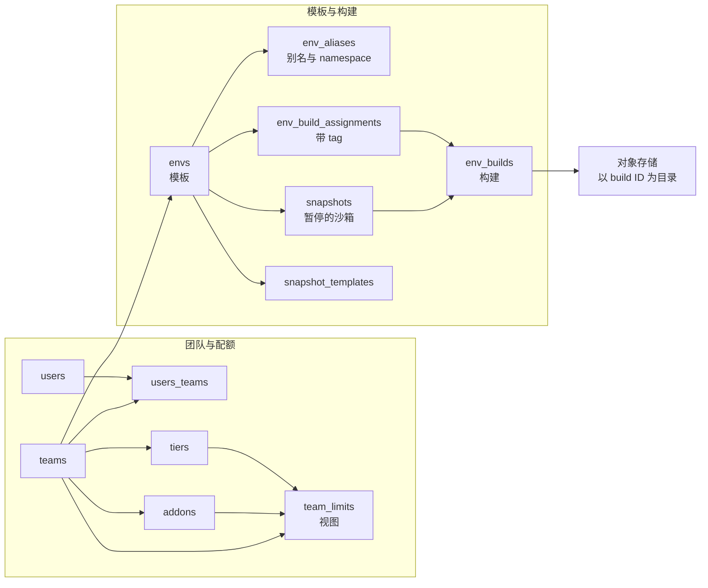
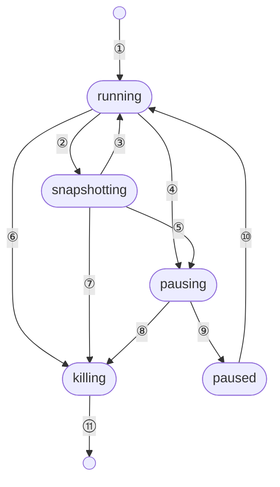
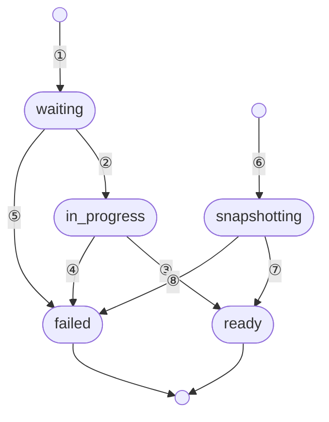

# 11 · 对象模型与状态机

> e2b 里的「一个沙箱」不是一个对象，而是同一件事在四个地方的四种表示：api 进程的内存或 Redis
> 里的一条记录、orchestrator 进程里的一个 Go 结构、Redis 路由目录里的一行、以及 Postgres 里
> 一条只有暂停后才出现的 snapshot 行。本篇把这些表示、它们的标识符、以及沙箱与构建两套状态机
> 讲清楚，作为后面各篇的对照表。
>
> **读者**：工程师。　**预备**：[第 10 篇 §2](10-system-architecture.md#2-进程清单)。
> **代码**：`packages/db/migrations/`、`packages/db/queries/`、`packages/shared/pkg/id/`、
> `packages/api/internal/sandbox/`、`packages/shared/pkg/sandbox-catalog/`、
> `packages/orchestrator/internal/sandbox/sandbox.go`、`packages/orchestrator/orchestrator.proto`

---

## 0. 本篇要回答的问题

1. Postgres 里有哪些对象？为什么**没有**「沙箱表」，只有快照表？
2. 沙箱 ID、模板 ID、构建 ID、执行 ID 各是什么形态，由谁生成，能不能重复？
3. 一个正在运行的沙箱，在 api、orchestrator、Redis 里分别长什么样？谁是权威？
4. 沙箱有哪几个状态？为什么 `paused` 不在状态枚举里？暂停与超时是怎么触发的？
5. 构建为什么在数据库里有七个状态、对外只有四个？快照的构建与模板的构建共用什么？
6. 节点的 `ready / draining / unhealthy` 从哪里来，谁决定？

---

## 1. 问题：四份表示，一个真相

设想一个最普通的请求序列：SDK 创建一个沙箱、二十秒后调 `POST /sandboxes/{id}/pause`、
一小时后再 `resume`。这个过程中，「这个沙箱」这件事被写进了至少四个地方：api 要知道它属于哪个
团队、还有多久超时，才能计费与驱逐；orchestrator 要持有 Firecracker 进程、网络槽位、
内存后端这些真正的资源；client-proxy 要知道它在哪台机器上，才能把 SDK 的 HTTP 请求转过去；
而暂停之后，它必须在一个**进程重启也不会丢**的地方留下痕迹，否则一小时后无从恢复。

四个地方的生命周期、可靠性要求、写入者都不一样。把它们当成一个对象来想，会在两类问题上出错：
一类是「沙箱明明还在跑，为什么 api 说找不到」，另一类是「暂停失败了，状态卡在哪一边」。
本篇的做法是先把静态对象（Postgres 的表）摆清楚，再把动态表示逐个对上，最后讲两套状态机。

## 2. Postgres 里的对象

`packages/db/migrations/` 下有八十多个 goose 迁移，累积出的表可以从 sqlc 生成的
`packages/db/queries/models.go` 一次看全。按用途分成三组。

### 2.1 租户侧

`auth.users`（Supabase 的用户表）与 `public.users` 是身份；`teams` 是租户单位，
每个团队有一个 `tier`（档位）外键；`users_teams` 是多对多成员关系，带 `is_default` 标记默认团队。
`team_api_keys` 与 `access_tokens` 是两类凭据，2026.09 的表里只存哈希与前后缀
（`api_key_hash`、`api_key_prefix`，见迁移 `20250606204750_optimize_hashed_key_schema.sql`
与 `20250910124212_remove_raw_keys.sql` 一系列），明文列已删除。

配额不是直接读 `tiers`。迁移 `20251011200438_create_addons_table.sql` 引入了 `addons` 表与
一个名为 `team_limits` 的**视图**：视图把团队档位的基线值，加上该团队当前生效
（`valid_from <= now()` 且 `valid_to` 为空或未到）的所有 addon 的增量，得到
`concurrent_sandboxes`、`concurrent_template_builds`、`max_vcpu`、`max_ram_mb`、`disk_mb`、
`max_length_hours` 六个数。api 侧读到的 `Limits` 就是这个视图的一行。
这样「给某个团队临时加并发」不需要新建档位。

### 2.2 模板与构建

这一组的命名有历史包袱：**模板在数据库里叫 `envs`**，构建叫 `env_builds`。

- `envs`：模板本身。主键是文本 ID，带 `team_id`、`public`、`spawn_count`、`last_spawned_at`，
  以及 2026 年新增的 `source` 列（`template` / `snapshot` / `snapshot_template`，见
  `20260210120001_add_env_and_build_source_columns.sql`）。
- `env_builds`：一次构建的产物描述 —— vCPU、内存、磁盘、`kernel_version`、
  `firecracker_version`、`envd_version`，以及 `status`。构建 ID 是 UUID，也是**对象存储的键**
  （`packages/shared/pkg/storage/template.go` 的 `StorageDir()` 直接返回 `BuildID`）。
- `env_build_assignments`：模板与构建之间的多对多边，带 `tag`。这是
  `20251218160000_allow_m_n_builds_with_tags.sql` 引入的：在此之前 `envs` 有一个 `build_id` 列，
  一个模板只指向一个构建；之后一个模板可以同时有 `default`、`v2` 等多个 tag，各指向不同构建。
- `env_aliases`：模板的人类可读名字，带 `namespace` 列（团队 slug，见
  `20260121175430_add_env_aliases_namespace.sql`）。老数据的 `namespace` 为空，靠回退逻辑查找。
- `snapshots`：**暂停产生的对象**。一行对应一个 `sandbox_id`（有唯一约束），记录它属于哪个
  `env_id`（为这次暂停新建的模板）、`base_env_id`（最初从哪个模板起的）、
  `origin_node_id`（在哪台机器上暂停的）、`auto_pause`、以及一个 JSONB 的 `config`
  （`packages/db/pkg/types/types.go` 的 `PausedSandboxConfig`：网络配置、auto-resume 策略、卷挂载）。
- `snapshot_templates`：把某次快照固化成一个可以反复拉起的模板，记录它源自哪个沙箱
  （`20260211120000_add_snapshot_templates.sql`）。

### 2.3 集群与卷

`clusters` 记录远端集群的 endpoint、token 与 `sandbox_proxy_domain`；`teams.cluster_id`
与 `envs.cluster_id` 把团队和模板绑到集群。

`volumes` 是 2026 年新增的持久卷对象（迁移 `20260204185039_volumes.sql`），只有五列：
`id`（UUID 主键）、`team_id`（外键指向 `teams`）、`name`、`volume_type`、`created_at`，
并且有一条 `UNIQUE (team_id, name)` 约束 —— 也就是说卷在一个团队内以名字唯一，
但它自己另有一个 UUID 主键。这两个「名字」在下游被分别使用：
`VolumeService` 用 `<teamID>/<volumeID>` 组成对象存储前缀，
而 orchestrator 的 NFS 代理（`packages/orchestrator/internal/nfsproxy/proxy.go`）
用的是 `<teamID>/<volumeName>`。两条路径指向不同的前缀，后果见
[第 40 篇 §8](40-volumes-and-nfsproxy.md#8-一处名字与-id-的不一致)。
表里没有「卷挂载到哪台沙箱」的记录：挂载关系只存在于沙箱的运行态配置里，随沙箱消失。

### 2.4 没有沙箱表

`models.go` 里没有任何 `Sandbox` 类型。**正在运行的沙箱不进 Postgres**：
它只存在于 api 的存储后端、orchestrator 的进程内存和 Redis 路由目录里。
Postgres 只在沙箱被暂停时留下一行 `snapshots` 和一行 `env_builds`。
这个选择的收益是创建沙箱的路径上没有数据库写；代价是 api 进程重启后必须
向各节点 `List` 一遍才能重建自己的视图（`packages/api/internal/orchestrator/nodemanager/sandboxes.go`
的 `GetSandboxes()`），以及沙箱历史只能从事件流与 ClickHouse 里查，查不到「当时的沙箱表」。



## 3. 标识符

`packages/shared/pkg/id/id.go` 只有一个生成函数：

```go
var caseInsensitiveAlphabet = []byte("abcdefghijklmnopqrstuvwxyz1234567890")

func Generate() string {
	return uniuri.NewLenChars(uniuri.UUIDLen, caseInsensitiveAlphabet)
}
```

`uniuri.UUIDLen` 是 20，字母表 36 个字符，因此一个 ID 有 20 个字符、约 103 bit 熵。
调用点决定前缀：

| 标识符 | 形态 | 生成位置 |
|---|---|---|
| 沙箱 ID | `i` + 20 字符 | `packages/api/internal/handlers/sandbox_create.go` 的 `InstanceIDPrefix` |
| 构建期沙箱 ID | `b` + 20 字符 | `packages/orchestrator/internal/template/build/config/config.go` 的 `InstanceBuildPrefix` |
| 模板 ID | 20 字符，无前缀 | `template_request_build_v3.go`；暂停时由 `pause_instance.go` 生成 |
| 构建 ID | UUID | Postgres 的 `gen_random_uuid()` 或 Go 侧 `uuid.New()` |
| 执行 ID | UUID | `packages/api/internal/handlers/sandbox.go` 的 `executionID` |
| 节点 ID | 环境变量 | `packages/shared/pkg/env/env.go` 的 `GetNodeID()`，读 `NODE_ID` |

三个容易混淆的标识符值得单独说。

**执行 ID（execution ID）** 标识沙箱的一次「运行」。同一个沙箱 ID 暂停后再恢复，
执行 ID 会换新。它的用途是防止串扰：Redis 路由目录的删除接口
（`packages/shared/pkg/sandbox-catalog/catalog_redis.go` 的 `DeleteSandbox()`）
要求调用方给出执行 ID，只有匹配时才删 —— 否则一个迟到的「杀掉旧沙箱」请求会把
刚恢复起来的新沙箱从路由表里抹掉。

**生命周期 ID（LifecycleID）** 是 orchestrator 内部的第三层标识，注释在
`packages/orchestrator/internal/sandbox/sandbox.go` 里写得很清楚：它对应**一个 Firecracker 进程**，
每次起新 VM 就换；执行 ID 跨 checkpoint 保持不变并且与 api 共享。
map 的按 ID 驱逐（`map.go` 的 `RemoveByLifecycleID()`）与 proxy 连接池用的是它。

**client ID** 在 2026.09 已经退化为一个常量。`packages/shared/pkg/consts/sandboxes.go`：

```go
// ClientID Sandbox ID client part used during migration when we are still returning client but its no longer serving its purpose,
// and we are returning it only for backward compatibility with SDK clients.
const ClientID = "6532622b"
```

也就是说 SDK 见到的 `i<20 字符>-6532622b` 里，后半段对所有沙箱都一样，不再表示「哪个客户端节点」。
api 收到带后缀的 ID 时用 `packages/api/internal/utils/split.go` 的 `ShortID()` 切掉它。
读旧文档时容易把这个组合当成路由信息，2026.09 已经不是了。

模板的名字另有一套语法。`id.ParseName()` 解析 `namespace/alias:tag`：namespace 与 alias 必须匹配
`^[a-z0-9-_]+$`，tag 允许点号且不得是一个 UUID，缺省 tag 是 `default`。
`ValidateNamespaceMatchesTeam()` 要求显式 namespace 等于团队的 slug。

## 4. 一个沙箱的四种表示

### 4.1 api：`sandbox.Sandbox` 与 `Store`

`packages/api/internal/sandbox/sandbox.go` 的 `Sandbox` 结构是一个纯数据结构，带 JSON 标签，
包含调度与计费需要的一切：团队、构建、节点、集群、起止时间、`MaxInstanceLength`、
`AutoPause`、`AutoResume`、envd 访问令牌、网络与卷配置，以及 `State`。
它由 `packages/api/internal/sandbox/store.go` 的 `Store` 管理，后端是一个接口，有三个实现：
`storage/memory`、`storage/redis`、以及过渡用的 `storage/populate_redis`（写内存同时灌 Redis）。
`SANDBOX_STORAGE_BACKEND` 只接受两个值，默认 `memory`（`packages/api/internal/cfg/model.go`，
其它取值在 `Parse()` 里直接报错）。要注意这两个值与三个实现不是一一对应的：
`packages/api/internal/orchestrator/orchestrator.go` 里 `redis` 装的是纯 Redis 后端，
而 `memory` 装的是 `populate_redis.NewStorage(memory.NewStorage(), redisStorage)` ——
读走内存，写同时打向 Redis。也就是说默认配置下 Redis 已经在被写入，只是还没有人读它。

Redis 后端的键布局在 `storage/redis/utils.go`：沙箱本体在
`sandbox:storage:{teamID}:sandboxes:sandboxID`，其中团队 ID 被花括号包住（`SameSlot()`）以保证同一团队的键落在同一个 Redis Cluster slot，
团队索引是一个 set，另有两个全局有序集合 `global:teams` 与 `global:expiration`。
后者以 `EndTime` 的毫秒值为 score，驱逐器因此可以用 `ZRANGEBYSCORE` 每轮取最多 256 个到期项，
而不必扫描全部沙箱（`storage/redis/items.go` 的 `ExpiredItems()`）。

### 4.2 orchestrator：`Sandbox` = `Resources` + `Metadata`

`packages/orchestrator/internal/sandbox/sandbox.go` 里的 `Sandbox` 嵌入两个部分。
`Resources` 是真资源：网络槽位 `*network.Slot`、rootfs provider、内存后端。
`Metadata` 是描述：`Config`（vCPU、内存、是否大页、网络、envd 元信息、Firecracker 配置、卷挂载）、
`RuntimeMetadata`（模板 ID、沙箱 ID、执行 ID、团队 ID），加上受读写锁保护的 `startedAt` 与 `endAt`。
另外它持有一个 `APIStoredConfig *orchestrator.SandboxConfig`，注释标为 deprecated，
作用是把 api 发来的原始 proto 原样存下，以便 api 重启后通过 `List` 把它读回去重建 `sandbox.Sandbox`。

orchestrator 侧**没有状态字段**。一个沙箱要么在 `sandbox.Map` 里（`map.go`），要么不在。
`Delete` 与暂停路径都是先从 map 里摘掉、再异步停机
（`packages/orchestrator/internal/server/sandboxes.go` 的 `Delete()` 与 `acquireSandboxForSnapshot()`），
理由写在代码注释里：摘掉之后就不能再路由到它了。

### 4.3 Redis：路由目录

`packages/shared/pkg/sandbox-catalog/` 是一张极小的表，键 `sandbox:catalog:{sandboxID}`，
值只有五个字段：`OrchestratorID`、`OrchestratorIP`、`ExecutionID`、`StartedAt`、
`MaxLengthInHours`。写入者是 api（`packages/api/internal/orchestrator/lifecycle.go` 的
`addSandboxToRoutingTable()`，作为 `Store.Add` 的同步回调），读取者是 client-proxy。
两个实现都在本地加了 500 ms 的 TTL 缓存，注释说明了上限的理由：缓存太久，沙箱换节点后就找不到了。

目录里查不到并不等于沙箱不存在。`packages/client-proxy/internal/proxy/proxy.go` 的
`catalogResolution()` 在 miss 时会走 `handlePausedSandbox()`：若特性开关
`SandboxAutoResumeFlag` 打开，就回头请求 api 恢复这个沙箱，成功则拿到节点 IP 继续转发。
这条路径是「暂停 → 运行」这条状态迁移的第二个触发源，完整时序见
[第 55 篇 §5](55-sandbox-catalog-and-routing.md#5-resume-on-connect让访问本身唤醒沙箱)。

### 4.4 Postgres：只有暂停后才有

前面说过，运行中的沙箱不入库。暂停时 `packages/api/internal/orchestrator/pause_instance.go`
调用 `UpsertSnapshot`（`packages/db/queries/snapshots/create_new_snapshot.sql`），
这一条 SQL 在一个语句里做四件事：为该沙箱新建一个 `envs` 行（仅当此前没有快照）、
插入或更新 `snapshots` 行、插入一个 `env_builds` 行、以及插入 `env_build_assignments` 边。
恢复时 `packages/api/internal/handlers/sandbox_resume.go` 用 `GetLastSnapshot(sandboxID)`
把这一切读回来。

| 维度 | api Store | orchestrator Map | Redis 目录 | Postgres |
|---|---|---|---|---|
| 存活期 | 沙箱运行期间 | 沙箱运行期间 | 至多 `MaxLengthInHours` | 暂停后长期 |
| 写入者 | api | orchestrator | api | api |
| 读取者 | api | orchestrator（含其沙箱代理） | client-proxy | api |
| 丢失后果 | 配额与驱逐失效，需 `List` 重建 | 沙箱失联 | 请求路由不到，触发 auto-resume | 快照无法恢复 |

## 5. 沙箱状态机

`packages/api/internal/sandbox/states.go` 是这套状态机的全部定义，只有四个状态：

```go
const (
	StateRunning      State = "running"
	StatePausing      State = "pausing"
	StateKilling      State = "killing"
	StateSnapshotting State = "snapshotting"
)

var AllowedTransitions = map[State]map[State]bool{
	StateRunning:      {StatePausing: true, StateKilling: true, StateSnapshotting: true},
	StatePausing:      {StateKilling: true},
	StateSnapshotting: {StateRunning: true, StateKilling: true, StatePausing: true},
}
```

三点值得注意。

**没有 `starting`。** 沙箱是在 orchestrator 的 `Create` 成功返回之后才被 `Store.Add` 进去的
（`packages/api/internal/orchestrator/create_instance.go`），进去时就是 `running`。
启动期间的并发控制不靠状态，而靠「预留」（`ReservationStorage.Reserve`）：
预留在放置之前占住团队并发额度，第二个针对同一沙箱 ID 的请求会拿到 `waitForStart` 等前一个的结果。

**没有 `paused`。** 暂停完成后这条记录被 `Store.Remove` 删掉，「已暂停」这个事实由
Postgres 的 `snapshots` 行表示。所以 `PostSandboxesSandboxIDPause` 在 store 里查不到沙箱时，
会转去查 `GetLastSnapshot`，查到就返回 409「已经暂停」，查不到才返回 404
（`packages/api/internal/handlers/sandbox_pause.go` 的 `pauseHandleNotRunningSandbox()`）。
对外的 OpenAPI 枚举（`packages/api/internal/api/api.gen.go` 的 `SandboxState`）只有
`running` 与 `paused` 两个值，内部的四态不暴露。

**迁移分两种效果。** `TransitionExpires` 是终态迁移（pause、kill），发起时顺手把 `EndTime`
设成当前时刻；`TransitionTransient` 是临时迁移（snapshot，即从运行中的沙箱做一个快照模板），
完成后由回调把状态恢复成 `running`。这就是为什么 `snapshotting` 在迁移表里能回到 `running`。

并发是这套机制的重点。`storage/redis/state_change.go` 的 `StartRemoving()` 先取分布式锁，
再检查一个 `transition:` 键：若已有同目标状态的迁移在跑，就等它完成并返回 `alreadyDone=true`；
若是不同目标状态，等完再重试。开始迁移时写入一个迁移 ID（TTL 70 s），
完成时把结果写进一个短 TTL 的结果键并删掉迁移键，等待方以 20 ms 轮询这两个键。
结果键的存在是为了区分「迁移成功结束」与「迁移方崩溃、键过期」—— 后者读不到结果，按成功处理。
这是一个明确的取舍：宁可漏报失败，也不让等待方永久阻塞。

超时与 auto-pause 由驱逐器串起来。`packages/api/internal/orchestrator/evictor/evict.go`
每 50 ms 取一次 `ExpiredItems()`，对每个到期沙箱按 `AutoPause` 字段选择动作 ——
真则 `StateActionPause`，假则 `StateActionKill`。`AutoPauseDefault` 是 `false`，
默认超时 `SandboxTimeoutDefault` 是 15 s。`Store.Add` 还会把 `EndTime - StartTime`
截断到团队档位的 `MaxLengthHours`。



| 编号 | 触发与动作 |
|---|---|
| ① | Create 成功后入 store |
| ② | 创建快照模板 |
| ③ | 快照完成后回调恢复 |
| ④ | pause 或超时且 auto-pause |
| ⑤ | 快照未完成即转入暂停 |
| ⑥ | kill 或超时 |
| ⑦ | 快照未完成即转入销毁 |
| ⑧ | 暂停未完成即转入销毁 |
| ⑨ | 写 snapshots 行并移出 store |
| ⑩ | resume 或 client-proxy 触发 auto-resume |
| ⑪ | 移出 store |

`paused` 不是 `State` 枚举里的值：它等于 store 中没有该沙箱，且 Postgres 中有 snapshots 行。

## 6. 构建状态机

数据库里的构建状态比对外的多。`packages/db/pkg/types/types.go` 定义了七个原始值
（`pending`、`waiting`、`building`、`snapshotting`、`uploaded`、`success`、`failed`）
和四个归一组（`pending`、`in_progress`、`ready`、`failed`）。
两者的关系由数据库触发器维护：迁移 `20260210120002_add_status_group_column.sql` 给
`env_builds` 加了 `status_group` 列和一个 `BEFORE INSERT OR UPDATE OF status` 的触发器，
把原始状态映射进组。类型注释说明了分工：写入用 `BuildStatus`，读取比较一律用 `BuildStatusGroup`。

这样设计是为了在改名期间不破坏读侧。代码里多处留着 `TODO(ENG-3469): Switch to ... once all
consumers are migrated` 的注释：`packages/api/internal/template/register_build.go` 新建构建时
仍写 `waiting` 而不是 `pending`，`template_status.go` 的 `SetFinished()` 仍写 `uploaded`
而不是 `ready`。读侧因为只看组，感觉不到差别。

模板构建的路径是：api 的 `RegisterBuild` 插入一行 `waiting`，同时把该模板同 tag 下所有
未开始的构建标记为失败（`InvalidateUnstartedTemplateBuilds`，理由写在 SQL 调用处 ——
被更新的构建取代）；`packages/api/internal/template-manager/create_template.go` 调用
template-manager 的 `TemplateCreate` 之后**才**把状态置为 `in_progress`，
注释解释了顺序的原因：先置状态的话，状态轮询任务可能早于 template-manager 的构建缓存建立而失败。
之后一个后台 goroutine 每秒轮询 `TemplateBuildStatus`，把 gRPC 的三值枚举
（`Building` / `Failed` / `Completed`，见 `template-manager.proto` 的 `TemplateBuildState`）
翻译成组：完成则调 `SetFinished()` 写 `uploaded` 与 rootfs 大小、envd 版本，失败则写 `failed` 与原因。
轮询超时同样落到 `failed`。

快照的构建走另一条路，不经过 template-manager。`pause_instance.go` 的
`buildUpsertSnapshotParams()` 直接以 `snapshotting` 状态插入 `env_builds` 行，
orchestrator 的 `Pause` 返回后再更新为 `success`。两条路最终都落在同一张表、同一个
`ready` 组，因此后续的「按 tag 找一个可用构建」逻辑对模板构建与快照构建是同一套。

对外的 `TemplateBuildStatus`（`api.gen.go`）只有 `waiting`、`building`、`ready`、`error` 四个值，
由 `packages/api/internal/handlers/template_build_status.go` 的
`getCorrespondingTemplateBuildStatus()` 从组一一映射。



| 编号 | 触发与动作 |
|---|---|
| ① | RegisterBuild 插入行 |
| ② | TemplateCreate 返回后置位 |
| ③ | SetFinished 写 uploaded |
| ④ | 构建报错或轮询超时 |
| ⑤ | 被同 tag 的新构建取代 |
| ⑥ | 暂停时 UpsertSnapshot |
| ⑦ | orchestrator Pause 返回后写 success |
| ⑧ | 暂停失败 |

## 7. 节点与集群

节点对象没有数据库行。orchestrator 自报的 `ServiceInfoResponse`
（`packages/orchestrator/info.proto`）里带 `node_id`（来自 `NODE_ID` 环境变量）、
服务版本与 commit、一个三值的 `ServiceInfoStatus`（`Healthy` / `Draining` / `Unhealthy`）、
角色列表（`TemplateBuilder` / `Orchestrator`）、机器信息与一批资源指标。

api 侧的 `api.NodeStatus` 有**四**个值，多出来的 `connecting` 不是 orchestrator 报的，
而是从 gRPC 连接状态推出来的。`packages/api/internal/orchestrator/nodemanager/status.go`
的 `Status()`：若本地记录的状态不是 `ready` 就直接返回；否则看连接，
`Shutdown` 映射为 `unhealthy`，`TransientFailure` 与 `Connecting` 都映射为 `connecting`。
反方向的 `SendStatusChange()` 用 `ApiNodeToOrchestratorStateMapper` 把管理接口设置的状态
下发给 orchestrator 的 `ServiceStatusOverride`，这是排空（drain）一台机器的手段。

节点状态直接影响放置。恢复沙箱时 `create_instance.go` 会优先选择快照所在的
`origin_node_id`，但只在该节点 `Status() == NodeStatusReady` 时才用它，否则退回普通放置算法。

## 8. 谁是权威

把上面几节的结论收成一条规则：

- **正在运行的沙箱**，权威在 orchestrator 的 map。api 的 store 是它的投影，可以通过 `List` 重建；
  Redis 目录是它的路由索引，允许短暂陈旧（500 ms 本地缓存）。
- **已暂停的沙箱**，权威在 Postgres 的 `snapshots` 加对象存储里以构建 ID 为目录的产物。
- **配额与档位**，权威在 Postgres 的 `team_limits` 视图；并发计数的权威在 api 的预留存储。
- **节点是否可用**，权威在 orchestrator 自报的 `ServiceInfo`，但 api 会用连接状态覆写成
  `connecting`，即以 api 的观察为准。

## 9. ARM 适配版的差异

对象模型与两套状态机在 ARM 适配版没有改动：`packages/db/`、`packages/shared/pkg/id/`、
`packages/api/internal/sandbox/states.go`、`sandbox-catalog/` 与 `orchestrator.proto` 都未被补丁触及。
唯一相关的改动在 `packages/api/internal/sandbox/sandbox_features.go`：上游的 `NewVersionInfo()`
假设 Firecracker 版本串形如 `v1.0.0-release_1234567`，直接取下划线后的 commit hash；
ARM 适配版在这里加了长度判断，允许版本串没有下划线后缀。这个假设在 aarch64 上不成立，
因为分叉 Firecracker 的构建产物版本命名不同，详见
[第 70 篇 §4](70-firecracker-fork.md#4-版本命名源码-1121装成-v1131)与
[第 77 篇 §5.2](77-api-and-flags-on-arm.md#52-为什么必须同时改-newversioninfo)。

## 10. 小结

- Postgres 存的是模板、构建、快照与租户配额；**运行中的沙箱不入库**，因此创建路径上没有数据库写。
- 模板在库里叫 `envs`；模板与构建自 2025 年底起是多对多关系，由 `env_build_assignments` 的
  `tag` 连接；别名带团队 slug 作为 namespace。
- `id.Generate()` 产出 20 字符、约 103 bit 的 ID；沙箱加前缀 `i`，构建期沙箱加前缀 `b`；
  构建 ID 是 UUID，同时是对象存储的目录名。
- client ID 已退化为常量 `6532622b`，只为 SDK 兼容保留，不含路由信息。
- 执行 ID 标识沙箱的一次运行、跨 checkpoint 保持；LifecycleID 标识一个 Firecracker 进程。
  路由目录的删除以执行 ID 为条件，防止迟到的删除误伤新一次运行。
- 沙箱状态只有 `running`、`pausing`、`killing`、`snapshotting` 四个；`paused` 是「不在 store 中
  且 Postgres 有 snapshots 行」的推论；对外只暴露 `running` 与 `paused`。
- 状态迁移分终态与临时两种效果，靠 Redis 分布式锁加迁移键实现幂等与串行化；
  结果键过期时按成功处理，宁可漏报失败也不阻塞等待方。
- 超时由驱逐器每 50 ms 扫描到期集合触发，按沙箱的 `auto_pause` 决定暂停还是杀掉。
- 构建在库里有七个原始状态，经数据库触发器归一为四组，对外映射为四个值；
  模板构建与快照构建写同一张表，最终都落到 `ready` 组。
- 节点状态由 orchestrator 自报三值，api 再依据 gRPC 连接状态补出第四个 `connecting`。

## 延伸阅读 / 下一篇

- [第 12 篇 · 端到端走查：一个沙箱的一生](12-sandbox-lifecycle-walkthrough.md#1-走查的边界)：把本篇的对象按时间轴串起来。
- [第 13 篇 §2](13-storage-landscape.md#2-进程--存储读写矩阵)：五类存储的读写矩阵与对象存储键布局。
- [第 20 篇 · 沙箱运行态存储](20-sandbox-state-storage.md#4-reservations创建期的占位)：api 侧 store、预留与驱逐器的实现细节。
- [第 26 篇 §2](26-sandbox-object.md#2-sandbox-结构四组字段)：orchestrator 侧 `Sandbox` 的资源装配。
- [第 41 篇 §4](41-template-build-overview.md#4-主流程)：构建状态机背后的实际流程。
- [第 58 篇 §2](58-postgres-schema-and-migrations.md#2-表与关系)：本篇各表的字段级说明与触发器。
