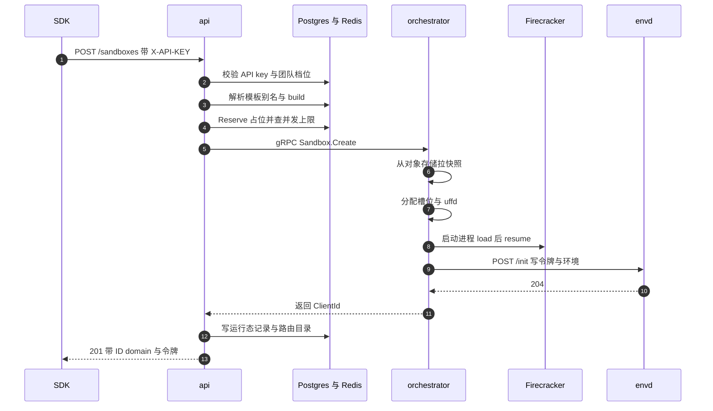
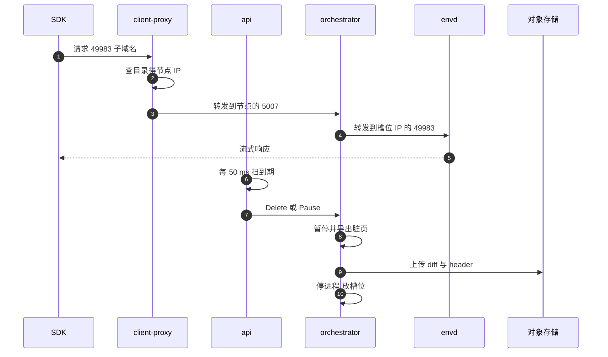
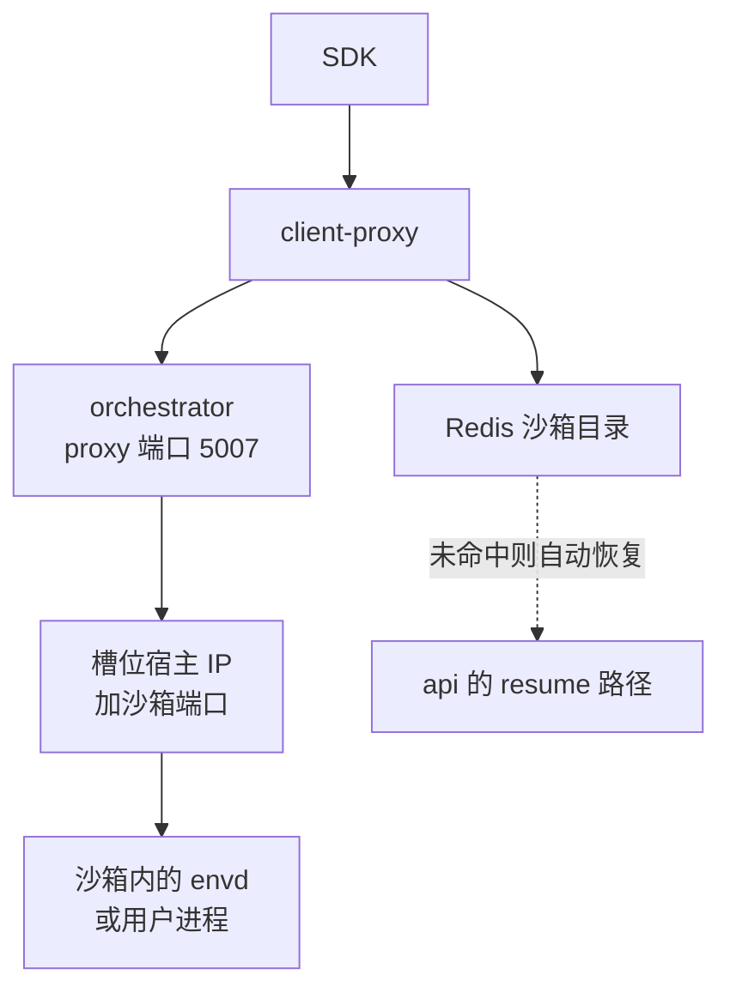

# 12 · 端到端走查：一个沙箱的一生

> 一行 `Sandbox.create()` 背后有六个进程、四类存储和两条协议。本篇把这条链路从头到尾走一遍，
> 每一步注明是谁在执行、代码在哪、动了哪些存储、留下了哪些日志，但不展开任何一个机制的内部实现 ——
> 它是全书后面七十多篇的索引。
>
> **读者**：所有工程师；第一天到岗的人可以只读本篇加[第 10 篇](10-system-architecture.md)。
> **预备**：[第 10 篇 §3](10-system-architecture.md#3-控制面与数据面)、[第 11 篇 §4](11-object-model.md#4-一个沙箱的四种表示)。
> **代码**：`packages/api/internal/handlers/sandbox_create.go`、`packages/api/internal/orchestrator/create_instance.go`、
> `packages/orchestrator/internal/server/sandboxes.go`、`packages/orchestrator/internal/sandbox/sandbox.go`、
> `packages/client-proxy/internal/proxy/proxy.go`、`packages/envd/internal/api/init.go`

---

## 0. 本篇要回答的问题

1. SDK 调 `Sandbox.create()` 时，究竟发出了几个请求？每个请求打到哪个进程？
2. 从 HTTP 请求进入 api 到 orchestrator 返回，中间经过哪些判断，任何一步失败会怎样？
3. 沙箱起来之后，SDK 在沙箱里执行命令的流量走哪条路？它凭什么被路由到正确的宿主机？
4. 「沙箱到期」是谁发现的、隔多久发现一次？到期后 kill 与 auto-pause 的区别落到代码上是什么？
5. pause 产生的产物写到哪里，什么时候可以被下一次 resume 读到？

---

## 1. 走查的边界

本篇走一条最普通的路径：一个团队用 API key 创建一台默认模板的沙箱，在里面跑一条命令，
然后让它超时结束。沿途会经过六个进程：SDK 所在的用户进程、api、orchestrator、
Firecracker、沙箱内的 envd、client-proxy（edge）。

要先说清楚一件事：**这条路径上没有冷启动**。上游 2026.09 的 `Create` RPC 唯一的实现是
`Factory.ResumeSandbox()`（`packages/orchestrator/internal/sandbox/sandbox.go`），
它总是从一份已有的快照拉起虚拟机。`Factory.CreateSandbox()` 也存在，但只被模板构建路径用到
（[第 41 篇 §4.1](41-template-build-overview.md#41-base从镜像到一台能开机的虚拟机)）。所谓「创建一台沙箱」，实际是「从模板的快照恢复一台沙箱」。
理解这一点，后面很多设计才讲得通：模板产物的格式、内存后端、预取，全都是为恢复服务的。

下面两张图是完整时序，先创建、后访问与回收。图里的每一段在后面各节展开。

创建返回之后，SDK 直接走数据面访问沙箱；沙箱到期后由 api 的驱逐器收尾。

---

## 2. SDK 发出的第一个请求

Python SDK 的 `Sandbox.create()`（`packages/python-sdk/e2b/sandbox_sync/main.py`）
把参数收拢后调 `_create()`，再调 `SandboxApi._create_sandbox()`
（`packages/python-sdk/e2b/sandbox_sync/sandbox_api.py`），最终是一次
`POST /sandboxes`。请求体是生成的 `NewSandbox` 模型，字段包括 `template_id`、`timeout`、
`metadata`、`env_vars`、`secure`、`allow_internet_access`、`auto_pause`、`network`、`volume_mounts`。
认证头是 `X-API-KEY`（`packages/python-sdk/e2b/api/__init__.py`，团队级 API key 用 `X-API-KEY`，
用户级 access token 用 `Authorization: Bearer`）。目标地址默认是 `https://api.<domain>`
（`connection_config.py` 的 `ConnectionConfig.__init__`）。

SDK 侧的默认值是 `default_template = "base"`、`default_sandbox_timeout = 300`
（`packages/python-sdk/e2b/sandbox/main.py`）。注意这个 300 秒是 SDK 的默认，不是服务端的默认：
api 侧 `packages/api/internal/sandbox/states.go` 里的 `SandboxTimeoutDefault` 是 15 秒，
只有请求体里不带 `timeout` 时才用得上。

响应回来后，SDK 记下 `sandbox_id`、`sandbox_domain`、`envd_version`、`envd_access_token`、
`traffic_access_token`，并组装出后续访问沙箱要带的头：`X-Access-Token`（envd 令牌）、
`E2b-Sandbox-Id`、`E2b-Sandbox-Port`。到此为止 SDK 只发了一个请求；之后所有与沙箱内部的交互
都不再经过 api。

---

## 3. api：认证、配额与请求装配

`PostSandboxes`（`packages/api/internal/handlers/sandbox_create.go`）是入口。它按顺序做这些事：

1. **取团队信息**。`auth.MustGetTeamInfo(c)` 从 gin 上下文取，真正的认证发生在中间件里
   （[第 16 篇 §3](16-auth-and-multitenancy.md#3-认证怎么接进请求链)）。
2. **解析模板引用**。`id.ParseName` 拆出 identifier 与 tag，`templateCache.ResolveAlias` 把别名
   解析成 template ID，`templateCache.Get` 拿到 `env` 与 `build`。build 里带着 kernel 版本、
   Firecracker 版本、envd 版本、vCPU、内存、磁盘大小 —— 沙箱的规格来自模板的构建记录，不来自请求。
3. **生成沙箱 ID**。`sandboxID := InstanceIDPrefix + id.Generate()`，`InstanceIDPrefix` 是 `"i"`。
4. **校验 timeout**。超过团队档位的 `MaxLengthHours` 直接 400。
5. **按需生成 envd 访问令牌**。`secure=true` 时调 `getEnvdAccessToken`，它先要求模板的 envd 版本
   不低于 `0.2.0`（常量 `minEnvdVersionForSecureFlag`），再调 `accessTokenGenerator.GenerateEnvdAccessToken(sandboxID)`。
6. **校验网络配置**。`validateNetworkConfig` 检查 `maskRequestHost` 是 ASCII、`denyOut` 是合法
   CIDR；如果 `allowOut` 里出现域名而 `denyOut` 里没有 `0.0.0.0/0`，返回 400 —— 因为默认放行时
   域名白名单没有意义。关掉公网入口（`allowPublicTraffic=false`）而又没开 `secure` 也会被拒。
7. **解析 volume 挂载**，受 `PersistentVolumesFlag` 特性开关控制。

然后进 `startSandbox` → `startSandboxInternal`（`packages/api/internal/handlers/sandbox.go`）。
这里生成一个 `executionID`（UUID），它标识「本次运行」，从 start/resume 到 stop/pause 为止；
沙箱 ID 在 pause / resume 之间保持不变，execution ID 会换。

`Orchestrator.CreateSandbox`（`packages/api/internal/orchestrator/create_instance.go`）做剩下的事：

- **占位**。`sandboxStore.Reserve(ctx, teamID, sandboxID, 并发上限)`。超限返回
  `LimitExceededError`，映射成 HTTP 429。这个占位还兼做并发去重：如果同一个 sandbox ID 正在被
  创建，`Reserve` 返回一个 `waitForStart` 函数，第二个请求等第一个的结果，不会重复创建。
- **决定 Firecracker 版本**。`getFirecrackerVersion` 用特性开关 `FirecrackerVersions`
  按 build 记录里的大小版本查一个覆盖值，查不到就用 build 记录里的版本。
- **装配 `SandboxCreateRequest`**，把模板规格、网络策略、令牌、`Snapshot`（是否 resume）、
  `AutoPause`、起止时间打包成 protobuf。
- **选节点**。`placement.PlaceSandbox`（`packages/api/internal/orchestrator/placement/placement.go`）
  在集群节点里选一个，调 `node.SandboxCreate` 发起 gRPC。返回 `ResourceExhausted` 时换一个节点
  且**不计入重试次数**，其它错误则把该节点加入排除集合并计入 `attempt`，达到 `maxRetries` 后放弃。
  算法细节在[第 19 篇 §3](19-node-management-and-placement.md#3-放置算法采样过滤打分)。
- **写运行态**。`sandboxStore.Add` 成功后同步调用 `AddSandboxToRoutingTable`
  （`packages/api/internal/orchestrator/lifecycle.go`），把 `SandboxInfo`（orchestrator 实例 ID、
  节点 IP、execution ID、起始时间、最大时长）写进 Redis 里的沙箱目录，TTL 是团队档位的最大时长。
  这一步必须同步做，否则数据面会查不到路由。

值得注意的是 `startTime` 在拿到节点之后被**重置**了一次：`startTime = time.Now()`，
`endTime = startTime.Add(timeout)`。这是为了不让恢复本身消耗掉用户的超时预算。

失败路径同样值得看一眼，因为它决定了资源会不会泄漏。`CreateSandbox` 用一个 defer 保证
无论成功还是失败都调用 `finishStart`，把占位释放掉或把结果交给正在等待的并发请求。
`PlaceSandbox` 用尽重试仍不成功时返回 500，此时沙箱在任何节点上都没有起来。
最微妙的是最后一步：如果 `sandboxStore.Add` 失败（沙箱已经在某个节点上跑起来了，
但 api 记不住它），代码会起一个 goroutine 调 `removeSandboxFromNode(..., StateActionKill)`
把它杀掉，然后返回 500 —— 宁可让用户重试，也不留一台没人认领的沙箱。

---

## 4. orchestrator：闸门与 ResumeSandbox 的阶段

`Server.Create`（`packages/orchestrator/internal/server/sandboxes.go`）先设一个 60 秒的请求超时，
然后过三道闸门：

| 闸门 | 判据 | 超限时 |
|---|---|---|
| 节点沙箱总数 | 特性开关 `MaxSandboxesPerNode` | `ResourceExhausted` |
| 并发启动数 | 信号量 `startingSandboxes`，容量 `maxStartingInstancesPerNode = 3` | resume 路径等待 `acquireTimeout = 15 s`，冷启动路径 `TryAcquire` 直接失败 |
| 模板可得性 | `templateCache.GetTemplate` | 拿不到模板即刻失败；产物不在对象存储里这一种，要到 `ResumeSandbox` 里才被识别出来（见下） |

第二道闸门是本书里第一次出现的「资源竞争由节点自己挡住、由 api 换节点重试」的模式：
orchestrator 不排队，它返回 `ResourceExhausted`，让 api 去找别的节点。代价是重试放大，
收益是不需要跨节点的全局队列。

第三道闸门的错误码值得留意：`templateCache.GetTemplate` 本身的失败会原样裹成一个普通错误，
只有 `ResumeSandbox` 内部拿到 `storage.ErrObjectNotExist` 时，`Create` 才把它翻成
`FailedPrecondition`（消息是 `sandbox files not found`）。这个区分是给 api 用的：
只有后一种表示「产物可能还没上传完」，值得等一等再试。

过了闸门就是 `Factory.ResumeSandbox()`。它的阶段只在这里列出，每一阶段的实现另有专篇：

| 阶段 | 做什么 | 详见 |
|---|---|---|
| sandbox files | 为本沙箱算出各个 socket 与缓存文件路径 | [第 26 篇 §2](26-sandbox-object.md#2-sandbox-结构四组字段) |
| uffd promise | 拿到模板 memfile，构造 uffd 服务对象 | [第 31 篇 §1](31-uffd-memory-backend.md#1-内存后端是一个接口) |
| 预取 | 若模板 metadata 带 prefetch 映射，后台先拉内存分片 | [第 32 篇 §3](32-memory-prefetch-and-hugepages.md#3-预取怎么跑) |
| 网络槽位 | 从槽位池取一套 netns / tap / IP | [第 35 篇 §3](35-sandbox-networking.md#3-池两条队列两种优先级) |
| rootfs overlay | 在只读模板 rootfs 上建 NBD 写时复制层 | [第 33 篇 §4](33-nbd-and-rootfs.md#4-两个-rootfs-provider) |
| serveMemory | 启动 uffd 服务，等待 Firecracker 连接 | [第 31 篇 §2](31-uffd-memory-backend.md#2-握手从-socket-到就绪) |
| cgroup | 建资源记账用的 cgroup，取目录 FD | [第 38 篇 §2](38-cgroups-and-host-stats.md#2-上游的-cgroup只记账不设限) |
| fc.NewProcess | 组装命令行、在 netns 内起 Firecracker | [第 28 篇 §3](28-firecracker-process-management.md#3-进程的创建观测与关停) |
| Resume | 调 FC 的 snapshot/load 与 vm resume | [第 27 篇 §4](27-resume-sandbox.md#4-串行段从-fcnewprocess-到-resumevm) |
| WaitForEnvd | 反复 POST envd 的 `/init` 直到成功 | 本篇 §5 |
| Checks | 起健康检查与指标采集 | [第 39 篇 §2](39-health-errors-and-teardown.md#2-健康检查一个没有权力的探针) |

前六个阶段用 promise 并行推进（`utils.NewPromise`），代码里在
「`==== END of resources initialization ====`」一行处汇合。任何一步失败，`Cleanup` 栈按注册的
逆序回滚，已占用的槽位、NBD 设备、cgroup 都会被释放。

`Create` 返回前还做两件事：`setupSandboxLifecycle` 把沙箱插进节点内的 map，并起一个 goroutine
等它退出（退出后 `sbx.Close()`、`sandboxes.RemoveByLifecycleID`、`proxy.RemoveFromPool`）；
然后异步发一条 `SandboxCreated`（resume 路径是 `SandboxResumed`）事件
（[第 61 篇 §3](61-events-and-webhooks.md#3-事件在哪里产生)）。响应体只有一个字段：`ClientId`，
即这个 orchestrator 实例的 ID。

---

## 5. envd：快照里的进程被叫醒之后

快照恢复出来的 guest，内存里那个 envd 是**上一次**运行时的 envd：它的系统时间停在快照时刻，
环境变量是模板构建时的，访问令牌可能是上一位租户的。所以恢复之后必须重新初始化。

orchestrator 侧的入口是 `Sandbox.initEnvd()`（`packages/orchestrator/internal/sandbox/envd.go`）。
它向 `http://<槽位宿主 IP>:49983/init` POST 一个 JSON，字段是 `EnvVars`、`HyperloopIP`、
`AccessToken`、`DefaultUser`、`DefaultWorkdir`、`VolumeMounts` 和一个 `Timestamp`。
`doRequestWithInfiniteRetries` 每隔 `loopDelay = 5 ms` 重试一次，直到成功或上下文结束；
单次请求超时由特性开关 `EnvdInitTimeoutMilliseconds` 给出，整体超时是配置里的 `EnvdTimeout`。
无限重试是因为 guest 内核刚 resume，网络栈可能还没就绪 —— 这里的失败是预期内的。

envd 侧是 `PostInit`（`packages/envd/internal/api/init.go`）。它做的事：

- **令牌校验**。`validateInitAccessToken` 接受三种情况：请求令牌与当前令牌相同、请求令牌与
  MMDS 里的哈希相同、当前没有令牌且 MMDS 里也没有哈希（首次初始化）。MMDS 哈希由 orchestrator
  在启动 Firecracker 时写入，这是「换租户时允许换令牌」的授权凭据。
- **对时**。`SetData` 比较请求里的 `Timestamp` 与本地时间，偏差超过阈值时调
  `unix.ClockSettime(CLOCK_REALTIME)` 直接改系统时间。快照恢复后 guest 的时钟是停滞的，
  不校正会让 TLS 握手、日志时间全错。
- **写入默认值**：环境变量、默认用户、默认工作目录、访问令牌。
- **副作用**：起 hyperloop 客户端（envd 向宿主回传日志的通道）、按需挂载 NFS volume。

`/init` 本身在 `authExcludedPaths` 里（`packages/envd/internal/api/auth.go`），
不走通用的 `X-Access-Token` 校验，改用上面的 MMDS 哈希路径。其它接口则由 `WithAuthorization`
统一校验 `X-Access-Token`，健康检查与带签名的文件接口除外。

`/init` 成功返回后，`WaitForEnvd` 记一条耗时指标并把 `startedAt` 更新为当前时刻。
从这一刻起沙箱算「可用」。

---

## 6. 数据面：SDK 的第二条路

SDK 拿到响应后，不再和 api 说话。它把请求发向
`https://<port>-<sandboxID>.<sandbox_domain>`（`connection_config.py` 的 `get_host`），
其中 `port` 是沙箱内的端口，访问 envd 时是 49983。

client-proxy 侧（`packages/client-proxy/internal/proxy/proxy.go`）：
`GetTargetFromRequest` 调 `parseHost`（`packages/shared/pkg/proxy/host.go`）——
取 Host 的最左子域，按 `-` 切开，第一段是端口，第二段是沙箱 ID。本地开发模式下还允许改用
`E2b-Sandbox-Id` / `E2b-Sandbox-Port` 两个头定址。拿到沙箱 ID 后查 Redis 沙箱目录
`catalog.GetSandbox`，得到 `OrchestratorIP`，然后把请求转给该节点的 5007 端口。
目录未命中时，若特性开关 `SandboxAutoResumeFlag` 打开且配置了 resumer，
client-proxy 会请求 api 把这个已暂停的沙箱恢复出来，再继续转发；这就是「连上一台已暂停的沙箱会自动醒来」
的实现位置（[第 55 篇 §5](55-sandbox-catalog-and-routing.md#5-resume-on-connect让访问本身唤醒沙箱)）。

orchestrator 侧（`packages/orchestrator/internal/proxy/proxy.go`）用同样的方式解析出沙箱 ID 与端口，
从节点内的 map 里取到 `Sandbox`，把请求转给 `sbx.Slot.HostIPString():port`。这一跳还做两件事：
非 envd 端口的流量要校验 `e2b-traffic-access-token` 头（envd 端口有自己的令牌机制，跳过）；
连接池的 key 用 `sbx.LifecycleID` 而不是沙箱 ID，避免两台沙箱先后复用同一个网络槽位时串连接。

**为什么要两跳。** client-proxy 只知道「沙箱在哪个节点」，节点才知道「沙箱在哪个 IP、哪个 netns」。
把这两层知识分开，client-proxy 就不需要感知槽位分配，节点也不需要暴露给公网。代价是每个请求多一次
HTTP 转发和一次 Redis 查询。

---

## 7. 在沙箱里跑一条命令

沿着上面那条数据面，`sandbox.commands.run("...")` 的实际形态是一次 Connect-RPC 调用。
envd 用 chi 路由把两个 Connect 服务挂在同一个 49983 端口上：filesystem 与 process
（`packages/envd/main.go` 里的 `filesystemRpc.Handle` 与 `processRpc.Handle`，
挂载路径由生成的 `spec.NewProcessHandler` 给出），REST 接口 `/init`、`/files`、`/health`、
`/metrics`、`/envs` 与它们共用同一个 mux。SDK 的命令执行走 process 服务的 `Start`，
它是服务端流式的：一个请求，持续返回 stdout / stderr 分片，最后一帧带退出码
（[第 49 篇 §3](49-envd-process-service.md#3-一次-start-的内部时序)）。

这条流量要穿过两层代理，所以两层都要能承载长连接。client-proxy 的 `idleTimeout` 是 610 秒、
orchestrator proxy 是 620 秒，都刻意设得比云负载均衡器常见的 600 秒上游空闲超时长
（代码注释里写明了理由）。越靠近沙箱的一层超时越长，是为了让连接总是由外层先断，
避免内层已经关闭而外层还在复用的竞态。

认证在这条路上分两处：envd 的 `WithAuthorization` 校验 `X-Access-Token`
（`packages/envd/internal/api/auth.go`），orchestrator proxy 校验 `e2b-traffic-access-token`
且只对非 envd 端口生效。前者管「谁能操作这台沙箱」，后者管「谁能访问这台沙箱里对外暴露的服务」，
两者是不同的令牌、不同的作用域。

---

## 8. 活着的时候：续期与到期

沙箱的到期时间存在 api 侧的运行态存储里，不在 orchestrator。有两个接口改它：

- `POST /sandboxes/{id}/timeout`（`sandbox_timeout.go`）调 `KeepAliveFor(..., allowShorter=true)`，
  可以把到期时间往前调。
- `POST /sandboxes/{id}/refreshes`（`sandbox_refresh.go`）调 `KeepAliveFor(..., allowShorter=false)`，
  只能延长；请求里的时长若短于 `SandboxTimeoutDefault`（15 秒）会被抬到 15 秒。

`KeepAliveFor`（`packages/api/internal/orchestrator/keep_alive.go`）里 `getMaxAllowedTTL` 把新的
到期时间夹在团队档位的最大时长内，然后 `sandboxStore.Update` 改运行态，再调 `UpdateSandbox`
把新的 `EndTime` 通过 `Sandbox.Update` RPC 同步给 orchestrator。orchestrator 侧只是
`sbx.SetEndAt` 并发一条 `SandboxUpdated` 事件 —— 它自己不驱动到期。

驱动到期的是 api 里的 evictor（`packages/api/internal/orchestrator/evictor/evict.go`）：
一个 `pollInterval = 50 ms` 的定时器，每次取 `store.ExpiredItems(ctx)`，
对每个到期项按 `item.AutoPause` 决定动作是 `StateActionPause` 还是 `StateActionKill`，
然后调 `RemoveSandbox`。50 ms 的轮询意味着到期判定的粒度是几十毫秒，代价是每个 api 实例
每秒 20 次对运行态存储的扫描。

`RemoveSandbox`（`packages/api/internal/orchestrator/delete_instance.go`）先用
`sandboxStore.StartRemoving` 做状态机转换 —— 这是 pause 与 kill 并发时的仲裁点：
已经在 killing 的沙箱不会再被 pause，重复的 kill 直接返回。然后
`removeSandboxFromNode` 从 Redis 目录里删掉路由记录，再按动作分岔。

---

## 9. 两种结束

### 9.1 kill

`Sandbox.Delete` RPC（`packages/orchestrator/internal/server/sandboxes.go` 的 `Delete`）：
先 `s.sandboxes.Remove(sandboxID)` —— 立刻停止路由，再采一次健康指标，然后**在 goroutine 里**
调 `sbx.Stop()` 并立即返回。也就是说 kill 的 RPC 不等清理完成。清理本身
（杀 Firecracker、停 uffd、释放 NBD 设备与网络槽位、删 cgroup）在
[第 39 篇 §4](39-health-errors-and-teardown.md#4-两段式拆除stop-与-close)。同时发一条 `SandboxKilled` 事件。

### 9.2 pause

pause 的链路横跨两个进程和三种存储：

1. api 的 `pauseSandbox`（`packages/api/internal/orchestrator/pause_instance.go`）先在 Postgres 里
   `UpsertSnapshot`：为这个沙箱创建（或复用）一个 template 行和一个新的 build 行，状态是
   `snapshotting`。**快照就是一次构建**，这是 e2b 对象模型里最容易绊人的一点
   （[第 11 篇 §6](11-object-model.md#6-构建状态机)）。
2. 调 `Sandbox.Pause` RPC，带上新的 template ID 与 build ID。
3. orchestrator 的 `Pause` 用 `acquireSandboxForSnapshot` 拿锁并**先把沙箱从 map 里摘掉**
   （摘掉之后就不可路由了），再 `snapshotAndCacheSandbox`：调 `sbx.Pause()` 得到 memfile diff、
   rootfs diff、两个 header、snapfile 与 metafile，先 `templateCache.AddSnapshot` 放进节点本地缓存，
   再起 goroutine 上传到对象存储。`Pause` RPC **不等上传完成**就返回，随后异步 `sbx.Stop()`。
4. api 收到成功后把 build 状态改成 `success`。

这里有一个可见的窗口：build 已经标成功、api 已经把沙箱从运行态移除，但产物可能还在上传。
如果此时立即 resume，orchestrator 会在 `ResumeSandbox` 里撞上 `storage.ErrObjectNotExist`，
`Create` 返回 `FailedPrecondition`（`sandbox files not found`）。恢复路径优先落回原节点
（`create_instance.go` 里 `isResume && nodeID != nil` 分支）正是为了命中本地缓存、绕开这个窗口。
脏页判定与差分导出在[第 37 篇 §3](37-pause-and-snapshot.md#3-脏页判据)，产物格式在[第 29 篇 §2](29-template-artifact-format.md#2-一代产物六个对象)。

### 9.3 谁赢：并发时的仲裁

kill 与 pause 可能同时发生：用户手动调 kill 的同时 evictor 判定到期该 auto-pause，
或者两个 api 实例同时看到同一条到期记录。仲裁点有两个，分别在两个进程里。

api 侧是 `sandboxStore.StartRemoving`：它做一次状态转换，已经处于 `killing` 的沙箱不能再转去
`pausing`，重复的同类请求会拿到 `alreadyDone` 并直接返回。

orchestrator 侧是「移除即占有」。要点在于 `pauseMu` 这把互斥锁**保护的范围很窄**：
`acquireSandboxForSnapshot()` 只在锁内做两件事 —— 从 map 里 `Get` 一次、再 `Remove` 一次，
然后立刻解锁并把 `*Sandbox` 交出去。真正耗时的 `sbx.Pause()`、上传与 `sbx.Stop()` 全在锁外跑。
所以这把锁串行化的不是「快照」，而是「查找加摘除」这一对操作，让它相对于并发的 pause、kill、
`Checkpoint` 保持原子；两台不同沙箱的快照仍然是并行的。谁先摘到沙箱谁负责它的后续，
后来者 `Get` 不到，得到 `NotFound`。

两层都靠「移除即占有」而不是引用计数，代价是错误码不够精确
（并发失败方看到的是 404 而不是 409），收益是不需要跨进程的分布式锁。
这把锁的完整语义见[第 37 篇 §2.1](37-pause-and-snapshot.md#21-摘出沙箱pausemu-保护的是什么)。

---

## 10. 索引：每一步的进程、存储与日志

| 步骤 | 执行进程 | 触及的存储 | 日志与遥测 | 详见 |
|---|---|---|---|---|
| 认证与配额 | api | Postgres（key、team、tier） | trace span，PostHog `created_instance` | [16](16-auth-and-multitenancy.md#6-tier-与配额额度在哪几步被检查)、[24](24-api-metrics-and-analytics.md#7-分析事件) |
| 模板解析 | api | Postgres（template、build），进程内缓存 | span 属性 `env.kernel.version` 等 | [22](22-template-api.md#3-名字怎么解析) |
| 占位与放置 | api | Redis（reservation、运行态） | `createdSandboxesCounter` 指标 | [19](19-node-management-and-placement.md#3-放置算法采样过滤打分)、[20](20-sandbox-state-storage.md#4-reservations创建期的占位) |
| 拉取模板产物 | orchestrator | 对象存储 + 节点本地缓存目录 | span，模板缓存指标 | [34](34-template-cache-and-local-storage.md#4-缓存查找顺序一次块读查几张表) |
| 起 Firecracker | orchestrator | 本地 socket、cgroup、netns | `sbxlogger.I` 内部日志、FC stdout | [28](28-firecracker-process-management.md#2-启动脚本unsharetmpfs-与符号链接) |
| envd init | orchestrator → envd | 无 | `envd-init` span、初始化耗时直方图 | 本篇 §5 |
| 写路由目录 | api | Redis（sandbox catalog） | 失败时 error 日志 | [55](55-sandbox-catalog-and-routing.md#3-写入者api在沙箱可达的那一刻) |
| 数据面请求 | client-proxy → orchestrator → envd | Redis（查目录） | 每请求一条带 sandbox ID 的结构化日志 | [53](53-client-proxy-edge.md#3-域名解析从-host-头到-sandboxid-与端口)、[36](36-orchestrator-proxy-and-envd-client.md#2-通道一orchestrator-里的沙箱代理) |
| 续期 | api → orchestrator | Redis（运行态） | `SandboxUpdated` 事件 | [18](18-sandbox-lifecycle-api.md#22-三个改-ttl-的端点) |
| kill | api → orchestrator | Redis 删记录 | `sbxlogger.E` 「Killing sandbox」、`SandboxKilled` 事件 | [39](39-health-errors-and-teardown.md#71-delete-做了什么没做什么) |
| pause | api → orchestrator | Postgres 建 build、本地缓存、对象存储 | `SandboxPaused` 事件、上传日志 | [37](37-pause-and-snapshot.md#7-上传与失败状态) |

关于日志分流：`sbxlogger.E()` 写的是**面向用户**的沙箱日志（会出现在 `/sandboxes/{id}/logs` 里），
`sbxlogger.I()` 写的是内部日志（`packages/shared/pkg/logger/sandbox/global.go`）。
读代码时看到 `E` 与 `I` 的区别，就是「这条会不会被客户看到」。采集与查询在
[第 60 篇 §3.2](60-telemetry.md#32-沙箱日志器同一个接口两条物理路径)。

---

## 11. ARM 适配版的差异

ARM 适配版没有改动这条链路的结构，改的是它的**节流参数与观测**：
`packages/orchestrator/internal/server/sandboxes.go` 里 `requestTimeout` 由 60 秒放宽到 300 秒、
`acquireTimeout` 由 15 秒放宽到 300 秒、`maxStartingInstancesPerNode` 由 3 提到 30，
并且冷启动路径由 `TryAcquire` 改成带超时的 `Acquire`（不再立刻返回 `ResourceExhausted`）；
`sandbox.go` 的 `ResumeSandbox()` 里加了若干阶段耗时的日志埋点。放宽超时换来的是在较慢的
恢复路径上少一些误判失败，代价是节点过载时故障暴露得更晚。细节见
[第 71 篇 §6](71-orchestrator-arm-fc-changes.md#6-准入三个常量与一次语义变化)。

---

## 12. 小结

- 上游 2026.09 的沙箱创建路径只有一种实现：从快照恢复。冷启动只出现在模板构建里。
- SDK 只对 api 发一次请求；此后所有与沙箱的交互都走 client-proxy → orchestrator proxy → envd
  这条数据面，不再经过 api。
- 沙箱的规格（vCPU、内存、磁盘、kernel / FC / envd 版本）来自模板的 build 记录，不来自创建请求；
  创建请求只能决定 timeout、元数据、环境变量、网络策略与令牌。
- 资源竞争在两处被挡：api 侧的团队并发上限（429），节点侧的总数与并发启动数上限
  （`ResourceExhausted`，由 api 换节点重试）。
- 路由靠 Redis 里的沙箱目录：api 写、client-proxy 读。目录未命中时 client-proxy 可以触发自动恢复。
- 到期由 api 的 evictor 以 50 ms 的粒度轮询发现，按 `AutoPause` 分岔成 pause 或 kill；
  orchestrator 自己不驱动到期。
- pause 会在 Postgres 里产生一个新的 build，产物先落节点本地缓存、再异步上传对象存储；
  RPC 不等上传完成，因此存在一个短暂的「已 paused 但产物未就绪」窗口。
- envd 的 `/init` 是快照复用的关键：换令牌、对时、换环境变量都在这一步，授权凭据是 MMDS 里的令牌哈希。

## 延伸阅读 / 下一篇

- [第 13 篇 §6](13-storage-landscape.md#6-一致性边界)：本篇表格里那几类存储各自的边界与一致性口径。
- [第 17 篇 · 创建沙箱](17-sandbox-create-api.md#7-完整的失败路径)、[第 18 篇 · 沙箱生命周期 API](18-sandbox-lifecycle-api.md#3-并发与幂等)：
  api 侧的完整字段与失败路径。
- [第 27 篇 · ResumeSandbox](27-resume-sandbox.md#3-并行段三个-promise-和一个后台预取)：§4 那张阶段表的展开。
- [第 48 篇 §4](48-envd-overview.md#4-init-在-envd-侧做了什么)、[第 53 篇 §4](53-client-proxy-edge.md#4-从沙箱-id-到节点-ip)：
  数据面两端的细节。
- [第 84 篇 §2](84-arm-performance.md#2-阶段表并行与包含)：这条链路在 aarch64 上各阶段的实测耗时。
