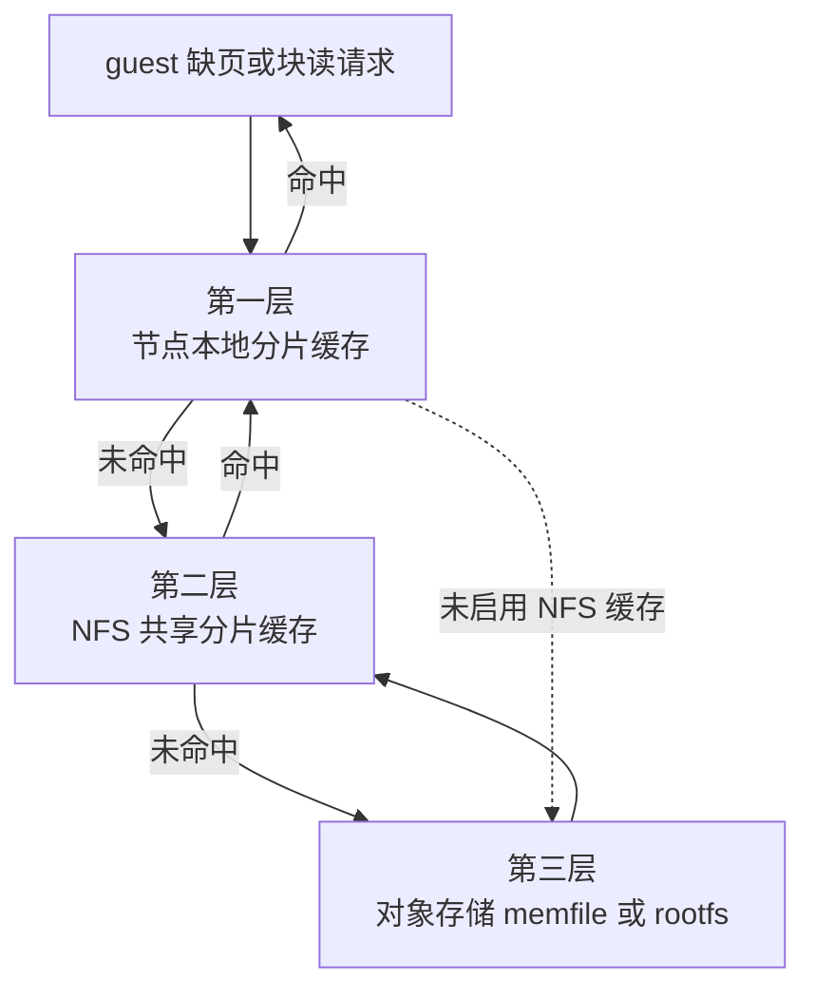

# 13 · 存储全景

> 一个沙箱从创建到销毁，数据落在五个地方：Postgres、Redis、ClickHouse、对象存储，以及节点本地磁盘。
> 本篇给出「哪个进程读写哪个存储」的矩阵、对象存储的键布局、节点本地的目录布局，
> 以及每类数据的一致性边界 —— 什么以谁为准、什么允许陈旧、陈旧多久。
>
> **读者**：工程师、运维。
> **预备**：[第 10 篇 §2](10-system-architecture.md#2-进程清单)、[第 11 篇 §2](11-object-model.md#2-postgres-里的对象)。
> **代码**：`packages/shared/pkg/storage/`、`packages/db/`、`packages/api/internal/sandbox/storage/`、
> `packages/shared/pkg/sandbox-catalog/`、`packages/orchestrator/internal/sandbox/build/`、
> `packages/orchestrator/internal/sandbox/template/cache.go`、`packages/orchestrator/cmd/clean-nfs-cache/`、
> `packages/clickhouse/`

---

## 0. 本篇要回答的问题

1. 五类存储各自装什么？为什么不能合并成一两个？
2. 每个进程实际打开哪些存储？哪些进程根本碰不到对象存储？
3. 对象存储里一个模板构建长什么样？键是怎么拼出来的，谁负责删？
4. 一个 client 节点的磁盘上有哪些目录，各自的生命周期与驱逐策略是什么？
5. 沙箱「正在跑」这件事以谁为准？允许多长时间的陈旧？

---

## 1. 五类存储，五种约束

先看不分层会怎样。一个沙箱平台要同时保存这些东西：

- 团队、模板、构建这些**低频写、必须持久、要做关联查询**的记录；
- 「沙箱 sbx-abc 在节点 N 上、还有 300 秒到期」这种**高频写、可重建、必须低延迟**的运行态；
- 每 5 秒一条的 CPU / 内存采样，**只追加、量大、按时间窗口查**；
- 几百 MiB 到几 GiB 的 memfile 与 rootfs，**写一次读很多次、要能按偏移随机读**；
- 正在被 Firecracker 读写的那份内存与磁盘数据，**必须在本地、必须是文件**。

把它们塞进一个 Postgres，第三类会把表撑爆，第四类会让备份变成灾难，第五类根本做不到 ——
Firecracker 要的是一个能 `mmap` 的本地文件，不是一行数据。所以 e2b 用了五个后端，
每个后端只承担一种访问模式：

| 存储 | 装什么 | 访问模式 | 丢了会怎样 |
|---|---|---|---|
| PostgreSQL | team / user / tier、模板与构建、别名、快照记录、cluster、volume | 事务性读写，关联查询 | 平台失去全部账目，不可恢复 |
| Redis | 沙箱运行态、团队并发计数、创建期占位、路由目录 | 键值 + 有序集合，毫秒级 | 可从各节点重新同步，短暂不可用 |
| ClickHouse | 沙箱指标、沙箱事件、宿主统计 | 批量追加，时间窗口聚合 | 丢失历史观测，不影响运行 |
| 对象存储 | 模板与快照的产物、构建层缓存 | 写一次，按范围随机读 | 模板与快照全部不可恢复 |
| 节点本地磁盘 | 模板缓存、分片缓存、diff 文件、沙箱 COW | 文件系统，`mmap` 与 `pread` | 只是缓存丢失，重新拉取即可 |

后三行是这本书里真正复杂的部分，前两行是常规工程。本篇把五类都摆出来，
细节留给专门的篇目：Postgres 模式在[第 58 篇 §2](58-postgres-schema-and-migrations.md#2-表与关系)，
ClickHouse 在[第 59 篇 §2](59-clickhouse.md#2-表五张业务表与四种角色)，沙箱运行态在[第 20 篇 §1](20-sandbox-state-storage.md#1-为什么需要单独一份运行态)，
产物格式在[第 29 篇 §2](29-template-artifact-format.md#2-一代产物六个对象)，本地缓存在[第 34 篇 §3](34-template-cache-and-local-storage.md#3-节点本地目录谁建谁删)。

---

## 2. 进程 × 存储读写矩阵

下表按上游 2026.09 的代码整理。「读」「写」指进程直接打开该存储的连接或文件，
不含经由别的进程转发的间接访问。

| 进程 | PostgreSQL | Redis | ClickHouse | 对象存储 | 节点本地磁盘 |
|---|---|---|---|---|---|
| api | 读写 | 读写 | 只读 | 不访问 | 无 |
| orchestrator | 不访问 | 只写（事件流） | 只写 | 读写 | 读写 |
| template-manager | 不访问 | 同 orchestrator | 同 orchestrator | 读写 | 读写 |
| client-proxy（edge） | 不访问 | 只读 | 不访问 | 不访问 | 无 |
| dashboard-api | 读写 | 不访问 | 只读 | 不访问 | 无 |
| envd | 不访问 | 不访问 | 不访问 | 不访问 | 只在 guest 内 |
| clean-nfs-cache | 不访问 | 不访问 | 不访问 | 不访问 | 只删 NFS 缓存 |

有几格值得单独说明，因为它们是这套设计里最容易猜错的地方。

**api 不碰对象存储。** `packages/api/` 下没有任何文件 import `packages/shared/pkg/storage`。
删除一个模板构建时，api 走的是 gRPC：`packages/api/internal/template-manager/template_manager.go`
的 `DeleteBuild()` 调用 template-manager 的 `TemplateBuildDelete`，由后者在
`packages/orchestrator/internal/sandbox/template_build.go` 的 `Delete()` 里调用
`DeleteObjectsWithPrefix(ctx, files.StorageDir())` 真正删对象。
这条边界的收益是 api 不需要桶的写权限；代价是删除变成异步的跨进程调用，
api 侧只能看到 gRPC 的成败，看不到桶里的实际状态。
（GCP 的 nomad job `iac/provider-gcp/nomad/jobs/api.hcl` 里仍给 api 设了
`TEMPLATE_BUCKET_NAME = "skip"`，是历史残留，代码里没有读取方。）

**orchestrator 不碰 Postgres。** `packages/orchestrator/` 下没有任何文件 import
`packages/db`。构建一个模板需要的全部参数由 api 通过 gRPC 的
`TemplateCreateRequest` 一次性带下来，构建结果也经 gRPC 回报给 api，由 api 写库。
收益是节点不需要数据库连接，扩到几百个节点时不会把连接池打爆；
代价是 orchestrator 无法在本地做任何需要查表的判断。

**orchestrator 对 Redis 只写不读，而且只写一个流。**
`packages/orchestrator/main.go` 建的 Redis 客户端只用于
`packages/shared/pkg/events/delivery_redis_streams.go` 的 `RedisStreamsDelivery`，
用 `XADD` 把沙箱事件追加到 `sandbox.events.stream`；`REDIS_URL` 为空时这条链路直接关掉
（`ErrRedisDisabled` 被容忍）。沙箱运行态在 orchestrator 侧只有一份进程内的 map
（`internal/sandbox/map.go`），把它写进 Redis 的是 api
（`packages/api/internal/sandbox/storage/redis/`）。

**orchestrator 对 ClickHouse 只写不读。** 写入分两路：宿主统计走
`packages/clickhouse/pkg/hoststats/delivery.go` 的批量插入（`INSERT INTO sandbox_host_stats`），
沙箱事件走 `packages/clickhouse/pkg/events/delivery.go`，两者都经过
`packages/clickhouse/pkg/batcher/` 的队列合批。查询侧在 api
（`packages/api/internal/handlers/team_metrics.go`）与 dashboard-api。

**沙箱自身的指标不是 orchestrator 直接写进 ClickHouse 的。**
`packages/orchestrator/internal/metrics/sandboxes.go` 用 OpenTelemetry 的
observable gauge 注册回调，回调里通过 `Checks.GetMetrics()`
（`internal/sandbox/metrics.go`）向 envd 的 `/metrics` 端点发 HTTP 请求取值，
再由 otel-collector 落到 ClickHouse 的 `metrics_gauge` 表；
`packages/clickhouse/migrations/20250717135224_sandbox_metrics.sql` 里的物化视图
`sandbox_metrics_gauge_mv` 把带 `sandbox_id` 属性的行分流到 `sandbox_metrics_gauge`。
所以指标链路上有三跳，任何一跳堵住都只表现为「图表有洞」，不影响沙箱运行。

---

## 3. 对象存储：两个桶与键布局

### 3.1 两个桶，两种寿命

`packages/shared/pkg/storage/storage.go` 里有两个工厂函数，对应两个桶：

- `GetTemplateStorageProvider()` 读 `TEMPLATE_BUCKET_NAME`，装**模板与快照的产物**；
- `GetBuildCacheStorageProvider()` 读 `BUILD_CACHE_BUCKET_NAME`，装**构建层缓存**。

分开的理由是寿命不同：产物桶里的对象要活到对应的 build 被删除为止，
层缓存桶里的对象是构建加速用的，删掉只会让下一次构建变慢。
分桶也让生命周期规则（TTL）可以各设各的。

两个函数都只在 orchestrator 侧被调用：`packages/orchestrator/main.go`、
`packages/orchestrator/internal/template/server/main.go`，以及两个开发工具
`cmd/create-build/` 与 `cmd/resume-build/`。

### 3.2 产物桶的键布局

键由 `packages/shared/pkg/storage/template.go` 的 `TemplateFiles` 拼出，
`StorageDir()` 直接返回 `BuildID`，其余方法在它后面接文件名：

```text
<bucket>/
└── <build-id>/                      # UUID，一次构建或一次 pause 的产物
    ├── memfile                      # guest 内存；整代或 diff
    ├── memfile.header               # 块 → build ID 的映射表
    ├── rootfs.ext4                  # 根文件系统；整代或 diff
    ├── rootfs.ext4.header           # 同上
    ├── snapfile                     # Firecracker 的 VM 状态快照
    └── metadata.json                # 模板元数据：版本、kernel / FC / envd 版本等
```

三点值得注意。

**键里没有模板 ID，只有 build ID。** 「哪个模板的哪一代」这层关系存在 Postgres 的
`envs` 与 `env_builds` 表里，桶只是按 build ID 索引的一堆平铺目录。
收益是产物完全不可变、可以随便复制；代价是脱离 Postgres 就无法从桶里反查一个模板的历史。

**pause 产生的快照与模板构建共用同一套键。** 一次 pause 会分配一个新的 build ID，
把脏块写成 `memfile` 与 `rootfs.ext4`，把新的映射写成两个 `.header`。
读一个块时先查 header 找到「最近写过它的那一代」的 build ID，再去那一代的对象里按偏移读。
这条链的格式细节在[第 29 篇 §4](29-template-artifact-format.md#4-一次查找从偏移到某一代的文件与偏移)。

**删除是按前缀删的。** `DeleteObjectsWithPrefix(ctx, prefix)` 是 `StorageProvider`
接口的第一个方法，删除一个 build 就是删掉 `<build-id>/` 这个前缀下的全部对象。
由于 header 会指向更早的 build，删除一代必须确认没有后代还指着它 ——
这个判断在 api 侧（`packages/db/queries/get_exclusive_builds_for_template_deletion.sql.go`），
不在存储层。

### 3.3 层缓存桶的键布局

构建缓存的键由 `packages/orchestrator/internal/template/build/storage/paths/paths.go` 拼出：

```text
<build-cache-bucket>/
└── <cache-scope>/                   # 通常是 team ID（UUID）
    ├── index/
    │   └── <sha256-hex>             # JSON: {"template": {"build_id": "..."}}
    └── files/
        └── <sha256-hex>.tar         # COPY 指令要拷进沙箱的文件包
```

`cacheScope` 由 api 传下来：`packages/api/internal/template-manager/create_template.go`
与 `upload_template_layer_files.go` 都填 `teamID.String()`；
orchestrator 侧在 `internal/template/server/create_template.go` 里以 `templateID` 兜底。
以 team 为单位划分作用域，意味着**层缓存在同一个团队内跨模板复用，但不跨团队复用** ——
这既是隔离要求，也放弃了「全平台共享一个 Debian 基础层」的那部分收益。

`index/<hash>` 里只存一个 build ID，真正的判定在
`packages/orchestrator/internal/template/build/storage/cache/cache.go` 的 `Cached()`：
拿这个 build ID 去产物桶读 `metadata.json`，读得到、且 `Version` 不低于
`minimalCachedTemplateVersion`（当前为 2）才算命中。
换句话说，索引对象是弱引用，产物桶才是真相 —— 索引指向一个已被删除的 build 时，
表现为一次缓存未命中，而不是构建失败。哈希算法本身带版本号 `hashingVersion = "v2"`，
改哈希口径时整代缓存自然失效。

### 3.4 provider 抽象：三种访问形态

`StorageProvider` 接口只有五个方法，但它区分了两种对象打开方式，
这个区分是整套读路径的基础：

```go
type StorageProvider interface {
	DeleteObjectsWithPrefix(ctx context.Context, prefix string) error
	UploadSignedURL(ctx context.Context, path string, ttl time.Duration) (string, error)
	OpenBlob(ctx context.Context, path string, objectType ObjectType) (Blob, error)
	OpenSeekable(ctx context.Context, path string, t SeekableObjectType) (Seekable, error)
	GetDetails() string
}
```

- `Blob`：小对象，整体读写。`WriteTo` / `Put` / `Exists`。
  用于 `*.header`、`snapfile`、`metadata.json`、层索引与层文件包。
- `Seekable`：大对象，按偏移随机读（`ReadAt`）、整文件写（`StoreFile`）、
  以及范围流式读（`OpenRangeReader`）。只用于 `memfile` 与 `rootfs.ext4`
  —— `SeekableObjectType` 也就只有 `MemfileObjectType` 与 `RootFSObjectType` 两个取值。

随机读的单位是 `MemoryChunkSize = 4 * 1024 * 1024`，即 4 MiB，
注释要求它不小于块大小。这个常数同时决定了 NFS 缓存里一个分片文件的大小。

上游实现三个 provider：`storage_google.go`（GCS）、`storage_aws.go`（S3）、
`storage_fs.go`（本地文件系统，供本地开发与测试用，`UploadSignedURL` 直接返回错误）。
选哪个由 `STORAGE_PROVIDER` 环境变量决定，上游默认 `GCPBucket`。
ARM 适配版在这里多一个 `MinioBucket` 实现，并把默认值改成了它 —— 不设 `STORAGE_PROVIDER` 时
走的是 MinIO 而不是 GCS（见 §7 与[第 75 篇 §5](75-minio-storage.md#5-把默认-provider-改成-minio)）。

---

## 4. 节点本地：目录布局与三层缓存

### 4.1 一个 client 节点的目录

路径来自 `packages/orchestrator/internal/cfg/model.go` 与
`packages/shared/pkg/storage/sandbox.go` 的 `Config`，默认值由
`iac/provider-gcp/nomad-cluster/scripts/start-client.sh` 在开机时创建：

```text
/orchestrator                     本地 NVMe / 持久盘，XFS，noatime
├── build/                        DEFAULT_CACHE_DIR
│   └── <build-id>-<memfile|rootfs.ext4>-<rand>
│                                 分片缓存文件与 pause 产生的 diff 文件
├── template/                     TEMPLATE_CACHE_DIR
│   └── <build-id>/cache/<uuid>/  snapfile 与 metadata.json 的本地副本
├── sandbox/                      SANDBOX_CACHE_DIR
│   ├── rootfs-<sbx-id>-<rand>.cow    运行中沙箱的 rootfs 写时复制层
│   └── rootfs-<sbx-id>-<rand>.link
├── build-templates/              TEMPLATES_DIR，构建期的中间产物
└── shared-store/chunks-cache/    NFS 挂载点，SHARED_CHUNK_CACHE_PATH
/mnt/snapshot-cache               SNAPSHOT_CACHE_DIR，tmpfs 65 GiB
/mnt/hugepages                    hugetlbfs
/fc-vm                            Firecracker 运行目录
/fc-kernels, /fc-versions, /fc-envd    只读，由 gcsfuse 挂载对应的桶
/tmp/fc-<sbx-id>-<rand>.sock      Firecracker API socket
/tmp/uffd-<sbx-id>-<rand>.sock    userfaultfd handler socket
```

命名规则里两个细节值得留意。`TemplateCacheFiles.cacheDir()` 在 build ID 后面又加了一层
随机 `CacheIdentifier`，注释说明了原因：同一个 build 的旧缓存项在关闭时不能删掉
新缓存项刚建好的文件。`SandboxFiles` 里的 `randomID` 同理 ——
一个被 pause 的沙箱和它 resume 出来的新实例可能同时存在，路径必须区分开。

`SNAPSHOT_CACHE_DIR` 是个例外：在上游 2026.09 里，除了
`packages/orchestrator/main.go` 的 `ensureDirs()` 会创建它、
`cfg/model.go` 会把它变成绝对路径之外，没有其它代码引用它。
pause 产生的 diff 文件实际落在 `DefaultCacheDir`
（`internal/sandbox/sandbox.go` 的 `pauseProcessMemory()` / `pauseProcessRootfs()`
都传的是 `s.config.DefaultCacheDir`）。**推论**：这是一条已经改道、
但配置项与开机脚本里的 65 GiB tmpfs 还没清理掉的旧路径。

### 4.2 三层缓存

从 guest 的一次缺页到最终的数据来源，中间最多穿过三层：



**第一层**是节点本地的分片缓存。`internal/sandbox/build/storage_diff.go` 的
`newStorageDiff()` 用 `GenerateDiffCachePath()` 在 `DefaultCacheDir` 下开一个文件，
再交给 `block.NewChunker()`：读到未缓存的块时从 provider 拉一个分片写进这个文件。
同一个 build 的同一种 diff 在节点上只有一份，键是
`GetDiffStoreKey(buildID, diffType)`，即 `<build-id>/<memfile|rootfs.ext4>`，
由 `internal/sandbox/build/cache.go` 的 `DiffStore` 用 TTL 缓存持有。

**第二层**是 NFS 上的共享分片缓存，由 `packages/shared/pkg/storage/storage_cache.go`
的 `WrapInNFSCache()` 以装饰器的形式包在真正的 provider 外面。它是可选的：
`internal/sandbox/template/cache.go` 的 `useNFSCache()` 按 feature flag
`use-nfs-for-snapshots` / `use-nfs-for-templates` 决定是否包装，
并且**构建期（`isBuilding`）一律不包装**，理由写在代码注释里 ——
缓存正在构建的那一层不会加速下一个沙箱的启动。
构建侧另有一个开关 `use-nfs-for-building-templates`（`internal/template/build/builder.go`）。

NFS 缓存的文件布局把每个对象展开成一个目录：

```text
<SHARED_CHUNK_CACHE_PATH>/
└── <object key>/                    # 例如 <build-id>/memfile
    ├── 000000000000-4194304.bin     # 分片序号（12 位补零）与分片大小
    ├── 000000000001-4194304.bin
    ├── size.txt                     # 对象总长度
    └── content.bin                  # Blob 形态的对象整体缓存
```

分片文件名同时编码了序号与分片大小，因此改变 `MemoryChunkSize`
不会读到用旧尺寸切出来的分片，只会整体未命中。

**第三层**是对象存储本身。未启用 NFS 缓存时，第一层直接对着它。

### 4.3 共享缓存上的并发写

NFS 挂载参数在 `iac/provider-gcp/nomad-cluster/main.tf` 的 `nfs_mount_opts` 里，
其中有 `nolock` —— 不使用 NFS 的字节范围锁。多个节点同时把同一个分片写进同一个路径，
必须自己解决。`storage_cache_seekable.go` 的 `writeChunkToCache()` 的做法是：

1. `lock.TryAcquireLock(chunkPath)`：用 `O_CREAT|O_EXCL` 创建 `<chunkPath>.lock`；
   已存在且修改时间在 10 秒内就放弃这次写（不是报错，只记一次指标后返回 `nil`）；
   超过 10 秒视为陈旧锁，删掉重试。
2. 写到 `.temp.<序号>-<大小>.bin.<uuid>`，再 `RenameOrDeleteFile` 改名到目标路径。

**推论**：选择 lock 文件加临时文件改名，而不是 `flock`，正是因为挂载参数里有 `nolock`。
代价写在代码注释里：陈旧锁的清理存在竞态，最坏情况是多个节点同时拿到锁并各写一遍
—— 由于内容相同且改名是原子的，这只是浪费带宽，不会写坏数据。
放弃写入也不影响正确性，只是这个分片下次还要重新从对象存储拉。

### 4.4 两种驱逐

本地与共享两层的驱逐机制完全不同，因为一个有进程管着、一个没有。

**本地分片缓存**由 `DiffStore` 自己驱逐。`internal/sandbox/build/cache.go` 的
`startDiskSpaceEviction()` 每秒查一次 `DefaultCacheDir` 所在文件系统的用量，
超过 feature flag `build-cache-max-usage-percentage`（默认 85）就调
`deleteOldestFromCache()` 摘掉一项，删成功后把轮询间隔压到微秒级继续删。

摘哪一项要说清楚。`DiffStore` 用的是 `jellydator/ttlcache`，条目按到期时刻排序，
`deleteOldestFromCache()` 用 `RangeBackwards` 取到期时刻最早的一项。
而 `DiffStore.Get()` 走的是 `GetOrSet(..., ttlcache.DefaultTTL)`，命中时会把到期时刻重新推远，
所以「到期时刻最早」等价于**最久没有被访问过**。这是一个近似 LRU，不是引用计数：
一份正在被某台沙箱读的 diff，只要这段时间没有新的块读请求，一样可能被选中删除。
删除因此是延迟执行的（`buildCacheDelayEviction = 60 s`），期间若又被引用就取消删除；
待删项的体积记在 `pdSizes` 里从已用量中扣除，避免在删除生效前重复触发。
TTL 是 25 小时（`internal/sandbox/template/cache.go` 的 `buildCacheTTL`），
注释说明它必须长于沙箱的最长生命周期。缓存项生命周期的完整讨论见
[第 34 篇 §5](34-template-cache-and-local-storage.md#5-缓存项的生命周期用-ttl-代替引用计数)。

**NFS 共享缓存**没有常驻进程，由独立的一次性作业
`packages/orchestrator/cmd/clean-nfs-cache/` 清理，按 access time 做近似 LRU：
`cleaner/clean.go` 的 `splitBatch()` 按 `ATimeUnix` 升序排，取最旧的若干个交给删除协程；
`cleaner/delete.go` 的 `deleteFile()` 在真正 `os.Remove` 之前再 stat 一次，
atime 变了就跳过 —— 这是在没有跨节点锁的前提下，防止删掉别的节点刚刚读过的分片。
目标由 `-disk-usage-target-percent`（默认 90）、`-target-bytes-to-delete`、
`-target-files-to-delete` 三选一决定，且 `-dry-run` 默认为 true，必须显式关闭才真删。

这套机制依赖 atime 可用。`/orchestrator` 这块盘是以 `noatime` 挂的，
但 NFS 挂载点 `/orchestrator/shared-store` 是另一个挂载，
`nfs_mount_opts` 里没有 `noatime`，atime 得以保留。
代价是每次读分片都产生一次属性写，这也是 `actimeo=600`、`nocto`
这些放宽属性一致性的参数存在的原因。

---

## 5. 元数据与运行态

### 5.1 PostgreSQL：账目

表结构以 `packages/db/migrations/` 为准，生成的类型在 `packages/db/queries/models.go`。
按用途分四组：

- 租户与鉴权：`users`、`teams`、`users_teams`、`tiers`、`addons`、`team_api_keys`、`access_tokens`，
  以及把档位基线与生效中的 addon 相加得出的 `team_limits` 视图；
- 模板：`envs`、`env_builds`、`env_aliases`、`env_build_assignments`；
- 快照：`snapshots`、`snapshot_templates`；
- 基础设施：`clusters`、`volumes`。

`env_builds` 是「构建」这个对象的权威记录，字段里带着状态（`Status`、`StatusGroup`）、
资源规格（`Vcpu`、`RamMb`、`FreeDiskSizeMb`）与版本三元组
（`KernelVersion`、`FirecrackerVersion`、`EnvdVersion`）。
对象存储里那个 `<build-id>/` 目录，元数据就挂在这一行上。

`snapshots` 表记录一次 pause：`EnvID` 指向为这次快照新建的模板，`BaseEnvID` 指向原模板，
`SandboxID` 记住原沙箱的 ID，`Config` 存暂停时的沙箱配置。
resume 时要靠这一行找到该拉哪个 build。

配额不是单独查一次得来的。`team_limits` 这个视图被直接 JOIN 进认证查询：
`packages/db/pkg/auth/queries/get_team.sql.go`（源文件 `sql_queries/teams/get_team.sql`）
在按 API key 或 access token 取团队时就 `JOIN "public"."team_limits" tl on tl.id = t.id`，
把并发上限、vCPU、内存、磁盘、最长时长一并取回。
因此每个请求拿到团队的同时就拿到了配额，创建路径上不再有第二次查库；
代价是配额的变更要等认证缓存过期才生效（[第 16 篇 §7](16-auth-and-multitenancy.md#7-缓存与撤销延迟)）。

### 5.2 Redis：运行态与路由目录

Redis 里有三套互不相干的键空间，属于三个不同的模块。

**沙箱运行态**，键由 `packages/api/internal/sandbox/storage/redis/utils.go` 拼：

```text
sandbox:storage:{<team-id>}:sandboxes:<sandbox-id>    # 沙箱记录（JSON）
sandbox:storage:{<team-id>}:index                     # 该团队的沙箱集合
sandbox:storage:{<team-id>}:transition::<sandbox-id>  # 状态迁移占位，TTL 70 s
sandbox:storage:{<team-id>}:transition::<sandbox-id>:<transition-id>   # 迁移结果，TTL 30 s
sandbox:storage:global:teams                          # 有沙箱的团队集合
sandbox:storage:global:expiration                     # 全局到期时间有序集合
```

team ID 外面那对花括号是 Redis Cluster 的 hash tag（`redis_utils.SameSlot()`），
把同一团队的键固定到同一个 slot，Lua 脚本与 `MGET` 才能跨键工作。
代价是团队之间的负载不均会直接变成 slot 之间的不均。

实现有三个，但 `SANDBOX_STORAGE_BACKEND` 只接受两个取值，默认 `memory`
（`packages/api/internal/cfg/model.go`，其它取值在 `Parse()` 里报错）。
`packages/api/internal/orchestrator/orchestrator.go` 里的分支是这样接的：
`redis` 装纯 Redis 后端；`memory` 装的其实是
`populate_redis.NewStorage(memory.NewStorage(), redisStorage)` —— 写两份、**读只走内存**
（`storage/populate_redis/main.go` 的 `Get()`、`TeamItems()` 都直接转给 memory 后端，
Redis 写失败只打日志）。换句话说，纯内存后端在上游 2026.09 已经无法单独选中，
默认配置下 Redis 里已经有一份影子数据，只是还没有人读。
这是为切换到多 api 实例做的双写预热，细节在[第 20 篇 §6](20-sandbox-state-storage.md#6-迁移路径与它的代价)。

**路由目录**在 `packages/shared/pkg/sandbox-catalog/`，键形如 `sandbox:catalog:<sandbox-id>`
（`catalog_redis.go` 的 `getCatalogKey()`），值是 `SandboxInfo`：
orchestrator 的 ID 与 IP、执行 ID、启动时间、最长运行小时数。
写方是 api（`packages/api/internal/orchestrator/lifecycle.go` 调 `StoreSandbox()`），
读方是 client-proxy（`packages/client-proxy/internal/proxy/proxy.go` 的 `catalogResolution()`）。
读侧还叠了一层 500 ms 的进程内 TTL 缓存，注释直接说明了取值理由：
再长就可能在沙箱换了节点之后还在往旧节点转发。

**沙箱事件流**是一个 Redis Stream，键名 `sandbox.events.stream`，唯一的写方是 orchestrator。
`RedisStreamsDelivery.Publish()` 在 `XADD` 之前会先 `EXISTS` 一个投递键，
不存在就整条丢弃 —— 即按需订阅，没人要就不写。

### 5.3 ClickHouse：观测数据

表建在 `packages/clickhouse/migrations/`，统一的模式是「本地表 + Distributed 表 + 物化视图」：
`*_local` 是 MergeTree 实体表，同名不带后缀的是 `Distributed` 路由表，
`*_mv` 把 OpenTelemetry 写进来的通用表转成按沙箱或按团队组织的窄表。

保留期直接写在表定义的 `TTL` 里，两档：
`sandbox_metrics_gauge_local`、`metrics_gauge_local`、`sandbox_events_local`、
`sandbox_host_stats_local` 都是 7 天；`team_metrics_gauge_local` 与 `team_metrics_sum_local`
建表时是 30 天，被 `20250822155059_extend_team_metrics_ttl.sql` 改成 90 天
（那份迁移里的 30 天出现在 goose 的 Down 段，是回滚方向，不是当前值）。
两档的差别对应两种用途：沙箱级数据只用于当下排查，团队级数据要支撑按月的用量核对。
TTL 是 ClickHouse 自己执行的，没有额外的清理作业。

---

## 6. 一致性边界

把上面的内容压成一句话：**每类数据只有一个权威副本，其余都是可重建的派生物。**
下表列出权威方与允许的陈旧程度。

| 数据 | 以谁为准 | 派生副本 | 允许陈旧多久 |
|---|---|---|---|
| 团队、模板、构建、快照记录 | PostgreSQL | 无 | 不允许 |
| 一个 build 的产物 | 对象存储 | 节点本地缓存、NFS 缓存 | 不允许陈旧（对象不可变） |
| 层缓存索引 | 产物桶里的 `metadata.json` | `index/<hash>` 对象 | 索引可指向已删除的 build，退化为未命中 |
| 沙箱是否在跑 | orchestrator 进程内的 map | api 的 Redis / 内存记录 | 一个同步周期 |
| 沙箱在哪个节点 | api 写入的 catalog | client-proxy 的 500 ms 本地缓存 | 500 ms |
| 团队并发数 | Redis 的团队索引集合 | api 的计数指标 | 秒级 |
| 指标与事件 | ClickHouse | 无 | 只读历史，允许丢 |

三条边界值得展开。

**产物的不可变性是整套缓存的前提。** 一个 build ID 对应的对象写完就不再改，
所以本地缓存、NFS 缓存都不需要失效协议 —— 只要键在，内容就是对的。
这也是为什么 pause 要分配新的 build ID 而不是原地改写：
原地改写会让所有已缓存的分片瞬间失效，而且没有任何机制能通知到它们。

**「沙箱是否在跑」以 orchestrator 为准。** api 不断从各节点拉当前沙箱列表，
`packages/api/internal/orchestrator/nodemanager/sync.go` 调 `store.Sync()`，
最终进到 `storage/memory/sync.go` 的 `Sync()`：节点上有而 api 没有的补进来，
api 有而节点上没有的标记过期。这里有一个 10 秒的宽限期
（`syncSandboxRemoveGracePeriod`），避免把正在创建、还没出现在节点列表里的沙箱误删。
代价是：一个沙箱在节点上已经死了，api 侧最多还会认为它活着一个同步周期，
用户在这段时间里查询会拿到一个连不上的沙箱。

**Postgres 与 Redis 之间没有事务。** 创建沙箱要写 Redis（运行态与占位）、
写 catalog、发 gRPC 给 orchestrator，任一步失败都靠补偿逻辑与
Sync 循环收敛，而不是靠回滚。这是选择「多存储 + 各司其职」必然要付的代价：
把它们塞进一个数据库能拿到事务，但会同时失去 Redis 的延迟和 ClickHouse 的吞吐。

---

## 7. ARM 适配版的差异

ARM 适配版在存储层只动了一处：新增 `packages/shared/pkg/storage/storage_minio.go`，
实现一个 `MinioBucket` provider，并在 `storage.go` 里把它接进
`GetTemplateStorageProvider()` 与 `GetBuildCacheStorageProvider()` 的分支。
同时把 `DefaultStorageProvider` 从 `GCPStorageProvider` 改为 `MINIOStorageProvider`，
也就是不设 `STORAGE_PROVIDER` 时默认走 MinIO —— 这是为离线部署准备的默认值。
接口本身没有变化，因此本篇讲的键布局、缓存分层与驱逐机制在 ARM 适配版上完全适用。
provider 的实现细节、与 GCS / S3 的语义差异、以及单机离线版实际用的配置，
见[第 75 篇 §3](75-minio-storage.md#3-五处语义差异)。

---

## 8. 小结

- 五类存储对应五种访问模式：Postgres 管账目，Redis 管运行态与路由，
  ClickHouse 管观测，对象存储管产物，节点本地磁盘管「Firecracker 能直接读的文件」。
- 只有 orchestrator 与 template-manager 打开对象存储；api 通过 gRPC 让 template-manager
  代删对象，自己不需要桶的写权限。
- 产物桶的键是 `<build-id>/{memfile,memfile.header,rootfs.ext4,rootfs.ext4.header,snapfile,metadata.json}`，
  平铺、按 build ID 索引、不含模板 ID；模板与 build 的关系只存在于 Postgres。
- 层缓存桶按 `<team-id>/index/<hash>` 与 `<team-id>/files/<hash>.tar` 组织，
  以 team 为复用边界；索引是弱引用，产物桶的 `metadata.json` 才是命中判据。
- 大对象的读路径最多三层：节点本地分片文件、NFS 共享分片缓存、对象存储。
  中间那层可由 feature flag 关闭，构建期一律不用。
- 分片大小 4 MiB（`MemoryChunkSize`），并编码进 NFS 缓存的文件名，
  改尺寸只会整体未命中，不会读到错误数据。
- 两层缓存的驱逐机制不同：本地由 `DiffStore` 按磁盘水位（默认 85%）加 25 小时 TTL 驱逐，
  NFS 由独立作业 `clean-nfs-cache` 按 atime 近似 LRU 清理，默认 dry-run。
- 共享缓存上的并发写靠 `.lock` 文件加临时文件改名解决，因为 NFS 是以 `nolock` 挂载的；
  锁失败时放弃写入而不是报错。
- 产物不可变是缓存不需要失效协议的前提；pause 分配新 build ID 而非原地改写，正是为了守住这一点。
- 「沙箱是否在跑」以 orchestrator 进程内的 map 为准，api 侧允许落后一个同步周期
  加 10 秒宽限期；路由目录允许 client-proxy 落后 500 ms。

## 延伸阅读 / 下一篇

- [第 14 篇 §2](14-config-flags-versions.md#2-特性开关)：本篇提到的环境变量与 feature flag 的全貌。
- [第 20 篇 §3](20-sandbox-state-storage.md#3-redis-后端)：Redis 后端、占位与迁移的细节。
- [第 29 篇 §3](29-template-artifact-format.md#3-header-的字节布局)：header 格式与 diff 链。
- [第 34 篇 §4](34-template-cache-and-local-storage.md#4-缓存查找顺序一次块读查几张表)：缓存项生命周期与查找顺序。
- [第 45 篇 §2](45-layers-and-build-cache.md#2-hash-怎么算)：哈希如何计算、层如何复用。
- [第 58 篇 §2](58-postgres-schema-and-migrations.md#2-表与关系)、[第 59 篇 §3](59-clickhouse.md#3-两条写入路径)。
- [第 75 篇 §2](75-minio-storage.md#2-接口与逐方法对照)：ARM 适配版新增的 provider。
