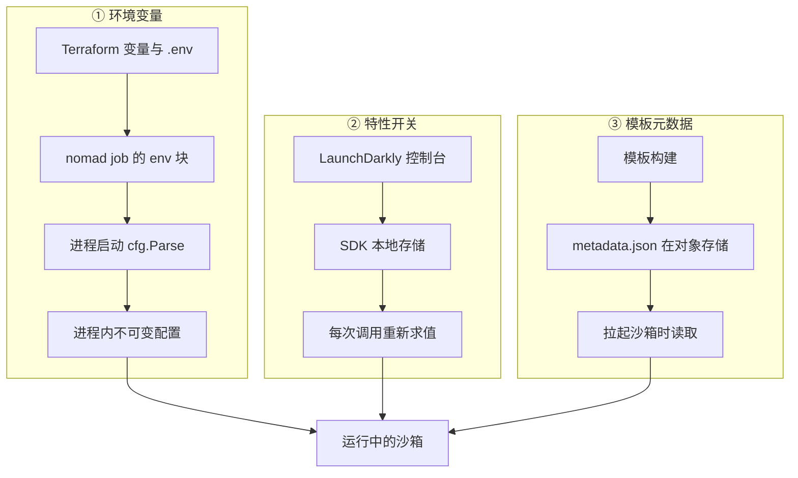

# 14 · 配置、特性开关与版本约定

> 同一份二进制要跑在生产集群、开发环境和一台笔记本上，差别都压在配置里。本篇把 e2b 的配置面拆成三层：
> 部署期写死的环境变量、运行期可改的特性开关、以及跟着模板走的版本三元组，并说明每一层的代价。
>
> **读者**：工程师、准备自建或移植 e2b 的人。
> **预备**：[第 10 篇 §2](10-system-architecture.md#2-进程清单)（知道有哪些进程）、
> [第 13 篇 §3](13-storage-landscape.md#3-对象存储两个桶与键布局)（知道模板产物存在哪）。
> **代码**：`packages/shared/pkg/env/env.go`、`packages/orchestrator/internal/cfg/model.go`、
> `packages/api/internal/cfg/model.go`、`packages/shared/pkg/feature-flags/flags.go`、
> `packages/orchestrator/internal/template/metadata/template_metadata.go`

---

## 0. 本篇要回答的问题

1. 一个 e2b 进程启动时，它的配置从哪里来？改一个值需要付出什么代价（重启？重新部署？）
2. 为什么要在环境变量之外再引入一套特性开关？哪些行为被开关控制？
3. 没有 LaunchDarkly（自建、离线部署）时，这套开关还能工作吗，行为是什么？
4. 「模板用哪个 Firecracker 版本恢复」这件事是谁决定的？升级 Firecracker 之后，老快照怎么办？
5. 仓库里的 `VERSION` 文件、镜像 tag、数据库迁移号，各自约束什么？

---

## 1. 配置的四条渠道

先看现象。orchestrator 启动时需要知道：gRPC 监听哪个端口、模板缓存写到哪个目录、
对象存储用哪家、单节点最多跑多少沙箱、拉起某台沙箱要用哪个 Firecracker 二进制。
这五个问题的答案来自四条完全不同的渠道，它们的可变性差了几个数量级：

| 渠道 | 载体 | 改一个值要做什么 | 例子 |
|---|---|---|---|
| 环境变量 | nomad job 的 `env` 块 | 改 Terraform / job 定义，重新部署，进程重启 | `GRPC_PORT`、`STORAGE_PROVIDER` |
| 命令行参数 | 进程启动参数 | 同上 | envd 的 `-port`、`-cmd` |
| 特性开关 | LaunchDarkly | 在控制台改一个值，进程不重启 | `max-sandboxes-per-node` |
| 模板元数据 | 对象存储里的 `metadata.json` | 重新构建模板 | kernel / Firecracker 版本 |

还有第五类容易和它们混淆：沙箱内部的环境变量（`SandboxConfig.EnvVars`）。那是交给 guest 里用户进程的，
和宿主侧进程的配置没有关系，本篇不讨论。

### 1.1 环境变量：谁定义、谁注入

上游 2026.09 用 `github.com/caarlos0/env` 把环境变量映射成结构体字段。
orchestrator 的全部配置就是 `packages/orchestrator/internal/cfg/model.go` 里的两个结构体，
`BuilderConfig` 是构建与沙箱运行共用的部分，`Config` 内嵌它并加上服务级的项：

```go
type BuilderConfig struct {
	AllowSandboxInternet   bool          `env:"ALLOW_SANDBOX_INTERNET"   envDefault:"true"`
	FirecrackerVersionsDir string        `env:"FIRECRACKER_VERSIONS_DIR" envDefault:"/fc-versions"`
	HostEnvdPath           string        `env:"HOST_ENVD_PATH"           envDefault:"/fc-envd/envd"`
	HostKernelsDir         string        `env:"HOST_KERNELS_DIR"         envDefault:"/fc-kernels"`
	OrchestratorBaseDir    string        `env:"ORCHESTRATOR_BASE_PATH"   envDefault:"/orchestrator"`
	TemplatesDir           string        `env:"TEMPLATES_DIR,expand"     envDefault:"${ORCHESTRATOR_BASE_PATH}/build-templates"`
	…
}
```

这里有两个值得注意的细节。一是 `,expand`：默认值里可以引用别的环境变量，
`ORCHESTRATOR_BASE_PATH` 一改，所有派生目录跟着改；`cfg/model_test.go` 的
`env defaults get expanded` 用例正是验证这条。二是 `Parse()` 之后调用 `makePathsAbsolute()`，
把所有目录项转成绝对路径——因为 orchestrator 会 `chdir` 到 netns 相关的上下文里执行子进程，
相对路径在那里没有意义（推论：代码只说「resolve 到绝对路径」，没有解释动机）。

api 的配置在 `packages/api/internal/cfg/model.go`，写法相同。它用 `env` 标签的两个修饰符表达强制性：
`POSTGRES_CONNECTION_STRING` 标了 `required,notEmpty`，`LOKI_URL` 标了 `required`——
少了就在 `Parse()` 返回错误，`main.go` 直接 `Fatal`。client-proxy 的配置只有六个字段
（`packages/client-proxy/internal/cfg`），说明它几乎不需要外部状态。

值从哪来？在上游的 GCP 形态里，来自 nomad job 模板的 `env` 块，由 Terraform 插值填入。
orchestrator 的 job 在 `iac/modules/job-orchestrator/jobs/orchestrator.hcl`，
api 与 template-manager 在 `iac/provider-gcp/nomad/jobs/*.hcl`。job 里还能看到条件注入：

```hcl
%{ if launch_darkly_api_key != "" }
        LAUNCH_DARKLY_API_KEY        = "${launch_darkly_api_key}"
%{ endif }
%{ if provider == "gcp" }
        ARTIFACTS_REGISTRY_PROVIDER  = "GCP_ARTIFACTS"
        STORAGE_PROVIDER             = "GCPBucket"
%{ endif }
```

也就是说「用不用 LaunchDarkly」「对象存储是 GCS 还是 S3」不是运行期判断，
而是部署期决定的：变量不注入，代码里的默认分支生效。

仓库根的 `.env.template` 是另一个层次的东西：它是 Terraform 的输入（GCP 项目、区域、机型、集群规模、
Postgres 连接串），不是进程的环境变量。看名字容易混淆，两者只有少数几项（如 `DOMAIN_NAME`、
`POSTGRES_CONNECTION_STRING`）会一路传到进程里。

### 1.2 三种「没配会怎样」

同一个仓库里并存三种缺省策略，取哪一种表达了这个配置项的重要性：

- **有默认值，静默使用**。`envDefault` 标签，或 `packages/shared/pkg/env/env.go` 的
  `GetEnv(key, defaultValue)`。`env.go` 里的 `var environment = GetEnv("ENVIRONMENT", "prod")`
  是包级变量，在 init 阶段读一次；`IsLocal()` / `IsDevelopment()` / `IsDebug()` 都基于它。
  代价是拼错变量名不会有任何报错，只会静默拿到默认值。
- **必须有，否则崩**。`packages/shared/pkg/utils/env.go` 的 `RequiredEnv(key, usage)` 在缺失、
  为空、或只有空白字符时 `panic`，panic 消息里带上用途说明。
  `env.GetNodeID()` / `GetNodeIP()` 和存储层的 `TEMPLATE_BUCKET_NAME` 走这条。
- **必须有，但报错而不是崩**。`env` 标签的 `required`，由 `Parse()` 返回 error。

第二种的后果在 api 的 nomad job 里留下了痕迹：

```hcl
        # This is here just because it is required in some part of our code which is transitively imported
        TEMPLATE_BUCKET_NAME          = "skip"
```

api 并不使用模板桶，但它间接 import 了存储包，包级的 `RequiredEnv` 会在初始化时执行，
于是不得不塞一个假值。这是「用 panic 表达必填」的固有代价：约束跟着 import 图走，
而不是跟着实际用途走。

### 1.3 生效时机

所有环境变量都在进程启动时一次性解析（`cfg.Parse()`），之后不再读。
改一个环境变量意味着改 job 定义、重新部署、进程重启，而 orchestrator 重启会影响它上面所有运行中的沙箱。
这正是特性开关存在的理由。



## 2. 特性开关

### 2.1 问题

有一类参数，正确值只能在生产流量下试出来：一个节点上放多少沙箱、放置算法允许多大的超量分配、
内存预取开多少个 worker、envd 初始化请求等多久算超时。这些值改错了要么浪费机器，要么拖垮节点，
而验证它们需要在真实负载上小步调整。用环境变量表达就意味着每次调整都要滚动重启整个集群。

上游的答案是 LaunchDarkly：一个把「开关值」从代码里搬到外部服务的商业系统。
封装在 `packages/shared/pkg/feature-flags/`。

### 2.2 flag 的定义即默认值

`flags.go` 按类型分四组，每组一个构造函数：`newBoolFlag`、`newIntFlag`、`newStringFlag`、`newJSONFlag`。
构造函数做两件事：记住 flag 名与 fallback 值，并把这个 fallback 写进一个包级的离线数据源
`launchDarklyOfflineStore`（`ldtestdata.DataSource()`）。

```go
func newIntFlag(name string, fallback int) IntFlag {
	flag := IntFlag{name: name, fallback: fallback}
	builder := launchDarklyOfflineStore.Flag(flag.name).ValueForAll(ldvalue.Int(fallback))
	launchDarklyOfflineStore.Update(builder)

	return flag
}
```

于是**代码里写的 fallback 就是全书要引用的「默认值」**：LaunchDarkly 没配这个 flag、
求值出错、或者根本没有 LaunchDarkly 时，拿到的都是它。

有几个 flag 的 fallback 不是常量而是 `env.IsDevelopment()`，例如 `sandbox-metrics-write`、
`use-nfs-for-snapshots`、`can-use-persistent-volumes`。它们在 `ENVIRONMENT=dev` 或 `local` 时默认开、
在生产默认关。这是一条隐蔽的耦合：一个环境变量决定了一批开关的默认取值。

### 2.3 没有 LaunchDarkly 时

`client.go` 的 `NewClient()`：

```go
if launchDarklyApiKey == "" {
	return NewClientWithDatasource(launchDarklyOfflineStore)
}
ldClient, err := ldclient.MakeClient(launchDarklyApiKey, waitForInit)
```

`launchDarklyApiKey` 是包级变量，读 `LAUNCH_DARKLY_API_KEY`。为空时构造一个数据源为离线存储的客户端，
不发起任何网络连接，每个 flag 恒定返回它的 fallback。这就是自建与离线部署的实际形态：
**整套开关退化成一组代码里的常量**。要改，只能改代码重新编译。ARM 适配版走的正是这条路（见 §5）。

配了 key 时，`MakeClient` 有 5 秒的初始化等待（`waitForInit`）。求值发生在每次调用：
`getFlag` 每次都问一遍 SDK，SDK 从本地缓存的规则集算出结果。所以控制台改了值，进程不需要重启就能看到——
前提是 SDK 已经把新规则同步下来。

但「不重启就生效」有边界，`ChunkerConfigFlag` 的注释把它写得很清楚：
`useStreaming` 只在创建 chunker 时读一次，已缓存模板的 chunker 不会重建，改它必须重启；
而 `minReadBatchSizeKB` 每次取块时都读，改了立刻生效。
`clickhouse-batcher-max-batch-size`、`clickhouse-batcher-max-delay`、
`clickhouse-batcher-queue-size` 是更极端的一例：三者只在
`packages/clickhouse/pkg/events/delivery.go` 与 `pkg/hoststats/delivery.go` 的构造函数里各求值一次，
求出的数字被交给 `batcher.NewBatcher` 固化成批处理器的字段，之后再没有人回头读 flag。
构造函数只在进程启动装配投递链路时被调用，所以这三个开关**实际上等于启动参数**，
改了要重启 orchestrator 才算数。

另一处 `packages/api/internal/orchestrator/orchestrator.go` 的 `updateBestOfKConfig()`
用 30 秒的 ticker 定期重读放置参数并调用 `placementAlgorithm.UpdateConfig()`——
因为放置算法持有配置副本，不主动拉就不会更新。

于是判断一个 flag 改完多久生效，必须看它的调用点，可以分成三档：
每次调用都求值的立刻生效；被定时器重读的等一个周期；在构造函数里求值一次的要重启进程。

### 2.4 求值上下文

LaunchDarkly 的 flag 值可以按对象维度分流。`context.go` 定义了这些「kind」：
`sandbox`、`team`、`user`、`cluster`、`tier`、`service`、`template`、`volume`、`deployment`。
`SandboxContext()` 之类的构造函数把 ID 包装成上下文，`mergeContexts()` 把多个上下文合成一个 multi-context，
同 kind 的以后者优先。

orchestrator 在 `internal/server/sandboxes.go` 的创建路径上构造了一个带属性的沙箱上下文：

```go
ldcontext.NewBuilder(req.GetSandbox().GetSandboxId()).
	Kind(featureflags.SandboxKind).
	SetString(featureflags.SandboxTemplateAttribute, req.GetSandbox().GetTemplateId()).
	SetString(featureflags.SandboxKernelVersionAttribute, req.GetSandbox().GetKernelVersion()).
	SetString(featureflags.SandboxFirecrackerVersionAttribute, req.GetSandbox().GetFirecrackerVersion()).
	Build(),
```

这意味着一个 flag 可以只对某个模板、某个内核版本、某个团队生效——灰度发布一项行为改动的标准手法。
代价是：**同一时刻不同沙箱可能在按不同规则运行**，看日志排查问题时必须先确认当事沙箱看到的 flag 值。

### 2.5 开关清单

`flags.go` 里一共定义了 42 个 flag（四个构造函数的调用点计数）。下表按子系统挑出其中
与运行行为关系最大的一批，其余的多是灰度用的布尔开关（`write-to-cache-on-writes`、`edge-provided-sandbox-metrics`、
`execution-metrics-on-webhooks` 之类）与只在单个子系统里读一次的阈值。默认值即 `flags.go` 里的 fallback，读取位置是主要调用点。

| flag | 默认 | 读取位置 | 作用 |
|---|---|---|---|
| `max-sandboxes-per-node` | 200 | `orchestrator/internal/server/sandboxes.go` | 单节点沙箱数硬上限，超了返回 `ResourceExhausted` |
| `best-of-k-sample-size` | 3 | `api/internal/orchestrator/orchestrator.go` | 放置算法采样节点数 K |
| `best-of-k-max-overcommit` | 400 | 同上 | 超量分配上限，百分比（R=4） |
| `best-of-k-alpha` | 50 | 同上 | 当前用量权重，百分比 |
| `best-of-k-can-fit` | true | 同上 | 是否过滤放不下的节点 |
| `best-of-k-too-many-starting` | false | 同上 | 是否把「正在启动数」计入打分 |
| `memory-prefetch-max-fetch-workers` | 16 | `orchestrator/internal/sandbox/uffd/prefetch/prefetcher.go` | 预取的并行拉取数（I/O 密集） |
| `memory-prefetch-max-copy-workers` | 8 | 同上 | 预取的并行 `UFFDIO_COPY` 数 |
| `nbd-connections-per-device` | 4 | `orchestrator/internal/sandbox/nbd/path_direct.go` | 每个 NBD 设备的 socket 连接数 |
| `chunker-config` | `useStreaming=false`、`minReadBatchSizeKB=16` | `orchestrator/internal/sandbox/block/chunk.go` | 分片读取实现与最小批量 |
| `max-cache-writer-concurrency` | 10 | `shared/pkg/storage/storage_cache_seekable.go` | 缓存回写并发 |
| `envd-init-request-timeout-milliseconds` | 50 | `orchestrator/internal/sandbox/sandbox.go` | envd init 请求超时 |
| `use-nfs-for-snapshots` / `use-nfs-for-templates` / `use-nfs-for-building-templates` | `IsDevelopment()` | `orchestrator/internal/sandbox/template/cache.go` 等 | 是否用共享 NFS 缓存 |
| `build-cache-max-usage-percentage` | 85 | 构建缓存 | 触发淘汰的磁盘占用阈值 |
| `build-provision-version` | 0 | `template/build/phases/base/hash.go` | 参与基础层缓存键；非默认值时替换脚本哈希 |
| `build-firecracker-version` | `DEFAULT_FIRECRACKER_VERSION` 或代码常量 | `api/internal/handlers/template_request_build_v3.go` | 新构建用哪个 Firecracker |
| `firecracker-versions` | `FirecrackerVersionMap` | `api/internal/orchestrator/create_instance.go` | 恢复时的版本重映射表（§3.3） |
| `sandbox-auto-resume` | `IsDevelopment()` | `client-proxy/internal/proxy/proxy.go` | 请求打到已暂停沙箱时是否自动恢复 |
| `sandbox-metrics-write` / `sandbox-metrics-read` / `host-stats-enabled` | `IsDevelopment()` | 指标链路 | 指标写入与读取开关 |
| `tracked-templates-for-metrics` | 四个内置别名 | `flags.go` 的 `GetTrackedTemplatesSet()` | 限制启动耗时指标的基数 |
| `clickhouse-batcher-max-batch-size` | 100 | `clickhouse/pkg/events/delivery.go`、`pkg/hoststats/delivery.go` | 批插入的条数上限；**仅启动时求值** |
| `clickhouse-batcher-max-delay` | 1000（ms） | 同上 | 攒批的最长等待；仅启动时求值 |
| `clickhouse-batcher-queue-size` | 1000 | 同上 | 队列深度，满了丢弃；仅启动时求值 |

`build-provision-version` 值得单独说：它是唯一一个**改变缓存身份**的 flag。
`base/hash.go` 里有一个显式的「等于 fallback 就当没设」判断：取到的值不等于
`BuildProvisionVersion.Fallback()` 时，把这个整数转成字符串当版本串；
等于 fallback（也就是没有 LaunchDarkly、或者没配这个 flag）时，
直接把 `provisionScriptFile` —— 内嵌的 provision 脚本**正文** —— 当作版本串扔进 `cache.HashKeys()`。
两条路的效果不同：前者让运维可以手动作废基础层缓存，后者让脚本内容一变缓存就自然失效。
没有 LaunchDarkly 的部署恒走后一条。改这个 flag 会让全体基础层缓存失效并重建，回退不是免费的。

### 2.6 代价

特性开关买到了「不重启改行为」，付出的是三样东西：
系统的实际行为不再能从代码完全推断，必须同时看控制台；
不同租户 / 模板可能跑在不同规则下，故障复现要连开关值一起复现；
以及一个外部依赖——LaunchDarkly 不可达时，进程退回 fallback，
这在语义上等于「配置突然被重置成代码默认值」，而不是「保持上一次的值」。

## 3. 版本三元组

### 3.1 三个版本

一台沙箱能跑起来，需要三个二进制/镜像件对上号：

| 版本 | 记在哪 | 何时确定 | 节点上从哪取 |
|---|---|---|---|
| kernel version | `env_build.kernel_version`（Postgres）与 `metadata.json` | 构建模板时 | `${HOST_KERNELS_DIR}/<版本>/vmlinux.bin` |
| Firecracker version | `env_build.firecracker_version` 与 `metadata.json` | 构建模板时，恢复时可重映射 | `${FIRECRACKER_VERSIONS_DIR}/<版本>/firecracker` |
| envd version | `env_build.envd_version` | 构建模板时**烧进 rootfs** | 不需要，已在 rootfs 内 |

前两个的路径拼接就在 `packages/orchestrator/internal/sandbox/fc/config.go`：

```go
func (t Config) HostKernelPath(config cfg.BuilderConfig) string {
	return filepath.Join(config.HostKernelsDir, t.KernelVersion, SandboxKernelFile)
}

func (t Config) FirecrackerPath(config cfg.BuilderConfig) string {
	return filepath.Join(config.FirecrackerVersionsDir, t.FirecrackerVersion, FirecrackerBinaryName)
}
```

于是「版本」实际上就是一个目录名。api 的默认内核版本常量是 `vmlinux-6.1.158`
（`packages/api/internal/cfg/model.go` 的 `DefaultKernelVersion`，可被 `DEFAULT_KERNEL_VERSION` 覆盖），
所以节点上要有 `/fc-kernels/vmlinux-6.1.158/vmlinux.bin`。

第三个不一样。envd 是构建期从宿主的 `HOST_ENVD_PATH`（默认 `/fc-envd/envd`）读出来、
写进 rootfs 的 `/usr/bin/envd`（`storage.GuestEnvdPath`），版本号由
`template/build/core/envd/envd.go` 的 `GetEnvdVersion()` 执行 `envd -version` 拿到并记进数据库。
`packages/envd/main.go` 里 `Version = "0.5.3"` 是这个版本号的唯一来源。
所以 **envd 的版本是快照内容的一部分，恢复时无从更换**——想升 envd 必须重建模板。

### 3.2 节点上的布局

在上游 GCP 形态里，这三个目录不是真正的本地目录。
`iac/provider-gcp/nomad-cluster/scripts/start-client.sh` 用 gcsfuse 把三个桶只读挂上来：

```text
/fc-envd/                 ← gcsfuse，FC_ENV_PIPELINE_BUCKET_NAME
    envd                     构建时读取，写进 rootfs

/fc-kernels/              ← gcsfuse，FC_KERNELS_BUCKET_NAME
    vmlinux-6.1.158/
        vmlinux.bin

/fc-versions/             ← gcsfuse，FC_VERSIONS_BUCKET_NAME
    v1.10.1_30cbb07/
        firecracker
    v1.12.1_a41d3fb/
        firecracker
```

好处是新版本只要上传到桶里，所有节点立刻可见，不需要重装机器镜像；
代价是取内核和 Firecracker 二进制要走一次网络文件系统，且节点必须能访问这些桶。
私有环境要么复制这套挂载，要么把目录做成真正的本地目录，把二进制预置进去。

### 3.3 谁决定用哪个版本

内核版本没有转换环节：`api/internal/orchestrator/create_instance.go` 直接把
`build.KernelVersion` 放进 `SandboxConfig`。Firecracker 版本要过一道映射：

```go
func getFirecrackerVersion(ctx context.Context, featureFlags *feature_flags.Client, version semver.Version, fallback string) string {
	firecrackerVersions := featureFlags.JSONFlag(ctx, feature_flags.FirecrackerVersions).AsValueMap()
	fcVersion, ok := firecrackerVersions.Get(fmt.Sprintf("v%d.%d", version.Major(), version.Minor())).AsOptionalString().Get()
	if !ok {
		return fallback
	}

	return fcVersion
}
```

读法是这样的。数据库里存的版本串形如 `v1.12.1_a41d3fb`，即「最后一个 tag + 短 commit SHA」，
由 `api/internal/sandbox/sandbox_features.go` 的 `NewVersionInfo()` 按 `_` 切开解析。
取出主次版本号拼成 `v1.12`，去 `firecracker-versions` 这个 JSON flag 里查，
查到就用查到的值，查不到用数据库里原来的值。flag 的默认值是 `flags.go` 里的 `FirecrackerVersionMap`：

```go
const (
	DefaultFirecackerV1_10Version = "v1.10.1_30cbb07"
	DefaultFirecackerV1_12Version = "v1.12.1_a41d3fb"
	DefaultFirecrackerVersion     = DefaultFirecackerV1_12Version
)
```

这就是版本兼容规则：**次版本线（v1.10 / v1.12）由模板决定且不可改，线内的具体补丁版本由运维决定。**
构建于 v1.10 线的老快照继续用 v1.10 的某个二进制恢复；发布一个 v1.12 的修复版本时，
只要把 flag 里 `v1.12` 的值指向新目录，所有 v1.12 的模板下次恢复就换了二进制，不用重建模板。
反过来，跨次版本升级（v1.12 → v1.13）不能靠改这个映射完成——
Firecracker 的快照格式在次版本之间不保证兼容，需要保留旧二进制供旧快照使用，
新快照由新构建产生。这条推论来自代码把映射键限定为 `v<major>.<minor>` 的事实。

版本号还被用来推断能力。`sandbox_features.go` 的 `HasHugePages()` 判断
`major >= 1 && minor >= 7`，结果作为 `SandboxConfig.HugePages` 下发。
envd 侧同样有一组下限常量，用 `packages/shared/pkg/utils/version.go` 的 `IsGTEVersion()` 比较：

| 常量 | 值 | 位置 | 门槛控制什么 |
|---|---|---|---|
| `minEnvdVersionForSecureFlag` | 0.2.0 | `api/internal/handlers/sandbox_create.go` | 能否用 secured access（否则要求重建模板） |
| `minEnvdVersionForMetrics` | 0.1.5 | `orchestrator/internal/metrics/sandboxes.go` | 是否采集沙箱指标 |
| `minEnvdVersionForMemoryPrecise` / `minEnvdVersionForDiskMetrics` | 0.2.4 | 同上 | 精确内存与磁盘指标 |
| `minEnvdVersionForKVMClock` | 0.2.11 | `orchestrator/internal/template/build/layer/create_sandbox.go` | 构建期沙箱是否用 kvm-clock |

这是「老模板必须继续能跑」的直接后果：新功能不能假定 guest 里的 envd 是新的，
只能按版本号降级。代价是这些常量会长期留在代码里。

**flag 与版本门槛是两套东西，不要合看。** 上面这些 `minEnvdVersionFor*` 常量一个都不在
`feature-flags/flags.go` 或 `sandbox_features.go` 里，而是散落在真正用到那项能力的文件里：
secure 令牌的门槛在 `api/internal/handlers/sandbox_create.go`，
指标相关的三个在 `orchestrator/internal/metrics/sandboxes.go`，
kvm-clock 的那个在 `orchestrator/internal/template/build/layer/create_sandbox.go`。
`sandbox_features.go` 只管 Firecracker 侧的能力推断（`HasHugePages()` 之类），不管 envd。

两者回答的问题不同：**flag 回答「这台机器 / 这个团队现在允不允许」，版本门槛回答
「这台沙箱里的二进制会不会」**。前者可以在控制台上改，后者只能靠重建模板改。
一个功能要落地，通常两道都得过：flag 打开，且模板里的 envd 或 Firecracker 版本够新。
排查「功能没生效」时先分清是哪一道拦住的 —— flag 的值在日志与遥测里，
版本号在 `env_builds` 那一行里。

### 3.4 元数据自身也有版本

`packages/orchestrator/internal/template/metadata/template_metadata.go` 里
`CurrentVersion = 2`、`DeprecatedVersion = 1`。`deserialize()` 先只解出 `version` 字段，
`<= 1` 就直接返回一个空的 `Template{Version: 1}`，不再尝试解析其余内容。
更早的模板可能连 `metadata.json` 都没有：`internal/sandbox/template/storage_template.go`
在取不到元数据对象时记一条日志，落到 `metadata.V1TemplateVersion()`，写一个占位文件继续跑。

构建侧的判定更严格：`template/build/storage/cache/cache.go` 的 `Cached()` 要求
`tmpl.Version >= minimalCachedTemplateVersion`（也是 2），否则报「outdated template metadata」，
即**老模板可以被恢复，但不能作为层缓存被复用**。同一个文件里还有一个互不相干的版本号：
`hashingVersion = "v2"`，它参与每个层的哈希键，改动哈希算法时递增它即可让全部缓存自然失效。

## 4. 仓库版本号与部署产物

仓库根的 `VERSION` 在本基线是 `0.1.4`，由 `scripts/increment-version.sh` 用 semver 脚本递增。
在上游 2026.09 的代码里，除这个脚本外没有别的地方读它（`grep` 全仓只此一处），
构建产物也不以它命名。各进程另有自己写死的版本号：
`packages/api/main.go` 的 `serviceVersion = "1.0.0"`、orchestrator 的 `version = "0.1.0"`、
client-proxy 的 `version = "1.2.0"`，它们只作为 OpenTelemetry 的 service version 上报。
所以 `VERSION` 更接近一个「仓库整体的对外版本标记」，不是部署的依据。

真正标识一次部署的是 commit SHA。各 package 的 Makefile 在 `go build` 时
`-ldflags "-X=main.commitSHA=$(COMMIT_SHA)"` 注入短 SHA，进程启动日志与遥测都带上它。
容器镜像本身推成 `:latest`（`iac/provider-gcp/nomad/images.tf` 的
`image_name = "api:latest"`），由 Terraform 的 `google_artifact_registry_docker_image`
数据源解析后写进 nomad job——tag 是浮动的，job 里落下的是解析结果。
orchestrator 不走镜像，nomad job 用 `artifact` 块拉二进制，job 的哈希里带
`var.orchestrator_checksum`，二进制变了 job 就变。

还有一条与数据库耦合的版本约定。api 与 dashboard-api 构建时通过
`-X=main.expectedMigrationTimestamp` 注入一个迁移时间戳，启动时
`packages/db/client/migration.go` 的 `CheckMigrationVersion()` 读 goose 的版本表比较：

```go
	// We allow higher versions to account for future migrations and rollbacks
	if version < expectedMigration {
		return fmt.Errorf("database version %d is less than expected %d", version, expectedMigration)
	}
```

只检查下界。含义是：**数据库可以比代码新，不能比代码旧**。
这条不对称正是滚动发布与回滚的前提——先迁移数据库再换代码，回滚代码时不必回滚数据库。

## 5. ARM 适配版的差异

ARM 适配版没有 LaunchDarkly，全部 flag 恒取 fallback，于是它直接改了 `flags.go` 里的默认值：
`max-sandboxes-per-node` 200 → 10000、`best-of-k-max-overcommit` 400 → 1200、
`envd-init-request-timeout-milliseconds` 50 → 120000、两个内存预取 worker 数各翻倍。
详见[第 77 篇 §1](77-api-and-flags-on-arm.md#1-没有开关服务的部署开关就是常量)。

版本常量也变了：`DefaultFirecackerV1_10Version` 与 `DefaultFirecackerV1_12Version`
都改成 `v1.13.1`（不带 commit SHA 后缀），配套地
`api/internal/sandbox/sandbox_features.go` 的 `NewVersionInfo()` 加了 `len(parts) > 1` 判断，
否则解析不带下划线的版本串会越界。这两处的来龙去脉见
[第 70 篇 §4](70-firecracker-fork.md#4-版本命名源码-1121装成-v1131)与
[第 77 篇 §5](77-api-and-flags-on-arm.md#5-firecracker-版本常量与一处越界保护)。
另外默认存储 provider 从 `GCPBucket` 改成了 `MinioBucket`，见
[第 75 篇 §5](75-minio-storage.md#5-把默认-provider-改成-minio)。

## 6. 小结

- 配置分四条渠道，可变性递增：环境变量（部署期，改了要重启）、命令行参数、
  特性开关（运行期）、模板元数据（构建期，改了要重建模板）。
- 环境变量在 `cfg.Parse()` 时一次性解析，之后不再读；缺省策略有三种，
  `RequiredEnv` 的 panic 会顺着 import 图传染，api 的 `TEMPLATE_BUCKET_NAME = "skip"` 是它的痕迹。
- `flags.go` 里写的 fallback 就是全书引用的默认值；没有 `LAUNCH_DARKLY_API_KEY` 时，
  客户端接到离线数据源，每个 flag 恒定返回 fallback，整套开关退化成编译期常量。
- 一部分 flag 的 fallback 是 `env.IsDevelopment()`，因此 `ENVIRONMENT` 这个环境变量
  间接决定了一批开关的默认取值。
- 「改完立刻生效」取决于调用点：每次调用都求值的立刻生效，缓存在对象里的要等重建或定期刷新
  （放置参数是 30 秒 ticker），`chunker-config` 的 `useStreaming` 要重启。
- 版本三元组里，kernel 与 Firecracker 是节点上的目录名，运行时按模板记录的版本拼路径；
  envd 烧进 rootfs，只能靠重建模板升级。
- Firecracker 的兼容规则是「次版本线由模板锁定，线内补丁版本由 `firecracker-versions` flag 重映射」，
  所以打补丁不用重建模板，跨次版本升级要保留旧二进制。
- flag 与版本门槛分工不同：flag 管「现在允不允许」、可在控制台改；
  `minEnvdVersionFor*` 这类版本门槛管「沙箱里的二进制会不会」、只能靠重建模板改，
  且都写在各自的使用点上，不集中在 `flags.go`。
- 元数据自身也有版本：v1 模板能恢复但不能进层缓存；`hashingVersion` 用于整体作废层缓存。
- 仓库的 `VERSION` 不参与构建，部署身份由 commit SHA 承担；数据库迁移号只检查下界，
  允许「库比代码新」，这是滚动发布与回滚的前提。

## 延伸阅读 / 下一篇

- [第 10 篇 §4](10-system-architecture.md#4-端口表)：本篇里出现的进程与端口的全貌。
- [第 13 篇 §3.2](13-storage-landscape.md#32-产物桶的键布局)：`metadata.json` 在对象存储键布局中的位置。
- [第 19 篇 §4](19-node-management-and-placement.md#4-参数与在线调参)：`best-of-k-*` 这组 flag 具体怎么用。
- [第 32 篇 §6](32-memory-prefetch-and-hugepages.md#6-两个可调参数)：预取 worker 数的实际影响。
- [第 45 篇 §2.3](45-layers-and-build-cache.md#23-两个版本号)：层哈希与 `build-provision-version`。
- [第 64 篇 §2](64-nomad-jobs.md#2-读一份-jobspec-要看的六件事)：每个 job 的 env 块逐项解释。
- [第 90 篇 §2](90-config-reference.md#2-环境变量)：本篇未逐一列出的配置项在这里。
- 下一篇：[第 15 篇 · API 服务的结构](15-api-service-structure.md#1-一个控制面服务要解决的四件事)。
