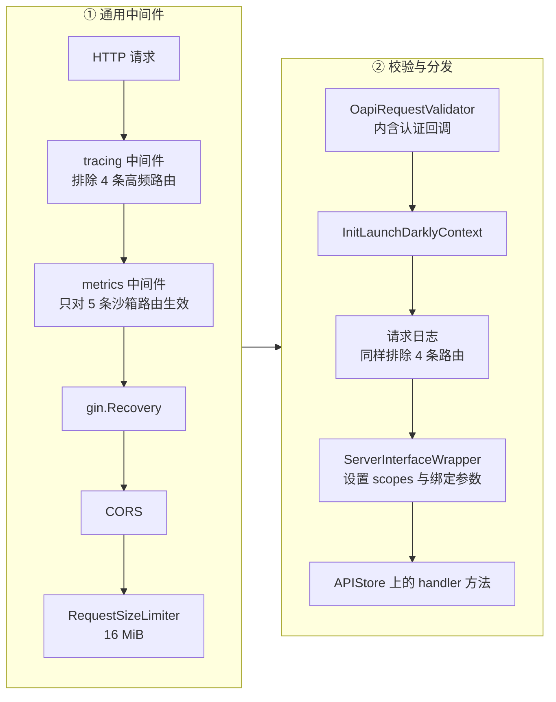
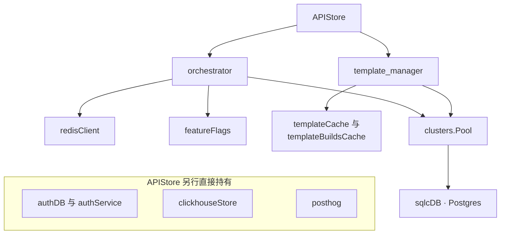
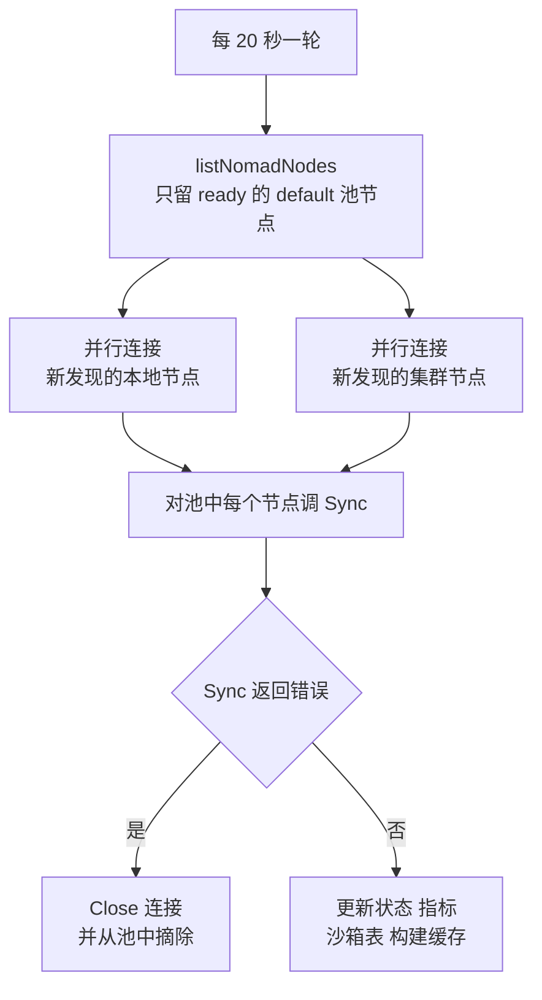

# 15 · API 服务的结构

> `packages/api` 是整个系统唯一对外的控制面入口：所有 SDK、CLI 与 dashboard 的请求都从这里进来，
> 再被分发到几十台 orchestrator 节点上。本篇不讲任何一个具体接口做什么，只讲这个进程是怎么搭起来的 ——
> 契约从哪来、中间件按什么顺序跑、依赖在哪里装配、连接怎么管、退出时怎么收尾。
>
> **读者**：想读懂 `packages/api` 任意一个 handler 的人。
> **预备**：[第 10 篇 · 系统架构](10-system-architecture.md)。熟悉 Go 与 HTTP 服务的一般结构即可，
> 不需要读过 OpenAPI 代码生成器的文档。
> **代码**：`packages/api/main.go`、`packages/api/internal/api/`、`packages/api/internal/handlers/store.go`、
> `packages/api/internal/middleware/`、`packages/api/internal/orchestrator/client.go`、`packages/api/internal/utils/`

---

## 0. 本篇要回答的问题

1. 路由表是谁写的？为什么 `packages/api` 里找不到一处 `router.POST("/sandboxes", ...)` 的手写代码？
2. 一个请求从 TCP 连接到 handler 函数体，中间经过哪几层，每层解决什么问题？
3. 请求校验发生了几次？为什么同一个请求会被两套路由匹配逻辑各匹配一遍？
   错误响应的状态码又是谁决定的，为什么认证失败返回 401 而不是校验器默认的 400？
4. 几十个依赖（Postgres、Redis、ClickHouse、Nomad、Loki、PostHog、LaunchDarkly）装配在哪里，
   其中任何一个起不来会怎样？
5. api 到每个 orchestrator 节点的 gRPC 连接是什么时候建的、什么时候断的？
6. 收到 SIGTERM 之后，这个进程还要活多久，为什么？

---

## 1. 一个控制面服务要解决的四件事

先把问题摆清楚。`packages/api` 是一个大约 3.2 万行 Go 代码的进程（`packages/api` 目录下非测试的 `.go`
文件行数合计，其中约 1.2 万行是生成代码），对外暴露 53 条 HTTP 路由，对内维护到每台沙箱节点的长连接。
它必须同时解决四件互相牵制的事：

**接口契约要和 SDK 一致。** e2b 有 Python、JS 两套 SDK 与一个 CLI，三者独立发版。
如果服务端的请求体字段和 SDK 的对不上，问题会在运行时才暴露。

**认证要在业务代码之前完成，但认证结果要能被业务代码和日志看到。** 认证有五种凭证形式
（详见[第 16 篇 §2](16-auth-and-multitenancy.md#2-五种凭证)），每条路由允许哪几种由接口定义决定，
不应该由 handler 自己判断。

**依赖很多，且大部分是外部服务。** Postgres、Redis、ClickHouse、Loki、PostHog、Nomad、LaunchDarkly，
再加上几十个 orchestrator 的 gRPC 连接。这些依赖要在进程启动时装配好，在退出时按序关闭。

**它是有状态的。** api 进程在内存里维护节点表、沙箱表、模板缓存。进程重启意味着这些状态要重建，
所以「优雅退出」不只是把 HTTP 连接排空，还包括让负载均衡器有时间把流量摘走。

下面四节分别对应这四件事，最后一节讲 ARM 适配版的差异。

---

## 2. 契约先行：从 OpenAPI 到 ServerInterface

### 2.1 生成什么

接口定义写在仓库根的 `spec/openapi.yml`。`packages/api/internal/api/generate.go` 里只有一行
`go:generate` 指令，调用 `oapi-codegen` 按 `packages/api/internal/api/cfg.yaml` 的配置生成
`api.gen.go`。配置里打开了四项产物：

| 产物 | 生成物 | 谁用 |
|---|---|---|
| `models` | 请求 / 响应结构体、枚举常量 | handler 与 SDK 侧测试 |
| `gin-server` | `ServerInterface`、`ServerInterfaceWrapper`、`RegisterHandlersWithOptions` | `main.go` 注册路由 |
| `client` | 一个 Go 客户端 | 集成测试与内部调用方 |
| `embedded-spec` | gzip 压缩后内嵌的 spec 字节 + `GetSwagger()` | 运行时的请求校验器 |

最后一项是关键：**spec 不是只在编译期用一次，它被压缩进二进制，运行时还要再解析一遍**。
`api.gen.go` 的 `GetSwagger()` 解压 `rawSpec` 并用 `openapi3.NewLoader()` 装载成 `*openapi3.T`，
`main.go` 的 `run()` 在启动早期调用它，装载失败就直接返回退出码 1。

`ServerInterface` 是一个有 53 个方法的接口，每个方法对应一条「方法 + 路径」。方法名由路径机械推导：
`POST /sandboxes/{sandboxID}/pause` 变成 `PostSandboxesSandboxIDPause`。
`packages/api/internal/handlers/store.go` 顶部的 `var _ api.ServerInterface = (*APIStore)(nil)`
把「`APIStore` 必须实现全部 53 个方法」变成编译期约束 —— 往 spec 里加一条路径，代码就编译不过，
直到有人补上 handler。这是这套生成方案最实在的收益。

代价是方法名不可读、handler 文件与接口方法之间没有强制对应关系。上游的处理办法是约定：
`internal/handlers/` 下 46 个非测试文件，每个文件放一到几个语义相关的 handler，文件名按业务命名
（`sandbox_create.go`、`template_delete.go`），而不是按生成的方法名命名。

### 2.2 路由表来自哪里

`RegisterHandlersWithOptions()` 在 `api.gen.go` 末尾，函数体就是 53 行 `router.POST(...)` / `router.GET(...)`。
`main.go` 的 `NewGinServer()` 调用它，把 `apiStore` 作为 `ServerInterface` 传进去。所以路由表是
spec 的机械投影，仓库里没有一处手写路由。

注册进 gin 的不是 handler 本身，而是 `ServerInterfaceWrapper` 上的同名方法。以
`ServerInterfaceWrapper.GetSandboxes()` 为例，它做三件事：

1. 把该路由允许的安全方案名写进 gin context（`c.Set(ApiKeyAuthScopes, []string{})` 等），
   供 handler 事后判断请求是用哪种凭证进来的；
2. 用 `runtime.BindQueryParameter()` 把查询参数按 spec 里声明的序列化风格解析进 `GetSandboxesParams`，
   失败则调 `siw.ErrorHandler(c, ..., http.StatusBadRequest)`；
3. 调 `siw.Handler.GetSandboxes(c, params)`。

`ErrorHandler` 由 `main.go` 注入，转发给 `packages/api/internal/utils/error.go` 的 `ErrorHandler()`，
所以生成代码里的参数绑定错误和别处的错误走同一条格式化路径。

### 2.3 校验发生了两次

请求会被**两套独立的路由匹配逻辑各匹配一遍**，这一点容易让人困惑，值得说清楚。

第一套是 gin 自己的前缀树，用来决定调哪个 wrapper。第二套在
`middleware.OapiRequestValidatorWithOptions(swagger, ...)` 里面：这个中间件在构造时用
`gorillamux.NewRouter(swagger)` 从 spec 建了一棵**自己的**路由树，每个请求进来先
`router.FindRoute(req)` 找到 spec 里的 operation，再用 `openapi3filter` 校验路径参数、查询参数、
请求头与请求体是否符合 schema。找不到 operation 时返回 404，schema 不符时返回 400。

这就是为什么 `NewGinServer()` 一开头要写 `swagger.Servers = nil`：kin-openapi 的校验器会拿
spec 里的 `servers` 做 Host 校验，而这个进程可能跑在任何域名下，清空 `Servers` 就跳过这一项。

需要说明的是这条链上**没有请求速率限流**：`RequestSizeLimiter` 的 16 MiB 只限制单个请求体的大小，
仓库里没有按团队或按 IP 的令牌桶。控制面的过载保护完全依赖配额检查（`Reserve`）与节点侧的准入，
不在 HTTP 层。

两套匹配的代价是每个请求多一次路由查找和一次完整的 schema 校验；收益是**接口契约在运行时也是强制的**，
handler 拿到的参数一定已经通过 spec 校验，不需要自己写字段级检查。
注意 `r.UseRawPath = true`：gin 用未解码的路径做匹配，这样模板 ID 里用 `%2F` 编码的斜杠
（形如 `team-slug/my-template`）不会被当成路径分隔符切开；参数值在交给 handler 前仍会被解码。

---

## 3. 中间件链与错误模型

### 3.1 顺序

`NewGinServer()` 里的 `r.Use(...)` 调用顺序就是执行顺序。完整的链是：



几个位置是刻意安排的。

**认证嵌在校验器里，不是独立中间件。** `main.go` 用
`auth.CreateAuthenticationFunc()` 组装五个 `Authenticator`（API key、access token、supabase token、
supabase team、admin token），作为 `openapi3filter.Options.AuthenticationFunc` 传给校验器。
校验器在校验到某条 operation 的 `security` 段时回调它，按 `input.SecuritySchemeName` 选中对应的
authenticator。**哪条路由接受哪种凭证，因此完全由 spec 决定。**
五个 authenticator 各自做什么、拿到什么主体，接在[第 16 篇 §3](16-auth-and-multitenancy.md#3-认证怎么接进请求链)。

`spec/openapi.yml` 里安全方案名带数字前缀（`Supabase1TokenAuth`、`Supabase2TeamAuth`），
文件里的注释说明了原因：生成代码按字母序处理安全方案，加数字是为了让 token 先于 team 被验，
这样验 team 时已经能拿到 user。这是一处把语义压进命名的妥协。

**日志在认证之后。** `main.go` 里这段有注释：请求日志必须在授权完成后执行，才能把 team ID 记进日志。
所以 `LoggingMiddleware` 不是直接 `r.Use`，而是包在一个闭包里，闭包先用 `auth.GetTeamInfo(c)`
取 team ID，取到了就 `l.With(logger.WithTeamID(teamID))` 派生一个带 team 字段的 logger，
再构造 `LoggingMiddleware` 执行。代价是每个请求都要新建一次中间件闭包。

**`gin.Recovery()` 在 tracing 和 metrics 之后。** 这两层自身 panic 不会被兜住。
推论：这样排是为了让 panic 恢复发生在 span 内部，从而让 500 出现在 trace 里；
代价是最外两层没有保护。

### 3.2 按路由裁剪

`packages/api/internal/middleware/exclude.go` 提供 `ExcludeRoutes` 与 `IncludeRoutes`，
两者都把 `c.Request.URL.Path` 和给定的路由模板按 `/` 切段逐段比对，`:` 开头的段视为通配。

- tracing 与日志排除 `/health`、`/sandboxes/:sandboxID/refreshes` 和两条构建轮询路由。
  这四条都是高频轮询，全量采样会淹没 trace 与日志。
- metrics 只对五个路径模板生效：`/sandboxes`、`/sandboxes/:sandboxID`、`/sandboxes/:sandboxID/pause`、
  `/sandboxes/:sandboxID/connect`、`/sandboxes/:sandboxID/resume`（匹配只看路径，不区分方法）。
  也就是说 HTTP 层的时延指标只覆盖沙箱生命周期，其余接口不产生这类指标。

metrics 中间件本身（`internal/middleware/otel/metrics/middleware.go`）有一个细节值得注意：
它用 `ginCtx.FullPath()` 而不是原始路径作为 `http.route` 属性，所以带 sandbox ID 的路径不会
把指标基数撑爆；同时它优先使用 `processingStartTimeKey` 记录的时间点计算时延 ——
这个时间点由 `SetProcessingStartTime` 在认证回调开始前写入，**目的是把请求体上传与解析的耗时排除在时延之外**。
对一个允许 16 MiB 上传的接口，这个区分是必要的：否则慢客户端的上传时间会被记成服务端处理时间。

### 3.3 错误响应

对外的错误体统一是 `{"code": <int>, "message": <string>}`。产生它的地方有两处：

- `packages/shared/pkg/apierrors` 的 `SendAPIStoreError()`，供 handler 内部使用，
  `APIStore.sendAPIStoreError()` 是它的薄封装。同包的 `APIError` 结构体
  （`Err`、`ClientMsg`、`Code` 三字段）是 api 内部传递错误的统一形式：
  `Err` 进日志与 trace，`ClientMsg` 进响应体。
- `packages/api/internal/utils/error.go` 的 `ErrorHandler()`，供校验器与生成代码使用。

`ErrorHandler()` 做了几件容易被忽略的事。它先按路径判断是不是旧版 SDK / CLI 在访问已下线的
`/instances`、`/envs` 或 multipart 版模板接口，是的话把面向用户的消息替换成「请升级 SDK」，
同时把原始校验错误留给日志。然后它按消息前缀分流：`team forbidden: ` 与 `team blocked: `
转成 403，`error in openapi3filter.SecurityRequirementsError: ...` 保持传入的状态码。

前缀是 `MultiErrorHandler()` 加上去的。校验器开了 `MultiError: true`，一个请求可能同时违反多条
`security` 要求（比如既没有 API key 又没有 supabase token），`processCustomErrors()` 从这堆错误里
挑出第一条「不是缺失 header」的错误上报，并按错误类型加前缀。用字符串前缀在两个函数之间传递错误分类，
是这套代码里比较脆的一环 —— 它绕开了 Go 的错误包装机制，只因为中间隔着第三方库的
`ErrorHandler func(c, message string, code int)` 签名，传不了 `error`。

状态码的最终决定权在 `main.go` 注入的这一行：

```go
statusCode := max(c.Writer.Status(), fallbackStatusCode)
```

第三方中间件对校验失败一律给 400、路径不存在给 404。而 `CommonAuthenticator.Authenticate()`
在认证失败时会先 `ginCtx.Status(http.StatusUnauthorized)` 再返回错误。取两者较大值，
401 就压过了 400。这是一个可用但脆弱的技巧：它依赖「更严重的错误码数值更大」这一并不成立的通则，
只是在 400 / 401 / 403 / 404 这几个具体值上恰好成立。

---

## 4. APIStore：依赖装配在一个结构体里

`packages/api/internal/handlers/store.go` 的 `APIStore` 既是 `ServerInterface` 的实现，
也是全部依赖的持有者。它有 17 个字段，其中 `Healthy atomic.Bool` 是唯一的运行期可变状态。



`NewAPIStore()` 的装配顺序是被依赖关系约束的：先建 Postgres 客户端（`sqlcdb.NewClient`，
最大 40 连接、最小 5 空闲）与 auth 库客户端，再建 ClickHouse、PostHog、Nomad、Redis、Loki 查询客户端，
然后是 `clusters.NewPool()`、feature flags 客户端、访问令牌生成器，最后才是 `orchestrator.New()`
和 `template_manager.New()` —— 后两个需要前面几乎所有东西。

两处设计取舍值得点出。

**任何一个依赖初始化失败都是 `logger.L().Fatal`。** 从 Postgres 到 Loki 到 PostHog，
`NewAPIStore()` 里十余处错误处理全部直接终止进程。好处是不存在「半残」的 api 实例；
代价是一个只影响日志查询的 Loki 配置错误也会让整个控制面起不来。
唯一的例外是 ClickHouse：`config.ClickhouseConnectionString` 为空时装配一个
`clickhouse.NewNoopClient()`，这条路径是给不需要指标的部署留的。

**健康状态由节点数决定。** `NewAPIStore()` 末尾起一个 goroutine，每 5 ms 检查一次
`orch.NodeCount()`，直到发现至少一个节点才 `a.Healthy.Store(true)`。
`GetHealth()` 据此返回 200 或 503。语义是明确的：**没有节点就没法创建沙箱，此时对外宣称不健康**。
注意这个标志此后只会被关闭流程置回 false，不会因为节点全部掉线而重新变成 false。

`APIStore.Close()` 是反向的收尾：关模板计数器、PostHog、orchestrator、模板缓存、auth service、
clusters 池、两个数据库客户端、构建缓存、Redis，把所有错误用 `errors.Join` 汇总返回。
它被注册进 `main.go` 的 `cleanupFns`。

---

## 5. 启动、双服务器与退出

`main.go` 的 `run()` 是唯一的编排点，`main()` 只负责 `os.Exit(run())`。顺序如下：

1. 解析 `-port`、`-debug` 标志；生成 `serviceInstanceID`（一个 UUID）。
2. 初始化 telemetry，随后建三个 logger：服务自身的、沙箱外部日志的、沙箱内部日志的。
3. **迁移版本闸门**：`sqlcdb.CheckMigrationVersion()` 比较数据库的 goose 版本与编译期通过
   `-ldflags` 注入的 `expectedMigrationTimestamp`。数据库版本**低于**期望值就 Fatal；
   高于则放行，为的是允许回滚旧版本 api 到已迁移的库上。
4. `cfg.Parse()` 从环境变量解析配置（见[第 14 篇 §1](14-config-flags-versions.md#1-配置的四条渠道)）。
5. `api.GetSwagger()` 解析内嵌 spec。
6. `handlers.NewAPIStore()` 装配依赖。
7. 建 gRPC 监听（默认端口 5009，`API_GRPC_PORT`）并注册 `handlers.NewSandboxService(apiStore)`。
8. `NewGinServer()` 组装 HTTP 服务器。
9. 三个 goroutine 并行：跑 HTTP、跑 gRPC、等信号。

第 7 步的 gRPC 服务器容易被忽略：**api 除了对外的 HTTP，还对内暴露一个 gRPC 接口给 client-proxy（edge）**。
它只有一个方法，`packages/api/internal/handlers/proxy_grpc.go` 的 `SandboxService.ResumeSandbox()`：
当有流量打到一个已暂停的沙箱域名上时，edge 调这个接口把沙箱拉起来，api 返回目标 orchestrator 的 IP。
这条路径不走 HTTP，因此不经过第 3 节那整条中间件链，认证方式也不同 —— 它自己用
`subtle.ConstantTimeCompare` 校验 gRPC metadata 里携带的访问令牌，超时固定 300 s 且不允许调用方覆盖。

### 5.1 超时常量

HTTP 服务器上配了四个超时，每个都有明确来由：

| 常量 | 上游 2026.09 取值 | 约束它的东西 |
|---|---|---|
| `maxReadHeaderTimeout` | 5 s | 防慢速头攻击 |
| `maxReadTimeout` | 10 s | 请求体读取上限，与 16 MiB 上传上限配套 |
| `maxWriteTimeout` | 75 s | 最慢的同步接口（创建沙箱）的上限 |
| `idleTimeout` | 620 s | 必须大于 GCP 负载均衡器 600 s 的上游空闲超时，代码注释里点明了这是为了避免竞态 |

`idleTimeout` 是个很典型的例子：一个后端服务的常量被前面一跳的基础设施参数反向决定。
如果服务端先关空闲连接，负载均衡器可能正好在这条连接上发出新请求，用户看到随机的 502。

### 5.2 退出

收到 SIGTERM 或 SIGINT 后，第三个 goroutine 依次做：

1. `apiStore.Healthy.Store(false)` —— 健康检查开始返 503；
2. 非本地环境下 **`time.Sleep(15 * time.Second)`**；
3. `s.Shutdown(ctx)` 排空 HTTP 连接；
4. `grpcServer.GracefulStop()`。

那 15 秒是给负载均衡器发现 503 并把这个实例摘出后端池的窗口。少了这一步，
`Shutdown` 会立刻拒绝新连接，而负载均衡器还在往这里发请求。
本地环境（`env.IsLocal()`）跳过，为的是开发时能秒退。

HTTP 与 gRPC 都停下来之后，`wg.Wait()` 返回，`cleanup()` 才执行。
`cleanup` 是一个 `sync.Once` 包住的函数，它给自己开一个 30 s 超时的独立 context，
**并行**跑所有 `cleanupFns`（目前只有 `apiStore.Close`），并行是为了不引入隐式的关闭顺序依赖。
每个失败的清理操作把 `exitCode` 加一，最终作为进程退出码。

代码里的 TODO 诚实地写出了这套机制的边界：它只等 HTTP handler 返回，不等 handler 派生出的后台
goroutine 完成；这些 goroutine 在 context 取消后就地终止。

---

## 6. 与 orchestrator 的连接管理

api 需要对每个沙箱节点发起 gRPC 调用。连接的建立、复用与摘除在
`packages/api/internal/orchestrator/` 下。

**一个节点一条连接，四个 stub 共用。** `nodemanager.NewClient()`
（`internal/orchestrator/nodemanager/client.go`）用 `grpc.NewClient()` 建一条明文连接
（`insecure.NewCredentials()` —— api 与节点之间被假定在同一个可信网络里），挂上 otelgrpc 的
stats handler，并配置 keepalive：每 30 s 发一次 ping、5 s 超时、无活跃流时也发
（`PermitWithoutStream: true`）。最后一项对这个场景是必需的：节点上没有沙箱操作时连接会长时间空闲，
中间的 NAT 或防火墙可能悄悄回收它。

连接交给 `clusters.NewGRPCClient()`（`internal/clusters/client.go`）包装成 `GRPCClient`，
在同一条 `*grpc.ClientConn` 上建四个 stub：`Info`、`Sandbox`、`Volumes`、`Template`。
HTTP/2 的多路复用让这四个服务共享一条 TCP 连接，`Close()` 只需关这一条。

**发现与摘除靠 20 秒一轮的同步循环。** `orchestrator.New()` 起 `keepInSync()` goroutine
（`internal/orchestrator/cache.go`），立即跑一轮，之后每 `cacheSyncTime`（20 s）跑一次
`syncNodes()`。每一轮：



`listNomadNodes()`（`internal/orchestrator/client.go`）向 Nomad 查询状态为 ready、节点池为
default 的节点，把 `n.Address` 与 `consts.OrchestratorAPIPort` 拼成 gRPC 地址。
`connectToNode()` 建连接后立刻调一次 `client.Info.ServiceInfo()`，拿到节点 ID、服务版本、
commit 与机器信息 —— **节点 ID 来自 orchestrator 自报，不是 Nomad 的节点 ID**；
Nomad 短 ID 只作为发现阶段的标识保留，字段上已经标了 `Deprecated`。
这一步失败就关掉连接并返回错误，不会把半成品节点放进池子。单次连接尝试有 5 s 超时
（`nodeConnectTimeout`），且每个节点的连接在独立 goroutine 里进行，
避免一台慢节点拖住整轮同步。

节点在池中的键是 `scopedNodeID()` 的结果：本地集群直接用节点 ID，远端集群前缀上 cluster ID，
这样多集群的节点可以放进同一张 `smap`。集群的来源见[第 21 篇 §4](21-clusters-and-discovery.md#4-三种发现来源)。

`Node.Sync()`（`internal/orchestrator/nodemanager/sync.go`）最多重试四次，每次拉一遍
`ServiceInfo` 与该节点上的沙箱列表，同步进 api 的沙箱表；四次都失败就把节点标成 `unhealthy` 并返回。
`syncNodes()` 收到错误后关连接、`deregisterNode()`。
所以**节点摘除的最坏延迟是一轮同步周期加上重试耗时**，在这段窗口里放置算法仍可能选中这个节点 ——
处理办法在[第 19 篇 §6](19-node-management-and-placement.md#6-失败与重试)。

进程退出时，`Orchestrator.Close()` 遍历池中所有节点逐个 `node.Close()`，
再注销指标回调、关团队指标观测器、analytics 与路由目录。

`internal/utils/grpc.go` 的 `UnwrapGRPCError()` 是这条链路上的收尾工具：
把 gRPC 的 `status` 错误压成 `[<Code>] <Message>` 的字符串，供上层拼进面向用户的错误消息。

---

## 7. ARM 适配版的差异

两处。其一，`packages/api/main.go` 的三个 HTTP 超时被整体放宽：`maxReadHeaderTimeout` 从 5 s 改到
60 s，`maxReadTimeout` 从 10 s 改到 300 s，`maxWriteTimeout` 从 75 s 改到 300 s。
其二，`packages/api/internal/handlers/store.go` 在 `ORCHESTRATOR_TYPE` 为 `k8s` 时额外构造一个
Kubernetes 客户端并传给 `clusters.NewPool()` 与 `orchestrator.New()`；
`internal/orchestrator/client.go` 里原先内联的 Nomad 节点枚举被抽成 `NodeDiscovery` 接口，
Nomad 与 Kubernetes 各一个实现。

细节与代价见[第 76 篇 §4](76-k8s-discovery.md#4-第二层api-里的-nodediscovery)与
[第 77 篇 §7](77-api-and-flags-on-arm.md#7-api-的超时http-服务端与实例同步)。

---

## 8. 小结

- 路由表、请求 / 响应类型与 `ServerInterface` 都由 `spec/openapi.yml` 经 `oapi-codegen` 生成；
  `var _ api.ServerInterface = (*APIStore)(nil)` 把接口完整性变成编译期约束。
- spec 被内嵌进二进制，运行时由 `OapiRequestValidator` 再解析一遍，用 kin-openapi 自己的路由树
  做第二次匹配与 schema 校验。收益是契约在运行时强制，代价是每请求两次路由查找。
- 认证不是独立中间件，而是校验器的 `AuthenticationFunc` 回调，因此「哪条路由收哪种凭证」由 spec 决定。
- 中间件顺序上，日志刻意排在认证之后以便记录 team ID；tracing 与日志排除四条高频轮询路由，
  HTTP 指标只覆盖五条沙箱路由。
- 错误响应统一为 `{code, message}`；状态码由 `max(c.Writer.Status(), fallbackStatusCode)` 决定，
  错误分类靠字符串前缀在校验器与错误处理器之间传递。
- `APIStore` 是依赖容器兼 `ServerInterface` 实现，装配期任何依赖失败都 Fatal（ClickHouse 例外，
  可退化为 noop）；健康标志由「至少发现一个节点」触发。
- 进程同时跑 HTTP 与一个只有 `ResumeSandbox` 的 gRPC 服务，后者供 client-proxy 唤醒暂停的沙箱，
  不经过 HTTP 中间件链。
- 退出流程是「先转 503 → 等 15 s 让负载均衡器摘流 → 排空 HTTP → 停 gRPC → 并行清理」；
  它不等待 handler 派生的后台 goroutine。
- 每个 orchestrator 节点一条明文 gRPC 连接、四个 stub 共用，带 30 s keepalive；
  连接由 20 s 一轮的 `keepInSync` 循环建立与摘除，节点身份以 orchestrator 自报的 node ID 为准。
- ARM 适配版放宽了三个 HTTP 超时，并把节点发现抽象成 `NodeDiscovery` 接口以支持 Kubernetes。

## 延伸阅读 / 下一篇

- [第 16 篇 §2](16-auth-and-multitenancy.md#2-五种凭证)：五种凭证的语义、存储与校验。
- [第 17 篇 · 创建沙箱](17-sandbox-create-api.md)：本篇这条链路上最重的一个 handler。
- [第 19 篇 §3](19-node-management-and-placement.md#3-放置算法采样过滤打分)：节点表建立之后怎么被用来选节点。
- [第 21 篇 §4](21-clusters-and-discovery.md#4-三种发现来源)：`clusters.Pool` 与远端集群节点的来源。
- [第 24 篇 §2](24-api-metrics-and-analytics.md#2-端点到数据源的矩阵)：本篇提到的中间件产出的数据去了哪里。
- [第 90 篇 · 环境变量与配置项总表](90-config-reference.md)：`cfg.Config` 各字段的完整说明。
- OpenAPI 代码生成器的行为以 `github.com/oapi-codegen/oapi-codegen/v2` 与
  `github.com/oapi-codegen/gin-middleware` 的文档为准。
