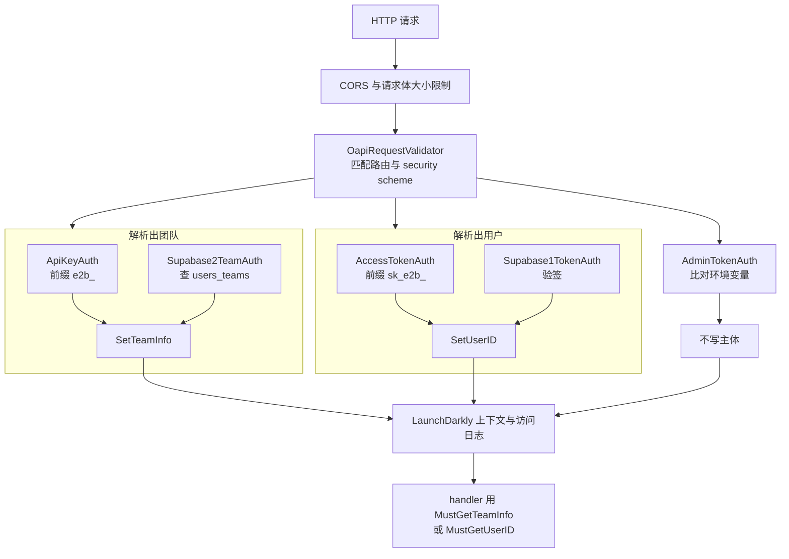

# 16 · 认证与多租户

> 一个公开的沙箱服务要同时招待五类调用者：SDK 里的运行时代码、命令行工具、浏览器里的控制台、
> 运维脚本，以及沙箱自己暴露给外界的流量。它们的主体不同、生命周期不同、泄露后果也不同，
> 于是 e2b 用了五套凭证。本篇讲这五套凭证各自的作用域、怎么存、怎么校验，
> 以及团队档位（tier）的配额到底在创建路径的哪一行被拦下。
>
> **读者**：工程师、安全工程师。
> **预备**：[第 15 篇 §3](15-api-service-structure.md#3-中间件链与错误模型)（中间件链与 OpenAPI 生成代码）。
> **代码**：`packages/auth/pkg/auth/`、`packages/shared/pkg/keys/`、`packages/db/pkg/auth/`、
> `packages/api/internal/team/limits.go`、`packages/api/internal/orchestrator/create_instance.go`、
> `packages/api/internal/sandbox/sandbox_envd_secret.go`、`spec/openapi.yml`

---

## 0. 本篇要回答的问题

1. 租户的边界画在哪个对象上？用户、团队、沙箱三者是什么关系？
2. 五种凭证各自代表谁、能做什么、由谁校验？为什么不能合并成一种？
3. 凭证在库里以什么形态存在？为什么可以用唯一索引查而不是逐行比对？
4. 沙箱级 token 为什么是「算出来的」而不是「随机生成再存库」？hash seed 泄露会怎样？
5. tier 的并发上限、时长上限、vCPU / 内存上限分别在创建路径的哪一步被检查？漏检了什么？

---

## 1. 租户边界画在 team 上

e2b 的租户单位是团队（team），不是用户。这条边界决定了后面所有的设计。

数据库里的骨架是这样的（`packages/db/migrations/` 的初始迁移
`20231124185944_create_schemas_and_tables.sql` 加上后续若干次演进）：

```text
auth.users ──┬── public.users_teams ──┬── public.teams ── tier(text) ── public.tiers
             │      (多对多, is_default)      │
             │                                ├── public.team_api_keys   团队级凭证
             │                                ├── public.envs            模板
             │                                └── public.addons          额度加购
             └── public.access_tokens                                    用户级凭证
```

几条能从表结构直接读出来的规则：

- 模板（`envs.team_id`）、沙箱（运行态里带 `TeamID`）、volume 都挂在团队上；用户本身不拥有资源。
- 一个用户可以属于多个团队，`users_teams.is_default` 标出默认团队。注册时由
  `post_user_signup()` 触发器建一个同名团队，档位固定为 `base_v1`
  （`20250825100000_remove_default_keys.sql` 里的版本）。
- 团队有两个封禁位：`is_blocked`（带 `blocked_reason`）与 `is_banned`。
- 团队还有 `slug`（模板别名的命名空间）与可选的 `cluster_id`（把该团队钉在某个集群上，
  见[第 21 篇 §2](21-clusters-and-discovery.md#2-数据模型集群是一行数据库记录)）。

于是「谁在调用」这个问题有两种答案：**一个团队**，或者**一个用户**。
凡是拿到团队主体的请求可以直接操作资源；凡是只拿到用户主体的请求，
必须先经过一次「这个用户属于哪些团队」的折算——这件事在
`packages/api/internal/handlers/auth.go` 的 `GetTeam()` 与 `resolveTemplateAndTeam()` 里做：
前者按 `teamID` 参数或 `is_default` 选团队，后者对模板标识符做归属校验，
不属于自己的模板一律 403 而不是 404。

## 2. 五种凭证

`packages/auth/pkg/auth/consts.go` 把所有请求头与前缀集中定义，
`spec/openapi.yml` 的 `securitySchemes` 声明了其中五个安全方案。

| 凭证 | 请求头 | 前缀 | 认证后拿到 | 库里的位置 |
|---|---|---|---|---|
| API key | `X-API-Key` | `e2b_` | 团队 + 配额 | `team_api_keys.api_key_hash` |
| access token | `Authorization` | `Bearer sk_e2b_` | 用户 ID | `access_tokens.access_token_hash` |
| Supabase JWT | `X-Supabase-Token` | 无 | 用户 ID | 不落库，验签得出 |
| Supabase team | `X-Supabase-Team` | 无 | 团队 + 配额 | 值是 team ID，查 `users_teams` |
| admin token | `X-Admin-Token` | 无 | 无主体 | 不落库，与环境变量比对 |

前两种给程序用，后三种给人或运维用。它们的分工可以从 OpenAPI 里每个端点的 `security`
字段读出来，规律很清楚：

- **管沙箱**（`POST /sandboxes`、pause、resume、kill、list、metrics）接受 API key
  或「Supabase JWT + team 头」。**不接受** access token——因为 access token 只代表用户，
  而沙箱操作必须锚定到一个确定的团队。
- **管模板与团队**（`POST /templates`、`POST /templates/{id}`、`GET /teams`）接受 access token。
  CLI 登录后拿到的就是它。
- **发凭证的端点**（`POST /access-tokens`、`/api-keys` 的增删改查）只接受 Supabase JWT。
  这是一条有意的收窄：**不能用凭证去发新凭证**，必须回到浏览器登录态。
- **运维端点**（`GET /nodes`、`POST /admin/teams/{teamID}/sandboxes/kill`）只接受 admin token。

两个 Supabase 方案在同一个端点上是「与」的关系，不是「或」：
`Supabase1TokenAuth` 先验签拿到 user ID 写进 gin context，`Supabase2TeamAuth` 再拿这个 user ID
去查 `users_teams` 确认他确实在这个团队里。名字里的 1 和 2 是为了让生成代码按字母序
先跑前者——`spec/openapi.yml` 在这两个方案上方的注释直说了这一点。这是个脆弱的约定：
顺序靠命名维持，没有别的机制保证。

还有两种凭证不在 OpenAPI 的安全方案里，因为它们不保护控制面而是保护数据面：

- **envd access token**：沙箱内守护进程 envd 的门禁。请求头 `X-Access-Token`
  （`packages/envd/internal/api/auth.go`），只有创建沙箱时带了 `secure: true` 才会生成。
- **traffic access token**：沙箱对外暴露端口的门禁。请求头 `e2b-traffic-access-token`，
  由 orchestrator 侧的反向代理校验（`packages/orchestrator/internal/proxy/proxy.go`），
  只在请求体里关掉了 `allowPublicTraffic` 时才生成。校验时跳过 envd 自己的端口，
  因为那个端口有上面一条独立的门禁。

## 3. 认证怎么接进请求链

e2b 没有写一个独立的认证中间件。认证是挂在 OpenAPI 请求校验器上的回调（这条中间件链的全貌见
[第 15 篇 §3](15-api-service-structure.md#3-中间件链与错误模型)）：
`packages/api/main.go` 用 `auth.CreateAuthenticationFunc()` 把五个 `Authenticator`
组装成一个 `openapi3filter.AuthenticationFunc`，交给
`middleware.OapiRequestValidatorWithOptions`。校验器解析出当前路由声明了哪个安全方案，
再回调到对应的 authenticator。



五个 authenticator 共用一个泛型实现 `CommonAuthenticator[T]`
（`packages/auth/pkg/auth/middleware.go`），三段式：`GetHeaderKeysFromRequest()`
按 `HeaderKey` 描述取头、去掉 `RemovePrefix`（`Bearer `）、检查 `Prefix`；
`ValidationFunc` 做真正的校验；`SetContextFunc` 把结果写进 gin context。
handler 之后用 `auth.MustGetTeamInfo(c)` / `auth.MustGetUserID(c)` 取回——
名字里的 Must 意味着取不到就 panic，靠的是 OpenAPI 里那份 `security` 声明的正确性。

这个位置有两个后果。**收益**：认证的作用域和 OpenAPI 文档严格一致，不会出现
「文档说要鉴权、代码忘了加」的漂移。**代价**：不在 OpenAPI 路由表里的路径完全不过认证，
而 `packages/api/main.go` 里日志中间件被排在校验器之后，正是为了能在日志里带上 team ID——
也就是说认证失败的请求在这条链上留下的信息更少。

admin token 的校验是 `adminValidationFunction()` 里一行 `token != adminToken` 的普通字符串比较，
不是常量时间比较。同时 `ADMIN_TOKEN` 在 `packages/api/internal/cfg/model.go` 里没有 `required` 标记：
不配置时它是空串，而请求头为空会先被 `GetHeaderKeysFromRequest()` 判成缺失头，
所以未配置等于运维端点全关，不会意外敞开。

## 4. 凭证的存储与哈希

`packages/shared/pkg/keys/` 里有三套互不相干的哈希，混淆它们是读这块代码最容易踩的坑。

**第一套：API key 与 access token 的落库哈希。** `key.go` 的 `GenerateKey(prefix)`
取 20 字节随机数，hex 编码成 40 个字符，拼上前缀作为给用户看的原文；
落库的是 `sha256.go` 的 `Hash()` 对**解码后的 20 字节**做 SHA-256，
base64（无填充）后加上 `$sha256$` 前缀。验证走 `VerifyKey(prefix, key)`：
检查前缀、hex 解码、同样算一遍，拿结果去查库。

这里的关键取舍是**不加 per-key 盐**。代价是同一个 key 在任何一次泄露的库备份里都是同一串哈希，
而且抗不住针对 20 字节随机数的暴力枚举以外的任何结构性弱点；收益是哈希值本身可以做等值查询，
`20250825102440_add_hash_indexes.sql` 给两张表的哈希列各建了一个唯一索引，
认证因此是一次索引查找而不是全表扫描后逐行比对。对一条落在每个 API 请求前面的路径，
这个收益是决定性的。原文用了 20 字节的密码学随机数，也确实让离线枚举不成立。

原文不落库，但列表页要显示，所以 `MaskKey()` 另存了四个字段：前缀、原文长度、
前 2 个字符、后 4 个字符（`identifierValuePrefixLength` / `identifierValueSuffixLength`）。
`GET /api-keys` 返回的就是这组掩码字段（`packages/api/internal/handlers/apikey.go`）。

这套哈希是后加的。演进痕迹在迁移里很清楚：`20250211160814_add_token_hashes.sql` 加列，
`20250825102800_hash_existing_keys.sql` 用一段 plpgsql 就地把明文重算成同样格式的哈希并回填，
然后把哈希列设成 NOT NULL，`20250910063940_make_raw_keys_nullable.sql` 才把明文列改成可空、
并把 `access_tokens` 的主键从明文换成 `id`。同一时期
`20250825100000_remove_default_keys.sql` 从注册触发器里删掉了「自动发一把 key」的两行——
数据库层不再有能力生成凭证，生成权收回到应用层的 `GenerateKey()`。

**第二套：envd 侧的 SHA-512。** `sha512.go` 的 `HashAccessToken()` 是 SHA-512 的 hex 编码，
只用在一个地方：orchestrator 恢复沙箱时把 token 的哈希写进 Firecracker 的 MMDS
（`packages/orchestrator/internal/sandbox/fc/process.go`），envd 启动后用它来判断
`POST /init` 请求里带的 token 是否是当前该用的那一个（`packages/envd/internal/api/init.go`
的 `checkMMDSHash()`）。约定里 `hash("")` 表示「明确允许空 token」。它和第一套没有任何关系。

**第三套：沙箱 token 的 HMAC 派生。** 见下一节。

## 5. hash seed 与沙箱级 token

沙箱级的两种 token 不落库，是从一个进程级密钥确定性派生出来的
（`packages/api/internal/sandbox/sandbox_envd_secret.go`）：

```text
SANDBOX_ACCESS_TOKEN_HASH_SEED  ──> HMAC-SHA256 key
        │
        ├── HMAC(key, sandboxID)                      ──> envd access token
        └── HMAC(key, "sandbox-traffic-" + sandboxID) ──> traffic access token
```

`NewAccessTokenGenerator()` 在 seed 为空时直接返回错误，`NewAPIStore()` 拿到错误就
`Fatal` 退出，所以这个环境变量事实上是必填的。

为什么是派生而不是随机生成后存库：同一个沙箱的 token 会在多个入口被要求给出——
创建（`sandbox_create.go`）、恢复（`sandbox_resume.go`）、连接（`sandbox_connect.go`）、
以及给 client-proxy（edge）用的 gRPC 代理（`proxy_grpc.go`）都调用同一个 `getEnvdAccessToken()`。
派生让这四条路径不需要任何共享存储就能算出同一个值，也不需要在 pause / resume 之间持久化它。

代价有三条，都要写清楚：

1. token 完全由 sandbox ID 决定。知道 seed 的人可以推导出**所有**沙箱的 token，
   包括还没创建的。seed 是全系统单点。
2. 轮换 seed 会让所有在跑的沙箱的 token 立刻失效，因为 envd 侧存的是旧 token
   而 API 侧会算出新的。
3. 同一个沙箱 ID 在 envd token 与 traffic token 之间靠一个字符串前缀区分，
   `sandboxTrafficPrefix = "sandbox-traffic"` 是唯一的域分隔手段。

`getEnvdAccessToken()` 还额外要求模板的 envd 版本不低于 `0.2.0`，否则返回 400 让用户重建模板。

## 6. tier 与配额：额度在哪几步被检查

档位定义在 `tiers` 表（`concurrent_instances`、`concurrent_template_builds`、
`max_length_hours`、`max_vcpu`、`max_ram_mb`、`disk_mb`），但代码从不直接读它。
`20251011200438_create_addons_table.sql` 建了一个视图 `team_limits`，
把档位数值加上该团队当前生效的加购（`addons`，按 `valid_from` / `valid_to` 过滤后求和）：

```sql
(tier.concurrent_instances + a.extra_concurrent_sandboxes) as concurrent_sandboxes
```

认证时的 `GetTeamWithTierByAPIKey` 一次 join 把 `teams` 与 `team_limits` 都取回来
（`packages/db/pkg/auth/sql_queries/teams/get_team.sql`），装进
`types.Team.Limits`（`packages/auth/pkg/types/limits.go`）随请求走。
也就是说**配额是认证的副产品**，handler 里拿到 team 就已经拿到了额度，不再查库。

同一次查询里还做了封禁判断：`packages/auth/pkg/auth/auth_store.go` 的 `validateTeamUsage()`
对 `IsBanned` 返回 `TeamForbiddenError`、对 `IsBlocked` 返回 `TeamBlockedError`，
两者都被翻译成 403。封禁在认证阶段生效，不需要每个 handler 各自判断。

各项额度的检查位置：

| 额度 | 检查位置 | 失败 |
|---|---|---|
| `MaxLengthHours` | `sandbox_create.go` / `sandbox_resume.go` / `sandbox_connect.go` 对 `timeout` 的上界 | 400 |
| `SandboxConcurrency` | `orchestrator/create_instance.go` 的 `CreateSandbox()` 调 `sandboxStore.Reserve()` | 429 |
| `BuildConcurrency` | `template/register_build.go` 开头 | 429 |
| `MaxVcpu` / `MaxRamMb` | `team/limits.go` 的 `LimitResources()`，只在构建路径 | 400 |
| `DiskMb` | `register_build.go` 写进 build 的 `FreeDiskSizeMb` | 不拒绝 |

并发沙箱的检查最值得细看。`Reserve(ctx, teamID, sandboxID, limit)` 有两种实现，
由 `SANDBOX_STORAGE_BACKEND` 选择。Redis 实现
（`packages/api/internal/sandbox/reservations/redis/scripts.go`）是一段 Lua 脚本，
在一次原子执行里做四件事：清掉超过 90 秒的陈旧占位、判断该沙箱是否已在运行索引里、
判断是否已在 pending 集合里、最后用 `SCARD + ZCARD` 把**已运行数与在途数相加**再和 limit 比较。
三种返回分别对应「等待那次正在进行的创建」「429」「拿到占位」。
内存实现（`reservations/reservation.go`）语义相同但只在单个 API 实例内成立。
占位在沙箱被移除时才通过 `Store.Remove()` 释放，创建失败时由 `finishStart` 回调立即释放。
这套设计同时解决了配额与并发去重两件事，细节在
[第 20 篇 §4](20-sandbox-state-storage.md#4-reservations创建期的占位)。

模板构建的并发检查则是非原子的：先 `GetInProgressTemplateBuildsByTeam()` 数一遍再比较，
代码注释自陈「不保证不超限，考虑到构建总量低，暂时够用」。这是一处如实存在的技术债。

最后一处值得注意的是 vCPU 与内存：`LimitResources()` 会把用户请求的规格和
`limits.MaxVcpu` / `limits.MaxRamMb` 比较，还叠加了一组硬编码边界
（`packages/api/internal/constants/`：1–32 vCPU、至少 128 MiB、vCPU 为 1 或偶数、内存为偶数）。
但这个函数只在**注册构建**时被调用。创建沙箱时用的是 build 记录里已经固化的 `Vcpu` 与 `RamMb`，
`create_instance.go` 直接把它们填进 `SandboxConfig` 而不再核对当前档位。
后果是：把一个团队降档之后，它此前构建出来的大规格模板仍然可以照常起沙箱，
受限的只是并发数与时长。

## 7. 缓存与撤销延迟

每个请求都查一次数据库不现实，所以 `AuthService` 前面挂了
`AuthCache`（`packages/auth/pkg/auth/cache.go`）：TTL 5 分钟、后台刷新间隔 1 分钟。
底层 `packages/shared/pkg/cache/memory.go` 的 `GetOrSet()` 命中时会续期，
并在数据超过刷新间隔时起一个 goroutine 后台重取；重取失败则删掉条目，
下次请求走完整查询。缓存键：API key 用哈希值本身，Supabase team 用 `userID-teamID`。

由此可以推出撤销的时间窗：**删除一把持续被使用的 API key 之后，它最长还能再用约 1 分钟**
（后台刷新会因为查不到行而删条目）；不再被使用的 key 则在 5 分钟 TTL 到期时消失。
团队封禁同理。这个窗口是缓存换来的，没有主动失效通道。

另一处代价：`GetTeamByHashedAPIKey()` 成功后会起一个 goroutine 调
`UpdateLastTimeUsed()` 写主库。缓存命中的请求不会触发它，所以 `last_used` 的精度
本身就是分钟级的。

## 8. `packages/auth` 与 `packages/dashboard-api`

`packages/auth` 是一个独立的 Go module（自带 `go.mod`），依赖面刻意收得很窄：
只用到 `packages/db/pkg/auth`（查询）与 `packages/shared/pkg/keys`（哈希）。
它导出的是「凭证 → 主体」这一层，不含任何业务 handler。这样做的目的是被多个服务复用。

`packages/db/pkg/auth` 也是为此单独切出来的：它有自己的 `Client`，
`Read` 与 `Write` 指向两个连接池，`AUTH_DB_READ_REPLICA_CONNECTION_STRING`
非空时读走只读副本（`packages/db/pkg/auth/client.go`）。认证是纯读路径，
把它挪到副本上不影响主库的写入负载；`UpdateLastTimeUsed()` 是这条路径上唯一的写，
所以它走 `Write`。

`packages/dashboard-api` 是这套复用的第一个使用者：它在 `main.go` 里用同样的
`CreateAuthenticationFunc()` 装配，但只注册两个 authenticator——
`NewSupabaseTokenAuthenticator` 与 `NewSupabaseTeamAuthenticator`。
就上游 2026.09 的代码而言，它的 OpenAPI（`packages/dashboard-api/internal/api/cfg.yaml`
生成的 `api.gen.go`）里只有一个 `GET /health` 端点，`ServerInterface` 也只有 `GetHealth`。
换句话说它目前是一具装好了认证与数据库连接的骨架，业务端点还在主 API 服务里。

顺带一个容易被忽略的行为：`GET /teams`（`packages/api/internal/handlers/teams.go`）
在返回团队列表时，会给每个团队**新建一把 API key**，名字固定为 `CLI login/configure`，
并把原文放进响应。这是为了在哈希化改造之后仍然让 CLI 能拿到可用的 key，
代价是每次调用这个端点都会让 `team_api_keys` 增长若干行，且这些行不会被自动回收。

## 9. 小结

- 租户单位是 team；user 只是 team 的成员。凡是只拿到 user 主体的请求，
  都要在 handler 里经 `GetTeam()` / `resolveTemplateAndTeam()` 折算成 team。
- 五种控制面凭证的分工由 `spec/openapi.yml` 的 `security` 字段定义，
  代码侧只是把方案名映射到 authenticator。发凭证的端点只认 Supabase JWT，
  凭证不能自我繁殖。
- 两个 Supabase 方案是「与」关系，先验用户后验团队，执行顺序靠方案名的字母序维持。
- API key 与 access token 落库的是 20 字节随机数的无盐 SHA-256，
  换来的是唯一索引上的一次等值查找；原文只以「前缀 + 前 2 + 后 4 + 长度」的掩码形式保留。
- envd token 与 traffic token 由 `SANDBOX_ACCESS_TOKEN_HASH_SEED` 经 HMAC-SHA256
  从 sandbox ID 派生，不落库；代价是 seed 成为全系统单点，轮换会使在跑沙箱的 token 失效。
- MMDS 里传给 envd 的是 SHA-512 哈希，与上面两套哈希无关，不要混为一谈。
- 配额是认证的副产品：`team_limits` 视图把 tier 与生效中的 addons 相加，随 team 一起进 gin context。
- 并发沙箱上限在 `CreateSandbox()` 的 `Reserve()` 里检查，Redis 实现用一段 Lua
  把「已运行 + 在途」原子地和上限比较；构建并发上限则是非原子的先数后比。
- vCPU 与内存上限只在构建路径检查。降档不会影响此前构建出的大规格模板。
- 认证缓存 TTL 5 分钟、后台刷新 1 分钟，因此撤销一把热 key 后仍有约 1 分钟的可用窗口。

## 延伸阅读 / 下一篇

- [第 15 篇 §3](15-api-service-structure.md#3-中间件链与错误模型)：认证所在的中间件链、OpenAPI 生成代码的来龙去脉。
- [第 17 篇 §4](17-sandbox-create-api.md#4-配额与并发去重reserve)：本篇第 6 节的配额检查在完整创建时序里的位置。
- [第 20 篇 §4](20-sandbox-state-storage.md#4-reservations创建期的占位)：`Reserve` / `Release` 与运行态索引的完整语义。
- [第 22 篇 §4](22-template-api.md#4-一次构建请求的两段)：构建并发与规格上限在模板侧的完整检查。
- [第 51 篇 §3](51-envd-ports-permissions-metrics.md#3-权限模型)：envd 侧 `X-Access-Token` 与请求签名的校验细节。
- [第 53 篇 §5](53-client-proxy-edge.md#5-转发交给共享代理库)：traffic access token 在流量入口上的位置。
- [第 58 篇 §5](58-postgres-schema-and-migrations.md#5-迁移goosemigrator-容器与在线安全)：本篇引用的各次迁移的完整背景。
- [第 90 篇 · 环境变量与配置项总表](90-config-reference.md)：`ADMIN_TOKEN`、`SUPABASE_JWT_SECRETS`、`SANDBOX_ACCESS_TOKEN_HASH_SEED` 的取值约定。
