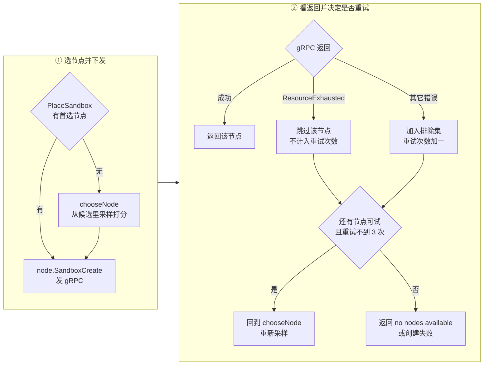
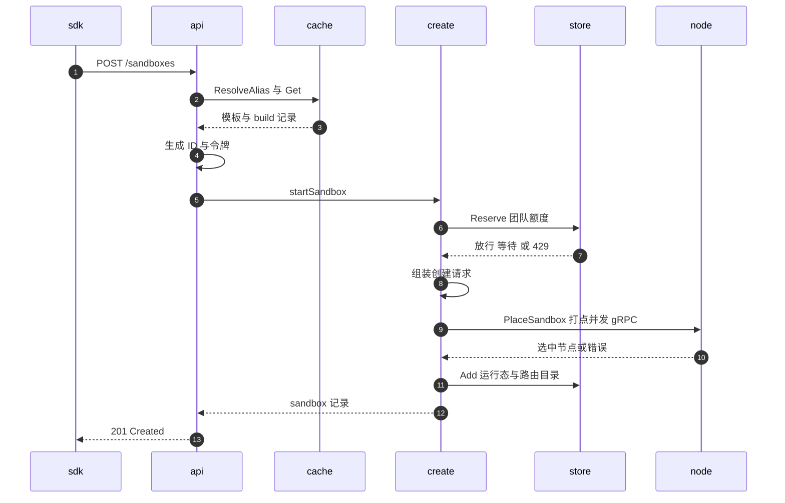

# 17 · 创建沙箱

> `POST /sandboxes` 是整个系统里被调用得最多的一个端点，也是唯一一个把「一次 HTTP 请求」变成
> 「一台正在运行的 microVM」的入口。本篇把它拆开：请求体的每个字段最终落到 orchestrator 的哪个字段上，
> 这条链路上有多少个可以失败的地方，以及每种失败之后系统留下了什么。
>
> **读者**：工程师。
> **预备**：[第 15 篇 · API 服务的结构](15-api-service-structure.md)、[第 16 篇 §6](16-auth-and-multitenancy.md#6-tier-与配额额度在哪几步被检查)。
> **代码**：`spec/openapi.yml`、`packages/api/internal/handlers/sandbox_create.go`、
> `packages/api/internal/handlers/sandbox.go`、`packages/api/internal/orchestrator/create_instance.go`、
> `packages/api/internal/orchestrator/placement/placement.go`、`packages/api/internal/sandbox/`、
> `packages/orchestrator/orchestrator.proto`

---

## 0. 本篇要回答的问题

1. `POST /sandboxes` 的请求体里有哪些字段，它们分别在哪一层被校验？
2. 请求体的字段是怎么变成 orchestrator 的 `SandboxCreateRequest` 的？哪些字段不是来自请求体？
3. 团队的并发上限是在什么时刻、用什么数据结构检查的？多个 api 实例之间怎么协调？
4. 这条链路上有哪些失败点？某一步失败之后，前面几步留下的状态由谁清理？
5. 创建与 `POST /sandboxes/{id}/resume` 共享了哪一段代码，差别在哪里？

---

## 1. 一次创建请求要解决的四个问题

从外部看，创建沙箱只是「给我一台跑着某模板的机器」。但 api 服务本身不运行 microVM，
它手上只有一个团队身份、一个模板名字和一组参数。要把这三样东西变成一台运行中的沙箱，
它必须依次解决四个彼此独立的问题：

**第一，名字要变成产物。** 用户写的是 `base` 或 `my-team/my-tpl:v2` 这样的名字，
而 orchestrator 需要的是一个具体的 build ID，以及这个 build 用哪个 guest 内核、哪个 Firecracker 版本、
分配多少 vCPU 与内存。这中间隔着别名解析、标签解析、可见性检查与集群检查。

**第二，配额要在启动之前锁住。** 团队有并发沙箱上限。如果先启动再计数，
并发请求会把上限冲穿；如果计数只在单个 api 进程内存里，多实例部署时上限就形同虚设。

**第三，机器要选出来，而且选错了要能换一台。** 节点的资源视图在 api 侧是异步同步来的，必然滞后。
被选中的节点完全可能在收到 gRPC 调用时已经装不下了。

**第四，创建成功之后，这台沙箱要能被后续请求找到。** 运行态要写进存储，路由目录要更新，
否则紧跟着的 `GET /sandboxes/{id}` 会返回 404。

这四件事在代码里分别对应 `templateCache`、`sandboxStore.Reserve`、`placement.PlaceSandbox`、
`sandboxStore.Add`。下面按顺序展开。

---

## 2. 请求体：字段与它们的校验层

`POST /sandboxes` 的请求体在 `spec/openapi.yml` 里是 `NewSandbox`。唯一必填字段是 `templateID`；
其余字段都是可选的，且大部分带默认值：

| 字段 | 类型 | 默认值 | 语义 |
|---|---|---|---|
| `templateID` | string | 必填 | 模板引用，可带 namespace 与 tag |
| `timeout` | int32 | 15 | 沙箱存活秒数 |
| `autoPause` | bool | false | 到期时暂停而不是销毁 |
| `autoResume` | object | 无 | 策略 `any` 或 `off` |
| `secure` | bool | 无 | 与 envd 的通信是否需要令牌 |
| `allow_internet_access` | bool | 无 | 关掉等价于 `denyOut: 0.0.0.0/0` |
| `network` | object | 无 | 入站与出站策略 |
| `metadata` / `envVars` | map | 无 | 透传给 orchestrator |
| `mcp` | object | 无 | MCP 配置 |
| `volumeMounts` | array | 无 | 持久卷挂载 |

值得先说清楚的是**这里没有的东西**：请求体不能指定 vCPU、内存、磁盘大小，也不能指定内核或
Firecracker 版本。这些全部来自模板的那一次 build 记录，在 `packages/api/internal/cache/templates/cache.go`
的 `fetchTemplateWithBuild()` 里从 Postgres 读出来。资源规格属于模板而不属于沙箱，
这是 e2b 的一个基本选择：它把「一台机器长什么样」固化在模板构建期，
换来的是创建路径上不需要做任何资源规格的合法性校验，代价是同一模板无法按需伸缩。

校验分在三层。**OpenAPI 生成的类型**只保证 JSON 形状与 `timeout >= 0`；
`utils.ParseBody` 反序列化失败直接 400。**handler 层**做业务校验，
`sandbox_create.go` 的 `PostSandboxes()` 里依次是模板引用格式、超时上限、
auto-resume 策略枚举、`secure` 对 envd 版本的要求、网络配置、卷挂载。
**orchestrator 客户端层**只做一件校验：解析 build 记录里的 Firecracker 版本字符串。
再往下就是 gRPC 调用，节点侧的校验不在本篇范围。

### 2.1 模板引用的解析

`id.ParseName()`（`packages/shared/pkg/id/`）把 `namespace/alias:tag` 拆成 identifier 与 tag。
它做三件事：去空格、转小写、用正则校验每一段。tag 额外禁止是 UUID 形式，
并且显式的 `default` 会被归一化成「无 tag」，这样 `abc:default` 与 `abc` 命中同一个缓存键。
解析失败返回 400。

解析出的 identifier 交给 `templateCache.ResolveAlias()`，把别名变成 template ID；
再由 `templateCache.Get()` 取模板与 build，并在其中做两项检查：
模板不属于本团队且不是 public 则 `ErrAccessDenied`，模板的集群与团队的集群不一致则 `ErrClusterMismatch`。
这两个错误连同 `ErrTemplateNotFound` 一起，由 `packages/api/internal/cache/templates/errors.go`
的 `ErrorToAPIError()` 映射成 404 / 403 / 400。注意 404 与 403 是分开的，
也就是说 API 会告诉调用者「这个模板存在但你没有权限」。

### 2.2 网络配置的校验

`validateNetworkConfig()` 检查三件事：`maskRequestHost` 必须是 ASCII 主机名
（用 `idna.Display.ToASCII` 转换后与原串比较，不相等就拒绝，防止同形字符伪造）、
`denyOut` 的每一项必须是 IP 或 CIDR、以及一条组合规则 ——
如果 `allowOut` 里出现了域名，那么 `denyOut` 里必须包含 `0.0.0.0/0`。

最后这条规则的理由是防御性的：出站默认放行，只写「允许 example.com」而不写「拒绝其余」，
得到的效果是全部放行，用户以为自己配了白名单，实际上没有。
与其静默地给一个假的安全感，不如在创建时报 400。
这里有一个措辞上的细节：错误消息让用户在 `denyOut` 里写 `'ALL_TRAFFIC'`，
但服务端的 `slices.Contains(denyOut, sandbox_network.AllInternetTrafficCIDR)` 比较的是字面量 `0.0.0.0/0`，
而 `denyOut` 的每一项又必须通过 `IsIPOrCIDR()`。**推论**：`ALL_TRAFFIC` 是 SDK 侧的常量名，
SDK 在发请求前会把它替换成 `0.0.0.0/0`；直接用 curl 调 API 的人按错误消息照抄会再吃一个 400。
在上游 2026.09 的服务端代码里搜不到任何 `ALL_TRAFFIC` 到 CIDR 的映射。

还有一条跨字段规则写在 `PostSandboxes()` 里而不在 `validateNetworkConfig()` 里：
如果 `network.allowPublicTraffic` 被显式设为 false，那么 `secure` 必须为 true。
理由是关掉公网访问之后，沙箱的入口要靠令牌保护，而令牌是 `secure` 这条路径生成的；
只关一半会得到一个既不公开也没有凭证的沙箱。

### 2.3 secure 与两种令牌

`secure: true` 触发 `getEnvdAccessToken()`。它先要求 build 记录里有 envd 版本，
再要求版本不低于 `minEnvdVersionForSecureFlag`（`0.2.0`），两个条件任一不满足返回 400，
错误消息直接告诉用户去重建模板。通过之后调用
`packages/api/internal/sandbox/sandbox_envd_secret.go` 的 `GenerateEnvdAccessToken()`，
它是对 sandbox ID 做一次带密钥的哈希。

第二种令牌是 traffic access token，在 `create_instance.go` 的 `CreateSandbox()` 里生成，
条件是 `network.Ingress.AllowPublicAccess` 显式为 false，实现是
`GenerateTrafficAccessToken()`，即对 `sandbox-traffic-<sandboxID>` 做同样的哈希。

两种令牌都是**确定性派生**的，不落库。好处是任何一个 api 实例、任何时刻都能重算出同一个令牌来做校验
（`handlers/proxy_grpc.go` 正是这么用的），代价是无法单独吊销某一个沙箱的令牌 ——
要吊销只能换全局的 hash seed。

### 2.4 卷挂载与 MCP

`volumeMounts` 由 `convertAPIVolumesToOrchestratorVolumes()` 处理：先看特性开关
`featureflags.PersistentVolumesFlag`，关着就 400；再按名字批量查库拿到卷的 ID 与类型；
然后逐项校验路径必须非空、必须绝对、必须已规范化（`filepath.Clean(path) == path`，
从而排除 `..`），并且同一次请求里路径不能重复。所有不合法的项会被**一次性**收集进
`InvalidVolumeMountsError` 再返回，而不是遇到第一个就退出 —— 对于一次要挂五个卷的请求，
这能省掉四个来回。

`mcp` 是个例外：它被解析出来，一路传到 `startSandboxInternal()`，
然后只用于 posthog 事件的 `mcp_servers` 属性，**没有**进入 `SandboxCreateRequest`。
在上游 2026.09 里，MCP 配置对 orchestrator 不可见。

---

## 3. 从请求字段到 SandboxCreateRequest

`SandboxCreateRequest` 定义在 `packages/orchestrator/orchestrator.proto`，
外层只有三个字段：`sandbox`（`SandboxConfig`）、`start_time`、`end_time`。
组装发生在 `create_instance.go` 的 `CreateSandbox()`。下表是完整映射，
「来源」一列里 *请求* 表示来自 HTTP 请求体，*build* 表示来自模板的 build 记录，
*团队* 表示来自认证上下文，*生成* 表示 api 现场造出来的。

| 来源 | 输入 | `SandboxCreateRequest` 字段 | 变换 |
|---|---|---|---|
| 请求 | `templateID` | `Sandbox.TemplateId`、`Sandbox.BaseTemplateId` | 解析名字 → 别名 → template ID；创建时两个字段相同 |
| 请求 | `timeout` | `StartTime`、`EndTime` | `EndTime = now + timeout`，放置成功后重算一次 |
| 请求 | `metadata` | `Sandbox.Metadata` | 原样 |
| 请求 | `envVars` | `Sandbox.EnvVars` | 原样 |
| 请求 | `autoPause` | `Sandbox.AutoPause` | 缺省 false |
| 请求 | `autoResume.policy` | `Sandbox.AutoResume.Policy` | 枚举校验后转字符串 |
| 请求 | `secure` | `Sandbox.EnvdAccessToken` | 布尔变成派生令牌 |
| 请求 | `allow_internet_access` | `Sandbox.AllowInternetAccess` 与 `Network.Egress.DeniedCidrs` | 为 false 时覆盖式写入 `0.0.0.0/0` |
| 请求 | `network.allowOut` | `Network.Egress.AllowedCidrs`、`AllowedDomains` | 按 IP/CIDR 与域名拆两组；有域名则补 `8.8.8.8` |
| 请求 | `network.denyOut` | `Network.Egress.DeniedCidrs` | 逐项转 CIDR |
| 请求 | `network.allowPublicTraffic` | `Network.Ingress.TrafficAccessToken` | 为 false 时生成令牌 |
| 请求 | `network.maskRequestHost` | `Network.Ingress.MaskRequestHost` | 原样 |
| 请求 | `volumeMounts[]` | `Sandbox.VolumeMounts[]` | 名字查库补上 `Id` 与 `Type` |
| 请求 | `mcp` | 无 | 只进 posthog 事件 |
| build | build ID | `Sandbox.BuildId` | |
| build | 内核版本 | `Sandbox.KernelVersion` | |
| build | Firecracker 版本 | `Sandbox.FirecrackerVersion`、`Sandbox.HugePages` | 见下 |
| build | envd 版本 | `Sandbox.EnvdVersion` | |
| build | 规格 | `Sandbox.Vcpu`、`RamMb`、`TotalDiskSizeMb` | 原样 |
| 团队 | team ID | `Sandbox.TeamId` | |
| 团队 | tier 上限 | `Sandbox.MaxSandboxLength` | 单位是小时 |
| 生成 | sandbox ID | `Sandbox.SandboxId` | `"i"` + `id.Generate()` |
| 生成 | execution ID | `Sandbox.ExecutionId` | 每次启动一个新 UUID |
| 生成 | 模板别名 | `Sandbox.Alias` | 取 build 的第一个别名 |
| 固定 | — | `Sandbox.Snapshot` | 创建时 false，resume 时 true |

有三行值得单独说明。

**`HugePages` 不是配置项，是推导项。** `sandbox.NewVersionInfo()` 把 build 里形如
`v1.12.0-release_1234567` 的字符串拆成语义化版本与 commit hash，
`HasHugePages()` 判断主版本 ≥ 1 且次版本 ≥ 7。也就是说是否用 2 MiB 大页，
由模板构建时用的 Firecracker 版本决定，用户无从干预。

**`FirecrackerVersion` 可以被特性开关改写。** `getFirecrackerVersion()` 读
`feature_flags.FirecrackerVersions` 这个 JSON 开关，按 `vMAJOR.MINOR` 查一个映射表；
查到就用映射值，查不到用 build 记录里的原值。这给了运维一个不重建模板就整体切换
Firecracker 补丁版本的口子，代价是「模板记录里写的版本」与「实际启动用的版本」可能不一致，
排查问题时要以开关的当前值为准。

**`ExecutionId` 与 `SandboxId` 的生命周期不同。** sandbox ID 从创建活到最终销毁，
中间的 pause / resume 不改变它；execution ID 每次启动都重新生成，
标识「从这次启动到这次停止」的一段。client-proxy（edge）的路由目录用的是 execution ID
（`nodemanager/metadata.go` 的 `GetSandboxCreateCtx()` 把它塞进 gRPC metadata），
这样一个 resume 之后落在别的节点上的沙箱不会被旧路由记录劫持。

---

## 4. 配额与并发去重：Reserve

`CreateSandbox()` 做的第一件事不是选节点，而是占位：

```go
finishStart, waitForStart, err := o.sandboxStore.Reserve(
    ctx, team.Team.ID, sandboxID, int(team.Limits.SandboxConcurrency))
```

`Reserve` 有三种可能的返回组合，调用方据此分支：

- 拿到 `finishStart`：占位成功，继续往下走，最后**必须**调用它把结果广播出去；
- 拿到 `waitForStart`：同一个 sandbox ID 已经有人在创建，本请求不重复创建，
  转而等待对方的结果并原样返回；
- 拿到 `LimitExceededError`：团队并发已满，返回 429，消息里带上上限数字和账单页链接。

第三种是配额检查，前两种是**幂等去重**。对 `POST /sandboxes` 来说去重几乎用不上 ——
sandbox ID 是刚生成的随机串，不会撞上。它真正服务的是 resume：
SDK 重试一次 resume，或者两个客户端同时 resume 同一个沙箱，都会走到第二个分支，
只启动一次、两个请求拿到同一个结果。

`ReservationStorage` 有两个实现，由配置项 `SandboxStorageBackend` 选择
（`packages/api/internal/orchestrator/orchestrator.go`）。

**内存实现**（`internal/sandbox/reservations/reservation.go`）是一个
`teamID -> {sandboxID -> SetOnce}` 的两层并发 map。占位、判满、去重都在一次
`Upsert` 的回调里完成，所以是原子的。`finishStart` 通过 `SetOnce` 把
`(sandbox, error)` 交给所有等待者；如果创建失败，它顺手把占位删掉。

**Redis 实现**（`internal/sandbox/reservations/redis/`）把同样的逻辑写成一段 Lua 脚本，
在 Redis 里原子执行。三个键：团队的运行中沙箱集合、pending 的 ZSET（score 是占位时刻）、
以及结果键。脚本的顺序是：先按 `staleCutoff` 清掉超过 `staleTTL`（90 秒）的 pending 项，
再看沙箱是否已在运行集合里，再看是否已在 pending 里，最后才比较
`SCARD(运行) + ZCARD(pending) >= limit`。

这里有两个设计取舍值得点出来。**上限比较的是「运行中 + 在途」之和**，
所以在途的创建也占额度，避免了一批并发请求同时通过检查然后一起超配。
**pending 项有 90 秒的过期清理**，因为 api 实例可能在创建过程中崩溃，
崩溃时 `finishStart` 不会被执行，占位会永远留着，把团队额度慢慢吃光。
用 TTL 兜底的代价是：一次真的耗时超过 90 秒的创建，它的占位会被别的请求清掉，
之后的并发计数会短暂偏低。注释里写的判断是「90 秒远超任何现实的创建耗时」。

结果键的 TTL 是 30 秒（`resultTTL`），这是跨实例等待者能读到结果的窗口。

---

## 5. 放置与失败重试

占位之后，`CreateSandbox()` 组装完 `sbxRequest`，交给
`placement.PlaceSandbox()`（`internal/orchestrator/placement/placement.go`）。
放置算法本身在[第 19 篇 §3](19-node-management-and-placement.md#3-放置算法采样过滤打分)讲，
这里只看它与创建路径的接口：**放置不是「选一个节点」，而是「选到一个能成功创建的节点为止」**。



两类失败被区别对待，这是这段代码的核心。

`codes.ResourceExhausted` 表示「这台节点现在装不下」。它**不增加重试计数**，
节点也**不进排除集**，只是本轮换一台。理由是这不算故障：api 侧的资源视图本来就滞后，
被拒绝是正常的负反馈信号，而且这台节点过一会儿可能又能装下。

其它错误码表示「这台节点有问题」。节点进排除集，重试计数加一，
最多三次（`maxRetries`，`placement/config.go`）之后放弃，返回一个对用户不带节点细节的错误。

另外还有两条终止条件：`ctx` 超时（继承自 HTTP 请求的 context，所以客户端断开会立刻停止重试），
以及排除集已经覆盖了集群里全部节点。

对创建路径来说，这一段的可观测后果是：**一次 `POST /sandboxes` 最多会向三台不同的节点发起
gRPC 创建**（ResourceExhausted 造成的换节点还不算在内），
而每一次失败的 gRPC 都可能在节点上留下半启动的痕迹。清理由 orchestrator 侧负责，
api 侧不做补偿 —— 它只知道这次调用失败了。

---

## 6. 写入运行态与唯一的补偿动作

放置成功后，`CreateSandbox()` 做三件收尾：

1. `node.InsertBuild(build.ID.String())` —— 在 api 侧的节点视图里记下这个 build 现在缓存在这台节点上，
   下次放置时同模板的沙箱可以优先落到同一台，省掉一次从对象存储拉取。
2. **重算时间窗口**。`startTime = time.Now()`，`endTime = startTime + timeout`。
   注释说明了理由：如果沿用请求刚进来时的时间，那么放置和 gRPC 花掉的时间会从用户的
   `timeout` 里扣掉，一个 15 秒的沙箱可能刚创建出来就快到期了。
   代价是 orchestrator 收到的 `EndTime` 与 api 记账的 `EndTime` 相差一次创建耗时。
3. `sandbox.NewSandbox(...)` 造出 api 侧的运行态记录，`o.sandboxStore.Add(ctx, sbx, true)` 写进存储。

`Add` 是整条链路上**唯一带补偿动作**的一步。如果写存储失败，说明沙箱已经在节点上跑起来了、
但 api 记不住它，这是最坏的一种泄漏：没人会去杀它，它会一直占着节点资源直到自己的
`MaxInstanceLength` 到期。所以这里起一个 goroutine 调
`removeSandboxFromNode(..., StateActionKill)` 反向把它杀掉，然后返回 500。
`context.WithoutCancel(ctx)` 保证 HTTP 请求已经返回之后清理仍然继续。

`Store.Add`（`internal/sandbox/store.go`）成功之后触发三个回调：
`AddSandboxToRoutingTable` 同步执行 —— 必须同步，否则紧随其后的请求可能路由不到；
`AsyncSandboxCounter` 与 `AsyncNewlyCreatedSandbox` 异步执行，分别更新指标和发分析事件。
`Add` 还会顺手把 `EndTime` 截断到 `MaxInstanceLength`，
所以 tier 的最长时长在这里被第二次执行（第一次是 handler 里对 `timeout` 的 400 校验）。

最后，`finishStart(sbx, nil)` 通过 `defer` 执行 —— 无论成功还是失败都执行，
失败时传入 apiErr，等待者会收到同一个错误。这个 `defer` 上有一条注释「Don't change this handling」，
指的是 Go 里具名返回值与 `defer` 闭包配合时的一个坑：
`apiErr` 必须是具名返回值才能在 defer 里读到最终值。

---

## 7. 完整的失败路径

把前面几节的失败点汇总起来，按发生顺序：

| 阶段 | 触发条件 | 状态码 | 已产生的副作用 |
|---|---|---|---|
| 认证 | 团队被 ban / block | 403 | 无 |
| 解析请求体 | JSON 不合法 | 400 | 无 |
| `id.ParseName` | 模板引用格式非法 | 400 | 无 |
| `ResolveAlias` / `Get` | 模板不存在 | 404 | 无 |
| `Get` | 非本团队且非 public | 403 | 无 |
| `Get` | 模板与团队不在同一集群 | 400 | 无 |
| 超时校验 | `timeout` 超过 tier 上限 | 400 | 无 |
| `buildAutoResumeConfig` | 策略不是 `any` / `off` | 400 | 无 |
| `getEnvdAccessToken` | build 无 envd 版本或版本过低 | 400 | 无 |
| `validateNetworkConfig` | host 非 ASCII、CIDR 非法、域名白名单缺 deny-all | 400 | 无 |
| 跨字段校验 | 关闭公网访问但未开 `secure` | 400 | 无 |
| 卷挂载 | 特性开关关闭 / 卷不存在 / 路径非法 | 400 | 无 |
| `Reserve` | 团队并发已满 | 429 | 无 |
| `Reserve` | 存储层报错 | 500 | 无 |
| `NewVersionInfo` | Firecracker 版本串解析失败 | 500 | 占位已建，由 defer 释放 |
| 集群查找 | 团队指定的集群不存在 | 500 | 同上 |
| 生成 traffic token | 哈希失败 | 500 | 同上 |
| `PlaceSandbox` | 三次重试失败 / 无可用节点 / 请求超时 | 500 | 可能有失败的节点侧残留 |
| `sandboxStore.Add` | 存储写入失败 | 500 | 沙箱已在节点运行，异步 kill 补偿 |

这张表有一个明显的形状：**校验全部集中在占位之前**，占位之后的每一步失败都要靠
`defer finishStart` 释放额度，最后一步失败还要额外杀 VM。
把便宜的检查放在贵的动作之前，是这条链路的组织原则。

反过来说，也有两个已知的缺口。其一，`PlaceSandbox` 失败时 api 不清理节点侧的残留，
它没有足够的信息去清理（连是哪台节点失败的都可能有多台）。
其二，`Add` 的补偿是异步 goroutine 且只记日志不重试，如果这次 kill 也失败，
沙箱就泄漏到它自己到期为止。**推论**：这两处依赖 orchestrator 侧的到期回收兜底，
api 侧不承诺立即清理。

---

## 8. 创建路径的整体时序

下图把前面各节串起来。参与者用了短名：`sdk` 是客户端，`api` 是 `PostSandboxes`，`cache` 是模板缓存，`create` 是 `CreateSandbox`，`store` 是占位与运行态存储，`node` 是 orchestrator 节点。



---

## 9. 与 resume 共享的那一段

`POST /sandboxes/{id}/resume` 的 handler 在 `internal/handlers/sandbox_resume.go`。
它与创建共享的是 `startSandbox()` 及其之后的全部代码 —— 也就是说，
**从占位开始，创建与恢复走的是同一条路径，orchestrator 收到的也是同一个 `SandboxCreateRequest`**。

差别集中在参数怎么来：

| 维度 | 创建 | 恢复 |
|---|---|---|
| build 来源 | 模板当前 tag 对应的 build | `GetLastSnapshot` 查到的快照 build |
| `Snapshot` 字段 | false | true |
| 节点偏好 | 无 | 快照的 `OriginNodeID`，仅当该节点状态为 Ready |
| 网络 / auto-resume / 卷 | 请求体 | 快照记录里的 `Config` |
| `envVars` | 请求体 | 不传 |
| `secure` | 请求体的 `secure` | 快照的 `EnvSecure` |
| 前置状态检查 | 无 | 按沙箱当前状态分支 |

最后一行是 resume 独有的复杂度：沙箱可能正在 pausing（等状态变更后继续）、
killing（当作 404）、snapshotting（409）、或者已经 running（409）。
创建没有这个问题，因为它的 sandbox ID 是新的。

节点偏好是 resume 的关键优化：快照的 memfile 与 rootfs 大概率还在原节点的本地缓存里，
落回原节点能省掉从对象存储拉取。`PlaceSandbox` 对首选节点的处理是「先试一次，
失败了就回到正常的采样流程」，所以这是软偏好而不是硬约束（放置侧的处理见
[第 19 篇 §6](19-node-management-and-placement.md#6-失败与重试)，节点侧的恢复实现见
[第 27 篇 §1](27-resume-sandbox.md#1-恢复而不是启动)）。

---

## 10. ARM 适配版的差异

创建路径本身没有改动：`handlers/sandbox_create.go`、`orchestrator/create_instance.go`、
`orchestrator/placement/` 在 ARM 适配版里与上游 2026.09 逐字相同。
唯一落在这条链路上的改动是 `internal/sandbox/sandbox_features.go` 的 `NewVersionInfo()`：
上游无条件读 `parts[1]` 取 commit hash，ARM 适配版加了长度判断。
分叉 Firecracker 的 ARM 构建产出的版本串不带 `_commit_hash` 后缀，
按上游的写法会在 `CreateSandbox()` 里越界 panic，也就是说每一次创建请求都会失败。
细节见[第 77 篇 §5](77-api-and-flags-on-arm.md#5-firecracker-版本常量与一处越界保护)。

节点发现方式的改动（Kubernetes 而非 Nomad）会影响 `PlaceSandbox` 看到的候选节点集合，
但不改变放置与创建的逻辑，见[第 76 篇 §4](76-k8s-discovery.md#4-第二层api-里的-nodediscovery)。

---

## 11. 小结

- `POST /sandboxes` 的请求体只描述「这台沙箱怎么用」，不描述「这台沙箱多大」；
  vCPU、内存、磁盘、内核与 Firecracker 版本全部来自模板的 build 记录。
- 请求字段到 `SandboxCreateRequest` 不是一一对应：`secure` 变成派生令牌，
  `allowPublicTraffic` 变成另一个派生令牌，`allow_internet_access: false` 覆盖式写入 `0.0.0.0/0`，
  `mcp` 根本不下发。
- 并发上限的检查点是 `Reserve`，比较的是「运行中 + 在途」之和，
  Redis 实现用一段 Lua 脚本保证原子性，并用 90 秒 TTL 兜住 api 实例崩溃留下的占位。
- 同一 sandbox ID 的并发请求会被 `Reserve` 合并成一次启动，多个等待者共享同一结果；
  这条机制服务的是 resume，不是 create。
- 放置层把 gRPC 错误分成两类：`ResourceExhausted` 换节点但不计重试，
  其它错误把节点加入排除集并计重试，上限三次。
- 时间窗口在放置成功后重算，避免创建耗时被算进用户的 `timeout`。
- 整条链路只有一个补偿动作：运行态写入失败时异步 kill 已经跑起来的沙箱。
  放置失败留下的节点侧残留由 orchestrator 自行回收。
- 创建与恢复从 `startSandbox()` 起完全共用代码，差别只在 build 来源、`Snapshot` 标志、
  节点偏好和前置状态检查。

---

## 延伸阅读 / 下一篇

- [第 18 篇 · 沙箱生命周期 API](18-sandbox-lifecycle-api.md)：创建之后的 timeout、kill、pause、resume。
- [第 27 篇 · ResumeSandbox](27-resume-sandbox.md)：节点收到带 `Snapshot: true` 的创建请求之后做了什么。
- [第 19 篇 §3](19-node-management-and-placement.md#3-放置算法采样过滤打分)：`chooseNode` 的打分函数与参数。
- [第 20 篇 §3](20-sandbox-state-storage.md#3-redis-后端)：`Store` 的两种后端与 key 布局。
- [第 16 篇 §5](16-auth-and-multitenancy.md#5-hash-seed-与沙箱级-token)：团队、tier 与令牌哈希。
- [第 26 篇 §6](26-sandbox-object.md#6-谁在调用这些方法)：gRPC 到达节点之后发生了什么。
