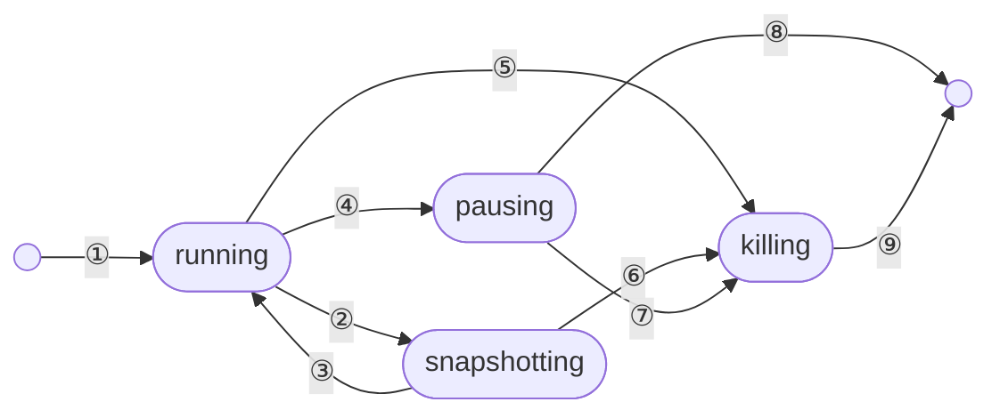
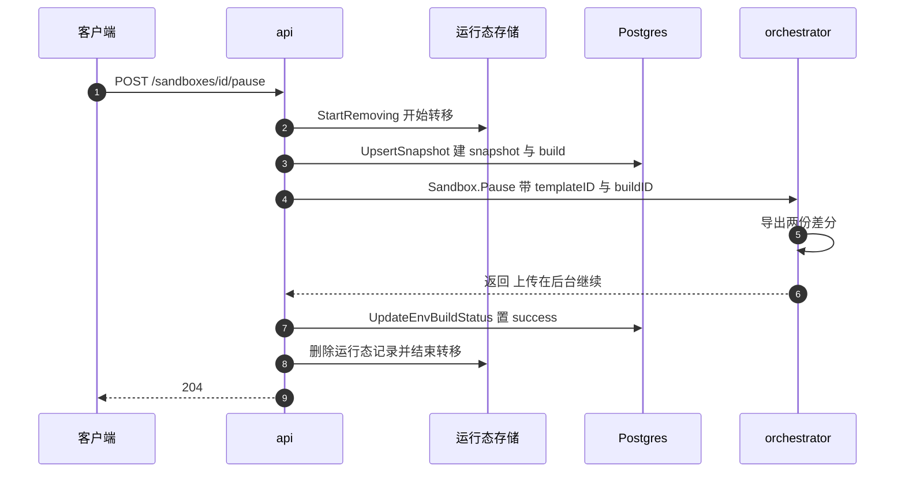

# 18 · 沙箱生命周期 API

> 沙箱被创建出来之后，剩下的一切都是这一篇的内容：它什么时候到期、谁来执行到期、
> 暂停与销毁在语义上差在哪里、两个客户端同时暂停和销毁同一台沙箱会发生什么。
> 这些操作的实现只有一千多行 Go，但它们是 api 里并发最密集的部分。
>
> **读者**：工程师、SDK 开发者。
> **预备**：[第 17 篇 · 创建沙箱](17-sandbox-create-api.md)、[第 11 篇 §5](11-object-model.md#5-沙箱状态机)。
> **代码**：`packages/api/internal/handlers/sandbox_{connect,kill,pause,refresh,timeout,resume,get}.go`、
> `packages/api/internal/handlers/sandboxes_list.go`、`packages/api/internal/orchestrator/{keep_alive,delete_instance,pause_instance,update_instance}.go`、
> `packages/api/internal/orchestrator/evictor/evict.go`、`packages/api/internal/sandbox/states.go`、
> `packages/api/internal/sandbox/storage/{memory,redis}/`、`spec/openapi.yml`

---

## 0. 本篇要回答的问题

1. 一台沙箱的 TTL 由谁保存、谁来推进、谁来执行？orchestrator 会自己杀掉超时的沙箱吗？
2. `timeout`、`refreshes`、`connect` 都在改 TTL，三者的语义差在哪里，为什么要分成三个端点？
3. 同一台沙箱上同时到达一个 pause 和一个 kill，系统会做什么？多个 api 实例并发时又靠什么协调？
4. pause 从 HTTP 请求到一条可恢复的快照记录，中间经过哪些步骤？哪一步失败会留下什么残留？
5. `DELETE /sandboxes/{id}` 到底删了什么？为什么它对一台已经暂停的沙箱也返回 204？

---

## 1. 生命周期上有哪些操作

创建之外，`spec/openapi.yml` 在 `sandboxes` 标签下给出的端点可以按「读」「改 TTL」「终止」「再生」四类归拢：

| 端点 | 方法 | 作用 | 成功状态码 |
|---|---|---|---|
| `/sandboxes`、`/v2/sandboxes` | GET | 列出沙箱；v1 只列运行中，v2 含已暂停并分页 | 200 |
| `/sandboxes/{id}` | GET | 单台沙箱详情，运行中与已暂停统一成一个模型 | 200 |
| `/sandboxes/{id}/timeout` | POST | 把到期时间**重设**为「此刻 + timeout」 | 204 |
| `/sandboxes/{id}/refreshes` | POST | 把到期时间**延长**到至少「此刻 + duration」 | 204 |
| `/sandboxes/{id}/connect` | POST | 取详情；已暂停则恢复；运行中则只延长 TTL | 200 / 201 |
| `/sandboxes/{id}/pause` | POST | 暂停并生成快照 | 204 |
| `/sandboxes/{id}/resume` | POST | 从最近一次快照拉起（已标记 deprecated） | 201 |
| `/sandboxes/{id}` | DELETE | 销毁运行中的沙箱，并删除它的快照 | 204 |
| `/sandboxes/{id}/snapshots` | POST | 打一个持久快照，沙箱继续运行 | 201 |
| `/sandboxes/{id}/logs`、`/metrics` | GET | 日志与指标，数据来自 Loki 与 ClickHouse | 200 |

日志与指标两个端点的数据通路在[第 24 篇 §2](24-api-metrics-and-analytics.md#2-端点到数据源的矩阵)讲，
这里不再展开。`resume` 与 `connect` 的处理体几乎相同，都走 `startSandbox()`，与创建路径共用同一条实现，
差别只在 build 从哪里来 —— 这部分归[第 17 篇 §9](17-sandbox-create-api.md#9-与-resume-共享的那一段)。

需要先建立的一个口径是：**api 眼里的沙箱状态只有四个**，定义在
`packages/api/internal/sandbox/states.go`：`running`、`pausing`、`killing`、`snapshotting`。
「已暂停」不是其中之一 —— 一台沙箱暂停完成后，它的运行态记录被整条删除，
唯一留下的痕迹是 Postgres 里的一条 snapshot 记录和一次 build。
所以「已暂停的沙箱」在 api 里是一次数据库查询的结果，不是一个内存对象。

| 编号 | 触发 | 结果 |
|---|---|---|
| ① | `POST /sandboxes` | 建立运行态记录 |
| ② | `POST /snapshots` | 进入快照 |
| ③ | 快照完成 | 回到 running |
| ④ | `POST /pause` 或到期且 auto-pause | 进入暂停 |
| ⑤ | `DELETE` 或到期 | 进入销毁 |
| ⑥ | 快照失败后补杀 | 转为销毁 |
| ⑦ | 暂停途中被 kill | 转为销毁 |
| ⑧ | 暂停完成 | 删除记录，留下 snapshot 与 build |
| ⑨ | 销毁完成 | 删除记录 |

图中的边不是描述性的，它就是 `states.go` 里的 `AllowedTransitions` 表；表里没有的转移一律被拒绝，
错误类型是 `InvalidStateTransitionError`，最终在 handler 里变成 409。
`snapshotting` 与另外两个的区别写在 `StateAction` 的 `Effect` 字段上：
`StateActionSnapshot` 是 `TransitionTransient`，成功后状态回到 `running`；
`StateActionPause` 与 `StateActionKill` 是 `TransitionExpires`，成功即终结。

## 2. 到期是谁驱动的

### 2.1 TTL 存在哪里

每条运行态记录（`packages/api/internal/sandbox/sandbox.go` 的 `Sandbox`）带三个时间字段：
`StartTime`、`EndTime`、`MaxInstanceLength`。前两个是绝对时间，第三个是团队档位给出的硬上限。
`Store.Add()` 在写入时就把 `EndTime` 截断到 `StartTime + MaxInstanceLength` 以内，
后续任何延长也逃不出这个上限（见 §2.2）。

orchestrator 侧也有一份 `EndAt`，由 `SandboxUpdateRequest` 同步过去
（`packages/orchestrator/internal/server/sandboxes.go` 的 `Update()` 调 `sbx.SetEndAt()`）。
但在上游 2026.09 里，这份 `EndAt` 只被两处读取：`List()` 的返回值与 `Checkpoint()` 的重建参数
（`GetEndAt()` 在 orchestrator 包内的全部调用点）。
**orchestrator 不会因为沙箱到期而自行销毁它。**
`Sandbox.WaitForExit()` 里那个 `time.Until(s.GetEndAt())` 是构建期用的等待上限，不在运行期路径上。
到期这件事完全由 api 驱动，代价是：api 全部实例都不可用时，沙箱会一直跑到宿主重启为止。

### 2.2 三个改 TTL 的端点

三者最后都落到 `packages/api/internal/orchestrator/keep_alive.go` 的 `KeepAliveFor()`，
签名里的 `allowShorter` 是唯一的分水岭：

- `POST /timeout` 传 `true`。语义是「重设」：无论新时间比当前到期时间早还是晚，都覆盖。
  这是 SDK 的 `setTimeout` 走的路径，OpenAPI 描述里明确写了「每次调用都以当前时刻为起点重新计时」。
- `POST /refreshes` 传 `false`。语义是「续命」：`endTime` 若早于现有 `EndTime`，
  `updateFunc` 返回 `ErrCannotShortenTTL`，`KeepAliveFor()` 把它当成成功直接返回 `nil`。
  请求体的 `duration` 缺省或小于 `sandbox.SandboxTimeoutDefault`（15 秒）时都被抬到 15 秒，
  OpenAPI 又把上限压在 3600 秒。这个端点是给 SDK 的后台保活循环用的。
- `POST /connect` 对运行中的沙箱也传 `false`，即只延长不缩短。

`KeepAliveFor()` 的内部顺序值得记住：先用 `getMaxAllowedTTL()` 把请求的时长与
「`MaxInstanceLength` 剩余量」取小，写进运行态存储；写成功后再发 `Sandbox.Update` gRPC 给节点。
如果沙箱早已超过 `MaxInstanceLength`，返回 400 `Max instance length exceeded`。
两步之间没有事务：**若存储已更新而 gRPC 返回 NotFound，客户端拿到 404，但存储里的 `EndTime` 已经被延长了**
（`keep_alive.go` 中 `UpdateSandbox` 的错误分支）。这一格差异会在下一轮节点同步（§5.2）里被抹平。

### 2.3 evictor：50 ms 一轮的到期扫描

`packages/api/internal/orchestrator/evictor/evict.go` 是唯一的到期执行者。
`Orchestrator.Start()` 里 `evictor.New(o.sandboxStore, o.RemoveSandbox)` 之后 `go sandboxEvictor.Start(ctx)`，
循环体极简：每 `pollInterval`（50 ms）调一次 `store.ExpiredItems()`，
对每条到期记录起一个 goroutine 调 `RemoveSandbox()`，动作按记录上的 `AutoPause` 二选一 ——
真则 `StateActionPause`，假则 `StateActionKill`。**auto-pause 就是在这一行代码上生效的**，
它不是 orchestrator 的能力，而是 api 在到期时选择了另一个终止动作。

`ExpiredItems()` 的两种实现代价差别明显。memory 后端（`storage/memory/operations.go`）遍历全表、
过滤出 `running` 且 `IsExpired()` 的记录；数据量就是本实例内存里的沙箱数，没有上限控制。
redis 后端（`storage/redis/items.go`）维护一个全局 ZSET `sandbox:storage:global:expiration`，
score 是到期毫秒数，每轮 `ZRANGEBYSCORE` 取最多 256 条，再按 team 分组 `MGET` 取回记录本体。
它额外做两件清理：ZSET 里有成员但沙箱键已消失的，作为孤儿条目 `ZREM` 掉；
状态不是 `running` 的（说明有人正在处理），只要过期不超过 `staleCutoff`（一小时）就跳过，
超过则重新纳入回收 —— 这是对「某个 api 实例在转移途中崩溃、转移键已随 TTL 过期」的兜底。

50 ms 的轮询周期意味着到期的执行延迟在几十毫秒量级，而不是精确到点。
每个 api 实例都跑一份 evictor，redis 后端下它们扫的是同一个 ZSET，
因此同一批到期沙箱会被多个实例同时选中 —— 靠下一节的状态转移机制去重。

## 3. 并发与幂等

### 3.1 转移的三段式

pause、kill、snapshot 三个动作共用 `Orchestrator.RemoveSandbox()`
（`packages/api/internal/orchestrator/delete_instance.go`）与其背后的
`Store.StartRemoving()`。协议是三段式：

1. `StartRemoving(teamID, sandboxID, stateAction)` 校验转移合法性，把状态改成目标状态，
   返回 `(alreadyDone, finish, err)`；
2. 调用方执行真正的动作（发 gRPC 给节点、写数据库）；
3. `finish(ctx, err)` 结束转移，把结果告诉所有等待者。

`alreadyDone` 为真表示「已经有人做过或正在做同一件事」，调用方直接返回成功。
这是幂等性的来源：重复 pause 一台正在 pause 的沙箱返回 204，而不是 409。

memory 后端用一个 `*utils.ErrorOnce`（`storage/memory/sandbox.go` 的 `transition` 字段）加互斥锁实现；
redis 后端（`storage/redis/state_change.go`）用三个键实现同一语义：
沙箱键、转移键 `…:transition:<sandboxID>`（值是本次转移的 UUID，TTL 70 秒）、
以及结果键 `…:transition:<sandboxID>:<transitionID>`（TTL 30 秒）。
写状态与写转移键由一段 Lua 脚本 `startTransitionScript` 原子完成，
外层再套一把基于 `redislock` 的分布式锁（超时 1 分钟，重试间隔 20 ms 带 ±25% 抖动）。

等待者的逻辑在 `waitForTransition()`：每 20 ms 读一次转移键，
直到键消失或者值变成了另一个 UUID，然后去读结果键。结果键为空串表示成功，
非空表示失败并带上错误文本；结果键已过期则**当作成功**处理 —— 这是一个有意的放宽，
代价是一次超过 30 秒才被观察到的失败会被误判为成功。

### 3.2 几种并发组合的实际结果

| 已在进行 | 新到达的请求 | 结果 |
|---|---|---|
| pause | pause | 等待前者完成，返回 `alreadyDone`，204 |
| pause | kill | 允许，等待 pause 完成后重试 kill |
| kill | pause | `AllowedTransitions[killing]` 为空，报 `InvalidStateTransitionError`，被 `RemoveSandbox` 翻译成 `ErrSandboxNotFound`；handler 再查一次快照，查到给 409「已暂停」，查不到给 404 |
| kill | kill | `alreadyDone`，204 |
| snapshot | pause / kill | 允许；`snapshotting` 可以直接转到 `pausing` 或 `killing` |
| snapshot | snapshot | `CreateSnapshotTemplate()` 把 `alreadyDone` 显式翻成 409 |

「pause 后跟 kill」这一格有个值得注意的后果。等待结束时，前一次 pause 已经把运行态记录整条删除了，
于是重试的 `StartRemoving()` 拿到 `NotFoundError`；`delete_instance.go` 的错误分支对 kill 动作只识别
`sbx.State == killing`，其余一律记为 `ErrSandboxOperationFailed`，handler 返回 500。
**推论：一次紧跟在 pause 之后的 kill 有较大概率收到 500 而不是 404**，尽管系统状态是正确的
（沙箱确实没了，快照也在）。这属于错误码口径问题，不影响正确性。

还有一处顺序细节：`RemoveSandbox()` 里 `defer` 的执行是后进先出 ——
先 `sandboxStore.Remove()` 删记录，再异步发分析事件与减并发计数，最后才 `finish()`。
也就是说等待者被唤醒时，沙箱记录已经不在存储里了。

### 3.3 跨 api 实例的协调

多实例部署下所有协调都压在 Redis 上：运行态存储、转移键、以及创建期的 reservation。
memory 后端只在单实例（或本地开发）下可用，它的 `Sync()` 甚至保留了「节点同步时不删刚启动 10 秒内的沙箱」
这样的兜底。这一整套存储的键布局与迁移动机在[第 20 篇 §3](20-sandbox-state-storage.md#3-redis-后端)。

## 4. pause 的完整链路

pause 是这一篇里链路最长的操作，也是唯一一个「HTTP 返回时后台还在干活」的操作。

按代码逐段对照：

**第一步在数据库。** `orchestrator/pause_instance.go` 的 `pauseSandbox()` 先调 `UpsertSnapshot`。
这条 SQL（`packages/db/queries/snapshots/create_new_snapshot.sql`）一次做三件事：
若该 `sandbox_id` 还没有 snapshot 行就新建一个模板（`envs.source = 'snapshot'`），
插入或更新 snapshots 行，再无条件插入一条新的 `env_builds` 并建立 build 与模板的绑定，
初始状态是 `snapshotting`。所以**一台沙箱反复 pause / resume，模板只有一个，build 一次一条**，
每条 build 对应一代差分产物。这也是「快照即 build」这个口径的由来。

**第二步是 gRPC。** `snapshotInstance()` 用 `node.GetSandboxDeleteCtx()` 取客户端
（对非 Nomad 管理的远端节点，这个方法会把删除事件塞进 gRPC metadata，让 client-proxy（edge）同步目录），
调 `Sandbox.Pause`，把刚生成的 `templateID` 与 `buildID` 传下去。
orchestrator 侧 `server/sandboxes.go` 的 `Pause()` 先调 `acquireSandboxForSnapshot()`。
这个函数拿一把进程级互斥锁 `pauseMu`，在锁内做两件事：从沙箱表里 `Get` 出该沙箱，再 `Remove` 掉它，
然后立刻释放锁。**锁只覆盖这两步，不覆盖后面的导出**：`pauseMu` 保证的是同一台沙箱不会被两次
pause 同时取走，而不是同一节点上的 pause 互斥。多台沙箱的导出阶段仍然并发进行。
导出本身的代价分析在[第 37 篇 §2](37-pause-and-snapshot.md#2-pause-的时序)。
随后 `snapshotAndCacheSandbox()` 产出差分并写进本地模板缓存，
**上传到对象存储是 fire-and-forget 的后台 goroutine**：`Pause()` 拿到 `waitForUpload` 却没有调用它。

**第三步把 build 置为成功。** 回到 `pauseSandbox()`，`UpdateEnvBuildStatus` 写入 `success` 与完成时间。
把上一段合起来看，结论是：**204 返回时快照可能还没有上传完，但数据库已经说它成功了。**
这是一个明确的取舍 —— pause 的可感知延迟被压到「导出 + 写本地缓存」，
代价是紧接着在另一个节点上 resume 有可能读不到产物。缓解手段是恢复优先回到 `OriginNodeID`
（`sandbox_resume.go` 把 `snap.OriginNodeID` 作为放置提示传给 `startSandbox()`），本地缓存里就有。

**第四步清理。** 回到 `RemoveSandbox()` 的 defer 链：删记录、发 `closed_instance` 分析事件
（带 `state_action` 属性，用来区分 pause 与 kill）、并发计数减一、结束转移。
`removeSandboxFromNode()` 在动手之前还会把沙箱从路由目录 `routingCatalog` 里删掉，
避免 edge 继续往一台正在消失的沙箱转发流量（见[第 55 篇 §3](55-sandbox-catalog-and-routing.md#3-写入者api在沙箱可达的那一刻)）。
反向的写入在 `packages/api/internal/orchestrator/lifecycle.go` 的 `addSandboxToRoutingTable()` ——
这个文件名容易让人以为它是生命周期管理器，实际上它只有这一个函数，到期驱动在 evictor、状态机在 `states.go`。

失败会留下什么：gRPC 失败时 build 停在 `snapshotting` 状态且不会被置为 failed
（`pauseSandbox()` 在这一分支直接返回错误），snapshots 行则已经被 upsert 过了。
下一次 pause 会复用同一个 snapshot 行并插入新的 build，所以残留只是一条永远不会完成的 build 记录。
另有一个历史包袱：`PauseQueueExhaustedError` 把 gRPC 的 `ResourceExhausted` 翻译成「暂停队列已满」，
但在上游 2026.09 里 orchestrator 的 `Pause()` 路径不再返回这个码，只有创建 / 恢复路径的信号量会
（`server/sandboxes.go` 与 `server/utils.go`）。**推论：这段翻译在当前版本上是死代码。**

`POST /snapshots` 是 pause 的近亲但不终结沙箱：`orchestrator/snapshot_template.go` 的
`CreateSnapshotTemplate()` 用 `StateActionSnapshot` 起一个瞬时转移，同样 `UpsertSnapshot`，
但调的是 `Sandbox.Checkpoint` —— 由 orchestrator 暂停、导出、再用同一个 `ExecutionID` 拉起。
失败时它显式地先 `finish(err)`（让状态停在 `snapshotting` 而不是回到 `running`），
再补一次 `RemoveSandbox(..., StateActionKill)`，注释里点明这样做是为了避免与转移键互等而死锁。
两者在 orchestrator 侧的区别见[第 37 篇 §8](37-pause-and-snapshot.md#8-checkpoint-与-pause-的区别)。

## 5. 其余操作的语义细节

### 5.1 kill、connect 与两代 list

**kill 删的比想象中多。** `handlers/sandbox_kill.go` 的 `DeleteSandboxesSandboxID()` 分两段：
先尝试对运行中的沙箱做 `StateActionKill`，再无条件调 `deleteSnapshot()` 删掉这台沙箱的快照模板
（`DeleteTemplate` 加两次模板缓存失效）。两段中任意一段成功就返回 204，都没命中才返回 404。
所以 `DELETE` 对一台已暂停的沙箱同样有效，语义是「让这个 sandbox ID 彻底消失」，
而不只是「停掉运行中的实例」。orchestrator 侧的 `Delete()` 也是先把沙箱从表里摘掉、
再在后台 goroutine 里做真正的清理，请求本身不等待清理完成。

**connect 是一个三分支端点。** `handlers/sandbox_connect.go`：
沙箱在 `running` 就只延长 TTL 并回 200；在 `pausing` 就 `WaitForStateChange()` 等暂停结束，
然后落到下面的恢复分支；在 `killing` 直接 404。存储里查不到时去数据库找最近一次 snapshot，
带上 `AutoPause`、`AllowInternetAccess`、网络与卷挂载配置调 `startSandbox()`，回 201。
用一个端点覆盖「连上或拉起」，让 SDK 不必先查状态再决定调哪个接口，
代价是同一个 URL 会返回两种状态码和两种含义的响应。

**list 有两代。** v1 的 `GetSandboxes()` 只返回 `running`，不分页，按开始时间倒序。
v2 的 `GetV2Sandboxes()` 从存储里一次取 `running` 与 `pausing` 两种状态，
`running` 部分直接用，`pausing` 部分被当作「已暂停」呈现；
真正已暂停的那部分来自 `GetSnapshotsWithCursor` 这条带游标的 SQL，
并且把运行中与暂停中的 sandbox ID 作为排除集传进去，防止一台沙箱在两个来源里各出现一次。
分页是「时间 + ID」的复合游标（`utils.NewPagination`，默认与上限都是 100 条），
另外用 `X-Total-Running` 响应头单独给出过滤后的运行中总数。
注意这里的合并是先分别按游标裁剪、再合并排序、最后统一截断，
**推论：跨页遍历期间如果有沙箱状态变化，结果可能出现重复或遗漏**，接口没有提供一致性快照。

`GET /sandboxes/{id}` 的口径与 list 一致：`pausing` 对外呈现为 `paused`，`killing` 一律 404；
存储里没有就退回最近一次 snapshot，`EndAt` 用 snapshot 的创建时间填充。

管理面还有 `POST /admin/teams/{teamID}/sandboxes/kill`
（`handlers/admin_kill_team_sandboxes.go`），把该团队所有 `running` 沙箱以并发度 10 批量 kill，
返回成功与失败计数，不因个别失败而整体报错。

### 5.2 状态漂移与节点同步

api 的运行态存储是节点真实状态的一份缓存，两者会漂移：节点宕机、orchestrator 重启、
或者上一节那些「写了一半」的路径都会造成不一致。
`orchestrator/cache.go` 的 `keepInSync()` 每 20 秒做一轮全量对账：
对池子里每个节点调 `ServiceInfo` 与 `List`，把结果交给 `Store.Sync()`。
memory 实现的处理是「节点上没有、存储里有」的记录标记为过期（交给 evictor 收），
「节点上有、存储里没有」的补加进来；启动不足 10 秒的记录豁免，避免和创建路径打架。
Redis 后端的 `Sync()` 是空实现 —— 迁移到 Redis 之后这条对账路径不再需要，
代价是失去了一个把外部状态拉回一致的兜底动作。节点管理本身在
[第 19 篇 §2](19-node-management-and-placement.md#2-节点池发现同步与状态)。

值得单独指出的是，转移完成后 api 不会再向节点确认一次结果。
`RemoveSandbox()` 认为 gRPC 返回成功就等于沙箱已经消失，
真正的清理（Firecracker 进程、netns、NBD 设备）在 orchestrator 的后台 goroutine 里，
失败只落日志（[第 39 篇 §7](39-health-errors-and-teardown.md#7-不等清理返回与只落日志)）。

## 6. ARM 适配版的差异

生命周期各端点的 handler 与状态机在 ARM 适配版里没有改动（`lifecycle.go` 只有一行 import 顺序之差）。
唯一影响本篇行为的改动在 orchestrator 侧：`packages/orchestrator/internal/server/sandboxes.go`
把 `requestTimeout` 从 60 秒放宽到 300 秒，`Delete()` 的整段处理都在这个超时之内；
同时 `acquireTimeout` 从 15 秒放宽到 300 秒、`maxStartingInstancesPerNode` 从 3 提高到 30，
并把创建路径的信号量从 `TryAcquire` 改成带超时的 `Acquire`。
背景与代价见[第 71 篇 §6](71-orchestrator-arm-fc-changes.md#6-准入三个常量与一次语义变化)。

## 7. 小结

- api 是 TTL 的唯一权威与唯一执行者；orchestrator 保存一份 `EndAt` 但不据此销毁沙箱，
  api 全部下线时沙箱不会自动到期。
- `timeout` 重设、`refreshes` 与 `connect` 只延长，三者共用 `KeepAliveFor()`，
  差别就是一个 `allowShorter` 布尔量；所有延长都被 `MaxInstanceLength` 截断。
- 到期由 evictor 以 50 ms 轮询驱动，按记录上的 `AutoPause` 决定是 kill 还是 pause；
  redis 后端每轮最多处理 256 条，并对停滞超过一小时的转移做兜底回收。
- pause / kill / snapshot 共用「StartRemoving → 执行 → finish」三段式；
  幂等来自 `alreadyDone`，互斥来自 `AllowedTransitions` 表，跨实例协调来自 Redis 的转移键与分布式锁。
- 转移结果的等待是轮询 + 短 TTL 结果键；结果键过期被当作成功，这是一处有意的放宽。
- pause 的链路是「先在数据库开一条 build → 让节点导出差分 → 置 build 成功 → 删运行态记录」；
  产物上传是后台异步的，因此 204 返回时快照未必已经落到对象存储。
- 一台沙箱只有一个 snapshot 模板，每次 pause 追加一条 build；gRPC 失败会留下停在
  `snapshotting` 状态的 build 记录。
- `DELETE /sandboxes/{id}` 同时销毁运行实例与快照模板，对已暂停的沙箱也返回 204。
- v2 list 把运行中、暂停中与已暂停三个来源合并分页，跨页遍历没有一致性保证。

## 延伸阅读 / 下一篇

- [第 17 篇 §4](17-sandbox-create-api.md#4-配额与并发去重reserve)：`startSandbox()` 与放置、配额、并发去重。
- [第 19 篇 §2](19-node-management-and-placement.md#2-节点池发现同步与状态)：节点同步循环与恢复时的节点选择。
- [第 20 篇 §3](20-sandbox-state-storage.md#3-redis-后端)：memory 与 redis 两个后端的键布局与取舍。
- [第 37 篇 §2](37-pause-and-snapshot.md#2-pause-的时序)：本篇第 4 节第二步在 orchestrator 里的展开。
- [第 12 篇 §9](12-sandbox-lifecycle-walkthrough.md#9-两种结束)：把本篇的操作放回完整链路。
- [第 61 篇 §3](61-events-and-webhooks.md#3-事件在哪里产生)：kill / pause / update 各自发出的事件。
