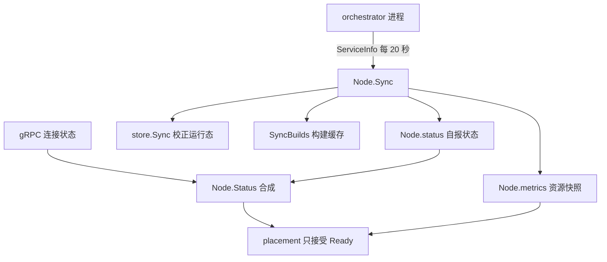
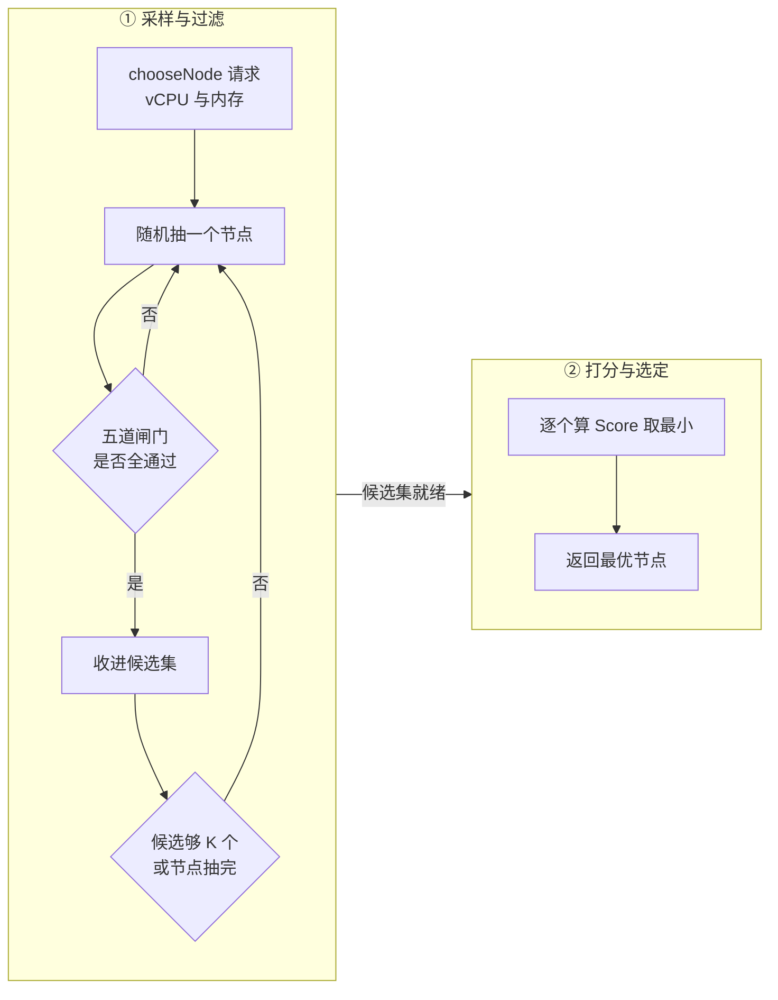

# 19 · 节点管理与放置

> 一个创建沙箱的请求进来，api 必须在几十毫秒内决定「放到哪台机器上」。这个决定基于一份最多陈旧
> 20 秒的节点视图，不允许回退（沙箱一旦落地就不迁移），而且要在成百上千个并发请求之间保持均衡。
> 本篇讲 api 怎么维护这份节点视图，放置算法怎么用有限的信息做决定，以及这个决定错了之后怎么补救。
>
> **读者**：分布式系统方向的高年级本科生与研究生。
> **预备**：[第 15 篇 §6](15-api-service-structure.md#6-与-orchestrator-的连接管理)、[第 17 篇 §5](17-sandbox-create-api.md#5-放置与失败重试)。
> 知道「在线装箱问题」与「power of two choices」会读得更快，但不知道也能读。
> **代码**：`packages/api/internal/orchestrator/nodemanager/`、`packages/api/internal/orchestrator/placement/`、
> `packages/api/internal/orchestrator/orchestrator.go`、`packages/api/internal/orchestrator/cache.go`、
> `packages/shared/pkg/feature-flags/flags.go`、`packages/orchestrator/info.proto`、`packages/orchestrator/orchestrator.proto`

---

## 0. 本篇要回答的问题

1. api 眼里的「一个节点」是什么？它的资源与状态从哪里来、多久更新一次、更新失败会怎样？
2. 放置为什么不做全局最优的装箱，而是随机采样 K 个候选再挑最好的？这样做省了什么、亏了什么？
3. 打分函数里的三个参数 R、K、Alpha 各自控制什么？改大改小分别会出什么问题？
4. 放置失败有几种，为什么其中一种不计入重试次数？
5. 节点上缓存了哪些构建，这件事在 2026.09 的放置路径里到底起了多大作用？

---

## 1. 问题：把一个沙箱放到哪台机器上

一次创建请求（`packages/api/internal/orchestrator/create_instance.go` 的 `CreateSandbox()`）走到某个点时，
手里已经有了完整的沙箱规格：模板、build ID、vCPU 数、内存 MiB、磁盘大小、网络配置。
剩下的问题只有一个：把这份规格发给哪个 orchestrator。

如果信息完备且即时，这是一个经典的**装箱问题**：NP 难，但首次适配之类的近似算法已经够用。
线上系统真正的麻烦是另外三条约束。

**在线，且不可迁移。** 请求一个一个来，没有「所有物品的清单」；沙箱落地后就不再挪窝，
此刻完美的决定会因为三秒后来了一个 16 vCPU 的请求而变坏，而没有「装完再重排」这个补救动作。

**信息陈旧。** api 不在节点上，它对节点资源的了解来自周期性的 gRPC 轮询
（`packages/api/internal/orchestrator/cache.go` 的 `cacheSyncTime = 20 * time.Second`），
一次决策依据的「已分配 vCPU 数」最坏是 20 秒前的快照。

**延迟预算紧。** 放置在用户等待的同步路径上。花十几毫秒扫描全部节点算全局最优，
既拿不到更好的结果（信息本来就是陈旧的），又增加了尾延迟。

所以 e2b 选的不是「最优」，而是「用最少的信息、最短的时间，避免明显的坏决定」——
这是 `placement/placement_best_of_K.go` 那套算法的全部动机。

---

## 2. 节点池：发现、同步与状态

### 2.1 一个节点是什么

`nodemanager/node.go` 的 `Node` 结构体是 api 侧对一台 orchestrator 宿主机的全部认知，由五组字段构成：

| 组 | 字段 | 来源 |
|---|---|---|
| 身份 | `ID`、`ClusterID`、`IPAddress`、`NomadNodeShortID` | 服务发现 + ServiceInfo |
| 连接 | `client`（gRPC 客户端） | `nodemanager.NewClient()` |
| 状态 | `status` | ServiceInfo 的 `service_status` + gRPC 连接态 |
| 资源 | `metrics`、`machineInfo`、`meta` | ServiceInfo 轮询 |
| 放置 | `PlacementMetrics`、`buildCache` | api 自己记的账 |

节点在两条路径上被创建。本地（Nomad 管理）的节点走 `nodemanager.New()`：建好 gRPC 客户端后
立即调一次 `Info.ServiceInfo`，拿到 `node_id` 才算注册成功，拿不到就关闭客户端并返回错误。
远端集群的节点走 `NewClusterNode()`，复用集群池已有的连接，且 ServiceInfo 失败时仍返回一个
资源字段为零值的 Node。两者靠 `NomadNodeShortID` 区分（`IsNomadManaged()`）。服务发现本身属于
[第 21 篇 §4](21-clusters-and-discovery.md#4-三种发现来源)。

### 2.2 ServiceInfo：唯一的资源真相

`packages/orchestrator/info.proto` 定义的 `ServiceInfoResponse` 是 api 了解节点资源的**唯一**通道。
orchestrator 侧的实现在 `packages/orchestrator/internal/service/service_info.go` 的 `ServiceInfo()`：
每次调用都现场采集主机指标，并遍历本地沙箱表累加分配量。

字段分三类：

- **主机总量**：`metric_cpu_count`（`runtime.NumCPU()`）、`metric_memory_total_bytes`。
- **主机用量**：`metric_cpu_percent`、`metric_memory_used_bytes`。前者来自 `GetCPUMetrics()` 的
  `cpu.Percent(0, false)`，是**整机聚合值**，取值 0 到 100 —— 这一点在 §4.2 会变得重要。
- **分配量**：`metric_cpu_allocated`、`metric_memory_allocated_bytes`、`metric_disk_allocated_bytes`、
  `metric_sandboxes_running`，由 `s.sandboxes.Items()` 里每个沙箱的 `Config.Vcpu`、`Config.RamMB`
  相加得到，是**声明值之和**而非实际占用。

此外还有 `machine_info` 与三个 `deprecated` 旧字段。api 侧 `nodemanager/metrics.go` 的
`UpdateMetricsFromServiceInfoResponse()` 把这些字段抄进 `Node.metrics`，读取走 `Metrics()` ——
它在 `metricsMu` 下返回**值拷贝**，放置算法拿到的因此是不会被并发改动的快照。

### 2.3 同步循环

`orchestrator.go` 的 `New()` 起了一个 goroutine 跑 `keepInSync()`，它先立即同步一次，之后每 20 秒一轮。
每一轮（`cache.go` 的 `syncNodes()`）做三件事，整轮带一个 20 秒的超时上下文：

1. **发现**：从 Nomad 列出 `Status == "ready" and NodePool == "default"` 的节点（`client.go` 的 `listNomadNodes()`），
   同时遍历集群池。对不在池里的节点各起一个 goroutine 去连接，单个连接超时 `nodeConnectTimeout = 5 * time.Second`，
   避免一台坏机器拖住整轮同步。
2. **同步**：对池里每个节点并发调用 `Node.Sync()`。
3. **摘除**：如果 `syncNode()` / `syncClusterNode()` 返回错误 —— 本地节点是「不在 Nomad 的发现结果里了」，
   集群节点是「集群里找不到这个 service instance ID 了」—— 就关闭 gRPC 连接并 `deregisterNode()`。

第三条的集群分支比对的是 `ServiceInstanceID` 而不是节点 ID。原因写在 `nodemanager/metadata.go` 的注释里：
orchestrator 每次重启换一个新的 service instance ID 而节点 ID 不变，用它比对才能把「进程重启过」
识别成「旧节点消失、新节点出现」，从而丢弃针对旧进程的连接与状态。

`nodemanager/sync.go` 的 `Sync()` 本身是一个最多重试 4 次（`syncMaxRetries = 4`）的循环，一次成功即退出：

```go
func (n *Node) Sync(ctx context.Context, store *sandbox.Store) {
    syncRetrySuccess := false
    for range syncMaxRetries {
        nodeInfo, err := client.Info.ServiceInfo(ctx, &emptypb.Empty{})
        if err != nil { … continue }
        n.setStatus(ctx, nodeStatus)
        n.setMachineInfo(nodeInfo.GetMachineInfo())
        n.setMetadata(…)
        n.UpdateMetricsFromServiceInfoResponse(nodeInfo)
        activeInstances, instancesErr := n.GetSandboxes(ctx)
        if instancesErr != nil { … continue }
        store.Sync(ctx, activeInstances, n.ID)
        syncRetrySuccess = true
        break
    }
    if !syncRetrySuccess {
        n.setStatus(ctx, api.NodeStatusUnhealthy)
        return
    }
    builds, buildsErr := n.listCachedBuilds(ctx)
    …
    n.SyncBuilds(builds)
}
```

四次全失败的后果是 `setStatus(ctx, api.NodeStatusUnhealthy)` —— 节点留在池里但不再被放置选中；
它不会被摘除，因为摘除的判据是服务发现而不是可达性。下一轮同步成功，状态自己变回 `Ready`。
这是一个自愈的、无外部协调的健康判断：每个 api 实例独立维护自己的节点视图，没有票选也没有仲裁，
代价是不同实例对同一节点的看法可以短暂不一致。

`Sync()` 还顺带做两件与放置无关的事：`store.Sync()` 用节点上报的活跃沙箱列表校正 api 的运行态存储，
`listCachedBuilds()` 更新构建缓存。值得记一笔的是 `sandbox.Store.Sync()` 在整个 api 里**只有这一个调用方**：
运行态存储的对账完全挂在节点同步循环上，没有别的触发点。它在 memory 后端会把「节点上有、存储里没有」的
沙箱补回来，在 Redis 后端则是一个直接返回 `nil` 的空实现，注释写着「redis backend doesn't need any sync」
（[第 20 篇 §3](20-sandbox-state-storage.md#3-redis-后端)）。

### 2.4 状态：三个来源合成一个答案

节点状态有三个来源：orchestrator 在 `ServiceInfo` 里自报的 `service_status`、§2.3 里连续四次同步失败
强行写进去的 `Unhealthy`，以及 gRPC 连接的实时状态。前两个都落在 `Node.status` 字段上，
第三个不落字段，而是在读的时候合成 —— `nodemanager/status.go` 的 `Status()` 因此不是简单地返回字段：

```go
func (n *Node) Status() api.NodeStatus {
    if n.status != api.NodeStatusReady {
        return n.status
    }
    switch n.client.Connection.GetState() {
    case connectivity.Shutdown:        return api.NodeStatusUnhealthy
    case connectivity.TransientFailure: return api.NodeStatusConnecting
    case connectivity.Connecting:       return api.NodeStatusConnecting
    default:                            return n.status
    }
}
```

orchestrator 自报的状态优先，`Draining` 与 `Unhealthy` 一票否决；只有在自报 `Ready` 时，
才用 gRPC 连接的实时状态去否决它。后者的好处是不必等下一轮 20 秒轮询 —— 连接一断，
`GetState()` 立刻变成 `TransientFailure`，节点当即被排除在放置之外。

`Draining` 有两个来源。一是运维显式设置：`handlers/admin.go` 调 `Node.SendStatusChange()`
把 `ServiceStatusOverride` 发给节点，节点在 `internal/service/service_info.go` 里改自己的状态，
api 下一轮同步读回。二是节点自己关机：`packages/orchestrator/main.go` 收到关停信号后把
`Healthy` 改成 `Draining`，再 `time.Sleep(15 * time.Second)` 等状态传播出去才关闭各服务 ——
15 秒略小于 20 秒的同步周期，是「至少让大部分 api 实例看到一次」的经验值。
放置只接受 `api.NodeStatusReady`，于是 draining 的节点不再接新沙箱而已有沙箱不受影响，
这就是滚动升级时的排空语义。



---

## 3. 放置算法：采样、过滤、打分

算法类型是 `BestOfK`，实现 `placement.go` 里的 `Algorithm` 接口，接口只有一个方法 `chooseNode()`。
整个决策分三步。

### 3.1 采样

`sample()` 不遍历节点列表，而是做**无放回随机抽样**：把下标数组打乱着抽，抽到一个就检查一遍过滤条件，
通过就收进候选集，不通过就丢弃，直到候选集攒够 `K` 个或者节点抽完为止。

```go
for len(candidates) < config.K && remaining > 0 {
    j := rand.Intn(remaining)
    pick := indices[j]
    indices[j], indices[remaining-1] = indices[remaining-1], indices[j]
    remaining--
    …过滤…
    candidates = append(candidates, n)
}
```

注意抽样与过滤是**交织**的，不是先过滤再抽样。代价因此与不合格节点的比例有关：
集群健康时抽 K 次就返回，是 O(K)；大半节点不可用时会一直抽下去，最坏 O(N)。
换来的好处是不必为抽样先构造一个「合格节点列表」，省掉一次全表扫描与一次分配。

### 3.2 过滤

被抽中的节点要过五道闸门，任何一道不过就丢弃：

| 闸门 | 判据 | 是否可关 |
|---|---|---|
| 排除表 | `excludedNodes` 里有这个节点 ID | 否 |
| 状态 | `n.Status() != api.NodeStatusReady` | 否 |
| CPU 兼容 | `isNodeCPUCompatible(n, buildMachineInfo)` | 否 |
| 容量 | `b.CanFit(n, resources, config)` | 由 `best-of-k-can-fit` 控制 |
| 启动中数量 | `n.PlacementMetrics.InProgressCount() > maxStartingInstancesPerNode` | 由 `best-of-k-too-many-starting` 控制 |

CPU 兼容检查在 `placement/cpu_compatibility.go`：如果这次构建没有记录机器信息
（`buildMachineInfo.CPUArchitecture == ""`），一律兼容，这是给存量数据留的后门。
否则调 `machineinfo.MachineInfo.IsCompatibleWith()`，逐字段比较 `CPUArchitecture`、`CPUFamily`、`CPUModel`，
三者全等才算兼容；`CPUFlags` 收集了但**不参与**比较。构建侧的机器信息由
`packages/db/pkg/builds/machine_info.go` 的 `ToMachineInfo()` 从 `env_builds` 记录里取出。
直接后果是：一个在某型号 CPU 上做出的快照只能在同型号机器上恢复。对 pause / resume 这是必要的
（[第 37 篇 §2](37-pause-and-snapshot.md#2-pause-的时序) 保存的是 vCPU 状态），对首次创建则偏保守。

`CanFit()` 与 `InProgressCount()` 这两道由特性开关控制，默认前者开、后者关（§4.1）。

### 3.3 打分

候选集里逐个算分，取**最小**者：

```go
func (b *BestOfK) Score(node *nodemanager.Node, resources nodemanager.SandboxResources, config BestOfKConfig) float64 {
    metrics := node.Metrics()
    reserved := metrics.CpuAllocated
    usageAvg := float64(metrics.CpuPercent) / 100
    cpuCount := float64(metrics.CpuCount)
    if cpuCount == 0 { return math.MaxFloat64 }
    totalCapacity := config.R * cpuCount
    cpuRequested := float64(resources.CPUs)
    return (cpuRequested + float64(reserved) + config.Alpha*usageAvg) / totalCapacity
}
```

用符号写出来，节点 $n$ 对一个请求 $r$ 的分数是

```text
score(n, r) = ( r.vcpu + allocated(n) + Alpha × usage(n) ) / ( R × cpus(n) )
```

分子是「放进去之后这台机器的声明负载」，分母是「允许的声明负载上限」，所以分数就是**放置后的过量分配率**；
取最小值等价于选「放进去之后最空」的那台。`CanFit()` 用同一套量纲，只是去掉 usage 项并改成不等式
`allocated(n) + r.vcpu <= R × cpus(n)`。

`cpuCount == 0` 时返回 `math.MaxFloat64` 而不报错：这台节点排在最后，但若它是唯一候选仍会被选中。
这是「宁可尝试也不拒绝服务」的取舍，真正的兜底在节点侧。



---

## 4. 参数与在线调参

### 4.1 参数表

`BestOfKConfig` 的五个字段全部来自特性开关，映射在 `orchestrator.go` 的 `getBestOfKConfig()`：

| 字段 | 开关名（`packages/shared/pkg/feature-flags/flags.go`） | 上游默认值 | 含义 |
|---|---|---|---|
| `K` | `best-of-k-sample-size` | 3 | 采样的候选节点数 |
| `R` | `best-of-k-max-overcommit` | 400，即 4.0 | 集群级 vCPU 过量分配上限倍数 |
| `Alpha` | `best-of-k-alpha` | 50，即 0.5 | 实际使用率在分数里的权重 |
| `CanFit` | `best-of-k-can-fit` | true | 是否启用容量闸门 |
| `TooManyStarting` | `best-of-k-too-many-starting` | false | 是否启用启动中数量闸门 |

两个百分比开关是整型的，代码里除以 100 转成小数，用「参数精度」换「运维便利」。

配置不是启动时读一次就固定的。`New()` 另起 `updateBestOfKConfig()` goroutine，每 30 秒重读开关并调
`placementAlgorithm.UpdateConfig()`；`BestOfK` 用 `sync.RWMutex` 保护 `config`，而 `chooseNode()`
一进来就 `getConfig()` 取一份拷贝，整次决策用同一份配置。运维改一个数字，30 秒内全集群跟着变，
不必重启 api；代价是这套参数的行为读代码看不出来，线上真实值只在特性开关服务里
（[第 14 篇 §2](14-config-flags-versions.md#2-特性开关)）。

### 4.2 三个参数各自的作用

**R 控制超售。** 注意 R 不是代码里的常量：它是特性开关 `best-of-k-max-overcommit` 的整数值除以 100，
运维随时可改。R = 4 意味着允许把 4 倍于物理 vCPU 数的声明量放到一台机器上。
依据是负载特征：绝大多数沙箱在绝大多数时间里空闲，按声明值独占分配会让机器大量闲置。
R 越大单机装得越多、成本越低，但「所有沙箱同时忙」的尾部场景下 CPU 争抢越严重。

**K 控制随机性与均衡的平衡。** K = 1 退化成纯随机放置，负载方差大。K = N 退化成对当前视图的全局最优，
代价是 O(N) 的扫描，以及**羊群效应** —— 所有实例、所有并发请求在同一份陈旧视图上算出同一个
「最空的节点」，一起扑过去把它压垮。power-of-K-choices 的经典结论正在于此：从 1 涨到 2 时
最大负载的改善是指数级的，再往上是对数级的边际收益，K = 3 是这条曲线上的常见取值。

**Alpha 控制「声明」与「实际」的配比。** 分子里 `allocated(n)` 是声明值之和，`Alpha × usage(n)`
是实测值的修正项，理论上让算法能区分「声明了 8 vCPU 但闲着」与「声明了 8 vCPU 且真在跑」的两台机器。
但这里有一个量纲问题：`usageAvg = CpuPercent / 100`，而 `CpuPercent` 来自 `cpu.Percent(0, false)`，
是**整机**使用率、取值 0 到 100，于是 `usageAvg ∈ [0, 1]`；代码里那行注释写的却是
`1 CPU used = 100% CPU percept`，按它的理解一台 64 核机器满载应当得到 64。
**推论：** `usageAvg` 最大只有 1，乘 Alpha = 0.5 后对分数的贡献至多 0.5，而同一分子里的 `allocated`
在 R = 4、64 核的机器上可达 256 —— 相差两个数量级，实际使用率对决策的影响接近于零，
算法实质上是纯声明量驱动的。

---

## 5. 为什么不是全局最优

把上面几节的取舍集中起来，可以列出四条「明知不最优仍然这么做」的地方。

**视图陈旧，且在途放置不计分。** 决策依据是最多 20 秒前的 `CpuAllocated`，这段窗口里落到该节点上的沙箱不在分数里。
`PlacementMetrics.StartPlacing()` 把在途沙箱及其资源记进 `sandboxesInProgress`，但 `Score()` 只读 `Metrics()`，
不看这个字段：同一瞬间连着放 10 个沙箱到同一节点，10 次打分拿到同一个分数。
唯一利用这份数据的是默认关闭的 `TooManyStarting` 闸门。
**推论：** 抑制并发扎堆的实际责任落在采样的随机性上，而不是在打分上。

**内存不参与决策。** `SandboxResources` 有 `MiBMemory` 字段，`PlaceSandbox()` 也填了它，
但 `Score()` 与 `CanFit()` 都只用 `CPUs`。在 e2b 的负载下这大致成立（模板的 vCPU 与内存配比是固定档位），
但「小 CPU 大内存」的模板会被当成小沙箱，而内存不能超售
（见[第 32 篇 §5](32-memory-prefetch-and-hugepages.md#5-大页改变了哪些量)）。

**不迁移、不回填。** 没有再平衡循环，不平衡会持续到那些长命沙箱自己结束。

**每个 api 实例独立决策。** 节点池、指标、算法全是进程内状态，实例之间不交换放置意图；
唯一的跨实例协调是运行态存储与配额预留（[第 20 篇 §4](20-sandbox-state-storage.md#4-reservations创建期的占位)），
那是配额层面的事，与放置无关。

这四条合起来的判断是：**放置层做的是「粗筛」，真正的准入控制在节点侧。**

---

## 6. 失败与重试

### 6.1 api 侧的重试循环

`placement/placement.go` 的 `PlaceSandbox()` 是放置的入口，它把「选节点」和「调 Create」放在同一个循环里 ——
只有真的调过才知道选得对不对。

循环上限是 `maxRetries = 3`（`placement/config.go`）。每一轮：

1. 如果有 `preferredNode`（resume 时快照所在的节点，`create_instance.go` 里取得并检查过状态为 `Ready`），
   直接用它；否则调 `algorithm.chooseNode()`。这就是恢复请求的**节点亲和性**：快照产物大概率还在
   原节点的本地缓存里，落回去能省一次对象存储拉取。它是软偏好 —— 首选节点这一轮失败后 `node` 被置空，
   下一轮回到正常采样（节点侧见
   [第 27 篇 §2](27-resume-sandbox.md#2-入口create-rpc-在调-resumesandbox-之前做什么)）。
   采样前先检查 `len(nodesExcluded) >= len(clusterNodes)`，全被排除就返回 `no nodes available`。
2. `node.PlacementMetrics.StartPlacing(...)` 记账，然后 `node.SandboxCreate(ctx, sbxRequest)`
   发一次 gRPC 调用（`nodemanager/sandbox_create.go`）。
3. 成功则 `PlacementMetrics.Success()` 并返回节点。

失败时按 gRPC 状态码分成两类，这是整段代码的要点：

| 状态码 | 处理 | 记账 | `attempt` |
|---|---|---|---|
| `codes.ResourceExhausted` | 节点满了，换一个 | `Skip()` | **不增加** |
| 其它（含 `codes.Internal`） | 节点可能坏了 | `Fail()` | 增加 1 |

`default` 分支的粗糙是这里的代价：它把「这台节点坏了」与「换哪台都一样」混在一起。
orchestrator 的 `ResumeSandbox` 在快照产物还没上传完时返回 `FailedPrecondition`，
`GetTemplate` 失败则根本没映射状态码、到调用方是 `Unknown`；两者缺的都是对象存储里的数据，
换节点毫无帮助，可 api 侧没有为它们写分支，于是每遇到一次就白排除一个健康节点、白消耗一次重试
（错误码的完整口径见[第 39 篇 §6](39-health-errors-and-teardown.md#6-错误语义状态码是给调用方看的)）。

「标坏」只在本次放置内有效：`nodesExcluded` 是 `PlaceSandbox()` 的局部变量，不写回 `Node`，
也不影响别的请求。节点级的持久化健康判断只有 §2.3 里连续四次 ServiceInfo 失败这一条路径。

`ResourceExhausted` 不计入重试，因为它不是错误而是**背压**：节点在说「我这轮满了，你换一个」，
不该消耗容错预算。代价是这个分支既不增加 `attempt` 也不扩充 `nodesExcluded`，循环理论上可以一直转，
唯一的出口是开头 `select` 里的 `ctx.Done()`。**推论：** 整个集群资源耗尽时，这段代码的行为是
「一直重试到请求超时」而不是「三次后失败」，请求超时时长成了这个场景下的实际上限。

三次非资源类失败后返回 `errSandboxCreateFailed`，一句给用户看的文案，真实原因只进日志与 span。

### 6.2 节点侧的两道闸门

api 侧的 `CanFit` 与 `TooManyStarting` 都是**建议性**的，还都可以关掉。真正的准入在
`packages/orchestrator/internal/server/sandboxes.go` 的 `Create()` 开头，两道检查各返回 `ResourceExhausted`：

```go
maxRunningSandboxesPerNode := s.featureFlags.IntFlag(ctx, featureflags.MaxSandboxesPerNode)
runningSandboxes := s.sandboxes.Count()
if runningSandboxes >= maxRunningSandboxesPerNode {
    return nil, status.Errorf(codes.ResourceExhausted, "max number of running sandboxes on node reached (%d), please retry", …)
}
```

第一道是节点上运行沙箱总数的硬上限，由 `max-sandboxes-per-node` 控制，上游默认 200。
第二道是启动并发：`startingSandboxes` 是一个 `semaphore.Weighted`，容量取自常量
`maxStartingInstancesPerNode = 3`（`internal/server/sandboxes.go`，在 `main.go` 的 `New()` 里创建）。
两种请求区别对待：**恢复**请求（`req.GetSandbox().GetSnapshot()` 为真）走 `waitForAcquire()`，
在 `acquireTimeout`（15 s）内阻塞等待，等不到才返回 `ResourceExhausted`；**首次创建**走
`TryAcquire(1)`，拿不到立刻返回。理由是 resume 有明确的目标节点，换节点要重新从对象存储拉产物，
代价远高于等待；首次创建换一台就是了。

两侧闸门于是形成一个协议：api 侧用陈旧信息做粗筛，节点侧用即时信息做终判，终判的拒绝以
`ResourceExhausted` 表达，api 侧把它翻译成「换一个，不算错」。注意两侧的同名常量并不对齐 ——
api 侧的比较是 `InProgressCount() > 3`，严格大于，故允许 4 个在途。

---

## 7. 构建缓存在放置里的作用

`orchestrator.proto` 定义了 `SandboxService.ListCachedBuilds`，返回一组 `CachedBuildInfo`，
每条只有 `build_id` 和 `expiration_time`。orchestrator 侧的实现
（`packages/orchestrator/internal/server/template_cache.go`）把本地模板缓存
（[第 34 篇 §5](34-template-cache-and-local-storage.md#5-缓存项的生命周期用-ttl-代替引用计数)）的键和过期时间列出来。

api 侧每个 `Node` 有一个 `buildCache *ttlcache.Cache[string, any]`，写入有两条路径
（`nodemanager/builds.go`）：`SyncBuilds()` 在每轮同步的最后按 orchestrator 给的过期时间写入；
`InsertBuild()` 由 `create_instance.go` 在放置成功后调用，先给 2 分钟 TTL，
等下一轮同步用真实过期时间覆盖。

动机不难看出：一个 build 若已在某节点上缓存，把用同一个 build 的沙箱放过去就省掉一次从对象存储
拉取模板的时间，冷启动快很多。

但在上游 2026.09 的代码里，`buildCache` 只有写没有读：全仓库对它的读操作只有 `InsertBuild()`
内部那次 `n.buildCache.Has(buildID)` 去重，`Score()`、`CanFit()`、`sample()` 都不看它，
`Node` 也没有导出任何查询构建的方法。**推论：** 这是一条铺好了数据通路却尚未接上决策的伏笔，
缓存亲和性所需的信息已经在 api 手里，只差在打分函数里加一项。
看到 `ListCachedBuilds` 就假设放置有缓存亲和性，结论会是错的。

---

## 8. ARM 适配版的差异

ARM 适配版没有改动放置算法本身，改的是两个参数默认值（`packages/shared/pkg/feature-flags/flags.go`）：
`max-sandboxes-per-node` 从 200 提到 10000，`best-of-k-max-overcommit` 从 400 提到 1200，即 R 从 4.0 提到 12.0。
前者实际上取消了节点侧的沙箱数硬上限，后者把 api 侧的容量闸门放宽三倍；合起来的效果是放置几乎不再拒绝请求，
准入完全交给真实的内存与大页耗尽，代价是失去了「过载前先拒绝」的保护。

另有一处结构性改动：`packages/api/internal/orchestrator/orchestrator.go` 引入 `NodeDiscovery` 抽象，
按环境变量 `ORCHESTRATOR_TYPE` 在 Nomad 与 Kubernetes 之间选择发现方式，
并把 `skipNomadSync` 从 `env.IsLocal()` 改成常量 `false`。
参数调整的动机与风险见[第 77 篇 §2](77-api-and-flags-on-arm.md#2-准入闸门两个数字与它们之间的空隙)，
发现方式见[第 76 篇 §4](76-k8s-discovery.md#4-第二层api-里的-nodediscovery)。

---

## 9. 小结

- api 对节点的全部认知来自 `ServiceInfo` 的周期轮询（20 秒一轮），资源量是**声明值之和**而非实测占用；
  连续四次轮询失败把节点标为 `Unhealthy` 但不摘除，摘除只由服务发现驱动。
- 节点状态由「orchestrator 自报状态」与「gRPC 连接态」合成，前者优先，后者用于在轮询周期内快速发现断连；
  `Draining` 由运维设置或由关停流程自动置位并等待 15 秒传播，放置只接受 `Ready`，排空因此自然发生。
- 放置算法是 best-of-K：无放回随机抽样直到攒够 K 个通过过滤的候选，再取「放置后过量分配率」最小者。
  参数 K = 3、R = 4.0、Alpha = 0.5 全部来自特性开关，每 30 秒热更新一次。
- 打分只用 vCPU。内存字段被传进来但未被使用；实际 CPU 使用率因为量纲问题对分数的贡献可以忽略。
- 放置失败分两类：`ResourceExhausted` 是背压，换节点且不消耗重试预算；其它错误把节点加入本次请求的排除表，
  重试三次后放弃。全集群资源耗尽时，实际的失败边界是请求超时而不是三次重试。
- 真正的准入控制在节点侧：`max-sandboxes-per-node` 硬上限与容量 3 的启动信号量，恢复请求排队等待、
  首次创建立即被拒。
- `ListCachedBuilds` 的数据在 api 侧被完整维护，但上游 2026.09 的放置路径不读它，缓存亲和性尚未实现。
- ARM 适配版只调了参数：沙箱数上限 200 → 10000，过量分配 4.0 → 12.0，把准入判断让给了真实的资源耗尽。

## 延伸阅读 / 下一篇

- [第 17 篇 §5](17-sandbox-create-api.md#5-放置与失败重试)：放置在整条创建链路里的位置。
- [第 20 篇 §2](20-sandbox-state-storage.md#2-memory-后端)：`store.Sync()` 校正的是什么。
- [第 21 篇 §4](21-clusters-and-discovery.md#4-三种发现来源)：节点是怎么被发现的。
- [第 34 篇 §5](34-template-cache-and-local-storage.md#5-缓存项的生命周期用-ttl-代替引用计数)：`ListCachedBuilds` 列出的是什么。
- [第 14 篇 §2](14-config-flags-versions.md#2-特性开关)：特性开关的读取机制与本地 fallback。
- [第 39 篇 §6](39-health-errors-and-teardown.md#6-错误语义状态码是给调用方看的)：节点侧每个 gRPC 状态码的触发点。
- Mitzenmacher, *The Power of Two Choices in Randomized Load Balancing*（1996）：best-of-K 的理论出处。
