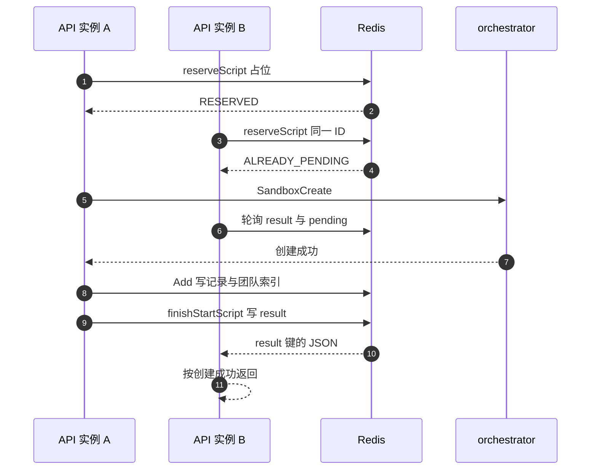

# 20 · 沙箱运行态存储

> API 服务需要随时回答三个问题：这个沙箱在哪个节点上、它什么时候该被回收、这个团队现在有几台在跑。
> 上游 2026.09 把答案放在一份可替换的「运行态存储」里，并提供了两个实现：进程内的 memory 与共享的 Redis。
> 本篇讲这份存储存了什么、Redis 上的键怎么布局、创建期的并发怎么用占位挡住，以及它与 edge 用的
> sandbox catalog 是什么关系。
>
> **读者**：后端与分布式系统方向的读者。
> **预备**：[第 11 篇 · 对象模型与状态机](11-object-model.md#5-沙箱状态机)、[第 13 篇 · 存储全景](13-storage-landscape.md#5-元数据与运行态)。
> **代码**：`packages/api/internal/sandbox/store.go`、`packages/api/internal/sandbox/storage/memory/`、
> `packages/api/internal/sandbox/storage/redis/`、`packages/api/internal/sandbox/reservations/`、
> `packages/shared/pkg/sandbox-catalog/`

---

## 0. 本篇要回答的问题

1. 沙箱的运行态为什么不放在 Postgres 里，而要单独做一份存储？
2. 这份存储的接口有哪些操作，每个操作对应哪条 API 路径？
3. Redis 后端上的键是怎么布局的，为什么要用 `{teamID}` 这样的花括号？
4. 「预留」（reservation）解决的是什么并发问题，两个 API 实例同时创建同一个沙箱会怎样？
5. 运行态存储与 sandbox catalog 存的是不是同一份数据，不一致时会发生什么？

---

## 1. 为什么需要单独一份运行态

一台正在运行的沙箱，其寿命通常是分钟级，状态每次续期都会变。API 服务在请求路径上要用到的，
只有很少几项：它落在哪个节点、执行 ID 是多少、什么时候到期、当前处在哪个状态、属于哪个团队。
这些数据有三个共同特点：写得频繁、读得更频繁、丢了不算灾难（沙箱本身还在节点上跑，
下一轮节点同步就能把它捞回来）。

把它们放进 Postgres 是可行的，但每次 `POST /sandboxes/{id}/timeout` 续期都要写一行事务，
而回收扫描又要以 50 ms 的节奏查一遍到期集合（`packages/api/internal/orchestrator/evictor/evict.go`
的 `pollInterval`）。这个读写形态与关系库的强项不符。于是上游把它抽成一个独立接口
`sandbox.Storage`，定义在 `packages/api/internal/sandbox/store.go`，
并给了两个实现：进程内的 `storage/memory` 与共享的 `storage/redis`。

代价是这份数据不再有事务保证，也不与 Postgres 里的沙箱记录做两阶段提交。
上游用两个机制补偿：一是节点同步（`packages/api/internal/orchestrator/cache.go` 的 `syncNodes`，
每 20 s 一轮，见 [第 19 篇 §2.3](19-node-management-and-placement.md#23-同步循环)），
以 orchestrator 报上来的列表为准修正存储；二是让每个键都能被独立重建，
不依赖任何跨键不变量。

### 1.1 存了什么

记录本身是 `packages/api/internal/sandbox/sandbox.go` 的 `Sandbox` 结构，由 `NewSandbox()` 构造。
它比 API 返回给用户的 `api.Sandbox`（`ToAPISandbox()` 的产物）大得多，除了 ID、模板、别名，
还带着放置结果（`NodeID`、`ClusterID`）、资源规格（`VCpu`、`RamMB`、`TotalDiskSizeMB`）、
版本三元组（`KernelVersion`、`FirecrackerVersion`、`EnvdVersion`）、两个访问令牌、
`AutoPause` 与 `AutoResume` 策略，以及三个时间：`StartTime`、`EndTime`、`MaxInstanceLength`。
整个结构体带 JSON tag，因为 Redis 后端就是把它整体序列化成一个字符串值。

状态字段 `State` 只有四个取值（`packages/api/internal/sandbox/states.go`）：
`running`、`pausing`、`killing`、`snapshotting`。合法迁移写死在 `AllowedTransitions` 表里：
running 可以去这三个中的任何一个，pausing 只能再去 killing，snapshotting 可以回到 running
或转去 killing / pausing。三个 `StateAction` 常量把「动作」与「效果」绑在一起：
pause 与 kill 的 `Effect` 是 `TransitionExpires`（完成后沙箱消失），
snapshot 是 `TransitionTransient`（完成后回到 running）。

### 1.2 接口的十一个操作

| 操作 | 用途 | 典型调用方 |
|---|---|---|
| `Add` / `Get` / `Remove` | 单条读写 | 创建、查询、删除路径 |
| `Update` | 读改写一条记录 | `KeepAliveFor()` 续期 |
| `TeamItems` | 按团队列举，可按状态过滤 | `GET /sandboxes` |
| `ExpiredItems` | 取出已到期的记录 | evictor |
| `TeamsWithSandboxCount` | 每团队在跑数量 | 团队指标观测 |
| `StartRemoving` / `WaitForStateChange` | 状态迁移的开始与等待 | pause / kill 路径 |
| `Sync` | 用节点上报的列表校正存储 | 节点同步循环 |
| `Name` | 报告当前后端 | 内部分支判断 |

`Name()` 与 `Sync()` 在代码里带着「迁移完成后删除」的注释，它们是 memory 后端的遗产：
Redis 后端的 `Sync()` 直接返回 `nil`（`storage/redis/main.go`）。

接口之外还有一层薄壳 `sandbox.Store`（`store.go`），它做三件接口不做的事：
在 `Add` 时把 `EndTime` 截断到 `StartTime + MaxInstanceLength`；
触发三个回调 —— 同步的 `AddSandboxToRoutingTable`、异步的 `AsyncSandboxCounter`
与 `AsyncNewlyCreatedSandbox`；以及把预留存储（下面第 4 节）与沙箱存储绑在同一个门面后面。
回调的同步与异步之分有明确理由：路由表必须在 `Add` 返回前写好，
否则用户拿到沙箱 ID 后立刻发请求，edge 会找不到节点。

---

## 2. memory 后端

`storage/memory` 用一个 `cmap.ConcurrentMap[string, *memorySandbox]` 存所有记录，
键是 sandbox ID。每条记录自带一把 `sync.RWMutex` 和一个 `transition *utils.ErrorOnce`。
`Add` 用 `SetIfAbsent`，重复插入返回 `sandbox.ErrAlreadyExists`。

有一处值得注意：`Get`、`Remove`、`Update` 的 `teamID` 参数在 memory 后端里被丢弃，
只用 sandbox ID 索引。`TeamItems`、`TeamsWithSandboxCount`、`ExpiredItems`
则是全表遍历后过滤（`getItems()`）。在单实例、几千台沙箱的规模下这没有问题，
但它意味着两件事：查询代价与全局沙箱数成正比，而不是与团队沙箱数成正比；
以及 API 一旦有第二个实例，两份内存互不知情，配额与列举都会出错。

`Sync()` 只有 memory 后端有实质实现（`storage/memory/sync.go`）：
拿到某个节点上报的沙箱列表后，把本地记录中属于该节点、尚未到期、
且启动已超过 10 s 宽限期（`syncSandboxRemoveGracePeriod`）却不在列表里的记录标记为过期；
反过来，列表中本地没有的沙箱会被返回给 `Store.Sync()` 重新 `Add`。
那 10 s 宽限期是为了不误杀正在创建、还没写进 orchestrator 列表的沙箱。

---

## 3. Redis 后端

### 3.1 键布局

Redis 后端把一条记录序列化成 JSON 放在一个字符串键里，再用三个索引支撑三类查询。
键名由 `storage/redis/utils.go` 的几个函数拼出，分隔符是 `:`
（`packages/shared/pkg/redis` 的 `CreateKey()`）。

| 键 | 类型 | 内容 | 生存期 |
|---|---|---|---|
| `sandbox:storage:{teamID}:sandboxes:<sandboxID>` | String | `Sandbox` 的 JSON | 无 TTL，显式删除 |
| `sandbox:storage:{teamID}:index` | Set | 该团队的 sandbox ID | 随成员增删 |
| `sandbox:storage:global:expiration` | ZSet | 成员 `teamID:sandboxID`，分值为 `EndTime` 的毫秒 | 随成员增删 |
| `sandbox:storage:global:teams` | ZSet | 成员 teamID，分值为最近一次 `Add` 的 Unix 秒 | 空闲 1 小时后剪枝 |
| `sandbox:storage:{teamID}:transition::<sandboxID>` | String | 迁移 ID（UUID） | 70 s |
| `sandbox:storage:{teamID}:transition::<sandboxID>:<迁移 ID>` | String | 空串或错误消息 | 30 s |
| `sandbox:storage:{teamID}:reservations:pending` | ZSet | 成员 sandbox ID，分值为占位时刻 Unix 秒 | 90 s 后按陈旧清理 |
| `sandbox:storage:{teamID}:reservations:<sandboxID>:result` | String | 创建结果的 JSON | 30 s |
| `lock:sandbox:storage:{teamID}:sandboxes:<sandboxID>` | String | redislock 持有者 | 60 s |

花括号是 Redis Cluster 的 hash tag：`SameSlot()` 把 teamID 包成 `{teamID}`，
使一个团队的所有键落在同一个槽上。这不是为了局部性，而是为了能对它们跑 Lua 脚本、
`MGET` 和事务 —— Redis Cluster 只允许单槽多键操作。代价是团队之间的负载不均匀会直接变成槽的不均匀：
一个大团队的所有沙箱键都压在同一个分片上。

两个 global 索引不带 hash tag，因此与团队键不同槽。这解释了 `Add()` 的写法
（`storage/redis/operations.go`）：先单独 `ZADD` 到期索引，再用 Lua 脚本原子地
`SET` 记录 + `SADD` 团队索引，最后单独 `ZADD` 团队索引。三步不是一个事务。
顺序是刻意的 —— 先入到期索引，即使后面失败，也只是留下一条孤儿索引项，
不会漏掉一台永远不被回收的沙箱。`ExpiredItems()` 里对 `MGET` 返回 `nil` 的成员做 `ZREM`，
正是在收拾这类孤儿。

`transition` 那两个键名里的双冒号不是笔误：`transitionKeyPrefix` 的字面值就是 `"transition:"`，
再经 `CreateKey()` 拼接时又加了一个分隔符。

### 3.2 到期扫描

memory 后端的 `ExpiredItems()` 是全表扫；Redis 后端换成对 `global:expiration`
做一次 `ZRANGEBYSCORE -inf now`，`Count` 限制为 256（`expiredItemsBatchSize`）。
取回成员后按团队分组，每组一次 `MGET`（同槽），再反序列化过滤。
过滤有两条规则：分值说到期但记录里的 `EndTime` 还没到，跳过（索引更新失败的兜底）；
状态不是 running 的，只有当它超过 `EndTime` 已经一小时（`staleCutoff`）才纳入，
否则视为「正在被别人回收」，让那次回收自己走完。

这里有一处成本要看清：evictor 每 50 ms 调一次 `ExpiredItems()`，
而每个 API 实例都跑一个 evictor。实例数越多，这条扫描的 QPS 越高，
且多个实例会取到同一批到期沙箱。重复不会造成重复回收 ——
下一节的迁移键会把并发的第二个请求挡下来 —— 但重复的 Redis 往返是实打实的。

`TeamsWithSandboxCount()` 走 `global:teams`：`ZRANGE` 取全部团队，
再用 pipeline 对每个团队索引 `SCARD`。计数为 0 且分值早于一小时前的团队会被 `ZREM` 剪掉；
分值新的不剪，因为那可能是「刚 `ZADD` 完团队、还没 `SADD` 沙箱」的瞬间。

### 3.3 状态迁移

memory 后端表达「正在迁移」用的是记录里的 `transition *utils.ErrorOnce`：非 nil 即表示有迁移在跑，
等待者调 `WaitWithContext()` 阻塞。Redis 后端没有跨进程的条件变量，只能用键加轮询。

`StartRemoving()`（`storage/redis/state_change.go`）的流程是：
先对沙箱键取一把分布式锁（`redislock`，TTL 60 s，重试间隔 20 ms 带 ±25% 抖动，见 `backoff.go`）；
读出记录，再看迁移键在不在。如果在，说明别的实例正在迁移这台沙箱，
就放锁并转入 `handleExistingTransition()`：目标状态相同则等它结束并返回 `alreadyDone=true`，
目标状态不同则先校验迁移合法、等它结束、再从头重试一次。
如果迁移键不在，校验 `AllowedTransitions`，把新状态与（对 `TransitionExpires` 而言）
提前到当下的 `EndTime` 写回，同时用一个 Lua 脚本原子地写三件事：新记录、
带 70 s TTL 的迁移键（值是新生成的迁移 ID）、带 30 s TTL 的空结果键。

调用方拿到的 `callback` 必须被调用，否则等待者要等到迁移键 TTL 到期才会解除阻塞。
回调里先处理 transient 动作的状态还原（`restoreToRunning()`），
再写结果键、删迁移键。`waitForTransition()` 的判据是「迁移键消失，或者值变成了另一个迁移 ID」，
之后读结果键：读不到当作成功（结果键可能已过期），读到空串是成功，读到非空串当作失败原因。

两个细节值得指出。其一，回调里取的锁是**迁移键**的锁（`GetLockKey(transitionKey)`），
与 `StartRemoving()` 里取的**沙箱键**的锁不是同一把，两者不互斥。
其二，transient 动作失败时结果键写的是空串，也就是对等待者报告成功 ——
注释说明这是为了让并发的 kill 能继续推进，与 memory 实现的行为对齐。

---

## 4. reservations：创建期的占位

### 4.1 问题

团队的并发沙箱数有上限（`team.Limits.SandboxConcurrency`）。如果只用「存储里这个团队有几条记录」
来判断，就会漏掉一段窗口：从决定创建到 `Add` 写入存储之间，要经过放置、gRPC 调 orchestrator、
等 microVM 起来，这段时间可能有几百毫秒到几秒。窗口期内到达的并发请求都会看到旧的计数，
于是一个上限为 20 的团队可能同时起 30 台。

第二个问题是重复请求。同一个 sandbox ID 的创建被重放（SDK 重试、resume 与自动 resume 撞在一起）时，
第二个请求不应该再起一台，而应该等第一个的结果。

`ReservationStorage` 接口（`store.go`）为此只有两个方法：`Reserve()` 与 `Release()`。
`Reserve()` 返回一对函数：`finishStart` 给「我拿到了占位、我负责创建」的一方，
`waitForStart` 给「已经有人在创建了、我等结果」的一方。两者恰有一个非 nil。

### 4.2 时序

轮询间隔是 20 ms（`reservations/redis/reservation.go` 的 `retryInterval`）。
等待方每轮先读结果键，读不到再用 `ZSCORE` 确认对方仍在 pending 集合里；
若既无结果又已不在 pending，说明占位方异常消失，直接报错返回。

### 4.3 Lua 脚本与计数口径

占位的核心是 `reservations/redis/scripts.go` 里的 `reserveScript`，它在一次调用里做五件事：
先 `ZREMRANGEBYSCORE` 清掉分值早于 90 s 前（`staleTTL`）的陈旧占位 ——
这是为了处理「API 实例创建到一半崩溃」，注释说明 90 s 远长于任何现实的创建耗时；
然后 `SISMEMBER` 查团队索引，命中就返回 `ALREADY_IN_STORAGE`；
再 `ZSCORE` 查 pending 集合，命中就返回 `ALREADY_PENDING`；
接着在 `limit >= 0` 时用 `SCARD(团队索引) + ZCARD(pending)` 与上限比较，
超了返回 `LIMIT_EXCEEDED`；都通过则删掉可能残留的结果键并 `ZADD` 占位，返回 `RESERVED`。

**计数口径在这里定死了：已建成的 + 在建的。** 这正是前面那个窗口的补丁。
四个返回码在 `Reserve()` 里映射成四种结果：`RESERVED` 给出 `finishStart`；
`ALREADY_PENDING` 给出 `waitForStart`；`LIMIT_EXCEEDED` 变成 `LimitExceededError`，
在 `create_instance.go` 里被翻译成 HTTP 429 与一段带上限数字的提示；
`ALREADY_IN_STORAGE` 返回 `sandbox.ErrAlreadyExists`，`Store.Reserve()` 捕获它，
把 `waitForStart` 换成一个直接读存储的闭包。

`finishStart` 由 `createFinishStart()` 生成：把沙箱与错误编码成 `reservationResult` JSON
（`reservations/redis/result.go`），用 `finishStartScript` 原子地 `ZREM` 出 pending 并写 30 s TTL 的结果键。
编码时特意保留了 `api.APIError` 的 `Code` 与 `ClientMsg`，
`decodeResult()` 再把它重建回 `*api.APIError`，好让另一个实例上的 `errors.As` 仍然成立 ——
否则跨实例等待的请求只能拿到 500，而不是原始的 429 或 400。

`Release()` 用 `releaseScript` 同时 `ZREM` 与 `DEL` 结果键。它在两处被调：
创建失败时由 `finishStart` 内部调用（memory 实现），以及 `Store.Remove()` 里每次删沙箱时都调一次。

### 4.4 memory 实现与它的差别

`reservations/reservation.go` 用一个两层 map（团队 → sandbox ID → `SetOnce`）表达同一语义。
它的上限判据是 `len(teamSandboxes) >= limit`，也就是**只数这张 map**。
为了让这张 map 也能代表已建成的沙箱，`Store.Add()` 里有一段专门的补偿：
当后端不是 Redis 时，额外调一次 `Reserve(..., limit=-1)`（不限流地占位）并立刻 `finishStart`，
把这条沙箱登记进预留表。这段代码带着「迁移到 Redis 后删除」的注释。
Redis 路径不需要它，因为计数直接来自团队索引。

---

## 5. 与 sandbox catalog 的关系

`packages/shared/pkg/sandbox-catalog` 是另一份 Redis 上的沙箱数据，二者容易混淆，
但用途、写者、读者都不同。

| 维度 | 运行态存储 | sandbox catalog |
|---|---|---|
| 键 | `sandbox:storage:{teamID}:…` | `sandbox:catalog:<sandboxID>` |
| 内容 | 完整 `Sandbox` 结构 | `SandboxInfo`：orchestrator ID 与 IP、执行 ID、启动时刻、最长时长 |
| 读者 | api 自身 | client-proxy（edge），见 [第 53 篇 §4](53-client-proxy-edge.md#4-从沙箱-id-到节点-ip) |
| 按团队分片 | 是 | 否 |
| 过期 | 靠到期索引与 evictor | 靠 Redis TTL |
| 本地缓存 | 无 | 有，500 ms |

catalog 是**路由表**：edge 收到一个发往 `<sandboxID>-<port>.<domain>` 的请求，
只需要知道该把它转给哪台机器。`catalog_redis.go` 的 `GetSandbox()` 先查一个 500 ms TTL 的
`ttlcache` 本地缓存，未命中才查 Redis，Redis 操作带 1 s 超时。
那 500 ms 是刻意压低的：注释写明缓存太久会导致沙箱换了 orchestrator 后找不到。

写入发生在 `Store` 的同步回调里：`packages/api/internal/orchestrator/lifecycle.go` 的
`addSandboxToRoutingTable()` 从 nodemanager 取节点的 `ServiceInstanceID` 与 IP，
组装 `SandboxInfo`，以 `MaxLengthInHours` 小时为 TTL 调 `StoreSandbox()`。
只有 Nomad 管理的节点才写；远端集群的节点走 gRPC metadata 寻址，见
[第 21 篇 §5](21-clusters-and-discovery.md#5-连接与鉴权)。删除在 `delete_instance.go` 的
`removeSandboxFromNode()` 里，先于向节点发删除请求。

一致性靠两条约定维持。其一，`DeleteSandbox()` 带 `executionID` 参数，
只有键里存的执行 ID 与传入的一致才真删 —— 沙箱 pause 后 resume 会换一个执行 ID，
这条判断防止一次迟到的删除把新一代的路由记录抹掉。
其二，两份数据允许短暂不一致：catalog 有而存储没有，请求会被转到一台已经没有该沙箱的节点；
存储有而 catalog 没有，client-proxy 会尝试自动 resume。
回顾：两种偏差都不会把请求投到**错误的**沙箱，因为最终的目标解析发生在 orchestrator，
用的是沙箱 ID 在本机沙箱表里的查找；完整论证见
[第 55 篇 §7](55-sandbox-catalog-and-routing.md#7-两个方向的不一致为什么都不会走到错误的沙箱)。

catalog 同样有内存实现（`catalog_memory.go`），在没有配置 Redis 时使用
（`orchestrator.go` 里按 `redisClient != nil` 选择）。它的 `StoreSandbox()` 用传入的 expiration，
而 `GetSandbox()` 读的是同一个 ttlcache，因此单进程内自洽。

---

## 6. 迁移路径与它的代价

后端由环境变量 `SANDBOX_STORAGE_BACKEND` 选择（`packages/api/internal/cfg/model.go`），
默认 `memory`，另一个合法值是 `redis`，非法值在启动时报错。
但 `memory` 这个取值实际装配出来的不是纯内存后端，而是
`storage/populate_redis`：一个把 memory 与 redis 两个后端包在一起的壳。

它的分工很直接：所有读（`Get`、`TeamItems`、`ExpiredItems`、`TeamsWithSandboxCount`）
和所有需要阻塞语义的操作（`StartRemoving`、`WaitForStateChange`、`Sync`）只走 memory；
`Add`、`Remove`、`Update` 先做 memory，成功后再对 Redis 做一次同样的写，
Redis 侧失败只记日志，不影响返回值。这就是影子写：先把 Redis 上的数据养起来、
把键布局与并发路径跑热，再翻开关切读。

代价有三处。第一，`Update` 会把 `updateFunc` 执行两次（一次对 memory 的记录，一次对 Redis 的记录），
所以这个闭包必须是纯函数；`KeepAliveFor()` 的 `updateFunc` 在 Redis 那一次可能返回
`ErrCannotShortenTTL`，`populate_redis` 专门把这个错误从日志里滤掉，说明这条路径确实会走到。
第二，两次写之间没有原子性，Redis 上的数据本来就允许落后。
第三，切到 `redis` 之后，Redis 从「可选的路由缓存」变成了 API 请求路径上的强依赖：
每次续期是一次加锁 + 读 + 写，每次 pause 是一次加锁加三个键的写，
evictor 每 50 ms 一次 `ZRANGEBYSCORE`。换来的是 API 可以水平扩容 ——
配额、列举、到期扫描、状态迁移在多个实例之间有了唯一口径，
这正是 memory 后端做不到的那件事。

---

## 7. ARM 适配版的差异

运行态存储与 reservations 的代码在 ARM 适配版中未被修改；
`packages/api/internal/orchestrator/orchestrator.go` 的改动只涉及节点发现方式的选择
（新增 `ORCHESTRATOR_TYPE=k8s` 分支）与把 Nomad 同步改为始终开启，
两者都不触及本篇讲的存储路径。相关内容见 [第 76 篇](76-k8s-discovery.md)
与 [第 77 篇](77-api-and-flags-on-arm.md)。

---

## 8. 小结

- API 的沙箱运行态是一份独立于 Postgres 的存储，接口是 `sandbox.Storage`，
  实现有 memory 与 redis 两个；`sandbox.Store` 是它们之上的门面，负责 TTL 截断与三个回调。
- memory 后端按 sandbox ID 索引、忽略 teamID、按需全表扫描；它只在单 API 实例下正确。
- Redis 后端把记录序列化成一个字符串键，配三个索引：团队 Set、全局到期 ZSet、全局团队 ZSet。
  团队相关的键用 `{teamID}` hash tag 强制同槽，代价是分片负载随团队规模倾斜。
- 到期扫描从全表遍历变成一次 `ZRANGEBYSCORE`，每轮上限 256 条；孤儿索引项在扫描时顺手清理。
- 跨进程的状态迁移用「迁移键 + 结果键 + 20 ms 轮询」模拟条件变量；
  迁移键 70 s、结果键 30 s 的 TTL 是防止调用方漏调回调时永久阻塞的兜底。
- reservations 解决的是「创建窗口期内计数不准」与「同一 sandbox ID 被重复创建」两件事；
  Redis 实现的计数口径是团队索引 `SCARD` 加 pending 集合 `ZCARD`。
- 跨实例的创建结果通过一个 30 s TTL 的结果键传递，并特意保留了 API 错误码，
  使等待方能返回与直接创建方一致的 HTTP 状态。
- sandbox catalog 是给 edge 用的路由表，键不按团队分片、靠 TTL 过期、带 500 ms 本地缓存；
  它与运行态存储允许短暂不一致，`executionID` 校验保证迟到的删除不会误删新一代记录。
- `SANDBOX_STORAGE_BACKEND=memory` 装配的是影子写壳 `populate_redis`：读走内存、写双份，
  Redis 侧失败只记日志。切到 `redis` 换来 API 的水平扩容，代价是 Redis 进入请求关键路径。

---

## 延伸阅读 / 下一篇

- [第 13 篇 · 存储全景](13-storage-landscape.md#5-元数据与运行态)：五类存储的分工与「谁写谁读」矩阵。
- [第 17 篇 · 创建沙箱](17-sandbox-create-api.md#4-配额与并发去重reserve)：占位在完整创建链路中的位置。
- [第 18 篇 · 沙箱生命周期 API](18-sandbox-lifecycle-api.md#4-pause-的完整链路)：续期、pause、kill 各自触发哪些存储操作。
- [第 19 篇 · 节点管理与放置](19-node-management-and-placement.md#23-同步循环)：节点同步循环与 `Sync()` 的调用方。
- [第 53 篇 · client-proxy（edge）](53-client-proxy-edge.md#4-从沙箱-id-到节点-ip)：catalog 的读者一侧。
- [第 55 篇 · 沙箱目录与跨节点路由](55-sandbox-catalog-and-routing.md#7-两个方向的不一致为什么都不会走到错误的沙箱)：
  catalog 的写入时机、resume-on-connect 与两种不一致的完整分析。
- [第 91 篇 · 端口、路径与存储键总表](91-ports-paths-keys.md)：全书 Redis 键的汇总。
- Redis 官方文档中关于 hash tag 与 Cluster 多键操作的约束：<https://redis.io/docs/latest/operate/oss_and_stack/reference/cluster-spec/>
