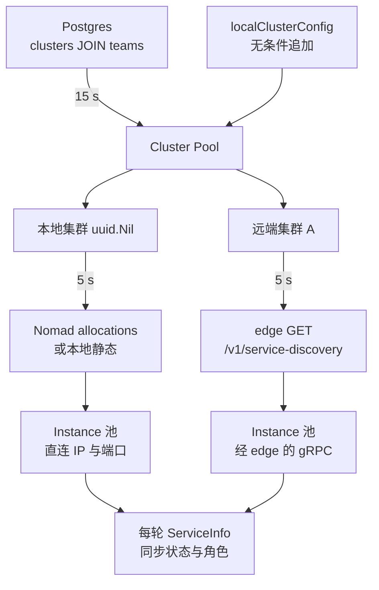

# 21 · 集群与服务发现

> api 要给沙箱选节点，前提是它知道有哪些节点、每个节点是死是活。当所有节点和 api 在同一个网络里时，
> 这只是一次 Nomad 查询；当一部分节点跑在客户自己的云上、api 根本连不到它们的私网地址时，
> 就需要一层「集群」抽象和一条经过 edge 的间接路径。本篇讲这层抽象的数据模型、两级同步循环、
> 三种发现来源，以及它们各自付出的代价。
>
> **读者**：所有读者。　**预备**：[第 15 篇 · API 服务的结构](15-api-service-structure.md#6-与-orchestrator-的连接管理)、
> [第 10 篇 · 系统架构](10-system-architecture.md#5-三类节点)。
> **代码**：`packages/api/internal/clusters/`、`packages/shared/pkg/clusters/discovery/nomad.go`、
> `packages/shared/pkg/http/edge/`、`packages/shared/pkg/synchronization/`、`packages/db/migrations/`

---

## 0. 本篇要回答的问题

1. 「集群」在 e2b 里是什么？它和「节点」「团队」是什么关系？
2. api 怎么知道某个集群里有哪些实例？三种发现来源分别在什么条件下生效？
3. 为什么 api 对本地集群直连 orchestrator，对远端集群却只能通过 edge 转一道？
4. 一个节点在代码里有三个不同的标识符，分别是什么，为什么不能合并成一个？
5. 一个实例重启之后，api 需要多久、经过哪些步骤才会重新连上它？
6. 这套设计的哪些部分不在上游仓库里，读代码读不到？

---

## 1. 从「一个网络」到「多个网络」

先看不加集群抽象时 api 的世界。它拿到一个 Nomad 客户端，列出 `Status == "ready" and NodePool == "default"`
的所有 Nomad 节点，对每个节点的地址加上 orchestrator 的 gRPC 端口，建一个连接，
定期调 `ServiceInfo` 拉状态。这段代码今天仍然在 `packages/api/internal/orchestrator/client.go` 的
`listNomadNodes()` 里，几乎没变。它成立的前提有三条：

1. api 有权限访问 Nomad 的 API；
2. api 能直接连到每个节点的私网地址与端口；
3. 所有节点属于同一个信任域，连接不需要额外鉴权。

三条前提在单一云账号、单一 VPC 的部署里都成立。但 e2b 要支持把数据面放到客户自己的云账号里
（沙箱跑在客户的机器上，控制面仍由 e2b 托管），三条就全部不成立：api 不该有客户 Nomad 的凭证，
api 到客户私网没有路由，跨账号的连接必须带凭证。

`clusters` 这一层就是为这个场景加的。它把「一组 orchestrator 节点 + 一组 edge 实例 + 一个入口地址 + 一把密钥」
打包成一个对象，让 api 用同一套接口访问本地节点和远端节点，代价是远端节点的每一次调用都要多经过一次 edge 转发。

需要先划清一个容易混的边界：**集群不是「节点的容器」，而是「访问节点的方式」**。
本篇讲的是「怎么找到实例、怎么连上它、怎么判断它还活着」；
找到之后「在哪些节点里选一个放沙箱」是
[第 19 篇 · 节点管理与放置](19-node-management-and-placement.md#3-放置算法采样过滤打分) 的题目。

---

## 2. 数据模型：集群是一行数据库记录

`clusters` 表由迁移 `packages/db/migrations/20250606213446_deployment_cluster.sql` 建立，
`20250714132924_cluster_sandbox_domain.sql` 追加了一列。对应的 Go 结构是 `packages/db/queries/models.go` 的
`Cluster`，一共五个字段：

| 列 | 含义 |
|---|---|
| `id` | 集群 UUID |
| `endpoint` | edge 的入口地址，形如 `host:port` |
| `endpoint_tls` | 入口是否走 TLS，决定 scheme 与 gRPC 的传输凭证 |
| `token` | 访问该集群 edge 的密钥 |
| `sandbox_proxy_domain` | 该集群的沙箱访问域名，可为空 |

同一批迁移还在别的表上挂了三个引用：`teams.cluster_id`（团队归属哪个集群）、
`envs.cluster_id`（模板归属哪个集群）、`env_builds.cluster_node_id`（这次构建落在哪个节点上）。
最后一列在 `20251121101953_build_node_id_nullable.sql` 里被改回可空。

**归属的粒度是团队。** 沙箱创建路径上没有「选集群」这一步：
`packages/api/internal/orchestrator/create_instance.go` 直接用
`clusters.WithClusterFallback(team.ClusterID)` 把团队的集群 ID 取出来，
再用它去 `GetClusterNodes()` 取候选节点。`WithClusterFallback()` 定义在
`packages/shared/pkg/clusters/cluster.go`，语义是「`nil` 视为本地集群」，
而本地集群的 ID 是 `packages/shared/pkg/consts/cluster.go` 里的 `LocalClusterID = uuid.Nil`。
于是绝大多数团队的 `cluster_id` 为空，落在本地集群，不需要为这层抽象付任何额外代价。

**哪些集群会被加载。** `packages/db/queries/get_active_clusters.sql` 的查询是

```sql
SELECT DISTINCT sqlc.embed(c)
FROM public.clusters c
JOIN public.teams t ON t.cluster_id = c.id;
```

也就是说，「active」的判据不是集群本身的某个状态列（表里也没有这样一列），
而是**至少有一个团队引用它**。一个建好但没有团队绑定的集群不会被 api 连接。
在这个结果集之外，`clusters_sync.go` 的 `localClusterConfig()` 无条件追加一条 ID 为 `uuid.Nil`、
不带 endpoint 的记录，所以本地集群永远存在于池中。

---

## 3. 两级同步循环

发现不是一次性的：集群会被增删，实例会重启。api 用同一个泛型工具跑两级轮询循环。

工具在 `packages/shared/pkg/synchronization/`。`Synchronize[SourceItem, PoolItem]` 要求使用者实现
一个 `Store` 接口（`SourceList`、`SourceExists`、`PoolList`、`PoolExists`、`PoolInsert`、`PoolUpdate`、`PoolRemove`），
每一轮 `sync()` 做两件事：

- `syncDiscovered()`：遍历来源列表，`PoolExists` 为假的插入池中；
- `syncOutdated()`：遍历池中条目，在来源里还找得到的调 `PoolUpdate`，找不到的调 `PoolRemove`。

两个阶段内部都是每条一个 goroutine 并发执行，然后 `wg.Wait()`。
每一轮有独立的超时上下文，`Start()` 的第四个参数决定是否先跑一次立即同步。

第一级是集群池，实现在 `clusters_sync.go` 的 `clustersSyncStore`，来源是数据库，
间隔 `clustersSyncInterval = 15 * time.Second`，超时 5 s。
`PoolInsert()` 按 ID 分岔：`LocalClusterID` 走 `newLocalCluster()`，其余走 `newRemoteCluster()`。
`PoolUpdate()` 是空实现 —— 集群记录的字段（endpoint、token、域名）在运行期被改动不会生效，
要让改动生效只能让这一行先从查询结果里消失、再出现，或者重启 api。**推论**：这是有意的简化，
代价是集群密钥轮换需要额外的操作步骤。

第二级是实例池，每个 `Cluster` 一个，实现在 `instances_sync.go` 的 `instancesSyncStore`，
来源是该集群的服务发现，间隔 `instancesSyncInterval = 5 * time.Second`，超时同样 5 s，
在 `newLocalCluster()` / `newRemoteCluster()` 里以 goroutine 启动。
这一级的 `PoolUpdate()` 不是空的：它调 `Instance.Sync()`，也就是对该实例发一次 `ServiceInfo` gRPC。
**健康判断就落在这里**：`instance.go` 里连续失败达到 `maxSyncFailuresBeforeUnhealthy = 3` 次，
实例状态被置为 `Unhealthy`；单次调用的超时是 `maxInstanceSyncCallTimeout = 1 * time.Second`。
注意实例不会因为不健康而被移出池 —— 移除只发生在服务发现不再返回它的时候；
不健康的实例留在池里，由使用方按 `GetInfo().Status` 过滤。



---

## 4. 三种发现来源

服务发现的接口只有一个方法，定义在 `packages/api/internal/clusters/discovery/discovery.go`：

```go
type Discovery interface {
	Query(ctx context.Context) ([]Item, error)
}
```

`Item` 的字段是非对称的，注释写得很直白：`InstanceID` 只有 edge 侧的发现能提供；
`LocalIPAddress` 与 `LocalInstanceApiPort` 只对本地集群有意义，远端集群用不到，因为连接是走 edge 代理的。

**来源一：本地静态。** `discovery/local.go` 的 `Query()` 第一步判断 `env.IsLocal()`。
成立时直接返回一条硬编码条目，主机名取环境变量 `TESTS_ORCH_INSTANCE_HOST`（默认 `localhost`），
端口取 `consts.OrchestratorAPIPort`（由 `ORCHESTRATOR_PORT` 决定，默认 5008），
`UniqueIdentifier` 与 `NodeID` 都是字符串 `local`。把这个环境变量设成空串则返回空列表，
等于关掉发现。这条路径是为本机开发与测试准备的。

**来源二：Nomad。** 非本地环境下，`local.go` 调用
`packages/shared/pkg/clusters/discovery/nomad.go` 的 `ListOrchestratorAndTemplateBuilderAllocations()`，
过滤器用 `FilterTemplateBuilders`：

```
ClientStatus == "running" and TaskGroup == "template-manager" and JobID contains "template-manager"
```

这里有一处容易读错的地方，代码里的注释说明了原因：**本地集群的服务发现目前只找 template builder**，
本地的 orchestrator 节点仍然沿用老路径，由 `orchestrator/client.go` 的 `listNomadNodes()` 直接查 Nomad 节点列表。
同一个文件里还定义了 `FilterTemplateBuildersAndOrchestrators`，是为将来统一两条路径准备的，当前未被 `local.go` 使用。
函数从 allocation 的 `AllocatedResources.Shared.Networks[0].IP` 取地址，
`NodeID` 取的是 `NodeName` 而不是 Nomad 的客户端 UUID —— 注释说这是为了让节点名与云主机名对得上。
没有分配资源或没有网络的 allocation 被跳过并记一条 warning。

**来源三：远端 edge。** `discovery/remote.go` 的 `Query()` 调 `V1ServiceDiscoveryWithResponse()`，
即 `GET /v1/service-discovery`，把返回的 `orchestrators` 数组映射成 `Item`：
`UniqueIdentifier` 与 `InstanceID` 都取 `serviceInstanceID`，`NodeID` 取 `nodeID`，
不带 IP 与端口。接口的形状定义在 `spec/openapi-edge.yml`，
客户端代码由 `packages/shared/pkg/http/edge/generate.go` 用 oapi-codegen 生成到同目录的 `generated.go`。
返回的 `ClusterOrchestratorNode` 除上述字段外还有版本、启动时间、状态与角色数组，
但 `remote.go` 一个都不取 —— 这些信息稍后由实例自己的 `ServiceInfo` 调用覆盖，
服务发现只负责回答「有哪些实例」。

| 维度 | 本地静态 | Nomad | 远端 edge |
|---|---|---|---|
| 生效条件 | `env.IsLocal()` | 本地集群、非 local | 远端集群 |
| 唯一标识 | 常量 `local` | allocation ID | service instance ID |
| 找什么 | 一个本机实例 | template builder | 该集群全部 orchestrator |
| 是否给出地址 | 是 | 是 | 否 |

---

## 5. 连接与鉴权

`Instance` 代表一个已连接的服务实例，`newInstance()` 在建立连接后**立即**做一次 `Sync()`，
失败就关掉连接并返回错误，因此池里不会出现状态未初始化的实例。
这也意味着一个刚启动、还没准备好回应 `ServiceInfo` 的实例，本轮不会被加入池，下一轮再试。

连接参数在 `instance_client.go` 的 `createClient()`。两条路径的差别只在两个参数上：

- **本地集群**：`cluster.go` 的 `newLocalCluster()` 传入 `fmt.Sprintf("%s:%d", item.LocalIPAddress, item.LocalInstanceApiPort)`，
  鉴权对象为 `nil`，TLS 为 false。即直连节点私网地址，不带凭证。
- **远端集群**：`newRemoteCluster()` 传入集群的 `endpoint`，鉴权对象是
  `instanceAuthorization{secret, tls, serviceInstanceID}`。它实现了 gRPC 的 `PerRPCCredentials`，
  每次调用带两个 metadata：`authorization`（`consts.EdgeRpcAuthHeader`）放集群密钥，
  `service-instance-id`（`consts.EdgeRpcServiceInstanceIDHeader`）告诉 edge 这次调用要转给哪一个实例。

也就是说，**远端集群的所有实例共用同一个 gRPC 目标地址，靠一个 metadata 头区分**。
这正是「api 不需要到客户私网的路由」的实现方式：edge 是唯一暴露的入口，
它既是鉴权点也是路由点。同一把密钥还以 `X-API-Key`（`consts.EdgeApiAuthHeader`）的形式
挂在 HTTP 客户端的请求编辑器上，用于服务发现和后面要讲的资源查询。

两条路径共享的部分：keepalive 每 30 s 一次 ping、5 s 超时、无活跃流也发；
otel 的 gRPC stats handler。TLS 情况下最低版本被显式钉在 1.2，
`instance_client.go` 的注释给出的理由是 AWS ALB 的 TLS 终结默认用 1.2。

---

## 6. 三个标识符

节点这个概念在代码里有三个不同的标识符，混用会读不懂 `orchestrator/cache.go`：

| 标识符 | 来源 | 生命周期 | 用途 |
|---|---|---|---|
| `NomadNodeShortID` | Nomad 客户端 UUID 的前 8 字符，`consts.NodeIDLength` | 与 Nomad 客户端同寿 | 老路径的节点匹配，已标记 Deprecated |
| `NodeID` | 本地路径取 orchestrator 自报的 `nodeInfo.GetNodeId()`；集群路径取服务发现给的 `NodeID`，即 Nomad 的 `NodeName` 或 edge 的 `nodeID` | 与机器同寿 | 池的键、放置结果、`env_builds.cluster_node_id` |
| `serviceInstanceID` | 服务进程启动时生成 | **进程重启即变** | 远端路由的目标、判断进程是否换过 |

`nodemanager/node.go` 用 `NomadNodeShortID` 是否等于常量 `UnknownNomadNodeShortID`（`"unknown"`）
来区分两类节点：`IsNomadManaged()` 为真的是老路径直连的本地节点，`Close()` 时要关自己的 gRPC 连接；
为假的是集群路径的节点，连接由 `clusters.Instance` 拥有，节点关闭时不能动它。

节点在 api 的全局表里以 `orchestrator/client.go` 的 `scopedNodeID()` 为键：
本地集群直接用 `NodeID`，其它集群用 `clusterID-NodeID`。
这样两个不同集群里的同名节点不会互相覆盖，而本地集群的键保持了向后兼容的形状。

`serviceInstanceID` 单独存在的理由在 `orchestrator/cache.go` 的 `syncClusterNode()` 里写得很清楚：
节点的 `NodeID` 不变而进程重启后，池里那个连接对应的已经是一个失去了全部内存状态的新进程。
它用 `cluster.GetByServiceInstanceID()` 检查「这个节点当前的实例 ID 是否还在集群实例池里」，
不在就返回错误，触发节点从 api 的节点表里注销。这条摘除路径属于节点池的同步循环，
完整过程见 [第 19 篇 §2.3](19-node-management-and-placement.md#23-同步循环)。

顺带能读出实例重启后的收敛过程。设某远端实例重启，`serviceInstanceID` 变了而 `NodeID` 没变：

1. 下一轮实例同步，`syncDiscovered()` 阶段 `PoolExists()` 按 `NodeID` 查，命中，不插入；
2. 同一轮 `syncOutdated()` 阶段 `SourceExists()` 按 `UniqueIdentifier`（即 `serviceInstanceID`）比对，不命中，`PoolRemove()`；
3. 再下一轮 `syncDiscovered()` 才把新实例插入。

**推论**：因此一次实例重启在实例池这一级的收敛需要两轮，约 10 s，
期间 `syncClusterNode()` 会把对应节点注销，直到实例回到池中再由 `syncClusterDiscoveredNodes()` 重新连上。
换来的是不必在 `PoolExists` 里做复合键匹配，两个阶段的判据可以各自简单。

---

## 7. 跨集群的两条数据通路

集群抽象最终服务于两类操作，走的是不同的通路。

**控制通路（gRPC）。** `Instance` 持有的 `GRPCClient`（`client.go`）打包了四个 stub：
`Info`、`Sandbox`、`Volumes`、`Template`。集群路径的节点由 `nodemanager.NewClusterNode()` 构造，
直接复用 `Instance` 的这个客户端，`IPAddress` 被显式置为空串并注明「无法直连集群内节点」。
创建沙箱、删除沙箱、构建模板因此都不需要知道自己在跟本地还是远端说话 ——
差别被吸收在连接的建立方式里。集群对象自身也直接用这条通路做两件事：
`GetAvailableTemplateBuilder()` 随机洗牌后挑一个健康的、角色含 `TemplateBuilder` 的实例（见
[第 23 篇 · API 侧的构建管理](23-template-manager-client.md)），
`CreateVolume()` / `DeleteVolume()` 随便挑一个 orchestrator 实例发请求。

**查询通路（HTTP）。** 指标与日志不走 gRPC。`resources.go` 定义了接口 `ClusterResource`，
四个方法覆盖沙箱指标、批量沙箱指标、沙箱日志、构建日志。两个实现的差别就是数据从哪来：

- `resources_local.go` 直接查 ClickHouse 与 Loki；
- `resources_remote.go` 调 edge 的 `/v1/sandboxes/{id}/metrics`、`/v1/sandboxes/{id}/logs`、
  `/v1/templates/builds/{buildID}/logs` 等端点，再把响应映射回 api 自己的模型。

构建日志的取数逻辑被抽到 `resources.go` 的 `getBuildLogsWithSources()`：
先尝试从构建所在的 builder 实例直接取「临时日志」，失败或不允许时再取持久化日志，
持久化的后端由调用方以闭包注入 —— 本地是 Loki，远端是 edge。
handler 侧的入口都是同一个形状：先 `GetClusterById(WithClusterFallback(team.ClusterID))`，
再 `cluster.GetResources()`，见 `handlers/sandbox_metrics.go`、`handlers/sandbox_logs.go`、
`handlers/template_build_logs.go`。

`SandboxProxyDomain` 是第三件事。`create_instance.go` 与 `handlers/sandbox_get.go` 在团队绑定了集群时
从集群对象取出这个域名，随沙箱信息返回给调用方，让 SDK 把流量发到该集群自己的 edge 而不是 e2b 的默认域名。

---

## 8. 这套设计读代码读不到的部分

有一个边界必须说明：**edge 一侧的服务端实现不在上游 2026.09 的仓库里**。
`spec/openapi-edge.yml` 存在，`packages/shared/pkg/http/edge/` 只生成客户端
（`cfg.yaml` 里 `generate` 仅有 `client` 与 `models`），
全仓库搜索 `V1ServiceDiscovery` 与 `service-instance-id` 只能搜到 api 侧的调用方与常量定义。
`packages/client-proxy/` 在这个版本里只有沙箱 HTTP 代理（`internal/proxy/`）与健康状态，
没有 edge API 的 handler，也没有按 `service-instance-id` 转发的 gRPC 代理。
因此本篇对 edge 行为的描述以接口契约（OpenAPI 规格与 metadata 约定）为准，不是对实现的描述；
edge 的端点清单见 [第 56 篇 §2](56-edge-api.md#2-端点清单)。

其余几处代价值得记下：

- `GetByServiceInstanceID()` 与 `getRandomInstance()` 都是对实例池的线性扫描。
  实例数在数十量级时无所谓，`syncClusterNode()` 每轮每节点调用一次则使总开销为 O(节点数 × 实例数)。
- 本地集群同时被两套发现管着：orchestrator 走老的 Nomad 节点列表，template builder 走新的 allocation 查询。
  代码注释明确说这是为了减小改动而暂留的状态。
- 集群记录在运行期不可更新（`PoolUpdate` 为空实现）。
- 实例的健康只由 `ServiceInfo` 的可达性与返回状态决定；服务发现返回了、但实例连不上，
  表现为反复的 `PoolInsert` 失败并记录错误日志，而不是一个持久的「不健康」条目。

---

## 9. ARM 适配版的差异

ARM 适配版把服务发现抽象成了 `packages/shared/pkg/clusters/discovery/interface.go` 里的
`ServiceDiscovery` 接口，Nomad 实现之外增加了 `k8s.go`：按 label selector（默认 `app=template-manager`）
和 `status.phase=Running` 列 Pod，用 Pod 的 `UID` 作 allocation ID、`spec.nodeName` 作节点 ID、
`status.podIP` 作地址。选哪一种由环境变量 `ORCHESTRATOR_TYPE` 决定（默认仍是 `nomad`），
命名空间由 `K8S_NAMESPACE` 决定。`clusters.NewPool()` 与 `newLocalCluster()` 因此多了一个
`kubernetes.Interface` 参数，`orchestrator/client.go` 的 `listNomadNodes()` 也改为委托给一个发现对象。
同一处补丁把 `maxInstanceSyncCallTimeout` 从 1 s 放宽到 120 s，方向是给响应较慢的实例更多余量。
但这个值实际生效不了 120 s：`Sync()` 的 context 派生自同步循环每轮的
`instancesSyncTimeout = 5 * time.Second`，派生 context 取较早的 deadline，
于是单次 `ServiceInfo` 最多仍只等 5 s，判定不健康的最坏时间从 3 s 变成 15 s 而非 6 分钟。
细节见 [第 77 篇 §7.2](77-api-and-flags-on-arm.md#72-maxinstancesynccalltimeout改了-120-倍实际生效-5-倍)、
[第 76 篇 · Kubernetes 服务发现](76-k8s-discovery.md#2-第一层shared-里的-servicediscovery)，
部署形态见 [第 78 篇 · 部署形态一：Helm / Kubernetes](78-helm-k8s-deployment.md)。

---

## 10. 小结

- 集群是「访问一组节点的方式」，不是节点的容器：一行数据库记录给出入口地址、密钥与沙箱域名。
- 归属粒度是团队；`cluster_id` 为空的团队落在 ID 为 `uuid.Nil` 的本地集群，不付额外代价。
- 「活跃集群」的判据是有团队引用它，表里没有状态列。
- 同步是两级轮询：集群池 15 s 对数据库，实例池 5 s 对服务发现；两级共用
  `synchronization.Synchronize` 的「发现即插入、消失即移除」骨架。
- 健康判断挂在实例池的 `PoolUpdate` 上：连续 3 次 `ServiceInfo` 失败标为不健康，但不移出池。
- 三种发现来源：本地静态（测试用）、Nomad allocation（本地集群，只找 template builder）、
  edge 的 `/v1/service-discovery`（远端集群）。
- 本地集群直连节点 IP 且不鉴权；远端集群所有实例共用 edge 的一个地址，
  靠 `service-instance-id` metadata 区分目标，靠集群密钥鉴权。
- 三个标识符各有生命周期：Nomad 短 ID 与 Nomad 客户端同寿，`NodeID` 与机器同寿，
  `serviceInstanceID` 与进程同寿；第三个是检测进程重启的唯一依据。
- 指标与日志不走 gRPC，走 `ClusterResource` 接口：本地查 ClickHouse 与 Loki，远端查 edge 的 HTTP 端点。
- edge 的服务端实现不在上游仓库中，本篇对 edge 的描述基于接口契约。

---

## 延伸阅读 / 下一篇

- 上下文：[第 19 篇 · 节点管理与放置](19-node-management-and-placement.md)（发现之后怎么选节点）、
  [第 20 篇 §5](20-sandbox-state-storage.md#5-与-sandbox-catalog-的关系)（沙箱到节点的映射存在哪）、
  [第 17 篇 §5](17-sandbox-create-api.md#5-放置与失败重试)（集群 ID 在创建路径上的位置）。
- edge 一侧：[第 56 篇 · edge API](56-edge-api.md#2-端点清单)（本篇的另一半）、
  [第 53 篇 · client-proxy（edge）](53-client-proxy-edge.md#4-从沙箱-id-到节点-ip)、
  [第 55 篇 · 沙箱目录与跨节点路由](55-sandbox-catalog-and-routing.md#3-写入者api在沙箱可达的那一刻)。
- 数据层：[第 58 篇 §2](58-postgres-schema-and-migrations.md#2-表与关系)（clusters 表在全局模式中的位置）。
- 构建侧对集群的使用：[第 23 篇 §2](23-template-manager-client.md#2-选一个-build-节点)、
  [第 22 篇 · 模板 API](22-template-api.md#4-一次构建请求的两段)。
- ARM 适配版：[第 76 篇 · Kubernetes 服务发现](76-k8s-discovery.md#5-选择逻辑与客户端注入)、
  [第 77 篇 §7](77-api-and-flags-on-arm.md#7-api-的超时http-服务端与实例同步)。
- 下一篇：[第 22 篇 · 模板 API](22-template-api.md)。
