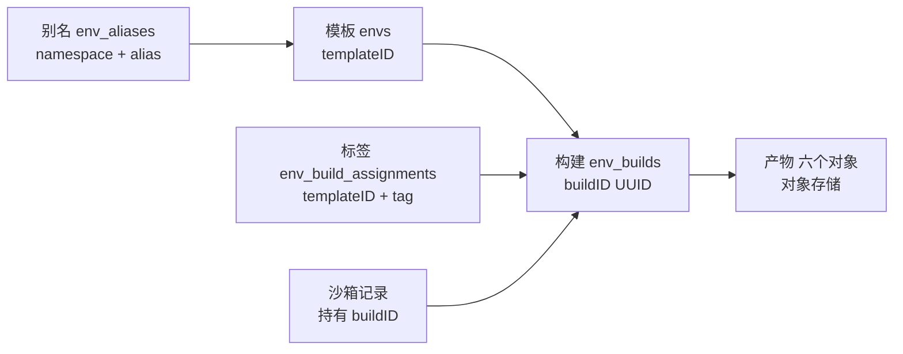
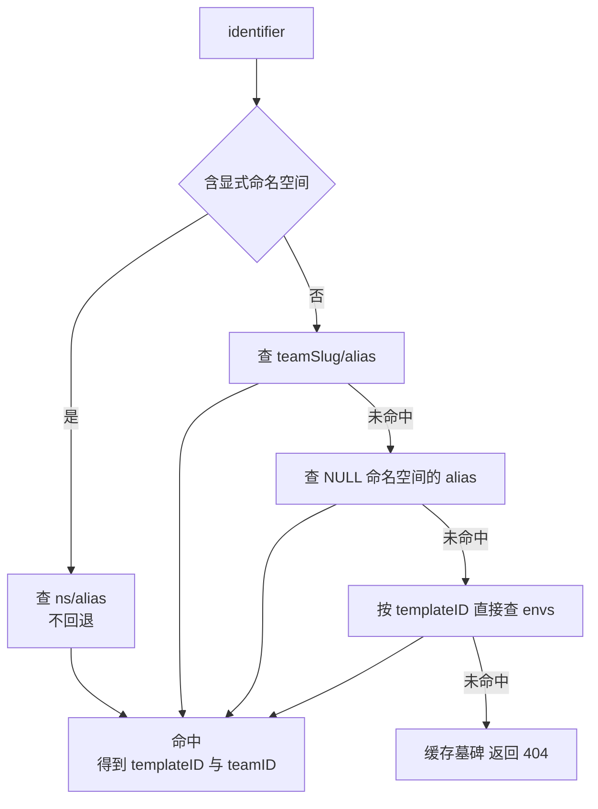
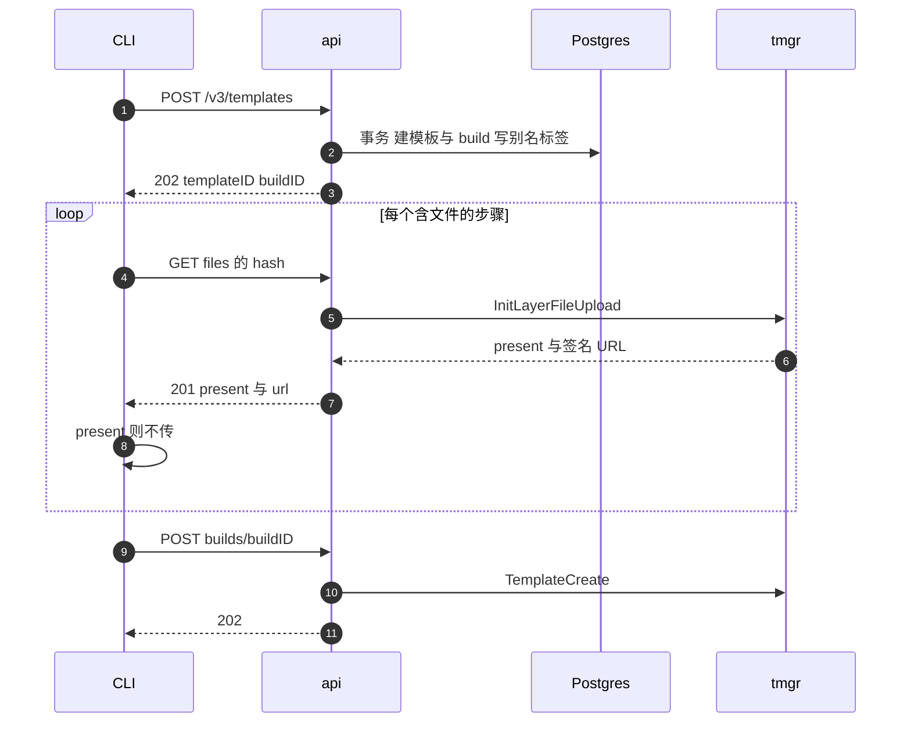

# 22 · 模板 API

> 「用 `my-template` 起一台沙箱」这句话背后有四个不同的对象：模板、构建、别名、标签。
> 本篇讲 API 服务如何定义它们之间的关系，一次构建请求为什么要拆成两个 HTTP 调用，
> COPY 用到的文件为什么按内容 hash 走单独的上传通道，以及删除模板时挡在前面的两道检查。
>
> **读者**：所有读者。 **预备**：[第 15 篇 · API 服务的结构](15-api-service-structure.md#2-契约先行从-openapi-到-serverinterface)、
> [第 16 篇 · 认证与多租户](16-auth-and-multitenancy.md#2-五种凭证)。
> **代码**：`spec/openapi.yml`（templates 路径）、`packages/api/internal/handlers/template_*.go`、
> `packages/api/internal/template/register_build.go`、`packages/api/internal/cache/templates/`、
> `packages/shared/pkg/id/id.go`

---

## 0. 本篇要回答的问题

1. 模板、构建、别名、标签各是什么？为什么需要四个概念而不是两个？
2. `acme/my-template:v1` 这个字符串是怎么被解析、又是怎么落到一个具体 build ID 上的？
3. 为什么触发一次构建要先 POST 一次「注册」再 POST 一次「启动」？中间这段时间客户端在做什么？
4. `GET /templates/{id}/files/{hash}` 为什么是 GET 却返回 201？它的缓存作用域是什么？
5. 删除一个模板时，API 拒绝的两种情况分别是什么？为什么删了数据库记录却不删对象存储里的产物？

---

## 1. 四个对象

先把概念摆清楚，后面所有接口的语义都是这四个对象上的操作。

| 对象 | 存在哪 | 标识 | 生命周期 |
|---|---|---|---|
| 模板 template | `envs` 表 | 20 字符随机串（`id.Generate()`） | 团队创建，显式删除 |
| 构建 build | `env_builds` 表 | UUID | 每次构建请求新建一条，不可变 |
| 别名 alias | `env_aliases` 表 | `(alias, namespace)` | 随构建请求申领，随模板删除而级联消失 |
| 标签 tag | `env_build_assignments` 表 | `(env_id, build_id, tag)` | 指向某一次构建，可被后来的行覆盖 |

模板是一个**容器**，本身几乎不携带内容：`envs` 里存的是团队归属、`public` 标志、集群归属、
统计计数。真正的产物属于构建 —— 一次构建就是一组文件（见[第 29 篇 §2](29-template-artifact-format.md#2-一代产物六个对象)），
由 build ID 唯一标识，构建成功以后不再改变。

别名是**模板**的人类可读名字，一个模板在一个命名空间下最多有一个别名（后面 §4 会看到这条约束是怎么维持的）。
标签是**构建**的人类可读名字：`env_build_assignments` 是模板、构建、标签的三元组表，
`packages/db/queries/templates/create_template_build_assignment.sql` 只做插入，不做更新。
把一个标签「移到」另一次构建上，做法是插入一条更新的行；解析时按 `created_at DESC` 取第一条
（`get_template_with_build_by_tag.sql` 的 `ORDER BY eba.created_at DESC LIMIT 1`）。
历史行留在表里，`GET /templates/{templateID}/tags` 返回的是每个标签当前生效的那一条。

这样切分的收益是：名字（别名 + 标签）与产物（构建）解耦，
`my-template:prod` 指向哪次构建可以随时改，运行中的沙箱不受影响，
因为沙箱在创建时就已经把 build ID 记进了自己的记录。代价是解析一个模板引用要走两跳：
先别名到模板，再模板加标签到构建，两跳各有各的缓存和失效路径。

没有别名的模板是合法的：只用 templateID 也能引用（§3 会看到解析器的 ID 回退）。
没有标签的构建则不会出现 —— 注册构建时若请求没给标签，`register_build.go` 会补上 `id.DefaultTag`，
也就是字符串 `default`。

---

## 2. 端点全景

`spec/openapi.yml` 里 templates 相关的路径分三组。第一组是模板本身：

| 路径与方法 | 语义 | 备注 |
|---|---|---|
| `POST /v3/templates` | 注册一次构建，返回 templateID + buildID | 当前版本 |
| `POST /v2/templates` | 同上，只接受 `alias` | 已废弃，内部转成 V3 |
| `POST /templates`、`POST /templates/{id}` | 老式「给一个 Dockerfile 就构建」 | 已废弃 |
| `GET /templates` | 列出团队的模板 | |
| `GET /templates/{id}` | 模板 + 分页的构建列表 | |
| `PATCH /v2/templates/{id}` | 改可见性，返回 names | |
| `DELETE /templates/{id}` | 删除模板 | |
| `GET /templates/aliases/{alias}` | 别名是否存在、归属哪个模板 | |

第二组是构建：`POST /v2/templates/{id}/builds/{buildID}` 启动构建，
`GET /templates/{id}/builds/{buildID}/status` 查状态与日志，
`GET /templates/{id}/builds/{buildID}/logs` 只查日志，
`GET /templates/{id}/files/{hash}` 申请文件上传链接。
第三组是标签：`POST /templates/tags`、`DELETE /templates/tags`、`GET /templates/{id}/tags`。

一个值得注意的口径：模板类接口的鉴权凭证不统一。
`POST /v3/templates` 接受 API key 或 supabase JWT，不接受 access token；
`DELETE /templates/{id}` 三者都接受；老的 `POST /templates` 只接受 access token。
这反映了历史上模板管理是「用户级」操作、后来才变成「团队级」操作。
凭证的种类与作用域见[第 16 篇 §2](16-auth-and-multitenancy.md#2-五种凭证)。

---

## 3. 名字怎么解析

客户端手里的字符串形如 `acme/my-template:v1`。`packages/shared/pkg/id/id.go` 的 `ParseName()`
把它拆成 identifier（`acme/my-template`）与 tag（`v1`）：先按 `:` 切出标签，再按 `/` 切出命名空间，
三段各自 `strings.ToLower` + `TrimSpace` 后过正则 —— 命名空间与别名是 `^[a-z0-9-_]+$`，
标签是 `^[a-z0-9-_.]+$`（多一个点，因为标签常写成 `v1.2`）。
`:default` 被归一成「没有标签」，于是 `my-template` 与 `my-template:default` 是同一个引用。

命名空间就是团队的 slug。所有接受名字的 handler 在解析后都会调
`id.ValidateNamespaceMatchesTeam()`：显式写出的命名空间必须等于调用方团队的 slug，
否则 400。也就是说，客户端不能用 `other-team/x` 这样的名字去引用别人的模板。

identifier 到 templateID 的解析在 `packages/api/internal/cache/templates/alias_cache.go` 的
`Resolve()`：

三点值得展开。

其一，**裸名字的两次查找**。先在本团队命名空间里找，找不到再找 `namespace IS NULL` 的那一批。
NULL 命名空间是「提升过的」公共模板：`PatchTemplatesTemplateID`（v1 的 PATCH）在把模板设为
public 时会调 `createBackwardCompatibleAlias()`，用 `UpsertTemplateAliasIfNotExists` 抢一个不带命名空间的别名。
这个全局名字是先到先得的，抢不到就返回 409，错误信息里直接告诉用户去用带命名空间的名字。
这条路径只在 v1 的 PATCH 上存在，v2 的 PATCH 不创建这种别名 —— 命名空间机制正是为了取消全局名字竞争而引入的，
向后兼容别名是留给老 CLI 的过渡通道。

其二，**ID 回退只对裸名字开放**。`fetchFromDB()` 里的注释写明了理由：
`team-x/<templateID>` 应当失败（命名空间下没有这个别名就是没有），
而裸的 `<templateID>` 在别名查找失败后应当能当作 ID 查到。

其三，**否定结果也进缓存**。`lookup()` 把「查不到」写成一个 `NotFound: true` 的墓碑对象存进 Redis，
TTL 与正常条目一样是 5 分钟。这挡住了「反复请求一个不存在的名字」把数据库打穿的路径，
代价是刚创建的别名可能在最多 5 分钟内仍被判为不存在。
所以每个会产生新别名的路径都显式清墓碑：`register_build.go` 在创建别名后调 `InvalidateAlias()`，
`requestTemplateBuild()` 在拿到响应后对返回的每个别名再清一次。

解析出 templateID 之后，第二跳在 `cache.go` 的 `Get()`：按 `{templateID}:tag` 取模板与构建，
然后做两项检查 —— 团队匹配或模板 public（否则 `ErrAccessDenied`），
集群匹配（否则 `ErrClusterMismatch`，集群概念见[第 21 篇 §2](21-clusters-and-discovery.md#2-数据模型集群是一行数据库记录)）。
缓存键把 templateID 包在花括号里，是 Redis Cluster 的 hash tag 语法：
同一模板的所有标签落在同一个槽上，`InvalidateAllTags()` 才能用一次前缀删除清干净。

底层 SQL 还有一条不在类型系统里的规则：`get_template_with_build_by_tag.sql` 的 JOIN 条件是
`eba.tag = COALESCE(tag,'default') OR eba.build_id = try_cast_uuid(tag)`。
标签位置上写一个 UUID，会被当作 build ID 直接匹配。这解释了为什么写入侧的
`ValidateAndDeduplicateTags()` 明确拒绝 UUID 形状的标签 ——
若允许，一个标签就能遮蔽一个 build ID 的引用（推论：代码里只写了「tag cannot be a UUID」，没有写理由）。
另外这条 JOIN 只匹配 `status_group = 'ready'` 的构建，所以一个正在构建中的标签解析不到，
沙箱创建会拿到 404 而不是一台起不来的沙箱。

缓存一共四个，都在 `packages/api/internal/cache/templates/`，都是 5 分钟 TTL、1 分钟刷新间隔的 Redis 缓存：

| 缓存 | 键 | 存什么 | 为什么单独一层 |
|---|---|---|---|
| `AliasCache` | `template:alias:<ns/alias>` 或 `template:alias:<templateID>` | templateID、teamID、墓碑标记 | 映射关系近乎不可变 |
| `TemplateMetadataCache` | `template:metadata:<templateID>` | public、clusterID | 可变，改可见性只需失效这一层 |
| `TemplateCache` | `template:info:{<templateID>}:<tag>` | 模板 + 构建 + 集群 | 随构建与标签变化 |
| `TemplatesBuildCache` | `template:build:<buildID>` | 一次构建的团队、模板、`status_group`、reason、版本、集群与节点 | 读侧按 build ID 取，与名字解析无关 |

前三个服务于「名字到构建」的解析，第四个服务于「已知 build ID 之后的状态查询」，见 §4。

---

## 4. 一次构建请求的两段

从 CLI 的角度，构建一个模板是三步：注册、传文件、启动；下图里 `tmgr` 指 template-manager。

**第一段：注册。** `PostV3Templates` 解析请求体后交给 `requestTemplateBuild()`
（`handlers/template_request_build_v3.go`）。请求体很小：`name`（可带 `:tag`）、`tags`、
`cpuCount`、`memoryMB`，此外是已废弃的 `alias` 与 `teamID`。
注意这里**没有** Dockerfile、没有步骤、没有 start 命令 —— 这一段只申领标识符与名字。

名字解析出的 tag 会被拼到 `tags` 数组的最前面，再过 `ValidateAndDeduplicateTags()` 去重。
接着用 `ResolveAliasWithMetadata()` 查这个名字是否已经存在：
存在且属于本团队，则复用它的 templateID（这就是「重新构建同一个模板」），并继承它的 `public`；
不存在、或存在但属于别的团队（例如通过 NULL 命名空间解析到的公共模板），
则 `id.Generate()` 生成一个新的 templateID，本团队在自己的命名空间里另起一个同名模板。

真正的写入在 `packages/api/internal/template/register_build.go` 的 `RegisterBuild()`，
一个事务里做五件事：

1. **并发构建限流。** `GetInProgressTemplateBuildsByTeam` 取本团队进行中的构建，
   排除掉当前模板自己（重建会取消旧的），与 `team.Limits.BuildConcurrency` 比较，超了返回 429。
   代码注释自己承认这不是严格的限流：两个并发请求可能都读到未超限的快照。
2. **建或更新模板。** `CreateOrUpdateTemplate` 是 upsert，顺带累加 `build_count`。
3. **作废未启动的旧构建。** `InvalidateUnstartedTemplateBuilds` 把同模板、同标签下还没启动的构建
   标为失败，原因写成「被更新的构建取代」。这处理的是「连按两次构建」：第一次注册完还没启动，
   第二次注册就把它作废，避免两个构建抢同一个标签。
4. **插入新构建**，状态 `waiting`（`env_builds` 有写入列 `status` 与触发器算出的读取列
   `status_group`，`waiting` 归入 `pending` 组，两列的分工见
   [第 23 篇 §4.1](23-template-manager-client.md#41-两套状态status-与-status_group)），
   资源规格由 `team.LimitResources()` 按团队档位夹逼，
   磁盘大小直接取团队上限，kernel 与 Firecracker 版本从 API 配置与特性开关取。
5. **申领别名并写标签。** 别名部分有三重检查：
   `CheckAliasConflictsWithTemplateID` 拒绝与任何模板 ID 同名的别名（409）；
   若该命名空间下还没有这个别名，先 `DeleteOtherTemplateAliases` 删掉本模板在别处的旧别名，
   再插入新的 —— 这就是「一个模板在一个命名空间下最多一个别名」的实现方式，代价是改名会静默地
   让旧名字失效；若别名已存在但指向另一个模板，返回 403。
   最后为每个标签插入一条 `env_build_assignments`。

事务提交后返回 202，body 里有 templateID、buildID、names、aliases、tags、public。
此时数据库里已经有一条 `waiting` 状态的构建，但没有任何东西在跑。

**第二段：启动。** `PostV2TemplatesTemplateIDBuildsBuildID`
（`handlers/template_start_build_v2.go`）带的才是构建的内容：
`fromImage` 或 `fromTemplate`、`fromImageRegistry`（三种凭证形态）、`steps`、
`startCmd`、`readyCmd`、`force`。handler 的顺序是：

- 用 `GetTemplateBuildWithTemplate` 同时取构建与模板，顺带做归属检查（不匹配 403）；
- 调 `CheckAndCancelConcurrentBuilds` 取消重叠构建（见[第 23 篇 §7](23-template-manager-client.md#7-取消的三种含义)）；
- 校验构建仍处于 `pending` 状态组，否则 400 —— 同一个 buildID 不能启动两次；
- 把 `fromImage`/`fromTemplate`/`steps` 序列化成 JSON，写进构建记录的 `dockerfile` 列。
  这一列的名字是历史遗留，v2 以后存的是步骤列表而不是 Dockerfile 文本；
- 从 User-Agent 推模板版本：SDK 版本低于 `2.3.0` 的用 `v2.0.0`，否则 `v2.1.0`
  （`userAgentToTemplateVersion()`）。这个版本号后面决定日志返回哪种格式，也传给 template-manager；
- 选一个构建节点，把节点 ID 与该节点的 CPU 架构、型号、flags 写进构建记录，
  然后调 template-manager 的 `CreateTemplate`，返回 202。

启动之后客户端按 buildID 轮询进度，而这条读路径不直接查库：
`handlers/template_build_status.go` 与 `template_build_logs.go` 都先从
`TemplatesBuildCache`（`cache/templates/template_build.go`，键 `template:build:<buildID>`）
取该构建的 `status_group`、reason、版本、集群与节点 ID，未命中才回落到
`GetTemplateBuildWithTemplate` 这条查询。写侧每次改状态后显式失效它
（`packages/api/internal/template-manager/template_status.go` 里的 `Invalidate()`），
否则一次构建的完成最多会晚 5 分钟才被客户端看到。轮询与状态写入的完整链路见
[第 23 篇 §4](23-template-manager-client.md#4-构建状态机)。

把注册与启动拆开的直接收益是：客户端拿到 templateID 之后才能算出文件上传路径，
而文件上传必须在步骤列表提交之前完成 —— 否则构建跑到 COPY 那一步会找不到文件。
代价是多一次往返，以及一个可能永远停在 `waiting` 的构建（客户端注册完就退出）。
后一种情况由下一次注册的 `InvalidateUnstartedTemplateBuilds` 清理。

还有一处后果不在模板 API 自己的代码里：**一条 pending 的构建记录同时是一段镜像写入窗口**。
老式构建流程要求客户端把本地 `docker build` 的产物推给 docker-reverse-proxy，
而那个代理的授权判据（`packages/docker-reverse-proxy/internal/auth/validate.go` 的 `Validate()`，
落到 `ExistsWaitingTemplateBuild` 这条查询）是「凭这个 access token 能到达的团队里，
该模板存在 `status_group = 'pending'` 的构建」。窗口从注册那一刻打开，
到构建被启动、转入 `in_progress`，或被 40 分钟死线判失败为止
（见[第 57 篇 §7](57-docker-reverse-proxy.md#7-与模板构建的衔接)、
[第 23 篇 §5.2](23-template-manager-client.md#52-三层超时)）。

---

## 5. 文件按 hash 上传

构建步骤里的 COPY 需要把客户端本地的文件送进构建沙箱。这些文件不走构建请求体，
而走一条独立通道：`GET /templates/{templateID}/files/{hash}`。
`hash` 是客户端对这批文件算出的内容哈希，同时也出现在 `TemplateStep.filesHash` 字段里。

`handlers/template_layer_files_upload.go` 的逻辑很短：查模板、校验团队归属、
选一个构建节点、调 template-manager 的 `InitLayerFileUpload`，返回 201 与
`{present, url}`。服务端（`packages/orchestrator/internal/template/server/upload_layer_files_template.go`）
把路径算成 `<cacheScope>/files/<hash>.tar`，签一个 30 分钟有效的上传 URL，
并检查该对象是否已存在，把结果放在 `present` 里。

两个细节决定了这条通道的性质。

第一，**cacheScope 是团队 ID**，不是模板 ID。API 侧的客户端
（`packages/api/internal/template-manager/upload_template_layer_files.go`）显式传
`CacheScope: teamID.String()`；服务端只有在这个字段为空时才回退到模板 ID。
于是同一团队所有模板共享一个内容寻址的文件池：同样的 `node_modules` tar 包在第二个模板里
`present` 为真，客户端直接跳过上传。代价是团队内的模板之间没有隔离边界 ——
知道 hash 就能读到另一个模板的构建文件（推论：`present` 只暴露存在性，
但签名 URL 是上传 URL，不是下载 URL，因此泄露面限于「这个 hash 是否被上传过」）。

第二，**上传不经过 API**。API 只发签名 URL，字节直接从客户端进对象存储。
这条通道的代价是 API 无法对上传内容做校验：签名 URL 指向的路径由 hash 决定，
但没有任何一处验证上传的内容确实哈希成这个值。构建期读回文件的一侧见
[第 44 篇 §4](44-build-sandbox-and-commands.md#4-六类指令的实现)，
hash 本身如何参与层缓存见[第 45 篇 §2](45-layers-and-build-cache.md#2-hash-怎么算)。

另外，这个端点用 GET 却返回 201 并产生副作用（签名 URL）。
从 HTTP 语义看这是不干净的，但它确实不改变服务端状态 —— 对象是否存在、内容是什么都没变。

---

## 6. 标签的读写与可见性

`POST /templates/tags` 的请求体是 `{target, tags}`，`target` 写成 `name:tag` 的形式。
handler（`handlers/template_tags.go` 的 `PostTemplatesTags`）先解析 target、
校验命名空间、解析别名，然后在事务里用 `GetTemplateWithBuildByTag` 找到 target 指向的**构建**，
再把 `tags` 里的每个标签插一条指向该构建的 assignment，返回 201 与 `{tags, buildID}`。
换句话说，打标签的语义是「把这些名字指向 target 当前指向的那次构建」，
它不触发任何构建，也不复制任何产物。

`DELETE /templates/tags` 的请求体是 `{name, tags}`，有两条额外规则：
`name` 里不允许再带 `:tag`（400，提示用 `tags` 字段），
`tags` 里不允许出现 `default`（400）。后者是一条保护：`default` 是解析时的兜底标签，
删掉它会让不带标签的引用直接失效。

可见性由 `PATCH /v2/templates/{templateID}` 改，请求体只有一个可选的 `public`。
`updateTemplate()`（`handlers/template_update.go`）在成功更新后调 `InvalidateAllTags()`，
它同时清掉该模板所有标签的条目和元数据缓存 —— 因为 `public` 同时出现在这两层里。
空 body 是合法的，按 OpenAPI 的定义走成一个 no-op。
`public` 的作用点在 `TemplateCache.Get()`：非属主团队只有在模板 public 时才能通过访问检查，
这就是「公共模板可以被任何团队用来起沙箱」的全部实现
（沙箱创建路径见[第 17 篇 §2](17-sandbox-create-api.md#2-请求体字段与它们的校验层)）。

---

## 7. 删除与它的两道保护

`DELETE /templates/{templateID}`（`handlers/template_delete.go`）在真正删之前挡两件事：

1. **有运行中的沙箱以它为基底。** 向 orchestrator 查本团队处于 running / pausing / snapshotting
   三种状态的沙箱，逐个比较 `BaseTemplateID`，命中就返回 400。
2. **有暂停的沙箱以它为基底。** `ExistsTemplateSnapshots` 查 `snapshots` 表里
   `base_env_id` 等于该模板的记录，有就返回 400。

这两道检查对应沙箱的两种存在形态：在跑的和暂停的。
暂停产生的快照本身也是一个模板加一次构建（`source = 'snapshot_template'`），
它的产物是相对基底模板的差分，因此基底一旦消失，快照就无法恢复
（差分链见[第 29 篇 §5](29-template-artifact-format.md#5-diff-链是怎么长出来的)，
暂停路径见[第 18 篇 §4](18-sandbox-lifecycle-api.md#4-pause-的完整链路)）。

第一道检查的口径值得注意：它只扫**本团队**的沙箱。公共模板被别的团队用来起沙箱时，
这些沙箱不在扫描范围内（推论：`GetSandboxes` 的参数是 `team.ID`，代码里没有跨团队的分支）。

通过检查后执行 `DeleteTemplate`，SQL 用一个 CTE 先把该模板的别名键抓出来、再删 `envs` 行，
让外键级联清掉 `env_build_assignments`、`env_aliases`、`snapshot_templates`，
返回抓到的别名键供缓存失效使用。这个 CTE 的写法是必要的：级联删除之后就查不到别名了，
而缓存键需要它们。

**对象存储里的产物不删。** 代码注释给出了理由：构建是分层的差分，
一次构建的文件可能被另一次构建的 header 映射引用，直接删会损坏别的构建；
清理留给未来的 GC 机制。代价是删除模板不回收任何存储空间，
存储占用只增不减，直到 GC 落地。

---

## 8. 小结

- 模板是容器，构建是不可变产物，别名给模板起名，标签给构建起名。
  引用一个模板要走「别名到模板、模板加标签到构建」两跳。
- 名字的语法是 `namespace/alias:tag`，命名空间必须等于调用方团队的 slug；
  `:default` 归一成无标签；标签解析支持直接写 build ID，因此标签本身禁止是 UUID。
- 别名解析对裸名字做两次查找：本团队命名空间，然后 NULL 命名空间（老式全局名字）。
  否定结果以墓碑形式缓存 5 分钟，所有创建别名的路径都必须显式清墓碑。
- 一次构建请求分两段：`POST /v3/templates` 在一个事务里申领 templateID、buildID、别名与标签；
  `POST /v2/templates/{id}/builds/{buildID}` 才提交步骤列表并交给 template-manager。
  中间那段时间留给客户端上传文件。
- 并发构建限流是「读后判断」的近似实现，不保证不超限；同模板同标签下未启动的旧构建会被新注册作废。
- COPY 的文件按内容 hash 上传到以团队 ID 为作用域的对象存储路径，
  `present` 为真时客户端跳过上传；字节不经过 API。
- 标签操作只移动指针，不触发构建；`default` 标签不允许删除。
- 删除模板被运行中沙箱与暂停快照两道检查挡住；数据库记录级联删除，
  对象存储里的产物保留，因为差分链可能被其它构建引用。

---

## 延伸阅读 / 下一篇

- 请求进入 handler 之前的中间件与路由生成：[第 15 篇 §3](15-api-service-structure.md#3-中间件链与错误模型)；
  凭证种类与团队档位：[第 16 篇 §6](16-auth-and-multitenancy.md#6-tier-与配额额度在哪几步被检查)。
- 本篇之后的构建管理（选构建节点、状态轮询、取消与删除）：
  [第 23 篇 · API 侧的构建管理](23-template-manager-client.md)。
- 构建本身怎么跑：[第 41 篇 §4](41-template-build-overview.md#4-主流程)、
  [第 44 篇 · 构建期沙箱与命令](44-build-sandbox-and-commands.md#2-冷启动一台构建期沙箱)、
  [第 45 篇 · 层与构建缓存](45-layers-and-build-cache.md#3-查找两跳索引是弱引用)、
  [第 46 篇 §2](46-template-manager-service.md#2-四个-rpc-的服务端语义)。
- 模板被用来起沙箱的一侧：[第 17 篇 §3](17-sandbox-create-api.md#3-从请求字段到-sandboxcreaterequest)；
  暂停如何产生一个新的模板与构建：[第 18 篇 §4](18-sandbox-lifecycle-api.md#4-pause-的完整链路)。
- 下一篇：[第 23 篇 · API 侧的构建管理](23-template-manager-client.md)。
