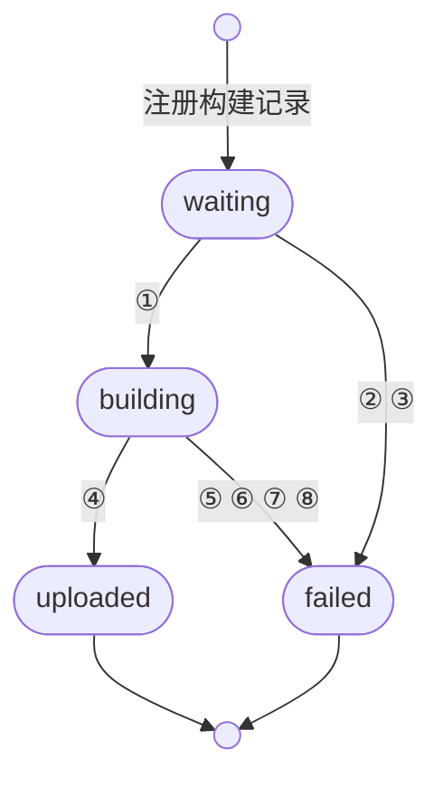
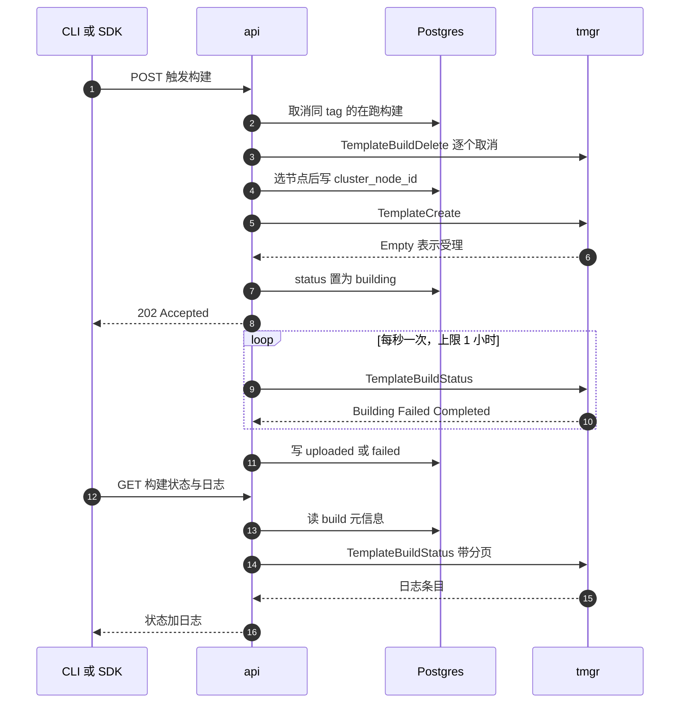

# 23 · API 侧的构建管理

> 一次模板构建要跑几分钟到几十分钟，而 HTTP 请求撑不了那么久。api 的做法是把构建推给某个
> build 节点，自己只保留一份状态记录，靠轮询把远端的进展搬回 Postgres。本篇讲这条链路：
> 节点怎么选、状态机长什么样、日志从哪来、取消到底取消了什么。
>
> **读者**：想弄清「构建请求发出去之后发生了什么」的工程师。
> **预备**：[第 22 篇 §4](22-template-api.md#4-一次构建请求的两段)（模板与 build 记录怎么创建）、
> [第 21 篇 §3](21-clusters-and-discovery.md#3-两级同步循环)（instance 从哪来）。
> **代码**：`packages/api/internal/template-manager/`、`packages/api/internal/clusters/cluster.go`、
> `packages/orchestrator/template-manager.proto`、`packages/db/queries/builds/`

---

## 0. 本篇要回答的问题

1. api 为什么不自己跑构建，而要把它推给一个 build 节点？这个节点是怎么选出来的？
2. 一次构建在 Postgres 里经历哪些状态？谁负责写这些状态，写错了会怎样？
3. api 怎么知道远端构建结束了？为什么是轮询而不是流式推送？
4. 构建日志放在哪里，为什么同一个 gRPC 方法既返回状态又返回日志？
5. 「取消一次构建」在这套系统里有三种不同的含义，分别取消掉了什么？

---

## 1. 为什么要把构建推出去

模板构建做的事在[第 41 篇 §4](41-template-build-overview.md#4-主流程)里展开：拉 OCI 镜像、
解包成 ext4、冷启动一台沙箱、在里面执行步骤、最后 pause 成快照。这条流水线要求执行者具备
两样 api 不具备的东西：本地磁盘上有几十 GiB 的可写空间，以及一台能起 Firecracker 的宿主机。
api 是一个无状态的 HTTP 服务，可以有多个副本，副本之间不共享磁盘，也不假设自己跑在能开 KVM
的机器上。所以构建只能发生在别处。

「别处」就是运行 template-manager 的节点。template-manager 与 orchestrator 同一个二进制、
同一个进程，只是多注册了一个角色（[第 46 篇 §1](46-template-manager-service.md#1-一个二进制两个角色)）。
一个节点是不是 build 节点，由它在 `ServiceInfo` 里上报的角色列表决定：
`packages/api/internal/clusters/instance.go` 的 `Sync()` 把 `info.GetServiceRoles()` 里
是否含 `ServiceInfoRole_TemplateBuilder` 缓存成 `isBuilder` 字段。

这个划分带来的第一个后果是：**api 手里没有构建的任何真相**。构建的进度、日志、成败，
全在远端进程的内存里。api 能做的只有两件事——记账和转发。记账落在 Postgres 的
`env_builds` 表，转发落在 template-manager 的四个 gRPC 方法上。整个
`packages/api/internal/template-manager/` 包，一千行出头，做的就是把这两件事对齐。

四个 gRPC 方法定义在 `packages/orchestrator/template-manager.proto` 的 `TemplateService`：

| 方法 | 请求 | api 侧调用点 |
|---|---|---|
| `TemplateCreate` | `TemplateCreateRequest` | `create_template.go` 的 `CreateTemplate()` |
| `TemplateBuildStatus` | `TemplateStatusRequest` | `template_manager.go` 的 `GetStatus()`、`clusters/resources.go` 的 `logsFromBuilderInstance()` |
| `TemplateBuildDelete` | `TemplateBuildDeleteRequest` | `template_manager.go` 的 `DeleteBuild()` |
| `InitLayerFileUpload` | `InitLayerFileUploadRequest` | `upload_template_layer_files.go` 的 `InitLayerFileUpload()` |

注意 `TemplateCreate` 返回的是 `google.protobuf.Empty`：它只是「受理」，不是「完成」。
这一个设计决定了后面所有的轮询逻辑。

---

## 2. 选一个 build 节点

### 2.1 候选集与筛选条件

选节点的入口是 `template_manager.go` 的 `GetAvailableBuildClient()`，实际的挑选在
`clusters/cluster.go` 的 `GetAvailableTemplateBuilder()`。它把某个 cluster 当前已知的全部
instance 取出来，用 `rand.Shuffle` 打乱顺序（`getRandomInstance()`），然后返回第一个同时满足
三个条件的：

1. `info.Status == ServiceInfoStatus_Healthy`；
2. `info.IsBuilder` 为真；
3. 机器画像兼容——若调用方给出了期望的 `machineinfo.MachineInfo` 且其 `CPUModel` 非空，
   则要求 `expectedInfo.IsCompatibleWith(machineInfo)`。

第三条的判据在 `packages/shared/pkg/machineinfo/machine_info.go`：`IsCompatibleWith()`
比较 CPU 架构、family、model 三项全等，不比较 model name 与 flags。期望值不是来自请求，
而是来自特性开关 `preferred-build-node`（`feature-flags/flags.go` 的 `BuildNodeInfo`，
一个 JSON flag），经 `machineinfo.FromLDValue()` 反序列化而来。默认值是 JSON `null`，
反序列化后是零值，`CPUModel` 为空，于是第三条被跳过——**默认情况下任何健康的 builder 都可以**。

这个开关存在的理由，是构建产物与执行它的 CPU 有隐性耦合：快照里冻结的是一台运行中的 microVM，
恢复它的宿主如果 CPU 特性集更窄，guest 里已经跑起来的代码可能用到不存在的指令。
把构建限定在某一类机器上，等于人工缩小这个风险面。代价是候选集变小、排队变长，
所以 `GetAvailableBuildClient()` 在拿到 `ErrAvailableTemplateBuilderNotFound` 时会退一步：
记一条 warn 日志，然后用空的 `MachineInfo{}` 再选一次，即放弃机型约束选任意健康 builder。
换句话说，这条约束是**尽力而为**，不是硬隔离；宁可构建在一台不完全匹配的机器上，
也不让请求直接失败。

### 2.2 选中之后：把 node ID 写进 build 记录

选节点发生在 handler 里而不是在 `CreateTemplate()` 里。
`handlers/template_start_build_v2.go` 的 `PostV2TemplatesTemplateIDBuildsBuildID()` 先调
`GetAvailableBuildClient()` 拿到 instance，再用 `UpdateTemplateBuild` 把
`cluster_node_id` 连同这台机器的 `cpu_architecture`、`cpu_family`、`cpu_model`、
`cpu_model_name`、`cpu_flags` 一起写进 `env_builds`，最后才调用 `CreateTemplate()`。

顺序不能反。`cluster_node_id` 是后续所有远端调用的寻址依据：查状态、拉日志、取消，
都要靠它找回那台机器（`GetClusterBuildClient()` → `cluster.GetTemplateBuilderByNodeID()`）。
如果先发 `TemplateCreate` 再写库，中间崩一次，构建就成了孤儿——它在某台机器上跑着，
但没有任何一条记录知道它在哪。把机器画像一并落库，则是为了事后能解释「这个 build 为什么
在那台机器上恢复不了」。

有一处例外值得注意：`handlers/template_layer_files_upload.go` 处理
`GET /templates/{id}/files/{hash}` 时，也调 `GetAvailableBuildClient()`，
但这次选出的节点与真正执行构建的节点无关——它只是借任意一个 builder 去问对象存储里
这个 hash 的层文件在不在、要不要上传（`InitLayerFileUpload`）。这能成立的前提是层缓存以
`cacheScope`（团队 ID）为界存在共享的对象存储里，任何 builder 问出来的答案都一样
（[第 45 篇 §5](45-layers-and-build-cache.md#5-两个桶一个-scope)）。

---

## 3. 触发一次构建

`CreateTemplate()` 的主体是一次结构体翻译：把 API 层的字段填进 `TemplateConfig`。
资源规格（`VCpuCount`、`MemoryMB`、`DiskSizeMB`）、内核与 Firecracker 版本、
start / ready 命令、步骤列表、镜像仓库凭证，逐项拷贝。有三个字段不是简单拷贝：

**`HugePages`** 由 `sandbox.NewVersionInfo(firecrackerVersion)` 的
`HasHugePages()` 推出来，即由 Firecracker 版本号决定，不由调用方指定。

**`Source`** 是 proto 里的一个 `oneof`，由 `setTemplateSource()` 填。它要求
`fromImage` 与 `fromTemplate` 恰好给一个。走 `fromTemplate` 时要多做两步：先用
`templateCache.ResolveAliasWithMetadata()` 把别名解析成模板 ID 并检查可见性——
不是 public 且不属于本团队就拒绝；再用 `GetTemplateWithBuildByTag` 查出基础模板在该 tag 上的
build ID，塞进 `FromTemplateConfig`。也就是说，**「基于模板构建」在 api 侧就被解析成了
一个具体的 build ID**，template-manager 拿到的不是别名。

**`Version`** 不来自请求体，来自 User-Agent。
`template_start_build_v2.go` 的 `userAgentToTemplateVersion()` 按 `e2b-js-sdk/`、
`e2b-python-sdk/` 前缀取出 SDK 版本号，低于 `SDKTemplateReleaseVersion` 的用
`TemplateV2BetaVersion`，否则用 `TemplateV2LatestVersion`。这是一种服务端兼容策略：
老 SDK 解析不了新版本的构建语义，于是服务端替它降级。代价是 User-Agent 从一个诊断字段
变成了一个行为字段，被代理改写就会改变构建行为。

### 3.1 失败一律落成 failed

`CreateTemplate()` 开头就注册了一个 `defer`：只要函数返回非空 error，就调用
`SetStatus(ctx, buildID, BuildStatusGroupFailed, ...)`，把错误文本写成 `reason.message`。
这条兜底覆盖了拿不到 client、翻译失败、gRPC 调用失败等所有分支。

基础模板解析失败被特殊对待：`setTemplateSource()` 用 `FromTemplateError` 包装这类错误，
`CreateTemplate()` 识别到它以后，写一条 `Step: "base"` 的失败状态，然后 **返回 nil**。
用意是让「基础模板不存在」表现得和构建期第一步失败一样——用户在构建日志里看到一条 base
步骤的错误，而不是收到一个 HTTP 500。

### 3.2 先发请求，后置 in_progress

`TemplateCreate` 返回之后，`CreateTemplate()` 才把状态置为
`BuildStatusGroupInProgress`。代码里的注释说明了原因：状态一旦变成 in_progress，
状态同步任务就会去远端查这个 build；如果状态先于请求写下，同步任务可能在
template-manager 建立起 build 记录之前就发起查询，查不到就会把构建判成失败。

这是一个典型的**用时序换正确性**的取舍：代价是 `TemplateCreate` 已经受理、
而状态更新还没落库的这个窗口里，进程崩溃会留下一条永远停在 pending 的记录。
第 5 节的 40 分钟死线就是为收拾这种残局准备的。

紧接着，`CreateTemplate()` 起一个 goroutine 立刻跑一次 `BuildStatusSync()`，
不等周期任务的下一个 tick。goroutine 用 `context.WithoutCancel(ctx)` 脱离 HTTP 请求的
生命周期，否则 handler 一返回，轮询就被取消了。

---

## 4. 构建状态机

### 4.1 两套状态：status 与 status_group

`env_builds` 表里有两列状态。`status` 是写入列，取值见
`packages/db/pkg/types/types.go` 的 `BuildStatus`：`pending`、`waiting`、`building`、
`snapshotting`、`uploaded`、`success`、`failed`。`status_group` 是读取列，由
`packages/db/migrations/20260210120002_add_status_group_column.sql` 里的触发器
`compute_status_group()` 在每次 INSERT / UPDATE 时算出来，四取一：

| status_group | 由哪些 status 映射而来 |
|---|---|
| `pending` | `pending`、`waiting` |
| `in_progress` | `in_progress`、`building`、`snapshotting` |
| `ready` | `ready`、`uploaded`、`success` |
| `failed` | 其它全部 |

触发器里的 `in_progress` 与 `ready` 不在 Go 的 `BuildStatus` 常量里，是数据库中残留的历史取值。
分成两列的动机正是历史值收敛：同一个含义在不同时期被写成过不同的字符串
（`uploaded` 与 `success`、`pending` 与 `waiting`），读侧不该关心这些差别。
代码注释里对 `BuildStatusGroup` 的说法是「所有读侧比较都用它」，实际也确实如此——
`GetInProgressTemplateBuilds`、`GetConcurrentTemplateBuilds` 等查询一律按 `status_group` 过滤。
写侧仍在写旧值，`template/register_build.go` 与 `SetFinished()` 里各有一条
`TODO(ENG-3469)` 说明要等所有消费方迁移完才切换。

api 侧只用两个写入口：`SetStatus()` 把 group 经 `buildStatus()` 映射回一个默认的
`status` 值（`pending`→`pending`、`in_progress`→`building`、`ready`→`uploaded`、
其余→`failed`）后写库；`SetFinished()` 直接写 `uploaded` 并附上 `total_disk_size_mb`
与 `envd_version`。两者都在写库之后调用 `buildCache.Invalidate()`，因为读路径走的是
Redis 缓存（`cache/templates/template_build.go`，TTL 5 分钟）。



| 编号 | 触发 | 落到的状态 |
|---|---|---|
| ① | `CreateTemplate` 受理成功 | `building` |
| ② | 同 tag 的新构建注册 | `failed` |
| ③ | 在 `waiting` 停留超过 40 分钟 | `failed` |
| ④ | 远端上报 `Completed` | `uploaded` |
| ⑤ | `TemplateCreate` 调用出错 | `failed` |
| ⑥ | 远端上报 `Failed` | `failed` |
| ⑦ | 轮询超过 1 小时 | `failed` |
| ⑧ | 被并发构建取消 | `failed` |

图里只画了 api 会写入的取值。`snapshotting` 与 `success` 由暂停沙箱的路径写入
（[第 18 篇 §4](18-sandbox-lifecycle-api.md#4-pause-的完整链路)），不属于模板构建。

### 4.2 两处会误伤的写法

`UpdateEnvBuildStatus` 这条 SQL 是全列覆盖式的：

```sql
UPDATE "public"."env_builds"
SET status = @status, finished_at = @finished_at,
    reason = sqlc.narg(reason), version = @version
WHERE id = @build_id;
```

而 `SetStatus()` 构造参数时既没有传 `Version`，也总是把 `FinishedAt` 设成当前时间。
于是有两个副作用。其一，`finished_at` 在构建**开始**时就被写上了一个时间，只有
`SetFinished()` 走的 `FinishTemplateBuild` 用 `NOW()` 覆盖它——用 `finished_at`
减 `created_at` 算构建耗时，对失败的构建才有意义。其二，`version` 列会被置为 NULL，
而它在 `register_build.go` 里刚被写入过。读侧 `handlers/template_build_status.go` 用
`DerefOrDefault(buildInfo.Version, templates.TemplateV1Version)` 兜底，NULL 会被当成 v1，
从而给已经是 v2 的构建也返回一份 legacy 格式的日志。推论：这不是有意设计，
而是 sqlc 生成的全列 UPDATE 与调用方只关心部分列之间的错配；后果是多返回一份冗余日志，
不影响构建本身。

---

## 5. 轮询：把远端状态搬回来

### 5.1 两个触发源

同步逻辑只有一个入口 `template_status.go` 的 `BuildStatusSync()`，两处触发：

- `create_template.go` 在受理成功后立刻起一个 goroutine 调它；
- `template_manager.go` 的 `BuildsStatusPeriodicalSync()` 每 60 秒
  （`syncInterval`）用 `GetInProgressTemplateBuilds` 查出全部 `status_group` 为
  `pending` 或 `in_progress` 且 `source = 'template'` 的 build，每条起一个 goroutine 调它。
  这个循环在 `handlers/store.go` 的 `NewAPIStore()` 里被 `go` 起来。

第二个触发源是兜底：api 进程重启、goroutine 被 panic 带走、`CreateTemplate` 之后立刻崩溃，
都靠它把构建重新纳入监控。`source = 'template'` 的条件把暂停沙箱产生的 build 排除在外——
那些 build 没有 template-manager 在跑，轮询它们只会得到错误。

`BuildStatusSync()` 进门先做去重：`createInProcessingQueue()` 在 `tm.processing`
这个 map 里占位，已存在就直接返回。这把同一进程内的重复轮询挡住了，但**跨 api 实例挡不住**：
map 在进程内存里，两个副本会各自轮询同一个 build，各自写同样的状态。推论：这是可接受的，
因为写入是幂等的覆盖，唯一的成本是重复的 gRPC 调用。

### 5.2 三层超时

| 超时 | 值 | 位置 | 触发后 |
|---|---|---|---|
| pending 死线 | 40 分钟 | `syncWaitingStateDeadline` | 状态置 failed，reason 为 build is in waiting state for too long |
| 单次构建 | 1 小时 | `buildTimeout` | 轮询 ctx 到期，状态置 failed，reason 里带上最大构建时长 |
| 单次状态查询重试 | 10 次，100 ms 起，上限 1 s | `checkBuildStatus()` 的 retrier | 重试耗尽则整个轮询终止并置 failed |

第一层针对的是「注册了 build 却迟迟不触发」——v1 的构建流程要求客户端先在本地
docker build 再推镜像，这段时间可能很长，所以给了 40 分钟而不是几分钟。
超过就判失败，理由是这条记录已经在占用同 tag 的并发名额。

第二层是硬上限：`BuildStatusSync()` 用 `context.WithTimeout(ctx, buildTimeout)`
包住整个轮询循环。注意它限制的是 **api 观察构建的时长**，不是构建本身；
超时后 api 把记录判成 failed，但远端那次构建仍在跑，最终产物会被上传，只是没人认领它。

第三层区分可重试与不可重试。`PollBuildStatus.setStatus()` 里：只有
`context.DeadlineExceeded` 才返回可重试的错误，其它一律包成 `terminalError`
（内部用 `retry.Stop()` 让 retrier 立刻放弃）。这个判据把「网络慢」和
「这个 build 在远端不存在」分开了：后者重试一百次也是同样的答案，早失败比晚失败好。

### 5.3 循环本身

`PollBuildStatus.poll()` 是一个 1 秒 tick 的循环。每个 tick 调
`checkBuildStatus()` → `GetStatus()` → 远端的 `TemplateBuildStatus`，
再由 `dispatchBasedOnStatus()` 按三个枚举值分派：

- `TemplateBuildState_Failed`：调 `SetStatus(failed, status.GetReason())` 并结束循环。
  失败原因就这样从远端的 `TemplateBuildStatusReason`（message + 可选的 step）
  搬进 `env_builds.reason` 这个 JSONB 列。
- `TemplateBuildState_Completed`：从 `metadata` 取 `rootfsSizeKey` 与 `envdVersionKey`，
  调 `SetFinished()`。metadata 为空视为错误。
- `TemplateBuildState_Building`：什么也不做，等下一个 tick。

1 秒的固定间隔意味着一个构建期间会产生几百到几千次 gRPC 调用，每次都要求远端遍历一遍
日志缓冲（见下一节）。代价换来的是状态延迟上界 1 秒——CLI 那边正在按秒轮询 api，
如果 api 这边的间隔更长，用户看到的完成时间会明显滞后于实际完成时间。

为什么不用 gRPC 流？proto 里 `TemplateBuildStatus` 是一元调用，注释却还写着
「streams the status of a template build」，说明它曾经是流式的。推论：改成一元的动因
是多 api 实例——流要求连接在整个构建期间存活并绑定在某个副本上，一元调用则允许任何副本
在任何时刻接手同一个 build，这正好是 `BuildsStatusPeriodicalSync()` 依赖的性质。

---

## 6. 日志

日志和状态共用 `TemplateBuildStatus` 一个方法：`TemplateBuildStatusResponse` 里
既有 `status`、`reason`、`metadata`，也有 `logEntries`。请求侧的
`TemplateStatusRequest` 带着 `offset`、`limit`、`level`、`start`、`end`、`direction`
六个分页与过滤参数。轮询路径不传这些（`GetStatus()` 只填 build ID 与模板 ID），
日志路径才用（`clusters/resources.go` 的 `logsFromBuilderInstance()`）。

远端的实现在 `packages/orchestrator/internal/template/server/template_status.go`：
构建日志攒在 `buildCache` 里的一个内存结构中，每次请求按时间排序、按 level 与时间窗过滤、
跳过 `offset` 条、最多返回 `maxLogEntriesPerRequest`（100）条。这是**无游标的偏移量分页**，
客户端靠自增 offset 往前走。代价是日志缓冲随构建增长而增长，而且每次请求都要重新扫一遍；
收益是不需要在 template-manager 里维护任何客户端状态。

api 侧的日志入口是 `handlers/template_build_status.go` 的
`GetTemplatesTemplateIDBuildsBuildIDStatus()`。它的取数顺序是：

1. 从 Redis 缓存（`templateBuildsCache`）取 build 元信息，含 `BuildStatus`、`Reason`、
   `NodeID`、`ClusterID`、`Version`；
2. `status_group` 还是 pending 就直接返回 `waiting` 加一份空日志，不去打扰远端；
3. 否则调 `cluster.GetResources().GetBuildLogs()`。

`GetBuildLogs()` 的实现（`clusters/resources.go` 的 `getBuildLogsWithSources()`）
按顺序尝试两个来源：build 节点内存里的**临时日志**（要求 `nodeID` 非空且该 instance
还在 pool 里），以及后端存储里的**持久日志**（本地 cluster 走 Loki，远端 cluster 走 edge API）。
第一个成功返回的来源胜出，前一个失败只记一条 warn。这个顺序符合直觉：构建进行中时
内存里的日志最新；构建结束、节点重启或 instance 掉出 pool 之后，只剩持久日志。
持久日志的时间窗由 `LogQueryWindow()` 限制在 7 天内（`logsOldestLimit`）。

还有两处细节。其一，`limit` 在 api 侧也被夹到 100（`maxLogEntriesPerRequest`），
与远端的上限一致。其二，失败构建的响应里，若 `reason.step` 非空，api 会把这一步骤中
level 不低于 warn 的日志条目摘出来放进 `reason.logEntries`（`filterStepLogs()`），
省得客户端为了显示错误上下文再翻一遍全量日志。

---

## 7. 取消的三种含义

「取消一次构建」在这套代码里落在三个不同的层面，作用范围与后果都不一样。

**其一，注册期作废同 tag 的未启动构建。** `template/register_build.go` 在创建新 build
记录的同一个事务里调 `InvalidateUnstartedTemplateBuilds`，把该模板下 tag 与新构建重叠、
且 `status_group` 为 `pending` 的旧 build 全部置成 failed，reason 写
「superseded by a newer one」。这一步纯粹是数据库操作，不涉及任何远端调用——那些 build
本来就还没被推给任何节点。

**其二，启动期取消同 tag 的在跑构建。** `handlers/deprecated_template_start_build.go` 的
`CheckAndCancelConcurrentBuilds()` 用 `GetConcurrentTemplateBuilds` 查出同模板、
`status_group` 为 pending 或 in_progress、且**至少共享一个 tag** 的其它 build，
过滤出其中 in_progress 的，对每一条调 `DeleteBuild()`。tag 交集这个条件写在 SQL 里：

```sql
AND eba.tag IN (
    SELECT tag FROM env_build_assignments
    WHERE build_id = @current_build_id AND env_id = @template_id
)
```

范围的选择是有讲究的：同一个模板可以有多个 tag（`latest`、`v2`、某个 git sha），
针对不同 tag 的构建互不冲突，可以并行；只有目标 tag 重叠时，后来者才会覆盖先来者的结果，
让先来者继续跑就是纯粹的浪费。所以取消的粒度是「模板 × tag」，不是「模板」。
`cluster_node_id` 为空的记录被跳过——没有节点信息就无从取消。

**其三，管理员取消一个团队的全部构建。** `handlers/admin_cancel_team_builds.go` 的
`PostAdminTeamsTeamIDBuildsCancel()` 用 `GetCancellableTemplateBuildsByTeam` 查出该团队
所有 pending 与 in_progress 的模板构建，用一个并发度 10 的 `errgroup` 逐个处理：
有 `cluster_node_id` 的先调 `DeleteBuild()`，然后统一 `SetStatus(failed, "cancelled by admin")`。
它不看 tag，范围是整个团队，用途是止损。

### 7.1 DeleteBuild 到底做了什么

三种取消里有两种落到 `DeleteBuild()`，而它发出的是 `TemplateBuildDelete`。
看远端实现（`internal/template/server/delete_template.go`）：先从 build cache 里查这个
build，如果还在跑就 `SetFail(ErrCanceled)`，然后调 `template.Delete()` 删除该 build
在镜像仓库与对象存储里的产物。也就是说，**这一个 RPC 同时是「取消」和「删产物」**，
没有单独的取消接口。对一个在跑的构建，效果是 build 循环在下一个检查点看到失败标记后退出；
对一个已完成的构建，效果是产物被删。

`DeleteBuild()` 里还有一段回退逻辑：`GetClusterBuildClient()` 拿不到 client 时
（因为 `nodeID` 可能是一个 orchestrator 的 ID——暂停沙箱产生的 build 记的是执行 pause 的
那台机器），改用 `GetAvailableBuildClient()` 选任意一个 builder 去执行删除。
代码注释指出了这个回退的不完整之处：这样能删掉对象存储里的产物，但删不掉原节点缓存里的副本。

最后，删除**模板**并不删除产物。`handlers/template_delete.go` 只从数据库里删记录，
注释解释了原因：build 是分层的 diff，别的 build 的 header 映射可能引用到它，
盲目删除会破坏那些 build（[第 29 篇 §5](29-template-artifact-format.md#5-diff-链是怎么长出来的)）。
清理留给未来的 GC。`GetExclusiveBuildsForTemplateDeletion` 这条查询——找出只被本模板引用、
因而可以安全删除的 build——目前只在 `packages/db/pkg/tests/builds/` 的测试里被调用，
生产代码路径上没有使用者。

---

## 8. 一次构建的完整时序

下图把前面各节串起来；`tmgr` 是 template-manager 的简称。



图里省略了缓存失效与 posthog 事件。要点是两条独立的轮询：api 对 template-manager 的
状态轮询（左侧循环）驱动数据库状态，客户端对 api 的轮询（末尾三步）只读数据库和日志，
两者互不等待。这也解释了为什么客户端有可能先看到最后一条日志、再过一秒才看到状态变成 ready。

---

## 9. ARM 适配版的差异

本篇讲的构建管理逻辑，ARM 适配版没有改动，`packages/api/internal/template-manager/`
在补丁里没有出现。间接影响有两处：一是 build 节点的发现方式多了 Kubernetes 一路
（`clusters/discovery/local.go` 与 `orchestrator/k8s_discovery.go`），
选节点的候选集来源随之变化，见[第 76 篇 §5](76-k8s-discovery.md#5-选择逻辑与客户端注入)；
二是 `clusters/instance.go` 的 `maxInstanceSyncCallTimeout` 从 1 秒放宽到 120 秒，
这会推迟一个失联 builder 被标成 unhealthy 的时刻，从而延长它继续被选中的窗口；
不过实际生效的上限是同步循环每轮的 5 秒，判成 unhealthy 的最坏时间是 15 秒而不是 6 分钟，
见[第 77 篇 §7.2](77-api-and-flags-on-arm.md#72-maxinstancesynccalltimeout改了-120-倍实际生效-5-倍)。
第三处影响落在 §3 里那次 `sandbox.NewVersionInfo()` 调用上：ARM 适配版给它加了一道越界保护，
版本串里没有 commit hash 时不再取越界的下标，否则这条构建路径会 panic，
见[第 77 篇 §5](77-api-and-flags-on-arm.md#5-firecracker-版本常量与一处越界保护)。

---

## 10. 小结

- 构建必须发生在有本地磁盘与 KVM 的 build 节点上，api 只做记账与转发；
  `TemplateCreate` 返回 Empty 只代表受理，一切后续都靠轮询。
- build 节点从当前 cluster 的 instance 里随机挑选，条件是健康、带 TemplateBuilder 角色、
  机型兼容；机型约束由特性开关 `preferred-build-node` 提供，且在选不到时自动放弃。
- 节点 ID 必须在发出 `TemplateCreate` 之前落库，否则构建会成为无法寻址的孤儿。
- `env_builds` 有写入列 `status` 与触发器算出的读取列 `status_group`，读侧一律用后者；
  api 只写 `waiting`、`building`、`uploaded`、`failed` 四个值。
- `SetStatus()` 走的全列 UPDATE 会把 `version` 置空、把 `finished_at` 提前写上，
  前者导致已完成迁移的构建仍被当作 v1 返回 legacy 日志。
- 轮询有三层超时：pending 40 分钟、单次构建 1 小时、单次查询 10 次重试；
  只有 `DeadlineExceeded` 可重试，其余都是终态错误。
- 一小时上限约束的是 api 的观察时长而非构建本身，超时后远端仍在跑，产物无人认领。
- 状态与日志共用 `TemplateBuildStatus`；日志优先取 build 节点内存里的临时副本，
  取不到再退到 Loki 或 edge 的持久副本，持久副本只保留 7 天。
- 取消有三种范围：注册期作废同 tag 的 pending 记录、启动期取消同 tag 的在跑构建、
  管理员取消整个团队；后两者都通过 `TemplateBuildDelete`，它同时意味着删除产物。
- 删除模板不删除产物，因为 build 是可被其它 build 引用的分层 diff；回收留给尚未实现的 GC。

---

## 延伸阅读 / 下一篇

- [第 22 篇 §4](22-template-api.md#4-一次构建请求的两段)：build 记录、tag 与别名是怎么创建出来的。
- [第 46 篇 §2](46-template-manager-service.md#2-四个-rpc-的服务端语义)：本篇的对端，
  构建队列、并发限制与日志缓冲的实现。
- [第 41 篇 §4](41-template-build-overview.md#4-主流程)：`TemplateCreate` 之后那几分钟里发生的事。
- [第 21 篇 §3](21-clusters-and-discovery.md#3-两级同步循环)：instance pool 与 `ServiceInfo` 同步。
- [第 24 篇 §4.4](24-api-metrics-and-analytics.md#44-构建日志的双源回退)：沙箱日志与构建日志的取数差异。
