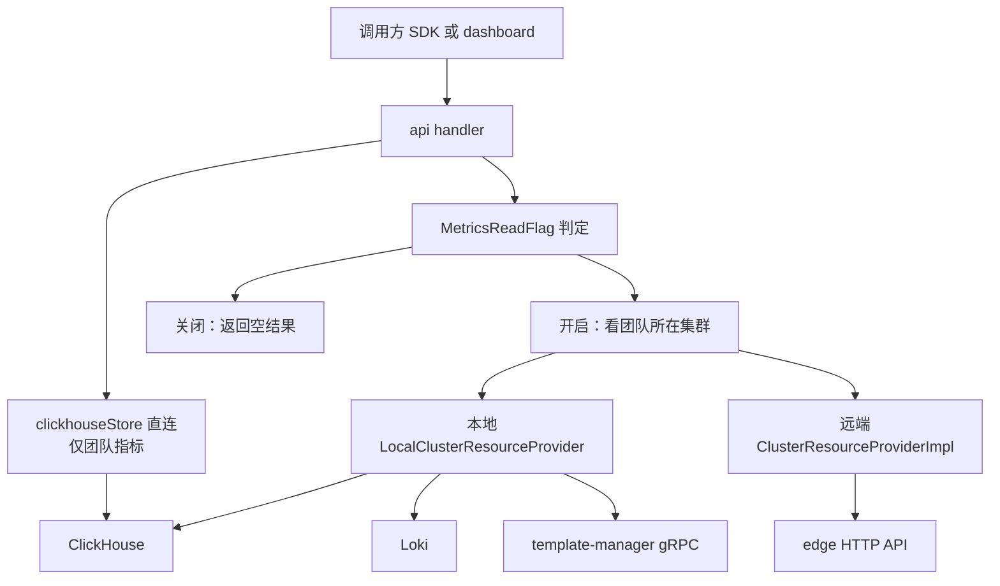
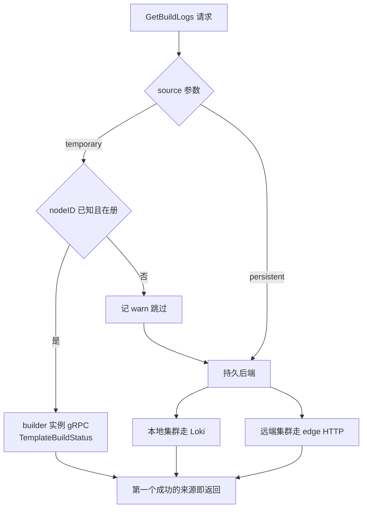

# 24 · API 的指标、日志与分析事件

> 沙箱的 CPU 曲线、沙箱里进程打的日志、团队的并发峰值，这三样东西 api 一个都没有存。
> 它们分别躺在 ClickHouse、Loki 和外部分析服务里，api 只是一个带鉴权与口径转换的查询前端。
> 本篇把每个端点背后的数据源、查询形状与降级行为讲清楚。
>
> **读者**：后端工程师、平台工程师。
> **预备**：[第 15 篇 · API 服务的结构](15-api-service-structure.md#4-apistore依赖装配在一个结构体里)、
> [第 16 篇 · 认证与多租户](16-auth-and-multitenancy.md#2-五种凭证)、[第 21 篇 §7](21-clusters-and-discovery.md#7-跨集群的两条数据通路)。
> **代码**：`packages/api/internal/handlers/sandbox_metrics.go`、`sandboxes_list_metrics.go`、
> `team_metrics.go`、`team_metrics_max.go`、`sandbox_logs.go`、`template_build_logs.go`、
> `packages/api/internal/clusters/resources.go`、`resources_local.go`、`resources_remote.go`、
> `packages/api/internal/metrics/team.go`、`packages/api/internal/analytics_collector/`、
> `packages/clickhouse/pkg/`、`packages/shared/pkg/logs/loki/`、`spec/openapi.yml`

---

## 0. 本篇要回答的问题

1. 一个控制面服务为什么不自己保存指标与日志？它把这两类数据分别推给了谁？
2. `/sandboxes/{id}/metrics`、`/sandboxes/metrics`、`/teams/{id}/metrics`、`/teams/{id}/metrics/max`
   四个端点各查哪张表、用什么聚合、时间粒度由谁决定？
3. 沙箱日志与构建日志分别怎么从 Loki 取？为什么分页要在 api 侧手工做？
4. 同一个端点，团队落在本地集群和远端集群时，代码路径有什么不同？
5. ClickHouse 不可用、Loki 查询失败、特性开关关闭时，这些端点返回什么？
6. 发给 posthog 与 analytics collector 的事件是什么、在哪些路径上发、失败了会怎样？

---

## 1. 控制面不存时间序列

api 手里有两类完全不同的数据。

第一类是**控制面状态**：某个沙箱现在跑在哪个节点上、什么时候到期、属于哪个团队。
这类数据的特点是量小、要强一致、要能按主键随机读写，它们放在 Postgres 与 Redis 里
（[第 20 篇 §1](20-sandbox-state-storage.md#1-为什么需要单独一份运行态)）。

第二类是**观测数据**：每个沙箱每隔几秒一条的 CPU / 内存 / 磁盘采样，沙箱内进程打出来的每一行日志。
它们的特点正相反：量大、只追加、几乎只按「某个 ID + 某段时间」范围扫描、允许丢失少量、允许延迟几秒可见。
把它们塞进 Postgres 能工作，代价是主库写入压力与磁盘随行数线性增长，
控制面的可用性被观测数据的写入拖累。

上游 2026.09 把第二类数据整个移出控制面：指标进 ClickHouse，日志进 Loki，api 只保留**读取**这一侧。
收益是控制面数据库的负载与观测数据完全解耦；代价有三条：查询能力被后端的表结构
与索引限死（例如 Loki 不支持偏移量分页）；api 与两套外部系统的可用性绑定，每条读路径都要有降级分支；
写入与读取分属不同进程，指标可见性有秒级延迟，端点无法保证「刚创建的沙箱立刻有数据」。

有一个例外：**团队级指标是 api 自己产生的**。
`packages/api/internal/metrics/team.go` 的 `TeamObserver` 注册了一个 OpenTelemetry 可观测 gauge
与一个 counter，把每个团队的运行中沙箱数与新建沙箱数按 5 秒周期（`ExportPeriod`）导出，
经采集链路落到 ClickHouse，再由 `/teams/{id}/metrics` 读回来。绕这一圈的理由是端点要返回
**历史曲线**，而 api 进程内的沙箱存储只有「此刻」的状态，进程重启即失忆，也无法跨实例合并。

沙箱级指标不同：它由 orchestrator 采集与写入（`packages/orchestrator/internal/sandbox/sandbox.go`
按 `featureflags.MetricsWriteFlag` 决定是否走 ClickHouse），api 只读。写入侧的批量与表结构见
[第 59 篇 §3](59-clickhouse.md#3-两条写入路径)，采集与导出管线见
[第 60 篇 §2](60-telemetry.md#2-两个-meter-provider)。

---

## 2. 端点到数据源的矩阵

下表里「数据源」指本地集群下最终被查询的系统；远端集群的差异在
[§5](#5-同一个接口的两种实现) 说明。

| 端点 | handler | 数据源 | 聚合 / 形状 |
|---|---|---|---|
| `GET /sandboxes/{id}/metrics` | `sandbox_metrics.go` | ClickHouse `sandbox_metrics_gauge` | 按 step 分桶的时间序列 |
| `GET /sandboxes/metrics` | `sandboxes_list_metrics.go` | ClickHouse `sandbox_metrics_gauge` | 每个沙箱一条最新值 |
| `GET /teams/{id}/metrics` | `team_metrics.go` | ClickHouse `team_metrics_gauge` + `team_metrics_sum` | 按 step 分桶的两条曲线 |
| `GET /teams/{id}/metrics/max` | `team_metrics_max.go` | 同上，二选一 | 区间内单个极值点 |
| `GET /sandboxes/{id}/logs` | `sandbox_logs.go` | Loki | 一段时间窗内的日志行 |
| `GET /v2/sandboxes/{id}/logs` | `sandbox_logs.go` | Loki | 同上，带游标与方向 |
| `GET /templates/{tid}/builds/{bid}/logs` | `template_build_logs.go` | template-manager 实例（临时）或 Loki（持久） | 按来源回退 |
| `GET /templates/{tid}/builds/{bid}/status` | `template_build_status.go` | Postgres（状态）+ 上一行的两个日志源 | 状态 + 前若干条日志 |
| `GET /nodes`、`GET /nodes/{id}` | `admin.go` | orchestrator 的 ServiceInfo 轮询缓存 | 节点当前快照 |

最后一行是对照组：节点指标不经过 ClickHouse，来自 api 内存里的节点状态缓存
（[第 19 篇 §2.2](19-node-management-and-placement.md#22-serviceinfo唯一的资源真相)），没有历史，
只有此刻——`NodeMetrics` 这个 schema 里因此全是瞬时值而没有时间戳。



图里有一条旁路：**团队指标不走集群抽象**。`team_metrics.go` 与 `team_metrics_max.go`
直接调用 `a.clickhouseStore`，而沙箱指标与日志都要先 `a.clusters.GetClusterById(...)`
再 `GetResources()`。后果是一个团队的沙箱跑在远端集群上时，沙箱指标从那个集群的 edge 取，
团队指标仍从 api 本地的 ClickHouse 取——团队指标本来就是 api 自己产生并导出的，
不属于任何一个远端集群。

---

## 3. 指标端点

### 3.1 单个沙箱的时间序列

`GetSandboxesSandboxIDMetrics` 的处理顺序是固定的四步，每一步都可能提前返回：

1. `utils.ShortID(sandboxID)` 把可能带执行后缀的 ID 归一化，失败返回 400；
2. 从 gin 上下文取团队信息（认证中间件放进去的），把 sandbox 与 team 两个 kind 加进特性开关上下文；
3. 读 `featureflags.MetricsReadFlag`，关闭时直接返回 `[]`，**HTTP 200 而不是 503**；
4. 找到团队所属集群，调 `cluster.GetResources().GetSandboxMetrics(...)`。

第 3 步是一个刻意的选择：读取开关关掉时，调用方拿到的是「这个沙箱没有指标」而不是「指标服务坏了」，
于是 dashboard 与 SDK 不必为这种状态写额外分支；代价是无法区分「真的没有采样」与「服务端关掉了读取」。

真正的查询在 `resources_local.go` 的 `LocalClusterResourceProvider.GetSandboxMetrics` 里，分四段：

**确定时间范围。** `clickhouseutils.GetSandboxStartEndTime` 的规则是：`start` 与 `end` 只要有一个没给，
就先发一条 `QuerySandboxTimeRange`，对 `sandbox_metrics_gauge` 按 `sandbox_id` + `team_id`
取 `min(timestamp)` 与 `max(timestamp)` 补齐缺失的那一端，于是「不带参数直接查一个沙箱」
默认覆盖它的整个生命周期。代价是这条补齐查询没有时间条件，要跨该沙箱涉及的所有分区求极值；
**推论**：它的开销随沙箱存活跨越的天数增长，而每次不带参数的请求都会执行一次。

**校验范围。** `ValidateRange` 只做两件事：`start`、`end` 都不能晚于 ClickHouse 的 `DateTime64` 上界
（`clickhouse.MaxDate64`，即 2299-12-31），且 `start` 不能晚于 `end`。它**不检查下界**，也不检查跨度：
传一个十年前的 `start` 是合法的，只是查不到数据——`sandbox_metrics_gauge` 的 TTL 是 7 天。

**计算步长。** `clickhouseutils.CalculateStep` 按跨度分档：小于 1 小时用 5 秒，
小于 6 小时用 30 秒，小于 12 小时用 1 分钟，小于 1 天用 2 分钟，小于 7 天用 5 分钟，其余用 15 分钟。
函数注释写明目标是「结果点数始终少于 1000」，于是响应体大小被钉死，
服务端不会因为一次请求返回几十万个点。代价是精度不可协商：
想看一整天里某 30 秒的细节，只能把 `start`、`end` 缩到那一段重新请求。

**查询与投影。** `packages/clickhouse/pkg/sandbox.go` 的 `sandboxMetricsSelectQuery`
用 `toStartOfInterval(timestamp, interval {step} second)` 分桶，再用六个
`maxIf(value, metric_name = ...)` 把长表转成宽行。六个指标名来自 `packages/shared/pkg/telemetry`：
`e2b.sandbox.cpu.total`、`e2b.sandbox.cpu.used`、`e2b.sandbox.ram.total`、`e2b.sandbox.ram.used`、
`e2b.sandbox.disk.total`、`e2b.sandbox.disk.used`。
桶内用 `max` 而不是 `avg`，意味着返回的是每个桶里的峰值而非均值，
步长越大曲线越偏高——这一点在 OpenAPI 的描述里没有写。

最后 handler 把 `clickhouse.Metrics` 逐字段转成 `api.SandboxMetric`，其中有一处精度损失：
ClickHouse 侧全是 `Float64`，而 `api.SandboxMetric` 里 `cpuCount` 是 `int32`、`memTotal` 等是 `int64`。

### 3.2 一批沙箱的最新值

`/sandboxes/metrics` 服务的是另一种界面需求：一个沙箱列表，每行显示当前占用，
不需要曲线，只需要每个沙箱最后一个采样点。

`latestMetricsSelectQuery` 用 `argMaxIf(value, timestamp, metric_name = ...)` 在一次扫描里
同时取出六个指标各自的最新值，按 `sandbox_id`、`team_id` 分组，`ts` 取 `max(timestamp)`——
SQL 注释说明前提是「所有指标在同一时刻记录」。这是一个被写进查询的假设：
如果某一类指标的采集周期与其它的不同，`ts` 就不再代表所有列的时间。

规模上有硬上限：`maxSandboxMetricsCount = 100`，超过直接 400，
`spec/openapi.yml` 里同一个参数也标了 `maxItems: 100`，两处各挡一层。

它还是**唯一一个会发分析事件的指标端点**：查询前调用 `posthog.IdentifyAnalyticsTeam` 与
`CreateAnalyticsTeamEvent(..., "listed running instances with metrics", ...)`，
而 `/sandboxes/{id}/metrics` 与两个团队指标端点都不发，于是 posthog 里的调用统计只覆盖列表式访问。

### 3.3 团队指标

`/teams/{id}/metrics` 先做一次授权检查：路径里的 `teamID` 必须等于凭证解析出来的团队 ID，否则 403。
这一步不能省，因为团队指标端点没有沙箱那一层的所有权推导（[第 16 篇 §1](16-auth-and-multitenancy.md#1-租户边界画在-team-上)）。

默认时间范围是 `defaultTimeRange = 7 * 24 * time.Hour`，参数 `start`、`end` 是**秒**级 Unix 时间戳。
步长同样用 `CalculateStep`。

`QueryTeamMetrics` 的 SQL 用两个 CTE 分别从 `team_metrics_sum` 取
`e2b.team.sandbox.created` 的分桶求和、从 `team_metrics_gauge` 取 `e2b.team.sandbox.running`
的分桶最大值，再用 `UNION DISTINCT` 求两者时间桶的并集，左连接回去，缺失的补 0。
「启动速率」是 `created_sandboxes / step`，单位是个 / 秒。

两张团队指标表的 TTL 是 90 天，比 `sandbox_metrics_gauge` 的 7 天长一个量级
（`packages/clickhouse/migrations/20250822155059_extend_team_metrics_ttl.sql`），
所以团队曲线可以回看一个季度，而沙箱曲线不能。

`/teams/{id}/metrics/max` 按 `metric` 参数二选一，两条路径的步长口径不一样：

- `concurrent_sandboxes` 走 `QueryMaxConcurrentTeamMetrics`，
  直接 `argMax(timestamp, value)` + `max(value)`，**不分桶**，取的是原始采样点里的最大值；
- `sandbox_start_rate` 走 `QueryMaxStartRateTeamMetrics`，步长写死为 `metrics.ExportPeriod`，
  也就是 api 自己导出团队指标的 5 秒周期。

第二条是全篇最值得注意的耦合：**读取侧的分桶宽度必须等于写入侧的导出周期**。
`TeamObserver` 用的是 delta temporality，每 5 秒导出这 5 秒内新建的沙箱数；
按 5 秒分桶求和再除以 5，得到的才是真实的瞬时速率。
如果有人把 `ExportPeriod` 改小，历史数据的桶宽与新数据不一致，这个端点算出来的峰值就会失真，
而代码里没有任何断言会提示这件事。

两条查询在没有任何行时都不报错，而是返回 `Value: 0` 与 `Timestamp: time.Now()`。
调用方拿到的是「此刻的峰值是 0」，而不是「这段时间没有数据」——同样是把缺失伪装成了取值。

---

## 4. 日志端点

### 4.1 沙箱日志

Loki 侧的查询在 `packages/shared/pkg/logs/loki/provider.go` 的 `QuerySandboxLogs`：

```go
query := fmt.Sprintf("{teamID=`%s`, sandboxID=`%s`, category!=\"metrics\"}", teamIdSanitized, sandboxIdSanitized)
```

租户隔离靠的是 `teamID` 这个标签，所以 `sanitizeLokiLabel` 要把反引号从输入里删掉，
防止闭合标签值后拼出别的选择器；ID 在此之前已经过 `utils.ShortID` 与 UUID 解析，这一层是纵深防御。
`category!="metrics"` 把曾经也走日志管线的指标行排除掉：沙箱指标现在走 ClickHouse，
但 Loki 里仍可能有旧数据。写那些行的函数至今还在：`packages/shared/pkg/logger/sandbox/sandbox_logger.go` 的
`SandboxLogger.Metrics()` 仍会打出带 `category: metrics` 的日志行，
只是上游 2026.09 里已经没有任何调用点 —— 函数与过滤条件是同一段历史的两半。

`ResponseMapper`（`loki.go`）负责把 Loki 的流转成 `logs.LogEntry`：
每一行按平铺 JSON 解析（`logs.FlatJsonLogLineParser`，只保留字符串、数字、布尔三种标量，
数组与对象被丢弃），`level` 字段缺失时按 `info` 处理，`message` 字段提为正文，
这两个键随后从 `fields` 里删掉以免重复。最后按时间戳排序——注释说明 Loki 返回的顺序是**到达顺序**，
不是产生顺序，所以必须重排。

分页是这里最大的约束。代码注释写得很直白：`loki does not support offset pagination, so we need to skip logs manually`。
`ResponseMapper` 的做法是先取回 `limit` 条，再在内存里跳过前 `offset` 条。
这意味着 `offset` 越大，被取回又被丢弃的行越多，而且**丢弃发生在 `limit` 之后**——
请求 `limit=100&offset=90` 实际只能拿到 10 条。等级过滤也是同样的问题：
`level` 参数在 mapper 里逐行比较后跳过，不下推到 LogQL，所以过滤掉的行同样占用了 `limit` 名额。
上游对此的应对是 v2 端点改用**游标**分页。

### 4.2 v1 与 v2 的差异

| 维度 | `GET /sandboxes/{id}/logs` | `GET /v2/sandboxes/{id}/logs` |
|---|---|---|
| 状态 | spec 标 `deprecated: true` | 现行 |
| 分页 | `start`（毫秒） | `cursor`（毫秒）+ `direction` |
| 时间窗 | `start` 到当前时刻 | 由 `LogQueryWindow` 从游标推出 |
| 响应 | `logs` 与 `logEntries` 两份 | 只有 `logEntries` |

`LogQueryWindow`（`resources.go`）是 v2 与构建日志共用的窗口计算：
以 `logsOldestLimit = 7 * 24h` 为跨度，向前翻页时 `start = cursor`、`end = cursor + 7d`，
向后翻页时 `end = cursor`、`start = cursor - 7d`，再把 `start`、`end` 都夹到「不早于七天前」，
最后保证 `start <= end`。七天这个数字与 `sandbox_metrics_gauge` 的 TTL 相同，
**推论**：它对应的是日志保留期，超出保留期的游标会被静默夹到窗口边界，
调用方会看到「翻到头了」而不是错误。

v1 那两份响应里，`logs` 是原始行加时间戳，为兼容早期只认原始行的 SDK 而保留。

### 4.3 失败被吞掉

`QuerySandboxLogs` 与 `QueryBuildLogs` 在 Loki 报错或映射失败时，
都是记一条 error 日志加一次 `telemetry.ReportError`，然后 **`return make([]logs.LogEntry, 0), nil`**。
错误不会向上传播，端点返回 200 与空数组。

这是一个明确的取舍。收益是日志后端抖动不会让 dashboard 报错，也不会让 SDK 的轮询循环中断；
代价是「日志为空」与「日志查不到」在 HTTP 层无法区分，排查只能靠服务端的 error 日志与 span。相比之下，指标路径的 ClickHouse 错误是会向上冒的
（`GetSandboxMetrics` 返回 500），两条读路径的错误口径并不一致。

### 4.4 构建日志的双源回退

构建日志比沙箱日志多一层：正在构建时，日志还留在执行构建的 template-manager 实例的内存里，
尚未落到 Loki。`getBuildLogsWithSources`（`resources.go`）因此维护一个有序的来源列表：



`logCheckSourceType` 的语义是「`source` 为空表示两个来源都可用」。循环里任何一个来源报错只记 warn
并继续下一个；**所有来源都失败时返回 `nil, nil`**，handler 回一个空列表加 200——与沙箱日志的吞错行为一致。

还有一处细节：`provider.go` 里构建日志的 LogQL 选择器写死为
`{service="template-manager", buildID=..., envID=...}`，上面挂着一条
`todo: service name is different here (because new merged orchestrator)` 的注释。
在 orchestrator 与 template-manager 合并为同一进程的部署里，这个标签值需要跟着调整，否则持久日志查不到。

---

## 5. 同一个接口的两种实现

上面所有沙箱级读取都经过 `ClusterResource` 接口（`resources.go`），它只有四个方法：
`GetSandboxMetrics`、`GetSandboxesMetrics`、`GetSandboxLogs`、`GetBuildLogs`。
两个实现：

- `LocalClusterResourceProvider`（`resources_local.go`）持有 ClickHouse 客户端与
  `loki.LokiQueryProvider`，直接查两个后端；
- `ClusterResourceProviderImpl`（`resources_remote.go`）持有一个边缘代理
  （client-proxy，也称 edge，两个名字指同一个进程）的 HTTP 客户端，
  把请求原样转成 `V1SandboxMetrics`、`V1SandboxesMetrics`、`V1SandboxLogs`、`V1TemplateBuildLogs`
  四个调用，再把响应逐字段搬回 `api.*` 类型。

选择发生在集群构造时（`cluster.go`），于是 handler 不需要知道团队在哪个集群，
[第 21 篇 §7](21-clusters-and-discovery.md#7-跨集群的两条数据通路)讲的多集群拓扑对这些端点是透明的。

远端路径有两个可观察的差异。参数被原样透传：`GetSandboxMetrics` 把 `qStart`、`qEnd`
直接放进 edge 的查询参数，时间范围推断、步长计算、范围校验全部由对端负责。
错误经 `handleEdgeErrorResponse` 归一：只有 400 会把对端消息与状态码一起透出，
401 与 500 都被折叠成 500。

回顾：上游 2026.09 的仓库里只有 `spec/openapi-edge.yml` 与由它生成的客户端，
没有这四个端点的服务端实现，因此远端路径的对端行为只能按契约理解，
自建多集群部署要自己提供符合该规格的服务，见
[第 56 篇 §1](56-edge-api.md#1-一个刻意留下的缺口)与[第 21 篇 §8](21-clusters-and-discovery.md#8-这套设计读代码读不到的部分)。

---

## 6. 缺后端时的行为

三个后端各有一套「没有它也能启动」的安排，口径并不统一：

| 后端 | 配置项 | 缺失时 | 后果 |
|---|---|---|---|
| ClickHouse | `CLICKHOUSE_CONNECTION_STRING` | `clickhouse.NewNoopClient()` | 所有指标查询返回空值，不报错 |
| Loki | `LOKI_URL`（`required`） | 进程启动失败 | api 起不来 |
| posthog | `POSTHOG_API_KEY` | 客户端仍创建，日志被丢进 `NoOpWriter` | 事件进队列后发送失败，日志静默 |
| analytics collector | `ANALYTICS_COLLECTOR_HOST` | `client` 为 nil，各方法直接返回 | 事件不发送 |

`NoopClient`（`packages/clickhouse/pkg/mock.go`）实现了完整的 `Clickhouse` 接口，
每个方法返回零值加 `nil` 错误。它与 `MetricsReadFlag` 构成部署期与运行期两层开关，
两层都以「返回空」表达，从响应上无法反推是哪一层生效。

`LOKI_URL` 是 `required` 而 ClickHouse 不是，这条不对称意味着**任何 api 部署都必须有一个 Loki 地址**，
哪怕它不打算提供日志端点，单机离线部署时需要留意
（[第 80 篇 §6](80-single-node-rpm.md#6-buildsh--s从空机器到可用集群)）。

---

## 7. 分析事件

分析事件与前面六节讲的都不同：它是**出站**的，api 主动往外发，没有对应的读端点。
上游 2026.09 有两条互相独立的通道。

需要与另一套东西划清界限：**沙箱事件与 webhook（[第 61 篇](61-events-and-webhooks.md#1-问题三种想知道)）
不是本篇讲的分析事件**。那一套由 orchestrator 在状态变化处构造，扇出到 ClickHouse 与一条 Redis Stream，
面向用户订阅；本篇的两条通道由 api 在请求路径上构造，发往外部的产品分析与用量服务。
两者不共享结构体、投递代码与失败语义，也不互为兜底，同一次沙箱创建会在两边各留一份互不相同的记录。

### 7.1 posthog

`packages/api/internal/analytics_collector/analytics.go` 里的 `PosthogClient` 包了官方 SDK，
配置是 `Interval: 30s`、`BatchSize: 100`——事件先进内存队列，攒够 100 条或到 30 秒才发一次，
发送失败只记日志。定位因此是产品分析：允许丢，不能反压请求路径。

事件分两类。`CreateAnalyticsTeamEvent` 用固定的 `DistinctId: "backend"`，
把团队 ID 放进 posthog 的 group；`CreateAnalyticsUserEvent` 用真实用户 ID。
两者都附加 `infra_version: v1`。
`GetPackageToPosthogProperties` 从请求头里抄出十一个字段
（`browser`、`lang`、`lang_version`、`machine`、`os`、`package_version`、`processor`、
`publisher`、`release`、`sdk_runtime`、`system`），即 SDK 自报的客户端环境。

按代码里的调用点，事件名有：`created_instance`、`closed_instance`、`listed sandboxes`、
`listed running instances with metrics`、`listed environments`、`submitted environment build request`、
`built environment`、`updated environment`、`deleted environment`、`assigned template tag`、`deleted template tags`。
命名风格不统一（下划线与空格混用），改名会破坏已有的分析看板。

`created_instance` 的属性最丰富（`handlers/sandbox.go`）：模板、沙箱 ID、别名、是否 resume、
build ID、envd 版本、节点 ID、vCPU、内存、磁盘、是否自动暂停，以及从请求进入到创建完成的
`start_time_ms`——产品侧观察「冷启动多久」的主要来源，与 OpenTelemetry 的 span 是两套并行口径。

### 7.2 analytics collector

第二条通道是一个 gRPC 服务，只有三个方法（仓库里只有生成的
`collector.pb.go` 与 `collector_grpc.pb.go`，没有 `.proto` 源文件，服务端也不在上游仓库内）：
`InstanceStarted`、`RunningInstances`、`InstanceStopped`。
连接在 `client.go` 建立：目标是 `<host>:443`，TLS 最低版本 1.3、使用系统根证书，
凭证通过 `X-API-key` 请求头逐调用附带（`auth.go`），本地环境允许不加密。
`host` 为空时 `client` 保持 nil，三个方法都变成空操作——这是自建部署的默认状态。

调用点只有两处，都在 `packages/api/internal/orchestrator/analytics.go`：
`analyticsInsert` 在沙箱创建成功后发 `InstanceStartedEvent`（沙箱 ID、执行 ID、模板、build、团队、
vCPU、内存、磁盘、时间戳）；`analyticsRemove` 在沙箱删除时发 `InstanceStoppedEvent`，
额外带上 `duration`（从 `StartTime` 算起的秒数）。
两者都用 `reportTimeout = 4 * time.Minute` 包了一层超时，注释说明这是为了配合对端的 3 分钟处理超时。

`analyticsRemove` 在 `delete_instance.go` 里通过 `defer func() { go ... }()` 调用，
即**异步且不等待**：删除路径不会因为分析服务慢而阻塞，代价是进程退出时这些 goroutine 可能来不及发完。
这条通道承载用量与计费口径（事件里带着 vCPU、内存、磁盘与时长），丢事件的后果比 posthog 严重，
但代码里没有重试或持久化队列。

`RunningInstances` 在客户端封装里有，在上游 2026.09 的 api 代码里**没有任何调用点**。
**推论**：它是早期周期性上报运行中沙箱列表的遗留接口，这一职责现由 `TeamObserver` 的 gauge 承担。

### 7.3 三套出站数据的分工

| 通道 | 用途 | 传输 | 丢失容忍 |
|---|---|---|---|
| OpenTelemetry metrics | 团队指标，回流到 ClickHouse 供端点查询 | OTLP gRPC，5 秒周期 | 高 |
| posthog | 产品分析，谁在用什么功能 | HTTP 批量，30 秒 / 100 条 | 高 |
| analytics collector | 用量与计费口径的沙箱起止 | gRPC，逐事件 | 低，但无重试 |

同一次沙箱创建会同时触发这三条：`handleNewlyCreatedSandbox` 调 `analyticsInsert`、
`teamMetricsObserver.Add` 与 `createdCounter.Add`，handler 侧另外发 `created_instance`。
四份记录口径不同、后端不同、丢失概率不同，做对账时需要知道这一点。

---

## 8. ARM 适配版的差异

查询路径本身没有改动：`git diff f8c2f0cde fbee6fcd1` 在
`packages/api/internal/handlers/`、`packages/clickhouse/pkg/`、`packages/shared/pkg/logs/`
下没有任何针对指标与日志查询的改动。
相关的改动有两处，都在链路两端：`packages/clickhouse/Dockerfile` 改为基于 debian 并直接拷入
预先构建的 goose 二进制与 migrations，以适配无外网的构建环境
（[第 80 篇 §3](80-single-node-rpm.md#3-离线构建怎么做到)）；
`handlers/store.go` 增加了 Kubernetes 客户端并把它传给集群池，
从而多出一种集群发现方式，间接影响本地与远端 provider 的选择
（[第 76 篇 §5](76-k8s-discovery.md#5-选择逻辑与客户端注入)）。

---

## 9. 小结

- api 不保存指标与日志。沙箱指标在 ClickHouse，日志在 Loki，节点指标只在 api 内存里；
  api 是一个带鉴权、口径转换与降级逻辑的查询前端。
- 团队指标是唯一由 api 自己产生再读回来的数据：`TeamObserver` 每 5 秒导出，绕遥测管线落到 ClickHouse。
- 沙箱指标端点的响应精度由 `CalculateStep` 单方面决定，目标是点数少于 1000，调用方无法协商。
- `QueryMaxStartRateTeamMetrics` 的分桶宽度写死为 `metrics.ExportPeriod`，
  读取侧与写入侧的周期必须保持一致，代码里没有约束这件事的机制。
- Loki 不支持偏移量分页，`offset` 与 `level` 过滤都在 api 侧取回后手工执行，
  两者都消耗 `limit` 名额；v2 端点用游标分页规避了这个问题。
- 日志路径把后端错误吞掉返回空数组，指标路径把 ClickHouse 错误上抛为 500，两条读路径的错误口径不一致。
- 特性开关关闭、ClickHouse 未配置、查询无数据，三种情况在响应上都表现为空结果或零值，不可区分。
- 本地与远端集群共享 `ClusterResource` 接口；远端把时间范围与步长的决策整个交给 edge，
  而该 edge 的服务端实现不在上游仓库内。
- 出站分析有三条独立通道（OTLP、posthog、analytics collector），同一次沙箱创建在四处留痕，
  口径与可靠性各不相同；用量事件没有重试或持久化。它们与第 61 篇的沙箱事件是两套东西，互不兜底。

---

## 延伸阅读 / 下一篇

- [第 59 篇 §2](59-clickhouse.md#2-表五张业务表与四种角色)：本篇查询的那些表长什么样、批量写入怎么做。
- [第 60 篇 §2](60-telemetry.md#2-两个-meter-provider)：指标与日志是怎么被采集并送到后端的。
- [第 19 篇 §2.2](19-node-management-and-placement.md#22-serviceinfo唯一的资源真相)：节点指标的来源。
- [第 61 篇 §4](61-events-and-webhooks.md#4-投递一个接口三个实现)：另一条面向外部的事件通道，与本篇的两条分析通道互不相干。
- 下一篇：[第 25 篇 · orchestrator 进程](25-orchestrator-process.md#2-一个二进制两种角色)，从控制面转入数据面。
