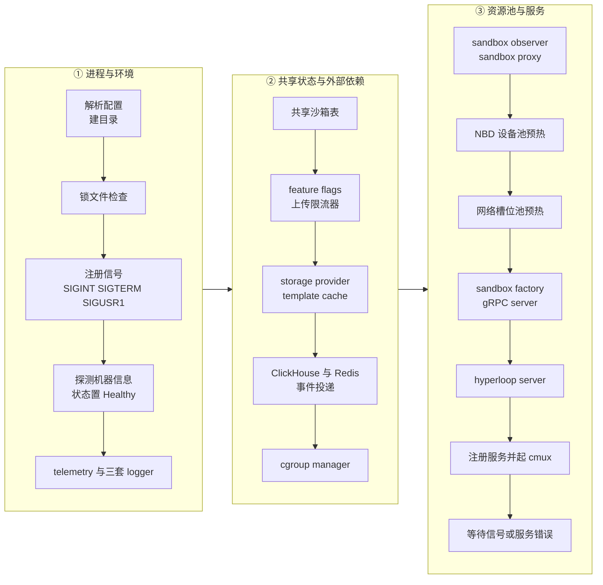
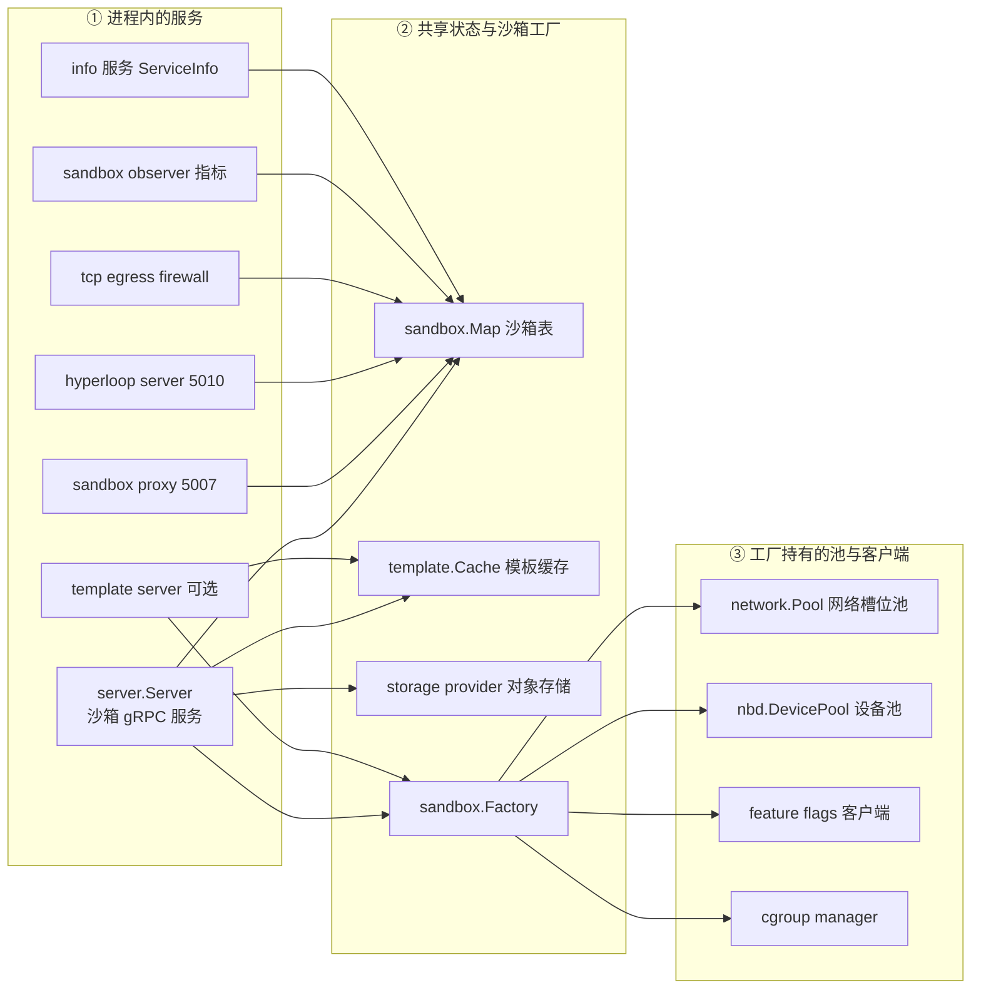

# 25 · orchestrator 进程

> orchestrator 是跑在每台沙箱宿主机上的那个进程：它把宿主的网络、块设备、cgroup、
> 本地缓存这些一次性资源攒在自己手里，再按 gRPC 请求把它们分给一台台沙箱。
> 本篇讲这个进程本身 —— 它由哪些部件组成、按什么顺序起来、退出时怎么收场。
>
> **读者**：想读懂 `packages/orchestrator` 的工程师。
> **预备**：[第 10 篇 · 系统架构](10-system-architecture.md)、[第 9 篇 · Nomad / Consul / Terraform](09-nomad-consul-terraform.md)。
> **代码**：`packages/orchestrator/main.go`、`internal/cfg/`、`internal/server/main.go`、
> `internal/service/`、`internal/healthcheck/`、`internal/hyperloopserver/`、`internal/factories/`、
> `iac/modules/job-orchestrator/jobs/orchestrator.hcl`

---

## 0. 本篇要回答的问题

1. `ORCHESTRATOR_SERVICES` 到底切换了什么？为什么 orchestrator 和 template-manager 是同一个二进制？
2. 进程启动时按什么顺序构造哪些部件？哪些是「预热」，预热失败会怎样？
3. 一个 orchestrator 进程在整个生命周期里持有哪些共享资源？谁在共享它们？
4. 一台机器重启 orchestrator 之后，之前跑着的沙箱还在吗？代码怎么处理这件事？
5. draining 是谁设的、谁看的，优雅退出到底等什么、不等什么？

---

## 1. 问题：宿主上的那些东西不能按沙箱分配

拉起一台沙箱要用到的宿主资源里，有一类天然是「全机一份」的：

- 网络槽位需要建 netns、veth、tap、iptables 规则，一套下来是几十毫秒量级的内核操作；
- `/dev/nbdX` 是内核模块 `nbd` 在加载时按 `nbds_max` 一次性建出来的固定集合，谁用了哪一个必须全机统一记账；
- 模板产物在本地磁盘上有缓存，同一个模板被十台沙箱用就该只落一份；
- 到对象存储的连接、到 ClickHouse 的连接、feature flag 的长轮询连接，都不应该按沙箱建。

如果每次 `Create` 请求现场去做这些事，沙箱启动时间里会混进大量与沙箱本身无关的开销；
如果让每台沙箱各自持有一份，宿主资源会被重复占用甚至互相踩踏。
所以宿主上需要一个常驻进程：**它启动一次，把这些东西建好、池化、并在整个进程生命周期里持有**，
再把「拿一个槽位、拿一个设备、拿一个模板」变成从 channel 里取一个对象。这个进程就是 orchestrator。

这条设计线索决定了本篇后面的全部内容：启动顺序是「先把池子填上」，
退出顺序是「反着把池子清掉」，而进程崩溃是一件比请求失败严重得多的事 —— 池子里的账全丢了。

---

## 2. 一个二进制，两种角色

`packages/orchestrator` 编译出的二进制只有一个。`packages/orchestrator/Makefile` 里
`upload/orchestrator` 与 `upload/template-manager` 两个目标上传的是**同一个** `./bin/orchestrator` 文件，
只是在对象存储里存成了两个名字。区分角色的是环境变量 `ORCHESTRATOR_SERVICES`。

`internal/cfg/model.go` 把它解析成 `Config.Services []string`（默认 `orchestrator`），
`internal/cfg/service.go` 的 `GetServices()` 再把每一项映射成 `ServiceType`，
无法识别的名字被静默丢弃。可识别的只有两个：`orchestrator` 与 `template-manager`。

读代码可以确认它只影响四处，其余部件一律无条件构造：

| 位置 | 作用 |
|---|---|
| `main.go` 的锁文件检查 | 只有含 `orchestrator` 角色时才建 / 查 `ORCHESTRATOR_LOCK_PATH` |
| `cfg.GetServiceName()` | 把角色名用下划线拼起来，作为遥测里的 service name |
| `service.NewInfoContainer()` | 把角色映射成 `ServiceInfoRole`，通过 info 服务上报给 api |
| `main.go` 的 template-manager 分支 | 只有含 `template-manager` 角色时才构造 `tmplserver.New()` 并注册 gRPC 服务 |

值得注意的是 `orchestrator.RegisterSandboxServiceServer()` 是**无条件**注册的：
一个 `ORCHESTRATOR_SERVICES=template-manager` 的进程照样能接受 `Create` / `Pause` / `Delete` 请求。
真正把流量挡在外面的不是本地的服务注册，而是 api 侧：
`packages/api/internal/clusters/instance.go` 读上报的 `Roles`，
用 `isOrchestrator` / `isBuilder` 决定往哪台机器发什么请求（见[第 19 篇 §2.1](19-node-management-and-placement.md#21-一个节点是什么)）。
换句话说，**角色是一个声明，不是一道本地闸门**。收益是构建节点可以顺手复用整套沙箱运行时来跑构建期沙箱
（[第 46 篇 §1](46-template-manager-service.md#1-一个二进制两个角色)）；代价是本地没有防护，
角色配错了只会表现为 api 侧的路由异常。

在上游 2026.09 的 GCP 部署里，两个角色跑在不同节点池上：`iac/provider-gcp/nomad/main.tf` 里
orchestrator 模块不传 `orchestrator_services`（取默认值 `orchestrator`），
template-manager job 则显式传 `"template-manager"`。

---

## 3. 启动顺序

`main()` 只做三件事：`cfg.Parse()` 解析环境变量、`ensureDirs()` 用 `0o700` 建出配置里列的全部目录、
调 `run(config)`。真正的启动逻辑全在 `run()` 里，是一段近四百行的线性代码，
所有失败路径都是 `logger.L().Fatal(...)` 或 `log.Fatalf(...)` —— **启动阶段不做降级**。

几个点值得单独说。

**锁文件是崩溃检测，不是互斥锁。** `run()` 在非开发模式且未设 `FORCE_STOP` 时，
先 `os.Stat(config.OrchestratorLockPath)`（默认 `/orchestrator.lock`）：文件存在就直接
`log.Fatalf("Orchestrator was already started at ...")` 退出。文件只在**正常退出**
（`success == true`）时被删除。所以它的语义是：上一次进程没有走完优雅退出流程，
这台机器的宿主状态（netns、nbd 设备、cgroup、可能还活着的 Firecracker 进程）不可信，拒绝重启。

**没有任何持久化恢复。** 大纲里留了「重启后找回沙箱？读代码确认」这个问句，
读完 `run()` 可以确认：**没有**。沙箱表 `sandbox.NewSandboxesMap()` 是纯内存的，
`template.NewCache()` 在构造时还会调 `cleanDir(config.DefaultCacheDir)` 主动清掉上次遗留的本地构建缓存目录。
配合上面的锁文件，上游的取舍很清楚：**orchestrator 进程与它管的沙箱同生共死，节点级故障靠换节点解决**，
而不是靠进程内的状态恢复。代价是一次进程崩溃等于这台机器上全部沙箱失联；
收益是整个运行时不必维护一套宿主侧的持久化状态机。

**两个池子是后台预热的。** `devicePool.Populate(ctx)` 与 `networkPool.Populate(ctx)`
都通过 `startService()` 放进 `errgroup` 里跑，是无限循环：不停地造槽位 / 找空闲设备，塞进带缓冲的 channel，
channel 满了就阻塞。网络池的容量常量在 `internal/sandbox/network/pool.go`：
`NewSlotsPoolSize = 32`、`ReusedSlotsPoolSize = 100`；NBD 池在 `internal/sandbox/nbd/pool.go` 的
`maxSlotsReady = 64`，且上限还受 `/sys/module/nbd/parameters/nbds_max` 约束 ——
读不到这个文件时 `NewDevicePool()` 直接返回 `ErrNBDModuleNotLoaded`，进程 Fatal 退出。
预热过程中的单次失败不致命：`Populate` 只打一条日志然后 `continue`，
NBD 那侧还会 `time.Sleep(waitOnNBDError)`（50 ms）退避，并且每 100 次失败才打一条日志。
所以「池子空了」不会让进程死掉，只会让 `Create` 请求卡在取槽位的 channel 上直到请求超时。
池的细节见[第 35 篇 §3](35-sandbox-networking.md#3-池两条队列两种优先级)与[第 33 篇 §1](33-nbd-and-rootfs.md#1-设备池一种在进程之外的资源)。

**`startService()` 是这段代码的骨架。** 它把一个 `func() error` 包进 `errgroup.Group`，
函数返回时把 error 塞进 `serviceError` channel（非阻塞发送），并统一返回一个 `serviceDoneError`。
主流程最后在 `select` 里同时等信号和 `serviceError`：**任何一个长期服务提前返回，
都会把整个进程带进退出流程**。这是有意的 —— 一个丢了 gRPC 监听或丢了网络池的 orchestrator，
继续活着比死掉更糟。

---

## 4. 进程持有的共享资源

下图是进程内的部件与共享关系。`sandbox.Map`（图中的沙箱表）是被共享得最广的一个对象。

几条读代码得到的事实：

- `sandbox.Map` 由 `main.go` 建好后注入给 server、proxy、hyperloop、tcpfirewall、observer、info 六个部件。
  它除了按 sandbox ID 查，还提供 `GetByHostPort()` —— hyperloop 靠它把一个 TCP 源地址反查回沙箱身份。
- `sandbox.Factory` 只拿走网络池、设备池、feature flags、host stats 投递与 cgroup manager 五样，
  模板缓存和对象存储是 `server.Server` 自己持有的（见 `internal/server/main.go` 的 `Server` 结构体）。
  对象的持有关系细节在[第 26 篇 §2](26-sandbox-object.md#2-sandbox-结构四组字段)。
- `server.Server` 还持有一个进程级的准入信号量 `startingSandboxes`，容量常量
  `maxStartingInstancesPerNode = 3`（`internal/server/sandboxes.go`）。
  恢复路径用 `waitForAcquire()` 等最多 `acquireTimeout = 15s`，冷启动路径用 `TryAcquire()` 立刻失败，
  两者都返回 gRPC `ResourceExhausted` 让调用方重试。整条请求还有一层
  `requestTimeout = 60s` 的上下文超时。这是全书里最容易被调参的三个常量，
  [第 71 篇 §6](71-orchestrator-arm-fc-changes.md#6-准入三个常量与一次语义变化)会给出 ARM 适配版的取值对照。
- cgroup manager 在启动时就 `Initialize(ctx)`，把 `/sys/fs/cgroup/e2b` 这个根 cgroup 建好
  （`internal/sandbox/cgroup/manager.go` 的 `RootCgroupPath`），
  后续每台沙箱在其下建子 cgroup（[第 38 篇 §2.1](38-cgroups-and-host-stats.md#21-目录布局与启用的控制器)）。

---

## 5. 一个端口上的三种协议

orchestrator 只对外开三个 TCP 端口，默认值来自 `internal/cfg/model.go` 与
`internal/sandbox/network/pool.go` 的 `Config`：

| 端口 | 默认 | 用途 |
|---|---|---|
| `GRPC_PORT` | 5008 | gRPC（沙箱服务、volume 服务、info 服务、gRPC health）+ HTTP `/health` |
| `PROXY_PORT` | 5007 | sandbox proxy，edge 转进来的沙箱流量 |
| `SANDBOX_HYPERLOOP_PROXY_PORT` | 5010 | hyperloop，沙箱内部回调 |

5008 上跑两种协议，靠 `internal/factories/cmux.go` 的 `NewCMUXServer()` 复用：
`cmuxServer.Match(cmux.HTTP1Fast())` 分出 HTTP 流量给 `httpServer`，
`cmuxServer.Match(cmux.Any())` 把剩下的都当 gRPC。代码里有一句注释点明了顺序约束 ——
两个 matcher 必须在 `Serve()` 之前全部建好，否则 `cmux.Match()` 修改的内部状态会与 `Serve()` 的读取形成数据竞争。

HTTP 那侧只挂了一个路由。`internal/healthcheck/healthcheck.go` 的 `CreateHandler()` 注册 `/health`，
处理函数把 `ServiceInfo` 的状态映射成 `Healthy` / `Draining` / `Unhealthy` 三种，
只有 `Unhealthy` 才回 503，`Draining` 仍然回 200。这一点很关键：
Nomad 的健康检查（`orchestrator.hcl` 里 `type = "http"`、`path = "/health"`、20 s 一次）
在 draining 期间**不会**把这个 allocation 判死，服务注册也就不会被摘掉 ——
draining 期间 api 还要能查到这个节点、还要能把上面的沙箱迁走。

info 服务（`internal/service/info.go`）是 api 侧真正读的那个接口。
`ServiceInfo()` 每次调用都现算一遍：宿主 CPU / 内存 / 磁盘用量（`internal/metrics/host.go`）、
遍历沙箱表累加出已分配的 vCPU / 内存 / 磁盘、以及 `machineinfo` 探到的 CPU 架构与型号。
它还提供 `ServiceStatusOverride()`，让运维直接把一个节点置成 `Draining` —— 这是计划内下线的正规入口。

---

## 6. hyperloop：从沙箱里打回来的那个入口

`internal/hyperloopserver/server.go` 起的是一个 gin HTTP 服务，绑 `0.0.0.0:5010`，
挂了 OpenAPI 请求校验中间件和 256 MiB 的请求体上限。它只有两个 handler：
`me.go` 的 `/me` 返回调用方自己的 sandbox ID，`logs.go` 的 `/logs` 接收 guest 内部产生的日志并转投给 logs collector。

它的身份认证方式是「不认证，靠网络拓扑」：两个 handler 都用
`h.sandboxes.GetByHostPort(c.Request.RemoteAddr)` 从 TCP 源地址反查沙箱。
之所以可靠，是因为沙箱侧根本没法伪造源地址 —— `internal/sandbox/network/network.go`
在每个槽位的 netns 里下了一条 iptables `REDIRECT --to-port` 规则，
把沙箱发往 hyperloop 地址的流量重定向到宿主的 5010 端口，源地址就是这个槽位独占的 IP。
`logs.go` 里还有一层防伪：把请求体里的 `instanceID` 与 `teamID` 直接覆盖成查出来的值，
沙箱写什么都不算数。三条通道的全貌见[第 36 篇 §1](36-orchestrator-proxy-and-envd-client.md#1-三条通道三种信任关系)。

---

## 7. 与 Nomad 的关系

`iac/modules/job-orchestrator/jobs/orchestrator.hcl` 定义的是一个 `type = "system"` 的 job，
driver 是 `raw_exec`，命令直接是 `chmod +x local/orchestrator && local/orchestrator`。
`raw_exec` 意味着**没有任何隔离**：进程以 Nomad client 的身份（在 e2b 的节点镜像里是 root）直接跑在宿主上，
能开 `/dev/kvm`、能操作 netns 与 iptables、能写 `/sys/fs/cgroup`、能 mmap 宿主上的大页。
这不是偷懒，是必需 —— 一个要给别的进程建 netns 和 cgroup 的进程，本身没法待在容器里。
代价是这台机器上不存在「orchestrator 出错只影响自己」这回事。

它依赖的宿主目录由 `ensureDirs()` 建，但内容由节点镜像准备：
`FIRECRACKER_VERSIONS_DIR`（`/fc-versions`）、`HOST_KERNELS_DIR`（`/fc-kernels`）、
`HOST_ENVD_PATH`（`/fc-envd/envd`）三样是只读的外部依赖，缺了就起不了沙箱；
`ORCHESTRATOR_BASE_PATH`（`/orchestrator`）、`SANDBOX_DIR`（`/fc-vm`）与各类 cache 目录是运行期可写空间。

job 里有两处安排值得注意。一是 `restart { attempts = 0 }`：orchestrator 挂了 Nomad **不重启**它，
这与前面的锁文件是同一个判断 —— 崩溃后的宿主状态不可信。
二是版本约束：非 dev 环境下 job 名带一个由内容哈希算出的 `latest_orchestrator_job_id`，
并且 `constraint` 要求节点的 `meta.orchestrator_job_version` 与之相等，
而这个 meta 是节点开机时由 `iac/provider-gcp/nomad-cluster/scripts/run-nomad.sh` 写进 Nomad client 配置的。
**结果是 orchestrator 的升级不是原地重启，而是开一批新节点、把沙箱排空后退掉老节点**。
这条部署形态的细节属于[第 64 篇 §4](64-nomad-jobs.md#4-沙箱节点上的-orchestrator)。

---

## 8. draining 与优雅退出

退出流程从 `run()` 末尾那个 `select` 开始，触发源有两个：
`sig.Done()`（`SIGINT` / `SIGTERM` / `SIGUSR1` 任一）或某个长期服务提前返回。之后按顺序做四件事。

**第一步，建一个不会被取消的关闭上下文。** `closeCtx` 来自 `context.Background()`，
与主 `ctx` 无关，这样正在收尾的动作不会因为主上下文已取消而立刻放弃。
唯一的例外是 `FORCE_STOP=true`：此时立刻 `cancelCloseCtx()`，
让下游那些 `select { case <-ctx.Done(): return errors.New("force exit...") }` 的分支全部走短路。

**第二步，进入 draining。** 若 `serviceInfo.GetStatus()` 还是 `Healthy`，就置成 `Draining`，
然后 —— 在非 local 环境下 —— **硬睡 15 秒**。注释写得很直白：等 draining 状态传播到所有消费者。
这里的消费者就是 api 侧轮询 info 服务的那些节点管理循环。
如果状态是通过 `ServiceStatusOverride()` 提前设过的，这一步会被跳过，不覆盖运维的设置。

**第三步，等 template-manager 排空。** 只有构造了 `tmpl` 时才做：
`tmplserver.ServerStore.Wait()` 等一个 `sync.WaitGroup` 上的全部在跑构建结束，
然后同样再睡 15 秒让调用方来查最终状态。
`template-manager.hcl` 为此把 `kill_timeout` 设到 70 分钟，`run-nomad.sh` 把 client 的
`max_kill_timeout` 放到 24 小时。

**第四步，反序关闭。** `slices.Reverse(closers)` 之后逐个调 `close(closeCtx)`。
`closers` 是启动过程中一路 append 出来的，反序保证依赖方先于被依赖方关闭：
gRPC server `GracefulStop()` → HTTP server → cmux → template server → hyperloop → NFS proxy →
网络池 → 设备池 → egress firewall → sandbox proxy → observer → 事件投递 → Redis / ClickHouse 连接 →
模板缓存 → 限流器 → feature flags。任何一个 closer 报错都会把 `success` 置 false，
最终变成进程退出码 1，并且锁文件不会被删除。

这里必须说清楚一件事：**这个流程等的是构建、连接和池子，从头到尾没有一步去停沙箱。**
`sandbox.Map` 没有 `Close()`；`internal/sandbox/fc/process.go` 起 Firecracker 时用的
`execCtx` 来自 `startExecutionSpan()`，而后者第一件事就是 `context.WithoutCancel(ctx)`，
再配上 `SysProcAttr{Setsid: true}` 另起会话 —— Firecracker 进程被有意地从 orchestrator 的上下文和进程组里摘了出去。
所以 orchestrator 退出后，沙箱还在跑，只是没人管了。

唯一间接等待沙箱的地方是 `nbd.DevicePool.Close()`：它遍历 `usedSlots` 位图，
对每个仍被占用的槽位以 `WithInfiniteRetry()` 加 `devicePoolCloseReleaseTimeout = 10 * time.Minute`
反复重试释放，直到设备真的空闲或超时报错。**推论：** 这条路径的隐含前提是
draining 期间沙箱已经被 api 迁走或暂停完毕；如果直接对着满负载的节点发 `SIGTERM`，
这一步会白等 10 分钟然后以失败告终。

同样值得指出的是 `orchestrator.hcl` 的 task 里**没有** `kill_timeout` 字段，
取 Nomad 默认的 5 秒 —— 远小于上面那 15 秒的 draining 传播窗口。
**推论：** 上游并不打算通过 `nomad job stop` 走完整的优雅退出；
计划内的下线路径是先用 `ServiceStatusOverride()` 把节点置成 draining、等沙箱走空，再退掉整个节点。

---

## 9. ARM 适配版的差异

ARM 适配版在本篇涉及的文件里改了两处。一是 `internal/server/main.go`：
`startingSandboxes` 信号量的容量从编译期常量改成读环境变量 `MAX_STARTING_INSTANCES_PER_NODE`，
同时 `internal/server/sandboxes.go` 里三个常量都放大了（`requestTimeout` 60 s → 300 s、
`acquireTimeout` 15 s → 300 s、`maxStartingInstancesPerNode` 3 → 30），
冷启动路径的 `TryAcquire()` 也改成了带超时的 `Acquire()` —— 从「立刻拒绝」变成「排队等」。
二是 `internal/service/machineinfo/main.go`：gopsutil 在 aarch64 上不填 `Family` / `Model`，
上游会因此直接把探测判为失败导致进程起不来，ARM 适配版补了 `arm64` / `0` 两个兜底值
（[第 73 篇 §3](73-cgroup-and-host-compat.md#3-machineinfo让-orchestrator-能在-aarch64-上启动)）。
部署形态上还有一处：上游 2026.09 的 orchestrator jobspec 只有 `iac/modules/job-orchestrator/jobs/orchestrator.hcl`
一份，ARM 适配版另外新增了 `iac/provider-gcp/nomad/jobs/orchestrator.hcl`，并重写了 `run-nomad.sh`。
准入与超时常量的逐项对照见[第 71 篇 §6](71-orchestrator-arm-fc-changes.md#6-准入三个常量与一次语义变化)。

---

## 10. 小结

- orchestrator 与 template-manager 是同一个二进制的两种角色；`ORCHESTRATOR_SERVICES`
  只影响锁文件、遥测名、上报的 roles 和 template 服务的注册，沙箱 gRPC 服务始终注册。
- 角色是上报给 api 的声明，本地没有闸门；真正的流量隔离发生在 api 的节点管理层。
- 启动是一段线性代码，任何一步失败即 Fatal 退出；网络槽位池与 NBD 设备池在后台无限循环预热，
  单次失败只退避重试，不影响进程存活。
- 进程持有的共享资源是 `sandbox.Map`、网络池、设备池、模板缓存、cgroup 根、
  feature flags 与对象存储客户端；其中 `sandbox.Map` 被六个部件共享。
- 5008 端口用 cmux 同时承载 gRPC 与 HTTP `/health`；`Draining` 状态下 `/health` 仍返回 200，
  以免 Nomad 在排空期间摘掉服务注册。
- hyperloop 用 TCP 源地址反查沙箱身份，可靠性来自槽位 netns 里的 iptables 重定向规则，
  而不是任何凭证。
- 进程与沙箱不共存亡的机制被刻意关掉了：Firecracker 用 `WithoutCancel` 加 `Setsid` 脱离父进程，
  orchestrator 退出后沙箱继续运行。
- 没有任何跨重启的状态恢复：沙箱表是内存的，本地构建缓存在启动时被清空，
  锁文件残留则直接拒绝启动。节点级故障的答案是换节点。
- 优雅退出等的是 draining 传播（15 s）、在跑的模板构建、以及 NBD 设备被释放（最多 10 分钟），
  不主动停任何沙箱。

## 延伸阅读 / 下一篇

- [第 26 篇 · Sandbox 对象与 Factory](26-sandbox-object.md#3-factory把进程级资源与单次创建分开)：本篇建好的共享资源如何变成一台沙箱。
- [第 27 篇 · ResumeSandbox](27-resume-sandbox.md#2-入口create-rpc-在调-resumesandbox-之前做什么)：`Create` RPC 之后发生的全部事情。
- [第 19 篇 · 节点管理与放置](19-node-management-and-placement.md#22-serviceinfo唯一的资源真相)：api 侧如何读 info 服务并处理 draining。
- [第 39 篇 · 健康检查、错误语义与清理](39-health-errors-and-teardown.md#3-退出路径矩阵)：沙箱级别的健康与清理。
- [第 64 篇 · Nomad job 详解](64-nomad-jobs.md#7-job--节点池--端口)：orchestrator job 与其它 job 的完整对照。
- [第 14 篇 · 配置、特性开关与版本约定](14-config-flags-versions.md#11-环境变量谁定义谁注入)：本篇出现的环境变量在全书的位置。
