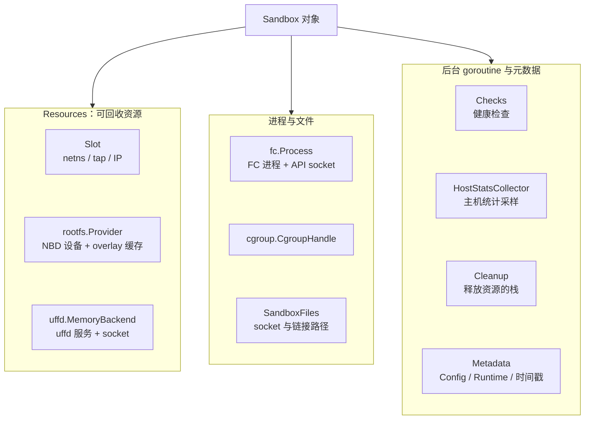
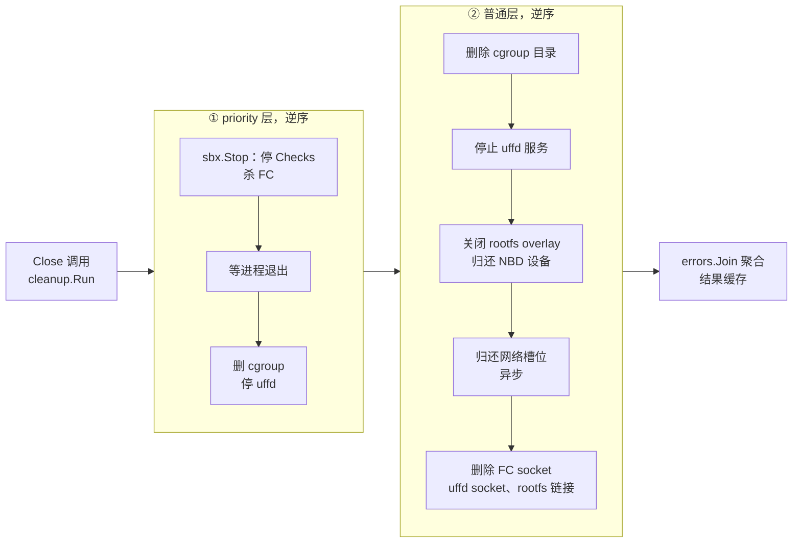

# 26 · Sandbox 对象与 Factory

> 一台运行中的沙箱在宿主上不是一个对象，而是一组分散的资源：一个网络槽位、一个 NBD 设备、
> 一个 uffd 服务线程、一个 Firecracker 进程、一个 cgroup、若干 socket 文件。
> 本篇讲 orchestrator 用什么结构把它们攥在一起，用什么规则把它们放开。
>
> **读者**：工程师、系统工程师。
> **预备**：[第 11 篇 · 对象模型与状态机](11-object-model.md)、[第 25 篇 · orchestrator 进程](25-orchestrator-process.md)。
> **代码**：`packages/orchestrator/internal/sandbox/sandbox.go`、`cleanup.go`、`map.go`、`metrics.go`、
> `checks.go`、`packages/orchestrator/internal/server/sandboxes.go`

---

## 0. 本篇要回答的问题

1. orchestrator 用什么结构表示一台运行中的沙箱？这个结构持有哪些宿主资源，哪些字段只是元数据？
2. 为什么创建沙箱要经过一个 `Factory`，而不是直接构造 `Sandbox`？Factory 里放的是什么？
3. `Wait`、`Close`、`Stop`、`Shutdown`、`Pause` 分别等什么、清什么？哪些可以重复调用？
4. 清理为什么做成一个栈，而不是一个固定顺序的函数？`AddPriority` 那一层解决了什么问题？
5. sandbox map 上有哪些并发问题？`LifecycleID` 和 `ExecutionID` 为什么必须是两个字段？

---

## 1. 问题：一台沙箱是宿主上的一堆资源

先看要管的东西有多少。一台恢复出来的沙箱在宿主上至少占着这些：

- 一个网络槽位：netns、veth 对、tap 设备、一组 iptables 规则、一个宿主侧 IP（[第 35 篇 §2](35-sandbox-networking.md#2-建立一个槽位createnetwork-的完整步骤)）；
- 一个 rootfs provider：一个从设备池借来的 `/dev/nbdX`、一个本地 overlay 缓存文件、一条服务它的 goroutine（[第 33 篇 §4](33-nbd-and-rootfs.md#4-两个-rootfs-provider)）；
- 一个内存后端：一个 uffd 服务、它监听的 UNIX socket、它注册的用户态缺页处理线程（[第 31 篇 §1](31-uffd-memory-backend.md#1-内存后端是一个接口)）；
- 一个 Firecracker 进程和它的 API socket（[第 28 篇 §3](28-firecracker-process-management.md#3-进程的创建观测与关停)）；
- 一个 cgroup 目录（[第 38 篇 §2](38-cgroups-and-host-stats.md#2-上游的-cgroup只记账不设限)）；
- 若干后台 goroutine：健康检查、主机统计采样、等待进程退出的哨兵；
- 若干文件路径：FC socket、uffd socket、rootfs 缓存的符号链接。

这些资源的共同点是**有限且可复用**：NBD 设备号、网络槽位的 IP 段、本地缓存盘的空间。
少释放一个，节点的容量就永久少一格，而且不会立刻报错 —— 表现是几小时后 `Create` 开始失败。
更糟的是**顺序敏感**：Firecracker 还在往 NBD 设备上写的时候把设备还给池子，
下一个沙箱借到同一个设备号，会读到别人的数据。

所以这个对象要解决的不是「怎么建」，而是「怎么在任意一步失败或任意时刻被杀掉时，都按正确顺序放开」。
`sandbox.go` 里 `Sandbox` 结构和 `cleanup.go` 里的清理栈是一对，分开看都看不明白。

## 2. Sandbox 结构：四组字段

`sandbox.go` 的 `Sandbox` 用两个嵌入结构分层：

```go
type Sandbox struct {
	*Resources
	*Metadata

	LifecycleID string

	config  cfg.BuilderConfig
	files   *storage.SandboxFiles
	cleanup *Cleanup

	process      *fc.Process
	cgroupHandle *cgroup.CgroupHandle

	Template template.Template
	Checks   *Checks
	hostStatsCollector *HostStatsCollector

	APIStoredConfig *orchestrator.SandboxConfig

	exit *utils.ErrorOnce
	stop utils.Lazy[error]
}
```

**第一组是资源句柄。** `Resources` 只有三个字段：`Slot *network.Slot`、`rootfs rootfs.Provider`、
`memory uffd.MemoryBackend`。后两个是小写的，包外拿不到 —— 外部要么通过 `Sandbox` 的方法访问，
要么根本不该访问。`process` 和 `cgroupHandle` 因为不是「池化资源」而放在外层。
注意 `memory` 是接口：`CreateSandbox()` 冷启动时装的是 `uffd.NewNoopMemory(...)`，
因为冷启动的内存不是从快照映射来的；`ResumeSandbox()` 装的才是真正的 uffd 服务。
`Pause()` 里的脏页判定统一调 `memory.DiffMetadata()`，走哪条路径由这个接口的实现决定 ——
两种实现给出的脏页信息来源不同（[第 37 篇 §3.1](37-pause-and-snapshot.md#31-两条来源取决于这台沙箱是不是从快照拉起的)）。

**第二组是元数据。** `Metadata` 里的 `Config` 是创建时的规格（vCPU、内存、大页开关、网络配置、
envd 的环境变量与 access token、Firecracker 配置、卷挂载），`Runtime` 是身份
（`TemplateID`、`SandboxID`、`ExecutionID`、`TeamID`）。这两块创建后不再改。
会改的是 `startedAt` 与 `endAt`，各自配一把 `sync.RWMutex`，只能通过
`GetStartedAt` / `SetStartedAt` / `GetEndAt` / `SetEndAt` 访问。
需要加锁是因为读写确实来自不同 goroutine：`endAt` 由 `Update` RPC 在延长沙箱超时时改写（`server/sandboxes.go` 的 `Update()`），
`startedAt` 在 `WaitForEnvd()` 成功后被改成「envd 就绪的时刻」而不是「开始创建的时刻」；
而读者是 `List` RPC 的遍历和 `WaitForExit()` 里算剩余时长的那次读。

**第三组是身份与状态。** `LifecycleID` 的注释写得很清楚：它每启动一个新的 Firecracker 进程就换一个，
而 `ExecutionID` 跨 checkpoint 保持稳定并且对 API 可见。为什么要两个，§7 会给出那个具体的竞态。
`APIStoredConfig` 标了 Deprecated，用途是 API 重启后能从 orchestrator 反查沙箱的原始配置，
`List` RPC 里没有它的沙箱会被跳过。

**第四组是同步原语。** `exit *utils.ErrorOnce` 是「这台沙箱已经终结」的一次性信号，
`stop utils.Lazy[error]` 是「停止操作最多做一次」的记忆化。这两个是 §5 的主角。

`Sandbox` 上还挂着 `Checks`。它不是独立服务而是对象的一部分，理由写在 `ResumeSandbox()` 的注释里：
暂停沙箱之前必须先停掉健康检查，否则会把「因为被暂停而不响应」误报成「沙箱不健康」。
把 `Checks` 放进对象，`Pause()` 与 `Shutdown()` 才能在自己的第一步里调 `s.Checks.Stop()`。



## 3. Factory：把进程级资源与单次创建分开

`Sandbox` 不是用构造函数直接建的，而是 `Factory` 的两个方法产出的。`Factory` 只有六个字段：

| 字段 | 是什么 | 为什么必须进程级 |
|---|---|---|
| `config` | `cfg.BuilderConfig`，路径、超时、存储配置 | 进程启动时读一次 |
| `networkPool` | 网络槽位池 | 槽位要预热，现场创建 netns 与 iptables 规则太慢 |
| `devicePool` | NBD 设备池 | `/dev/nbdX` 是全局有限资源，必须集中分配 |
| `featureFlags` | LaunchDarkly 客户端 | 带本地缓存与长连接，不能每次新建 |
| `hostStatsDelivery` | 主机统计的投递通道 | 批量写 ClickHouse，按进程聚合 |
| `cgroupManager` | cgroup 管理器 | 根 cgroup 只有一个；为 nil 表示不做 cgroup 记账 |

这六个东西的共同点是「贵、有限、或者天然唯一」。把它们从 `Sandbox` 里提出来放进 `Factory`，
带来两个结果：单个沙箱对象变得只关心自己的那一份资源；创建沙箱的函数签名变长，
`ResumeSandbox()` 要传七个参数，`CreateSandbox()` 要传八个。这是显式依赖注入的常见代价。

`Factory` 只有两个出口，注释都写着同一句警告 —— 用完必须 `Close()`：

- `CreateSandbox()`：冷启动，从模板的 rootfs 直接引导一台新 VM。全书只有模板构建路径走它
  （[第 41 篇 §4](41-template-build-overview.md#4-主流程)、[第 44 篇 §2](44-build-sandbox-and-commands.md#2-冷启动一台构建期沙箱)）。
  它给 `Resources.memory` 装的是 noop 内存后端，也不创建 cgroup。
- `ResumeSandbox()`：从快照恢复。所有面向用户的沙箱都走这条路，阶段划分见
  [第 27 篇 §3](27-resume-sandbox.md#3-并行段三个-promise-和一个后台预取)。

还有一处细节值得注意：`Factory.GetEnvdInitRequestTimeout()` 在创建时读一次 feature flag，
把结果固化进 `Metadata.internalConfig`。也就是说单次 envd init 请求的超时在沙箱创建那一刻就定死了，
之后改开关不影响已经跑起来的沙箱。这是特性开关与长生命周期对象相遇时的一个通用取舍：
读一次可预测，动态读则一致性差。

## 4. Cleanup：一个后进先出的清理栈

`cleanup.go` 里的 `Cleanup` 只有六十来行，但它是这一篇的核心。

```go
type Cleanup struct {
	cleanup         []func(ctx context.Context) error
	priorityCleanup []func(ctx context.Context) error
	error           error
	once            sync.Once
	hasRun          atomic.Bool
	mu              sync.Mutex
}
```

四条规则：

**规则一：逆序执行。** `run()` 先从后往前跑 `priorityCleanup`，再从后往前跑 `cleanup`。
后进先出的理由和函数栈一样：后建立的资源依赖先建立的资源。
`ResumeSandbox()` 里的注册顺序是「删除 socket 文件 → 归还网络槽位 → 关闭 rootfs overlay →
停止 uffd → 删除 cgroup」，逆序执行就变成「删 cgroup → 停 uffd → 关 overlay → 还槽位 → 删文件」，
恰好是依赖关系的反向。

**规则二：优先级层先跑。** `AddPriority()` 注册的函数整体先于普通层。
`CreateSandbox()` 和 `ResumeSandbox()` 各只往这一层注册了一个函数，就是 `sbx.Stop`。
道理是：Firecracker 进程还活着的时候，不能拆它脚下的 uffd、NBD 和 netns。
把「杀进程」放进普通层做不到这件事 —— 普通层里已经有别的项，而注册顺序由创建流程决定，
不由清理需求决定。多出一层优先级，等于给「必须最先做的事」留了一个不受注册顺序影响的位置。

**规则三：注册迟到就地执行。** `Add()` 和 `AddPriority()` 都先查 `hasRun`；
如果清理已经跑过，新注册的函数立刻用 `context.WithoutCancel(ctx)` 执行掉。
这解决的是并发窗口：某个资源在 goroutine 里创建，创建完成时清理已经开始，
如果只是把函数追加进切片，这个资源就永久泄漏了。代价是这条路径上的执行顺序无法保证，
所以它只是兜底，不是正常路径。

**规则四：清理不可被取消。** `Run()` 用 `sync.Once` 保证只跑一次，并且把上下文换成
`context.WithoutCancel(ctx)`。请求上下文早就取消了，但资源该还还得还。
所有失败聚合成一个 `errors.Join`，存在 `c.error` 里；后续调用 `Run()` 直接拿到同一个错误。

失败路径复用的是同一个栈。`CreateSandbox()` 与 `ResumeSandbox()` 开头就 `defer` 一段
「如果返回错误就 `cleanup.Run(ctx)`」。所以创建过程走到哪一步失败，已经注册的部分就回滚到哪一步，
不需要为每个阶段写一遍回滚代码。



图中 `Stop` 与普通层有重叠 —— cgroup 删除与 uffd 停止在两处都出现。这不是错误：
`cgroupHandle.Remove` 与 `uffd.Stop` 自身幂等，第二次调用是空操作。
用重复注册换取「不管从哪个入口进来都清得干净」，是这里的取舍。

## 5. 五个生命周期方法各自的语义

| 方法 | 等什么 | 做什么 | 可重入 | 典型调用者 |
|---|---|---|---|---|
| `Wait` | `exit` 被设置 | 不做事，只等 | 是，可多个 goroutine 同时等 | server 的生命周期 goroutine |
| `Stop` | 等 FC 进程真正退出 | 停检查、杀 FC、删 cgroup、停 uffd | 是，只有第一次真正执行 | `Delete` RPC、清理栈的优先层 |
| `Close` | 等整个清理栈跑完 | 跑 `cleanup.Run` | 是，`sync.Once` | server 的生命周期 goroutine、构建路径的 `defer` |
| `Shutdown` | 等快照写完、清理跑完 | 暂停 VM、造一次快照落盘、`Close` | 否 | 模板构建的 provision 阶段 |
| `Pause` | 等 diff 导出完成 | 暂停 VM、导快照与 diff、期间触发 `Close` | 否 | `Pause` / `Checkpoint` RPC |

**`Wait` 等的是什么。** `exit` 是 `utils.ErrorOnce`，由创建函数末尾那条 goroutine 设置。
`ResumeSandbox()` 里这条 goroutine 先 `select` 等 uffd 或 FC 任一退出，然后调 `sbx.Stop(ctx)`，
最后把 `Stop` 的错误、FC 的退出错误、uffd 的退出错误 join 起来写进 `exit`。
所以 `Wait` 返回的时刻，`Stop` 已经跑完了，但清理栈还没跑 —— 那是调用者随后 `Close()` 的事。
`CreateSandbox()` 里的版本更简单，只等 FC 进程。

**`Stop` 的幂等靠 `utils.Lazy`。** `Lazy[error].GetOrInit` 底层是 `sync.Once` 加一个缓存值：
第一次调用执行 `doStop`，并发的后续调用**阻塞**到第一次完成，然后拿到同一个错误。
这一点很重要：`Delete` RPC 里的异步 `Stop` 和清理栈里的 `Stop` 完全可能同时发生，
两者都会等到同一次真实停止结束。

`doStop` 的顺序是：停主机统计采集器（并采最后一个样本）→ `Checks.Stop()` →
`process.Stop(ctx)` → **阻塞**等 `<-s.process.Exit.Done()` → 删 cgroup → `memory.Stop()`。
中间那次阻塞等待没有配 `select ctx.Done()`，代码注释给了理由：进程没退出就往下清理会让整体状态变坏，
宁可在这里等。代价是这个方法在 Firecracker 卡死时没有超时上限，
需要靠外层 RPC 超时和进程管理去兜（[第 39 篇 §4](39-health-errors-and-teardown.md#4-两段式拆除stop-与-close)）。

**`Close` 是「释放全部」。** 它只有一行 `s.cleanup.Run(ctx)`。因为 `Stop` 在优先层里，
`Close` 隐含了 `Stop`；反过来不成立 —— `Stop` 只杀 VM，不还槽位、不删文件。
server 侧的正常流程因此是「先 `Wait`，再 `Close`」。

**`Shutdown` 是「干净关机」而不是「杀」。** 它先停检查，`process.Pause(ctx)` 暂停 VM，
然后为一个临时 build ID 造一份缓存文件，把快照写进去 —— 注释说明这一步只是因为
Firecracker 的 API 不接受 `/dev/null`，真正要的副作用是快照过程会把磁盘 drain 并 flush 干净 ——
最后调 `Close`。模板构建的 provision 阶段用它
（`internal/template/build/phases/base/provision.go`），因为那里需要 guest 的写全部落到 rootfs 上。

**`Pause` 有自己的清理栈。** 它另建一个 `Cleanup` 挂在返回的 `Snapshot` 上，
用来在导出失败时回收中间产物。这里只指出一个与本篇相关的细节：导出 rootfs diff 时传进去的
`RootfsDiffCreator` 带一个 `closeHook: s.Close`，而 `NBDProvider.ExportDiff()` 会在弹出缓存后
用 goroutine 调这个 hook，等 overlay 设备被释放才开始导出。
也就是说**沙箱的整栈清理发生在 `Pause` 中途**，不是之后。完整流程见[第 37 篇 §5](37-pause-and-snapshot.md#5-磁盘-diff另一条路)。

## 6. 谁在调用这些方法

`internal/server/sandboxes.go` 的 `setupSandboxLifecycle()` 是正常路径的模板：
把沙箱插进 map，然后起一条 goroutine，依次做 `sbx.Wait(ctx)` → `sbx.Close(ctx)` →
`s.sandboxes.RemoveByLifecycleID(...)` → `s.proxy.RemoveFromPool(sbx.LifecycleID)`。
这条 goroutine 用 `context.WithoutCancel` 与 `trace.WithNewRoot()` 脱离请求上下文，
因为它的寿命是沙箱的寿命，不是那次 RPC 的寿命。

`Delete` RPC 的顺序值得单独看：先 `s.sandboxes.Remove(...)` 把沙箱从 map 摘掉，
再做一次 `Checks.Healthcheck(ctx, true)` 记录最后的健康状态，然后**异步**调 `Stop`。
先摘再停是一条不变量：从 map 摘掉之后就路由不过去了，此时才能安全地杀 VM，
否则正在代理中的请求会打到一台正在死的沙箱上。`Close` 不在这里做 —— `Stop` 会让 FC 退出，
`Wait` 随即返回，生命周期 goroutine 接手完成清理。

构建路径没有这条生命周期 goroutine，`Close()` 是被直接调用的，一共四个点：
`internal/template/build/layer/layer_executor.go` 与 `phases/optimize/builder.go`、
`phases/base/provision.go` 都在拿到沙箱之后立刻 `defer sbx.Close(ctx)`；
`layer/create_sandbox.go` 的 `defer` 则只在返回错误时执行 `errors.Join(err, sbx.Close(ctx))` ——
成功创建的沙箱交给上层，由 `layer_executor.go` 的 `defer` 负责收。
provision 阶段两者都有：先显式 `sbx.Shutdown(ctx)` 落一次快照，再由已注册的 `defer Close` 兜底，
重复调用无害，因为 `cleanup.Run` 由 `sync.Once` 保护。

`Pause` 与 `Checkpoint` 用 `acquireSandboxForSnapshot()`：在一把 `pauseMu` 下 `Get` 再 `Remove`，
保证同一台沙箱不会被两个暂停请求同时拿到。两者都 `defer s.stopSandboxAsync(...)`，
理由写在 `Checkpoint` 的注释里：成功时新沙箱接管，失败时避免留下一台还在跑但已经不可寻址的沙箱，
而 `Stop` 幂等，重复调用无害。

## 7. sandbox map 与并发

`map.go` 的 `Map` 是两样东西的组合：一个 `smap.Map[*Sandbox]`（底层是分片的
`concurrent-map`，写不互相阻塞），加一个订阅者列表。

订阅者接口只有 `OnInsert` 和 `OnRemove`。上游 2026.09 有两个实现：
`internal/proxy/proxy.go` 的 `SandboxProxy` 和 `internal/tcpfirewall/proxy.go` 的 `Proxy`，
两者的 `OnInsert` 都是空的，`OnRemove` 都是从连接限流器里删掉该沙箱的条目。
触发是**异步**的：`Insert` 与 `Remove` 都用 `go m.trigger(...)` 发出通知。
推论：订阅者回调不能假定自己在 `Remove` 返回之前完成，也不能假定多个订阅者之间有顺序，
所以回调里只适合放幂等的、与正确性无关的清理。

`GetByHostPort()` 是反向查找：把宿主侧地址解析出 IP，线性遍历所有沙箱比对
`Slot.HostIPString()`。它服务于三个「沙箱主动连回来」的场景 —— hyperloop 的 `/me` 与日志上报、
NFS proxy、TCP 防火墙。代价是每次查找 O(n)，n 是节点上的沙箱数；
收益是不需要维护第二张索引表，也就不需要在两张表之间保持一致。

`RemoveByLifecycleID()` 是本篇开头那两个 ID 的用武之地。考虑 `Checkpoint` 的时序：
老沙箱被暂停并从 map 摘除，新沙箱用**同一个** `SandboxID` 和 `ExecutionID` 恢复出来并插回 map。
此时老沙箱的生命周期 goroutine 才刚从 `Wait` 里醒来，正准备做 `Remove(sandboxID)` ——
如果按 ID 删，它会把刚插进去的新沙箱删掉。
`RemoveByLifecycleID` 用条件删除解决：只有当 map 里那个对象的 `LifecycleID`
和自己相等时才删。`LifecycleID` 每次启动新的 Firecracker 进程都重新生成，
所以老 goroutine 的条件不成立，删除是个空操作。
同一个 ID 还用作 orchestrator 代理的连接池键，`RemoveFromPool(sbx.LifecycleID)`
关掉的是指向那个已死进程的连接（[第 36 篇 §2.2](36-orchestrator-proxy-and-envd-client.md#22-连接池的-key-为什么是-lifecycleid)）。

## 8. 挂在对象上的观测面

`checks.go` 的 `Checks` 持有一个反向指针 `sandbox *Sandbox`，一个 `cancelCtx`，
一个 `healthy atomic.Bool`。`logHealth()` 是一个 20 s 的 ticker 循环，每次调 `getHealth()`：
按 `Slot.HostIPString()` 拼出 envd 的 `/health` 地址，100 ms 超时，期望 204。
`Healthcheck()` 里用 `CompareAndSwap` 判断状态是否翻转，只有翻转时才写日志 ——
否则一台沙箱活一小时会产生一百八十条同样的健康日志。`Stop()` 只是取消上下文，
错误原因是 `ErrChecksStopped`，调用方据此区分「沙箱停了」和「沙箱不健康」。

`metrics.go` 里的 `Metrics` 是 guest 内的资源用量：CPU 核数与使用率、内存总量与用量、
磁盘总量与用量，外加一个 guest 侧时间戳。`GetMetrics()` 也挂在 `Checks` 上，
走的是同一个 `sandboxHttpClient` 与同一个 access token 头，请求 envd 的 `/metrics`。
数据是 guest 自报的，不是宿主观测的 —— 宿主视角的那一份由 `hoststats_collector.go` 从
Firecracker 的 PID 和 cgroup 采集（[第 38 篇 §5](38-cgroups-and-host-stats.md#5-host-stats采样与投递)）。
真正的采集循环在 `internal/metrics/sandboxes.go`：一个 OTel 回调遍历整张 map，
按 envd 版本过滤，按 `Checks.UseClickhouseMetrics` 过滤，并发拉取（并发度按沙箱数计算），
单次超时 100 ms，顺带比对 guest 与宿主的时钟漂移。
`GetMetrics` 返回 `ErrChecksStopped` 时直接跳过，因为那说明沙箱在采集期间停了。

这里有一个容易被忽略的约束，代码注释也点了：拉指标时必须确保沙箱对象没变，
因为网络槽位可能已经被回收并分给另一台沙箱 —— 那样就会拿着别人的 IP 去要指标。
遍历 `Items()` 拿到的是对象指针快照，这个约束靠「槽位归还发生在清理栈里、
而清理栈跑完之前对象仍然可达」来维持。

## 9. ARM 适配版的差异

ARM 适配版对本篇涉及的文件有两处改动。一是 `checks.go` 的两个常量放宽：
健康检查间隔从 20 s 改到 300 s，单次超时从 100 ms 改到 60 s，
后者相当于把「快速失败」换成了「几乎不会失败」，代价是不健康的沙箱要很久才被发现
（[第 73 篇 §4](73-cgroup-and-host-compat.md#4-健康检查两个放宽的常量与一个没跟着改的)）。
二是 `sandbox.go` 的 `ResumeSandbox()` 里插入了若干耗时埋点日志，
并把 trace ID 一路传给 `fc.Process.Resume()`（[第 71 篇 §8](71-orchestrator-arm-fc-changes.md#8-resumesandbox-埋点与-traceid)）。
`cleanup.go`、`map.go`、`metrics.go` 三个文件在 ARM 补丁中未改动。

## 10. 小结

- 一台沙箱在宿主上是一组有限且顺序敏感的资源；`Sandbox` 对象的主要职责是持有它们，
  `Cleanup` 的主要职责是按正确顺序放开它们。
- `Resources` 里的 `rootfs` 与 `memory` 是包内私有的接口；`memory` 的实际类型区分了冷启动与恢复两条路径。
- `Factory` 装的是进程级共享资源：网络槽位池、NBD 设备池、feature flags、主机统计投递、cgroup 管理器。
  它只有 `CreateSandbox`（仅模板构建用）与 `ResumeSandbox`（所有用户沙箱）两个出口。
- 清理栈是后进先出的两层结构：优先层放必须最先做的 `Stop`，普通层按注册的逆序回滚。
  清理只跑一次、不可被上下文取消、注册迟到就地执行。
- `Wait` 等终结信号，`Stop` 杀 VM 且幂等，`Close` 跑完整清理栈且隐含 `Stop`，
  `Shutdown` 是带落盘的干净关机，`Pause` 在中途触发 `Close`。
- `Stop` 里等待 FC 进程退出的那一步没有超时，这是为了不在进程未退出时继续拆资源而付的代价。
- server 的不变量是「先从 map 摘除，再停沙箱」：摘除切断路由，之后杀 VM 才安全。
- `LifecycleID` 与 `ExecutionID` 分开，是为了让老沙箱的清理 goroutine 不会误删
  用同一个 `SandboxID` 恢复出来的新沙箱；`RemoveByLifecycleID` 做的是条件删除。
- map 的订阅通知是异步的，回调只适合放幂等且与正确性无关的清理。

## 延伸阅读 / 下一篇

- [第 27 篇 · ResumeSandbox：从快照拉起一台沙箱](27-resume-sandbox.md#4-串行段从-fcnewprocess-到-resumevm)：本篇留下的创建流程细节。
- [第 37 篇 · Pause：脏页判定与差分导出](37-pause-and-snapshot.md#2-pause-的时序)：`Pause()` 的完整语义。
- [第 39 篇 · 健康检查、错误语义与清理](39-health-errors-and-teardown.md#5-清理顺序哪些是不变量哪些不是)：各条退出路径与清理不变量。
- [第 25 篇 · orchestrator 进程](25-orchestrator-process.md#4-进程持有的共享资源)：`Factory` 里那些池子由谁在启动时建立。
- [第 12 篇 · 端到端走查：一个沙箱的一生](12-sandbox-lifecycle-walkthrough.md#9-两种结束)：本篇各方法在端到端流程中的位置。
