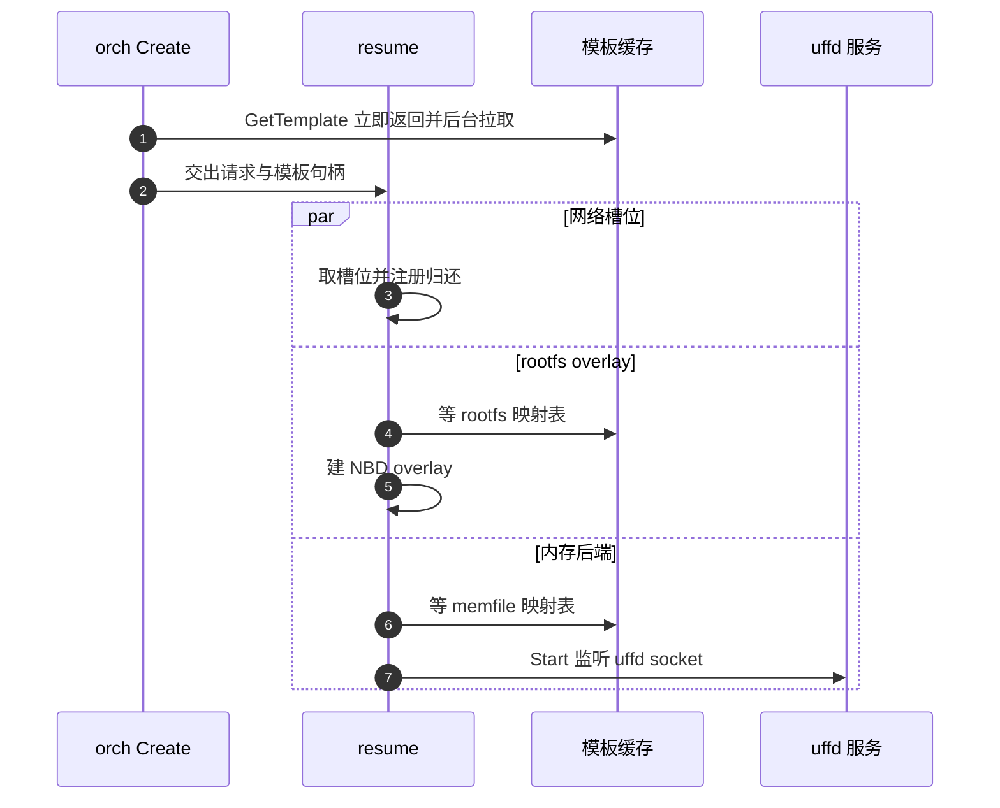
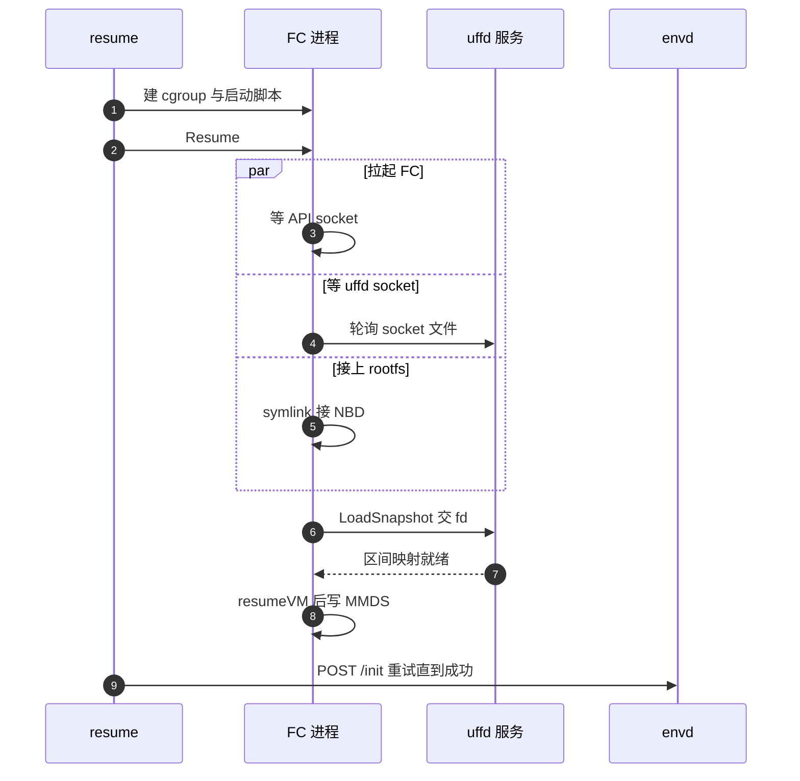

# 27 · ResumeSandbox：从快照拉起一台沙箱

> 用户调 `Sandbox.create()` 时，节点上并没有「开机」这回事：orchestrator 走的是从快照恢复的路径。
> 本篇拆开这条路径的每一个阶段，说明哪些阶段并行、每一步在等什么、失败时回滚到哪里、
> 超时分别由谁规定。
>
> **读者**：想读懂 orchestrator 核心代码的工程师。
> **预备**：[第 26 篇 · Sandbox 对象与 Factory](26-sandbox-object.md)、
> [第 03 篇 · Firecracker 入门](03-firecracker-primer.md)、[第 05 篇 · userfaultfd](05-userfaultfd.md)。
> **代码**：`packages/orchestrator/internal/sandbox/sandbox.go`、
> `packages/orchestrator/internal/server/sandboxes.go`、
> `packages/orchestrator/internal/sandbox/fc/process.go`

---

## 0. 本篇要回答的问题

1. 为什么面向用户的沙箱创建走的是「恢复」而不是「冷启动」？冷启动在哪里还留着？
2. `ResumeSandbox()` 里哪些工作真正并行，同步点在哪几行？
3. 快照加载这一步为什么必须等 uffd，两个进程之间是怎么握手的？
4. 任何一个阶段失败时，已经申请的网络槽位、NBD 设备、cgroup、FC 进程谁来收？
5. 这条路径上一共有多少个超时，各自由谁规定，超了会返回什么错误？

---

## 1. 恢复，而不是启动

一台 microVM 冷启动要做的事是完整的：加载内核、跑 init、起 systemd、起 envd。
即便 Firecracker 把固件那一段砍掉了，guest 内核与用户态的初始化仍然是几百毫秒到数秒的量级，
而且这段时间几乎全部是可预测的重复劳动 —— 同一个模板的第 1 台和第 1000 台沙箱，
启动过程一模一样。

e2b 的做法是把这段劳动做一次、存下来：模板构建的最后一步把虚机暂停并导出快照
（`snapfile` + `memfile` + `rootfs.ext4` 及其映射表，见[第 29 篇 §2](29-template-artifact-format.md#2-一代产物六个对象)），
之后所有沙箱都从这份快照恢复。用户暂停自己的沙箱产生的也是同一形态的产物，
所以「从模板创建」和「从暂停中恢复」在 orchestrator 内部是同一条代码路径。

代价有两个。其一，恢复出来的 guest 内存不是本地的，它由宿主上的 uffd 服务按缺页供给，
第一次访问某一页要走一次用户态缺页处理（[第 31 篇 §4](31-uffd-memory-backend.md#4-一次缺页)）；
沙箱不再有「启动慢、之后快」的曲线，而是「起得快、前若干秒的内存访问偏慢」。
其二，guest 是从快照那一刻继续跑的，它对时间、网络、身份的认知全部停在过去，
必须有人把这些重新对齐 —— 这件事由 `§5` 讲的 envd 重新初始化承担。

冷启动路径在代码里仍然存在，但只服务于模板构建：`sandbox.go` 的 `CreateSandbox()`
只被 `internal/template/build/` 下的 `layer.NewCreateSandbox()` 与
`phases/base/provision.go` 调用；orchestrator 的 `Create` RPC 一律走 `ResumeSandbox()`。
两者的差别见 `§7`。

## 2. 入口：Create RPC 在调 ResumeSandbox 之前做什么

`internal/server/sandboxes.go` 的 `Server.Create()` 是唯一的对外入口，
它在把请求交给 `sandboxFactory.ResumeSandbox()` 之前做四件事。

**第一，给整个请求套一个 60 秒的截止时间。** `requestTimeout = 60 * time.Second`，
用 `context.WithTimeoutCause` 设置，超时原因是 `request timed out`。
这个 ctx 会一路传进 `ResumeSandbox()`，是后面绝大多数等待的总闸门。

**第二，容量准入。** 先按 feature flag `max-sandboxes-per-node`（默认 200）
检查节点上正在跑的沙箱数，超了返回 `ResourceExhausted`。再取并发启动信号量
`startingSandboxes`，容量是常量 `maxStartingInstancesPerNode = 3`。这里有一处不对称：
请求里 `snapshot = true`（从用户暂停的快照恢复）时走 `waitForAcquire()`，
在 `acquireTimeout = 15 * time.Second` 内排队等待；`snapshot = false`
（从模板的基础快照创建）时走 `TryAcquire()`，拿不到立即返回 `ResourceExhausted` 让 api 换个节点重试。
差别的理由是放置策略：恢复请求带节点亲和性（快照产物的本地缓存在原节点上，
见 `packages/api/internal/orchestrator/create_instance.go` 里 `isResume && nodeID != nil` 的分支），
换节点的代价高，所以宁可排队；创建请求可以由 api 重新放置
（[第 19 篇 §6.1](19-node-management-and-placement.md#61-api-侧的重试循环)）。

**第三，取模板句柄。** `templateCache.GetTemplate()` 不阻塞：
`internal/sandbox/template/cache.go` 的 `getTemplateWithFetch()` 在缓存未命中时
用 `go storageTemplate.Fetch(context.WithoutCancel(ctx), ...)` 起一个后台拉取，
立刻返回句柄。真正的等待发生在后面调 `Memfile()` / `Rootfs()` / `Snapfile()` / `Metadata()` 时 ——
这四个方法都落到 `utils.SetOnce.Wait()` 上。

这里有一个值得记住的细节：`SetOnce.Wait()` **不接受 context**
（`packages/shared/pkg/utils/set_once.go`），后台 `Fetch` 用的又是 `context.WithoutCancel`。
所以「等模板产物就绪」这个等待既不受 60 秒请求超时约束，也不受请求取消影响；
它只在 `Fetch` 自己把值或错误写进 `SetOnce` 时才结束。
推论：模板首次拉取很慢时，`Create` 请求会在这里超过 60 秒才失败，
而客户端看到的错误来自更上层的 gRPC 截止时间。

**第四，网络配置的处理。** 请求里的网络配置被 `proto.CloneOf` 复制一份再改，
不允许出网时给 `Egress.DeniedCidrs` 塞进全网段。

`ResumeSandbox()` 返回后，`Create` 把沙箱登记进 sandbox map（`setupSandboxLifecycle`）、
异步发一条 `SandboxResumed` 或 `SandboxCreated` 事件，然后只回一个 `ClientId`。
错误映射只有一条特例：`storage.ErrObjectNotExist` 被翻成 `FailedPrecondition`，
含义是「快照产物还没传完」，api 侧据此重试而不是判定失败。

## 3. 并行段：三个 promise 和一个后台预取

`ResumeSandbox()` 前半段不用 `errgroup`，而是用 `utils.NewPromise` —— 每个 promise
在创建时立刻起一个 goroutine 跑，结果写进 `SetOnce`，调用方在需要时 `Wait(ctx)`。
与 `errgroup` 的差别是：promise 之间没有「一个失败就取消其余」的联动，
每个分支各自跑完，主流程按固定顺序逐个 `Wait`，第一个出错的决定返回值。
代价是失败时其余分支仍在跑，收益是这些分支申请的资源都已经注册进 `cleanup`，不会漏。

按代码顺序，前半段一共起了四条并发线：

1. **uffd 对象**（`uffdPromise`）：等模板 memfile 就绪，用它和 uffd socket 路径构造 `uffd.Uffd`。
   注意这一步只是构造对象，还没监听。
2. **预取**（一个裸 `go func`）：等模板 metadata，若其中有 `Prefetch.Memory` 映射，
   就等 `uffdPromise`，然后起 `prefetch.New(...).Start()`。
   它从对象存储取数据可以立刻开始，往 guest 内存里灌要等 uffd 就绪
   （[第 32 篇 §3](32-memory-prefetch-and-hugepages.md#3-预取怎么跑)）。这条线的错误全部被吞掉：
   任何一步失败就 `return`，恢复照常进行，只是没有预取。
3. **网络槽位**（`ipsPromise` → `getNetworkSlot()`）：从 `network.Pool` 取一个槽位。
   `pool.Get()` 先试复用池，空了再等新槽位池，这一支等待受 ctx 约束。
   拿到后立刻注册归还槽位的清理函数（[第 35 篇 §3](35-sandbox-networking.md#3-池两条队列两种优先级)）。
4. **rootfs overlay**（`overlayPromise`）：等模板 rootfs 就绪，建 `rootfs.NewNBDProvider`，
   注册 `overlay.Close`，再起一个 goroutine 跑 `overlay.Start(execCtx)`
   （[第 33 篇 §4](33-nbd-and-rootfs.md#4-两个-rootfs-provider)）。

第五条线 `memoryPromise` 依赖第一条：它 `Wait` 到 uffd 对象后调 `serveMemory()`，
后者执行 `fcUffd.Start()` —— 监听 uffd 的 Unix socket、创建 fd-exit、
起一个 goroutine 进入 `handle()` 等 Firecracker 来连。

主流程随后连着三个同步点：`ipsPromise.Wait` → `overlayPromise.Wait` → `memoryPromise.Wait`。
顺序是固定的，所以「等网络槽位」的观测耗时里不含另外两支的时间，
但总时长约等于三者的最大值。这三个 `Wait` 都带 ctx，会被 60 秒请求超时打断。

三条线都就绪之后，主流程进入不能并行的串行链，下图是这一段。

## 4. 串行段：从 fc.NewProcess 到 resumeVM

资源就绪之后是一段不能并行的串行链。

**取 metadata 与建 cgroup。** `t.Metadata()` 给出模板版本与基础 build ID，
`fc.RootfsPaths` 要用它们拼出 rootfs 的路径形态（v1 与 v2 模板的路径规则不同）。
`createCgroup()` 是**尽力而为**的：`cgroupManager` 为空，或者创建失败，
都只记一条 warn 然后返回 `cgroup.NoCgroupFD`，恢复继续
（[第 38 篇 §2.2](38-cgroups-and-host-stats.md#22-原子放置clone_into_cgroup)）。这是这条路径上唯一一处「失败不致命」的步骤。

**`fc.NewProcess()`** 只做组装：构造启动脚本、`os.Stat` 检查 Firecracker 二进制与内核文件存在、
准备 `exec.CommandContext` 的 `unshare -m -- bash -c ...`。进程此时还没起。
注意它绑定的是 `execCtx` 而不是请求 ctx —— `execCtx` 来自 `startExecutionSpan()`，
是一个 `context.WithoutCancel` 出来的新根，所以请求返回或超时不会顺手杀掉沙箱。

**取 snapfile 与 uffd 句柄。** `t.Snapfile()` 又是一次可能阻塞的 `SetOnce.Wait()`。
`uffdPromise.Wait()` 此时必然已就绪。

**uffd 退出联动。** 主流程用 `context.WithCancelCause` 派生 `uffdStartCtx`，
并起一个 goroutine 盯着 `fcUffd.Exit()`：uffd 服务一旦提前退出，这个 ctx 立即被取消，
取消原因写成 `uffd process exited: ...`。`fcHandle.Resume()` 用的正是这个 ctx。
没有这层联动的话，uffd 崩了之后 FC 会一直等一个永远不会到来的连接。

**`Process.Resume()`**（`fc/process.go`）里才是真正的并发三件套，这里用的是 `errgroup`：

| 分支 | 做什么 | 等什么 |
|---|---|---|
| `configure()` | `cmd.Start()` 拉起 unshare + netns 内的 FC，接上日志 writer，必要时用 `CLONE_INTO_CGROUP` 把进程直接放进 cgroup | `socket.Wait()` 轮询 FC 的 API socket 文件出现 |
| socket 等待 | 无 | `socket.Wait()` 轮询 uffd socket 文件出现 |
| rootfs 接线 | 把 `rootfs.link` 从 `/dev/null` 改指向 NBD 设备 | `rootfsProvider.Path()` |

`errgroup.WithContext` 在这里是有意义的：任一分支出错，`egCtx` 被取消，
另外两个 `socket.Wait` 立即返回；`eg.Wait()` 拿到错误后统一调 `p.Stop(ctx)`。
`socket.Wait()` 本身**不带超时**，它只是每 10 ms `os.Stat` 一次，
退出条件完全来自传入的 ctx —— 这也是 ARM 适配版改动的地方（`§8`）。

**加载快照。** `client.loadSnapshot()` 调 Firecracker 的 `PUT /snapshot/load`，
`mem_backend` 指定为 `Uffd` 类型加 socket 路径，`resume_vm` 传 `false`。
FC 在处理这个请求时会连上 uffd socket，把自己的内存区间映射和一个 userfaultfd 文件描述符
通过 `SCM_RIGHTS` 发过来；宿主侧 `uffd.handle()` 收到后关闭 `readyCh`。
`loadSnapshot` 在 API 调用返回之后还要 `select` 等这个 `uffdReady` 通道，
因为 FC 的 load 返回不等于宿主已经准备好供页。这一步是两个进程之间唯一的握手点。

**恢复与 MMDS。** 先 `PATCH /vm` 把状态改成 `Resumed`，guest 从这一刻开始跑；
再 `setMmds()` 写入本次执行的元数据：sandbox ID、模板 ID、日志收集地址，
以及本次 access token 的哈希。顺序是「先跑起来再写 MMDS」，
所以 guest 里的 envd 在极短的一段时间里读到的可能还是上一次执行的 MMDS 内容；
真正的身份对齐靠下一节的 `/init` 请求。

## 5. 恢复之后：envd 与 guest 看到的世界

快照里的 guest 停在暂停那一刻：它的时钟是旧的，它记着的网络接口是上一台宿主给的 tap，
它持有的 access token 是上一次执行的。orchestrator 用一次 HTTP 请求把这些重新对齐。

`WaitForEnvd()`（`sandbox.go`）的超时来自 `cfg.BuilderConfig.EnvdTimeout`，
环境变量 `ENVD_TIMEOUT`，默认 10 秒。它起一个 goroutine 同时盯三件事：超时、ctx 结束、
FC 进程提前退出 —— 任意一件发生就 `cancel` 掉初始化的 ctx，
所以 FC 中途死掉时不用等满 10 秒。

初始化本身是 `initEnvd()`（`envd.go`）：向 `http://<slot 的宿主 IP>:<envd 端口>/init`
POST 一个 JSON，内容包括环境变量、hyperloop 地址、access token、默认用户与工作目录、volume 挂载。
请求走 `doRequestWithInfiniteRetries()`：**单次**请求的超时来自 feature flag
`envd-init-request-timeout-milliseconds`（默认 50 ms），失败就 5 ms 后重试，
直到父 ctx 结束。这个设计假设 envd 已经在 guest 里跑着，只是刚恢复的头几十毫秒里
网络栈还没接好，所以宁可用极短超时快速重试，也不要一次长等待。
请求带 `X-Access-Token` 头，注释里写明了原因：恢复场景下 envd 可能已经被授权过，
不带头会被拒。返回 204 之外的任何状态码都算失败。

`/init` 成功之后 `WaitForEnvd` 才把 `startedAt` 置为当前时间，并记录一次直方图。
这里可以看出 orchestrator 眼中的「沙箱可用」比 guest 内核意义上的「恢复完成」要晚一点。

## 6. 失败回滚与超时来源

回滚的载体是 `Cleanup`（`internal/sandbox/cleanup.go`）：两个栈，普通栈和优先栈，
`Run()` 先逆序跑优先栈再逆序跑普通栈，`sync.Once` 保证只跑一次。
`ResumeSandbox()` 头上的 `defer` 只在返回错误时调 `cleanup.Run(ctx)`；成功返回时
清理栈被交给 `Sandbox` 对象，由 `Close()` 在沙箱结束时执行。

按注册顺序，`ResumeSandbox` 往栈里放的是：删除沙箱的 socket 与符号链接文件、
关闭 rootfs overlay、归还网络槽位、停 uffd、移除 cgroup，最后 `AddPriority` 放进 `sbx.Stop`。
所以出错时的实际执行顺序是：先 `sbx.Stop`（停 FC、等进程退出、移 cgroup、停 uffd），
再逆序跑普通项，最后删文件。其中 overlay 与网络槽位由并发的 promise 注册，
两者的相对次序不确定（推论：它们互不依赖，次序无关紧要）。归还网络槽位是异步的 ——
`getNetworkSlot` 注册的清理函数把 `networkPool.Return` 丢进 goroutine，
理由写在注释里：它不影响沙箱生命周期。

有两个 `Stop` 的调用点容易重复：`Process.Resume()` 内部每一步出错都会先调 `p.Stop(ctx)`，
外层 `sbx.Stop` 又会调一次。`Sandbox.Stop` 用 `utils.Lazy` 保证只执行一次，
`Process.Stop` 则先检查 `Exit.Done()` 已关闭就直接返回，两处都是幂等的。

成功返回之后，还有一个常驻 goroutine 盯着 `fcUffd.Exit()` 与 `fcHandle.Exit`，
任一退出就调 `sbx.Stop` 并把错误合并进 `exit`。这是沙箱异常死亡时的兜底。

这条路径上的超时汇总如下。

| 超时 | 值 | 出处 | 超时后 |
|---|---|---|---|
| 请求总时长 | 60 s | `server/sandboxes.go` `requestTimeout` | 带 ctx 的等待返回，`Create` 报 `Internal` |
| 并发启动排队 | 15 s | 同上 `acquireTimeout`，仅 `snapshot=true` | `ResourceExhausted` |
| 模板产物就绪 | 无 | `utils.SetOnce.Wait()` 不接受 ctx | 无上限，只能等 `Fetch` 出结果 |
| FC / uffd socket 出现 | 无 | `socket/socket.go` `Wait()`，只受 ctx 约束 | 随 `egCtx` 或请求 ctx 结束 |
| uffd 等 FC 连接 | 10 s | `uffd/uffd.go` `uffdMsgListenerTimeout` | `Accept` 失败，uffd 退出，`uffdStartCtx` 被取消 |
| envd 初始化总时长 | 10 s | `ENVD_TIMEOUT`，`cfg/model.go` 默认值 | `failed to wait for sandbox start` |
| envd 单次 `/init` | 50 ms | feature flag `envd-init-request-timeout-milliseconds` | 5 ms 后重试 |
| 沙箱 HTTP 客户端 | 10 s | `sandbox.go` `sandboxHttpClient` | 该次请求失败 |
| FC 停止 | 10 s | `fc/process.go` `Stop()`，SIGTERM 后 | 发 SIGKILL |

表里「FC / uffd socket 出现」那一行在 ARM 适配版上不成立，这一点值得在此点明：
ARM 的 `socket.Wait()` 用 `context.WithTimeout(context.Background(), ...)` 覆盖了传入的 ctx，
两处 socket 等待因此既不再随 `egCtx` 的取消而返回，也不再受请求总超时约束，
只受自带的 `SOCKET_WAIT_TIMEOUT_SECONDS`（默认 300 s）约束。
直接后果是 FC 进程提前死掉时，等 uffd socket 的那一支不会被立刻叫醒，而要等满自己的超时
（[第 71 篇 §4.2](71-orchestrator-arm-fc-changes.md#42-arm-适配版的改法与后果)）。

## 7. 与 CreateSandbox 的区别

| 维度 | `ResumeSandbox()` | `CreateSandbox()` |
|---|---|---|
| 调用方 | `server/sandboxes.go` 的 `Create`、`Resume`；构建流程中的层复用 | 只有 `internal/template/build/` 下的构建阶段 |
| 内存来源 | uffd 服务按缺页供给快照内存 | `uffd.NewNoopMemory()`，guest 内存是普通匿名内存 |
| rootfs | 必定是 NBD overlay | `rootfsCachePath` 非空时用 `NewDirectProvider`，为构建准备全脏的本地文件 |
| FC 调用序列 | `Resume()`：load snapshot → resume → MMDS | `Create()`：boot source → drive → 网卡 → machine-config → 熵源 → start |
| 内核参数 | 快照里已固化 | 由 `Create()` 现场拼 `KernelArgs` |
| cgroup | 建 cgroup 并把 FD 交给 clone | 传 `cgroup.NoCgroupFD`，不放进 cgroup |
| 并发结构 | 四条 promise + 内层 errgroup | 一条网络槽位 promise，其余顺序执行 |
| envd | `WaitForEnvd` 由调用方之外的同一函数完成 | 同样调 `WaitForEnvd`，但 guest 是冷启动的 |
| 退出监听 | 同时盯 FC 与 uffd | 只盯 FC |

一句话概括：`CreateSandbox` 是「造快照的人」用的，`ResumeSandbox` 是「用快照的人」用的。

## 8. 各阶段耗时的量级

单机离线版的 `benchmark/README.md` 给出了一份阶段名与埋点日志的对照，
以及一组参考量级：总耗时与「恢复虚拟机」约 31~47 ms，其中「等待 firecracker 启动」约 22 ms、
「等待 uffd sock」约 10.5 ms、「加载快照」5~16 ms、「准备 rootfs」多数 0.03 ms 而偶发 38 ms、
「获取网络槽位」约 0.05 ms。

引用这组数字要带三个限定。其一，它们来自该文档所引的上游报告的 4 个样本，
机型、内核、存储后端未在文档中给出，只能当量级参考，不能当基线。
其二，口径是 orchestrator 内 `ResumeSandbox` 函数的耗时，**不含** api 网关、准入排队、
edge 侧的 envd 就绪轮询，所以客户端观测到的 `Sandbox.create()` 会明显更大。
其三，第一台沙箱要拉模板缓存，耗时高几个量级，必须预热后再统计。
ARM 平台上的实测与瓶颈分析见[第 84 篇 §5](84-arm-performance.md#5-已有的数据)与[§6](84-arm-performance.md#6-瓶颈在哪一段)。

从结构上可以直接读出两条：并行段的耗时约等于三支的最大值，而不是三者之和；
「恢复虚拟机」这一段里，`max(等 FC 启动, 等 uffd socket, 接 rootfs)` 之后才是加载快照与恢复，
所以优化 FC 进程拉起的收益上限，就是它超出另外两支的那一部分。

## 9. ARM 适配版的差异

ARM 适配版在这条路径上做了两类改动。一是埋点：`ResumeSandbox()` 与 `Process.Resume()`
里插入了一组带 `[ResumeSandbox]` 前缀和 traceID 的 zap 日志，逐阶段记录耗时，
`Resume()` 因此多了一个 `traceID` 参数；单机离线版的基准测试工具正是靠解析这些日志出报告。
二是放宽超时与并发：`requestTimeout` 60 s → 300 s，`acquireTimeout` 15 s → 300 s，
`maxStartingInstancesPerNode` 3 → 30 并改为可由 `MAX_STARTING_INSTANCES_PER_NODE` 覆盖，
非快照路径的 `TryAcquire` 改成带超时的 `Acquire`，`socket.Wait()` 加了默认 300 秒的自带超时，
`uffdMsgListenerTimeout` 10 s → 120 s。这些值放宽的后果是失败发现得更晚，
排队而不是快速失败也会改变 api 侧的重试行为。改动清单与逐项理由见
[第 71 篇 · orchestrator 的 ARM 改动 I](71-orchestrator-arm-fc-changes.md#9-参数总表)。

## 10. 小结

- 面向用户的沙箱创建没有冷启动，`Create` RPC 一律走 `ResumeSandbox()`；
  冷启动的 `CreateSandbox()` 只服务于模板构建。
- `ResumeSandbox()` 的并行靠 `utils.Promise` 而非 `errgroup`：分支之间不互相取消，
  主流程按固定顺序 `Wait`，资源在申请到的瞬间就注册进清理栈。
- 三个同步点是 `ipsPromise.Wait`、`overlayPromise.Wait`、`memoryPromise.Wait`，
  之后才进入串行的 FC 阶段。
- `Process.Resume()` 内部用 `errgroup` 并行拉起 FC、等 uffd socket、接 rootfs 链接，
  三者收敛后才 `loadSnapshot`。
- FC 与宿主 uffd 的唯一握手点是 `loadSnapshot` 之后对 `uffdReady` 的等待：
  FC 通过 socket 交出 userfaultfd 与内存区间映射，宿主侧收到才算就绪。
- 恢复出的 guest 的时间、身份、环境由 envd 的 `/init` 重新对齐；
  该请求单次超时 50 ms、无限重试，总时长受 `ENVD_TIMEOUT`（默认 10 s）约束。
- 失败回滚由 `Cleanup` 的优先栈与普通栈承担，`sbx.Stop` 排在最前，
  各级 `Stop` 都做了幂等处理。
- 这条路径上「等模板产物」是唯一不受请求 ctx 约束的等待，因为 `SetOnce.Wait()` 不接受 context。
- ARM 适配版加了逐阶段埋点，并把请求、排队、socket 等待、uffd 监听四处超时整体放宽。

## 延伸阅读 / 下一篇

- [第 26 篇 · Sandbox 对象与 Factory](26-sandbox-object.md#2-sandbox-结构四组字段)：本篇构造出的对象持有哪些资源。
- [第 28 篇 · Firecracker 进程管理](28-firecracker-process-management.md#4-api-调用顺序)：`fc/` 包的命令行组装与 API 调用序列。
- [第 31 篇 · 内存后端：uffd 服务](31-uffd-memory-backend.md#2-握手从-socket-到就绪)、
  [第 33 篇 · 磁盘：NBD 服务器与 rootfs](33-nbd-and-rootfs.md#5-firecracker-看到的路径)：本篇两条并行分支的内部。
- [第 37 篇 · Pause：脏页判定与差分导出](37-pause-and-snapshot.md#2-pause-的时序)：本篇的逆过程。
- [第 12 篇 · 端到端走查：一个沙箱的一生](12-sandbox-lifecycle-walkthrough.md#4-orchestrator闸门与-resumesandbox-的阶段)：本篇在整条链路里的位置。
- Firecracker 的快照文档：<https://github.com/firecracker-microvm/firecracker/blob/main/docs/snapshotting/snapshot-support.md>
